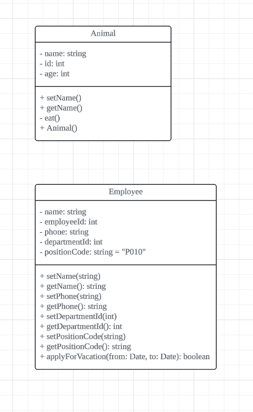

# [2024.09.25(수)] UML

강의 계획

프로젝트 기획/분석/설계(5일)

1. UML(1일)
2. DB 모델링(2일)
    - 난이도 있는 테이블 구성
    - 공통코드
        - 코드 추출
        - 공통코드 테이블 구성
        - 관리자 공통코드 관리 App(spring boot + jpa)
3. Design Pattern
    - 3 가지 추가 학습
4. MM(MatterMost / Slack 기반 협업 (X)

1. 애자일 방법론(5일)
    - 교재 (개념) 1일
    - 애자일 내용 학습 / 실습 1일
    - jira 프로젝트 관리 소프트웨어 (1일)
    - 2일 : 가상 프로젝트 (미니프로젝트2 처음부터 고딩없이 jira로 관리)

1. 협업(깃) (2일)
    - 깃 기본
    - 협업

# UML

- UML 사이트 : https://www.lucidchart.com/pages/?usecase=uml

- UML Class Diagram의 첫 번째 Class 만들기

- UML 클래스 필드 및 메소드 접근 제한자 기호
    - public : +
    - private : -
    - default : ~
    - protected : #

- UML Class 생성 예시
    
    