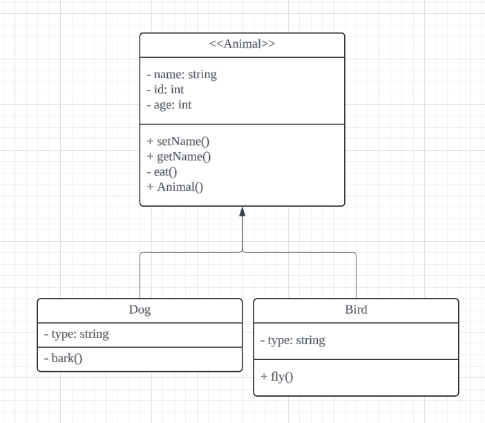
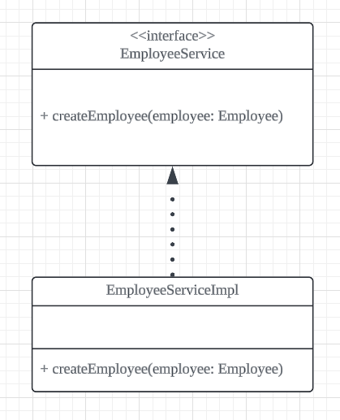
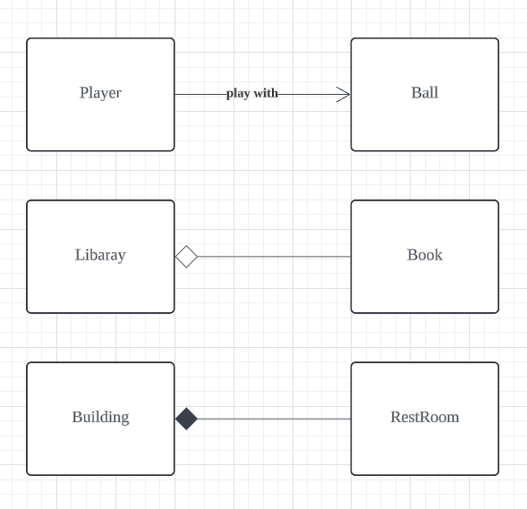
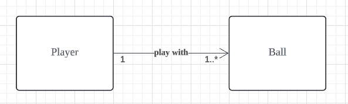
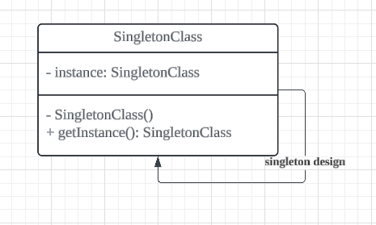
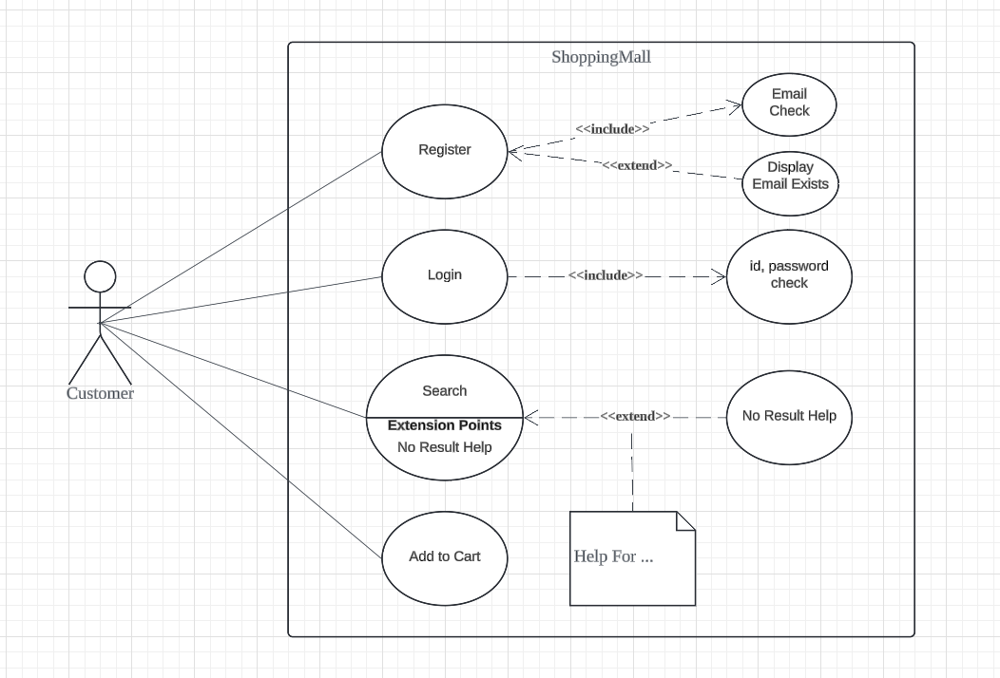
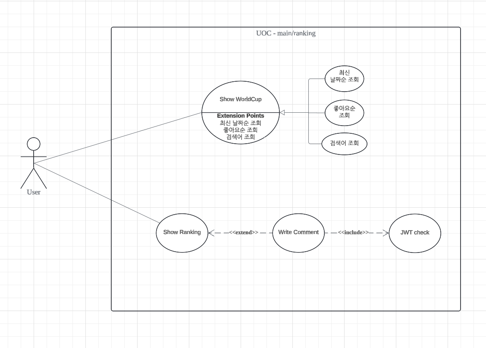
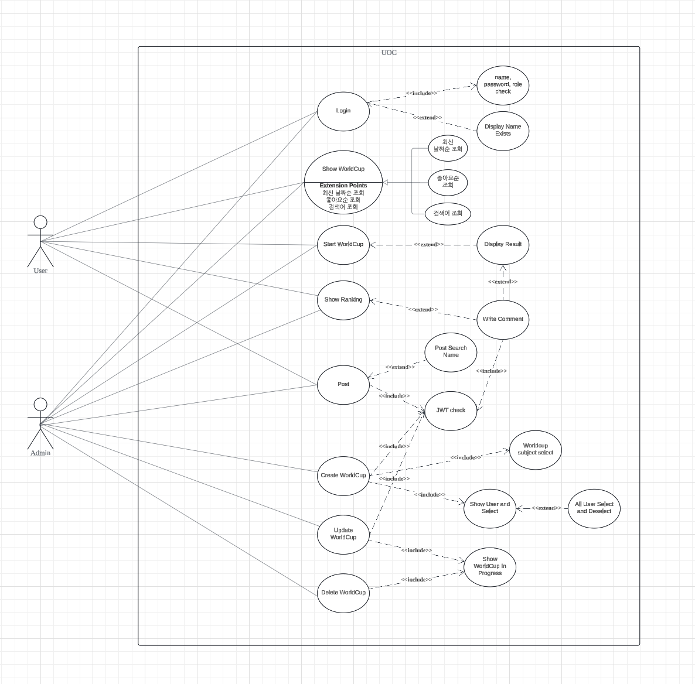
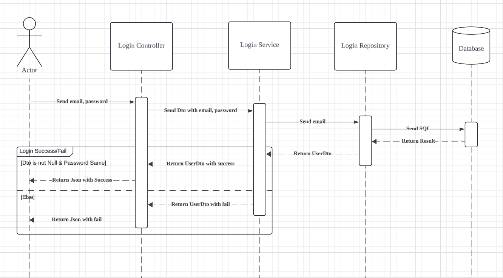
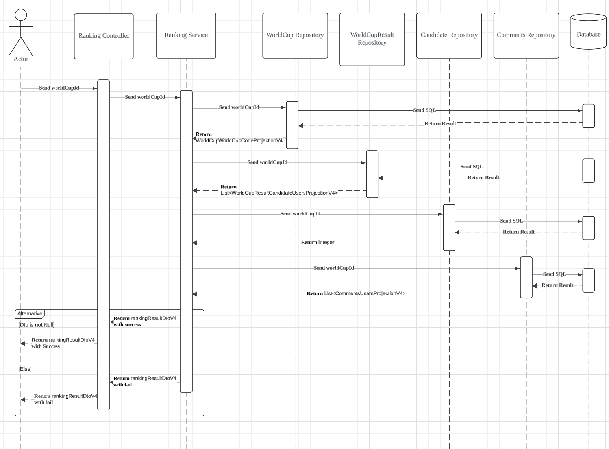

# [2024.09.26(목)] UML/Usecase Diagram/Sequence Diagram

# UML

- UML 사이트 : https://www.lucidchart.com/pages/?usecase=uml

- 상속
    
    
    

- implement
    
    
    

## 객체 지향 설계에서 객체 간의 관계 ('Has-A' 관계)

Association, Aggregation, Composition은 객체지향 설계에서 객체 간의 관계를 나타내는 중요한 개념입니다. 이들은 모두 'Has-A' 관계를 나타내지만, 결합 정도와 객체의 생명 주기에 차이가 있습니다. 하나씩 설명해 보겠습니다.

### 1. **Association (연관관계)**

- **정의**: 두 객체 간에 서로 연관되어 있는 관계를 의미합니다. 이 관계에서는 한 객체가 다른 객체를 참조할 수 있지만, 생명 주기는 서로 독립적입니다.
- **특징**: 두 객체는 서로 별도로 존재하며, 한 객체가 없어져도 다른 객체는 계속 존재할 수 있습니다.
- **예시**: 학생(Student)과 교수(Professor) 관계. 학생과 교수는 서로 연관되어 있지만, 한쪽이 사라져도 다른 쪽은 계속 존재할 수 있습니다.

### 2. **Aggregation (집합관계)**

- **정의**: 전체와 부분의 관계로, 전체 객체가 부분 객체를 포함하지만 부분 객체는 독립적으로 존재할 수 있습니다.
- **특징**: 부분 객체는 전체 객체에 종속적이지 않으며, 전체 객체가 없어져도 부분 객체는 그대로 유지될 수 있습니다.
- **예시**: 자동차(Car)와 바퀴(Wheel) 관계. 자동차가 없어지더라도 바퀴는 다른 자동차에 사용될 수 있습니다. 즉, 전체(자동차)가 없어져도 부분(바퀴)은 독립적으로 존재할 수 있습니다.

### 3. **Composition (합성관계)**

- **정의**: 전체와 부분의 관계로, 전체 객체가 부분 객체의 생명 주기를 관리합니다. 즉, 전체 객체가 없어지면 부분 객체도 함께 사라집니다.
- **특징**: 부분 객체는 전체 객체에 종속적이며, 전체 객체가 없어지면 부분 객체도 같이 제거됩니다.
- **예시**: 집(House)과 방(Room) 관계. 집이 없어지면 방도 더 이상 존재하지 않습니다. 즉, 집이 없어지면 방도 사라집니다.

### 요약:

- **Association**: 두 객체는 독립적으로 존재.
- **Aggregation**: 전체-부분 관계지만 부분 객체는 독립적.
- **Composition**: 전체-부분 관계에서 부분 객체는 전체 객체에 종속됨.

1. **Association (연관관계)**

2. **Aggregation (집합관계)**

3. **Composition (합성관계)**

- multiplicities
    
    
    

- Singleton
    
    
    

# Usecase Diagram

## 조별 활동 (Usecase Diagram)

- use case diagram 조별 활동
    
    1. 미니 프로젝트 2 에서 개인별 파트에서 주요 기능을 1인당 2-3 개 작성하기
    
    
    
    2. 미니 프로젝트 2 에서 공통 또는 부분적인 공통 영역에 대해서 파악하고 관련 내용 작성하기
    
    
    

# Sequence Diagram

## 조별 활동 (Sequence Diagram)

- sequence diagram 조별 활동

1. 미니 프로젝트 2 에서 개인별로 가장 의미있는 (중요한, 어려운...) 기능 1 ~ 2개 작성하기

2. 미니 프로젝트 2 에서 공통 또는 주요 통합적인 기능에 대해서 함께 1 개 작성하기

