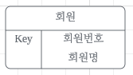
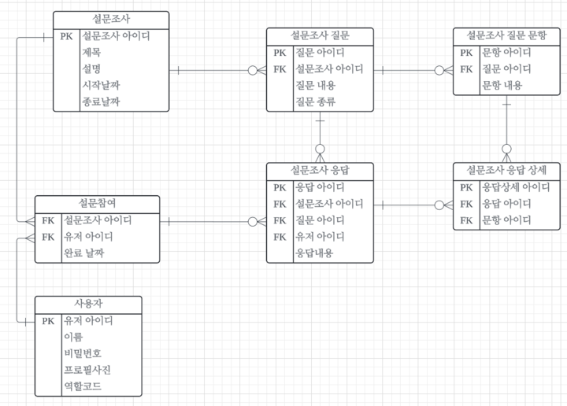
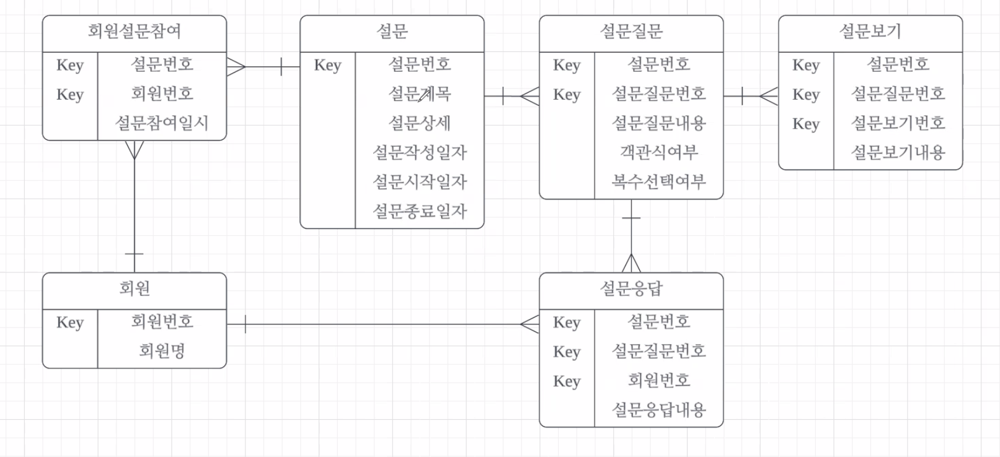
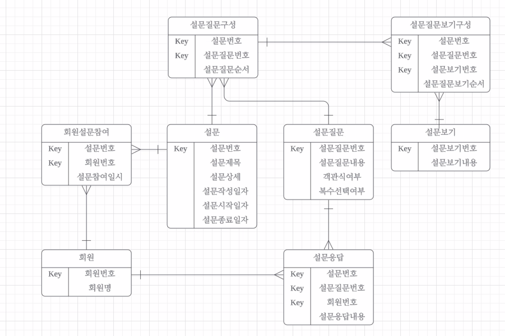
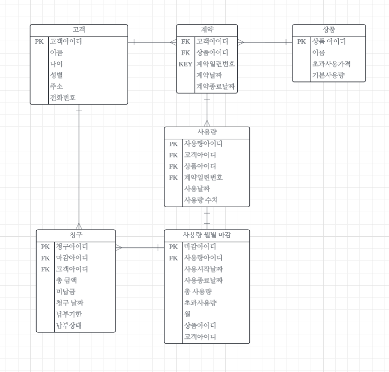
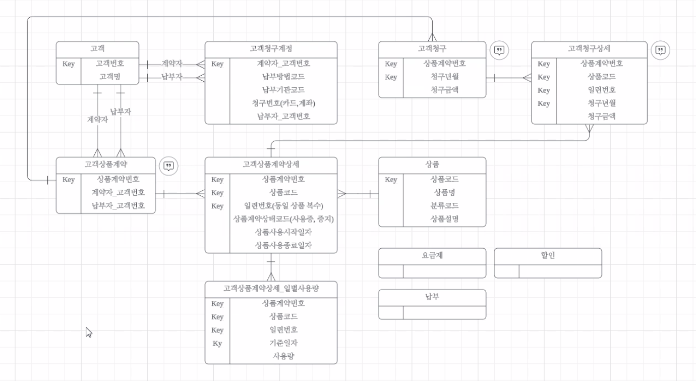

# [2024.09.27(금)] 설문 조사/청구 방법 논리 모델링

# 설문조사 엔티티 추가 방법 조별 활동

- 미니프로젝트2 에 회원이 참여하는  다양한 설문 조사 기능을 추가한다는 가정하에 논리모델링을 진행합니다. 개인별로 우선 만들어보고 조별로 토론을 통해 1개로 정리해서 11시까지 각 조별 채널에 올려주세요!
- 논리모델링 엔티티는 아래 수준으로 작성하세요.
    
    참고로 lucid ER Diagram 모습입니다.
    
    
    

- 조별 활동 결과 ER Diagram

    

# 설문조사 엔티티 추가 방법 (답안)

1. 비슷한 질문 재사용성 문제 (80점)
    
    
    
2. 재사용성을 고려한 엔티티 (일반화된 구성)
    
    
    

# 청구 방법 조별 활동

L 통신사는 고객에게 다양한 상품(서비스)를 제공한다. 고객은 원하는 상품(서비스)에 대한 계약을 하고 L 통신사는 고개이 계약한 상품(서비스)의 사용량에 대해 사용료를 청구한다. 고객은 여러 상품(서비스)를 한 꺼번에 계약할 수 있으며, 동일 상품(서비스)에 대해서도 복수 계약이 가능하다. (인터넷 상품 동시에 2개 가능...) 통신사의 경험을 기초로 고객, 상품(서비스), 계약, 청구에 대한 논리설계를 진행해 보세요.

- 조별 활동 결과 ER Diagram

    

# 청구 방법 (답안)

