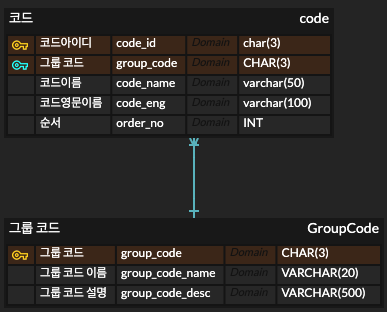
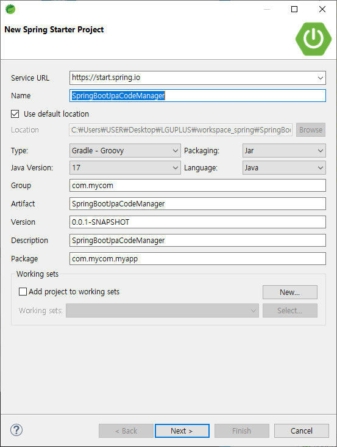
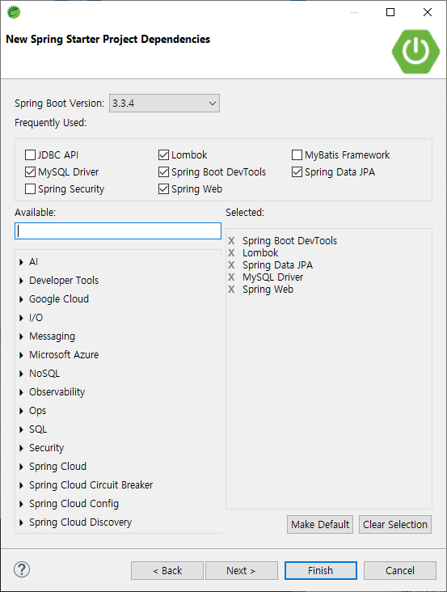
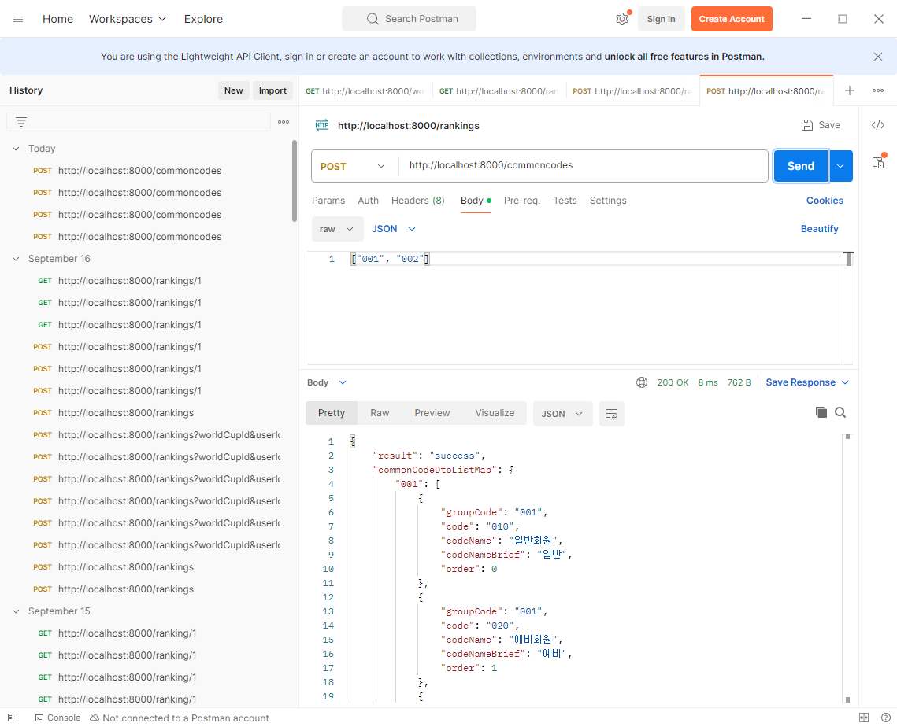
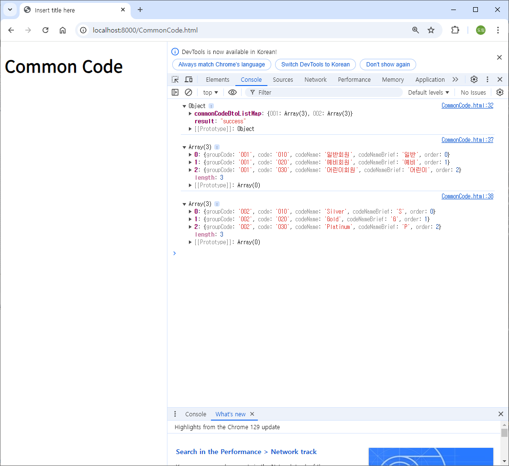

# [2024.09.30(월)] 공통 코드


# 1. 개인별 공통 코드 테이블 조사 및 선택

- https://cskstory.tistory.com/entry/코드-테이블-설계하기
- https://blog.b2en.com/366

## 공통 코드 테이블

공통코드 테이블을 정의하고 만드는 방법은 공통적으로 사용되는 코드를 효율적으로 관리하고 재사용성을 높이기 위한 핵심 설계입니다. 공통코드 테이블의 구조는 두 가지 요소로 나뉘는데, **공통 코드 그룹**(Master)과 **공통 코드 값**(Detail)입니다. 이를 통해 코드 값이 중복되거나 관리가 어려운 상황을 방지할 수 있습니다.

### 1. 공통코드 테이블 정의

### 공통 코드의 역할

- **통일성 유지**: 여러 엔티티나 기능에서 공통적으로 사용할 수 있는 코드를 한 곳에서 관리하여 데이터의 일관성을 보장합니다.
- **유지보수 용이**: 코드 값이 변경되거나 추가될 때 한 곳에서 관리할 수 있어 수정과 유지보수가 쉽습니다.
- **확장성**: 새로운 코드 그룹을 쉽게 추가할 수 있어 확장성이 뛰어납니다.

### 공통 코드 구성

- **공통 코드 그룹 (Master)**: 코드의 그룹을 관리하며, 예를 들어 성별, 국가, 상태 등의 카테고리 역할을 합니다.
- **공통 코드 값 (Detail)**: 그룹 내에 속한 실제 코드 값들을 관리합니다. 예를 들어 성별 그룹에서는 'M'과 'F'와 같은 코드가 있고, 국가 코드 그룹에서는 'KR', 'US' 등의 코드가 있습니다.

### 2. 공통코드 테이블 설계

### 공통코드M 테이블 (Master)

공통 코드 그룹을 관리하는 테이블입니다. 각 코드 그룹에 대한 메타데이터를 저장하여 공통 코드 값을 묶어 관리합니다.

```sql
CREATE TABLE common_code_m (
    code_group_id VARCHAR(50) PRIMARY KEY,     -- 코드 그룹 ID (예: GENDER, COUNTRY 등)
    code_group_name VARCHAR(100) NOT NULL,     -- 코드 그룹 이름 (예: 성별 코드, 국가 코드 등)
    description VARCHAR(255),                  -- 코드 그룹 설명
    use_yn CHAR(1) DEFAULT 'Y',                -- 사용 여부 (Y: 사용, N: 사용 안함)
    created_at TIMESTAMP DEFAULT CURRENT_TIMESTAMP, -- 생성일자
    updated_at TIMESTAMP DEFAULT CURRENT_TIMESTAMP ON UPDATE CURRENT_TIMESTAMP -- 수정일자
);
```

- `code_group_id`: 코드 그룹을 식별하는 **주요 식별자**. 고유해야 하며, 'GENDER', 'COUNTRY'와 같은 값을 가집니다.
- `code_group_name`: 코드 그룹의 이름을 표현합니다.
- `description`: 코드 그룹에 대한 설명을 담습니다.
- `use_yn`: 사용 여부를 나타내며, 비활성화된 그룹도 관리할 수 있습니다.
- `created_at`, `updated_at`: 그룹이 생성되거나 수정된 일자를 기록합니다.

### 공통코드D 테이블 (Detail)

공통 코드 그룹에 속하는 실제 코드 값들을 관리하는 테이블입니다.

```sql
CREATE TABLE common_code_d (
    code_id INT AUTO_INCREMENT PRIMARY KEY,    -- 코드 ID (자동 증가)
    code_group_id VARCHAR(50) NOT NULL,        -- 코드 그룹 ID (FK, common_code_m 참조)
    code_value VARCHAR(50) NOT NULL,           -- 코드 값 (예: M, F 등)
    code_description VARCHAR(100),             -- 코드 값 설명 (예: 남성, 여성 등)
    sort_order INT,                            -- 코드 정렬 순서
    use_yn CHAR(1) DEFAULT 'Y',                -- 사용 여부
    created_at TIMESTAMP DEFAULT CURRENT_TIMESTAMP, -- 생성일자
    updated_at TIMESTAMP DEFAULT CURRENT_TIMESTAMP ON UPDATE CURRENT_TIMESTAMP, -- 수정일자
    CONSTRAINT fk_code_group FOREIGN KEY (code_group_id) REFERENCES common_code_m (code_group_id)
);
```

- `code_id`: 공통 코드 값을 식별하는 **주요 식별자**로, 자동으로 증가합니다.
- `code_group_id`: **공통코드M 테이블**의 `code_group_id`를 참조하는 **외래 키**입니다. 이를 통해 코드 그룹과 코드를 연결합니다.
- `code_value`: 해당 코드 그룹 내에서 실제로 사용할 코드 값입니다.
- `code_description`: 코드 값에 대한 설명입니다.
- `sort_order`: 코드 값의 정렬 순서를 지정하여 UI에서 정렬 기준을 설정할 수 있습니다.
- `use_yn`: 사용 여부를 나타내며, 비활성화된 코드 값도 관리할 수 있습니다.
- `created_at`, `updated_at`: 코드 값이 생성되거나 수정된 일자를 기록합니다.

### 3. 공통코드 테이블 만드는 방법

1. **테이블 생성**
위의 SQL 예시를 사용하여 공통코드M과 공통코드D 테이블을 생성합니다.
2. **데이터 삽입 예시**
공통코드 테이블에 데이터를 삽입하여 코드 그룹과 코드를 정의할 수 있습니다.

```sql
-- 공통코드M 테이블에 코드 그룹 추가
INSERT INTO common_code_m (code_group_id, code_group_name, description)
VALUES
('GENDER', '성별 코드', '남성과 여성 구분을 위한 코드'),
('COUNTRY', '국가 코드', '각 나라를 구분하기 위한 코드');

-- 공통코드D 테이블에 코드 값 추가
INSERT INTO common_code_d (code_group_id, code_value, code_description, sort_order)
VALUES
('GENDER', 'M', '남성', 1),
('GENDER', 'F', '여성', 2),
('COUNTRY', 'KR', '대한민국', 1),
('COUNTRY', 'US', '미국', 2);
```

1. **조회 예시**
공통 코드를 조회할 때는 **JOIN**을 통해 마스터와 디테일 테이블을 함께 조회합니다.

```sql
SELECT
    m.code_group_name, d.code_value, d.code_description
FROM
    common_code_m m
JOIN
    common_code_d d ON m.code_group_id = d.code_group_id
WHERE
    m.code_group_id = 'GENDER';
```

위 SQL은 'GENDER' 코드 그룹에 속한 코드를 조회하여 성별 코드 값과 설명을 출력합니다.

### 4. 장점

- **중앙 집중 관리**: 공통 코드를 하나의 테이블에서 관리하여 수정 시 중앙에서 쉽게 변경 가능.
- **확장성**: 새로운 코드 그룹이나 코드를 쉽게 추가할 수 있어 시스템이 확장될 때 유연하게 대처 가능.
- **재사용성**: 여러 엔티티나 기능에서 동일한 코드를 재사용할 수 있어 데이터 중복을 줄이고 일관성 유지.

이러한 방식으로 공통코드를 관리하면 유지보수와 확장이 용이해집니다. 특히 코드가 자주 변경되는 시스템에서 유용하게 활용할 수 있습니다.

# 2. 개인별 선정한 공통 코드 테이블 중시으로 조별 공통 코드 테이블 도출 (충분한 토론을 진행해 주세요.) 하시고, 도출된 공통코드 테이블 구성(erd 등) 채널에 올려주세요



# 3. 조별 활동

1. 각 조별 공통코드 테이블을 미니프로젝트2 스키마에 생성

2. 함께 공유했던 공통코드관리 Application을 위 1번 테이블에 맞게 수정(새로 작성)==> 관리자가 공통코드를 CRUD 할 수 있다.3. 미니프로젝트2 전체 대상으로 코드성 컬럼 추출(공통코드로 관리해야할 항목들 정리)

4. 2번 생성 공통코드관린 Application 으로 등록5. 미니프로젝트2에서 공통코드를 사용하도록 전체 변경( 10/1 오전까지 )

# StringBootJpaCodeManager

## StringBootJpaCodeManager 프로젝트 생성





## StringBootJpaCodeManager 프로젝트 설정

### basic_modeling DB 생성 및 테이블 생성

```sql
CREATE TABLE `group_code` (
  `group_code` char(3) NOT NULL,
  `group_code_name` varchar(50) NOT NULL,
  `group_code_desc` varchar(500) DEFAULT NULL,
  PRIMARY KEY (`group_code`)
);
CREATE TABLE `code` (
  `group_code` char(3) NOT NULL,
  `code` char(3) NOT NULL,
  `code_name` varchar(50) NOT NULL,
  `code_name_brief` varchar(50) NOT NULL,
  `order_no` int NOT NULL,
  PRIMARY KEY (`group_code`,`code`)
);
```

### build.gradle

```sql
plugins {
	id 'java'
	id 'org.springframework.boot' version '3.3.4'
	id 'io.spring.dependency-management' version '1.1.6'
}

group = 'com.mycom'
version = '0.0.1-SNAPSHOT'

java {
	toolchain {
		languageVersion = JavaLanguageVersion.of(17)
	}
}

configurations {
	compileOnly {
		extendsFrom annotationProcessor
	}
}

repositories {
	mavenCentral()
}

dependencies {
	implementation 'org.springframework.boot:spring-boot-starter-data-jpa'
	implementation 'org.springframework.boot:spring-boot-starter-web'
	compileOnly 'org.projectlombok:lombok'
	developmentOnly 'org.springframework.boot:spring-boot-devtools'
	runtimeOnly 'com.mysql:mysql-connector-j'
	annotationProcessor 'org.projectlombok:lombok'
	testImplementation 'org.springframework.boot:spring-boot-starter-test'
	testRuntimeOnly 'org.junit.platform:junit-platform-launcher'
	
	// https://mvnrepository.com/artifact/org.springdoc/springdoc-openapi-starter-webmvc-ui
implementation group: 'org.springdoc', name: 'springdoc-openapi-starter-webmvc-ui', version: '2.6.0'
}

tasks.named('test') {
	useJUnitPlatform()
}

```

### 소스코드 파일

[src.zip](https://prod-files-secure.s3.us-west-2.amazonaws.com/46a36e11-408c-4785-aa03-6cdba94e986b/7fe32488-b451-42cf-8d24-ab8e907450e8/src.zip)

### application.properties

```sql
spring.application.name=SpringBootJpaCodeManager
spring.datasource.driver-class-name=com.mysql.cj.jdbc.Driver
spring.datasource.url=jdbc:mysql://localhost:3306/basic_modeling
spring.datasource.username=root
spring.datasource.password=root

#spring.jpa.hibernate.ddl-auto=create
#spring.jpa.hibernate.ddl-auto=update
spring.jpa.show-sql=true
#spring.jpa.properties.hibernate.format_sql=true

server.port=8000
```

## StringBootJpaCodeManager 프로젝트 테스트

- http://localhost:8000/swagger-ui/index.html 실행하기

## StringBootJpaCodeManager 프로젝트 코드

### src/main/java/com/mycom/myapp

### dto/CommonCodeResultDto.java

```java
package com.mycom.myapp.dto;

import java.util.List;
import java.util.Map;

import lombok.Data;

// 공통 코드를 사용하는 App
@Data
public class CommonCodeResultDto {
	private String result;
    private Map<String, List<CodeDto>> commonCodeDtoListMap;
	
}
```

### repository/CommonCodeRepository.java

```java
package com.mycom.myapp.repository;

import java.util.List;

import org.springframework.data.jpa.repository.JpaRepository;
import org.springframework.data.jpa.repository.Query;
import org.springframework.data.repository.query.Param;

import com.mycom.myapp.entity.Code;
import com.mycom.myapp.entity.key.CodeKey;

public interface CommonCodeRepository extends JpaRepository<Code, CodeKey> {
	@Query("select c from Code c where c.id.groupCode in :groupCodes order by c.id.groupCode, c.orderNo")
    List<Code> findByGroupCodes(@Param("groupCodes") List<String> groupCodes);
}
```

### service

### CommonCodeService.java

```java
package com.mycom.myapp.service;

import java.util.List;

import com.mycom.myapp.dto.CommonCodeResultDto;

public interface CommonCodeService {
	CommonCodeResultDto getCommonCodeList(List<String> goupCodes);
}
```

### CommonCodeServiceImpl.java

```java
package com.mycom.myapp.service;

import java.util.ArrayList;
import java.util.HashMap;
import java.util.List;
import java.util.Map;

import org.apache.logging.log4j.util.Strings;
import org.springframework.stereotype.Service;

import com.mycom.myapp.dto.CodeDto;
import com.mycom.myapp.dto.CommonCodeResultDto;
import com.mycom.myapp.entity.Code;
import com.mycom.myapp.repository.CommonCodeRepository;

import lombok.RequiredArgsConstructor;

@Service
@RequiredArgsConstructor
public class CommonCodeServiceImpl implements CommonCodeService {

	private final CommonCodeRepository commonCodeRepository;
    
    @Override
    public CommonCodeResultDto getCommonCodeList(List<String> groupCodes) {
        CommonCodeResultDto commonCodeResultDto = new CommonCodeResultDto();
        try {
            List<Code> codeList = commonCodeRepository.findByGroupCodes(groupCodes);
            Map<String, List<CodeDto>> commonCodeListMap = new HashMap<>();           
            String currGroupCode = "";
            List<CodeDto> codeDtoList = null;
            
            for (Code code : codeList) {
                String groupCode = code.getCodeKey().getGroupCode();
                
                if(! currGroupCode.equals(groupCode)) { // 두 그룹코드가 다르면
                    
                    if( Strings.isNotEmpty(currGroupCode) ) { // 최초가 아닌 currGroupCode 가 유효한 상황에서 변경되었다면 
                        commonCodeListMap.put(currGroupCode, codeDtoList);
                    }
                    currGroupCode = groupCode;
                    codeDtoList = new ArrayList<>();
                }
                
                codeDtoList.add(CodeDto.fromCode(code));                    
            }
            
            commonCodeListMap.put(currGroupCode, codeDtoList); // 마지막 currGroupCode
            
            
            commonCodeResultDto.setCommonCodeDtoListMap(commonCodeListMap);
            commonCodeResultDto.setResult("success");
        }catch(Exception e) {
            e.printStackTrace();
            commonCodeResultDto.setResult("fail");
        }
        return commonCodeResultDto;
    }   
	
}
```

### controller

```java
package com.mycom.myapp.controller;

import java.util.List;

import org.springframework.web.bind.annotation.PostMapping;
import org.springframework.web.bind.annotation.RequestBody;
import org.springframework.web.bind.annotation.RestController;

import com.mycom.myapp.dto.CommonCodeResultDto;
import com.mycom.myapp.service.CommonCodeService;

import lombok.RequiredArgsConstructor;

@RestController
@RequiredArgsConstructor
public class CommonCodeController {

	private final CommonCodeService commonCodeService;
    
    @PostMapping("/commoncodes")
    public CommonCodeResultDto getCommonCodeList(@RequestBody List<String> groupCodes) {
        return commonCodeService.getCommonCodeList(groupCodes);
    }
	
}
```

### postman 실행 결과



### src/main/resources/static/CommonCode.html

```java
<!DOCTYPE html>
<html>
<head>
<meta charset="UTF-8">
<title>Insert title here</title>
</head>
<body>
	<h1>Common Code</h1>
	
	<script>
    window.onload = function(){
        getCommonCode();
    }
    
    async function getCommonCode(){
        
        // url
        let url = "/commoncodes";
        
        // post, parameter
        let fetchOptions = {
            method: "POST",
            headers: {
                'Content-Type': 'application/json'
            },
            body:'["001", "002"]'
        }
        
        let response = await fetch(url, fetchOptions);
        let data = await response.json()
        
        console.log(data);
        
        if( data.result == "success" ) {
            let userClsfList = data.commonCodeDtoListMap["001"];
            let userLevelList = data.commonCodeDtoListMap["002"];
            console.log(userClsfList);
            console.log(userLevelList);
        }else if( data.result == "fail" ){
            alert("공통코드 목록을 가져오는 데 실패했습니다.")
        }
        
    }
</script> 
</body>
</html>
```

### 실행 결과

