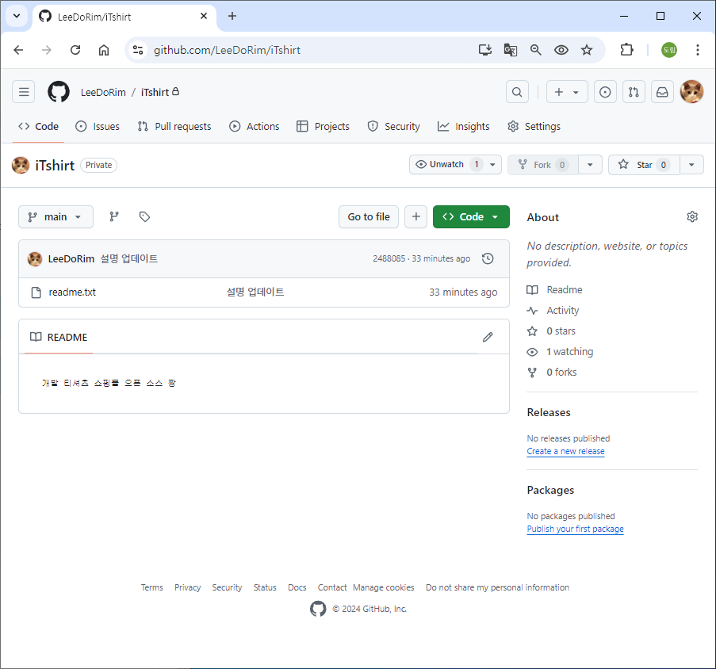

# [2024.10.11(금)] 깃허브 특강


# 실습

```java
Microsoft Windows [Version 10.0.19045.4894]
(c) Microsoft Corporation. All rights reserved.

C:\Users\USER\Desktop\LGUPLUS\workspace_git\iTshirt-cat>git init
Initialized empty Git repository in C:/Users/USER/Desktop/LGUPLUS/workspace_git/iTshirt-cat/.git/

C:\Users\USER\Desktop\LGUPLUS\workspace_git\iTshirt-cat>git status
On branch master

No commits yet

Untracked files:
  (use "git add <file>..." to include in what will be committed)
        readme.txt

nothing added to commit but untracked files present (use "git add" to track)

C:\Users\USER\Desktop\LGUPLUS\workspace_git\iTshirt-cat>git log
fatal: your current branch 'master' does not have any commits yet

C:\Users\USER\Desktop\LGUPLUS\workspace_git\iTshirt-cat>git config -l
diff.astextplain.textconv=astextplain
filter.lfs.clean=git-lfs clean -- %f
filter.lfs.smudge=git-lfs smudge -- %f
filter.lfs.process=git-lfs filter-process
filter.lfs.required=true
http.sslbackend=openssl
http.sslcainfo=C:/Program Files/Git/mingw64/etc/ssl/certs/ca-bundle.crt
core.autocrlf=true
core.fscache=true
core.symlinks=false
pull.rebase=false
credential.helper=manager
credential.https://dev.azure.com.usehttppath=true
init.defaultbranch=master
filter.lfs.smudge=git-lfs smudge -- %f
filter.lfs.process=git-lfs filter-process
filter.lfs.required=true
filter.lfs.clean=git-lfs clean -- %f
user.name=LeeDoRim
user.email=65598286+LeeDoRim@users.noreply.github.com
core.repositoryformatversion=0
core.filemode=false
core.bare=false
core.logallrefupdates=true
core.symlinks=false
core.ignorecase=true

C:\Users\USER\Desktop\LGUPLUS\workspace_git\iTshirt-cat>
```

```java
C:\Users\USER\Desktop\LGUPLUS\workspace_git\iTshirt-cat>git add readme.txt

C:\Users\USER\Desktop\LGUPLUS\workspace_git\iTshirt-cat>git status
On branch master

No commits yet

Changes to be committed:
  (use "git rm --cached <file>..." to unstage)
        new file:   readme.txt

C:\Users\USER\Desktop\LGUPLUS\workspace_git\iTshirt-cat>
```

```java
C:\Users\USER\Desktop\LGUPLUS\workspace_git\iTshirt-cat>git commit -m "사이트 설명 추가"
[master (root-commit) 7f66361] 사이트 설명 추가
 1 file changed, 1 insertion(+)
 create mode 100644 readme.txt

C:\Users\USER\Desktop\LGUPLUS\workspace_git\iTshirt-cat>git status
On branch master
nothing to commit, working tree clean

C:\Users\USER\Desktop\LGUPLUS\workspace_git\iTshirt-cat>
```

```java
C:\Users\USER\Desktop\LGUPLUS\workspace_git\iTshirt-cat>git log
commit 7f663613672598682370c98afed6d9478998ae45 (HEAD -> master)
Author: LeeDoRim <65598286+LeeDoRim@users.noreply.github.com>
Date:   Fri Oct 11 10:36:35 2024 +0900

    사이트 설명 추가

C:\Users\USER\Desktop\LGUPLUS\workspace_git\iTshirt-cat>git status
On branch master
Changes not staged for commit:
  (use "git add <file>..." to update what will be committed)
  (use "git restore <file>..." to discard changes in working directory)
        modified:   readme.txt

no changes added to commit (use "git add" and/or "git commit -a")

C:\Users\USER\Desktop\LGUPLUS\workspace_git\iTshirt-cat>git add readme.txt

C:\Users\USER\Desktop\LGUPLUS\workspace_git\iTshirt-cat>git status
On branch master
Changes to be committed:
  (use "git restore --staged <file>..." to unstage)
        modified:   readme.txt

C:\Users\USER\Desktop\LGUPLUS\workspace_git\iTshirt-cat>git commit -m "설명 업데이트"
[master 2488085] 설명 업데이트
 1 file changed, 1 insertion(+), 1 deletion(-)

C:\Users\USER\Desktop\LGUPLUS\workspace_git\iTshirt-cat>git status
On branch master
nothing to commit, working tree clean

C:\Users\USER\Desktop\LGUPLUS\workspace_git\iTshirt-cat>git log
commit 2488085def185657be16f83be346805504a032c7 (HEAD -> master)
Author: LeeDoRim <65598286+LeeDoRim@users.noreply.github.com>
Date:   Fri Oct 11 10:40:34 2024 +0900

    설명 업데이트

commit 7f663613672598682370c98afed6d9478998ae45
Author: LeeDoRim <65598286+LeeDoRim@users.noreply.github.com>
Date:   Fri Oct 11 10:36:35 2024 +0900

    사이트 설명 추가

C:\Users\USER\Desktop\LGUPLUS\workspace_git\iTshirt-cat>git log --oneline
2488085 (HEAD -> master) 설명 업데이트
7f66361 사이트 설명 추가

C:\Users\USER\Desktop\LGUPLUS\workspace_git\iTshirt-cat>
```

```java
C:\Users\USER\Desktop\LGUPLUS\workspace_git\iTshirt-cat>git checkout 7f66361
Note: switching to '7f66361'.

You are in 'detached HEAD' state. You can look around, make experimental
changes and commit them, and you can discard any commits you make in this
state without impacting any branches by switching back to a branch.

If you want to create a new branch to retain commits you create, you may
do so (now or later) by using -c with the switch command. Example:

  git switch -c <new-branch-name>

Or undo this operation with:

  git switch -

Turn off this advice by setting config variable advice.detachedHead to false

HEAD is now at 7f66361 사이트 설명 추가

C:\Users\USER\Desktop\LGUPLUS\workspace_git\iTshirt-cat>
```

```java
C:\Users\USER\Desktop\LGUPLUS\workspace_git\iTshirt-cat>git switch -
Previous HEAD position was 7f66361 사이트 설명 추가
Switched to branch 'master'

C:\Users\USER\Desktop\LGUPLUS\workspace_git\iTshirt-cat>git status
On branch master
nothing to commit, working tree clean

C:\Users\USER\Desktop\LGUPLUS\workspace_git\iTshirt-cat>
```

```java
C:\Users\USER\Desktop\LGUPLUS\workspace_git\iTshirt-cat>git status
On branch master
nothing to commit, working tree clean

C:\Users\USER\Desktop\LGUPLUS\workspace_git\iTshirt-cat>git remote add origin https://github.com/LeeDoRim/iTshirt.git

C:\Users\USER\Desktop\LGUPLUS\workspace_git\iTshirt-cat>git status
On branch master
nothing to commit, working tree clean

C:\Users\USER\Desktop\LGUPLUS\workspace_git\iTshirt-cat>git branch -M main

C:\Users\USER\Desktop\LGUPLUS\workspace_git\iTshirt-cat>git status
On branch main
nothing to commit, working tree clean

C:\Users\USER\Desktop\LGUPLUS\workspace_git\iTshirt-cat>git push origin main
info: please complete authentication in your browser...
Enumerating objects: 6, done.
Counting objects: 100% (6/6), done.
Delta compression using up to 16 threads
Compressing objects: 100% (2/2), done.
Writing objects: 100% (6/6), 600 bytes | 300.00 KiB/s, done.
Total 6 (delta 0), reused 0 (delta 0), pack-reused 0 (from 0)
To https://github.com/LeeDoRim/iTshirt.git
 * [new branch]      main -> main

C:\Users\USER\Desktop\LGUPLUS\workspace_git\iTshirt-cat>
```



git clone 방법

```java
Microsoft Windows [Version 10.0.19045.4894]
(c) Microsoft Corporation. All rights reserved.

C:\Users\USER\Desktop\LGUPLUS\workspace_git\iTshirt-oct>git clone https://github.com/LeeDoRim/iTshirt.git .
Cloning into '.'...
remote: Enumerating objects: 6, done.
remote: Counting objects: 100% (6/6), done.
remote: Compressing objects: 100% (2/2), done.
remote: Total 6 (delta 0), reused 6 (delta 0), pack-reused 0 (from 0)
Receiving objects: 100% (6/6), done.

C:\Users\USER\Desktop\LGUPLUS\workspace_git\iTshirt-oct>git status
On branch main
Your branch is up to date with 'origin/main'.

nothing to commit, working tree clean

C:\Users\USER\Desktop\LGUPLUS\workspace_git\iTshirt-oct>git log
commit 2488085def185657be16f83be346805504a032c7 (HEAD -> main, origin/main, origin/HEAD)
Author: LeeDoRim <65598286+LeeDoRim@users.noreply.github.com>
Date:   Fri Oct 11 10:40:34 2024 +0900

    설명 업데이트

commit 7f663613672598682370c98afed6d9478998ae45
Author: LeeDoRim <65598286+LeeDoRim@users.noreply.github.com>
Date:   Fri Oct 11 10:36:35 2024 +0900

    사이트 설명 추가

C:\Users\USER\Desktop\LGUPLUS\workspace_git\iTshirt-oct>git status
On branch main
Your branch is up to date with 'origin/main'.

nothing to commit, working tree clean

C:\Users\USER\Desktop\LGUPLUS\workspace_git\iTshirt-oct>git status
On branch main
Your branch is up to date with 'origin/main'.

Changes not staged for commit:
  (use "git add <file>..." to update what will be committed)
  (use "git restore <file>..." to discard changes in working directory)
        modified:   readme.txt

no changes added to commit (use "git add" and/or "git commit -a")

C:\Users\USER\Desktop\LGUPLUS\workspace_git\iTshirt-oct>git add readme.txt

C:\Users\USER\Desktop\LGUPLUS\workspace_git\iTshirt-oct>git status
On branch main
Your branch is up to date with 'origin/main'.

Changes to be committed:
  (use "git restore --staged <file>..." to unstage)
        modified:   readme.txt

C:\Users\USER\Desktop\LGUPLUS\workspace_git\iTshirt-oct>git commit -m "개발자 목록 추가"
[main fd1ae8a] 개발자 목록 추가
 1 file changed, 5 insertions(+), 1 deletion(-)

C:\Users\USER\Desktop\LGUPLUS\workspace_git\iTshirt-oct>git push origin main
Enumerating objects: 5, done.
Counting objects: 100% (5/5), done.
Delta compression using up to 16 threads
Compressing objects: 100% (2/2), done.
Writing objects: 100% (3/3), 379 bytes | 379.00 KiB/s, done.
Total 3 (delta 0), reused 0 (delta 0), pack-reused 0 (from 0)
To https://github.com/LeeDoRim/iTshirt.git
   2488085..fd1ae8a  main -> main

C:\Users\USER\Desktop\LGUPLUS\workspace_git\iTshirt-oct>
```

cat에서 oct가 수정한 내용 내려받기

```java
C:\Users\USER\Desktop\LGUPLUS\workspace_git\iTshirt-cat>git pull origin main
remote: Enumerating objects: 5, done.
remote: Counting objects: 100% (5/5), done.
remote: Compressing objects: 100% (2/2), done.
remote: Total 3 (delta 0), reused 3 (delta 0), pack-reused 0 (from 0)
Unpacking objects: 100% (3/3), 359 bytes | 25.00 KiB/s, done.
From https://github.com/LeeDoRim/iTshirt
 * branch            main       -> FETCH_HEAD
   2488085..fd1ae8a  main       -> origin/main
Updating 2488085..fd1ae8a
Fast-forward
 readme.txt | 6 +++++-
 1 file changed, 5 insertions(+), 1 deletion(-)

C:\Users\USER\Desktop\LGUPLUS\workspace_git\iTshirt-cat>
```