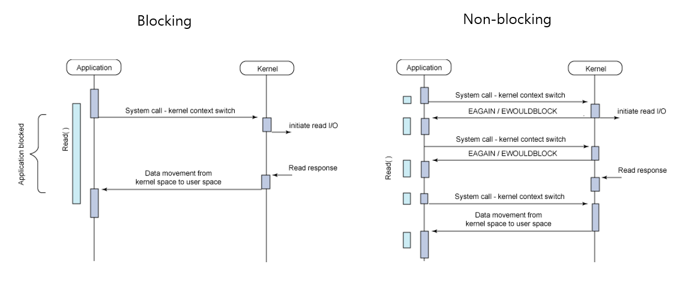

# [24.06.18(화)] ch16 람다식 ~ ch18 데이터 입출력

---

# ch16 람다식

## p.696 ch16.1 람다식이란?

함수형 인터페이스 : 인터페이스가 단하나의 추상 메소드를 가지는 것

## p.700 ch16.2 매개변수가 없는 람다식

- 실행문이 두 개 이상일 경우에는 중괄호를 생략할 수 없고, 하나일 경우에만 생략할 수 있다.

### 매개변수가 없는 람다식 예시1 코드

Workable.java

```java
package ch16.sec02.ex01;

@FunctionalInterface
public interface Workable {
	void work();
}
```

Person.java

```java
package ch16.sec02.ex01;

public class Person {
	public void action(Workable workable) {
		workable.work();
	}
}

```

LambdaExample.java

```java
package ch16.sec02.ex01;

public class LambdaExample {

	public static void main(String[] args) {
		Person person = new Person();
		person.action(() -> {
			System.out.println("출근!");
			System.out.println("코딩!");
		});
		
		person.action(() -> {
			System.out.println("퇴근!");
		});
		
		person.action(() -> System.out.println("퇴근!"));
		
	}

}
```

### 매개변수가 없는 람다식 예시2 코드

Button.java

```java
package ch16.sec02.ex02;

// Button이 클릭되었을 때 실제 수행되는 코드를 가지고 있지 않다.
// 수행되는 코드는 객체가 만들어 지는(사용되는) 시점에 외부에서 받는다.
public class Button {
	
	// Button 내부의 interface <= 이 버튼 안에서만 쓰겠다.
	@FunctionalInterface
	public static interface ClickListener { 
		// 이벤트가 발생하기를 기다렸다가 이벤트 발생 시 처리함.
		void onClick();	// public abstract 생략
	}
	
	// 필드
	private ClickListener clickListener;
	
	// 메소드
	public void setClickListener(ClickListener clickListener) {
		this.clickListener = clickListener;
	}
	
	// 이 버튼이 클릭되면 호출되는 메소드
	// 클릭되었을 때 수행하는 코드는 functional interface의 메소드를 호출
	// <= functional interface 구현체는 외부에서 lambda로 호출
	public void click() {
		this.clickListener.onClick();
	}
}
```

ButtonExample.java

```java
package ch16.sec02.ex02;

public class ButtonExample {

	public static void main(String[] args) {
		Button btnOk = new Button();
		btnOk.setClickListener(() -> System.out.println("OK Button click!"));
		btnOk.click();
		
		Button btnCancel = new Button();
		btnCancel.setClickListener(() -> System.out.println("Cancel Button click!"));
		btnCancel.click();
	}

}
```

## p.703 ch16.3 매개변수가 있는 람다식

### 매개변수가 있는 람다식

- 함수형 인터페이스의 추상 메소드에 매개변수가 있을 경우 람다식 작성한다.
- 매개변수를 선언할 때 타입은 생략할 수 있고, 구체적인 타입 대신에 var를 사용할 수 있다.
- 매개변수가 하나일 경우에는 괄호를 생략 가능하다. 이때는 타입 또는 var를 붙일 수 없다.

### 매개변수가 있는 람다식 예시 코드

Workable.java

```java
package ch16.sec03;

@FunctionalInterface
public interface Workable {
	void work(String name, String job);
}
```

Speakable.java

```java
package ch16.sec03;

@FunctionalInterface
public interface Speakable {
	void speak(String content);
}
```

Person.java

```java
package ch16.sec03;

public class Person {
	
	public void action1(Workable workable) {
		workable.work("홍길동", "프로그래밍");
	}
	
	public void action2(Speakable speakable) {
		speakable.speak("안녕하세요?");
	}
}
```

LambdaExample.java

```java
package ch16.sec03;

public class LambdaExample {

	public static void main(String[] args) {
		Person person = new Person();
		person.action1((name, job) -> {
			System.out.print(name + "이 ");
			System.out.println(job + "을 합니다.");
		});
		
		person.action1((name, job) -> {
			System.out.print(name + "이 ");
			System.out.println(job + "을 하지 않습니다.");
		});
		
		person.action2((content) -> {
			System.out.println(content + "라고 말합니다.");
		});

		person.action2(content -> {
			System.out.println(content + "라고 말하지 않습니다.");
		});
		
	}

}
```

## p.706 ch16.4 리턴값이 있는 람다식

### 리턴값이 있는 람다식

- 함수형 인터페이스의 추상 메소드에 리턴값이 있을 경우 람다식 작성한다.
- return 문 하나만 있을 경우에는 중괄호와 함께 return 키워드를 생략 가능하다.
- 리턴값은 연산식 또는 리턴값이 있는 메소드 호출로 대체 가능하다.

### 리턴값이 있는 람다식 예시 코드

Calculable.java

```java
package ch16.sec04;

@FunctionalInterface
public interface Calculable {
	double calc(double x, double y); // 실제 계산 코드
}
```

Person.java

```java
package ch16.sec04;

public class Person {
	public void action(Calculable calculable) {
		double result = calculable.calc(10, 4);
		System.out.println(result);
	}
}
```

LambdaExample.java

```java
package ch16.sec04;

public class LambdaExample {

	public static void main(String[] args) {
		Person person = new Person();
		
		// 덧셈
		person.action((x, y) -> {
			double result = x + y;
			return result;
		});
		
		// 뺄셈
		person.action((x, y) -> {
			return x - y;
		});
		
		// 곱셈
		person.action((x, y) -> x * y);
		
		// 메소드 이용
		person.action((x, y) -> sum(x, y));
	}
	
	public static double sum(double x, double y) {
		// 복잡한 계산..처리
		return x + y;
	}

}
```

## p.708 ch16.5 메소드 참조

### 메소드 참조

- 메소드를 참조해 매개변수의 정보 및 리턴 타입을 알아내 람다식에서 불필요한 매개변수를 제거한다.

### 정적 메소드와 인스턴스 메소드 참조

- 정적 메소드를 참조 시 클래스 이름 뒤에 :: 기호를 붙이고 정적 메소드 이름을 기술한다.
- 인스턴스 메소드일 경우에는 객체를 생성한 다음 참조 변수 뒤에 :: 기호를 붙이고 인스턴스 메소드 이름을 기술한다.
    
    ```java
    클래스 :: 메소드
    참조변수 :: 메소드
    ```
    
    ### 메소드 참조 예시 코드
    
    Calculable.java
    
    ```java
    package ch16.sec05.ex01;
    
    @FunctionalInterface
    public interface Calculable {
    	double calc(double x, double y);
    }
    ```
    
    Person.java
    
    ```java
    package ch16.sec05.ex01;
    
    public class Person {
    	public void action(Calculable calculable) {
    		double result = calculable.calc(10, 4);
    		System.out.println(result);
    	}
    }
    ```
    
    Computer.java
    
    ```java
    package ch16.sec05.ex01;
    
    public class Computer {
    	public static double staticMethod(double x, double y) {
    		return x + y;
    	}
    	
    	public double instanceMethod(double x, double y) {
    		return x * y;
    	}
    }
    ```
    
    MethodReferenceExample.java
    
    ```java
    package ch16.sec05.ex01;
    
    public class MethodReferenceExample {
    
    	public static void main(String[] args) {
    		Person person = new Person();
    		person.action((x, y) -> {
    			return Computer.staticMethod(x, y);
    		});
    		
    		person.action((x, y) -> Computer.staticMethod(x, y));
    		person.action(Computer :: staticMethod);
    		
    		
    		Computer computer = new Computer();
    		person.action((x, y) -> computer.instanceMethod(x, y));
    		person.action(computer :: instanceMethod);
    	}
    }
    ```
    

---

# ch18 데이터 입출력

## p.782 ch18.1 입출력 스트림

### 입력 스트림과 출력 스트림

- 프로그램을 기준으로 데이터가 들어오면 입력 스트림, 데이터가 나가면 출력 스트림이다.
- 프로그램이 다른 프로그램과 데이터를 교환하려면 양쪽 모두 입력 스트림과 출력 스트림이 필요하다.
- 바이트 스트림 : 그림, 멀티미디어, 문자 등 모든 종류의 데이터를 입출력할 때 사용한다.
- 문자 스트림 : 문자만 입출력할 때 상용한다.
- 자바는 데이터 입출력과 관련된 라이브러리를 java.io 패키지에서 제공한다.
- 바이트 입출력 스트림의 최상위 클래스는 InputStream과 OutputStream이다.
- 문자 입출력 스트림의 최상위 클래스는 Reader와 Writer이다.

## p.783 ch18.2 바이트 출력 스트림

### OutputStream

- OutputStream은 바이트 출력 스트림의 최상위 클래스로 추상 클래스이다.
- 모든 바이트 출력 스트림 클래스는 이 OutputStream 클래스를 상속 받아서 만들어진다.
- OutputStream 클래스에는 모든 바이트 출력 스트림이 기본적으로 가져야할 메소드가 정의된다.

### 1 바이트 출력

- write(int b) 메소드 : 매개값 int(4byte)에서 끝 1byte만 출력한다. 매개변수는 int 타입이다.

### 바이트 배열 출력

- write(byte[] b) 메소드 : 매개값으로 주어진 배열의 모든 바이트를 출력한다.
- 배열의 일부분을 출력하려면 write(byte[] b, int off, int len) 메소드를 사용한다.

### 바이트 출력 예시 코드

WriteExample.java

```java
package ch18.sec02.ex01;

import java.io.FileNotFoundException;
import java.io.FileOutputStream;
import java.io.IOException;
import java.io.OutputStream;

public class WriteExample {

	public static void main(String[] args) {
		try {
			OutputStream os = new FileOutputStream("C:/Temp/test1.db");
			
			byte a = 10;
			byte b = 20;
			byte c = 30;
			
			os.write(a);
			os.write(b);
			os.write(c);
			
			os.flush();
			os.close();
			
		} catch (IOException e) {
			System.out.println(e);
			e.printStackTrace();
		}
	}

}
```

### 바이트 배열 출력 예시 코드

WriteExample.java

```java
package ch18.sec02.ex02;

import java.io.FileNotFoundException;
import java.io.FileOutputStream;
import java.io.IOException;
import java.io.OutputStream;

public class WriteExample {

	public static void main(String[] args) {
		try {
			OutputStream os = new FileOutputStream("C:/Temp/test2.db");
			
			byte[] array = { 40, 50, 60, 70 };
			
			os.write(array);
			
			os.flush();
			os.close();
			
		} catch (IOException e) {
			System.out.println(e);
			e.printStackTrace();
		}
	}

}
```

## p.788 ch18.3 바이트 입력 스트림

### InputStream

- InputStream은 바이트 입력 스트림의 최상위 클래스로, 추상 클래스이다.
- 모든 바이트 입력 스트림은 InputStream 클래스를 상속받아 만들어진다.
- InputStream 클래스에는 바이트 입력 스트림이 기본적으로 가져야 할 메소드가 정의된다.

### 1 바이트 입력

- read() 메소드 : 입력 스트림으로부터 1byte를 읽고 int(4byte) 타입으로 리턴한다. 리턴된 4byte 중 끝 1byte에만 데이터가 들어가 있다.
- 더 이상의 입력 스트림으로부터 바이트를 읽을 수 없다면 read() 메소드는 -1을 리턴한다. 읽을 수 있는 마지막 바이트까지 반복해서 한 바이트씩 읽을 수 있다.

### 바이트 배열로 읽기

- read(byte[] b) 메소드 : 입력 스트림으로부터 주어진 배열의 길이만큼 바이트를 읽고 배열에 저장한 다음 읽은 바이트 수를 리턴한다.
- read(byte[] b)도 입력 스트림으로부터 바이트를 더 이상 읽을 수 없다면 -1을 리턴한다. 읽을 수 있는 마지막 바이트까지 반복해서 읽을 수 있다.

### 바이트 입력 예시 코드

ReadExample.java

```java
package ch18.sec02.ex01;

import java.io.FileInputStream;
import java.io.IOException;
import java.io.InputStream;

public class ReadExample {

	public static void main(String[] args) {
		try {
			InputStream is = new FileInputStream("C:/Temp/test1.db");
			
			// write 할 때 3개 했다는 것을 알고 있는 경우
//			byte a = (byte)is.read();
//			byte b = (byte)is.read();
//			byte c = (byte)is.read();
//			
//			System.out.println(a);
//			System.out.println(b);
//			System.out.println(c);
			
			// 몇 개인지 모르는 경우
			while(true) {
				int data = is.read();
				if( data == -1 ) break;
				System.out.println(data);
			}
			
			is.close();
			
		} catch (IOException e) {
			System.out.println(e);
			e.printStackTrace();
		}
	}
	
}
```

### 바이트 배열 입력 예시 코드

ReadExample.java

```java
package ch18.sec02.ex02;

import java.io.FileInputStream;
import java.io.FileNotFoundException;
import java.io.IOException;
import java.io.InputStream;
import java.util.Iterator;

public class ReadExample {

	public static void main(String[] args) {
		try {
			InputStream is = new FileInputStream("C:/Temp/test2.db");
			
			// 몇 개인지 모르는 경우
			// byte로 배열을 준비 <- stream을 저장
			byte[] data = new byte[100];
			
//			while(true) {
//				int num = is.read(data);
//				if( num == -1 ) break;
//				for (int i = 0; i < num; i++) {
//					System.out.println(data[i]);
//				}
//			}
			
			int num = is.read(data);
			for (int i = 0; i < num; i++) {
				System.out.println(data[i]);
			}
			
			is.close();
			
		} catch (FileNotFoundException e) {
			System.out.println("파일을 찾을 수 없습니다.");
			//e.printStackTrace();
		} catch (IOException e) {
			System.out.println(e);
			e.printStackTrace();
		} 
	}
	
}
```

### 바이트 입출력 예시 코드

FileOutputStreamExample.java

```java
package ch18.sec03.ex03;

import java.io.FileInputStream;
import java.io.FileOutputStream;
import java.io.InputStream;
import java.io.OutputStream;

public class FileOutputStreamExample {

	public static void main(String[] args) throws Exception {
		InputStream is = new FileInputStream("C:/Temp/test_image.jpg");
		OutputStream os = new FileOutputStream("C:/Temp/test_image2.jpg");
		
//		byte[] data = new byte[1024];	// read 해서 담을 자료구조의 크기보다 파일이 클 때 
//		while(true) {
//			int num = is.read(data); 
//			if( num == -1 ) break;
//			os.write(data, 0, num);
//		}
		
		is.transferTo(os);
		
		os.flush();
		os.close();
		is.close();
		
	}
	
}
```

## p.794 ch18.4 문자 입출력 스트림

### 문자 출력

- Writer는 문자 출력 스트림의 최상위 클래스로, 추상 클래스이다.
- 모든 문자 출력 스트림 클래스는 Writer 클래스를 상속받아서 만들어진다.
- Writer 클래스에는 모든 문자 출력 스트림이 기본적으로 가져야 할 메소드가 정의되어 있다.

### 문자 읽기

- reader는 문자 입력 스트림의 최상위 클래스로, 추상 클래스이다.
- 모든 문자 입력 스트림 클래스는 Reader 클래스를 상속받아서 만들어진다.
- Reader 클래스에는 문자 입력 스트림이 기본적으로 가져야 할 메소드가 정의되어 있다.

### 문자 입출력 스트림 예시1 코드

WriterExample.java

```java
package ch18.sec04;

import java.io.FileWriter;
import java.io.Writer;

public class WriterExample {

	public static void main(String[] args) throws Exception {
		// 문자
		Writer writer = new FileWriter("C:/Temp/test.txt");
		
		// ch 한글자
		char a = 'A';
		writer.write(a);
		char b = 'B';
		writer.write(b);
		
		// ch 배열
		char[] array = {'C', 'D', 'E' };
		writer.write(array);
		
		// 문자열
		writer.write("FGH");
		
		writer.flush();
		writer.close();
	}

}
```

### 문자 입출력 스트림 예시2 코드

ReaderExample.java

```java
package ch18.sec04;

import java.io.FileReader;
import java.io.Reader;

public class ReaderExample {

	public static void main(String[] args) throws Exception {
		// 문자
		Reader reader = new FileReader("C:/Temp/test.txt");
		
		// 1문자씩 읽어서 처리하는 방법
		while(true) {
			int data = reader.read();
			if( data == -1 ) break;
			System.out.print((char) data); // 숫자(문자의 정수표현) 대신 문자로 표현하기 위해 casting 
		}

		reader.close();
		
		reader = new FileReader("C:/Temp/test.txt");
		
		// 배열로 처리하는 방법
		char[] data = new char[100];
		int num = reader.read(data);
		
		for (int i = 0; i < num; i++) {
			System.out.print(data[i]);
		}
		
		reader.close();
		
	}

}
```

## p.798 ch18.5 보조 스트림

- 다른 스트림과 연결되어 여러 편리한 기능을 제공해주는 스트림이다.
- 자체적으로 입출력을 수행할 수 없기 때문에 입출력 소스로부터 직접 생성된 입출력 스트림에 연결해서 사용한다.
- 입출력 스트림에 보조 스트림을 연결하려면 보조 스트림을 생성할 때 생성자 매개값으로 입출력 스트림을 제공한다.
    
    ```java
    보조스트림 변수 = new 보조스트림(입출력스트림);
    ```
    
- 보조 스트림은 또 다름 보조 스트림과 연결되어 스트림 체인으로 구성할 수 있다.
    
    ```java
    보조스트림2 변수 = new 보조스트림2(보조스트림1);
    ```
    

## p.799 ch18.6 문자 변환 스트림

### InputStream을 Reader로 변환

- InputStream을 Reader로 변환하려면 InputStreamReader 보조 스트림을 연결한다.

### OutputStream을 Writer로 변환

- OutputStream을 Writer로 변환하려면 OutputStreamWriter 보조 스트림을 연결한다.

### 예시 코드

CharacterConvertStreamExample.java

```java
package ch18.sec06;

import java.io.FileInputStream;
import java.io.FileOutputStream;
import java.io.InputStream;
import java.io.InputStreamReader;
import java.io.OutputStream;
import java.io.OutputStreamWriter;
import java.io.Reader;
import java.io.Writer;

public class CharacterConvertStreamExample {

	public static void main(String[] args) throws Exception {
		write("문자 변환 스트림...");
		
		String data = read();
		System.out.println(data);
	}

	public static void write(String str) throws Exception {
		OutputStream os = new FileOutputStream("C:/Temp/test.txt");	//byte
		Writer writer = new OutputStreamWriter(os, "utf-8");
		writer.write(str);
		writer.flush();
		writer.close();
	}
	
	public static String read() throws Exception {
		InputStream os = new FileInputStream("C:/Temp/test.txt");	//byte
		Reader reader = new InputStreamReader(os, "ms949");
		char[] data = new char[100];
		
		int num = reader.read(data);
		reader.close();
		
		return new String(data, 0, num);
	}
	
}
```

## p.802 ch18.7 성능 향상 스트림

### 메모리 버퍼로 실행 성능을 높이는 보조 스트림

- 프로그램이 중간에 메모리 버퍼(buffer)와 작업해서 실행 성능 향상 가능하다.
- 출력 스트림의 경우 직접 하드 디스크에 데이터를 보내지 않고 메모리 버퍼에 데이터를 보냄으로써 출력 속도를 향상된다. 입력 스트림에서도 버퍼를 사용하면 읽기 성능 향상된다.
- 바이트 스트림에는 BufferedInputStream, BufferedOutputStream이 있고 문자 스트림에는 BufferedReader, BufferedWriter가 있다.

### 성능 향상 스트림 예시 코드

BufferExample.java

```java
package ch18.sec07;

import java.io.BufferedInputStream;
import java.io.BufferedOutputStream;
import java.io.FileInputStream;
import java.io.FileOutputStream;
import java.io.InputStream;
import java.io.OutputStream;

public class BufferExample {

	public static void main(String[] args) throws Exception{
		// copy() 입출력 stream
		InputStream is = new FileInputStream("C:/Temp/test.exe");
		OutputStream os = new FileOutputStream("C:/Temp/test2.exe");
		
		// copy() 입출력 + buffer stream
		InputStream is2 = new FileInputStream("C:/Temp/test.exe");
		OutputStream os2 = new FileOutputStream("C:/Temp/test2.exe");
		BufferedInputStream bis = new BufferedInputStream(is2);
		BufferedOutputStream bos = new BufferedOutputStream(os2);
		
		long nonBufferTime = copy(is, os);
		System.out.println(nonBufferTime);
		
		long bufferTime = copy(bis, bos);
		System.out.println(bufferTime);
		
		is.close();
		os.close();
		
		bis.close();
		bos.close();
		is2.close();
		os2.close();
	}
	
	public static long copy(InputStream is, OutputStream os) throws Exception {
		long start = System.nanoTime();
		// 복사
		while(true) {
			int data = is.read();
			if(data == -1) break;
			os.write(data);
		}
		
		long end = System.nanoTime();
		
		return end - start;
	}

}
```

## p.806 ch18.8 기본 타입 스트림

### 기본 타입 스트림

- 바이트 스트림에 DataInputStream과 DataOutputStream 보조 스트림을 연결하면 기본타입 값을 입출력할 수 있다.
- Package Explorer 수동 refresh 방법 : 프로젝트 → refresh
- Package Explorer 자동 refresh 방법 : [Window] → [preferences] → [General] → [workspace]의 ‘Refresh using native hooks or polling’ 체크

### 기본 타입 스트림 예시1 코드

DataInputOutputExample.java

```java
package ch18.sec08;

import java.io.DataInputStream;
import java.io.DataOutputStream;
import java.io.FileInputStream;
import java.io.FileOutputStream;
import java.io.InputStream;
import java.io.OutputStream;

public class DataInputOutputExample {

	public static void main(String[] args) throws Exception {
		OutputStream os = new FileOutputStream("primitive.db");
		DataOutputStream dos = new DataOutputStream(os);
		
		dos.writeUTF("홍길동");
		dos.writeDouble(99.1);
		int num = 100;
		dos.writeInt(num);
		
		dos.writeUTF("이길동");
		dos.writeDouble(89.0);
		num = 200;
		dos.writeInt(num);
		
		dos.flush();
		dos.close();
		os.close();
		
		InputStream is = new FileInputStream("primitive.db");
		DataInputStream dis = new DataInputStream(is);
		
		for (int i = 0; i < 2; i++) {
			System.out.print(dis.readUTF());
			System.out.print(dis.readDouble());
			System.out.print(dis.readInt());
			System.out.println();
		}
		
		dis.close();
		is.close();
		
	}

}
```

### 기본 타입 스트림 예시2 코드

DataInputOutputExample2.java

```java
package ch18.sec08;

import java.io.DataInputStream;
import java.io.DataOutputStream;
import java.io.FileInputStream;
import java.io.FileOutputStream;
import java.io.InputStream;
import java.io.OutputStream;

public class DataInputOutputExample2 {

	public static void main(String[] args) {
//		OutputStream os = new FileOutputStream("primitive.db");
//		DataOutputStream dos = new DataOutputStream(os);
//		
//		dos.writeUTF("홍길동");
//		dos.writeDouble(99.1);
//		int num = 100;
//		dos.writeInt(num);
//		
//		dos.writeUTF("이길동");
//		dos.writeDouble(89.0);
//		num = 200;
//		dos.writeInt(num);
//		
//		dos.flush();
//		dos.close();
//		os.close();
		
		//InputStream is = null;
		//DataInputStream dis = null;
		
		// try() 안에서 선언, 생성된 resource 객체 (AutoClosable 구현)는 자동으로 close()
		try (
				InputStream is = new FileInputStream("primitive.db");
				DataInputStream dis = new DataInputStream(is);
				
		) {
			for (int i = 0; i < 2; i++) {
				System.out.print(dis.readUTF());
				System.out.print(dis.readDouble());
				System.out.print(dis.readInt());
				System.out.println();
			}
		} catch(Exception e) {
			e.printStackTrace();
		} 
		
	}

}
```

## p.808 ch18.9 프린트 스트림

- PrintStream과 PrintWriter는 프린터와 유사하게 출력하는 print(), println(), printf() 메소드를 가지고 있는 보조 스트림이다.
- PrintStream은 바이트 출력 스트림과 연결되고, PrintWriter는 문자 출력 스트림과 연결된다.

## p.810 ch18.10 객체 스트림

### 직렬화와 역직렬화

- 직렬화 : 메모리에 생성된 객체를 파일 또는 네트워크로 출력하기 위해 필드값을 일렬로 늘어선 바이트로 변경하는 것이다.
- 역직렬화 : 직렬화된 바이트를 객체의 필드값으로 복원하는 것이다.
- ObjectOutputStream은 바이트 출력 스트림과 연결되어 객체를 직렬화하고, ObjectInputStream은 바이트 입력 스트림과 연결되어 객체로 복원하는 역직렬화한다.

### Serializable 인터페이스

- 멤버가 없는 빈 인터페이스이지만, 객체를 직렬화할 수 있다고 표시하는 역할이다.
- 인스턴스 필드값은 직렬화 대상이며, 정적 필드값과 transient 선언된 필드값은 직렬화에서 제외되므로 출력하지 않는다.

### serialVersionUID 필드

- 직렬화할 때 사용된 클래스와 역직렬화할 때 사용된 클래스는 동일한 클래스여야 한다.
- 클래스 내용이 다르더라도 두 클래스가 동일한 serialVersionUID 상수값을 가지면 역직렬화 가능하다.

### 객체 스트림 예시 코드

Member.java

```java
package ch18.sec10;

import java.io.Serializable;

public class Member implements Serializable{
	/**
	 * 
	 */
	private static final long serialVersionUID = 2L;
	
	private String id;
	private String name;
	private transient String ssn;
	
	public Member(String id, String name, String ssn) {
		super();
		this.id = id;
		this.name = name;
		this.ssn = ssn;
	}

	@Override
	public String toString() {
		return "Member [id=" + id + ", name=" + name + ", ssn=" + ssn + "]";
	}

}
```

ObjectOutputInputStreamExample.java

```java
package ch18.sec10;

import java.io.FileInputStream;
import java.io.FileOutputStream;
import java.io.InputStream;
import java.io.ObjectInputStream;
import java.io.ObjectOutputStream;
import java.io.OutputStream;

public class ObjectOutputInputStreamExample {
	
	public static void main(String[] args) throws Exception{
//		OutputStream os = new FileOutputStream("member.data");
//		ObjectOutputStream oos = new ObjectOutputStream(os);
//		
//		// 객체 생성
//		Member m1 = new Member("aaa", "홍길동", "111-222");
//		
//		oos.writeObject(m1);
//		oos.flush();
//		oos.close();
//		oos.close();
		
		InputStream is = new FileInputStream("member.data");
		ObjectInputStream ois = new ObjectInputStream(is);
		
		Member member = (Member) ois.readObject();
		System.out.println(member);
		
		ois.close();
		
	}
	
}
```

---

# Java 17 API

## java.nio 패키지

- java.nio 패키지 API url : https://docs.oracle.com/en/java/javase/17/docs/api/java.base/java/nio/package-summary.html
- java.io 패키지는 변경이 어려워 업데이트가 안되고 있다. io 새로운 기능은 nio에 업데이트된다.

---

# 소모임 활동

## 1. Lambda 정리

## 2. concurrent과 parallel 비교

### 동시성(concurrency)과 병렬성(parallelism)

- 동시성은 여러 작업이 겹치는 기간에 실행될 수 있음을 의미한다. 동시에 실행되는 것이 아닌, 적절한 context switching을 통해 동시에 실행되는 것처럼 보인다.
- 병렬성은 동일한 시간에 독립적인 작업을 실행할 수 있는 것으로, 여러 작업을 다른 코어 및 다른 프로세스, 별도의 컴퓨터 등에서 동시에 실행할 수 있다. (병렬 처리가 성능 향상에 필수적이다.)
    
    
    

참고 : https://velog.io/@leesomyoung/동시성concurrency-병렬성parallelism

## 3. blocking, non-blocking 비교

- 차이점 : 호출된 함수가 호출한 함수에게 제어권을 바로 돌려주는지 여부

### blocking

- 작업을 시작한 후 해당 작업이 종료될 때까지 아무런 작업을 수행하지 않는다.

### non-blocking

- 작업을 시작한 후 다른 작업이 종료될 때까지 기다리지 않고 다른 작업을 계속 수행할 수 있다.



참고 : https://velog.io/@akfls221/동기비동기-NonBlocking-Blocking과-웹-서버의-관계

https://code-boki.tistory.com/49

https://inpa.tistory.com/entry/👩‍💻-동기비동기-블로킹논블로킹-개념-정리#동기/비동기_+_블로킹/논블로킹_조합

## 4. sync, async 비교

- 차이점 : 작업의 순차(작업이 완료되고 요청되는 순서)

### Sync

- Sync(동기)의 경우 작업이 순차적으로 진행되어 순서가 보장된다.

### Async

- Async(비동기)는 작업의 순서가 보장되지 않는다. 각 작업들을 독립적으로 실행이 가능하다.
<br>

