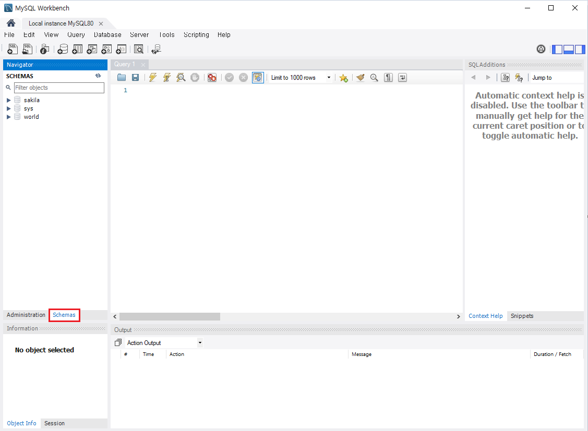
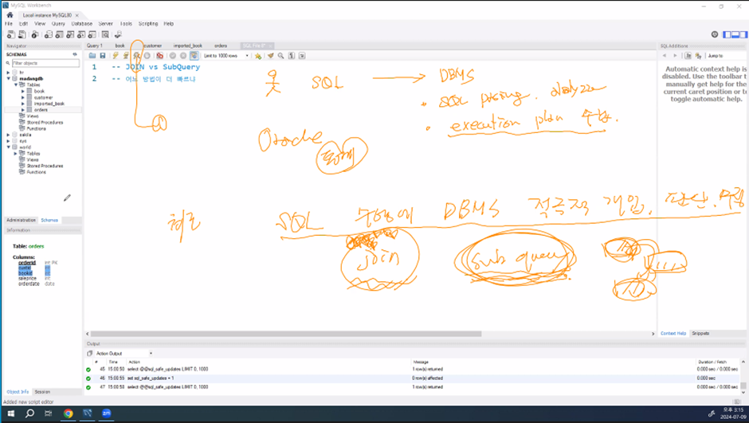

# [2024.07.09(화)] 데이터베이스 - MySQL Workbench 사용 방법/SELECT/FROM/WHERE 조건/ORDER BY/GROUP BY/집계 함수/JOIN vs SubQuery


# DBMS

- DB(Data Base) : data의 저장소
- Data Base Management System

- DBMS의 역할
    1. DB(schema) 관리
    2. Service
        
        Client의 접속, 사용, 동시 처리
        
    3. 계정 등 권한, 운영
        
        보통 DBA 역할로 각 역할에 맞는 권한을 가진 계정을 만들어 부여
        
    
- Programing language와 DBMS의 관계
    - 90년대 이전에는 따로 존재  DB에 접속하기 위해서는 file system 사용한다.
    - 90년대 이후 DBMS 사용이 활발해졌다. JAVA는 JDBC 사용한다.

# MySQL 설치

- ‘MySQL로 배우는 데이터베이스 개론과 실습’ 교재 부록 실습 소프트웨어 설치 다운로드 : https://m.hanbit.co.kr/store/books/book_view.html?p_code=B7813024732
- MySQL 다운로드 URL : https://dev.mysql.com/downloads/windows/installer/8.0.html

- 부록 실습 소프트웨어 설치 파일 위치 : C:\Users\USER\Desktop\LGUPLUS\appendix
- 실습 소프트웨어 설치 p.3 ~ p.14까지 똑같이 따라서 설치 후 ‘MySQLWorkbench 8.0 CE‘ 실행

# MySQL 서비스 작동 안될 때 확인 방법

- MySQL 실행중이면 서비스에 ‘MySQL80’이 떠있어야 한다.
- 실행이 안되면 ‘MySQL80’ 다시 시작하고, 다시 시작해도 안되면 재설치 해야 한다.


# MySQL Workbench 사용 방법

## MySQL Workbench DB 생성 완료 후 기본 셋팅

- Schemas 선택하면 기본 스키마가 3개가 있다.



## MySQL Workbench Schema 생성 및 삭제

### Schema 생성

- create Schema → name 작성 → Apply


- Apply → finish


### Schema 삭제

- Schemas에서 Drop할 데이터베이스 우클릭 → Drop Schema


## 실습에 사용할 Schema 생성 (madangdb, hr)

[demo_madang.sql](https://prod-files-secure.s3.us-west-2.amazonaws.com/46a36e11-408c-4785-aa03-6cdba94e986b/528c7a05-a357-415b-9287-6437d7930239/demo_madang.sql)

[demo_madang_init.sql](https://prod-files-secure.s3.us-west-2.amazonaws.com/46a36e11-408c-4785-aa03-6cdba94e986b/f5cb987f-d906-46fb-9e5b-8525a91bf1ae/demo_madang_init.sql)

[demo_hr.sql](https://prod-files-secure.s3.us-west-2.amazonaws.com/46a36e11-408c-4785-aa03-6cdba94e986b/48293fe5-991d-4084-9bc0-87d45a138b43/demo_hr.sql)

- demo_madang.sql 파일 드래그하여 MySQL Workbench에서 열기 → 전체 라인 선택 후 Excute(번개 모양)하여 Schema 생성 확인
- demo_madang_init.sql 파일 Excute
    
    demo_madang_init.sql 파일은 실습 중 오류 시 madangdb 초기화 파일
    
- demo_hr.sql 파일 Excute하여 Schema 생성 확인


## 사용할 Schema 선택 방법

### MySQLWorkbench GUI

- Schemas에서 [스키마명] 더블클릭으로 선택
- Schemas에서 [스키마명] 우클릭 → Set as Default Schema

### 쿼리

- use [스키마명];
    
    (한 줄 실행 방법 - ctrl + enter : 현재 커서가 있는 한 줄만 실행)
    

## 테이블 구조 및 데이터 확인 방법

### 테이블 구조 확인 방법

1. MySQLWorkbench GUI
    - Schemas에서 [테이블명] 우클릭 → ‘Select Rows - Limit 1000’ 선택
        
        (Limit 제한 갯수 변경 가능)
        
        .png)
        
2. 쿼리
    - desc [테이블명];
        
        .png)
        

## 데이터베이스 개발 시 중점

1. 정확한 결과
2. 속도

## MySQL Workbench 데이터베이스 세션

- MySQL Workbench를 새로 열어 같은 데이터베이스 접속하면 가장 위에 새로운 창으로 세션이 하나 더 생긴다.
- 기존의 세션과는 완전히 다른 독립된 세션이다.
    
    .png)
    

## MySQL Workbench ‘Auto-Commit’ 설정 확인 방법

- MySQL Workbench 최상단 메뉴 ‘Query’ → ‘Auto-Commit Transactions’ 항상 체크되어 있도록 설정

---

# Chapter03 SQL 기초

## p.133 ch03.01 SQL 학습을 위한 준비

- p.136 Orders 테이블의 [그림 3-3] 중요 (참조키는 추후 학습 예정)

## p.144 ch03.02 SQL 개요

- SQL은 기능에 따라 데이터 정의어(DDL, Data Definition Language), 데이터 조작어(DML, Data Manipulation Language), 데이터 제어어(DCL, Data control Language)로 나뉜다.
- 데이터 정의어(DDL) : 테이블이나 관계의 구조를 생성하는 데 사용하며 CREATE, ALTER, DROP 문 등이 있다.
- 데이터 조작어(DML) : 테이블에 데이터를 검색, 삽입, 수정, 삭제하는 데 사용하며 SELECT, INSERT, DELETE, UPDATE 문 등이 있다. SELECT 문은 특별히 질의어(query)라고 한다.
- 데이터 제의어(DCL) : 데이터의 사용 권한을 관리하는 데 사용하며 GRANT, REVOKE 문 등이 있다.

```sql
-- select * 	-- 모든 컬럼
select name, address -- 구분한 컬럼명
  from customer 	-- 어떤 테이블
 where name = '김연아';	-- 어떤 조건
```

## p.148 ch03.03 데이터 조작어 - 검색

### p.149 SELECT 문

### p.149 SELECT/FROM

- 대소문자 구분하지 않는다.

```sql
-- select 문법
/*
select [*, distinct, 컬럼명, 컬럼명]
from 
[where and]
[group by]
[having]
[order by]
*/
```

### 질의 3-1. 모든 도서의 이름과 가격을 검색하시오.

```sql
-- 질의 3-1
select bookname, price
  from book;
```

### 질의 3-2. 모든 도서의 도서번호, 도서이름, 출판사, 가격을 검색하시오.

```sql
-- 질의 3-2
-- select bookid, bookname, publisher, price
select *
  from book;

-- from 앞에 2칸 띄우는 이유 : select(윗 줄)과 조건 라인을 맞추기 위해 띄운다.
```

### 질의 3-3. 도서 테이블에 있는 모든 출판사를 검색하시오.

```sql
-- 질의 3-3
-- select publisher
select distinct publisher -- 중복 제거
  from book;
```

### p.152 WHERE 조건

```sql
-- where bookname like '축구의 역사' <= where bookname = '축구의 역사' [%] 사용
-- null <- 해당 컬럼에 값이 없는 != ''
-- check null <= is null or is not null 사용 ( = null X)
-- 조건이 1개이면 where만 사용, 조건이 2개 이상이면 and, or 사용 가능
-- 부정 not
```

### 질의 3-4. 가격이 20,000원 미만인 도서를 검색하시오.

```sql
-- 질의 3-4
select * 
  from book
where price < 20000;
```

### 질의 3-5. 가격이 10,000원 이상 20,000원 이하인 도서를 검색하시오.

```sql
-- 질의 3-5
select *
  from book
-- where price >= 10000 and price <= 20000;
where price between 10000 and 20000; -- 10000, 20000 포함
```

### 질의 3-6. 출판사가 ‘굿스포츠’ 혹은 ‘대한미디어’인 도서를 검색하시오.

```sql
-- 질의 3-6
select *
  from book
-- where publisher = '굿스포츠' or publisher = '대한미디어';
where publisher in ('굿스포츠', '대한미디어'); -- subquery 사용 가능

-- 출판사가 '굿스포츠', '대한미디어'가 아닌 도서 조회 (부정)
select *
  from book
-- where publisher != '굿스포츠' and publisher != '대한미디어'; -- or 사용하면 모든 값가 조회된다.
where publisher not in ('굿스포츠', '대한미디어'); -- subquery 사용 가능
```

### 질의 3-7. ‘축구의 역사’를 출간한 출판사를 검색하시오.

### 질의 3-8. 도서 이름에 ‘축구’가 포함된 출판사를 검색하시오.

```sql
-- 질의 3-7 3-8
select *
  from book 
where bookname like '축구%';

select *
  from book 
where bookname like '%이야기';

select *
  from book 
where bookname like '%의%';

select * 
  from customer
where name like '%연%';
```

### 질의 3-9. 도서이름의 왼쪽 두 번째 위치에 ‘구’라는 문자열을 갖는 도서를 검색하시오.

```sql
-- 질의 3-9
select * 
  from book
where bookname like '_구%';
-- where bookname like '__의%';
```

### 질의 3-10. 축구에 관한 도서 중 가격이 20,000원 이상인 도서를 검색하시오.

```sql
-- 질의 3-10
select * 
  from book
where bookname like '%축구%' and price >= 20000;
```

### 질의 3-11. 출판사가 ‘굿스포츠’ 혹은 ‘대한미디어’인 도서를 검색하시오.

```sql
-- 질의 3-11
select *
  from book
-- where publisher = '굿스포츠' or publisher = '대한미디어';
where publisher in ('굿스포츠', '대한미디어');
```

### p.158 ORDER BY

- 기본적으로 키값이 먼저 생성되는 순으로 정렬되어 나온다.
- order by는 select가 확정된 후 처리된다.

### 질의 3-12. 도서를 이름순으로 검색하시오.

```sql
-- 질의 3-12
select *
  from book
order by bookname; -- defalut : asc
-- order by bookname desc;
-- order by price desc;
```

### 질의 3-13. 도서를 가격순으로 검색하고, 가격이 같으면 이름순으로 검색하시오.

### 질의 3-14. 도서를 가격의 내림차순으로 검색하시오. 가격이 같다면 출판사를 오름차순으로 출력하시오.

```sql
-- 질의 3-13 3-14
select *
  from book
order by price, bookname;
-- order by price desc, bookname desc;
-- order by price desc, publisher;

select * 
  from book
where price >= 10000
order by price desc, bookname desc;
```

### 조별 활동

- 조별 활동 : 다양한 select 문제를 제시하고 다른 조원이 풀어 보고 확인.
- join 방법 : https://blog.naver.com/PostView.nhn?blogId=regenesis90&logNo=222190687396

```sql
-- customer를 이름의 내림차순으로 출력하세요. 
select * 
  from customer
order by name desc;

-- '야구'와 '배구'가 적혀있는 'bookname'을 높은 가격순으로 정렬
select * 
from book
where bookname like '%야구%' or bookname like '%배구%'
order by price;

-- customer를 주소의 내림차순으로 검색하세요
select * 
  from customer
order by address desc;

-- 전화번호에 7000이 들어간 고객이 주문한 도서 주문 내역을 높은 가격순으로 검색하고, 
-- 가격이 같으면 주문 일자순으로 검색하시오.
select o.orderid, o.custid, o.bookid, o.saleprice, o.orderdate
  from customer c join orders o on c.custid = o.custid 
		   join book b on b.bookid = o.bookid
where  c.phone like '%7000%' 
order by saleprice desc, orderdate;

-- 서브 쿼리 해결 방법
select *
from orders
where custid = (
	select custid
	from customer
	where phone like '%7000%'
	)
order by saleprice desc, orderdate asc;
```

### p.159 집계 함수와  GROUP BY

### p.159 집계 함수

- 5 가지 기본 함수 sum(), avg(), count(), max(), min()
- 조건의 전체 또는 group by 로 묶어서 처리

### 질의 3-15 고객이 주문한 도서의 총판매액을 구하시오.

```sql
-- 질의 3-15
select sum(saleprice) as 총매출
  from orders;
  
-- alias, as
select orderid as orderId, custid 'cust Id', bookid bookId, 
	   saleprice salePrice, orderdate orderDate
  from orders;
```

### 질의 3-16 2번 김연아 고객이 주문한 도서의 총판매액을 구하시오.

```sql
-- 질의 3-16
select sum(saleprice) as 총매출
  from orders
where custid = 2;
```

### 질의 3-17 고객이 주문한 도서의 총판매액, 평균값, 최저가, 최고가를 구하시오.

```sql
-- 질의 3-17
select sum(saleprice) as total,
		    avg(saleprice) as average,
        min(saleprice) as min,
        max(saleprice) as max
  from orders;
```

### 질의 3-18 마당서점의 도서 판매 건수를 구하시오.

```sql
-- 질의 3-18
select count(*) as totalCnt
  from orders;

select count(*) as yunaCnt
  from orders
where custid = 2;
```

### p.162 GROUP BY

### 질의 3-19. 고객별로 주문한 도서의 총수량과 총판매액을 구하시오.

```sql
-- 질의 3-19
-- group by : 전체 row를 쪼갠다. 어떻게? group by 뒤에 오는 조건으로

-- select count(*) -- 10 건을 custid로 쪼개서 각각 count(*)
-- select custid, bookid, count(*) -- group by 절에 사용하지 않은 컬럼은 select 사용 불가 (bookid)
select custid, count(*) as 도서수량, sum(saleprice) as 총액
  from orders
group by custid;

-- 연습
select publisher as 출판사, count(*) as 도서수
  from book
group by publisher;
```

### 질의 3-20. 가격이 8,000원 이상인 도서를 구매한 고객에 대하여 고객별 주문 도서의 총수량을 구하시오. 단, 2권 이상 구매한 고객에 대해서만 구하시오.

```sql
-- 질의 3-20
select custid, count(*)	 -- group by 절의 select 항목을 추가로 조건 처리
  from orders
where custid in (1, 2)
group by custid;
-- having custid in (1, 2); 
-- 이미 알고 있는 것은 group by 연산까지 처리 후 필터링 하지 말고 where절에서 미리 처리한다.

select custid, count(*)	 -- group by 절의 select 항목을 추가로 조건 처리
  from orders
group by custid
having count(*) > 2;
```

### p.164 GROUP BY 절이 포함된 SQL 문의 실행 순서

`WHERE` 절에서 필터링하는 것이 더 효율적인 이유는 데이터의 양을 줄인 상태에서 그룹화 작업을 수행하기 때문이다. 이를 통해 불필요한 데이터 처리 및 메모리 사용을 줄일 수 있다. 아래는 `WHERE` 절과 `HAVING` 절 각각의 역할에 대한 설명이다.

WHERE 절

- **용도**: `WHERE` 절은 그룹화되기 전에 데이터 행을 필터링합니다.
- **효율성**: `WHERE` 절을 사용하면 데이터베이스가 더 적은 데이터로 그룹화 및 집계 작업을 수행하므로 성능이 향상됩니다.
- **적용 범위**: 그룹화 이전의 필터링에 사용됩니다.

HAVING 절

- **용도**: `HAVING` 절은 그룹화된 결과에 대해 필터링을 수행합니다.
- **효율성**: `HAVING` 절을 사용하면, 이미 그룹화된 데이터에 대해 추가 필터링을 수행하므로, 필요한 경우에만 사용해야 합니다.
- **적용 범위**: 집계 함수나 그룹화된 결과에 대한 조건을 지정할 때 사용됩니다.

요약 : 그룹화 전에 필터링할 수 있는 조건은 가능하면 `WHERE` 절을 사용하여 효율성을 높이는 것이 좋다. 필터링된 데이터에 대해서만 그룹화 및 집계 작업을 수행하므로 더 적은 데이터 처리로 인해 성능이 향상되기 때문이다.

### P.165 두 개 이상의 테이블을 이용한 SQL 질의

### JOIN vs SubQuery

- 질문 : 어느 방법이 더 빠른가?

https://velog.io/@hanry19/subqeury-와-join-on의-차이를-느끼다.-조회-속도도-빨라지네

SQL은 DBMS에서 SQL plaing analytics 후 execution plan을 수행한다. (SQL 최적화)

최근에는 SQL 수행에 DBMS가 적극적으로 개입, 판단, 수정한다. 이 작업을 join은 수행 가능하지만 SubQuery로 작성 시 불가능하다.



### DBMS Optimizer

- 참고 : https://luvris2.tistory.com/762
    
    https://coding-factory.tistory.com/743
    
- **SQL 최적화**
    
    DBMS 내부에서 프로시저를 작성하고 컴파일해서 실행 가능한 상태로 만드는 전 과정을 의미한다. (SQL 옵티마이저를 통해 DBMS 내부 엔진에서 프로시저를 만든다.)
    
- **SQL 최적화 과정**
    1. SQL 파싱 : 사용자로부터 전달받은 SQL을 Parser가 파싱을 진행한다.
        
        파싱 트리 생성 : SQL 문을 이루는 개별 구성 요소를 분석해서 파싱 트리 생성
        
        문법(Syntax) 확인 : 사용할 수 없는 키워드를 사용하는 등의 문법적 오류 확인
        
        의미(Sementic) 확인 : 존재하지 않는 테이블 사용 등의 의미상 오류 확인
        
    2. SQL 최적화 : Optimizer를 통해 SQL 최적화 진행한다.
        
        미리 수집한 시스템 및 오브젝트 통계 정보를 바탕으로 다양한 실행 경로를 생성한다. 생성된 다양한 실행 경로를 비교한 후 가장 효율적인 하나를 선택한다.
        
    3. 로우 소스 생성 : SQL Optimizer가 선택한 실행경로를 실제 실행 가능한 코드 또는 프로시저 형태로 포맷팅한다.
- **SQL 최적화 정리**
    - DBMS는 옵티마이저가 결정한 실행 방법대로 실행 엔진이 데이터를 처리하여 결과 데이터를 사용자에게 전달한다. 현재 대부분 DBMS는 비용기반 옵티마이저만 제공하며, 하위 버전 호환성을 위해 규칙기반 옵티마이저가 남아있다.
    
- **Oprimizer**
    - 옵티마이저는 가장 효율적인 방법으로 SQL을 수행할 최적의 처리 경로를 생성해주는 DBMS의 핵심 엔진이다. 개발자가 작성한 SQL에 대해 실행 계획을 수립 후 실행하며, 실행 결과는 동일하더라도 실행 계획에 따라 성능이 달라질 수 있다.
- **Oprimizer 처리 과정**
    
    .png)
    
    1. **Parser :** SQL문장을 분석하여 문법 검사와 구성요소를 파악하고 이를 파싱 해서 파싱 트리를 만듭니다.
    2. **Query Transformer :** 파싱된 SQL을 보고 같은 결과를 도출하되, 좀 더 나은 실행 계획을 갖는 SQL로 변환이 가능한지를 판단하여 변환 작업을 수행합니다.
    3. **Estimator :** 시스템 통계정보를 딕셔너리로부터 수집하여 SQL을 실행할 때 소요되는 총비용을 계산합니다.
    4. **Plan Generator :** Estimator를 통해 계산된 값들을 토대로 후보군이 되는 실행계획을 도출합니다.
    5. **Row-Source Generator :** 옵티마이저가 생성한 실행계획을 SQL 엔진이 실제 실행할 수 있는 코드나 프로시저 형태로 포맷팅 합니다.
    6. **SQL Engine :** SQL을 실행합니다.
- **Oprimizer 종류**
    
    
    | 항목 | 규칙 기반 옵티마이저 | 비용 기반 옵티마이저 |
    | --- | --- | --- |
    | 개념 | 사전에 정의된 규칙 기반 | 최소 비용 계산 실행 계획 수립 |
    | 기준 | 실행 우선 순위 | 액세스 비용 |
    | 인덱스 | 인덱스 존재 시 가장 우선 시 사용 | Cost에 의한 결정 |
    | 성능 | 사용자의 SQL작성 숙련도 | 옵티마이저 예측 성능 |
    | 장점 | 판단이 매우 규칙적이며, 실행 예상이 가능 | 통계 정보를 통한 현실 요소 적용 가능 |
    | 단점 | 예측 통계 정보 요소 무시 | 최소 성능 보장 계획의 예측 제어 어려움 |
- **규칙 기반 Oprimizer (RBO, Rule Based Optimizer)**
    - 참조하는 정보를 이용하여 규칙(우선 순위)를 가지고 실행계획을 생성하는 최적화 방식이다.
    - 실행 계획을 생성하기 위한 참조 정보
        
        이용 가능한 인덱스 유무와 종류
        
        SQL문에서 사용하는 연산자의 종류
        
        SQL문에서 참조하는 객체의 종류
        
    - 우선 순위가 높은 규칙일수록 적은 일량으로 해당 작업을 수행하는 방법이라고 판단한다.
- **비용 기반 Oprimizer (CBO, Cost Based Optimizer)**
    - SQL 문을 처리하는데 필요한 비용(처리 소요시간, 자원 사용량)이 가장 적은 실행계획을 선택하는 옵티마이저이다.
    - 비용을 예측하기 위해 다양한 객체 통계 정보와 시스템 통계 정보 등을 이용한다. (다양한 객체 통계 정보 : 테이블, 인덱스, 컬럼 등)
    - 정확한 통계 정보를 유지하는 것이 비용 기반 최적에 중요한 요소이다.
        
        통계 정보가 없는 경우 정확한 비용 예측이 불가능해져 비효율적인 실행계획을 생성할 수 있다.
        
- **비용 기반 Oprimizer 구성 요소**
    
    .png)
    
    - 질의 변환기 : 사용자가 작성한 SQL 문을 처리하기에 보다 용이한 형태로 변환하는 모듈이다.
    - 대안 계획 생성기 : 동일한 결과를 생성하는 다양한 대안 계획을 생성하는 모듈이다. 연산의 적용 순서 변경, 연산 방법 변경, 조인 순서 변경 등을 통해 생성한다.
    - 비용 예측기 : 대안 계획 생성기에 의해 생성된 대안 계획의 비용을 예측하는 모듈이다. 보다 나은 예측을 위해 정확한 통계 정보가 필요하다. 통계정보, DBMS 버전, DBMS 설정 정보 등의 차이로 동일 SQL 문도 서로 다른 실행계획이 생성될 수 있다. 옵티마이저의 다양한 한계들로 인해 실행계획의 예측 및 제어가 어렵다는 단점이 존재한다.

### p.165 조인

### p.165 카티션 프로덕트 연산 연습

- customer, book, orders 1 라인만 남기고 삭제 → customer, book 2 라인, orders 1라인
- 삭제 방법 : 각 테이블의 Select Rows → 삭제할 행 드래그하여 마우스 우클릭 → Delete Rows

```sql
-- JOIN vs SubQuery
-- 어느 방법이 더 빠르냐

-- 데이터 1 건만 남기고 삭제
-- JOIN
select * from customer; -- 1 건

select * from  customer, orders; -- 1 건 : customer 1 건 X orders 1 건

-- customer 2 insert, book 2 insert 후 
select * from  customer, orders, book; -- 4 건 : customer 2 건 X orders 1 건 X book 2 건

select * 
  from customer, orders, book
where orders.custid = customer.custid; -- 2 건 : customer 1 건 X orders 1 건 X book 2 건

select *
  from customer, orders, book 
 where orders.custid = customer.custid
   and orders.bookid = book.bookid; -- 1 건 : customer 1 건 X orders 1 건 X book 1 건 
 
select customer.custid, customer.name, orders.saleprice, book.bookname
  from customer, orders, book 
 where orders.custid = customer.custid
   and orders.bookid = book.bookid; -- 1 건 : customer 1 건 X orders 1 건 X book 1 건  
   
select customer.custid, customer.name, orders.saleprice, book.bookname
  from customer, orders, book 
 where customer.custid > 1
   and orders.custid = customer.custid
   and orders.bookid = book.bookid; -- 0 건 : customer 1 건 X orders 1 건 처리 중 orders 에는 custid 가 1 만 존재 
   
-- 데이터 원복
-- demo_madang_init.sql 전체 선택 후 commit
```

### 질의 3-21. 고객과 고객의 주문에 관한 데이터를 모두 나타내시오.

```sql
-- 질의 3-21
select * 
  from customer, orders; -- 5 x 10 = 50 건 수
  
select * 
  from customer, orders
where customer.custid = orders.custid; -- 1 x 10 = 10 건
```

---

# 조별 활동

- **프로그래머스 SELECT 3 문제 풀이 (MySQL)**
- DATE 자료형 조회 참고 : https://heytech.tistory.com/50
    
    https://adjh54.tistory.com/493
    

- DATE 자료형 출력 포맷 설정 : **SELECT date_format([칼럼명], '%Y-%m-%d') FROM [테이블명];**
    - '%Y-%m-%d' 포맷 출력 결과 :  yyyy-mm-dd (예시 : 2024-07-09)
- DATE 자료형 WHERE절 조회 : **SELECT * FROM [테이블명]
WHERE YEAR(DATETIME) = '2014' AND MONTH(DATETIME) = '08' AND DAY(DATETIME) = '10';**

## 1. 조건에 맞는 도서 리스트 출력하기

```sql
SELECT BOOK_ID, date_format(PUBLISHED_DATE, '%Y-%m-%d') AS PUBLISHED_DATE
FROM BOOK
WHERE YEAR(PUBLISHED_DATE) = '2021' AND CATEGORY = '인문';
```

## 2. 조건에 부합하는 중고거래 댓글 조회하기

```sql
SELECT BOARD.TITLE, BOARD.BOARD_ID, REPLY.REPLY_ID, 
        REPLY.WRITER_ID, REPLY.CONTENTS,date_format(REPLY.CREATED_DATE, '%Y-%m-%d') AS CREATED_DATE
FROM USED_GOODS_BOARD BOARD JOIN USED_GOODS_REPLY REPLY 
    ON BOARD.BOARD_ID = REPLY.BOARD_ID
WHERE YEAR(BOARD.CREATED_DATE) = '2022' AND MONTH(BOARD.CREATED_DATE) = '10'
ORDER BY REPLY.CREATED_DATE, BOARD.TITLE;
```

## 3. 3월에 태어난 여성 회원 목록 출력하기

```sql
SELECT MEMBER_ID, MEMBER_NAME, GENDER, date_format(DATE_OF_BIRTH, '%Y-%m-%d') AS DATE_OF_BIRTH
FROM MEMBER_PROFILE 
WHERE MONTH(DATE_OF_BIRTH) = '03' AND GENDER = 'W' AND TLNO IS NOT NULL
ORDER BY MEMBER_ID;
```