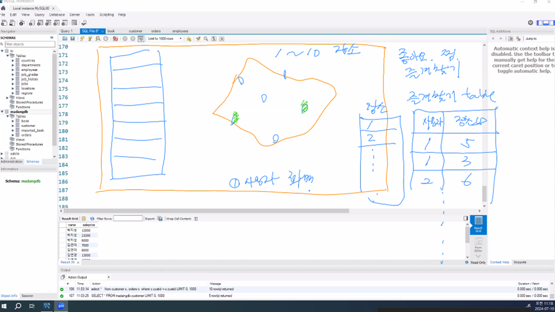

# [2024.07.10(수)] 데이터베이스 - 조인/subquery/집합 연산


# Chapter03 SQL 기초

## p.148 ch03.03 데이터 조작어 - 검색

### P.165 두 개 이상의 테이블을 이용한 SQL 질의

### p.167 조인

### 질의 3-22. 고객과 고객의 주문에 관한 데이터를 고객 별로 정렬하여 나타내시오.

### 질의 3-23. 고객의 이름과 고객이 주문한 도서의 판매 가격을 검색하시오.

```sql
-- 질의 3-22
-- 이름 내림차순으로 정렬
select *
  from customer, orders
where customer.custid = orders.custid
order by customer.name desc;

-- 이름으로 오름차순 정렬, 동일한 경우 saleprice로 내림차순 정렬
select *
  from customer, orders
where customer.custid = orders.custid
order by customer.name, saleprice desc;

-- table alias
select *
  from customer c, orders o
where c.custid = o.custid
order by c.name, o.saleprice desc;

-- 원하는 컬럼만 가져오는 경우
select c.name, o.saleprice
  from customer c, orders o
where c.custid = o.custid
order by c.name, o.saleprice desc;

-- table alias 생랷한 컬럼에 대해 유추하여 출력한다.
select c.name, saleprice
  from customer c, orders o
where c.custid = o.custid
order by c.name, o.saleprice desc;

-- ambiguous
select c.name, custid -- 오류 발생
  from customer c, orders o
where c.custid = o.custid
order by c.name, o.saleprice desc;
```

### 질의 3-24. 고객별로 주문한 모든 도서의 총판매액을 구하고, 고객별로 정렬하시오.

```sql
-- 질의 3-24
-- 동명이인이 있을 경우 고객이 중복 처리될 수 있다.
select c.name, sum(o.saleprice)
  from customer c, orders o
where c.custid = o.custid
group by c.name
order by c.name;

-- key 컬럼에 대한 group by 절은 가장 세분화된 group by가 되므로 select에 다른 컬럼이 와도 문제 없다.
select c.name, sum(o.saleprice) 	
  from customer c, orders o
where c.custid = o.custid
group by c.custid  	-- key :  custid는 키값이므로 그룹화하는데 방해되지 않는다.
order by c.name;

select c.name, sum(o.saleprice)	-- 오류 발생 : group by 절의 phone과 name이 맞지 않는다. phone이 와야 한다.
  from customer c, orders o
where c.custid = o.custid
group by c.phone	-- non key : 중복된 값이 들어갈 수 있는 등 그룹화가 어려울 수 있다.
order by c.phone;
```

### 질의 3-25. 고객의 이름과 고객이 주문한 도서의 이름을 구하시오.

```sql
-- 질의 3-25
-- 아래 두 쿼리는 결과가 같고 수행계획도 같다. 단, mysql 기준
-- DBMS가 달라지면 다른 결과가 나올 수 있다.
select c.name, b.bookname
  from customer c, book b, orders o
where c.custid = o.custid and b.bookid = o.bookid;

select c.name, b.bookname
  from orders o, customer c, book b
where o.custid = c.custid  and o.bookid = b.bookid;
```

### DBMS Optimizer

- 참고 : https://luvris2.tistory.com/762
    
    https://coding-factory.tistory.com/743
    
- **SQL 최적화**
    
    DBMS 내부에서 프로시저를 작성하고 컴파일해서 실행 가능한 상태로 만드는 전 과정을 의미한다. (SQL 옵티마이저를 통해 DBMS 내부 엔진에서 프로시저를 만든다.)
    
- **SQL 최적화 과정**
    1. SQL 파싱 : 사용자로부터 전달받은 SQL을 Parser가 파싱을 진행한다.
        
        파싱 트리 생성 : SQL 문을 이루는 개별 구성 요소를 분석해서 파싱 트리 생성
        
        문법(Syntax) 확인 : 사용할 수 없는 키워드를 사용하는 등의 문법적 오류 확인
        
        의미(Sementic) 확인 : 존재하지 않는 테이블 사용 등의 의미상 오류 확인
        
    2. SQL 최적화 : Optimizer를 통해 SQL 최적화 진행한다.
        
        미리 수집한 시스템 및 오브젝트 통계 정보를 바탕으로 다양한 실행 경로를 생성한다. 생성된 다양한 실행 경로를 비교한 후 가장 효율적인 하나를 선택한다.
        
    3. 로우 소스 생성 : SQL Optimizer가 선택한 실행경로를 실제 실행 가능한 코드 또는 프로시저 형태로 포맷팅한다.
- **SQL 최적화 정리**
    - DBMS는 옵티마이저가 결정한 실행 방법대로 실행 엔진이 데이터를 처리하여 결과 데이터를 사용자에게 전달한다. 현재 대부분 DBMS는 비용기반 옵티마이저만 제공하며, 하위 버전 호환성을 위해 규칙기반 옵티마이저가 남아있다.
    
- **Oprimizer**
    - 옵티마이저는 가장 효율적인 방법으로 SQL을 수행할 최적의 처리 경로를 생성해주는 DBMS의 핵심 엔진이다. 개발자가 작성한 SQL에 대해 실행 계획을 수립 후 실행하며, 실행 결과는 동일하더라도 실행 계획에 따라 성능이 달라질 수 있다.
- **Oprimizer 처리 과정**
    
    .png)
    
    1. **Parser :** SQL문장을 분석하여 문법 검사와 구성요소를 파악하고 이를 파싱 해서 파싱 트리를 만듭니다.
    2. **Query Transformer :** 파싱된 SQL을 보고 같은 결과를 도출하되, 좀 더 나은 실행 계획을 갖는 SQL로 변환이 가능한지를 판단하여 변환 작업을 수행합니다.
    3. **Estimator :** 시스템 통계정보를 딕셔너리로부터 수집하여 SQL을 실행할 때 소요되는 총비용을 계산합니다.
    4. **Plan Generator :** Estimator를 통해 계산된 값들을 토대로 후보군이 되는 실행계획을 도출합니다.
    5. **Row-Source Generator :** 옵티마이저가 생성한 실행계획을 SQL 엔진이 실제 실행할 수 있는 코드나 프로시저 형태로 포맷팅 합니다.
    6. **SQL Engine :** SQL을 실행합니다.
- **Oprimizer 종류**
    
    
    | 항목 | 규칙 기반 옵티마이저 | 비용 기반 옵티마이저 |
    | --- | --- | --- |
    | 개념 | 사전에 정의된 규칙 기반 | 최소 비용 계산 실행 계획 수립 |
    | 기준 | 실행 우선 순위 | 액세스 비용 |
    | 인덱스 | 인덱스 존재 시 가장 우선 시 사용 | Cost에 의한 결정 |
    | 성능 | 사용자의 SQL작성 숙련도 | 옵티마이저 예측 성능 |
    | 장점 | 판단이 매우 규칙적이며, 실행 예상이 가능 | 통계 정보를 통한 현실 요소 적용 가능 |
    | 단점 | 예측 통계 정보 요소 무시 | 최소 성능 보장 계획의 예측 제어 어려움 |
- **규칙 기반 Oprimizer (RBO, Rule Based Optimizer)**
    - 참조하는 정보를 이용하여 규칙(우선 순위)를 가지고 실행계획을 생성하는 최적화 방식이다.
    - 실행 계획을 생성하기 위한 참조 정보
        
        이용 가능한 인덱스 유무와 종류
        
        SQL문에서 사용하는 연산자의 종류
        
        SQL문에서 참조하는 객체의 종류
        
    - 우선 순위가 높은 규칙일수록 적은 일량으로 해당 작업을 수행하는 방법이라고 판단한다.
- **비용 기반 Oprimizer (CBO, Cost Based Optimizer)**
    - SQL 문을 처리하는데 필요한 비용(처리 소요시간, 자원 사용량)이 가장 적은 실행계획을 선택하는 옵티마이저이다.
    - 비용을 예측하기 위해 다양한 객체 통계 정보와 시스템 통계 정보 등을 이용한다. (다양한 객체 통계 정보 : 테이블, 인덱스, 컬럼 등)
    - 정확한 통계 정보를 유지하는 것이 비용 기반 최적에 중요한 요소이다.
        
        통계 정보가 없는 경우 정확한 비용 예측이 불가능해져 비효율적인 실행계획을 생성할 수 있다.
        
- **비용 기반 Oprimizer 구성 요소**
    
    .png)
    
    - 질의 변환기 : 사용자가 작성한 SQL 문을 처리하기에 보다 용이한 형태로 변환하는 모듈이다.
    - 대안 계획 생성기 : 동일한 결과를 생성하는 다양한 대안 계획을 생성하는 모듈이다. 연산의 적용 순서 변경, 연산 방법 변경, 조인 순서 변경 등을 통해 생성한다.
    - 비용 예측기 : 대안 계획 생성기에 의해 생성된 대안 계획의 비용을 예측하는 모듈이다. 보다 나은 예측을 위해 정확한 통계 정보가 필요하다. 통계정보, DBMS 버전, DBMS 설정 정보 등의 차이로 동일 SQL 문도 서로 다른 실행계획이 생성될 수 있다. 옵티마이저의 다양한 한계들로 인해 실행계획의 예측 및 제어가 어렵다는 단점이 존재한다.

### JOIN 사용 방법

```sql
-- ANSI SQL JOIN
select c.name, o.saleprice
  from customer c, orders o
where c.custid = o.custid;

select c.name, o.saleprice
  from customer c inner join orders o 
where c.custid = o.custid;

select c.name, o.saleprice
  from customer c inner join orders o on c.custid = o.custid;

select c.name, b.bookname
  from orders o inner join customer c on o.custid = c.custid 
		join book b on o.bookid = b.bookid;
```

### p.170 셀프 조인(self Join)

- 하나의 테이블을 대상으로 조인하는 것이다.
- employees staff와 employees manager가 카티션 프로덕트 연산(cross join) 되어 manager.first_name = 'Alexander' and manager.last_name = 'Hunold' 조건인 칼럼이 107행(employees 테이블 행 수)만큼 생성된다. 그 중 staff.manager_id = manager.employee_id인 칼럼은 manager가 ‘Alexander Hunold’인 4개 행만 출력 된다.
    
    ```sql
    -- self join
    -- hr database / employees table 기준
    -- first_name이 'Alexander'이고 last_name이 'Hunold'인 사람이 관리하는 사원들 목록
    select staff.*
      from employees staff, employees manager
    where manager.first_name = 'Alexander' and manager.last_name = 'Hunold'
    	and staff.manager_id = manager.employee_id;
    ```
    
- 예시 - 회원 가입 시 일반 회원, 준 회원, 14세 미만, 외국인, 기타 등 회원 분류를 코드로 만든다. 회원 분류 코드가 저장되는 테이블을 만들고 회원 테이블에는 회원 조건 코드가 저장된다.
- 회원 분류 코드가 필요할 때는 회원 분류 코드 테이블만 조회하면 된다. 고객, 주문상태 등의 테이블 조회 시에는 회원 분류 코드와 join하여 사용한다.
    - 예시 - 회원 분류 코드
        
        
        | 회원분류 | 회원코드 |
        | --- | --- |
        | 일반회원 | 010 |
        | 준회원 | 020 |
        | 14세미만 | 030 |
        | 외국인 | 090 |
        | 기타 | 050 |
    - 회원 테이블
        
        
        | 회원ID | 이름 | 회원코드 |
        | --- | --- | --- |
        | 1 | 홍길동 | 010 |
        | 2 | 이길동 | 090 |
- 같은 공통 코드 테이블을 셀프 조인하여 사용하는 경우도 발생한다.

### 질의 3-26. 가격이 20,000원인 도서를 주문한 고객의 이름과 도서의 이름을 구하시오.

```sql
-- 질의 3-26
select c.name, b.bookname
  from customer c, book b, orders o
where c.custid = o.custid
	and b.bookid = o.bookid and b.price = 20000;
```

### left outer join

```sql
-- outer join
-- inner join 관계가 없는 데이터도 나오도록 쿼리를 수행한다.

-- 주문하지 않은 박세리도 나온다.
select * 
  from customer c, orders o;

-- 아래의 쿼리는 주문한 사람만 나온다.
select *
  from customer c, orders o
where c.custid = o.custid;

-- left outer join (왼쪽 테이블 기준으로 관계가 없어도 출력)
select c.name, o.saleprice
  from customer c left outer join orders o on c.custid = o.custid;

-- 휴가 안간 사원 목록
-- 휴가 테이블에 어떤 사원이 언제 신청했고, 얼마 기간의 휴가를 사용, 사용중 ... 
-- 휴가 가지 않은 사원 포함 전체 목록을 조회하려면 사원 테이블 left outer join 휴가 테이블 ...

-- 즐겨찾기 장소 관계에서 사용자가 즐겨찾기 등록한 장소를 그렇지 않은 장소와 함께 조회해서 별도로 표시할 경우
-- 장소 기준 left outer join 즐겨찾기 형태로 처리해야 원래 보여주려던 장소 목록을 출력할 수 있다.
-- 가령 장소가 100만개, 즐겨찾기 1000개
/*
select ...
  from 장소 left outer join 고객alter
where ...

select ... (화면에 보여줄 10개의 row만 먼저 추출)
  from 장소
where ...

select 즐겨찾기
  from 즐겨찾기
where 고객 = 로그인한 고객

각각 별도로 추출한 후 left outer join
*/
```

### left outer join 예시

- LEFT OUTER JOIN은 두 테이블을 조인할 때, 왼쪽 테이블의 모든 행을 반환하고, 오른쪽 테이블에서 일치하는 행이 없으면 NULL을 반환한다. 다양한 시나리오에서 유용하게 사용할 수 있다. 다음은 LEFT OUTER JOIN을 사용하는 세 가지 예시이다.

### 예시 1: 고객과 주문 정보

고객 테이블과 주문 테이블이 있을 때, 각 고객과 그 고객의 주문 내역을 포함하는 쿼리를 작성할 수 있다. 주문이 없는 고객도 포함되도록 한다.

```sql
sql코드 복사
SELECT customers.customer_id, customers.customer_name, orders.order_id
FROM customers
LEFT OUTER JOIN orders
ON customers.customer_id = orders.customer_id;
```

이 쿼리는 모든 고객과 각 고객의 주문 정보를 반환한다. 주문이 없는 고객도 결과에 포함되며, 그런 경우 주문 관련 컬럼은 NULL이 된다.

### 예시 2: 직원과 부서 정보

직원 테이블과 부서 테이블이 있을 때, 각 직원과 그 직원이 속한 부서의 정보를 포함하는 쿼리를 작성할 수 있다. 부서에 속하지 않은 직원도 포함되도록 한다.

```sql
sql코드 복사
SELECT employees.employee_id, employees.employee_name, departments.department_name
FROM employees
LEFT OUTER JOIN departments
ON employees.department_id = departments.department_id;
```

이 쿼리는 모든 직원과 그들이 속한 부서의 이름을 반환한다. 부서에 속하지 않은 직원도 결과에 포함되며, 그런 경우 부서 관련 컬럼은 NULL이 된다.

### 예시 3: 제품과 판매 정보

제품 테이블과 판매 테이블이 있을 때, 각 제품과 그 제품의 판매 정보를 포함하는 쿼리를 작성할 수 있다. 판매되지 않은 제품도 포함되도록 한다.

```sql
sql코드 복사
SELECT products.product_id, products.product_name, sales.sale_date
FROM products
LEFT OUTER JOIN sales
ON products.product_id = sales.product_id;
```

이 쿼리는 모든 제품과 그 제품의 판매 날짜를 반환한다. 판매되지 않은 제품도 결과에 포함되며, 그런 경우 판매 관련 컬럼은 NULL이 된다.

### 요약

- **고객과 주문 정보**: 모든 고객과 각 고객의 주문 내역을 반환.
- **직원과 부서 정보**: 모든 직원과 그 직원이 속한 부서의 정보를 반환.
- **제품과 판매 정보**: 모든 제품과 그 제품의 판매 정보를 반환.
- 장소 테이블과 즐겨찾기 테이블이 있다. 사용자 화면에 모든 장소와 즐겨찾기 된 장소를 보여주려고 한다.
    
    ⇒ 장소 left outer join 즐겨찾기로 조회하여 보여줘야 한다.
    
    
    

### p.172 subquery

- Subquery returns more than 1 row
    - 해결 방안 : subquery가 복수개의 row를 return할 경우, 대응되는 왼쪽의 컬럼에 in을 사용한다. 단, 항상 1개의 row만 return될 경우에만 =를 사용한다.
- Operand should contain 1 column(s) ⇒ Operand should contain ~~~
    - 해결 방안 : subquery의 return column과 대응되는 왼쪽의 컬럼의 수가 맞지 않는 경우이므로, 갯수를 동일하게 맞춰준다.
- 중복이 가능한 subquery라면 distinct를 사용하는 것이 좋다.
- subquery는 메모리에 적재한 후 처리(io disk sqaping) 된다. subquery는 메모리에 적재되어 이후 처리가 되므로 매우 빠르게 처리된다. 동시에 메모리 자원을 낭비하게 된다.

```sql
-- subquery : query의 일부가 별도의 완성적인 query

select max(price) -- 가장 비싼 도서의 가격 (35000)
  from book;

select bookname
  from book
where price = 35000;

select bookname
  from book
where price = (select max(price) from book);

-- subquery 부분만 고려
select max(price) from book; -- 단일행 단일열
select bookid, bookname from book; -- 다중행 다중열
select bookid from book; -- 다중행 단일열 
select bookid, bookname from book where bookid = 3; -- 단일행 다중열

-- Subquery returns more than 1 row
-- 해결 방안 : subquery가 복수개의 row를 return할 경우, 대응되는 왼쪽의 컬럼에 in을 사용한다.
-- 			단, 항상 1개의 row만 return될 경우에만 =를 사용한다. 

-- Operand should contain 1 column(s)
-- Operand should contain ~~~
-- 해결 방안 : subquery의 return column과 대응되는 왼쪽의 컬럼의 수가 맞지 않는 경우이므로, 갯수를 동일하게 맞춰준다. 
select bookname
  from book
where (bookid, bookname) in (select bookid, bookname from book);
```

### 질의 3-28. 도서를 구매하지 않은 고객을 포함해 고객의 이름과 고객이 주문한 도서의 판매 가격을 구하시오.

```sql
-- subquery : query의 일부가 별도의 완성적인 query

select max(price) -- 가장 비싼 도서의 가격 (35000)
  from book;

select bookname
  from book
where price = 35000;

select bookname
  from book
where price = (select max(price) from book);
```

### 질의 3-29. 도서를 구매한 적이 있는 고객의 이름을 검색하시오.

```sql
-- 질의 3-29
-- 도서를 주문한 고객의 이름
select customer.name
  from customer
where custid in (select custid from orders);

-- 위 subquery를 join 형태로 변경
select customer.name -- 10명의 중복 포함 고객의 이름 
  from customer, orders
where customer.custid = orders.custid;

select distinct customer.name -- 10명의 중복 포함 고객의 이름 
  from customer, orders
where customer.custid = orders.custid;

select customer.name
  from customer
where custid in (select distinct custid from orders); -- 만약 subquery가 500 고객이 20000번 주문한 경우 <= subquery 자체에서 distinct를 사용
-- 중복이 가능한 subquery라면 distinct를 사용하는 것이 좋다. 

-- subquery는 메모리에 적재한 후 처리(io disk sqaping) 
-- subquery는 메모리에 적재되어 이후 처리가 되므로 매우 빠르게 처리된다. 동시에 메모리 자원을 낭비하게 된다.
```

### 질의 3-30. 대한미디어에서 출판한 도서를 구매한 고객의 이름을 나타내시오.

```sql
-- 질의 3-30
-- 3 개의 테이블을 모두 사용
-- subquery
select name from customer where custid in (
	select custid from orders where bookid in (
		select bookid from book where publisher = '대한미디어'
	)
);

-- join 으로 1 : orders, book join
select name from customer where custid in (
    select custid
      from orders o, book b
	where o.bookid = b.bookid and b.publisher = '대한미디어'
);

-- join 으로 2 : customer, orders, book 3 테이블 모두 join
select c.name
  from customer c, orders o, book b 
where c.custid = o.custid and o.bookid = b.bookid and b.publisher = '대한미디어';
```

### 질의 3-31. 출판사 별로 출판사의 평균 도서 가격보다 비싼 도서를 구하시오.

- 부속질의 간에는 상하 관계가 있다. 하위 부속질의를 먼저 실행하고 그 결과를 이용하여 상위 부속질의를 실행한다. 반면, 상관 부속질의는 상위 부속질의의 투플을 이용하여 하위 부속질의를 계산한다. 즉, 상위 부속질의와 하위 부속질의가 독립적이지 않고 서로 관련을 맺고 있다.

```sql
-- 3-31
-- 출판사별 평균 가격 테이블이 있으면 그걸 사용, 만약 없다.
select b1.*
  from book b1
where b1.price > (select avg(b2.price) from  book b2 where b2.publisher = b1.publisher);

-- 아래 join에 subquery가 사용  
-- 위의 subquery를 사용하여 해결하는 것보다 옵티마이저 비용이 크다.
select b1.*
  from book b1, (
				select publisher, avg(price) avg_price
				from book
				group by publisher
				) avg_book	-- 인라인 뷰
where b1.publisher = avg_book.publisher and b1.price > avg_book.avg_price;
```

### p.178 집합 연산

### 질의 3-32. 대한민국에 거주하는 고객의 이름과 도서를 주문한 고객의 이름을 나타내시오.

```sql
-- 질의 3-32
select name 
  from customer
where address like '대한민국%'

union 	-- 중복 제거한 후 합친다.

select name
  from customer
where custid in (select custid from orders);

select name 
  from customer
where address like '대한민국%'

union all 	-- 중복 제거 X

select name
  from customer
where custid in (select custid from orders);

-- union은 일반적으로 테이블 또는 쿼리의 결과가 비슷한데, 두 결과를 합쳐야 할 때 주로 사용한다.
```

---

# 조별 활동

- **프로그래머스 문제 풀이 (MySQL) :** https://school.programmers.co.kr/learn/courses/30/lessons/133027

## 주문량이 많은 아이스크림들 조회하기

```sql
SELECT HALF.FLAVOR
FROM FIRST_HALF HALF JOIN JULY JULY ON HALF.FLAVOR = JULY.FLAVOR
GROUP BY FLAVOR
ORDER BY SUM(HALF.TOTAL_ORDER + JULY.TOTAL_ORDER) DESC
LIMIT 3;
```