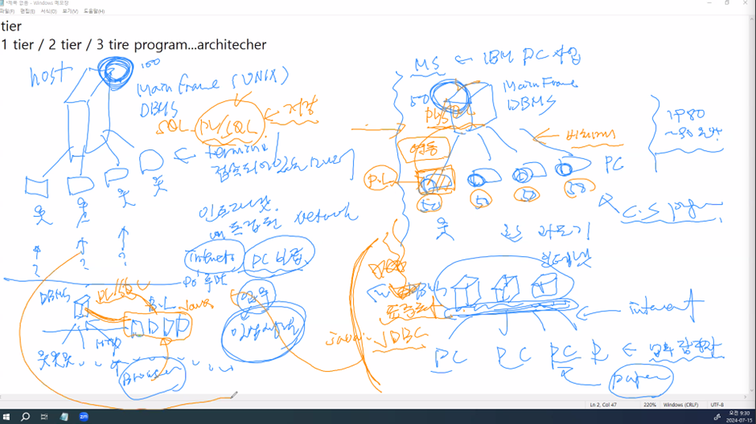
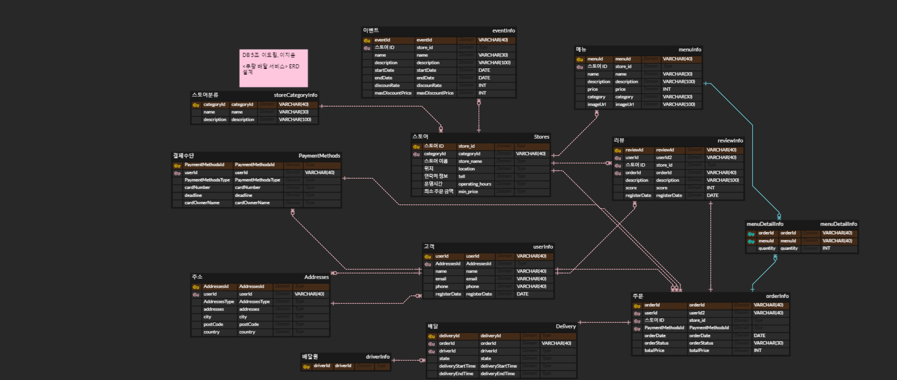
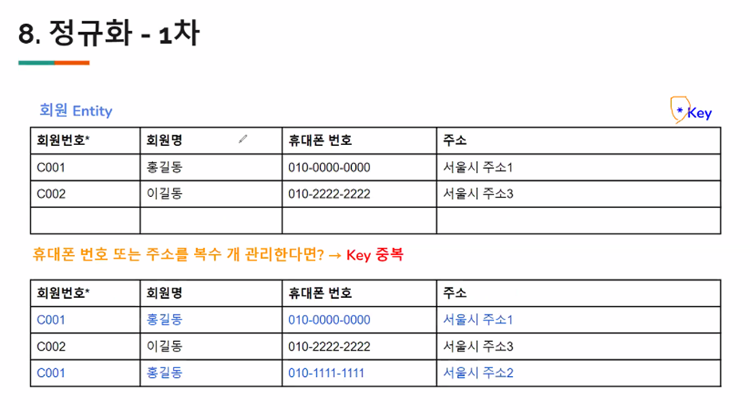
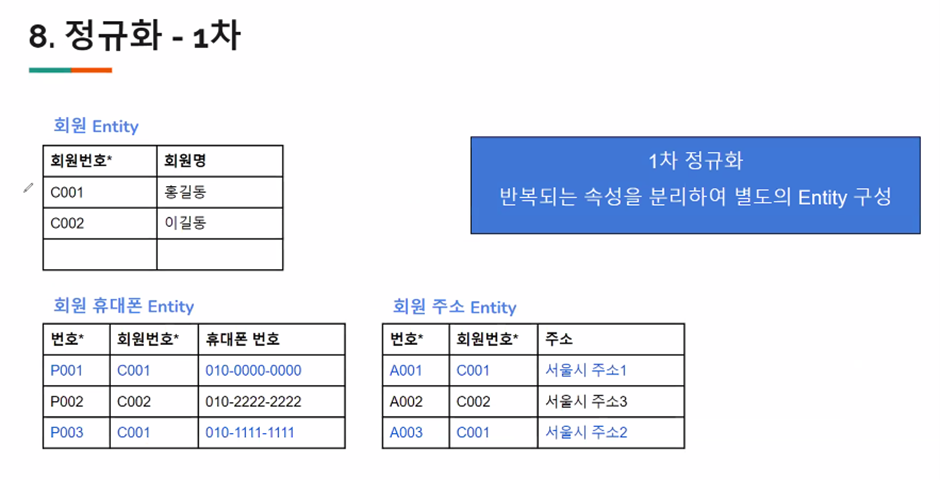
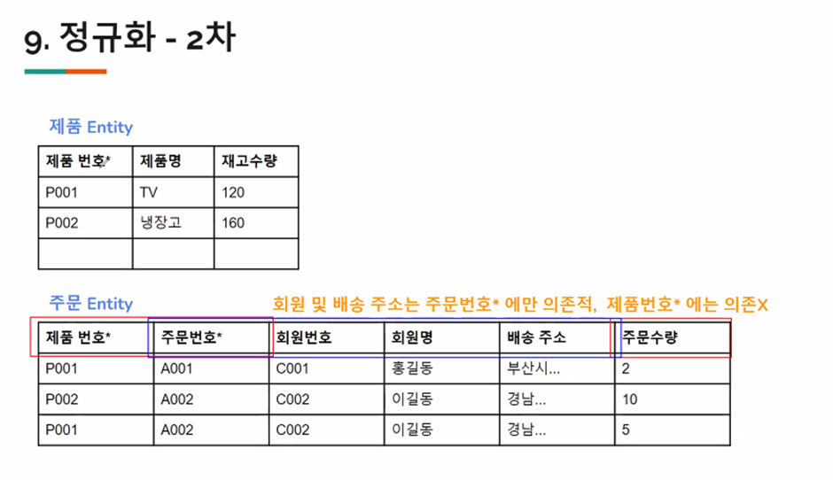
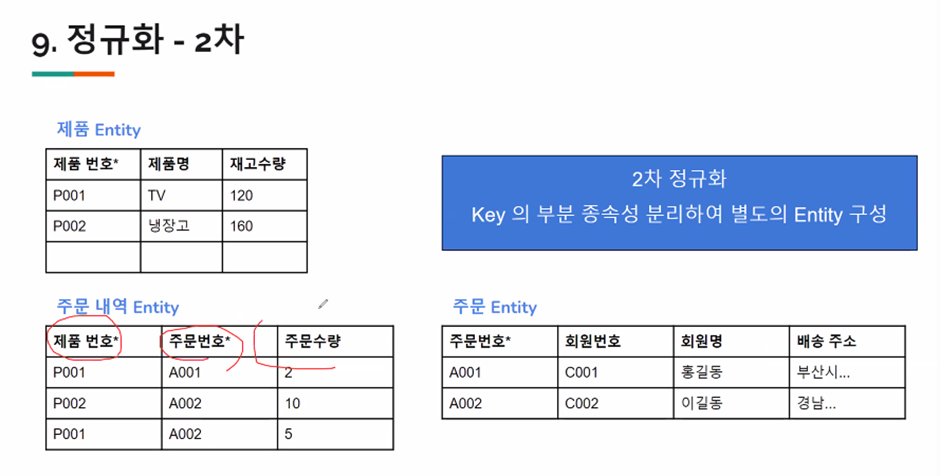
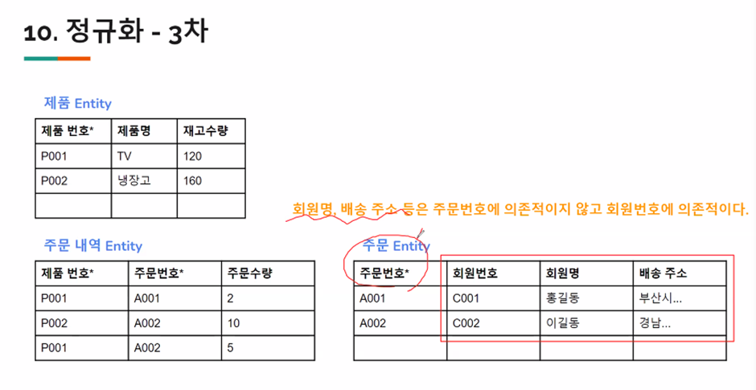
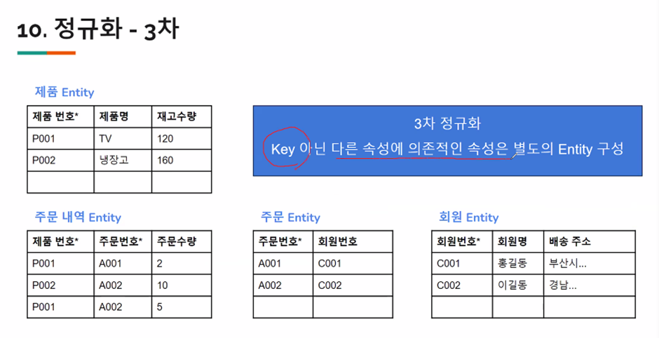

# [2024.07.15(월)] 데이터베이스 - 데이터 모데링/정규화

# Chapter05 데이터베이스 프로그래밍

### tier

- 1 tier / 2 tier / 3 tire program…architecher
- 2 tier : JAVA ←→ DB(MySQL) 연동 : JDBC
    
               UI : Swing (이것이 자바다 교재 부록) : 간단히 필요한 부분만 학습 / 적용
    
               Swing(UI) → JDBC → MySQL
    
- 3 tier : Browser ←→ Java Back-End (JDBC) ←→ MySQL 구조
    
               Chrome ←→ Tomcat + Servlet/JSP + Spring ←→ MySQL
    

### Mini Project

1일차 : Swing (잠깐) / JDBC (진짜)

2일차 : madang db / book 테이블 + Swing + JDBC를 이용하여 도서 관리 프로그램 만들기

3일차(최종 제출 부분) : 선택 #1 madang db / customer, order + Swing + JDBC ⇒ 마당db 전체 관리프로그램(2일차 포함)

선택 #2 자체적인 JDBC 응용 프로그램 개발 (7/15 조별 활동의 결과 활용 / 개인 프로젝트)

제출 : 3일차 결과물(이클립스 프로젝트 + ERD)

# Chapter06 데이터 모데링

## p.325 ch06.01 데이터 모데링의 개념

### 데이터베이스 생명주기

1. 요구사항 수집 및 분석
    
    사용자들의 요구사항을 듣고 분석하여 데이터베이스 구축의 범위를 정하는 단계이다.
    
2. 설계
    
    분석된 요구사항을 기초로 주요 개념과 업무 프로세스 등을 식별하고, 사용하는 DBMS의 종류에 맞게 변환한 후, 데이터베이스 스키마를 도출한다.
    
3. 구현
    
    설계 단계에서 생성한 스키마를 실제 DBMS에 적용하여 테이블 및 관련 객체를 만든다. 또한, 관련 소프트웨어에 설계한 데이터베이스를 적용하여 서비스를 제공할 수 있도록 프로그램을 완성한다.
    
4. 운영
    
    구현된 데이터베이스를 기반으로 소프트웨어를 구축하여 서비스를 제공한다.
    
5. 감시 및 개선
    
    데이터베이스 운영에 따른 시스템의 문제를 관찰하고 데이터베이스 자체의 문제점을 파악하여 개선한다. 이 단계에서는 데이터베이스가 지속적으로 운영될 수 있도록 변경 및 유지보수를 한다.
    

### 데이터 모델링 과정

- 발주 회사의 입장
    - 기존 시스템의 문제
    - 기존 시스템의 부재
    
    ⇒ 신규 시스템 구축
    
    - 내부 인력 가능?
    - 내부 인력 (주) + 일부 외부 인력 (부)
    - 외부 인력 (주) + 일부 내부 인력 (부)
    - 외부 ← 제안요청서 (RFP : Request For Proposol)
- 수행사의 입장
    - 발주사의 제안 요청서를 검토 (사업적으로 가능한지 판단 : 현재 인력상황 등등 고려 금액 고려…)
    - 긍정적인 검토 제안서 작업 → 제안서 제출 → 제안서 발표
    - 선정 : 인력 + 일정 + 기타… ← 팀 구성 (일정 인원은 계속 상주, 일부 인원은 투입/out) (앞쪽 일정 : 설계 인력)
    - 선정 전에 제안서 안에 인력 목록 포함 (특급 3명, 고급 10명, 중급 X명, 초급 X명…PM, PL, 사업관리 …)
1. 요구사항 수집 및 분석
    - 설계
        - 담당자(현업 업무의 최상위자 X, 중간 정도)의 인터뷰 : AS-IS는 이렇다. 이런 게 불편하다. 이런게 있으면 좋겠다. ← 정리
            - 모두 취합한 후 검토
            - 네 라는 대답 X
            - 업무를 전혀 모르는 상황 일 경우, 설명하는 내용 중 명사(테이블 대상), 일 처리의 선 후(Business Login), …
        - legacy system이 있는 경우, 먼저 분석 주요 내용 정리, 마이그레이션 필요 여부, 공통 코드 필수 분석
        - 모델링 설계 + OOP 설계
    - 개념 모델링 : 주요 Entity, Relation 파악, 각 주요 속성 파악(type은 고려 안 해도 된다.)
        
                              그림으로 표현(E-R diagram) ← 소통의 도구
        
                         제안 요청서의 모든 범위가 고려되었는가 (range)
        
                    제안 요청서의 모든 기능이 고려되었는가 (depth)
        
    - 논리 모델링 : DBMS를 고려한 Mapping
        
                              기타 Entity, 기타 속성 파악하기도 함.
        
                         정규화 (best practies)
        
                   데이터 딕셔너리
        
    - 물리 모델링 : 작성된 노리적 모델을 실제 컴퓨터의 저장 장치에 저장하기 위한 물리적 구조를 정의하고 구현하는 과정이다.

## p.333 ch06.02 ER 모델

### 개체와 개체 타입

- 개체 특징
    - 유일한 식별자에 의해 식별이 가능하다.
    - 꾸준한 관리를 필요로 하는 정보다.
    - 두 개 이상 영속적으로 존재한다.
    - 업무 프로세스에 이용된다.
    - 반드시 자신의 특징을 나타내는 속성을 포함한다.
    - 다른 개체와 최소 한 개 이상의 관계를 맺고 있다.

### 속성

- 단순 속성과 복합 속성
    
    단순 속성은 더 이상 분해가 불가능한 속성이고, 복합 속성은 개념, 논리 모델링을 거쳐 다른 테이블로 분리될 수 있다.
    
- 단일값 속성과 다중값 속성
    
    단일 값 속성은 값이 한 개인 속성이고, 다중값 속성은 값이 여러 개인 속성이다.
    
- 저장 속성과 유도 속성
    
    저장 속성은 다른 속성의 영향 없이 단독으로 저장되는 속성이고, 유도 속성은 필수 칼럼은 아니고 저장 속성으로부터 구하여 사용해도 된다. (다른 저장 속성으로부터 유도된 속성)
    

### 관계와 관계 타입

- 관계 타입의 유형
    - 차수에 따른 유형
        
        1진 관계(셀프 조인) : 한 개의 개체가 자기 자신과 관계를 맺는 경우
        
        2진 관계 : 두 개의 개체가 관계를 맺음
        
        3진 관계 : 세 개의 개체가 관계를 맺음
        
    - 관계 대응 수에 다른 유형
        
        일대일 관계 : 하나의 개체가 하나의 개체에 대응함 
        
        일대다 : 하나의 개체가 여러 개체에 대응함
        
        다대일 관계 : 여러 개체가 하나의 개체에 대응함
        
        다대다 관계 : 여러 개체가 여러 개체에 대응함
        

### IE 표기법

IE 표기법은 관계 대응 수를 새발 모양의 기호로 표현하여 새발 표기법이라고 부르기도 한다.

## p.352 ch06.03 ER 모델을 관계 데이터 모델로 사상하기

### 개체 타입의 사상

[1단계] 강한(정규) 개체 타입

정규 개체 타입 E의 경우 대응하는 릴레이션R을 생성한다. 각 개체 타입의 일반 속성은 각각 새로 생성하는 릴레이션의 속성으로 표시하고, 기본키와 외래키는 PK나 FK 등으로 표시한다.

[2단계] 약한 개체 타입

약한 개체 타입에서 생성된 릴레이션은 자신의 키와 함께 강한 개체 타입의 키를 외래키로 넣어 자신의 기본키를 구성한다. 이때 유도된 속성이나 복합 속성 등은 속성의 성격에 맞게 판단하여 사상한다.

### 관계 타입의 사상

- 이진 관계 타입을 사상하는 방법 네 가지
    
    [방법1] 오른족 개체 타입 E2를 기준으로 관계 R을 표현한다.
    
    E1(KA1, A2)
    
    E2(KA2, A4, KA1)
    
    [방법2] 왼쪽 개체 타입 E1을 기준으로 관계R을 표현한다.
    
    E1(KA1, A2, KA2)
    
    E2(KA2, A4)
    
    [방법3] 단일 릴레이션 ER로 모두 통합하여 관계R을 표현한다.
    
    ER(KA1, A2, KA2, A4)
    
    [방법4] 개체 타입 E1, E2와 관계 타입 R을 모두 독립된 릴레이션으로 표현한다.
    
    E1(KA1, A2)
    
    R(KA1, KA2)
    
    E2(KA2, A4)
    

[3단계] 이진 1:1 관계 타입 : [방법1] ~ [방법4]까지 모든 유형으로 사상할 수 있다.

[4단계] 이진 1:N 관계 타입 : [방법1] 또는 [방법2]의 유형으로 사상된다.

[5단계] 이진 N:M 관계 타입 : [방법 4]의 유형으로 사상된다.

[6단계] N진 관계 타입 : ER 모델의 차수가 3 이상인 다진 관계 타입의 경우 [방법 4]의 유형으로 사상된다.

고객의 취미를 삽입하는 경우 테이블에 취미1, 취미2, 취미3 과 같이 삽입하는 방식은 지양하는 것이 좋다. 

### 다중값 속성의 사상

[7단계] 다중값 속성

다중 값 속성의 개수를 알 수 없는 경우, 새로운 릴레이션을 생성한다.

R(KA, B)

RC(KA, C)

다중 값 속성의 개수가 적고 제한 가능한 경우, 속성을 릴레이션에 같이 포함한다.

R(KA, B, C1, C2, C3)

⇒ 속성을 릴레이션에 같이 포함하는 방법은 고려해야 할 속성값이 많아지면 불필요한 속성이 생겨 비효율적이다. 또한, 이후에 처음보다 많은 속성 값을 저장해야 하는 등의 문제가 생길 수 있다.

새로운 릴레이션을 생성하는 방법은 RC에 값이 계속 저장도리 수 있어 효율적이다. 그러나 새로운 릴레이션이 생기게 되어 모델이 복잡해질 수 있다.

## p.358 ch06.04 모델링 실습

### 도메인 정의하기

도메인 정의하기는 논리 모델링의 중요한 단계로 속성이 가지 룻 있는 값을 정의하는 작업이다.

### 마당 서점 ERD 만들기

https://sichan-dev.tistory.com/2

https://velog.io/@psj0810/MySQL-Workbench로-ERD다이어그램-생성

### 조별 활동

— 모델링 조별 활동 가이드

2그룹으로 분리하여 A그룹 : 고객사, 수행사 B그룹 : 수행사, 고객사

고객사 요구사항 제출, 수행사 요구사항 모델링

고객사 : ~~ 관리 프로그램을 위한, ~~ 서비스를 위한 ERD

수행사 : 고객사에 계속 질문 고객사 대답 (고객사는 나름대로의 생각 정리 - 대략 이정도 일것이다.)

최종 테이블 수 : 10개 정도

https://www.erdcloud.com/d/HwpixdEXujuGHXZ2b

# Chapter07 정규화

## p.395 ch07.01 이상현상

### 이상현상의 개념과 종류

- 삽입 이상 : 투플 삽입 시 부득이하게 NULL 값이 입력되거나, 테이블에 중복 데이터가 삽입되어 데이터의 중복성이 증가할 수 있다.
- 삭제 이상 : 투플 삭제 시 필요한 데이터가 함께 삭제되는 연쇄삭제 현상이 발생할 수 있다.
- 수정 이상 : 투플 수정 시 테이블의 속성 간 일관성이 깨질 수 있다.
1. 이상 현상 ← 뭔가 잘못되었다.(결과)
    
    원인 : 테이블을 구성하는 컬럼들의 관계가 모호하다. (관계 없는 것들이 함께 모여 있다.)
    
    해결 : 같이 있어야 하는 컬럼들과 같이 있으면 안되는 컬럼들을 구분 ⇒ 분리
    

## p.409 ch07.02 함수 종속성

### 함수 종속성의 개념

왼쪽 속성의 각 값에 대하여 오른쪽 석성의 값이 유일하게 결정될 때 ‘함수적으로 종속한다’라고 한다. 릴레이션의 속성 간에 함수적으로 종속하는 성질을 함수 종속성 혹은 원어 그래도 해석하여 ‘함수적 종속성’이라고 한다.

### 함수 종속성 다이어그램

함수 종속성을 나타내는 표기법으로 함수 종속성 다이어그램이 있다. 함수 종속성 다이어그램은 릴레이션의 속성을 직사각형, 속성 간의 함수 종속성을 화살표로 나타낸다. 복합 속성의 경우 직사각형으로 묶어서 그린다.

### 함수 종속성과 기본키

기본키는 릴레이션의 모든 속성에 대한 결정자이다.

### 이상현상과 결정자

이상현상은 한 개의 릴레이션에 두 개 이상의 정보가 포함되어 있을 때 나타난다. 

이상현상은 기본키(후보키)가 아니면서 결정자인 속성이 있을 때 발생한다.

## p.418 ch07.03 정규화

- 두 가지 이상의 정보가 한 릴레이션에 저장되어 있을 때 이상현상이 발생한다. 이상현상을 해결하려면 릴레이션을 분해하는 작업이 필요하다. 이상현상이 발생하는 릴레이션을 분해하여 이상현상을 없애는 과정을 정규화하고 한다.

### 제 1정규형 : 릴레이션의 속성값이 원자값이어야 한다.

### 제 2정규형 : 릴레이션의 기본키가 복합키로 구성되어 있을 때, 복합키의 일부분이 다른 속성의 결정자인지 여부를 판단하는 것이다.

### 제 3정규형 : 속성들이 이행적으로 종속되어 있는지를 판단하는 것이다.

### 역정규화

- 다수의 JOIN 등으로 속도가 느린 경우 협의를 통하여 테이블을 합치기도 한다.