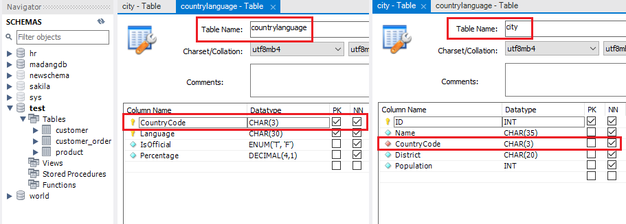
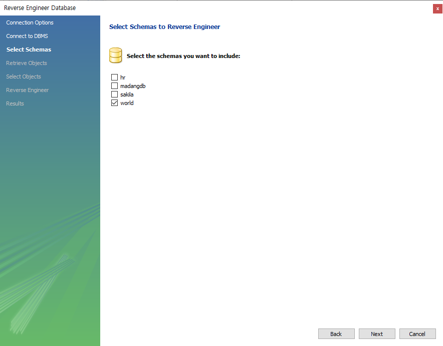
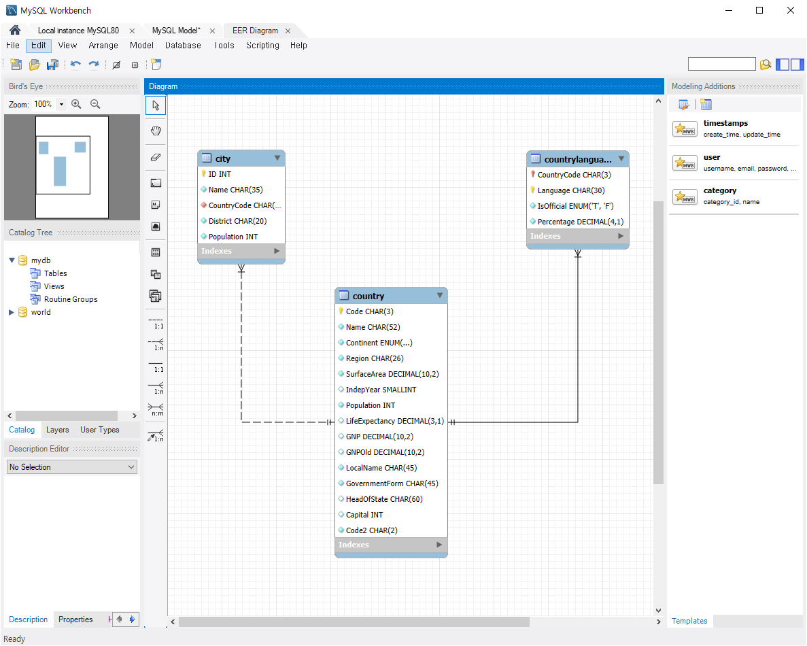

# [2024.07.11(목)] 데이터베이스 - 스키마 백업/복원/case when then else end/EXISTS


# 스키마 백업 및 복원 방법(Import 및 Export)

https://qjadud22.tistory.com/6

- **스키마 백업 방법**
    - MySQL Workbench 최상단의 [Server] → [Data Export]
        
        
        
    - Export한 디렉토리에서 생성한 .sql 문서 확인

- **스키마 복원 방법**
    - MySQL Workbench 최상단의 [Server] → [Data Import]
        
        
        

# char vs varchar

- char : 길이가 고정되어 있다. (고정 너비)
- varchar : 가변 길이로, 크기보다 작은 값이 저장되는 입력된 메모리 공간 만큼만 사용한다. (가변 너비)

# foreign key - Identifying vs non-Identifying

- world 데이터베이스의 countrylanguage와 city 테이블은 country 테이블의 CountryCode 칼럼을 가지고 있다.
- countrylanguage 테이블은 country 테이블의 CountryCode 칼럼을 PK로 사용한다. 이를 Identifying이라고 한다.
- country 테이블은 country 테이블의 CountryCode 칼럼을 일반 칼럼으로 사용한다. 이를 non-Identifying이라고 한다.
    
    
    

# MySQL Workbench 데이터베이스 ERD 확인 방법

- 최상단 [Database] → [Reverse Engineer…]
- Reverse Engineer Database 팝업에서 [next] → [next] → Select Schemas에서 ERD 확인할 스키마 선택 후 [next] → 모두 [next] 후 [finish] 선택
    
    
    
- 선택한 스키마 ERD 확인
    
    
    

---

# world 스키마로 SELECT 복습 코드

## 백업1 (문제01 ~ 문제 13)

```sql
desc country;

-- char vs varchar
-- char : 길이가 고정되어 있다. (고정 너비)
-- varchar : 가변 길이 (가변 너비) 

select * from world.country
where name like '%korea%';

select * from world.city
where CountryCode = 'KOR';

select * from world.countrylanguage
where CountryCode = 'KOR';

-- 1. country table의 모든 자료를 조회하시오. (총 239 건, row 수 : 239)
select * from country;

-- 2. country table 의 전체 건수를 구하세요. (row 수 : 1)
select count(*) from country; -- 239 건

-- 3. country table에서 국가 code가 FRA인 자료를 조회하시오. (row 수 : 1)
select * from country where code = 'FRA';

-- 4. country table 에서 대륙(Continent) 이 Africa 또는 Europe 인 자료를 조회하시오. (row 수 : 104)
select * from country where Continent = 'Africa' or Continent = 'Europe';
select * from country where Continent in ('Africa', 'Europe');

-- 5. country table 에서 독립일(IndepYear) 이 없는 나라의 자료를 조회하시오. (row 수 : 47)
select * from country where IndepYear is null;
select * from country where IndepYear is not null;

-- 6. country table 에서 모든 독립일을 중복 없이 조회하시오.
select distinct IndepYear from country; -- null 포함 (row 수 : 89) : distinct는 null도 하나의 value로 처리
select distinct IndepYear from country where IndepYear is not null; -- (row 수 : 88)

-- 7. country table 에서 인구(Population) 이 1000000(백만) 보다 크고 
--    수명예상(LifeExpectancy) 이 70 살 이상인 자료를 조회하시오. (row 수 : 66)
select * from country where Population > 1000000 and LifeExpectancy >= 70;

-- 8. country table 에서 이전 gnp(GNPOld) 대비 gnp 가 1000 이상 증가한 국가의 이름과 gnp, GNPOld, 증가한 GNP 를 조회하시오.
--    이 때 증가한 GNP 를 GNPDiff 로 alias 를 주세요. (row 수 : 47)
select name, GNP, GNPOld, (GNP - GNPOld) GNPDiff from country where (GNP - GNPOld) >= 1000;

-- 9. 위 데이터를 GNPDiff 로 내림차순 정렬하세요. (row 수 : 47)
select name, GNP, GNPOld, (GNP - GNPOld) GNPDiff from country where (GNP - GNPOld) >= 1000 order by GNPDiff;

-- 10. country table 에서 GNP 가 100 미만 또는 100000 초과인 자료를 조회하세요. (row 수 : 68)
select * from country where GNP < 100 or GNP > 100000;

-- 11. country table 에서 GNP 가 100 초과하고 100000 미만인 자료를 조회하세요. (row 수 : 170)
select * from country where GNP > 100 and GNP < 100000;

-- 12. country table 에서 GNP 가 100 이상 100000 이하인 자료를 조회하세요. (row 수 : 171)
select * from country where GNP >= 100 and GNP <= 100000;
select * from country where GNP between 100 and 100000;

-- 13. 위 11, 12 차이를 만드는 나라의 데이터를 확인하세요.
select * from country where GNP = 100 or GNP = 100000;
```

## 백업1 (문제14 ~ 문제 18)

```sql
-- 14. country table 에서 독립년도(IndepYear) 가 1980 이후이면서 
--     대륙(Continent) 이 Asia 가 아닌 나라의 자료를 조회하세요. (row 수 : 23)
select * from country where IndepYear >= 1980 and Continent != 'Asia';
select * from country where IndepYear >= 1980 and not Continent = 'Asia';

select count(*) from country where IndepYear >= 1980; -- (row 수 : 1, 데이터 개수 32)
select count(*) from country where IndepYear >= 1980 and Continent = 'Asia'; -- (row 수 : 1, 데이터 개수 : 9)

-- 15. country table 에서 대륙(Continent) 이  'Europe', 'Asia', 'North America' 이 아닌 나라의 자료를, 
--     대륙(Continent) 기준으로 오름차순, GNP 기준 내림차순으로 국가명, 대륙명, GNP 를 조회하시오. (row 수 : 105)
select name, Continent, GNP from country where Continent not in ('Europe', 'Asia', 'North America') order by Continent, GNP desc;

-- 16. city table 에서 도시명에 'S' 로 시작하고 중간에 'aa' 가 포함되는 나라를 모두 조회하세요.
select * from city where name like 'S%aa%';

-- 17. country table 에서 가장 면적이 큰 5개 나라의 이름, 대륙, 면적을 조회하세요.
select name, Continent, SurfaceArea from country order by SurfaceArea desc limit 5; -- limit는 mysql에서만 사용하는 문법이다.

-- 18. 위 쿼리의 결과를 보고 5개 나라 뒤 10개 나라 (6 ~ 15 위) 를 조회하세요.
select name, Continent, SurfaceArea from country order by SurfaceArea desc limit 10 offset 5;
select name, Continent, SurfaceArea from country order by SurfaceArea desc limit 10, 5; -- 앞 숫자가 offset뒤 숫자가 limit
select name, Continent, SurfaceArea from country order by SurfaceArea desc limit 5, 10; -- 앞 숫자가 offset뒤 숫자가 limit
```

# world 스키마로 집계 함수 복습 코드

```sql
-- 1. country 테이블에서 유럽(Europe) 대륙에 속하는 모든 국가의 인구수(Population) 의 총합은? (결과 : 730074600)
select sum(Population) from country where Continent = 'Europe';

-- 2. country 테이블에서 대륙(Continent)별 건수, 최대인구수, 최소 Gnp, 최대 Gnp, 평균 기대수명을 구하시오. (row 수 : 7)
select Continent, count(*) cnt, max(Population), min(GNP), max(GNP), avg(LifeExpectancy) from country group by Continent;

-- 3. 위 결과를 더 세분화 해서 대륙(Continent)별, 지역(Region)별로 구하시오. 단, 결과를 대륙별, 지역별로 정렬(asc)하시오. (row 수 : 25)
select Continent, Region, count(*) cnt, max(Population), min(GNP), max(GNP), avg(LifeExpectancy) 
from country group by Continent, Region order by Continent, Region;

-- 4. 위 결과 중 평균 기대수명이 70세 이상인 결과만 보여주시오. (row 수 : 12)
select Continent, Region, count(*) cnt, max(Population), min(GNP), max(GNP), avg(LifeExpectancy) 
from country group by Continent, Region having avg(LifeExpectancy) >= 70 order by Continent, Region;

-- (row 수 : 10)
select Continent, Region, count(*) cnt, max(Population), min(GNP), max(GNP), avg(LifeExpectancy) 
from country group by Continent, Region having avg(LifeExpectancy) >= 70 and max(GNP) >= 100000
order by Continent, Region;

-- 5. country 테이블에서 전체 자료의 수와 GNP 건수, GNPOld 건수를 구하시오. (전체 자료의 수 : 239, GNP 건수 : 239, GNPOld 건수 : 178)
-- count(*)(row의 갯수)를 제외한 count(colnmu)는 null은 제외한다. 
select count(*), count(GNP), count(GNPOld) from country;
select count(*) from country where GNPOld is null; -- (row 수 : 61)

-- 6. 국가별 도시 수가 5 이상인 국가의 CountryCode 와 도시 수(cnt alias) 를 조회하세요.  
--    단, 조회 대상은 인구가 50만 이상인 도시에 한하고 도시 수 기준 내림차순 정렬하시오.
select CountryCode, count(*) cnt from city where Population >= 500000 group by CountryCode having cnt >= 5 order by cnt desc;
```

# world 스키마로 JOIN 복습 코드

https://velog.io/@seonydg/MySQL-Subquery-Scalar-Inline-View-Nested

- **Subquery의 종류**
    - Scalar Subquery : **select** 절에 사용
    - Inline View : **from** 절에 사용
    - Nested Subquery : **where** 절에 사용
- **scalar sebquery는 생각보다 자주 사용한다.**
    
    예시 - a와 b 테이블을 join 시 key로 찾아지는 조건이 없을 때 카티션 프로덕트가 너무 많아지므로 하나의 테이블을 조회하고 그에 대한 다른 테이블에서 필요한 값을 scalar sebquery로 가져온다.
    
- **scalar sebquery는 하나의 칼럼에 매칭되므로 sebquery에서 리턴되는 결과가 무조건 하나여야 한다.**

## 백업 (문제 01 ~ 문제 02)

```sql
-- 1. 도시명 Seoul 속한 국가의 이름, 인구수, GDP 를 조회하시오.
-- 표준 SQL
select country.name, country.population, country.GNP 
from country join city on country.code = city.countrycode where city.name = 'Seoul';

-- 일반 join
select co.name, co.population, co.GNP from country co, city ci
where co.code = ci.countryCode and ci.name = 'Seoul';

-- subquery
select name, population, GNP from country
where code in (select countrycode from city where name = 'Seoul'); -- 단일행이지만, 다중행일 수 있는 sql, 단일열

-- 2. 아시아에 있는 국가의 도시 중 인구가 가장 많은 도시 10개를 조회하시오. 조회 항목은 국가명, 도시명, 도시 인구이다
select country.name, city.name, city.Population from country join city on country.code = city.countrycode 
where country.Continent = 'Asia' order by city.Population desc limit 10;

select co.name, ci.name, ci.Population from country co, city ci 
where co.code = ci.CountryCode and co.Continent = 'Asia' order by ci.Population desc limit 10;

-- subquery 연습

select name, population from city
where countrycode in (select code from country where continent = 'Asia')
order by Population desc limit 10;

SELECT country.name AS country_name, city.name AS city_name, city.Population FROM city
JOIN (SELECT code, name FROM country WHERE Continent = 'Asia') country ON city.countrycode = country.code
ORDER BY city.Population DESC LIMIT 10;

-- subquery 답안
-- city를 기준으로 subquery를 이용하여 where 조건에 Asia 부분은 처리 OK
-- select에 나라이름은 별도로 scalar subquery로 처리를 해야 한다. <- join이 더 간결하다.
select name, Population, (select name from country where code = countrycode) as countryName -- select (scalar sebquery - 반드시 1 건)
from city  -- (inline view)
where CountryCode in (select code from country where Continent = 'Asia')  -- 조건 (nested subquery)
order by Population desc limit 10;

-- scalar sebquery는 생각보다 자주 사용한다. 
-- 예시 a와 b 테이블을 join 시 key로 찾아지는 조건이 없을 때 카티션 프로덕트가 너무 많아지므로
-- 하나의 테이블을 조회하고 그에 대한 다른 테이블에서 필요한 값을 scalar sebquery로 가져온다.
-- scalar sebquery는 하나의 칼럼에 매칭되므로 sebquery에서 리턴되는 결과가 무조건 하나여야 한다.
```

## 백업 (문제 03 ~ 문제 04)

```sql
-- 3. 공식언어의 사용율이 50% 가 넘는 국가의 이름, 공식언어, 사용율을 조회하시오.
-- 일반 join
select co.name, cl.Language, cl.Percentage
from country co, countrylanguage cl
where co.code = cl.CountryCode and cl.IsOfficial = 'T' and cl.Percentage > 50.0;

-- 표준 SQL
select country.name, countrylanguage.Language, countrylanguage.Percentage 
from country join countrylanguage on country.code = countrylanguage.CountryCode
where countrylanguage.IsOfficial = 'T' and countrylanguage.Percentage > 50;

-- subquery
-- 위 2번 쿼리와 다른 점 : where 절 filtering 조건으로 country가 사용되지 않는다. -> select절 에만 subquery를 사용하면 된다. 
select (select name from country where code = CountryCode), Language, Percentage 
from countrylanguage where IsOfficial = 'T' and Percentage > 50;

-- 4. 유럽의 도시 중 인구수가 가장 많은 도시의 인구수를 가진 도시명, 인구수를 조회하시오.
select city.name, city.Population from country join city on country.code = city.CountryCode
where country.Continent = 'Europe' order by city.Population desc limit 1;

select ci.name, ci.Population from country co, city ci
where co.code = ci.CountryCode and co.Continent = 'Europe' 
order by ci.Population desc limit 1;

select * 
  from city
where Population = (select max(population) from city where countrycode in (
						select code from country where continent = 'Europe'
						)
					);

select * 
  from city ci, (select max(population) maxPop from city where countrycode in (
						select code from country where continent = 'Europe'
						)
					) m
where ci.Population = m.maxPop;
```

---

# case when then else end

https://jaehwaseo.tistory.com/10

- CASE에 따라 조건을 나눠서 출력하는 경우 사용한다.
- 조건 A 를 만족할 땐 A라 출력하고, B를 만족하면 B 그 외에는 다 C라고 출력한다.
    
    ```sql
    SELECT
        CASE
            WHEN(조건A) THEN A
            WHEN(조건B) THEN B
    		ELSE C
    END AS 원하는 컬럼명
    FROM TABLE;
    ```
    

```sql
-- sum 
select sum(salary) from employees;

-- 부서별 (department_id) sum(salary)
select department_id, sum(salary) 
  from employees 
group by department_id;

-- 특정 부서(들)의 부서별 sum(salary)
-- 2개 부서의 sum만 필요한데 전체 부서의 sum을 계산한다. 
select department_id, sub_salary
  from (select department_id, sum(salary) sub_salary from employees group by department_id) sub
where sub.department_id in (60, 100);

-- case when then else end 를 이용해서 보다 효율적인 코드 작성
select sum(case when department_id = 60 then salary else 0 end) sum_60,
	   sum(case when department_id = 100 then salary else 0 end) sum_100 
  from employees
where department_id in (60, 100);

-- 아래 코드를 개선
select
(select sum(salary) from employees where department_id = 50) sum50,
(select avg(salary) from employees where department_id = 60) avg60,
(select max(salary) from employees where department_id = 90) max90,
(select min(salary) from employees where department_id = 90) min90;

select sum(case when department_id = 50 then salary else null end) sum50,
	   avg(case when department_id = 60 then salary else null end) avg60,
       max(case when department_id = 90 then salary else null end) max90,
       min(case when department_id = 90 then salary else null end) min90 
       -- min()에서 else가 0이면 min이 0이 된다. null은 계산하지 않는다.
  from employees
where department_id in (50, 60, 90);
```

# EXISTS

- test 스키마 생성 → 아래 쿼리로 테이블 및 칼럼 추가

### test 스키마 테이블 및 칼럼 추가 쿼리

```sql
create table customer (
  customer_id int not null,
  customer_nm varchar(45) not null,
  primary key (customer_id)
);
create table customer_order (
  order_id int not null,
  customer_id int default null,
  product_id int default null,
  order_price int default null,
  primary key (order_id)
);
create table product (
  product_id int not null,
  product_nm varchar(45) not null,
  product_price int default null,
  primary key (product_id)
);
insert into customer values ('1', '홍길동');
insert into customer values ('2', '이길동');
insert into product values ('111', 'tv', '1000');
insert into product values ('222', '냉장고', '2000');
insert into customer_order values ('11', '1', '111', '1000');

create table test.blacklist (
  blacklist_id int not null,
  customer_id int null,
  customer_nm varchar(45) null,
  PRIMARY KEY (blacklist_id)
);
  
insert into blacklist values (1, 2, '이길동');
insert into blacklist values (2, null, '박길동');
```

https://one-armed-boy.tistory.com/entry/Exists-연산자에-대해서-SQL

https://jh-tr.tistory.com/113#google_vignette

- EXISTS는 서브쿼리(subquery)에서 반환된 결과가 존재하는지 여부를 확인하는 조건 연산자이다.
- 데이터를 필터링하거나 관련된 데이터를 확인하는 데 유용하게 사용할 수 있다.
- Exists 연산자는 연산자 이후에 등장하는 서브쿼리에 대해 결과 데이터가 존재할 경우 True, 그렇지 않을 경우 False를 반환하는 역할을 수행한다.
    
    ```sql
    EXISTS (subquery)
    ```
    

### EXISTS 실습 코드

```sql
-- EXISTS
-- in vs exists, not in not exists 비교
-- 1 건
select customer_nm from customer 
where customer_id in (select customer_id from customer_order);

-- 2 건
-- customer 건 수만큼 exists 쪽 서브쿼리를 수행하고 결과 row 가 존재하면 선택 
select customer_nm from customer 
where exists (select customer_id from customer_order);

-- 수정 1 건
select customer_nm from customer c
where exists (select co.customer_id from customer_order co where c.customer_id = co.customer_id);

-- not in 문제 X
select customer_nm
  from customer
 where customer_id not in (select customer_id from customer_order);
 
-- not exist 문제 X 
select c.customer_nm
  from customer c
 where not exists (select co.customer_id from customer_order co where c.customer_id = co.customer_id);  
-- not in 문제 발생 0 건
-- not in () 은 집합 연산을 수행하는 데 null 비교에서 최종적으로 false 가 된다.
select customer_nm
  from customer
 where customer_id not in (select customer_id from blacklist); -- (2, null)
 
 -- 홍길동의 경우 select 1 != 2 && 1 != null 부분이 true 가 되어야 하는데
 select 1 != null; -- null --> 전체가 false 이므로 선택 X
 
 -- not in 수행시 subquery 에 is not null 추가
select customer_nm
  from customer
 where customer_id not in (select customer_id from blacklist where customer_id is not null); -- (2, null)  
-- not exists 는 row 끼리 join 으로 처리하므로 문제 X 
select c.customer_nm
  from customer c
 where not exists (select b.customer_id from blacklist b where c.customer_id = b.customer_id); 
```