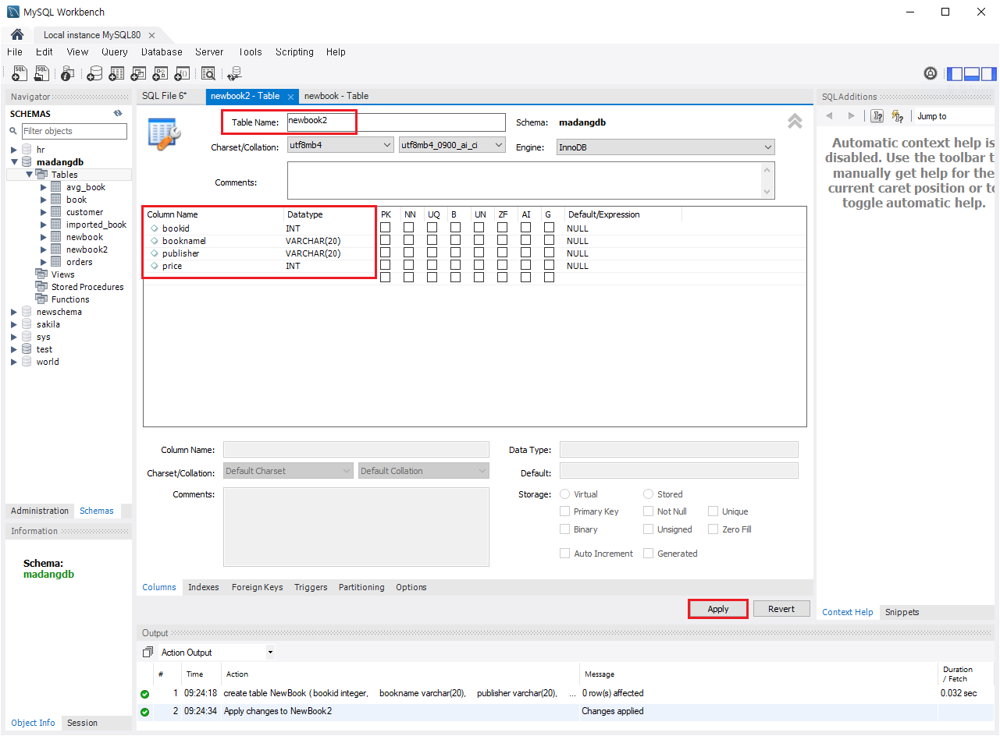
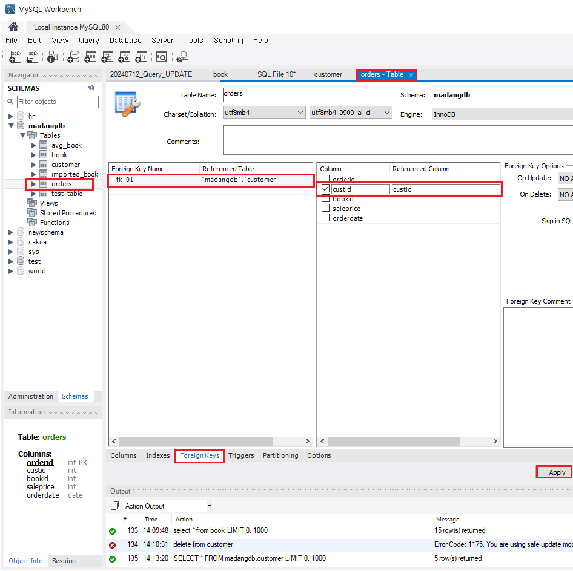

# [2024.07.12(금)] 데이터베이스 - 데이터 정의어(DDL)/데이터 조작어(DML)/내장함수


# chapter03 SQL 기초

## p.182 ch03.04 데이터 정의어

- 데이터 정의어(DDL)은 commit, rollback이 없다.

### p.182 CREATE 문

### MySQL Workbench 테이블 생성 방법

1. create table 코드 작성
    
    ```sql
    create table NewBook (
    	bookid integer,
        bookname varchar(20),
        publisher varchar(20),
        price integer
    );
    ```
    
2. MySQL Workbench GUI 사용 방법
    
    https://pinetreeday.tistory.com/145
    
    - 스키마의 [Tables] → Create Table → 테이블명, 칼럼명 등 작성 후 Apply
        
        
        
- truncate table (rollback 없이 전체 삭제), delete * from ~~~ 테이블에 100 건의 데이터 1 건 1건 삭제 rollback에 대응 
예시 : 1억 건 table truncate 한다. (순식간) 1억 건 table에 대해 delete ...(한참 걸린다.)
- not null 컬럼에 insert, update할 때 null이 들어오면 오류 발생
- unique 동일테이블에 중복된 값을 가진 row X <= PK를 대체하는 용도
        <= 회원, 고객 테이블에 고객번호가 PK이지만, 이메일 컬럼을 unique로 설정하고 로그인시 이 컬럼을 사용
- default : 값이 안들어 오면 (null) 기본값을 가지도록 미리 지정
- auto increment : 칼럼이 insert되면 자동으로 +1된 값을 넣어준다.
    
    ### CREATE 예시 코드 1
    
    ```sql
    create table NewBook (
    	bookid integer,
        bookname varchar(20),
        publisher varchar(20),
        price integer
    );
    
    -- GUI 생성 코드 가져온 코드
    CREATE TABLE newbook2 (
      bookid INT NULL,		-- integer의 mysql 표현
      booknamel VARCHAR(20) NULL,
      publisher VARCHAR(20) NULL,
      price INT NULL
    );
      
    -- 일반적으로 개발자가 테이블을 직접 생성하는 경우는 거의 없다.
    -- DBMS 관리 부서 또는 담당자(DBA)가 별도로 존재하고 이 조직 또는 담당자에게 의뢰해야 한다. 
    -- DB가 시스템 전체 중 최후의 보루(이것이 망가지면 복구 x)
    
    -- truncate table (rollback 없이 전체 삭제), delete * from ~~~ 테이블에 100 건의 데이터 1 건 1건 삭제 rollback에 대응 
    -- 1억 건 table truncate 한다. (순식간) 1억 건 table에 대해 delete ...(한참 걸린다.)
    
    CREATE TABLE `newbook2` (
     `bookid` int DEFAULT NULL,
     `bookname` varchar(20) DEFAULT NULL,
     `publisher` varchar(20) DEFAULT NULL,
     `price` int DEFAULT NULL
     ) ENGINE=InnoDB DEFAULT CHARSET=utf8mb4 COLLATE=utf8mb4_0900_ai_ci;
     
     -- R&R 현업, 개발자(코드), DBA(DBMS 운영관리), 시스템 엔지니어(서버, 네트워크, ... 장비 OS)
     
     -- PK 설정 : 별도 마지막 라인
     create table NewBook (
    	bookid integer, -- PK이므로 not null이 기본 설정
        bookname varchar(20),
        publisher varchar(20),
        price integer,
        primary key (bookid)
    );
    
     -- PK 설정 : 별도 마지막 라인
     create table NewBook (
    	bookid integer primary key, -- PK이므로 not null이 기본 설정
        bookname varchar(20),
        publisher varchar(20),
        price integer
    );
    
    -- PK 설정 : 복합키
     create table NewBook (
    	bookname varchar(20), 
        publisher varchar(20),
        price integer,
        primary key (bookname, publisher)
    );
    
    -- not null 컬럼에 insert, update할 때 null이 들어오면 오류 발생 
    -- unique 동일테이블에 중복된 값을 가진 row X <= PK를 대체하는 용도 
    --        <= 회원, 고객 테이블에 고객번호가 PK이지만, 이메일 컬럼을 unique로 설정하고 로그인시 이 컬럼을 사용
    -- default : 값이 안들어 오면 (null) 기본값을 가지도록 미리 지정 
    
    create table NewBook (
        bookname varchar(20) not null,
        publisher varchar(20) unique,
        price integer default 10000 check (price >= 1000),
        primary key (bookname, publisher)
    );
    
    INSERT INTO newbook (bookname, publisher) VALUES ('111', '222');  -- default 10000 사용 
    INSERT INTO newbook (bookname, publisher, price) VALUES ('111', '333', 20000);  -- 값이 존재해서 20000 사용 
    INSERT INTO newbook (bookname, publisher, price) VALUES ('111', '444', 200);  -- check의 1000보다 작아서 오류 (Check constraint...)
    
    -- auto increment
    -- test table 생성(GUI)
    CREATE TABLE test_table (
      id INT NOT NULL AUTO_INCREMENT,
      name VARCHAR(45) NULL,
      PRIMARY KEY (id));
      
    insert into test_table (name) values ('aaa');
    insert into test_table (name) values ('bbb');
    insert into test_table (name) values ('ccc');
    insert into test_table (name) values ('ddd');
    insert into test_table (name) values ('eee');
    ```
    
- Foreign Key : 관계속에서 데이터의 무결성을 지키기 위해 Foreign Key를 이용한다.
- 없는 custid(외래키)를 사용해서 neworders에 insert할 때 ‘Error Code: 1452. Cannot add or update a child row’ 오류가 발생한다.
- 외래키가 참조하는 칼럼을 삭제하려고 할 때 ‘Error Code: 1451. Cannot delete or update a parent row’ 오류가 발생한다.
- on delete cascade : FK 사용되고 있는 부모를 삭제하려고 할 때 삭제되는 부모 칼럼을 사용하는 자식 테이블의 칼럼도 같이 삭제된다.
- on delete set null : FK로 사용되고 있는 부모를 삭제하려고 할 때 자식의 데이터가 삭제되지 않고 외래키 컬럼의 값이 null로 변경된다.
    
    ### CREATE 예시 코드 2
    
    ```sql
    -- ---------- Foreign Key -------------
    create table NewCustomer(
    	custid Integer Primary key,
        name varchar(40),
        address varchar(40),
        phone varchar(30)
    );
    
    create table NewOrders (
    	orderid Integer, 
        custid Integer not null,
        bookid Integer not null,
        saleprice integer,
        orderdate date,
        primary key(orderid),
        foreign key(custid) references NewCustomer(custid)
    );
    
    -- 관계속에서 데이터의 무결성을 지키기 위해 Foreign Key를 이용 
    INSERT INTO newcustomer (custid, name, address, phone) VALUES (1, '홍길동', '주소1', '010-1111-1111');
    INSERT INTO newcustomer (custid, name, address, phone) VALUES (2, '이길동', '주소2', '010-2222-2222');
    
    INSERT INTO neworders (orderid, custid, bookid, saleprice, orderdate) VALUES (1, 1, 1, 1000, '2024-01-01');
    INSERT INTO neworders (orderid, custid, bookid, saleprice, orderdate) VALUES (2, 1, 2, 2000, '2024-02-02');
    INSERT INTO neworders (orderid, custid, bookid, saleprice, orderdate) VALUES (3, 2, 3, 3000, '2024-03-03');
    
    -- 자식쪽
    -- 없는 custid를 사용해서 neworders에 insert할 때 
    INSERT INTO neworders (orderid, custid, bookid, saleprice, orderdate) VALUES (4, 10, 3, 3000, '2024-03-03');
    -- Error Code: 1452. Cannot add or update a child row
    
    -- 있는  custid 를 없는 custid 로 update 하려 할 때
    update neworders set custid = 10 where orderid = 3;
    -- Error Code: 1452. Cannot add or update a child row
    
    -- 부모쪽
    -- FK 사용되고 있는 부모를 삭제하려고 할 때
    delete from newcustomer where custid = 1;
    -- Error Code: 1451. Cannot delete or update a parent row
    
    -- drop하고 새로 NewOrders 테이블 생성
    drop table NewOrders;
    create table NewOrders (
    	orderid Integer, 
        custid Integer not null,
        bookid Integer not null,
        saleprice integer,
        orderdate date,
        primary key(orderid),
        foreign key(custid) references NewCustomer(custid) on delete cascade -- 부모가 row가 삭제되면 함께 삭제 
    );
    
    INSERT INTO neworders (orderid, custid, bookid, saleprice, orderdate) VALUES (1, 1, 1, 1000, '2024-01-01');
    INSERT INTO neworders (orderid, custid, bookid, saleprice, orderdate) VALUES (2, 1, 2, 2000, '2024-02-02');
    INSERT INTO neworders (orderid, custid, bookid, saleprice, orderdate) VALUES (3, 2, 3, 3000, '2024-03-03');
    
    -- FK 사용되고 있는 부모를 삭제하려고 할 때 
    delete from newcustomer where custid = 1;
    
    -- on delete set null
    -- FK에 위배되면 해당 외래키 칼럼은 null로 바꾼다.
    -- drop하고 새로 NewOrders 테이블 생성
    drop table NewOrders;
    create table NewOrders (
    	orderid Integer, 
        custid Integer,
        bookid Integer not null,
        saleprice integer,
        orderdate date,
        primary key(orderid),
        foreign key(custid) references NewCustomer(custid) on delete set null -- 부모가 row가 삭제되면 함께 삭제 
    );
    
    INSERT INTO newcustomer (custid, name, address, phone) VALUES (1, '홍길동', '주소1', '010-1111-1111'); -- 삭제된 홍길동 추가
    
    INSERT INTO neworders (orderid, custid, bookid, saleprice, orderdate) VALUES (1, 1, 1, 1000, '2024-01-01');
    INSERT INTO neworders (orderid, custid, bookid, saleprice, orderdate) VALUES (2, 1, 2, 2000, '2024-02-02');
    INSERT INTO neworders (orderid, custid, bookid, saleprice, orderdate) VALUES (3, 2, 3, 3000, '2024-03-03');
    
    -- FK 사용되고 있는 부모를 삭제하려고 할 때 
    delete from newcustomer where custid = 1;
    -- neworders의 데이터가 삭제되지 않고 custid 컬럼의 값이 null로 변경된다.
    ```
    

### p.187 ALTER 문

```sql
-- ALTER 

drop table newbook;
create table NewBook (
	bookid integer,
    bookname varchar(20),
    publisher varchar(20),
    price integer
);

alter table newbook add isbn varchar(130);
alter table newbook modify isbn integer;
alter table newbook drop column isbn; -- column 생략 가능 (mysql)
alter table newbook modify bookname varchar(20) not null;
desc newbook; -- bookname varchar(20) not null 확인
alter table newbook add primary key(bookid);

-- DROP
drop table NewBook;
drop table newcustomer;
-- Error Code: 3730. Cannot drop table 'newcustomer' referenced by a foreign key constraint 

-- delete 후 neworders에는 newcustomer를 참조하는 데이터가 없다. 
DELETE FROM neworders WHERE orderid = 3;

drop table newcustomer;
-- 참조하는 부모 데이터가 없어도 drop이 불가능하다. <- 데이터를 보고 그때그때 판단하는 것이 아니고, drop 명령어 자체에 연결되어 있는 오류 
-- 데이터와 상관없이 FK로 사용되고 있는 테이블은 삭제할 수 없다.

-- 결론적으로 drop할 때는 자식 테이블을 먼저 삭제하고 부모 테이블을 나중에 삭제해야 한다.

-- neworders drop
-- newcustomer truncate 성공

INSERT INTO newcustomer (custid, name, address, phone) VALUES (1, '홍길동', '주소1', '010-1111-1111');
INSERT INTO newcustomer (custid, name, address, phone) VALUES (2, '이길동', '주소2', '010-2222-2222');

create table NewOrders (
	orderid Integer, 
    custid Integer not null,
    bookid Integer not null,
    saleprice integer,
    orderdate date,
    primary key(orderid),
    foreign key(custid) references NewCustomer(custid)
);

INSERT INTO neworders (orderid, custid, bookid, saleprice, orderdate) VALUES (1, 1, 1, 1000, '2024-01-01');
INSERT INTO neworders (orderid, custid, bookid, saleprice, orderdate) VALUES (2, 1, 2, 2000, '2024-02-02');
INSERT INTO neworders (orderid, custid, bookid, saleprice, orderdate) VALUES (3, 2, 3, 3000, '2024-03-03');

-- neworders truncate 성공
-- newcustomer truncate 오류 발생

-- neworders에 테이블이 있고, 데이터가 없는 상태에서 newcustomer는 truncate가 안된다. 데이터 유무와 상관없이
-- neworders 테이블이 없으면 truncate된다. 

```

### p.189 DROP 문

## p.190 ch03.05 데이터 조작어 - 삽입, 수정, 삭제

### p.190 INSERT 문

- **다른 테이블의 데이터를 select해서 insert**
예시 - insert into book (bookid, bookname, publisher, price) 
	select bookid, bookname, publisher, price from imported_book;
- **create as select** : 테이블 복사 또는 임시 테이블을 만드는 경우이다.
    
    pk 없다. create select는 단순 데이터 복사이다.
    

```sql
-- INSERT 
-- 질의 3-44
insert into book (bookid, bookname, publisher, price) values (11, '스포츠 의학', '한솔의학서적', 90000);

-- 전체 컬럼에 대한 입력(values)이면 컬럼명 생략
insert into book values (11, '스포츠 의학', '한솔의학서적', 90000);
-- Error Code: 1062. Duplicate entry '11' for key 'book.PRIMARY'

insert into book values (12, '스포츠 의학', '한솔의학서적', 90000);  -- 모든 컬럼에 대한 value, 순서 중요.

insert into book (bookid, bookname, price, publisher) values (13, '스포츠 의학', 90000, '한솔의학서적');

-- 질의 3-45
insert into book (bookid, bookname, publisher) values (14, '스포츠 의학', '한솔의학서적');

-- 질의 3-46 다른 테이블의 데이터를 select해서 insert
insert into book (bookid, bookname, publisher, price) 
	select bookid, bookname, publisher, price from imported_book;

-- 아래 2개도 모두 가능 ( 이유 : 테이블의 구조가 동일하기 때문에 가능하다.)
insert into book (bookid, bookname, publisher, price) 
	select * from imported_book;
    
insert into book 
	select * from imported_book;
    
-- imported_book에 컬럼 추가
ALTER TABLE imported_book
ADD COLUMN isbn VARCHAR(45) NULL AFTER publisher;

insert into book select * from imported_book;  -- column doesn't match 오류

insert into book (bookid, bookname, publisher, price) 	-- column doesn't match 오류
	select * from imported_book;
    
insert into book (bookid, bookname, publisher, price)  -- 문제 없다. 테이블 구조가 달라도 select 항목과 insert 항목이 맞으면 된다. 
	select bookid, bookname, publisher, price from imported_book;
    
-- create as select : 테이블 복사 또는 임시 테이블을 만드는 경우
create table book_temp select * from book;

select * from book_temp;

desc book;
desc book_temp; -- pk 없다. create select는 단순 데이터 복사 

drop table book_temp;
create table book_temp select bookname, price from book limit 10;  -- 컬럼 선택, row 선택 가능

select * from book_temp;
```

### p.193 UPDATE 문

- select @@sql_safe_updates; 가 0이면 기능 off, 1이면 기능이 on되어 있다.
- sql_safe_updates가 1이면 update, delete 작업 시 반드시 key 컬럼에 조건을 줘야 한다. set sql_safe_updates = 1; (default)
- @@가 붙은 것은 mysql의 환경변수이다.

```sql
-- UPDATE 
/*
update 테이블명
	set 컬럼1 = value1 (, 컬럼2 = value, ...)
where 대상 row 선택 
*/

select * from customer;

-- 질의 3-47
update customer
	set address = '대한민국 부산'
where custid = 5;

update customer
	set address = '대한민국 대전'
where name = '박세리';

select @@sql_safe_updates;  -- 0: off, 1: on -- @@가 붙은 것은 mysql의 환경변수 
set sql_safe_updates = 1;  -- update, delete 작업 시 반드시 key 컬럼에 조건을 줘야 한다. 

-- 질의 3-48
-- update with subquery
select * from book;
select * from imported_book;

update book
	set publisher = (select publisher from imported_book where bookid=21) -- single row, single col이므로 가능하다. 
where bookid = 14;

update book
	set publisher = (select publisher from imported_book where bookid=21) -- single row, single col이므로 가능하다. 
where bookid = 14;
-- multi row, single col -- subquery returns more than 1 rows 오류alter

update book
	set publisher = (select publisher from imported_book where bookid=40) -- single row, single col이므로 가능하다. 
where bookid = 14;  -- 없는 row, 오류는 발생하지 않지만 null로 변경

select publisher from imported_book where bookid=21;

update book
	set publisher='임시 출판사'
where bookid in (select bookid from imported_book);
```

### p.197 DELETE 문

```sql
-- DELETE 
/*
delete from 테이블 
where 조건 
*/

-- 질의 3-49

delete from book
where bookid = 11;

select * from book;

-- 질의 3-50
-- customer, orders FK 관계 확인
-- 데이터 없으면 추가 
INSERT INTO Customer VALUES (1, '박지성', '영국 맨체스타', '000-5000-0001');
INSERT INTO Customer VALUES (2, '김연아', '대한민국 서울', '000-6000-0001');
INSERT INTO Customer VALUES (3, '김연경', '대한민국 경기도', '000-7000-0001');
INSERT INTO Customer VALUES (4, '추신수', '미국 클리블랜드', '000-8000-0001');
INSERT INTO Customer VALUES (5, '박세리', '대한민국 대전',  NULL);

-- mysql workbench alter table 메뉴를 이용해서 FK 추가

delete from customer;  -- safe update error

set sql_safe_updates = 0;

delete from customer; -- FK 오류 

select * from customer;

-- delete whith subquery
delete from book
where bookid in (select bookid from imported_book);
```

- **mysql workbench alter table 메뉴를 이용해서 FK 추가하는 방법**
    
    
    

# chapter04 SQL 고급

## p.219 ch04.01 내장 함수, NULL

- 왜 PL-SQL을 놔두고 java를 사용해야 하는가?
DB를 만들어 놓고 잘 바꾸지 않으면 PL-SQL을 사용하면 더 빠르다.
    
    오라클 서버들이 동작한다. 요청이 들어오면 바깥에 애플리케이션들이 로드밸런싱되어 오라클로 접근한다. 3개의 오라클은 모두 같은 DB이다. 모두 같은 데이터를 유지하기 위해 오라클의 기술인 RAC라는 기술로 데이터가 복제 된다. 애플리케이션은 컨트롤러, 서비스(비즈니스 로직), DAO가 있다. DAO는 DB접속만 관여하여 서비스는 여러 DAO를 왔다갔다 한다.)
    PL-SQL은 애플리케이션 서비스에 구현되어 있는 영역이 하나의 오라클 안에 있는 것이다. 여러 커넥션을 통해 얻을 수 있는 값이 한 오라클 안에서 처리되어 돌아온다.
    
    고객이 원하는 속도가 java로 나오지 않을 때 PL-SQL로 만드는 것도 좋은 방법이다.
    
- 모든 DBMS 내장 함수는 문자열, 날짜 formmating, UI관련 함수가 많다.
이것들은 프론트엔드가 하는 역할이다.
DB는 데이터만 잘 전달하면 된다. 백엔드는 DB에서 가져온 데이터를 프론트가 필요한 데이터로 가공해서 전달만 하면 된다.

- select orderid, date_format(orderdate, '%Y/%m/%d') '주문일자', custid, bookid
from orders where orderdate = '20240707';  -- mysql은 가능하지만 다른 DBMS는 일반적으로 type을 일치시켜야 한다.
- select orderid, date_format(orderdate, '%Y/%m/%d') '주문일자', custid, bookid
from orders where orderdate = str_to_date('20240707', '%Y%m%d');  -- 오른쪽 타입을 왼쪽 타입에 맞춘다.
- select orderid, date_format(orderdate, '%Y/%m/%d') '주문일자', custid, bookid
from orders where date_format(orderdate, '%Y%m%d') = '20240707'; -- 왼쪽 타입을 오른쪽 타입에 맞춘다.
- - 동일한 결과가 나오는 위 2개의 쿼리 중 어느 것이 더 좋은까? 위의 쿼리가 좋다.
-- 1. 위 쿼리는 str -> date로 1번 바꾸고 이후의 모든 orderdate와 비교한다.
--	orderdate 컬럼에 생성된 index에 영향을 주지 않는다. (index를 탄다.)
-- 2. 아래의 쿼리는 모든 row의 orderdate value를 date -> str하고 비교한다. (손해가 크다.)
--	orderdate 컬럼에 생성된 index를 타지 않는다. index에 저장된 값과 달리 변형되기 때문이다.
    
    ```sql
    -- 2 가지의 function
    -- 제공되는 function, 사용자 정의 function
    -- 제공되는 function(내장 함수)은 정말 DBMS마다 다 다르다 (mySQL과 Oracle이 완전 다르다)
    
    -- 숫자 함수
    -- 질의 4-1
    select abs(-78), abs(78) from dual;
    select abs(-78), abs(78);
    
    --  질의 4-2
    select round(4.875,1); -- 소수점 X 자리까지 반올림한다.
    
    -- 질의 4-3
    -- round(..., 음수)는 소수점 왼쪽(정수자리)를 의미한다.
    -- 3번째 row custid = 3인 항목 체크 
    select custid, round(sum(saleprice)/count(*), -2), avg(saleprice) from orders group by custid;
    
    -- 질의 4-4
    -- replace()는 일치하는 모든 문자열을 다 바꾼다. 
    select bookid, bookname, replace(bookname, '야구', '농구') new_bookname, publisher, price from book;
    
    -- 위 테스트를 위한 수정 
    update book set bookname = '야구의 야구의 야구의 추억' where bookid = 7;
    -- 원복 
    update book set bookname = '야구의 추억' where bookid = 7;
    
    -- 질의 4-5
    -- length(), char_length()
    select bookname '제목', char_length(bookname), length(bookname) from book;
    -- char_length()는 char 수, length는 byte 수를 반환한다.
    -- length 예시 : 축구의 역사 = 한글 5 x 3(byte) + space 1 = 16
    -- utf-8 (3 byte로 유니코드 구현) utf-16 (4 byte로 유니코드 구현)
    -- euc-kr (2 byte)
    -- blob, clob
    
    -- 질의 4-6
    select * from customer;
    
    -- group by 절에 alias를 사용할 때는 '성' 같은 문자열 alias 사용 안된다. 
    select substr(name, 2, 1) last_name, count(*) '인원' from customer group by last_name;
    
    -- 질의 4-7
    -- date(날짜) vs datetime(날짜 + 시간)
    select orderid, orderdate, adddate(orderdate, interval 20 day) from orders; -- 정확한 일별 계산 
    
    -- 교재 227
    select sysdate(), date_format(sysdate(), '%Y-%m-%d : %H:%i:%s');
    
    -- 질의 4-8
    select orderid, date_format(orderdate, '%Y/%m/%d') '주문일자', custid, bookid 
    from orders where orderdate = '20240707';  -- mysql은 가능하지만 다른 DBMS는 일반적으로 type을 일치시켜야 한다.
    
    select orderid, date_format(orderdate, '%Y/%m/%d') '주문일자', custid, bookid 
    from orders where orderdate = str_to_date('20240707', '%Y%m%d');  -- 오른쪽 타입을 왼쪽 타입에 맞춘다.
    
    select orderid, date_format(orderdate, '%Y/%m/%d') '주문일자', custid, bookid 
    from orders where date_format(orderdate, '%Y%m%d') = '20240707'; -- 왼쪽 타입을 오른쪽 타입에 맞춘다.
    
    -- 동일한 결과가 나오는 위 2개의 쿼리 중 어느 것이 더 좋은까? 위의 쿼리가 좋다.
    -- 1. 위 쿼리는 str -> date로 1번 바꾸고 이후의 모든 orderdate와 비교한다.
    -- 		orderdate 컬럼에 생성된 index에 영향을 주지 않는다. (index를 탄다.)
    -- 2. 아래의 쿼리는 모든 row의 orderdate value를 date -> str하고 비교한다. (손해가 크다.)
    -- 		orderdate 컬럼에 생성된 index를 타지 않는다. index에 저장된 값과 달리 변형되기 때문이다.
    
    -- 질의 4-9
    select sysdate();
    select date_format(sysdate(), '%Y %m %d %a %H %i %s');
    
    -- insert 시점 현재 시각
    insert into orders(orderid, custid, bookid, saleprice, orderdate) values(20, 3, -1, 13000, sysdate());
    
    insert into orders(orderid, custid, bookid, saleprice, orderdate) values(21, 3, -1, 13000, now());
    
    insert into orders(orderid, custid, bookid, saleprice, orderdate) values(22, 3, -1, 13000, curdate());
    
    -- sysdate() vs now()
    -- sysdate()는 항상 실행 시점 시간이고, now()는 전체 스테이트먼트가 종료될 때까지 같은 값이 들어간다.
    -- 1건은 거의 차이가 없지만, 스테이트, 트랜잭션에서 처음부터 종료까지가 하나로 들어가야 할 때는 now()를 사용한다. 
    
    -- datetime type의 default와 
    ```