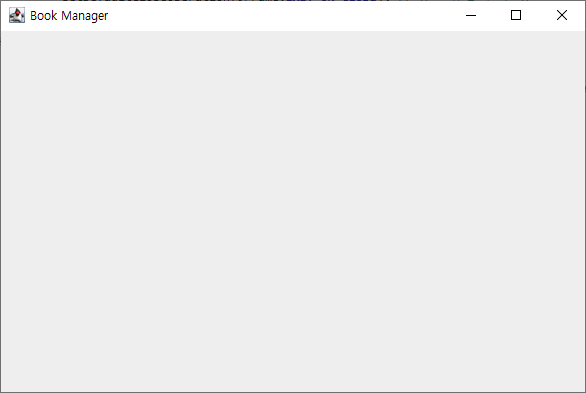
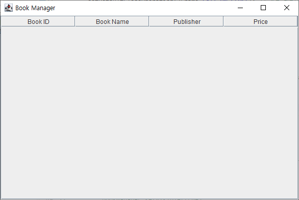
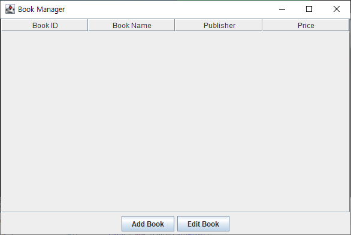
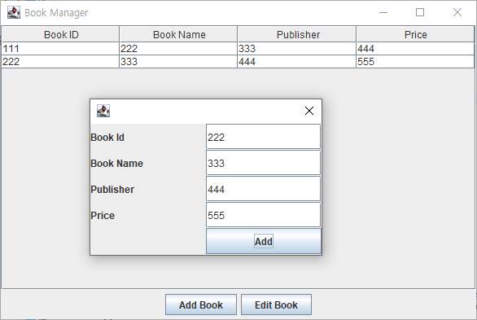
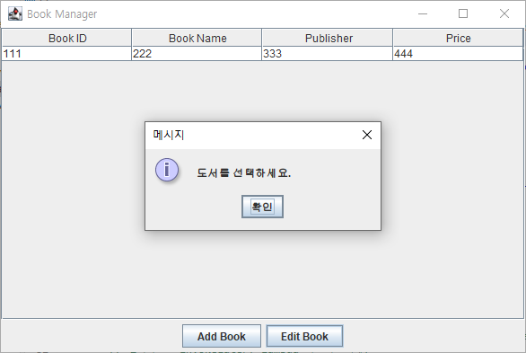
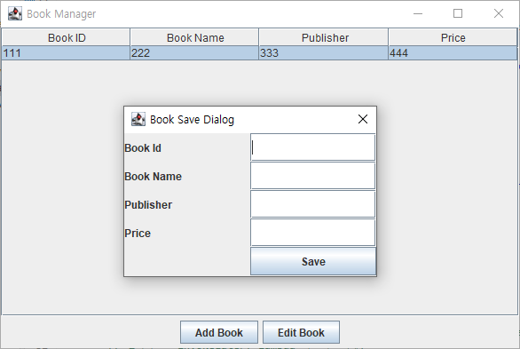
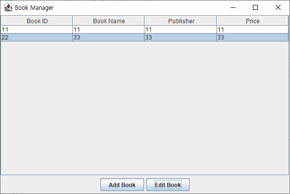
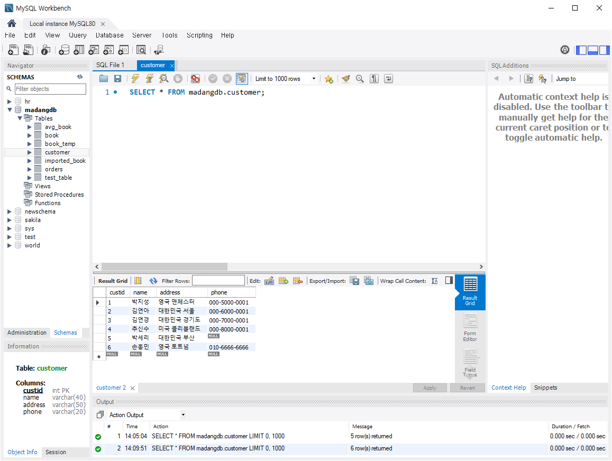

# [2024.07.16(화)] Swing/JDBC


# Swing

## Swing 패키지를 활용하여 Java로 팝업 화면 띄우기

```java
package swing.book;

import javax.swing.JFrame; // windows application
import javax.swing.SwingUtilities;

public class BookManager extends JFrame{ 

	public BookManager() {
		// 화면 UI와 관련된 설정
		setTitle("Book Manager");
		setSize(600, 400);
		setDefaultCloseOperation(JFrame.EXIT_ON_CLOSE); // 종료 버튼을 누르면 종료
	}
	
	public static void main(String[] args) {
		// main() thread와 별개로 별도의 thread로 화면을 띄운다.
		// thread 처리를 간단히 해주는 utility method 제공한다.
		// invokeLater( thread 객체 <- runnable interface를 구현한 <- runnable interface가 functional interface
		// 결과적으로 invokeLater( lambda 식 표현 객체)
		SwingUtilities.invokeLater(() -> {
			new BookManager().setVisible(true);
//			BookManager bookManager = new BookManager();
//			bookManager.setVisible(true);
		});

	}

}
```

### 결과



## 테이블 형식으로 데이터 보여주기

```java
package swing.book;

import java.awt.BorderLayout;

import javax.swing.JButton;
import javax.swing.JFrame; // windows application
import javax.swing.JScrollPane;
import javax.swing.JTable;
import javax.swing.SwingUtilities;
import javax.swing.table.DefaultTableModel;

public class BookManager extends JFrame{ 
	
	// tableModel이 값을 가지고 있고 table 형식을 가지고 있어서 둘이 연계하여 화면을 보여준다.
	private JTable table; // grid ui component
	private DefaultTableModel tableModel;	// grid 형태의 data롤 표현
	private JButton addButton, editButton;	// 버튼 생성

	public BookManager() {
		// 화면 UI와 관련된 설정
		setTitle("Book Manager");
		setSize(600, 400);
		setDefaultCloseOperation(JFrame.EXIT_ON_CLOSE); // 종료 버튼을 누르면 종료
		
		// table
		// int[][] ab = new int[]{1,2,3} 형식
		// DefaultTableModel(row에 넣을 값 객체, rowCount);
		tableModel = new DefaultTableModel(new Object[] {"Book ID", "Book Name", "Publisher", "Price"}, 0);
		table = new JTable(tableModel);
		
		// table을 BookManager에 붙인다.
		// BookManager의 layout에 따라 결정된다.
		// BookManager layout 종류 : Gridlayout, BorderLayout, CardLayout ...
		
		// BookManager의 layout 설정
		setLayout(new BorderLayout());
		add(table, BorderLayout.CENTER);
		add(new JScrollPane(table), BorderLayout.CENTER); // table < scroll pane < jframe 형태로 table이 많아지면 스크롤이 생기도록 함.
	}
	
	public static void main(String[] args) {
		// main() thread와 별개로 별도의 thread로 화면을 띄운다.
		// thread 처리를 간단히 해주는 utility method 제공한다.
		// invokeLater( thread 객체 <- runnable interface를 구현한 <- runnable interface가 functional interface
		// 결과적으로 invokeLater( lambda 식 표현 객체)
		SwingUtilities.invokeLater(() -> {
			new BookManager().setVisible(true);
//			BookManager bookManager = new BookManager();
//			bookManager.setVisible(true);
		});

	}

}
```

### 결과



## BookManager의 BorderLayout SOUTH에 버튼 2개 추가하기

```java
package swing.book;

import java.awt.BorderLayout;

import javax.swing.JButton;
import javax.swing.JFrame; // windows application
import javax.swing.JPanel;
import javax.swing.JScrollPane;
import javax.swing.JTable;
import javax.swing.SwingUtilities;
import javax.swing.table.DefaultTableModel;

public class BookManager extends JFrame{ 
	
	// tableModel이 값을 가지고 있고 table 형식을 가지고 있어서 둘이 연계하여 화면을 보여준다.
	private JTable table; // grid ui component
	private DefaultTableModel tableModel;	// grid 형태의 data롤 표현
	private JButton addButton, editButton;	// 버튼 생성

	public BookManager() {
		// 화면 UI와 관련된 설정
		setTitle("Book Manager");
		setSize(600, 400);
		setDefaultCloseOperation(JFrame.EXIT_ON_CLOSE); // 종료 버튼을 누르면 종료
		
		// table
		// int[][] ab = new int[]{1,2,3} 형식
		// DefaultTableModel(row에 넣을 값 객체, rowCount);
		tableModel = new DefaultTableModel(new Object[] {"Book ID", "Book Name", "Publisher", "Price"}, 0);
		table = new JTable(tableModel);
		
		// Button
		addButton = new JButton("Add Book");
		editButton = new JButton("Edit Book");
		
		// bookManager의 BorderLayout SOUTH에 버튼을 2개 담을 수 없으므로 다른 패널에 버튼 2개를 담아서 붙인다.
		// button 2개를 담는 JPanel 객체를 만들고 그 객체를 BookManager에 담는다.
		JPanel buttonPanel = new JPanel(); // default layout : Flow Layout
		buttonPanel.add(addButton);
		buttonPanel.add(editButton);
		
		// table을 BookManager에 붙인다.
		// BookManager의 layout에 따라 결정된다.
		// BookManager layout 종류 : Gridlayout, BorderLayout, CardLayout ...
		
		// BookManager의 layout 설정
		setLayout(new BorderLayout());
		// add(table, BorderLayout.CENTER);
		add(new JScrollPane(table), BorderLayout.CENTER); // table < scroll pane < jframe 형태로 table이 많아지면 스크롤이 생기도록 함.
		add(buttonPanel, BorderLayout.SOUTH);
	}
	
	public static void main(String[] args) {
		// main() thread와 별개로 별도의 thread로 화면을 띄운다.
		// thread 처리를 간단히 해주는 utility method 제공한다.
		// invokeLater( thread 객체 <- runnable interface를 구현한 <- runnable interface가 functional interface
		// 결과적으로 invokeLater( lambda 식 표현 객체)
		SwingUtilities.invokeLater(() -> {
			new BookManager().setVisible(true);
//			BookManager bookManager = new BookManager();
//			bookManager.setVisible(true);
		});

	}

}
```

### 결과



## 버튼 이벤트 처리하기

```java
package swing.book;

import java.awt.BorderLayout;
import java.awt.event.ActionEvent;
import java.awt.event.ActionListener;

import javax.swing.JButton;
import javax.swing.JFrame; // windows application
import javax.swing.JPanel;
import javax.swing.JScrollPane;
import javax.swing.JTable;
import javax.swing.SwingUtilities;
import javax.swing.table.DefaultTableModel;

public class BookManager extends JFrame{ 
	
	// tableModel이 값을 가지고 있고 table 형식을 가지고 있어서 둘이 연계하여 화면을 보여준다.
	private JTable table; // grid ui component
	private DefaultTableModel tableModel;	// grid 형태의 data롤 표현
	private JButton addButton, editButton;	// 버튼 생성

	public BookManager() {
		// 화면 UI와 관련된 설정
		setTitle("Book Manager");
		setSize(600, 400);
		setDefaultCloseOperation(JFrame.EXIT_ON_CLOSE); // 종료 버튼을 누르면 종료
		
		// table
		// int[][] ab = new int[]{1,2,3} 형식
		// DefaultTableModel(row에 넣을 값 객체, rowCount);
		tableModel = new DefaultTableModel(new Object[] {"Book ID", "Book Name", "Publisher", "Price"}, 0);
		table = new JTable(tableModel);
		
		// Button
		addButton = new JButton("Add Book");
		editButton = new JButton("Edit Book");
		
		// bookManager의 BorderLayout SOUTH에 버튼을 2개 담을 수 없으므로 다른 패널에 버튼 2개를 담아서 붙인다.
		// button 2개를 담는 JPanel 객체를 만들고 그 객체를 BookManager에 담는다.
		JPanel buttonPanel = new JPanel(); // default layout : Flow Layout
		buttonPanel.add(addButton);
		buttonPanel.add(editButton);
		
		// table을 BookManager에 붙인다.
		// BookManager의 layout에 따라 결정된다.
		// BookManager layout 종류 : Gridlayout, BorderLayout, CardLayout ...
		
		// BookManager의 layout 설정
		setLayout(new BorderLayout());
		// add(table, BorderLayout.CENTER);
		add(new JScrollPane(table), BorderLayout.CENTER); // table < scroll pane < jframe 형태로 table이 많아지면 스크롤이 생기도록 함.
		add(buttonPanel, BorderLayout.SOUTH);
		
		// button action event 처리
		// event 객체를 받아서 처리하는 로직을 가진 객체 <= ActionListener interface를 구현해야 한다.
		addButton.addActionListener(e -> { 
				System.out.println("addButton!!");
		}); 
		
		editButton.addActionListener(new ActionListener() { 
			
			@Override
			public void actionPerformed(ActionEvent e) { // 버튼을 누르면 실행됨.
				System.out.println("editButton!!");
			}
		}); 
	}
	
	public static void main(String[] args) {
		// main() thread와 별개로 별도의 thread로 화면을 띄운다.
		// thread 처리를 간단히 해주는 utility method 제공한다.
		// invokeLater( thread 객체 <- runnable interface를 구현한 <- runnable interface가 functional interface
		// 결과적으로 invokeLater( lambda 식 표현 객체)
		SwingUtilities.invokeLater(() -> {
			new BookManager().setVisible(true);
//			BookManager bookManager = new BookManager();
//			bookManager.setVisible(true);
		});

	}

}
```

### 결과

```java
console
addButton!!
editButton!!
editButton!!
editButton!!
addButton!!
addButton!!
addButton!!
```

## 모달 팝업으로 BookManager Table에 입력 받기

### AddBookDialog.java

```java
package swing.book;

import java.awt.GridLayout;

import javax.swing.JButton;
import javax.swing.JDialog;
import javax.swing.JLabel;
import javax.swing.JTextField;
import javax.swing.table.DefaultTableModel;

public class AddBookDialog extends JDialog {
	private JTextField bookIdField, bookNameField, publisherField, priceField;
	private JButton addButton;
	// private DefaultTableModel tableModel; // 간단한 처리는 객체를 생성하지 않고 받은 파라미터로 처리해도 된다.
	
	// 부모 BookManager table 화면에 내용을 띄우기 위하여 생성자에서 부모의 tableModel 객체를 받는다.
	public AddBookDialog(DefaultTableModel tableModel) {
		// this.tableModel = tableModel;
		
		setSize(300, 200);
		setLayout(new GridLayout(5,2)); // 행 : 5, 열 : 2
		
		// field
		bookIdField = new JTextField();
		bookNameField = new JTextField();
		publisherField = new JTextField();
		priceField = new JTextField();
		
		// button
		addButton = new JButton("Add");
		
		// add field with label
		add(new JLabel("Book Id"));
		add(bookIdField);
		add(new JLabel("Book Name"));
		add(bookNameField);
		add(new JLabel("Publisher"));
		add(publisherField);
		add(new JLabel("Price"));
		add(priceField);
		
		add(new JLabel(""));
		add(addButton);
		
		// add button actionListner
		addButton.addActionListener(e -> {
			String bookId = bookIdField.getText();
			String bookName = bookNameField.getText();
			String publisher = publisherField.getText();
			String price = priceField.getText();
			
			// System.out.println(bookId + " " + bookName + " " + publisher + " " + price);
			tableModel.addRow(new Object[] {bookId, bookName, publisher, price});
		});
	}
}
```

### BookManager.java

```java
package swing.book;

import java.awt.BorderLayout;
import java.awt.event.ActionEvent;
import java.awt.event.ActionListener;

import javax.swing.JButton;
import javax.swing.JFrame; // windows application
import javax.swing.JPanel;
import javax.swing.JScrollPane;
import javax.swing.JTable;
import javax.swing.SwingUtilities;
import javax.swing.table.DefaultTableModel;

public class BookManager extends JFrame{ 
	
	// tableModel이 값을 가지고 있고 table 형식을 가지고 있어서 둘이 연계하여 화면을 보여준다.
	private JTable table; // grid ui component
	private DefaultTableModel tableModel;	// grid 형태의 data롤 표현
	private JButton addButton, editButton;	// 버튼 생성

	public BookManager() {
		// 화면 UI와 관련된 설정
		setTitle("Book Manager");
		setSize(600, 400);
		setDefaultCloseOperation(JFrame.EXIT_ON_CLOSE); // 종료 버튼을 누르면 종료
		
		// table
		// int[][] ab = new int[]{1,2,3} 형식
		// DefaultTableModel(row에 넣을 값 객체, rowCount);
		tableModel = new DefaultTableModel(new Object[] {"Book ID", "Book Name", "Publisher", "Price"}, 0);
		table = new JTable(tableModel);
		
		// Button
		addButton = new JButton("Add Book");
		editButton = new JButton("Edit Book");
		
		// bookManager의 BorderLayout SOUTH에 버튼을 2개 담을 수 없으므로 다른 패널에 버튼 2개를 담아서 붙인다.
		// button 2개를 담는 JPanel 객체를 만들고 그 객체를 BookManager에 담는다.
		JPanel buttonPanel = new JPanel(); // default layout : Flow Layout
		buttonPanel.add(addButton);
		buttonPanel.add(editButton);
		
		// table을 BookManager에 붙인다.
		// BookManager의 layout에 따라 결정된다.
		// BookManager layout 종류 : Gridlayout, BorderLayout, CardLayout ...
		
		// BookManager의 layout 설정
		setLayout(new BorderLayout());
		// add(table, BorderLayout.CENTER);
		add(new JScrollPane(table), BorderLayout.CENTER); // table < scroll pane < jframe 형태로 table이 많아지면 스크롤이 생기도록 함.
		add(buttonPanel, BorderLayout.SOUTH);
		
		// button action event 처리
		// event 객체를 받아서 처리하는 로직을 가진 객체 <= ActionListener interface를 구현해야 한다.
		addButton.addActionListener(e -> { 
				// AddBookDialog를 띄운다.
			AddBookDialog addDialog = new AddBookDialog(this.tableModel);
			addDialog.setVisible(true);
		}); 
		
		editButton.addActionListener(new ActionListener() { 
			
			@Override
			public void actionPerformed(ActionEvent e) { // 버튼을 누르면 실행됨.
				System.out.println("editButton!!");
			}
		}); 
	}
	
	public static void main(String[] args) {
		// main() thread와 별개로 별도의 thread로 화면을 띄운다.
		// thread 처리를 간단히 해주는 utility method 제공한다.
		// invokeLater( thread 객체 <- runnable interface를 구현한 <- runnable interface가 functional interface
		// 결과적으로 invokeLater( lambda 식 표현 객체)
		SwingUtilities.invokeLater(() -> {
			new BookManager().setVisible(true);
//			BookManager bookManager = new BookManager();
//			bookManager.setVisible(true);
		});

	}

}
```

### 결과



## 모달 팝업 위치 변경

### AddBookDialog.java

```java
package swing.book;

import java.awt.GridLayout;

import javax.swing.JButton;
import javax.swing.JDialog;
import javax.swing.JFrame;
import javax.swing.JLabel;
import javax.swing.JTextField;
import javax.swing.table.DefaultTableModel;

public class AddBookDialog extends JDialog {
	private JTextField bookIdField, bookNameField, publisherField, priceField;
	private JButton addButton;
	// private DefaultTableModel tableModel; // 간단한 처리는 객체를 생성하지 않고 받은 파라미터로 처리해도 된다.
	
	// 부모 BookManager table 화면에 내용을 띄우기 위하여 생성자에서 부모의 tableModel 객체를 받는다.
	public AddBookDialog(JFrame parent, DefaultTableModel tableModel) {
		// this.tableModel = tableModel;
		
		setTitle("Book Add Dialog");
		setSize(300, 200);
		setLayout(new GridLayout(5,2)); // 행 : 5, 열 : 2
		setLocationRelativeTo(parent); // 부모 창의 가운데 팝업이 열리도록 설정한다.
		
		// field
		bookIdField = new JTextField();
		bookNameField = new JTextField();
		publisherField = new JTextField();
		priceField = new JTextField();
		
		// button
		addButton = new JButton("Add");
		
		// add field with label
		add(new JLabel("Book Id"));
		add(bookIdField);
		add(new JLabel("Book Name"));
		add(bookNameField);
		add(new JLabel("Publisher"));
		add(publisherField);
		add(new JLabel("Price"));
		add(priceField);
		
		add(new JLabel(""));
		add(addButton);
		
		// add button actionListner
		addButton.addActionListener(e -> {
			String bookId = bookIdField.getText();
			String bookName = bookNameField.getText();
			String publisher = publisherField.getText();
			String price = priceField.getText();
			
			// System.out.println(bookId + " " + bookName + " " + publisher + " " + price);
			tableModel.addRow(new Object[] {bookId, bookName, publisher, price});
		});
	}
}

```

### BookManager.java

```java
package swing.book;

import java.awt.BorderLayout;
import java.awt.event.ActionEvent;
import java.awt.event.ActionListener;

import javax.swing.JButton;
import javax.swing.JFrame; // windows application
import javax.swing.JPanel;
import javax.swing.JScrollPane;
import javax.swing.JTable;
import javax.swing.SwingUtilities;
import javax.swing.table.DefaultTableModel;

public class BookManager extends JFrame{ 
	
	// tableModel이 값을 가지고 있고 table 형식을 가지고 있어서 둘이 연계하여 화면을 보여준다.
	private JTable table; // grid ui component
	private DefaultTableModel tableModel;	// grid 형태의 data롤 표현
	private JButton addButton, editButton;	// 버튼 생성

	public BookManager() {
		// 화면 UI와 관련된 설정
		setTitle("Book Manager");
		setSize(600, 400);
		setDefaultCloseOperation(JFrame.EXIT_ON_CLOSE); // 종료 버튼을 누르면 종료
		setLocationRelativeTo(null);
		
		// table
		// int[][] ab = new int[]{1,2,3} 형식
		// DefaultTableModel(row에 넣을 값 객체, rowCount);
		tableModel = new DefaultTableModel(new Object[] {"Book ID", "Book Name", "Publisher", "Price"}, 0);
		table = new JTable(tableModel);
		
		// Button
		addButton = new JButton("Add Book");
		editButton = new JButton("Edit Book");
		
		// bookManager의 BorderLayout SOUTH에 버튼을 2개 담을 수 없으므로 다른 패널에 버튼 2개를 담아서 붙인다.
		// button 2개를 담는 JPanel 객체를 만들고 그 객체를 BookManager에 담는다.
		JPanel buttonPanel = new JPanel(); // default layout : Flow Layout
		buttonPanel.add(addButton);
		buttonPanel.add(editButton);
		
		// table을 BookManager에 붙인다.
		// BookManager의 layout에 따라 결정된다.
		// BookManager layout 종류 : Gridlayout, BorderLayout, CardLayout ...
		
		// BookManager의 layout 설정
		setLayout(new BorderLayout());
		// add(table, BorderLayout.CENTER);
		add(new JScrollPane(table), BorderLayout.CENTER); // table < scroll pane < jframe 형태로 table이 많아지면 스크롤이 생기도록 함.
		add(buttonPanel, BorderLayout.SOUTH);
		
		// button action event 처리
		// event 객체를 받아서 처리하는 로직을 가진 객체 <= ActionListener interface를 구현해야 한다.
		addButton.addActionListener(e -> { 
				// AddBookDialog를 띄운다.
			AddBookDialog addDialog = new AddBookDialog(this, this.tableModel);
			addDialog.setVisible(true);
		}); 
		
		editButton.addActionListener(new ActionListener() { 
			
			@Override
			public void actionPerformed(ActionEvent e) { // 버튼을 누르면 실행됨.
				System.out.println("editButton!!");
			}
		}); 
	}
	
	public static void main(String[] args) {
		// main() thread와 별개로 별도의 thread로 화면을 띄운다.
		// thread 처리를 간단히 해주는 utility method 제공한다.
		// invokeLater( thread 객체 <- runnable interface를 구현한 <- runnable interface가 functional interface
		// 결과적으로 invokeLater( lambda 식 표현 객체)
		SwingUtilities.invokeLater(() -> {
			new BookManager().setVisible(true);
//			BookManager bookManager = new BookManager();
//			bookManager.setVisible(true);
		});

	}

}

```

## EditBookDialog 버튼 이벤트 처리 (선택이 되어있을 때만 변경 가능)

### AddBookDialog.java

```java
package swing.book;

import java.awt.GridLayout;

import javax.swing.JButton;
import javax.swing.JDialog;
import javax.swing.JFrame;
import javax.swing.JLabel;
import javax.swing.JTextField;
import javax.swing.table.DefaultTableModel;

public class AddBookDialog extends JDialog {
	private JTextField bookIdField, bookNameField, publisherField, priceField;
	private JButton addButton;
	// private DefaultTableModel tableModel; // 간단한 처리는 객체를 생성하지 않고 받은 파라미터로 처리해도 된다.
	
	// 부모 BookManager table 화면에 내용을 띄우기 위하여 생성자에서 부모의 tableModel 객체를 받는다.
	public AddBookDialog(JFrame parent, DefaultTableModel tableModel) {
		// this.tableModel = tableModel;
		
		setTitle("Book Add Dialog");
		setSize(300, 200);
		setLayout(new GridLayout(5,2)); // 행 : 5, 열 : 2
		setLocationRelativeTo(parent); // 부모 창의 가운데 팝업이 열리도록 설정한다.
		
		// field
		bookIdField = new JTextField();
		bookNameField = new JTextField();
		publisherField = new JTextField();
		priceField = new JTextField();
		
		// button
		addButton = new JButton("Add");
		
		// add field with label
		add(new JLabel("Book Id"));
		add(bookIdField);
		add(new JLabel("Book Name"));
		add(bookNameField);
		add(new JLabel("Publisher"));
		add(publisherField);
		add(new JLabel("Price"));
		add(priceField);
		
		add(new JLabel(""));
		add(addButton);
		
		// add button actionListner
		addButton.addActionListener(e -> {
			String bookId = bookIdField.getText();
			String bookName = bookNameField.getText();
			String publisher = publisherField.getText();
			String price = priceField.getText();
			
			// System.out.println(bookId + " " + bookName + " " + publisher + " " + price);
			tableModel.addRow(new Object[] {bookId, bookName, publisher, price});
		});
	}
}

```

### EditBookDialog.java

```java
package swing.book;

import java.awt.GridLayout;

import javax.swing.JButton;
import javax.swing.JDialog;
import javax.swing.JFrame;
import javax.swing.JLabel;
import javax.swing.JTextField;
import javax.swing.table.DefaultTableModel;

public class EditBookDialog extends JDialog {
	private JTextField bookIdField, bookNameField, publisherField, priceField;
	private JButton saveButton;
	// private DefaultTableModel tableModel; // 간단한 처리는 객체를 생성하지 않고 받은 파라미터로 처리해도 된다.
	
	// 부모 BookManager table 화면에 내용을 띄우기 위하여 생성자에서 부모의 tableModel 객체를 받는다.
	public EditBookDialog(JFrame parent, DefaultTableModel tableModel) {
		// this.tableModel = tableModel;
		
		setTitle("Book Save Dialog");
		setSize(300, 200);
		setLayout(new GridLayout(5,2)); // 행 : 5, 열 : 2
		setLocationRelativeTo(parent); // 부모 창의 가운데 팝업이 열리도록 설정한다.
		
		// field
		bookIdField = new JTextField();
		bookNameField = new JTextField();
		publisherField = new JTextField();
		priceField = new JTextField();
		
		// button
		saveButton = new JButton("Save");
		
		// add field with label
		add(new JLabel("Book Id"));
		add(bookIdField);
		add(new JLabel("Book Name"));
		add(bookNameField);
		add(new JLabel("Publisher"));
		add(publisherField);
		add(new JLabel("Price"));
		add(priceField);
		
		add(new JLabel(""));
		add(saveButton);
		
		// add button actionListner
		saveButton.addActionListener(e -> {
			String bookId = bookIdField.getText();
			String bookName = bookNameField.getText();
			String publisher = publisherField.getText();
			String price = priceField.getText();
			
			// System.out.println(bookId + " " + bookName + " " + publisher + " " + price);
			// tableModel.addRow(new Object[] {bookId, bookName, publisher, price});
		});
	}
}

```

### BookManager.java

```java
package swing.book;

import java.awt.BorderLayout;
import java.awt.event.ActionEvent;
import java.awt.event.ActionListener;

import javax.swing.JButton;
import javax.swing.JFrame; // windows application
import javax.swing.JOptionPane;
import javax.swing.JPanel;
import javax.swing.JScrollPane;
import javax.swing.JTable;
import javax.swing.SwingUtilities;
import javax.swing.table.DefaultTableModel;

public class BookManager extends JFrame{ 
	
	// tableModel이 값을 가지고 있고 table 형식을 가지고 있어서 둘이 연계하여 화면을 보여준다.
	private JTable table; // grid ui component
	private DefaultTableModel tableModel;	// grid 형태의 data롤 표현
	private JButton addButton, editButton;	// 버튼 생성

	public BookManager() {
		// 화면 UI와 관련된 설정
		setTitle("Book Manager");
		setSize(600, 400);
		setDefaultCloseOperation(JFrame.EXIT_ON_CLOSE); // 종료 버튼을 누르면 종료
		setLocationRelativeTo(null);
		
		// table
		// int[][] ab = new int[]{1,2,3} 형식
		// DefaultTableModel(row에 넣을 값 객체, rowCount);
		tableModel = new DefaultTableModel(new Object[] {"Book ID", "Book Name", "Publisher", "Price"}, 0);
		table = new JTable(tableModel);
		
		// Button
		addButton = new JButton("Add Book");
		editButton = new JButton("Edit Book");
		
		// bookManager의 BorderLayout SOUTH에 버튼을 2개 담을 수 없으므로 다른 패널에 버튼 2개를 담아서 붙인다.
		// button 2개를 담는 JPanel 객체를 만들고 그 객체를 BookManager에 담는다.
		JPanel buttonPanel = new JPanel(); // default layout : Flow Layout
		buttonPanel.add(addButton);
		buttonPanel.add(editButton);
		
		// table을 BookManager에 붙인다.
		// BookManager의 layout에 따라 결정된다.
		// BookManager layout 종류 : Gridlayout, BorderLayout, CardLayout ...
		
		// BookManager의 layout 설정
		setLayout(new BorderLayout());
		// add(table, BorderLayout.CENTER);
		add(new JScrollPane(table), BorderLayout.CENTER); // table < scroll pane < jframe 형태로 table이 많아지면 스크롤이 생기도록 함.
		add(buttonPanel, BorderLayout.SOUTH);
		
		// button action event 처리
		// event 객체를 받아서 처리하는 로직을 가진 객체 <= ActionListener interface를 구현해야 한다.
		addButton.addActionListener(e -> { 
				// AddBookDialog를 띄운다.
			AddBookDialog addDialog = new AddBookDialog(this, this.tableModel);
			addDialog.setVisible(true);
		}); 
		
		editButton.addActionListener(e -> { 
			// table에 선택된 row가 있으면 AddBookDialog를 띄운다.
			// table에 선택된 row
			int selectedRow = table.getSelectedRow();
			if( selectedRow >= 0) {
				EditBookDialog editDialog = new EditBookDialog(this, this.tableModel);
				editDialog.setVisible(true);
			} else {
				JOptionPane.showMessageDialog(this, "도서를 선택하세요.");
			}
		}); 
	}
	
	public static void main(String[] args) {
		// main() thread와 별개로 별도의 thread로 화면을 띄운다.
		// thread 처리를 간단히 해주는 utility method 제공한다.
		// invokeLater( thread 객체 <- runnable interface를 구현한 <- runnable interface가 functional interface
		// 결과적으로 invokeLater( lambda 식 표현 객체)
		SwingUtilities.invokeLater(() -> {
			new BookManager().setVisible(true);
//			BookManager bookManager = new BookManager();
//			bookManager.setVisible(true);
		});

	}

}
```

### 결과

- 선택되지 않은 경우



- 선택된 경우



## EditBookDialog 버튼 이벤트 처리 (선택 칼럼의 값만 수정, ID 제외)

### AddBookDialog.java

```java
package swing.book;

import java.awt.GridLayout;

import javax.swing.JButton;
import javax.swing.JDialog;
import javax.swing.JFrame;
import javax.swing.JLabel;
import javax.swing.JTextField;
import javax.swing.table.DefaultTableModel;

public class AddBookDialog extends JDialog {
	private JTextField bookIdField, bookNameField, publisherField, priceField;
	private JButton addButton;
	// private DefaultTableModel tableModel; // 간단한 처리는 객체를 생성하지 않고 받은 파라미터로 처리해도 된다.
	
	// 부모 BookManager table 화면에 내용을 띄우기 위하여 생성자에서 부모의 tableModel 객체를 받는다.
	public AddBookDialog(JFrame parent, DefaultTableModel tableModel) {
		// this.tableModel = tableModel;
		
		setTitle("Book Add Dialog");
		setSize(300, 200);
		setLayout(new GridLayout(5,2)); // 행 : 5, 열 : 2
		setLocationRelativeTo(parent); // 부모 창의 가운데 팝업이 열리도록 설정한다.
		
		// field
		bookIdField = new JTextField();
		bookNameField = new JTextField();
		publisherField = new JTextField();
		priceField = new JTextField();
		
		// button
		addButton = new JButton("Add");
		
		// add field with label
		add(new JLabel("Book Id"));
		add(bookIdField);
		add(new JLabel("Book Name"));
		add(bookNameField);
		add(new JLabel("Publisher"));
		add(publisherField);
		add(new JLabel("Price"));
		add(priceField);
		
		add(new JLabel(""));
		add(addButton);
		
		// add button actionListner
		addButton.addActionListener(e -> {
			String bookId = bookIdField.getText();
			String bookName = bookNameField.getText();
			String publisher = publisherField.getText();
			String price = priceField.getText();
			
			// System.out.println(bookId + " " + bookName + " " + publisher + " " + price);
			tableModel.addRow(new Object[] {bookId, bookName, publisher, price});
			
			dispose();
		});
	}
}
```

### EditBookDialog.java

```java
package swing.book;

import java.awt.GridLayout;

import javax.swing.JButton;
import javax.swing.JDialog;
import javax.swing.JFrame;
import javax.swing.JLabel;
import javax.swing.JTextField;
import javax.swing.table.DefaultTableModel;

public class EditBookDialog extends JDialog {
	private JTextField bookIdField, bookNameField, publisherField, priceField;
	private JButton saveButton;
	// private DefaultTableModel tableModel; // 간단한 처리는 객체를 생성하지 않고 받은 파라미터로 처리해도 된다.
	
	// 부모 BookManager table 화면에 내용을 띄우기 위하여 생성자에서 부모의 tableModel 객체를 받는다.
	// 선택된 row의 데이터를 보여주기 위하여 선택된 row index를 받는다.
	public EditBookDialog(JFrame parent, DefaultTableModel tableModel, int rowIndex) {
		// this.tableModel = tableModel;
		
		setTitle("Book Save Dialog");
		setSize(300, 200);
		setLayout(new GridLayout(5,2)); // 행 : 5, 열 : 2
		setLocationRelativeTo(parent); // 부모 창의 가운데 팝업이 열리도록 설정한다.
		
		// 선택된 row의 각 항목의 값을 구하고 JTextField 객체를 생성하면서 값을 전달
		String bookId = (String) tableModel.getValueAt(rowIndex, 0);
		String bookName = (String) tableModel.getValueAt(rowIndex, 1);
		String publisher = (String) tableModel.getValueAt(rowIndex, 2);
		String price = (String) tableModel.getValueAt(rowIndex, 3);
		
		// field
		bookIdField = new JTextField(bookId);
		bookNameField = new JTextField(bookName);
		publisherField = new JTextField(publisher);
		priceField = new JTextField(price);
		
		// button
		saveButton = new JButton("Save");
		
		// add field with label
		add(new JLabel("Book Id"));
		add(bookIdField);
		add(new JLabel("Book Name"));
		add(bookNameField);
		add(new JLabel("Publisher"));
		add(publisherField);
		add(new JLabel("Price"));
		add(priceField);
		
		add(new JLabel(""));
		add(saveButton);
		
		// add button actionListner
		saveButton.addActionListener(e -> {
			// tableModel.setValueAt(bookIdField.getText(), rowIndex, 0);  // id는 수정이 안되도록 나중에 처리	
			tableModel.setValueAt(bookNameField.getText(), rowIndex, 1);
			tableModel.setValueAt(publisherField.getText(), rowIndex, 2);
			tableModel.setValueAt(priceField.getText(), rowIndex, 3);
			
			dispose();
			
			// System.out.println(bookId + " " + bookName + " " + publisher + " " + price);
			// tableModel.addRow(new Object[] {bookId, bookName, publisher, price});
		});
	}
}
```

### BookManager.java

```java
package swing.book;

import java.awt.BorderLayout;
import java.awt.event.ActionEvent;
import java.awt.event.ActionListener;

import javax.swing.JButton;
import javax.swing.JFrame; // windows application
import javax.swing.JOptionPane;
import javax.swing.JPanel;
import javax.swing.JScrollPane;
import javax.swing.JTable;
import javax.swing.SwingUtilities;
import javax.swing.table.DefaultTableModel;

public class BookManager extends JFrame{ 
	
	// tableModel이 값을 가지고 있고 table 형식을 가지고 있어서 둘이 연계하여 화면을 보여준다.
	private JTable table; // grid ui component
	private DefaultTableModel tableModel;	// grid 형태의 data롤 표현
	private JButton addButton, editButton;	// 버튼 생성

	public BookManager() {
		// 화면 UI와 관련된 설정
		setTitle("Book Manager");
		setSize(600, 400);
		setDefaultCloseOperation(JFrame.EXIT_ON_CLOSE); // 종료 버튼을 누르면 종료
		setLocationRelativeTo(null);
		
		// table
		// int[][] ab = new int[]{1,2,3} 형식
		// DefaultTableModel(row에 넣을 값 객체, rowCount);
		tableModel = new DefaultTableModel(new Object[] {"Book ID", "Book Name", "Publisher", "Price"}, 0);
		table = new JTable(tableModel);
		
		// Button
		addButton = new JButton("Add Book");
		editButton = new JButton("Edit Book");
		
		// bookManager의 BorderLayout SOUTH에 버튼을 2개 담을 수 없으므로 다른 패널에 버튼 2개를 담아서 붙인다.
		// button 2개를 담는 JPanel 객체를 만들고 그 객체를 BookManager에 담는다.
		JPanel buttonPanel = new JPanel(); // default layout : Flow Layout
		buttonPanel.add(addButton);
		buttonPanel.add(editButton);
		
		// table을 BookManager에 붙인다.
		// BookManager의 layout에 따라 결정된다.
		// BookManager layout 종류 : Gridlayout, BorderLayout, CardLayout ...
		
		// BookManager의 layout 설정
		setLayout(new BorderLayout());
		// add(table, BorderLayout.CENTER);
		add(new JScrollPane(table), BorderLayout.CENTER); // table < scroll pane < jframe 형태로 table이 많아지면 스크롤이 생기도록 함.
		add(buttonPanel, BorderLayout.SOUTH);
		
		// button action event 처리
		// event 객체를 받아서 처리하는 로직을 가진 객체 <= ActionListener interface를 구현해야 한다.
		addButton.addActionListener(e -> { 
				// AddBookDialog를 띄운다.
			AddBookDialog addDialog = new AddBookDialog(this, this.tableModel);
			addDialog.setVisible(true);
		}); 
		
		editButton.addActionListener(e -> { 
			// table에 선택된 row가 있으면 AddBookDialog를 띄운다.
			// table에 선택된 row
			int selectedRow = table.getSelectedRow();
			if( selectedRow >= 0) {
				EditBookDialog editDialog = new EditBookDialog(this, this.tableModel, selectedRow);
				editDialog.setVisible(true);
			} else {
				JOptionPane.showMessageDialog(this, "도서를 선택하세요.");
			}
		}); 
	}
	
	public static void main(String[] args) {
		// main() thread와 별개로 별도의 thread로 화면을 띄운다.
		// thread 처리를 간단히 해주는 utility method 제공한다.
		// invokeLater( thread 객체 <- runnable interface를 구현한 <- runnable interface가 functional interface
		// 결과적으로 invokeLater( lambda 식 표현 객체)
		SwingUtilities.invokeLater(() -> {
			new BookManager().setVisible(true);
//			BookManager bookManager = new BookManager();
//			bookManager.setVisible(true);
		});

	}

}
```

### 결과



# JDBC

- Java와 DB 연결 규칙을 interface로 만들었다. interface를 Implementation한 결과물이 JDBC Driver이다. (driver는 .jar 파일로 제공된다.)

- DB 연결 방법 → DriverManager 클래스의 getConnection()
- DB 연결 객체→ **connection 객체**(DB 연결한 객체)
- SQL 전달, 결과 관리 객체 → statement 객체, **PreparedStatement 객체**, CallableStatement 객체 (stored procedure)
    - statement 객체 : SQL 전달할 때 SQL 문에 대한 사전 처리 등이 진행, 객체 생성 시에 SQL과 상관없이 생성
    - PreparedStatement 객체 : SQL 전달 전에 객체가 만들어질 때 SQL 문에 대한 사전 처리 등이 진행 (권장)
    - CallableStatement 객체 : stored procedure
- SQL 전달 / 결과 수신
    - C, U, D (insert, update, delete) : executeUpdate()
        
        return : 정수 ( insert, update, delete된 row 리턴
        
    - R (read) : executeQuery()
        
        ResultSet (gid)
        
- 위 모든 jdbc interface 메소드의 처리는 모두 jdbc driver(implement 객체)가 대행

### JDBC 드라이버 설치

https://mvnrepository.com/search?q=mysql+jdbc

https://mvnrepository.com/artifact/com.mysql/mysql-connector-j/8.3.0


- 프로젝트에 다운로드 받은 JDBC 추가하기
    
    [프로젝트명] 우클릭 → Build Path → Libraries → Classpath → AddExternal JARs… → 다운로드 받은 jar 파일 추가 → Apply and close
    

### JDBC 드라이버 테스트

```java
package jdbc;

import java.sql.Connection;
import java.sql.DriverManager;

public class Test {

	public static void main(String[] args) throws Exception {
		String url = "jdbc:mysql://localhost:3306/madangdb";
		String user = "root";
		String pwd = "root";
		// DB 연결 시도하고 연결되면 Connection 객체 획득
		Connection con = DriverManager.getConnection(url, user, pwd);
		System.out.println(con);

	}

}
```

### 마당DB customer 테이블에 insert 예시 (예외 처리 X)

```java
package jdbc;

import java.sql.Connection;
import java.sql.DriverManager;
import java.sql.Statement;

public class Test {

	public static void main(String[] args) throws Exception {
		String url = "jdbc:mysql://localhost:3306/madangdb";
		String user = "root";
		String pwd = "root";
		
		String insertSql = "insert into customer values (6, '손흥민', '영국 토트넘', '010-6666-6666'); ";
		
		// DB 연결 시도하고 연결되면 Connection 객체 획득
		Connection con = DriverManager.getConnection(url, user, pwd);
		Statement stmt = con.createStatement();
		int ret = stmt.executeUpdate(insertSql);
		System.out.println(ret);
		
		// con, stmt <- resource
		stmt.close();
		con.close();
		
	}

}
```

### 결과



### 마당DB customer 테이블에 update 및 select 예시

```java
package jdbc;

import java.sql.Connection;
import java.sql.DriverManager;
import java.sql.ResultSet;
import java.sql.Statement;

public class Test {

	public static void main(String[] args) throws Exception {
		String url = "jdbc:mysql://localhost:3306/madangdb";
		String user = "root";
		String pwd = "root";
		
		
		// DB 연결 시도하고 연결되면 Connection 객체 획득
		Connection con = DriverManager.getConnection(url, user, pwd);
		Statement stmt = con.createStatement();
		ResultSet rs = null;
		
		// insert
//		{
//			String insertSql = "insert into customer values (6, '손흥민', '영국 토트넘', '010-6666-6666'); ";
//			int ret = stmt.executeUpdate(insertSql);
//			System.out.println(ret);
//		}

		// udate
//		{
//			String updateSql = "update customer set address = '한국 서울' where custid = 6; ";
//			int ret = stmt.executeUpdate(updateSql);
//			System.out.println(ret);
//		}
		
		// select list
		{
			String selectListSql = "select * from customer; ";
			rs = stmt.executeQuery(selectListSql);
			while(rs.next()) {
				// row 한 개당 행(컬럼) 값 추출
				System.out.println(rs.getInt("custid") + " | " + rs.getString("name") + " | " + rs.getString("address") + " | " + rs.getString("phone"));
			}
		}
		
		// con, stmt <- resource
		stmt.close();
		con.close();
		
	}

}
```

### 마당DB customer 테이블에 delete 예시

```java
package jdbc;

import java.sql.Connection;
import java.sql.DriverManager;
import java.sql.ResultSet;
import java.sql.Statement;

public class Test {

	public static void main(String[] args) throws Exception {
		String url = "jdbc:mysql://localhost:3306/madangdb";
		String user = "root";
		String pwd = "root";
		
		// jdbc old version에서 필요할 수 있다. No.. driver... 오류 발생할 수 있음
//		Class.forName("com.mysql.cj.jdbc.Driver");
		
		// DB 연결 시도하고 연결되면 Connection 객체 획득
		Connection con = DriverManager.getConnection(url, user, pwd);
		Statement stmt = con.createStatement();
		ResultSet rs = null;
		
		// insert
//		{
//			String insertSql = "insert into customer values (6, '손흥민', '영국 토트넘', '010-6666-6666'); ";
//			int ret = stmt.executeUpdate(insertSql);
//			System.out.println(ret);
//		}

		// udate
//		{
//			String updateSql = "update customer set address = '한국 서울' where custid = 6; ";
//			int ret = stmt.executeUpdate(updateSql);
//			System.out.println(ret);
//		}
		
		// select list
//		{
//			String selectListSql = "select * from customer; ";
//			rs = stmt.executeQuery(selectListSql);
//			while(rs.next()) {
//				// row 한 개당 행(컬럼) 값 추출
//				System.out.println(rs.getInt("custid") + " | " + rs.getString("name") + " | " + rs.getString("address") + " | " + rs.getString("phone"));
//			}
//		}
		
		// select detail (one by pk)
//		{
//			String selectDetailSql = "select * from customer where custid = 6; ";
//			rs = stmt.executeQuery(selectDetailSql);
//			if(rs.next()) {
//				// row 한 개당 행(컬럼) 값 추출
//				System.out.println(rs.getInt("custid") + " | " + rs.getString("name") + " | " + rs.getString("address") + " | " + rs.getString("phone"));
//			}
//		}
		
		// delete
		{
			String deleteSql = "delete from customer where custid = 6; ";
			int ret = stmt.executeUpdate(deleteSql);
			System.out.println(ret);
		}
		
		// con, stmt <- resource
		if(rs != null) rs.close();
		stmt.close();
		con.close();
		
	}

}

```

- **crud를 개별 메소드로 구현하고 SQLException Handling(예외 처리)하는 방법**

### DB Connection 예외 처리 (insert, update, select all)

```java
package jdbc;

import java.sql.Connection;
import java.sql.DriverManager;
import java.sql.ResultSet;
import java.sql.SQLException;
import java.sql.Statement;

// crud를 

public class Test2 {

	static String url = "jdbc:mysql://localhost:3306/madangdb";
	static String user = "root";
	static String pwd = "root";

	public static void main(String[] args) {
		
//		insertCustomer();
		
//		updateCustomer();
		
		listCustomer();
		
	}
	
	static void insertCustomer() {
		Connection con = null;
		Statement stmt  = null;
		
		try {
			con = DriverManager.getConnection(url, user, pwd);
			stmt = con.createStatement();
			
			String insertSql = "insert into customer values (6, '손흥민', '영국 토트넘', '010-6666-6666'); ";
			int ret = stmt.executeUpdate(insertSql);
			System.out.println(ret);
			
		} catch(SQLException e) {
			e.printStackTrace();
		} finally {
			try {
				stmt.close();
				con.close();
			} catch(SQLException e) {
				e.printStackTrace();
			} 
		}
		
	}

	static void updateCustomer() {
		Connection con = null;
		Statement stmt  = null;
		
		try {
			con = DriverManager.getConnection(url, user, pwd);
			stmt = con.createStatement();
			
			String updateSql = "update customer set address = '한국 서울' where custid = 6; ";
			int ret = stmt.executeUpdate(updateSql);
			System.out.println(ret);
			
		} catch(SQLException e) {
			e.printStackTrace();
		} finally {
			try {
				stmt.close();
				con.close();
			} catch(SQLException e) {
				e.printStackTrace();
			} 
		}
		
	}
	
	static void listCustomer() {
		Connection con = null;
		Statement stmt  = null;
		ResultSet rs = null;
		
		try {
			con = DriverManager.getConnection(url, user, pwd);
			stmt = con.createStatement();
			
			String selectListSql = "select * from customer; ";
			rs = stmt.executeQuery(selectListSql);
			while(rs.next()) {
				// row 한 개당 행(컬럼) 값 추출
				System.out.println(rs.getInt("custid") + " | " + rs.getString("name") + " | " + rs.getString("address") + " | " + rs.getString("phone"));
			}
			
		} catch(SQLException e) {
			e.printStackTrace();
		} finally {
			try {
				rs.close();
				stmt.close();
				con.close();
			} catch(SQLException e) {
				e.printStackTrace();
			} 
		}
		
	}
	
}
```

### DB Connection 예외 처리 (select detail, delete)

```java
package jdbc;

import java.sql.Connection;
import java.sql.DriverManager;
import java.sql.ResultSet;
import java.sql.SQLException;
import java.sql.Statement;

// crud를 

public class Test2 {

	static String url = "jdbc:mysql://localhost:3306/madangdb";
	static String user = "root";
	static String pwd = "root";

	public static void main(String[] args) {
		
//		insertCustomer();
		
//		updateCustomer();
		
//		listCustomer();
		
//		detailCustomer();
		
		deleteCustomer();
		
	}
	
	static void insertCustomer() {
		Connection con = null;
		Statement stmt  = null;
		
		try {
			con = DriverManager.getConnection(url, user, pwd);
			stmt = con.createStatement();
			
			String insertSql = "insert into customer values (6, '손흥민', '영국 토트넘', '010-6666-6666'); ";
			int ret = stmt.executeUpdate(insertSql);
			System.out.println(ret);
			
		} catch(SQLException e) {
			e.printStackTrace();
		} finally {
			try {
				stmt.close();
				con.close();
			} catch(SQLException e) {
				e.printStackTrace();
			} 
		}
		
	}

	static void updateCustomer() {
		Connection con = null;
		Statement stmt  = null;
		
		try {
			con = DriverManager.getConnection(url, user, pwd);
			stmt = con.createStatement();
			
			String updateSql = "update customer set address = '한국 서울' where custid = 6; ";
			int ret = stmt.executeUpdate(updateSql);
			System.out.println(ret);
			
		} catch(SQLException e) {
			e.printStackTrace();
		} finally {
			try {
				stmt.close();
				con.close();
			} catch(SQLException e) {
				e.printStackTrace();
			} 
		}
		
	}
	
	static void listCustomer() {
		Connection con = null;
		Statement stmt  = null;
		ResultSet rs = null;
		
		try {
			con = DriverManager.getConnection(url, user, pwd);
			stmt = con.createStatement();
			
			String selectListSql = "select * from customer; ";
			rs = stmt.executeQuery(selectListSql);
			while(rs.next()) {
				// row 한 개당 행(컬럼) 값 추출
				System.out.println(rs.getInt("custid") + " | " + rs.getString("name") + " | " + rs.getString("address") + " | " + rs.getString("phone"));
			}
			
		} catch(SQLException e) {
			e.printStackTrace();
		} finally {
			try {
				rs.close();
				stmt.close();
				con.close();
			} catch(SQLException e) {
				e.printStackTrace();
			} 
		}
		
	}
	
	static void detailCustomer() {
		Connection con = null;
		Statement stmt  = null;
		ResultSet rs = null;
		
		try {
			con = DriverManager.getConnection(url, user, pwd);
			stmt = con.createStatement();
			
			String selectDetailSql = "select * from customer where custid = 6; ";
			rs = stmt.executeQuery(selectDetailSql);
			if(rs.next()) {
				// row 한 개당 행(컬럼) 값 추출
				System.out.println(rs.getInt("custid") + " | " + rs.getString("name") + " | " + rs.getString("address") + " | " + rs.getString("phone"));
			}
			
		} catch(SQLException e) {
			e.printStackTrace();
		} finally {
			try {
				rs.close();
				stmt.close();
				con.close();
			} catch(SQLException e) {
				e.printStackTrace();
			} 
		}
		
	}
	
	static void deleteCustomer() {
		Connection con = null;
		Statement stmt  = null;
		
		try {
			con = DriverManager.getConnection(url, user, pwd);
			stmt = con.createStatement();
			
			String deleteSql = "delete from customer where custid = 6; ";
			int ret = stmt.executeUpdate(deleteSql);
			System.out.println(ret);
			
		} catch(SQLException e) {
			e.printStackTrace();
		} finally {
			try {
				stmt.close();
				con.close();
			} catch(SQLException e) {
				e.printStackTrace();
			} 
		}
		
	}
	
	
}
```

- 개별 메소드에 파라미터와 리턴을 추가하여 **main에서 결과 처리**하는 방법
- Statement에서 **PreparedStatement**로 수정

### DB Connection 예시 (PreparedStatement, DTO 사용)

### customerDto.java

```java
package jdbc;

public class CustomerDto {
	private int custId;
	private String name;
	private String address;
	private String phone;
	
	
	public CustomerDto() {}
	
	public CustomerDto(int custId, String name, String address, String phone) {
		super();
		this.custId = custId;
		this.name = name;
		this.address = address;
		this.phone = phone;
	}
	
	public int getCustId() {
		return custId;
	}
	public void setCustId(int custId) {
		this.custId = custId;
	}
	public String getName() {
		return name;
	}
	public void setName(String name) {
		this.name = name;
	}
	public String getAddress() {
		return address;
	}
	public void setAddress(String address) {
		this.address = address;
	}
	public String getPhone() {
		return phone;
	}
	public void setPhone(String phone) {
		this.phone = phone;
	}
	
	@Override
	public String toString() {
		return "CustomerDto [custId=" + custId + ", name=" + name + ", address=" + address + ", phone=" + phone + "]";
	}
	
	
}

```

### Test3.java

```java
package jdbc;

import java.sql.Connection;
import java.sql.DriverManager;
import java.sql.PreparedStatement;
import java.sql.ResultSet;
import java.sql.SQLException;
import java.sql.Statement;
import java.util.ArrayList;
import java.util.List;

// crud를 개별 메소드로 구현하고
// SQLException Handling
// 개별 메소드를 파라미터, 리턴을 추가해서 main() 협업 메소드 내 하드코딩 제거
// Statement -> PreparedStatement
// select query 처리에 dto 적용

public class Test3 {

	static String url = "jdbc:mysql://localhost:3306/madangdb";
	static String user = "root";
	static String pwd = "root";

	public static void main(String[] args) {
		
		int ret = -1;
		
//		ret = insertCustomer(6, "손흥민", "한국 서울", "010-1111-1111");
//		System.out.println(ret);
		
//		ret = updateCustomer(6, "한국 서울 영등포");
//		System.out.println(ret);
		
//		List<CustomerDto> list = listCustomer();
//		for(CustomerDto dto : list) {
//			System.out.println(dto);
//		} 
		
//		CustomerDto dto = detailCustomer(6);
//		System.out.println(dto);
		
		ret = deleteCustomer(6);
        System.out.println(ret);
		
	}
	
	static int insertCustomer(int custid, String name, String address, String phone) {
		Connection con = null;
		PreparedStatement pstmt  = null;
		
		String insertSql = "insert into customer values (?, ?, ?, ?); "; // ?는 value로 대체되어야 하는 항목
		int ret = -1;
		
		try {
			con = DriverManager.getConnection(url, user, pwd);
			pstmt = con.prepareStatement(insertSql);
			pstmt.setInt(1, custid);
			pstmt.setString(2, name);
			pstmt.setString(3, address);
			pstmt.setString(4, phone);
			
			// 귀 찮은 방법 -> 좀 더 쉬운 방법으로 PreparedStatement를 사용한다.
//			String insertSql = new StringBuilder();
//			insertSql.append("insert into customer values (").append(6, '손흥민', '영국 토트넘', '010-6666-6666'); ";
			
			ret = pstmt.executeUpdate();
			
		} catch(SQLException e) {
			e.printStackTrace();
		} finally {
			try {
				pstmt.close();
				con.close();
			} catch(SQLException e) {
				e.printStackTrace();
			} 
		}
		
		return ret;
		
	}

	static int updateCustomer(int custid, String address) {
		Connection con = null;
		PreparedStatement pstmt  = null;
		
		String updateSql = "update customer set address = ? where custid = ?; "; // ?는 value로 대체되어야 하는 항목
		int ret = -1;
		
		try {
			con = DriverManager.getConnection(url, user, pwd);
			pstmt = con.prepareStatement(updateSql);
			
			pstmt.setString(1, address);
			pstmt.setInt(2, custid);
			
			// 귀 찮은 방법 -> 좀 더 쉬운 방법으로 PreparedStatement를 사용한다.
//			String insertSql = new StringBuilder();
//			insertSql.append("insert into customer values (").append(6, '손흥민', '영국 토트넘', '010-6666-6666'); ";
			
			ret = pstmt.executeUpdate();
			
		} catch(SQLException e) {
			e.printStackTrace();
		} finally {
			try {
				pstmt.close();
				con.close();
			} catch(SQLException e) {
				e.printStackTrace();
			} 
		}
		
		return ret;
		
	}
	
	static List<CustomerDto> listCustomer() {
		Connection con = null;
		PreparedStatement pstmt  = null;
		ResultSet rs = null;

		List<CustomerDto> list = new ArrayList<>();
				
		String selectListSql = "select * from customer; ";
		
		try {
			con = DriverManager.getConnection(url, user, pwd);
			pstmt = con.prepareStatement(selectListSql);
			
			rs = pstmt.executeQuery();
			while(rs.next()) {
				// row 한 개당 행(컬럼) 값 추출
				CustomerDto dto = new CustomerDto();
				dto.setCustId(rs.getInt("custid"));
				dto.setName(rs.getString("name"));
				dto.setAddress(rs.getString("address"));
				dto.setPhone(rs.getString("phone"));
				
				list.add(dto);
			}
			
		} catch(SQLException e) {
			e.printStackTrace();
		} finally {
			try {
				rs.close();
				pstmt.close();
				con.close();
			} catch(SQLException e) {
				e.printStackTrace();
			} 
		}
		
		return list;
	}
	
    static CustomerDto detailCustomer(int custId) {
        Connection con = null;
        PreparedStatement pstmt = null;
        ResultSet rs = null;
        
        CustomerDto dto = null;
        
        String detailListSql = "select * from customer where custid = ?; ";
        try {
            con = DriverManager.getConnection(url, user, pwd);
            pstmt = con.prepareStatement(detailListSql);
            pstmt.setInt(1, custId);
            
            rs = pstmt.executeQuery();
            
            if(rs.next()) {
				dto = new CustomerDto();
                dto.setCustId(rs.getInt("custid"));
                dto.setName(rs.getString("name"));
                dto.setAddress(rs.getString("address"));
                dto.setPhone(rs.getString("phone"));
            }
        }catch(SQLException e) {
            e.printStackTrace();
        }finally {
            try {
                rs.close();
                pstmt.close();
                con.close();
            }catch(SQLException e) {
                e.printStackTrace();
            }
        }
        
        return dto;
    }
	
    static int deleteCustomer(int custId) {
		Connection con = null;
		PreparedStatement pstmt  = null;
		
		String deleteSql = "delete from customer where custid = ?; "; // ?는 value로 대체되어야 하는 항목
		int ret = -1;
		
		try {
			con = DriverManager.getConnection(url, user, pwd);
			pstmt = con.prepareStatement(deleteSql);
			
			pstmt.setInt(1, custId);
			
			// 귀 찮은 방법 -> 좀 더 쉬운 방법으로 PreparedStatement를 사용한다.
//			String insertSql = new StringBuilder();
//			insertSql.append("insert into customer values (").append(6, '손흥민', '영국 토트넘', '010-6666-6666'); ";
			
			ret = pstmt.executeUpdate();
			
		} catch(SQLException e) {
			e.printStackTrace();
		} finally {
			try {
				pstmt.close();
				con.close();
			} catch(SQLException e) {
				e.printStackTrace();
			} 
		}
		
		return ret;
		
	}
	
}
```

- select query 처리에 **dto** 적용

### DB Connection (개별 CRUD 파라미터에도 DTO 사용)

```java
package jdbc;

import java.sql.Connection;
import java.sql.DriverManager;
import java.sql.PreparedStatement;
import java.sql.ResultSet;
import java.sql.SQLException;
import java.sql.Statement;
import java.util.ArrayList;
import java.util.List;

// crud를 개별 메소드로 구현하고
// SQLException Handling
// 개별 메소드를 파라미터, 리턴을 추가해서 main() 협업 메소드 내 하드코딩 제거
// Statement -> PreparedStatement
// select query 처리에 dto 적용
// U

public class Test4 {

	static String url = "jdbc:mysql://localhost:3306/madangdb";
	static String user = "root";
	static String pwd = "root";

	public static void main(String[] args) {
		
		int ret = -1;
		
//		CustomerDto dto = new CustomerDto(6, "손흥민", "한국 서울", "010-1111-1111");
//		ret = insertCustomer(dto);
//		System.out.println(ret);
		
//		CustomerDto dto = new CustomerDto(6, "손흥민", "한국 서울 영등포", "010-1111-1111");
//		ret = updateCustomer(dto);
//		System.out.println(ret);
		
//		List<CustomerDto> list = listCustomer();
//		for(CustomerDto dto : list) {
//			System.out.println(dto);
//		} 
		
//		CustomerDto dto = detailCustomer(6);
//		System.out.println(dto);
		
		ret = deleteCustomer(6);
        System.out.println(ret);
		
		
	}
	
	static int insertCustomer(CustomerDto dto) {
		Connection con = null;
		PreparedStatement pstmt  = null;
		
		String insertSql = "insert into customer values (?, ?, ?, ?); "; // ?는 value로 대체되어야 하는 항목
		int ret = -1;
		
		try {
			con = DriverManager.getConnection(url, user, pwd);
			pstmt = con.prepareStatement(insertSql);
			pstmt.setInt(1, dto.getCustId());
			pstmt.setString(2, dto.getName());
			pstmt.setString(3, dto.getAddress());
			pstmt.setString(4, dto.getPhone());
			
			// 귀 찮은 방법 -> 좀 더 쉬운 방법으로 PreparedStatement를 사용한다.
//			String insertSql = new StringBuilder();
//			insertSql.append("insert into customer values (").append(6, '손흥민', '영국 토트넘', '010-6666-6666'); ";
			
			ret = pstmt.executeUpdate();
			
		} catch(SQLException e) {
			e.printStackTrace();
		} finally {
			try {
				pstmt.close();
				con.close();
			} catch(SQLException e) {
				e.printStackTrace();
			} 
		}
		
		return ret;
		
	}

	static int updateCustomer(CustomerDto dto) {
		Connection con = null;
		PreparedStatement pstmt  = null;
		
		String updateSql = "update customer set address = ? where custid = ?; "; // ?는 value로 대체되어야 하는 항목
		int ret = -1;
		
		try {
			con = DriverManager.getConnection(url, user, pwd);
			pstmt = con.prepareStatement(updateSql);
			
			pstmt.setString(1, dto.getAddress());
			pstmt.setInt(2, dto.getCustId());
			
			// 귀 찮은 방법 -> 좀 더 쉬운 방법으로 PreparedStatement를 사용한다.
//			String insertSql = new StringBuilder();
//			insertSql.append("insert into customer values (").append(6, '손흥민', '영국 토트넘', '010-6666-6666'); ";
			
			ret = pstmt.executeUpdate();
			
		} catch(SQLException e) {
			e.printStackTrace();
		} finally {
			try {
				pstmt.close();
				con.close();
			} catch(SQLException e) {
				e.printStackTrace();
			} 
		}
		
		return ret;
		
	}
	
	static List<CustomerDto> listCustomer() {
		Connection con = null;
		PreparedStatement pstmt  = null;
		ResultSet rs = null;

		List<CustomerDto> list = new ArrayList<>();
				
		String selectListSql = "select * from customer; ";
		
		try {
			con = DriverManager.getConnection(url, user, pwd);
			pstmt = con.prepareStatement(selectListSql);
			
			rs = pstmt.executeQuery();
			while(rs.next()) {
				// row 한 개당 행(컬럼) 값 추출
				CustomerDto dto = new CustomerDto();
				dto.setCustId(rs.getInt("custid"));
				dto.setName(rs.getString("name"));
				dto.setAddress(rs.getString("address"));
				dto.setPhone(rs.getString("phone"));
				
				list.add(dto);
			}
			
		} catch(SQLException e) {
			e.printStackTrace();
		} finally {
			try {
				rs.close();
				pstmt.close();
				con.close();
			} catch(SQLException e) {
				e.printStackTrace();
			} 
		}
		
		return list;
	}
	
	
    static CustomerDto detailCustomer(int custId) {
        Connection con = null;
        PreparedStatement pstmt = null;
        ResultSet rs = null;
        
        CustomerDto dto = null;
        
        String detailListSql = "select * from customer where custid = ?; ";
        try {
            con = DriverManager.getConnection(url, user, pwd);
            pstmt = con.prepareStatement(detailListSql);
            pstmt.setInt(1, custId);
            
            rs = pstmt.executeQuery();
            
            if(rs.next()) {
				dto = new CustomerDto();
                dto.setCustId(rs.getInt("custid"));
                dto.setName(rs.getString("name"));
                dto.setAddress(rs.getString("address"));
                dto.setPhone(rs.getString("phone"));
            }
        }catch(SQLException e) {
            e.printStackTrace();
        }finally {
            try {
                rs.close();
                pstmt.close();
                con.close();
            }catch(SQLException e) {
                e.printStackTrace();
            }
        }
        
        return dto;
    }
    
	
    static int deleteCustomer(int custId) {
		Connection con = null;
		PreparedStatement pstmt  = null;
		
		String deleteSql = "delete from customer where custid = ?; "; // ?는 value로 대체되어야 하는 항목
		int ret = -1;
		
		try {
			con = DriverManager.getConnection(url, user, pwd);
			pstmt = con.prepareStatement(deleteSql);
			
			pstmt.setInt(1, custId);
			
			// 귀 찮은 방법 -> 좀 더 쉬운 방법으로 PreparedStatement를 사용한다.
//			String insertSql = new StringBuilder();
//			insertSql.append("insert into customer values (").append(6, '손흥민', '영국 토트넘', '010-6666-6666'); ";
			
			ret = pstmt.executeUpdate();
			
		} catch(SQLException e) {
			e.printStackTrace();
		} finally {
			try {
				pstmt.close();
				con.close();
			} catch(SQLException e) {
				e.printStackTrace();
			} 
		}
		
		return ret;
		
	}
	
	
}

```

### DB Connection, close 다른 클래스로 정의하여 사용

### DBManager.java

```java
package jdbc;

import java.sql.Connection;
import java.sql.DriverManager;
import java.sql.PreparedStatement;
import java.sql.ResultSet;
import java.sql.SQLException;

// Connection 객체를 생성, 전달
// ResultSet, PreparedStatement, Connection 객체 종료 close()
public class DBManager {
	
	static String url = "jdbc:mysql://localhost:3306/madangdb";
	static String user = "root";
	static String pwd = "root";
	
	public static Connection getConnection() {
		Connection con = null;
		try {
			con = DriverManager.getConnection(url, user, pwd);
		} catch (SQLException e) {
			e.printStackTrace();
		}
		
		return con;
	}
	
	public static void releaseConnection(PreparedStatement pstmt, Connection con) {
		try {
			pstmt.close();
			con.close();
		} catch(SQLException e) {
			e.printStackTrace();
		} 
	}
	
	public static void releaseConnection(ResultSet rs, PreparedStatement pstmt, Connection con) {
		try {
			rs.close();
			pstmt.close();
			con.close();
		} catch(SQLException e) {
			e.printStackTrace();
		} 
	}

}
```

### Test4.java

```java
package jdbc;

import java.sql.Connection;
import java.sql.DriverManager;
import java.sql.PreparedStatement;
import java.sql.ResultSet;
import java.sql.SQLException;
import java.sql.Statement;
import java.util.ArrayList;
import java.util.List;

// crud를 개별 메소드로 구현하고
// SQLException Handling
// 개별 메소드를 파라미터, 리턴을 추가해서 main() 협업 메소드 내 하드코딩 제거
// Statement -> PreparedStatement
// select query 처리에 dto 적용
// U

public class Test4 {

	public static void main(String[] args) {
		
		int ret = -1;
		
//		CustomerDto dto = new CustomerDto(6, "손흥민", "한국 서울", "010-1111-1111");
//		ret = insertCustomer(dto);
//		System.out.println(ret);
		
//		CustomerDto dto = new CustomerDto(6, "손흥민", "한국 서울 영등포", "010-1111-1111");
//		ret = updateCustomer(dto);
//		System.out.println(ret);
		
//		List<CustomerDto> list = listCustomer();
//		for(CustomerDto dto : list) {
//			System.out.println(dto);
//		} 
		
//		CustomerDto dto = detailCustomer(6);
//		System.out.println(dto);
		
		ret = deleteCustomer(6);
        System.out.println(ret);
	}
	
	static int insertCustomer(CustomerDto dto) {
		Connection con = null;
		PreparedStatement pstmt  = null;
		
		String insertSql = "insert into customer values (?, ?, ?, ?); "; // ?는 value로 대체되어야 하는 항목
		int ret = -1;
		
		try {
			con = DBManager.getConnection();
			pstmt = con.prepareStatement(insertSql);
			pstmt.setInt(1, dto.getCustId());
			pstmt.setString(2, dto.getName());
			pstmt.setString(3, dto.getAddress());
			pstmt.setString(4, dto.getPhone());
			
			// 귀 찮은 방법 -> 좀 더 쉬운 방법으로 PreparedStatement를 사용한다.
//			String insertSql = new StringBuilder();
//			insertSql.append("insert into customer values (").append(6, '손흥민', '영국 토트넘', '010-6666-6666'); ";
			
			ret = pstmt.executeUpdate();
			
		} catch(SQLException e) {
			e.printStackTrace();
		} finally {
			DBManager.releaseConnection(pstmt, con);
		}
		
		return ret;
		
	}

	static int updateCustomer(CustomerDto dto) {
		Connection con = null;
		PreparedStatement pstmt  = null;
		
		String updateSql = "update customer set address = ? where custid = ?; "; // ?는 value로 대체되어야 하는 항목
		int ret = -1;
		
		try {
			con = DBManager.getConnection();
			pstmt = con.prepareStatement(updateSql);
			
			pstmt.setString(1, dto.getAddress());
			pstmt.setInt(2, dto.getCustId());
			
			// 귀 찮은 방법 -> 좀 더 쉬운 방법으로 PreparedStatement를 사용한다.
//			String insertSql = new StringBuilder();
//			insertSql.append("insert into customer values (").append(6, '손흥민', '영국 토트넘', '010-6666-6666'); ";
			
			ret = pstmt.executeUpdate();
			
		} catch(SQLException e) {
			e.printStackTrace();
		} finally {
			DBManager.releaseConnection(pstmt, con);
		}
		
		return ret;
		
	}
	
	static List<CustomerDto> listCustomer() {
		Connection con = null;
		PreparedStatement pstmt  = null;
		ResultSet rs = null;

		List<CustomerDto> list = new ArrayList<>();
				
		String selectListSql = "select * from customer; ";
		
		try {
			con = DBManager.getConnection();
			pstmt = con.prepareStatement(selectListSql);
			
			rs = pstmt.executeQuery();
			while(rs.next()) {
				// row 한 개당 행(컬럼) 값 추출
				CustomerDto dto = new CustomerDto();
				dto.setCustId(rs.getInt("custid"));
				dto.setName(rs.getString("name"));
				dto.setAddress(rs.getString("address"));
				dto.setPhone(rs.getString("phone"));
				
				list.add(dto);
			}
			
		} catch(SQLException e) {
			e.printStackTrace();
		} finally {
			DBManager.releaseConnection(rs, pstmt, con);
		}
		
		return list;
	}
	
    static CustomerDto detailCustomer(int custId) {
        Connection con = null;
        PreparedStatement pstmt = null;
        ResultSet rs = null;
        
        CustomerDto dto = null;
        
        String detailListSql = "select * from customer where custid = ?; ";
        try {
        	con = DBManager.getConnection();
            pstmt = con.prepareStatement(detailListSql);
            pstmt.setInt(1, custId);
            
            rs = pstmt.executeQuery();
            
            if(rs.next()) {
				        dto = new CustomerDto();
                dto.setCustId(rs.getInt("custid"));
                dto.setName(rs.getString("name"));
                dto.setAddress(rs.getString("address"));
                dto.setPhone(rs.getString("phone"));
            }
        }catch(SQLException e) {
            e.printStackTrace();
        }finally {
        	DBManager.releaseConnection(rs, pstmt, con);
        }
        
        return dto;
    }
	
    static int deleteCustomer(int custId) {
		Connection con = null;
		PreparedStatement pstmt  = null;
		
		String deleteSql = "delete from customer where custid = ?; "; // ?는 value로 대체되어야 하는 항목
		int ret = -1;
		
		try {
			con = DBManager.getConnection();
			pstmt = con.prepareStatement(deleteSql);
			
			pstmt.setInt(1, custId);
			
			// 귀 찮은 방법 -> 좀 더 쉬운 방법으로 PreparedStatement를 사용한다.
//			String insertSql = new StringBuilder();
//			insertSql.append("insert into customer values (").append(6, '손흥민', '영국 토트넘', '010-6666-6666'); ";
			
			ret = pstmt.executeUpdate();
			
		} catch(SQLException e) {
			e.printStackTrace();
		} finally {
			DBManager.releaseConnection(pstmt, con);
		}
		
		return ret;
		
	}
	
}
```

- try with resources 블럭 안에서 선언 생성된 AutoCloseable 객체는 자동으로 close() 호출된다.
```java
    static int deleteCustomerAutoCloseable(int custId) {
                
        String deleteSql = "delete from customer where custid = ?; "; // ? 는 value 로 대체되어야 하는 항목
        int ret = -1;
        // try with resources 블럭안에서 선언 생성된 AutoCloseable 객체는 자동으로 close() 호출된다.
        try (
                Connection con = DBManager.getConnection();
                PreparedStatement pstmt =  con.prepareStatement(deleteSql);
            ){
            pstmt.setInt(1, custId);
            ret = pstmt.executeUpdate();
            
        }catch(SQLException e) {
            e.printStackTrace();
        }
        
        return ret;
    }

```