# [2024.07.23(화)] Maven/MyBatis

# MyBatis

MyBatis URL : https://mybatis.org/mybatis-3/

- 앞으로는 이클립스에서 [Java Project] 대신 [Maven Project]를 사용한다.

## Maven 설치 및 테스트 프로젝트 생성

- Apach Maven URL : https://maven.apache.org/index.html
- Maven 다운로드 URL : https://maven.apache.org/download.cgi
    
    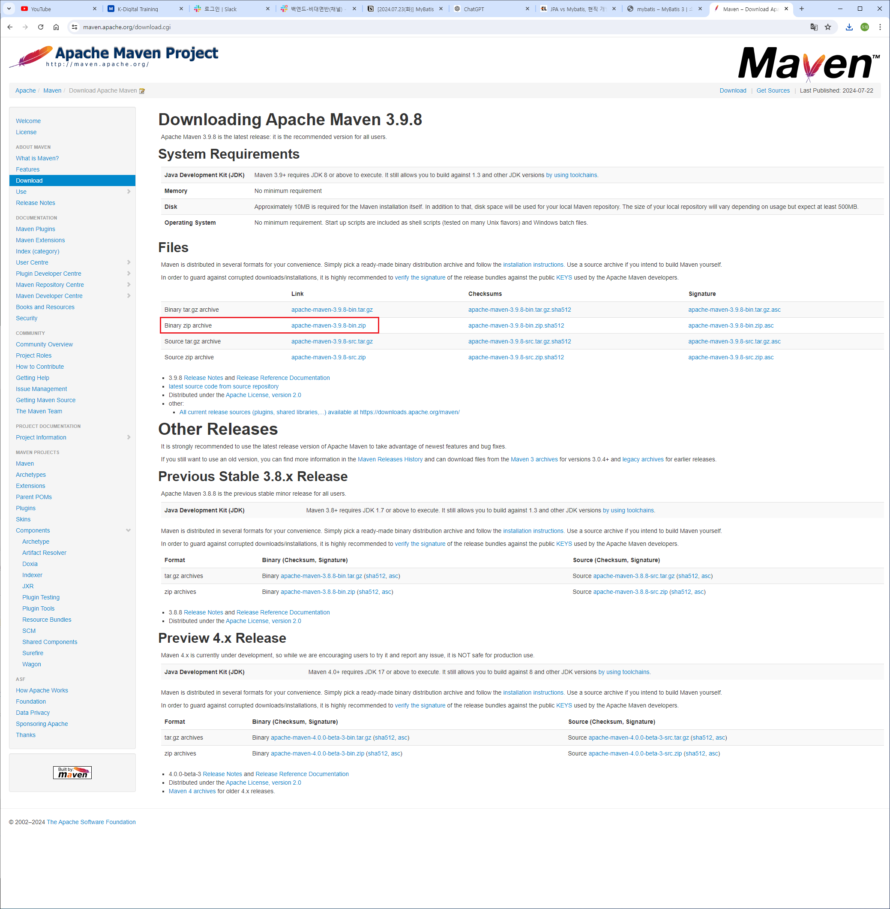
    
- 다운로드 받아서 사용할 디렉토리에 압축해제한다.
- 윈도우 환경변수 설정 방법 : 설정 → 정보 → 고급 시스템 설정 → 환경변수
    
    → 시스템 변수에 M2_HOME 추가 
    
    변수 : M2_HOME / 값 : C:\Users\USER\Desktop\LGUPLUS\apache-maven-3.9.8-bin\apache-maven-3.9.8
    
    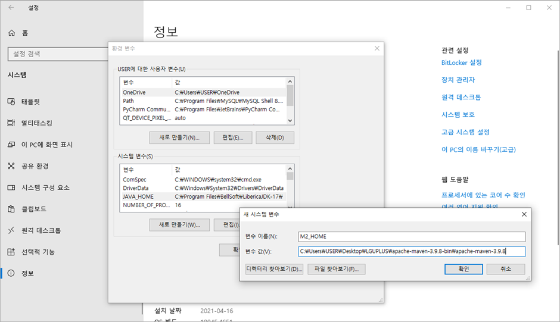
    
    → 사용자 변수 Path의 JAVA_HOME 아래에 “C:\Users\USER\Desktop\LGUPLUS\apache-maven-3.9.8-bin\apache-maven-3.9.8” 추가
    
    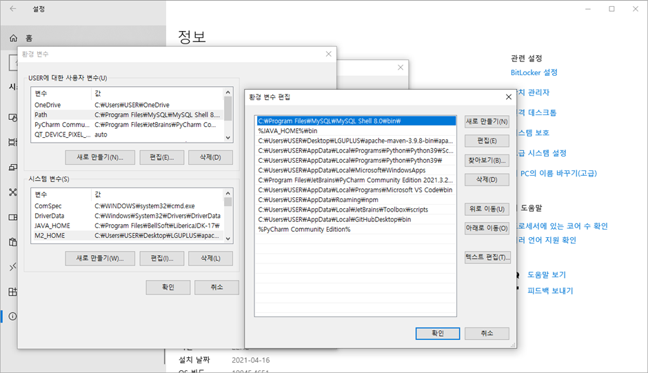
    
    환경변수 설정 테스트
    
    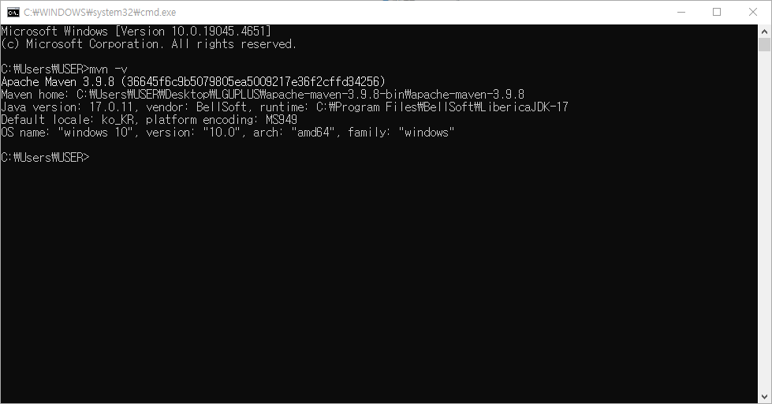
    

- 프로젝트 생성할 디렉토리에 HelloMaven - src - main - java 디렉토리를 생성한다.
    
    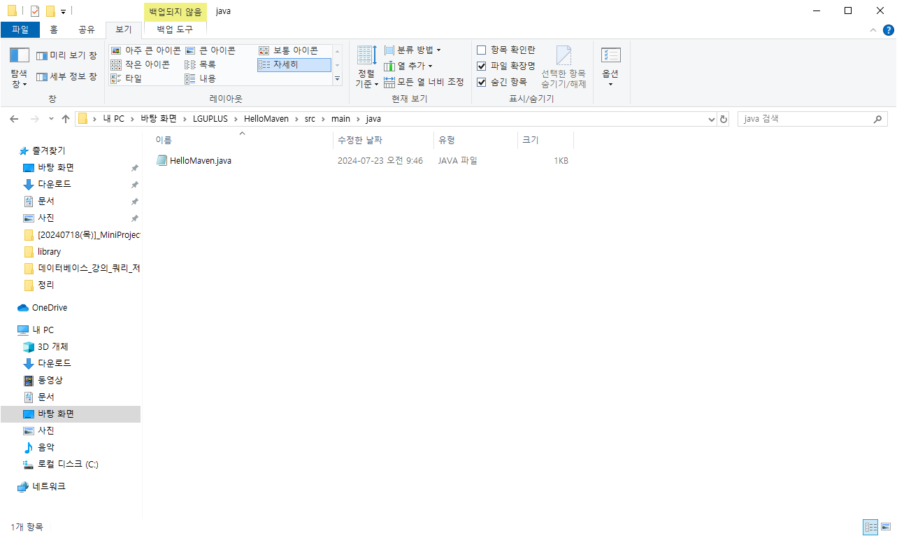
    
- java 디렉토리에 HelloMaven.java을 생성한다.
    
    ```java
    package com.mycom.myapp;
    
    import com.google.gson.Gson;
    import com.google.gson.JsonObject;
    
    public class HelloMaven {
    
    	public static void main(String[] args) {
    		Gson gson = new Gson();
    		JsonObject jsonObject = new JsonObject();
    		jsonObject.addProperty("result", "success");
    		String jsonStr = gson.toJson(jsonObject);
    		
    		System.out.println(jsonStr);
    	}
    }
    ```
    
- Maven은 pom.xml에 설정한대로 동작한다.
- HelloMaven 디렉토리에 pom.xml을 생성한다.
    
    ```xml
    <project xmlns="http://maven.apache.org/POM/4.0.0" xmlns:xsi="http://www.w3.org/2001/XMLSchema-instance" xsi:schemaLocation="http://maven.apache.org/POM/4.0.0 https://maven.apache.org/xsd/maven-4.0.0.xsd">
      <modelVersion>4.0.0</modelVersion>
      <groupId>test</groupId>
      <artifactId>test-1</artifactId>
      <version>0.0.1-SNAPSHOT</version>
      <properties>
        <project.build.sourceEncoding>UTF-8</project.build.sourceEncoding>
      </properties>
      
      <dependencies>
      </dependencies>
    </project>
    ```
    
- cmd에서 HelloMaven을 컴파일하면 Gson이 없으므로 실행되지 않는다.

- Gson 다운로드 URL : https://mvnrepository.com/artifact/com.google.code.gson/gson/2.11.0
- Maven 코드를 복사하여 pom.xml에 추가
    
    ```xml
    <project xmlns="http://maven.apache.org/POM/4.0.0" xmlns:xsi="http://www.w3.org/2001/XMLSchema-instance" xsi:schemaLocation="http://maven.apache.org/POM/4.0.0 https://maven.apache.org/xsd/maven-4.0.0.xsd">
      <modelVersion>4.0.0</modelVersion>
      <groupId>test</groupId>
      <artifactId>test-1</artifactId>
      <version>0.0.1-SNAPSHOT</version>
      <properties>
        <project.build.sourceEncoding>UTF-8</project.build.sourceEncoding>
      </properties>
      
      <dependencies>
    <!-- https://mvnrepository.com/artifact/com.google.code.gson/gson -->
    <dependency>
        <groupId>com.google.code.gson</groupId>
        <artifactId>gson</artifactId>
        <version>2.11.0</version>
    </dependency>
    
      </dependencies>
    </project>
    ```
    
- cmd에서 HelloMaven 프로젝트 컴파일
    
    명령어 : C:\Users\USER\Desktop\LGUPLUS\HelloMaven>mvn compile
    
    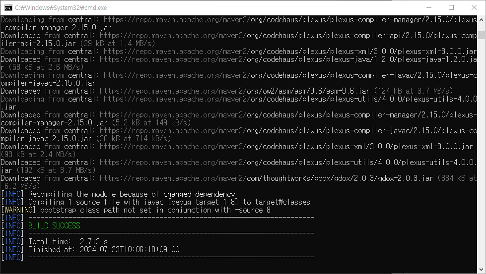
    
- cmd에서 HelloMaven 프로젝트 실행
    
    명령어 : C:\Users\USER\Desktop\LGUPLUS\HelloMaven>mvn exec:java -Dexec.mainClass=com.mycom.myapp.HelloMaven
    
    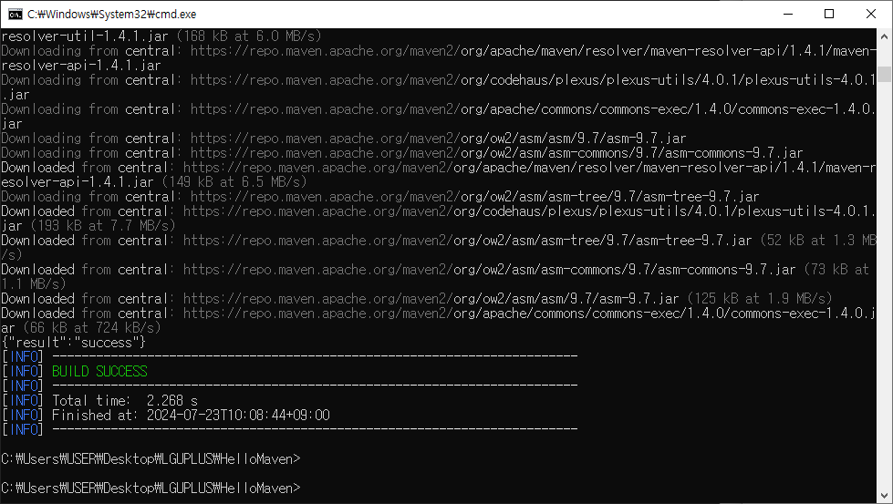
    

- 이클립스에서 [Maven Project] 생성
    
    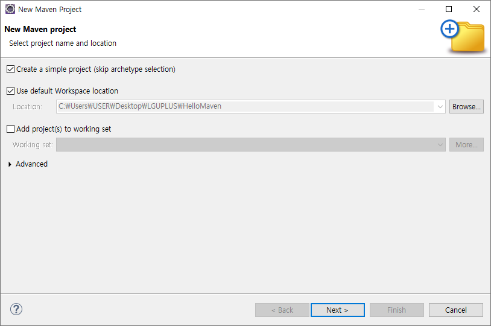
    
    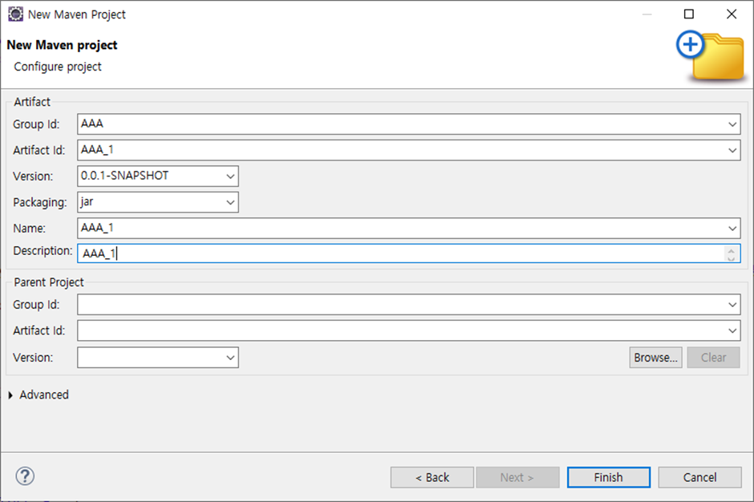
    
- pom.xml 오류 수정 및 <dependencies> 추가
    1. <project >의 xsi:schemaLocation url https를 http로 수정
    2. https://mvnrepository.com/artifact/com.google.code.gson/gson/2.11.0
    3. https://mvnrepository.com/artifact/com.mysql/mysql-connector-j/8.3.0
    
    ```xml
    <project xmlns="http://maven.apache.org/POM/4.0.0" xmlns:xsi="http://www.w3.org/2001/XMLSchema-instance" xsi:schemaLocation="http://maven.apache.org/POM/4.0.0 http://maven.apache.org/xsd/maven-4.0.0.xsd">
      <modelVersion>4.0.0</modelVersion> 
      <groupId>AAA</groupId>
      <artifactId>AAA_1</artifactId>
      <version>0.0.1-SNAPSHOT</version>
      <name>AAA_1</name>
      <description>AAA_1</description>
      
        <dependencies>
    <!-- https://mvnrepository.com/artifact/com.google.code.gson/gson -->
    <dependency>
        <groupId>com.google.code.gson</groupId>
        <artifactId>gson</artifactId>
        <version>2.11.0</version>
    </dependency>
    
    <!-- https://mvnrepository.com/artifact/com.mysql/mysql-connector-j -->
    <dependency>
        <groupId>com.mysql</groupId>
        <artifactId>mysql-connector-j</artifactId>
        <version>8.3.0</version>
    </dependency>
    
      </dependencies>
    </project>
    ```
    
- AAA 프로젝트명 우클릭 → [Maven] → [update project]로 [Maven Dependencies] 추가
- 실행하기
    
    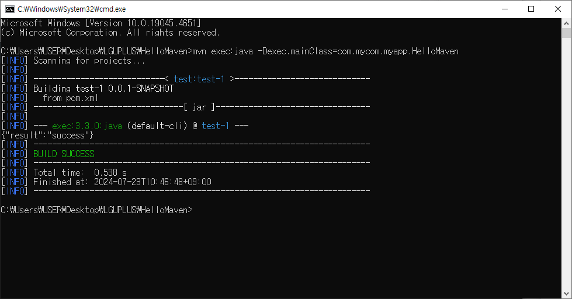
    

## MyBatis 프로젝트 테스트 예시 (ch01 패키지 - config : xml, mapper : xml)

- 이클립스 Maven 프로젝트 생성 → simple 체크 → 아래 내용대로 생성

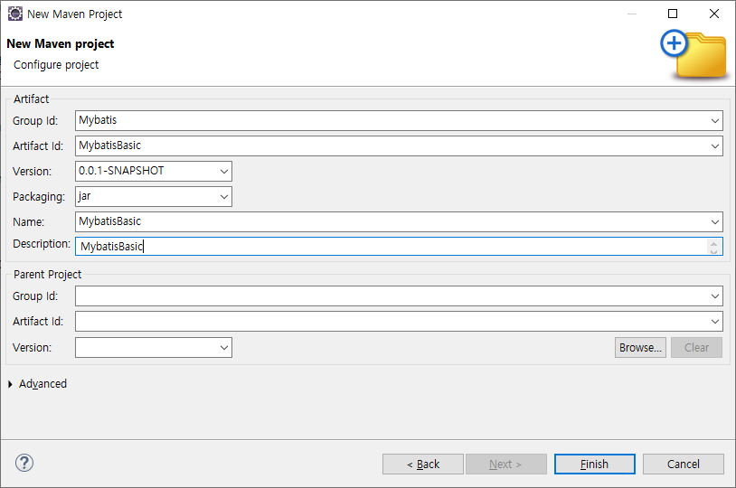

- pom.xml 오류 해결 방법 : ‘Download extenal resources like referenced DTD, XSD’ 체크

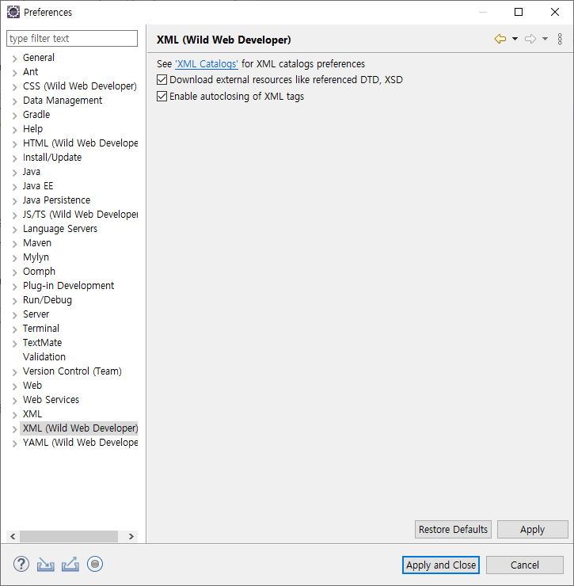

https://mybatis.org/mybatis-3/getting-started.html

- MyBatis 다운로드 방법
- https://mvnrepository.com/artifact/org.mybatis/mybatis/3.5.16
- https://mvnrepository.com/artifact/com.mysql/mysql-connector-j/8.3.0
- pom.xml

```xml
<project xmlns="http://maven.apache.org/POM/4.0.0" xmlns:xsi="http://www.w3.org/2001/XMLSchema-instance" xsi:schemaLocation="http://maven.apache.org/POM/4.0.0 https://maven.apache.org/xsd/maven-4.0.0.xsd">
  <modelVersion>4.0.0</modelVersion>
  <groupId>Mybatis</groupId>
  <artifactId>MybatisBasic</artifactId>
  <version>0.0.1-SNAPSHOT</version>
  <name>MybatisBasic</name>
  <description>MybatisBasic</description>
  
  <dependencies>
	<!-- https://mvnrepository.com/artifact/org.mybatis/mybatis -->
<dependency>
    <groupId>org.mybatis</groupId>
    <artifactId>mybatis</artifactId>
    <version>3.5.16</version>
</dependency>

<!-- https://mvnrepository.com/artifact/com.mysql/mysql-connector-j -->
<dependency>
    <groupId>com.mysql</groupId>
    <artifactId>mysql-connector-j</artifactId>
    <version>8.3.0</version>
</dependency>

  </dependencies>
  
</project>
```

- MybatisBasic 프로젝트명 우클릭 → [Maven] → [update project]로 [Maven Dependencies] 추가
- [Maven Dependencies]에 jar 파일이 자동으로 추가된다.
    
    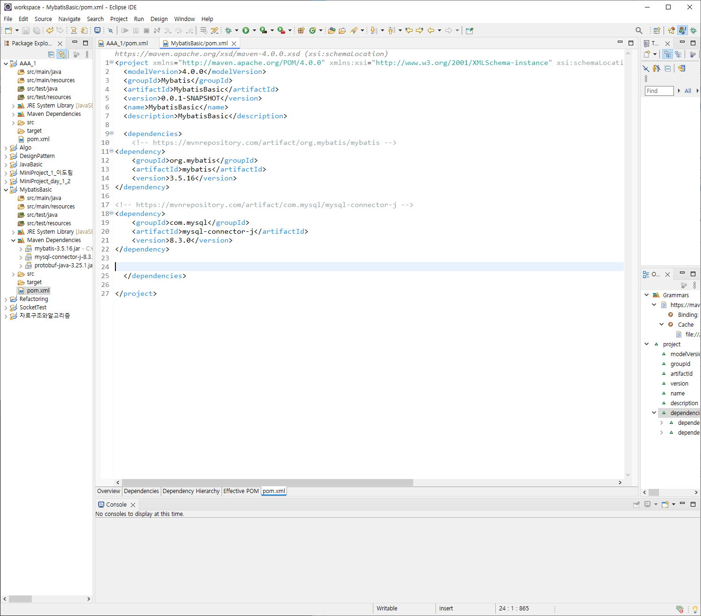
    

- 패키지 생성 : ch01 - dao, dto
    
    ch01 - Test.java 클래스 생성
    

### BookDto.java

```java
package ch01.dto;

public class BookDto {
	private int bookId;
	private String bookName;
	private String publisher;
	private int price;
	
	public BookDto() {}
	public BookDto(int bookId, String bookName, String publisher, int price) {
		super();
		this.bookId = bookId;
		this.bookName = bookName;
		this.publisher = publisher;
		this.price = price;
	}

	public int getBookId() {
		return bookId;
	}

	public void setBookId(int bookId) {
		this.bookId = bookId;
	}

	public String getBookName() {
		return bookName;
	}

	public void setBookName(String bookName) {
		this.bookName = bookName;
	}

	public String getPublisher() {
		return publisher;
	}

	public void setPublisher(String publisher) {
		this.publisher = publisher;
	}

	public int getPrice() {
		return price;
	}

	public void setPrice(int price) {
		this.price = price;
	}

	@Override
	public String toString() {
		return "BookDto [bookId=" + bookId + ", bookName=" + bookName + ", publisher=" + publisher + ", price=" + price
				+ "]";
	}
	
	
}

```

- src/main/resources - config - mybatis-config.xml 설정 파일 만들기
    
    DB Connection 설정 관련 내용 작성
    
    ### mybatis-config.xml
    
    ```xml
    <?xml version="1.0" encoding="UTF-8" ?>
    <!DOCTYPE configuration
        PUBLIC "-//mybatis.org//DTD Config 3.0//EN"
        "http://mybatis.org/dtd/mybatis-3-config.dtd">
    <configuration>
        <environments default="development">
            <environment id="development">
                <transactionManager type="JDBC"/>
                <dataSource type="POOLED">
                    <property name="driver" value="com.mysql.cj.jdbc.Driver"/>
                    <property name="url" value="jdbc:mysql://localhost:3306/mybatis_basic"/>
                    <property name="username" value="root"/>
                    <property name="password" value="root"/>
                </dataSource>
            </environment>
        </environments>
        
        <mappers>
        	<mapper resource="mapper/book-mapper.xml"/>
        </mappers>
    
    </configuration>
    ```
    

### mybatis_basic 스키마 만들기

```sql
CREATE TABLE Book (
  bookid      INTEGER PRIMARY KEY,
  bookname    VARCHAR(40),
  publisher   VARCHAR(40),
  price       INTEGER 
);

INSERT INTO Book VALUES(1, '축구의 역사', '굿스포츠', 7000);
INSERT INTO Book VALUES(2, '축구 아는 여자', '나무수', 13000);
INSERT INTO Book VALUES(3, '축구의 이해', '대한미디어', 22000);
INSERT INTO Book VALUES(4, '골프 바이블', '대한미디어', 35000);
INSERT INTO Book VALUES(5, '피겨 교본', '굿스포츠', 8000);
INSERT INTO Book VALUES(6, '배구 단계별기술', '굿스포츠', 6000);
INSERT INTO Book VALUES(7, '야구의 추억', '이상미디어', 20000);
INSERT INTO Book VALUES(8, '야구를 부탁해', '이상미디어', 13000);
INSERT INTO Book VALUES(9, '올림픽 이야기', '삼성당', 7500);
INSERT INTO Book VALUES(10, 'Olympic Champions', 'Pearson', 13000);
```

- src/main/resources - mapper - book-mapper.xml 파일 만들기
    
    SQL문 작성
    
    ### book-mapper.xml
    
    ```xml
    <?xml version="1.0" encoding="UTF-8" ?>
    <!DOCTYPE mapper
        PUBLIC "-//mybatis.org//DTD Mapper 3.0//EN"
        "http://mybatis.org/dtd/mybatis-3-mapper.dtd">
    <mapper namespace="ch01.dao.BookDao">
    <!--  Test.java의 BookDao bookDao = session.getMapper(BookDao.class);에 해당하는 클래스가 namespace에 와야 한다. -->
    
    	<select id="listBook" resultType="ch01.dto.BookDto"> <!-- resultType은 fullname으로 작성해야 한다.  -->
    		select bookid bookId, bookname bookName, publisher, price from book;
    	</select> 
    	
    </mapper>
    ```
    
- Dao는 interface로 만든다.

### BookDao.java

```java
package ch01.dao;

import java.util.List;

import ch01.dto.BookDto;

public interface BookDao {
	List<BookDto> listBook();
//	BookDto detailBook(int bookId);
//	int insertBook(BookDto bookDto);
//	int updatetBook(BookDto bookDto);
//	int deleteBook(int bookId);
}
```

### Test.java

```java
package ch01;

import java.io.Reader;
import java.util.List;

import org.apache.ibatis.io.Resources;
import org.apache.ibatis.session.SqlSession;
import org.apache.ibatis.session.SqlSessionFactory;
import org.apache.ibatis.session.SqlSessionFactoryBuilder;

import ch01.dao.BookDao;
import ch01.dto.BookDto;

// config : xml
// sql(mapper) : xml

public class Test {

	public static void main(String[] args) throws Exception {
		// Mybatis 설정 파일을 읽어 온다.
		Reader reader = Resources.getResourceAsReader("config/mybatis-config.xml");
		SqlSessionFactory sqlSessionFactory = new SqlSessionFactoryBuilder().build(reader);
		SqlSession session = sqlSessionFactory.openSession();
		
		// SQL(mapper) + Java
		// Java의 어떤 메소드(BookDao)가 호출됨녀 mapper의 어떤 sql이 수행되는지 연결
		BookDao bookDao = session.getMapper(BookDao.class); // book-mapper.xml과 BookDao가 연결
		
		
		// 목록
		{
			List<BookDto> bookList = bookDao.listBook();
			for (BookDto bookDto : bookList) {
				System.out.println(bookDto);
			}
		}
	}

}

```

### mybatis 테스트 코드 정리 (listBook)

### BookDto.java

```java
package ch01.dto;

public class BookDto {
	private int bookId;
	private String bookName;
	private String publisher;
	private int price;
	
	public BookDto() {}
	public BookDto(int bookId, String bookName, String publisher, int price) {
		super();
		this.bookId = bookId;
		this.bookName = bookName;
		this.publisher = publisher;
		this.price = price;
	}

	public int getBookId() {
		return bookId;
	}

	public void setBookId(int bookId) {
		this.bookId = bookId;
	}

	public String getBookName() {
		return bookName;
	}

	public void setBookName(String bookName) {
		this.bookName = bookName;
	}

	public String getPublisher() {
		return publisher;
	}

	public void setPublisher(String publisher) {
		this.publisher = publisher;
	}

	public int getPrice() {
		return price;
	}

	public void setPrice(int price) {
		this.price = price;
	}

	@Override
	public String toString() {
		return "BookDto [bookId=" + bookId + ", bookName=" + bookName + ", publisher=" + publisher + ", price=" + price
				+ "]";
	}
	
	
}

```

### mybatis-config.xml

```xml
<?xml version="1.0" encoding="UTF-8" ?>
<!DOCTYPE configuration
    PUBLIC "-//mybatis.org//DTD Config 3.0//EN"
    "http://mybatis.org/dtd/mybatis-3-config.dtd">
<configuration>
    <environments default="development">
        <environment id="development">
            <transactionManager type="JDBC"/>
            <dataSource type="POOLED">
                <property name="driver" value="com.mysql.cj.jdbc.Driver"/>
                <property name="url" value="jdbc:mysql://localhost:3306/mybatis_basic"/>
                <property name="username" value="root"/>
                <property name="password" value="root"/>
            </dataSource>
        </environment>
    </environments>
    
    <mappers>
    	<mapper resource="mapper/book-mapper.xml"/>
    </mappers>

</configuration>
```

### book-mapper.xml

```xml
<?xml version="1.0" encoding="UTF-8" ?>
<!DOCTYPE mapper
    PUBLIC "-//mybatis.org//DTD Mapper 3.0//EN"
    "http://mybatis.org/dtd/mybatis-3-mapper.dtd">
<mapper namespace="ch01.dao.BookDao">
<!--  Test.java의 BookDao bookDao = session.getMapper(BookDao.class);에 해당하는 클래스가 namespace에 와야 한다. -->

	<select id="listBook" resultType="ch01.dto.BookDto"> <!-- resultType은 fullname으로 작성해야 한다.  -->
		select bookid bookId, bookname bookName, publisher, price from book;
	</select> 
	
</mapper>
```

### BookDao.java

```java
package ch01.dao;

import java.util.List;

import ch01.dto.BookDto;

public interface BookDao {
	List<BookDto> listBook();
//	BookDto detailBook(int bookId);
//	int insertBook(BookDto bookDto);
//	int updatetBook(BookDto bookDto);
//	int deleteBook(int bookId);
}
```

### Test.java

```java
package ch01;

import java.io.Reader;
import java.util.List;

import org.apache.ibatis.io.Resources;
import org.apache.ibatis.session.SqlSession;
import org.apache.ibatis.session.SqlSessionFactory;
import org.apache.ibatis.session.SqlSessionFactoryBuilder;

import ch01.dao.BookDao;
import ch01.dto.BookDto;

// config : xml
// sql(mapper) : xml

public class Test {

	public static void main(String[] args) throws Exception {
		// Mybatis 설정 파일을 읽어 온다.
		Reader reader = Resources.getResourceAsReader("config/mybatis-config.xml");
		SqlSessionFactory sqlSessionFactory = new SqlSessionFactoryBuilder().build(reader);
		SqlSession session = sqlSessionFactory.openSession();
		
		// SQL(mapper) + Java
		// Java의 어떤 메소드(BookDao)가 호출됨녀 mapper의 어떤 sql이 수행되는지 연결
		BookDao bookDao = session.getMapper(BookDao.class); // book-mapper.xml과 BookDao가 연결
		
		
		// 목록
		{
			List<BookDto> bookList = bookDao.listBook();
			for (BookDto bookDto : bookList) {
				System.out.println(bookDto);
			}
		}
	}

}

```

### 실행 결과

```java
BookDto [bookId=1, bookName=축구의 역사, publisher=굿스포츠, price=7000]
BookDto [bookId=2, bookName=축구 아는 여자, publisher=나무수, price=13000]
BookDto [bookId=3, bookName=축구의 이해, publisher=대한미디어, price=22000]
BookDto [bookId=4, bookName=골프 바이블, publisher=대한미디어, price=35000]
BookDto [bookId=5, bookName=피겨 교본, publisher=굿스포츠, price=8000]
BookDto [bookId=6, bookName=배구 단계별기술, publisher=굿스포츠, price=6000]
BookDto [bookId=7, bookName=야구의 추억, publisher=이상미디어, price=20000]
BookDto [bookId=8, bookName=야구를 부탁해, publisher=이상미디어, price=13000]
BookDto [bookId=9, bookName=올림픽 이야기, publisher=삼성당, price=7500]
BookDto [bookId=10, bookName=Olympic Champions, publisher=Pearson, price=13000]
```

### mybatis 테스트 코드 정리 (detailBook)

### book-mapper.xml

```xml
<?xml version="1.0" encoding="UTF-8" ?>
<!DOCTYPE mapper
    PUBLIC "-//mybatis.org//DTD Mapper 3.0//EN"
    "http://mybatis.org/dtd/mybatis-3-mapper.dtd">
<mapper namespace="ch01.dao.BookDao">
<!--  Test.java의 BookDao bookDao = session.getMapper(BookDao.class);에 해당하는 클래스가 namespace에 와야 한다. -->

	<select id="listBook" resultType="ch01.dto.BookDto"> <!-- resultType은 fullname으로 작성해야 한다.  -->
		select bookid bookId, bookname bookName, publisher, price from book;
	</select> 

	<select id="detailBook" resultType="ch01.dto.BookDto" parameterType="int"> <!-- resultType은 fullname으로 작성해야 한다.  -->
		select bookid bookId, bookname bookName, publisher, price from book 
		where bookid = #{bookId}; <!-- #{bookId}에서 dto에 작성한 파라미터 이름과 동일하게 맞춰줘야 한다. -->
	</select> 
	
</mapper>
```

### BookDao.java

```java
package ch01.dao;

import java.util.List;

import ch01.dto.BookDto;

public interface BookDao {
	List<BookDto> listBook();
	BookDto detailBook(int bookId);
//	int insertBook(BookDto bookDto);
//	int updatetBook(BookDto bookDto);
//	int deleteBook(int bookId);
}
```

### Test.java

```java
package ch01;

import java.io.Reader;
import java.util.List;

import org.apache.ibatis.io.Resources;
import org.apache.ibatis.session.SqlSession;
import org.apache.ibatis.session.SqlSessionFactory;
import org.apache.ibatis.session.SqlSessionFactoryBuilder;

import ch01.dao.BookDao;
import ch01.dto.BookDto;

// config : xml
// sql(mapper) : xml

public class Test {

	public static void main(String[] args) throws Exception {
		// Mybatis 설정 파일을 읽어 온다.
		Reader reader = Resources.getResourceAsReader("config/mybatis-config.xml");
		SqlSessionFactory sqlSessionFactory = new SqlSessionFactoryBuilder().build(reader);
		SqlSession session = sqlSessionFactory.openSession();
		
		// SQL(mapper) + Java
		// Java의 어떤 메소드(BookDao)가 호출됨녀 mapper의 어떤 sql이 수행되는지 연결
		BookDao bookDao = session.getMapper(BookDao.class); // book-mapper.xml과 BookDao가 연결
		
		
		// 목록
//		{
//			List<BookDto> bookList = bookDao.listBook();
//			for (BookDto bookDto : bookList) {
//				System.out.println(bookDto);
//			}
//		}
		
		// 상세
		{
			BookDto bookDto = bookDao.detailBook(1);
				System.out.println(bookDto);
		}
		
		

	}

}
```

### 실행 결과

```java
BookDto [bookId=1, bookName=축구의 역사, publisher=굿스포츠, price=7000]
```

### mybatis 테스트 코드 정리 (insertBook)

### book-mapper.xml

```xml
<?xml version="1.0" encoding="UTF-8" ?>
<!DOCTYPE mapper
    PUBLIC "-//mybatis.org//DTD Mapper 3.0//EN"
    "http://mybatis.org/dtd/mybatis-3-mapper.dtd">
<mapper namespace="ch01.dao.BookDao">
<!--  Test.java의 BookDao bookDao = session.getMapper(BookDao.class);에 해당하는 클래스가 namespace에 와야 한다. -->

	<select id="listBook" resultType="ch01.dto.BookDto"> <!-- resultType은 fullname으로 작성해야 한다.  -->
		select bookid bookId, bookname bookName, publisher, price from book;
	</select> 

	<select id="detailBook" resultType="ch01.dto.BookDto" parameterType="int"> <!-- resultType은 fullname으로 작성해야 한다.  -->
		select bookid bookId, bookname bookName, publisher, price from book 
		where bookid = #{bookId}; <!-- #{bookId}에서 dto에 작성한 파라미터 이름과 동일하게 맞춰줘야 한다. -->
	</select> 
	
	<insert id="insertBook" parameterType="ch01.dto.BookDto"> <!-- primitive type return 생략 가능 -->
		insert into book (bookid, bookname, publisher, price) values ( #{bookId}, #{bookName}, #{publisher}, #{price} )
	</insert>
	
</mapper>
```

### BookDao.java

```java
package ch01.dao;

import java.util.List;

import ch01.dto.BookDto;

public interface BookDao {
	List<BookDto> listBook();
	BookDto detailBook(int bookId);
	int insertBook(BookDto bookDto);
//	int updatetBook(BookDto bookDto);
//	int deleteBook(int bookId);
}
```

### Test.java

```java
package ch01;

import java.io.Reader;
import java.util.List;

import org.apache.ibatis.io.Resources;
import org.apache.ibatis.session.SqlSession;
import org.apache.ibatis.session.SqlSessionFactory;
import org.apache.ibatis.session.SqlSessionFactoryBuilder;

import ch01.dao.BookDao;
import ch01.dto.BookDto;

// config : xml
// sql(mapper) : xml

public class Test {

	public static void main(String[] args) throws Exception {
		// Mybatis 설정 파일을 읽어 온다.
		Reader reader = Resources.getResourceAsReader("config/mybatis-config.xml");
		SqlSessionFactory sqlSessionFactory = new SqlSessionFactoryBuilder().build(reader);
		SqlSession session = sqlSessionFactory.openSession();
		
		// SQL(mapper) + Java
		// Java의 어떤 메소드(BookDao)가 호출됨녀 mapper의 어떤 sql이 수행되는지 연결
		BookDao bookDao = session.getMapper(BookDao.class); // book-mapper.xml과 BookDao가 연결
		
		
		// 목록
//		{
//			List<BookDto> bookList = bookDao.listBook();
//			for (BookDto bookDto : bookList) {
//				System.out.println(bookDto);
//			}
//		}
		
		// 상세
		{
			BookDto bookDto = bookDao.detailBook(1);
				System.out.println(bookDto);
		}
		
		// 등록
		{
			BookDto bookDto = new BookDto(11, "11번째 책", "uplus press", 5000);
			int ret = bookDao.insertBook(bookDto);
			System.out.println(ret);
			session.commit();
		}
				

	}

}
```

### 실행 결과

```java
BookDto [bookId=1, bookName=축구의 역사, publisher=굿스포츠, price=7000]
1
```

### mybatis 테스트 코드 정리 (updateBook, deleteBook)

### book-mapper.xml

```xml
<?xml version="1.0" encoding="UTF-8" ?>
<!DOCTYPE mapper
    PUBLIC "-//mybatis.org//DTD Mapper 3.0//EN"
    "http://mybatis.org/dtd/mybatis-3-mapper.dtd">
<mapper namespace="ch01.dao.BookDao">
<!--  Test.java의 BookDao bookDao = session.getMapper(BookDao.class);에 해당하는 클래스가 namespace에 와야 한다. -->

	<select id="listBook" resultType="ch01.dto.BookDto"> <!-- resultType은 fullname으로 작성해야 한다.  -->
		select bookid bookId, bookname bookName, publisher, price from book;
	</select> 

	<select id="detailBook" resultType="ch01.dto.BookDto" parameterType="int"> <!-- resultType은 fullname으로 작성해야 한다.  -->
		select bookid bookId, bookname bookName, publisher, price from book 
		where bookid = #{bookId}; <!-- #{bookId}에서 dto에 작성한 파라미터 이름과 동일하게 맞춰줘야 한다. -->
	</select> 
	
	<insert id="insertBook" parameterType="ch01.dto.BookDto"> <!-- primitive type return 생략 가능 -->
		insert into book (bookid, bookname, publisher, price) values ( #{bookId}, #{bookName}, #{publisher}, #{price} )
	</insert>
	
	<update id="updatetBook" parameterType="ch01.dto.BookDto">
		update book set bookname = #{bookName}, publisher = #{publisher}, price = #{price} where bookid = #{bookId}
	</update>
	
	<delete id="deleteBook" parameterType="int">
		delete from book where bookid = #{bookId}
	</delete>
	
</mapper>
```

### BookDao.java

```java
package ch01.dao;

import java.util.List;

import ch01.dto.BookDto;

public interface BookDao {
	List<BookDto> listBook();
	BookDto detailBook(int bookId);
	int insertBook(BookDto bookDto);
	int updatetBook(BookDto bookDto);
	int deleteBook(int bookId);
}
```

### Test.java

```java
package ch01;

import java.io.Reader;
import java.util.List;

import org.apache.ibatis.io.Resources;
import org.apache.ibatis.session.SqlSession;
import org.apache.ibatis.session.SqlSessionFactory;
import org.apache.ibatis.session.SqlSessionFactoryBuilder;

import ch01.dao.BookDao;
import ch01.dto.BookDto;

// config : xml
// sql(mapper) : xml

public class Test {

	public static void main(String[] args) throws Exception {
		// Mybatis 설정 파일을 읽어 온다.
		Reader reader = Resources.getResourceAsReader("config/mybatis-config.xml");
		SqlSessionFactory sqlSessionFactory = new SqlSessionFactoryBuilder().build(reader);
		SqlSession session = sqlSessionFactory.openSession();
		
		// SQL(mapper) + Java
		// Java의 어떤 메소드(BookDao)가 호출됨녀 mapper의 어떤 sql이 수행되는지 연결
		BookDao bookDao = session.getMapper(BookDao.class); // book-mapper.xml과 BookDao가 연결
		
		
		// 목록
//		{
//			List<BookDto> bookList = bookDao.listBook();
//			for (BookDto bookDto : bookList) {
//				System.out.println(bookDto);
//			}
//		}
		
		// 상세
//		{
//			BookDto bookDto = bookDao.detailBook(1);
//				System.out.println(bookDto);
//		}
		
		// 등록
//		{
//			BookDto bookDto = new BookDto(11, "11번째 책", "uplus press", 5000);
//			int ret = bookDao.insertBook(bookDto);
//			System.out.println(ret);
//			session.commit();
//		}
		
		// 수정
//		{
//			BookDto bookDto = new BookDto(11, "11번째 책 수정", "uplus press 수정", 10000);
//			int ret = bookDao.updatetBook(bookDto);
//			System.out.println(ret);
//			session.commit();
//		}
		
		// 삭제
		{
			int ret = bookDao.deleteBook(11);
			System.out.println(ret);
			session.commit();
		}
		
		session.close();

	}

}
```

### 실행 결과

```java
1
```

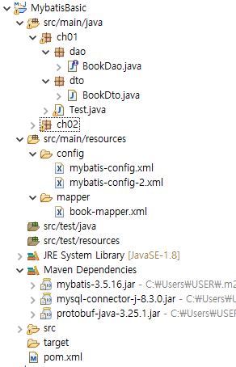

## MyBatis 프로젝트 테스트 예시 (ch02 패키지 - config : xml, mapper : java)

### mybatis-config-2.xml

```xml
<?xml version="1.0" encoding="UTF-8" ?>
<!DOCTYPE configuration
    PUBLIC "-//mybatis.org//DTD Config 3.0//EN"
    "http://mybatis.org/dtd/mybatis-3-config.dtd">
<configuration>
    <environments default="development">
        <environment id="development">
            <transactionManager type="JDBC"/>
            <dataSource type="POOLED">
                <property name="driver" value="com.mysql.cj.jdbc.Driver"/>
                <property name="url" value="jdbc:mysql://localhost:3306/mybatis_basic"/>
                <property name="username" value="root"/>
                <property name="password" value="root"/>
            </dataSource>
        </environment>
    </environments>
    
    <mappers>
    <!-- <mapper resource="mapper/book-mapper.xml"/> -->
    	<mapper class="ch02.dao.BookDao"/>
    </mappers>

</configuration>
```

### ch02.dto.BookDto.java

```java
package ch02.dto;

public class BookDto {
	private int bookId;
	private String bookName;
	private String publisher;
	private int price;
	
	public BookDto() {}
	public BookDto(int bookId, String bookName, String publisher, int price) {
		super();
		this.bookId = bookId;
		this.bookName = bookName;
		this.publisher = publisher;
		this.price = price;
	}

	public int getBookId() {
		return bookId;
	}

	public void setBookId(int bookId) {
		this.bookId = bookId;
	}

	public String getBookName() {
		return bookName;
	}

	public void setBookName(String bookName) {
		this.bookName = bookName;
	}

	public String getPublisher() {
		return publisher;
	}

	public void setPublisher(String publisher) {
		this.publisher = publisher;
	}

	public int getPrice() {
		return price;
	}

	public void setPrice(int price) {
		this.price = price;
	}

	@Override
	public String toString() {
		return "BookDto [bookId=" + bookId + ", bookName=" + bookName + ", publisher=" + publisher + ", price=" + price
				+ "]";
	}
	
	
}

```

### ch02.dao.BookDao.java

```java
package ch02.dao;

import java.util.List;

import ch02.dto.BookDto;

import org.apache.ibatis.annotations.Delete;
import org.apache.ibatis.annotations.Insert;
import org.apache.ibatis.annotations.Select;
import org.apache.ibatis.annotations.Update;

// mapper : java method - sql
public interface BookDao {
	@Select("select bookid bookId, bookname bookName, publisher, price from book")
	List<BookDto> listBook();
	
	@Select("select bookid bookId, bookname bookName, publisher, price from book where bookid = #{bookId}")
	BookDto detailBook(int bookId);
	
	@Insert("insert into book (bookid, bookname, publisher, price) values ( #{bookId}, #{bookName}, #{publisher}, #{price} )")
	int insertBook(BookDto bookDto);
	
	@Update("update book set bookname = #{bookName}, publisher = #{publisher}, price = #{price} where bookid = #{bookId}")
	int updatetBook(BookDto bookDto);
	
	@Delete("delete from book where bookid = #{bookId}")
	int deleteBook(int bookId);
}
```

### ch02.Test.java

```java
package ch02;

import java.io.Reader;
import java.util.List;

import org.apache.ibatis.io.Resources;
import org.apache.ibatis.session.SqlSession;
import org.apache.ibatis.session.SqlSessionFactory;
import org.apache.ibatis.session.SqlSessionFactoryBuilder;

import ch02.dao.BookDao;
import ch02.dto.BookDto;

// config : xml
// sql(mapper) : java

public class Test {

	public static void main(String[] args) throws Exception {
		// Mybatis 설정 파일을 읽어 온다.
		Reader reader = Resources.getResourceAsReader("config/mybatis-config-2.xml");
		SqlSessionFactory sqlSessionFactory = new SqlSessionFactoryBuilder().build(reader);
		SqlSession session = sqlSessionFactory.openSession();
		
		// SQL(mapper) + Java
		// Java의 어떤 메소드(BookDao)가 호출됨녀 mapper의 어떤 sql이 수행되는지 연결
		BookDao bookDao = session.getMapper(BookDao.class); // book-mapper.xml과 BookDao가 연결
		
		
		// 목록
//		{
//			List<BookDto> bookList = bookDao.listBook();
//			for (BookDto bookDto : bookList) {
//				System.out.println(bookDto);
//			}
//		}
		
		// 상세
//		{
//			BookDto bookDto = bookDao.detailBook(1);
//				System.out.println(bookDto);
//		}
		
		// 등록
//		{
//			BookDto bookDto = new BookDto(11, "11번째 책", "uplus press", 5000);
//			int ret = bookDao.insertBook(bookDto);
//			System.out.println(ret);
//			session.commit();
//		}
		
		// 수정
//		{
//			BookDto bookDto = new BookDto(11, "11번째 책 수정", "uplus press 수정", 10000);
//			int ret = bookDao.updatetBook(bookDto);
//			System.out.println(ret);
//			session.commit();
//		}
		
		// 삭제
		{
			int ret = bookDao.deleteBook(11);
			System.out.println(ret);
			session.commit();
		}
		
		session.close();

	}

}

```

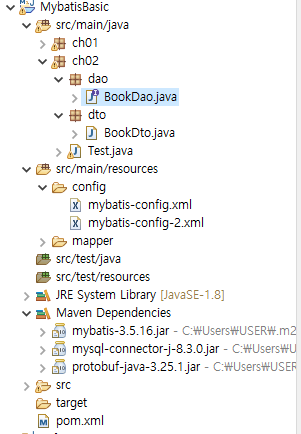

## MyBatis 프로젝트 테스트 예시 (ch03 패키지 - config : java, mapper : java)

### ch03.config.MyBatisConfig.java

```java
package ch03.config;

import org.apache.ibatis.datasource.pooled.PooledDataSource;
import org.apache.ibatis.session.SqlSessionFactory;
import org.apache.ibatis.session.SqlSessionFactoryBuilder;
import org.apache.ibatis.session.Configuration;
import org.apache.ibatis.transaction.jdbc.JdbcTransactionFactory;

public class MyBatisConfig {
	public SqlSessionFactory getSqlSessionFactory() {
		
		PooledDataSource dataSource = new PooledDataSource();
		dataSource.setDriver("com.mysql.cj.jdbc.Driver");
		dataSource.setUrl("jdbc:mysql://localhost:3306/mybatis_basic");
		dataSource.setUsername("root");
		dataSource.setPassword("root");
		
		Configuration configuration = new Configuration();
		configuration.setEnvironment(
				new org.apache.ibatis.mapping.Environment("development", new JdbcTransactionFactory(), dataSource));
		
		configuration.addMapper(ch03.dao.BookDao.class);
		
		return new SqlSessionFactoryBuilder().build(configuration);
	}
}
```

### ch03.dto.BookDto.java

```java
package ch03.dto;

public class BookDto {
	private int bookId;
	private String bookName;
	private String publisher;
	private int price;
	
	public BookDto() {}
	public BookDto(int bookId, String bookName, String publisher, int price) {
		super();
		this.bookId = bookId;
		this.bookName = bookName;
		this.publisher = publisher;
		this.price = price;
	}

	public int getBookId() {
		return bookId;
	}

	public void setBookId(int bookId) {
		this.bookId = bookId;
	}

	public String getBookName() {
		return bookName;
	}

	public void setBookName(String bookName) {
		this.bookName = bookName;
	}

	public String getPublisher() {
		return publisher;
	}

	public void setPublisher(String publisher) {
		this.publisher = publisher;
	}

	public int getPrice() {
		return price;
	}

	public void setPrice(int price) {
		this.price = price;
	}

	@Override
	public String toString() {
		return "BookDto [bookId=" + bookId + ", bookName=" + bookName + ", publisher=" + publisher + ", price=" + price
				+ "]";
	}
	
	
}

```

### ch03.dao.BookDao.java

```java
package ch03.dao;

import java.util.List;

import ch03.dto.BookDto;

import org.apache.ibatis.annotations.Delete;
import org.apache.ibatis.annotations.Insert;
import org.apache.ibatis.annotations.Select;
import org.apache.ibatis.annotations.Update;

// mapper : java method - sql
public interface BookDao {
	@Select("select bookid bookId, bookname bookName, publisher, price from book")
	List<BookDto> listBook();
	
	@Select("select bookid bookId, bookname bookName, publisher, price from book where bookid = #{bookId}")
	BookDto detailBook(int bookId);
	
	@Insert("insert into book (bookid, bookname, publisher, price) values ( #{bookId}, #{bookName}, #{publisher}, #{price} )")
	int insertBook(BookDto bookDto);
	
	@Update("update book set bookname = #{bookName}, publisher = #{publisher}, price = #{price} where bookid = #{bookId}")
	int updatetBook(BookDto bookDto);
	
	@Delete("delete from book where bookid = #{bookId}")
	int deleteBook(int bookId);
}
```

### ch03.Test.java

```java
package ch03;

import java.util.List;

import org.apache.ibatis.io.Resources;
import org.apache.ibatis.session.SqlSession;
import org.apache.ibatis.session.SqlSessionFactory;
import org.apache.ibatis.session.SqlSessionFactoryBuilder;

import ch03.config.MyBatisConfig;
import ch03.dao.BookDao;
import ch03.dto.BookDto;

// config : java
// sql(mapper) : java

public class Test {

	public static void main(String[] args) throws Exception {
		// java 설정 이용
		SqlSessionFactory sqlSessionFactory = new MyBatisConfig().getSqlSessionFactory();
		SqlSession session = sqlSessionFactory.openSession();
		
		// SQL(mapper) + Java
		// Java의 어떤 메소드(BookDao)가 호출됨녀 mapper의 어떤 sql이 수행되는지 연결
		BookDao bookDao = session.getMapper(BookDao.class); // book-mapper.xml과 BookDao가 연결
		
		
		// 목록
//		{
//			List<BookDto> bookList = bookDao.listBook();
//			for (BookDto bookDto : bookList) {
//				System.out.println(bookDto);
//			}
//		}
		
		// 상세
//		{
//			BookDto bookDto = bookDao.detailBook(1);
//				System.out.println(bookDto);
//		}
		
		// 등록
//		{
//			BookDto bookDto = new BookDto(11, "11번째 책", "uplus press", 5000);
//			int ret = bookDao.insertBook(bookDto);
//			System.out.println(ret);
//			session.commit();
//		}
		
		// 수정
//		{
//			BookDto bookDto = new BookDto(11, "11번째 책 수정", "uplus press 수정", 10000);
//			int ret = bookDao.updatetBook(bookDto);
//			System.out.println(ret);
//			session.commit();
//		}
		
		// 삭제
		{
			int ret = bookDao.deleteBook(11);
			System.out.println(ret);
			session.commit();
		}
		
		session.close();

	}

}
```

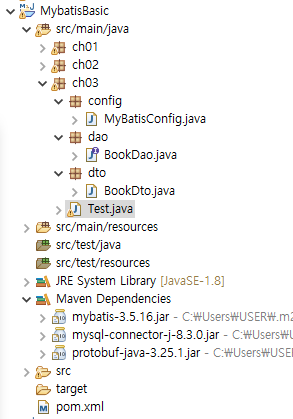

# 개인활동

- 개인활동 내용 : Mybatis로 Customer 테이블 조회 만들어보기

## customer 테이블 추가 및 프로젝트 생성

1. bybatis_basic 스키마에 customer 테이블 추가하기
    
    ```sql
    CREATE TABLE  Customer (
      custid      INTEGER PRIMARY KEY,  
      name        VARCHAR(40),
      address     VARCHAR(50),
      phone       VARCHAR(20)
    );
    
    INSERT INTO Customer VALUES (1, '박지성', '영국 맨체스터', '000-5000-0001');
    INSERT INTO Customer VALUES (2, '김연아', '대한민국 서울', '000-6000-0001');  
    INSERT INTO Customer VALUES (3, '김연경', '대한민국 경기도', '000-7000-0001');
    INSERT INTO Customer VALUES (4, '추신수', '미국 클리블랜드', '000-8000-0001');
    INSERT INTO Customer VALUES (5, '박세리', '대한민국 대전',  NULL);
    ```
    
2. MybatisBasicCustomerTest Maven Project 생성
3. pom.xml 수정
    
    ```xml
    <project xmlns="http://maven.apache.org/POM/4.0.0" xmlns:xsi="http://www.w3.org/2001/XMLSchema-instance" xsi:schemaLocation="http://maven.apache.org/POM/4.0.0 https://maven.apache.org/xsd/maven-4.0.0.xsd">
      <modelVersion>4.0.0</modelVersion>
      <groupId>MybatisBasicCustomer</groupId>
      <artifactId>MybatisBasicCustomerTest</artifactId>
      <version>0.0.1-SNAPSHOT</version>
      <name>MybatisBasicCustomerTest</name>
      <description>MybatisBasicCustomerTest</description>
      
      <dependencies>
    	<!-- https://mvnrepository.com/artifact/org.mybatis/mybatis -->
    <dependency>
        <groupId>org.mybatis</groupId>
        <artifactId>mybatis</artifactId>
        <version>3.5.16</version>
    </dependency>
    
    <!-- https://mvnrepository.com/artifact/com.mysql/mysql-connector-j -->
    <dependency>
        <groupId>com.mysql</groupId>
        <artifactId>mysql-connector-j</artifactId>
        <version>8.3.0</version>
    </dependency>
    
      </dependencies>
      
    </project>
    ```
    
4. [프로젝트명] → Maven → update Project

## ch01 패키지 - config : xml, mapper : xml

### ch01.dto.CustomerDto.java

```java
package ch01.dto;

public class CustomerDto {
	private int custId;
	private String name;
	private String address;
	private String phone;
	
	public CustomerDto() {}
	public CustomerDto(int custId, String name, String address, String phone) {
		super();
		this.custId = custId;
		this.name = name;
		this.address = address;
		this.phone = phone;
	}

	public int getCustId() {
		return custId;
	}

	public void setCustId(int custId) {
		this.custId = custId;
	}

	public String getName() {
		return name;
	}

	public void setName(String name) {
		this.name = name;
	}

	public String getAddress() {
		return address;
	}

	public void setAddress(String address) {
		this.address = address;
	}

	public String getPhone() {
		return phone;
	}

	public void setPhone(String phone) {
		this.phone = phone;
	}

	@Override
	public String toString() {
		return "CustomerDto [custId=" + custId + ", name=" + name + ", address=" + address + ", phone=" + phone + "]";
	}
	
}
```

### config/mybatis-config-ch01.xml

```xml
<?xml version="1.0" encoding="UTF-8" ?>
<!DOCTYPE configuration
    PUBLIC "-//mybatis.org//DTD Config 3.0//EN"
    "http://mybatis.org/dtd/mybatis-3-config.dtd">
<configuration>
    <environments default="development">
        <environment id="development">
            <transactionManager type="JDBC"/>
            <dataSource type="POOLED">
                <property name="driver" value="com.mysql.cj.jdbc.Driver"/>
                <property name="url" value="jdbc:mysql://localhost:3306/mybatis_basic"/>
                <property name="username" value="root"/>
                <property name="password" value="root"/>
            </dataSource>
        </environment>
    </environments>
    
    <mappers>
    	<mapper resource="mapper/customer-mapper-ch01.xml"/>
    </mappers>

</configuration>
```

### mapper/customer-mapper-ch01.xml

```xml
<?xml version="1.0" encoding="UTF-8" ?>
<!DOCTYPE mapper
    PUBLIC "-//mybatis.org//DTD Mapper 3.0//EN"
    "http://mybatis.org/dtd/mybatis-3-mapper.dtd">
<mapper namespace="ch01.dao.CustomerDao">
<!--  Test.java의 CustomerDao customerDao = session.getMapper(CustomerDao.class);에 해당하는 클래스가 namespace에 와야 한다. -->

	<select id="listCustomer" resultType="ch01.dto.CustomerDto"> <!-- resultType은 fullname으로 작성해야 한다.  -->
		select custid, name, address, phone from customer;
	</select> 

	<select id="datailCustomer" resultType="ch01.dto.CustomerDto" parameterType="int"> <!-- resultType은 fullname으로 작성해야 한다.  -->
		select custid, name, address, phone from customer 
		where custid = #{custId}; <!-- #{bookId}에서 dto에 작성한 파라미터 이름과 동일하게 맞춰줘야 한다. -->
	</select> 
	
	<insert id="insertCustomer" parameterType="ch01.dto.CustomerDto"> <!-- primitive type return 생략 가능 -->
		insert into customer (custid, name, address, phone) values ( #{custId}, #{name}, #{address}, #{phone} )
	</insert>
	
	<update id="updateCustomer" parameterType="ch01.dto.CustomerDto">
		update customer set name = #{name}, address = #{address}, phone = #{phone} where custid = #{custId}
	</update>
	
	<delete id="deleteCustomer" parameterType="int">
		delete from customer where custid = #{custId}
	</delete>
	
</mapper>
```

### ch01.dao.CustomerDao.java

```java
package ch01.dao;

import java.util.List;

import ch01.dto.CustomerDto;

public interface CustomerDao {
	
	List<CustomerDto> listCustomer();
	CustomerDto datailCustomer(int custId);
	int insertCustomer(CustomerDto customerDto);
	int updateCustomer(CustomerDto customerDto);
	int deleteCustomer(int custId);

}
```

### ch01.Test.java

```java
package ch01;

import java.io.Reader;
import java.util.List;

import org.apache.ibatis.io.Resources;
import org.apache.ibatis.session.SqlSession;
import org.apache.ibatis.session.SqlSessionFactory;
import org.apache.ibatis.session.SqlSessionFactoryBuilder;

import ch01.dao.CustomerDao;
import ch01.dto.CustomerDto;

// config : xml
// sql(mapper) : xml

public class Test {

	public static void main(String[] args) throws Exception {
		// Mybatis 설정 파일을 읽어 온다.
		Reader reader = Resources.getResourceAsReader("config/mybatis-config-ch01.xml");
		SqlSessionFactory sqlSessionFactory = new SqlSessionFactoryBuilder().build(reader);
		SqlSession session = sqlSessionFactory.openSession();
		
		// SQL(mapper) + Java
		// Java의 어떤 메소드(BookDao)가 호출됨녀 mapper의 어떤 sql이 수행되는지 연결
		CustomerDao customerDao = session.getMapper(CustomerDao.class); // book-mapper.xml과 BookDao가 연결
		
		
		// 목록
//		{
//			List<CustomerDto> customerList = customerDao.listCustomer();
//			for (CustomerDto customerDto : customerList) {
//				System.out.println(customerDto);
//			}
//		}
		
		// 상세
//		{
//			CustomerDto customerDto = customerDao.datailCustomer(1);
//				System.out.println(customerDto);
//		}
		
		// 등록
//		{
//			CustomerDto customerDto = new CustomerDto(6, "이도림", "대한민국 인천", "010");
//			int ret = customerDao.insertCustomer(customerDto);
//			System.out.println(ret);
//			session.commit();
//		}
		
		// 수정
//		{
//			CustomerDto customerDto = new CustomerDto(6, "이도림11", "대한민국 인천11", "0101111");
//			int ret = customerDao.updateCustomer(customerDto);
//			System.out.println(ret);
//			session.commit();
//		}
		
		// 삭제
//		{
//			int ret = customerDao.deleteCustomer(6);
//			System.out.println(ret);
//			session.commit();
//		}
		
		session.close();

	}

}
```

## ch02 패키지 - config : xml, mapper : java

### config/mybatis-config-ch02.xml

```xml
<?xml version="1.0" encoding="UTF-8" ?>
<!DOCTYPE configuration
    PUBLIC "-//mybatis.org//DTD Config 3.0//EN"
    "http://mybatis.org/dtd/mybatis-3-config.dtd">
<configuration>
    <environments default="development">
        <environment id="development">
            <transactionManager type="JDBC"/>
            <dataSource type="POOLED">
                <property name="driver" value="com.mysql.cj.jdbc.Driver"/>
                <property name="url" value="jdbc:mysql://localhost:3306/mybatis_basic"/>
                <property name="username" value="root"/>
                <property name="password" value="root"/>
            </dataSource>
        </environment>
    </environments>
    
    <mappers>
    	<mapper class="ch02.dao.CustomerDao"/>
    </mappers>

</configuration>
```

### ch02.dto.CustomerDto.java

```java
package ch02.dto;

public class CustomerDto {
	private int custId;
	private String name;
	private String address;
	private String phone;
	
	public CustomerDto() {}
	public CustomerDto(int custId, String name, String address, String phone) {
		super();
		this.custId = custId;
		this.name = name;
		this.address = address;
		this.phone = phone;
	}

	public int getCustId() {
		return custId;
	}

	public void setCustId(int custId) {
		this.custId = custId;
	}

	public String getName() {
		return name;
	}

	public void setName(String name) {
		this.name = name;
	}

	public String getAddress() {
		return address;
	}

	public void setAddress(String address) {
		this.address = address;
	}

	public String getPhone() {
		return phone;
	}

	public void setPhone(String phone) {
		this.phone = phone;
	}

	@Override
	public String toString() {
		return "CustomerDto [custId=" + custId + ", name=" + name + ", address=" + address + ", phone=" + phone + "]";
	}
	
	
	

	
}

```

### ch02.dao.CustomerDao.java

```java
package ch02.dao;

import java.util.List;

import org.apache.ibatis.annotations.Delete;
import org.apache.ibatis.annotations.Insert;
import org.apache.ibatis.annotations.Select;
import org.apache.ibatis.annotations.Update;

import ch02.dto.CustomerDto;

public interface CustomerDao {
	
	@Select("select custid, name, address, phone from customer")
	List<CustomerDto> listCustomer();
	
	@Select("select custid, name, address, phone from customer where custid = #{custId}")
	CustomerDto datailCustomer(int custId);
	
	@Insert("insert into customer (custid, name, address, phone) values ( #{custId}, #{name}, #{address}, #{phone} )")
	int insertCustomer(CustomerDto customerDto);
	
	@Update("update customer set name = #{name}, address = #{address}, phone = #{phone} where custid = #{custId}")
	int updateCustomer(CustomerDto customerDto);
	
	@Delete("delete from customer where custid = #{custId}")
	int deleteCustomer(int custId);

}
```

### ch02.Test.java

```java
package ch02;

import java.io.Reader;
import java.util.List;

import org.apache.ibatis.io.Resources;
import org.apache.ibatis.session.SqlSession;
import org.apache.ibatis.session.SqlSessionFactory;
import org.apache.ibatis.session.SqlSessionFactoryBuilder;

import ch02.dao.CustomerDao;
import ch02.dto.CustomerDto;

// config : xml
// sql(mapper) : xml

public class Test {

	public static void main(String[] args) throws Exception {
		// Mybatis 설정 파일을 읽어 온다.
		Reader reader = Resources.getResourceAsReader("config/mybatis-config-ch02.xml");
		SqlSessionFactory sqlSessionFactory = new SqlSessionFactoryBuilder().build(reader);
		SqlSession session = sqlSessionFactory.openSession();
		
		// SQL(mapper) + Java
		// Java의 어떤 메소드(BookDao)가 호출됨녀 mapper의 어떤 sql이 수행되는지 연결
		CustomerDao customerDao = session.getMapper(CustomerDao.class); // book-mapper.xml과 BookDao가 연결
		
		
		// 목록
//		{
//			List<CustomerDto> customerList = customerDao.listCustomer();
//			for (CustomerDto customerDto : customerList) {
//				System.out.println(customerDto);
//			}
//		}
		
		// 상세
//		{
//			CustomerDto customerDto = customerDao.datailCustomer(1);
//				System.out.println(customerDto);
//		}
		
		// 등록
//		{
//			CustomerDto customerDto = new CustomerDto(6, "이도림", "대한민국 인천", "010");
//			int ret = customerDao.insertCustomer(customerDto);
//			System.out.println(ret);
//			session.commit();
//		}
		
		// 수정
//		{
//			CustomerDto customerDto = new CustomerDto(6, "이도림11", "대한민국 인천11", "0101111");
//			int ret = customerDao.updateCustomer(customerDto);
//			System.out.println(ret);
//			session.commit();
//		}
		
		// 삭제
		{
			int ret = customerDao.deleteCustomer(6);
			System.out.println(ret);
			session.commit();
		}
		
		session.close();

	}

}
```

## ch03 패키지 - config : java, mapper : java

### ch03.dto.CustomerDto.java

```java
package ch03.dto;

public class CustomerDto {
	private int custId;
	private String name;
	private String address;
	private String phone;
	
	public CustomerDto() {}
	public CustomerDto(int custId, String name, String address, String phone) {
		super();
		this.custId = custId;
		this.name = name;
		this.address = address;
		this.phone = phone;
	}

	public int getCustId() {
		return custId;
	}

	public void setCustId(int custId) {
		this.custId = custId;
	}

	public String getName() {
		return name;
	}

	public void setName(String name) {
		this.name = name;
	}

	public String getAddress() {
		return address;
	}

	public void setAddress(String address) {
		this.address = address;
	}

	public String getPhone() {
		return phone;
	}

	public void setPhone(String phone) {
		this.phone = phone;
	}

	@Override
	public String toString() {
		return "CustomerDto [custId=" + custId + ", name=" + name + ", address=" + address + ", phone=" + phone + "]";
	}
	
	
}

```

### ch03.config.MyBatisConfig.java

```java
package ch03.config;

import org.apache.ibatis.datasource.pooled.PooledDataSource;
import org.apache.ibatis.session.SqlSessionFactory;
import org.apache.ibatis.session.SqlSessionFactoryBuilder;
import org.apache.ibatis.session.Configuration;
import org.apache.ibatis.transaction.jdbc.JdbcTransactionFactory;

public class MyBatisConfig {
	public SqlSessionFactory getSqlSessionFactory() {
		
		PooledDataSource dataSource = new PooledDataSource();
		dataSource.setDriver("com.mysql.cj.jdbc.Driver");
		dataSource.setUrl("jdbc:mysql://localhost:3306/mybatis_basic");
		dataSource.setUsername("root");
		dataSource.setPassword("root");
		
		Configuration configuration = new Configuration();
		configuration.setEnvironment(
				new org.apache.ibatis.mapping.Environment("development", new JdbcTransactionFactory(), dataSource));
		
		configuration.addMapper(ch03.dao.CustomerDao.class);
		
		return new SqlSessionFactoryBuilder().build(configuration);
	}
}
```

### ch03.dao.CustomerDao.java

```java
package ch03.dao;

import java.util.List;

import org.apache.ibatis.annotations.Delete;
import org.apache.ibatis.annotations.Insert;
import org.apache.ibatis.annotations.Select;
import org.apache.ibatis.annotations.Update;

import ch03.dto.CustomerDto;

public interface CustomerDao {
	
	@Select("select custid, name, address, phone from customer")
	List<CustomerDto> listCustomer();
	
	@Select("select custid, name, address, phone from customer where custid = #{custId}")
	CustomerDto datailCustomer(int custId);
	
	@Insert("insert into customer (custid, name, address, phone) values ( #{custId}, #{name}, #{address}, #{phone} )")
	int insertCustomer(CustomerDto customerDto);
	
	@Update("update customer set name = #{name}, address = #{address}, phone = #{phone} where custid = #{custId}")
	int updateCustomer(CustomerDto customerDto);
	
	@Delete("delete from customer where custid = #{custId}")
	int deleteCustomer(int custId);

}
```

### ch03.Test.java

```java
package ch03;

import java.util.List;

import org.apache.ibatis.session.SqlSession;
import org.apache.ibatis.session.SqlSessionFactory;
import org.apache.ibatis.session.SqlSessionFactoryBuilder;

import ch03.dao.CustomerDao;
import ch03.dto.CustomerDto;
import ch03.config.MyBatisConfig;

// config : xml
// sql(mapper) : xml

public class Test {

	public static void main(String[] args) throws Exception {
		SqlSessionFactory sqlSessionFactory = new MyBatisConfig().getSqlSessionFactory();
		SqlSession session = sqlSessionFactory.openSession();
		
		// SQL(mapper) + Java
		// Java의 어떤 메소드(BookDao)가 호출됨녀 mapper의 어떤 sql이 수행되는지 연결
		CustomerDao customerDao = session.getMapper(CustomerDao.class); // book-mapper.xml과 BookDao가 연결
		
		
		// 목록
//		{
//			List<CustomerDto> customerList = customerDao.listCustomer();
//			for (CustomerDto customerDto : customerList) {
//				System.out.println(customerDto);
//			}
//		}
		
		// 상세
//		{
//			CustomerDto customerDto = customerDao.datailCustomer(1);
//				System.out.println(customerDto);
//		}
		
		// 등록
//		{
//			CustomerDto customerDto = new CustomerDto(6, "이도림", "대한민국 인천", "010");
//			int ret = customerDao.insertCustomer(customerDto);
//			System.out.println(ret);
//			session.commit();
//		}
		
		// 수정
//		{
//			CustomerDto customerDto = new CustomerDto(6, "이도림11", "대한민국 인천11", "0101111");
//			int ret = customerDao.updateCustomer(customerDto);
//			System.out.println(ret);
//			session.commit();
//		}
		
		// 삭제
		{
			int ret = customerDao.deleteCustomer(6);
			System.out.println(ret);
			session.commit();
		}
		
		session.close();

	}

}

```

# 기존의 Mini Project에 Mybatis 활용하기

## app.book.config.MyBatisConfig.java

```java
package app.book.config;

import org.apache.ibatis.datasource.pooled.PooledDataSource;
import org.apache.ibatis.session.SqlSessionFactory;
import org.apache.ibatis.session.SqlSessionFactoryBuilder;
import org.apache.ibatis.session.Configuration;
import org.apache.ibatis.transaction.jdbc.JdbcTransactionFactory;

public class MyBatisConfig {
	public SqlSessionFactory getSqlSessionFactory() {
		
		PooledDataSource dataSource = new PooledDataSource();
		dataSource.setDriver("com.mysql.cj.jdbc.Driver");
		dataSource.setUrl("jdbc:mysql://localhost:3306/mybatis_basic");
		dataSource.setUsername("root");
		dataSource.setPassword("root");
		
		Configuration configuration = new Configuration();
		configuration.setEnvironment(
				new org.apache.ibatis.mapping.Environment("development", new JdbcTransactionFactory(), dataSource));
		
		configuration.addMapper(app.book.dao.BookDao.class);
		
		return new SqlSessionFactoryBuilder().build(configuration);
	}
}

```

## app.book.dto.BookDto.java

```java
package app.book.dto;

public class BookDto {
	private int bookId;
	private String bookName;
	private String publisher;
	private int price;
	
	public BookDto() {}
	public BookDto(int bookId, String bookName, String publisher, int price) {
		super();
		this.bookId = bookId;
		this.bookName = bookName;
		this.publisher = publisher;
		this.price = price;
	}

	public int getBookId() {
		return bookId;
	}

	public void setBookId(int bookId) {
		this.bookId = bookId;
	}

	public String getBookName() {
		return bookName;
	}

	public void setBookName(String bookName) {
		this.bookName = bookName;
	}

	public String getPublisher() {
		return publisher;
	}

	public void setPublisher(String publisher) {
		this.publisher = publisher;
	}

	public int getPrice() {
		return price;
	}

	public void setPrice(int price) {
		this.price = price;
	}

	@Override
	public String toString() {
		return "BookDto [bookId=" + bookId + ", bookName=" + bookName + ", publisher=" + publisher + ", price=" + price
				+ "]";
	}
	
	
}

```

## app.book.dao.BookDao.java

```java
package app.book.dao;

import java.util.List;

import app.book.dto.BookDto;

import org.apache.ibatis.annotations.Delete;
import org.apache.ibatis.annotations.Insert;
import org.apache.ibatis.annotations.Select;
import org.apache.ibatis.annotations.Update;

// mapper : java method - sql
public interface BookDao {
	@Select("select bookid bookId, bookname bookName, publisher, price from book")
	List<BookDto> listBook();
	
	@Select("select bookid bookId, bookname bookName, publisher, price from book where bookname like concat('%', #{searchWord}, '%') ")
	List<BookDto> listSearchBook(String searchWord);
	
	@Select("select bookid bookId, bookname bookName, publisher, price from book where bookid = #{bookId}")
	BookDto detailBook(int bookId);
	
	@Insert("insert into book (bookid, bookname, publisher, price) values ( #{bookId}, #{bookName}, #{publisher}, #{price} )")
	int insertBook(BookDto bookDto);
	
	@Update("update book set bookname = #{bookName}, publisher = #{publisher}, price = #{price} where bookid = #{bookId}")
	int updatetBook(BookDto bookDto);
	
	@Delete("delete from book where bookid = #{bookId}")
	int deleteBook(int bookId);
}

```

## app.book.ui

### BookManager.java

```java
package app.book.ui;

import java.awt.BorderLayout;
import java.awt.Dimension;
import java.awt.TextField;
import java.awt.event.MouseAdapter;
import java.awt.event.MouseEvent;
import java.util.List;

import javax.swing.JButton;
import javax.swing.JFrame; // windows application
import javax.swing.JLabel;
import javax.swing.JOptionPane;
import javax.swing.JPanel;
import javax.swing.JScrollPane;
import javax.swing.JTable;
import javax.swing.JTextField;
import javax.swing.SwingUtilities;
import javax.swing.table.DefaultTableModel;

import org.apache.ibatis.session.SqlSession;
import org.apache.ibatis.session.SqlSessionFactory;

import app.book.dao.BookDao;
import app.book.dto.BookDto;
import app.book.config.MyBatisConfig;

public class BookManager extends JFrame{ 
	
	// tableModel이 값을 가지고 있고 table 형식을 가지고 있어서 둘이 연계하여 화면을 보여준다.
	private JTable table; // grid ui component
	private DefaultTableModel tableModel;	// grid 형태의 data롤 표현
	private JButton searchButton, addButton, editButton, listButton;	// 버튼 생성
	private JTextField searchWordField;	// 검색어 입력칸

	// bookDao
	private BookDao bookDao;
	
	public BookManager() {
		SqlSessionFactory sqlSessionFactory = new MyBatisConfig().getSqlSessionFactory();
		SqlSession session = sqlSessionFactory.openSession(true); // autocommit true로 변경하여 자동으로 commit되도록 설정 -> 기본 설정 : false
		bookDao = session.getMapper(BookDao.class); // book-mapper.xml과 BookDao가 연결

		// 화면 UI와 관련된 설정
		setTitle("Book Manager");
		setSize(600, 400);
		setDefaultCloseOperation(JFrame.EXIT_ON_CLOSE); // 종료 버튼을 누르면 종료
		setLocationRelativeTo(null);
		
		// table
		// int[][] ab = new int[]{1,2,3} 형식
		// DefaultTableModel(row에 넣을 값 객체, rowCount);
		tableModel = new DefaultTableModel(new Object[] {"Book ID", "Book Name", "Publisher", "Price"}, 0) {
			// 목록에서 수정할 수 없게 변경
			@Override
            public boolean isCellEditable(int row, int column) {
                return false; // All cells are not editable
            }
		};
		table = new JTable(tableModel);
		
		// DB로부터 현재 book 테이블에 있는 데이터를 가져와서 보여준다.
		listBook();
		
		// search
		Dimension TextFieldSize = new Dimension(400, 28);
		
		searchWordField = new JTextField();
		searchWordField.setPreferredSize(TextFieldSize);
		
		searchButton = new JButton("검색");
		
		JPanel searchPanel = new JPanel();
		searchPanel.add(new JLabel("제목 검색"));
		searchPanel.add(searchWordField);
		searchPanel.add(searchButton);
		
		// Button
		addButton = new JButton("등록");
		editButton = new JButton("수정 & 삭제");
		listButton = new JButton("목록");
		
		// bookManager의 BorderLayout SOUTH에 버튼을 2개 담을 수 없으므로 다른 패널에 버튼 2개를 담아서 붙인다.
		// button 2개를 담는 JPanel 객체를 만들고 그 객체를 BookManager에 담는다.
		JPanel buttonPanel = new JPanel(); // default layout : Flow Layout
		buttonPanel.add(addButton);
		buttonPanel.add(editButton);
		buttonPanel.add(listButton);
		
		// table을 BookManager에 붙인다.
		// BookManager의 layout에 따라 결정된다.
		// BookManager layout 종류 : Gridlayout, BorderLayout, CardLayout ...
		
		// BookManager의 layout 설정
		setLayout(new BorderLayout());
		// add(table, BorderLayout.CENTER);
		add(searchPanel, BorderLayout.NORTH);
		add(new JScrollPane(table), BorderLayout.CENTER); // table < scroll pane < jframe 형태로 table이 많아지면 스크롤이 생기도록 함.
		add(buttonPanel, BorderLayout.SOUTH);
		
		// button action event 처리
		// event 객체를 받아서 처리하는 로직을 가진 객체 <= ActionListener interface를 구현해야 한다.
		searchButton.addActionListener(e -> { 
			String searchWord = searchWordField.getText();
			if( !searchWord.isBlank() ) {
				listBook(searchWord);
			}
		}); 
		
		addButton.addActionListener(e -> { 
				// AddBookDialog를 띄운다.
			AddBookDialog addDialog = new AddBookDialog(this, this.tableModel);
			addDialog.setVisible(true);
		}); 
		
		editButton.addActionListener(e -> { 
			// table에 선택된 row가 있으면 AddBookDialog를 띄운다.
			// table에 선택된 row
			int selectedRow = table.getSelectedRow();
			if( selectedRow >= 0) {
				EditBookDialog editDialog = new EditBookDialog(this, this.tableModel, selectedRow);
				editDialog.setVisible(true);
			} else {
				JOptionPane.showMessageDialog(this, "도서를 선택하세요.");
			}
		}); 
		
		listButton.addActionListener(e -> listBook() );
		
		// 테이블에서 마우스 이벤트 처리 메소드 추가
		table.addMouseListener(new MouseAdapter() {
			// 마우스 더블 클릭이 되면 edit 팝업을 띄운다. 
			@Override
            public void mouseClicked(MouseEvent e) {
                // double click
                if (e.getClickCount() == 2) { // 클릭 2회 = 더블 클릭
                    int selectedRow = table.getSelectedRow();
                    if (selectedRow >= 0) {
                        EditBookDialog editDialog = new EditBookDialog(BookManager.this, tableModel, selectedRow);
                        editDialog.setVisible(true);
                    }
                }
            }
		});
	}
	
	private void clearTable() {
		tableModel.setRowCount(0);
	}
	
	private void listBook() {
		// 현재 tableModel을 정리하고 처리
		clearTable();
		
		List<BookDto> bookList = bookDao.listBook();
		
		for (BookDto book : bookList) {
			tableModel.addRow(new Object[] {book.getBookId(), book.getBookName(), book.getPublisher(), book.getPrice()});
		}
	}
	
	private void listBook(String searchWord) {
		// 현재 tableModel을 정리하고 처리
		clearTable();
		
		List<BookDto> bookList = bookDao.listSearchBook(searchWord);
		
		for (BookDto book : bookList) {
			tableModel.addRow(new Object[] {book.getBookId(), book.getBookName(), book.getPublisher(), book.getPrice()});
		}
	}
	
	BookDto detailBook(int bookId) {
		return bookDao.detailBook(bookId);
	}
	
	void insertBook(BookDto book) {
		int ret = bookDao.insertBook(book);
		if(ret == 1) {
			listBook();
		}
	}
	
	void updateBook(BookDto book) {
		int ret = bookDao.updatetBook(book);
		
		if(ret == 1) {
			listBook();
		}
	}
	
	void deleteBook(int bookId) {
		int ret = bookDao.deleteBook(bookId);
		
		if(ret == 1) {
			listBook();
		}
	}
	
	public static void main(String[] args) {
		// main() thread와 별개로 별도의 thread로 화면을 띄운다.
		// thread 처리를 간단히 해주는 utility method 제공한다.
		// invokeLater( thread 객체 <- runnable interface를 구현한 <- runnable interface가 functional interface
		// 결과적으로 invokeLater( lambda 식 표현 객체)
		SwingUtilities.invokeLater(() -> {
			new BookManager().setVisible(true);
//			BookManager bookManager = new BookManager();
//			bookManager.setVisible(true);
		});

	}

}

```

### AddBookDialog.java

```java
package app.book.ui;

import java.awt.BorderLayout;
import java.awt.GridLayout;

import javax.swing.JButton;
import javax.swing.JDialog;
import javax.swing.JFrame;
import javax.swing.JLabel;
import javax.swing.JPanel;
import javax.swing.JTextField;
import javax.swing.table.DefaultTableModel;

import app.book.dto.BookDto;

public class AddBookDialog extends JDialog {
	private JTextField bookIdField, bookNameField, publisherField, priceField;
	private JButton addButton;
	// private DefaultTableModel tableModel; // 간단한 처리는 객체를 생성하지 않고 받은 파라미터로 처리해도 된다.
	
	// 부모 BookManager table 화면에 내용을 띄우기 위하여 생성자에서 부모의 tableModel 객체를 받는다.
	public AddBookDialog(BookManager parent, DefaultTableModel tableModel) {
		// this.tableModel = tableModel;
		
		setTitle("Book Add Dialog");
		setSize(300, 200);
		setLayout(new BorderLayout()); 
		setLocationRelativeTo(parent); // 부모 창의 가운데 팝업이 열리도록 설정한다.
		
		// input panel
		JPanel inputPanel = new JPanel();
		inputPanel.setLayout(new GridLayout(4,2));
		
		// field
		bookIdField = new JTextField();
		bookNameField = new JTextField();
		publisherField = new JTextField();
		priceField = new JTextField();
		
		// add field with label
		inputPanel.add(new JLabel("Book Id"));
		inputPanel.add(bookIdField);
		inputPanel.add(new JLabel("Book Name"));
		inputPanel.add(bookNameField);
		inputPanel.add(new JLabel("Publisher"));
		inputPanel.add(publisherField);
		inputPanel.add(new JLabel("Price"));
		inputPanel.add(priceField);
				
		// button panel
		JPanel buttonPanel = new JPanel();
		
		// button
		addButton = new JButton("Add");
		
		buttonPanel.add(addButton);
		
		// add inputPanel, buttonPanel to Dialog
		add(inputPanel, BorderLayout.CENTER);
		add(buttonPanel, BorderLayout.SOUTH);
		
		// add button actionListner
		addButton.addActionListener(e -> {
			int bookId = Integer.parseInt(bookIdField.getText());
			String bookName = bookNameField.getText();
			String publisher = publisherField.getText();
			int price = Integer.parseInt(priceField.getText());
			
			parent.insertBook(new BookDto(bookId, bookName, publisher, price));
			
			dispose();
		});
	}
}

```

### EditBookDialog.java

```java
package app.book.ui;

import java.awt.BorderLayout;
import java.awt.GridLayout;

import javax.swing.JButton;
import javax.swing.JDialog;
import javax.swing.JLabel;
import javax.swing.JOptionPane;
import javax.swing.JPanel;
import javax.swing.JTextField;
import javax.swing.table.DefaultTableModel;

import app.book.dto.BookDto;

public class EditBookDialog extends JDialog {
	private JTextField bookIdField, bookNameField, publisherField, priceField;
	private JButton updateButton, deleteButton;
	// private DefaultTableModel tableModel; // 간단한 처리는 객체를 생성하지 않고 받은 파라미터로 처리해도 된다.
	
	// 부모 BookManager table 화면에 내용을 띄우기 위하여 생성자에서 부모의 tableModel 객체를 받는다.
	// 선택된 row의 데이터를 보여주기 위하여 선택된 row index를 받는다.
	public EditBookDialog(BookManager parent, DefaultTableModel tableModel, int rowIndex) {
		// this.tableModel = tableModel;
		
		setTitle("Book Edit Dialog");
		setSize(300, 200);
		setLayout(new BorderLayout()); 
		setLocationRelativeTo(parent); // 부모 창의 가운데 팝업이 열리도록 설정한다.
		
		// 선택된 book의 bookId로 book table에서 조회
		Integer bookId = (Integer) tableModel.getValueAt(rowIndex, 0);
		
		BookDto book = parent.detailBook(bookId);
		
		// input panel
		JPanel inputPanel = new JPanel();
		inputPanel.setLayout(new GridLayout(4,2));
		
		// field
		bookIdField = new JTextField(String.valueOf(bookId));  // 정수 -> 문자열
		bookIdField.setEditable(false); // bookIdField는 수정하지 못하도록 변경
		bookNameField = new JTextField(book.getBookName());
		publisherField = new JTextField(book.getPublisher());
		priceField = new JTextField(String.valueOf(book.getPrice()));  // 정수 -> 문자열
		
		// add field with label
		inputPanel.add(new JLabel("Book Id"));
		inputPanel.add(bookIdField);
		inputPanel.add(new JLabel("Book Name"));
		inputPanel.add(bookNameField);
		inputPanel.add(new JLabel("Publisher"));
		inputPanel.add(publisherField);
		inputPanel.add(new JLabel("Price"));
		inputPanel.add(priceField);
		
		// button panel
		JPanel buttonPanel = new JPanel();
		
		// button
		updateButton = new JButton("수정");
		deleteButton = new JButton("삭제");
		
		buttonPanel.add(updateButton);
		buttonPanel.add(deleteButton);

		// add inputPanel, buttonPanel to Dialog
		add(inputPanel, BorderLayout.CENTER);
		add(buttonPanel, BorderLayout.SOUTH);
		
		// update, delete button actionListner
		updateButton.addActionListener(e -> {
			int ret = JOptionPane.showConfirmDialog(this, "수정할까요?", "수정 확인", JOptionPane.YES_NO_OPTION);
            if( ret == JOptionPane.YES_OPTION ) {
//            	int curBookId = Integer.parseInt(bookIdField.getText());
            	String bookName = bookNameField.getText();
            	String publisher = publisherField.getText();
            	int price = Integer.parseInt(priceField.getText());
            	
            	parent.updateBook(new BookDto(bookId, bookName, publisher, price)); // 위쪽에 선언된(선택된 row에서) 변수를 사용한다.
            	dispose();
            }
		});
		
		
		deleteButton.addActionListener(e -> {
			int ret = JOptionPane.showConfirmDialog(this, "삭제할까요?", "삭제 확인", JOptionPane.YES_NO_OPTION);
            if( ret == JOptionPane.YES_OPTION ) {
            	
            	parent.deleteBook(bookId); // 위쪽에 선언된(선택된 row에서) 변수를 사용한다.
            	dispose();
            }
		});
	}
}

```