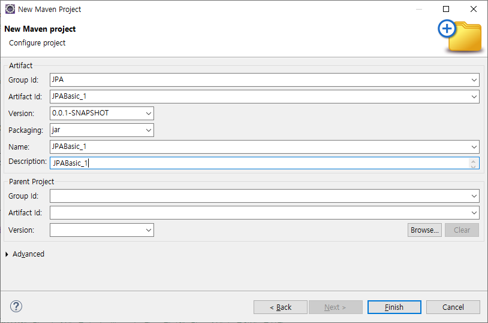
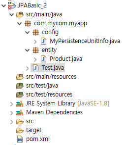

# [2024.07.24(수)] JPA/JPQL


# JPA

## JPA 인터페이스를 구현한 하이버네이트 사용하여 Product 객체 EntityManager로 관리하기

## 방법1. META-INF/persistence.xml 사용

### jpa_basic 스키마 생성하여 book 테이블 추가

```sql
CREATE TABLE Book (
  bookid      INTEGER PRIMARY KEY,
  bookname    VARCHAR(40),
  publisher   VARCHAR(40),
  price       INTEGER 
);

INSERT INTO Book VALUES(1, '축구의 역사', '굿스포츠', 7000);
INSERT INTO Book VALUES(2, '축구 아는 여자', '나무수', 13000);
INSERT INTO Book VALUES(3, '축구의 이해', '대한미디어', 22000);
INSERT INTO Book VALUES(4, '골프 바이블', '대한미디어', 35000);
INSERT INTO Book VALUES(5, '피겨 교본', '굿스포츠', 8000);
INSERT INTO Book VALUES(6, '배구 단계별기술', '굿스포츠', 6000);
INSERT INTO Book VALUES(7, '야구의 추억', '이상미디어', 20000);
INSERT INTO Book VALUES(8, '야구를 부탁해', '이상미디어', 13000);
INSERT INTO Book VALUES(9, '올림픽 이야기', '삼성당', 7500);
INSERT INTO Book VALUES(10, 'Olympic Champions', 'Pearson', 13000);
```

### 이클립스 Maven Project 생성



### pom.xml 작성

https://mvnrepository.com/artifact/org.hibernate.orm/hibernate-core/6.5.2.Final

https://mvnrepository.com/artifact/com.mysql/mysql-connector-j/8.3.0

```xml
<project xmlns="http://maven.apache.org/POM/4.0.0" xmlns:xsi="http://www.w3.org/2001/XMLSchema-instance" xsi:schemaLocation="http://maven.apache.org/POM/4.0.0 https://maven.apache.org/xsd/maven-4.0.0.xsd">
  <modelVersion>4.0.0</modelVersion>
  <groupId>JPA</groupId>
  <artifactId>JPABasic_1</artifactId>
  <version>0.0.1-SNAPSHOT</version>
  <name>JPABasic_1</name>
  <description>JPABasic_1</description>

	<dependencies>
		<!-- https://mvnrepository.com/artifact/org.hibernate.orm/hibernate-core -->
		<dependency>
			<groupId>org.hibernate.orm</groupId>
			<artifactId>hibernate-core</artifactId>
			<version>6.5.2.Final</version>
		</dependency>

		<!-- https://mvnrepository.com/artifact/com.mysql/mysql-connector-j -->
		<dependency>
			<groupId>com.mysql</groupId>
			<artifactId>mysql-connector-j</artifactId>
			<version>8.3.0</version>
		</dependency>

	</dependencies>
</project>
```

### resources/META-INF/persistence.xml

```xml
<persistence xmlns="http://xmlns.jcp.org/xml/ns/persistence"
             xmlns:xsi="http://www.w3.org/2001/XMLSchema-instance"
             xsi:schemaLocation="http://xmlns.jcp.org/xml/ns/persistence
             http://xmlns.jcp.org/xml/ns/persistence/persistence_2_2.xsd"
             version="2.2">

	<persistence-unit name="my-pu"
		transaction-type="RESOURCE_LOCAL">
		<description>jpa basic</description>
		<provider>org.hibernate.jpa.HibernatePersistenceProvider</provider>
		<properties>
			<property name="hibernate.connection.driver_class" value="com.mysql.cj.jdbc.Driver" />
			<property name="hibernate.connection.url" value="jdbc:mysql://localhost:3306/jpa_basic" />
			<property name="hibernate.connection.username" value="root" />
			<property name="hibernate.connection.password" value="root" />
		</properties>
	</persistence-unit>

</persistence>
```

### product 스키마 생성

```sql
CREATE TABLE `product` (
  `id` int NOT NULL,
  `name` varchar(45) DEFAULT NULL,
  PRIMARY KEY (`id`)
);
```

### java.com.mycom.myapp.entity.Product.java

```java
package com.mycom.myapp.entity;

import jakarta.persistence.Entity;
import jakarta.persistence.Id;

@Entity
public class Product {
	
	@Id
	private Long id;
	private String name;
	
	
	public Long getId() {
		return id;
	}
	public void setId(Long id) {
		this.id = id;
	}
	public String getName() {
		return name;
	}
	public void setName(String name) {
		this.name = name;
	}
	
}
```

### java.com.mycom.myapp.Test.java

```sql
package com.mycom.myapp;

import com.mycom.myapp.entity.Product;

import jakarta.persistence.EntityManager;
import jakarta.persistence.EntityManagerFactory;
import jakarta.persistence.Persistence;

public class Test {

	public static void main(String[] args) {
		// EntityManager
		// Entity <=> Table에 대응되는 자바 클래스, @Entity 가지는
		
		EntityManagerFactory emf = Persistence.createEntityManagerFactory("my-pu");
		EntityManager em = emf.createEntityManager();
		
		// persistence context
		// em.getTransaction().begin() -- 작업 -- ... commit(), close()
		
		try {
			em.getTransaction().begin();
			
			Product p = new Product();
			p.setId(1L);
			p.setName("Phone");
			
			// Entity 객체가 persistence context 안으로 들어 온다.
			em.persist(p);
			
			em.getTransaction().commit();
		} finally {
			em.close();
		}
		
	}

}
```

### 실행결과 - 오류만 안나도 실행되면 된다.

```java
7월 24, 2024 10:08:18 오전 org.hibernate.jpa.internal.util.LogHelper logPersistenceUnitInformation
INFO: HHH000204: Processing PersistenceUnitInfo [name: my-pu]
7월 24, 2024 10:08:18 오전 org.hibernate.Version logVersion
INFO: HHH000412: Hibernate ORM core version 6.5.2.Final
7월 24, 2024 10:08:18 오전 org.hibernate.cache.internal.RegionFactoryInitiator initiateService
INFO: HHH000026: Second-level cache disabled
7월 24, 2024 10:08:18 오전 org.hibernate.engine.jdbc.connections.internal.DriverManagerConnectionProviderImpl configure
WARN: HHH10001002: Using built-in connection pool (not intended for production use)
7월 24, 2024 10:08:18 오전 org.hibernate.engine.jdbc.connections.internal.DriverManagerConnectionProviderImpl buildCreator
INFO: HHH10001005: Loaded JDBC driver class: com.mysql.cj.jdbc.Driver
7월 24, 2024 10:08:18 오전 org.hibernate.engine.jdbc.connections.internal.DriverManagerConnectionProviderImpl buildCreator
INFO: HHH10001012: Connecting with JDBC URL [jdbc:mysql://localhost:3306/jpa_basic]
7월 24, 2024 10:08:18 오전 org.hibernate.engine.jdbc.connections.internal.DriverManagerConnectionProviderImpl buildCreator
INFO: HHH10001001: Connection properties: {password=****, user=root}
7월 24, 2024 10:08:18 오전 org.hibernate.engine.jdbc.connections.internal.DriverManagerConnectionProviderImpl buildCreator
INFO: HHH10001003: Autocommit mode: false
7월 24, 2024 10:08:18 오전 org.hibernate.engine.jdbc.connections.internal.DriverManagerConnectionProviderImpl$PooledConnections <init>
INFO: HHH10001115: Connection pool size: 20 (min=1)
7월 24, 2024 10:08:19 오전 org.hibernate.engine.transaction.jta.platform.internal.JtaPlatformInitiator initiateService
INFO: HHH000489: No JTA platform available (set 'hibernate.transaction.jta.platform' to enable JTA platform integration)
```

## 방법2. META-INF/persistence.xml 대신 자바 설정 객체 사용

- JPABasic_1 복사하여 JPABasic_2 생성 후 update Project 실행
- resources/META-INF/persistence.xml 삭제

### pom.xml에 hikaricp 추가

https://mvnrepository.com/artifact/com.zaxxer/HikariCP/5.1.0

```java
<project xmlns="http://maven.apache.org/POM/4.0.0" xmlns:xsi="http://www.w3.org/2001/XMLSchema-instance" xsi:schemaLocation="http://maven.apache.org/POM/4.0.0 https://maven.apache.org/xsd/maven-4.0.0.xsd">
  <modelVersion>4.0.0</modelVersion>
  <groupId>JPA</groupId>
  <artifactId>JPABasic_1</artifactId>
  <version>0.0.1-SNAPSHOT</version>
  <name>JPABasic_1</name>
  <description>JPABasic_1</description>

	<dependencies>
		<!-- https://mvnrepository.com/artifact/org.hibernate.orm/hibernate-core -->
		<dependency>
			<groupId>org.hibernate.orm</groupId>
			<artifactId>hibernate-core</artifactId>
			<version>6.5.2.Final</version>
		</dependency>

		<!-- https://mvnrepository.com/artifact/com.mysql/mysql-connector-j -->
		<dependency>
			<groupId>com.mysql</groupId>
			<artifactId>mysql-connector-j</artifactId>
			<version>8.3.0</version>
		</dependency>

		<!-- 스프링 부트의 기본 connection Pool -->
		<!-- https://mvnrepository.com/artifact/com.zaxxer/HikariCP -->
		<dependency>
			<groupId>com.zaxxer</groupId>
			<artifactId>HikariCP</artifactId>
			<version>5.1.0</version>
		</dependency>

	</dependencies>
</project>
```

### java.com.mycom.myapp.config.MyPersistenceUnitInfo.java

```java
package com.mycom.myapp.config;

import java.net.URL;
import java.util.List;
import java.util.Properties;

import javax.sql.DataSource;

import com.zaxxer.hikari.HikariDataSource;

import jakarta.persistence.SharedCacheMode;
import jakarta.persistence.ValidationMode;
import jakarta.persistence.spi.ClassTransformer;
import jakarta.persistence.spi.PersistenceUnitInfo;
import jakarta.persistence.spi.PersistenceUnitTransactionType;

// META-INF/persistence.xml 대체
public class MyPersistenceUnitInfo implements PersistenceUnitInfo {

	@Override
	public String getPersistenceUnitName() {
		return "my-pu";
	}

	@Override
	public String getPersistenceProviderClassName() {
		return "org.hibernate.jpa.HibernatePersistenceProvider";
	}

	@Override
	public PersistenceUnitTransactionType getTransactionType() {
		return PersistenceUnitTransactionType.RESOURCE_LOCAL;
	}

	@Override
	public DataSource getJtaDataSource() {
		HikariDataSource dataSource = new HikariDataSource();
		dataSource.setJdbcUrl("jdbc:mysql://localhost:3306/jpa_basic");
		dataSource.setUsername("root");
		dataSource.setPassword("root");
		return dataSource;
	}

	@Override
	public DataSource getNonJtaDataSource() {
		// TODO Auto-generated method stub
		return null;
	}

	@Override
	public List<String> getMappingFileNames() {
		// TODO Auto-generated method stub
		return null;
	}

	@Override
	public List<URL> getJarFileUrls() {
		// TODO Auto-generated method stub
		return null;
	}

	@Override
	public URL getPersistenceUnitRootUrl() {
		// TODO Auto-generated method stub
		return null;
	}

	@Override
	public List<String> getManagedClassNames() {
		return List.of("com.mycom.myapp.entity.Product");
	}

	@Override
	public boolean excludeUnlistedClasses() {
		// TODO Auto-generated method stub
		return false;
	}

	@Override
	public SharedCacheMode getSharedCacheMode() {
		// TODO Auto-generated method stub
		return null;
	}

	@Override
	public ValidationMode getValidationMode() {
		// TODO Auto-generated method stub
		return null;
	}

	@Override
	public Properties getProperties() {
		// TODO Auto-generated method stub
		return null;
	}

	@Override
	public String getPersistenceXMLSchemaVersion() {
		// TODO Auto-generated method stub
		return null;
	}

	@Override
	public ClassLoader getClassLoader() {
		// TODO Auto-generated method stub
		return null;
	}

	@Override
	public void addTransformer(ClassTransformer transformer) {
		// TODO Auto-generated method stub
		
	}

	@Override
	public ClassLoader getNewTempClassLoader() {
		// TODO Auto-generated method stub
		return null;
	}

}
```

### java.com.mycom.myapp.Test.java

```java
package com.mycom.myapp;

import java.util.HashMap;

import org.hibernate.jpa.HibernatePersistenceProvider;

import com.mycom.myapp.config.MyPersistenceUnitInfo;
import com.mycom.myapp.entity.Product;

import jakarta.persistence.EntityManager;
import jakarta.persistence.EntityManagerFactory;

public class Test {

	public static void main(String[] args) {
		// xml 대신 자바 설정 객체
		
		// EntityManager
		// Entity <=> Table에 대응되는 자바 클래스, @Entity 가지는
		
		// EntityManagerFactory emf = Persistence.createEntityManagerFactory("my-pu");
		EntityManagerFactory emf = new HibernatePersistenceProvider().createContainerEntityManagerFactory(new MyPersistenceUnitInfo(), new HashMap<>());
		EntityManager em = emf.createEntityManager();
		
		// persistence context
		// em.getTransaction().begin() -- 작업 -- ... commit(), close()
		
		try {
			em.getTransaction().begin();
			
			Product p = new Product();
			p.setId(2L);
			p.setName("Book");
			
			// Entity 객체가 persistence context 안으로 들어 온다.
			em.persist(p);
			
			em.getTransaction().commit();
		} finally {
			em.close();
		}
		
	}

}
```

### 프로젝트명에 오류로 나오는 문제 해결방안

- JPA를 사용할 때 persistence.xml 파일이 없으면 프로젝트명에 오류를 띄운다.
    
    (프로젝트 기능은 정상 동작한다.)
    
- 해결방법 : [Window] → [Preferences] → [Java Persistence] → [JPA] → [Error/Warnings] → ‘No persistence.xml file found in project’를 ‘Ignore’로 변경
    
    
    

## JPA CRUD 작성 (방법2. 자바 설정 객체 프로젝트 복사)

### DB employee 테이블 생성

```java
CREATE TABLE `employee` (
  `id` int NOT NULL,
  `name` varchar(45) DEFAULT NULL,
  `address` varchar(45) DEFAULT NULL,
  PRIMARY KEY (`id`)
) ENGINE=InnoDB DEFAULT CHARSET=utf8mb4 COLLATE=utf8mb4_0900_ai_ci;

insert into employee values (1, '홍길동', '서울 어디');
```

### java.com.mycom.myapp.entity.Employee.java (product 삭제)

```java
package com.mycom.myapp.entity;

import jakarta.persistence.Column;
import jakarta.persistence.Entity;
import jakarta.persistence.Id;
import jakarta.persistence.Table;

// entity class 에 대응하는 table명이 다르거나, field에 대응하는 column명이 다르면 
// @Table, @Column을 이용해서 적용핧 수 있다.

@Entity
@Table(name = "employee") // 테이블명과 자바 Entity class 이름이 다를 경우 사용한다. 
public class Employee {
	
	@Id
	@Column(name="id")
	private int id;
	private String name;
	private String  address;
	public int getId() {
		return id;
	}
	public void setId(int id) {
		this.id = id;
	}
	public String getName() {
		return name;
	}
	public void setName(String name) {
		this.name = name;
	}
	public String getAddress() {
		return address;
	}
	public void setAddress(String address) {
		this.address = address;
	}
	
	@Override
	public String toString() {
		return "Employee [id=" + id + ", name=" + name + ", address=" + address + "]";
	}

}
```

### java.com.mycom.myapp.config.MyPersistenceUnitInfo.java

```java
package com.mycom.myapp.config;

import java.net.URL;
import java.util.List;
import java.util.Properties;

import javax.sql.DataSource;

import com.zaxxer.hikari.HikariDataSource;

import jakarta.persistence.SharedCacheMode;
import jakarta.persistence.ValidationMode;
import jakarta.persistence.spi.ClassTransformer;
import jakarta.persistence.spi.PersistenceUnitInfo;
import jakarta.persistence.spi.PersistenceUnitTransactionType;

// META-INF/persistence.xml 대체
public class MyPersistenceUnitInfo implements PersistenceUnitInfo {

	@Override
	public String getPersistenceUnitName() {
		return "my-pu";
	}

	@Override
	public String getPersistenceProviderClassName() {
		return "org.hibernate.jpa.HibernatePersistenceProvider";
	}

	@Override
	public PersistenceUnitTransactionType getTransactionType() {
		return PersistenceUnitTransactionType.RESOURCE_LOCAL;
	}

	@Override
	public DataSource getJtaDataSource() {
		HikariDataSource dataSource = new HikariDataSource();
		dataSource.setJdbcUrl("jdbc:mysql://localhost:3306/jpa_basic");
		dataSource.setUsername("root");
		dataSource.setPassword("root");
		return dataSource;
	}

	@Override
	public DataSource getNonJtaDataSource() {
		// TODO Auto-generated method stub
		return null;
	}

	@Override
	public List<String> getMappingFileNames() {
		// TODO Auto-generated method stub
		return null;
	}

	@Override
	public List<URL> getJarFileUrls() {
		// TODO Auto-generated method stub
		return null;
	}

	@Override
	public URL getPersistenceUnitRootUrl() {
		// TODO Auto-generated method stub
		return null;
	}

	@Override
	public List<String> getManagedClassNames() {
		return List.of("com.mycom.myapp.entity.Employee");
	}

	@Override
	public boolean excludeUnlistedClasses() {
		// TODO Auto-generated method stub
		return false;
	}

	@Override
	public SharedCacheMode getSharedCacheMode() {
		// TODO Auto-generated method stub
		return null;
	}

	@Override
	public ValidationMode getValidationMode() {
		// TODO Auto-generated method stub
		return null;
	}

	@Override
	public Properties getProperties() {
		// TODO Auto-generated method stub
		return null;
	}

	@Override
	public String getPersistenceXMLSchemaVersion() {
		// TODO Auto-generated method stub
		return null;
	}

	@Override
	public ClassLoader getClassLoader() {
		// TODO Auto-generated method stub
		return null;
	}

	@Override
	public void addTransformer(ClassTransformer transformer) {
		// TODO Auto-generated method stub
		
	}

	@Override
	public ClassLoader getNewTempClassLoader() {
		// TODO Auto-generated method stub
		return null;
	}

}
```

### java.com.mycom.myapp.Test.java

```java
package com.mycom.myapp;

import java.util.HashMap;

import org.hibernate.jpa.HibernatePersistenceProvider;

import com.mycom.myapp.config.MyPersistenceUnitInfo;
import com.mycom.myapp.entity.Employee;

import jakarta.persistence.EntityManager;
import jakarta.persistence.EntityManagerFactory;

//  org.hibernate.UnknownEntityTypeException: Unable to locate entity descriptor: com.mycom.myapp.entity.Employee
// 해결방법 : com.mycom.myapp.config.MyPersistenceUnitInfo.java의 getManagedClassNames 메소드에 해당 entity를 추가한다.
public class Test {

	public static void main(String[] args) {

		EntityManagerFactory emf = new HibernatePersistenceProvider().createContainerEntityManagerFactory(new MyPersistenceUnitInfo(), new HashMap<>());
		EntityManager em = emf.createEntityManager();
		
		try {
			em.getTransaction().begin();
			
			// persist() => Entity 객체가 persistence context 안으로 들어 온다.
			// find() => DB의 특정 row를 persistence context 안으로 들어 오게 한다. Entity 객체로 표현
//			{
//				Employee e1 = em.find(Employee.class, 1);
//				System.out.println(e1);
//			}
			
//			{
//				Employee e1 = em.find(Employee.class, 1);
//				e1.setAddress("부산 어디"); // 이 시점에 DB에 update 수행되지 않는다.
//				System.out.println(e1);
//			}
			
//			{
//				// new로 생성한 e1 객체는 영속성 컨텍스트에 있지 않으므로 출력 결과는 address가 '광주 어디'로 보이지만,
//				// employee 테이블의 id가 1인 데이터의 address는 변경되지 않는다.
//				Employee e1 = new Employee();
//				e1.setId(1);
//				e1.setAddress("광주 어디"); // 이 시점에 DB에 update 수행되지 않는다.
//				System.out.println(e1);
//			}
			
//			{
//				// update가 발생하지 않는다.
//				// 변경을 감지하고 있어서, 수정이 일어나지 않으면 update되지 않는다.
//				Employee e1 = em.find(Employee.class, 1);
//				e1.setAddress("광주 어디"); 
//				e1.setAddress("부산 어디");
//				System.out.println(e1);
//			}
			
//			{
//				Employee e1 = new Employee();
//				e1.setId(2);
//				e1.setAddress("강원 어디");
//				System.out.println(e1);
//				
//				// em.persist(e1);  // Duplicate entry '2' for key 'employee.PRIMARY'
//				em.merge(e1);  // DB에 해당 칼럼이 있으면 update 수행한다.
//			}
			
			{
				Employee e1 = new Employee();
				e1.setId(3);
				e1.setAddress("충청 어디");
				System.out.println(e1);
				
				// em.persist(e1);  // insert
				em.merge(e1);  // DB에 해당 칼럼이 없으면 insert를 수행한다.
			}
			
			
			em.getTransaction().commit(); // update 수행
		} finally {
			em.close();
		}
			
	}

}
```

## EntityManagerFactory의 HashMap 설정

### hibernate.show_sql (sql 명령문을 확인)

```java
Map<String, String> props = new HashMap<>();
		props.put("hibernate.show_sql", "true");	// sql 명령문을 확인할 수 있다.
```

### java.com.mycom.myapp.Test.java

```java
package com.mycom.myapp;

import java.util.HashMap;
import java.util.Map;

import org.hibernate.jpa.HibernatePersistenceProvider;

import com.mycom.myapp.config.MyPersistenceUnitInfo;
import com.mycom.myapp.entity.Employee;

import jakarta.persistence.EntityManager;
import jakarta.persistence.EntityManagerFactory;

//  org.hibernate.UnknownEntityTypeException: Unable to locate entity descriptor: com.mycom.myapp.entity.Employee
// 해결방법 : com.mycom.myapp.config.MyPersistenceUnitInfo.java의 getManagedClassNames 메소드에 해당 entity를 추가한다.

// EntityManagerFactory의 HashMap에 몇 가지 설정
public class Test {

	public static void main(String[] args) {

		Map<String, String> props = new HashMap<>();
		props.put("hibernate.show_sql", "true");	// sql 명령문을 확인할 수 있다.
		
		EntityManagerFactory emf = new HibernatePersistenceProvider().createContainerEntityManagerFactory(new MyPersistenceUnitInfo(), props);
		EntityManager em = emf.createEntityManager();
		
		try {
			em.getTransaction().begin();
			
			// sql 확인
//			{
//				Employee e1 = new Employee();
//				e1.setId(1);
//				e1.setName("홍길동");
//				e1.setAddress("서울 어디");
//				em.persist(e1);
//			}
			
//			{
//				Employee e1 = em.find(Employee.class, 1);
//				System.out.println(e1);
//			}
			
//			{
//				Employee e1 = new Employee();
//				e1.setId(1);
//				e1.setName("홍길동");
//				e1.setAddress("서울 어디");
//				em.persist(e1);
//				
//				System.out.println(e1);
//				
//				// delay
//				try {
//					Thread.sleep(10000);
//				} catch (Exception e) {
//					e.printStackTrace();
//				}
//				
//			}

			{
				Employee e1 = em.find(Employee.class, 1);
				e1.setAddress("제주 어디");
				System.out.println(e1);
				
				// delay
				try {
					Thread.sleep(10000);
				} catch (Exception e) {
					e.printStackTrace();
				}
			}
			
			
			em.getTransaction().commit(); // update 수행
		} finally {
			em.close();
		}
		
		
	}

}
```

### hibernate.hbm2ddl.auto

- create : 엔티티 클래스와 연관된 테이블이 없으면 생성하고 있으면 Drop 후 새로 생성
- update : 엔티티 클래스와 연관된 테이블이 없으면 create를 수행하고 , 원래 있어야 할 테이블과 동일하지 않으면 Alter를 수행한다. (엔티티 클래스와 연관된 테이블이 이미 존재하면 아무 동작 하지 않는다.)

```java
Map<String, String> props = new HashMap<>();
		props.put("hibernate.hbm2ddl.auto", "create");	// 속성에 create, update 등이 올 수 있다.
		// hbm2ddl <= Hibernate Mapping to (2) DDL
```

- find()는 persistence context에 있으면 거기서 찾는다. 없으면 DB에서 가져온다.
- find() 즉각 실행 된다.
- getReference() 사용될 때 실행 된다. (지연 로딩)
- remove() : 해당 엔티티 객체를 persistence context에서 제거한다.
- refresh() : 현재 context에 있는 데이터를 DB에 있는 데이터로 다시 덮어씌운다.

### java.com.mycom.myapp.Test.java

```java
package com.mycom.myapp;

import java.util.HashMap;
import java.util.Map;

import org.hibernate.jpa.HibernatePersistenceProvider;

import com.mycom.myapp.config.MyPersistenceUnitInfo;
import com.mycom.myapp.entity.Employee;

import jakarta.persistence.EntityManager;
import jakarta.persistence.EntityManagerFactory;

//  org.hibernate.UnknownEntityTypeException: Unable to locate entity descriptor: com.mycom.myapp.entity.Employee
// 해결방법 : com.mycom.myapp.config.MyPersistenceUnitInfo.java의 getManagedClassNames 메소드에 해당 entity를 추가한다.

// EntityManagerFactory의 HashMap에 몇 가지 설정
public class Test {

	public static void main(String[] args) {

		Map<String, String> props = new HashMap<>();
		props.put("hibernate.show_sql", "true");	// sql 명령문을 확인할 수 있다.
		props.put("hibernate.hbm2ddl.auto", "update");	// 속성에 create, update 등이 올 수 있다.
		// hbm2ddl <= Hibernate Mapping to (2) DDL
		
		EntityManagerFactory emf = new HibernatePersistenceProvider().createContainerEntityManagerFactory(new MyPersistenceUnitInfo(), props);
		EntityManager em = emf.createEntityManager();
		
		try {
			em.getTransaction().begin();
			
			// sql 확인
//			{
//				Employee e1 = new Employee();
//				e1.setId(1);
//				e1.setName("홍길동");
//				e1.setAddress("서울 어디");
//				em.persist(e1);
//			}
			
//			{
//				Employee e1 = em.find(Employee.class, 1);
//				System.out.println(e1);
//			}
			
//			{
//				Employee e1 = new Employee();
//				e1.setId(1);
//				e1.setName("홍길동");
//				e1.setAddress("서울 어디");
//				em.persist(e1);
//				
//				System.out.println(e1);
//				
//				// delay
//				try {
//					Thread.sleep(10000);
//				} catch (Exception e) {
//					e.printStackTrace();
//				}
//				
//			}

//			{
//				Employee e1 = em.find(Employee.class, 1);
//				e1.setAddress("제주 어디");
//				System.out.println(e1);
//				
//				// delay
//				try {
//					Thread.sleep(10000);
//				} catch (Exception e) {
//					e.printStackTrace();
//				}
//			}
			
			// create, update 설정으로 현재 employee table empty
			// employee table drop
//			{
//				Employee e1 = em.find(Employee.class, 1);
//				System.out.println(e1);
//				
//				e1 = new Employee();
//				e1.setId(1);
//				e1.setName("홍길동");
//				e1.setAddress("서울 어디");
//				em.persist(e1);
//				
//				e1 = em.find(Employee.class, 1); // select 수행 X
//				// find()는 persistence context에 있으면 거기서 찾는다. 없으면 DB에서 가져온다.
//				System.out.println(e1);
//			}
			
			// getReference()
			// 현재 DB 1 건 employee 데이터 존재
//			{
//				// find() 즉각 실행 된다.
//				// getReference() 사용될 때 실행 된다. (지연 로딩)
////				Employee e1 = em.find(Employee.class, 1); // 즉시
//				Employee e1 = em.getReference(Employee.class, 1); // find() X
////				e1.setName("이길동");
//				
//				// delay
//				try {
//					Thread.sleep(10000);
//				} catch (Exception e) {
//					e.printStackTrace();
//				}
//				
//				System.out.println(e1);
//			}

			
			// remove
			// persistence context에서 제거
//			{
//				Employee e1 = em.find(Employee.class, 1); 
//				
//				em.remove(e1);
//				
//				// delay
//				try {
//					Thread.sleep(10000);
//				} catch (Exception e) {
//					e.printStackTrace();
//				}
//				
//				System.out.println(e1);
//			}

			// refresh
			// 현재 context에 있는 데이터를 DB에 있는 데이터로 다시 덮어씌운다.
			{
				Employee e1 = em.find(Employee.class, 1); 

				// refresh 전, 주소 변경
				e1.setAddress("아까 거기");

				System.out.println(e1);
				
				// delay
				try {
					Thread.sleep(10000);
				} catch (Exception e) {
					e.printStackTrace();
				}
				
				em.refresh(e1);
				
				// refresh 후
				System.out.println(e1);
			}
			
			em.getTransaction().commit(); // update 수행
		} finally {
			em.close();
		}
		
	}

}
```

### create 실행 결과

```java
7월 24, 2024 1:28:50 오후 org.hibernate.jpa.internal.util.LogHelper logPersistenceUnitInformation
INFO: HHH000204: Processing PersistenceUnitInfo [name: my-pu]
7월 24, 2024 1:28:51 오후 org.hibernate.Version logVersion
INFO: HHH000412: Hibernate ORM core version 6.5.2.Final
SLF4J: Failed to load class "org.slf4j.impl.StaticLoggerBinder".
SLF4J: Defaulting to no-operation (NOP) logger implementation
SLF4J: See http://www.slf4j.org/codes.html#StaticLoggerBinder for further details.
7월 24, 2024 1:28:51 오후 org.hibernate.cache.internal.RegionFactoryInitiator initiateService
INFO: HHH000026: Second-level cache disabled
7월 24, 2024 1:28:52 오후 org.hibernate.engine.transaction.jta.platform.internal.JtaPlatformInitiator initiateService
INFO: HHH000489: No JTA platform available (set 'hibernate.transaction.jta.platform' to enable JTA platform integration)
Hibernate: drop table if exists employee
Hibernate: create table employee (id integer not null, address varchar(255), name varchar(255), primary key (id)) engine=InnoDB
```

# JPQL

## JPABasic_JPQL 프로젝트 생성

- JPABasic_4 복사하여 JPABasic_JPQL 생성 후 update Project 실행

### java.com.mycom.myapp.entity.Book.java (Employee 삭제)

```java
package com.mycom.myapp.entity;

import jakarta.persistence.Entity;
import jakarta.persistence.Id;
import jakarta.persistence.Table;

@Entity
@Table(name="book")
public class Book {
	@Id
	private int bookid;
	private String bookname;
	private String publisher;
	private int price;
	
	public int getBokid() {
		return bookid;
	}

	public void setBokid(int bokid) {
		this.bookid = bokid;
	}

	public String getBookname() {
		return bookname;
	}

	public void setBookname(String bookname) {
		this.bookname = bookname;
	}

	public String getPublisher() {
		return publisher;
	}

	public void setPublisher(String publisher) {
		this.publisher = publisher;
	}

	public int getPrice() {
		return price;
	}

	public void setPrice(int price) {
		this.price = price;
	}

	@Override
	public String toString() {
		return "Book [bookid=" + bookid + ", bookname=" + bookname + ", publisher=" + publisher + ", price=" + price
				+ "]";
	}
	
}
```

### java.com.mycom.myapp.config.MyPersistenceUnitInfo.java

```java
package com.mycom.myapp.config;

import java.net.URL;
import java.util.List;
import java.util.Properties;

import javax.sql.DataSource;

import com.zaxxer.hikari.HikariDataSource;

import jakarta.persistence.SharedCacheMode;
import jakarta.persistence.ValidationMode;
import jakarta.persistence.spi.ClassTransformer;
import jakarta.persistence.spi.PersistenceUnitInfo;
import jakarta.persistence.spi.PersistenceUnitTransactionType;

// META-INF/persistence.xml 대체
public class MyPersistenceUnitInfo implements PersistenceUnitInfo {

	@Override
	public String getPersistenceUnitName() {
		return "my-pu";
	}

	@Override
	public String getPersistenceProviderClassName() {
		return "org.hibernate.jpa.HibernatePersistenceProvider";
	}

	@Override
	public PersistenceUnitTransactionType getTransactionType() {
		return PersistenceUnitTransactionType.RESOURCE_LOCAL;
	}

	@Override
	public DataSource getJtaDataSource() {
		HikariDataSource dataSource = new HikariDataSource();
		dataSource.setJdbcUrl("jdbc:mysql://localhost:3306/jpa_basic");
		dataSource.setUsername("root");
		dataSource.setPassword("root");
		return dataSource;
	}

	@Override
	public DataSource getNonJtaDataSource() {
		// TODO Auto-generated method stub
		return null;
	}

	@Override
	public List<String> getMappingFileNames() {
		// TODO Auto-generated method stub
		return null;
	}

	@Override
	public List<URL> getJarFileUrls() {
		// TODO Auto-generated method stub
		return null;
	}

	@Override
	public URL getPersistenceUnitRootUrl() {
		// TODO Auto-generated method stub
		return null;
	}

	@Override
	public List<String> getManagedClassNames() {
		return List.of("com.mycom.myapp.entity.Book");
	}

	@Override
	public boolean excludeUnlistedClasses() {
		// TODO Auto-generated method stub
		return false;
	}

	@Override
	public SharedCacheMode getSharedCacheMode() {
		// TODO Auto-generated method stub
		return null;
	}

	@Override
	public ValidationMode getValidationMode() {
		// TODO Auto-generated method stub
		return null;
	}

	@Override
	public Properties getProperties() {
		// TODO Auto-generated method stub
		return null;
	}

	@Override
	public String getPersistenceXMLSchemaVersion() {
		// TODO Auto-generated method stub
		return null;
	}

	@Override
	public ClassLoader getClassLoader() {
		// TODO Auto-generated method stub
		return null;
	}

	@Override
	public void addTransformer(ClassTransformer transformer) {
		// TODO Auto-generated method stub
		
	}

	@Override
	public ClassLoader getNewTempClassLoader() {
		// TODO Auto-generated method stub
		return null;
	}

}

```

### java.com.mycom.myapp.Test.java

```java
package com.mycom.myapp;

import java.util.HashMap;
import java.util.List;
import java.util.Map;

import org.hibernate.jpa.HibernatePersistenceProvider;

import com.mycom.myapp.config.MyPersistenceUnitInfo;
import com.mycom.myapp.entity.Book;

import jakarta.persistence.EntityManager;
import jakarta.persistence.EntityManagerFactory;
import jakarta.persistence.Query;
import jakarta.persistence.TypedQuery;

// JPQL
// select no commit (commit 하지 않아도 된다.)
// insert, update, delete commit 필요하다.
// JPQL은 insert가 없다. update, delete는 있다.  // (여기서 다루지 않는다.)
public class Test {

	public static void main(String[] args) {

		Map<String, String> props = new HashMap<>();
		props.put("hibernate.show_sql", "true");	// sql 명령문을 확인할 수 있다.
		props.put("hibernate.hbm2ddl.auto", "update");	// 속성에 create, update 등이 올 수 있다.
		
		EntityManagerFactory emf = new HibernatePersistenceProvider().createContainerEntityManagerFactory(new MyPersistenceUnitInfo(), props);
		EntityManager em = emf.createEntityManager();
		
		try {
			// #1 normal Query (단순 Query)
//			{
//				String jpql = "select b from Book b"; // table이 아닌 entity를 대상 // 따라서 book이 아닌 Book을 사용해야 한다.
//				Query query = em.createQuery(jpql);
//				List<Book> bookList = query.getResultList();
//
//				for (Book book : bookList) {
//					System.out.println(book);
//				}
//			}
			
			// #2 Typed Query (타입을 지정한 Query) (권장)			
//			{
//				String jpql = "select b from Book b"; // table이 아닌 entity를 대상 // 따라서 book이 아닌 Book을 사용해야 한다.
//				TypedQuery<Book> query = em.createQuery(jpql, Book.class);
//				List<Book> bookList = query.getResultList();
//				
//				for (Book book : bookList) {
//					System.out.println(book);
//				}
//			}
			
			// #3 Parameter : positional Parameter 		
//			{
//				String jpql = "select b from Book b where price > ?1"; // ? + 순서번호
//				TypedQuery<Book> query = em.createQuery(jpql, Book.class);
//				query.setParameter(1, 15000);
//				List<Book> bookList = query.getResultList();
//				
//				for (Book book : bookList) {
//					System.out.println(book);
//				}
//			}
			
			// #4 Parameter : named Parameter 		
//			{
//				String jpql = "select b from Book b where price > :price"; // ? + 순서번호
//				TypedQuery<Book> query = em.createQuery(jpql, Book.class);
//				query.setParameter("price", 15000);
//				List<Book> bookList = query.getResultList();
//				
//				for (Book book : bookList) {
//					System.out.println(book);
//				}
//			}
			
			// #5 Parameter : positional Parameter, named Parameter together (별로 좋은 방법은 아니다.)
//			{
//				String jpql = "select b from Book b where b.price > :price and b.price < ?1"; // ? + 순서번호
//				TypedQuery<Book> query = em.createQuery(jpql, Book.class);
//				query.setParameter("price", 15000);
//				query.setParameter(1, 30000);
//				List<Book> bookList = query.getResultList();
//				
//				for (Book book : bookList) {
//					System.out.println(book);
//				}
//			}
			
			// #6 like
			// bookname
			{
				String searchWord = "축구";
				String searchPattern = "%" + searchWord + "%";
				String jpql = "select b from Book b where b.bookname like :searchPattern ";
				TypedQuery<Book> query = em.createQuery(jpql, Book.class);
				query.setParameter("searchPattern", searchPattern);
				List<Book> bookList = query.getResultList();
				
				for (Book book : bookList) {
					System.out.println(book);
				}
			}
		
		} finally {
			em.close();
		}
		
	}

}
```

## JPABasic_BookManager 프로젝트 생성

- JPABasic_JPQL 복사하여 JPABasic_BookManager 생성 후 update Project 실행
- **dto와 entity는 따로 만들어서 사용한다.**

### com.mycom.myapp

### config.MypersistenceUnitInfo.java

```java
package com.mycom.myapp.config;

import java.net.URL;
import java.util.List;
import java.util.Properties;

import javax.sql.DataSource;

import com.zaxxer.hikari.HikariDataSource;

import jakarta.persistence.SharedCacheMode;
import jakarta.persistence.ValidationMode;
import jakarta.persistence.spi.ClassTransformer;
import jakarta.persistence.spi.PersistenceUnitInfo;
import jakarta.persistence.spi.PersistenceUnitTransactionType;

// META-INF/persistence.xml 대체
public class MyPersistenceUnitInfo implements PersistenceUnitInfo {

	@Override
	public String getPersistenceUnitName() {
		return "my-pu";
	}

	@Override
	public String getPersistenceProviderClassName() {
		return "org.hibernate.jpa.HibernatePersistenceProvider";
	}

	@Override
	public PersistenceUnitTransactionType getTransactionType() {
		return PersistenceUnitTransactionType.RESOURCE_LOCAL;
	}

	@Override
	public DataSource getJtaDataSource() {
		HikariDataSource dataSource = new HikariDataSource();
		dataSource.setJdbcUrl("jdbc:mysql://localhost:3306/jpa_basic");
		dataSource.setUsername("root");
		dataSource.setPassword("root");
		return dataSource;
	}

	@Override
	public DataSource getNonJtaDataSource() {
		// TODO Auto-generated method stub
		return null;
	}

	@Override
	public List<String> getMappingFileNames() {
		// TODO Auto-generated method stub
		return null;
	}

	@Override
	public List<URL> getJarFileUrls() {
		// TODO Auto-generated method stub
		return null;
	}

	@Override
	public URL getPersistenceUnitRootUrl() {
		// TODO Auto-generated method stub
		return null;
	}

	@Override
	public List<String> getManagedClassNames() {
		return List.of("com.mycom.myapp.entity.Book");
	}

	@Override
	public boolean excludeUnlistedClasses() {
		// TODO Auto-generated method stub
		return false;
	}

	@Override
	public SharedCacheMode getSharedCacheMode() {
		// TODO Auto-generated method stub
		return null;
	}

	@Override
	public ValidationMode getValidationMode() {
		// TODO Auto-generated method stub
		return null;
	}

	@Override
	public Properties getProperties() {
		// TODO Auto-generated method stub
		return null;
	}

	@Override
	public String getPersistenceXMLSchemaVersion() {
		// TODO Auto-generated method stub
		return null;
	}

	@Override
	public ClassLoader getClassLoader() {
		// TODO Auto-generated method stub
		return null;
	}

	@Override
	public void addTransformer(ClassTransformer transformer) {
		// TODO Auto-generated method stub
		
	}

	@Override
	public ClassLoader getNewTempClassLoader() {
		// TODO Auto-generated method stub
		return null;
	}

}

```

### entity.Book.java

```java
package com.mycom.myapp.entity;

import jakarta.persistence.Entity;
import jakarta.persistence.Id;
import jakarta.persistence.Table;

@Entity
@Table(name="book")
public class Book {
	@Id
	private int bookid;
	private String bookname;
	private String publisher;
	private int price;
	
	public int getBookid() {
		return bookid;
	}

	public void setBookid(int bokid) {
		this.bookid = bokid;
	}

	public String getBookname() {
		return bookname;
	}

	public void setBookname(String bookname) {
		this.bookname = bookname;
	}

	public String getPublisher() {
		return publisher;
	}

	public void setPublisher(String publisher) {
		this.publisher = publisher;
	}

	public int getPrice() {
		return price;
	}

	public void setPrice(int price) {
		this.price = price;
	}

	@Override
	public String toString() {
		return "Book [bookid=" + bookid + ", bookname=" + bookname + ", publisher=" + publisher + ", price=" + price
				+ "]";
	}
	
}
```

### dto.BookDto.java

```java
package com.mycom.myapp.dto;

public class BookDto {
	private int bookId;
	private String bookName;
	private String publisher;
	private int price;
	
	public BookDto() {}
	public BookDto(int bookId, String bookName, String publisher, int price) {
		super();
		this.bookId = bookId;
		this.bookName = bookName;
		this.publisher = publisher;
		this.price = price;
	}

	public int getBookId() {
		return bookId;
	}

	public void setBookId(int bookId) {
		this.bookId = bookId;
	}

	public String getBookName() {
		return bookName;
	}

	public void setBookName(String bookName) {
		this.bookName = bookName;
	}

	public String getPublisher() {
		return publisher;
	}

	public void setPublisher(String publisher) {
		this.publisher = publisher;
	}

	public int getPrice() {
		return price;
	}

	public void setPrice(int price) {
		this.price = price;
	}

	@Override
	public String toString() {
		return "BookDto [bookId=" + bookId + ", bookName=" + bookName + ", publisher=" + publisher + ", price=" + price
				+ "]";
	}
	
}
```

### dao.BookDao.java

```java
package com.mycom.myapp.dao;

import java.util.HashMap;
import java.util.List;
import java.util.Map;
import java.util.stream.Collectors;

import org.hibernate.jpa.HibernatePersistenceProvider;

import com.mycom.myapp.config.MyPersistenceUnitInfo;
import com.mycom.myapp.dto.BookDto;
import com.mycom.myapp.entity.Book;

import jakarta.persistence.EntityManager;
import jakarta.persistence.EntityManagerFactory;
import jakarta.persistence.TypedQuery;

public class BookDao {
	EntityManager em;
	
	public BookDao() {
		Map<String, String> props = new HashMap<>();
		props.put("hibernate.show_sql", "true");	
		props.put("hibernate.hbm2ddl.auto", "update");	
		
		EntityManagerFactory emf = new HibernatePersistenceProvider().createContainerEntityManagerFactory(new MyPersistenceUnitInfo(), props);
		em = emf.createEntityManager();
	}
	
	public List<BookDto> listBook(){
		TypedQuery<Book> query = em.createQuery("select b from Book b", Book.class);
		// entity의 list를 dto의 list로 변환
		
		List<BookDto> bookList = query.getResultList().stream().map( book -> new BookDto(book.getBookid(), book.getBookname(), book.getPublisher(), book.getPrice()))
			.collect(Collectors.toList());
		return bookList;
	}
	
	public List<BookDto> listSearchBook(String searchWord){
		String searchPattern = "%" + searchWord + "%";
		TypedQuery<Book> query = em.createQuery("select b from Book b where b.bookname like :searchPattern ", Book.class);
		query.setParameter("searchPattern", searchPattern);
		// entity의 list를 dto의 list로 변환
		
		List<BookDto> bookList = query.getResultList().stream().map( book -> new BookDto(book.getBookid(), book.getBookname(), book.getPublisher(), book.getPrice()))
			.collect(Collectors.toList());
		return bookList;
	}
	
	public BookDto detailBook(int bookid) {
		Book book = em.find(Book.class, bookid);
		return new BookDto(book.getBookid(), book.getBookname(), book.getPublisher(), book.getPrice());
		
	}
	
	public void insertBook(BookDto bookDto) {
		em.getTransaction().begin();
		
		Book book = new Book();
		book.setBookid(bookDto.getBookId());
		book.setBookname(bookDto.getBookName());
		book.setPublisher(bookDto.getPublisher());
		book.setPrice(bookDto.getPrice());
		
		em.persist(book);
		em.getTransaction().commit();
	}
	
	public void updatetBook(BookDto bookDto) {
		em.getTransaction().begin();
		Book book = em.find(Book.class, bookDto.getBookId());
		book.setBookname(bookDto.getBookName());
		book.setPublisher(bookDto.getPublisher());
		book.setPrice(bookDto.getPrice());		
		em.getTransaction().commit();
	}
	
	public void deleteBook(int bookid) {
		em.getTransaction().begin();
		Book book = em.find(Book.class, bookid);
		em.remove(book);	
		em.getTransaction().commit();
	}

}
```

### ui

### AddBookDialog.java

```java
package com.mycom.myapp.ui;

import java.awt.BorderLayout;
import java.awt.GridLayout;

import javax.swing.JButton;
import javax.swing.JDialog;
import javax.swing.JLabel;
import javax.swing.JPanel;
import javax.swing.JTextField;
import javax.swing.table.DefaultTableModel;

import com.mycom.myapp.dto.BookDto;

public class AddBookDialog extends JDialog {
	private JTextField bookIdField, bookNameField, publisherField, priceField;
	private JButton addButton;
	// private DefaultTableModel tableModel; // 간단한 처리는 객체를 생성하지 않고 받은 파라미터로 처리해도 된다.
	
	// 부모 BookManager table 화면에 내용을 띄우기 위하여 생성자에서 부모의 tableModel 객체를 받는다.
	public AddBookDialog(BookManager parent, DefaultTableModel tableModel) {
		// this.tableModel = tableModel;
		
		setTitle("Book Add Dialog");
		setSize(300, 200);
		setLayout(new BorderLayout()); 
		setLocationRelativeTo(parent); // 부모 창의 가운데 팝업이 열리도록 설정한다.
		
		// input panel
		JPanel inputPanel = new JPanel();
		inputPanel.setLayout(new GridLayout(4,2));
		
		// field
		bookIdField = new JTextField();
		bookNameField = new JTextField();
		publisherField = new JTextField();
		priceField = new JTextField();
		
		// add field with label
		inputPanel.add(new JLabel("Book Id"));
		inputPanel.add(bookIdField);
		inputPanel.add(new JLabel("Book Name"));
		inputPanel.add(bookNameField);
		inputPanel.add(new JLabel("Publisher"));
		inputPanel.add(publisherField);
		inputPanel.add(new JLabel("Price"));
		inputPanel.add(priceField);
				
		// button panel
		JPanel buttonPanel = new JPanel();
		
		// button
		addButton = new JButton("Add");
		
		buttonPanel.add(addButton);
		
		// add inputPanel, buttonPanel to Dialog
		add(inputPanel, BorderLayout.CENTER);
		add(buttonPanel, BorderLayout.SOUTH);
		
		// add button actionListner
		addButton.addActionListener(e -> {
			int bookId = Integer.parseInt(bookIdField.getText());
			String bookName = bookNameField.getText();
			String publisher = publisherField.getText();
			int price = Integer.parseInt(priceField.getText());
			
			parent.insertBook(new BookDto(bookId, bookName, publisher, price));
			
			dispose();
		});
	}
}
```

### EditBookDialog.java

```java
package com.mycom.myapp.ui;

import java.awt.BorderLayout;
import java.awt.GridLayout;

import javax.swing.JButton;
import javax.swing.JDialog;
import javax.swing.JLabel;
import javax.swing.JOptionPane;
import javax.swing.JPanel;
import javax.swing.JTextField;
import javax.swing.table.DefaultTableModel;

import com.mycom.myapp.dto.BookDto;

public class EditBookDialog extends JDialog {
	private JTextField bookIdField, bookNameField, publisherField, priceField;
	private JButton updateButton, deleteButton;
	// private DefaultTableModel tableModel; // 간단한 처리는 객체를 생성하지 않고 받은 파라미터로 처리해도 된다.
	
	// 부모 BookManager table 화면에 내용을 띄우기 위하여 생성자에서 부모의 tableModel 객체를 받는다.
	// 선택된 row의 데이터를 보여주기 위하여 선택된 row index를 받는다.
	public EditBookDialog(BookManager parent, DefaultTableModel tableModel, int rowIndex) {
		// this.tableModel = tableModel;
		
		setTitle("Book Edit Dialog");
		setSize(300, 200);
		setLayout(new BorderLayout()); 
		setLocationRelativeTo(parent); // 부모 창의 가운데 팝업이 열리도록 설정한다.
		
		// 선택된 book의 bookId로 book table에서 조회
		Integer bookId = (Integer) tableModel.getValueAt(rowIndex, 0);
		
		BookDto book = parent.detailBook(bookId);
		
		// input panel
		JPanel inputPanel = new JPanel();
		inputPanel.setLayout(new GridLayout(4,2));
		
		// field
		bookIdField = new JTextField(String.valueOf(bookId));  // 정수 -> 문자열
		bookIdField.setEditable(false); // bookIdField는 수정하지 못하도록 변경
		bookNameField = new JTextField(book.getBookName());
		publisherField = new JTextField(book.getPublisher());
		priceField = new JTextField(String.valueOf(book.getPrice()));  // 정수 -> 문자열
		
		// add field with label
		inputPanel.add(new JLabel("Book Id"));
		inputPanel.add(bookIdField);
		inputPanel.add(new JLabel("Book Name"));
		inputPanel.add(bookNameField);
		inputPanel.add(new JLabel("Publisher"));
		inputPanel.add(publisherField);
		inputPanel.add(new JLabel("Price"));
		inputPanel.add(priceField);
		
		// button panel
		JPanel buttonPanel = new JPanel();
		
		// button
		updateButton = new JButton("수정");
		deleteButton = new JButton("삭제");
		
		buttonPanel.add(updateButton);
		buttonPanel.add(deleteButton);

		// add inputPanel, buttonPanel to Dialog
		add(inputPanel, BorderLayout.CENTER);
		add(buttonPanel, BorderLayout.SOUTH);
		
		// update, delete button actionListner
		updateButton.addActionListener(e -> {
			int ret = JOptionPane.showConfirmDialog(this, "수정할까요?", "수정 확인", JOptionPane.YES_NO_OPTION);
            if( ret == JOptionPane.YES_OPTION ) {
//            	int curBookId = Integer.parseInt(bookIdField.getText());
            	String bookName = bookNameField.getText();
            	String publisher = publisherField.getText();
            	int price = Integer.parseInt(priceField.getText());
            	
            	parent.updateBook(new BookDto(bookId, bookName, publisher, price)); // 위쪽에 선언된(선택된 row에서) 변수를 사용한다.
            	dispose();
            }
		});
		
		
		deleteButton.addActionListener(e -> {
			int ret = JOptionPane.showConfirmDialog(this, "삭제할까요?", "삭제 확인", JOptionPane.YES_NO_OPTION);
            if( ret == JOptionPane.YES_OPTION ) {
            	
            	parent.deleteBook(bookId); // 위쪽에 선언된(선택된 row에서) 변수를 사용한다.
            	dispose();
            }
		});
	}
}

```

### BookManager.java

```java
package com.mycom.myapp.ui;

import java.awt.BorderLayout;
import java.awt.Dimension;
import java.awt.TextField;
import java.awt.event.MouseAdapter;
import java.awt.event.MouseEvent;
import java.util.List;

import javax.swing.JButton;
import javax.swing.JFrame; // windows application
import javax.swing.JLabel;
import javax.swing.JOptionPane;
import javax.swing.JPanel;
import javax.swing.JScrollPane;
import javax.swing.JTable;
import javax.swing.JTextField;
import javax.swing.SwingUtilities;
import javax.swing.table.DefaultTableModel;

import com.mycom.myapp.dao.BookDao;
import com.mycom.myapp.dto.BookDto;

public class BookManager extends JFrame{ 
	
	// tableModel이 값을 가지고 있고 table 형식을 가지고 있어서 둘이 연계하여 화면을 보여준다.
	private JTable table; // grid ui component
	private DefaultTableModel tableModel;	// grid 형태의 data롤 표현
	private JButton searchButton, addButton, editButton, listButton;	// 버튼 생성
	private JTextField searchWordField;	// 검색어 입력칸

	// bookDao
	private BookDao bookDao = new BookDao();
	
	public BookManager() {

		// 화면 UI와 관련된 설정
		setTitle("Book Manager");
		setSize(600, 400);
		setDefaultCloseOperation(JFrame.EXIT_ON_CLOSE); // 종료 버튼을 누르면 종료
		setLocationRelativeTo(null);
		
		// table
		// int[][] ab = new int[]{1,2,3} 형식
		// DefaultTableModel(row에 넣을 값 객체, rowCount);
		tableModel = new DefaultTableModel(new Object[] {"Book ID", "Book Name", "Publisher", "Price"}, 0) {
			// 목록에서 수정할 수 없게 변경
			@Override
            public boolean isCellEditable(int row, int column) {
                return false; // All cells are not editable
            }
		};
		table = new JTable(tableModel);
		
		// DB로부터 현재 book 테이블에 있는 데이터를 가져와서 보여준다.
		listBook();
		
		// search
		Dimension TextFieldSize = new Dimension(400, 28);
		
		searchWordField = new JTextField();
		searchWordField.setPreferredSize(TextFieldSize);
		
		searchButton = new JButton("검색");
		
		JPanel searchPanel = new JPanel();
		searchPanel.add(new JLabel("제목 검색"));
		searchPanel.add(searchWordField);
		searchPanel.add(searchButton);
		
		// Button
		addButton = new JButton("등록");
		editButton = new JButton("수정 & 삭제");
		listButton = new JButton("목록");
		
		// bookManager의 BorderLayout SOUTH에 버튼을 2개 담을 수 없으므로 다른 패널에 버튼 2개를 담아서 붙인다.
		// button 2개를 담는 JPanel 객체를 만들고 그 객체를 BookManager에 담는다.
		JPanel buttonPanel = new JPanel(); // default layout : Flow Layout
		buttonPanel.add(addButton);
		buttonPanel.add(editButton);
		buttonPanel.add(listButton);
		
		// table을 BookManager에 붙인다.
		// BookManager의 layout에 따라 결정된다.
		// BookManager layout 종류 : Gridlayout, BorderLayout, CardLayout ...
		
		// BookManager의 layout 설정
		setLayout(new BorderLayout());
		// add(table, BorderLayout.CENTER);
		add(searchPanel, BorderLayout.NORTH);
		add(new JScrollPane(table), BorderLayout.CENTER); // table < scroll pane < jframe 형태로 table이 많아지면 스크롤이 생기도록 함.
		add(buttonPanel, BorderLayout.SOUTH);
		
		// button action event 처리
		// event 객체를 받아서 처리하는 로직을 가진 객체 <= ActionListener interface를 구현해야 한다.
		searchButton.addActionListener(e -> { 
			String searchWord = searchWordField.getText();
			if( !searchWord.isBlank() ) {
				listBook(searchWord);
			}
		}); 
		
		addButton.addActionListener(e -> { 
				// AddBookDialog를 띄운다.
			AddBookDialog addDialog = new AddBookDialog(this, this.tableModel);
			addDialog.setVisible(true);
		}); 
		
		editButton.addActionListener(e -> { 
			// table에 선택된 row가 있으면 AddBookDialog를 띄운다.
			// table에 선택된 row
			int selectedRow = table.getSelectedRow();
			if( selectedRow >= 0) {
				EditBookDialog editDialog = new EditBookDialog(this, this.tableModel, selectedRow);
				editDialog.setVisible(true);
			} else {
				JOptionPane.showMessageDialog(this, "도서를 선택하세요.");
			}
		}); 
		
		listButton.addActionListener(e -> listBook() );
		
		// 테이블에서 마우스 이벤트 처리 메소드 추가
		table.addMouseListener(new MouseAdapter() {
			// 마우스 더블 클릭이 되면 edit 팝업을 띄운다. 
			@Override
            public void mouseClicked(MouseEvent e) {
                // double click
                if (e.getClickCount() == 2) { // 클릭 2회 = 더블 클릭
                    int selectedRow = table.getSelectedRow();
                    if (selectedRow >= 0) {
                        EditBookDialog editDialog = new EditBookDialog(BookManager.this, tableModel, selectedRow);
                        editDialog.setVisible(true);
                    }
                }
            }
		});
	}
	
	private void clearTable() {
		tableModel.setRowCount(0);
	}
	
	private void listBook() {
		// 현재 tableModel을 정리하고 처리
		clearTable();
		
		List<BookDto> bookList = bookDao.listBook();
		
		for (BookDto book : bookList) {
			tableModel.addRow(new Object[] {book.getBookId(), book.getBookName(), book.getPublisher(), book.getPrice()});
		}
	}
	
	private void listBook(String searchWord) {
		// 현재 tableModel을 정리하고 처리
		clearTable();
		
		List<BookDto> bookList = bookDao.listSearchBook(searchWord);
		
		for (BookDto book : bookList) {
			tableModel.addRow(new Object[] {book.getBookId(), book.getBookName(), book.getPublisher(), book.getPrice()});
		}
	}
	
	BookDto detailBook(int bookId) {
		return bookDao.detailBook(bookId);
	}
	
	void insertBook(BookDto book) {
		bookDao.insertBook(book);
		listBook();
	}
	
	void updateBook(BookDto book) {
		bookDao.updatetBook(book);
		listBook();
	}
	
	void deleteBook(int bookId) {
		bookDao.deleteBook(bookId);
		listBook();
	}
	
	public static void main(String[] args) {
		// main() thread와 별개로 별도의 thread로 화면을 띄운다.
		// thread 처리를 간단히 해주는 utility method 제공한다.
		// invokeLater( thread 객체 <- runnable interface를 구현한 <- runnable interface가 functional interface
		// 결과적으로 invokeLater( lambda 식 표현 객체)
		SwingUtilities.invokeLater(() -> {
			new BookManager().setVisible(true);
//			BookManager bookManager = new BookManager();
//			bookManager.setVisible(true);
		});

	}

}
```