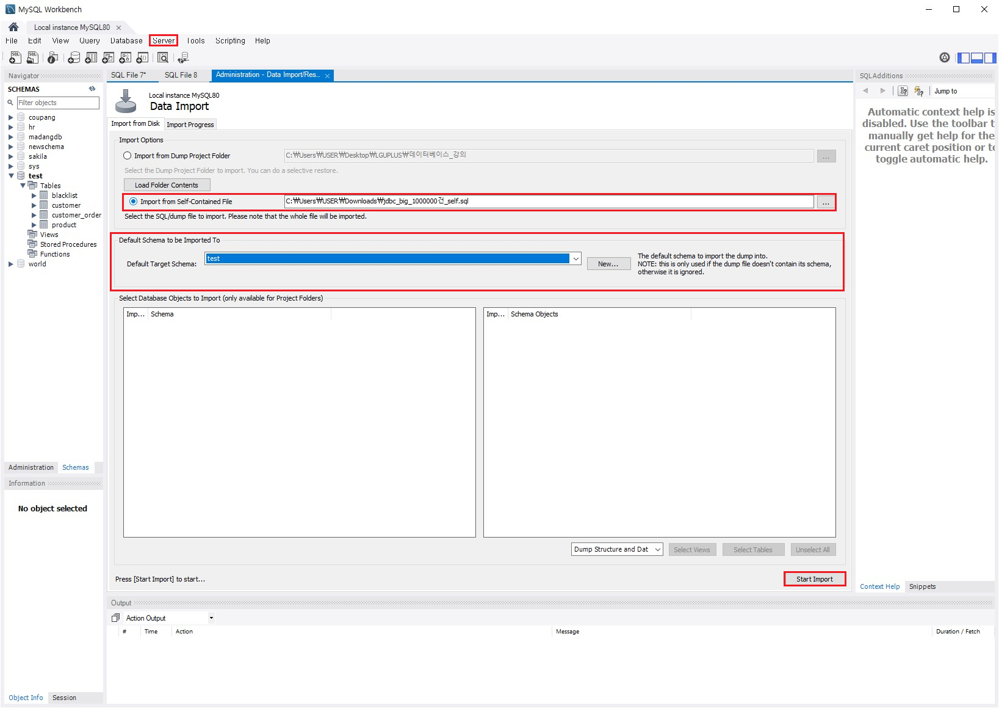
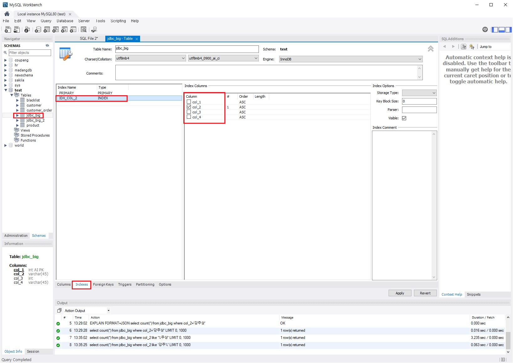
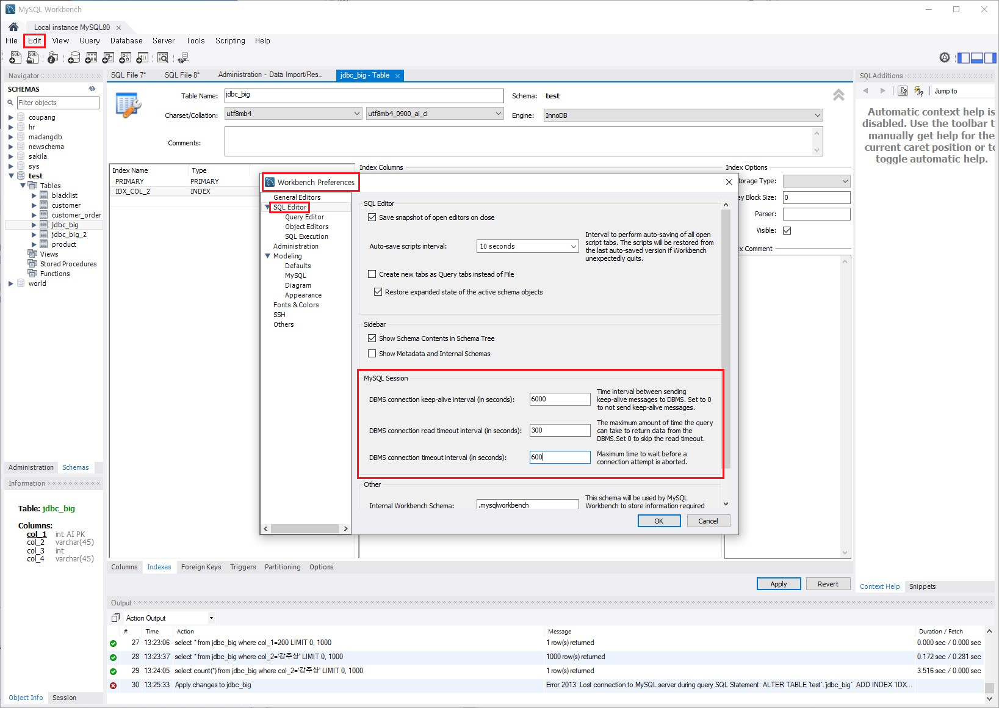
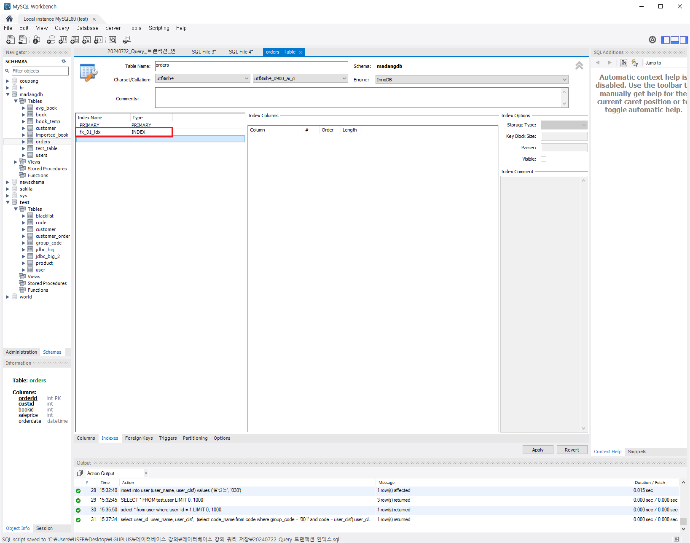

# [2024.07.22(월)] ch08 트랜잭션/ch04 SQL 고급


# chapter08 트랜잭션

## p.471 ch8.3 트랜잭션 고립 수준

### 트랜잭션 동시 실행 문제

### 오손 읽기(Dirty read)

- Dirty read(오손 읽기)는 읽기 작업을 하는 트랜잭션1이 쓰기 작업을 하는 트랜잭션 2가 작업한 중간 데이터를 읽기 때문에 생기는 문제이다. 작업 중인 트랜잭션2가 어떤 이유로 작업을 롤백할 경우 트랜잭션1은 트랜잭션2가 무효화한 데이터를 읽게 되고 트랜잭션1은 결과적으로 잘못된 결과를 보여준다.
    
    ### 오손 읽기 테스트 예시
    
    1. 마당DB에 USERS 테이블 추가
        
        ```java
        CREATE TABLE Users
        ( id INTEGER,
          name  VARCHAR(20),
          age   INTEGER);
        INSERT INTO Users VALUES (1, 'HONG GILDONG', 30);
        SELECT  * 
        FROM    Users;
        COMMIT;
        ```
        
    2. 트랜잭션1
        
        ```java
        SET TRANSACTION ISOLATION LEVEL READ UNCOMMITTED;
        START TRANSACTION;
        USE madangdb;
        SELECT	*
        FROM	Users
        WHERE	id=1;
        
        -- tx2 update
        
        SELECT	*
        FROM	Users
        WHERE	id=1;	-- age : 21 <- uncommited
        
        -- tx2 rollback 
        
        SELECT	*
        FROM	Users
        WHERE	id=1;	-- age : 21 <- uncommited
        
        commit;
        ```
        
    3. 트랜잭션2
        
        ```java
        set sql_safe_updates = 0;
        START TRANSACTION;
        UPDATE	Users
        SET		age=21
        WHERE	id=1;
        
        rollback;
        ```
        

### 반복불가능 읽기(non-repeatable read)

- non-repeatable read(반복불가능 읽기)는 트랜잭션1이 데이터를 읽고 트랜잭션2가 데이터를 쓰고 트랜잭션1이 다시 한 번 데이터를 읽을 때 생기는 문제이다. 즉, 트랜잭션1이 읽기 작업을 다시 한 번 반복할 경우 이전의 결과를 다시 보이지 않는 현상을 반복불가능 읽기라고 한다.
    
    ### 반복불가능 읽기 예시 코드
    
    트랜잭션1
    
    ```java
    -- SET TRANSACTION ISOLATION LEVEL READ COMMITTED : 다른 트랜잭션에서 commit한 경우 commit한 결과를 읽는다. 
    SET TRANSACTION ISOLATION LEVEL READ COMMITTED; -- 반복적으로 동일한 데이터 읽기 불가능 (non-repeatable read)
    
    START TRANSACTION;
    USE madangdb;
    SELECT	*
    FROM	Users
    WHERE	id=1;
    
    -- tx2 update & commit 
    
    SELECT	*
    FROM	Users
    WHERE	id=1;	-- age : 21
    
    -- tx2 rollback 
    
    SELECT	*
    FROM	Users
    WHERE	id=1;	-- age : 21
    
    commit;
    ```
    
    트랜잭션2
    
    ```java
    set sql_safe_updates = 0;
    START TRANSACTION;
    UPDATE	Users
    SET		age=21
    WHERE	id=1;
    
    commit;
    
    rollback;
    ```
    

### 유령데이터 읽기(phantom read)

- phantom read(유령데이터 읽기)는 트랜잭션1이 데이터를 읽고 트랜잭션2가 데이터를 쓰고 트랜잭션 1일 다시 한 번 데이터를 읽을 때 생기는 문제이다. 트랜잭션1이 읽기 작업을 다시 한 번 반복할 경우 이전에 없던 데이터가 보이는 현상을 유령데이터 읽기라고 한다.
- MySQL에서 TRANSACTION ISOLATION LEVEL을 repeatable read로 하면 유령데이터 읽기가 발생하지 않는다. 그러나 SET TRANSACTION ISOLATION LEVEL READ COMMITTED(non-repeatable read)하면 유령데이터 읽기가 발생한다.
- SET TRANSACTION ISOLATION LEVEL repeatable read;
    
    반복적으로 동일한 데이터 읽기
    내 트랜잭션이 시작하고 끝나기 전까지는 다른 트랜잭션에 의해 row에 변화(COMMIT 포함)가 생기더라도 동일한 row를 조회한다.
    repeatable read가 default이다.
    
    ### 유령데이터 읽기 예시 코드
    
    트랜잭션1
    
    ```java
    -- SET TRANSACTION ISOLATION LEVEL READ COMMITTED : 다른 트랜잭션에서 commit한 경우 commit한 결과를 읽는다. 
    SET TRANSACTION ISOLATION LEVEL READ COMMITTED; -- 반복적으로 동일한 데이터 읽기 불가능 (non-repeatable read)
    
    START TRANSACTION;
    
    USE madangdb;
    
    SELECT	*
    FROM	Users;
    
    -- tx2 insert & commit 
    
    SELECT	*
    FROM	Users;	-- age : 21
    
    commit;
    ```
    
    트랜잭션2
    
    ```java
    set sql_safe_updates = 0;
    
    START TRANSACTION;
    
    -- UPDATE	Users
    -- SET		age=21
    -- WHERE	id=1;
    
    insert into Users values (3, 'Bob', 27);
    
    commit;
    ```
    
    ### 유령데이터 읽기 발생 X 예시 코드
    
    트랜잭션1
    
    ```java
    -- SET TRANSACTION ISOLATION LEVEL READ COMMITTED : 다른 트랜잭션에서 commit한 경우 commit한 결과를 읽는다. 
    SET TRANSACTION ISOLATION LEVEL repeatable read; -- 반복적으로 동일한 데이터 읽기 
    -- 내 트랜잭션이 시작하고 끝나기 전까지는 다른 트랜잭션에 의해 row에 변화(COMMIT 포함)가 생기더라도 동일한 row를 조회한다.
    -- repeatable read가 default이다.
    
    START TRANSACTION;
    
    USE madangdb;
    
    SELECT	*
    FROM	Users;
    
    -- tx2 insert & commit 
    
    SELECT	*
    FROM	Users;	-- age : 21
    
    commit;
    ```
    
    트랜잭션2
    
    ```java
    set sql_safe_updates = 0;
    
    START TRANSACTION;
    
    -- UPDATE	Users
    -- SET		age=21
    -- WHERE	id=1;
    
    insert into Users values (3, 'Bob', 27);
    
    delete from users where id=3;
    
    commit;
    
    ```
    

### READ COMMITED와 REPEATABLE READ 차이

READ COMMITED : 항상 원본 데이터 파일에서 데이터를 가져온다.

REPEATABLE READ : redo, undo 파일에서 데이터를 가져온다.

### READ COMMITTED

READ COMMITTED는 두 가지 주요 특징을 가지고 있습니다:

1. **데이터 일관성**: 트랜잭션이 실행 중일 때, 다른 트랜잭션이 커밋한 데이터를 읽을 수 있습니다. 이는 "dirty read"를 방지합니다. 즉, 트랜잭션이 아직 커밋되지 않은 데이터를 읽을 수 없습니다.
2. **데이터 최신성**: 트랜잭션이 데이터베이스에서 데이터를 읽을 때마다 항상 현재 커밋된 최신 데이터를 읽습니다. 이는 다른 트랜잭션이 데이터를 변경하고 커밋하면, 해당 변경 사항을 즉시 읽을 수 있음을 의미합니다.

이 아이솔레이션 레벨에서는 데이터를 원본 데이터 파일에서 직접 가져옵니다. 이는 다른 트랜잭션이 데이터를 커밋할 때마다 최신 상태로 데이터를 읽을 수 있도록 보장합니다.

### REPEATABLE READ

REPEATABLE READ는 READ COMMITTED보다 더 높은 격리 수준을 제공합니다:

1. **데이터 일관성**: 트랜잭션이 시작된 후에는 다른 트랜잭션이 커밋한 데이터를 읽을 수 없습니다. 이는 "non-repeatable read"를 방지합니다. 즉, 트랜잭션이 시작된 후에 다른 트랜잭션이 동일한 데이터를 변경하거나 삭제하더라도 처음 읽은 데이터를 반복해서 읽을 수 있습니다.
2. **데이터 고립성**: 트랜잭션이 실행되는 동안 읽은 데이터는 변경되지 않습니다. 이는 트랜잭션이 처음 데이터를 읽었을 때와 동일한 상태로 데이터를 유지합니다.

이 아이솔레이션 레벨에서는 데이터를 redo, undo 파일에서 가져옵니다. 이는 트랜잭션이 데이터를 처음 읽었을 때의 상태를 유지하기 위해 변경 기록을 사용하여 동일한 데이터를 반복해서 읽을 수 있도록 보장합니다.

### 주요 차이점 요약

- **READ COMMITTED**:
    - 커밋된 최신 데이터를 읽습니다.
    - 다른 트랜잭션이 커밋한 변경 사항을 즉시 볼 수 있습니다.
    - 원본 데이터 파일에서 데이터를 가져옵니다.
- **REPEATABLE READ**:
    - 트랜잭션이 처음 읽은 데이터를 반복해서 읽을 수 있습니다.
    - 다른 트랜잭션이 커밋한 변경 사항을 트랜잭션이 완료될 때까지 볼 수 없습니다.
    - redo, undo 파일을 사용하여 데이터를 가져옵니다.

### DBMS별 `REPEATABLE READ` 수준

`REPEATABLE READ` 수준에서 유령 데이터(phantom read)가 발생하는지 여부는 데이터베이스 관리 시스템(DBMS)의 구현에 따라 다릅니다. MySQL의 InnoDB 스토리지 엔진에서는 `REPEATABLE READ`가 기본적으로 **유령 데이터 읽기**를 방지하도록 설계되어 있지만, 다른 DBMS에서는 상황이 다를 수 있습니다.

### MySQL(InnoDB)에서의 REPEATABLE READ

MySQL의 InnoDB 스토리지 엔진에서는 `REPEATABLE READ`가 트랜잭션 중에 발생할 수 있는 유령 데이터를 방지합니다. 이는 InnoDB가 `REPEATABLE READ` 수준에서 구현한 다중 버전 동시성 제어(MVCC) 때문입니다. MVCC는 트랜잭션이 시작될 때의 스냅샷을 통해 트랜잭션 중에 일관된 데이터를 제공합니다.

### 다른 DBMS에서의 REPEATABLE READ

다른 DBMS에서는 `REPEATABLE READ` 수준에서 유령 데이터가 발생할 수 있습니다. 이는 `REPEATABLE READ`가 일반적으로 아래의 세 가지 문제를 방지하기 위해 정의되었기 때문입니다:

1. **Dirty Read**: 커밋되지 않은 데이터를 읽는 문제
2. **Non-repeatable Read**: 동일한 트랜잭션 내에서 동일한 데이터를 여러 번 읽을 때 읽기 값이 변경되는 문제
3. **Phantom Read**: 동일한 트랜잭션 내에서 동일한 쿼리를 여러 번 실행할 때, 새 행이 추가되거나 기존 행이 삭제되어 결과 집합이 변경되는 문제

하지만, `REPEATABLE READ`는 MVCC 구현 방식에 따라 유령 데이터 문제를 항상 방지하지는 않습니다. 예를 들어, Oracle이나 SQL Server의 경우 `REPEATABLE READ` 수준에서 유령 데이터가 발생할 수 있으며, 유령 데이터를 방지하려면 더 높은 격리 수준인 `SERIALIZABLE`을 사용해야 합니다.

### DBMS별 유령 데이터 처리 예시

- **MySQL (InnoDB)**: `REPEATABLE READ`는 기본적으로 유령 데이터를 방지합니다.
- **Oracle**: `REPEATABLE READ`는 구현되지 않았으며, Oracle에서는 `SERIALIZABLE` 격리 수준을 사용하여 동일한 트랜잭션 내에서 일관된 읽기를 보장합니다. 그러나 `SERIALIZABLE` 수준에서도 다른 트랜잭션이 새 데이터를 삽입하면 유령 데이터가 발생할 수 있습니다.
- **PostgreSQL**: PostgreSQL의 `REPEATABLE READ` 격리 수준은 `SERIALIZABLE`과 유사하게 MVCC를 사용하여 트랜잭션이 시작될 때의 스냅샷을 유지합니다. 그러나, `REPEATABLE READ`에서는 다른 트랜잭션이 새로운 행을 삽입하거나 삭제할 때 유령 데이터가 발생할 수 있습니다. 이를 방지하려면 `SERIALIZABLE` 격리 수준을 사용해야 합니다.
- **SQL Server**: SQL Server에서는 `REPEATABLE READ` 격리 수준이 커밋된 읽기와 잠금 메커니즘을 사용하여 데이터 일관성을 유지합니다. 이는 행 수준의 잠금이지만 인덱스나 테이블 범위의 잠금까지 확장되지 않기 때문에, 다른 트랜잭션이 새로운 행을 삽입하면 유령 데이터가 발생할 수 있습니다. 유령 데이터를 방지하려면 `SERIALIZABLE`을 사용해야 합니다.

### 결론

유령 데이터 발생 여부는 DBMS의 구현에 따라 다릅니다. MySQL의 InnoDB에서는 `REPEATABLE READ`가 유령 데이터를 방지하지만, 다른 DBMS에서는 `REPEATABLE READ`가 유령 데이터를 방지하지 않을 수 있으며, 이를 방지하려면 `SERIALIZABLE` 격리 수준을 사용해야 합니다. 따라서 특정 DBMS의 문서를 참고하여 `REPEATABLE READ`의 동작 방식을 이해하는 것이 중요합니다.

### MySQL(InnoDB)와 다른 DBMS의 차이점

1. **MVCC 구현 방식**:
    - **MySQL (InnoDB)**: `REPEATABLE READ`에서 트랜잭션이 시작될 때의 스냅샷을 사용하여 유령 데이터를 방지.
    - **PostgreSQL, SQL Server, Oracle**: `REPEATABLE READ`에서 MVCC를 사용하지만, 새로운 행의 삽입 또는 삭제를 방지하기 위해 추가적인 잠금 또는 `SERIALIZABLE` 격리 수준이 필요.
2. **잠금 메커니즘**:
    - **MySQL (InnoDB)**: `REPEATABLE READ`가 MVCC를 사용하여 새로운 데이터의 삽입과 삭제를 트랜잭션 동안 숨김.
    - **SQL Server**: 행 수준의 잠금을 사용하지만, 인덱스 또는 테이블 수준의 잠금까지 확장되지 않아 유령 데이터가 발생.
    - **Oracle**: `REPEATABLE READ` 격리 수준이 구현되지 않았으며, `SERIALIZABLE`이 필요.
    - **PostgreSQL**: MVCC를 사용하지만 `SERIALIZABLE` 격리 수준이 필요한 경우도 있음.

# chapter 04 SQL 고급

## p.243 ch04.03 뷰

### 뷰의 생성

```sql
CREATE VIEW 뷰이름[(열이름 [, ... n])]
AS SELECT 문
```

```sql
-- 필요에 의해 select 문을 작성
select o.orderid, o.custid, o.bookid, b.bookname, o.saleprice, o.orderdate
from customer c, orders o, book b
where c.custid = o.custid and b.bookid = o.bookid;

-- 자주 반복적으로 사용 -> 하나의 view로 만들어서 사용
create view Vorber
as 
select o.orderid, o.custid, o.bookid, b.bookname, o.saleprice, o.orderdate
from customer c, orders o, book b
where c.custid = o.custid and b.bookid = o.bookid;

-- view 사용
select * from Vorber;

-- view 사용 + 조건 ==> 가상의 테이블로 사용
select * from Vorber
where saleprice > 10000;

-- view 수정, 삭제 ==> DB마다 다르다. 일반적으로 지원 X (readonly)

-- view의 내부 쿼리 수행
select sub.* from (
	-- View 생성 select
	select o.orderid, o.custid, o.bookid, b.bookname, o.saleprice, o.orderdate
	from customer c, orders o, book b
	where c.custid = o.custid and b.bookid = o.bookid
) sub
where sub.saleprice > 10000;
```

### 뷰의 수정

```sql
CREATE OR REPLACE VIEW 뷰이름[(열이름 [, ... n])]
AS SELECT 문
```

```java
-- 필요에 의해 select 문을 작성
select o.orderid, o.custid, o.bookid, b.bookname, o.saleprice, o.orderdate
from customer c, orders o, book b
where c.custid = o.custid and b.bookid = o.bookid;

-- 자주 반복적으로 사용 -> 하나의 view로 만들어서 사용
create view vorder
as 
select o.orderid, o.custid, o.bookid, b.bookname, o.saleprice, o.orderdate
from customer c, orders o, book b
where c.custid = o.custid and b.bookid = o.bookid;

-- view 사용
select * from vorder;

-- view 사용 + 조건 ==> 가상의 테이블로 사용
select * from vorder
where saleprice > 10000;

-- view 수정, 삭제 ==> DB마다 다르다. 일반적으로 지원 X (readonly)

-- view의 내부 쿼리 수행
select sub.* from (
	-- View 생성 select
	select o.orderid, o.custid, o.bookid, b.bookname, o.saleprice, o.orderdate
	from customer c, orders o, book b
	where c.custid = o.custid and b.bookid = o.bookid
) sub
where sub.saleprice > 10000;

-- alter
create or replace view vorder
as 
select o.orderid, o.custid, c.name, o.bookid, b.bookname, o.saleprice, o.orderdate
from customer c, orders o, book b
where c.custid = o.custid and b.bookid = o.bookid;

select * from vorder;
```

### 뷰의 삭제

```sql
DROP VIEW 뷰이름 [, ... n];
```

## p.250 ch04.04 인덱스

### 인덱스와 B-tree

- 인덱스의 특징
    - 인덱스는 테이블에서 한 개 이상의 속성을 이용하여 생성한다.
    - 빠른 검색과 함께 효율적인 레코드 접근이 가능하다.
    - 순서대로 정렬된 속성과 데이터의 위치만 보유하므로 테이블보다 작은 공간을 차지한다.
    - 저장된 값들은 테이블의 부분집합이 된다.
    - 일반적으로 B-tree 형태의 구조를 가진다.
    - 데이터에서 수정, 삭제 등의 변경이 발생하면 인덱스를 재구성해야 한다.
- 인덱스는 별도의 자료구조를 만들어 놓고 사용한다. 인덱스는 데이터 변경이 발생하면 인덱스를 재구성해야 하므로, 조회 성능은 올라가지만 데이터 생성, 수정, 삭제 성능은 떨어진다.

### 인덱스 테스트 예시

- 강사님께서 주신 jdbc_big_1000000건_self.sql 다운로드 받기
- Data Import 방법 : [Server] → [Data Import] → Import from Saelf-Contained File, Default Target Schema 작성 → [Start Import]
    
    
    
- Data 수 늘리기
    
    ```sql
    select * from jdbc_big where col_1=200; -- execution plan : PK
    
    select * from jdbc_big where col_2='강섭주'; -- execution plan : full table scan
    
    -- 데이터 건 수가 충분히 더 큰 테이블을 만들자
    create table jdbc_big_2 as select * from jdbc_big;
    
    insert into jdbc_big (col_2, col_3, col_4) select col_2, col_3, col_4 from jdbc_big_2;
    
    select count(*) from jdbc_big;
    ```
    

- 인덱스 추가 방법 : jdbc_bic 테이블 우클릭 → [Alter Table…] → [Indexes] → Index Name 작성 및 Index Columns 선택 → [Apply]
    
    
    
- 인덱스 추가 시 타임아웃 해결방법 : [Edit] → [preferences] → [SQL Editor] → MySQL Session 모두 뒤에 0 하나씩 추가 → [OK]
    
    
    

- 인덱스 이용 속도 테스트 코드
    
    ```sql
    select * from jdbc_big where col_1=200; -- execution plan : PK
    
    select count(*) from jdbc_big where col_2='강주상'; -- execution plan : full table scan
    
    -- 데이터 건 수가 충분히 더 큰 테이블을 만들자
    create table jdbc_big_2 as select * from jdbc_big;
    insert into jdbc_big (col_2, col_3, col_4) select col_2, col_3, col_4 from jdbc_big_2;
    
    select count(*) from jdbc_big;
    
    select count(*) from jdbc_big where col_2 like '%주상';  -- index 안탄다. 
    select count(*) from jdbc_big where col_2 like '강주%';
    
    -- index가 있는 칼럼에 함수를 사용하면 index가 동작하지 않는다. 따라서 함수는 오른쪽에 사용하는 것이 좋다. 
    select count(*) from jdbc_big where upper(col_2) = '강주상'; -- index 안탄다. 
    select count(*) from jdbc_big where col_2 = upper('강주상');
    
    ```
    

### 인덱스를 사용해야 하는 경우

- 인덱스는 전체 데이터의 20%이상의 값을 조회하는 경우에는 인덱스를 등록하는 의미가 없어진다.
    
    예시 - 성별, ~여부 등은 값이 2가지 이므로 인덱스를 만들어도 절반(50%)은 다 확인해야 한다.
    
- 외래키를 만들면 외래키에 해당하는 인덱스도 같이 만들어진다.
    
    
    

## 조별활동

- 쇼핑몰 구매 1건에 대한 상태를 주문상태코드 테이블을 고려하여 주문 상태 코드 테이블을 이용하는 것과 주문 상태를 문자열로 하드 코딩하는 경우 비교

### 1. 주문 상태를 문자열로 하드코딩하는 방법

### 장점

1. **간단하고 직관적**:
    - 소규모 시스템에서 구현이 간단하고 이해하기 쉽습니다.
    - 빠르게 상태를 확인하고 변경할 수 있습니다.
2. **빠른 개발**:
    - 테이블을 따로 설계하거나 관리할 필요가 없어 개발 속도가 빠릅니다.

### 단점

1. **유지보수 어려움**:
    - 문자열 값이 여러 곳에서 반복되므로, 상태 값이 변경될 때 코드 전체를 수정해야 합니다.
    - 오타나 일관성 없는 상태 값 사용이 발생할 수 있습니다.
2. **확장성 부족**:
    - 새로운 상태를 추가할 때마다 코드를 수정해야 하며, 이는 오류를 유발할 가능성이 높습니다.
    - 상태 값의 추가나 변경이 빈번하게 발생하는 경우 비효율적입니다.
3. **일관성 문제**:
    - 여러 곳에서 동일한 문자열을 반복 사용하다 보면 일관성을 유지하기 어려워집니다.
    - 코드 리뷰와 테스트가 더 복잡해질 수 있습니다.

### 2. 주문 상태 코드 테이블을 이용하는 방법

### 장점

1. **유지보수 용이**:
    - 상태 코드가 중앙 테이블에서 관리되므로, 상태 값이 변경되더라도 중앙에서만 수정하면 됩니다.
    - 일관성 있는 상태 관리가 가능합니다.
2. **확장성 높음**:
    - 새로운 상태를 쉽게 추가할 수 있습니다.
    - 상태 코드 테이블을 통해 다양한 언어나 표현 방식을 지원할 수 있습니다.
3. **명확한 데이터 구조**:
    - 데이터베이스의 정규화가 이루어지며, 이는 데이터 일관성과 무결성을 보장합니다.
    - 상태 코드와 설명을 별도의 테이블에 저장하여 상태 코드의 의미를 명확하게 전달할 수 있습니다.

### 결론

- **주문 상태를 문자열로 하드코딩하는 방법**은 소규모 프로젝트나 상태 값의 변경이 거의 없는 경우에 적합합니다. 간단하고 빠르게 개발할 수 있지만, 유지보수와 확장성 측면에서 문제가 발생할 수 있습니다.
- **주문 상태 코드 테이블을 이용하는 방법**은 대규모 프로젝트나 상태 값이 자주 변경되거나 다양한 표현 방식이 필요한 경우에 적합합니다. 초기 개발이 더 복잡하고 시간이 소요되지만, 유지보수와 확장성이 뛰어나며 데이터 일관성을 보장할 수 있습니다.

### 단점

1. **복잡성 증가**:
    - 상태 코드 테이블을 설계하고 관리해야 합니다.
    - 추가적인 조인 연산이 필요하여 쿼리가 복잡해질 수 있습니다.
2. **초기 개발 시간 증가**:
    - 초기 설계와 개발에 시간이 더 소요됩니다.

## 쇼핑몰 회원 및 주문 상태 코드 테이블 만들기

### 공통 코드 관리 테이블 및 코드 상세 테이블 생성

```sql
-- 쇼핑몰 구매 1 건에 대한 상태를 주문 상태 코드 테이블을 고려한다.
-- 주문 상태 코드 테이블을 이용하는 것과 주문 상태를 문자열 하드 코딩하는 것 비교

-- 테이블 하나 당 또 칼럼 하나 당 관견 코드 테이블을 만들면 갯수가 엄청나게 늘어난다.
-- 하나의 (실제로 2개) 통합된 코드 관리 테이블을 만들고 이를 이용 <= 공통코드 테이블alter

-- 부모 / 자식 구조
-- 부모 : 코드의 종류 / 구성
-- 자식 : 
```

```sql
create table group_code(  -- 어떤 코드를 공통으로 관리할 것인가? '회원 구분', '주문 상태'
	group_code char(3) not null,
    group_code_name varchar(50) not null,
    primary key(group_code)
);

create table code(
	group_code char(3) not null,
    code char(3) not null,
    code_name varchar(50) not null,
    use_yn char(1) null,
    primary key (group_code, code)
);

-- group_code
insert into group_code values ('001', '회원 구분');
insert into group_code values ('002', '주문 상태');

-- code
-- 회원 구분 
insert into code values ('001', '010', '일반 회원', 'Y');
insert into code values ('001', '020', '14세 미만 회원', 'Y');
insert into code values ('001', '030', '외국인 회원', 'Y');

-- 주문 상태
insert into code values ('002', '010', '주문 완료', 'Y');
insert into code values ('002', '020', '결재 완료', 'Y');
insert into code values ('002', '030', '배송중', 'Y');
insert into code values ('002', '040', '배송 완료', 'Y');
```

- 만약 공통코드로 사용하지 않고 회원가입을 구현하는 경우
front-end : 회원가입 html 중 화면 구분에 대한 화면 구성을 하드 코딩했을 수도 있다. <= 변화에 대응
- 만약 공통코드를 사용해서, 회원가입 구현
front-end : 회원가입 html 중 회원 구분에 대한 화면 구성을 back-end에 요청 (회원구분코드, 회원구분명) 리스트
    
    ```sql
    select c.code, c.code_name
    from group_code g, code c
    where g.group_code = c.group_code and g.group_code = '001';
    ```
    

### 회원 테이블 생성

```sql
-- 회원 테이블
create table user(
	user_id int not null auto_increment,
    user_name varchar(50) not null,
    user_clsf char(3) not null,
    primary key (user_id)
);

-- 회원 가입
insert into user (user_name, user_clsf) values ('홍길동', '010');
insert into user (user_name, user_clsf) values ('이길동', '020');
insert into user (user_name, user_clsf) values ('삼길동', '030');

-- 회원 상세 정보 조회 화면을 위한 front-end 요청 처리 
select user_id, user_name, user_clsf, 
		(select code_name from code where group_code = '001' and code = user_clsf) user_clsf_nm
  from user 
where user_id = 1; -- 홍길동 로그인한 경우 
```

### ‘14세 미만 회원’에서 ‘어린이 회원’으로 명칭 변경

```sql
-- 정책 변경
-- 14세 미만 회원 -> 어린이 회원 변경

-- 공통코드를 사용하지 않은 경우 (화면, 코드 내 하드 코딩) 모두 찾아서 일일이 수정
-- 공통코드를 사용한 경우 : 코드 테이블의 코드명만 변경하면 됨.
update code
  set code_name = '어린이 회원'
where group_code = '001' and code = '020';
```

### ‘배송 준비중’ 코드 추가

```sql
insert into code values ('002', '025', '배송 준비중', 'Y');
```

## 회원 상세 정보 조회 함수 만들기

- 함수 만드는 방법 : 해당 스키마 Functions 우클릭 → Create Funtion… → DDL 작성 → [Apply]
    
    
    

```sql
-- function 추가
SET GLOBAL log_bin_trust_function_creators = 1; -- function 생성 권한 허가 

/*
CREATE FUNCTION `fun_code` (
    p_group_code char(3),
    p_code char(3)
)
RETURNS varchar(50)
BEGIN
    declare r_code_name varchar(50);
    
    select code_name 
      into r_code_name 
      from code 
     where group_code = p_group_code 
       and code = p_code;
       
RETURN r_code_name;
END
*/

-- 회원 상세 정보 조회 화면을 위한 front-end 요청 처리 
select user_id, user_name, user_clsf, 
		fun_code('001', user_clsf) user_clsf_nm
  from user 
where user_id = 1; -- 홍길동 로그인한 경우 
```

# 조별활동

금일 조별 활동은 공통코드를 스토리 또는 업무 흐름 기반(프론트 화면 ~~ 백엔드 처리 코드 등 )으로 주문 엔티티의 주문 상태 를 코드화 해 봅니다. 여러분이 이전에 모델링 한 테이블과 그 컬럼을 코드화 해도 됩니다. 정리된 내용(프리포맷)을 채널에 공유해 주세요.

## 상태 코드 테이블 사용하는 사례: 프로젝트 관리 시스템의 작업 상태 코드 예시

### 1. group_code 테이블

| group_code | group_code_name |
| --- | --- |
| 001 | 작업 상태 |
| 002 | 우선 순위 |

### 2. code 테이블

| group_code | code | code_name | use_yn |
| --- | --- | --- | --- |
| 001 | 010 | 할당됨 | Y |
| 001 | 020 | 진행중 | Y |
| 001 | 030 | 완료됨 | Y |
| 001 | 040 | 보류됨 | Y |
| 002 | 010 | 낮음 | Y |
| 002 | 020 | 중간 | Y |
| 002 | 030 | 높음 | Y |

### 3. task 테이블

| task_id | task_name | task_status |
| --- | --- | --- |
| 1 | 문서 작성 | 010 |
| 2 | 코드 리뷰 | 020 |
| 3 | 테스트 | 030 |

### SQL 코드

### 테이블 생성

```sql
sql코드 복사
-- group_code 테이블 생성
CREATE TABLE group_code (
    group_code CHAR(3) NOT NULL,
    group_code_name VARCHAR(50) NOT NULL,
    PRIMARY KEY (group_code)
);

-- code 테이블 생성
CREATE TABLE code (
    group_code CHAR(3) NOT NULL,
    code CHAR(3) NOT NULL,
    code_name VARCHAR(50) NOT NULL,
    use_yn CHAR(1) NULL,
    PRIMARY KEY (group_code, code)
);

-- task 테이블 생성
CREATE TABLE task (
    task_id INT NOT NULL AUTO_INCREMENT,
    task_name VARCHAR(100) NOT NULL,
    task_status CHAR(3) NOT NULL,
    PRIMARY KEY (task_id)
);

```

### 데이터 삽입

```sql
sql코드 복사
-- group_code 데이터 삽입
INSERT INTO group_code VALUES ('001', '작업 상태');
INSERT INTO group_code VALUES ('002', '우선 순위');

-- code 데이터 삽입
-- 작업 상태 코드 데이터
INSERT INTO code VALUES ('001', '010', '할당됨', 'Y');
INSERT INTO code VALUES ('001', '020', '진행중', 'Y');
INSERT INTO code VALUES ('001', '030', '완료됨', 'Y');
INSERT INTO code VALUES ('001', '040', '보류됨', 'Y');

-- 우선 순위 코드 데이터
INSERT INTO code VALUES ('002', '010', '낮음', 'Y');
INSERT INTO code VALUES ('002', '020', '중간', 'Y');
INSERT INTO code VALUES ('002', '030', '높음', 'Y');

-- task 데이터 삽입
INSERT INTO task (task_name, task_status) VALUES ('문서 작성', '010');
INSERT INTO task (task_name, task_status) VALUES ('코드 리뷰', '020');
INSERT INTO task (task_name, task_status) VALUES ('테스트', '030');

```

### 예시 쿼리

1. **작업 상태 코드 조회**

```sql
sql코드 복사
SELECT c.code, c.code_name
FROM group_code g, code c
WHERE g.group_code = c.group_code AND g.group_code = '001';

```

2. **작업 상세 정보 조회**

```sql
sql코드 복사
SELECT task_id, task_name, task_status,
    (SELECT code_name FROM code WHERE group_code = '001' AND code = task_status) AS task_status_name
FROM task
WHERE task_id = 1; -- 특정 작업의 상세 정보 조회

```

3. **코드명 변경**

```sql
sql코드 복사
UPDATE code
SET code_name = '진행 중'
WHERE group_code = '001' AND code = '020';

```

4. **코드명 반환 함수 사용**

```sql
sql코드 복사
SELECT task_id, task_name, task_status,
    fun_code('001', task_status) AS task_status_name
FROM task
WHERE task_id = 1; -- 특정 작업의 상세 정보 조회

```

## 쿠팡 ERD를 활용한 주문 상태 코드 관리 예제

### 상태 코드 테이블 예시

### 1. group_code 테이블

| group_code | group_code_name |
| --- | --- |
| 003 | 주문 상태 |

### 2. code 테이블

| group_code | code | code_name | use_yn |
| --- | --- | --- | --- |
| 003 | 010 | 주문 접수 | Y |
| 003 | 020 | 준비 중 | Y |
| 003 | 030 | 배달 중 | Y |
| 003 | 040 | 배달 완료 | Y |
| 003 | 050 | 취소됨 | Y |

### SQL 코드

### 테이블 생성

```sql
sql코드 복사
-- group_code 테이블 생성
CREATE TABLE group_code (
    group_code CHAR(3) NOT NULL,
    group_code_name VARCHAR(50) NOT NULL,
    PRIMARY KEY (group_code)
);

-- code 테이블 생성
CREATE TABLE code (
    group_code CHAR(3) NOT NULL,
    code CHAR(3) NOT NULL,
    code_name VARCHAR(50) NOT NULL,
    use_yn CHAR(1) NULL,
    PRIMARY KEY (group_code, code)
);

-- orderInfo 테이블 수정 (orderStatus를 VARCHAR에서 CHAR로 변경)
CREATE TABLE orderInfo (
    orderId INT NOT NULL,
    storeId INT NOT NULL,
    userId2 INT NOT NULL,
    orderDate DATETIME NULL,
    orderStatus CHAR(3) NULL,  -- 주문 상태 코드
    totalPrice INT NULL,
    autoIncrement INT NOT NULL,
    userId INT NOT NULL,
    PRIMARY KEY (orderId)
);

-- 외래 키 추가 (orderStatus를 code 테이블에 연결)
ALTER TABLE orderInfo ADD CONSTRAINT FK_orderStatus_TO_code
    FOREIGN KEY (orderStatus)
    REFERENCES code (code);

-- group_code 데이터 삽입
INSERT INTO group_code VALUES ('003', '주문 상태');

-- code 데이터 삽입 (주문 상태 코드)
INSERT INTO code VALUES ('003', '010', '주문 접수', 'Y');
INSERT INTO code VALUES ('003', '020', '준비 중', 'Y');
INSERT INTO code VALUES ('003', '030', '배달 중', 'Y');
INSERT INTO code VALUES ('003', '040', '배달 완료', 'Y');
INSERT INTO code VALUES ('003', '050', '취소됨', 'Y');

```

### 데이터 삽입

```sql
sql코드 복사
-- 주문 데이터 삽입
INSERT INTO orderInfo (orderId, storeId, userId2, orderDate, orderStatus, totalPrice, autoIncrement, userId)
VALUES (1, 101, 1001, '2024-07-22 10:00:00', '010', 50000, 1, 1001); -- 주문 접수
INSERT INTO orderInfo (orderId, storeId, userId2, orderDate, orderStatus, totalPrice, autoIncrement, userId)
VALUES (2, 102, 1002, '2024-07-22 11:00:00', '020', 30000, 2, 1002); -- 준비 중

```

### 예시 쿼리

1. **주문 상태 코드 조회**

```sql
sql코드 복사
SELECT c.code, c.code_name
FROM group_code g, code c
WHERE g.group_code = c.group_code AND g.group_code = '003';

```

2. **주문 상세 정보 조회**

```sql
sql코드 복사
SELECT orderId, storeId, userId2, orderDate, orderStatus,
    (SELECT code_name FROM code WHERE group_code = '003' AND code = orderStatus) AS orderStatus_name,
    totalPrice, autoIncrement, userId
FROM orderInfo
WHERE orderId = 1; -- 특정 주문의 상세 정보 조회

```

3. **코드명 변경**

```sql
sql코드 복사
UPDATE code
SET code_name = '배달 준비 중'
WHERE group_code = '003' AND code = '020';

```

4. **코드명 반환 함수 사용**

```sql
sql코드 복사
-- 함수 생성 (기본 제공된 내용 참고)
DELIMITER //
CREATE FUNCTION fun_code(p_group_code CHAR(3), p_code CHAR(3))
RETURNS VARCHAR(50)
BEGIN
    DECLARE r_code_name VARCHAR(50);
    SELECT code_name INTO r_code_name
    FROM code
    WHERE group_code = p_group_code AND code = p_code;
    RETURN r_code_name;
END //
DELIMITER ;

-- 주문 상세 정보 조회
SELECT orderId, storeId, userId2, orderDate, orderStatus,
    fun_code('003', orderStatus) AS orderStatus_name,
    totalPrice, autoIncrement, userId
FROM orderInfo
WHERE orderId = 1; -- 특정 주문의 상세 정보 조회

```