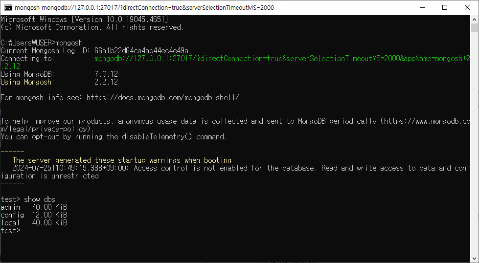

# [2024.07.25(목)] MongoDB


# 조별활동

- SQL vs NoSQL 을 조사하고 각각의 차이점, 장 단점에 대해서 정리해서 각 채널에 올려 주세요

## RDBMS vs NoSQL

### 관계형 DBMS (RDBMS)

**특징:**

- **스키마 기반 구조:** 데이터는 사전에 정의된 스키마에 따라 테이블 형태로 저장됩니다.
- **관계:** 테이블 간의 관계를 외래 키(foreign key) 등을 통해 정의합니다.
- **SQL:** 데이터를 관리하고 쿼리하기 위해 구조화된 질의 언어(SQL)를 사용합니다.
- **트랜잭션:** ACID (Atomicity, Consistency, Isolation, Durability) 속성을 지원하여 트랜잭션의 일관성을 보장합니다.

**장점:**

- **데이터 일관성:** 강력한 데이터 무결성과 일관성을 보장합니다.
- **표준화:** SQL은 표준화된 언어로, 다양한 DBMS에서 사용 가능합니다.
- **복잡한 쿼리:** 조인(join) 및 서브쿼리 등을 사용하여 복잡한 데이터 쿼리를 실행할 수 있습니다.
- **데이터 무결성:** 외래 키, 트리거, 제약 조건 등을 통해 데이터 무결성을 유지합니다.

**단점:**

- **확장성:** 수직적 확장(스케일 업)이 주로 사용되며, 수평적 확장(스케일 아웃)은 어려울 수 있습니다.
- **유연성 부족:** 스키마 변경이 어렵고, 데이터 구조가 고정되어 있어 유연성이 떨어집니다.
- **성능:** 대량의 데이터를 처리할 때 성능이 저하될 수 있습니다.

### NoSQL 데이터베이스

**특징:**

- **스키마리스 또는 동적 스키마:** 사전에 정의된 스키마가 없거나 매우 유연합니다.
- **다양한 데이터 모델:** 문서 지향, 키-값, 컬럼 지향, 그래프 등 다양한 데이터 모델을 지원합니다.
- **확장성:** 수평적 확장(스케일 아웃)에 최적화되어 있습니다.
- **CAP 이론:** 일관성(Consistency), 가용성(Availability), 분할 내성(Partition Tolerance) 중 두 가지 속성을 보장합니다.

**장점:**

- **유연성:** 데이터 구조가 유연하여 변경이 쉽습니다.
- **확장성:** 수평적 확장을 통해 대규모 데이터와 트래픽을 처리할 수 있습니다.
- **성능:** 특정 데이터 모델에 최적화되어 고성능을 발휘합니다.
- **다양성:** 다양한 데이터 모델로 특정 요구사항에 맞게 선택할 수 있습니다.

**단점:**

- **데이터 일관성:** 최종 일관성을 제공하는 경우가 많아, 즉시 일관성을 보장하지 않습니다.
- **표준화 부족:** 표준화된 쿼리 언어나 인터페이스가 부족합니다.
- **복잡성:** 데이터 모델링과 시스템 운영이 복잡할 수 있습니다.
- **제한된 기능:** 트랜잭션 지원과 같은 고급 기능이 제한적일 수 있습니다.

### 비교 요약

| 특성 | 관계형 DBMS (RDBMS) | NoSQL |
| --- | --- | --- |
| 데이터 모델 | 테이블 기반 | 문서, 키-값, 컬럼, 그래프 등 |
| 스키마 | 고정 스키마 | 스키마리스 또는 동적 스키마 |
| 쿼리 언어 | SQL | 다양한 쿼리 언어 및 API |
| 확장성 | 수직적 확장 | 수평적 확장 |
| 트랜잭션 | ACID | 대부분 BASE (Basically Available, Soft state, Eventually consistent) |
| 일관성 | 강력한 일관성 보장 | 최종 일관성 (eventual consistency) |
| 적용 사례 | 전통적 비즈니스 애플리케이션 | 빅데이터, 실시간 웹 애플리케이션, 비정형 데이터 처리 |

### 각각의 사용 사례

- **관계형 DBMS:**
    - 금융, 은행 시스템
    - 재고 관리 시스템
    - 전자 상거래 플랫폼
    - 고객 관계 관리(CRM) 시스템
- **NoSQL 데이터베이스:**
    - 소셜 네트워크 서비스
    - 실시간 데이터 분석
    - IoT 데이터 처리
    - 콘텐츠 관리 시스템(CMS)
    - 추천 시스템

## CAP 이론(CAP theorem)

CAP 이론(CAP theorem)은 분산 컴퓨팅에서 분산 데이터 저장 시스템이 세 가지 주요 속성을 모두 만족할 수 없다는 이론입니다. CAP 이론은 2000년, 에릭 브루어(Eric Brewer)에 의해 처음 제안되었으며, 이 세 가지 속성은 다음과 같습니다:

1. **일관성(Consistency)**
2. **가용성(Availability)**
3. **분할 내성(Partition Tolerance)**

CAP 이론에 따르면, 분산 시스템은 이 세 가지 속성 중 두 가지만 보장할 수 있습니다. 각각의 속성을 자세히 설명하면 다음과 같습니다:

### 일관성 (Consistency)

- **정의:** 모든 노드에서 같은 시간에 동일한 데이터를 조회할 수 있도록 보장하는 속성입니다. 즉, 어떤 노드에서 데이터를 쓰면, 그 변경 사항이 모든 노드에 즉시 반영되어야 합니다.
- **예시:** 은행 시스템에서 계좌 잔액을 조회할 때 모든 사용자에게 동일한 잔액이 보여야 하는 상황입니다.

### 가용성 (Availability)

- **정의:** 모든 요청에 대해 시스템이 항상 응답을 제공하는 속성입니다. 즉, 일부 노드가 실패하더라도 시스템이 계속해서 동작하고 응답을 제공해야 합니다.
- **예시:** 온라인 쇼핑몰에서 서버 중 하나가 다운되더라도 사용자가 계속해서 상품을 조회하고 구매할 수 있는 상황입니다.

### 분할 내성 (Partition Tolerance)

- **정의:** 네트워크 분할(Network Partition) 상황에서도 시스템이 동작을 계속할 수 있는 속성입니다. 네트워크 분할은 네트워크 일부가 다른 부분과 연결이 끊어지는 상황을 의미합니다.
- **예시:** 데이터 센터 A와 B 사이의 네트워크 연결이 끊어져도, 각각의 데이터 센터가 독립적으로 계속 동작하는 상황입니다.

### CAP 이론의 핵심

CAP 이론은 분산 시스템이 세 가지 속성을 동시에 만족할 수 없음을 의미합니다. 따라서 시스템 설계 시 두 가지 속성을 선택하고, 나머지 하나의 속성은 포기해야 합니다. 이를 바탕으로 분산 시스템은 다음 세 가지 조합 중 하나를 선택할 수 있습니다:

1. **CP (Consistency and Partition Tolerance)**
    - **일관성**과 **분할 내성**을 보장하지만, 가용성은 일부 포기합니다.
    - 예시: 분산 데이터베이스에서 네트워크 분할이 발생하면, 일부 요청에 대해 응답이 지연될 수 있습니다.
2. **AP (Availability and Partition Tolerance)**
    - **가용성**과 **분할 내성**을 보장하지만, 일관성은 일부 포기합니다.
    - 예시: 분산 키-값 저장소에서 네트워크 분할이 발생하면, 데이터의 최종 일관성을 보장하지 않을 수 있습니다.
3. **CA (Consistency and Availability)**
    - **일관성**과 **가용성**을 보장하지만, 분할 내성은 일부 포기합니다.
    - 예시: 네트워크 분할 상황에서 시스템이 동작을 멈추고, 네트워크가 복구될 때까지 일관성을 유지합니다.

### CAP 이론의 예시

- **CP 시스템 예시:** HBase, MongoDB (기본 설정), Redis (복제 모드)
- **AP 시스템 예시:** CouchDB, DynamoDB, Cassandra
- **CA 시스템 예시:** 대부분의 단일 노드 관계형 데이터베이스 시스템

CAP 이론은 분산 시스템 설계 시 중요한 가이드라인을 제공합니다. 시스템이 어떤 속성을 중시할 것인지 결정하고, 그에 따라 설계를 최적화하는 것이 중요합니다. 특히, 다양한 분산 시스템이 등장하면서 CAP 이론을 기반으로 한 다양한 접근 방식이 실현되고 있습니다.

# RDBMS vs NoSQL

1. Scalability (확장성)
    - Scale Up : 인프라 장비의 갯수를 늘리지 않고 내부 부품을 더 좋은 부품으로 업그레이드, 또는 서버 자체를 고사양으로 변경
        
        → RDBMS에 더 유리
        
        → JOIN (분리된 데이터 집합(table 들)을 다시 유의미한 하나로 만드는 작업)
        
        만약 2 table을 join하는데 A table은 1 번 서버, B table은 2 번 서버에 있다면 Network 통신이 필요
        
    - Scale out : 인프라 장비의 내부 부품보다는 장비의 갯수를 늘리는 작업
        
        → NoSQL에 더 유리
        
        → RDBMS의 JOIN은 없다.
        
        → 최대한 자기완결적인 데이터로 저장, 관리
        
        ⇒ 위 두 가지를 혼합하여 일반적으로 사용
        
2. 데이터 철학
    - RDBMS
        
        → 커다란 덩어리의 데이터를 분할하고 정제해서 데이터 관리의 목표를 획득한다.
        
        → 사용 년한 : 오랜기간, 변경 주기 : 빠르다, 처리 속도 : 빠르면 좋지만, 빠른 것보다는 정확한 것이 우선
        
        → 은행, 공공기관, … 대부분의 데이터 관리가 필요한 곳.
        
    - NoSQL
        
        → 커다란 덩어리의 데이터를 최대한 자기 완결적인 데이터로 구성해서 데이터 관리의 목표를 획득한다.
        
        → 사용 년한 : 짧다, 변경 주기 : 적다, 처리 속도 : 아주 중요하다 (한 곳에 모아 놓았다. 정확한 것은 두 번째)
        
        → 마케팅, 과학 연수, <<functional programming>> 단기적 목표를 위해 데이터 취합, 소화, 버린다.
        
        * 통신사의 고객 행동 분석 → 차기 요금제 구성에 사용
        
        * 제임스웹이 보내는 빛 데이터를 분석 → 우주의 비밀을 알아낸다.
        
        * 페이스북(메타) PIXEL (개인정보/행동 파악 페이스북으로 전송)을 쇼핑몰 사이트에 설치
        
        → Big Data (대용량 데이터베이스 X)
        

# MongoDB 다운로드

- MongoDB Community Server
    
    https://www.mongodb.com/try/download/community-kubernetes-operator
    
- MongoDB Shell
    
    https://www.mongodb.com/try/download/compass
    
- window+R → cmd → mongosh 로 접속
    
    
    

# MongoDB 스키마, 테이블 CRUD

https://www.w3schools.com/mongodb/index.php

- 용어
    
    테이블 : 컬렉션
    
    레코드(칼럼) : 
    

### 스키마 목록 확인 방법

```java
test> show dbs
admin   40.00 KiB
config  12.00 KiB
local   40.00 KiB
```

## MongoDB Create DB

### madangdb 스키마 생성

```java
test> show dbs
admin   40.00 KiB
config  12.00 KiB
local   40.00 KiB
test> use madangdb
switched to db madangdb
```

## MongoDB Collection

### book 테이블 생성

```java
madangdb> db.createCollection("book")
{ ok: 1 }
```

## MongoDB Insert

### book 테이블 칼럼 추가

```java
madangdb> db.book.insertOne({ bookid : 1, bookname : '축구의 역사', publisher : '굿스포츠', price : 7000 })
{
  acknowledged: true,
  insertedId: ObjectId('66a1b6f764ca4ab44ec4e49b')
}
```

### book 테이블 삭제

```java
madangdb> db.book.drop()
true
```

### madangdb 스키마 삭제

```java
madangdb> db.dropDatabase()
{ ok: 1, dropped: 'madangdb' }
madangdb> show dbs
admin   40.00 KiB
config  92.00 KiB
local   40.00 KiB
madangdb>
```

### madangdb 스키마, book 테이블 생성 없이 insertMany() 실행

- madangdb>에서 실행한다.

```java
madangdb> db.book.insertMany([
...   { bookid: 1, bookname: '축구의 역사', publisher: '굿스포츠', price: 7000 },
...   { bookid: 2, bookname: '축구 아는 여자', publisher: '나무수', price: 13000 },
...   { bookid: 3, bookname: '축구의 이해', publisher: '대한미디어', price: 22000 },
...   { bookid: 4, bookname: '골프 바이블', publisher: '대한미디어', price: 35000 },
...   { bookid: 5, bookname: '피겨 교본', publisher: '굿스포츠', price: 8000 },
...   { bookid: 6, bookname: '배구 단계별기술', publisher: '굿스포츠', price: 6000 },
...   { bookid: 7, bookname: '야구의 추억', publisher: '이상미디어', price: 20000 },
...   { bookid: 8, bookname: '야구를 부탁해', publisher: '이상미디어', price: 13000, writer: '홍길동' },
...   { bookid: 9, bookname: '올림픽 이야기', publisher: '삼성당', price: 7500, saleprice: 6000 },
...   { bookid: 10, bookname: 'Olympic Champions', publisher: 'Pearson', price: 13000, saleprice: 10000 }
... ]);
{
  acknowledged: true,
  insertedIds: {
    '0': ObjectId('66a1b8cb64ca4ab44ec4e49c'),
    '1': ObjectId('66a1b8cb64ca4ab44ec4e49d'),
    '2': ObjectId('66a1b8cb64ca4ab44ec4e49e'),
    '3': ObjectId('66a1b8cb64ca4ab44ec4e49f'),
    '4': ObjectId('66a1b8cb64ca4ab44ec4e4a0'),
    '5': ObjectId('66a1b8cb64ca4ab44ec4e4a1'),
    '6': ObjectId('66a1b8cb64ca4ab44ec4e4a2'),
    '7': ObjectId('66a1b8cb64ca4ab44ec4e4a3'),
    '8': ObjectId('66a1b8cb64ca4ab44ec4e4a4'),
    '9': ObjectId('66a1b8cb64ca4ab44ec4e4a5')
  }
}
madangdb>
```

## MongoDB Find

### book 테이블 조회 (select all)

```java
madangdb> db.book.find()
[
  {
    _id: ObjectId('66a1b8cb64ca4ab44ec4e49c'),
    bookid: 1,
    bookname: '축구의 역사',
    publisher: '굿스포츠',
    price: 7000
  },
  {
    _id: ObjectId('66a1b8cb64ca4ab44ec4e49d'),
    bookid: 2,
    bookname: '축구 아는 여자',
    publisher: '나무수',
    price: 13000
  },
  {
    _id: ObjectId('66a1b8cb64ca4ab44ec4e49e'),
    bookid: 3,
    bookname: '축구의 이해',
    publisher: '대한미디어',
    price: 22000
  },
  {
    _id: ObjectId('66a1b8cb64ca4ab44ec4e49f'),
    bookid: 4,
    bookname: '골프 바이블',
    publisher: '대한미디어',
    price: 35000
  },
  {
    _id: ObjectId('66a1b8cb64ca4ab44ec4e4a0'),
    bookid: 5,
    bookname: '피겨 교본',
    publisher: '굿스포츠',
    price: 8000
  },
  {
    _id: ObjectId('66a1b8cb64ca4ab44ec4e4a1'),
    bookid: 6,
    bookname: '배구 단계별기술',
    publisher: '굿스포츠',
    price: 6000
  },
  {
    _id: ObjectId('66a1b8cb64ca4ab44ec4e4a2'),
madangdb>
    bookname: '야구의 추억',
    publisher: '이상미디어',
    price: 20000
  },
  {
    _id: ObjectId('66a1b8cb64ca4ab44ec4e4a3'),
    bookid: 8,
    bookname: '야구를 부탁해',
    publisher: '이상미디어',
    price: 13000,
    writer: '홍길동'
  },
  {
    _id: ObjectId('66a1b8cb64ca4ab44ec4e4a4'),
    bookid: 9,
    bookname: '올림픽 이야기',
    publisher: '삼성당',
    price: 7500,
    saleprice: 6000
  },
  {
    _id: ObjectId('66a1b8cb64ca4ab44ec4e4a5'),
    bookid: 10,
    bookname: 'Olympic Champions',
    publisher: 'Pearson',
    price: 13000,
    saleprice: 10000
  }
]
madangdb>
```

### book 테이블 조회 (where)

```java
madangdb> db.book.findOne()
{
  _id: ObjectId('66a1b8cb64ca4ab44ec4e49c'),
  bookid: 1,
  bookname: '축구의 역사',
  publisher: '굿스포츠',
  price: 7000
}
madangdb> db.book.findOne({ bookid : 10 })
{
  _id: ObjectId('66a1b8cb64ca4ab44ec4e4a5'),
  bookid: 10,
  bookname: 'Olympic Champions',
  publisher: 'Pearson',
  price: 13000,
  saleprice: 10000
}
madangdb> db.book.find({ publisher : '굿스포츠' })
[
  {
    _id: ObjectId('66a1b8cb64ca4ab44ec4e49c'),
    bookid: 1,
    bookname: '축구의 역사',
    publisher: '굿스포츠',
    price: 7000
  },
  {
    _id: ObjectId('66a1b8cb64ca4ab44ec4e4a0'),
    bookid: 5,
    bookname: '피겨 교본',
    publisher: '굿스포츠',
    price: 8000
  },
  {
    _id: ObjectId('66a1b8cb64ca4ab44ec4e4a1'),
    bookid: 6,
    bookname: '배구 단계별기술',
    publisher: '굿스포츠',
    price: 6000
  }
]
madangdb> db.book.find({ bookid : 3 })
[
  {
    _id: ObjectId('66a1b8cb64ca4ab44ec4e49e'),
    bookid: 3,
    bookname: '축구의 이해',
    publisher: '대한미디어',
    price: 22000
  }
]
madangdb>
```

### book 테이블 조회 (원하는 칼럼만 조회하기)

- db.book.find({}, {bookid : 1, bookname : 1})
    
    1 : 확인하는 칼럼 / 0 : 확인하지 않는 칼럼
    
    조건을 줄 때 0과 1을 섞어서 줄 사용할 수 없다. (단, _id는 뒤의 조건과 달라고 사용 가능하다.)
    
    예시 - db.book.find({}, {_id : 0, bookid : 1, bookname : 1})  ⇒ 사용 가능
    

```java
madangdb> db.book.find({}, {bookid : 1, bookname : 1})
[
  {
    _id: ObjectId('66a1b8cb64ca4ab44ec4e49c'),
    bookid: 1,
    bookname: '축구의 역사'
  },
  {
    _id: ObjectId('66a1b8cb64ca4ab44ec4e49d'),
    bookid: 2,
    bookname: '축구 아는 여자'
  },
  {
    _id: ObjectId('66a1b8cb64ca4ab44ec4e49e'),
    bookid: 3,
    bookname: '축구의 이해'
  },
  {
    _id: ObjectId('66a1b8cb64ca4ab44ec4e49f'),
    bookid: 4,
    bookname: '골프 바이블'
  },
  {
    _id: ObjectId('66a1b8cb64ca4ab44ec4e4a0'),
    bookid: 5,
    bookname: '피겨 교본'
  },
  {
    _id: ObjectId('66a1b8cb64ca4ab44ec4e4a1'),
    bookid: 6,
    bookname: '배구 단계별기술'
  },
  {
    _id: ObjectId('66a1b8cb64ca4ab44ec4e4a2'),
    bookid: 7,
    bookname: '야구의 추억'
  },
  {
    _id: ObjectId('66a1b8cb64ca4ab44ec4e4a3'),
    bookid: 8,
    bookname: '야구를 부탁해'
  },
  {
    _id: ObjectId('66a1b8cb64ca4ab44ec4e4a4'),
    bookid: 9,
    bookname: '올림픽 이야기'
  },
  {
    _id: ObjectId('66a1b8cb64ca4ab44ec4e4a5'),
    bookid: 10,
    bookname: 'Olympic Champions'
  }
]
madangdb>
```

## MongoDB Update

### updateOne

```java
madangdb> db.book.updateOne( {bookname : '올림픽 이야기'}, { $set:{ price : 7000} } )
{
  acknowledged: true,
  insertedId: null,
  matchedCount: 1,
  modifiedCount: 1,
  upsertedCount: 0
}
madangdb> db.book.find({ bookname : '올림픽 이야기' }, {_id : 0, bookid:1, bookname: 1} )
[ { bookid: 9, bookname: '올림픽 이야기' } ]
madangdb> db.book.find({ bookname : '올림픽 이야기' }, {_id : 0, bookid:1, bookname: 1, price:1} )
[ { bookid: 9, bookname: '올림픽 이야기', price: 7000 } ]
madangdb> db.book.updateOne( {bookid:9}, {$set:{price:6000, saleprice:5000 } })
{
  acknowledged: true,
  insertedId: null,
  matchedCount: 1,
  modifiedCount: 1,
  upsertedCount: 0
}
madangdb> db.book.find({bookid:9})
[
  {
    _id: ObjectId('66a1b8cb64ca4ab44ec4e4a4'),
    bookid: 9,
    bookname: '올림픽 이야기',
    publisher: '삼성당',
    price: 6000,
    saleprice: 5000
  }
]
madangdb>
```

### updateOne의 upsert 조건

```java
madangdb> db.book.find()
[
  {
    _id: ObjectId('66a1b8cb64ca4ab44ec4e49c'),
    bookid: 1,
    bookname: '축구의 역사',
    publisher: '굿스포츠',
    price: 7000
  },
  {
    _id: ObjectId('66a1b8cb64ca4ab44ec4e49d'),
    bookid: 2,
    bookname: '축구 아는 여자',
    publisher: '나무수',
    price: 13000
  },
  {
    _id: ObjectId('66a1b8cb64ca4ab44ec4e49e'),
    bookid: 3,
    bookname: '축구의 이해',
    publisher: '대한미디어',
    price: 22000
  },
  {
    _id: ObjectId('66a1b8cb64ca4ab44ec4e49f'),
    bookid: 4,
    bookname: '골프 바이블',
    publisher: '대한미디어',
    price: 35000
  },
  {
    _id: ObjectId('66a1b8cb64ca4ab44ec4e4a0'),
    bookid: 5,
    bookname: '피겨 교본',
    publisher: '굿스포츠',
    price: 8000
  },
  {
    _id: ObjectId('66a1b8cb64ca4ab44ec4e4a1'),
    bookid: 6,
    bookname: '배구 단계별기술',
    publisher: '굿스포츠',
    price: 6000
  },
  {
    _id: ObjectId('66a1b8cb64ca4ab44ec4e4a2'),
    bookid: 7,
    bookname: '야구의 추억',
    publisher: '이상미디어',
    price: 20000
  },
  {
    _id: ObjectId('66a1b8cb64ca4ab44ec4e4a3'),
    bookid: 8,
    bookname: '야구를 부탁해',
    publisher: '이상미디어',
    price: 13000,
    writer: '홍길동'
  },
  {
    _id: ObjectId('66a1b8cb64ca4ab44ec4e4a4'),
    bookid: 9,
    bookname: '올림픽 이야기',
    publisher: '삼성당',
    price: 6000,
    saleprice: 5000
  },
  {
    _id: ObjectId('66a1b8cb64ca4ab44ec4e4a5'),
    bookid: 10,
    bookname: 'Olympic Champions',
    publisher: 'Pearson',
    price: 13000,
    saleprice: 10000
  }
]
madangdb> db.book.updateOne( {bookid:11}, { $set:{price:6000, saleprice:5000} }, {upsert: true} )
{
  acknowledged: true,
  insertedId: ObjectId('66a1d2aa24a585804a227627'),
  matchedCount: 0,
  modifiedCount: 0,
  upsertedCount: 1
}
madangdb> db.book.find()
[
  {
    _id: ObjectId('66a1b8cb64ca4ab44ec4e49c'),
    bookid: 1,
    bookname: '축구의 역사',
    publisher: '굿스포츠',
    price: 7000
  },
  {
    _id: ObjectId('66a1b8cb64ca4ab44ec4e49d'),
    bookid: 2,
    bookname: '축구 아는 여자',
    publisher: '나무수',
    price: 13000
  },
  {
    _id: ObjectId('66a1b8cb64ca4ab44ec4e49e'),
    bookid: 3,
    bookname: '축구의 이해',
    publisher: '대한미디어',
    price: 22000
  },
  {
    _id: ObjectId('66a1b8cb64ca4ab44ec4e49f'),
    bookid: 4,
    bookname: '골프 바이블',
    publisher: '대한미디어',
    price: 35000
  },
  {
    _id: ObjectId('66a1b8cb64ca4ab44ec4e4a0'),
    bookid: 5,
    bookname: '피겨 교본',
    publisher: '굿스포츠',
    price: 8000
  },
  {
    _id: ObjectId('66a1b8cb64ca4ab44ec4e4a1'),
    bookid: 6,
    bookname: '배구 단계별기술',
    publisher: '굿스포츠',
    price: 6000
  },
  {
    _id: ObjectId('66a1b8cb64ca4ab44ec4e4a2'),
    bookid: 7,
    bookname: '야구의 추억',
    publisher: '이상미디어',
    price: 20000
  },
  {
    _id: ObjectId('66a1b8cb64ca4ab44ec4e4a3'),
    bookid: 8,
    bookname: '야구를 부탁해',
    publisher: '이상미디어',
    price: 13000,
    writer: '홍길동'
  },
  {
    _id: ObjectId('66a1b8cb64ca4ab44ec4e4a4'),
    bookid: 9,
    bookname: '올림픽 이야기',
    publisher: '삼성당',
    price: 6000,
    saleprice: 5000
  },
  {
    _id: ObjectId('66a1b8cb64ca4ab44ec4e4a5'),
    bookid: 10,
    bookname: 'Olympic Champions',
    publisher: 'Pearson',
    price: 13000,
    saleprice: 10000
  },
  {
    _id: ObjectId('66a1d2aa24a585804a227627'),
    bookid: 11,
    price: 6000,
    saleprice: 5000
  }
]
madangdb>
```

### updateMany() ($inc - 양수 증가)

```java
madangdb> db.book.find()
[
  {
    _id: ObjectId('66a1b8cb64ca4ab44ec4e49c'),
    bookid: 1,
    bookname: '축구의 역사',
    publisher: '굿스포츠',
    price: 7000
  },
  {
    _id: ObjectId('66a1b8cb64ca4ab44ec4e49d'),
    bookid: 2,
    bookname: '축구 아는 여자',
    publisher: '나무수',
    price: 13000
  },
  {
    _id: ObjectId('66a1b8cb64ca4ab44ec4e49e'),
    bookid: 3,
    bookname: '축구의 이해',
    publisher: '대한미디어',
    price: 22000
  },
  {
    _id: ObjectId('66a1b8cb64ca4ab44ec4e49f'),
    bookid: 4,
    bookname: '골프 바이블',
    publisher: '대한미디어',
    price: 35000
  },
  {
    _id: ObjectId('66a1b8cb64ca4ab44ec4e4a0'),
    bookid: 5,
    bookname: '피겨 교본',
    publisher: '굿스포츠',
    price: 8000
  },
  {
    _id: ObjectId('66a1b8cb64ca4ab44ec4e4a1'),
    bookid: 6,
    bookname: '배구 단계별기술',
    publisher: '굿스포츠',
    price: 6000
  },
  {
    _id: ObjectId('66a1b8cb64ca4ab44ec4e4a2'),
    bookid: 7,
    bookname: '야구의 추억',
    publisher: '이상미디어',
    price: 20000
  },
  {
    _id: ObjectId('66a1b8cb64ca4ab44ec4e4a3'),
    bookid: 8,
    bookname: '야구를 부탁해',
    publisher: '이상미디어',
    price: 13000,
    writer: '홍길동'
  },
  {
    _id: ObjectId('66a1b8cb64ca4ab44ec4e4a4'),
    bookid: 9,
    bookname: '올림픽 이야기',
    publisher: '삼성당',
    price: 6000,
    saleprice: 5000
  },
  {
    _id: ObjectId('66a1b8cb64ca4ab44ec4e4a5'),
    bookid: 10,
    bookname: 'Olympic Champions',
    publisher: 'Pearson',
    price: 13000,
    saleprice: 10000
  },
  {
    _id: ObjectId('66a1d2aa24a585804a227627'),
    bookid: 11,
    price: 6000,
    saleprice: 5000
  }
]
madangdb> db.book.updateMany( { }, { $inc : {price : 10 } } )
{
  acknowledged: true,
  insertedId: null,
  matchedCount: 11,
  modifiedCount: 11,
  upsertedCount: 0
}
madangdb> db.book.find()
[
  {
    _id: ObjectId('66a1b8cb64ca4ab44ec4e49c'),
    bookid: 1,
    bookname: '축구의 역사',
    publisher: '굿스포츠',
    price: 7010
  },
  {
    _id: ObjectId('66a1b8cb64ca4ab44ec4e49d'),
    bookid: 2,
    bookname: '축구 아는 여자',
    publisher: '나무수',
    price: 13010
  },
  {
    _id: ObjectId('66a1b8cb64ca4ab44ec4e49e'),
    bookid: 3,
    bookname: '축구의 이해',
    publisher: '대한미디어',
    price: 22010
  },
  {
    _id: ObjectId('66a1b8cb64ca4ab44ec4e49f'),
    bookid: 4,
    bookname: '골프 바이블',
    publisher: '대한미디어',
    price: 35010
  },
  {
    _id: ObjectId('66a1b8cb64ca4ab44ec4e4a0'),
    bookid: 5,
    bookname: '피겨 교본',
    publisher: '굿스포츠',
    price: 8010
  },
  {
    _id: ObjectId('66a1b8cb64ca4ab44ec4e4a1'),
    bookid: 6,
    bookname: '배구 단계별기술',
    publisher: '굿스포츠',
    price: 6010
  },
  {
    _id: ObjectId('66a1b8cb64ca4ab44ec4e4a2'),
    bookid: 7,
    bookname: '야구의 추억',
    publisher: '이상미디어',
    price: 20010
  },
  {
    _id: ObjectId('66a1b8cb64ca4ab44ec4e4a3'),
    bookid: 8,
    bookname: '야구를 부탁해',
    publisher: '이상미디어',
    price: 13010,
    writer: '홍길동'
  },
  {
    _id: ObjectId('66a1b8cb64ca4ab44ec4e4a4'),
    bookid: 9,
    bookname: '올림픽 이야기',
    publisher: '삼성당',
    price: 6010,
    saleprice: 5000
  },
  {
    _id: ObjectId('66a1b8cb64ca4ab44ec4e4a5'),
    bookid: 10,
    bookname: 'Olympic Champions',
    publisher: 'Pearson',
    price: 13010,
    saleprice: 10000
  },
  {
    _id: ObjectId('66a1d2aa24a585804a227627'),
    bookid: 11,
    price: 6010,
    saleprice: 5000
  }
]
madangdb>
```

### updateMany() ($inc - 음수 증가)

```java
madangdb> db.book.updateMany( { }, { $inc : {price : -10 } } )
{
  acknowledged: true,
  insertedId: null,
  matchedCount: 11,
  modifiedCount: 11,
  upsertedCount: 0
}
madangdb> db.book.find()
[
  {
    _id: ObjectId('66a1b8cb64ca4ab44ec4e49c'),
    bookid: 1,
    bookname: '축구의 역사',
    publisher: '굿스포츠',
    price: 7000
  },
  {
    _id: ObjectId('66a1b8cb64ca4ab44ec4e49d'),
    bookid: 2,
    bookname: '축구 아는 여자',
    publisher: '나무수',
    price: 13000
  },
  {
    _id: ObjectId('66a1b8cb64ca4ab44ec4e49e'),
    bookid: 3,
    bookname: '축구의 이해',
    publisher: '대한미디어',
    price: 22000
  },
  {
    _id: ObjectId('66a1b8cb64ca4ab44ec4e49f'),
    bookid: 4,
    bookname: '골프 바이블',
    publisher: '대한미디어',
    price: 35000
  },
  {
    _id: ObjectId('66a1b8cb64ca4ab44ec4e4a0'),
    bookid: 5,
    bookname: '피겨 교본',
    publisher: '굿스포츠',
    price: 8000
  },
  {
    _id: ObjectId('66a1b8cb64ca4ab44ec4e4a1'),
    bookid: 6,
    bookname: '배구 단계별기술',
    publisher: '굿스포츠',
    price: 6000
  },
  {
    _id: ObjectId('66a1b8cb64ca4ab44ec4e4a2'),
    bookid: 7,
    bookname: '야구의 추억',
    publisher: '이상미디어',
    price: 20000
  },
  {
    _id: ObjectId('66a1b8cb64ca4ab44ec4e4a3'),
    bookid: 8,
    bookname: '야구를 부탁해',
    publisher: '이상미디어',
    price: 13000,
    writer: '홍길동'
  },
  {
    _id: ObjectId('66a1b8cb64ca4ab44ec4e4a4'),
    bookid: 9,
    bookname: '올림픽 이야기',
    publisher: '삼성당',
    price: 6000,
    saleprice: 5000
  },
  {
    _id: ObjectId('66a1b8cb64ca4ab44ec4e4a5'),
    bookid: 10,
    bookname: 'Olympic Champions',
    publisher: 'Pearson',
    price: 13000,
    saleprice: 10000
  },
  {
    _id: ObjectId('66a1d2aa24a585804a227627'),
    bookid: 11,
    price: 6000,
    saleprice: 5000
  }
]
madangdb>

```

### updateOne() ($inc)

```java
madangdb> db.book.updateOne( { }, { $inc : {price : 10 } } )
{
  acknowledged: true,
  insertedId: null,
  matchedCount: 1,
  modifiedCount: 1,
  upsertedCount: 0
}
madangdb> db.book.find()
[
  {
    _id: ObjectId('66a1b8cb64ca4ab44ec4e49c'),
    bookid: 1,
    bookname: '축구의 역사',
    publisher: '굿스포츠',
    price: 7010
  },
  {
    _id: ObjectId('66a1b8cb64ca4ab44ec4e49d'),
    bookid: 2,
    bookname: '축구 아는 여자',
    publisher: '나무수',
    price: 13000
  },
  {
    _id: ObjectId('66a1b8cb64ca4ab44ec4e49e'),
    bookid: 3,
    bookname: '축구의 이해',
    publisher: '대한미디어',
    price: 22000
  },
  {
    _id: ObjectId('66a1b8cb64ca4ab44ec4e49f'),
    bookid: 4,
    bookname: '골프 바이블',
    publisher: '대한미디어',
    price: 35000
  },
  {
    _id: ObjectId('66a1b8cb64ca4ab44ec4e4a0'),
    bookid: 5,
    bookname: '피겨 교본',
    publisher: '굿스포츠',
    price: 8000
  },
  {
    _id: ObjectId('66a1b8cb64ca4ab44ec4e4a1'),
    bookid: 6,
    bookname: '배구 단계별기술',
    publisher: '굿스포츠',
    price: 6000
  },
  {
    _id: ObjectId('66a1b8cb64ca4ab44ec4e4a2'),
    bookid: 7,
    bookname: '야구의 추억',
    publisher: '이상미디어',
    price: 20000
  },
  {
    _id: ObjectId('66a1b8cb64ca4ab44ec4e4a3'),
    bookid: 8,
    bookname: '야구를 부탁해',
    publisher: '이상미디어',
    price: 13000,
    writer: '홍길동'
  },
  {
    _id: ObjectId('66a1b8cb64ca4ab44ec4e4a4'),
    bookid: 9,
    bookname: '올림픽 이야기',
    publisher: '삼성당',
    price: 6000,
    saleprice: 5000
  },
  {
    _id: ObjectId('66a1b8cb64ca4ab44ec4e4a5'),
    bookid: 10,
    bookname: 'Olympic Champions',
    publisher: 'Pearson',
    price: 13000,
    saleprice: 10000
  },
  {
    _id: ObjectId('66a1d2aa24a585804a227627'),
    bookid: 11,
    price: 6000,
    saleprice: 5000
  }
]
madangdb> db.book.updateOne( {bookid:11}, { $inc : {price : 10 } } )
{
  acknowledged: true,
  insertedId: null,
  matchedCount: 1,
  modifiedCount: 1,
  upsertedCount: 0
}
madangdb> db.book.find({bookid:11})
[
  {
    _id: ObjectId('66a1d2aa24a585804a227627'),
    bookid: 11,
    price: 6010,
    saleprice: 5000
  }
]
madangdb>
```

## MongoDB Delete

### deleteOne()

```java
madangdb> db.book.deleteOne({bookid : 11})
{ acknowledged: true, deletedCount: 1 }
madangdb> db.book.find()
[
  {
    _id: ObjectId('66a1b8cb64ca4ab44ec4e49c'),
    bookid: 1,
    bookname: '축구의 역사',
    publisher: '굿스포츠',
    price: 7010
  },
  {
    _id: ObjectId('66a1b8cb64ca4ab44ec4e49d'),
    bookid: 2,
    bookname: '축구 아는 여자',
    publisher: '나무수',
    price: 13000
  },
  {
    _id: ObjectId('66a1b8cb64ca4ab44ec4e49e'),
    bookid: 3,
    bookname: '축구의 이해',
    publisher: '대한미디어',
    price: 22000
  },
  {
    _id: ObjectId('66a1b8cb64ca4ab44ec4e49f'),
    bookid: 4,
    bookname: '골프 바이블',
    publisher: '대한미디어',
    price: 35000
  },
  {
    _id: ObjectId('66a1b8cb64ca4ab44ec4e4a0'),
    bookid: 5,
    bookname: '피겨 교본',
    publisher: '굿스포츠',
    price: 8000
  },
  {
    _id: ObjectId('66a1b8cb64ca4ab44ec4e4a1'),
    bookid: 6,
    bookname: '배구 단계별기술',
    publisher: '굿스포츠',
    price: 6000
  },
  {
    _id: ObjectId('66a1b8cb64ca4ab44ec4e4a2'),
    bookid: 7,
    bookname: '야구의 추억',
    publisher: '이상미디어',
    price: 20000
  },
  {
    _id: ObjectId('66a1b8cb64ca4ab44ec4e4a3'),
    bookid: 8,
    bookname: '야구를 부탁해',
    publisher: '이상미디어',
    price: 13000,
    writer: '홍길동'
  },
  {
    _id: ObjectId('66a1b8cb64ca4ab44ec4e4a4'),
    bookid: 9,
    bookname: '올림픽 이야기',
    publisher: '삼성당',
    price: 6000,
    saleprice: 5000
  },
  {
    _id: ObjectId('66a1b8cb64ca4ab44ec4e4a5'),
    bookid: 10,
    bookname: 'Olympic Champions',
    publisher: 'Pearson',
    price: 13000,
    saleprice: 10000
  }
]
madangdb>
```

### deleteMany()

```java
madangdb> db.book.deleteMany({})
{ acknowledged: true, deletedCount: 10 }
madangdb> db.book.find()

madangdb>
```

## MongoDB Query Operators

### $gt

```java
madangdb> db.book.find( {bookid: {$gt : 5} } )
[
  {
    _id: ObjectId('66a1d69a64ca4ab44ec4e4ab'),
    bookid: 6,
    bookname: '배구 단계별기술',
    publisher: '굿스포츠',
    price: 6000
  },
  {
    _id: ObjectId('66a1d69a64ca4ab44ec4e4ac'),
    bookid: 7,
    bookname: '야구의 추억',
    publisher: '이상미디어',
    price: 20000
  },
  {
    _id: ObjectId('66a1d69a64ca4ab44ec4e4ad'),
    bookid: 8,
    bookname: '야구를 부탁해',
    publisher: '이상미디어',
    price: 13000,
    writer: '홍길동'
  },
  {
    _id: ObjectId('66a1d69a64ca4ab44ec4e4ae'),
    bookid: 9,
    bookname: '올림픽 이야기',
    publisher: '삼성당',
    price: 7500,
    saleprice: 6000
  },
  {
    _id: ObjectId('66a1d69a64ca4ab44ec4e4af'),
    bookid: 10,
    bookname: 'Olympic Champions',
    publisher: 'Pearson',
    price: 13000,
    saleprice: 10000
  }
]
madangdb>
```

### $eq

```java
madangdb> db.book.find( {bookid: {$eq : 5} } )
[
  {
    _id: ObjectId('66a1d69a64ca4ab44ec4e4aa'),
    bookid: 5,
    bookname: '피겨 교본',
    publisher: '굿스포츠',
    price: 8000
  }
]
madangdb>
```

### $gte

```java
madangdb> db.book.find( {price : {$gte : 20000} } )
[
  {
    _id: ObjectId('66a1d69a64ca4ab44ec4e4a8'),
    bookid: 3,
    bookname: '축구의 이해',
    publisher: '대한미디어',
    price: 22000
  },
  {
    _id: ObjectId('66a1d69a64ca4ab44ec4e4a9'),
    bookid: 4,
    bookname: '골프 바이블',
    publisher: '대한미디어',
    price: 35000
  },
  {
    _id: ObjectId('66a1d69a64ca4ab44ec4e4ac'),
    bookid: 7,
    bookname: '야구의 추억',
    publisher: '이상미디어',
    price: 20000
  }
]
madangdb>
```

### {$gte : 15000, $lte : 20000}

```java
madangdb> db.book.find( {price : {$gte : 15000, $lte : 20000} } )
[
  {
    _id: ObjectId('66a1d69a64ca4ab44ec4e4ac'),
    bookid: 7,
    bookname: '야구의 추억',
    publisher: '이상미디어',
    price: 20000
  }
]
madangdb>
```

### 여러 조건으로 검색하기

```java
madangdb> db.book.find(
... {
...    $and : [
...           { bookid : { $lt : 6 } },
...           { price : { $gte : 20000 } }
...    ]
... }
... )

[
  {
    _id: ObjectId('66a1d69a64ca4ab44ec4e4a8'),
    bookid: 3,
    bookname: '축구의 이해',
    publisher: '대한미디어',
    price: 22000
  },
  {
    _id: ObjectId('66a1d69a64ca4ab44ec4e4a9'),
    bookid: 4,
    bookname: '골프 바이블',
    publisher: '대한미디어',
    price: 35000
  }
]
madangdb>
```

## MongoDB Update Operators

### $unset

```java
madangdb> db.book.updateMany(
... {
...   bookid : { $gt : 5 }
... },
... {
...  $unset :  { price : '' }
... }
... )
{
  acknowledged: true,
  insertedId: null,
  matchedCount: 5,
  modifiedCount: 5,
  upsertedCount: 0
}
madangdb> db.book.find()
[
  {
    _id: ObjectId('66a1d69a64ca4ab44ec4e4a6'),
    bookid: 1,
    bookname: '축구의 역사',
    publisher: '굿스포츠',
    price: 7000
  },
  {
    _id: ObjectId('66a1d69a64ca4ab44ec4e4a7'),
    bookid: 2,
    bookname: '축구 아는 여자',
    publisher: '나무수',
    price: 13000
  },
  {
    _id: ObjectId('66a1d69a64ca4ab44ec4e4a8'),
    bookid: 3,
    bookname: '축구의 이해',
    publisher: '대한미디어',
    price: 22000
  },
  {
    _id: ObjectId('66a1d69a64ca4ab44ec4e4a9'),
    bookid: 4,
    bookname: '골프 바이블',
    publisher: '대한미디어',
    price: 35000
  },
  {
    _id: ObjectId('66a1d69a64ca4ab44ec4e4aa'),
    bookid: 5,
    bookname: '피겨 교본',
    publisher: '굿스포츠',
    price: 8000
  },
  {
    _id: ObjectId('66a1d69a64ca4ab44ec4e4ab'),
    bookid: 6,
    bookname: '배구 단계별기술',
    publisher: '굿스포츠'
  },
  {
    _id: ObjectId('66a1d69a64ca4ab44ec4e4ac'),
    bookid: 7,
    bookname: '야구의 추억',
    publisher: '이상미디어'
  },
  {
    _id: ObjectId('66a1d69a64ca4ab44ec4e4ad'),
    bookid: 8,
    bookname: '야구를 부탁해',
    publisher: '이상미디어',
    writer: '홍길동'
  },
  {
    _id: ObjectId('66a1d69a64ca4ab44ec4e4ae'),
    bookid: 9,
    bookname: '올림픽 이야기',
    publisher: '삼성당',
    saleprice: 6000
  },
  {
    _id: ObjectId('66a1d69a64ca4ab44ec4e4af'),
    bookid: 10,
    bookname: 'Olympic Champions',
    publisher: 'Pearson',
    saleprice: 10000
  }
]
madangdb>
```

## MongoDB Indexing/Search

### sort() (1 : 오름차순)

```java
madangdb> db.book.find().sort( {price : 1})
[
  {
    _id: ObjectId('66a1d69a64ca4ab44ec4e4ab'),
    bookid: 6,
    bookname: '배구 단계별기술',
    publisher: '굿스포츠'
  },
  {
    _id: ObjectId('66a1d69a64ca4ab44ec4e4ac'),
    bookid: 7,
    bookname: '야구의 추억',
    publisher: '이상미디어'
  },
  {
    _id: ObjectId('66a1d69a64ca4ab44ec4e4ad'),
    bookid: 8,
    bookname: '야구를 부탁해',
    publisher: '이상미디어',
    writer: '홍길동'
  },
  {
    _id: ObjectId('66a1d69a64ca4ab44ec4e4ae'),
    bookid: 9,
    bookname: '올림픽 이야기',
    publisher: '삼성당',
    saleprice: 6000
  },
  {
    _id: ObjectId('66a1d69a64ca4ab44ec4e4af'),
    bookid: 10,
    bookname: 'Olympic Champions',
    publisher: 'Pearson',
    saleprice: 10000
  },
  {
    _id: ObjectId('66a1d69a64ca4ab44ec4e4a6'),
    bookid: 1,
    bookname: '축구의 역사',
    publisher: '굿스포츠',
    price: 7000
  },
  {
    _id: ObjectId('66a1d69a64ca4ab44ec4e4aa'),
    bookid: 5,
    bookname: '피겨 교본',
    publisher: '굿스포츠',
    price: 8000
  },
  {
    _id: ObjectId('66a1d69a64ca4ab44ec4e4a7'),
    bookid: 2,
    bookname: '축구 아는 여자',
    publisher: '나무수',
    price: 13000
  },
  {
    _id: ObjectId('66a1d69a64ca4ab44ec4e4a8'),
    bookid: 3,
    bookname: '축구의 이해',
    publisher: '대한미디어',
    price: 22000
  },
  {
    _id: ObjectId('66a1d69a64ca4ab44ec4e4a9'),
    bookid: 4,
    bookname: '골프 바이블',
    publisher: '대한미디어',
    price: 35000
  }
]
madangdb>
```

### sort() (-1 : 내림차순)

```java
madangdb> db.book.find().sort( {price : -1})
[
  {
    _id: ObjectId('66a1d69a64ca4ab44ec4e4a9'),
    bookid: 4,
    bookname: '골프 바이블',
    publisher: '대한미디어',
    price: 35000
  },
  {
    _id: ObjectId('66a1d69a64ca4ab44ec4e4a8'),
    bookid: 3,
    bookname: '축구의 이해',
    publisher: '대한미디어',
    price: 22000
  },
  {
    _id: ObjectId('66a1d69a64ca4ab44ec4e4a7'),
    bookid: 2,
    bookname: '축구 아는 여자',
    publisher: '나무수',
    price: 13000
  },
  {
    _id: ObjectId('66a1d69a64ca4ab44ec4e4aa'),
    bookid: 5,
    bookname: '피겨 교본',
    publisher: '굿스포츠',
    price: 8000
  },
  {
    _id: ObjectId('66a1d69a64ca4ab44ec4e4a6'),
    bookid: 1,
    bookname: '축구의 역사',
    publisher: '굿스포츠',
    price: 7000
  },
  {
    _id: ObjectId('66a1d69a64ca4ab44ec4e4ab'),
    bookid: 6,
    bookname: '배구 단계별기술',
    publisher: '굿스포츠'
  },
  {
    _id: ObjectId('66a1d69a64ca4ab44ec4e4ac'),
    bookid: 7,
    bookname: '야구의 추억',
    publisher: '이상미디어'
  },
  {
    _id: ObjectId('66a1d69a64ca4ab44ec4e4ad'),
    bookid: 8,
    bookname: '야구를 부탁해',
    publisher: '이상미디어',
    writer: '홍길동'
  },
  {
    _id: ObjectId('66a1d69a64ca4ab44ec4e4ae'),
    bookid: 9,
    bookname: '올림픽 이야기',
    publisher: '삼성당',
    saleprice: 6000
  },
  {
    _id: ObjectId('66a1d69a64ca4ab44ec4e4af'),
    bookid: 10,
    bookname: 'Olympic Champions',
    publisher: 'Pearson',
    saleprice: 10000
  }
]
madangdb>
```

### limit()

```java
madangdb> db.book.find().sort( {bookid : 1}).limit(5)
[
  {
    _id: ObjectId('66a1d69a64ca4ab44ec4e4a6'),
    bookid: 1,
    bookname: '축구의 역사',
    publisher: '굿스포츠',
    price: 7000
  },
  {
    _id: ObjectId('66a1d69a64ca4ab44ec4e4a7'),
    bookid: 2,
    bookname: '축구 아는 여자',
    publisher: '나무수',
    price: 13000
  },
  {
    _id: ObjectId('66a1d69a64ca4ab44ec4e4a8'),
    bookid: 3,
    bookname: '축구의 이해',
    publisher: '대한미디어',
    price: 22000
  },
  {
    _id: ObjectId('66a1d69a64ca4ab44ec4e4a9'),
    bookid: 4,
    bookname: '골프 바이블',
    publisher: '대한미디어',
    price: 35000
  },
  {
    _id: ObjectId('66a1d69a64ca4ab44ec4e4aa'),
    bookid: 5,
    bookname: '피겨 교본',
    publisher: '굿스포츠',
    price: 8000
  }
]
madangdb>
```

### skip()

```java
madangdb> db.book.find().sort( {bookid : 1}).limit(5).skip(3)
[
  {
    _id: ObjectId('66a1d69a64ca4ab44ec4e4a9'),
    bookid: 4,
    bookname: '골프 바이블',
    publisher: '대한미디어',
    price: 35000
  },
  {
    _id: ObjectId('66a1d69a64ca4ab44ec4e4aa'),
    bookid: 5,
    bookname: '피겨 교본',
    publisher: '굿스포츠',
    price: 8000
  },
  {
    _id: ObjectId('66a1d69a64ca4ab44ec4e4ab'),
    bookid: 6,
    bookname: '배구 단계별기술',
    publisher: '굿스포츠'
  },
  {
    _id: ObjectId('66a1d69a64ca4ab44ec4e4ac'),
    bookid: 7,
    bookname: '야구의 추억',
    publisher: '이상미디어'
  },
  {
    _id: ObjectId('66a1d69a64ca4ab44ec4e4ad'),
    bookid: 8,
    bookname: '야구를 부탁해',
    publisher: '이상미디어',
    writer: '홍길동'
  }
]
madangdb>
```

## MongoDB Aggregations

### aggregate()

```java
madangdb> db.book.aggregate(
... [
...   { $group : { _id : null, totalPrice : { $sum : "$price" } } }
... ]
... )
[ { _id: null, totalPrice: 144500 } ]

madangdb> db.book.aggregate( [ { $group: { _id: "$publisher" , totalPrice: { $sum: "$price" } } }] )
[
  { _id: '굿스포츠', totalPrice: 21000 },
  { _id: '삼성당', totalPrice: 7500 },
  { _id: '나무수', totalPrice: 13000 },
  { _id: '이상미디어', totalPrice: 33000 },
  { _id: 'Pearson', totalPrice: 13000 },
  { _id: '대한미디어', totalPrice: 57000 }
]

madangdb> db.book.aggregate( [ { $group: { _id: "$publisher" , totalPrice: { $sum: "$price" } } }, {$sort : {totalPrice : 1} } ] )
[
  { _id: '삼성당', totalPrice: 7500 },
  { _id: '나무수', totalPrice: 13000 },
  { _id: 'Pearson', totalPrice: 13000 },
  { _id: '굿스포츠', totalPrice: 21000 },
  { _id: '이상미디어', totalPrice: 33000 },
  { _id: '대한미디어', totalPrice: 57000 }
]

madangdb>
```

# Java와 MongoDB 연동

- JPABasic_BookManager 프로젝트 복사하여 MongoDBBasic 프로젝트 생성

## pom.xml

https://mvnrepository.com/artifact/org.mongodb/mongodb-driver-sync/5.1.2

```java
<project xmlns="http://maven.apache.org/POM/4.0.0" xmlns:xsi="http://www.w3.org/2001/XMLSchema-instance" xsi:schemaLocation="http://maven.apache.org/POM/4.0.0 https://maven.apache.org/xsd/maven-4.0.0.xsd">
  <modelVersion>4.0.0</modelVersion>
  <groupId>JPA</groupId>
  <artifactId>JPABasic_1</artifactId>
  <version>0.0.1-SNAPSHOT</version>
  <name>JPABasic_1</name>
  <description>JPABasic_1</description>

	<dependencies>
		<!-- https://mvnrepository.com/artifact/org.mongodb/mongodb-driver-sync -->
		<dependency>
			<groupId>org.mongodb</groupId>
			<artifactId>mongodb-driver-sync</artifactId>
			<version>5.1.2</version>
		</dependency>

	</dependencies>
</project>
```

- pom.xml 수정 후 [프로젝트명] → Maven → update project 실행

## com.mycom.myapp

### dto.BookDto.java

```java
package com.mycom.myapp.dto;

public class BookDto {
	private int bookId;
	private String bookName;
	private String publisher;
	private int price;
	
	public BookDto() {}
	public BookDto(int bookId, String bookName, String publisher, int price) {
		super();
		this.bookId = bookId;
		this.bookName = bookName;
		this.publisher = publisher;
		this.price = price;
	}

	public int getBookId() {
		return bookId;
	}

	public void setBookId(int bookId) {
		this.bookId = bookId;
	}

	public String getBookName() {
		return bookName;
	}

	public void setBookName(String bookName) {
		this.bookName = bookName;
	}

	public String getPublisher() {
		return publisher;
	}

	public void setPublisher(String publisher) {
		this.publisher = publisher;
	}

	public int getPrice() {
		return price;
	}

	public void setPrice(int price) {
		this.price = price;
	}

	@Override
	public String toString() {
		return "BookDto [bookId=" + bookId + ", bookName=" + bookName + ", publisher=" + publisher + ", price=" + price
				+ "]";
	}
	
	
}
```

### dao.BookDao.java

```java
package com.mycom.myapp.dao;

import static com.mongodb.client.model.Filters.eq;
import static com.mongodb.client.model.Updates.combine;
import static com.mongodb.client.model.Updates.set;

import java.util.ArrayList;
import java.util.List;

import org.bson.Document;
import org.bson.conversions.Bson;

import com.mongodb.client.MongoClient;
import com.mongodb.client.MongoClients;
import com.mongodb.client.MongoCollection;
import com.mongodb.client.MongoDatabase;
import com.mycom.myapp.dto.BookDto;

// jdbc 처럼
public class BookDao {
	
	static final String CONNECTION_STRING = "mongodb://localhost:27017";
	static final String DATABASE_NAME = "madangdb";
	static final String COLLECTION_NAME = "book";
	// username, password 필요 X
	
	private MongoClient mongoClient; // jdbc Connection 유사
	private MongoDatabase database;
	private MongoCollection<Document> collection;
	
	// 생성자 mongodb 연결 초기화
	public BookDao() {

		try {
			this.mongoClient = MongoClients.create(CONNECTION_STRING);
			this.database = this.mongoClient.getDatabase(DATABASE_NAME);
			this.collection = database.getCollection(COLLECTION_NAME);
		} catch (Exception e) {
			e.printStackTrace();
		}
		
	}
	
	public List<BookDto> listBook(){
		List<BookDto> bookList = new ArrayList<>();
		
		for (Document doc : collection.find()) { // collection.find(); // Iterable
			BookDto bookDto = new BookDto();
			bookDto.setBookId(doc.getInteger("bookid"));
			bookDto.setBookName(doc.getString("bookname"));
			bookDto.setPublisher(doc.getString("publisher"));
			bookDto.setPrice(doc.getInteger("price"));
			bookList.add(bookDto);
		}
		
		return bookList;
	}
	
	public List<BookDto> listSearchBook(String searchWord){
		List<BookDto> bookList = new ArrayList<>();	
		
//		Document filterDocument = new Document("$regex", searchWord).append("$options", "i");
		Document bookNameFilter = new Document("bookname", new Document("$regex", searchWord).append("$options", "i"));
		
		for (Document doc : collection.find(bookNameFilter)) { // collection.find(); // Iterable
			BookDto bookDto = new BookDto();
			bookDto.setBookId(doc.getInteger("bookid"));
			bookDto.setBookName(doc.getString("bookname"));
			bookDto.setPublisher(doc.getString("publisher"));
			bookDto.setPrice(doc.getInteger("price"));
			bookList.add(bookDto);
		}
		
		return bookList;
	}
	
	public BookDto detailBook(int bookid) {
		Document doc = collection.find( eq("bookid", bookid ) ).first();
		BookDto bookDto = null;
		
		if( doc != null ) {
			bookDto = new BookDto();
			bookDto.setBookId(doc.getInteger("bookid"));
			bookDto.setBookName(doc.getString("bookname"));
			bookDto.setPublisher(doc.getString("publisher"));
			bookDto.setPrice(doc.getInteger("price"));
		}
		
		return bookDto;
		
	}
	
	public void insertBook(BookDto bookDto) {
        Document document = new Document("bookid", bookDto.getBookId())
                .append("bookname", bookDto.getBookName())
                .append("publisher", bookDto.getPublisher())
                .append("price", bookDto.getPrice());
        collection.insertOne(document);
	}
	
	public void updatetBook(BookDto bookDto) {
        Bson filter = eq("bookid", bookDto.getBookId());
        
        Bson update = combine(
                set("bookname", bookDto.getBookName()),
                set("publisher", bookDto.getPublisher()),
                set("price", bookDto.getPrice())
        );
        
        collection.updateOne(filter, update);
	}
	
	public void deleteBook(int bookid) {
		collection.deleteOne(eq("bookid", bookid));
	}

}
```

### ui

### AddBookDialog.java

```java
package com.mycom.myapp.ui;

import java.awt.BorderLayout;
import java.awt.GridLayout;

import javax.swing.JButton;
import javax.swing.JDialog;
import javax.swing.JLabel;
import javax.swing.JPanel;
import javax.swing.JTextField;
import javax.swing.table.DefaultTableModel;

import com.mycom.myapp.dto.BookDto;

public class AddBookDialog extends JDialog {
	private JTextField bookIdField, bookNameField, publisherField, priceField;
	private JButton addButton;
	// private DefaultTableModel tableModel; // 간단한 처리는 객체를 생성하지 않고 받은 파라미터로 처리해도 된다.
	
	// 부모 BookManager table 화면에 내용을 띄우기 위하여 생성자에서 부모의 tableModel 객체를 받는다.
	public AddBookDialog(BookManager parent, DefaultTableModel tableModel) {
		// this.tableModel = tableModel;
		
		setTitle("Book Add Dialog");
		setSize(300, 200);
		setLayout(new BorderLayout()); 
		setLocationRelativeTo(parent); // 부모 창의 가운데 팝업이 열리도록 설정한다.
		
		// input panel
		JPanel inputPanel = new JPanel();
		inputPanel.setLayout(new GridLayout(4,2));
		
		// field
		bookIdField = new JTextField();
		bookNameField = new JTextField();
		publisherField = new JTextField();
		priceField = new JTextField();
		
		// add field with label
		inputPanel.add(new JLabel("Book Id"));
		inputPanel.add(bookIdField);
		inputPanel.add(new JLabel("Book Name"));
		inputPanel.add(bookNameField);
		inputPanel.add(new JLabel("Publisher"));
		inputPanel.add(publisherField);
		inputPanel.add(new JLabel("Price"));
		inputPanel.add(priceField);
				
		// button panel
		JPanel buttonPanel = new JPanel();
		
		// button
		addButton = new JButton("Add");
		
		buttonPanel.add(addButton);
		
		// add inputPanel, buttonPanel to Dialog
		add(inputPanel, BorderLayout.CENTER);
		add(buttonPanel, BorderLayout.SOUTH);
		
		// add button actionListner
		addButton.addActionListener(e -> {
			int bookId = Integer.parseInt(bookIdField.getText());
			String bookName = bookNameField.getText();
			String publisher = publisherField.getText();
			int price = Integer.parseInt(priceField.getText());
			
			parent.insertBook(new BookDto(bookId, bookName, publisher, price));
			
			dispose();
		});
	}
}

```

### EditBookDialog.java

```java
package com.mycom.myapp.ui;

import java.awt.BorderLayout;
import java.awt.GridLayout;

import javax.swing.JButton;
import javax.swing.JDialog;
import javax.swing.JLabel;
import javax.swing.JOptionPane;
import javax.swing.JPanel;
import javax.swing.JTextField;
import javax.swing.table.DefaultTableModel;

import com.mycom.myapp.dto.BookDto;

public class EditBookDialog extends JDialog {
	private JTextField bookIdField, bookNameField, publisherField, priceField;
	private JButton updateButton, deleteButton;
	// private DefaultTableModel tableModel; // 간단한 처리는 객체를 생성하지 않고 받은 파라미터로 처리해도 된다.
	
	// 부모 BookManager table 화면에 내용을 띄우기 위하여 생성자에서 부모의 tableModel 객체를 받는다.
	// 선택된 row의 데이터를 보여주기 위하여 선택된 row index를 받는다.
	public EditBookDialog(BookManager parent, DefaultTableModel tableModel, int rowIndex) {
		// this.tableModel = tableModel;
		
		setTitle("Book Edit Dialog");
		setSize(300, 200);
		setLayout(new BorderLayout()); 
		setLocationRelativeTo(parent); // 부모 창의 가운데 팝업이 열리도록 설정한다.
		
		// 선택된 book의 bookId로 book table에서 조회
		Integer bookId = (Integer) tableModel.getValueAt(rowIndex, 0);
		
		BookDto book = parent.detailBook(bookId);
		
		// input panel
		JPanel inputPanel = new JPanel();
		inputPanel.setLayout(new GridLayout(4,2));
		
		// field
		bookIdField = new JTextField(String.valueOf(bookId));  // 정수 -> 문자열
		bookIdField.setEditable(false); // bookIdField는 수정하지 못하도록 변경
		bookNameField = new JTextField(book.getBookName());
		publisherField = new JTextField(book.getPublisher());
		priceField = new JTextField(String.valueOf(book.getPrice()));  // 정수 -> 문자열
		
		// add field with label
		inputPanel.add(new JLabel("Book Id"));
		inputPanel.add(bookIdField);
		inputPanel.add(new JLabel("Book Name"));
		inputPanel.add(bookNameField);
		inputPanel.add(new JLabel("Publisher"));
		inputPanel.add(publisherField);
		inputPanel.add(new JLabel("Price"));
		inputPanel.add(priceField);
		
		// button panel
		JPanel buttonPanel = new JPanel();
		
		// button
		updateButton = new JButton("수정");
		deleteButton = new JButton("삭제");
		
		buttonPanel.add(updateButton);
		buttonPanel.add(deleteButton);

		// add inputPanel, buttonPanel to Dialog
		add(inputPanel, BorderLayout.CENTER);
		add(buttonPanel, BorderLayout.SOUTH);
		
		// update, delete button actionListner
		updateButton.addActionListener(e -> {
			int ret = JOptionPane.showConfirmDialog(this, "수정할까요?", "수정 확인", JOptionPane.YES_NO_OPTION);
            if( ret == JOptionPane.YES_OPTION ) {
//            	int curBookId = Integer.parseInt(bookIdField.getText());
            	String bookName = bookNameField.getText();
            	String publisher = publisherField.getText();
            	int price = Integer.parseInt(priceField.getText());
            	
            	parent.updateBook(new BookDto(bookId, bookName, publisher, price)); // 위쪽에 선언된(선택된 row에서) 변수를 사용한다.
            	dispose();
            }
		});
		
		
		deleteButton.addActionListener(e -> {
			int ret = JOptionPane.showConfirmDialog(this, "삭제할까요?", "삭제 확인", JOptionPane.YES_NO_OPTION);
            if( ret == JOptionPane.YES_OPTION ) {
            	
            	parent.deleteBook(bookId); // 위쪽에 선언된(선택된 row에서) 변수를 사용한다.
            	dispose();
            }
		});
	}
}
```

### BookManager.java

```java
package com.mycom.myapp.ui;

import java.awt.BorderLayout;
import java.awt.Dimension;
import java.awt.TextField;
import java.awt.event.MouseAdapter;
import java.awt.event.MouseEvent;
import java.util.List;

import javax.swing.JButton;
import javax.swing.JFrame; // windows application
import javax.swing.JLabel;
import javax.swing.JOptionPane;
import javax.swing.JPanel;
import javax.swing.JScrollPane;
import javax.swing.JTable;
import javax.swing.JTextField;
import javax.swing.SwingUtilities;
import javax.swing.table.DefaultTableModel;

import com.mycom.myapp.dao.BookDao;
import com.mycom.myapp.dto.BookDto;

public class BookManager extends JFrame{ 
	
	// tableModel이 값을 가지고 있고 table 형식을 가지고 있어서 둘이 연계하여 화면을 보여준다.
	private JTable table; // grid ui component
	private DefaultTableModel tableModel;	// grid 형태의 data롤 표현
	private JButton searchButton, addButton, editButton, listButton;	// 버튼 생성
	private JTextField searchWordField;	// 검색어 입력칸

	// bookDao
	private BookDao bookDao = new BookDao();
	
	public BookManager() {

		// 화면 UI와 관련된 설정
		setTitle("Book Manager");
		setSize(600, 400);
		setDefaultCloseOperation(JFrame.EXIT_ON_CLOSE); // 종료 버튼을 누르면 종료
		setLocationRelativeTo(null);
		
		// table
		// int[][] ab = new int[]{1,2,3} 형식
		// DefaultTableModel(row에 넣을 값 객체, rowCount);
		tableModel = new DefaultTableModel(new Object[] {"Book ID", "Book Name", "Publisher", "Price"}, 0) {
			// 목록에서 수정할 수 없게 변경
			@Override
            public boolean isCellEditable(int row, int column) {
                return false; // All cells are not editable
            }
		};
		table = new JTable(tableModel);
		
		// DB로부터 현재 book 테이블에 있는 데이터를 가져와서 보여준다.
		listBook();
		
		// search
		Dimension TextFieldSize = new Dimension(400, 28);
		
		searchWordField = new JTextField();
		searchWordField.setPreferredSize(TextFieldSize);
		
		searchButton = new JButton("검색");
		
		JPanel searchPanel = new JPanel();
		searchPanel.add(new JLabel("제목 검색"));
		searchPanel.add(searchWordField);
		searchPanel.add(searchButton);
		
		// Button
		addButton = new JButton("등록");
		editButton = new JButton("수정 & 삭제");
		listButton = new JButton("목록");
		
		// bookManager의 BorderLayout SOUTH에 버튼을 2개 담을 수 없으므로 다른 패널에 버튼 2개를 담아서 붙인다.
		// button 2개를 담는 JPanel 객체를 만들고 그 객체를 BookManager에 담는다.
		JPanel buttonPanel = new JPanel(); // default layout : Flow Layout
		buttonPanel.add(addButton);
		buttonPanel.add(editButton);
		buttonPanel.add(listButton);
		
		// table을 BookManager에 붙인다.
		// BookManager의 layout에 따라 결정된다.
		// BookManager layout 종류 : Gridlayout, BorderLayout, CardLayout ...
		
		// BookManager의 layout 설정
		setLayout(new BorderLayout());
		// add(table, BorderLayout.CENTER);
		add(searchPanel, BorderLayout.NORTH);
		add(new JScrollPane(table), BorderLayout.CENTER); // table < scroll pane < jframe 형태로 table이 많아지면 스크롤이 생기도록 함.
		add(buttonPanel, BorderLayout.SOUTH);
		
		// button action event 처리
		// event 객체를 받아서 처리하는 로직을 가진 객체 <= ActionListener interface를 구현해야 한다.
		searchButton.addActionListener(e -> { 
			String searchWord = searchWordField.getText();
			if( !searchWord.isBlank() ) {
				listBook(searchWord);
			}
		}); 
		
		addButton.addActionListener(e -> { 
				// AddBookDialog를 띄운다.
			AddBookDialog addDialog = new AddBookDialog(this, this.tableModel);
			addDialog.setVisible(true);
		}); 
		
		editButton.addActionListener(e -> { 
			// table에 선택된 row가 있으면 AddBookDialog를 띄운다.
			// table에 선택된 row
			int selectedRow = table.getSelectedRow();
			if( selectedRow >= 0) {
				EditBookDialog editDialog = new EditBookDialog(this, this.tableModel, selectedRow);
				editDialog.setVisible(true);
			} else {
				JOptionPane.showMessageDialog(this, "도서를 선택하세요.");
			}
		}); 
		
		listButton.addActionListener(e -> listBook() );
		
		// 테이블에서 마우스 이벤트 처리 메소드 추가
		table.addMouseListener(new MouseAdapter() {
			// 마우스 더블 클릭이 되면 edit 팝업을 띄운다. 
			@Override
            public void mouseClicked(MouseEvent e) {
                // double click
                if (e.getClickCount() == 2) { // 클릭 2회 = 더블 클릭
                    int selectedRow = table.getSelectedRow();
                    if (selectedRow >= 0) {
                        EditBookDialog editDialog = new EditBookDialog(BookManager.this, tableModel, selectedRow);
                        editDialog.setVisible(true);
                    }
                }
            }
		});
	}
	
	private void clearTable() {
		tableModel.setRowCount(0);
	}
	
	private void listBook() {
		// 현재 tableModel을 정리하고 처리
		clearTable();
		
		List<BookDto> bookList = bookDao.listBook();
		
		for (BookDto book : bookList) {
			tableModel.addRow(new Object[] {book.getBookId(), book.getBookName(), book.getPublisher(), book.getPrice()});
		}
	}
	
	private void listBook(String searchWord) {
		// 현재 tableModel을 정리하고 처리
		clearTable();
		
		List<BookDto> bookList = bookDao.listSearchBook(searchWord);
		
		for (BookDto book : bookList) {
			tableModel.addRow(new Object[] {book.getBookId(), book.getBookName(), book.getPublisher(), book.getPrice()});
		}
	}
	
	BookDto detailBook(int bookId) {
		return bookDao.detailBook(bookId);
	}
	
	void insertBook(BookDto book) {
		bookDao.insertBook(book);
		listBook();
	}
	
	void updateBook(BookDto book) {
		bookDao.updatetBook(book);
		listBook();
	}
	
	void deleteBook(int bookId) {
		bookDao.deleteBook(bookId);
		listBook();
	}
	
	public static void main(String[] args) {
		// main() thread와 별개로 별도의 thread로 화면을 띄운다.
		// thread 처리를 간단히 해주는 utility method 제공한다.
		// invokeLater( thread 객체 <- runnable interface를 구현한 <- runnable interface가 functional interface
		// 결과적으로 invokeLater( lambda 식 표현 객체)
		SwingUtilities.invokeLater(() -> {
			new BookManager().setVisible(true);
//			BookManager bookManager = new BookManager();
//			bookManager.setVisible(true);
		});

	}

}
```