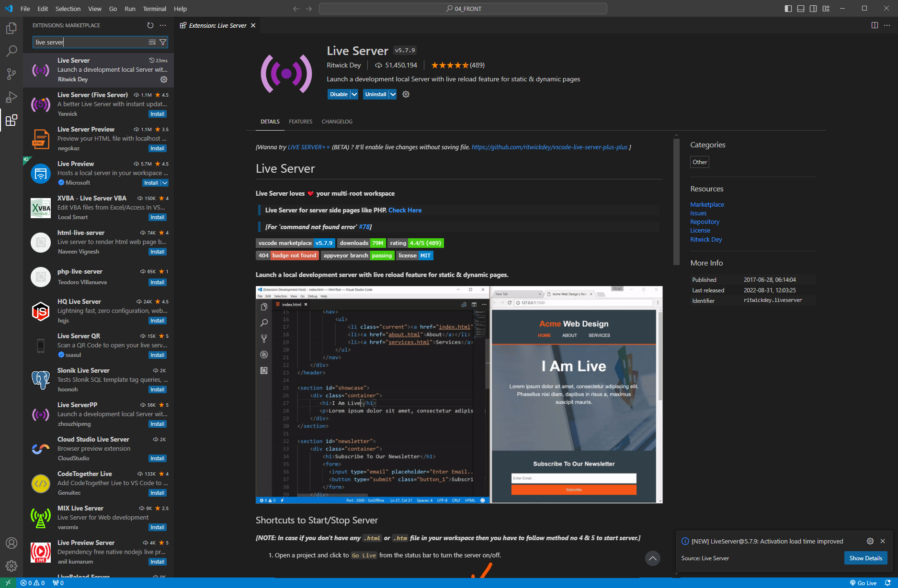
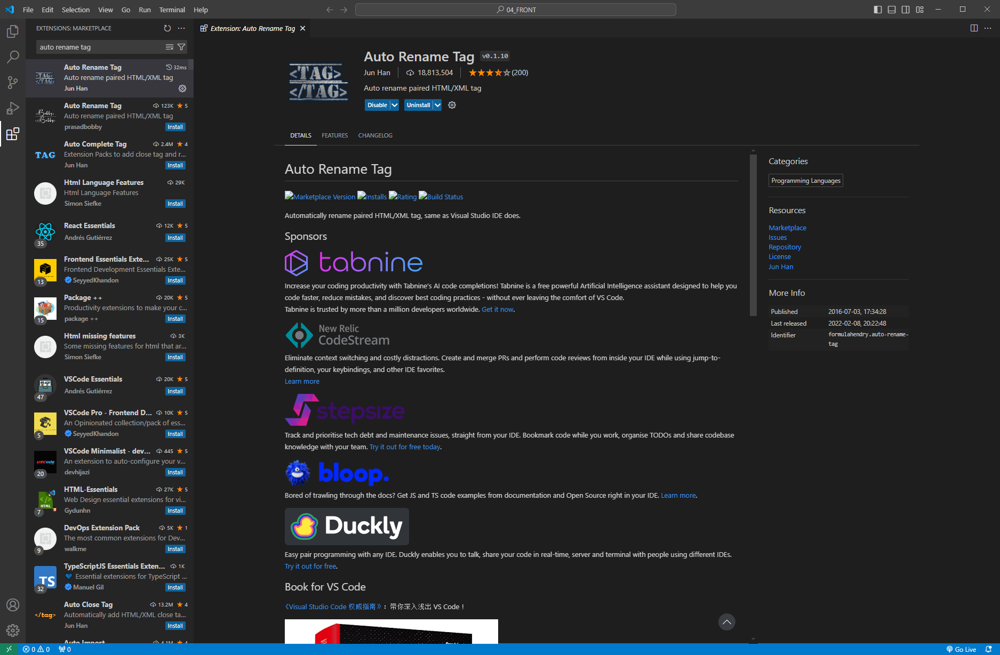
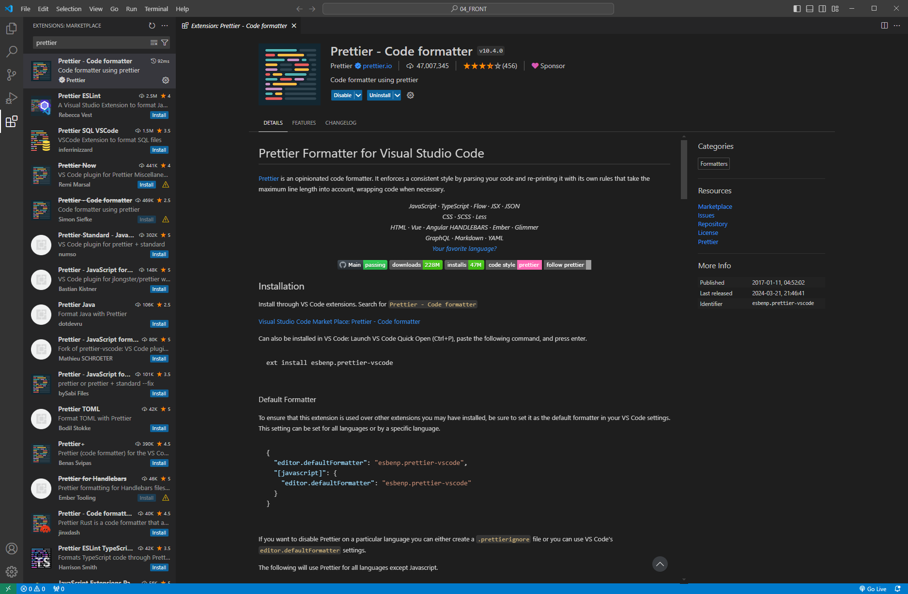

# [2024.07.26(금)] HTML/CSS


# **Visual Studio Code 다운로드**

- 다운로드 URL : https://code.visualstudio.com/download
- 04_FRONT 디렉토리 만들어 Visual Studio Code에서 open
- Visual Studio Code의 Extensions에서 아래 3개 추가하기
    
    
    
    
    
    
    

- HTML 학습자료 : https://www.w3schools.com/html/default.asp
- Hello.html에서 마우스 우클릭 → Open with Live Server로 열기
    
    다운로드 받은 Live Server로 열면 코드 저장만 하고 웹페이지를 refresh하지 않아도 수정된다.
    

### HTMLCSS/Hello.html

```html
<!DOCTYPE html>
<html lang="en">
<head>
    <meta charset="UTF-8">
    <meta name="viewport" content="width=device-width, initial-scale=1.0">
    <title>Document</title>
</head>
<body>
    <h1>Hello, HTML!</h1>
</body>
</html>
```

# HTML

- HTML 학습자료 : https://www.w3schools.com/html/default.asp

## HTML Tutorial

### HTML Attributes

- Elements와 Attributes 차이점

### href

```html
<!DOCTYPE html>
<html lang="en">
<head>
    <meta charset="UTF-8">
    <meta name="viewport" content="width=device-width, initial-scale=1.0">
    <title>Document</title>
</head>
<body>
    <h1>Hello, HTML!</h1>
    <a href="https://www.naver.com">Visit naver</a>
</body>
</html>
```

### img

```html
<!DOCTYPE html>
<html lang="en">
<head>
    <meta charset="UTF-8">
    <meta name="viewport" content="width=device-width, initial-scale=1.0">
    <title>Document</title>
</head>
<body>
    <h1>Hello, HTML!</h1>
    <a href="https://www.naver.com">Visit naver</a>
    
</body>
</html>
```

### HTML Headings

```html
<!DOCTYPE html>
<html lang="en">
<head>
    <meta charset="UTF-8">
    <meta name="viewport" content="width=device-width, initial-scale=1.0">
    <title>Document</title>
</head>
<body>
    <h1>Hello, HTML!</h1>
    <a href="https://www.naver.com">Visit naver</a>
    

    <h1>Heading 1</h1>
    <h2>Heading 2</h2>
    <h3>Heading 3</h3>
    <h4>Heading 4</h4>
    <h5>Heading 5</h5>
    <h6>Heading 6</h6>
</body>
</html>
```

### HTML Paragraphs

```html
<!DOCTYPE html>
<html lang="en">
<head>
    <meta charset="UTF-8">
    <meta name="viewport" content="width=device-width, initial-scale=1.0">
    <title>Document</title>
</head>
<body>
    <h1>Hello, HTML!</h1>
    <a href="https://www.naver.com">Visit naver</a>
    

    <h1>Heading 1</h1>
    <h2>Heading 2</h2>
    <h3>Heading 3</h3>
    <h4>Heading 4</h4>
    <h5>Heading 5</h5>
    <h6>Heading 6</h6>

    <p>This is a paragraph.</p>
    <p>This is another paragraph.</p>

    <p>This is a paragraph.
    This is another paragraph.</p>

</body>
</html>
```

### HTML Formatting

- 수학 공식을 웹에서 표현하는 방법은 여러 가지가 있다.
    
    https://www.mathjax.org/
    
- sub & sup

```html
<!DOCTYPE html>
<html lang="en">
<head>
    <meta charset="UTF-8">
    <meta name="viewport" content="width=device-width, initial-scale=1.0">
    <title>Document</title>
</head>
<body>
    <h1>Hello, HTML!</h1>
    <a href="https://www.naver.com">Visit naver</a>
    

    <h1>Heading 1</h1>
    <h2>Heading 2</h2>
    <h3>Heading 3</h3>
    <h4>Heading 4</h4>
    <h5>Heading 5</h5>
    <h6>Heading 6</h6>

    <p>This is a paragraph.</p>
    <p>This is another paragraph.</p>

    <p>This is a <sub>hello</sub> paragraph.
    This is another <sup>hello</sup> paragraph.</p>

</body>
</html>
```

### HTML Quotations

```html
<!DOCTYPE html>
<html lang="en">
<head>
    <meta charset="UTF-8">
    <meta name="viewport" content="width=device-width, initial-scale=1.0">
    <title>Document</title>
</head>
<body>
    <h1>Hello, HTML!</h1>
    <a href="https://www.naver.com">Visit naver</a>
    

    <h1>Heading 1</h1>
    <h2>Heading 2</h2>
    <h3>Heading 3</h3>
    <h4>Heading 4</h4>
    <h5>Heading 5</h5>
    <h6>Heading 6</h6>

    <p>This is a paragraph.</p>
    <p>This is another paragraph.</p>

    <p>This is a <sub>hello</sub> paragraph.
    This is another <sup>hello</sup> paragraph.</p>

    <hr>

    <p>Here is a quote from WWF's website:</p>
    <blockquote cite="http://www.worldwildlife.org/who/index.html">
        For 60 years, WWF has worked to help people and nature thrive. As the world's leading conservation organization, WWF works in nearly 100 countries. At every level, we collaborate with people around the world to develop and deliver innovative solutions that protect communities, wildlife, and the places in which they live.
    </blockquote>

</body>
</html>
```

### HTML Comments

```html
<!-- Write your comments here -->
```

### HTML CSS

https://www.w3schools.com/html/html_css.asp

CSS can be added to HTML documents in 3 ways:

- **Inline** - by using the `style` attribute inside HTML elements
- **Internal** - by using a `<style>` element in the `<head>` section
- **External** - by using a `<link>` element to link to an external CSS file

### HTML Links

```html
<!DOCTYPE html>
<html lang="en">
<head>
    <meta charset="UTF-8">
    <meta name="viewport" content="width=device-width, initial-scale=1.0">
    <title>Document</title>
</head>
<body>
    <h1>Hello, HTML!</h1>
    <a href="https://www.naver.com" target="_blank">Visit naver</a>
    

    <h1>Heading 1</h1>
    <h2>Heading 2</h2>
    <h3>Heading 3</h3>
    <h4>Heading 4</h4>
    <h5>Heading 5</h5>
    <h6>Heading 6</h6>

    <p>This is a paragraph.</p>
    <p>This is another paragraph.</p>

    <p>This is a <sub>hello</sub> paragraph.
    This is another <sup>hello</sup> paragraph.</p>

    <hr>

    <p>Here is a quote from WWF's website:</p>
    <blockquote cite="http://www.worldwildlife.org/who/index.html">
    For 60 years, WWF has worked to help people and nature thrive. As the world's leading conservation organization, WWF works in nearly 100 countries. At every level, we collaborate with people around the world to develop and deliver innovative solutions that protect communities, wildlife, and the places in which they live.
    </blockquote>

</body>
</html>
```

### HTML Page Title

```html
<!DOCTYPE html>
<html lang="en">
<head>
    <meta charset="UTF-8">
    <meta name="viewport" content="width=device-width, initial-scale=1.0">
    <title>Hello</title>
</head>
<body>
    <h1>Hello, HTML!</h1>
    <a href="https://www.naver.com" target="_blank">Visit naver</a>
    

    <h1>Heading 1</h1>
    <h2>Heading 2</h2>
    <h3>Heading 3</h3>
    <h4>Heading 4</h4>
    <h5>Heading 5</h5>
    <h6>Heading 6</h6>

    <p>This is a paragraph.</p>
    <p>This is another paragraph.</p>

    <p>This is a <sub>hello</sub> paragraph.
    This is another <sup>hello</sup> paragraph.</p>

    <hr>

    <p>Here is a quote from WWF's website:</p>
    <blockquote cite="http://www.worldwildlife.org/who/index.html">
    For 60 years, WWF has worked to help people and nature thrive. As the world's leading conservation organization, WWF works in nearly 100 countries. At every level, we collaborate with people around the world to develop and deliver innovative solutions that protect communities, wildlife, and the places in which they live.
    </blockquote>

</body>
</html>
```

### HTML Tables

- 셀 병합 : colspan & Rowspan
    
    https://www.w3schools.com/html/html_table_colspan_rowspan.asp
    

```html
<!DOCTYPE html>
<html lang="en">
<head>
    <meta charset="UTF-8">
    <meta name="viewport" content="width=device-width, initial-scale=1.0">
    <title>Hello</title>
</head>
<body>
    <h1>Hello, HTML!</h1>
    <a href="https://www.naver.com" target="_blank">Visit naver</a>
    

    <h1>Heading 1</h1>
    <h2>Heading 2</h2>
    <h3>Heading 3</h3>
    <h4>Heading 4</h4>
    <h5>Heading 5</h5>
    <h6>Heading 6</h6>

    <p>This is a paragraph.</p>
    <p>This is another paragraph.</p>

    <p>This is a <sub>hello</sub> paragraph.
    This is another <sup>hello</sup> paragraph.</p>

    <hr>

    <p>Here is a quote from WWF's website:</p>
    <blockquote cite="http://www.worldwildlife.org/who/index.html">
    For 60 years, WWF has worked to help people and nature thrive. As the world's leading conservation organization, WWF works in nearly 100 countries. At every level, we collaborate with people around the world to develop and deliver innovative solutions that protect communities, wildlife, and the places in which they live.
    </blockquote>

    <table>
        <tr>
          <th>Company</th>
          <th>Contact</th>
          <th>Country</th>
        </tr>
        <tr>
          <td>Alfreds Futterkiste</td>
          <td>Maria Anders</td>
          <td>Germany</td>
        </tr>
        <tr>
          <td>Centro comercial Moctezuma</td>
          <td>Francisco Chang</td>
          <td>Mexico</td>
        </tr>
    </table>

</body>
</html>
```

### HTML Lists

```html
<!DOCTYPE html>
<html lang="en">
  <head>
    <meta charset="UTF-8" />
    <meta name="viewport" content="width=device-width, initial-scale=1.0" />
    <title>Hello</title>
  </head>
  <body>
    <h1>Hello, HTML!</h1>
    <a href="https://www.naver.com" target="_blank">Visit naver</a>
    

    <h1>Heading 1</h1>
    <h2>Heading 2</h2>
    <h3>Heading 3</h3>
    <h4>Heading 4</h4>
    <h5>Heading 5</h5>
    <h6>Heading 6</h6>

    <p>This is a paragraph.</p>
    <p>This is another paragraph.</p>

    <p>
      This is a <sub>hello</sub> paragraph. This is another
      <sup>hello</sup> paragraph.
    </p>

    <hr />

    <p>Here is a quote from WWF's website:</p>
    <blockquote cite="http://www.worldwildlife.org/who/index.html">
      For 60 years, WWF has worked to help people and nature thrive. As the
      world's leading conservation organization, WWF works in nearly 100
      countries. At every level, we collaborate with people around the world to
      develop and deliver innovative solutions that protect communities,
      wildlife, and the places in which they live.
    </blockquote>

    <table>
      <tr>
        <th>Company</th>
        <th>Contact</th>
        <th>Country</th>
      </tr>
      <tr>
        <td>Alfreds Futterkiste</td>
        <td>Maria Anders</td>
        <td>Germany</td>
      </tr>
      <tr>
        <td>Centro comercial Moctezuma</td>
        <td>Francisco Chang</td>
        <td>Mexico</td>
      </tr>
    </table>

    <hr />

    <ul>
      <li>Coffee</li>
      <li>Tea</li>
      <li>Milk</li>
    </ul>

    <ol>
      <li>Coffee</li>
      <li>Tea</li>
      <li>Milk</li>
      <li>
        <ul>
          <li>Coffee</li>
          <li>Tea</li>
          <li>Milk</li>
        </ul>
      </li>
    </ol>
  </body>
</html>

```

### HTML Block & Inline ⭐

https://www.w3schools.com/html/html_blocks.asp

### **Block-level Elements**

A block-level element **always starts on a new line**, and the browsers automatically add some space (a margin) before and after the element.

A block-level element **always takes up the full width available** (stretches out to the left and right as far as it can).

### **Inline Elements**

An inline element **does not start on a new line.**

An inline element **only takes up as much width as necessary.**

### HTML Div

- **The <div> Element**
    
    The `<div>` element is by default a block element, meaning that it takes all available width, and comes with line breaks before and after.
    
- **<div> as a container**
The `<div>` element is often used to group sections of a web page together.

### HTML Classes

The HTML `class` attribute is used to specify a class for an HTML element.

Multiple HTML elements can share the same class.

The `class` attribute is often used to point to a class name in a style sheet. It can also be used by a JavaScript to access and manipulate elements with the specific class name.

### HTML Id

The HTML `id` attribute is used to specify a unique id for an HTML element.

You cannot have more than one element with the same id in an HTML document.

The `id` attribute specifies a unique id for an HTML element. The value of the `id` attribute must be unique within the HTML document.

The `id` attribute is used to point to a specific style declaration in a style sheet. It is also used by JavaScript to access and manipulate the element with the specific id.

### Classes와 Id 차이점

- id : 유일
- class : ~ 중 ~인 것들
- A class name can be used by multiple HTML elements, while an id name must only be used by one HTML element within the page

### HTML JavaScript

- HTMl : 문서 구조
- CSS : 문서 스타일
- Javascript : 문서 기능

### HTML File Paths

| Path | Description |
| --- | --- |
| \ | The "picture.jpg" file is located in the same folder as the current page |
| \ | The "picture.jpg" file is located in the images folder in the current folder |
| \ | The "picture.jpg" file is located in the images folder at the root of the current web |
| \ | The "picture.jpg" file is located in the folder one level up from the current folder |

### URL

- Document Root
- URL : port
- context path (app path)
- href = “/…/…” ← 맨 앞 / 가 Document Root이다.

### URL 실습

### WebContent

### aaa/aaa.html

```html
<!DOCTYPE html>
<html lang="en">
  <head>
    <meta charset="UTF-8" />
    <meta name="viewport" content="width=device-width, initial-scale=1.0" />
    <title>Hello</title>
  </head>
  <body>
    <h1>aaa.html</h1>
    <a href="../index.html">index.html</a>
    <a href="/HTMLCSS/Webcontent/index.html">index.html</a>
  </body>
</html>
```

### bbb

### ccc/ccc.html

```html
<!DOCTYPE html>
<html lang="en">
  <head>
    <meta charset="UTF-8" />
    <meta name="viewport" content="width=device-width, initial-scale=1.0" />
    <title>Hello</title>
  </head>
  <body>
    <h1>ccc.html</h1>
  </body>
</html>
```

### bbb.html

```html
<!DOCTYPE html>
<html lang="en">
  <head>
    <meta charset="UTF-8" />
    <meta name="viewport" content="width=device-width, initial-scale=1.0" />
    <title>Hello</title>
  </head>
  <body>
    <h1>bbb.html</h1>
    <a href="../aaa/aaa.html">aaa.html</a>
  </body>
</html>
```

### index.html

```html
<!DOCTYPE html>
<html lang="en">
  <head>
    <meta charset="UTF-8" />
    <meta name="viewport" content="width=device-width, initial-scale=1.0" />
    <title>Hello</title>
  </head>
  <body>
    <h1>index.html</h1>
    <a href="./aaa/aaa.html">aaa.html</a>
    <a href="bbb/bbb.html">bbb.html</a>
    <a href="bbb/ccc/ccc.html">ccc.html</a>
  </body>
</html>
```

## HTML Forms

### Label

- The <label> Element

Notice the use of the `<label>` element in the example above.

The `<label>` tag defines a label for many form elements.

The `<label>` element is useful for screen-reader users, because the screen-reader will read out loud the label when the user focuses on the input element.

The `<label>` element also helps users who have difficulty clicking on very small regions (such as radio buttons or checkboxes) - because when the user clicks the text within the `<label>` element, it toggles the radio button/checkbox.

The `for` attribute of the `<label>` tag should be equal to the `id` attribute of the `<input>` element to bind them together.

```html
<!DOCTYPE html>
<html lang="en">
  <head>
    <meta charset="UTF-8" />
    <meta name="viewport" content="width=device-width, initial-scale=1.0" />
    <title>Hello</title>
  </head>
  <body>
    <form>
      <label for="fname">First name:</label><br />
      <input type="text" id="fname" name="fname" /><br />
      <label for="lname">Last name:</label><br />
      <input type="text" id="lname" name="lname" />
    </form>
  </body>
</html>
```

### **Radio Buttons**

```html
<!DOCTYPE html>
<html lang="en">
  <head>
    <meta charset="UTF-8" />
    <meta name="viewport" content="width=device-width, initial-scale=1.0" />
    <title>Hello</title>
  </head>
  <body>

    <!-- id 속성은 프론트에서 사용한다. -->
    <!-- 백엔드에서 값을 가져올 때는 name 속성을 사용한다. -->

    <form>
      <label for="fname">First name:</label><br />
      <input type="text" id="fname" name="fname" /><br />
      <label for="lname">Last name:</label><br />
      <input type="text" id="lname" name="lname" />
    </form>

    <form>
        <input type="radio" id="html" name="fav_language" value="HTML">
        <label for="html">HTML</label><br>
        <input type="radio" id="css" name="fav_language" value="CSS">
        <label for="css">CSS</label><br>
        <input type="radio" id="javascript" name="fav_language" value="JavaScript">
        <label for="javascript">JavaScript</label>
      </form>

  </body>
</html>
```

### **Checkboxes**

```html
<!DOCTYPE html>
<html lang="en">
  <head>
    <meta charset="UTF-8" />
    <meta name="viewport" content="width=device-width, initial-scale=1.0" />
    <title>Hello</title>
  </head>
  <body>

    <!-- id 속성은 프론트에서 사용한다. -->
    <!-- 백엔드에서 값을 가져올 때는 name 속성을 사용한다. -->

    <form>
      <label for="fname">First name:</label><br />
      <input type="text" id="fname" name="fname" /><br />
      <label for="lname">Last name:</label><br />
      <input type="text" id="lname" name="lname" />
    </form>

    <form>
        <input type="radio" id="html" name="fav_language" value="HTML">
        <label for="html">HTML</label><br>
        <input type="radio" id="css" name="fav_language" value="CSS">
        <label for="css">CSS</label><br>
        <input type="radio" id="javascript" name="fav_language" value="JavaScript">
        <label for="javascript">JavaScript</label>
      </form>

      <!-- checkboxes는 name을 동일하게 사용하고 배열로 받아 사용한다. -->
      <form>
        <input type="checkbox" id="vehicle1" name="vehicle1" value="Bike">
        <label for="vehicle1"> I have a bike</label><br>
        <input type="checkbox" id="vehicle2" name="vehicle2" value="Car">
        <label for="vehicle2"> I have a car</label><br>
        <input type="checkbox" id="vehicle3" name="vehicle3" value="Boat">
        <label for="vehicle3"> I have a boat</label>
      </form>

  </body>
</html>
```

### Submit Button

```html
<!DOCTYPE html>
<html lang="en">
  <head>
    <meta charset="UTF-8" />
    <meta name="viewport" content="width=device-width, initial-scale=1.0" />
    <title>From</title>
  </head>
  <body>

    <!-- id 속성은 프론트에서 사용한다. -->
    <!-- 백엔드에서 값을 가져올 때는 name 속성을 사용한다. -->

    <form>
      <label for="fname">First name:</label><br />
      <input type="text" id="fname" name="fname" /><br />
      <label for="lname">Last name:</label><br />
      <input type="text" id="lname" name="lname" />
    </form>

    <form>
        <input type="radio" id="html" name="fav_language" value="HTML">
        <label for="html">HTML</label><br>
        <input type="radio" id="css" name="fav_language" value="CSS">
        <label for="css">CSS</label><br>
        <input type="radio" id="javascript" name="fav_language" value="JavaScript">
        <label for="javascript">JavaScript</label>
      </form>

      <!-- checkboxes는 name을 동일하게 사용하고 배열로 받아 사용한다. -->
      <form>
        <input type="checkbox" id="vehicle1" name="vehicle1" value="Bike">
        <label for="vehicle1"> I have a bike</label><br>
        <input type="checkbox" id="vehicle2" name="vehicle2" value="Car">
        <label for="vehicle2"> I have a car</label><br>
        <input type="checkbox" id="vehicle3" name="vehicle3" value="Boat">
        <label for="vehicle3"> I have a boat</label>
      </form>

      <form action="">
        <label for="fname">First name:</label><br>
        <input type="text" id="fname" name="fname" value="John"><br>
        <label for="lname">Last name:</label><br>
        <input type="text" id="lname" name="lname" value="Doe"><br><br>
        <input type="submit" value="Submit">
      </form>

  </body>
</html>
```

## HTML Graphics

- HTML Canvas
    
    이미지를 확대하면 매끄럽지 않다.
    
- HTML SVG
    
    이미지를 화대해도 변하지 않는다. 
    

### SVG(Scalable Vector Graphics)

W3C가 개발한 개방형 표준으로, 2차원 벡터 그래픽의 표현을 위한 xml 마크업 언어이다.

### Raster와 Vector 차이

Raster 방식은 이미지의 모양과 색을 색상정보가 담긴 pixel로 표현하는 방식이다. 흔히 비트맵 방식이라고 불리는 표현 방식으로, 각각의 픽셀에 색을 입혀, 그 픽셀을 하나로 모아 그림이나 선 등을 만들어낸다. 각각의 픽셀을 이용해 작업하는 만큼 자연스러운 이미지를 표현할 수 있지만, 확대를 할 경우 그림이 깨져서 보이는 계단식 현상이 나타나며, 픽셀의 수가 많아질수록 파일의 크기가 커지는 단점이 존재한다.

Vector는 수학적 함수를 이용하여 도형이나 선을 그려서 표시하는 방식으로써, 확대하였을 때 계단식 현상이 일어나지 않고 선명함을 유진한다. 또한, 레스터 방식에 비해서 용량이 적은 편이다. 하지만 벡터 이미지는 색상의 자연스러운 변화나 세밀한 표현이 어렵다는 단점이 있다.

### 참고

https://m.post.naver.com/viewer/postView.naver?volumeNo=27689642&memberNo=43589165

## HTML Media

- HTML YouTube

```html
<!DOCTYPE html>
<html lang="en">
  <head>
    <meta charset="UTF-8" />
    <meta name="viewport" content="width=device-width, initial-scale=1.0" />
    <title>youtube</title>
  </head>
  <body>
    <iframe
      width="420"
      height="315"
      src="https://www.youtube.com/embed/tgbNymZ7vqY"
    >
    </iframe>
  </body>
</html>
```

## HTML APIs

- HTML Web Storage
    
    With web storage, web applications can store data locally within the user's browser.
    
    Before HTML5, application data had to be stored in cookies, included in every server request. Web storage is more secure, and large amounts of data can be stored locally, without affecting website performance.
    
    Unlike cookies, the storage limit is far larger (at least 5MB) and information is never transferred to the server.
    
    Web storage is per origin (per domain and protocol). All pages, from one origin, can store and access the same data.
    

# CSS

- CSS 학습자료 : https://www.w3schools.com/css/default.asp

## CSS Tutorial

### CSS Syntax

!https://www.w3schools.com/css/img_selector.gif

The selector points to the HTML element you want to style.

The declaration block contains one or more declarations separated by semicolons.

Each declaration includes a CSS property name and a value, separated by a colon.

Multiple CSS declarations are separated with semicolons, and declaration blocks are surrounded by curly braces.

### CSS Selectors

### **The CSS element Selector**

```html
<!DOCTYPE html>
<html lang="en">
  <head>
    <meta charset="UTF-8" />
    <meta name="viewport" content="width=device-width, initial-scale=1.0" />
    <title>css</title>
    <style>
        p {
            color : blue;
        }
        div {
            background-color: aquamarine;
        }
    </style>
  </head>
  <body>

    <p id="p1">텍스트 1</p>
    <p id="p2">텍스트 2</p>
    <p>텍스트 3</p>
    <p>텍스트 4</p>
    <div>텍스트 5</div>

  </body>
</html>
```

### **The CSS id Selector**

```html
<!DOCTYPE html>
<html lang="en">
  <head>
    <meta charset="UTF-8" />
    <meta name="viewport" content="width=device-width, initial-scale=1.0" />
    <title>css</title>
    <style>
        #p1 {
            color : blue;
        }
        #p2 {
            background-color: aquamarine;
        }
    </style>
  </head>
  <body>

    <p id="p1">텍스트 1</p>
    <p id="p2">텍스트 2</p>
    <p>텍스트 3</p>
    <p>텍스트 4</p>
    <div>텍스트 5</div>

  </body>
</html>
```

### **The CSS class Selector**

```html
<!DOCTYPE html>
<html lang="en">
  <head>
    <meta charset="UTF-8" />
    <meta name="viewport" content="width=device-width, initial-scale=1.0" />
    <title>css</title>
    <style>
        #p1 {
            color : blue;
        }
        #p2 {
            background-color: aquamarine;
        }
        .c1 {
            text-align: center;
        }

        div.c1 {
            border: 1px solid green;
        }
    </style>
  </head>
  <body>

    <p id="p1">텍스트 1</p>
    <p class="c1">텍스트 2</p>
    <p id="p2">텍스트 3</p>
    <p>텍스트 4</p>
    <div class="c1">텍스트 5</div>

  </body>
</html>
```

### **The CSS Universal Selector**

```html
<!DOCTYPE html>
<html lang="en">
  <head>
    <meta charset="UTF-8" />
    <meta name="viewport" content="width=device-width, initial-scale=1.0" />
    <title>css</title>
    <style>
      * {
        text-align: center;
        color: blue;
      }
      #p1 {
        color: blue;
      }
      #p2 {
        background-color: aquamarine;
      }
      .c1 {
        text-align: center;
      }

      div.c1 {
        border: 1px solid green;
      }
    </style>
  </head>
  <body>
    <p id="p1">텍스트 1</p>
    <p class="c1">텍스트 2</p>
    <p id="p2">텍스트 3</p>
    <p>텍스트 4</p>
    <div class="c1">텍스트 5</div>
  </body>
</html>

```

### **The CSS Grouping Selector**

```html
<!DOCTYPE html>
<html lang="en">
  <head>
    <meta charset="UTF-8" />
    <meta name="viewport" content="width=device-width, initial-scale=1.0" />
    <title>css</title>
    <style>
      /* * {
        text-align: center;
        color: blue;
      } */
      #p1 {
        color: blue;
      }
      #p2 {
        background-color: aquamarine;
      }
      .c1 {
        text-align: center;
      }

      div.c1 {
        border: 1px solid green;
      }
      h1, h2, p {
        color: green;
      }
    </style>
  </head>
  <body>
    <p id="p1">텍스트 1</p>
    <p class="c1">텍스트 2</p>
    <p id="p2">텍스트 3</p>
    <p>텍스트 4</p>
    <div class="c1">텍스트 5</div>

    <h1>h1 tag</h1>
    <h2>h2 tag</h2>
    <p>p tag</p>
  </body>
</html>
```

### CSS How To

- Three Ways to Insert CSS
    - External CSS
    - Internal CSS
    - Inline CSS

### CSS 우선순위

External CSS → Internal CSS → Inline CSS 순으로 적용되고, 같은 속성이 적용되어 있으면 덮어씌워진다.

따라서 Inline CSS → Internal CSS → External CSS 순으로 우선순위를 가진다.

### CSS Comments

```html
/* This is a single-line comment */
```

### CSS Colors

Colors are specified using predefined color names, or RGB, HEX, HSL, RGBA, HSLA values.

In CSS, a color can be specified by using a predefined color name

### CSS Backgrounds

```html
<!DOCTYPE html>
<html lang="en">
  <head>
    <meta charset="UTF-8" />
    <meta name="viewport" content="width=device-width, initial-scale=1.0" />
    <title>css</title>
    <style>
      /* * {
        text-align: center;
        color: blue;
      } */
      #p1 {
        color: blue;
      }
      #p2 {
        background-color: aquamarine;
      }
      .c1 {
        text-align: center;
      }

      div.c1 {
        border: 1px solid green;
      }
      h1, h2, p {
        color: green;
      }

      body {
        background-color: lightblue;
      }
    </style>
  </head>
  <body>
    <p id="p1">텍스트 1</p>
    <p class="c1">텍스트 2</p>
    <p id="p2">텍스트 3</p>
    <p>텍스트 4</p>
    <div class="c1">텍스트 5</div>

    <h1>h1 tag</h1>
    <h2>h2 tag</h2>
    <p>p tag</p>
  </body>
</html>
```

### CSS Borders

The CSS border properties allow you to specify the style, width, and color of an element's border.

- Border Width : 두께
- Border Color : 색상
- Border Sides : 측면

### css.html

```html
<!DOCTYPE html>
<html lang="en">
  <head>
    <meta charset="UTF-8" />
    <meta name="viewport" content="width=device-width, initial-scale=1.0" />
    <title>css</title>
    <style>
      /* * {
        text-align: center;
        color: blue;
      } */
      #p1 {
        color: blue;
      }
      #p2 {
        background-color: aquamarine;
      }
      .c1 {
        text-align: center;
      }

      div.c1 {
        border: 1px solid green;
      }
      h1, h2, p {
        color: green;
      }

      body {
        background-color: lightblue;
      }

      #rect1 {
        border : 1px solid blueviolet;
      }
      #rect2 {
        border : 1px solid blueviolet;
        border-radius: 10px;
      }
      #rect3 {
        border : 1px solid blueviolet;
        border-radius: 20px;
      }
      #rect4 {
        border : 1px solid blueviolet;
        border-radius: 50%;
      }

      div {
        width: 200px;
        height: 200px;
      }
    </style>
  </head>
  <body>
    <p id="p1">텍스트 1</p>
    <p class="c1">텍스트 2</p>
    <p id="p2">텍스트 3</p>
    <p>텍스트 4</p>
    <div class="c1">텍스트 5</div>

    <h1>h1 tag</h1>
    <h2>h2 tag</h2>
    <p>p tag</p>

    <hr>
    <div id="rect1"></div>
    <div id="rect2"></div>
    <div id="rect3"></div>
    <div id="rect4"></div>
  </body>
</html>

```

### Hello.html

```html
<!DOCTYPE html>
<html lang="en">
  <head>
    <meta charset="UTF-8" />
    <meta name="viewport" content="width=device-width, initial-scale=1.0" />
    <title>Hello</title>
  </head>
  <body>
    <h1>Hello, HTML!</h1>
    <a href="https://www.naver.com" target="_blank">Visit naver</a>
    

    <h1>Heading 1</h1>
    <h2>Heading 2</h2>
    <h3>Heading 3</h3>
    <h4>Heading 4</h4>
    <h5>Heading 5</h5>
    <h6>Heading 6</h6>

    <p>This is a paragraph.</p>
    <p>This is another paragraph.</p>

    <p>
      This is a <sub>hello</sub> paragraph. This is another
      <sup>hello</sup> paragraph.
    </p>

    <hr />

    <p>Here is a quote from WWF's website:</p>
    <blockquote cite="http://www.worldwildlife.org/who/index.html">
      For 60 years, WWF has worked to help people and nature thrive. As the
      world's leading conservation organization, WWF works in nearly 100
      countries. At every level, we collaborate with people around the world to
      develop and deliver innovative solutions that protect communities,
      wildlife, and the places in which they live.
    </blockquote>

    <table>
      <tr>
        <th>Company</th>
        <th>Contact</th>
        <th>Country</th>
      </tr>
      <tr>
        <td>Alfreds Futterkiste</td>
        <td>Maria Anders</td>
        <td>Germany</td>
      </tr>
      <tr>
        <td>Centro comercial Moctezuma</td>
        <td>Francisco Chang</td>
        <td>Mexico</td>
      </tr>
    </table>

    <hr />

    <ul>
      <li>Coffee</li>
      <li>Tea</li>
      <li>Milk</li>
    </ul>

    <ol>
      <li>Coffee</li>
      <li>Tea</li>
      <li>Milk</li>
      <li>
        <ul>
          <li>Coffee</li>
          <li>Tea</li>
          <li>Milk</li>
        </ul>
      </li>
    </ol>
  </body>
</html>

```

### CSS Margins

Margins are used to create space around elements, outside of any defined borders.

- **CSS Margin Collapse**
    
    Top and bottom margins of elements are sometimes collapsed into a single margin that is equal to the largest of the two margins.
    
    This does not happen on left and right margins! Only top and bottom margins
    

### 실습

```html
<!DOCTYPE html>
<html lang="en">
  <head>
    <meta charset="UTF-8" />
    <meta name="viewport" content="width=device-width, initial-scale=1.0" />
    <title>css</title>
    <style>
      /* * {
        text-align: center;
        color: blue;
      } */
      #p1 {
        color: blue;
      }
      #p2 {
        background-color: aquamarine;
      }
      .c1 {
        text-align: center;
      }

      div.c1 {
        border: 1px solid green;
      }
      h1, h2, p {
        color: green;
      }

      body {
        background-color: lightblue;
      }

      #rect1 {
        border : 1px solid blueviolet;
      }
      #rect2 {
        border : 1px solid blueviolet;
        border-radius: 10px;
      }
      #rect3 {
        border : 1px solid blueviolet;
        border-radius: 20px;
      }
      #rect4 {
        border : 1px solid blueviolet;
        border-radius: 50%;
      }

      div {
        width: 200px;
        height: 200px;
      }
    </style>
  </head>
  <body>
    <p id="p1">텍스트 1</p>
    <p class="c1">텍스트 2</p>
    <p id="p2">텍스트 3</p>
    <p>텍스트 4</p>
    <div class="c1">텍스트 5</div>

    <h1>h1 tag</h1>
    <h2>h2 tag</h2>
    <p>p tag</p>

    <hr>
    <div id="rect1" style="margin-bottom: 100px;"></div>
    <div id="rect2"></div>
    <div id="rect3" style="margin-top: 100px;"></div>
    <div id="rect4" style="margin-left: 100px;"></div>
  </body>
</html>
```

### CSS Padding

Padding is used to create space around an element's content, inside of any defined borders.

```html
<!DOCTYPE html>
<html lang="en">
  <head>
    <meta charset="UTF-8" />
    <meta name="viewport" content="width=device-width, initial-scale=1.0" />
    <title>css</title>
    <style>
      /* * {
        text-align: center;
        color: blue;
      } */
      #p1 {
        color: blue;
      }
      #p2 {
        background-color: aquamarine;
      }
      .c1 {
        text-align: center;
      }

      div.c1 {
        border: 1px solid green;
      }
      h1, h2, p {
        color: green;
      }

      body {
        background-color: lightblue;
      }

      #rect1 {
        border : 1px solid blueviolet;
      }
      #rect2 {
        border : 1px solid blueviolet;
        border-radius: 10px;
      }
      #rect3 {
        border : 1px solid blueviolet;
        border-radius: 20px;
      }
      #rect4 {
        border : 1px solid blueviolet;
        border-radius: 50%;
      }

      /* div {
        width: 200px;
        height: 200px;
      } */
    </style>
  </head>
  <body>
    <p id="p1">텍스트 1</p>
    <p class="c1">텍스트 2</p>
    <p id="p2">텍스트 3</p>
    <p>텍스트 4</p>
    <div class="c1">텍스트 5</div>

    <h1>h1 tag</h1>
    <h2>h2 tag</h2>
    <p>p tag</p>

    <hr>
    <div id="rect1" style="margin-bottom: 100px;"></div>
    <div id="rect2"></div>
    <div id="rect3" style="margin-top: 100px;"></div>
    <div id="rect4" style="margin-left: 100px;"></div>

    <hr>
    <div style="border : 1px solid orange; padding: 25px;">안녕하세요, 이것은 패딩 테스트입니다.안녕하세요, 이것은 패딩 테스트입니다.안녕하세요, 이것은 패딩 테스트입니다.안녕하세요, 이것은 패딩 테스트입니다.
        안녕하세요, 이것은 패딩 테스트입니다.</div>

  </body>
</html>
```

### CSS Height/Width

```html
<!DOCTYPE html>
<html lang="en">
  <head>
    <meta charset="UTF-8" />
    <meta name="viewport" content="width=device-width, initial-scale=1.0" />
    <title>css</title>
    <style>
      div {
        border : 1px solid red;
        width: 400px;
        height: 300px;
      }

      span {
        border : 1px solid aqua;
        width: 400px;
        height: 300px;
      }
    </style>
  </head>
  <body>
    <div>안녕하세요</div>
    <span>안녕하세요</span>

  </body>
</html>
```

### CSS Box Model

In CSS, the term "box model" is used when talking about design and layout.

The CSS box model is essentially a box that wraps around every HTML element. It consists of: content, padding, borders and margins. The image below illustrates the box model:

Explanation of the different parts:

- **Content** - The content of the box, where text and images appear
- **Padding** - Clears an area around the content. The padding is transparent
- **Border** - A border that goes around the padding and content
- **Margin** - Clears an area outside the border. The margin is transparent

The box model allows us to add a border around elements, and to define space between elements.

### CSS Box Sizing

https://www.w3schools.com/css/css3_box-sizing.asp

- The CSS `box-sizing` property allows us to include the padding and border in an element's total width and height.
- Without the CSS box-sizing Property
    
    By default, the width and height of an element is calculated like this:
    
    width + padding + border = actual width of an element
    
    height + padding + border = actual height of an element
    
    This means: When you set the width/height of an element, the element often appears bigger than you have set (because the element's border and padding are added to the element's specified width/height).
    
- With the CSS box-sizing Property
    
    The `box-sizing` property allows us to include the padding and border in an element's total width and height.
    
    If you set `box-sizing: border-box;` on an element, padding and border are included in the width and height
    

### 실습

```html
<!DOCTYPE html>
<html lang="en">
  <head>
    <meta charset="UTF-8" />
    <meta name="viewport" content="width=device-width, initial-scale=1.0" />
    <title>css</title>
    <style>
      div {
        border : 20px solid red;
        width: 400px;
        height: 300px;
        padding: 20px;
      }

      span {
        border : 1px solid aqua;
        width: 400px;
        height: 300px;
      }
    </style>
  </head>
  <body>
    <div>안녕하세요</div>
    <div style="box-sizing: border-box;">안녕하세요</div>
    <span>안녕하세요</span>
    

  </body>
</html>
```

### CSS Fonts

1. google Font에서 원하는 폰트 선택 → Get font → Get embed code로 코드 가져와서 실습
    
    https://fonts.google.com/?subset=korean&script=Kore
    
2. 가져온 CSS 코드에 적용
    
    ```html
    <!DOCTYPE html>
    <html lang="en">
      <head>
        <meta charset="UTF-8" />
        <meta name="viewport" content="width=device-width, initial-scale=1.0" />
    
        <link rel="preconnect" href="https://fonts.googleapis.com" />
        <link rel="preconnect" href="https://fonts.gstatic.com" crossorigin />
        <link
          href="https://fonts.googleapis.com/css2?family=Nanum+Pen+Script&display=swap"
          rel="stylesheet"
        />
    
        <title>css</title>
        <style>
          /* div {
            border: 20px solid red;
            width: 400px;
            height: 300px;
            padding: 20px;
          }
    
          span {
            border: 1px solid aqua;
            width: 400px;
            height: 300px;
          } */
    
          .nanum-pen-script-regular {
            font-family: "Nanum Pen Script", cursive;
            font-weight: 400;
            font-style: normal;
          }
        </style>
      </head>
      <body>
        <div class="nanum-pen-script-regular">안녕하세요</div>
        <div style="box-sizing: border-box">안녕하세요</div>
        <span>안녕하세요</span>
      </body>
    </html>
    ```
    

### CSS Icons

https://getbootstrap.com/docs/5.1/getting-started/introduction/

1. bootstrap v5.1 → [Icons] → [install] → CDN의 <link> 복사 → 코드에 붙여넣기
2. 원하는 아이콘 선택 → Copy HTML 복사 → 코드에 붙어넣기

```html
<!DOCTYPE html>
<html lang="en">
  <head>
    <meta charset="UTF-8" />
    <meta name="viewport" content="width=device-width, initial-scale=1.0" />

    <link rel="preconnect" href="https://fonts.googleapis.com" />
    <link rel="preconnect" href="https://fonts.gstatic.com" crossorigin />
    <link
      href="https://fonts.googleapis.com/css2?family=Nanum+Pen+Script&display=swap"
      rel="stylesheet"
    />

    <link
      rel="stylesheet"
      href="https://cdn.jsdelivr.net/npm/bootstrap-icons@1.11.3/font/bootstrap-icons.min.css"
    />

    <title>css</title>
    <style>
      /* div {
        border: 20px solid red;
        width: 400px;
        height: 300px;
        padding: 20px;
      }

      span {
        border: 1px solid aqua;
        width: 400px;
        height: 300px;
      } */

      .nanum-pen-script-regular {
        font-family: "Nanum Pen Script", cursive;
        font-weight: 400;
        font-style: normal;
      }
    </style>
  </head>
  <body>
    <div class="nanum-pen-script-regular">안녕하세요</div>
    <div style="box-sizing: border-box">안녕하세요</div>
    <span>안녕하세요</span>

    <hr />
    <svg
      xmlns="http://www.w3.org/2000/svg"
      width="16"
      height="16"
      fill="currentColor"
      class="bi bi-airplane"
      viewBox="0 0 16 16"
    >
      <path
        d="M6.428 1.151C6.708.591 7.213 0 8 0s1.292.592 1.572 1.151C9.861 1.73 10 2.431 10 3v3.691l5.17 2.585a1.5 1.5 0 0 1 .83 1.342V12a.5.5 0 0 1-.582.493l-5.507-.918-.375 2.253 1.318 1.318A.5.5 0 0 1 10.5 16h-5a.5.5 0 0 1-.354-.854l1.319-1.318-.376-2.253-5.507.918A.5.5 0 0 1 0 12v-1.382a1.5 1.5 0 0 1 .83-1.342L6 6.691V3c0-.568.14-1.271.428-1.849m.894.448C7.111 2.02 7 2.569 7 3v4a.5.5 0 0 1-.276.447l-5.448 2.724a.5.5 0 0 0-.276.447v.792l5.418-.903a.5.5 0 0 1 .575.41l.5 3a.5.5 0 0 1-.14.437L6.708 15h2.586l-.647-.646a.5.5 0 0 1-.14-.436l.5-3a.5.5 0 0 1 .576-.411L15 11.41v-.792a.5.5 0 0 0-.276-.447L9.276 7.447A.5.5 0 0 1 9 7V3c0-.432-.11-.979-.322-1.401C8.458 1.159 8.213 1 8 1s-.458.158-.678.599"
      />
    </svg>
  </body>
</html>
```

### CSS Links

```html
<!DOCTYPE html>
<html lang="en">
  <head>
    <meta charset="UTF-8" />
    <meta name="viewport" content="width=device-width, initial-scale=1.0" />

    <link rel="preconnect" href="https://fonts.googleapis.com" />
    <link rel="preconnect" href="https://fonts.gstatic.com" crossorigin />
    <link
      href="https://fonts.googleapis.com/css2?family=Nanum+Pen+Script&display=swap"
      rel="stylesheet"
    />

    <link
      rel="stylesheet"
      href="https://cdn.jsdelivr.net/npm/bootstrap-icons@1.11.3/font/bootstrap-icons.min.css"
    />

    <title>css</title>
    <style>
      /* div {
        border: 20px solid red;
        width: 400px;
        height: 300px;
        padding: 20px;
      }

      span {
        border: 1px solid aqua;
        width: 400px;
        height: 300px;
      } */

      .nanum-pen-script-regular {
        font-family: "Nanum Pen Script", cursive;
        font-weight: 400;
        font-style: normal;
      }

      /* unvisited link */
      a:link {
        color: red;
      }

      /* visited link */
      a:visited {
        color: green;
      }

      /* mouse over link */
      a:hover {
        color: hotpink;
      }

      /* selected link */
      a:active {
        color: blue;
      }
    </style>
  </head>
  <body>
    <div class="nanum-pen-script-regular">안녕하세요</div>
    <div style="box-sizing: border-box">안녕하세요</div>
    <span>안녕하세요</span>

    <hr />
    <svg
      xmlns="http://www.w3.org/2000/svg"
      width="16"
      height="16"
      fill="currentColor"
      class="bi bi-airplane"
      viewBox="0 0 16 16"
    >
      <path
        d="M6.428 1.151C6.708.591 7.213 0 8 0s1.292.592 1.572 1.151C9.861 1.73 10 2.431 10 3v3.691l5.17 2.585a1.5 1.5 0 0 1 .83 1.342V12a.5.5 0 0 1-.582.493l-5.507-.918-.375 2.253 1.318 1.318A.5.5 0 0 1 10.5 16h-5a.5.5 0 0 1-.354-.854l1.319-1.318-.376-2.253-5.507.918A.5.5 0 0 1 0 12v-1.382a1.5 1.5 0 0 1 .83-1.342L6 6.691V3c0-.568.14-1.271.428-1.849m.894.448C7.111 2.02 7 2.569 7 3v4a.5.5 0 0 1-.276.447l-5.448 2.724a.5.5 0 0 0-.276.447v.792l5.418-.903a.5.5 0 0 1 .575.41l.5 3a.5.5 0 0 1-.14.437L6.708 15h2.586l-.647-.646a.5.5 0 0 1-.14-.436l.5-3a.5.5 0 0 1 .576-.411L15 11.41v-.792a.5.5 0 0 0-.276-.447L9.276 7.447A.5.5 0 0 1 9 7V3c0-.432-.11-.979-.322-1.401C8.458 1.159 8.213 1 8 1s-.458.158-.678.599"
      />
    </svg>

    <a href="#">링크</a>
  </body>
</html>

```

### CSS Lists

https://www.w3schools.com/css/css_list.asp

The CSS list properties allow you to:

- Set different list item markers for ordered lists
- Set different list item markers for unordered lists
- Set an image as the list item marker
- Add background colors to lists and list items

### CSS Tables

https://www.w3schools.com/css/css_table.asp

The look of an HTML table can be greatly improved with CSS

### CSS Display

https://www.w3schools.com/css/css_display_visibility.asp

https://css-tricks.com/snippets/css/a-guide-to-flexbox/

```html
<!DOCTYPE html>
<html lang="en">
  <head>
    <meta charset="UTF-8" />
    <meta name="viewport" content="width=device-width, initial-scale=1.0" />
    <title>display</title>
    <style>
        div {
            border : 1px solid salmon;
        }

        span {
            display: inline-block;
            border : 1px solid lightseagreen;
        }
    </style>
  </head>
  <body>

    <div>안녕하세요</div>
    <div>안녕하세요</div>

    <span>안녕하세요</span>
    <span>안녕하세요</span>
    <span>안녕하세요</span>
    <span>안녕하세요</span>
    <span>안녕하세요</span>
    <span>안녕하세요</span>

  </body>
</html>
```

### CSS Position

- **The position Property**
    - `static` (Default)
    - `relative`
    - `fixed`
    - `absolute`
    - `sticky`

### CSS Float

https://www.w3schools.com/css/css_float.asp

- The float Property
    
    The `float` property is used for positioning and formatting content e.g. let an image float left to the text in a container.
    
    The `float` property can have one of the following values:
    
    - `left` - The element floats to the left of its container
    - `right` - The element floats to the right of its container
    - `none` - The element does not float (will be displayed just where it occurs in the text). This is default
    - `inherit` - The element inherits the float value of its parent
    
    In its simplest use, the `float` property can be used to wrap text around images.
    

## CSS Responsive

### RWD Viewport

<meta name="viewport" content="width=device-width, initial-scale=1.0">

This gives the browser instructions on how to control the page's dimensions and scaling.

The `width=device-width` part sets the width of the page to follow the screen-width of the device (which will vary depending on the device).

The `initial-scale=1.0` part sets the initial zoom level when the page is first loaded by the browser.

### RWD Media Queries

https://www.w3schools.com/css/css_rwd_mediaqueries.asp

It uses the `@media` rule to include a block of CSS properties only if a certain condition is true.

- **Add a Breakpoint**
    
    We can add a breakpoint where certain parts of the design will behave differently on each side of the breakpoint.
    

# 개인 활동 & 조별 활동

- 자기소개 페이지를 HTML/CSS 활용하여 만들고 조별로 합치기
    
    ```html
    <!DOCTYPE html>
    <html lang="en">
      <head>
        <meta charset="UTF-8" />
        <meta name="viewport" content="width=device-width, initial-scale=1.0" />
        <title>leedorim</title>
        
        <style>
            body {
                background-color:  #233255;
                padding-top: 150px;
            }
    
            hr {
                margin: 0 20px;
                color: gray;
            }
    
            td{
                width: 400px;
                border : 1px solid rgb(168, 168, 168);
                border-radius: 20px;
                background-color: white;
            }
    
            table{
                margin: auto;
                padding-top: 10px;
                padding-bottom: 10px;
                border-spacing: 15px;
            }
    
            h2{
                color: black;
    
            }
    
            /* div {
                border : 1px solid rgb(168, 168, 168);
                border-radius: 20px;
            } */
    
            .profile {
                background-color: white;
                border-top: 10px solid white;
                border-bottom: 10px solid white;
                border-radius: 20px;
                margin: 0 auto;
                width: 900px;
    
                text-align: center;
            }
    
            .profile-image {
                width: 200px;
                height: 200px;
                border-radius: 100px;
                margin-top: -100px;
            }
    
            .text{
                color: gray;
                text-align: left;
                font-size: 1.2em;
                list-style: none;
            }
        </style>
      </head>
      <body>
        <div class="profile">
            
            <h1>이 도 림</h1>
            <hr>
    
            <table>
                <tr>
                    <td>
                        <div>
                            <h2>전공</h2>
                            <p>컴퓨터공학과 / 금융세무학과</p>
                        </div>
                    </td>
                    <td>
                        <div>
                            <h2>MBTI</h2>
                            <p>ISFJ</p>
                        </div>
                    </td>
                </tr>
    
                <tr>
                    <td>
                        <div>
                            <h2>제일 좋았던 경험</h2>
                            <p>일본 여행, 아무것도 안하고 누워있기</p>
                        </div>
                    </td>
                    <td>
                        <div>
                            <h2>요즘 취미와 관심사</h2>
                            <p>헬스</p>
                        </div>
                    </td>
                </tr>
    
                <tr>
                    <td colspan="2">
                        <h2>앞으로의 계획</h2>
                        <p>유레카 수료 후 백엔드 개발자로 취업하기 <br>
                            알고리즘 공부하기</p>
                    </td>
                </tr>
            </table>
    
      </body>
    </html>
    ```