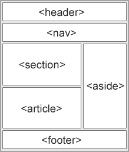

# [2024.07.29(월)] Bootstrap


# 반응형 웹

## HTML Semantics

https://www.w3schools.com/html/html5_semantic_elements.asp



## Bootstrap

학습 교재 : https://getbootstrap.com/docs/5.2/getting-started/introduction/

mobile first! (모바일을 먼저 만들고 큰 화면을 나중에 만든다)

- Browsers & devices

### JavaScript

- 4 버전까지는 jQuery를 사용했으나 5 버전부터는 jQuery를 사용하지 않는다.
- Display는 flex를 사용한다.

https://getbootstrap.com/docs/5.2/getting-started/javascript/#optionally-using-jquery

https://getbootstrap.com/docs/5.2/getting-started/introduction/#box-sizing

https://getbootstrap.com/docs/5.2/utilities/flex/

https://getbootstrap.com/docs/5.2/layout/breakpoints/#media-queries

### flexbox.html - flex 실습

https://css-tricks.com/snippets/css/a-guide-to-flexbox/#flexbox-background

```html
<!DOCTYPE html>
<html lang="en">
<head>
    <meta charset="UTF-8">
    <meta name="viewport" content="width=device-width, initial-scale=1.0">
    <title>Document</title>
    <style>
        div {
            width: 600px;
            height: 200px;
            border: 1px solid salmon;

            display: flex;
            justify-content: center;
            align-items: center;
        }
    </style>
</head>
<body>
    <div>
        <h2>제목</h2>
    </div>
    <div>
        <a href="#">링크</a><a href="#">링크</a><a href="#">링크</a><a href="#">링크</a>
    </div>
    <div>
        <span>span</span>
    </div>
</body>
</html>
```

### mediaQuery.html - box-sizing: border-box 사용

- \<style>에 *{box-sizing: border-box;}을 주지 않으면 widthrk 25% 4개로 100%인 것 같아 보이지만 padding이 있으므로 100%가 넘어간다. *{box-sizing: border-box;}를 사용하면 한 줄에 표시된다.

```html
<!DOCTYPE html>
<html lang="en">
<head>
    <meta charset="UTF-8">
    <meta name="viewport" content="width=device-width, initial-scale=1.0">
    <title>Document</title>
    <style>
        * {
            box-sizing: border-box;
        }
        .column {
            float: left;
            width: 25%;
            padding: 20px;
        }
    </style>
</head>
<body>
    <h2>Responsive Colums</h2>
    <div class="row">
        <div class="column" style="background-color: lightgray;">
            <h2>colum 1</h2>
            <p>some text...</p>
        </div>
        <div class="column" style="background-color: lightgray;">
            <h2>colum 2</h2>
            <p>some text...</p>
        </div>
        <div class="column" style="background-color: lightgray;">
            <h2>colum 3</h2>
            <p>some text...</p>
        </div>
        <div class="column" style="background-color: lightgray;">
            <h2>colum 4</h2>
            <p>some text...</p>
        </div>
    </div>
</body>
</html>
```

### mediaQuery.html - @media screen and (max-width : ~px) 사용

- 반응형 웹의 핵심으로, 각 화면의 지정된 가로 넓이마다 컨텐츠의 크기가 변경된다.

```html
<!DOCTYPE html>
<html lang="en">
<head>
    <meta charset="UTF-8">
    <!-- 모바일에서 사용할 때는 아래 <meta>가 반드시 필요한다. -->
    <meta name="viewport" content="width=device-width, initial-scale=1.0">
    <title>Document</title>
    <style>
        * {
            box-sizing: border-box;
        }
        .column {
            float: left;
            width: 25%;
            padding: 20px;
        }

        /* Media Query */
        @media screen and (max-width : 992px) {
            .column{ width: 50%; }
        }

        @media screen and (max-width : 600px) {
            .column{ width: 100%; }
        }

    </style>
</head>
<body>
    <h2>Responsive Colums</h2>
    <div class="row">
        <div class="column" style="background-color: lightgray;">
            <h2>colum 1</h2>
            <p>some text...</p>
        </div>
        <div class="column" style="background-color: lightgray;">
            <h2>colum 2</h2>
            <p>some text...</p>
        </div>
        <div class="column" style="background-color: lightgray;">
            <h2>colum 3</h2>
            <p>some text...</p>
        </div>
        <div class="column" style="background-color: lightgray;">
            <h2>colum 4</h2>
            <p>some text...</p>
        </div>
    </div>
</body>
</html>
```

### Layout

https://getbootstrap.com/docs/5.2/layout/grid/

https://getbootstrap.com/docs/5.2/layout/containers/

### components 실습

### card 실습

### CDN via jsDelivr 복사

https://getbootstrap.com/docs/5.2/getting-started/download/

```html
<link href="https://cdn.jsdelivr.net/npm/bootstrap@5.2.3/dist/css/bootstrap.min.css" rel="stylesheet" integrity="sha384-rbsA2VBKQhggwzxH7pPCaAqO46MgnOM80zW1RWuH61DGLwZJEdK2Kadq2F9CUG65" crossorigin="anonymous">
<script src="https://cdn.jsdelivr.net/npm/bootstrap@5.2.3/dist/js/bootstrap.bundle.min.js" integrity="sha384-kenU1KFdBIe4zVF0s0G1M5b4hcpxyD9F7jL+jjXkk+Q2h455rYXK/7HAuoJl+0I4" crossorigin="anonymous"></script>
```

### coards 예시 복사

https://getbootstrap.com/docs/5.2/components/card/

```html
<div class="card" style="width: 18rem;">
  
  <div class="card-body">
    <h5 class="card-title">Card title</h5>
    <p class="card-text">Some quick example text to build on the card title and make up the bulk of the card's content.</p>
    <a href="#" class="btn btn-primary">Go somewhere</a>
  </div>
</div>
```

### helloBootstrap.html

```html
<!DOCTYPE html>
<html lang="en">
<head>
    <meta charset="UTF-8">
    <meta name="viewport" content="width=device-width, initial-scale=1.0">
    <title>Document</title>
    <link href="https://cdn.jsdelivr.net/npm/bootstrap@5.2.3/dist/css/bootstrap.min.css" rel="stylesheet" integrity="sha384-rbsA2VBKQhggwzxH7pPCaAqO46MgnOM80zW1RWuH61DGLwZJEdK2Kadq2F9CUG65" crossorigin="anonymous">
    <script src="https://cdn.jsdelivr.net/npm/bootstrap@5.2.3/dist/js/bootstrap.bundle.min.js" integrity="sha384-kenU1KFdBIe4zVF0s0G1M5b4hcpxyD9F7jL+jjXkk+Q2h455rYXK/7HAuoJl+0I4" crossorigin="anonymous"></script>
</head>
<body>
    <div class="container">
        <div class="row">
            <div class="col">
                <div class="card" >
                    
                    <div class="card-body">
                      <h5 class="card-title">Card title</h5>
                      <p class="card-text">Some quick example text to build on the card title and make up the bulk of the card's content.</p>
                      <a href="#" class="btn btn-primary">Go somewhere</a>
                    </div>
                  </div>
            </div>

            <div class="col">
                <div class="card" >
                    
                    <div class="card-body">
                      <h5 class="card-title">Card title</h5>
                      <p class="card-text">Some quick example text to build on the card title and make up the bulk of the card's content.</p>
                      <a href="#" class="btn btn-primary">Go somewhere</a>
                    </div>
                  </div>
            </div>

        </div>
    </div>
    
</body>
</html>
```

### Carousel 실습

### Carousel 복사 코드

https://getbootstrap.com/docs/5.2/components/carousel/

```html
<div id="carouselExampleControls" class="carousel slide" data-bs-ride="carousel">
  <div class="carousel-inner">
    <div class="carousel-item active">
      
    </div>
    <div class="carousel-item">
      
    </div>
    <div class="carousel-item">
      
    </div>
  </div>
  <button class="carousel-control-prev" type="button" data-bs-target="#carouselExampleControls" data-bs-slide="prev">
    <span class="carousel-control-prev-icon" aria-hidden="true"></span>
    <span class="visually-hidden">Previous</span>
  </button>
  <button class="carousel-control-next" type="button" data-bs-target="#carouselExampleControls" data-bs-slide="next">
    <span class="carousel-control-next-icon" aria-hidden="true"></span>
    <span class="visually-hidden">Next</span>
  </button>
</div>
```

### helloBootstrap.html

```html
<!DOCTYPE html>
<html lang="en">
<head>
    <meta charset="UTF-8">
    <meta name="viewport" content="width=device-width, initial-scale=1.0">
    <title>Document</title>
    <link href="https://cdn.jsdelivr.net/npm/bootstrap@5.2.3/dist/css/bootstrap.min.css" rel="stylesheet" integrity="sha384-rbsA2VBKQhggwzxH7pPCaAqO46MgnOM80zW1RWuH61DGLwZJEdK2Kadq2F9CUG65" crossorigin="anonymous">
    <script src="https://cdn.jsdelivr.net/npm/bootstrap@5.2.3/dist/js/bootstrap.bundle.min.js" integrity="sha384-kenU1KFdBIe4zVF0s0G1M5b4hcpxyD9F7jL+jjXkk+Q2h455rYXK/7HAuoJl+0I4" crossorigin="anonymous"></script>
</head>
<body>
    <div class="container">
        <div id="carouselExampleControls" class="carousel slide" data-bs-ride="carousel">
            <div class="carousel-inner">
              <div class="carousel-item active">
                
              </div>
              <div class="carousel-item">
                
              </div>
              <div class="carousel-item">
                
              </div>
            </div>
            <button class="carousel-control-prev" type="button" data-bs-target="#carouselExampleControls" data-bs-slide="prev">
              <span class="carousel-control-prev-icon" aria-hidden="true"></span>
              <span class="visually-hidden">Previous</span>
            </button>
            <button class="carousel-control-next" type="button" data-bs-target="#carouselExampleControls" data-bs-slide="next">
              <span class="carousel-control-next-icon" aria-hidden="true"></span>
              <span class="visually-hidden">Next</span>
            </button>
          </div>
    </div>
    <div class="container">
        <div class="row">
            <div class="col">
                <div class="card" >
                    
                    <div class="card-body">
                      <h5 class="card-title">Card title</h5>
                      <p class="card-text">Some quick example text to build on the card title and make up the bulk of the card's content.</p>
                      <a href="#" class="btn btn-primary">Go somewhere</a>
                    </div>
                  </div>
            </div>

            <div class="col">
                <div class="card" >
                    
                    <div class="card-body">
                      <h5 class="card-title">Card title</h5>
                      <p class="card-text">Some quick example text to build on the card title and make up the bulk of the card's content.</p>
                      <a href="#" class="btn btn-primary">Go somewhere</a>
                    </div>
                  </div>
            </div>

        </div>
    </div>
    
</body>
</html>
```

### Navber 실습

### Navber 복사코드

https://getbootstrap.com/docs/5.2/components/navbar/

```html
<nav class="navbar navbar-expand-lg bg-light">
  <div class="container-fluid">
    <a class="navbar-brand" href="#">Navbar</a>
    <button class="navbar-toggler" type="button" data-bs-toggle="collapse" data-bs-target="#navbarSupportedContent" aria-controls="navbarSupportedContent" aria-expanded="false" aria-label="Toggle navigation">
      <span class="navbar-toggler-icon"></span>
    </button>
    <div class="collapse navbar-collapse" id="navbarSupportedContent">
      <ul class="navbar-nav me-auto mb-2 mb-lg-0">
        <li class="nav-item">
          <a class="nav-link active" aria-current="page" href="#">Home</a>
        </li>
        <li class="nav-item">
          <a class="nav-link" href="#">Link</a>
        </li>
        <li class="nav-item dropdown">
          <a class="nav-link dropdown-toggle" href="#" role="button" data-bs-toggle="dropdown" aria-expanded="false">
            Dropdown
          </a>
          <ul class="dropdown-menu">
            <li><a class="dropdown-item" href="#">Action</a></li>
            <li><a class="dropdown-item" href="#">Another action</a></li>
            <li><hr class="dropdown-divider"></li>
            <li><a class="dropdown-item" href="#">Something else here</a></li>
          </ul>
        </li>
        <li class="nav-item">
          <a class="nav-link disabled">Disabled</a>
        </li>
      </ul>
      <form class="d-flex" role="search">
        <input class="form-control me-2" type="search" placeholder="Search" aria-label="Search">
        <button class="btn btn-outline-success" type="submit">Search</button>
      </form>
    </div>
  </div>
</nav>
```

### helloBootstrap.html

```html
<!DOCTYPE html>
<html lang="en">
<head>
    <meta charset="UTF-8">
    <meta name="viewport" content="width=device-width, initial-scale=1.0">
    <title>Document</title>
    <link href="https://cdn.jsdelivr.net/npm/bootstrap@5.2.3/dist/css/bootstrap.min.css" rel="stylesheet" integrity="sha384-rbsA2VBKQhggwzxH7pPCaAqO46MgnOM80zW1RWuH61DGLwZJEdK2Kadq2F9CUG65" crossorigin="anonymous">
    <script src="https://cdn.jsdelivr.net/npm/bootstrap@5.2.3/dist/js/bootstrap.bundle.min.js" integrity="sha384-kenU1KFdBIe4zVF0s0G1M5b4hcpxyD9F7jL+jjXkk+Q2h455rYXK/7HAuoJl+0I4" crossorigin="anonymous"></script>
</head>
<body>
    <div class="container-fluid">
        <nav class="navbar navbar-expand-lg bg-light">
            <div class="container-fluid">
              <a class="navbar-brand" href="#">Navbar</a>
              <button class="navbar-toggler" type="button" data-bs-toggle="collapse" data-bs-target="#navbarSupportedContent" aria-controls="navbarSupportedContent" aria-expanded="false" aria-label="Toggle navigation">
                <span class="navbar-toggler-icon"></span>
              </button>
              <div class="collapse navbar-collapse" id="navbarSupportedContent">
                <ul class="navbar-nav me-auto mb-2 mb-lg-0">
                  <li class="nav-item">
                    <a class="nav-link active" aria-current="page" href="#">Home</a>
                  </li>
                  <li class="nav-item">
                    <a class="nav-link" href="#">Link</a>
                  </li>
                  <li class="nav-item dropdown">
                    <a class="nav-link dropdown-toggle" href="#" role="button" data-bs-toggle="dropdown" aria-expanded="false">
                      Dropdown
                    </a>
                    <ul class="dropdown-menu">
                      <li><a class="dropdown-item" href="#">Action</a></li>
                      <li><a class="dropdown-item" href="#">Another action</a></li>
                      <li><hr class="dropdown-divider"></li>
                      <li><a class="dropdown-item" href="#">Something else here</a></li>
                    </ul>
                  </li>
                  <li class="nav-item">
                    <a class="nav-link disabled">Disabled</a>
                  </li>
                </ul>
                <form class="d-flex" role="search">
                  <input class="form-control me-2" type="search" placeholder="Search" aria-label="Search">
                  <button class="btn btn-outline-success" type="submit">Search</button>
                </form>
              </div>
            </div>
          </nav>
    </div>
    <div class="container">
        <div id="carouselExampleControls" class="carousel slide" data-bs-ride="carousel">
            <div class="carousel-inner">
              <div class="carousel-item active">
                
              </div>
              <div class="carousel-item">
                
              </div>
              <div class="carousel-item">
                
              </div>
            </div>
            <button class="carousel-control-prev" type="button" data-bs-target="#carouselExampleControls" data-bs-slide="prev">
              <span class="carousel-control-prev-icon" aria-hidden="true"></span>
              <span class="visually-hidden">Previous</span>
            </button>
            <button class="carousel-control-next" type="button" data-bs-target="#carouselExampleControls" data-bs-slide="next">
              <span class="carousel-control-next-icon" aria-hidden="true"></span>
              <span class="visually-hidden">Next</span>
            </button>
          </div>
    </div>
    <div class="container">
        <div class="row">
            <div class="col">
                <div class="card" >
                    
                    <div class="card-body">
                      <h5 class="card-title">Card title</h5>
                      <p class="card-text">Some quick example text to build on the card title and make up the bulk of the card's content.</p>
                      <a href="#" class="btn btn-primary">Go somewhere</a>
                    </div>
                  </div>
            </div>

            <div class="col">
                <div class="card" >
                    
                    <div class="card-body">
                      <h5 class="card-title">Card title</h5>
                      <p class="card-text">Some quick example text to build on the card title and make up the bulk of the card's content.</p>
                      <a href="#" class="btn btn-primary">Go somewhere</a>
                    </div>
                  </div>
            </div>

        </div>
    </div>
    
</body>
</html>
```

### Button 실습

### Button 복사코드

```html
<button type="button" class="btn btn-primary">Primary</button>
```

### helloBootstrap.html

```html
<!DOCTYPE html>
<html lang="en">
<head>
    <meta charset="UTF-8">
    <meta name="viewport" content="width=device-width, initial-scale=1.0">
    <title>Document</title>
    <link href="https://cdn.jsdelivr.net/npm/bootstrap@5.2.3/dist/css/bootstrap.min.css" rel="stylesheet" integrity="sha384-rbsA2VBKQhggwzxH7pPCaAqO46MgnOM80zW1RWuH61DGLwZJEdK2Kadq2F9CUG65" crossorigin="anonymous">
    <script src="https://cdn.jsdelivr.net/npm/bootstrap@5.2.3/dist/js/bootstrap.bundle.min.js" integrity="sha384-kenU1KFdBIe4zVF0s0G1M5b4hcpxyD9F7jL+jjXkk+Q2h455rYXK/7HAuoJl+0I4" crossorigin="anonymous"></script>
</head>
<body>
    <div class="container-fluid">
        <nav class="navbar navbar-expand-lg bg-light">
            <div class="container-fluid">
              <a class="navbar-brand" href="#">Navbar</a>
              <button class="navbar-toggler" type="button" data-bs-toggle="collapse" data-bs-target="#navbarSupportedContent" aria-controls="navbarSupportedContent" aria-expanded="false" aria-label="Toggle navigation">
                <span class="navbar-toggler-icon"></span>
              </button>
              <div class="collapse navbar-collapse" id="navbarSupportedContent">
                <ul class="navbar-nav me-auto mb-2 mb-lg-0">
                  <li class="nav-item">
                    <a class="nav-link active" aria-current="page" href="#">Home</a>
                  </li>
                  <li class="nav-item">
                    <a class="nav-link" href="#">Link</a>
                  </li>
                  <li class="nav-item dropdown">
                    <a class="nav-link dropdown-toggle" href="#" role="button" data-bs-toggle="dropdown" aria-expanded="false">
                      Dropdown
                    </a>
                    <ul class="dropdown-menu">
                      <li><a class="dropdown-item" href="#">Action</a></li>
                      <li><a class="dropdown-item" href="#">Another action</a></li>
                      <li><hr class="dropdown-divider"></li>
                      <li><a class="dropdown-item" href="#">Something else here</a></li>
                    </ul>
                  </li>
                  <li class="nav-item">
                    <a class="nav-link disabled">Disabled</a>
                  </li>
                </ul>
                <form class="d-flex" role="search">
                  <input class="form-control me-2" type="search" placeholder="Search" aria-label="Search">
                  <button class="btn btn-outline-success" type="submit">Search</button>
                </form>
              </div>
            </div>
          </nav>
    </div>
    <div class="container">
        <div id="carouselExampleControls" class="carousel slide" data-bs-ride="carousel">
            <div class="carousel-inner">
              <div class="carousel-item active">
                
              </div>
              <div class="carousel-item">
                
              </div>
              <div class="carousel-item">
                
              </div>
            </div>
            <button class="carousel-control-prev" type="button" data-bs-target="#carouselExampleControls" data-bs-slide="prev">
              <span class="carousel-control-prev-icon" aria-hidden="true"></span>
              <span class="visually-hidden">Previous</span>
            </button>
            <button class="carousel-control-next" type="button" data-bs-target="#carouselExampleControls" data-bs-slide="next">
              <span class="carousel-control-next-icon" aria-hidden="true"></span>
              <span class="visually-hidden">Next</span>
            </button>
          </div>
    </div>
    <div class="container">
        <div class="row">
            <div class="col">
                <div class="card" >
                    
                    <div class="card-body">
                      <h5 class="card-title">Card title</h5>
                      <p class="card-text">Some quick example text to build on the card title and make up the bulk of the card's content.</p>
                      <a href="#" class="btn btn-primary">Go somewhere</a>
                      <button type="button" class="btn btn-warning">Warning</button>
                    </div>
                  </div>
            </div>

            <div class="col">
                <div class="card" >
                    
                    <div class="card-body">
                      <h5 class="card-title">Card title</h5>
                      <p class="card-text">Some quick example text to build on the card title and make up the bulk of the card's content.</p>
                      <a href="#" class="btn btn-primary">Go somewhere</a>
                      <button type="button" class="btn btn-info">info</button>
                    </div>
                  </div>
            </div>

        </div>
    </div>
    
</body>
</html>
```

### Utilities 실습

### Spacing

### helloBootstrap.html

```html
<!DOCTYPE html>
<html lang="en">
<head>
    <meta charset="UTF-8">
    <meta name="viewport" content="width=device-width, initial-scale=1.0">
    <title>Document</title>
    <link href="https://cdn.jsdelivr.net/npm/bootstrap@5.2.3/dist/css/bootstrap.min.css" rel="stylesheet" integrity="sha384-rbsA2VBKQhggwzxH7pPCaAqO46MgnOM80zW1RWuH61DGLwZJEdK2Kadq2F9CUG65" crossorigin="anonymous">
    <script src="https://cdn.jsdelivr.net/npm/bootstrap@5.2.3/dist/js/bootstrap.bundle.min.js" integrity="sha384-kenU1KFdBIe4zVF0s0G1M5b4hcpxyD9F7jL+jjXkk+Q2h455rYXK/7HAuoJl+0I4" crossorigin="anonymous"></script>
</head>
<body>
    <div class="container-fluid">
        <nav class="navbar navbar-expand-lg bg-light">
            <div class="container-fluid">
              <a class="navbar-brand" href="#">Navbar</a>
              <button class="navbar-toggler" type="button" data-bs-toggle="collapse" data-bs-target="#navbarSupportedContent" aria-controls="navbarSupportedContent" aria-expanded="false" aria-label="Toggle navigation">
                <span class="navbar-toggler-icon"></span>
              </button>
              <div class="collapse navbar-collapse" id="navbarSupportedContent">
                <ul class="navbar-nav me-auto mb-2 mb-lg-0">
                  <li class="nav-item">
                    <a class="nav-link active" aria-current="page" href="#">Home</a>
                  </li>
                  <li class="nav-item">
                    <a class="nav-link" href="#">Link</a>
                  </li>
                  <li class="nav-item dropdown">
                    <a class="nav-link dropdown-toggle" href="#" role="button" data-bs-toggle="dropdown" aria-expanded="false">
                      Dropdown
                    </a>
                    <ul class="dropdown-menu">
                      <li><a class="dropdown-item" href="#">Action</a></li>
                      <li><a class="dropdown-item" href="#">Another action</a></li>
                      <li><hr class="dropdown-divider"></li>
                      <li><a class="dropdown-item" href="#">Something else here</a></li>
                    </ul>
                  </li>
                  <li class="nav-item">
                    <a class="nav-link disabled">Disabled</a>
                  </li>
                </ul>
                <form class="d-flex" role="search">
                  <input class="form-control me-2" type="search" placeholder="Search" aria-label="Search">
                  <button class="btn btn-outline-success" type="submit">Search</button>
                </form>
              </div>
            </div>
          </nav>
    </div>
    <div class="container">
        <div id="carouselExampleControls" class="carousel slide" data-bs-ride="carousel">
            <div class="carousel-inner">
              <div class="carousel-item active">
                
              </div>
              <div class="carousel-item">
                
              </div>
              <div class="carousel-item">
                
              </div>
            </div>
            <button class="carousel-control-prev" type="button" data-bs-target="#carouselExampleControls" data-bs-slide="prev">
              <span class="carousel-control-prev-icon" aria-hidden="true"></span>
              <span class="visually-hidden">Previous</span>
            </button>
            <button class="carousel-control-next" type="button" data-bs-target="#carouselExampleControls" data-bs-slide="next">
              <span class="carousel-control-next-icon" aria-hidden="true"></span>
              <span class="visually-hidden">Next</span>
            </button>
          </div>
    </div>
    <div class="container">
        <div class="row">
            <div class="col">
                <div class="card" >
                    
                    <div class="card-body">
                      <h5 class="card-title">Card title</h5>
                      <p class="card-text ps-5">Some quick example text to build on the card title and make up the bulk of the card's content.</p>
                      <a href="#" class="btn btn-primary">Go somewhere</a>
                      <button type="button" class="btn btn-warning">Warning</button>
                    </div>
                  </div>
            </div>

            <div class="col">
                <div class="card" >
                    
                    <div class="card-body">
                      <h5 class="card-title">Card title</h5>
                      <p class="card-text">Some quick example text to build on the card title and make up the bulk of the card's content.</p>
                      <a href="#" class="btn btn-primary">Go somewhere</a>
                      <button type="button" class="btn btn-info">info</button>
                    </div>
                  </div>
            </div>

        </div>
    </div>
    
</body>
</html>
```

### Content

### Tables

### Table 복사코드

```html
<table class="table">
  <thead>
    <tr>
      <th scope="col">#</th>
      <th scope="col">First</th>
      <th scope="col">Last</th>
      <th scope="col">Handle</th>
    </tr>
  </thead>
  <tbody>
    <tr>
      <th scope="row">1</th>
      <td>Mark</td>
      <td>Otto</td>
      <td>@mdo</td>
    </tr>
    <tr>
      <th scope="row">2</th>
      <td>Jacob</td>
      <td>Thornton</td>
      <td>@fat</td>
    </tr>
    <tr>
      <th scope="row">3</th>
      <td colspan="2">Larry the Bird</td>
      <td>@twitter</td>
    </tr>
  </tbody>
</table>
```

### helloBootstrap.html

```html
<!DOCTYPE html>
<html lang="en">
<head>
    <meta charset="UTF-8">
    <meta name="viewport" content="width=device-width, initial-scale=1.0">
    <title>Document</title>
    <link href="https://cdn.jsdelivr.net/npm/bootstrap@5.2.3/dist/css/bootstrap.min.css" rel="stylesheet" integrity="sha384-rbsA2VBKQhggwzxH7pPCaAqO46MgnOM80zW1RWuH61DGLwZJEdK2Kadq2F9CUG65" crossorigin="anonymous">
    <script src="https://cdn.jsdelivr.net/npm/bootstrap@5.2.3/dist/js/bootstrap.bundle.min.js" integrity="sha384-kenU1KFdBIe4zVF0s0G1M5b4hcpxyD9F7jL+jjXkk+Q2h455rYXK/7HAuoJl+0I4" crossorigin="anonymous"></script>
</head>
<body>
    <div class="container-fluid mb-5">
        <nav class="navbar navbar-expand-lg bg-light">
            <div class="container-fluid">
              <a class="navbar-brand" href="#">Navbar</a>
              <button class="navbar-toggler" type="button" data-bs-toggle="collapse" data-bs-target="#navbarSupportedContent" aria-controls="navbarSupportedContent" aria-expanded="false" aria-label="Toggle navigation">
                <span class="navbar-toggler-icon"></span>
              </button>
              <div class="collapse navbar-collapse" id="navbarSupportedContent">
                <ul class="navbar-nav me-auto mb-2 mb-lg-0">
                  <li class="nav-item">
                    <a class="nav-link active" aria-current="page" href="#">Home</a>
                  </li>
                  <li class="nav-item">
                    <a class="nav-link" href="#">Link</a>
                  </li>
                  <li class="nav-item dropdown">
                    <a class="nav-link dropdown-toggle" href="#" role="button" data-bs-toggle="dropdown" aria-expanded="false">
                      Dropdown
                    </a>
                    <ul class="dropdown-menu">
                      <li><a class="dropdown-item" href="#">Action</a></li>
                      <li><a class="dropdown-item" href="#">Another action</a></li>
                      <li><hr class="dropdown-divider"></li>
                      <li><a class="dropdown-item" href="#">Something else here</a></li>
                    </ul>
                  </li>
                  <li class="nav-item">
                    <a class="nav-link disabled">Disabled</a>
                  </li>
                </ul>
                <form class="d-flex" role="search">
                  <input class="form-control me-2" type="search" placeholder="Search" aria-label="Search">
                  <button class="btn btn-outline-success" type="submit">Search</button>
                </form>
              </div>
            </div>
          </nav>
    </div>
    <div class="container">
        <table class="table table-dark table-hover">
            <thead>
              <tr>
                <th scope="col">#</th>
                <th scope="col">First</th>
                <th scope="col">Last</th>
                <th scope="col">Handle</th>
              </tr>
            </thead>
            <tbody>
              <tr>
                <th scope="row">1</th>
                <td>Mark</td>
                <td>Otto</td>
                <td>@mdo</td>
              </tr>
              <tr>
                <th scope="row">2</th>
                <td>Jacob</td>
                <td>Thornton</td>
                <td>@fat</td>
              </tr>
              <tr>
                <th scope="row">3</th>
                <td colspan="2">Larry the Bird</td>
                <td>@twitter</td>
              </tr>
            </tbody>
          </table>
    </div>
    <div class="container">
        <div id="carouselExampleControls" class="carousel slide" data-bs-ride="carousel">
            <div class="carousel-inner">
              <div class="carousel-item active">
                
              </div>
              <div class="carousel-item">
                
              </div>
              <div class="carousel-item">
                
              </div>
            </div>
            <button class="carousel-control-prev" type="button" data-bs-target="#carouselExampleControls" data-bs-slide="prev">
              <span class="carousel-control-prev-icon" aria-hidden="true"></span>
              <span class="visually-hidden">Previous</span>
            </button>
            <button class="carousel-control-next" type="button" data-bs-target="#carouselExampleControls" data-bs-slide="next">
              <span class="carousel-control-next-icon" aria-hidden="true"></span>
              <span class="visually-hidden">Next</span>
            </button>
          </div>
    </div>
    <div class="container">
        <div class="row">
            <div class="col">
                <div class="card" >
                    
                    <div class="card-body">
                      <h5 class="card-title">Card title</h5>
                      <p class="card-text ps-5">Some quick example text to build on the card title and make up the bulk of the card's content.</p>
                      <a href="#" class="btn btn-primary">Go somewhere</a>
                      <button type="button" class="btn btn-warning">Warning</button>
                    </div>
                  </div>
            </div>

            <div class="col">
                <div class="card" >
                    
                    <div class="card-body">
                      <h5 class="card-title">Card title</h5>
                      <p class="card-text">Some quick example text to build on the card title and make up the bulk of the card's content.</p>
                      <a href="#" class="btn btn-primary">Go somewhere</a>
                      <button type="button" class="btn btn-info">info</button>
                    </div>
                  </div>
            </div>

        </div>
    </div>
    
</body>
</html>
```

### Forms

### Form control

### Form control 복사코드

```html
<div class="mb-3">
  <label for="exampleFormControlInput1" class="form-label">Email address</label>
  <input type="email" class="form-control" id="exampleFormControlInput1" placeholder="name@example.com">
</div>
<div class="mb-3">
  <label for="exampleFormControlTextarea1" class="form-label">Example textarea</label>
  <textarea class="form-control" id="exampleFormControlTextarea1" rows="3"></textarea>
</div>
```

### helloBootstrap.html

```html
<!DOCTYPE html>
<html lang="en">
<head>
    <meta charset="UTF-8">
    <meta name="viewport" content="width=device-width, initial-scale=1.0">
    <title>Document</title>
    <link href="https://cdn.jsdelivr.net/npm/bootstrap@5.2.3/dist/css/bootstrap.min.css" rel="stylesheet" integrity="sha384-rbsA2VBKQhggwzxH7pPCaAqO46MgnOM80zW1RWuH61DGLwZJEdK2Kadq2F9CUG65" crossorigin="anonymous">
    <script src="https://cdn.jsdelivr.net/npm/bootstrap@5.2.3/dist/js/bootstrap.bundle.min.js" integrity="sha384-kenU1KFdBIe4zVF0s0G1M5b4hcpxyD9F7jL+jjXkk+Q2h455rYXK/7HAuoJl+0I4" crossorigin="anonymous"></script>
</head>
<body>
    <div class="container-fluid mb-5">
        <nav class="navbar navbar-expand-lg bg-light">
            <div class="container-fluid">
              <a class="navbar-brand" href="#">Navbar</a>
              <button class="navbar-toggler" type="button" data-bs-toggle="collapse" data-bs-target="#navbarSupportedContent" aria-controls="navbarSupportedContent" aria-expanded="false" aria-label="Toggle navigation">
                <span class="navbar-toggler-icon"></span>
              </button>
              <div class="collapse navbar-collapse" id="navbarSupportedContent">
                <ul class="navbar-nav me-auto mb-2 mb-lg-0">
                  <li class="nav-item">
                    <a class="nav-link active" aria-current="page" href="#">Home</a>
                  </li>
                  <li class="nav-item">
                    <a class="nav-link" href="#">Link</a>
                  </li>
                  <li class="nav-item dropdown">
                    <a class="nav-link dropdown-toggle" href="#" role="button" data-bs-toggle="dropdown" aria-expanded="false">
                      Dropdown
                    </a>
                    <ul class="dropdown-menu">
                      <li><a class="dropdown-item" href="#">Action</a></li>
                      <li><a class="dropdown-item" href="#">Another action</a></li>
                      <li><hr class="dropdown-divider"></li>
                      <li><a class="dropdown-item" href="#">Something else here</a></li>
                    </ul>
                  </li>
                  <li class="nav-item">
                    <a class="nav-link disabled">Disabled</a>
                  </li>
                </ul>
                <form class="d-flex" role="search">
                  <input class="form-control me-2" type="search" placeholder="Search" aria-label="Search">
                  <button class="btn btn-outline-success" type="submit">Search</button>
                </form>
              </div>
            </div>
          </nav>
    </div>

    <div class="container mb-5">
        <h2>Login 하세요</h2>
        <div class="mb-3">
            <label for="userEmail" class="form-label">Email</label>
            <input type="email" class="form-control" id="userEmail" placeholder="name@example.com">
          </div>
          <div class="mb-3">
            <label for="userPassword" class="form-label">password</label>
            <input type="password" class="form-control" id="userPassword" placeholder="********">
          </div>
          <button class="btn btn-primary">로그인</button>
    </div>

    <div class="container">
        <div class="mb-3">
            <label for="exampleFormControlInput1" class="form-label">Email address</label>
            <input type="email" class="form-control" id="exampleFormControlInput1" placeholder="name@example.com">
          </div>
          <div class="mb-3">
            <label for="exampleFormControlTextarea1" class="form-label">Example textarea</label>
            <textarea class="form-control" id="exampleFormControlTextarea1" rows="3"></textarea>
          </div>
    </div>

    <div class="container">
        <table class="table table-dark table-hover">
            <thead>
              <tr>
                <th scope="col">#</th>
                <th scope="col">First</th>
                <th scope="col">Last</th>
                <th scope="col">Handle</th>
              </tr>
            </thead>
            <tbody>
              <tr>
                <th scope="row">1</th>
                <td>Mark</td>
                <td>Otto</td>
                <td>@mdo</td>
              </tr>
              <tr>
                <th scope="row">2</th>
                <td>Jacob</td>
                <td>Thornton</td>
                <td>@fat</td>
              </tr>
              <tr>
                <th scope="row">3</th>
                <td colspan="2">Larry the Bird</td>
                <td>@twitter</td>
              </tr>
            </tbody>
          </table>
    </div>
    <div class="container">
        <div id="carouselExampleControls" class="carousel slide" data-bs-ride="carousel">
            <div class="carousel-inner">
              <div class="carousel-item active">
                
              </div>
              <div class="carousel-item">
                
              </div>
              <div class="carousel-item">
                
              </div>
            </div>
            <button class="carousel-control-prev" type="button" data-bs-target="#carouselExampleControls" data-bs-slide="prev">
              <span class="carousel-control-prev-icon" aria-hidden="true"></span>
              <span class="visually-hidden">Previous</span>
            </button>
            <button class="carousel-control-next" type="button" data-bs-target="#carouselExampleControls" data-bs-slide="next">
              <span class="carousel-control-next-icon" aria-hidden="true"></span>
              <span class="visually-hidden">Next</span>
            </button>
          </div>
    </div>
    <div class="container">
        <div class="row">
            <div class="col">
                <div class="card" >
                    
                    <div class="card-body">
                      <h5 class="card-title">Card title</h5>
                      <p class="card-text ps-5">Some quick example text to build on the card title and make up the bulk of the card's content.</p>
                      <a href="#" class="btn btn-primary">Go somewhere</a>
                      <button type="button" class="btn btn-warning">Warning</button>
                    </div>
                  </div>
            </div>

            <div class="col">
                <div class="card" >
                    
                    <div class="card-body">
                      <h5 class="card-title">Card title</h5>
                      <p class="card-text">Some quick example text to build on the card title and make up the bulk of the card's content.</p>
                      <a href="#" class="btn btn-primary">Go somewhere</a>
                      <button type="button" class="btn btn-info">info</button>
                    </div>
                  </div>
            </div>

        </div>
    </div>
    
</body>
</html>
```

### Select/Checks&radios

### Select 복사 코드

```html
<select class="form-select" aria-label="Default select example">
  <option selected>Open this select menu</option>
  <option value="1">One</option>
  <option value="2">Two</option>
  <option value="3">Three</option>
</select>
```

### Checks 복사 코드

```html
<div class="form-check">
  <input class="form-check-input" type="checkbox" value="" id="flexCheckDefault">
  <label class="form-check-label" for="flexCheckDefault">
    Default checkbox
  </label>
</div>
<div class="form-check">
  <input class="form-check-input" type="checkbox" value="" id="flexCheckChecked" checked>
  <label class="form-check-label" for="flexCheckChecked">
    Checked checkbox
  </label>
</div>
```

### radios 복사 코드

```html
<div class="form-check">
  <input class="form-check-input" type="radio" name="flexRadioDefault" id="flexRadioDefault1">
  <label class="form-check-label" for="flexRadioDefault1">
    Default radio
  </label>
</div>
<div class="form-check">
  <input class="form-check-input" type="radio" name="flexRadioDefault" id="flexRadioDefault2" checked>
  <label class="form-check-label" for="flexRadioDefault2">
    Default checked radio
  </label>
</div>
```

### helloBootstrap.html

```html
<!DOCTYPE html>
<html lang="en">
<head>
    <meta charset="UTF-8">
    <meta name="viewport" content="width=device-width, initial-scale=1.0">
    <title>Document</title>
    <link href="https://cdn.jsdelivr.net/npm/bootstrap@5.2.3/dist/css/bootstrap.min.css" rel="stylesheet" integrity="sha384-rbsA2VBKQhggwzxH7pPCaAqO46MgnOM80zW1RWuH61DGLwZJEdK2Kadq2F9CUG65" crossorigin="anonymous">
    <script src="https://cdn.jsdelivr.net/npm/bootstrap@5.2.3/dist/js/bootstrap.bundle.min.js" integrity="sha384-kenU1KFdBIe4zVF0s0G1M5b4hcpxyD9F7jL+jjXkk+Q2h455rYXK/7HAuoJl+0I4" crossorigin="anonymous"></script>
</head>
<body>
    <div class="container-fluid mb-5">
        <nav class="navbar navbar-expand-lg bg-light">
            <div class="container-fluid">
              <a class="navbar-brand" href="#">Navbar</a>
              <button class="navbar-toggler" type="button" data-bs-toggle="collapse" data-bs-target="#navbarSupportedContent" aria-controls="navbarSupportedContent" aria-expanded="false" aria-label="Toggle navigation">
                <span class="navbar-toggler-icon"></span>
              </button>
              <div class="collapse navbar-collapse" id="navbarSupportedContent">
                <ul class="navbar-nav me-auto mb-2 mb-lg-0">
                  <li class="nav-item">
                    <a class="nav-link active" aria-current="page" href="#">Home</a>
                  </li>
                  <li class="nav-item">
                    <a class="nav-link" href="#">Link</a>
                  </li>
                  <li class="nav-item dropdown">
                    <a class="nav-link dropdown-toggle" href="#" role="button" data-bs-toggle="dropdown" aria-expanded="false">
                      Dropdown
                    </a>
                    <ul class="dropdown-menu">
                      <li><a class="dropdown-item" href="#">Action</a></li>
                      <li><a class="dropdown-item" href="#">Another action</a></li>
                      <li><hr class="dropdown-divider"></li>
                      <li><a class="dropdown-item" href="#">Something else here</a></li>
                    </ul>
                  </li>
                  <li class="nav-item">
                    <a class="nav-link disabled">Disabled</a>
                  </li>
                </ul>
                <form class="d-flex" role="search">
                  <input class="form-control me-2" type="search" placeholder="Search" aria-label="Search">
                  <button class="btn btn-outline-success" type="submit">Search</button>
                </form>
              </div>
            </div>
          </nav>
    </div>

    <div class="container mb-5">
        <div class="row">
            <div class="col">
                <h2>Login 하세요</h2>
                <div class="mb-3">
                    <label for="userEmail" class="form-label">Email</label>
                    <input type="email" class="form-control" id="userEmail" placeholder="name@example.com">
                </div>
                <div class="mb-3">
                    <label for="userPassword" class="form-label">password</label>
                    <input type="password" class="form-control" id="userPassword" placeholder="********">
                </div>
                 <button class="btn btn-primary">로그인</button>
            </div>
            <div class="col">
                <h2>select</h2>
                <select class="form-select" aria-label="Default select example">
                    <option selected>Open this select menu</option>
                    <option value="1">One</option>
                    <option value="2">Two</option>
                    <option value="3">Three</option>
                  </select>
            </div>
            <div class="col">
                <h2>checkBox</h2>
                <div class="form-check">
                    <input class="form-check-input" type="checkbox" value="" id="flexCheckDefault">
                    <label class="form-check-label" for="flexCheckDefault">
                      Default checkbox
                    </label>
                  </div>
                  <div class="form-check">
                    <input class="form-check-input" type="checkbox" value="" id="flexCheckChecked" checked>
                    <label class="form-check-label" for="flexCheckChecked">
                      Checked checkbox
                    </label>
                  </div>
            </div>
            <div class="col">
                <h2>Radios</h2>
                <div class="form-check">
                    <input class="form-check-input" type="radio" name="flexRadioDefault" id="flexRadioDefault1">
                    <label class="form-check-label" for="flexRadioDefault1">
                      Default radio
                    </label>
                  </div>
                  <div class="form-check">
                    <input class="form-check-input" type="radio" name="flexRadioDefault" id="flexRadioDefault2" checked>
                    <label class="form-check-label" for="flexRadioDefault2">
                      Default checked radio
                    </label>
                  </div>
            </div>
        </div>
    </div>

    <div class="container mb-5">
        <h2>Login 하세요</h2>
        <div class="mb-3">
            <label for="userEmail" class="form-label">Email</label>
            <input type="email" class="form-control" id="userEmail" placeholder="name@example.com">
          </div>
          <div class="mb-3">
            <label for="userPassword" class="form-label">password</label>
            <input type="password" class="form-control" id="userPassword" placeholder="********">
          </div>
          <button class="btn btn-primary">로그인</button>
    </div>

    <div class="container">
        <div class="mb-3">
            <label for="exampleFormControlInput1" class="form-label">Email address</label>
            <input type="email" class="form-control" id="exampleFormControlInput1" placeholder="name@example.com">
          </div>
          <div class="mb-3">
            <label for="exampleFormControlTextarea1" class="form-label">Example textarea</label>
            <textarea class="form-control" id="exampleFormControlTextarea1" rows="3"></textarea>
          </div>
    </div>

    <div class="container">
        <table class="table table-dark table-hover">
            <thead>
              <tr>
                <th scope="col">#</th>
                <th scope="col">First</th>
                <th scope="col">Last</th>
                <th scope="col">Handle</th>
              </tr>
            </thead>
            <tbody>
              <tr>
                <th scope="row">1</th>
                <td>Mark</td>
                <td>Otto</td>
                <td>@mdo</td>
              </tr>
              <tr>
                <th scope="row">2</th>
                <td>Jacob</td>
                <td>Thornton</td>
                <td>@fat</td>
              </tr>
              <tr>
                <th scope="row">3</th>
                <td colspan="2">Larry the Bird</td>
                <td>@twitter</td>
              </tr>
            </tbody>
          </table>
    </div>
    <div class="container">
        <div id="carouselExampleControls" class="carousel slide" data-bs-ride="carousel">
            <div class="carousel-inner">
              <div class="carousel-item active">
                
              </div>
              <div class="carousel-item">
                
              </div>
              <div class="carousel-item">
                
              </div>
            </div>
            <button class="carousel-control-prev" type="button" data-bs-target="#carouselExampleControls" data-bs-slide="prev">
              <span class="carousel-control-prev-icon" aria-hidden="true"></span>
              <span class="visually-hidden">Previous</span>
            </button>
            <button class="carousel-control-next" type="button" data-bs-target="#carouselExampleControls" data-bs-slide="next">
              <span class="carousel-control-next-icon" aria-hidden="true"></span>
              <span class="visually-hidden">Next</span>
            </button>
          </div>
    </div>
    <div class="container">
        <div class="row">
            <div class="col">
                <div class="card" >
                    
                    <div class="card-body">
                      <h5 class="card-title">Card title</h5>
                      <p class="card-text ps-5">Some quick example text to build on the card title and make up the bulk of the card's content.</p>
                      <a href="#" class="btn btn-primary">Go somewhere</a>
                      <button type="button" class="btn btn-warning">Warning</button>
                    </div>
                  </div>
            </div>

            <div class="col">
                <div class="card" >
                    
                    <div class="card-body">
                      <h5 class="card-title">Card title</h5>
                      <p class="card-text">Some quick example text to build on the card title and make up the bulk of the card's content.</p>
                      <a href="#" class="btn btn-primary">Go somewhere</a>
                      <button type="button" class="btn btn-info">info</button>
                    </div>
                  </div>
            </div>

        </div>
    </div>
    
</body>
</html>
```

# 조별활동

자기소개 HTML/CSS 페이지를 Bootstrap을 활용하여 수정하기

```html
<!DOCTYPE html>
<html lang="en">
  <head>
    <meta charset="UTF-8" />
    <meta name="viewport" content="width=device-width, initial-scale=1.0" />
    <title>leedorim</title>
    <link href="https://cdn.jsdelivr.net/npm/bootstrap@5.2.3/dist/css/bootstrap.min.css" rel="stylesheet" integrity="sha384-rbsA2VBKQhggwzxH7pPCaAqO46MgnOM80zW1RWuH61DGLwZJEdK2Kadq2F9CUG65" crossorigin="anonymous">
    <script src="https://cdn.jsdelivr.net/npm/bootstrap@5.2.3/dist/js/bootstrap.bundle.min.js" integrity="sha384-kenU1KFdBIe4zVF0s0G1M5b4hcpxyD9F7jL+jjXkk+Q2h455rYXK/7HAuoJl+0I4" crossorigin="anonymous"></script>
    
    <style>
        
        .name {
            display: flex;
            justify-content: center;
            align-items: center;
        }

        .card-body {
            display: flex;
            justify-content: center;
            align-items: center;
            
        }

        .col-md-8 {
            display: flex;
            flex-direction: column;
            align-items: center;
        }

        .card {
            background-color: lightgrey;
        }

    </style>
  </head>
  <body>
    <!-- Navber -->
    <div class="container-fluid">
        <nav class="navbar navbar-expand-lg bg-light">
            <div class="container-fluid">
              <a class="navbar-brand" href="#">Navbar</a>
              <button class="navbar-toggler" type="button" data-bs-toggle="collapse" data-bs-target="#navbarNav" aria-controls="navbarNav" aria-expanded="false" aria-label="Toggle navigation">
                <span class="navbar-toggler-icon"></span>
              </button>
              <div class="collapse navbar-collapse" id="navbarNav">
                <ul class="navbar-nav">
                  <li class="nav-item">
                    <a class="nav-link active" aria-current="page" href="#">Home</a>
                  </li>
                  <li class="nav-item">
                    <a class="nav-link" href="./index.html">이도림</a>
                  </li>
                  <li class="nav-item">
                    <a class="nav-link" href="./introduction.html">최준하</a>
                  </li>
                  <li class="nav-item">
                    <a class="nav-link disabled">Disabled</a>
                  </li>
                </ul>
              </div>
            </div>
          </nav>
    </div>

    <!-- card -->
     <div class="container">
        <div class="row">
            <div class="col">
                <div class="name mt-3">
                    <h1>이도림</h1>
                </div>
                
            </div>
        </div>
        <div class="row">
            <div class="col">
                <div class="card mb-3 mt-3" >
                    <div class="row g-0">
                      <div class="col-md-4">
                        
                      </div>
                      <div class="col-md-8">
        
                        <div class="card-body">
                          <h2 class="card-title">전공</h2>
                        </div>

                        <div class="card-body">
                            <p class="card-text">컴퓨터공학과 / 금융세무학과</p>
                          </div>
        
                      </div>
                    </div>
                  </div>
            </div>
        </div>

            <div class="row">
                <div class="col">
                    <div class="card mb-3 mt-3" >
                        <div class="row g-0">
                          <div class="col-md-4">
                            
                          </div>
                          <div class="col-md-8">
            
                            <div class="card-body">
                              <h2 class="card-title">MBTI</h2>
                            </div>
    
                            <div class="card-body">
                                <p class="card-text">ISFJ</p>
                              </div>
            
                          </div>
                        </div>
                      </div>
                </div>
            </div>

                <div class="row">
                    <div class="col">
                        <div class="card mb-3 mt-3" >
                            <div class="row g-0">
                              <div class="col-md-4">
                                
                              </div>
                              <div class="col-md-8">
                
                                <div class="card-body">
                                  <h2 class="card-title">제일 좋았던 경험</h2>
                                </div>
        
                                <div class="card-body">
                                    <p class="card-text">일본 여행, 아무것도 안하고 누워있기</p>
                                  </div>
                
                              </div>
                            </div>
                          </div>
                    </div>
                </div>

                    <div class="row">
                        <div class="col">
                            <div class="card mb-3 mt-3" >
                                <div class="row g-0">
                                  <div class="col-md-4">
                                    
                                  </div>
                                  <div class="col-md-8">
                    
                                    <div class="card-body">
                                      <h2 class="card-title">요즘 취미와 관심사</h2>
                                    </div>
            
                                    <div class="card-body">
                                        <p class="card-text">헬스</p>
                                      </div>
                    
                                  </div>
                                </div>
                              </div>
                        </div>
                    </div>

                        <div class="row">
                            <div class="col">
                                <div class="card mb-3 mt-3" >
                                    <div class="row g-0">
                                      <div class="col-md-4">
                                        
                                      </div>
                                      <div class="col-md-8">
                        
                                        <div class="card-body">
                                          <h2 class="card-title">앞으로의 계획</h2>
                                        </div>
                
                                        <div class="card-body">
                                            <p class="card-text">유레카 수료 후 백엔드 개발자로 취업하기 <br>
                                                알고리즘 공부하기</p>
                                          </div>
                        
                                      </div>
                                    </div>
                                  </div>
                            </div>

        </div>

     </div>

  </body>
</html>
```