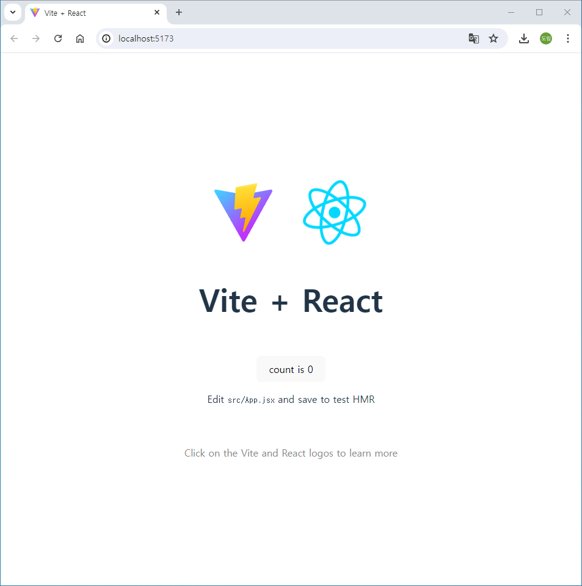
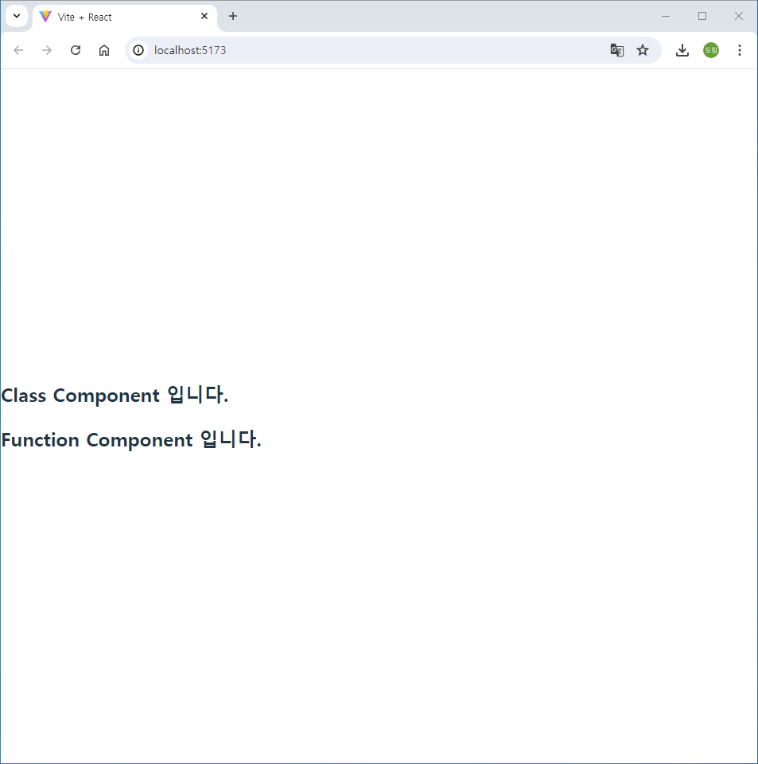
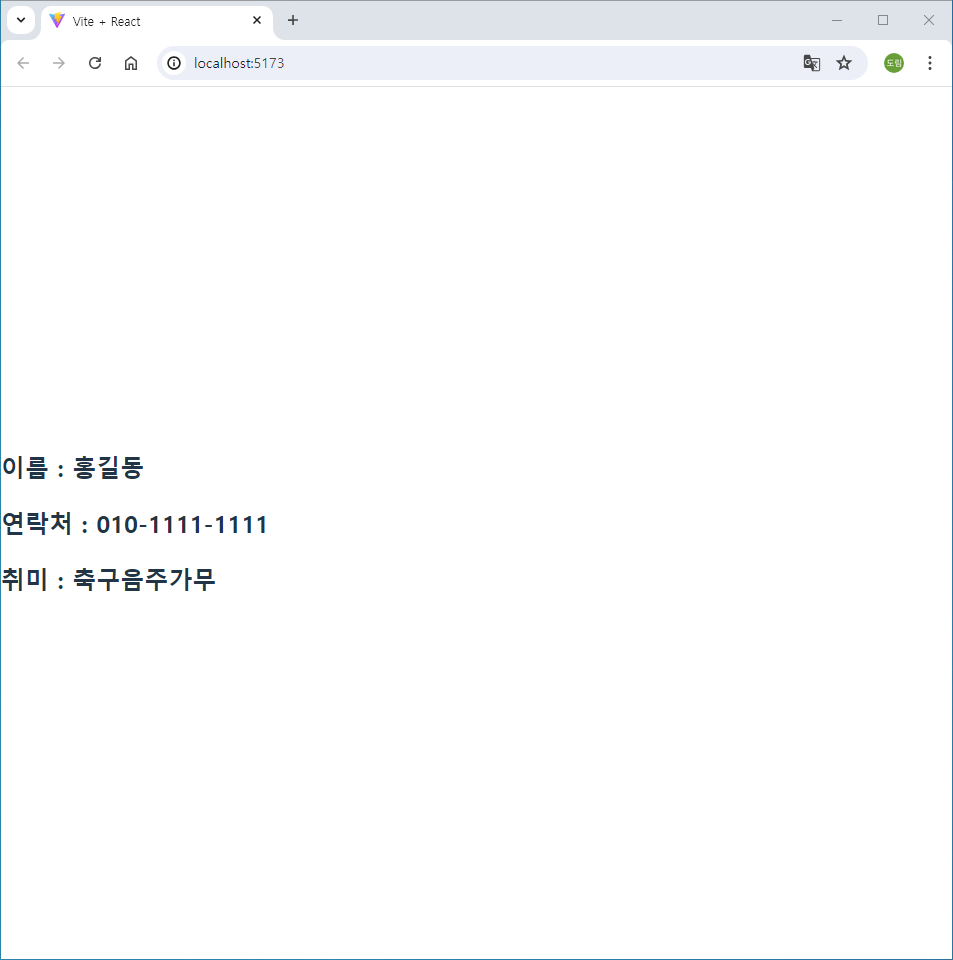
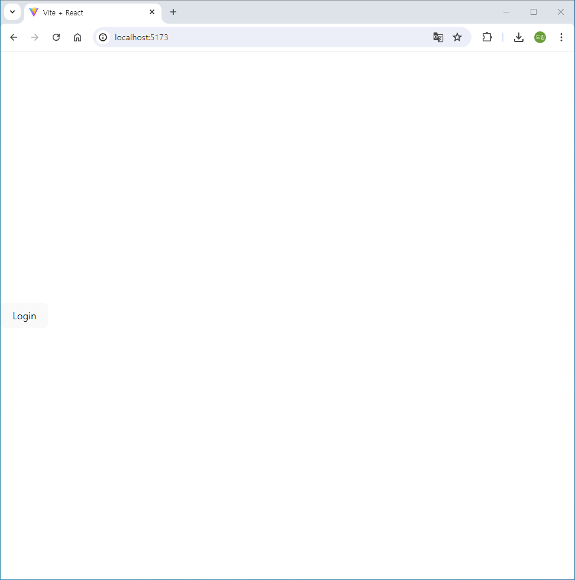
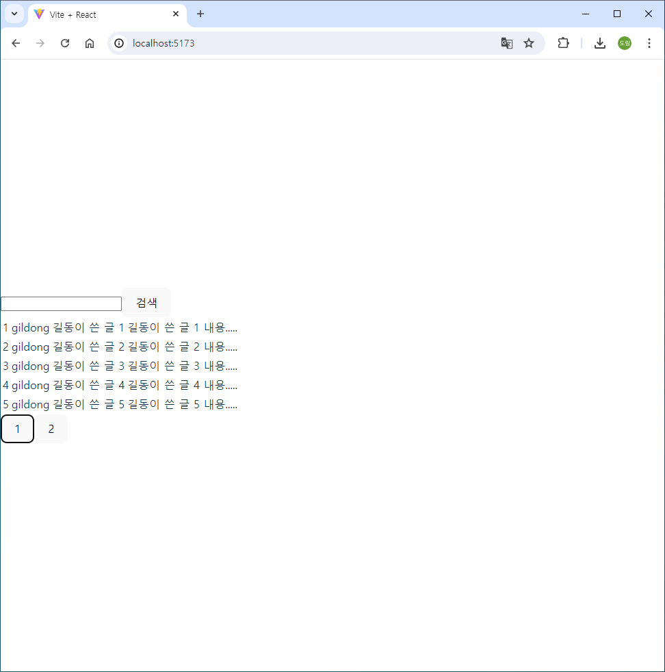
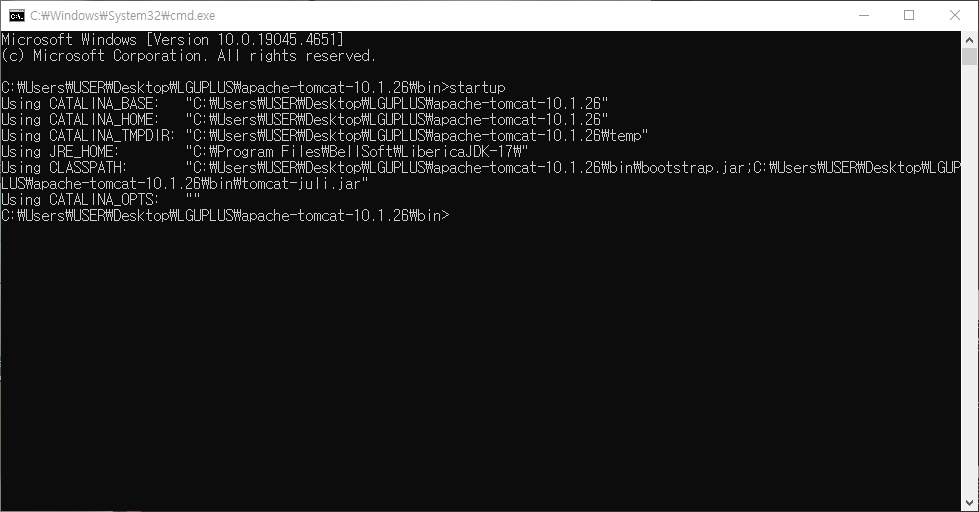
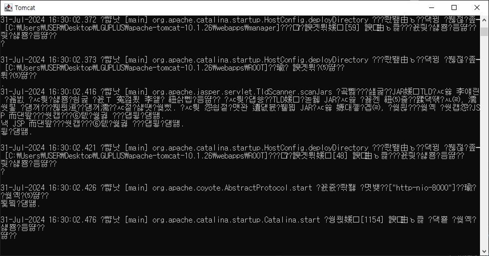
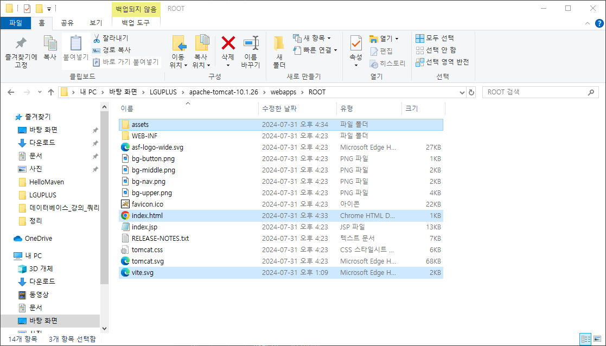
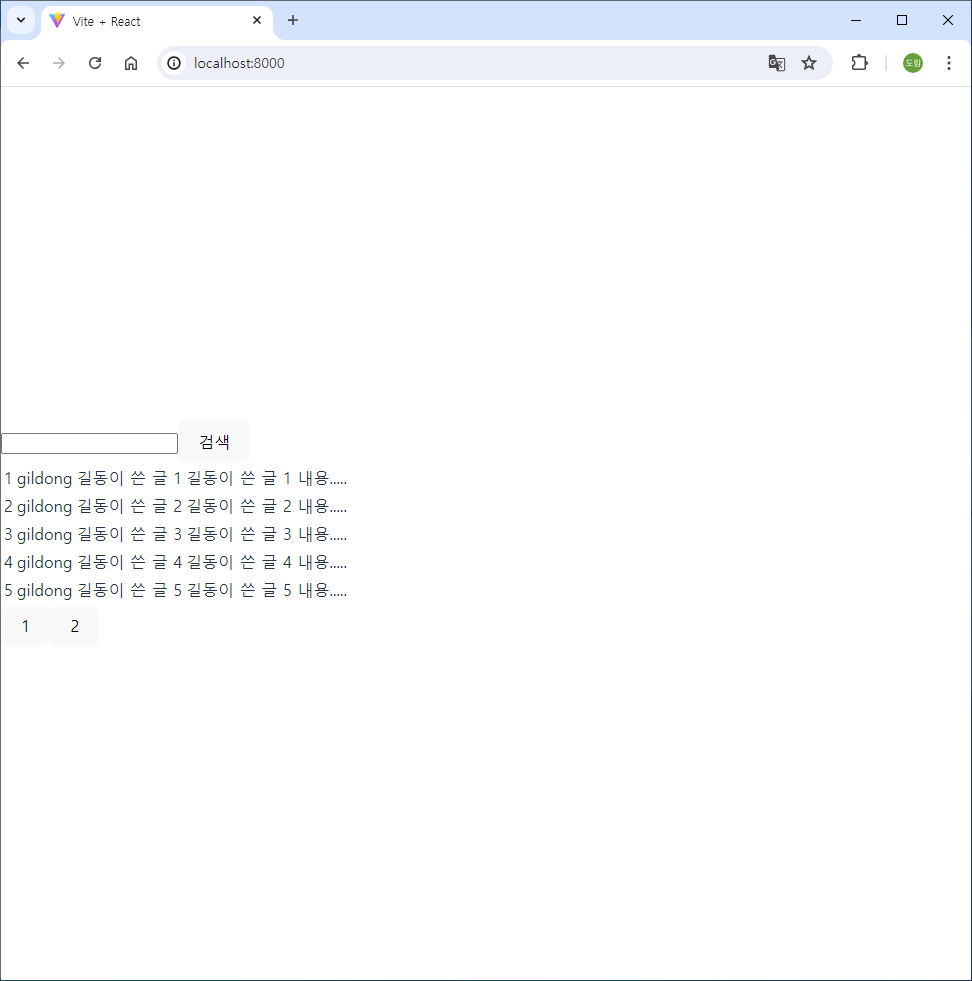

# [2024.07.31(수)] Javascript/React


# Javascript

## Form

### formElementSet.html

```html
<!DOCTYPE html>
<html lang="en">
<head>
    <meta charset="UTF-8">
    <meta name="viewport" content="width=device-width, initial-scale=1.0">
    <title>Document</title>
</head>
<body>
  <div id="container">
    <form id="registerForm" action="">
      <label for="userName">이름</label><br>
      <input id="userName" type="text"/><br>
      <label for="userEmail">e-mail</label><br>
      <input id="userEmail" type="email"/><br>
      <input id="male" type="radio" name="gender" value="M"><label for="male">남</label>
      <input id="female" type="radio" name="gender" value="F" checked><label for="female">여</label><br>
      <input id="movie" type="checkbox" name="hobby" value="movie">
      <label for="movie">영화</label>        
      <input id="sport" type="checkbox" name="hobby" value="sport" checked>
      <label for="sport">스포츠</label>
      <input id="mung" type="checkbox" name="hobby" value="mung">
      <label for="mung">멍때리기</label>
      <br>
      <label for="major">전공</label>  
      <select name="major" id="major" multiple> <!-- multiple -->
          <option value="CS">Computer Science</option>
          <option value="HI" selected>History</option>
          <option value="KL">Korean Language</option>
      </select>
      <br>
      <label for="desc">기타</label><br>
      <textarea name="desc" id="desc" cols="30" rows="10"></textarea>
    </form>
    <br>
    <label for="userData">사용자 정보</label><br>
    <input id="userData" type="text"/><br>
    <button id="setName">이름</button> <button id="setEmail">e-mail</button> <button id="setDesc">기타</button>
    <br>
    <button id="setMale">남</button> <button id="setFemale">여</button>
    <br>
    <button id="setMovieOn">영화 On</button> <button id="setMovieOff">영화 Off</button> 
    <button id="setSportOn">스포츠 On</button> <button id="setSportOff">스포츠 Off</button>
    <button id="setMungOn">멍 On</button> <button id="setMungOff">멍 Off</button>
    <button id="setHobbyAllOn">취미 전체 On</button> <button id="setHobbyAllOff">취미 전체 Off</button>
    <br>
    <button id="setCSOn">Computer Science On</button> <button id="setCSOff">Computer Science Off</button> 
    <button id="setHIOn">History On</button> <button id="setHIOff">History Off</button> 
    <button id="setKLOn">한국어 On</button> <button id="setKLOff">한국어 Off</button>
    <button id="setMajorAllOn">전공 전체 On</button> <button id="setMajorAllOff">전공 전체 Off</button>
  </div>

  <script>

    window.onload = function() {
      // 동일한 document.querySelector(All) 반복되면 => 변수로 저장, 사용

      // name, email, 기타
      document.querySelector("#setName").onclick = function() {
        document.querySelector(("#userName")).value = document.querySelector("#userData").value;
      }

      document.querySelector("#setEmail").onclick = function() {
        document.querySelector("#userEmail").value = document.querySelector("#userData").value;
      }

      document.querySelector("#setDesc").onclick = function() {
        document.querySelector("#desc").value = document.querySelector("#userData").value;
      }

      // radio
      document.querySelector("#setMale").onclick = function() {
        document.querySelector("#male").checked = true; // 배타적이므로 female은 자동으로 false
      }

      document.querySelector("#setFemale").onclick = function() {
        document.querySelector("#female").checked = true; // 배타적이므로 female은 자동으로 false
      }

      // checkbox
      // 영화
      document.querySelector("#setMovieOn").onclick = function() {
        document.querySelector(("#movie")).checked = true; // 독립적으로 true, flase
      }
      document.querySelector("#setMovieOff").onclick = function() {
        document.querySelector(("#movie")).checked = false; // 독립적으로 true, flase
      }

      // 스포츠
      document.querySelector("#setSportOn").onclick = function() {
        document.querySelector(("#sport")).checked = true; // 독립적으로 true, flase
      }
      document.querySelector("#setSportOff").onclick = function() {
        document.querySelector(("#sport")).checked = false; // 독립적으로 true, flase
      }

      // 멍
      document.querySelector("#setMungOn").onclick = function() {
        document.querySelector(("#mung")).checked = true; // 독립적으로 true, flase
      }
      document.querySelector("#setMungOff").onclick = function() {
        document.querySelector(("#mung")).checked = false; // 독립적으로 true, flase
      }

      // checkbox 전체
      document.querySelector("#setHobbyAllOn").onclick = function() {
        // 3개에 대한 각각 hardcoding 형태 <= 위 checkbox가 늘거나 줄면 함께 수정되어야 한다.
        // document.querySelector(("#movie")).checked = true;
        // document.querySelector(("#sport")).checked = true; 
        // document.querySelector(("#mung")).checked = true;
        document.querySelectorAll("input[name='hobby']").forEach( el => el.checked = true );
      }

      document.querySelector("#setHobbyAllOff").onclick = function() {
        document.querySelectorAll("input[name='hobby']").forEach( el => el.checked = false );
      }

      // select option
      document.querySelector("#setCSOn").onclick = function() {
        document.querySelector(("#major option[value='CS']")).selected = true;
      }

      document.querySelector("#setCSOff").onclick = function() {
        document.querySelector(("#major option[value='CS']")).selected = false;
      }

      document.querySelector("#setHIOn").onclick = function() {
        document.querySelector(("#major option[value='HI']")).selected = true;
      }

      document.querySelector("#setHIOff").onclick = function() {
        document.querySelector(("#major option[value='HI']")).selected = false;
      }

      document.querySelector("#setKLOn").onclick = function() {
        document.querySelector(("#major option[value='KL']")).selected = true;
      }

      document.querySelector("#setKLOff").onclick = function() {
        document.querySelector(("#major option[value='KL']")).selected = false;
      }

      // select 전체
      document.querySelector("#setMajorAllOn").onclick = function() {
        document.querySelectorAll(("#major option")).forEach( el => el.selected = true );
      }

      document.querySelector("#setMajorAllOff").onclick = function() {
        document.querySelectorAll(("#major option")).forEach( el => el.selected = false );
      }

    }

  </script>
</body>
</html>
```

## es6

### 3dot(…)

### rest operator

### 3dot.html

```html
<!DOCTYPE html>
<html lang="en">
<head>
    <meta charset="UTF-8">
    <meta name="viewport" content="width=device-width, initial-scale=1.0">
    <title>Document</title>
</head>
<body>
     <script>
        
        // ...
        // rest operator ( 나머지를 받아주는 ... )
        // {
        //     let obj = { a : 1, b : 2, c : 3 }
        //     let obj2 = obj;
        //     console.log(obj2);  // { a : 1, b : 2, c : 3 }
        //     obj.b = 4;
        //     console.log(obj2);  // { a : 1, b : 4, c : 3 }
        //     // { a : 1, b : 2, c : 3 } 객체를 obj와 obj2가 동시에 가리키고 있다.
        // }

        // {
        //     let obj = { a : 1, b : 2, c : 3 }
        //     let {...obj2} = obj;  // 객체 복사
        //     console.log(obj2);  // { a : 1, b : 2, c : 3 }
        //     obj.b = 4;
        //     console.log(obj2);  // { a : 1, b : 2, c : 3 }
        // }

        // {
        //     let obj = { a : 1, b : 2, c : 3, d : "4" }
        //     let {a, b, ...obj2} = obj;  // 객체 복사
        //     console.log(a, b, obj2);  // 1 2 {c : 3, d : '4'}
        // }

        // {
        //     let obj = { a : 1, b : 2, c : 3, d : "4" }
        //     let {a, c, f, ...obj2} = obj;  // 객체 복사
        //     console.log(a, c, f, obj2);  // 1 3 undefined {b : 2, d : '4'}
        // }

        {
            let arr = ['a', 'b', 'c', 'd', 'e'];
            let [a, c, f, ...arr2] = arr;  // 객체 복사
            console.log(a, c, f, arr2);  // a b c ['d', 'e']
        }

     </script>
</body>
</html>
```

### spread operator

### 3dot.html

```html
<!DOCTYPE html>
<html lang="en">
<head>
    <meta charset="UTF-8">
    <meta name="viewport" content="width=device-width, initial-scale=1.0">
    <title>Document</title>
</head>
<body>
     <script>
        
        // ...

        // spread operator (합치면서 덮어쓰는 ...)
        // {
        //     // object
        //     // object spread operator는 프로퍼티가 있으면 덮어쓰고, 없으면 뒤에 추가한다.

        //     let o1 = { name : "홍길동", phone : "010-1111-1111", age : 30 };
        //     let o2 = { phone : "010-2222-2222", age : 20 };
        //     let o3 = { phone : "010-3333-3333" };

        //     let o4 = {...o1, ...o2};
        //     console.log(o4);  // {name: '홍길동', phone: '010-2222-2222', age: 20}

        //     let o5 = {...o2, ...o1};
        //     console.log(o5);  // {phone: '010-1111-1111', age: 30, name: '홍길동'}

        //     let o6 = {...o2, ...o1, ...o3};
        //     console.log(o6);  // {phone: '010-3333-3333', age: 30, name: '홍길동'}
        // }

        {
            //array
            let nums = [1, 2, 3, 4, 5];
            let nums2 = [3, 4, 5, 6, 7];

            let nums3 = [...nums, ...nums2];
            console.log(nums3);  // [1, 2, 3, 4, 5, 3, 4, 5, 6, 7];

            let nums4 = nums + nums2;
            console.log(nums4);  // 1,2,3,4,53,4,5,6,7
            console.log( typeof nums4 );  //string
        }

     </script>
</body>
</html>
```

### 구조 분해 할당

### distructuring.html

```html
<!DOCTYPE html>
<html lang="en">
<head>
    <meta charset="UTF-8">
    <meta name="viewport" content="width=device-width, initial-scale=1.0">
    <title>Document</title>
</head>
<body>
    <script>
     
     // object, array의 구조를 그대로 유지하는게 아니라, 
     // object의 property, array의 index 기반으로 분해, 다른 변수에 할당

        {
            let nums = [1, 2, 3, 4, 5];
            let a = nums[0];
            let b = nums[1];
        }

        {
            let nums = [1, 2, 3, 4, 5];
            let [a, b, c, d, e] = nums;
            console.log(a, b, c, d, e);  // 1 2 3 4 5
        }

        {
            let nums = [1, 2, 3, 4, 5];
            let [a, b, c] = nums;
            console.log(a, b, c);  // 1 2 3
        }

        {
            let nums = [1, 2, 3, 4, 5];
            let [a, b, c, ...d] = nums;
            console.log(a, b, c, d);  // 1 2 3 [4, 5]
        }

        {
            let [a, b, c, ...d] = [1, 2];
            console.log(a, b, c, d);  // 1 2 undefined []
        }

        {
            let [a, b, c = 10] = [1, 2];
            console.log(a, b, c);  // 1 2 10
        }

        {
            let a = 'A';
            let b = 'B';

            [a, b] = [b, a]; // 오른 쪽은 b, a로 구성도니 배열, 왼쪽은 구조분해할당 구조이다.
            console.log( a, b);  // B A
        }

        {
            let a = 'A';
            let b = 'B';
            let c = 'C';

            [b, c, a] = [a, b, c]; // 오른 쪽은 b, a로 구성도니 배열, 왼쪽은 구조분해할당 구조이다.
            console.log( a, b, c);  // C A B
        }

     </script>
</body>
</html>
```

### 객체의 구조 분해 할당

https://developer.mozilla.org/ko/docs/Learn/JavaScript/Objects/JSON

### fetchResult.json

```json
{
  "squadName": "Super hero squad",
  "homeTown": "Metro City",
  "formed": 2016,
  "secretBase": "Super tower",
  "active": true,
  "members": [
    {
      "name": "Molecule Man",
      "age": 29,
      "secretIdentity": "Dan Jukes",
      "powers": ["Radiation resistance", "Turning tiny", "Radiation blast"]
    },
    {
      "name": "Madame Uppercut",
      "age": 39,
      "secretIdentity": "Jane Wilson",
      "powers": [
        "Million tonne punch",
        "Damage resistance",
        "Superhuman reflexes"
      ]
    },
    {
      "name": "Eternal Flame",
      "age": 1000000,
      "secretIdentity": "Unknown",
      "powers": [
        "Immortality",
        "Heat Immunity",
        "Inferno",
        "Teleportation",
        "Interdimensional travel"
      ]
    }
  ]
}
```

### distructuring.html

```html
<!DOCTYPE html>
<html lang="en">
<head>
    <meta charset="UTF-8">
    <meta name="viewport" content="width=device-width, initial-scale=1.0">
    <title>Document</title>
</head>
<body>
    <script>
     
     // object, array의 구조를 그대로 유지하는게 아니라, 
     // object의 property, array의 index 기반으로 분해, 다른 변수에 할당

        // 객체 구조 분해 할당
        {
            let o1 = { name : "홍길동", phone : "010-1111-1111", age : 30 };

            // 오른쪽의 property명과 a, b가 다르다.
            let { a, b } = o1;
            console.log( a, b );  // undefined undefined
        }

        {
            let o1 = { name : "홍길동", phone : "010-1111-1111", age : 30 };

            // 객체를 구조 분해 할당할 때는 property명을 맞춰줘야 한다.
            let { name, age } = o1;
            console.log( name, age );  // 홍길동 30
        }

        {
            // 복잡한 구조의 객체에서 필요한 일부 항목만 필요한 경우 <= 백엔드의 data를 처리
            let o1 = { 
                name : "홍길동", 
                phone : "010-1111-1111", 
                age : 30, 
                hobby : { count : 10, names : ['축구', '음주'] }
             };

            let { hobby } = o1;
            console.log( hobby );  // {count: 10, names: ['축구', '음주']}
        }

        // async function getJson() {
        //     let response = await fetch("./fetchResult.json"); // response는 프로미스 기반의 객체이다.
        //     let data = await response.json(); // json화 시킨다.
        //     console.log(data);  // {squadName: 'Super hero squad', homeTown: 'Metro City', formed: 2016, secretBase: 'Super tower', active: true, …}

        //     let { members } = data;
        //     console.log(members);  // [{name: 'Molecule Man', age: 29, secretIdentity: 'Dan Jukes', powers: Array(3)}, {name: 'Madame Uppercut', age: 39, ...}, {…}]
        // }

        async function getJson() {
            let response = await fetch("./fetchResult.json"); // response는 프로미스 기반의 객체이다.
            let { members } = await response.json(); // json화 시킨다.
            console.log(members);  // [{name: 'Molecule Man', age: 29, secretIdentity: 'Dan Jukes', powers: Array(3)}, {name: 'Madame Uppercut', age: 39, ...}, {…}]
        }

        getJson();  

     </script>
</body>
</html>
```

# React

- node.js download : https://nodejs.org/en/download/prebuilt-installer
    
    (Prebuilt installer로 다운로드)
    
    ### node.js 다운로드 확인 방법
    
    - Window + R → cmd
    
    ```java
    C:\Users\USER>node
    Welcome to Node.js v22.5.1.
    Type ".help" for more information.
    >
    ```
    

## React 프로젝트 생성 방법

1. 파일 탐색기 경로 ‘C:\Users\USER\Desktop\LGUPLUS\04_FRONT\React’에서 cmd open
    
    ```java
    C:\Users\USER\Desktop\LGUPLUS\04_FRONT\React>**npm create vite@latest**
    
    > npx
    > create-vite
    
    √ Project name: ... **react-basic**
    √ Select a framework: » **React**
    √ Select a variant: » **JavaScript**
    
    Scaffolding project in C:\Users\USER\Desktop\LGUPLUS\04_FRONT\React\react-basic1...
    
    Done. Now run:
    
      cd react-basic1
      npm install
      npm run dev
    
    C:\Users\USER\Desktop\LGUPLUS\04_FRONT\React>
    ```
    
2. vs code를 Folder 경로 ‘C:\Users\USER\Desktop\LGUPLUS\04_FRONT\React’로 열기
3. vs code에서 Terminal → new Terminal → +옆에 토글 표시 → command prompt 선택
    
    (npm install 명령어를 수행하면 react-basic 폴더 안에 node_modules 폴더가 생기고 자동으로 install된다.)
    
    ```java
    Microsoft Windows [Version 10.0.19045.4651]
    (c) Microsoft Corporation. All rights reserved.
    
    C:\Users\USER\Desktop\LGUPLUS\04_FRONT\React>**cd react-basic**
    
    C:\Users\USER\Desktop\LGUPLUS\04_FRONT\React\react-basic>**npm install**
    npm warn deprecated inflight@1.0.6: This module is not supported, and leaks memory. Do not use it. Check out lru-cache if you want a good and tested way to coalesce async requests by a key value, which is much more comprehensive and powerful.
    npm warn deprecated @humanwhocodes/config-array@0.11.14: Use @eslint/config-array instead
    npm warn deprecated rimraf@3.0.2: Rimraf versions prior to v4 are no longer supported
    npm warn deprecated glob@7.2.3: Glob versions prior to v9 are no longer supported
    npm warn deprecated @humanwhocodes/object-schema@2.0.3: Use @eslint/object-schema instead
    
    added 273 packages, and audited 274 packages in 13s
    
    102 packages are looking for funding
      run `npm fund` for details
    
    found 0 vulnerabilities
    
    C:\Users\USER\Desktop\LGUPLUS\04_FRONT\React\react-basic>**npm run dev**
    
    > react-basic1@0.0.0 dev
    > vite
    
      VITE v5.3.5  ready in 244 ms
    
      ➜  Local:   **http://localhost:5173/**
      ➜  Network: use --host to expose
      ➜  press h + enter to show help
    ```
    
4. “**http://localhost:5173/**”을 ‘control+클릭’하여 open → 기본 제공 페이지 확인
    
    
    

## React 실습

### React 웹 페이지 화면 수정

### REACT/react-basic/src/App.jsx

```java
import { useState } from 'react'
import './App.css'

function App() {
  const [count, setCount] = useState(0)

  return (
    <>
      <h1>안녕하세요! react!!!</h1>
    </>
  )
}

export default App

```

### 하나의 화면(view)에 여러 개의 컴포넌트 표시하기

### REACT/react-basic/src/components

### ClassComponent.jsx

```java
import { Component } from "react";

class ClassComponent extends Component {
    render() {
        return (
            <div>
                <h2>Class Component 입니다.</h2>
            </div>
        )
    }
}

export default ClassComponent;
```

### FunctionComponent.jsx

```java
function FunctionComponent() {
    return (
        <div>
            <h2>Function Component 입니다.</h2>
        </div>
    )
}

export default FunctionComponent;
```

### REACT/react-basic/src/views/componentTwoWay.jsx

```java
// ClassComponent, FunctionComponent 2개 하위 컴포넌트 사용
import ClassComponent from "../components/ClassComponent";
import FunctionComponent from "../components/FunctionComponent";

function ComponentTwoWay() {
    return (
        <>
            <ClassComponent/>
            <FunctionComponent/>
        </>
    )
}

export default ComponentTwoWay;
```

### REACT/react-basic/src/App.jsx

```java
import ComponentTwoWay from "./views/componentTwoWay"

function App() {

  return (
    <>
      <ComponentTwoWay/>
    </>
  )
}

export default App
```

### 실행 결과



### Props 실습

- Props는 부모 컴포넌트가 자식 컴포넌트에게 전달하는 값이다.
    
    https://velog.io/@minew1995/React-Props-프롭스
    
- 자바스크립트 배열 처리 방법
예시 배열 : [1, 2, 3]
1. forEach(el => )   // 원본 사용
2. map(el)   // 복제를 만들어 사용 (새로운 배열을 생성한다.)
=> forEach보다 map을 주로 사용한다.

### REACT/react-basic/src/components/ComponentWithProps.jsx

```java
function ComponentWithProps(props) {
    return (
        <>
            <h2>이름 : { props.persion.name }</h2>
            <h2>연락처 : { props.persion.phone }</h2>
            <h2>취미 : { props.persion.hobby.map( (el, index) => <span key={index}>{el}</span> ) }</h2>
        </>
    )
}

export default ComponentWithProps;

// 자바스크립트 배열 처리 방법
// [1, 2, 3]
// 1. forEach(el => )   // 원본 사용
// 2. map(el)   // 복제를 만들어 사용 (새로운 배열을 생성한다.)
// => forEach보다 map을 주로 사용한다.
```

### REACT/react-basic/src/views/ComponentProps.jsx

```java
// data를 가지고 있고 이 data를 하위 컴포넌트에 전달하여 하위 컴포넌트에서 사용하도록 하고 싶다.
import ComponentWithProps from "../components/ComponentWithProps";

const obj = {
    name : '홍길동',
    phone : '010-1111-1111',
    hobby : [ '축구', '음주', '가무' ]
}

function ComponentProps() {
    return (
        <ComponentWithProps persion={obj} />
    )
}

export default ComponentProps;
```

### REACT/react-basic/src/App.jsx

```java
import ComponentTwoWay from "./views/ComponentTwoWay"
import ComponentProps from "./views/ComponentProps"

function App() {

  return (
    <>
      {/* {<ComponentTwoWay/>} */}
      <ComponentProps/>
    </>
  )
}

export default App
```

### 실행 결과



### 로그인 상태에 따라 login/logout  버튼 보여주기

### REACT/react-basic/src/components/

### LoginComponent.jsx

```java
export default function LoginComponent( {fromChild} ) {
    return (
        <>
            <button onClick={ () => fromChild(true) }>Login</button>
        </>
    )
}
```

### LogoutComponent.jsx

```java
export default function LogoutComponent( {fromChild} ) {
    return (
        <>
            <button onClick={ () => fromChild(false) }>Logout</button>
        </>
    )
}
```

### REACT/react-basic/src/views/LoginLogout.jsx

```java
// 로그인, 로그아웃 버튼 2개를 하위 컴포넌트로 가진다.
// isLogin 상태를 관리 <= useState() 리액트 제공 함수(api) 사용
import { useState } from "react"
import LoginComponent from "../components/LoginComponent"
import LogoutComponent from "../components/LogoutComponent"

export default function LoginLogout() {

    // const [isLogin] = useState(true);
    const [isLogin, setIsLogin] = useState(false);

    const changeLoginout = (flag) => {
        console.log(flag);
        setIsLogin(flag);
    }

    return (
        <>
            {
                isLogin === true ? <LogoutComponent  fromChild={changeLoginout}/> : <LoginComponent fromChild={changeLoginout}/>
            }
        </>
    )
}
```

### REACT/react-basic/src/App.jsx

```java
import ComponentTwoWay from "./views/ComponentTwoWay"
import ComponentProps from "./views/ComponentProps"
import LoginLogout from "./views/LoginLogout"
import BoardView from "./views/BoardView"

function App() {

  return (
    <>
      {/* {<ComponentTwoWay/>} */}
      {/* {<ComponentProps/>} */}
      { {<LoginLogout/>} }
    </>
  )
}

export default App
```

### 실행 결과



### 게시판 목록 실습

### REACT/react-basic/src/components/

### BoardSearch.jsx

```java
import { useState } from "react"

export default function BoardSearch() {
    // 검색어

    const [searchWord, setSearchWord] = useState('');

    const handleChange = (e) => {
        setSearchWord( e.target.value );
    }

    const search = () => {
        alert(searchWord);
    }

    return (
        <>
            <input type="text" onChange={handleChange}/>
            <button onClick={search}>검색</button>
        </>
    )
}
```

### BoardList.jsx

```java
import BoardItem from "./BoardItem"

export default function BoardList(props){
    return(
        <table>
            <tbody>
                {
                    //props.boardList.map( boardItem => <BoardItem key={boardItem.boardId} item={boardItem}/>)
                    props.boardList.map( boardItem => <BoardItem key={boardItem.boardId} item={boardItem}/>)
                }
            </tbody>
        </table>
    )
}
```

### BoardItem.jsx

```java
export default function BoardItem(props){
    return (
        <tr>
            <td>{props.item.boardId}</td>
            <td>{props.item.userId}</td>
            <td>{props.item.title}</td>
            <td>{props.item.content}</td>
        </tr>
    )
}
```

### BoardPagination.jsx

```java
export default function BoardPagination( {movePage} ) {
    return (
        <>
            <button onClick={ () => { movePage(1) } }>1</button>
            <button onClick={ () => { movePage(2) } }>2</button>
        </>
    )
}
```

### REACT/react-basic/src/views/BoardView.jsx

```java
import { useState, useEffect } from "react";
import BoardSearch from "../components/BoardSearch"
import BoardList from "../components/BoardList"
import BoardPagination from "../components/BoardPagination"

export default function BoardView() {
    // 게시판 목록을 관리하는 상태
    const [boardList, setBoardList] = useState([]);

    // 백엔드로부터 받은 게시판 목록 데이터 1, 2
    const data1 = [
        {
          boardId: 1,
          userId: "gildong",
          title: "길동이 쓴 글 1",
          content: "길동이 쓴 글 1 내용.....",
        },
        {
          boardId: 2,
          userId: "gildong",
          title: "길동이 쓴 글 2",
          content: "길동이 쓴 글 2 내용.....",
        },
        {
          boardId: 3,
          userId: "gildong",
          title: "길동이 쓴 글 3",
          content: "길동이 쓴 글 3 내용.....",
        },
        {
          boardId: 4,
          userId: "gildong",
          title: "길동이 쓴 글 4",
          content: "길동이 쓴 글 4 내용.....",
        },
        {
          boardId: 5,
          userId: "gildong",
          title: "길동이 쓴 글 5",
          content: "길동이 쓴 글 5 내용.....",
        },
      ];
      const data2 = [
        {
          boardId: 6,
          userId: "gildong",
          title: "길동이 쓴 글 6",
          content: "길동이 쓴 글 6 내용.....",
        },
        {
          boardId: 7,
          userId: "gildong",
          title: "길동이 쓴 글 7",
          content: "길동이 쓴 글 7 내용.....",
        },
        {
          boardId: 8,
          userId: "gildong",
          title: "길동이 쓴 글 8",
          content: "길동이 쓴 글 8 내용.....",
        },
        {
          boardId: 9,
          userId: "gildong",
          title: "길동이 쓴 글 9",
          content: "길동이 쓴 글 9 내용.....",
        },
        {
          boardId: 10,
          userId: "gildong",
          title: "길동이 쓴 글 10",
          content: "길동이 쓴 글 10 내용.....",
        },
      ];

      useEffect( () => {
        setBoardList(data1);
      }, []);

      const movePage = (no) => {
        if( no == 1 ) {
            setBoardList(data1);
        } else if ( no == 2 ) {
            setBoardList(data2);
        }
      }

    return (
        <>  
            <BoardSearch/>
            <BoardList boardList={boardList}/>
            <BoardPagination movePage={movePage}/>
        </>
    )
}
```

### REACT/react-basic/src/App.jsx

```java
import ComponentTwoWay from "./views/ComponentTwoWay"
import ComponentProps from "./views/ComponentProps"
import LoginLogout from "./views/LoginLogout"
import BoardView from "./views/BoardView"

function App() {

  return (
    <>
      {/* {<ComponentTwoWay/>} */}
      {/* {<ComponentProps/>} */}
      {/* {<LoginLogout/>} */}
      {<BoardView/>}
    </>
  )
}

export default App
```

### 실행 결과



### 톰켓에서 리액트 프로젝트 실행하기

1. 톰켓 version 10 설치 후 압축 풀기
    
    https://tomcat.apache.org/download-10.cgi
    
2. 파일탐색기 경로 ‘C:\Users\USER\Desktop\LGUPLUS\apache-tomcat-10.1.26\bin’에서 cmd 열기
3. startup 명령어로 tomcat 실행하기
    
    
    
    
    
4. 크롬에서 ‘http://localhost:8080/’ 실행 
    - tomcat port 8080으로 실행하면 oracle과 겹쳐서 tomcat port 수정 후 ‘http://localhost:8000/’로 실행
    
    https://technote-mezza.tistory.com/27
    
5. vs code Terminal에서 ‘control+c’로 작업 종료 후 ‘npm run build’ 명령어로 작업 파일 만들기
    - ‘npm run build’ 명령어를 수행하면 react-basic 폴더 안에 dist 폴더가 만들어 진다.
    
    ```java
    일괄 작업을 끝내시겠습니까 (Y/N)? y
    
    C:\Users\USER\Desktop\LGUPLUS\04_FRONT\React\react-basic>npm run build
    
    > react-basic@0.0.0 build
    > vite build
    
    vite v5.3.5 building for production...
    ✓ 44 modules transformed.
    dist/index.html                   0.46 kB │ gzip:  0.29 kB
    dist/assets/index-BPvgi06w.css    0.92 kB │ gzip:  0.50 kB
    dist/assets/index-BCj7-PbQ.js   144.33 kB │ gzip: 46.31 kB
    ✓ built in 563ms
    
    C:\Users\USER\Desktop\LGUPLUS\04_FRONT\React\react-basic>
    ```
    
6. dist 폴더 안에 생성된  ‘assets ‘폴더, index.html, vite.svg 3개를 톰켓의 ‘C:\Users\USER\Desktop\LGUPLUS\apache-tomcat-10.1.26\webapps\ROOT’ 경로로 복사한다.
    
    
    
7. 크롬에서 ‘http://localhost:8000/’로 실행하여 프로젝트가 잘 나오는지 확인
    
    