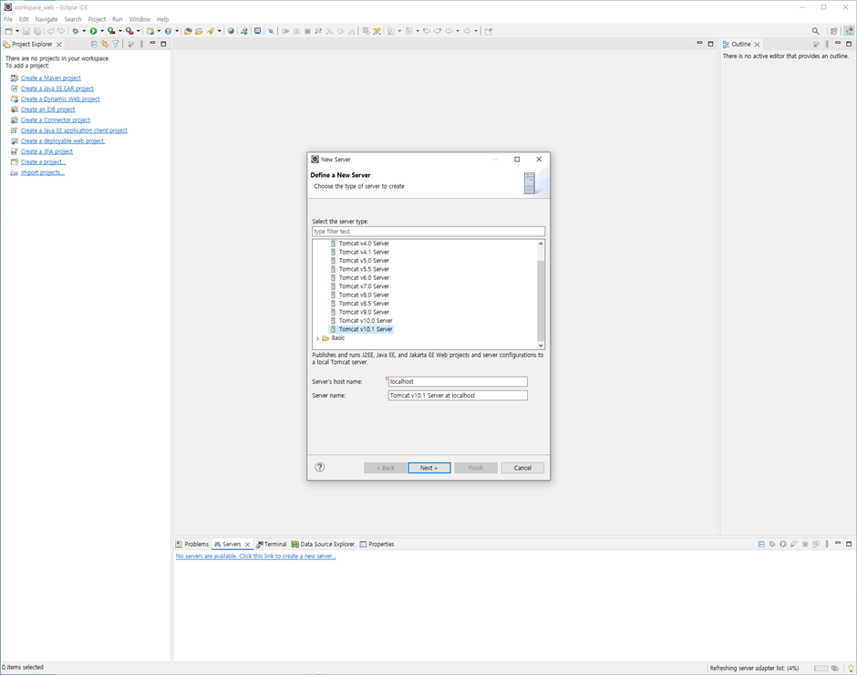
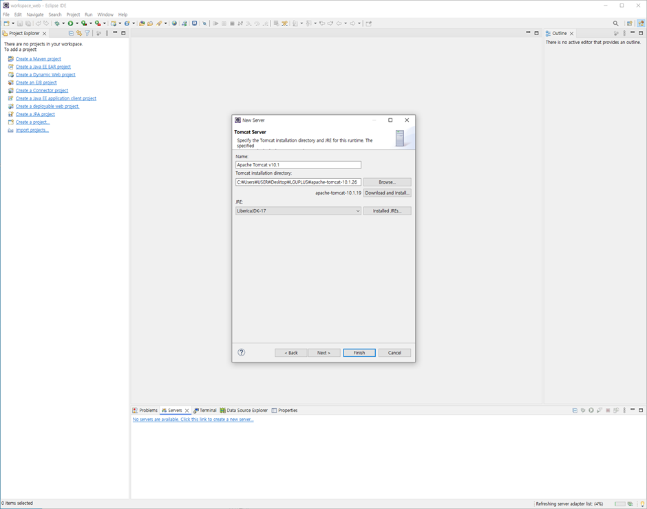
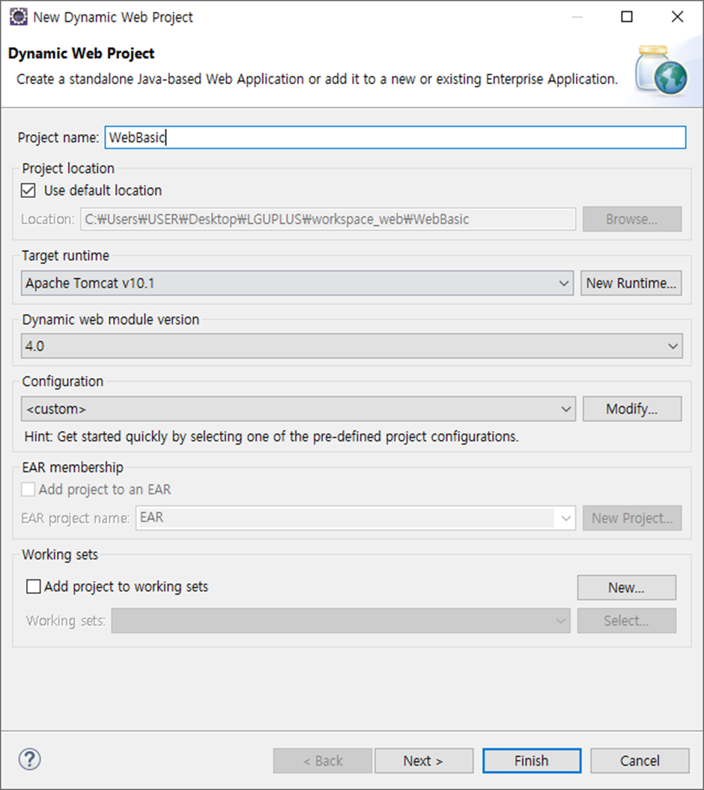
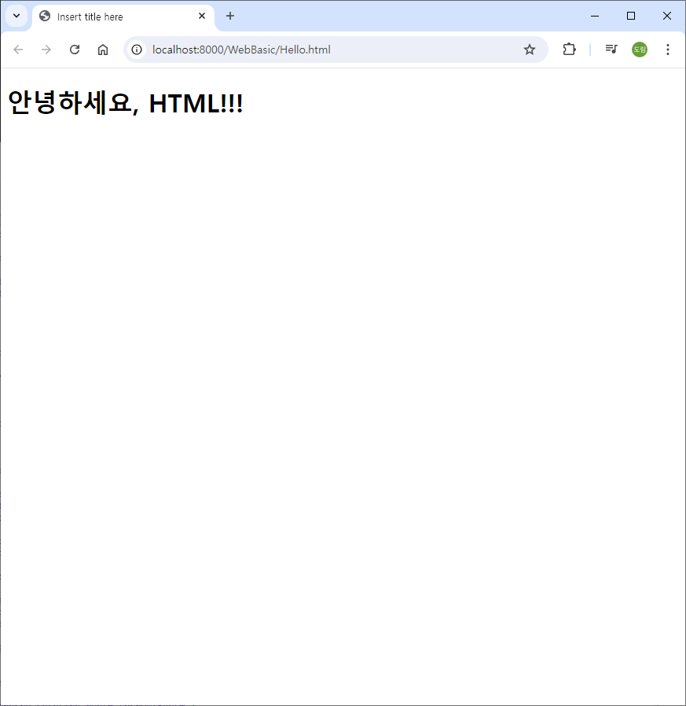
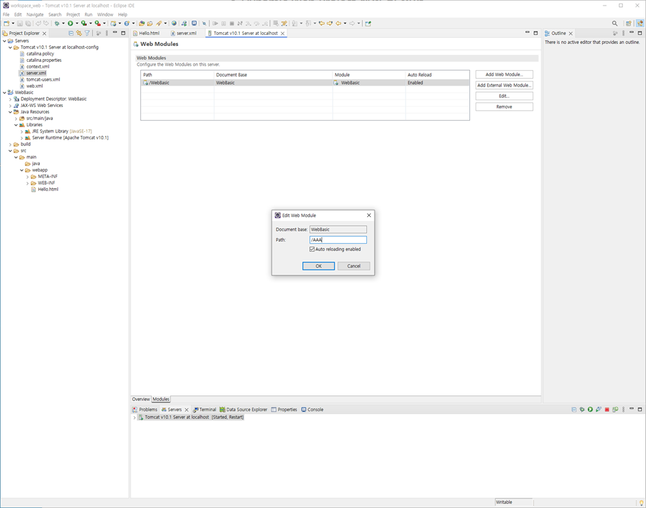
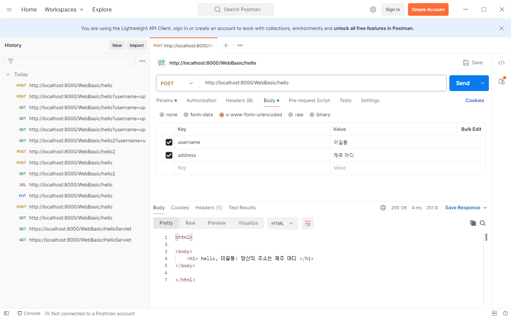
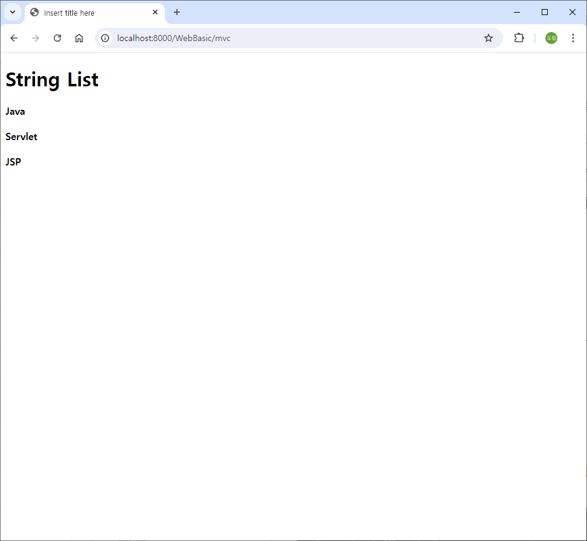

# [2024.08.01(목)] HTTP/Servlet/JSP/MVC


# 이클립스 - 톰켓 연동하기

1. 이클립스 하단 [Servers] → [… to create a new server] 선택 → [Apach] → ‘Tomcat v10.1 Server’
    
    
    
2. Tomcat installation directory 작성 → JRE 설정 → Finish
    
    
    
    1. [Server] 우측에서 톰켓 실행, 정지 확인

# Dynamic Web Project 생성 및 실행

1. [File] → [new] → [Dynamic Web Project] → [Project name] 작성 → [Dynamic web module version] ‘4.0’으로 수정 → [finish]
    
    
    
2. [webapp] → [new] → [HTML file] → Hello.html 생성
    
    ```html
    <!DOCTYPE html>
    <html>
    <head>
    <meta charset="UTF-8">
    <title>Insert title here</title>
    </head>
    <body>
    	<h1>안녕하세요, HTML!!!</h1>
    </body>
    </html>
    ```
    
3. ‘Hello.html’ 우클릭 → [Run As] → [Run on Server]
    
    
    

참고. ‘http://localhost:8000/WebBasic/Hello.html’의 ‘WebBasic’는 Context로 톰켓이 관리한다.

- [Server] 프로젝트 → [server.xml] 가장 아래에서 확인 가능
    
    ```html
    <Context docBase="WebBasic" path="/WebBasic" reloadable="true" source="org.eclipse.jst.jee.server:WebBasic"/></Host>
    ```
    
- 이클립스 하단 [Server] 탭에서 ‘Tomcat v10.1 Server at localhost’ 더블 클릭 → Modules에서 Context Path 변경 가능하다.  (Tomcat의 Modules에서 수정하면 server.xml도 변경된다.)
    
    변경하면 URL context 다르게 사용 가능하다.
    
    (예시 - Path : /AAA 이면 http://localhost:8000/AAA/Hello.html
    
          Path : / 이면 http://localhost:8000/Hello.html 으로 사용 가능하다.)
    
    
    

```html
tomcat : container

java (servlet)
jsp (another servlet = java)
=> component

container와 component 사이에는 상호 약속 
```

# HTTP

## 1. HTTP

- stateless
    
    → server는 client를 기억하지 못한다.
    → client를 기억하기 위한 다양한 기술 : Cookie, Session, JWT
    

## 조별 활동

HTTP는 본질적으로 상태를 유지하지 않는(stateless) 프로토콜입니다. 즉, 서버는 각 요청 간의 클라이언트의 상태를 기억하지 못합니다. 이를 해결하기 위해 여러 기술이 개발되었습니다. 대표적으로 쿠키(Cookie), 세션(Session), JWT(JSON Web Token)가 있습니다.

### HTTP에서 클라이언트를 기억하기 위한 Cookie, Session, JWT 등과 같은 기술

### 쿠키(Cookie)

쿠키는 클라이언트의 브라우저에 저장되는 작은 데이터 조각입니다. 서버는 쿠키를 사용하여 클라이언트의 상태를 유지할 수 있습니다.

- **작동 원리**:
    1. **서버가 쿠키를 생성**: 서버는 클라이언트에 응답할 때 `Set-Cookie` 헤더를 사용하여 쿠키를 생성합니다.
    2. **클라이언트가 쿠키를 저장**: 클라이언트의 브라우저는 쿠키를 저장하고, 이후 동일한 서버로 요청을 보낼 때 저장된 쿠키를 요청의 `Cookie` 헤더에 포함시켜 보냅니다.
    3. **서버가 쿠키를 확인**: 서버는 요청에 포함된 쿠키를 확인하여 클라이언트를 식별하고 상태를 유지합니다.
- **특징**:
    - 클라이언트 측에 저장되며, 서버는 클라이언트가 보낸 쿠키를 통해 상태를 관리합니다.
    - 만료 시간 설정이 가능하여 특정 시간 이후에 쿠키가 자동으로 삭제될 수 있습니다.
    - 보안이 중요한 정보는 쿠키에 저장하지 않는 것이 좋습니다.

### 세션(Session)

세션은 서버 측에 클라이언트의 상태를 저장하는 방식입니다. 클라이언트는 세션 ID를 통해 서버에 저장된 자신의 상태에 접근할 수 있습니다.

- **작동 원리**:
    1. **서버가 세션을 생성**: 클라이언트가 서버에 처음 요청을 보낼 때, 서버는 고유한 세션 ID를 생성하고 이를 세션 저장소에 저장합니다.
    2. **세션 ID 전달**: 서버는 생성된 세션 ID를 클라이언트에게 쿠키로 전달합니다.
    3. **클라이언트가 세션 ID를 저장**: 클라이언트는 서버로부터 받은 세션 ID를 쿠키로 저장합니다.
    4. **서버가 세션을 확인**: 이후 클라이언트가 요청을 보낼 때, 저장된 세션 ID를 함께 전송하고, 서버는 이 세션 ID를 통해 클라이언트의 상태를 확인하고 유지합니다.
- **특징**:
    - 상태 정보가 서버 측에 저장되므로 클라이언트 측의 보안 위험이 줄어듭니다.
    - 서버 메모리나 데이터베이스에 세션 정보를 저장하여 관리합니다.
    - 서버 측 리소스를 사용하므로 많은 사용자를 지원할 때 성능 고려가 필요합니다.

### JWT (JSON Web Token)

JWT는 JSON 객체를 사용하여 클라이언트와 서버 간의 정보를 안전하게 전송하는 토큰 기반 인증 방식입니다. 토큰 자체에 정보를 담고 있으며, 서버에 상태 정보를 저장하지 않는 방식입니다.

- **작동 원리**:
    1. **클라이언트가 로그인 요청**: 클라이언트가 서버에 로그인 요청을 보냅니다.
    2. **서버가 JWT 생성**: 서버는 인증을 완료하면, 클라이언트에게 JWT를 발급합니다. 이 토큰에는 클라이언트 정보와 만료 시간 등이 포함되며, 서버의 비밀 키로 서명됩니다.
    3. **클라이언트가 JWT 저장**: 클라이언트는 이 JWT를 로컬 스토리지나 쿠키에 저장합니다.
    4. **클라이언트가 JWT 전송**: 이후 요청마다 클라이언트는 이 JWT를 `Authorization` 헤더에 포함시켜 서버에 전송합니다.
    5. **서버가 JWT 검증**: 서버는 클라이언트가 보낸 JWT의 서명을 검증하여 유효성을 확인하고, 토큰에 포함된 정보를 사용하여 클라이언트를 인증합니다.
- **특징**:
    - 상태 정보가 토큰 자체에 포함되어 있어 서버가 상태 정보를 저장할 필요가 없습니다.
    - 토큰은 서명되어 있어 변조를 방지할 수 있습니다.
    - 클라이언트와 서버 간의 비동기 통신에 유리하며, 분산 시스템에서의 인증에도 적합합니다.
    - 만료 시간 설정이 가능하며, 만료된 토큰은 재사용할 수 없습니다.

### 비교

- **쿠키**: 클라이언트 측에 저장되며, 서버는 쿠키를 통해 상태를 유지합니다. 간단한 상태 유지에 적합합니다.
- **세션**: 서버 측에 상태를 저장하며, 클라이언트는 세션 ID를 통해 상태에 접근합니다. 보안성이 높고, 서버 리소스를 사용합니다.
- **JWT**: 토큰 자체에 상태 정보를 포함하여 서버에 상태를 저장하지 않습니다. 분산 시스템과 비동기 통신에 적합하며, 보안성이 높습니다.

### 쿠키, 세션, JWT의 **Stateful과 Stateless**

**Stateful (상태 유지):**

서버나 시스템이 클라이언트의 상태를 저장하고 관리하는 방식. 서버는 상태 정보를 기억하여 요청을 처리합니다.

**Stateless (무상태):**

서버가 클라이언트의 상태를 저장하지 않고, 요청이 독립적으로 처리되는 방식. 클라이언트가 모든 필요한 상태 정보를 요청에 포함시켜 서버에 보냅니다.

### 쿠키와 세션

- **쿠키**:
    - **저장 위치**: 클라이언트 측 (브라우저)
    - **상태 정보**: 클라이언트에 저장된 쿠키를 통해 서버가 상태를 파악
    - **Stateful 이유**: 쿠키 자체는 클라이언트에 저장되지만, 서버가 쿠키를 통해 상태 정보를 유지하므로 서버와 클라이언트 간의 상호작용은 stateful입니다.
- **세션**:
    - **저장 위치**: 서버 측
    - **상태 정보**: 서버는 클라이언트의 세션 ID를 통해 상태 정보를 저장하고 관리
    - **Stateful 이유**: 서버가 클라이언트의 상태 정보를 저장하고 관리하므로 stateful입니다.

### JWT (JSON Web Token)

- **저장 위치**: 클라이언트 측 (보통 로컬 스토리지 또는 쿠키)
- **상태 정보**: JWT 자체에 상태 정보를 포함하고 있어, 필요한 모든 정보가 토큰 내부에 저장됨
- **Stateless 이유**: 서버는 JWT를 통해 클라이언트의 상태를 검증하지만, 상태 정보를 별도로 저장하지 않음. 각 요청은 독립적으로 처리되며 서버는 상태 정보를 유지하지 않으므로 stateless입니다.

### 결론

- **쿠키와 세션**은 값을 보고 상태 정보를 따로 저장하는 방식으로 stateful입니다.
- **JWT**는 상태 정보를 자체적으로 내부에 저장하고 있어서 따로 상태 정보를 저장할 필요가 없으므로 stateless입니다.

## 2. HTTP

- request : GET, POST, PUT, DELETE
    - URL : http://bank/aaa (대출), http://bank/bbb (입출금)
    - Parameter : Service 요청을 하면서 client가 전달해야 하는 데이터
- response
    - 정상적인 request : 200
    - 비정상적인 request : 404 존재하지 않는 URL 요청, 401, 403 허가되지 않은 요청
- forward / redirect (서버에서 처리하는 방식)

## 3. HTTP

- 1.0과 1.1 차이 : TCP/IP 위에 Application Protocol이 HTTP인데 1.0(TCP/IP 까지 disconnect), 1.1은 HTTP만 disconnect되고 TCP/IP 연결은 유지된다.

## 4. Static vs Dynamic Content

- static content : image, html, css, javascript… 파일
- dynamic Content : 동적으로 만들어지는 content

## 5. Web Server vs Web Application Server (WAS)

- Web Server : apache
- Web Application Server : Tomcat, Resin, Web Logic, Jeus …
- Web Server가 static content를 관리
- Web Application Server : dynamic content를 관리

## 6. OPTIONS request

- GET, POST : Well Known Request에 대한 처리는 서버에 미리 이 Method를 지원하는지 확인하는 OPTIONS Request를 보내지 않고 바로, GET, POST Request를 보낸다.
- PUT, DELETE : 서버에 미리 이 Method를 지원하는지 확인하는 OPTIONS Request( preflight request )를 보내게 되고 지원하지 않는 경우(없는 경우 포함)는 405 응답을 보낸다.

# Servlet 실습

## servlet 테스트

- src/main/java 아래 servlet 패키지 생성 → ‘HelloServlet’으로 servlet 생성 → import jakarta로 이름 변경
- 크롬에서 ‘http://localhost:8000/WebBasic/hello’로 request하여 console 출력 확인

### java/servlet/HelloServlet.java

```java
package servlet;

// java가 Oracle로 넘어갔다.
// java naming 

import java.io.IOException;
import jakarta.servlet.ServletException;
import jakarta.servlet.annotation.WebServlet;
import jakarta.servlet.http.HttpServlet;
import jakarta.servlet.http.HttpServletRequest;
import jakarta.servlet.http.HttpServletResponse;

/**
 * Servlet implementation class HelloServlet
 */
//@WebServlet("/HelloServlet")
@WebServlet("/hello")
public class HelloServlet extends HttpServlet {  // Tomcat Container 와의 약속
	private static final long serialVersionUID = 1L;

	/**
	 * @see HttpServlet#doGet(HttpServletRequest request, HttpServletResponse response)
	 */
	protected void doGet(HttpServletRequest request, HttpServletResponse response) throws ServletException, IOException {
//		response.getWriter().append("Served at: ").append(request.getContextPath());
		System.out.println("Get Request");
	}

	/**
	 * @see HttpServlet#doPost(HttpServletRequest request, HttpServletResponse response)
	 */
	protected void doPost(HttpServletRequest request, HttpServletResponse response) throws ServletException, IOException {
//		doGet(request, response);
		System.out.println("Post Request");
	}
	
	protected void doPut(HttpServletRequest request, HttpServletResponse response) throws ServletException, IOException {
//		doGet(request, response);
		System.out.println("Put Request");
	}
	
	protected void doDelete(HttpServletRequest request, HttpServletResponse response) throws ServletException, IOException {
//		doGet(request, response);
		System.out.println("Delete Request");
	}

}

```

- postman 다운로드 URL : https://www.postman.com/downloads/
    
    postman에서 GET, POST, PUT, DELETE로 http://localhost:8000/WebBasic/hello에 request 테스트
    

## servlet 여러 개 사용

- ‘HelloServlet.java’ 복사하여 ‘HelloServlet2.java’생성
    
    (@WebServlet("/hello")가 동일하면 tomcat 실행 시 오류가 발생한다.)
    
    https://devlimk1.tistory.com/10
    
    ### java/servlet/HelloServlet2.java
    
    ```jsx
    package servlet;
    
    // java가 Oracle로 넘어갔다.
    // java naming 
    
    import java.io.IOException;
    import jakarta.servlet.ServletException;
    import jakarta.servlet.annotation.WebServlet;
    import jakarta.servlet.http.HttpServlet;
    import jakarta.servlet.http.HttpServletRequest;
    import jakarta.servlet.http.HttpServletResponse;
    
    /**
     * Servlet implementation class HelloServlet
     */
    //@WebServlet("/HelloServlet")
    @WebServlet("/hello2")
    public class HelloServlet2 extends HttpServlet {  // Tomcat Container 와의 약속
    	private static final long serialVersionUID = 1L;
    
    	/**
    	 * @see HttpServlet#doGet(HttpServletRequest request, HttpServletResponse response)
    	 */
    	protected void doGet(HttpServletRequest request, HttpServletResponse response) throws ServletException, IOException {
    //		response.getWriter().append("Served at: ").append(request.getContextPath());
    		System.out.println("Get Request 2");
    	}
    
    	/**
    	 * @see HttpServlet#doPost(HttpServletRequest request, HttpServletResponse response)
    	 */
    	protected void doPost(HttpServletRequest request, HttpServletResponse response) throws ServletException, IOException {
    //		doGet(request, response);
    		System.out.println("Post Request 2");
    	}
    	
    	protected void doPut(HttpServletRequest request, HttpServletResponse response) throws ServletException, IOException {
    //		doGet(request, response);
    		System.out.println("Put Request 2");
    	}
    	
    	protected void doDelete(HttpServletRequest request, HttpServletResponse response) throws ServletException, IOException {
    //		doGet(request, response);
    		System.out.println("Delete Request 2");
    	}
    
    }
    ```
    

## 질문. 어떻게 요청이 put인지 get인지 알고 실행되는지 모르겠어요

https://tomcat.apache.org/tomcat-9.0-doc/servletapi/index.html

- service 메소드에서 처리된다.

## Request 결과로 화면 보여주기

### java/servlet/HelloServlet.java

```jsx
package servlet;

// java가 Oracle로 넘어갔다.
// java naming 

import java.io.IOException;
import jakarta.servlet.ServletException;
import jakarta.servlet.annotation.WebServlet;
import jakarta.servlet.http.HttpServlet;
import jakarta.servlet.http.HttpServletRequest;
import jakarta.servlet.http.HttpServletResponse;

/**
 * Servlet implementation class HelloServlet
 */
//@WebServlet("/HelloServlet")
@WebServlet("/hello")
public class HelloServlet extends HttpServlet {  // Tomcat Container 와의 약속
	private static final long serialVersionUID = 1L;

	/**
	 * @see HttpServlet#doGet(HttpServletRequest request, HttpServletResponse response)
	 */
	protected void doGet(HttpServletRequest request, HttpServletResponse response) throws ServletException, IOException {
		System.out.println("Get Request");
		response.getWriter().append("<html><body><h1> hello GET </h1></body></html>");
	}

	/**
	 * @see HttpServlet#doPost(HttpServletRequest request, HttpServletResponse response)
	 */
	protected void doPost(HttpServletRequest request, HttpServletResponse response) throws ServletException, IOException {
//		doGet(request, response);
		System.out.println("Post Request");
		response.getWriter().append("<html><body><h1> hello POST </h1></body></html>");
	}
	
	protected void doPut(HttpServletRequest request, HttpServletResponse response) throws ServletException, IOException {
//		doGet(request, response);
		System.out.println("Put Request");
	}
	
	protected void doDelete(HttpServletRequest request, HttpServletResponse response) throws ServletException, IOException {
//		doGet(request, response);
		System.out.println("Delete Request");
	}

}

```

### java/servlet/HelloServlet2.java

```jsx
package servlet;

// java가 Oracle로 넘어갔다.
// java naming 

import java.io.IOException;
import jakarta.servlet.ServletException;
import jakarta.servlet.annotation.WebServlet;
import jakarta.servlet.http.HttpServlet;
import jakarta.servlet.http.HttpServletRequest;
import jakarta.servlet.http.HttpServletResponse;

/**
 * Servlet implementation class HelloServlet
 */
//@WebServlet("/HelloServlet")
@WebServlet("/hello2")
public class HelloServlet2 extends HttpServlet {  // Tomcat Container 와의 약속
	private static final long serialVersionUID = 1L;

	/**
	 * @see HttpServlet#doGet(HttpServletRequest request, HttpServletResponse response)
	 */
	protected void doGet(HttpServletRequest request, HttpServletResponse response) throws ServletException, IOException {
		System.out.println("Get Request 2");
		response.getWriter().append("<html><body><h1> hello GET 2 </h1></body></html>");
	}

	/**
	 * @see HttpServlet#doPost(HttpServletRequest request, HttpServletResponse response)
	 */
	protected void doPost(HttpServletRequest request, HttpServletResponse response) throws ServletException, IOException {
//		doGet(request, response);
		System.out.println("Post Request 2");
		response.getWriter().append("<html><body><h1> hello POST 2 </h1></body></html>");
	}
	
	protected void doPut(HttpServletRequest request, HttpServletResponse response) throws ServletException, IOException {
//		doGet(request, response);
		System.out.println("Put Request 2");
	}
	
	protected void doDelete(HttpServletRequest request, HttpServletResponse response) throws ServletException, IOException {
//		doGet(request, response);
		System.out.println("Delete Request 2");
	}

}

```

## GET Request 파라미터 처리하기

### java/servlet/HelloServlet.java

```jsx
package servlet;

// java가 Oracle로 넘어갔다.
// java naming 

import java.io.IOException;
import jakarta.servlet.ServletException;
import jakarta.servlet.annotation.WebServlet;
import jakarta.servlet.http.HttpServlet;
import jakarta.servlet.http.HttpServletRequest;
import jakarta.servlet.http.HttpServletResponse;

/**
 * Servlet implementation class HelloServlet
 */
//@WebServlet("/HelloServlet")
@WebServlet("/hello")
public class HelloServlet extends HttpServlet {  // Tomcat Container 와의 약속
	private static final long serialVersionUID = 1L;

	/**
	 * @see HttpServlet#doGet(HttpServletRequest request, HttpServletResponse response)
	 */
	protected void doGet(HttpServletRequest request, HttpServletResponse response) throws ServletException, IOException {
		System.out.println("Get Request");
		
		// 사용자가 get username=홍길동
		String username = request.getParameter("username");
		System.out.println("username : " + username);

		String address = request.getParameter("address");
		System.out.println("address : " + address);
		
		response.setContentType("text/html; charset=utf-8");
		response.getWriter().append("<html><body><h1> hello, " + username + "! 당신의 주소는 " + address + " </h1></body></html>");
	}

	/**
	 * @see HttpServlet#doPost(HttpServletRequest request, HttpServletResponse response)
	 */
	protected void doPost(HttpServletRequest request, HttpServletResponse response) throws ServletException, IOException {
//		doGet(request, response);
		System.out.println("Post Request");
		response.getWriter().append("<html><body><h1> hello POST </h1></body></html>");
	}
	
	protected void doPut(HttpServletRequest request, HttpServletResponse response) throws ServletException, IOException {
//		doGet(request, response);
		System.out.println("Put Request");
	}
	
	protected void doDelete(HttpServletRequest request, HttpServletResponse response) throws ServletException, IOException {
//		doGet(request, response);
		System.out.println("Delete Request");
	}

}
```

## POST Request 파라미터 처리하기

### java/servlet/HelloServlet.java

```jsx
package servlet;

// java가 Oracle로 넘어갔다.
// java naming 

import java.io.IOException;
import jakarta.servlet.ServletException;
import jakarta.servlet.annotation.WebServlet;
import jakarta.servlet.http.HttpServlet;
import jakarta.servlet.http.HttpServletRequest;
import jakarta.servlet.http.HttpServletResponse;

/**
 * Servlet implementation class HelloServlet
 */
//@WebServlet("/HelloServlet")
@WebServlet("/hello")
public class HelloServlet extends HttpServlet {  // Tomcat Container 와의 약속
	private static final long serialVersionUID = 1L;

	/**
	 * @see HttpServlet#doGet(HttpServletRequest request, HttpServletResponse response)
	 */
	protected void doGet(HttpServletRequest request, HttpServletResponse response) throws ServletException, IOException {
		System.out.println("Get Request");
		
		// 사용자가 get username=홍길동
		String username = request.getParameter("username");
		System.out.println("username : " + username);

		String address = request.getParameter("address");
		System.out.println("address : " + address);
		
		response.setContentType("text/html; charset=utf-8");
		response.getWriter().append("<html><body><h1> hello, " + username + "! 당신의 주소는 " + address + " </h1></body></html>");
	}

	/**
	 * @see HttpServlet#doPost(HttpServletRequest request, HttpServletResponse response)
	 */
	protected void doPost(HttpServletRequest request, HttpServletResponse response) throws ServletException, IOException {
//		doGet(request, response);
		System.out.println("Post Request");

		// 사용자가 get username=홍길동
		String username = request.getParameter("username");
		System.out.println("username : " + username);

		String address = request.getParameter("address");
		System.out.println("address : " + address);

		response.setContentType("text/html; charset=utf-8");
		response.getWriter()
				.append("<html><body><h1> hello, " + username + "! 당신의 주소는 " + address + " </h1></body></html>");
	}
	
	protected void doPut(HttpServletRequest request, HttpServletResponse response) throws ServletException, IOException {
//		doGet(request, response);
		System.out.println("Put Request");
	}
	
	protected void doDelete(HttpServletRequest request, HttpServletResponse response) throws ServletException, IOException {
//		doGet(request, response);
		System.out.println("Delete Request");
	}

}
```

### postman 요청

- POST 기본 인코딩 방식은 **‘x-www-form-urlencoded’**이다.⭐
    
    (다른 방식 사용 시에는 명시해주어야 한다.)
    



## Servlet에서 등록, 수정, 삭제, 목록, 상세 5가지 기능 처리 방법

```java
// 이 서블릿 하나가 도서 관리에 필요한 등록, 수정, 삭제, 목록, 상세 5가지 기능! => servlet get, post, put, delete 4 가지
// 서블릿 url 1개 (/books)에 여러 개의 작업을 수행하는데 불현
//    **1. 작업(업무) 구분 파라미터**
//		 client는 항상 파라미터로 작업(구분)을 보낸다.
//    **2. 작업(업무) 구분 sub url**
//		/books/list
//		/books/detail
//		/books/insert ...
//		@WebServlet("/books/*") => /books 하위 경로를 가진 request까지 모두 처리
```

### webapp/Book.html

```html
<!DOCTYPE html>
<html>
<head>
<meta charset="UTF-8">
<title>Insert title here</title>
</head>
<body>
	<h3><a href="/WebBasic/books?job=list">목록</a></h1>
	<h3><a href="/WebBasic/books?job=detail">상세</a></h1>
	<h3><a href="/WebBasic/books?job=insert">등록</a></h1>
	<h3><a href="/WebBasic/books?job=update">수정</a></h1>
	<h3><a href="/WebBasic/books?job=delete">삭제</a></h1>
</body>
</html>
```

### java/servlet/BookServlet.java

```java
package servlet;

// java가 Oracle로 넘어갔다.
// java naming 

import java.io.IOException;
import jakarta.servlet.ServletException;
import jakarta.servlet.annotation.WebServlet;
import jakarta.servlet.http.HttpServlet;
import jakarta.servlet.http.HttpServletRequest;
import jakarta.servlet.http.HttpServletResponse;

// 이 서블릿 하나가 도서 관리에 필요한 등록, 수정, 삭제, 목록, 상세 5가지 기능! => servlet get, post, put, delete 4 가지
// 서블릿 url 1개 (/books)에 여러 개의 작업을 수행하는데 불현
//    1. 작업(업무) 구분 파라미터
//		 client는 항상 파라미터로 작업(구분)을 보낸다.
//    2. 작업(업무) 구분 sub url
//		/books/list
//		/books/detail
//		/books/insert ...
//		@WebServlet("/books/*") => /books 하위 경로를 가진 request까지 모두 처리

//@WebServlet("/books/*")
@WebServlet("/books")
public class BookServlet extends HttpServlet {  // Tomcat Container 와의 약속
	private static final long serialVersionUID = 1L;

	protected void doGet(HttpServletRequest request, HttpServletResponse response) throws ServletException, IOException {
		System.out.println(request.getRequestURI());
		
		String job = request.getParameter("job");
		switch(job) {
			case "list": list(); break;
			case "detail": detail(); break;
			case "insert": insert(); break;
			case "update": update(); break;
			case "delete": delete(); break;
		}
	}

	protected void doPost(HttpServletRequest request, HttpServletResponse response) throws ServletException, IOException {
//		doGet(request, response);
		System.out.println("Post Request 2");
		response.getWriter().append("<html><body><h1> hello POST 2 </h1></body></html>");
	}
	
	protected void doPut(HttpServletRequest request, HttpServletResponse response) throws ServletException, IOException {
//		doGet(request, response);
		System.out.println("Put Request 2");
	}
	
	protected void doDelete(HttpServletRequest request, HttpServletResponse response) throws ServletException, IOException {
//		doGet(request, response);
		System.out.println("Delete Request 2");
	}
	
	private void list() {
		System.out.println("list");
	}
	
	private void detail() {
		System.out.println("detail");
	}
	
	private void insert() {
		System.out.println("insert");
	}
	
	private void update() {
		System.out.println("update");
	}
	
	private void delete() {
		System.out.println("delete");
	}

}
```

# JSP

## JSP 실습

### webapp/Hello.jsp

```java
<%@ page language="java" contentType="text/html; charset=UTF-8"
    pageEncoding="UTF-8"%>
<!DOCTYPE html>
<html>
<head>
<meta charset="UTF-8">
<title>Insert title here</title>
</head>
<body>
	<h1>이게 뭐하는 거냐 2</h1>
</body>
</html>
```

### java/servlet/HTMLServlet.java

```java
package servlet;

// java가 Oracle로 넘어갔다.
// java naming 

import java.io.IOException;
import jakarta.servlet.ServletException;
import jakarta.servlet.annotation.WebServlet;
import jakarta.servlet.http.HttpServlet;
import jakarta.servlet.http.HttpServletRequest;
import jakarta.servlet.http.HttpServletResponse;

@WebServlet("/http")
public class HTMLServlet extends HttpServlet { 
	private static final long serialVersionUID = 1L;

	protected void doGet(HttpServletRequest request, HttpServletResponse response) throws ServletException, IOException {
		response.setContentType("text/html; charset=utf-8");
		response.getWriter().append("<html>");
		response.getWriter().append("<head>");
		response.getWriter().append("</head>");
		response.getWriter().append("<body>");
		response.getWriter().append("<h1>이게 뭐하는 짓이냐</h1>");
		// 많은 html code가 java code 안에 ...
		response.getWriter().append("</body>");
		response.getWriter().append("</html>");
		
	}

}
```

## MVC

### java/servlet/MVCServlet.java

```java
package servlet;

// java가 Oracle로 넘어갔다.
// java naming 

import java.io.IOException;
import java.util.List;

import jakarta.servlet.ServletException;
import jakarta.servlet.annotation.WebServlet;
import jakarta.servlet.http.HttpServlet;
import jakarta.servlet.http.HttpServletRequest;
import jakarta.servlet.http.HttpServletResponse;

@WebServlet("/mvc")
public class MVCServlet2 extends HttpServlet { 
	private static final long serialVersionUID = 1L;

	protected void doGet(HttpServletRequest request, HttpServletResponse response) throws ServletException, IOException {
		String job = request.getParameter("job");
		// swich()
		// job 목록
		
		List<String> strList = getList();
		
		// request에 model을 담는다.
		request.setAttribute("strList", strList);
		
		// forwarding
		request.getRequestDispatcher("Mvc.jsp").forward(request, response);
		
	}

	private List<String> getList() {
		List<String> strList = List.of("Java", "Servlet", "JSP");
		return strList;
	}

}
```

### webapp/Mvc.jsp

```java
<%@ page language="java" contentType="text/html; charset=UTF-8"
    pageEncoding="UTF-8"%>
<%@page import="java.util.List"%>
    
<%
	List<String> strList = (List<String>) request.getAttribute("strList");
%>    

<!DOCTYPE html>
<html>
<head>
<meta charset="UTF-8">
<title>Insert title here</title>
</head>
<body>
	<h1>String List</h1>
	<%
		for (String str : strList) {
	%>
		
	<h4><%= str %></h4>	
		
	<% 
		} 
	%>
</body>
</html>
```

### 실행 결과

- 웹브라우저에서 ‘http://localhost:8000/WebBasic/mvc’ 실행

