# [2024.08.02(금)] BookManager(HTML+Servlet+JSP)/BookManagerAjax(HTML+Servlet+JSP+Ajax)


# jsp 구성 요소 4가지, jsp 내장 객체

```java
jsp 구성 요소 4가지
1. directive <%@ <- 설정, import ...
2. scriptlet <% java code %>
3. expression <%= 변수 %> <- 변수의 값을 html text로 출력
4. decaration <%! %>

jsp 내장 객체
	request <- HttpServletRequest
	session <- HttpSession
	
Servlet은 코드 수정 후 .class 파일을 운영 서버에 배포하면 운영 서버를 restart해야 하지만,
JSP는 운영 서버가 변경된 것을 확인하고 새로 servlet 코드로 변환, 컴파일까지 모두 처하므로 별도로 운영 서버를 restart할 필요 없다.

JSP는 보여주는 로직을 담당 <- 코드가 복잡하면 안된다. 복잡한 JSP라면 분할하고 각각에 대해서 Servlet에서 분기 처리하도록 구성해야 한다.
```

## WebBasic 프로젝트(08/01 사용하던 프로젝트)

### webapp/Learn.jsp

```java
<%@page import="java.util.*"%>
<%@ page language="java" contentType="text/html; charset=UTF-8"
    pageEncoding="UTF-8"%>
    
<%--
jsp 구성 요소 4가지
1. directive <%@ <- 설정, import ...
2. scriptlet <% java code %>
3. expression <%= 변수 %> <- 변수의 값을 html text로 출력
4. decaration <%! %>

jsp 내장 객체
	request <- HttpServletRequest
	session <- HttpSession
 --%> 
   
<!DOCTYPE html>
<html>
<head>
<meta charset="UTF-8">
<title>Insert title here</title>
</head>
<body>

<%
	boolean result = false;

	if(result) {
		
%>

	<div>True 입니다.</div>

<%
	} else {
%>

	<div>False 입니다.</div>

<%
	}
%>

<%
	List<String> strList = new ArrayList<>();
	strList.add("Java");
%>
<%
	for(String str : strList) {
		
%>

	<div><span><%= str %></span></div>

<%
	}
%>

</body>
</html>
```

# BookManager 프로젝트 생성 (HTML + Servlet + JSP)

### Dynamic Web Project 생성

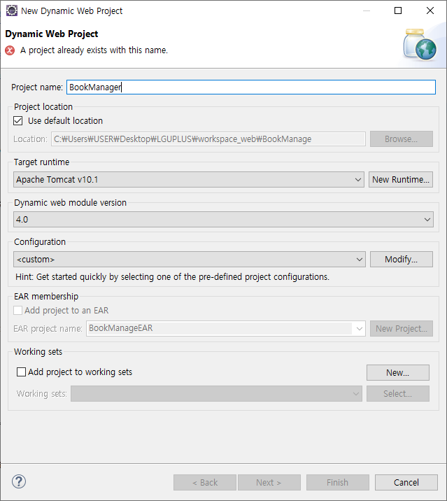

```java
1. HTML only <= static content service only

2. HTML + Servlet <= static + dynamic service

3. HTML + Servlet + JSP <= static + dynamic service + separate role (view, data, controller)

4. HTML + Servlet + JSP + Ajax <= static + dynamic service + separate role (view, data, controller) + Ajax

5. Spring MVC <= JSP + Spring

6. Spring Boot <= SPA + Spring

DB 연결 : Connection Pool (Tomcat 의뢰)

최근 사용되는 것은 3~6번 정도 이다. (3~5는 legacy system 존재할 수 있음 또는 비용 문제 등)
```

## Tomcat에 Connection Pool 설정

- Server 디렉토리의 context.xml에 <Resource/> 내용 추가

### context.xml

```java
<?xml version="1.0" encoding="UTF-8"?>
<!--
  Licensed to the Apache Software Foundation (ASF) under one or more
  contributor license agreements.  See the NOTICE file distributed with
  this work for additional information regarding copyright ownership.
  The ASF licenses this file to You under the Apache License, Version 2.0
  (the "License"); you may not use this file except in compliance with
  the License.  You may obtain a copy of the License at

      http://www.apache.org/licenses/LICENSE-2.0

  Unless required by applicable law or agreed to in writing, software
  distributed under the License is distributed on an "AS IS" BASIS,
  WITHOUT WARRANTIES OR CONDITIONS OF ANY KIND, either express or implied.
  See the License for the specific language governing permissions and
  limitations under the License.
--><!-- The contents of this file will be loaded for each web application --><Context>

    <!-- Default set of monitored resources. If one of these changes, the    -->
    <!-- web application will be reloaded.                                   -->
    <WatchedResource>WEB-INF/web.xml</WatchedResource>
    <WatchedResource>WEB-INF/tomcat-web.xml</WatchedResource>
    <WatchedResource>${catalina.base}/conf/web.xml</WatchedResource>

    <!-- Uncomment this to enable session persistence across Tomcat restarts -->
    <!--
    <Manager pathname="SESSIONS.ser" />
    -->
    
    <Resource name="jdbc/madangdb" auth="Container" type="javax.sql.DataSource" driverClassName="com.mysql.cj.jdbc.Driver" url="jdbc:mysql://localhost:3306/madangdb"
       initialSize="2" maxTotal="10" maxIdle="10"
       username="root" password="root"
       />
    
</Context>
```

### mysql-connection-j-8.3.0.jar를 apache-tomcat-10.1.26\lib에 복사하기

- C:\Users\USER\Desktop\LGUPLUS\library\mysql-connection-j-8.3.0.jar

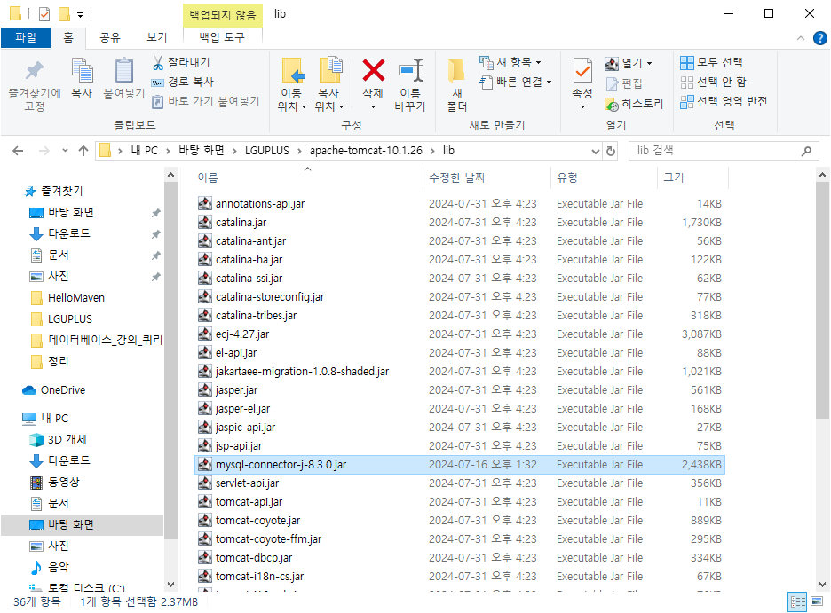

## java 하위에 common, dao, dto, servlet 패키지 생성 및 설정

- dto, dao, DBManager.java 파일은 이전의 MiniProject_day_1_2 프로젝트의 app.book 패키지에서 복사해오기

### java/dto/BookDto.java

```java
package dto;

public class BookDto {
	
	private int bookId;
	private String bookName;
	private String publisher;
	private int price;
	
	public BookDto() {}
	public BookDto(int bookId, String bookName, String publisher, int price) {
		super();
		this.bookId = bookId;
		this.bookName = bookName;
		this.publisher = publisher;
		this.price = price;
	}

	public int getBookId() {
		return bookId;
	}

	public void setBookId(int bookId) {
		this.bookId = bookId;
	}

	public String getBookName() {
		return bookName;
	}

	public void setBookName(String bookName) {
		this.bookName = bookName;
	}

	public String getPublisher() {
		return publisher;
	}

	public void setPublisher(String publisher) {
		this.publisher = publisher;
	}

	public int getPrice() {
		return price;
	}

	public void setPrice(int price) {
		this.price = price;
	}

	@Override
	public String toString() {
		return "BookDto [bookId=" + bookId + ", bookName=" + bookName + ", publisher=" + publisher + ", price=" + price
				+ "]";
	}

}

```

### java/common/DBManager.java

```java
package common;

import java.sql.Connection;
import java.sql.PreparedStatement;
import java.sql.ResultSet;
import java.sql.SQLException;

import javax.naming.Context;
import javax.naming.InitialContext;
import javax.sql.DataSource;

// Tomcat이 관리하는 Connection Pool (DataSource)에서 connection 객체를 얻고 반납한다.
public class DBManager {
	
	public static Connection getConnection() {
		Connection con = null;
		try {
			
			// connection Pool 설정
			Context context = new InitialContext();
			DataSource ds = (DataSource) context.lookup("java:comp/env/jdbc/madangdb");
			con = ds.getConnection();
			
		} catch (Exception e) {
			e.printStackTrace();
		}
		
		return con;
	}
	
	public static void releaseConnection(PreparedStatement pstmt, Connection con) {
		try {
			pstmt.close();
			con.close();  // connection Pool로 되돌아가는 코드로 되어 있다.
		} catch(SQLException e) {
			e.printStackTrace();
		} 
	}
	
	public static void releaseConnection(ResultSet rs, PreparedStatement pstmt, Connection con) {
		try {
			rs.close();
			pstmt.close();
			con.close();
		} catch(SQLException e) {
			e.printStackTrace();
		} 
	}

}
```

### java/dao/BookDao.java

```java
package dao;

import java.sql.Connection;
import java.sql.PreparedStatement;
import java.sql.ResultSet;
import java.sql.SQLException;
import java.util.ArrayList;
import java.util.List;

import common.DBManager;
import dto.BookDto;

// book table에 대한 crud
public class BookDao {
	
	public int insertBook(BookDto book) {
		int ret = -1;
		String sql = "insert into book values (?, ?, ?, ?); ";
		
		Connection con = null;
		PreparedStatement pstmt = null;
		
		try {
			con = DBManager.getConnection();
			pstmt = con.prepareStatement(sql);
			
			pstmt.setInt(1, book.getBookId());
			pstmt.setString(2, book.getBookName());
			pstmt.setString(3, book.getPublisher());
			pstmt.setInt(4, book.getPrice());
			
			ret = pstmt.executeUpdate();
			
		} catch(SQLException e) {
			e.printStackTrace();
		} finally {
			DBManager.releaseConnection(pstmt, con);
		}

		return ret;
	}
	
	public int updateBook(BookDto book) {
		int ret = -1;
		String sql = "update book set bookname = ?, publisher = ?, price = ? where bookid = ?; ";
		
		Connection con = null;
		PreparedStatement pstmt = null;
		
		try {
			con = DBManager.getConnection();
			pstmt = con.prepareStatement(sql);
			
			pstmt.setString(1, book.getBookName());
			pstmt.setString(2, book.getPublisher());
			pstmt.setInt(3, book.getPrice());
			pstmt.setInt(4, book.getBookId());
			
			ret = pstmt.executeUpdate();
			
		} catch(SQLException e) {
			e.printStackTrace();
		} finally {
			DBManager.releaseConnection(pstmt, con);
		}
		
		return ret;
	}
	
	public int deleteBook(int bookId) {
		int ret = -1;
		String sql = "delete from book where bookid = ?; ";
		
		Connection con = null;
		PreparedStatement pstmt = null;
		
		try {
			con = DBManager.getConnection();
			pstmt = con.prepareStatement(sql);
			
			pstmt.setInt(1, bookId);
			
			ret = pstmt.executeUpdate();
			
		} catch(SQLException e) {
			e.printStackTrace();
		} finally {
			DBManager.releaseConnection(pstmt, con);
		}
		
		
		return ret;
	}
	
	public List<BookDto> listBook() {
		List<BookDto> list = new ArrayList<BookDto>();
		String sql = "select * from book; ";
		
		Connection con = null;
		PreparedStatement pstmt = null;
		ResultSet rs = null;
		
		try {
			con = DBManager.getConnection();
			pstmt = con.prepareStatement(sql);
			
			rs = pstmt.executeQuery();
			
			while(rs.next()) {
				BookDto book = new BookDto();
				book.setBookId(rs.getInt("bookid"));
				book.setBookName(rs.getString("bookname"));
				book.setPublisher(rs.getString("publisher"));
				book.setPrice(rs.getInt("price"));
				
				list.add(book);
			}
			
		} catch(SQLException e) {
			e.printStackTrace();
		} finally {
			DBManager.releaseConnection(pstmt, con);
		}
		
		return list;
	}
	
	public BookDto detailBook(int bookId) {
		BookDto book = null;
		String sql = "select * from book where bookid = ?; ";
		
		Connection con = null;
		PreparedStatement pstmt = null;
		ResultSet rs = null;
		
		try {
			con = DBManager.getConnection();
			pstmt = con.prepareStatement(sql);
			
			pstmt.setInt(1, bookId);
			
			rs = pstmt.executeQuery();
			
			if(rs.next()) {
				book = new BookDto();
				book.setBookId(rs.getInt("bookid"));
				book.setBookName(rs.getString("bookname"));
				book.setPublisher(rs.getString("publisher"));
				book.setPrice(rs.getInt("price"));
			}
			
		} catch(SQLException e) {
			e.printStackTrace();
		} finally {
			DBManager.releaseConnection(pstmt, con);
		}
		
		return book;
	}
	
	public List<BookDto> listBook(String searchWord) {
		List<BookDto> list = new ArrayList<BookDto>();
		String sql = "select * from book where bookname like ?; "; // % 사용 X
		
		Connection con = null;
		PreparedStatement pstmt = null;
		ResultSet rs = null;
		
		try {
			con = DBManager.getConnection();
			pstmt = con.prepareStatement(sql);
			
			pstmt.setString(1, "%" + searchWord + "%");
			
			rs = pstmt.executeQuery();
			
			while(rs.next()) {
				BookDto book = new BookDto();
				book.setBookId(rs.getInt("bookid"));
				book.setBookName(rs.getString("bookname"));
				book.setPublisher(rs.getString("publisher"));
				book.setPrice(rs.getInt("price"));
				
				list.add(book);
			}
			
		} catch(SQLException e) {
			e.printStackTrace();
		} finally {
			DBManager.releaseConnection(pstmt, con);
		}
		
		return list;
	}
	
}
```

### java/servlet

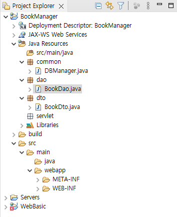

### java/servlet/BookServlet.java

- 서블릿 파일로 생성

```java
package servlet;

import java.io.IOException;
import java.util.List;

import dao.BookDao;
import dto.BookDto;
import jakarta.servlet.ServletException;
import jakarta.servlet.annotation.WebServlet;
import jakarta.servlet.http.HttpServlet;
import jakarta.servlet.http.HttpServletRequest;
import jakarta.servlet.http.HttpServletResponse;

// BookServlet 한 개에서 다양한 처리(crud)를 하기 위해 sub url
// /books/list : 목록
// /books/detail : 상세 ...
@WebServlet("/books/*")
public class BookServlet extends HttpServlet {
	private static final long serialVersionUID = 1L;

	protected void doGet(HttpServletRequest request, HttpServletResponse response) throws ServletException, IOException {
		// 기능 구현은 이곳에만 한다.
		// http://localhost:8000/BookManager/books/list
		// /BookManager/books/list
		// /BookManager
//		System.out.println(request.getRequestURI());
//		System.out.println(request.getContextPath());
		
		String job = request.getRequestURI().substring(request.getContextPath().length());
		System.out.println(job);
		
		switch(job) {
		case "/books/list" : list(request, response); break;
		case "/books/detail" : detail(request, response); break;
		case "/books/insert" : insert(request, response); break;
		case "/books/update" : update(request, response); break;
		case "/books/delete" : delete(request, response); break;
		}
	}

	protected void doPost(HttpServletRequest request, HttpServletResponse response) throws ServletException, IOException {
		// post로 요청이 오더라도 get에서 처리된다.
		doGet(request, response);
	}

	private void list(HttpServletRequest request, HttpServletResponse response) throws ServletException, IOException {
		System.out.println("list");
	}
	
	private void detail(HttpServletRequest request, HttpServletResponse response) throws ServletException, IOException {
		System.out.println("detail");
	}
	
	private void insert(HttpServletRequest request, HttpServletResponse response) throws ServletException, IOException {
		System.out.println("insert");
	}
	
	private void update(HttpServletRequest request, HttpServletResponse response) throws ServletException, IOException {
		System.out.println("update");
	}
	
	private void delete(HttpServletRequest request, HttpServletResponse response) throws ServletException, IOException {
		System.out.println("delete");
	}
	
	
}

```

## madangdb 도서 목록 화면에 띄우기 (list)

### webapp/index.html

```java
<!DOCTYPE html>
<html>
<head>
<meta charset="UTF-8">
<title>Insert title here</title>
</head>
<body>
	<h1>도서 관리 프로그램</h1>
	
	<a href="/BookManager/books/list">도서 목록</a> <a href="#">고객 목록</a>
</body>
</html>
```

### java/servlet/BookServlet.java

```java
package servlet;

import java.io.IOException;
import java.util.List;

import dao.BookDao;
import dto.BookDto;
import jakarta.servlet.ServletException;
import jakarta.servlet.annotation.WebServlet;
import jakarta.servlet.http.HttpServlet;
import jakarta.servlet.http.HttpServletRequest;
import jakarta.servlet.http.HttpServletResponse;

// BookServlet 한 개에서 다양한 처리(crud)를 하기 위해 sub url
// /books/list : 목록
// /books/detail : 상세 ...
@WebServlet("/books/*")
public class BookServlet extends HttpServlet {
	private static final long serialVersionUID = 1L;

	protected void doGet(HttpServletRequest request, HttpServletResponse response) throws ServletException, IOException {
		// 기능 구현은 이곳에만 한다.
		// http://localhost:8000/BookManager/books/list
		// /BookManager/books/list
		// /BookManager
//		System.out.println(request.getRequestURI());
//		System.out.println(request.getContextPath());
		
		String job = request.getRequestURI().substring(request.getContextPath().length());
		System.out.println(job);
		
		switch(job) {
		case "/books/list" : list(request, response); break;
		case "/books/detail" : detail(request, response); break;
		case "/books/insert" : insert(request, response); break;
		case "/books/update" : update(request, response); break;
		case "/books/delete" : delete(request, response); break;
		}
	}

	protected void doPost(HttpServletRequest request, HttpServletResponse response) throws ServletException, IOException {
		// post로 요청이 오더라도 get에서 처리된다.
		doGet(request, response);
	}

	private void list(HttpServletRequest request, HttpServletResponse response) throws ServletException, IOException {
		BookDao bookDao = new BookDao();
		List<BookDto> bookList = bookDao.listBook();
		request.setAttribute("bookList", bookList);
		request.getRequestDispatcher("/list.jsp").forward(request, response);
	}
	
	private void detail(HttpServletRequest request, HttpServletResponse response) throws ServletException, IOException {
		System.out.println("detail");
	}
	
	private void insert(HttpServletRequest request, HttpServletResponse response) throws ServletException, IOException {
		System.out.println("insert");
	}
	
	private void update(HttpServletRequest request, HttpServletResponse response) throws ServletException, IOException {
		System.out.println("update");
	}
	
	private void delete(HttpServletRequest request, HttpServletResponse response) throws ServletException, IOException {
		System.out.println("delete");
	}
	
	
}
```

### webapp/list.jsp

```java
<%@ page language="java" contentType="text/html; charset=UTF-8"
    pageEncoding="UTF-8"%>
<%@ page import="java.util.List, dto.BookDto" %> 
   
<%
	List<BookDto> bookList = (List<BookDto>) request.getAttribute("bookList");
%>
    
<!DOCTYPE html>
<html>
<head>
<meta charset="UTF-8">
<title>Insert title here</title>
</head>
<body>
	<h1>도서 목록</h1>
	<table>
		<thead>
			<tr><td>bookId</td><td>bookName</td><td>publisher</td><td>price</td></tr>
		</thead>
		<tbody>
			<%
				for(BookDto bookDto : bookList) {
			%>
			
					<tr>
						<td><%= bookDto.getBookId() %></td>
						<td><%= bookDto.getBookName() %></td>
						<td><%= bookDto.getPublisher() %></td>
						<td><%= bookDto.getPrice() %></td>
					</tr>
			
			<%
				}
			%>
		</tbody>
	</table>
</body>
</html>
```

### 실행 결과

- index.html → [Run As] → [Run on Server]로 실행하여 ‘도서 목록’ 링크 클릭
    
    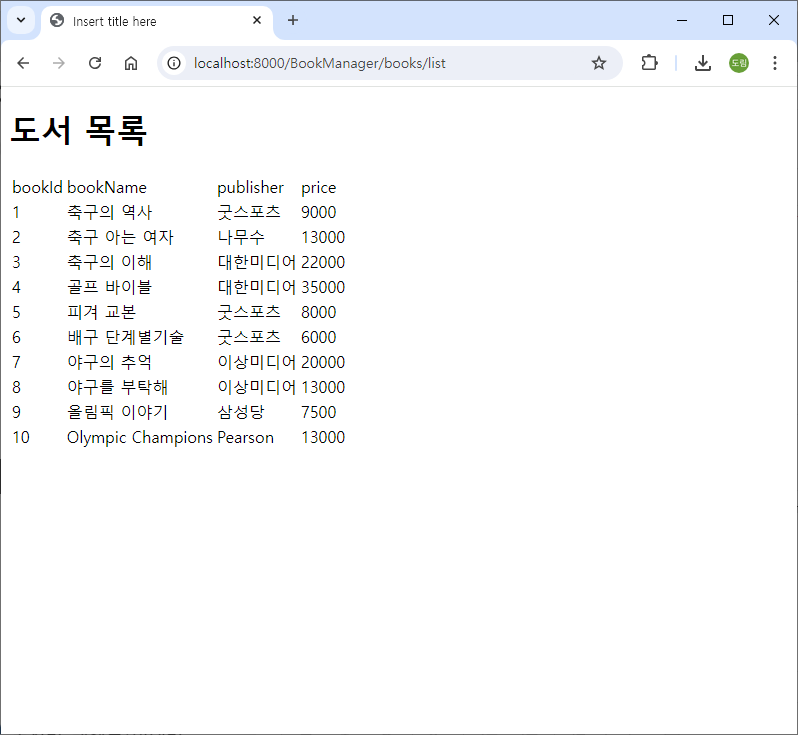
    

## madangdb 도서 상세 화면에 띄우기 (detail)

### webapp/list.jsp

```java
<%@ page language="java" contentType="text/html; charset=UTF-8"
    pageEncoding="UTF-8"%>
<%@ page import="java.util.List, dto.BookDto" %> 
   
<%
	List<BookDto> bookList = (List<BookDto>) request.getAttribute("bookList");
%>
    
<!DOCTYPE html>
<html>
<head>
<meta charset="UTF-8">
<title>Insert title here</title>
</head>
<body>
	<h1>도서 목록</h1>
	<table>
		<thead>
			<tr><td>bookId</td><td>bookName</td><td>publisher</td><td>price</td></tr>
		</thead>
		<tbody>
			<%
				for(BookDto bookDto : bookList) {
			%>
			
					<tr>
						<td><a href="/BookManager/books/detail?bookId=<%= bookDto.getBookId() %>"> <%= bookDto.getBookId() %> </a></td>
						<td><%= bookDto.getBookName() %></td>
						<td><%= bookDto.getPublisher() %></td>
						<td><%= bookDto.getPrice() %></td>
					</tr>
			
			<%
				}
			%>
		</tbody>
	</table>
</body>
</html>
```

### java/servlet/BookServlet.java

```java
package servlet;

import java.io.IOException;
import java.util.List;

import dao.BookDao;
import dto.BookDto;
import jakarta.servlet.ServletException;
import jakarta.servlet.annotation.WebServlet;
import jakarta.servlet.http.HttpServlet;
import jakarta.servlet.http.HttpServletRequest;
import jakarta.servlet.http.HttpServletResponse;

// BookServlet 한 개에서 다양한 처리(crud)를 하기 위해 sub url
// /books/list : 목록
// /books/detail : 상세 ...
@WebServlet("/books/*")
public class BookServlet extends HttpServlet {
	private static final long serialVersionUID = 1L;

	protected void doGet(HttpServletRequest request, HttpServletResponse response) throws ServletException, IOException {
		// 기능 구현은 이곳에만 한다.
		// http://localhost:8000/BookManager/books/list
		// /BookManager/books/list
		// /BookManager
//		System.out.println(request.getRequestURI());
//		System.out.println(request.getContextPath());
		
		String job = request.getRequestURI().substring(request.getContextPath().length());
		System.out.println(job);
		
		switch(job) {
		case "/books/list" : list(request, response); break;
		case "/books/detail" : detail(request, response); break;
		case "/books/insert" : insert(request, response); break;
		case "/books/update" : update(request, response); break;
		case "/books/delete" : delete(request, response); break;
		}
	}

	protected void doPost(HttpServletRequest request, HttpServletResponse response) throws ServletException, IOException {
		// post로 요청이 오더라도 get에서 처리된다.
		doGet(request, response);
	}

	private void list(HttpServletRequest request, HttpServletResponse response) throws ServletException, IOException {
		BookDao bookDao = new BookDao();
		List<BookDto> bookList = bookDao.listBook();
		request.setAttribute("bookList", bookList);
		request.getRequestDispatcher("/list.jsp").forward(request, response);
	}
	
	private void detail(HttpServletRequest request, HttpServletResponse response) throws ServletException, IOException {
		BookDao bookDao = new BookDao();
		int bookId = Integer.parseInt(request.getParameter("bookId"));
		BookDto bookDto = bookDao.detailBook(bookId);
		request.setAttribute("bookDto", bookDto);
		request.getRequestDispatcher("/detailForm.jsp").forward(request, response);
	}
	
	private void insert(HttpServletRequest request, HttpServletResponse response) throws ServletException, IOException {
		System.out.println("insert");
	}
	
	private void update(HttpServletRequest request, HttpServletResponse response) throws ServletException, IOException {
		System.out.println("update");
	}
	
	private void delete(HttpServletRequest request, HttpServletResponse response) throws ServletException, IOException {
		System.out.println("delete");
	}
	
	
}

```

### webapp/detailForm.jsp

```java
<%@ page language="java" contentType="text/html; charset=UTF-8"
    pageEncoding="UTF-8"%>
<%@ page import="java.util.List, dto.BookDto" %> 
   
<%
	BookDto bookDto = (BookDto) request.getAttribute("bookDto");
%>
    
<!DOCTYPE html>
<html>
<head>
<meta charset="UTF-8">
<title>Insert title here</title>
</head>
<body>
	<h1>도서 수정</h1>
	<form action="">
		<input type="text" name="bookId" value="<%= bookDto.getBookId()%>"></input>
		<input type="text" name="bookName" value="<%= bookDto.getBookName()%>"></input>
		<input type="text" name="publisher" value="<%= bookDto.getPublisher()%>"></input>
		<input type="text" name="price" value="<%= bookDto.getPrice()%>"></input>
	</form>
</body>
</html>
```

### 실행 결과

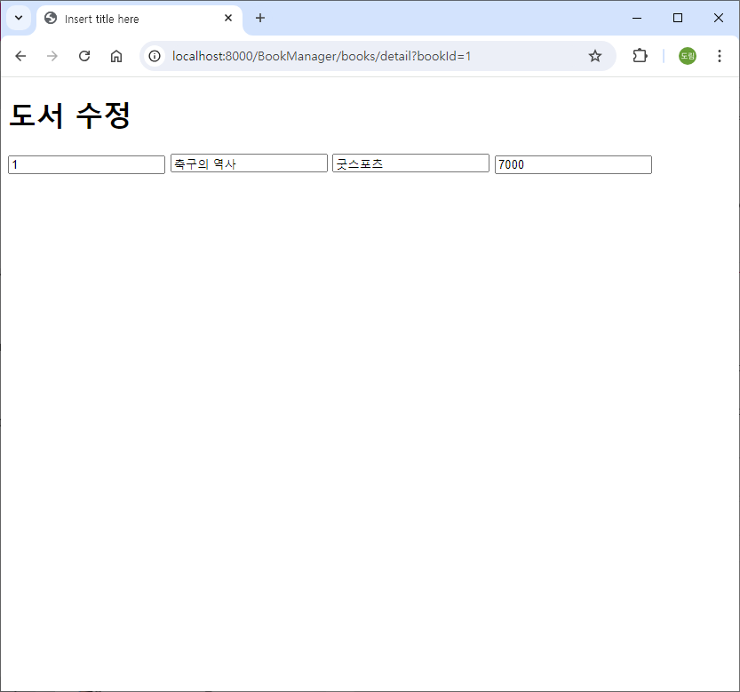

## madangdb 도서 수정 (update)

### webapp/detailForm.jsp

```java
<%@ page language="java" contentType="text/html; charset=UTF-8"
    pageEncoding="UTF-8"%>
<%@ page import="java.util.List, dto.BookDto" %> 
   
<%
	BookDto bookDto = (BookDto) request.getAttribute("bookDto");
%>
    
<!DOCTYPE html>
<html>
<head>
<meta charset="UTF-8">
<title>Insert title here</title>
</head>
<body>
	<h1>도서 수정</h1>
	<form action="/BookManager/books/update">
		<input type="text" name="bookId" value="<%= bookDto.getBookId()%>"></input>
		<input type="text" name="bookName" value="<%= bookDto.getBookName()%>"></input>
		<input type="text" name="publisher" value="<%= bookDto.getPublisher()%>"></input>
		<input type="text" name="price" value="<%= bookDto.getPrice()%>"></input>
		<button type="submin">수정</button>
	</form>
</body>
</html>
```

### java/servlet/BookServlet.java

```java
package servlet;

import java.io.IOException;
import java.util.List;

import dao.BookDao;
import dto.BookDto;
import jakarta.servlet.ServletException;
import jakarta.servlet.annotation.WebServlet;
import jakarta.servlet.http.HttpServlet;
import jakarta.servlet.http.HttpServletRequest;
import jakarta.servlet.http.HttpServletResponse;

// BookServlet 한 개에서 다양한 처리(crud)를 하기 위해 sub url
// /books/list : 목록
// /books/detail : 상세 ...
@WebServlet("/books/*")
public class BookServlet extends HttpServlet {
	private static final long serialVersionUID = 1L;

	protected void doGet(HttpServletRequest request, HttpServletResponse response) throws ServletException, IOException {
		// 기능 구현은 이곳에만 한다.
		// http://localhost:8000/BookManager/books/list
		// /BookManager/books/list
		// /BookManager
//		System.out.println(request.getRequestURI());
//		System.out.println(request.getContextPath());
		
		String job = request.getRequestURI().substring(request.getContextPath().length());
		System.out.println(job);
		
		switch(job) {
		case "/books/list" : list(request, response); break;
		case "/books/detail" : detail(request, response); break;
		case "/books/insert" : insert(request, response); break;
		case "/books/update" : update(request, response); break;
		case "/books/delete" : delete(request, response); break;
		}
	}

	protected void doPost(HttpServletRequest request, HttpServletResponse response) throws ServletException, IOException {
		// post로 요청이 오더라도 get에서 처리된다.
		doGet(request, response);
	}

	private void list(HttpServletRequest request, HttpServletResponse response) throws ServletException, IOException {
		BookDao bookDao = new BookDao();
		List<BookDto> bookList = bookDao.listBook();
		request.setAttribute("bookList", bookList);
		request.getRequestDispatcher("/list.jsp").forward(request, response);
	}
	
	private void detail(HttpServletRequest request, HttpServletResponse response) throws ServletException, IOException {
		BookDao bookDao = new BookDao();
		int bookId = Integer.parseInt(request.getParameter("bookId"));
		BookDto bookDto = bookDao.detailBook(bookId);
		request.setAttribute("bookDto", bookDto);
		request.getRequestDispatcher("/detailForm.jsp").forward(request, response);
	}
	
	private void insert(HttpServletRequest request, HttpServletResponse response) throws ServletException, IOException {
		System.out.println("insert");
	}
	
	private void update(HttpServletRequest request, HttpServletResponse response) throws ServletException, IOException {
		BookDao bookDao = new BookDao();
		int bookId = Integer.parseInt(request.getParameter("bookId"));
		String bookName = request.getParameter("bookName"); // detailForm 태크의 name 속성
		String publisher = request.getParameter("publisher"); // detailForm 태크의 name 속성
		int price = Integer.parseInt(request.getParameter("price"));
		
		BookDto bookDto = new BookDto(bookId, bookName, publisher, price);
		int ret = bookDao.updateBook(bookDto);
		request.getRequestDispatcher("/updateResult.jsp").forward(request, response);
	}
	
	private void delete(HttpServletRequest request, HttpServletResponse response) throws ServletException, IOException {
		System.out.println("delete");
	}
	
	
}

```

### webapp/updateResult.jsp

```java
<%@ page language="java" contentType="text/html; charset=UTF-8"
    pageEncoding="UTF-8"%>
<%@ page import="java.util.List, dto.BookDto" %> 
   
<%
	BookDto bookDto = (BookDto) request.getAttribute("bookDto");
%>
    
<!DOCTYPE html>
<html>
<head>
<meta charset="UTF-8">
<title>Insert title here</title>
</head>
<body>
	<h1>도서 수정 완료</h1>
	<hr>
	<a href="/BookManager/books/list">도서 목록</a>
</body>
</html>
```

### 실행 결과

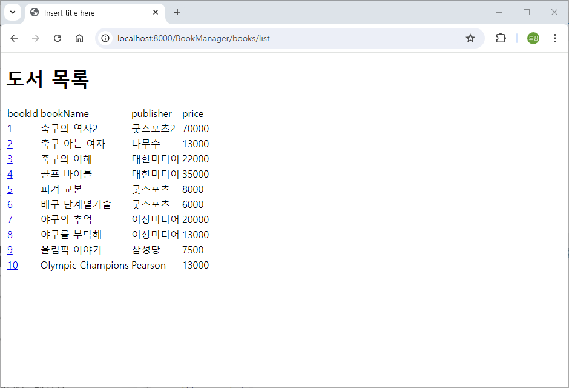

## madangdb 도서 등록 ( insert )

### webapp/list.jsp

```java
<%@ page language="java" contentType="text/html; charset=UTF-8"
    pageEncoding="UTF-8"%>
<%@ page import="java.util.List, dto.BookDto" %> 
   
<%
	List<BookDto> bookList = (List<BookDto>) request.getAttribute("bookList");
%>
    
<!DOCTYPE html>
<html>
<head>
<meta charset="UTF-8">
<title>Insert title here</title>
</head>
<body>
	<h1>도서 목록</h1>
	<table>
		<thead>
			<tr><td>bookId</td><td>bookName</td><td>publisher</td><td>price</td></tr>
		</thead>
		<tbody>
			<%
				for(BookDto bookDto : bookList) {
			%>
			
					<tr>
						<td><a href="/BookManager/books/detail?bookId=<%= bookDto.getBookId() %>"> <%= bookDto.getBookId() %> </a></td>
						<td><%= bookDto.getBookName() %></td>
						<td><%= bookDto.getPublisher() %></td>
						<td><%= bookDto.getPrice() %></td>
					</tr>
			
			<%
				}
			%>
		</tbody>
	</table>
	
	<hr>
	
	<a href="/BookManager/insertForm.jsp">등록</a>
</body>
</html>
```

### webapp/insertForm.jsp

```java
<%@ page language="java" contentType="text/html; charset=UTF-8"
    pageEncoding="UTF-8"%>
    
<!DOCTYPE html>
<html>
<head>
<meta charset="UTF-8">
<title>Insert title here</title>
</head>
<body>
	<h1>도서 등록</h1>
	<form action="/BookManager/books/insert" method="post">
		<input type="text" name="bookId"></input> <br>
		<input type="text" name="bookName"></input> <br>
		<input type="text" name="publisher"></input> <br>
		<input type="text" name="price"></input> <br>
		<button type="submin">등록</button>
	</form>
</body>
</html>
```

### java/servlet/BookServlet.java

```java
package servlet;

import java.io.IOException;
import java.util.List;

import dao.BookDao;
import dto.BookDto;
import jakarta.servlet.ServletException;
import jakarta.servlet.annotation.WebServlet;
import jakarta.servlet.http.HttpServlet;
import jakarta.servlet.http.HttpServletRequest;
import jakarta.servlet.http.HttpServletResponse;

// BookServlet 한 개에서 다양한 처리(crud)를 하기 위해 sub url
// /books/list : 목록
// /books/detail : 상세 ...
@WebServlet("/books/*")
public class BookServlet extends HttpServlet {
	private static final long serialVersionUID = 1L;

	protected void doGet(HttpServletRequest request, HttpServletResponse response) throws ServletException, IOException {
		// 기능 구현은 이곳에만 한다.
		// http://localhost:8000/BookManager/books/list
		// /BookManager/books/list
		// /BookManager
//		System.out.println(request.getRequestURI());
//		System.out.println(request.getContextPath());
		
		String job = request.getRequestURI().substring(request.getContextPath().length());
		System.out.println(job);
		
		switch(job) {
		case "/books/list" : list(request, response); break;
		case "/books/detail" : detail(request, response); break;
		case "/books/insert" : insert(request, response); break;
		case "/books/update" : update(request, response); break;
		case "/books/delete" : delete(request, response); break;
		}
	}

	protected void doPost(HttpServletRequest request, HttpServletResponse response) throws ServletException, IOException {
		// post로 요청이 오더라도 get에서 처리된다.
		doGet(request, response);
	}

	private void list(HttpServletRequest request, HttpServletResponse response) throws ServletException, IOException {
		BookDao bookDao = new BookDao();
		List<BookDto> bookList = bookDao.listBook();
		request.setAttribute("bookList", bookList);
		request.getRequestDispatcher("/list.jsp").forward(request, response);
	}
	
	private void detail(HttpServletRequest request, HttpServletResponse response) throws ServletException, IOException {
		BookDao bookDao = new BookDao();
		int bookId = Integer.parseInt(request.getParameter("bookId"));
		BookDto bookDto = bookDao.detailBook(bookId);
		request.setAttribute("bookDto", bookDto);
		request.getRequestDispatcher("/detailForm.jsp").forward(request, response);
	}
	
	private void insert(HttpServletRequest request, HttpServletResponse response) throws ServletException, IOException {
		BookDao bookDao = new BookDao();
		int bookId = Integer.parseInt(request.getParameter("bookId"));
		String bookName = request.getParameter("bookName"); // detailForm 태크의 name 속성
		String publisher = request.getParameter("publisher"); // detailForm 태크의 name 속성
		int price = Integer.parseInt(request.getParameter("price"));
		
		BookDto bookDto = new BookDto(bookId, bookName, publisher, price);
		int ret = bookDao.insertBook(bookDto);
		request.getRequestDispatcher("/insertResult.jsp").forward(request, response);
	}
	
	private void update(HttpServletRequest request, HttpServletResponse response) throws ServletException, IOException {
		BookDao bookDao = new BookDao();
		int bookId = Integer.parseInt(request.getParameter("bookId"));
		String bookName = request.getParameter("bookName"); // detailForm 태크의 name 속성
		String publisher = request.getParameter("publisher"); // detailForm 태크의 name 속성
		int price = Integer.parseInt(request.getParameter("price"));
		
		BookDto bookDto = new BookDto(bookId, bookName, publisher, price);
		int ret = bookDao.updateBook(bookDto);
		request.getRequestDispatcher("/updateResult.jsp").forward(request, response);
	}
	
	private void delete(HttpServletRequest request, HttpServletResponse response) throws ServletException, IOException {
		System.out.println("delete");
	}
	
	
}

```

### webapp/insertResult.jsp

```java
<%@ page language="java" contentType="text/html; charset=UTF-8"
    pageEncoding="UTF-8"%>
<%@ page import="java.util.List, dto.BookDto" %> 
   
<%
	BookDto bookDto = (BookDto) request.getAttribute("bookDto");
%>
    
<!DOCTYPE html>
<html>
<head>
<meta charset="UTF-8">
<title>Insert title here</title>
</head>
<body>
	<h1>도서 등록 완료</h1>
	<hr>
	<a href="/BookManager/books/list">도서 목록</a>
</body>
</html>
```

### 실행 결과

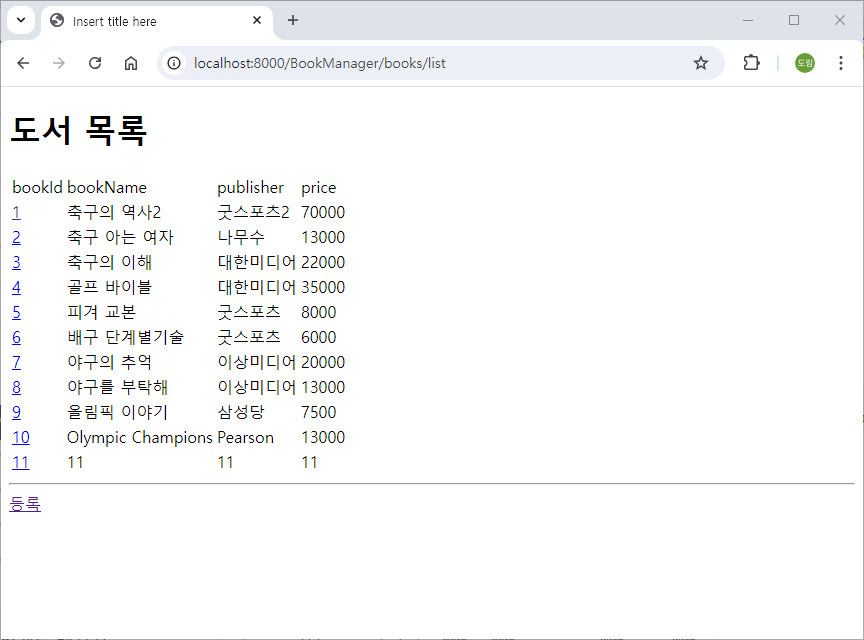

## madangdb 도서 삭제 ( delete )

### webapp/detailForm.jsp

```java
<%@ page language="java" contentType="text/html; charset=UTF-8"
    pageEncoding="UTF-8"%>
<%@ page import="java.util.List, dto.BookDto" %> 
   
<%
	BookDto bookDto = (BookDto) request.getAttribute("bookDto");
%>
    
<!DOCTYPE html>
<html>
<head>
<meta charset="UTF-8">
<title>Insert title here</title>
</head>
<body>
	<h1>도서 수정</h1>
	<form action="/BookManager/books/update" method="post">
		<input type="text" name="bookId" value="<%= bookDto.getBookId()%>"></input> <br>
		<input type="text" name="bookName" value="<%= bookDto.getBookName()%>"></input> <br>
		<input type="text" name="publisher" value="<%= bookDto.getPublisher()%>"></input> <br>
		<input type="text" name="price" value="<%= bookDto.getPrice()%>"></input> <br>
		<button type="submin">수정</button>
	</form>
	
	<hr>
	<a href="/BookManager/books/delete?bookId=<%= bookDto.getBookId() %>">삭제</a>
	
</body>
</html>
```

### java/servlet/BookServlet.java

```java
package servlet;

import java.io.IOException;
import java.util.List;

import dao.BookDao;
import dto.BookDto;
import jakarta.servlet.ServletException;
import jakarta.servlet.annotation.WebServlet;
import jakarta.servlet.http.HttpServlet;
import jakarta.servlet.http.HttpServletRequest;
import jakarta.servlet.http.HttpServletResponse;

// BookServlet 한 개에서 다양한 처리(crud)를 하기 위해 sub url
// /books/list : 목록
// /books/detail : 상세 ...
@WebServlet("/books/*")
public class BookServlet extends HttpServlet {
	private static final long serialVersionUID = 1L;

	protected void doGet(HttpServletRequest request, HttpServletResponse response) throws ServletException, IOException {
		// 기능 구현은 이곳에만 한다.
		// http://localhost:8000/BookManager/books/list
		// /BookManager/books/list
		// /BookManager
//		System.out.println(request.getRequestURI());
//		System.out.println(request.getContextPath());
		
		String job = request.getRequestURI().substring(request.getContextPath().length());
		System.out.println(job);
		
		switch(job) {
		case "/books/list" : list(request, response); break;
		case "/books/detail" : detail(request, response); break;
		case "/books/insert" : insert(request, response); break;
		case "/books/update" : update(request, response); break;
		case "/books/delete" : delete(request, response); break;
		}
	}

	protected void doPost(HttpServletRequest request, HttpServletResponse response) throws ServletException, IOException {
		// post로 요청이 오더라도 get에서 처리된다.
		doGet(request, response);
	}

	private void list(HttpServletRequest request, HttpServletResponse response) throws ServletException, IOException {
		BookDao bookDao = new BookDao();
		List<BookDto> bookList = bookDao.listBook();
		request.setAttribute("bookList", bookList);
		request.getRequestDispatcher("/list.jsp").forward(request, response);
	}
	
	private void detail(HttpServletRequest request, HttpServletResponse response) throws ServletException, IOException {
		BookDao bookDao = new BookDao();
		int bookId = Integer.parseInt(request.getParameter("bookId"));
		BookDto bookDto = bookDao.detailBook(bookId);
		request.setAttribute("bookDto", bookDto);
		request.getRequestDispatcher("/detailForm.jsp").forward(request, response);
	}
	
	private void insert(HttpServletRequest request, HttpServletResponse response) throws ServletException, IOException {
		BookDao bookDao = new BookDao();
		int bookId = Integer.parseInt(request.getParameter("bookId"));
		String bookName = request.getParameter("bookName"); // detailForm 태크의 name 속성
		String publisher = request.getParameter("publisher"); // detailForm 태크의 name 속성
		int price = Integer.parseInt(request.getParameter("price"));
		
		BookDto bookDto = new BookDto(bookId, bookName, publisher, price);
		int ret = bookDao.insertBook(bookDto);
		request.getRequestDispatcher("/insertResult.jsp").forward(request, response);
	}
	
	private void update(HttpServletRequest request, HttpServletResponse response) throws ServletException, IOException {
		BookDao bookDao = new BookDao();
		int bookId = Integer.parseInt(request.getParameter("bookId"));
		String bookName = request.getParameter("bookName"); // detailForm 태크의 name 속성
		String publisher = request.getParameter("publisher"); // detailForm 태크의 name 속성
		int price = Integer.parseInt(request.getParameter("price"));
		
		BookDto bookDto = new BookDto(bookId, bookName, publisher, price);
		int ret = bookDao.updateBook(bookDto);
		request.getRequestDispatcher("/updateResult.jsp").forward(request, response);
	}
	
	private void delete(HttpServletRequest request, HttpServletResponse response) throws ServletException, IOException {
		BookDao bookDao = new BookDao();
		
		int bookId = Integer.parseInt(request.getParameter("bookId"));
		int ret = bookDao.deleteBook(bookId);
		request.getRequestDispatcher("/deleteResult.jsp").forward(request, response);
	}
	
	
}
```

### webapp/deleteResult.jsp

```java
<%@ page language="java" contentType="text/html; charset=UTF-8"
    pageEncoding="UTF-8"%>
<%@ page import="java.util.List, dto.BookDto" %> 
   
<%
	BookDto bookDto = (BookDto) request.getAttribute("bookDto");
%>
    
<!DOCTYPE html>
<html>
<head>
<meta charset="UTF-8">
<title>Insert title here</title>
</head>
<body>
	<h1>도서 삭제 완료</h1>
	<hr>
	<a href="/BookManager/books/list">도서 목록</a>
</body>
</html>
```

### 실행 결과

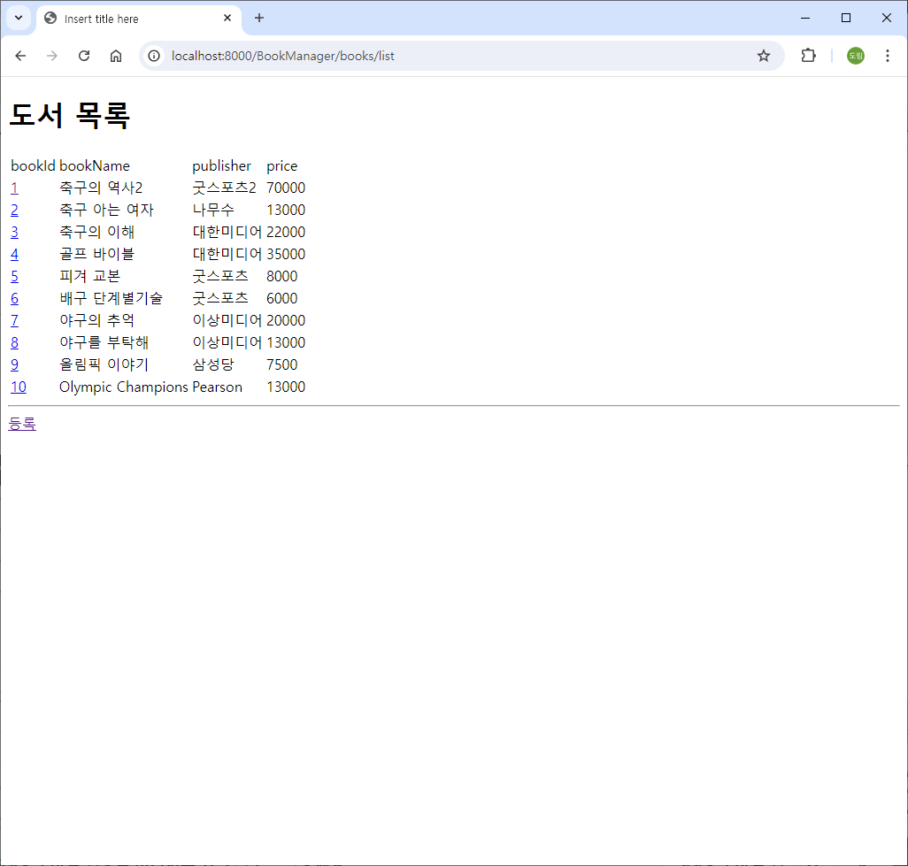

## 편의에 따라 도서 등록 및 수정 페이지에서 목록 이동 기능 추가

### webapp/insertForm.jsp

```java
<%@ page language="java" contentType="text/html; charset=UTF-8"
    pageEncoding="UTF-8"%>
    
<!DOCTYPE html>
<html>
<head>
<meta charset="UTF-8">
<title>Insert title here</title>
</head>
<body>
	<h1>도서 등록</h1>
	<form action="/BookManager/books/insert" method="post">
		<input type="text" name="bookId"></input> <br>
		<input type="text" name="bookName"></input> <br>
		<input type="text" name="publisher"></input> <br>
		<input type="text" name="price"></input> <br>
		<button type="submin">등록</button>
	</form>
	
	<hr>
	<a href="/BookManager/books/list">도서 목록</a>
</body>
</html>
```

### webapp/detailForm.jsp

```java
<%@ page language="java" contentType="text/html; charset=UTF-8"
    pageEncoding="UTF-8"%>
<%@ page import="java.util.List, dto.BookDto" %> 
   
<%
	BookDto bookDto = (BookDto) request.getAttribute("bookDto");
%>
    
<!DOCTYPE html>
<html>
<head>
<meta charset="UTF-8">
<title>Insert title here</title>
</head>
<body>
	<h1>도서 수정</h1>
	<form action="/BookManager/books/update" method="post">
		<input type="text" name="bookId" value="<%= bookDto.getBookId()%>"></input> <br>
		<input type="text" name="bookName" value="<%= bookDto.getBookName()%>"></input> <br>
		<input type="text" name="publisher" value="<%= bookDto.getPublisher()%>"></input> <br>
		<input type="text" name="price" value="<%= bookDto.getPrice()%>"></input> <br>
		<button type="submin">수정</button>
	</form>
	
	<hr>
	<a href="/BookManager/books/list">도서 목록</a>
	<a href="/BookManager/books/delete?bookId=<%= bookDto.getBookId() %>">삭제</a>
	
</body>
</html>
```

# 개인활동

- 다른 테이블(customer)로 book과 같이 HTML + Servlet + JSP을 이용하여 등록, 수정, 삭제, 조회 페이지 만들기
    
    [CustomerManager.zip](./img/20240802/CustomerManager.zip)
    

# BookManagerAjax 프로젝트 생성 (HTML + Servlet + JSP + Ajax)

## BookManager 프로젝트 복사하여 BookManagerAjax 프로젝트 생성

- 톰켓에서 context Path를 /BookManagerAjax로 변경한다.
    
    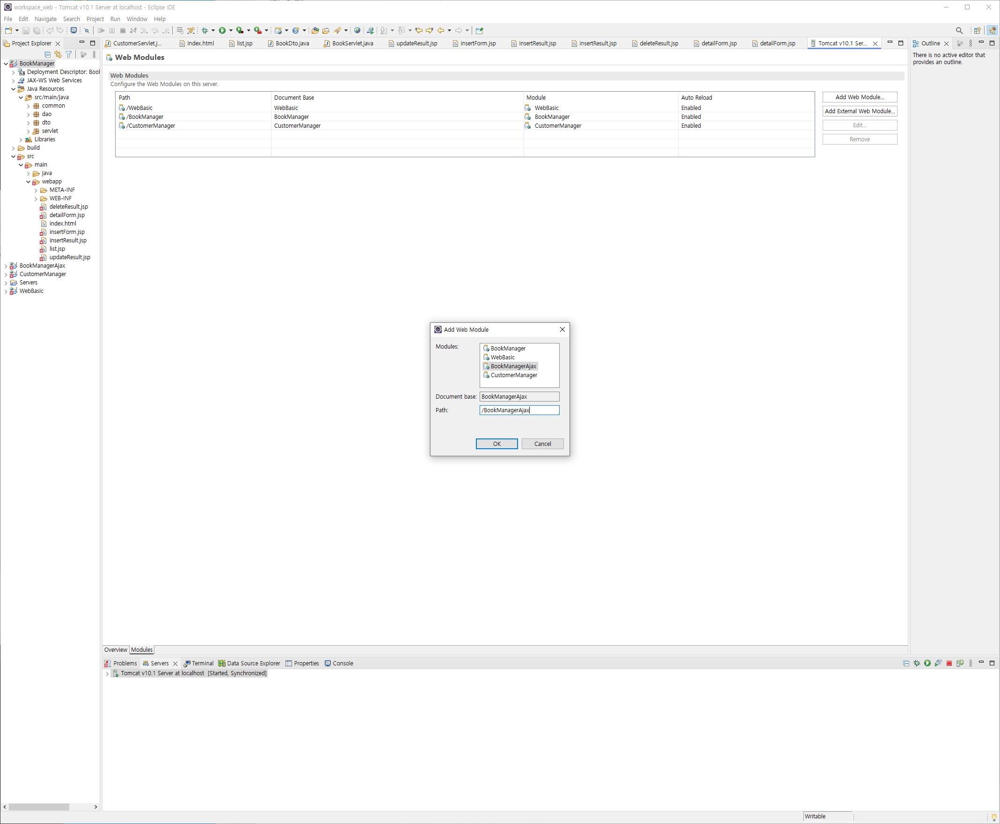
    

내가 진행하는 요청이 페이지에 대한 요청인지 data에 대한 요청인지 구분해야 한다.

- HTML을 포함하는 Page 요청
- HTML을 포함하지 않는 data 요청 (JSON 사용)

## Ajax, gson으로 도서 목록, 상세 보여주기

### gson 추가하기

https://mvnrepository.com/artifact/com.google.code.gson/gson/2.10.1

1. gson 2.10.1 version jar 파일로 다운로드 받아서 톰켓 lib 디렉토리에 추가

    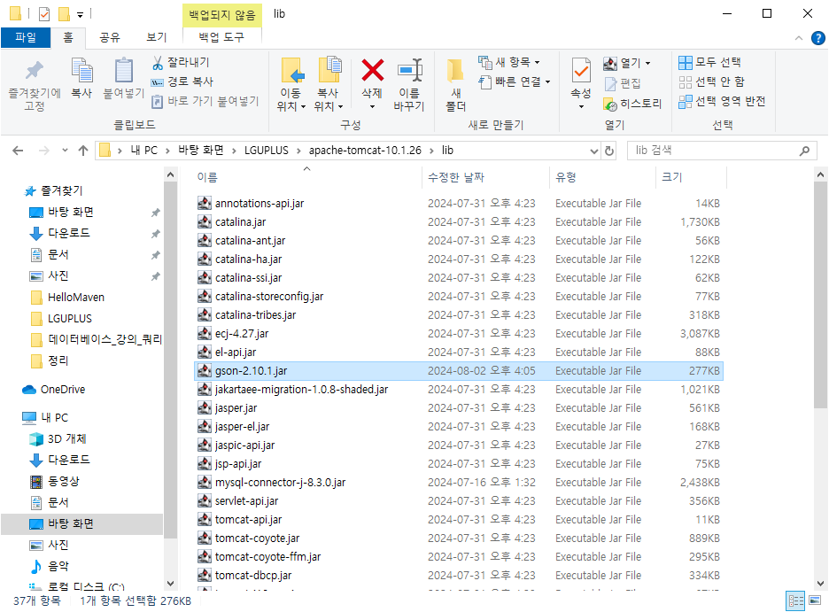

2. 이클립스에서 BookManagerAjax 프로젝트에 BuildPath 추가 (classpath에 [Add External JARs…])
    
    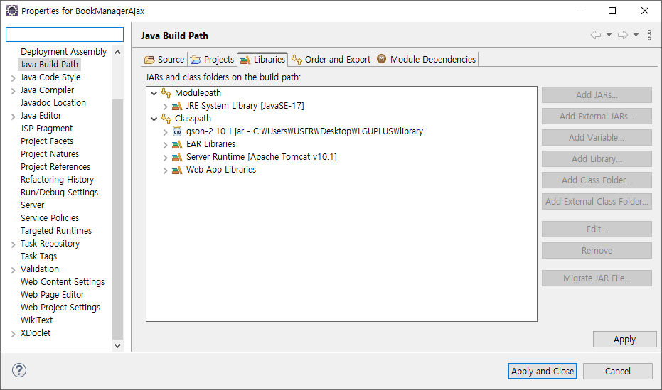
    

### webapp/index.html

```java
<!DOCTYPE html>
<html>
<head>
<meta charset="UTF-8">
<title>Insert title here</title>
</head>
<body>
	<h1>도서 관리 프로그램</h1>
	
	<a href="/BookManagerAjax/books.jsp">도서 목록</a> <a href="#">고객 목록</a>
</body>
</html>
```

### webapp/books.jsp

```java
<%@ page language="java" contentType="text/html; charset=UTF-8"
    pageEncoding="UTF-8"%>
    
<%--
	하나의 jsp에서 CRUD를 한 꺼번에 처리 
	
	비동기 요청 (ajax)는 fetch 함수가 나오기 전까지 매우 복잡한 구조를 가지고 있었다.
 --%>
    
<!DOCTYPE html>
<html>
<head>
<meta charset="UTF-8">
<title>Insert title here</title>
</head>
<body>
	<h1>도서 관리</h1>
	<table>
		<thead>
			<tr><td>bookId</td><td>bookName</td><td>publisher</td><td>price</td></tr>
		</thead>
		<tbody id="bookTbody">
			
		</tbody>
	</table>
	
	<hr>
	
	<form> <!-- 등록, 수정, 삭제에 모두 사용된다. -->
		<input type="text" name="bookId" id="bookId"></input> <br>
		<input type="text" name="bookName" id="bookName"></input> <br>
		<input type="text" name="publisher" id="publisher"></input> <br>
		<input type="text" name="price" id="price"></input> <br>
	</form>
	<hr>
	<button type="button">등록</button> <button type="button">수정</button> <button type="button">삭제</button>
	
	<script>
		window.onload = function() {
			listBook();
		}
		
		async function listBook() {
			// back-end에 도서 목록 요청 (ajax, json)
			let url = '/BookManagerAjax/books/list'
			let response = await fetch(url)  // await : fetch() 종료될 때까지 기다린다.
			let data = await response.json(); // response에 담긴 json 문자열을 javascript object로 변환
			
			makeListHtml(data);
		}
		
		function makeListHtml(list){
            let listHTML = ``;
            
            list.forEach( el => {
                listHTML +=
                    `<tr data-bookId="\${el.bookId}">
                        <td>\${el.bookId}</td>
                        <td>\${el.bookName}</td>
                        <td>\${el.publisher}</td>
                        <td>\${el.price}</td>
                    </tr>`;
            });
            
            document.querySelector("#bookTbody").innerHTML = listHTML;
            
            document.querySelectorAll("#bookTbody tr").forEach( el => {
            	el.onclick = function() {
            		let bookId = this.getAttribute("data-bookId");
            		detailBook(bookId);
            	}
            });
        }
		
		async function detailBook(bookId) {
			console.log(bookId);
			
			let url = '/BookManagerAjax/books/detail?bookId=' + bookId;
			let response = await fetch(url)  // await : fetch() 종료될 때까지 기다린다.
			let data = await response.json(); // response에 담긴 json 문자열을 javascript object로 변환
			
			document.querySelector("#bookId").value = data.bookId;
			document.querySelector("#bookName").value = data.bookName;
			document.querySelector("#publisher").value = data.publisher;
			document.querySelector("#price").value = data.price;
		}
	</script>
	
</body>
</html>
```

### java/servlet/BookServlet.java

```java
package servlet;

import java.io.IOException;
import java.util.List;

import com.google.gson.Gson;

import dao.BookDao;
import dto.BookDto;
import jakarta.servlet.ServletException;
import jakarta.servlet.annotation.WebServlet;
import jakarta.servlet.http.HttpServlet;
import jakarta.servlet.http.HttpServletRequest;
import jakarta.servlet.http.HttpServletResponse;

// BookServlet 한 개에서 다양한 처리(crud)를 하기 위해 sub url
// /books/list : 목록
// /books/detail : 상세 ...
@WebServlet("/books/*")
public class BookServlet extends HttpServlet {
	private static final long serialVersionUID = 1L;

	protected void doGet(HttpServletRequest request, HttpServletResponse response) throws ServletException, IOException {
		// 기능 구현은 이곳에만 한다.
		// http://localhost:8000/BookManager/books/list
		// /BookManager/books/list
		// /BookManager
//		System.out.println(request.getRequestURI());
//		System.out.println(request.getContextPath());
		
		String job = request.getRequestURI().substring(request.getContextPath().length());
		System.out.println(job);
		
		switch(job) {
		case "/books/list" : list(request, response); break;
		case "/books/detail" : detail(request, response); break;
		case "/books/insert" : insert(request, response); break;
		case "/books/update" : update(request, response); break;
		case "/books/delete" : delete(request, response); break;
		}
	}

	protected void doPost(HttpServletRequest request, HttpServletResponse response) throws ServletException, IOException {
		// post로 요청이 오더라도 get에서 처리된다.
		doGet(request, response);
	}

	private void list(HttpServletRequest request, HttpServletResponse response) throws ServletException, IOException {
		response.setContentType("application/json; charset=utf-8");
		BookDao bookDao = new BookDao();
		List<BookDto> bookList = bookDao.listBook();

		Gson gson = new Gson();
		String jsonStr = gson.toJson(bookList);
		System.out.println(jsonStr);
		response.getWriter().write(jsonStr);
	}
	
	private void detail(HttpServletRequest request, HttpServletResponse response) throws ServletException, IOException {
		BookDao bookDao = new BookDao();
		int bookId = Integer.parseInt(request.getParameter("bookId"));
		BookDto bookDto = bookDao.detailBook(bookId);
		
		Gson gson = new Gson();
		String jsonStr = gson.toJson(bookDto);
		System.out.println(jsonStr);
		response.getWriter().write(jsonStr);
	}
	
	private void insert(HttpServletRequest request, HttpServletResponse response) throws ServletException, IOException {
		BookDao bookDao = new BookDao();
		int bookId = Integer.parseInt(request.getParameter("bookId"));
		String bookName = request.getParameter("bookName"); // detailForm 태크의 name 속성
		String publisher = request.getParameter("publisher"); // detailForm 태크의 name 속성
		int price = Integer.parseInt(request.getParameter("price"));
		
		BookDto bookDto = new BookDto(bookId, bookName, publisher, price);
		int ret = bookDao.insertBook(bookDto);
		request.getRequestDispatcher("/insertResult.jsp").forward(request, response);
	}
	
	private void update(HttpServletRequest request, HttpServletResponse response) throws ServletException, IOException {
		BookDao bookDao = new BookDao();
		int bookId = Integer.parseInt(request.getParameter("bookId"));
		String bookName = request.getParameter("bookName"); // detailForm 태크의 name 속성
		String publisher = request.getParameter("publisher"); // detailForm 태크의 name 속성
		int price = Integer.parseInt(request.getParameter("price"));
		
		BookDto bookDto = new BookDto(bookId, bookName, publisher, price);
		int ret = bookDao.updateBook(bookDto);
		request.getRequestDispatcher("/updateResult.jsp").forward(request, response);
	}
	
	private void delete(HttpServletRequest request, HttpServletResponse response) throws ServletException, IOException {
		BookDao bookDao = new BookDao();
		
		int bookId = Integer.parseInt(request.getParameter("bookId"));
		int ret = bookDao.deleteBook(bookId);
		request.getRequestDispatcher("/deleteResult.jsp").forward(request, response);
	}
	
	
}
```

### 실행 결과

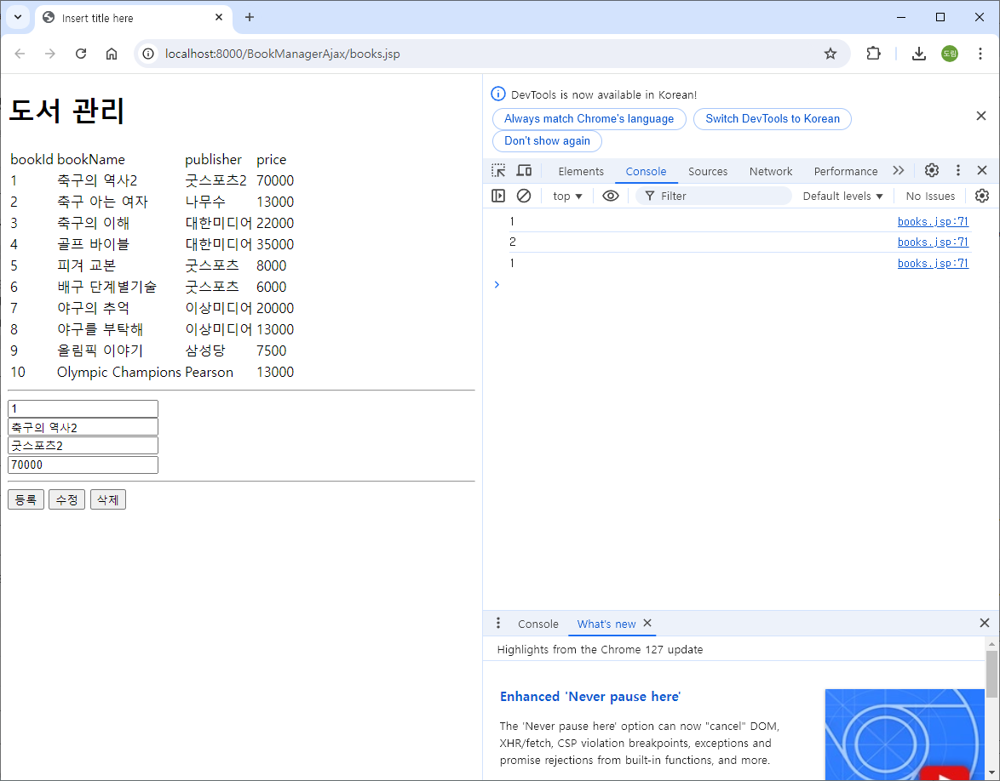

## Ajax, gson으로 도서 등록, 수정, 삭제

### webapp/books.jsp

```java
<%@ page language="java" contentType="text/html; charset=UTF-8"
    pageEncoding="UTF-8"%>
    
<%--
	하나의 jsp에서 CRUD를 한 꺼번에 처리 
	
	비동기 요청 (ajax)는 fetch 함수가 나오기 전까지 매우 복잡한 구조를 가지고 있었다.
 --%>
    
<!DOCTYPE html>
<html>
<head>
<meta charset="UTF-8">
<title>Insert title here</title>
</head>
<body>
	<h1>도서 관리</h1>
	<table>
		<thead>
			<tr><td>bookId</td><td>bookName</td><td>publisher</td><td>price</td></tr>
		</thead>
		<tbody id="bookTbody">
			
		</tbody>
	</table>
	
	<hr>
	
	<form> <!-- 등록, 수정, 삭제에 모두 사용된다. -->
		<input type="text" name="bookId" id="bookId"></input> <br>
		<input type="text" name="bookName" id="bookName"></input> <br>
		<input type="text" name="publisher" id="publisher"></input> <br>
		<input type="text" name="price" id="price"></input> <br>
	</form>
	<hr>
	<button type="button" id="btnInsert">등록</button> <button type="button" id="btnUpdate">수정</button> <button type="button" id="btnDelete">삭제</button>
	
	<script>
		window.onload = function() {
			listBook();
			
			document.querySelector("#btnInsert").onclick = insertBook; // 함수를 변수로 저장?
			document.querySelector("#btnUpdate").onclick = updateBook; // 함수를 변수로 저장?
			document.querySelector("#btnDelete").onclick = deleteBook; // 함수를 변수로 저장?
		}
		
		async function listBook() {
			// back-end에 도서 목록 요청 (ajax, json)
			let url = '/BookManagerAjax/books/list'
			let response = await fetch(url)  // await : fetch() 종료될 때까지 기다린다.
			let data = await response.json(); // response에 담긴 json 문자열을 javascript object로 변환
			
			makeListHtml(data);
		}
		
		function makeListHtml(list){
            let listHTML = ``;
            
            list.forEach( el => {
                listHTML +=
                    `<tr data-bookId="\${el.bookId}">
                        <td>\${el.bookId}</td>
                        <td>\${el.bookName}</td>
                        <td>\${el.publisher}</td>
                        <td>\${el.price}</td>
                    </tr>`;
            });
            
            document.querySelector("#bookTbody").innerHTML = listHTML;
            
            document.querySelectorAll("#bookTbody tr").forEach( el => {
            	el.onclick = function() {
            		let bookId = this.getAttribute("data-bookId");
            		detailBook(bookId);
            	}
            });
        }
		
		async function detailBook(bookId) {
			console.log(bookId);
			
			let url = '/BookManagerAjax/books/detail?bookId=' + bookId;
			let response = await fetch(url)  // await : fetch() 종료될 때까지 기다린다.
			let data = await response.json(); // response에 담긴 json 문자열을 javascript object로 변환
			
			document.querySelector("#bookId").value = data.bookId;
			document.querySelector("#bookName").value = data.bookName;
			document.querySelector("#publisher").value = data.publisher;
			document.querySelector("#price").value = data.price;
		}
		
		async function insertBook() {
			let urlParams = new URLSearchParams({ // object로 파라미터를 넘긴다.
				bookId : document.querySelector("#bookId").value,
				bookName : document.querySelector("#bookName").value,
				publisher : document.querySelector("#publisher").value,
				price : document.querySelector("#price").value
			});
			
			let fetchOptions = {
					method : "POST",
					body : urlParams
			}
			
			let url = '/BookManagerAjax/books/insert';
			let response = await fetch(url, fetchOptions)  // await : fetch() 종료될 때까지 기다린다.
			let data = await response.json(); // response에 담긴 json 문자열을 javascript object로 변환
			
			alert("도서 등록 완료");
			
			listBook();
		}
		
		async function updateBook() {
			let urlParams = new URLSearchParams({ // object로 파라미터를 넘긴다.
				bookId : document.querySelector("#bookId").value,
				bookName : document.querySelector("#bookName").value,
				publisher : document.querySelector("#publisher").value,
				price : document.querySelector("#price").value
			});
			
			let fetchOptions = {
					method : "POST",
					body : urlParams
			}
			
			let url = '/BookManagerAjax/books/update';
			let response = await fetch(url, fetchOptions)  // await : fetch() 종료될 때까지 기다린다.
			let data = await response.json(); // response에 담긴 json 문자열을 javascript object로 변환
			
			alert("도서 수정 완료");
			
			listBook();
		}
		
		async function deleteBook() {
			let bookId = document.querySelector("#bookId").value;
			
			let url = '/BookManagerAjax/books/delete?bookId=' + bookId;
			let response = await fetch(url)  // await : fetch() 종료될 때까지 기다린다.
			let data = await response.json(); // response에 담긴 json 문자열을 javascript object로 변환
			
			alert("도서 삭제 완료");
			
			listBook();
		}
	</script>
	
</body>
</html>
```

### java/servlet/BookServlet.java

```java
package servlet;

import java.io.IOException;
import java.util.List;

import com.google.gson.Gson;
import com.google.gson.JsonObject;

import dao.BookDao;
import dto.BookDto;
import jakarta.servlet.ServletException;
import jakarta.servlet.annotation.WebServlet;
import jakarta.servlet.http.HttpServlet;
import jakarta.servlet.http.HttpServletRequest;
import jakarta.servlet.http.HttpServletResponse;

// BookServlet 한 개에서 다양한 처리(crud)를 하기 위해 sub url
// /books/list : 목록
// /books/detail : 상세 ...
@WebServlet("/books/*")
public class BookServlet extends HttpServlet {
	private static final long serialVersionUID = 1L;

	protected void doGet(HttpServletRequest request, HttpServletResponse response) throws ServletException, IOException {
		// 기능 구현은 이곳에만 한다.
		// http://localhost:8000/BookManager/books/list
		// /BookManager/books/list
		// /BookManager
//		System.out.println(request.getRequestURI());
//		System.out.println(request.getContextPath());
		
		String job = request.getRequestURI().substring(request.getContextPath().length());
		System.out.println(job);
		
		switch(job) {
		case "/books/list" : list(request, response); break;
		case "/books/detail" : detail(request, response); break;
		case "/books/insert" : insert(request, response); break;
		case "/books/update" : update(request, response); break;
		case "/books/delete" : delete(request, response); break;
		}
	}

	protected void doPost(HttpServletRequest request, HttpServletResponse response) throws ServletException, IOException {
		// post로 요청이 오더라도 get에서 처리된다.
		doGet(request, response);
	}

	private void list(HttpServletRequest request, HttpServletResponse response) throws ServletException, IOException {
		response.setContentType("application/json; charset=utf-8");
		BookDao bookDao = new BookDao();
		List<BookDto> bookList = bookDao.listBook();

		Gson gson = new Gson();
		String jsonStr = gson.toJson(bookList);
		System.out.println(jsonStr);
		response.getWriter().write(jsonStr);
	}
	
	private void detail(HttpServletRequest request, HttpServletResponse response) throws ServletException, IOException {
		BookDao bookDao = new BookDao();
		int bookId = Integer.parseInt(request.getParameter("bookId"));
		BookDto bookDto = bookDao.detailBook(bookId);
		
		Gson gson = new Gson();
		String jsonStr = gson.toJson(bookDto);
		System.out.println(jsonStr);
		response.getWriter().write(jsonStr);
	}
	
	private void insert(HttpServletRequest request, HttpServletResponse response) throws ServletException, IOException {
		BookDao bookDao = new BookDao();
		int bookId = Integer.parseInt(request.getParameter("bookId"));
		String bookName = request.getParameter("bookName"); // detailForm 태크의 name 속성
		String publisher = request.getParameter("publisher"); // detailForm 태크의 name 속성
		int price = Integer.parseInt(request.getParameter("price"));
		
		BookDto bookDto = new BookDto(bookId, bookName, publisher, price);
		int ret = bookDao.insertBook(bookDto);
		
		Gson gson = new Gson();
		JsonObject jsonObject = new JsonObject();
		
		if(ret == 1) {
			jsonObject.addProperty("result", "success");
		} else {
			jsonObject.addProperty("result", "fail");
		}
		
		String jsonStr = gson.toJson(jsonObject);
		System.out.println(jsonStr);
		response.getWriter().write(jsonStr);
	}
	
	private void update(HttpServletRequest request, HttpServletResponse response) throws ServletException, IOException {
		BookDao bookDao = new BookDao();
		int bookId = Integer.parseInt(request.getParameter("bookId"));
		String bookName = request.getParameter("bookName"); // detailForm 태크의 name 속성
		String publisher = request.getParameter("publisher"); // detailForm 태크의 name 속성
		int price = Integer.parseInt(request.getParameter("price"));
		
		BookDto bookDto = new BookDto(bookId, bookName, publisher, price);
		int ret = bookDao.updateBook(bookDto);

		Gson gson = new Gson();
		JsonObject jsonObject = new JsonObject();
		
		if(ret == 1) {
			jsonObject.addProperty("result", "success");
		} else {
			jsonObject.addProperty("result", "fail");
		}
		
		String jsonStr = gson.toJson(jsonObject);
		System.out.println(jsonStr);
		response.getWriter().write(jsonStr);
	}
	
	private void delete(HttpServletRequest request, HttpServletResponse response) throws ServletException, IOException {
		BookDao bookDao = new BookDao();
		
		int bookId = Integer.parseInt(request.getParameter("bookId"));
		int ret = bookDao.deleteBook(bookId);

		Gson gson = new Gson();
		JsonObject jsonObject = new JsonObject();
		
		if(ret == 1) {
			jsonObject.addProperty("result", "success");
		} else {
			jsonObject.addProperty("result", "fail");
		}
		
		String jsonStr = gson.toJson(jsonObject);
		System.out.println(jsonStr);
		response.getWriter().write(jsonStr);
	}
	
	
}
```

### 실행결과

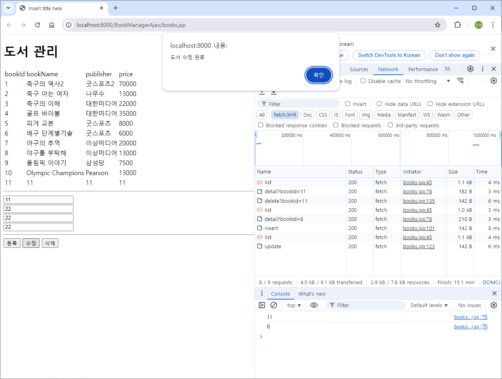