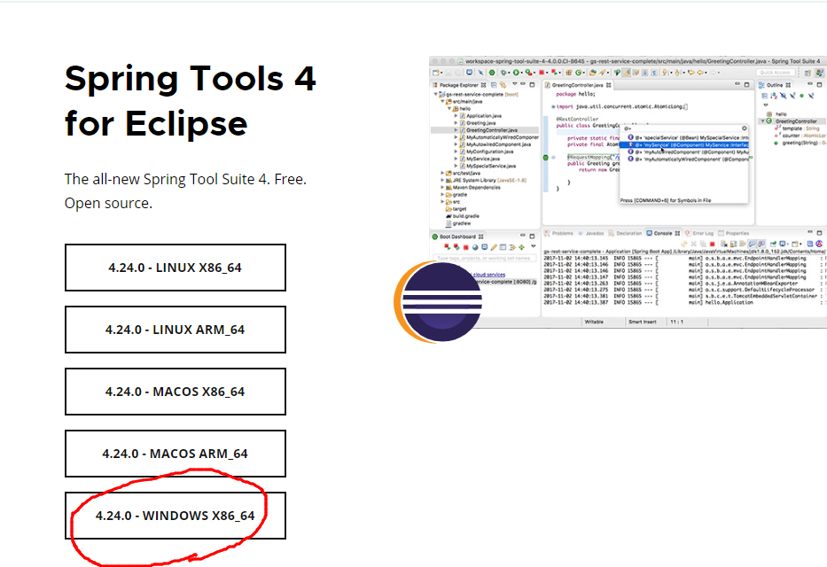
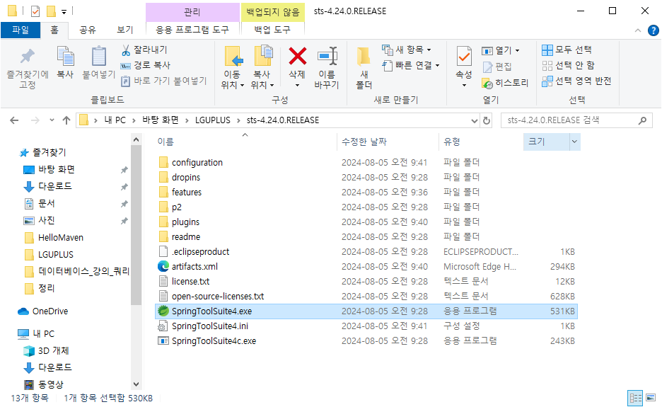
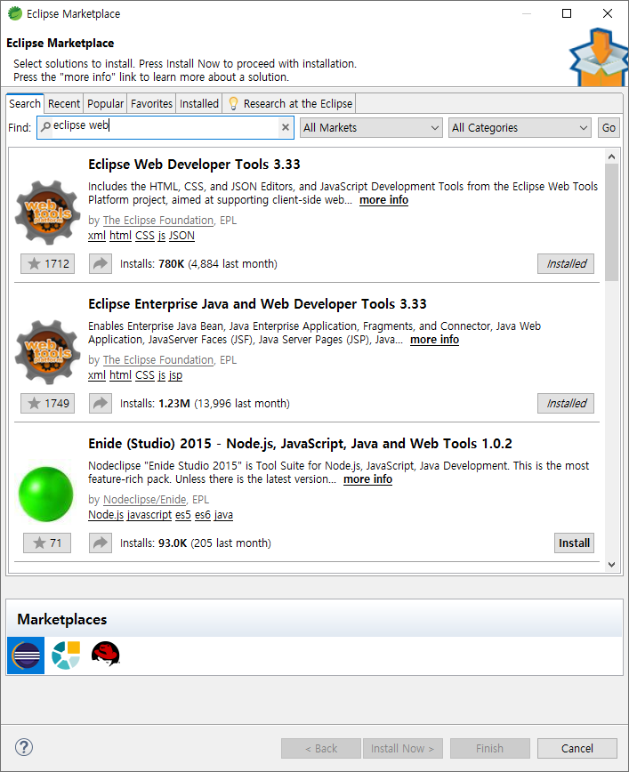
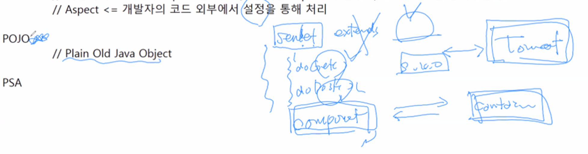
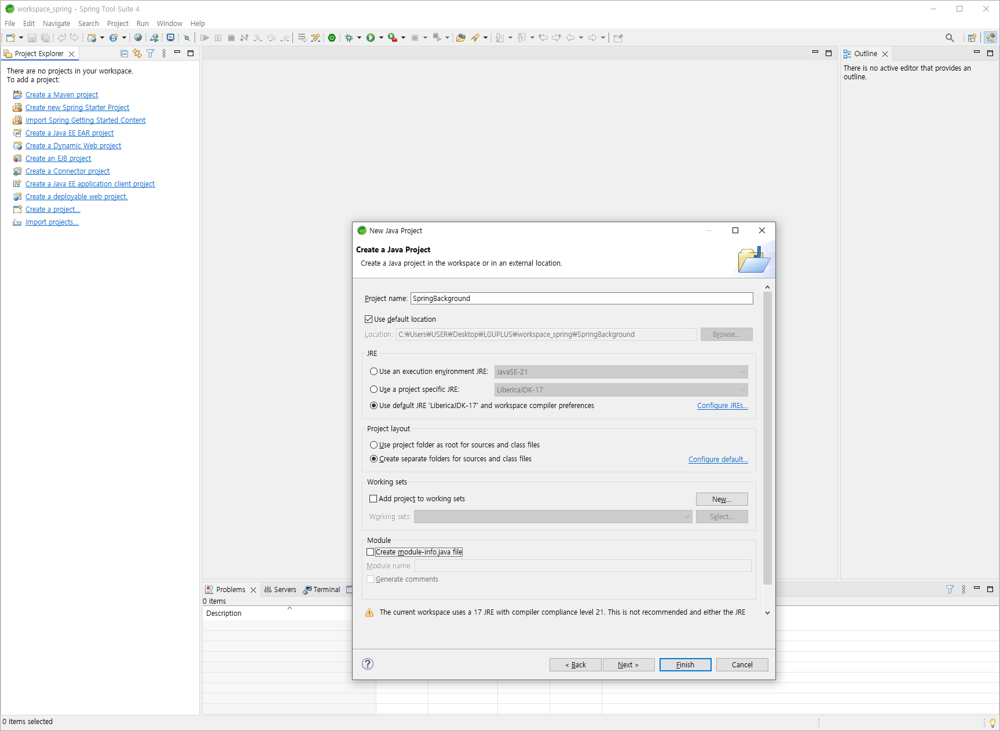

# [2024.08.05(월)] Spring 4가지 개념/Background 개념

---

# Spring

web java(servlet.jsp) + 알파 ⇒ enterprise 필요 ⇒ 돈, 처리

EJB API → sessionBean, entityBean → 무겁다, 개발 난이도가 어렵다 → 비용이 올라간다

- 어노테이션, refectu API, proxy

## Spring Tool Suite 4 다운로드 및 셋팅

- sts4 다운로드 : https://spring.io/tools
    
    
    
- 다운로드 파일 더블클릭하여 압축 풀기 → 압축해제한 디렉토리 (C:\Users\USER\Desktop\LGUPLUS\sts-4.24.0.RELEASE4.24.0.RELEASE)에서 SpringToolSuite4.exe 실행
    
    
    
- SpringToolSuite4 → Help → Eclipse Marketplace → ‘eclipse web’검색하여 ‘Eclipse Enterprise Java and Web Developter Tools 3.33’ install
    
    
    

## 조별활동 - 스프링 4가지 개념 정리(DI, AOP, POJO, PAS)

### DI (Dependency Injection)

### 정의

DI는 객체 간의 의존성을 외부에서 주입하는 디자인 패턴입니다. 객체는 필요한 의존성을 직접 생성하는 대신, 외부에서 주입받아 사용합니다. 스프링은 이를 통해 객체 간의 결합도를 낮추고, 유연하고 테스트 가능한 코드를 작성할 수 있게 합니다.

### 역할 및 장점

- **역할**: 객체 간의 의존성을 스프링 컨테이너가 관리하여 주입합니다.
- **장점**:
    - 결합도 감소: 객체 간의 의존성을 낮추어 유연한 설계가 가능합니다.
    - 테스트 용이성: 의존성 주입을 통해 Mock 객체를 사용한 단위 테스트가 쉬워집니다.
    - 재사용성 증가: 객체를 독립적으로 설계할 수 있어 재사용성이 높아집니다.

### AOP (Aspect-Oriented Programming)

### 정의

AOP는 애플리케이션의 핵심 비즈니스 로직과 부가적인 관심사(로깅, 트랜잭션 관리 등)를 분리하여 모듈화하는 프로그래밍 패러다임입니다. 스프링 AOP는 이러한 부가적인 관심사를 애스펙트(Aspect)로 정의하고, 이를 비즈니스 로직과 분리하여 관리합니다.

### 역할 및 장점

- **역할**: 횡단 관심사를 애스펙트로 분리하여 비즈니스 로직과 분리된 형태로 관리합니다.
- **장점**:
    - 코드 중복 감소: 로깅, 보안, 트랜잭션 관리 등의 공통 로직을 분리하여 코드 중복을 줄입니다.
    - 유지보수 용이성: 비즈니스 로직과 부가적인 관심사가 분리되어 유지보수가 용이합니다.
    - 모듈화: 횡단 관심사를 애스펙트로 모듈화하여 관리할 수 있습니다.

### POJO (Plain Old Java Object)

### 정의

POJO는 특정 자바 객체 모델이나 프레임워크의 규칙에 종속되지 않는 순수한 자바 객체를 의미합니다. 스프링은 POJO 기반의 프로그래밍을 지향하여, 특정 프레임워크에 종속되지 않는 유연한 애플리케이션 개발을 가능하게 합니다.

### 역할 및 장점

- **역할**: 스프링 빈은 특별한 요구사항 없이 POJO로 작성됩니다.
- **장점**:
    - 단순성: 간단한 자바 객체로 비즈니스 로직을 구현할 수 있습니다.
    - 프레임워크 종속성 제거: 특정 프레임워크에 종속되지 않아 다양한 환경에서 재사용이 가능합니다.
    - 테스트 용이성: 간단한 POJO 객체로 테스트하기 쉽습니다.

### PAS (Portable Service Abstraction)

### 정의

PAS는 스프링 프레임워크가 다양한 서비스 환경(예: 트랜잭션 관리, 메시징, 데이터 접근)을 추상화하여 제공하는 것을 의미합니다. 스프링은 특정 구현체에 종속되지 않고, 다양한 환경에서 일관된 방식으로 서비스를 사용할 수 있도록 추상화를 제공합니다.

### 역할 및 장점

- **역할**: 다양한 서비스 환경에 대한 추상화를 제공하여 일관된 방식으로 서비스를 사용할 수 있게 합니다.
- **장점**:
    - 이식성: 다양한 환경에서 동일한 코드로 서비스에 접근할 수 있습니다.
    - 유연성: 특정 구현체에 종속되지 않으므로 다른 구현체로의 전환이 용이합니다.
    - 일관성: 여러 서비스 환경에서 일관된 프로그래밍 모델을 제공합니다.

### 결론

- **DI(Dependency Injection)**: 객체 간의 의존성을 외부에서 주입하여 결합도를 낮추고 유연한 설계를 가능하게 합니다.
- **AOP(Aspect-Oriented Programming)**: 횡단 관심사를 애스펙트로 분리하여 비즈니스 로직과 부가적인 로직을 모듈화합니다.
- **POJO(Plain Old Java Object)**: 특정 프레임워크에 종속되지 않는 순수한 자바 객체를 사용하여 단순하고 유연한 애플리케이션을 개발합니다.
- **PAS(Portable Service Abstraction)**: 다양한 서비스 환경을 추상화하여 일관된 방식으로 서비스를 사용할 수 있게 합니다.

## 스프링 4가지 개념 정리(DI, AOP, POJO, PAS)

### DI

- 전통적인 코드
    
    개발자가 선언하고 내가 객체 생성, 연결
    
    ```java
    MyIF, MyIFImpl
    
    MyIF myIf = new MyIFImpl();
    
    MyIF myIf = MyIFImpl.getInstance();
    ```
    

- spring 코드
    
    변수만 선언하고 객체 생성, 연결을 Spring에 의뢰
    
    spring이 의뢰된 객체를 생성, 연결해 준다.
    
    ```java
    @Autowired
    
    MyIF myIf;
    ```
    

⇒ 코드 사이의 decoupling 유도

### AOP

- Aspect
    
    mandotory (꼭 필요한) but Not relatee to BL(비즈니스 로직)
    
    예시 - Logging, Transaction 등
    
    개발자의 코드에서 Aspect를 빼고 (개발자는 Aspect에 신경 X) BL의 코드만 남겨놓는다.
    
    Aspect <= 개발자의 코드 외부에서 설정을 통해 처리
    

### POJO

Plain Old Java Object



### PSA

JDBC 처럼, Spring은 개방구조 Spring + 알파 (알파에 가능한 api 추상화, 알파를 구현하는 솔루션들을 사용)

## Spring을 이해하기 위한 Background 개념

1. Reflection
2. Proxy
3. Annotation

## Reflection, Proxy, Annotation 실습

### Spring Tool Suite 4에서 Java Project 생성

- **STS4 Linkage Error** 해결 방법 : https://abcd123.tistory.com/7



### Spring Framework

- Before Spring Framework
    
    html + servlet + jsp ←→ Tomcat (container(Tomcat)와 component(servlet + jsp)가 상호 약속 (servlet version)에 의해 동작)
    
- With Spring Framework
    
    html + jsp + POJO ←→ Spring(DispatcherServlet + spring module) ←→ Tomcat
    

### reflection

### User.java

```java
package reflection;

public class User {
	private String username;
	private String password;
	
	public User() {}
	
	public User(String username, String password) {
		super();
		this.username = username;
		this.password = password;
	}
	
	public String getUsername() {
		return username;
	}
	public void setUsername(String username) {
		this.username = username;
	}
	public String getPassword() {
		return password;
	}
	public void setPassword(String password) {
		this.password = password;
	}
	
	@Override
	public String toString() {
		return "User [username=" + username + ", password=" + password + "]";
	}
	
}
```

### Test.java

```java
package reflection;

import java.lang.reflect.Constructor;
import java.lang.reflect.Field;
import java.lang.reflect.Method;

public class Test {

	public static void main(String[] args) throws Exception {
		Class<?> userClass = Class.forName("reflection.User");
		 
		 // class 이동
//		 System.out.println(userClass.getName());
		 
		 // field
//		 Field[] fields = userClass.getDeclaredFields();
//		 for (Field field : fields) {
//			System.out.println(field.getName() + " / " + field.getType());
//		 }
		 
		 // method
//		 Method[] methods = userClass.getDeclaredMethods();
//		 for (Method method : methods) {
//			System.out.println(method.getName() + " / " + method.getReturnType());
//		 }
		 
		 // constructor
//		 Constructor[] constructors = userClass.getDeclaredConstructors();
//		 for (Constructor constructor : constructors) {
//			 System.out.println(constructor.getName() + " / " + constructor.getParameterCount());
//		 }
		 
		 // Class의 객체 생성, 제어 
		 Constructor<?> constructor = userClass.getDeclaredConstructor(String.class, String.class);
		 Object obj = constructor.newInstance("홍길동", "1234");
		 System.out.println(obj);
		 
		 // 객체의 field
		 Field username = userClass.getDeclaredField("username");
		 System.out.println(username.canAccess(obj));  // private이면 false
		 
		 username.setAccessible(true);
		 System.out.println(username.canAccess(obj));  
		 
		 // setter
		 System.out.println(obj);
		 username.set(obj, "이길동");
		 System.out.println(obj);
		 
		 // 메소드 호출
		 Method getPassword = userClass.getDeclaredMethod("getPassword");
		 String password = (String) getPassword.invoke(obj);
		 System.out.println(password);
		 
		 Method setPassword = userClass.getDeclaredMethod("setPassword", String.class);
		 setPassword.invoke(obj, "5678");
		 System.out.println(obj);
	}

}
```

### annotation

### annotation.aboutme (클래스에 어노테이션 사용)

### AboutMe.java

```java
package annotation.aboutme;

import java.lang.annotation.ElementType;
import java.lang.annotation.Retention;
import java.lang.annotation.RetentionPolicy;
import java.lang.annotation.Target;

// class에 사용할 annotation
@Retention(RetentionPolicy.RUNTIME)
@Target(ElementType.TYPE)
public @interface AboutMe {
	// attribute(추상 메소드)
	String love();
	String hate();
	
}
```

### MyClass.java

```java
package annotation.aboutme;

@AboutMe(love = "sports", hate = "study")
public class MyClass {

}
```

### Test.java

```java
package annotation.aboutme;

import java.lang.annotation.Annotation;

// reflection을 이용해서 annotation 확인
public class Test {

	public static void main(String[] args) throws Exception {
		Class<?> myClass = Class.forName("annotation.aboutme.MyClass");
		
		Annotation[] annotations = myClass.getAnnotations();
		for (Annotation annotation : annotations) {
			if( annotation instanceof AboutMe ) {
				AboutMe aboutMe = (AboutMe) annotation;
				System.out.println(aboutMe.love());
				System.out.println(aboutMe.hate());
			}
		}
	}

}

```

### annotation.encrypt (필드에 어노테이션 사용)

### Encrypt.java

```java
package annotation.encrypt;

import java.lang.annotation.ElementType;
import java.lang.annotation.Retention;
import java.lang.annotation.RetentionPolicy;
import java.lang.annotation.Target;

@Retention(RetentionPolicy.RUNTIME)
@Target(ElementType.FIELD)  // 필드에 사용
public @interface Encrypt {

}
```

### User.java

- reflection/User.java 복사하여 수정

```java
package annotation.encrypt;

public class User {
	private String username;
	
	@Encrypt
	private String password;
	
	public User() {}
	
	public User(String username, String password) {
		super();
		this.username = username;
		this.password = password;
	}
	
	public String getUsername() {
		return username;
	}
	public void setUsername(String username) {
		this.username = username;
	}
	public String getPassword() {
		return password;
	}
	public void setPassword(String password) {
		this.password = password;
	}
	
	@Override
	public String toString() {
		return "User [username=" + username + ", password=" + password + "]";
	}
	
}
```

### EncryptHandler

```java
package annotation.encrypt;

import java.lang.reflect.Field;
import java.util.Base64;

public class EncryptHandler {
	
	// @Encrypt 발견
	public static void handleAnootation(Object obj) {
		Field[] fields = obj.getClass().getDeclaredFields();
		
		for (Field field : fields) {
			if(field.isAnnotationPresent(Encrypt.class)) {
				encryptField(obj, field);
			}
		}
	}
	
	// @Encrypt 처리
	private static void encryptField(Object obj, Field field) {
		field.setAccessible(true);
		// 암호화
		try {
			Object value = field.get(obj); // "1234"
			if(value instanceof String) {
				String encryptedValue = Base64.getEncoder().encodeToString( ((String)value).getBytes() );
				field.set(obj, encryptedValue);
			}
		} catch (Exception e) {
			e.printStackTrace();
		}
	}

}

```

### Test.java

```java
package annotation.encrypt;

public class Test {

	public static void main(String[] args) {
		User user = new User("홍길동", "1234");
		
		System.out.println(user);
		
		// reflection을 이용한 @Encrypt 필드에 대한 암호화 처리
		EncryptHandler.handleAnootation(user);
		
		System.out.println(user);
		
	}

}
```

### annotation.exectime (메소드에 어노테이션 사용)

### ExecTime.java

```java
package annotation.exectime;

import java.lang.annotation.ElementType;
import java.lang.annotation.Retention;
import java.lang.annotation.RetentionPolicy;
import java.lang.annotation.Target;

@Retention(RetentionPolicy.RUNTIME)
@Target(ElementType.METHOD)
public @interface ExecTime {

}
```

### MyClass.java

```java
package annotation.exectime;

public class MyClass {
	
	@ExecTime
	public void m() {
		System.out.println("m() start");
		
		try {
			Thread.sleep(4000);  // 4초간 진행을 멈춘다.
		}catch(Exception e) {
			e.printStackTrace();
		}
		
		System.out.println("m() end");
	}
}
```

### ExecTimeHandler.java

```java
package annotation.exectime;

import java.lang.reflect.Field;
import java.lang.reflect.Method;

public class ExecTimeHandler {
	
	// @ExecTime 발견
	public static void handleAnootation(Object obj) {
		Method[] methods = obj.getClass().getDeclaredMethods();
		
		for (Method method : methods) {
			if(method.isAnnotationPresent(ExecTime.class)) {
				calcExecTime(obj, method);
			}
		}
	}
	
	// @ExecTime 처리
	private static void calcExecTime(Object obj, Method method) {
		long startTime = System.currentTimeMillis();
		
		// 메소드 호출
		try {
			method.invoke(obj); 
		} catch (Exception e) {
			e.printStackTrace();
		}
		
		long endTime = System.currentTimeMillis();
		
		System.out.println("Execution Time: " + (endTime - startTime));

	}

}
```

### Test.java

```java
package annotation.exectime;

public class Test {

	public static void main(String[] args) {
		MyClass mc = new MyClass();
		
		// 직접 메소드 호출
		mc.m();
		
		// reflection으로 객체의 annotation을 이용한 호출
		ExecTimeHandler.handleAnootation(mc);
	}

}
```

### proxy

### CheckNotNull.java

```java
package proxy;

import java.lang.annotation.ElementType;
import java.lang.annotation.Retention;
import java.lang.annotation.RetentionPolicy;
import java.lang.annotation.Target;

@Retention(RetentionPolicy.RUNTIME)
@Target(ElementType.METHOD)
public @interface CheckNotNull {  // method가 호출될 때 전달되는 parameter가 null인지 check
	String[] parameterNames();  // parameterNames attribute에 복수개의 문자열 value

}
```

### MyIF.java

```java
package proxy;

public interface MyIF {
	void m(String param1, String param2);
	void m2(String param1, String param2);
	void m3(String param1, String param2);
	void m4(String param1, String param2);
}
```

### MyIFImpl.java

```java
package proxy;

public class MyIFImpl implements MyIF {

	@Override
	@CheckNotNull(parameterNames = {"param1", "param2"})
	public void m(String param1, String param2) {
		System.out.println("m()");
		System.out.println(param1 + ", " + param2);
	}

	@Override
	public void m2(String param1, String param2) {
		System.out.println("m2()");
		System.out.println(param1 + ", " + param2);
	}

	@Override
	public void m3(String param1, String param2) {
		System.out.println("m3()");
		System.out.println(param1 + ", " + param2);
	}

	@Override
	@CheckNotNull(parameterNames = {"param1", "param2"})
	public void m4(String param1, String param2) {
		System.out.println("m4()");
		System.out.println(param1 + ", " + param2);
	}
	
}
```

### CheckNotNullInvocationHandler.java

```java
package proxy;

import java.lang.reflect.InvocationHandler;
import java.lang.reflect.Method;

public class CheckNotNullInvocationHandler implements InvocationHandler {

	private Object target;
	
	public CheckNotNullInvocationHandler(Object target) {
		this.target = target;
	}
	
	@Override
	public Object invoke(Object proxy, Method method, Object[] args) throws Throwable {
		// 전달되는 method 객체로 바로 확인 X
		// 한번 거쳐서 method 를 가져와야 한다.
		Method targetMethod = target.getClass().getMethod(method.getName(), method.getParameterTypes());
		
		// 문제 체크 @CheckNotNull을 가지고 있는 메소드인지 확인
		if( targetMethod.isAnnotationPresent(CheckNotNull.class)) {
			return handleCheckNotNull(targetMethod, args);
		}
		
		// @CheckNotNull을 가지지 않은 메소드, by pass
		return method.invoke(target, args); // method.invoke(메소드를 가진 객체, 매개변수)
	}
	
	private Object handleCheckNotNull(Method method, Object[] args) throws Throwable {
		CheckNotNull annotation = method.getAnnotation(CheckNotNull.class);
		String[] parameterNames = annotation.parameterNames();
		
		for (int i = 0; i < args.length; i++) {
			if(args[i] == null) {
				throw new IllegalArgumentException("Parameter " + parameterNames[i] + " is null (should be notnull)");
			}
		}
		
		// 문제가 없으면
		return method.invoke(target, args);
	}

}
```

### Test.java

```java
package proxy;

import java.lang.reflect.Proxy;

public class Test {

	public static void main(String[] args) {
		MyIF myIF = new MyIFImpl();
		
		String param1 = "abc";
		String paran2 = null;
//		String paran2 = "def";
		
//		myIF.m(param1, paran2);
		
		// MyIF 타입의 proxy 객체를 생성 호춣한다.
		MyIF proxy = (MyIF) Proxy.newProxyInstance(
				myIF.getClass().getClassLoader(), 
				myIF.getClass().getInterfaces(), 
				new CheckNotNullInvocationHandler(myIF)
		);
		
//		proxy.m(param1, paran2);
		proxy.m2(param1, paran2);
		proxy.m3(param1, paran2);
		proxy.m4(param1, paran2);
	}

}
```