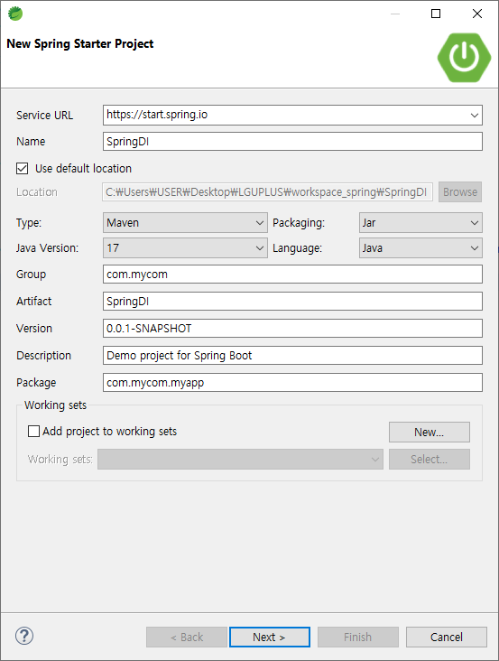
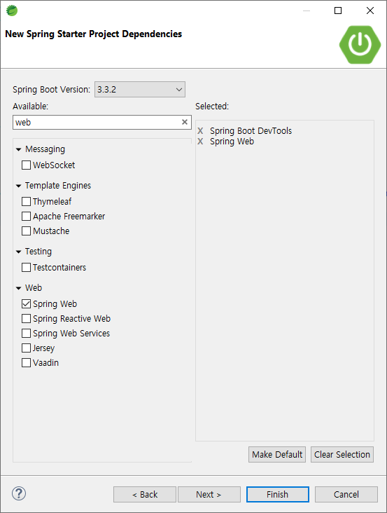
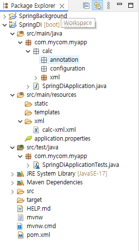
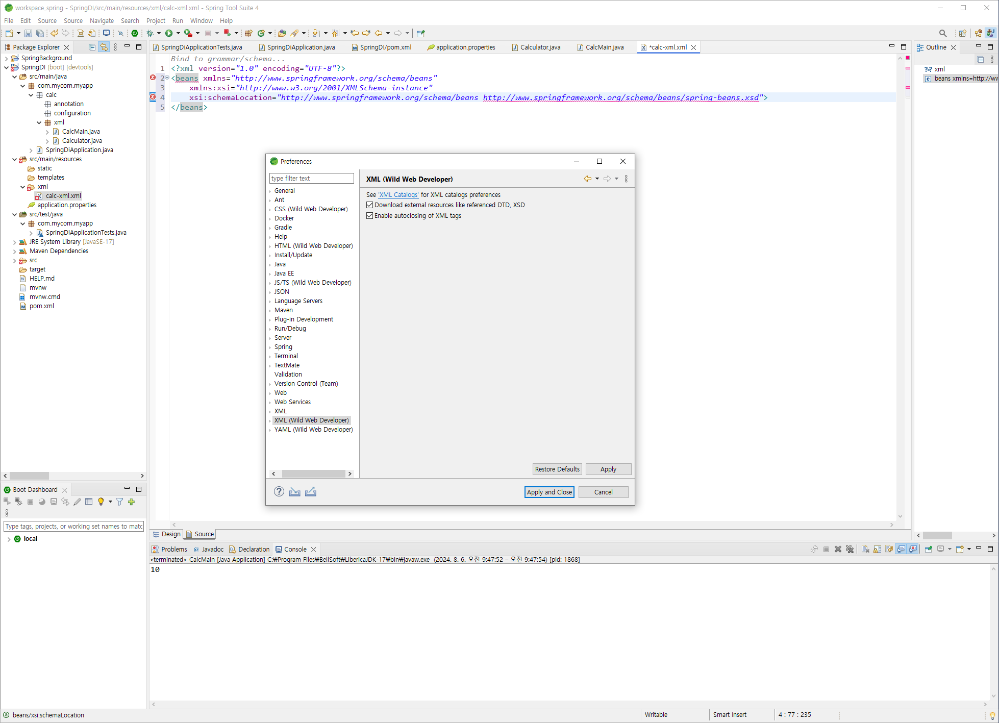
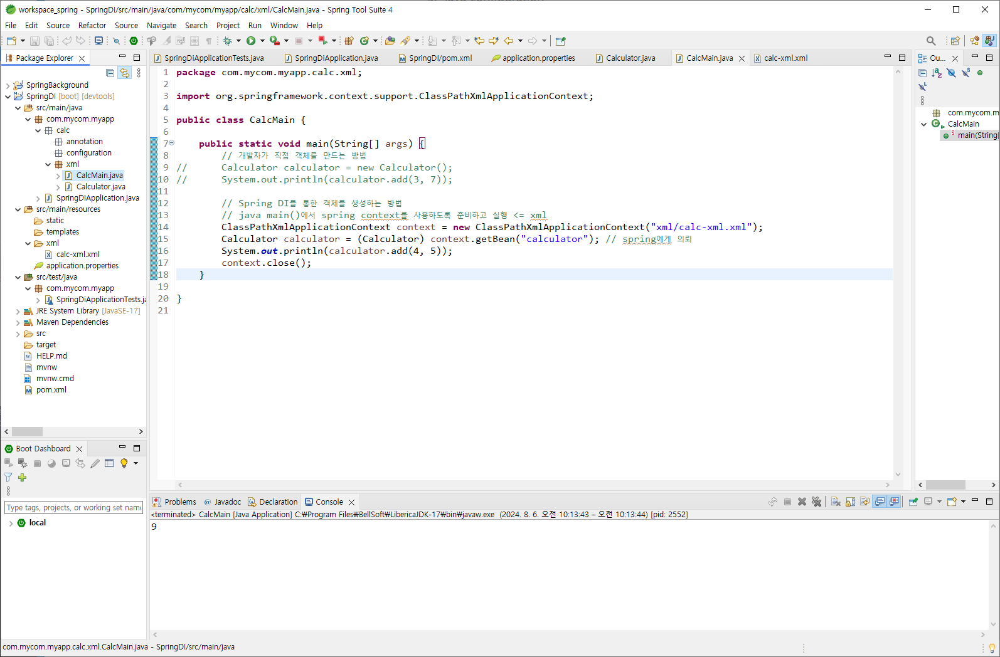
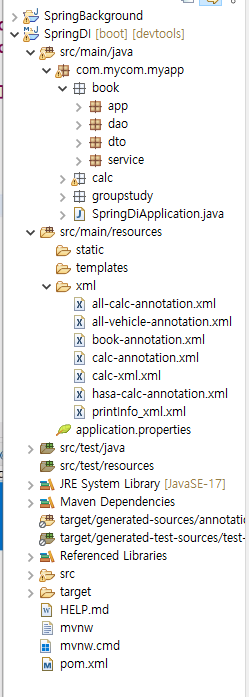
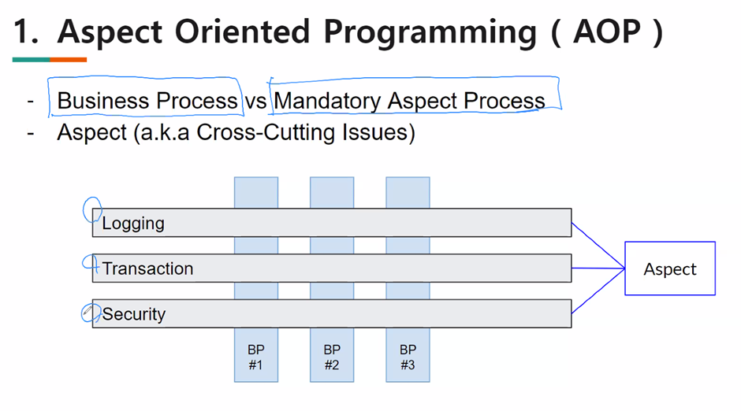
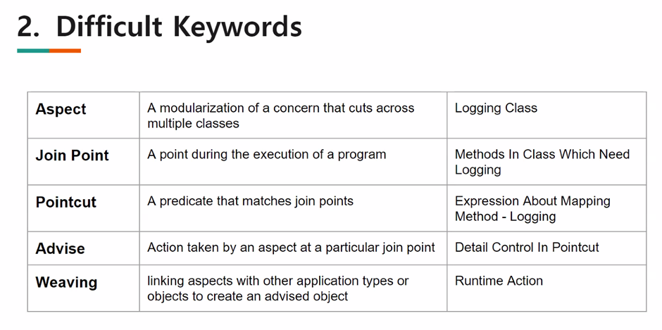

# [2024.08.06(화)] DI/AOP


# Sprinng Boot

## Spring DI

### Spring starter Project 만들기

1. [File] → [Spring starter Project] → Name, Type, Group, Package 등 작성
    
    
    
2. ‘dev’ 검색하여 ‘Spring Boot Dev Tools’ 체크
    
    ‘web’ 검색하여 Spring Web’ 체크
    
    
    
3. [Finish] → 우측 하단에서 다운로드 완료된 후 ‘SpringDI’ 프로젝트가 생성된다.

### spring legacy project (spring mvc project)

// ide도 spring boot 전용 sts4를 사용해서 spring boot project를 만들고 spring boot 기반으로 spring mvc 프로젝트를 생성하고 학습한다.
// 현재 학습하는 내용은 JSP를 사용하는 spring legacy project(spring mvc project)를 만들고 테스트해야 한다.
// spring legacy project (spring mvc project)은 내장 tomcat 없고, root-context.xml, servelt-context.xml 설정 파일이 나뉘어져서 설정이 복잡하다.

### Spring DI

자바 객체(컴포넌트)를 개발자가 코드가 아닌 Spring이 만들어서 대입

⇒ Spring이 어떤 객체를 만들어 줄 것 인가에 대한 개발자 코드의 의뢰, 그것을 인식

방법 3가지

1. xml
2. annotation
3. java configuration

### java/com/mycom/myapp 패키지 생성

- calc 패키지 생성 후 calc에 annotation, configuration, xml 패키지 생성
    
    
    

### Spring DI - 방법1. xml

### xml/Calculator.java

```java
package com.mycom.myapp.calc.xml;

public class Calculator {
	public int add(int n1, int n2) {
		return n1 + n2;
	}
}

```

### resources/xml/calc-xml.xml

- resources 폴더에 xml Folder 생성 후 xml 파일 생성하기

```java
<?xml version="1.0" encoding="UTF-8"?>
<beans xmlns="http://www.springframework.org/schema/beans"
    xmlns:xsi="http://www.w3.org/2001/XMLSchema-instance"
    xsi:schemaLocation="http://www.springframework.org/schema/beans http://www.springframework.org/schema/beans/spring-beans.xsd">
    
    <!-- xml로 DI가 될 컴포넌트(자바객체) 기술 -->
    <bean id="calculator" class="com.mycom.myapp.calc.xml.Calculator"></bean>
</beans>
```

### resources/xml/calc-xml.xml에서 오류가 나는 경우

- [window] → [preferences] → XML (Wild Web Developer) → ‘Download external resources like referenced DTD, XSD’ 체크



### xml/CalcMain.java

```java
package com.mycom.myapp.calc.xml;

import org.springframework.context.support.ClassPathXmlApplicationContext;

public class CalcMain {

	public static void main(String[] args) {
		// 개발자가 직접 객체를 만드는 방법
//		Calculator calculator = new Calculator();
//		System.out.println(calculator.add(3, 7));
		
		// Spring DI를 통한 객체를 생성하는 방법
		// java main()에서 spring context를 사용하도록 준비하고 실행 <= xml
		ClassPathXmlApplicationContext context = new ClassPathXmlApplicationContext("xml/calc-xml.xml");
		Calculator calculator = (Calculator) context.getBean("calculator"); // spring에게 의뢰
		System.out.println(calculator.add(4, 5));
		context.close();
	}

}

```

### 실행 결과

- CalcMain.java → [Run As] → [Java Application]
    
    
    

### Spring DI - 방법2. annotation

### annotation/Calculator.java

```java
package com.mycom.myapp.calc.annotation;

import org.springframework.stereotype.Component;

// @Component // 클래스 이름으로부터 id 도출, id가 명시되어 있으면 그 id 사용
@Component("calculator")
public class Calculator {
	public int add(int n1, int n2) {
		return n1 + n2;
	}
}
```

### resources/xml/calc-annotation.xml

- resources 폴더에 xml Folder 생성 후 xml 파일 생성하기

```java
<?xml version="1.0" encoding="UTF-8"?>
<beans xmlns="http://www.springframework.org/schema/beans"
	xmlns:xsi="http://www.w3.org/2001/XMLSchema-instance"
	xmlns:context="http://www.springframework.org/schema/context"
	xsi:schemaLocation="http://www.springframework.org/schema/beans https://www.springframework.org/schema/beans/spring-beans.xsd
		http://www.springframework.org/schema/context https://www.springframework.org/schema/context/spring-context-3.0.xsd">
	
	<!-- xml 로 DI 될 컴포넌트(자바객체) 기술 
	<bean id="calculator" class="com.mycom.myapp.calc.xml.Calculator"></bean>
	-->
	
	<!-- xml 로 spring 에게 너 저기 가서 컴포넌트(자바객체) annotation 을 보고 찾아라.  -->
	<context:component-scan base-package="com.mycom.myapp.calc.annotation"></context:component-scan>
</beans>
```

### resources/xml/calc-xml.xml에서 오류가 나는 경우

- [window] → [preferences] → XML (Wild Web Developer) → ‘Download external resources like referenced DTD, XSD’ 체크


### annotation/CalcMain.java

```java
package com.mycom.myapp.calc.annotation;

import org.springframework.context.support.ClassPathXmlApplicationContext;

public class CalcMain {

	public static void main(String[] args) {
		// 개발자가 직접 객체를 만드는 방법
//		Calculator calculator = new Calculator();
//		System.out.println(calculator.add(3, 7));
		
		// Spring DI를 통한 객체를 생성하는 방법
		// java main()에서 spring context를 사용하도록 준비하고 실행 <= xml
		ClassPathXmlApplicationContext context = new ClassPathXmlApplicationContext("xml/calc-annotation.xml");
		Calculator calculator = (Calculator) context.getBean("calculator"); // spring에게 의뢰
		System.out.println(calculator.add(4, 5));
		context.close();
	}

}
```

### Spring DI - 방법3. java configuration

### configuration/Calculator.java

```java
package com.mycom.myapp.calc.configuration;

import org.springframework.stereotype.Component;

// @Component // 클래스 이름으로부터 id 도출, id가 명시되어 있으면 그 id 사용
@Component("calculator")
public class Calculator {
	public int add(int n1, int n2) {
		return n1 + n2;
	}
}
```

### configuration/CalcConfiguration.java

```java
package com.mycom.myapp.calc.configuration;

import org.springframework.context.annotation.Bean;

public class CalcConfiguration {
	
	@Bean
	Calculator calculator() {  // 메소드 이름이 id
		return new Calculator();
	}
}
```

### configuration/CalcMain.java

```java
package com.mycom.myapp.calc.configuration;

import org.springframework.context.annotation.AnnotationConfigApplicationContext;
import org.springframework.context.support.ClassPathXmlApplicationContext;

public class CalcMain {

	public static void main(String[] args) {
		// 개발자가 직접 객체를 만드는 방법
//		Calculator calculator = new Calculator();
//		System.out.println(calculator.add(3, 7));
		
		// Spring DI를 통한 객체를 생성하는 방법
		// java main()에서 spring context를 사용하도록 준비하고 실행 <= java configuration
		AnnotationConfigApplicationContext context = new AnnotationConfigApplicationContext(CalcConfiguration.class);
		Calculator calculator = (Calculator) context.getBean("calculator"); // spring에게 의뢰
		System.out.println(calculator.add(4, 5));
		context.close();
	}

}
```

### Has-a 관계 DI

- Has-a 관계 DI 주입 방법 3가지
    
    ```java
    	// DI #1 field 
    //	@Autowired
    //	Calculator calculator;
    	
    	// DI #2 setter
    //	Calculator calculator;
    //	
    //	@Autowired
    //	public void setCalculator(Calculator calculator) {
    //		this.calculator = calculator;
    //	}
    	
    	// DI #3 constructor
    	Calculator calculator;
    	
    	public HasaCalculator(Calculator calculator) {
    		this.calculator = calculator;
    	}
    ```
    

### hasa/Calculator.java

```java
package com.mycom.myapp.calc.hasa;

import org.springframework.stereotype.Component;

// @Component // 클래스 이름으로부터 id 도출, id가 명시되어 있으면 그 id 사용
@Component("calculator")
public class Calculator {
	public int add(int n1, int n2) {
		return n1 + n2;
	}
}
```

### hasa/CalcMain.java

```java
package com.mycom.myapp.calc.hasa;

import org.springframework.context.support.ClassPathXmlApplicationContext;

public class CalcMain {

	public static void main(String[] args) {
		ClassPathXmlApplicationContext context = new ClassPathXmlApplicationContext("xml/hasa-calc-annotation.xml");
		HasaCalculator hasaCalculator = (HasaCalculator) context.getBean("hasaCalculator"); // spring에게 의뢰
		System.out.println(hasaCalculator.add(4, 5));
		context.close();
	}

}
```

### resources/xml/hasa-calc-annotation.xml

- resources 폴더에 xml Folder 생성 후 xml 파일 생성하기

```java
<?xml version="1.0" encoding="UTF-8"?>
<beans xmlns="http://www.springframework.org/schema/beans"
	xmlns:xsi="http://www.w3.org/2001/XMLSchema-instance"
	xmlns:context="http://www.springframework.org/schema/context"
	xsi:schemaLocation="http://www.springframework.org/schema/beans https://www.springframework.org/schema/beans/spring-beans.xsd
		http://www.springframework.org/schema/context https://www.springframework.org/schema/context/spring-context.xsd">
	
	<!-- xml 로 DI 될 컴포넌트(자바객체) 기술 
	<bean id="calculator" class="com.mycom.myapp.calc.xml.Calculator"></bean>
	-->
	
	<!-- xml 로 spring 에게 너 저기 가서 컴포넌트(자바객체) annotation 을 보고 찾아라.  -->
	<context:component-scan base-package="com.mycom.myapp.calc.hasa"></context:component-scan>
</beans>
```


### hasa/HasaCalculator.java

```java
package com.mycom.myapp.calc.hasa;

import org.springframework.beans.factory.annotation.Autowired;
import org.springframework.stereotype.Component;

@Component
public class HasaCalculator {
	// DI #1 field 
//	@Autowired
//	Calculator calculator;
	
	// DI #2 setter
//	Calculator calculator;
//	
//	@Autowired
//	public void setCalculator(Calculator calculator) {
//		this.calculator = calculator;
//	}
	
	// DI #3 constructor
	Calculator calculator;
	
	public HasaCalculator(Calculator calculator) {
		this.calculator = calculator;
	}

	public int add(int n1, int n2) {
		System.out.println("HasaCalculator add()");
		return calculator.add(n1, n2);
	}
}

```

### interface DI

- has-a 클래스 복사하여 생성

### all/CalcMain.java

```java
package com.mycom.myapp.calc.all;

import org.springframework.context.support.ClassPathXmlApplicationContext;

public class CalcMain {

	public static void main(String[] args) {
		ClassPathXmlApplicationContext context = new ClassPathXmlApplicationContext("xml/all-calc-annotation.xml");
		HasaCalculator hasaCalculator = (HasaCalculator) context.getBean("hasaCalculator"); // spring에게 의뢰
		System.out.println(hasaCalculator.add(8, 9));
		context.close();
	}

}
```

### resources/xml/all-calc-annotation.xml

- resources 폴더에 xml Folder 생성 후 xml 파일 생성하기

```java
<?xml version="1.0" encoding="UTF-8"?>
<beans xmlns="http://www.springframework.org/schema/beans"
	xmlns:xsi="http://www.w3.org/2001/XMLSchema-instance"
	xmlns:context="http://www.springframework.org/schema/context"
	xsi:schemaLocation="http://www.springframework.org/schema/beans https://www.springframework.org/schema/beans/spring-beans.xsd
		http://www.springframework.org/schema/context https://www.springframework.org/schema/context/spring-context.xsd">
	
	<!-- xml 로 DI 될 컴포넌트(자바객체) 기술 
	<bean id="calculator" class="com.mycom.myapp.calc.xml.Calculator"></bean>
	-->
	
	<!-- xml 로 spring 에게 너 저기 가서 컴포넌트(자바객체) annotation 을 보고 찾아라.  -->
	<context:component-scan base-package="com.mycom.myapp.calc.all"></context:component-scan>
</beans>
```


### all/Calculator.java (interface)

```java
package com.mycom.myapp.calc.all;

public interface Calculator {
	int add(int n1, int n2);
}
```

### all/CalculatorImpl.java

```java
package com.mycom.myapp.calc.all;

import org.springframework.stereotype.Component;

// @Component // 클래스 이름으로부터 id 도출, id가 명시되어 있으면 그 id 사용
@Component(value = "bbb")
public class CalculatorImpl implements Calculator {
	
	@Override
	public int add(int n1, int n2) {
		System.out.println("bbb");
		return n1 + n2;
	}
}
```

### all/CalculatorImpl2.java

```java
package com.mycom.myapp.calc.all;

import org.springframework.stereotype.Component;

// @Component // 클래스 이름으로부터 id 도출, id가 명시되어 있으면 그 id 사용
@Component("aaa")
public class CalculatorImpl2 implements Calculator {
	
	@Override
	public int add(int n1, int n2) {
		System.out.println("aaa");
		return n1 + n2;
	}
}
```

### all/HasaCalculator.java

```java
package com.mycom.myapp.calc.all;

import org.springframework.beans.factory.annotation.Autowired;
import org.springframework.beans.factory.annotation.Qualifier;
import org.springframework.stereotype.Component;

@Component
public class HasaCalculator {
	// DI #1 field 
	@Autowired
	@Qualifier("aaa")
	Calculator calculator;
	
	// DI #2 setter
//	Calculator calculator;
//	
//	@Autowired
//	public void setCalculator(@Qualifier("aaa") Calculator calculator) {
//		this.calculator = calculator;
//	}
	
	// DI #3 constructor (@Autowired 필요 X)
	 // calculator가 여러 개 인 경우 @Qualifier에 해당하는 대상을 지정해준다.
//	Calculator calculator;
	// A, B도 있으면
	
	
//	public HasaCalculator(@Qualifier("aaa") Calculator calculator) { // A, B 추가
//		this.calculator = calculator;
//	}

	public int add(int n1, int n2) {
		System.out.println("HasaCalculator add()");
		return calculator.add(n1, n2);
	}
}
```

### @Repository, @Service 사용하기

### book 패키지 및 book/app, dao, dto, service 패키지 생성



### dto/BookDto.java

```java
package com.mycom.myapp.book.dto;

public class BookDto {
	private int bookId;
	private String bookName;
	private String publisher;
	private int price;
	
	public BookDto() {}
	
	public BookDto(int bookId, String bookName, String publisher, int price) {
		super();
		this.bookId = bookId;
		this.bookName = bookName;
		this.publisher = publisher;
		this.price = price;
	}
	
	public int getBookId() {
		return bookId;
	}
	public void setBookId(int bookId) {
		this.bookId = bookId;
	}
	public String getBookName() {
		return bookName;
	}
	public void setBookName(String bookName) {
		this.bookName = bookName;
	}
	public String getPublisher() {
		return publisher;
	}
	public void setPublisher(String publisher) {
		this.publisher = publisher;
	}
	public int getPrice() {
		return price;
	}
	public void setPrice(int price) {
		this.price = price;
	}
	
	@Override
	public String toString() {
		return "BookDto [bookId=" + bookId + ", bookName=" + bookName + ", publisher=" + publisher + ", price=" + price
				+ "]";
	}
	
}
```

### resources/xml/book-annotation.xml

```java
<?xml version="1.0" encoding="UTF-8"?>
<beans xmlns="http://www.springframework.org/schema/beans"
	xmlns:xsi="http://www.w3.org/2001/XMLSchema-instance"
	xmlns:context="http://www.springframework.org/schema/context"
	xsi:schemaLocation="http://www.springframework.org/schema/beans https://www.springframework.org/schema/beans/spring-beans.xsd
		http://www.springframework.org/schema/context https://www.springframework.org/schema/context/spring-context.xsd">
	
	<!-- xml 로 DI 될 컴포넌트(자바객체) 기술 
	<bean id="calculator" class="com.mycom.myapp.calc.xml.Calculator"></bean>
	-->
	
	<!-- xml 로 spring 에게 너 저기 가서 컴포넌트(자바객체) annotation 을 보고 찾아라.  -->
	<context:component-scan base-package="com.mycom.myapp.book"></context:component-scan>
</beans>
```

### dao

### BookDao.java

```java
package com.mycom.myapp.book.dao;

import java.util.List;

import com.mycom.myapp.book.dto.BookDto;

public interface BookDao {
	List<BookDto> listBook();
}
```

### BookDaoImpl.java

```java
package com.mycom.myapp.book.dao;

import java.util.List;

import org.springframework.stereotype.Component;
import org.springframework.stereotype.Repository;

import com.mycom.myapp.book.dto.BookDto;

//@Component  // + 알파 포함된 새로운 하위 annotation이 제공
@Repository
public class BookDaoImpl implements BookDao {

	@Override
	public List<BookDto> listBook() {
		return List.of(
				new BookDto(1, "bookName1", "publisher1", 10000),
				new BookDto(2, "bookName2", "publisher2", 20000), 
				new BookDto(3, "bookName3", "publisher3", 30000)
				);
	}

}

```

### service

### BookService.java

```java
package com.mycom.myapp.book.service;

import java.util.List;

import com.mycom.myapp.book.dto.BookDto;

public interface BookService {
	List<BookDto> listBook();
}
```

### BookServiceImpl.java

```java
package com.mycom.myapp.book.service;

import java.util.List;

import org.springframework.beans.factory.annotation.Autowired;
import org.springframework.stereotype.Component;
import org.springframework.stereotype.Service;

import com.mycom.myapp.book.dao.BookDao;
import com.mycom.myapp.book.dto.BookDto;

//@Component
@Service
public class BookServiceImpl implements BookService {

	@Autowired
	BookDao bookDao;
	
	@Override
	public List<BookDto> listBook() {
		return bookDao.listBook();
	}

}
```

### app/BookApp.java

```java
package com.mycom.myapp.book.app;

import java.util.List;

import org.springframework.context.support.ClassPathXmlApplicationContext;

import com.mycom.myapp.book.dto.BookDto;
import com.mycom.myapp.book.service.BookService;

public class BookApp {

	public static void main(String[] args) {
		ClassPathXmlApplicationContext context = new ClassPathXmlApplicationContext("xml/book-annotation.xml");
		// BookService 객체 DI 요청
		BookService bookService = (BookService) context.getBean("bookServiceImpl");
		List<BookDto> bookList = bookService.listBook();
		for (BookDto bookDto : bookList) {
			System.out.println(bookDto);
		}
		context.close();
	}

}
```

## AOP (Aspect Oriented Programming)

참고 : https://willseungh0.tistory.com/61

- Business Process vs Mandatory Aspect Process
- Aspect(a.k.a Cross-Cutting Issues)point
    
    
    
- pointcut이 핵심
    
    
    

### SpringAOP 프로젝트 생성

### pom.xml에 dependency 추가

https://mvnrepository.com/artifact/org.aspectj/aspectjrt/1.9.22.1

→ 버전 수정 : https://mvnrepository.com/artifact/org.aspectj/aspectjrt/1.5.4

https://mvnrepository.com/artifact/org.aspectj/aspectjweaver/1.9.22.1

```java
<?xml version="1.0" encoding="UTF-8"?>
<project xmlns="http://maven.apache.org/POM/4.0.0" xmlns:xsi="http://www.w3.org/2001/XMLSchema-instance"
	xsi:schemaLocation="http://maven.apache.org/POM/4.0.0 https://maven.apache.org/xsd/maven-4.0.0.xsd">
	<modelVersion>4.0.0</modelVersion>
	<parent>
		<groupId>org.springframework.boot</groupId>
		<artifactId>spring-boot-starter-parent</artifactId>
		<version>3.3.2</version>
		<relativePath/> <!-- lookup parent from repository -->
	</parent>
	<groupId>com.mycom</groupId>
	<artifactId>SpringAOP</artifactId>
	<version>0.0.1-SNAPSHOT</version>
	<name>SpringAOP</name>
	<description>Demo project for Spring Boot</description>
	<url/>
	<licenses>
		<license/>
	</licenses>
	<developers>
		<developer/>
	</developers>
	<scm>
		<connection/>
		<developerConnection/>
		<tag/>
		<url/>
	</scm>
	<properties>
		<java.version>17</java.version>
	</properties>
	<dependencies>
		<dependency>
			<groupId>org.springframework.boot</groupId>
			<artifactId>spring-boot-starter-web</artifactId>
		</dependency>

		<dependency>
			<groupId>org.springframework.boot</groupId>
			<artifactId>spring-boot-devtools</artifactId>
			<scope>runtime</scope>
			<optional>true</optional>
		</dependency>
		<dependency>
			<groupId>org.springframework.boot</groupId>
			<artifactId>spring-boot-starter-test</artifactId>
			<scope>test</scope>
		</dependency>
		
		<!-- https://mvnrepository.com/artifact/org.aspectj/aspectjrt -->
<dependency>
    <groupId>aspectj</groupId>
    <artifactId>aspectjrt</artifactId>
    <version>1.5.4</version>
</dependency>

<!-- https://mvnrepository.com/artifact/org.aspectj/aspectjweaver -->
<dependency>
    <groupId>org.aspectj</groupId>
    <artifactId>aspectjweaver</artifactId>
    <version>1.9.22.1</version>
    <scope>runtime</scope>
</dependency>

		
	</dependencies>

	<build>
		<plugins>
			<plugin>
				<groupId>org.springframework.boot</groupId>
				<artifactId>spring-boot-maven-plugin</artifactId>
			</plugin>
		</plugins>
	</build>

</project>
```

### java/aspect

### BusinessProcess.java

```java
package com.mycom.myapp.aspect;

import org.springframework.stereotype.Component;

@Component
public class BusinessProcess {
	
	public void bp() {
		System.out.println("BusinessProcess : bp() !!");
	}
	
	public void no_bp() {
		System.out.println("BusinessProcess : no_bp() !!");
	}
	
	public int int_bp() {
		System.out.println("BusinessProcess : int_bp() !!");
		return 0;
	}
	
	public int int_String_bp(String s1, int i, String s2) {
		System.out.println("BusinessProcess : int_String_bp() !!");
		return 0;
	}
	
}
```

### LogAspect.java

```java
package com.mycom.myapp.aspect;

import org.aspectj.lang.JoinPoint;
import org.aspectj.lang.Signature;
import org.aspectj.lang.annotation.After;
import org.aspectj.lang.annotation.Aspect;
import org.aspectj.lang.annotation.Before;
import org.aspectj.lang.annotation.Pointcut;
import org.slf4j.Logger;
import org.slf4j.LoggerFactory;
import org.springframework.stereotype.Component;

// spring context에 의해 component-scan 되어서 인식되어야 하고, Aspect라는 것도 인식되어야 한다.
@Component
@Aspect
public class LogAspect {
//	private final Logger logger = LoggerFactory.getLogger(this.getClass()); // log level, logging file...
	
	// pointcut (xml로도 가능하나 annotation 기반으로 작성중)
	// 아래 기술된 표현법에 맞는 메소드가 호출되면 개입한다.
	// 모든 리턴 타입에 대하여(*) com.mycom.myapp.aspect.*.*(..) 패키지에 있는 모든 클래스와 모든 메소드, 모든 파라미터 대상
//	@Pointcut(value = "execution(* com.mycom.myapp.aspect.*.*(..))") 
//	@Pointcut(value = "execution(int com.mycom.myapp.aspect.*.*(..))") 
	@Pointcut(value = "execution(* com.mycom.myapp.aspect.*.*(String, int, String))")
	private void logPointcut() {}
	
	// logPointcut()에 기술된 표현법에 맞는 메소드가 호출되면 호출 직전에 수행한다.
	@Before("logPointcut()")
	public void beforeLog(JoinPoint joinPoint) {
		Signature signature = joinPoint.getSignature();
		System.out.println("Sysout : Before method name : " + signature.getName());
	}
	
	@After("logPointcut()")
	public void afterLog(JoinPoint joinPoint) {
		Signature signature = joinPoint.getSignature();
		System.out.println("Sysout : after method name : " + signature.getName());
	}
}
```

### AspectMain.java

```java
package com.mycom.myapp.aspect;

import org.springframework.context.support.ClassPathXmlApplicationContext;

public class AspectMain {

	public static void main(String[] args) {
		ClassPathXmlApplicationContext context = new ClassPathXmlApplicationContext("xml/aspect.xml");
		
		BusinessProcess bp = (BusinessProcess) context.getBean("businessProcess");
		bp.bp();
		
		bp.no_bp();
		
		bp.int_bp();
		
		bp.int_String_bp("s1", 0, "s2");
			
		context.close();
	}

}
```

### resources/xml/aspect.xml

```java
<?xml version="1.0" encoding="UTF-8"?>
<beans xmlns="http://www.springframework.org/schema/beans"
	xmlns:xsi="http://www.w3.org/2001/XMLSchema-instance"
	xmlns:p="http://www.springframework.org/schema/p"
	xmlns:context="http://www.springframework.org/schema/context"
	xmlns:aop="http://www.springframework.org/schema/aop"
	xsi:schemaLocation="http://www.springframework.org/schema/beans http://www.springframework.org/schema/beans/spring-beans.xsd
		http://www.springframework.org/schema/context https://www.springframework.org/schema/context/spring-context-4.3.xsd
		http://www.springframework.org/schema/aop http://www.springframework.org/schema/aop/spring-aop-4.3.xsd">
	
	<context:component-scan base-package="com.mycom.myapp.aspect"></context:component-scan>
	<aop:aspectj-autoproxy/>
</beans>
```