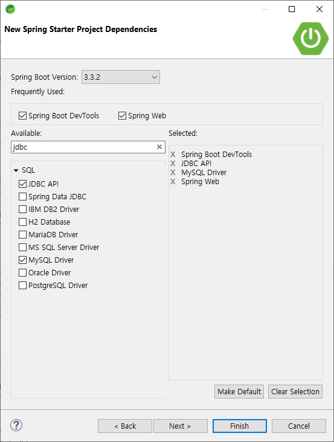
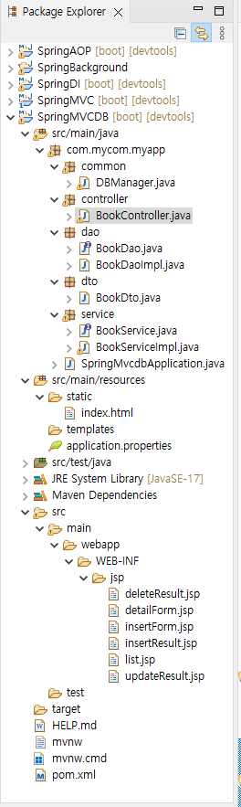
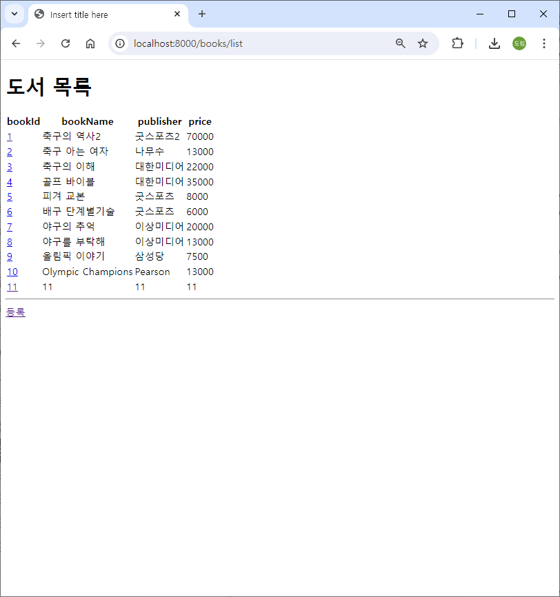
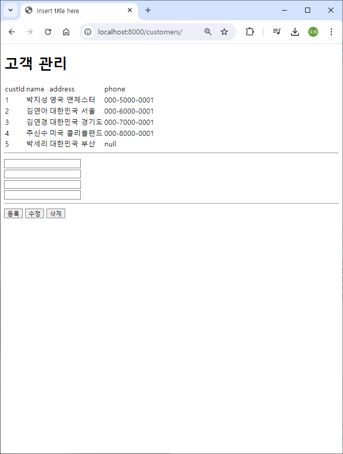

# [2024.08.08(목)] BookManager/BookManagerAjax 프로젝트 SpringMVC로 변경하기


# BookManager 프로젝트(HTML+Servlet+JSP)를 SpringMVC로 변경하기

- [2024.08.02(금)] 이클립스에서 생성한 BookManager(HTML+Servlet+JSP) 프로젝트 활용

## SpringMVCDB 프로젝트 생성 및 설정

### SpringMVCDB 프로젝트 생성



### pom.xml

```java
<?xml version="1.0" encoding="UTF-8"?>
<project xmlns="http://maven.apache.org/POM/4.0.0" xmlns:xsi="http://www.w3.org/2001/XMLSchema-instance"
	xsi:schemaLocation="http://maven.apache.org/POM/4.0.0 https://maven.apache.org/xsd/maven-4.0.0.xsd">
	<modelVersion>4.0.0</modelVersion>
	<parent>
		<groupId>org.springframework.boot</groupId>
		<artifactId>spring-boot-starter-parent</artifactId>
		<version>3.3.2</version>
		<relativePath/> <!-- lookup parent from repository -->
	</parent>
	<groupId>com.mycom</groupId>
	<artifactId>SpringMVCDB</artifactId>
	<version>0.0.1-SNAPSHOT</version>
	<name>SpringMVCDB</name>
	<description>SpringMVCDB</description>
	<url/>
	<licenses>
		<license/>
	</licenses>
	<developers>
		<developer/>
	</developers>
	<scm>
		<connection/>
		<developerConnection/>
		<tag/>
		<url/>
	</scm>
	<properties>
		<java.version>17</java.version>
	</properties>
	<dependencies>
		<dependency>
			<groupId>org.springframework.boot</groupId>
			<artifactId>spring-boot-starter-jdbc</artifactId>
		</dependency>
		<dependency>
			<groupId>org.springframework.boot</groupId>
			<artifactId>spring-boot-starter-web</artifactId>
		</dependency>

		<dependency>
			<groupId>org.springframework.boot</groupId>
			<artifactId>spring-boot-devtools</artifactId>
			<scope>runtime</scope>
			<optional>true</optional>
		</dependency>
		<dependency>
			<groupId>com.mysql</groupId>
			<artifactId>mysql-connector-j</artifactId>
			<scope>runtime</scope>
		</dependency>
		<dependency>
			<groupId>org.springframework.boot</groupId>
			<artifactId>spring-boot-starter-test</artifactId>
			<scope>test</scope>
		</dependency>
		
		<!-- https://mvnrepository.com/artifact/org.apache.tomcat.embed/tomcat-embed-jasper -->
<dependency>
    <groupId>org.apache.tomcat.embed</groupId>
    <artifactId>tomcat-embed-jasper</artifactId>
</dependency>

	</dependencies>

	<build>
		<plugins>
			<plugin>
				<groupId>org.springframework.boot</groupId>
				<artifactId>spring-boot-maven-plugin</artifactId>
			</plugin>
		</plugins>
	</build>

</project>
```

### resources/application.properties

```java
spring.application.name=SpringMVCDB
spring.mvc.view.prefix=/WEB-INF/jsp/
spring.mvc.view.suffix=.jsp
server.port=8000

server.servlet.session.persistent=false

spring.datasource.url=jdbc:mysql://localhost:3306/madangdb
spring.datasource.username=root
spring.datasource.password=root
spring.datasource.driver-class-name=com.mysql.cj.jdbc.Driver
```

## source code 작성

- src/main/java/com/mycom/myapp/ 패키지에 common, controller, dao, dto, service 패키지 생성

### src/main/java/com/mycom/myapp/dto/BookDto.java

```java
package com.mycom.myapp.dto;

public class BookDto {
	
	private int bookId;
	private String bookName;
	private String publisher;
	private int price;
	
	public BookDto() {}
	public BookDto(int bookId, String bookName, String publisher, int price) {
		super();
		this.bookId = bookId;
		this.bookName = bookName;
		this.publisher = publisher;
		this.price = price;
	}

	public int getBookId() {
		return bookId;
	}

	public void setBookId(int bookId) {
		this.bookId = bookId;
	}

	public String getBookName() {
		return bookName;
	}

	public void setBookName(String bookName) {
		this.bookName = bookName;
	}

	public String getPublisher() {
		return publisher;
	}

	public void setPublisher(String publisher) {
		this.publisher = publisher;
	}

	public int getPrice() {
		return price;
	}

	public void setPrice(int price) {
		this.price = price;
	}

	@Override
	public String toString() {
		return "BookDto [bookId=" + bookId + ", bookName=" + bookName + ", publisher=" + publisher + ", price=" + price
				+ "]";
	}

}

```

### src/main/java/com/mycom/myapp/common/DBManager.java

```java
package com.mycom.myapp.common;

import java.sql.Connection;
import java.sql.PreparedStatement;
import java.sql.ResultSet;
import java.sql.SQLException;

import javax.naming.Context;
import javax.naming.InitialContext;
import javax.sql.DataSource;

// Spring에서는 Connection Pool를 DI받는다. (DAO)
// Connection Pool에서 Connection 가져오는 부분 삭제
public class DBManager {
	
	public static void releaseConnection(PreparedStatement pstmt, Connection con) {
		try {
			pstmt.close();
			con.close();  // connection Pool로 되돌아가는 코드로 되어 있다.
		} catch(SQLException e) {
			e.printStackTrace();
		} 
	}
	
	public static void releaseConnection(ResultSet rs, PreparedStatement pstmt, Connection con) {
		try {
			rs.close();
			pstmt.close();
			con.close();
		} catch(SQLException e) {
			e.printStackTrace();
		} 
	}

}
```

### src/main/java/com/mycom/myapp/dao

### BookDao.java (interface)

```java
package com.mycom.myapp.dao;

import java.util.List;

import com.mycom.myapp.dto.BookDto;

public interface BookDao {
	List<BookDto> listBook();
	BookDto detailBook(int bookId);
	int insertBook(BookDto book);
	int updateBook(BookDto book);
	int deleteBook(int bookId);
}
```

### BookDaoImpl.java

```java
package com.mycom.myapp.dao;

import java.sql.Connection;
import java.sql.PreparedStatement;
import java.sql.ResultSet;
import java.sql.SQLException;
import java.util.ArrayList;
import java.util.List;

import javax.sql.DataSource;

import org.springframework.beans.factory.annotation.Autowired;
import org.springframework.stereotype.Repository;

import com.mycom.myapp.common.DBManager;
import com.mycom.myapp.dto.BookDto;

@Repository
public class BookDaoImpl implements BookDao {
	
	@Autowired
	DataSource dataSource; // spring이 DI해 주는 connnection pool (default Hicari)

	@Override
	public List<BookDto> listBook() {
		List<BookDto> list = new ArrayList<BookDto>();
		String sql = "select * from book; ";
		
		Connection con = null;
		PreparedStatement pstmt = null;
		ResultSet rs = null;
		
		try {
			con = dataSource.getConnection();
			pstmt = con.prepareStatement(sql);
			
			rs = pstmt.executeQuery();
			
			while(rs.next()) {
				BookDto book = new BookDto();
				book.setBookId(rs.getInt("bookid"));
				book.setBookName(rs.getString("bookname"));
				book.setPublisher(rs.getString("publisher"));
				book.setPrice(rs.getInt("price"));
				
				list.add(book);
			}
			
		} catch(SQLException e) {
			e.printStackTrace();
		} finally {
			DBManager.releaseConnection(pstmt, con);
		}
		
		return list;
	}

	@Override
	public BookDto detailBook(int bookId) {
		BookDto book = null;
		String sql = "select * from book where bookid = ?; ";
		
		Connection con = null;
		PreparedStatement pstmt = null;
		ResultSet rs = null;
		
		try {
			con = dataSource.getConnection();
			pstmt = con.prepareStatement(sql);
			
			pstmt.setInt(1, bookId);
			
			rs = pstmt.executeQuery();
			
			if(rs.next()) {
				book = new BookDto();
				book.setBookId(rs.getInt("bookid"));
				book.setBookName(rs.getString("bookname"));
				book.setPublisher(rs.getString("publisher"));
				book.setPrice(rs.getInt("price"));
			}
			
		} catch(SQLException e) {
			e.printStackTrace();
		} finally {
			DBManager.releaseConnection(pstmt, con);
		}
		
		return book;
	}

	@Override
	public int insertBook(BookDto book) {
		int ret = -1;
		String sql = "insert into book values (?, ?, ?, ?); ";
		
		Connection con = null;
		PreparedStatement pstmt = null;
		
		try {
			con = dataSource.getConnection();
			pstmt = con.prepareStatement(sql);
			
			pstmt.setInt(1, book.getBookId());
			pstmt.setString(2, book.getBookName());
			pstmt.setString(3, book.getPublisher());
			pstmt.setInt(4, book.getPrice());
			
			ret = pstmt.executeUpdate();
			
		} catch(SQLException e) {
			e.printStackTrace();
		} finally {
			DBManager.releaseConnection(pstmt, con);
		}

		return ret;
	}

	@Override
	public int updateBook(BookDto book) {
		int ret = -1;
		String sql = "update book set bookname = ?, publisher = ?, price = ? where bookid = ?; ";
		
		Connection con = null;
		PreparedStatement pstmt = null;
		
		try {
			con = dataSource.getConnection();
			pstmt = con.prepareStatement(sql);
			
			pstmt.setString(1, book.getBookName());
			pstmt.setString(2, book.getPublisher());
			pstmt.setInt(3, book.getPrice());
			pstmt.setInt(4, book.getBookId());
			
			ret = pstmt.executeUpdate();
			
		} catch(SQLException e) {
			e.printStackTrace();
		} finally {
			DBManager.releaseConnection(pstmt, con);
		}
		
		return ret;
	}

	@Override
	public int deleteBook(int bookId) {
		int ret = -1;
		String sql = "delete from book where bookid = ?; ";
		
		Connection con = null;
		PreparedStatement pstmt = null;
		
		try {
			con = dataSource.getConnection();
			pstmt = con.prepareStatement(sql);
			
			pstmt.setInt(1, bookId);
			
			ret = pstmt.executeUpdate();
			
		} catch(SQLException e) {
			e.printStackTrace();
		} finally {
			DBManager.releaseConnection(pstmt, con);
		}
		
		
		return ret;
	}

}
```

### src/main/java/com/mycom/myapp/service

### BookService.java (interface)

```java
package com.mycom.myapp.service;

import java.util.List;

import com.mycom.myapp.dto.BookDto;

public interface BookService {
	List<BookDto> listBook();
	BookDto detailBook(int bookId);
	int insertBook(BookDto book);
	int updateBook(BookDto book);
	int deleteBook(int bookId);
}
```

### BookServiceImpl.java

```java
package com.mycom.myapp.service;

import java.util.List;

import org.springframework.beans.factory.annotation.Autowired;
import org.springframework.stereotype.Service;

import com.mycom.myapp.dao.BookDao;
import com.mycom.myapp.dto.BookDto;

@Service
public class BookServiceImpl implements BookService {
	
//	@Autowired
//	BookDao bookDao;
	
	// 위처럼 필드로 생성해도 되고 생성자로 생성하는 방법도 있다.
	// 생성자 주입은 @Autowired 생략 가능
	private final BookDao bookDao;
	
	public BookServiceImpl(BookDao bookDao) {
		this.bookDao = bookDao;
	}

	@Override
	public List<BookDto> listBook() {
		return bookDao.listBook();
	}

	@Override
	public BookDto detailBook(int bookId) {
		return bookDao.detailBook(bookId);
	}

	@Override
	public int insertBook(BookDto book) {
		return bookDao.insertBook(book);
	}

	@Override
	public int updateBook(BookDto book) {
		return bookDao.updateBook(book);
	}

	@Override
	public int deleteBook(int bookId) {
		return bookDao.deleteBook(bookId);
	}

}
```

### src/main/java/com/mycom/myapp/controller/BookController.java

```java
package com.mycom.myapp.controller;

import java.util.List;

import org.springframework.stereotype.Controller;
import org.springframework.ui.Model;
import org.springframework.web.bind.annotation.GetMapping;
import org.springframework.web.bind.annotation.PathVariable;
import org.springframework.web.bind.annotation.PostMapping;
import org.springframework.web.bind.annotation.RequestMapping;

import com.mycom.myapp.dto.BookDto;
import com.mycom.myapp.service.BookService;

// book app을 위한 url-maping 정책
// list, detail, insert, update, delete
// /books/list, /books/detail, /books/insert, /books/update, /books/delete
@Controller
@RequestMapping("/books")  // 특정 컨트롤러에 모든 메소드에 해당하는 경로가 있으면 class레벨로 올릴 수 있다. (모든 메소드 url 앞에 /books~으로 지정된다.) 
public class BookController {
	
	// 생성자 DI
	private final BookService bookService;
	
	public BookController(BookService bookService) {
		this.bookService = bookService;
	}
	
	@GetMapping("/list")
	public String listBook(Model model) {
		List<BookDto> bookList = bookService.listBook();
		model.addAttribute("bookList", bookList);
		return "list";  // list.jsp로 forwarding
	}
	
	@GetMapping("/detail/{bookId}")
	public String detailBook(@PathVariable int bookId, Model model) {
		BookDto bookDto = bookService.detailBook(bookId);
		model.addAttribute("bookDto", bookDto);
		return "detailForm";  // list.jsp로 forwarding
	}
	
	@GetMapping("/insertForm")
	public String insertForm() {
		return "insertForm";
	}
	
	@PostMapping("/insert")
	public String insertBook(BookDto bookDto) {
		int ret = bookService.insertBook(bookDto);
		return "insertResult";
	}
	
	@PostMapping("/update")
	public String updateBook(BookDto bookDto) {
		int ret = bookService.updateBook(bookDto);
		return "updateResult";
	}

	@GetMapping("/delete/{bookId}")
	public String deleteBook(@PathVariable int bookId) {
		int ret = bookService.deleteBook(bookId);
		return "deleteResult";
	}
	
}
```

- src/main/resources/static에 html, css, javascript 등과 같은 파일을 만든다.

### src/main/resources/static/index.html

```java
<!DOCTYPE html>
<html>
<head>
<meta charset="UTF-8">
<title>Insert title here</title>
</head>
<body>
	<!-- static content는 browser cache가 있어서 캐시 삭제를 해야 한다. (브라우저가 캐시를 가지고 있어 바로 변경하지 않는 경우가 있다.) -->
	<h1>도서 관리 프로그램</h1>
	
	<a href="/books/list">도서 목록</a> <a href="#">고객 목록</a>
</body>
</html>
```

### src/main/webapp/WEB-INF/jsp

### lsit.jsp

```java
<%@ page language="java" contentType="text/html; charset=UTF-8" pageEncoding="UTF-8"%>
<%@ page import="java.util.List, com.mycom.myapp.dto.BookDto" %>
<%
    List<BookDto> bookList = (List<BookDto>) request.getAttribute("bookList");
%>
<!DOCTYPE html>
<html>
<head>
<meta charset="UTF-8">
<title>Insert title here</title>
</head>
<body>
    <h1>도서 목록</h1>
    <table>
        <thead>
            <tr><th>bookId</th><th>bookName</th><th>publisher</th><th>price</th></tr>
        </thead>
        <tbody>
<%
    for(BookDto bookDto : bookList){
%>   
            <tr>
                <td><a href="/books/detail/<%=bookDto.getBookId()%>"><%= bookDto.getBookId() %></a></td>
                <td><%= bookDto.getBookName() %></td>
                <td><%= bookDto.getPublisher() %></td>
                <td><%= bookDto.getPrice() %></td>
            </tr>
<%
    }
%>   
        </tbody>
    </table>
    <hr>
    <a href="/books/insertForm">등록</a>
</body>
</html>
```

### insertForm.jsp

```java
<%@ page language="java" contentType="text/html; charset=UTF-8"
    pageEncoding="UTF-8"%>
    
<!DOCTYPE html>
<html>
<head>
<meta charset="UTF-8">
<title>Insert title here</title>
</head>
<body>
	<h1>도서 등록</h1>
	<form action="/books/insert" method="post">
		<input type="text" name="bookId"></input> <br>
		<input type="text" name="bookName"></input> <br>
		<input type="text" name="publisher"></input> <br>
		<input type="text" name="price"></input> <br>
		<button type="submin">등록</button>
	</form>
	
	<hr>
	<a href="/books/list">도서 목록</a>
</body>
</html>
```

### insertResult.jsp

```java
<%@ page language="java" contentType="text/html; charset=UTF-8"
    pageEncoding="UTF-8"%>
    
<!DOCTYPE html>
<html>
<head>
<meta charset="UTF-8">
<title>Insert title here</title>
</head>
<body>
	<h1>도서 등록 완료</h1>
	<hr>
	<a href="/books/list">도서 목록</a>
</body>
</html>
```

### updateResult.jsp

```java
<%@ page language="java" contentType="text/html; charset=UTF-8"
    pageEncoding="UTF-8"%>
    
<!DOCTYPE html>
<html>
<head>
<meta charset="UTF-8">
<title>Insert title here</title>
</head>
<body>
	<h1>도서 수정 완료</h1>
	<hr>
	<a href="/books/list">도서 목록</a>
</body>
</html>
```

### deleteForm.jsp

```java
<%@ page language="java" contentType="text/html; charset=UTF-8"
    pageEncoding="UTF-8"%>
<%@ page import="java.util.List, com.mycom.myapp.dto.BookDto" %> 
   
<%
	BookDto bookDto = (BookDto) request.getAttribute("bookDto");
%>
    
<!DOCTYPE html>
<html>
<head>
<meta charset="UTF-8">
<title>Insert title here</title>
</head>
<body>
	<h1>도서 수정</h1>
	<form action="/books/update" method="post">
		<input type="text" name="bookId" value="<%= bookDto.getBookId()%>"></input> <br>
		<input type="text" name="bookName" value="<%= bookDto.getBookName()%>"></input> <br>
		<input type="text" name="publisher" value="<%= bookDto.getPublisher()%>"></input> <br>
		<input type="text" name="price" value="<%= bookDto.getPrice()%>"></input> <br>
		<button type="submit">수정</button>
	</form>
	
	<hr>
	<a href="/books/list">목록</a>
	<a href="/books/delete/<%= bookDto.getBookId() %>">삭제</a>
	
</body>
</html>
```

### deleteResult.jsp

```java
<%@ page language="java" contentType="text/html; charset=UTF-8"
    pageEncoding="UTF-8"%>
    
<!DOCTYPE html>
<html>
<head>
<meta charset="UTF-8">
<title>Insert title here</title>
</head>
<body>
	<h1>도서 삭제 완료</h1>
	<hr>
	<a href="/books/list">도서 목록</a>
</body>
</html>
```

### Package Explorer & 실행 결과





# BookManagerAjax 프로젝트(HTML+Servlet+JSP+Ajax)를 SpringMCV로 변경하기

- [2024.08.02(금)] 이클립스에서 생성한 BookManagerAjax(HTML+Servlet+JSP+Ajax) 프로젝트 활용
- 위에서 만든 SpringMVCDB 프로젝트 복사하여 SpringMVCDBAjax 생성

### src/main/webapp/WEB-INF/jsp/books.jsp

- 모두 삭제 후 books.jsp 생성

```java
<%@ page language="java" contentType="text/html; charset=UTF-8"
    pageEncoding="UTF-8"%>
    
<%--
	하나의 jsp에서 CRUD를 한 꺼번에 처리 
	
	비동기 요청 (ajax)는 fetch 함수가 나오기 전까지 매우 복잡한 구조를 가지고 있었다.
 --%>
    
<!DOCTYPE html>
<html>
<head>
<meta charset="UTF-8">
<title>Insert title here</title>
</head>
<body>
	<h1>도서 관리</h1>
	<table>
		<thead>
			<tr><td>bookId</td><td>bookName</td><td>publisher</td><td>price</td></tr>
		</thead>
		<tbody id="bookTbody">
			
		</tbody>
	</table>
	
	<hr>
	
	<form> <!-- 등록, 수정, 삭제에 모두 사용된다. -->
		<input type="text" name="bookId" id="bookId"></input> <br>
		<input type="text" name="bookName" id="bookName"></input> <br>
		<input type="text" name="publisher" id="publisher"></input> <br>
		<input type="text" name="price" id="price"></input> <br>
	</form>
	<hr>
	<button type="button" id="btnInsert">등록</button> <button type="button" id="btnUpdate">수정</button> <button type="button" id="btnDelete">삭제</button>
	
	<script>
		window.onload = function() {
			listBook();
			
			document.querySelector("#btnInsert").onclick = insertBook; // 함수를 변수로 저장?
			document.querySelector("#btnUpdate").onclick = updateBook; // 함수를 변수로 저장?
			document.querySelector("#btnDelete").onclick = deleteBook; // 함수를 변수로 저장?
		}
		
		async function listBook() {
			// back-end에 도서 목록 요청 (ajax, json)
			let url = '/books/list'
			let response = await fetch(url)  // await : fetch() 종료될 때까지 기다린다.
			let data = await response.json(); // response에 담긴 json 문자열을 javascript object로 변환
			
			makeListHtml(data);
		}
		
		function makeListHtml(list){
            let listHTML = ``;
            
            list.forEach( el => {
                listHTML +=
                    `<tr data-bookId="\${el.bookId}">
                        <td>\${el.bookId}</td>
                        <td>\${el.bookName}</td>
                        <td>\${el.publisher}</td>
                        <td>\${el.price}</td>
                    </tr>`;
            });
            
            document.querySelector("#bookTbody").innerHTML = listHTML;
            
            document.querySelectorAll("#bookTbody tr").forEach( el => {
            	el.onclick = function() {
            		let bookId = this.getAttribute("data-bookId");
            		detailBook(bookId);
            	}
            });
        }
		
		async function detailBook(bookId) {
			console.log(bookId);
			
			let url = '/books/detail/' + bookId;
			let response = await fetch(url)  // await : fetch() 종료될 때까지 기다린다.
			let data = await response.json(); // response에 담긴 json 문자열을 javascript object로 변환
			
			document.querySelector("#bookId").value = data.bookId;
			document.querySelector("#bookName").value = data.bookName;
			document.querySelector("#publisher").value = data.publisher;
			document.querySelector("#price").value = data.price;
		}
		
		async function insertBook() {
			let urlParams = new URLSearchParams({ // object로 파라미터를 넘긴다.
				bookId : document.querySelector("#bookId").value,
				bookName : document.querySelector("#bookName").value,
				publisher : document.querySelector("#publisher").value,
				price : document.querySelector("#price").value
			});
			
			let fetchOptions = {
					method : "POST",
					body : urlParams
			}
			
			let url = '/books/insert';
			let response = await fetch(url, fetchOptions)  // await : fetch() 종료될 때까지 기다린다.
			let data = await response.json(); // response에 담긴 json 문자열을 javascript object로 변환
			
			alert("도서 등록 완료");
			
			listBook();
		}
		
		async function updateBook() {
			let urlParams = new URLSearchParams({ // object로 파라미터를 넘긴다.
				bookId : document.querySelector("#bookId").value,
				bookName : document.querySelector("#bookName").value,
				publisher : document.querySelector("#publisher").value,
				price : document.querySelector("#price").value
			});
			
			let fetchOptions = {
					method : "POST",
					body : urlParams
			}
			
			let url = '/books/update';
			let response = await fetch(url, fetchOptions)  // await : fetch() 종료될 때까지 기다린다.
			let data = await response.json(); // response에 담긴 json 문자열을 javascript object로 변환
			
			alert("도서 수정 완료");
			
			listBook();
		}
		
		async function deleteBook() {
			let bookId = document.querySelector("#bookId").value;
			
			let url = '/books/delete/' + bookId;
			let response = await fetch(url)  // await : fetch() 종료될 때까지 기다린다.
			let data = await response.json(); // response에 담긴 json 문자열을 javascript object로 변환
			
			alert("도서 삭제 완료");
			
			listBook();
		}
	</script>
	
</body>
</html>
```

### src/main/java/com/mycom/myapp/controller/BookController.java

```java
package com.mycom.myapp.controller;

import java.util.List;

import org.springframework.stereotype.Controller;
import org.springframework.ui.Model;
import org.springframework.web.bind.annotation.GetMapping;
import org.springframework.web.bind.annotation.PathVariable;
import org.springframework.web.bind.annotation.PostMapping;
import org.springframework.web.bind.annotation.RequestMapping;
import org.springframework.web.bind.annotation.ResponseBody;

import com.mycom.myapp.dto.BookDto;
import com.mycom.myapp.service.BookService;

// 브라우저 -> 서버 요청할 때 2가지로 구분해서 한다.
// 1. page 요청 <html> ~ <html> 요청 <a hrdf="//"..> <form action="//..."> , javascript에서 window.location.href="..."로 페이지 이동
// 2. data 요청 json(xml...) 요청 fetch()
@Controller
@RequestMapping("/books")  // 특정 컨트롤러에 모든 메소드에 해당하는 경로가 있으면 class레벨로 올릴 수 있다. (모든 메소드 url 앞에 /books~으로 지정된다.) 
public class BookController {
	
	// 생성자 DI
	private final BookService bookService;
	
	public BookController(BookService bookService) {
		this.bookService = bookService;
	}
	
	// /books/ => books.jsp 페이지로 이동
	@GetMapping("/")
	public String bookMain() {
		return "books";  // books.jsp로 forwarding
	}
	
	@GetMapping("/list")
	@ResponseBody // @ResponseBody를 사용하면 View Resolver 탐색을 진행하지 않고 바로 JSON으로 응답한다.
	public List<BookDto> listBook() {
		List<BookDto> bookList = bookService.listBook();
		return bookList;  // booklist 객체를 json 문자열로 변경 후 client에 전송
	}
	
	@GetMapping("/detail/{bookId}")
	@ResponseBody // @ResponseBody를 사용하면 View Resolver 탐색을 진행하지 않고 바로 JSON으로 응답한다.
	public BookDto detailBook(@PathVariable int bookId) {
		BookDto bookDto = bookService.detailBook(bookId);
		return bookDto; 
	}
	
	@PostMapping("/insert")
	@ResponseBody // @ResponseBody를 사용하면 View Resolver 탐색을 진행하지 않고 바로 JSON으로 응답한다.
	public int insertBook(BookDto bookDto) {
		int ret = bookService.insertBook(bookDto);
		return ret;
	}
	
	@PostMapping("/update")
	@ResponseBody // @ResponseBody를 사용하면 View Resolver 탐색을 진행하지 않고 바로 JSON으로 응답한다.
	public int updateBook(BookDto bookDto) {
		int ret = bookService.updateBook(bookDto);
		return ret;
	}

	@GetMapping("/delete/{bookId}")
	@ResponseBody // @ResponseBody를 사용하면 View Resolver 탐색을 진행하지 않고 바로 JSON으로 응답한다.
	public int deleteBook(@PathVariable int bookId) {
		int ret = bookService.deleteBook(bookId);
		return ret;
	}
	
}
```

### 실행 결과

