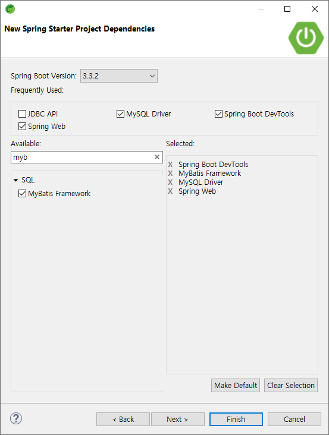

# [2024.08.09(금)] SpringMVC에서 Mybatis 사용하기


# SpringMVC에서 Mybatis 사용하기

## SpringMVCDBAjaxMybatis 프로젝트 생성 및 설정

- [2024.08.08(목)] BookManagerAjax 프로젝트에서 xml, java 파일 등 복사하여 수정

### SpringMVCDBAjaxMybatis  프로젝트 생성



### pom.xml

```java
<?xml version="1.0" encoding="UTF-8"?>
<project xmlns="http://maven.apache.org/POM/4.0.0" xmlns:xsi="http://www.w3.org/2001/XMLSchema-instance"
	xsi:schemaLocation="http://maven.apache.org/POM/4.0.0 https://maven.apache.org/xsd/maven-4.0.0.xsd">
	<modelVersion>4.0.0</modelVersion>
	<parent>
		<groupId>org.springframework.boot</groupId>
		<artifactId>spring-boot-starter-parent</artifactId>
		<version>3.3.2</version>
		<relativePath/> <!-- lookup parent from repository -->
	</parent>
	<groupId>com.mycom</groupId>
	<artifactId>SpringMVCDBAjaxMybatis</artifactId>
	<version>0.0.1-SNAPSHOT</version>
	<name>SpringMVCDBAjaxMybatis</name>
	<description>SpringMVCDBAjaxMybatis</description>
	<url/>
	<licenses>
		<license/>
	</licenses>
	<developers>
		<developer/>
	</developers>
	<scm>
		<connection/>
		<developerConnection/>
		<tag/>
		<url/>
	</scm>
	<properties>
		<java.version>17</java.version>
	</properties>
	<dependencies>
		<dependency>
			<groupId>org.springframework.boot</groupId>
			<artifactId>spring-boot-starter-web</artifactId>
		</dependency>
		<dependency>
			<groupId>org.mybatis.spring.boot</groupId>
			<artifactId>mybatis-spring-boot-starter</artifactId>
			<version>3.0.3</version>
		</dependency>

		<dependency>
			<groupId>org.springframework.boot</groupId>
			<artifactId>spring-boot-devtools</artifactId>
			<scope>runtime</scope>
			<optional>true</optional>
		</dependency>
		<dependency>
			<groupId>com.mysql</groupId>
			<artifactId>mysql-connector-j</artifactId>
			<scope>runtime</scope>
		</dependency>
		<dependency>
			<groupId>org.springframework.boot</groupId>
			<artifactId>spring-boot-starter-test</artifactId>
			<scope>test</scope>
		</dependency>
		<dependency>
			<groupId>org.mybatis.spring.boot</groupId>
			<artifactId>mybatis-spring-boot-starter-test</artifactId>
			<version>3.0.3</version>
			<scope>test</scope>
		</dependency>
		
		<!-- https://mvnrepository.com/artifact/org.apache.tomcat.embed/tomcat-embed-jasper -->
<dependency>
    <groupId>org.apache.tomcat.embed</groupId>
    <artifactId>tomcat-embed-jasper</artifactId>
</dependency>
		
	</dependencies>

	<build>
		<plugins>
			<plugin>
				<groupId>org.springframework.boot</groupId>
				<artifactId>spring-boot-maven-plugin</artifactId>
			</plugin>
		</plugins>
	</build>

</project>
```

### resources/application.properties

```java
spring.application.name=SpringMVCDBAjaxMybatis
spring.mvc.view.prefix=/WEB-INF/jsp/
spring.mvc.view.suffix=.jsp
server.port=8000

server.servlet.session.persistent=false

spring.datasource.url=jdbc:mysql://localhost:3306/madangdb
spring.datasource.username=root
spring.datasource.password=root
spring.datasource.driver-class-name=com.mysql.cj.jdbc.Driver

mybatis.config-location=classpath:/config/mybatis-config.xml
```

## source code 작성 - book

- src/main/java/com/mycom/myapp/ 패키지에 book, emp, common 패키지 생성한다.
- book 패키지에 controller, dao, dto, service 패키지 생성 및 BookManagerAjax 프로젝트에서 복사하여 수정

### src/main/java/com/mycom/myapp/common/DBManager.java

```java
package com.mycom.myapp.common;

import java.sql.Connection;
import java.sql.PreparedStatement;
import java.sql.ResultSet;
import java.sql.SQLException;

import javax.naming.Context;
import javax.naming.InitialContext;
import javax.sql.DataSource;

// Spring에서는 Connection Pool를 DI받는다. (DAO)
// Connection Pool에서 Connection 가져오는 부분 삭제
public class DBManager {
	
	public static void releaseConnection(PreparedStatement pstmt, Connection con) {
		try {
			pstmt.close();
			con.close();  // connection Pool로 되돌아가는 코드로 되어 있다.
		} catch(SQLException e) {
			e.printStackTrace();
		} 
	}
	
	public static void releaseConnection(ResultSet rs, PreparedStatement pstmt, Connection con) {
		try {
			rs.close();
			pstmt.close();
			con.close();
		} catch(SQLException e) {
			e.printStackTrace();
		} 
	}

}
```

### src/main/java/com/mycom/myapp/book/dto/BookDto.java

```java
package com.mycom.myapp.book.dto;

public class BookDto {
	
	private int bookId;
	private String bookName;
	private String publisher;
	private int price;
	
	public BookDto() {}
	public BookDto(int bookId, String bookName, String publisher, int price) {
		super();
		this.bookId = bookId;
		this.bookName = bookName;
		this.publisher = publisher;
		this.price = price;
	}

	public int getBookId() {
		return bookId;
	}

	public void setBookId(int bookId) {
		this.bookId = bookId;
	}

	public String getBookName() {
		return bookName;
	}

	public void setBookName(String bookName) {
		this.bookName = bookName;
	}

	public String getPublisher() {
		return publisher;
	}

	public void setPublisher(String publisher) {
		this.publisher = publisher;
	}

	public int getPrice() {
		return price;
	}

	public void setPrice(int price) {
		this.price = price;
	}

	@Override
	public String toString() {
		return "BookDto [bookId=" + bookId + ", bookName=" + bookName + ", publisher=" + publisher + ", price=" + price
				+ "]";
	}

}
```

### src/main/java/com/mycom/myapp/book/service

### BookService.java

```java
package com.mycom.myapp.book.service;

import java.util.List;

import com.mycom.myapp.book.dto.BookDto;

public interface BookService {
	List<BookDto> listBook();
	BookDto detailBook(int bookId);
	int insertBook(BookDto book);
	int updateBook(BookDto book);
	int deleteBook(int bookId);
}
```

### BookServiceImpl.java

```java
package com.mycom.myapp.book.service;

import java.util.List;

import org.springframework.stereotype.Service;

import com.mycom.myapp.book.dao.BookDao;
import com.mycom.myapp.book.dto.BookDto;

@Service
public class BookServiceImpl implements BookService {
	
//	@Autowired
//	BookDao bookDao;
	
	// 위처럼 필드로 생성해도 되고 생성자로 생성하는 방법도 있다.
	// 생성자 주입은 @Autowired 생략 가능
	private final BookDao bookDao;
	
	public BookServiceImpl(BookDao bookDao) {
		this.bookDao = bookDao;
	}

	@Override
	public List<BookDto> listBook() {
		return bookDao.listBook();
	}

	@Override
	public BookDto detailBook(int bookId) {
		return bookDao.detailBook(bookId);
	}

	@Override
	public int insertBook(BookDto book) {
		return bookDao.insertBook(book);
	}

	@Override
	public int updateBook(BookDto book) {
		return bookDao.updateBook(book);
	}

	@Override
	public int deleteBook(int bookId) {
		return bookDao.deleteBook(bookId);
	}

}
```

### src/main/java/com/mycom/myapp/book/dao/BookDao.java

```java
package com.mycom.myapp.book.dao;

import java.util.List;

import org.apache.ibatis.annotations.Mapper;

import com.mycom.myapp.book.dto.BookDto;

// Service에서 BookDao를 구현한 객체의 메소드를 호출할 것. (BookDaoImpl 삭제)
// BookDaoImpl(JDBC)를 대체할 새로운 BookDao 객체가 필요 (Mybatis)

//mybatis가 @Mapper annotation이 있는 interface의 메소드들을 scan하고 BookDao를 implement하는 객체 준비
// 위 객체를 만들기 위해 필요한 파라미터, 리턴, SQL을 모두 xml 파일(mapper)로 구현
@Mapper	
public interface BookDao {
	List<BookDto> listBook();
	BookDto detailBook(int bookId);
	int insertBook(BookDto book);
	int updateBook(BookDto book);
	int deleteBook(int bookId);
}
```

### src/main/java/com/mycom/myapp/book/controller/BookController.java

```java
package com.mycom.myapp.book.controller;

import java.util.List;

import org.springframework.stereotype.Controller;
import org.springframework.web.bind.annotation.GetMapping;
import org.springframework.web.bind.annotation.PathVariable;
import org.springframework.web.bind.annotation.PostMapping;
import org.springframework.web.bind.annotation.RequestMapping;
import org.springframework.web.bind.annotation.ResponseBody;

import com.mycom.myapp.book.dto.BookDto;
import com.mycom.myapp.book.service.BookService;

// 브라우저 -> 서버 요청할 때 2가지로 구분해서 한다.
// 1. page 요청 <html> ~ <html> 요청 <a hrdf="//"..> <form action="//..."> , javascript에서 window.location.href="..."로 페이지 이동
// 2. data 요청 json(xml...) 요청 fetch()
@Controller
@RequestMapping("/books")  // 특정 컨트롤러에 모든 메소드에 해당하는 경로가 있으면 class레벨로 올릴 수 있다. (모든 메소드 url 앞에 /books~으로 지정된다.) 
public class BookController {
	
	// 생성자 DI
	private final BookService bookService;
	
	public BookController(BookService bookService) {
		this.bookService = bookService;
	}
	
	// /books/ => books.jsp 페이지로 이동
	@GetMapping("/")
	public String bookMain() {
		return "books";  // books.jsp로 forwarding
	}
	
	@GetMapping("/list")
	@ResponseBody // @ResponseBody를 사용하면 View Resolver 탐색을 진행하지 않고 바로 JSON으로 응답한다.
	public List<BookDto> listBook() {
		List<BookDto> bookList = bookService.listBook();
		return bookList;  // booklist 객체를 json 문자열로 변경 후 client에 전송
	}
	
	@GetMapping("/detail/{bookId}")
	@ResponseBody // @ResponseBody를 사용하면 View Resolver 탐색을 진행하지 않고 바로 JSON으로 응답한다.
	public BookDto detailBook(@PathVariable int bookId) {
		BookDto bookDto = bookService.detailBook(bookId);
		return bookDto; 
	}
	
	@PostMapping("/insert")
	@ResponseBody // @ResponseBody를 사용하면 View Resolver 탐색을 진행하지 않고 바로 JSON으로 응답한다.
	public int insertBook(BookDto bookDto) {
		int ret = bookService.insertBook(bookDto);
		return ret;
	}
	
	@PostMapping("/update")
	@ResponseBody // @ResponseBody를 사용하면 View Resolver 탐색을 진행하지 않고 바로 JSON으로 응답한다.
	public int updateBook(BookDto bookDto) {
		int ret = bookService.updateBook(bookDto);
		return ret;
	}

	@GetMapping("/delete/{bookId}")
	@ResponseBody // @ResponseBody를 사용하면 View Resolver 탐색을 진행하지 않고 바로 JSON으로 응답한다.
	public int deleteBook(@PathVariable int bookId) {
		int ret = bookService.deleteBook(bookId);
		return ret;
	}
	
}
```

### src/main/webapp/WEB-INF/js/book.jsp

```java
<%@ page language="java" contentType="text/html; charset=UTF-8"
    pageEncoding="UTF-8"%>
    
<%--
	하나의 jsp에서 CRUD를 한 꺼번에 처리 
	
	비동기 요청 (ajax)는 fetch 함수가 나오기 전까지 매우 복잡한 구조를 가지고 있었다.
 --%>
    
<!DOCTYPE html>
<html>
<head>
<meta charset="UTF-8">
<title>Insert title here</title>
</head>
<body>
	<h1>도서 관리</h1>
	<table>
		<thead>
			<tr><td>bookId</td><td>bookName</td><td>publisher</td><td>price</td></tr>
		</thead>
		<tbody id="bookTbody">
			
		</tbody>
	</table>
	
	<hr>
	
	<form> <!-- 등록, 수정, 삭제에 모두 사용된다. -->
		<input type="text" name="bookId" id="bookId"></input> <br>
		<input type="text" name="bookName" id="bookName"></input> <br>
		<input type="text" name="publisher" id="publisher"></input> <br>
		<input type="text" name="price" id="price"></input> <br>
	</form>
	<hr>
	<button type="button" id="btnInsert">등록</button> <button type="button" id="btnUpdate">수정</button> <button type="button" id="btnDelete">삭제</button>
	
	<script>
		window.onload = function() {
			listBook();
			
			document.querySelector("#btnInsert").onclick = insertBook; // 함수를 변수로 저장?
			document.querySelector("#btnUpdate").onclick = updateBook; // 함수를 변수로 저장?
			document.querySelector("#btnDelete").onclick = deleteBook; // 함수를 변수로 저장?
		}
		
		async function listBook() {
			// back-end에 도서 목록 요청 (ajax, json)
			let url = '/books/list'
			let response = await fetch(url)  // await : fetch() 종료될 때까지 기다린다.
			let data = await response.json(); // response에 담긴 json 문자열을 javascript object로 변환
			
			makeListHtml(data);
		}
		
		function makeListHtml(list){
            let listHTML = ``;
            
            list.forEach( el => {
                listHTML +=
                    `<tr data-bookId="\${el.bookId}">
                        <td>\${el.bookId}</td>
                        <td>\${el.bookName}</td>
                        <td>\${el.publisher}</td>
                        <td>\${el.price}</td>
                    </tr>`;
            });
            
            document.querySelector("#bookTbody").innerHTML = listHTML;
            
            document.querySelectorAll("#bookTbody tr").forEach( el => {
            	el.onclick = function() {
            		let bookId = this.getAttribute("data-bookId");
            		detailBook(bookId);
            	}
            });
        }
		
		async function detailBook(bookId) {
			console.log(bookId);
			
			let url = '/books/detail/' + bookId;
			let response = await fetch(url)  // await : fetch() 종료될 때까지 기다린다.
			let data = await response.json(); // response에 담긴 json 문자열을 javascript object로 변환
			
			document.querySelector("#bookId").value = data.bookId;
			document.querySelector("#bookName").value = data.bookName;
			document.querySelector("#publisher").value = data.publisher;
			document.querySelector("#price").value = data.price;
		}
		
		async function insertBook() {
			let urlParams = new URLSearchParams({ // object로 파라미터를 넘긴다.
				bookId : document.querySelector("#bookId").value,
				bookName : document.querySelector("#bookName").value,
				publisher : document.querySelector("#publisher").value,
				price : document.querySelector("#price").value
			});
			
			let fetchOptions = {
					method : "POST",
					body : urlParams
			}
			
			let url = '/books/insert';
			let response = await fetch(url, fetchOptions)  // await : fetch() 종료될 때까지 기다린다.
			let data = await response.json(); // response에 담긴 json 문자열을 javascript object로 변환
			
			alert("도서 등록 완료");
			
			listBook();
		}
		
		async function updateBook() {
			let urlParams = new URLSearchParams({ // object로 파라미터를 넘긴다.
				bookId : document.querySelector("#bookId").value,
				bookName : document.querySelector("#bookName").value,
				publisher : document.querySelector("#publisher").value,
				price : document.querySelector("#price").value
			});
			
			let fetchOptions = {
					method : "POST",
					body : urlParams
			}
			
			let url = '/books/update';
			let response = await fetch(url, fetchOptions)  // await : fetch() 종료될 때까지 기다린다.
			let data = await response.json(); // response에 담긴 json 문자열을 javascript object로 변환
			
			alert("도서 수정 완료");
			
			listBook();
		}
		
		async function deleteBook() {
			let bookId = document.querySelector("#bookId").value;
			
			let url = '/books/delete/' + bookId;
			let response = await fetch(url)  // await : fetch() 종료될 때까지 기다린다.
			let data = await response.json(); // response에 담긴 json 문자열을 javascript object로 변환
			
			alert("도서 삭제 완료");
			
			listBook();
		}
	</script>
	
</body>
</html>
```

### src/main/resources/static/index.html

```java
<!DOCTYPE html>
<html>
<head>
<meta charset="UTF-8">
<title>Insert title here</title>
</head>
<body>
	<!-- static content는 browser cache가 있어서 캐시 삭제를 해야 한다. (브라우저가 캐시를 가지고 있어 바로 변경하지 않는 경우가 있다.) -->
	<h1>도서 관리 프로그램</h1>
	
	<a href="/books/">도서 목록</a> <a href="#">고객 목록</a>
</body>
</html>
```

### src/main/resources/config/mybatis-config.xml

```java
<?xml version="1.0" encoding="UTF-8" ?>
<!DOCTYPE configuration
    PUBLIC "-//mybatis.org//DTD Config 3.0//EN"
    "http://mybatis.org/dtd/mybatis-3-config.dtd">
<configuration> 

	<mappers>
		<mapper resource="mapper/book-mapper.xml"/>
	</mappers>

</configuration>
```

### src/main/resources/mapper/book-mapper.xml

```java
<?xml version="1.0" encoding="UTF-8" ?>
<!DOCTYPE mapper
    PUBLIC "-//mybatis.org//DTD Mapper 3.0//EN"
    "http://mybatis.org/dtd/mybatis-3-mapper.dtd">

<mapper namespace="com.mycom.myapp.book.dao.BookDao">
	
	<select id="listBook" resultType="com.mycom.myapp.book.dto.BookDto">
		select bookid bookId, bookname bookName, publisher, price from book;
	</select>
	
	<select id="detailBook" resultType="com.mycom.myapp.book.dto.BookDto" parameterType="int">
		select bookid bookId, bookname bookName, publisher, price 
		  from book 
		 where bookid = #{bookId};
	</select>
	
	<!-- primitive type resultType은 생략 -->
	<insert id="insertBook" parameterType="com.mycom.myapp.book.dto.BookDto">
		insert into book (bookid, bookname, publisher, price)
		values ( #{bookId}, #{bookName}, #{publisher}, #{price} );
	</insert>
	
	<update id="updateBook" parameterType="com.mycom.myapp.book.dto.BookDto">
		update book
		   set bookname = #{bookName}, 
		   	   publisher = #{publisher},
		   	   price = #{price}
		 where bookid = #{bookId}
	</update>
	
	<delete id="deleteBook" parameterType="int">
		delete from book
		 where bookid = #{bookId}
	</delete>
</mapper>
```

## madangdb에 emp 테이블 생성

```java
CREATE TABLE `emp` (
  `employeeId` int NOT NULL,
  `first_name` varchar(45) DEFAULT NULL,
  `last_name` varchar(45) DEFAULT NULL,
  `email` varchar(45) DEFAULT NULL,
  `hiredate` datetime DEFAULT NULL,
  PRIMARY KEY (`employeeId`)
);

INSERT INTO `emp` VALUES (1,'길동','홍','hong@gildong.com','2023-01-01 00:00:00'),
(2,'길동','이','lee@gildong.com','2023-02-02 00:00:00'),
(3,'길동','삼','sam@gildong.com','2023-03-03 00:00:00');
```

## source code 작성 - emp

### src/main/java/com/mycom/myapp/emp/dto/EmpDto.java

```java
package com.mycom.myapp.emp.dto;

public class EmpDto {
	private int employeeId;
	private String firstName;
	private String lastName;
	private String email;
	private String hireDate;
	
	public EmpDto() {}
	
	public EmpDto(int employeeId, String firstName, String lastName, String email, String hiredate) {
		super();
		this.employeeId = employeeId;
		this.firstName = firstName;
		this.lastName = lastName;
		this.email = email;
		this.hireDate = hiredate;
	}
	
	public int getEmployeeId() {
		return employeeId;
	}
	public void setEmployeeId(int employeeId) {
		this.employeeId = employeeId;
	}
	public String getFirstName() {
		return firstName;
	}
	public void setFirstName(String firstName) {
		this.firstName = firstName;
	}
	public String getLastName() {
		return lastName;
	}
	public void setLastName(String lastName) {
		this.lastName = lastName;
	}
	public String getEmail() {
		return email;
	}
	public void setEmail(String email) {
		this.email = email;
	}
	public String getHireDate() {
		return hireDate;
	}
	public void setHireDate(String hireDate) {
		this.hireDate = hireDate;
	}

	@Override
	public String toString() {
		return "EmpDto [employeeId=" + employeeId + ", firstName=" + firstName + ", lastName=" + lastName + ", email="
				+ email + ", hiredate=" + hireDate + "]";
	}
	
}
```

### src/main/java/com/mycom/myapp/emp/service

### EmpService.java

```java
package com.mycom.myapp.emp.service;

import java.util.List;

import com.mycom.myapp.emp.dto.EmpDto;

public interface EmpService {
	List<EmpDto> listEmp();
	EmpDto detailEmp(int employeeId);
	int insertEmp(EmpDto empDto);
	int updateEmp(EmpDto empDto);
	int deleteEmp(int employeeId);
}
```

### EmpServiceImpl.java

```java
package com.mycom.myapp.emp.service;

import java.util.List;

import org.springframework.stereotype.Service;

import com.mycom.myapp.emp.dao.EmpDao;
import com.mycom.myapp.emp.dto.EmpDto;

@Service
public class EmpServiceImpl implements EmpService {

	// 생성자 DI, @Autowired 필요 X
	private final EmpDao empDao;
	
	public EmpServiceImpl(EmpDao empDao) {
		this.empDao = empDao;
	}
	
	@Override
	public List<EmpDto> listEmp() {
		return empDao.listEmp();
	}

	@Override
	public EmpDto detailEmp(int employeeId) {
		return empDao.detailEmp(employeeId);
	}

	@Override
	public int insertEmp(EmpDto empDto) {
		return empDao.insertEmp(empDto);
	}

	@Override
	public int updateEmp(EmpDto empDto) {
		return empDao.updateEmp(empDto);
	}

	@Override
	public int deleteEmp(int employeeId) {
		return empDao.deleteEmp(employeeId);
	}

}
```

### src/main/java/com/mycom/myapp/emp/dao/EmpDao.java

```java
package com.mycom.myapp.emp.dao;

import java.util.List;

import org.apache.ibatis.annotations.Mapper;

import com.mycom.myapp.emp.dto.EmpDto;

@Mapper
public interface EmpDao {
	List<EmpDto> listEmp();
	EmpDto detailEmp(int employeeId);
	int insertEmp(EmpDto empDto);
	int updateEmp(EmpDto empDto);
	int deleteEmp(int employeeId);
}
```

### src/main/java/com/mycom/myapp/emp/controller/EnpController.java

```java
package com.mycom.myapp.emp.controller;
import java.util.List;
import org.springframework.stereotype.Controller;
import org.springframework.web.bind.annotation.GetMapping;
import org.springframework.web.bind.annotation.PathVariable;
import org.springframework.web.bind.annotation.PostMapping;
import org.springframework.web.bind.annotation.RequestMapping;
import org.springframework.web.bind.annotation.ResponseBody;
import com.mycom.myapp.emp.dto.EmpDto;
import com.mycom.myapp.emp.service.EmpService;

@Controller
@RequestMapping("/emps")
public class EmpController {
    // 생성자 DI
    private final EmpService empService;
    
    public EmpController(EmpService empService) {
        this.empService = empService;
    }
    
    @GetMapping("/")
    public String empMain() {
        return "emps"; // emps.jsp
    }
    
    @GetMapping("/list")
    @ResponseBody   // View Resolver 탐색을 진행하지 않고 바로 응답 (JSON)
    public List<EmpDto> listEmp() {
        List<EmpDto> empList = empService.listEmp();
        return empList;  // empList 객체를 json 문자열로 변경 후에 client 에 전송
    }
    
    @GetMapping("/detail/{employeeId}")
    @ResponseBody   // View Resolver 탐색을 진행하지 않고 바로 응답 (JSON)
    public EmpDto detailEmp(@PathVariable int employeeId) {
        EmpDto empDto = empService.detailEmp(employeeId);
        return empDto;
    }
    
    @PostMapping("/insert")
    @ResponseBody   // View Resolver 탐색을 진행하지 않고 바로 응답 (JSON)
    public int insertEmp(EmpDto empDto) {
        int ret = empService.insertEmp(empDto);
        return ret;
    }
    
    @PostMapping("/update")
    @ResponseBody   // View Resolver 탐색을 진행하지 않고 바로 응답 (JSON)
    public int updateEmp(EmpDto empDto) {
        int ret = empService.updateEmp(empDto);
        return ret;
    }
    
    @GetMapping("/delete/{employeeId}")
    @ResponseBody   // View Resolver 탐색을 진행하지 않고 바로 응답 (JSON)
    public int deleteEmp(@PathVariable int employeeId) {
        int ret = empService.deleteEmp(employeeId);
        return ret;
    }   
}
```

### src/main/webapp/WEB-INF/js/emps.jsp

```java
<%@ page language="java" contentType="text/html; charset=UTF-8" pageEncoding="UTF-8"%>
<%--
    하나의 jsp 에서 CRUD 를 한 꺼번에 처리
    비동기요청 (ajax) 는 fetch 함수가 나오기 전까지 매우 복잡한 구조를 가져서 불편
    
 --%>
<!DOCTYPE html>
<html>
<head>
<meta charset="UTF-8">
<title>Insert title here</title>
</head>
<body>
    <h1>사원 관리</h1>
    <table>
        <thead>
            <tr><th>employeeId</th><th>firstName</th><th>lastName</th><th>email</th><th>hireDate</th></tr>
        </thead>
        <tbody id="empTbody">
        </tbody>
    </table>
    <hr>
    <form>
        <input type="text" name="employeeId" id="employeeId"></input><br>
        <input type="text" name="firstName" id="firstName"></input><br>
        <input type="text" name="lastName" id="lastName"></input><br>
        <input type="text" name="email" id="email"></input><br>
        <input type="text" name="hireDate" id="hireDate"></input><br>
    </form>   
    <hr>
    <button type="button" id="btnInsert">등록</button> <button type="button" id="btnUpdate">수정</button> <button type="button" id="btnDelete">삭제</button>
    
    <script>
        window.onload = function(){
            listEmp();
            
            document.querySelector("#btnInsert").onclick = insertEmp;
            document.querySelector("#btnUpdate").onclick = updateEmp;
            document.querySelector("#btnDelete").onclick = deleteEmp;
        }
        
        
        async function listEmp(){
            let url = '/emps/list'
            let response = await fetch(url); // await : fetch() 종료될 때까지 기다려라.
            let data = await response.json();  // response 에 담긴 json 문자열을 javascritp ojbect 변환
            
            makeListHtml(data);
        }
        
        function makeListHtml(list){
            let listHTML = ``;
            
            list.forEach( el => {
                listHTML +=
                    `<tr data-employeeId="\${el.employeeId}">
                        <td>\${el.employeeId}</td>
                        <td>\${el.firstName}</td>
                        <td>\${el.lastName}</td>
                        <td>\${el.email}</td>
                        <td>\${el.hireDate}</td>
                    </tr>`;
            });
            
            document.querySelector("#empTbody").innerHTML = listHTML;
            
            document.querySelectorAll("#empTbody tr").forEach( el => {
                el.onclick = function(){
                    let employeeId = this.getAttribute("data-employeeId");
                    detailEmp(employeeId);
                }
            });
        }
        
        async function detailEmp(employeeId){
            console.log(employeeId);
            
            let url = '/emps/detail/' + employeeId;
            let response = await fetch(url); // await : fetch() 종료될 때까지 기다려라.
            let data = await response.json();  // response 에 담긴 json 문자열을 javascritp ojbect 변환
            
            document.querySelector("#employeeId").value = data.employeeId;
            document.querySelector("#firstName").value = data.firstName;
            document.querySelector("#lastName").value = data.lastName;
            document.querySelector("#email").value = data.email;
            document.querySelector("#hireDate").value = data.hireDate;
            
        }
        // post
        async function insertEmp(){
            
            let urlParams = new URLSearchParams({
                employeeId: document.querySelector("#employeeId").value,
                firstName: document.querySelector("#firstName").value,
                lastName: document.querySelector("#lastName").value,
                email: document.querySelector("#email").value,
                hireDate: document.querySelector("#hireDate").value
            });
            
            let fetchOptions = {
                method: "POST",
                body: urlParams
            }
            let url = '/emps/insert';
            let response = await fetch(url, fetchOptions); // await : fetch() 종료될 때까지 기다려라.
            let data = await response.json();  // response 에 담긴 json 문자열을 javascritp ojbect 변환
            
            alert("사원 등록");
            
            listEmp();
        }
        
        async function updateEmp(){
            
            let urlParams = new URLSearchParams({
                employeeId: document.querySelector("#employeeId").value,
                firstName: document.querySelector("#firstName").value,
                lastName: document.querySelector("#lastName").value,
                email: document.querySelector("#email").value,
                hireDate: document.querySelector("#hireDate").value
            });
            
            let fetchOptions = {
                method: "POST",
                body: urlParams
            }
            let url = '/emps/update';
            let response = await fetch(url, fetchOptions); // await : fetch() 종료될 때까지 기다려라.
            let data = await response.json();  // response 에 담긴 json 문자열을 javascritp ojbect 변환
            
            alert("사원 수정");
            
            listEmp();
        }
        
        async function deleteEmp(){
            let bookId = document.querySelector("#employeeId").value;
            let url = '/emps/delete/' + bookId;
            let response = await fetch(url); // await : fetch() 종료될 때까지 기다려라.
            let data = await response.json();  // response 에 담긴 json 문자열을 javascritp ojbect 변환
            
            alert("사원 삭제");
            
            listEmp();
        }
    </script>
</body>
</html>
```

### src/main/resources/static/index.html

```java
<!DOCTYPE html>
<html>
<head>
<meta charset="UTF-8">
<title>Insert title here</title>
</head>
<body>
	<!-- static content는 browser cache가 있어서 캐시 삭제를 해야 한다. (브라우저가 캐시를 가지고 있어 바로 변경하지 않는 경우가 있다.) -->
	<h1>도서 관리 프로그램</h1>
	
	<a href="/books/">도서 목록</a> <a href="/emps/">사원 목록</a> <a href="#">고객 목록</a>
</body>
</html>
```

### src/main/resources/config/mybatis-config.xml

```java
<?xml version="1.0" encoding="UTF-8" ?>
<!DOCTYPE configuration
    PUBLIC "-//mybatis.org//DTD Config 3.0//EN"
    "http://mybatis.org/dtd/mybatis-3-config.dtd">
<configuration> 

	<settings>
		<setting name="mapUnderscoreToCamelCase" value="true"/>
	</settings>

	<mappers>
		<mapper resource="mapper/book-mapper.xml"/>
		<mapper resource="mapper/emp-mapper.xml"/>
	</mappers>

</configuration>
```

### src/main/resources/mapper/emp-mapper.xml

```java
<?xml version="1.0" encoding="UTF-8" ?>
<!DOCTYPE mapper
    PUBLIC "-//mybatis.org//DTD Mapper 3.0//EN"
    "http://mybatis.org/dtd/mybatis-3-mapper.dtd">
<mapper namespace="com.mycom.myapp.emp.dao.EmpDao">

	<select id="listEmp" resultType="com.mycom.myapp.emp.dto.EmpDto">
		select employeeId, first_name, last_name, email, hiredate hireDate
		  from emp;
	</select>
	
	<select id="detailEmp" resultType="com.mycom.myapp.emp.dto.EmpDto" parameterType="int">
		select employeeId, first_name, last_name, email, hiredate hireDate
		  from emp
		 where employeeId = #{employeeId};
	</select>
	
	<!-- primitive type resultType 은 생략 -->
	<insert id="insertEmp" parameterType="com.mycom.myapp.emp.dto.EmpDto">
		insert into emp (employeeId, first_name, last_name, email, hiredate)
		values ( #{employeeId}, #{firstName}, #{lastName}, #{email}, #{hireDate} );
	</insert>
	
	<update id="updateEmp" parameterType="com.mycom.myapp.emp.dto.EmpDto">
		update emp
		   set first_name = #{firstName}
		      ,last_name = #{lastName}
		      ,email = #{email}
		      ,hiredate = #{hireDate}
		 where employeeId = #{employeeId}
	</update>
	
	<delete id="deleteEmp" parameterType="int">
		delete from emp
		 where employeeId = #{employeeId}
	</delete>
</mapper>    
```

## Mybatis 연습

- https://mybatis.org/mybatis-3/ko/dynamic-sql.html

### src/main/java/com/mycom/myapp/emp/dao/EmpDao.java

```java
package com.mycom.myapp.emp.dao;

import java.util.List;
import java.util.Map;

import org.apache.ibatis.annotations.Mapper;
import org.apache.ibatis.annotations.Param;

import com.mycom.myapp.emp.dto.EmpDto;

@Mapper
public interface EmpDao {
	// 기본적인 crud
	List<EmpDto> listEmp();
	EmpDto detailEmp(int employeeId);
	int insertEmp(EmpDto empDto);
	int updateEmp(EmpDto empDto);
	int deleteEmp(int employeeId);
	
	// Mybatis 연습
	List<EmpDto> listEmpLike(String searchWord); // like 검색
	List<EmpDto> listEmpResultMap(String searchWord); // ResultMap 사용
	List<EmpDto> listEmpResultMap2(String searchWord); // ResultMap 사용
	
	// parameter type map
	List<EmpDto> listEmpParameterMap(Map<String, String> map);
	List<EmpDto> listEmpParameterMap2( @Param("firstName") String firstName, @Param("lastName") String lastName );
	List<EmpDto> listEmpParameterMap3(EmpDto empDto);
	
	// 동적 sql
	List<EmpDto> listEmpWhereIf( 
			@Param("firstName") String firstName, 
			@Param("lastName") String lastName,
			@Param("email") String email
		);
	
}
```

### src/main/java/com/mycom/myapp/emp/service

### EmpService.java

```java
package com.mycom.myapp.emp.service;

import java.util.List;
import java.util.Map;

import org.apache.ibatis.annotations.Param;

import com.mycom.myapp.emp.dto.EmpDto;

public interface EmpService {
	List<EmpDto> listEmp();
	EmpDto detailEmp(int employeeId);
	int insertEmp(EmpDto empDto);
	int updateEmp(EmpDto empDto);
	int deleteEmp(int employeeId);
	
	List<EmpDto> listEmpLike(String searchWord); // like 검색
	List<EmpDto> listEmpResultMap(String searchWord);
	List<EmpDto> listEmpResultMap2(String searchWord); // ResultMap 사용
	
	List<EmpDto> listEmpParameterMap(Map<String, String> map);
	List<EmpDto> listEmpParameterMap2( String firstName, String lastName );
	List<EmpDto> listEmpParameterMap3(EmpDto empDto);
	
	List<EmpDto> listEmpWhereIf( String firstName, String lastName, String email);
}
```

### EmpServiceImpl.java

```java
package com.mycom.myapp.emp.service;

import java.util.List;
import java.util.Map;

import org.springframework.stereotype.Service;

import com.mycom.myapp.emp.dao.EmpDao;
import com.mycom.myapp.emp.dto.EmpDto;

@Service
public class EmpServiceImpl implements EmpService {

	// 생성자 DI, @Autowired 필요 X
	private final EmpDao empDao;
	
	public EmpServiceImpl(EmpDao empDao) {
		this.empDao = empDao;
	}
	
	@Override
	public List<EmpDto> listEmp() {
		return empDao.listEmp();
	}

	@Override
	public EmpDto detailEmp(int employeeId) {
		return empDao.detailEmp(employeeId);
	}

	@Override
	public int insertEmp(EmpDto empDto) {
		return empDao.insertEmp(empDto);
	}

	@Override
	public int updateEmp(EmpDto empDto) {
		return empDao.updateEmp(empDto);
	}

	@Override
	public int deleteEmp(int employeeId) {
		return empDao.deleteEmp(employeeId);
	}

	@Override
	public List<EmpDto> listEmpLike(String searchWord) {
		return empDao.listEmpLike(searchWord);
	}

	@Override
	public List<EmpDto> listEmpResultMap(String searchWord) {
		return empDao.listEmpResultMap(searchWord);
	}

	@Override
	public List<EmpDto> listEmpResultMap2(String searchWord) {
		return empDao.listEmpResultMap2(searchWord);
	}

	@Override
	public List<EmpDto> listEmpParameterMap(Map<String, String> map) {
		return empDao.listEmpParameterMap(map);
	}

	@Override
	public List<EmpDto> listEmpParameterMap2(String firstName, String lastName) {
		return empDao.listEmpParameterMap2(firstName, lastName);
	}

	@Override
	public List<EmpDto> listEmpParameterMap3(EmpDto empDto) {
		return empDao.listEmpParameterMap3(empDto);
	}

	@Override
	public List<EmpDto> listEmpWhereIf(String firstName, String lastName, String email) {
		return empDao.listEmpWhereIf(firstName, lastName, email);
	}

}
```

### src/main/java/com/mycom/myapp/emp/controller/EnpController2.java

```java
package com.mycom.myapp.emp.controller;
import java.util.List;
import java.util.Map;

import org.springframework.stereotype.Controller;
import org.springframework.web.bind.annotation.GetMapping;
import org.springframework.web.bind.annotation.PathVariable;
import org.springframework.web.bind.annotation.PostMapping;
import org.springframework.web.bind.annotation.RequestMapping;
import org.springframework.web.bind.annotation.RequestParam;
import org.springframework.web.bind.annotation.ResponseBody;
import com.mycom.myapp.emp.dto.EmpDto;
import com.mycom.myapp.emp.service.EmpService;

@Controller
public class EmpController2 {
    // 생성자 DI
    private final EmpService empService;
    
    public EmpController2(EmpService empService) {
        this.empService = empService;
    }
    
    @GetMapping("/listEmpLike")
    @ResponseBody   
    public List<EmpDto> listEmpLike(@RequestParam("searchWord") String searchWord) {
        List<EmpDto> empList = empService.listEmpLike(searchWord);
        return empList;  
    }
    
    @GetMapping("/listEmpResultMap")
    @ResponseBody   
    public List<EmpDto> listEmpResultMap(@RequestParam("searchWord") String searchWord) {
        List<EmpDto> empList = empService.listEmpResultMap(searchWord);
        return empList;  
    }
    
    @GetMapping("/listEmpResultMap2")
    @ResponseBody   
    public List<EmpDto> listEmpResultMap2(@RequestParam("searchWord") String searchWord) {
        List<EmpDto> empList = empService.listEmpResultMap2(searchWord);
        return empList;  
    }
    
    @GetMapping("/listEmpParameterMap")
    @ResponseBody   
    public List<EmpDto> listEmpParameterMap(@RequestParam Map<String, String> map) {
        List<EmpDto> empList = empService.listEmpParameterMap(map);
        return empList;  
    }
    
    @GetMapping("/listEmpParameterMap2")
    @ResponseBody   
    public List<EmpDto> listEmpParameterMap2( @RequestParam("firstName") String firstName, @RequestParam("lastName") String lastName) {
        List<EmpDto> empList = empService.listEmpParameterMap2(firstName, lastName);
        return empList;  
    }
    
    @GetMapping("/listEmpParameterMap3")
    @ResponseBody   
    public List<EmpDto> listEmpParameterMap3(EmpDto empDto) {
        List<EmpDto> empList = empService.listEmpParameterMap3(empDto);
        return empList;  
    }
    
    @GetMapping("/listEmpWhereIf")
    @ResponseBody   
    public List<EmpDto> listEmpWhereIf( 
    		@RequestParam(value = "firstName", required=false) String firstName, 
    		@RequestParam(value = "lastName", required=false) String lastName, 
    		@RequestParam(value = "email", required=false) String email 
    	) {
        List<EmpDto> empList = empService.listEmpWhereIf(firstName, lastName, email);
        return empList;  
    }
}
```

### src/main/resources/static/empMybatisTest.html

```java
<html>
<head>
	<meta charset="utf-8">
	<title>Emp Mybatis Test</title>
</head>
<body>

	<h1>Emp Mybatis Test</h1>
	<button id="btnListEmpLike">Emp List Like</button>
	<button id="btnListEmpResultMap">Emp List ResultMap</button>
	<button id="btnListEmpResultMap2">Emp List ResultMap2</button>
	<button id="btnListEmpParameterMap">Emp List Parameter Map</button>
	<button id="btnListEmpParameterMap2">Emp List Parameter Map2</button>
	<button id="btnListEmpParameterMap3">Emp List Parameter Map3</button>
	<button id="btnListEmpWhereIf">Emp List WhereIf</button>
	
<script>

// boot 3.x url 마지막에 / 제외해야!!!

window.onload = function(){

	// MyBatis 연습용
	// html 문서이므로 backtick 사용
	document.querySelector("#btnListEmpLike").onclick = async function(){
		let searchWord = 'ee';
		let url = '/listEmpLike';
		let urlParams = `?searchWord=${searchWord}`;
		
  		try{
			let response = await fetch(url + urlParams)
			let data = await response.json();
			console.log(data);
		}catch(error){
			console.error(error);
		}
  	}
		
	document.querySelector("#btnListEmpResultMap").onclick = async function(){
		let searchWord = 'ng';
		let url = '/listEmpResultMap'; // EmpDto - resultMap
		let urlParams = `?searchWord=${searchWord}`;
		
  		try{
			let response = await fetch(url + urlParams)
			let data = await response.json();
			console.log(data);
		}catch(error){
			console.error(error);
		}
  	}
	
	document.querySelector("#btnListEmpResultMap2").onclick = async function(){
		let searchWord = 'hong';
		let url = '/listEmpResultMap2'; // EmpDto2 - resultMap2
		let urlParams = `?searchWord=${searchWord}`;
		
  		try{
			let response = await fetch(url + urlParams)
			let data = await response.json();
			console.log(data);
		}catch(error){
			console.error(error);
		}
  	}
	
	document.querySelector("#btnListEmpParameterMap").onclick = async function(){
		let firstName = '길동';
		let lastName = '홍';
		let url = '/listEmpParameterMap';
		let urlParams = `?firstName=${firstName}&lastName=${lastName}`;
		
  		try{
			let response = await fetch(url + urlParams)
			let data = await response.json();
			console.log(data);
		}catch(error){
			console.error(error);
		}
  	}

	document.querySelector("#btnListEmpParameterMap2").onclick = async function(){
		let firstName = '길동';
		let lastName = '홍';
		let url = '/listEmpParameterMap2';
		let urlParams = `?firstName=${firstName}&lastName=${lastName}`;
		
  		try{
			let response = await fetch(url + urlParams)
			let data = await response.json();
			console.log(data);
		}catch(error){
			console.error(error);
		}
  	}
	
	document.querySelector("#btnListEmpParameterMap3").onclick = async function(){
		let firstName = '길동';
		let lastName = '홍';
		let url = '/listEmpParameterMap3';
		let urlParams = `?firstName=${firstName}&lastName=${lastName}`;
		
  		try{
			let response = await fetch(url + urlParams)
			let data = await response.json();
			console.log(data);
		}catch(error){
			console.error(error);
		}
  	}

	document.querySelector("#btnListEmpWhereIf").onclick = async function(){
		let firstName = '길동';
		let lastName = '삼';
		let email = 'sam@gildong.com';
		
		let url = '/listEmpWhereIf';
		// let urlParams = ``;
		// let urlParams = `?lastName=${lastName}`;
		let urlParams = `?lastName=${lastName}&email=${email}`;
		//let urlParams = `?firstName=${firstName}&email=${email}`;
		//let urlParams = `?firstName=${firstName}`;
		//let urlParams = `?firstName=${firstName}&lastName=${lastName}`;
  		try{
			let response = await fetch(url + urlParams);
			let data = await response.json();
			console.log(data);
		}catch(error){
			console.error(error);
		}
  	}  	
};
</script>
</body>
</html>
```

### src/main/resources/config/mybatis-config.xml

```java
<?xml version="1.0" encoding="UTF-8" ?>
<!DOCTYPE configuration
    PUBLIC "-//mybatis.org//DTD Config 3.0//EN"
    "http://mybatis.org/dtd/mybatis-3-config.dtd">
<configuration> 

	<settings>
		<setting name="mapUnderscoreToCamelCase" value="true"/>
	</settings>

	<mappers>
		<mapper resource="mapper/book-mapper.xml"/>
		<mapper resource="mapper/emp-mapper.xml"/>
		<mapper resource="mapper/emp-mapper-2.xml"/>
		<mapper resource="mapper/customer-mapper.xml"/>
	</mappers>

</configuration>
```

### src/main/resources/mapper/emp-mapper-2.xml

```java
<?xml version="1.0" encoding="UTF-8" ?>
<!DOCTYPE mapper
    PUBLIC "-//mybatis.org//DTD Mapper 3.0//EN"
    "http://mybatis.org/dtd/mybatis-3-mapper.dtd">
<mapper namespace="com.mycom.myapp.emp.dao.EmpDao">
	
	<select id="listEmpLike" resultType="com.mycom.myapp.emp.dto.EmpDto" parameterType="string">
		select employeeId, first_name, last_name, email, hiredate hireDate
		  from emp
		 where email like concat( '%', #{searchWord}, '%' )
	</select>
	
	<!-- 1. resultType 간소화, 2. column과 property 불일치 해소 -->
	<resultMap type="com.mycom.myapp.emp.dto.EmpDto" id="empMap">
		<result property="employeeId" column="employeeId"></result>
		<result property="firstName" column="first_name"></result>
		<result property="lastName" column="last_name"></result>
		<result property="email" column="email"></result>
		<result property="hireDate" column="hiredate"></result>
	</resultMap>
	
	<select id="listEmpResultMap" resultMap="empMap" parameterType="string">
		select employeeId, first_name, last_name, email, hiredate hireDate
		  from emp
		 where email like concat( '%', #{searchWord}, '%' )
	</select>
	
	<!-- another map  -->
	<resultMap type="com.mycom.myapp.emp.dto.EmpDto" id="empMap2">
		<result property="employeeId" column="employeeId"></result>
		<result property="firstName" column="first_name"></result>
		<result property="lastName" column="last_name"></result>
	</resultMap>
	
	<select id="listEmpResultMap2" resultMap="empMap2" parameterType="string">
		select employeeId, first_name, last_name
		  from emp
		 where email like concat( '%', #{searchWord}, '%' )
	</select>
	
	<!-- parameter map -->
	<select id="listEmpParameterMap" resultMap="empMap" parameterType="map">
		select employeeId, first_name, last_name, email, hiredate hireDate
		  from emp
		 where first_name = #{firstName} and last_name = #{lastName}
	</select>
	
	<select id="listEmpParameterMap2" resultMap="empMap" parameterType="map">
		select employeeId, first_name, last_name, email, hiredate hireDate
		  from emp
		 where first_name = #{firstName} and last_name = #{lastName}
	</select>
	
	<select id="listEmpParameterMap3" resultMap="empMap" parameterType="map">
		select employeeId, first_name, last_name, email, hiredate hireDate
		  from emp
		 where first_name = #{firstName} and last_name = #{lastName}
	</select>
	
	<!-- 동적 sql where / if -->
	<!-- firstName, lastName, email -->
	<select id="listEmpWhereIf" resultMap="empMap" parameterType="map">
		select employeeId, first_name, last_name, email, hiredate hireDate
		  from emp
		  <where>
		  	<if test="firstName != null">
		  		first_name = #{firstName}
		  	</if>
		  	<if test="lastName != null">
		  		and last_name = #{lastName}
		  	</if>
		  	<if test="email != null">
		  		and email = #{email}
		  	</if>
		  </where>
	</select>
	
</mapper>    
```