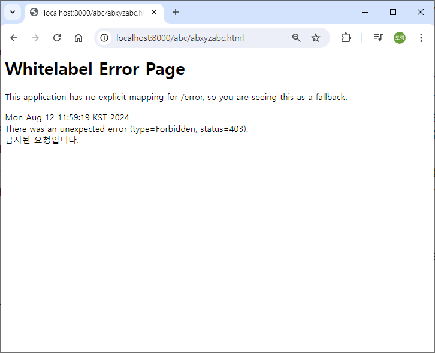

# [2024.08.12(월)] Filter/Interceptor


# Filter/Interceptor

## interceptor와 filter 차이점

### 1. 필터 (Filter)

- tomcat이 처리 (but spring이 tomcat에 등록)

### 정의

필터는 서블릿 기반의 웹 애플리케이션에서 클라이언트의 요청과 응답을 가로채어 전처리 및 후처리를 할 수 있는 기능을 제공합니다. 필터는 스프링 프레임워크와 직접적인 관련이 있는 것은 아니지만, 스프링 부트 또는 스프링 MVC 애플리케이션에서 사용됩니다.

### 역할

- **요청 전처리**: HTTP 요청이 서블릿 또는 스프링 컨트롤러에 도달하기 전에 처리할 수 있습니다. 예를 들어, 인증, 로깅, 캐싱 등을 할 수 있습니다.
- **응답 후처리**: 서블릿 또는 스프링 컨트롤러에서 반환된 응답을 수정하거나 추가적인 작업을 수행할 수 있습니다.
- **체인 형식 처리**: 여러 필터가 등록되어 있는 경우, 순차적으로 실행되며 `FilterChain`을 통해 다음 필터 또는 최종 목적지(서블릿 또는 컨트롤러)로 요청을 전달합니다.

### 사용 방법

필터는 `javax.servlet.Filter` 인터페이스를 구현하여 사용합니다.

- **동작 위치**: 서블릿 컨테이너 단계에서 동작합니다. 즉, HTTP 요청이 들어왔을 때 가장 먼저 실행됩니다.
- **전처리**: 클라이언트의 HTTP 요청이 웹 애플리케이션의 서블릿이나 스프링 컨트롤러에 도달하기 전에 필터가 전처리 작업을 수행합니다. 이 단계에서 인증, 인코딩, 로깅, 보안 등의 작업을 할 수 있습니다.
- **후처리**: 스프링 컨트롤러나 서블릿에서 요청을 처리한 후, 응답이 클라이언트로 전달되기 직전에 후처리 작업을 수행할 수 있습니다.

### 2. 인터셉터 (Interceptor)

### 정의

인터셉터는 스프링 MVC에서 제공하는 기능으로, 스프링의 컨트롤러에 대한 요청을 가로채어 처리할 수 있도록 합니다. 스프링 MVC의 핸들러(컨트롤러) 호출 전후에 실행할 로직을 정의할 수 있습니다.

### 역할

- **요청 전처리**: 컨트롤러가 호출되기 전에 특정 작업을 수행할 수 있습니다. 예를 들어, 인증, 권한 검사, 요청 로깅 등이 가능합니다.
- **요청 후처리**: 컨트롤러가 처리한 후, 뷰가 렌더링되기 전에 추가적인 작업을 할 수 있습니다.
- **뷰 렌더링 이후**: 뷰가 클라이언트에게 전달된 이후에 작업을 수행할 수 있습니다.

### 사용 방법

인터셉터는 `HandlerInterceptor` 인터페이스를 구현하여 사용합니다.

인터셉터는 스프링의 설정 파일이나 자바 설정을 통해 등록됩니다. 예를 들어, `WebMvcConfigurer`를 구현하여 인터셉터를 등록할 수 있습니다.

- **동작 위치**: 스프링 MVC 패턴 내에서 동작합니다. 즉, 필터를 통과한 후, 스프링의 디스패처 서블릿에서 컨트롤러로 요청이 전달되기 전에 실행됩니다.
- **전처리**: 요청이 컨트롤러에 도달하기 전에 인터셉터가 전처리 작업을 수행합니다. 이 단계에서 권한 체크, 로깅, 요청 데이터의 변환 등의 작업을 할 수 있습니다.
- **후처리**: 컨트롤러가 요청을 처리한 후, 뷰를 렌더링하기 전에 후처리 작업을 수행할 수 있습니다. 이 단계에서 추가적인 데이터 조작, 로그 기록 등의 작업이 가능합니다.

### 3. 필터와 인터셉터의 차이

| 특징 | 필터 (Filter) | 인터셉터 (Interceptor) |
| --- | --- | --- |
| API 레벨 | 서블릿 스펙 (javax.servlet.Filter) | 스프링 MVC (org.springframework.web.servlet.HandlerInterceptor) |
| 적용 범위 | 스프링을 포함한 모든 서블릿 기반 요청 | 스프링 MVC의 컨트롤러 요청에만 적용 |
| 처리 시점 | 서블릿 컨텍스트에서의 전처리 및 후처리 | 컨트롤러 호출 전후, 뷰 렌더링 전후 |
| 체인 구조 | FilterChain을 사용하여 다음 필터 또는 서블릿으로 요청 전달 | 다음 인터셉터 또는 컨트롤러로 요청 전달 |
| 주 용도 | 인증, 로깅, 캐싱, 인코딩, 보안 등 | 권한 검사, 로깅, 뷰 관련 전후처리 등 |

### 요약

- **필터**는 서블릿 요청의 전반적인 전처리와 후처리를 다루며, 서블릿 컨텍스트 전체에 적용됩니다.
- **인터셉터**는 스프링 MVC에서 컨트롤러와 관련된 전후처리를 담당하며, 보다 구체적인 스프링 컨텍스트에서 동작합니다.

## SpirngFilterInterceptor 프로젝트 생성 및 설정

### SpirngFilterInterceptor 프로젝트 생성


### resources/application.properties

```java
spring.application.name=SpringFilterInterceptor
server.port=8000
```

## src/main/resources

### abc/abc.html

```java
<!DOCTYPE html>
<html>
<head>
<meta charset="UTF-8">
<title>Insert title here</title>
</head>
<body>
	<h1>abc.html</h1>
</body>
</html>
```

### def/def.html

```java
<!DOCTYPE html>
<html>
<head>
<meta charset="UTF-8">
<title>Insert title here</title>
</head>
<body>
	<h1>def.html</h1>
</body>
</html>
```

### login/login.html

```java
<!DOCTYPE html>
<html>
<head>
<meta charset="UTF-8">
<title>Insert title here</title>
</head>
<body>
	<h1>login.html</h1>
</body>
</html>
```

### register/register.html

```java
<!DOCTYPE html>
<html>
<head>
<meta charset="UTF-8">
<title>Insert title here</title>
</head>
<body>
	<h1>register.html</h1>
</body>
</html>
```

## filter 실습1

- java/com.mycom/myapp 패키지에 filter, interceptor, config 패키지 생성

### java/com/mycom/myapp/filter/MyFilter.java

```java
package com.mycom.myapp.filter;

import java.io.IOException;

import org.springframework.stereotype.Component;

import jakarta.servlet.Filter;
import jakarta.servlet.FilterChain;
import jakarta.servlet.FilterConfig;
import jakarta.servlet.ServletException;
import jakarta.servlet.ServletRequest;
import jakarta.servlet.ServletResponse;

//@Component  // spring boot가 tomcat에 등록 (모든 request에 적용)
public class MyFilter implements Filter {

	// 초기화
	@Override
	public void init(FilterConfig filterConfig) throws ServletException {

	}

	@Override
	public void doFilter(ServletRequest request, ServletResponse response, FilterChain chain)
			throws IOException, ServletException {
		System.out.println("MyFilter >>> before request process");
		
		chain.doFilter(request, response);  // 이어지는 filter 및 request 요청 전달

		System.out.println("MyFilter >>> after request process");
	}

	// 종료 처리
	@Override
	public void destroy() {

	}

}
```

### java/com/mycom/myapp/config/FilterConfig.java

```java
package com.mycom.myapp.config;

import org.springframework.boot.web.servlet.FilterRegistrationBean;
import org.springframework.context.annotation.Bean;
import org.springframework.context.annotation.Configuration;

import com.mycom.myapp.filter.MyFilter;

// FilterConfig를 적용하려면 MyFilter의 @Component comment 후 
@Configuration
public class FilterConfig {
	
	@Bean
	FilterRegistrationBean<MyFilter> myFilter() {
		FilterRegistrationBean<MyFilter> frb = new FilterRegistrationBean<>();
		frb.setFilter(new MyFilter());
		frb.addUrlPatterns("/abc/*");  // *는 1개
		frb.setOrder(0);  // filter가 여러 개 있으면 적용 순서
		
		return frb;
	}
	
}
```

## filter 실습2 - FilterChain

### java/com/mycom/myapp/filter/MyFilter2.java

```java
package com.mycom.myapp.filter;

import java.io.IOException;

import org.springframework.stereotype.Component;

import jakarta.servlet.Filter;
import jakarta.servlet.FilterChain;
import jakarta.servlet.FilterConfig;
import jakarta.servlet.ServletException;
import jakarta.servlet.ServletRequest;
import jakarta.servlet.ServletResponse;

//@Component  // spring boot가 tomcat에 등록 (모든 request에 적용)
public class MyFilter2 implements Filter {

	// 초기화
	@Override
	public void init(FilterConfig filterConfig) throws ServletException {

	}

	@Override
	public void doFilter(ServletRequest request, ServletResponse response, FilterChain chain)
			throws IOException, ServletException {
		System.out.println("MyFilter 2 >>> before request process");
		
		chain.doFilter(request, response);  // 이어지는 filter 및 request 요청 전달

		System.out.println("MyFilter 2 >>> after request process");
	}

	// 종료 처리
	@Override
	public void destroy() {

	}

}
```

### java/com/mycom/myapp/config/FilterConfig.java

```java
package com.mycom.myapp.config;

import org.springframework.boot.web.servlet.FilterRegistrationBean;
import org.springframework.context.annotation.Bean;
import org.springframework.context.annotation.Configuration;

import com.mycom.myapp.filter.MyFilter;
import com.mycom.myapp.filter.MyFilter2;

// FilterConfig를 적용하려면 MyFilter의 @Component comment 후 
@Configuration
public class FilterConfig {
	
	@Bean
	FilterRegistrationBean<MyFilter> myFilter() {
		FilterRegistrationBean<MyFilter> frb = new FilterRegistrationBean<>();
		frb.setFilter(new MyFilter());
		frb.addUrlPatterns("/abc/*");  // *는 1개
		frb.setOrder(0);  // filter가 여러 개 있으면 적용 순서
		
		return frb;
	}
	
	@Bean
	FilterRegistrationBean<MyFilter2> myFilter2() {
		FilterRegistrationBean<MyFilter2> frb = new FilterRegistrationBean<>();
		frb.setFilter(new MyFilter2());
		frb.addUrlPatterns("/abc/*");  // *는 1개
		frb.setOrder(1);  // filter가 여러 개 있으면 적용 순서
		
		return frb;
	}
	
}
```

### 실행 결과

- http://localhost:8000/abc/abc.html 접속 시 console에 아래 내용 출력
    
    ```java
    MyFilter >>> before request process
    MyFilter 2 >>> before request process
    MyFilter 2 >>> after request process
    MyFilter >>> after request process
    ```
    

## interceptor 실습

### java/com/mycom/myapp/interceptor/MyInterceptor.java

```java
package com.mycom.myapp.interceptor;

import org.springframework.lang.Nullable;
import org.springframework.stereotype.Component;
import org.springframework.web.servlet.HandlerInterceptor;
import org.springframework.web.servlet.ModelAndView;

import jakarta.servlet.http.HttpServletRequest;
import jakarta.servlet.http.HttpServletResponse;

@Component  // interceptor는 @Component 바로 적용 X, interceptor config를 반드시 적용해야 한다.
public class MyInterceptor implements HandlerInterceptor {

	@Override
	public boolean preHandle(HttpServletRequest request, HttpServletResponse response, Object handler) throws Exception {
		System.out.println("MyInterceptor >>> preHandle");
		return true;  // 이어서 계속 진행, false : 더이상 진행 X
	}
	
	@Override
	public void postHandle(HttpServletRequest request, HttpServletResponse response, Object handler, @Nullable ModelAndView modelAndView) throws Exception {
		System.out.println("MyInterceptor >>> postHandle");
	}
	
	@Override
	public void afterCompletion(HttpServletRequest request, HttpServletResponse response, Object handler, @Nullable Exception ex) throws Exception {
		System.out.println("MyInterceptor >>> afterCompletion");
	}
	
}
```

### java/com/mycom/myapp/config/InterceptorConfig.java

```java
package com.mycom.myapp.config;

import org.springframework.beans.factory.annotation.Autowired;
import org.springframework.context.annotation.Configuration;
import org.springframework.web.servlet.config.annotation.InterceptorRegistry;
import org.springframework.web.servlet.config.annotation.WebMvcConfigurer;

import com.mycom.myapp.interceptor.MyInterceptor;

@Configuration
public class InterceptorConfig implements WebMvcConfigurer {
	
	@Autowired
	private MyInterceptor myInterceptor;
	
	@Override
	public void addInterceptors(InterceptorRegistry registry) {
		registry.addInterceptor(myInterceptor).addPathPatterns("/**");  // 모든 경로에 interceptor 적용
	
	}
	
}
```

### 실행 결과

- http://localhost:8000/abc/abc.html 접속 시 console에 아래 내용 출력
    
    ```java
    MyFilter >>> before request process
    MyFilter 2 >>> before request process
    MyInterceptor >>> preHandle
    MyInterceptor >>> postHandle
    MyInterceptor >>> afterCompletion
    MyFilter 2 >>> after request process
    MyFilter >>> after request process
    ```
    
- http://localhost:8000/def/def.html 접속 시 console에 아래 내용 출력
    
    ```java
    MyInterceptor >>> preHandle
    MyInterceptor >>> postHandle
    MyInterceptor >>> afterCompletion
    ```
    

## interceptor 실습2

### java/com/mycom/myapp/interceptor/MyInterceptor2.java

```java
package com.mycom.myapp.interceptor;

import org.springframework.lang.Nullable;
import org.springframework.stereotype.Component;
import org.springframework.web.servlet.HandlerInterceptor;
import org.springframework.web.servlet.ModelAndView;

import jakarta.servlet.http.HttpServletRequest;
import jakarta.servlet.http.HttpServletResponse;

@Component  // interceptor는 @Component 바로 적용 X, interceptor config를 반드시 적용해야 한다.
public class MyInterceptor2 implements HandlerInterceptor {

	@Override
	public boolean preHandle(HttpServletRequest request, HttpServletResponse response, Object handler) throws Exception {
		System.out.println("MyInterceptor 2 >>> preHandle");
		return true;  // 이어서 계속 진행, false : 더이상 진행 X
	}
	
	@Override
	public void postHandle(HttpServletRequest request, HttpServletResponse response, Object handler, @Nullable ModelAndView modelAndView) throws Exception {
		System.out.println("MyInterceptor 2 >>> postHandle");
	}
	
	@Override
	public void afterCompletion(HttpServletRequest request, HttpServletResponse response, Object handler, @Nullable Exception ex) throws Exception {
		System.out.println("MyInterceptor 2 >>> afterCompletion");
	}
	
}
```

### java/com/mycom/myapp/config/InterceptorConfig.java

```java
package com.mycom.myapp.config;

import org.springframework.beans.factory.annotation.Autowired;
import org.springframework.context.annotation.Configuration;
import org.springframework.web.servlet.config.annotation.InterceptorRegistry;
import org.springframework.web.servlet.config.annotation.WebMvcConfigurer;

import com.mycom.myapp.interceptor.MyInterceptor;
import com.mycom.myapp.interceptor.MyInterceptor2;

@Configuration
public class InterceptorConfig implements WebMvcConfigurer {
	
	@Autowired
	private MyInterceptor myInterceptor;

	@Autowired
	private MyInterceptor2 myInterceptor2;
	
	@Override
	public void addInterceptors(InterceptorRegistry registry) {
		registry.addInterceptor(myInterceptor).addPathPatterns("/**");  // 모든 경로에 interceptor 적용

		registry.addInterceptor(myInterceptor2).addPathPatterns("/def/**");  // 모든 경로에 interceptor 적용
	
	}
	
}
```

### 실행 결과

- http://localhost:8000/abc/abc.html 접속 시 console에 아래 내용 출력
    
    ```java
    MyInterceptor >>> preHandle
    MyInterceptor 2 >>> preHandle
    MyInterceptor 2 >>> postHandle
    MyInterceptor >>> postHandle
    MyInterceptor 2 >>> afterCompletion
    MyInterceptor >>> afterCompletion
    ```
    
- http://localhost:8000/login/login.html 접속 시 console에 아래 내용 출력
    
    ```java
    MyInterceptor >>> preHandle
    MyInterceptor >>> postHandle
    MyInterceptor >>> afterCompletion
    ```
    

- filter는 tomcat에서 처리되므로 인프라, 개발자 담당이 나뉘어져 있다면 인프라가 담당한다.
- filter에서는 주로 보안 관련 처리를 하고, interceptor에서는 주로 로그인 관련 처리를 한다.

## filter 보안 관련 처리 실습

### java/com/mycom/myapp/filter/MyFilter2.java

```java
package com.mycom.myapp.filter;

import java.io.IOException;

import org.springframework.stereotype.Component;

import jakarta.servlet.Filter;
import jakarta.servlet.FilterChain;
import jakarta.servlet.FilterConfig;
import jakarta.servlet.ServletException;
import jakarta.servlet.ServletRequest;
import jakarta.servlet.ServletResponse;
import jakarta.servlet.http.HttpServletRequest;
import jakarta.servlet.http.HttpServletResponse;

//@Component  // spring boot가 tomcat에 등록 (모든 request에 적용)
public class MyFilter2 implements Filter {

	// 초기화
	@Override
	public void init(FilterConfig filterConfig) throws ServletException {

	}

	@Override
	public void doFilter(ServletRequest request, ServletResponse response, FilterChain chain)
			throws IOException, ServletException {
		System.out.println("MyFilter 2 >>> before request process");
		
		// url에 "xyz" 포함되면 reject
		// 보안 처리 흉내
		HttpServletRequest httpRequest = (HttpServletRequest) request;
		HttpServletResponse httpResponse = (HttpServletResponse) response;
		
		String requestURI = httpRequest.getRequestURI();
		if(requestURI.contains("xyz")) {
			httpResponse.sendError(HttpServletResponse.SC_FORBIDDEN, "금지된 요청입니다.");
			return;
		}
		
		chain.doFilter(request, response);  // 이어지는 filter 및 request 요청 전달

		System.out.println("MyFilter 2 >>> after request process");
	}

	// 종료 처리
	@Override
	public void destroy() {

	}

}
```

### 실행 결과

- http://localhost:8000/abc/abxyzabc.html 접속
    
    
    
    ```java
    MyFilter >>> before request process
    MyFilter 2 >>> before request process
    MyFilter >>> after request process
    MyInterceptor >>> preHandle
    MyInterceptor >>> postHandle
    MyInterceptor >>> afterCompletion
    ```
    

## interceptor 로그인 관련 처리 실습

### java/com.mycom/myapp/interceptor/MyInterceptor2.java

```java
package com.mycom.myapp.interceptor;

import org.springframework.lang.Nullable;
import org.springframework.stereotype.Component;
import org.springframework.web.servlet.HandlerInterceptor;
import org.springframework.web.servlet.ModelAndView;

import jakarta.servlet.http.HttpServletRequest;
import jakarta.servlet.http.HttpServletResponse;
import jakarta.servlet.http.HttpSession;

@Component  // interceptor는 @Component 바로 적용 X, interceptor config를 반드시 적용해야 한다.
public class MyInterceptor2 implements HandlerInterceptor {

	@Override
	public boolean preHandle(HttpServletRequest request, HttpServletResponse response, Object handler) throws Exception {
		System.out.println("MyInterceptor 2 >>> preHandle");
		
		HttpSession session = request.getSession();
		String login = (String) session.getAttribute("login");
		if( ! "success".equals(login) ) {
			response.getWriter().write("Need Login");
			return false;
		}
		
		return true;  // 이어서 계속 진행, false : 더이상 진행 X
	}
	
	@Override
	public void postHandle(HttpServletRequest request, HttpServletResponse response, Object handler, @Nullable ModelAndView modelAndView) throws Exception {
		System.out.println("MyInterceptor 2 >>> postHandle");
	}
	
	@Override
	public void afterCompletion(HttpServletRequest request, HttpServletResponse response, Object handler, @Nullable Exception ex) throws Exception {
		System.out.println("MyInterceptor 2 >>> afterCompletion");
	}
	
}
```

### java/com/mycom/myapp/config/InterceptorConfig.java

```java
package com.mycom.myapp.config;

import org.springframework.beans.factory.annotation.Autowired;
import org.springframework.context.annotation.Configuration;
import org.springframework.web.servlet.config.annotation.InterceptorRegistry;
import org.springframework.web.servlet.config.annotation.WebMvcConfigurer;

import com.mycom.myapp.interceptor.MyInterceptor;
import com.mycom.myapp.interceptor.MyInterceptor2;

@Configuration
public class InterceptorConfig implements WebMvcConfigurer {
	
	@Autowired
	private MyInterceptor myInterceptor;

	@Autowired
	private MyInterceptor2 myInterceptor2;
	
	@Override
	public void addInterceptors(InterceptorRegistry registry) {
		registry.addInterceptor(myInterceptor).addPathPatterns("/**")  // 모든 경로에 interceptor 적용
				.excludePathPatterns("/login/**", "/register/**");  // excludePathPatterns 내용을 뺀 나머지에 적용한다.

		registry.addInterceptor(myInterceptor2).addPathPatterns("/def/**");  // 모든 경로에 interceptor 적용
	
	}
	
}
```

### java/com/mycom/myapp/controller/MyController.java

```java
package com.mycom.myapp.controller;

import org.springframework.stereotype.Controller;
import org.springframework.web.bind.annotation.GetMapping;

import jakarta.servlet.http.HttpSession;

@Controller
public class MyController {

	// 로그인 성공
	@GetMapping("/login")
	public String login(HttpSession session) {
		System.out.println("/login");
		session.setAttribute("login", "success");
		return "/login/login.html";  // static 폴더에서 찾는다.
	}
	
}
```

### 실행 결과

- http://localhost:8000/def/def.html 접속 시 console에 아래 내용 출력
    
    
    
    ```java
    MyInterceptor >>> preHandle
    MyInterceptor 2 >>> preHandle
    MyInterceptor >>> afterCompletion
    ```
    
- http://localhost:8000/login 접속하여 로그인 세션 생성
    
    ```java
    /login
    ```
    
- http://localhost:8000/def/def.html 접속하여 로그인 확인
    
    
    
    ```java
    MyInterceptor >>> preHandle
    MyInterceptor 2 >>> preHandle
    MyInterceptor 2 >>> postHandle
    MyInterceptor >>> postHandle
    MyInterceptor 2 >>> afterCompletion
    MyInterceptor >>> afterCompletion
    ```
    

# 블로그

## SpirngMVCDBAjaxMybatisBoard 프로젝트 생성 및 설정

### SpirngMVCDBAjaxMybatisBoard 프로젝트 생성


### pom.xml

https://mvnrepository.com/artifact/com.google.code.gson/gson/2.10.1

```java
<?xml version="1.0" encoding="UTF-8"?>
<project xmlns="http://maven.apache.org/POM/4.0.0" xmlns:xsi="http://www.w3.org/2001/XMLSchema-instance"
	xsi:schemaLocation="http://maven.apache.org/POM/4.0.0 https://maven.apache.org/xsd/maven-4.0.0.xsd">
	<modelVersion>4.0.0</modelVersion>
	<parent>
		<groupId>org.springframework.boot</groupId>
		<artifactId>spring-boot-starter-parent</artifactId>
		<version>3.3.2</version>
		<relativePath/> <!-- lookup parent from repository -->
	</parent>
	<groupId>com.mycom</groupId>
	<artifactId>SpringMVCDBAjaxMybatisBoard</artifactId>
	<version>0.0.1-SNAPSHOT</version>
	<name>SpringMVCDBAjaxMybatisBoard</name>
	<description>SpringMVCDBAjaxMybatisBoard</description>
	<url/>
	<licenses>
		<license/>
	</licenses>
	<developers>
		<developer/>
	</developers>
	<scm>
		<connection/>
		<developerConnection/>
		<tag/>
		<url/>
	</scm>
	<properties>
		<java.version>17</java.version>
	</properties>
	<dependencies>
		<dependency>
			<groupId>org.springframework.boot</groupId>
			<artifactId>spring-boot-starter-web</artifactId>
		</dependency>
		<dependency>
			<groupId>org.mybatis.spring.boot</groupId>
			<artifactId>mybatis-spring-boot-starter</artifactId>
			<version>3.0.3</version>
		</dependency>

		<dependency>
			<groupId>org.springframework.boot</groupId>
			<artifactId>spring-boot-devtools</artifactId>
			<scope>runtime</scope>
			<optional>true</optional>
		</dependency>
		<dependency>
			<groupId>com.mysql</groupId>
			<artifactId>mysql-connector-j</artifactId>
			<scope>runtime</scope>
		</dependency>
		<dependency>
			<groupId>org.springframework.boot</groupId>
			<artifactId>spring-boot-starter-test</artifactId>
			<scope>test</scope>
		</dependency>
		<dependency>
			<groupId>org.mybatis.spring.boot</groupId>
			<artifactId>mybatis-spring-boot-starter-test</artifactId>
			<version>3.0.3</version>
			<scope>test</scope>
		</dependency>
		
		<!-- https://mvnrepository.com/artifact/org.apache.tomcat.embed/tomcat-embed-jasper -->
<dependency>
    <groupId>org.apache.tomcat.embed</groupId>
    <artifactId>tomcat-embed-jasper</artifactId>
</dependency>

<!-- https://mvnrepository.com/artifact/com.google.code.gson/gson -->
<dependency>
    <groupId>com.google.code.gson</groupId>
    <artifactId>gson</artifactId> 
</dependency>

		
	</dependencies>

	<build>
		<plugins>
			<plugin>
				<groupId>org.springframework.boot</groupId>
				<artifactId>spring-boot-maven-plugin</artifactId>
			</plugin>
		</plugins>
	</build>

</project>
```

### resources/application.properties

```java
spring.application.name=SpringMVCDBAjaxMybatisBoard
spring.mvc.view.prefix=/WEB-INF/jsp/
spring.mvc.view.suffix=.jsp
server.port=8000

server.servlet.session.persistent=false

spring.datasource.url=jdbc:mysql://localhost:3306/board
spring.datasource.username=root
spring.datasource.password=root
spring.datasource.driver-class-name=com.mysql.cj.jdbc.Driver

mybatis.config-location=classpath:/config/mybatis-config.xml

logging.level.com.mycom.myapp=debug 

spring.mvc.converters.preferred-json-mapper=gson
```

## 준비

- SpringMVCDBAjaxMybatis 프로젝트에 있으면 복사해서 수정

### src/main/resources

### config/mybatis-config.xml

```java
<?xml version="1.0" encoding="UTF-8" ?>
<!DOCTYPE configuration
    PUBLIC "-//mybatis.org//DTD Config 3.0//EN"
    "http://mybatis.org/dtd/mybatis-3-config.dtd">
<configuration> 

	<settings>
		<setting name="mapUnderscoreToCamelCase" value="true"/>
	</settings>

	<mappers>
		<mapper resource="mapper/auth-mapper.xml"/>
		<mapper resource="mapper/user-mapper.xml"/>
		<mapper resource="mapper/board-mapper.xml"/>
	</mappers>

</configuration>
```

### mapper

- SpringMVCDBAjaxMybatis 프로젝트에서 복사하여 xml 이름 수정하기

- auth-mapper.xml

- board-mapper.xml

- user-mapper.xml

### static/index.html

```java
<!DOCTYPE html>
<html>
<head>
<meta charset="UTF-8">
<title>Insert title here</title>
</head>
<body>
	<h1>Spring MVC 게시판</h1>
	<h4>게시판은 로그인 필요</h4>
	<a href="/pages/user">회원가입</a> <a href="/pages/login">로그인</a> <a href="/pages/board">게시판</a>
</body>
</html>
```

### src/main/webapp/WEB-INF/jsp

### board.jsp

```java
<%@ page language="java" contentType="text/html; charset=UTF-8"
    pageEncoding="UTF-8"%>
<!DOCTYPE html>
<html>
<head>
<meta charset="UTF-8">
<title>Insert title here</title>
</head>
<body>
	<h1>board.jsp</h1>
</body>
</html>
```

### login.jsp

```java
<%@ page language="java" contentType="text/html; charset=UTF-8"
    pageEncoding="UTF-8"%>
<!DOCTYPE html>
<html>
<head>
<meta charset="UTF-8">
<title>Insert title here</title>
</head>
<body>
	<h1>login.jsp</h1>
</body>
</html>
```

### register.jsp

```java
<%@ page language="java" contentType="text/html; charset=UTF-8"
    pageEncoding="UTF-8"%>
<!DOCTYPE html>
<html>
<head>
<meta charset="UTF-8">
<title>Insert title here</title>
</head>
<body>
	<h1>register.jsp</h1>
</body>
</html>
```

### src/main/java/com/mycom/myapp

- auth, board, user 패키지 생성 및 각 패키지에 controller, dao, dto, service 생성

### user/dto/UserDto.java

```java
package com.mycom.myapp.user.dto;

import java.util.Date;

public class UserDto {
	private int userSeq;
	private String userName;
	private String userPassword;
	private String userEmail;
	private String userProfileImage;
	private Date userRegisterDate;
	
	public UserDto() {}
	
	public UserDto(int userSeq, String userName, String userPassword, String userEmail, String userProfileImage,
			Date userRegisterDate) {
		super();
		this.userSeq = userSeq;
		this.userName = userName;
		this.userPassword = userPassword;
		this.userEmail = userEmail;
		this.userProfileImage = userProfileImage;
		this.userRegisterDate = userRegisterDate;
	}
	
	public int getUserSeq() {
		return userSeq;
	}
	public void setUserSeq(int userSeq) {
		this.userSeq = userSeq;
	}
	public String getUserName() {
		return userName;
	}
	public void setUserName(String userName) {
		this.userName = userName;
	}
	public String getUserPassword() {
		return userPassword;
	}
	public void setUserPassword(String userPassword) {
		this.userPassword = userPassword;
	}
	public String getUserEmail() {
		return userEmail;
	}
	public void setUserEmail(String userEmail) {
		this.userEmail = userEmail;
	}
	public String getUserProfileImage() {
		return userProfileImage;
	}
	public void setUserProfileImage(String userProfileImage) {
		this.userProfileImage = userProfileImage;
	}
	public Date getUserRegisterDate() {
		return userRegisterDate;
	}
	public void setUserRegisterDate(Date userRegisterDate) {
		this.userRegisterDate = userRegisterDate;
	}

	@Override
	public String toString() {
		return "UserDto [userSeq=" + userSeq + ", userName=" + userName + ", userPassword=" + userPassword
				+ ", userEmail=" + userEmail + ", userProfileImage=" + userProfileImage + ", userRegisterDate="
				+ userRegisterDate + "]";
	}
	
}

```

### common

### pageController.java

```java
package com.mycom.myapp.common;

import org.springframework.stereotype.Controller;
import org.springframework.web.bind.annotation.GetMapping;

// page 이동만 전담하는 controller
// <a href="">, window.location.href="/.."
@Controller
public class pageController {
	
	@GetMapping("/pages/user")
	private String register() {
		return "/register";
	}
	
	@GetMapping("/pages/login")
	private String login() {
		return "/login";
	}
	
	@GetMapping("/pages/board")
	private String board() {
		return "/board";
	}
	
}
```

### LoginInterceptor.java

```java
package com.mycom.myapp.common;

import org.springframework.stereotype.Component;
import org.springframework.web.servlet.HandlerInterceptor;

import com.mycom.myapp.user.dto.UserDto;

import jakarta.servlet.http.HttpServletRequest;
import jakarta.servlet.http.HttpServletResponse;
import jakarta.servlet.http.HttpSession;

@Component  
public class LoginInterceptor implements HandlerInterceptor {

	@Override
	public boolean preHandle(HttpServletRequest request, HttpServletResponse response, Object handler) throws Exception {
		System.out.println("LoginInterceptor >>> " + request.getRequestURI());
		
		HttpSession session = request.getSession();
		UserDto userDto = (UserDto) session.getAttribute("userDto");
		
		if( userDto == null ) { // not logged in
			System.out.println("LoginInterceptor >>> login.jsp");
			response.sendRedirect("/pages/login");
		}
		
		return true;  // 이어서 계속 진행, false : 더이상 진행 X
	}
	
}
```

### config/WebMvcConfig.java

```java
package com.mycom.myapp.config;

import org.springframework.beans.factory.annotation.Autowired;
import org.springframework.context.annotation.Configuration;
import org.springframework.web.servlet.config.annotation.InterceptorRegistry;
import org.springframework.web.servlet.config.annotation.WebMvcConfigurer;

import com.mycom.myapp.common.LoginInterceptor;

@Configuration
public class WebMvcConfig implements WebMvcConfigurer {
	
	@Autowired
	private LoginInterceptor loginInterceptor;

	@Override
	public void addInterceptors(InterceptorRegistry registry) {
//		registry.addInterceptor(loginInterceptor)
//				.addPathPatterns("/**")
//				.excludePathPatterns(
//						"/",
//						"/index.html",
//						"/pages/login", 
//						"/pages/user"
//					);  

		registry.addInterceptor(loginInterceptor)
				.addPathPatterns("/pages/board/**");

	}
	
}
```

### board 스키마 및 user 테이블 생성

```java
create schema board;
   
use board;
    
create table users (
	user_seq int not null auto_increment,
	user_name varchar(100) not null,
	user_password varchar(50) not null,
	user_email varchar(100) not null,
	user_profile_image varchar(500) default '/img/noProfile.png',
	user_register_date date default null,
	primary key (user_seq),
	unique key user_email_unique (user_email)
);
```

## User Insert 코드 작성

### src/main/java/com/mycom/myapp/user

### dto/UserDto.java

```java
package com.mycom.myapp.user.dto;

import java.util.Date;

public class UserDto {
	private int userSeq;
	private String userName;
	private String userPassword;
	private String userEmail;
	private String userProfileImage;
	private Date userRegisterDate;
	
	public UserDto() {}
	
	public UserDto(int userSeq, String userName, String userPassword, String userEmail, String userProfileImage,
			Date userRegisterDate) {
		super();
		this.userSeq = userSeq;
		this.userName = userName;
		this.userPassword = userPassword;
		this.userEmail = userEmail;
		this.userProfileImage = userProfileImage;
		this.userRegisterDate = userRegisterDate;
	}
	
	public int getUserSeq() {
		return userSeq;
	}
	public void setUserSeq(int userSeq) {
		this.userSeq = userSeq;
	}
	public String getUserName() {
		return userName;
	}
	public void setUserName(String userName) {
		this.userName = userName;
	}
	public String getUserPassword() {
		return userPassword;
	}
	public void setUserPassword(String userPassword) {
		this.userPassword = userPassword;
	}
	public String getUserEmail() {
		return userEmail;
	}
	public void setUserEmail(String userEmail) {
		this.userEmail = userEmail;
	}
	public String getUserProfileImage() {
		return userProfileImage;
	}
	public void setUserProfileImage(String userProfileImage) {
		this.userProfileImage = userProfileImage;
	}
	public Date getUserRegisterDate() {
		return userRegisterDate;
	}
	public void setUserRegisterDate(Date userRegisterDate) {
		this.userRegisterDate = userRegisterDate;
	}

	@Override
	public String toString() {
		return "UserDto [userSeq=" + userSeq + ", userName=" + userName + ", userPassword=" + userPassword
				+ ", userEmail=" + userEmail + ", userProfileImage=" + userProfileImage + ", userRegisterDate="
				+ userRegisterDate + "]";
	}
	
}

```

### dao/UserDao.java (interface)

```java
package com.mycom.myapp.user.dao;

import org.apache.ibatis.annotations.Mapper;

import com.mycom.myapp.user.dto.UserDto;

@Mapper
public interface UserDao {
	int registerUser(UserDto userDto);
}
```

### service

### UserService.java

```java
package com.mycom.myapp.user.service;

import com.mycom.myapp.user.dto.UserDto;

public interface UserService {
	int registerUser(UserDto userDto);
}
```

### UserServiceImpl.java

```java
package com.mycom.myapp.user.service;

import org.springframework.stereotype.Service;

import com.mycom.myapp.user.dao.UserDao;
import com.mycom.myapp.user.dto.UserDto;

@Service
public class UserServiceImpl implements UserService {

	// UserDao DI
	private final UserDao userDao;
	
	public UserServiceImpl(UserDao userDao) {
		this.userDao = userDao;
	}
	
	@Override
	public int registerUser(UserDto userDto) {
		return userDao.registerUser(userDto);
	}

}
```

### controller/UserController.java

```java
package com.mycom.myapp.user.controller;

import org.springframework.stereotype.Controller;
import org.springframework.web.bind.annotation.PostMapping;
import org.springframework.web.bind.annotation.ResponseBody;

import com.mycom.myapp.user.dto.UserDto;
import com.mycom.myapp.user.service.UserService;

@Controller
public class UserController {
	
	// UseerService DI
	private final UserService userService;
	
	public UserController(UserService userService) {
		this.userService = userService;
	}
	
	@PostMapping(value = "/register")
	@ResponseBody
	public int register(UserDto userDto) {
		return userService.registerUser(userDto);
	}
	
}
```

### src/main/resources/config/mybatis-config.xml

```java
<?xml version="1.0" encoding="UTF-8" ?>
<!DOCTYPE configuration
    PUBLIC "-//mybatis.org//DTD Config 3.0//EN"
    "http://mybatis.org/dtd/mybatis-3-config.dtd">
<configuration> 

	<settings>
		<setting name="mapUnderscoreToCamelCase" value="true"/>
	</settings>

	<mappers>
		<!-- <mapper resource="mapper/auth-mapper.xml"/> -->
		<mapper resource="mapper/user-mapper.xml"/>
		<!-- <mapper resource="mapper/board-mapper.xml"/> -->
	</mappers> 

</configuration>
```

### src/main/resources/mapper/user-mapper.xml

```java
<?xml version="1.0" encoding="UTF-8" ?>
<!DOCTYPE mapper
    PUBLIC "-//mybatis.org//DTD Mapper 3.0//EN"
    "http://mybatis.org/dtd/mybatis-3-mapper.dtd">
<mapper namespace="com.mycom.myapp.user.dao.UserDao">

	<insert id="registerUser" parameterType="com.mycom.myapp.user.dto.UserDto">
		insert into users ( user_name, user_password, user_email, user_register_date )
					values ( #{userName}, #{userPassword}, #{userEmail}, now() );
	</insert>
	
</mapper>    
```

### 실행 결과


## User Insert 결과 전달 코드 작성

### src/main/webapp/WEB-INF/jsp/register.jsp

https://getbootstrap.com/docs/5.2/forms/validation/

https://alertifyjs.com/

```java
<%@ page language="java" contentType="text/html; charset=UTF-8"
    pageEncoding="UTF-8"%>
<!DOCTYPE html>
<html>
<head>
<meta charset="UTF-8">

<link href="https://cdn.jsdelivr.net/npm/bootstrap@5.2.3/dist/css/bootstrap.min.css" rel="stylesheet" integrity="sha384-rbsA2VBKQhggwzxH7pPCaAqO46MgnOM80zW1RWuH61DGLwZJEdK2Kadq2F9CUG65" crossorigin="anonymous">
<script src="https://cdn.jsdelivr.net/npm/bootstrap@5.2.3/dist/js/bootstrap.bundle.min.js" integrity="sha384-kenU1KFdBIe4zVF0s0G1M5b4hcpxyD9F7jL+jjXkk+Q2h455rYXK/7HAuoJl+0I4" crossorigin="anonymous"></script>

<script src="//cdn.jsdelivr.net/npm/alertifyjs@1.12.0/build/alertify.min.js"></script>
<link rel="stylesheet" href="//cdn.jsdelivr.net/npm/alertifyjs@1.12.0/build/css/alertify.min.css"/>
<link rel="stylesheet" href="//cdn.jsdelivr.net/npm/alertifyjs@1.12.0/build/css/themes/default.min.css"/>

<title>Insert title here</title>
</head>
<body>
	<div class="container">
	
		<div class="mb-3 d-flex justify-content-center">
            <h1 class="display-4">삐따기 세상</h1>
        </div>
        <div class="mb-3">
            <h2>Register</h2>
        </div>
        
        <form novalidate> <!-- novalidate : 브라우저는 validate을 처리하지 않도록 한다. -->
            <div class="mb-3">
                <label for="userName">User Name:</label>
                <input type="text" class="form-control" id="userName" placeholder="Enter userName" name="userName" required>
                <div class="valid-feedback">Valid.</div>
                <div class="invalid-feedback">Please fill out this field.</div>
            </div>
            <div class="mb-3">
                <label for="userPassword">Password:</label>
                <input type="password" class="form-control" id="userPassword" placeholder="Enter password" name="userPassword" required>
                <div class="valid-feedback">Valid.</div>
                <div class="invalid-feedback">1개 이상의 특수문자, 대소문자 및 숫자를 포함하고 8자리 이상이여야 합니다.</div>
            </div>
            <div class="mb-3">
                <label for="userPassword2">Password Confirm:</label>
                <input type="password" class="form-control" id="userPassword2" placeholder="Confirm password" name="userPassword2" required>
                <div class="valid-feedback">Valid.</div>
                <div class="invalid-feedback">Please fill out this field.</div>
            </div>
            <div class="mb-3">
                <label for="userEmail">Email:</label>
                <input type="text" class="form-control" id="userEmail" placeholder="Enter email" name="userEmail" required>
                <div class="valid-feedback">Valid.</div>
                <div class="invalid-feedback">Please fill out this field.</div>
            </div>
        </form>
        
        <div>
            <button id="btnRegister" class="btn btn-primary">가입</button>
        </div>
        
	</div>
	
<script>
window.onload = function(){
    
    document.querySelector("#userName").focus();
    document.querySelector("#userName").onblur = function () {
        if (validateUserName( this.value )) {
            this.classList.remove("is-invalid");
            this.classList.add('is-valid');
        } else {
            this.classList.remove("is-valid");
            this.classList.add('is-invalid');
        }
    };
    document.querySelector("#userPassword").onblur = function () {
        if (validatePassword( this.value )) {
            this.classList.remove("is-invalid");
            this.classList.add('is-valid');
        } else {
            this.classList.remove("is-valid");
            this.classList.add('is-invalid');
        }
    };
    document.querySelector("#userPassword2").onblur = function () {
        if (validatePassword2( this.value )) {
            this.classList.remove("is-invalid");
            this.classList.add('is-valid');
        } else {
            this.classList.remove("is-valid");
            this.classList.add('is-invalid');
        }
    };
    document.querySelector("#userEmail").onblur = function () {
        if (validateEmail( this.value )) {
            this.classList.remove("is-invalid");
            this.classList.add('is-valid');
        } else {
            this.classList.remove("is-valid");
            this.classList.add('is-invalid');
        }
    };
    document.querySelector('input').onfocus = function () {
        this.classList.remove('is-valid', 'is-invalid');
    };
    
    //submit
    document.querySelector("#btnRegister").onclick = function(){
        if( document.querySelectorAll("form .is-invalid").length > 0 ){
            alert("입력이 올바르지 않습니다.")
        }else{
            register();
        }
    };
}
function validateUserName(userName) {
    if (userName.length >= 3) return true;
    else return false;
}
function validatePassword(userPassword) {
    var patternEngAtListOne = new RegExp(/[a-zA-Z]+/);// + for at least one
    var patternSpeAtListOne = new RegExp(/[~!@#$%^&*()_+|<>?:{}]+/);// + for at least one
    var patternNumAtListOne = new RegExp(/[0-9]+/);// + for at least one
    
    if( patternEngAtListOne.test( userPassword ) 
            && patternSpeAtListOne.test( userPassword )  
            && patternNumAtListOne.test( userPassword )
            && userPassword.length >= 8
    ){
        return true;
    }
    else return false;
}
function validatePassword2(userPassword2) {
    if (userPassword2 == document.querySelector("#userPassword").value ) return true;
    else return false;
}
function validateEmail(userEmail) {
    // ^ 시작일치, $ 끝 일치
    // {2, 3} 2개 ~ 3개
    // * 0회 이상, + 1회 이상
    // [-_.] - 또는 _ 또는 .
    // ? 없거나 1회
    let regexp = /^[0-9a-zA-Z]([-_.]?[0-9a-zA-Z])*@[0-9a-zA-Z]([-_.]?[0-9a-zA-Z])*.[a-zA-Z]{2,3}$/i;
    if (regexp.test(userEmail)) return true;
    else return false;
}
async function register() {
    
    var userName = document.querySelector("#userName").value;
    var userPassword = document.querySelector("#userPassword").value; 
    var userEmail = document.querySelector("#userEmail").value;   
    
    let urlParams = new URLSearchParams({
        userName: userName,
        userEmail: userEmail,
        userPassword: userPassword,
    });
    
    let fetchOptions = {
        method: "POST",
        body: urlParams,
    }
    
    let response = await fetch("/register", fetchOptions);
    console.log(response);
    let data = await response.json();
    if( data.result == "success" ){
        alertify.alert('Welcome!', '회원가입을 축하합니다. 로그인 페이지로 이동합니다.', function(){
            window.location.href="/pages/login";
        });
    }else if( data.result == "fail" ){
        alert("서버 오류!!");
    }
}
</script>
	
</body>
</html>
```

### src/main/java/com/mycom/myapp/user

### dto/UserResultDto.java

```java
package com.mycom.myapp.user.service;

import org.springframework.stereotype.Service;

import com.mycom.myapp.user.dao.UserDao;
import com.mycom.myapp.user.dto.UserDto;
import com.mycom.myapp.user.dto.UserResultDto;

@Service
public class UserServiceImpl implements UserService {

	// UserDao DI
	private final UserDao userDao;
	
	public UserServiceImpl(UserDao userDao) {
		this.userDao = userDao;
	}
	
	@Override
	public UserResultDto registerUser(UserDto userDto) {
		UserResultDto userResultDto = new UserResultDto();
		if( userDao.registerUser(userDto) == 1) {
			userResultDto.setResult("success");
		} else {
			userResultDto.setResult("fail");
		}
		return userResultDto;
	}

}
```

### service

### UserService.java

```java
package com.mycom.myapp.user.service;

import com.mycom.myapp.user.dto.UserDto;
import com.mycom.myapp.user.dto.UserResultDto;

public interface UserService {
	UserResultDto registerUser(UserDto userDto);
}
```

### UserServiceImpl.java

```java
package com.mycom.myapp.user.service;

import org.springframework.stereotype.Service;

import com.mycom.myapp.user.dao.UserDao;
import com.mycom.myapp.user.dto.UserDto;
import com.mycom.myapp.user.dto.UserResultDto;

@Service
public class UserServiceImpl implements UserService {

	// UserDao DI
	private final UserDao userDao;
	
	public UserServiceImpl(UserDao userDao) {
		this.userDao = userDao;
	}
	
	@Override
	public UserResultDto registerUser(UserDto userDto) {
		UserResultDto userResultDto = new UserResultDto();
		if( userDao.registerUser(userDto) == 1) {
			userResultDto.setResult("success");
		} else {
			userResultDto.setResult("fail");
		}
		return userResultDto;
	}

}
```

### dao/UserDao.java

```java
package com.mycom.myapp.user.dao;

import org.apache.ibatis.annotations.Mapper;

import com.mycom.myapp.user.dto.UserDto;

@Mapper
public interface UserDao {
	int registerUser(UserDto userDto);
}
```

### controller/UserController.java

```java
package com.mycom.myapp.user.controller;

import org.springframework.stereotype.Controller;
import org.springframework.web.bind.annotation.PostMapping;
import org.springframework.web.bind.annotation.ResponseBody;

import com.mycom.myapp.user.dto.UserDto;
import com.mycom.myapp.user.dto.UserResultDto;
import com.mycom.myapp.user.service.UserService;

@Controller
public class UserController {
	
	// UseerService DI
	private final UserService userService;
	
	public UserController(UserService userService) {
		this.userService = userService;
	}
	
	@PostMapping(value = "/register")
	@ResponseBody
	public UserResultDto register(UserDto userDto) {
		return userService.registerUser(userDto);
	}
	
}
```

### 실행 결과


