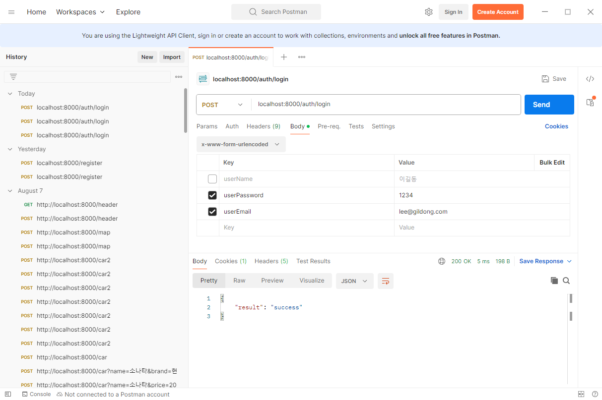
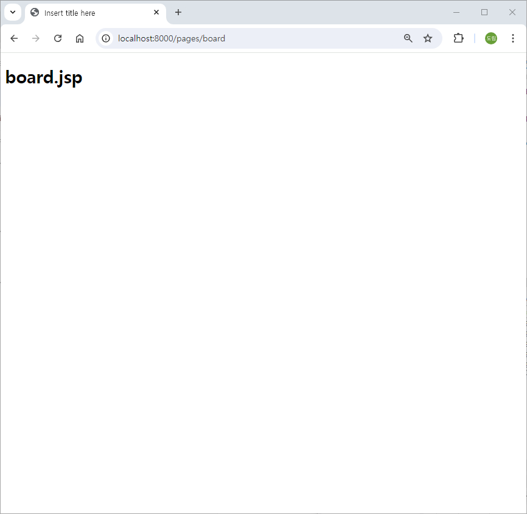
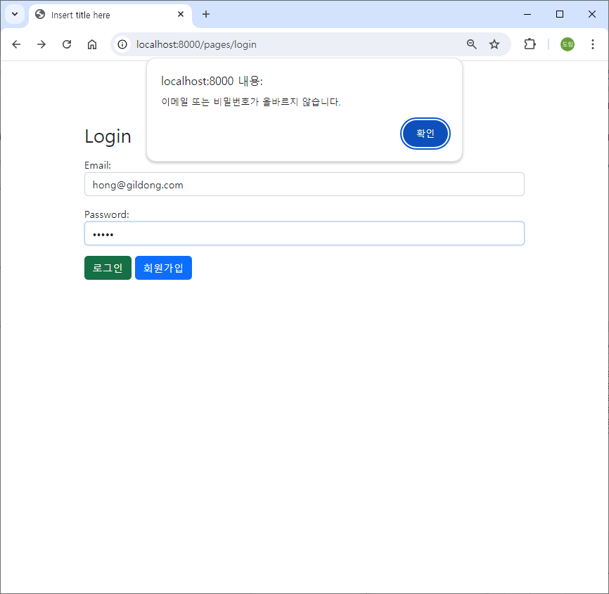
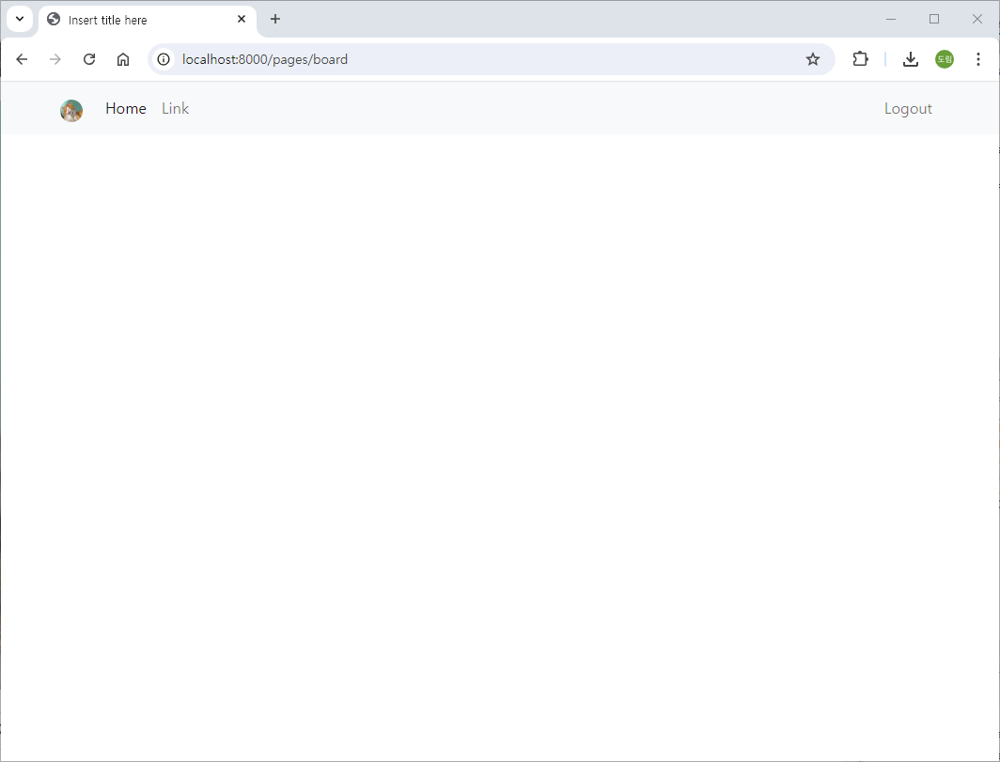
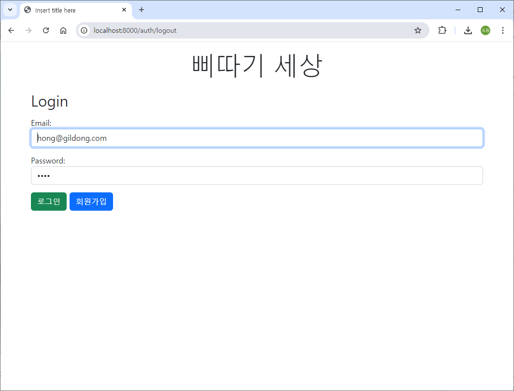
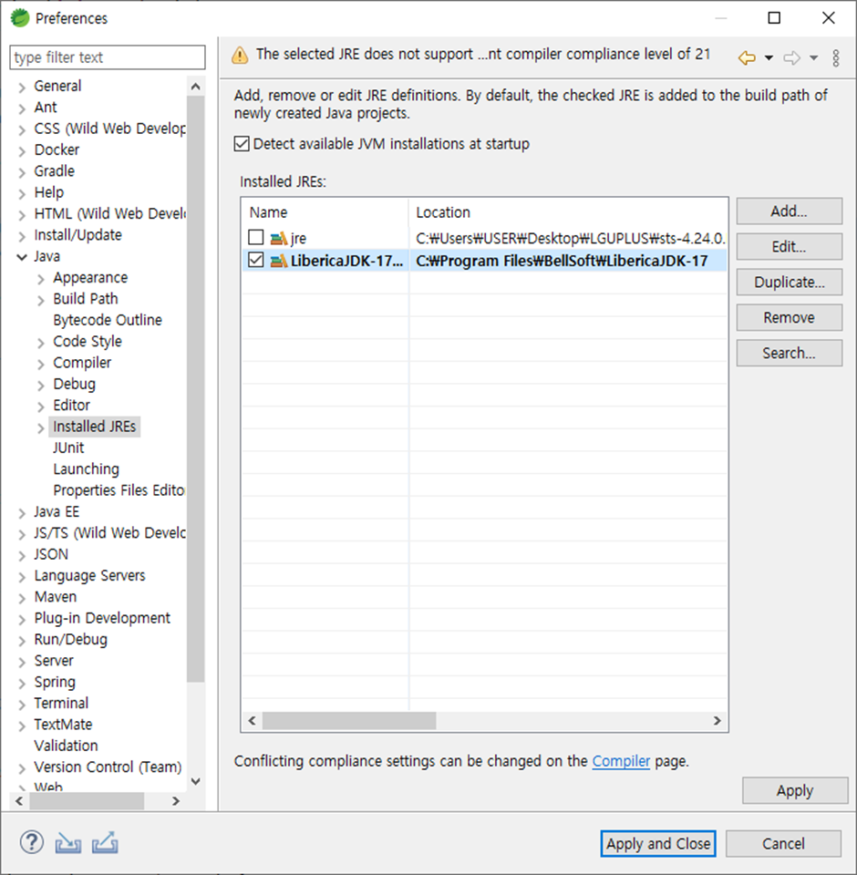
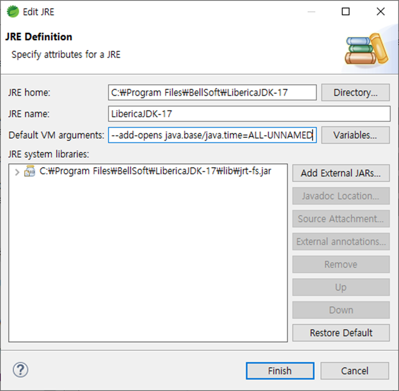
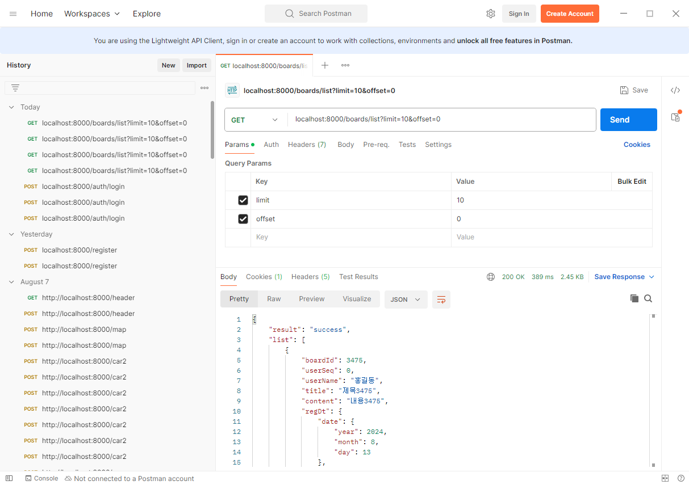
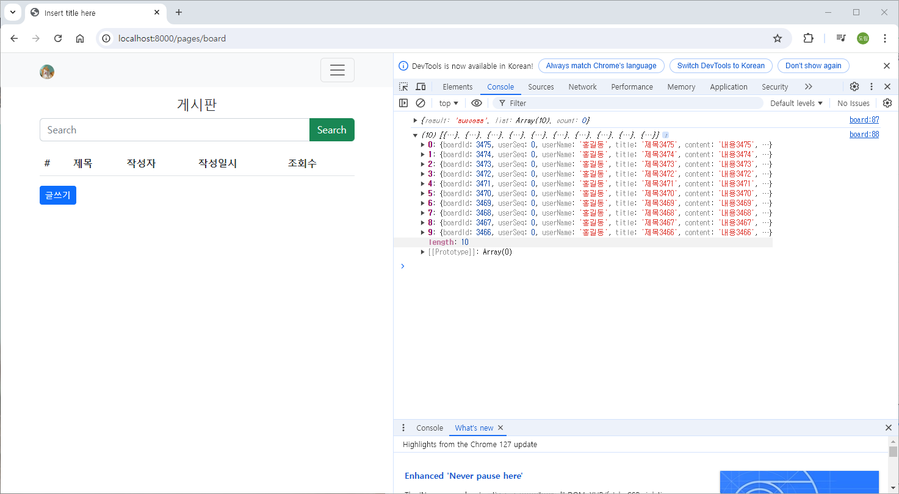

# [2024.08.13(화)] 로그인/게시판


# 게시판

- [2024.08.12(월)]에 만든 SpirngMVCDBAjaxMybatisBoard 사용

## 로그인

### src/main/resources

### config/mybatis-config.xml

```java
<?xml version="1.0" encoding="UTF-8" ?>
<!DOCTYPE configuration
    PUBLIC "-//mybatis.org//DTD Config 3.0//EN"
    "http://mybatis.org/dtd/mybatis-3-config.dtd">
<configuration> 

	<settings>
		<setting name="mapUnderscoreToCamelCase" value="true"/>
	</settings>

	<mappers>
		<mapper resource="mapper/auth-mapper.xml"/>
		<mapper resource="mapper/user-mapper.xml"/>
		<!-- <mapper resource="mapper/board-mapper.xml"/> -->
	</mappers> 

</configuration>
```

### mapper/auth-mapper.xml

```java
<?xml version="1.0" encoding="UTF-8" ?>
<!DOCTYPE mapper
    PUBLIC "-//mybatis.org//DTD Mapper 3.0//EN"
    "http://mybatis.org/dtd/mybatis-3-mapper.dtd">

<mapper namespace="com.mycom.myapp.auth.dao.LoginDao">
	
	<select id="Login" parameterType="string" resultType="com.mycom.myapp.user.dto.UserDto">
		select user_seq, user_name, user_password, user_email, user_profile_image, user_register_date 
		  from users
		 where user_email = #{userEmail}
	</select>
	
</mapper>
```

### src/main/java/com/mycom/myapp/auth

### dao/LoginDao.java

```java
package com.mycom.myapp.auth.dao;

import org.apache.ibatis.annotations.Mapper;

import com.mycom.myapp.user.dto.UserDto;

@Mapper
public interface LoginDao {
	UserDto Login(String userEmail);
}
```

### service/LoginService.java

```java
package com.mycom.myapp.auth.service;

import java.util.Optional;

import com.mycom.myapp.user.dto.UserDto;

public interface LoginService {
	// controller에서 userEmail, userpassword가 포함된 UserDto 객체를 전달받는다.
	// UserDto의 userEmail을 이용해서 LoginDao의 login() 호출
	// -> LoginDao의 login() 호출 결과가 null => userEmail 오류
	// -> LoginDao의 login() 호출 결과가 UserDto 객체 => userEmail 존재, 전달받은 userPassword와 dao로부터 받은 userPassword를 비교
	// LoginService를 호출한 Controller에서 Null check
	// Optional 적용 (value가 null이 될수도 있는 경우 적용) 일종의 Wrapper Class
	Optional<UserDto> login(UserDto userDto);
}
```

### service/LoginServiceImpl.java

```java
package com.mycom.myapp.auth.service;

import java.util.Optional;

import org.springframework.stereotype.Service;

import com.mycom.myapp.auth.dao.LoginDao;
import com.mycom.myapp.user.dto.UserDto;

@Service
public class LoginServiceImpl implements LoginService {

	// LoginDao ID
	private final LoginDao loginDao;
	
	public LoginServiceImpl(LoginDao loginDao) {
		this.loginDao = loginDao;
	}
	
	@Override
	public Optional<UserDto> login(UserDto dto) {  // Controller에서 받은 UserDto 객체에는 userEmail, userPassword가 포함

		UserDto userDto = loginDao.Login(dto.getUserEmail());  // loginDao의 처리 결과에 따라 null, 정상적인 userDto 객체
		if( userDto != null && dto.getUserPassword().equals(userDto.getUserPassword())) {  // 로그인 성공
			userDto.setUserPassword(null);  // password 삭제
			return Optional.of(userDto);  
		}
		
		return Optional.empty();
	}

}
```

### controller/LoginController.java

```java
package com.mycom.myapp.auth.controller;

import java.util.HashMap;
import java.util.Map;
import java.util.Optional;

import org.springframework.stereotype.Controller;
import org.springframework.web.bind.annotation.PostMapping;
import org.springframework.web.bind.annotation.RequestMapping;
import org.springframework.web.bind.annotation.ResponseBody;

import com.mycom.myapp.auth.service.LoginService;
import com.mycom.myapp.user.dto.UserDto;

import jakarta.servlet.http.HttpSession;

// login, logout 처리
@Controller
@RequestMapping("/auth")
public class LoginController {
	// LoginService DI
	private final LoginService loginService;
	
	public LoginController(LoginService loginService) {
		this.loginService = loginService;
	}
	
	@PostMapping("/login")
	@ResponseBody  // json으로 성공, 실패 전달 (ResultDto를 만들어서 처리 가능)
	public Map<String, String> login(UserDto dto, HttpSession session) {
		// request.getParameter("userEmail");
		// request.getParameter("userPassword);
		Map<String, String> map = new HashMap<>();
		Optional<UserDto> optional = loginService.login(dto);
		
		// #1 isPresent() + get()
		if(optional.isPresent()) {
			UserDto userDto = optional.get();
			session.setAttribute("userDto", userDto);
			
			map.put("result", "success");
			return map;
		}
		
		map.put("result", "fail");
		return map;
		
		// #2 ifPresentOrElse
//		optional.ifPresentOrElse(
//			userDto -> {
//				session.setAttribute("userDto", userDto);
//				map.put("result", "success");
//			},
//			() -> {
//				map.put("result", "fail");
//			});
//		return map;
		
	}
}
```

### 실행 결과



### Optional<T>

`Optional<T>`는 Java 8에서 도입된 클래스이며, 주로 **null** 값을 안전하게 처리하고 명시적으로 다루기 위해 사용됩니다. 이 클래스는 값이 존재할 수도 있고, 존재하지 않을 수도 있는 상황을 표현하는 컨테이너 역할을 합니다.

`Optional<UserDto> login(UserDto userDto);` 메서드 시그니처에서 사용된 `Optional`을 통해 메서드의 반환값이 있을 수도, 없을 수도 있음을 명확하게 표현할 수 있습니다.

### `Optional`의 주요 목적

1. **NullPointerException 방지**: `Optional`은 `null` 값을 직접 사용하지 않도록 하여 `NullPointerException`을 피하는 데 도움을 줍니다.
2. **명시적인 값의 존재 여부 표현**: 메서드의 반환 타입으로 `Optional`을 사용하면, 호출하는 쪽에서 반환 값이 있을 수도, 없을 수도 있음을 명확하게 알 수 있습니다.
3. **더 나은 코드 가독성**: 코드에서 `null` 확인을 위한 여러 조건문을 줄이고, 더 명확한 의도를 가진 메서드를 제공함으로써 코드의 가독성을 높입니다.

### `Optional`의 주요 메서드

- **`isPresent()`**: 값이 존재하는지 여부를 확인합니다. `true`를 반환하면 값이 존재함을 의미하고, `false`를 반환하면 값이 존재하지 않음을 의미합니다.
    
    ```java
    java코드 복사
    if (optionalUserDto.isPresent()) {
        // 값이 존재할 때
        UserDto user = optionalUserDto.get();
    }
    
    ```
    
- **`ifPresent(Consumer<? super T> action)`**: 값이 존재할 때만 특정 동작을 수행합니다. 존재하지 않으면 아무 일도 일어나지 않습니다.
    
    ```java
    java코드 복사
    optionalUserDto.ifPresent(user -> System.out.println("User is logged in: " + user));
    
    ```
    
- **`orElse(T other)`**: 값이 존재하면 해당 값을 반환하고, 존재하지 않으면 `other`를 반환합니다.
    
    ```java
    java코드 복사
    UserDto user = optionalUserDto.orElse(new UserDto("defaultUser"));
    
    ```
    
- **`orElseGet(Supplier<? extends T> other)`**: 값이 존재하면 해당 값을 반환하고, 존재하지 않으면 `Supplier`를 사용해 다른 값을 제공합니다.
    
    ```java
    java코드 복사
    UserDto user = optionalUserDto.orElseGet(() -> fetchDefaultUser());
    
    ```
    
- **`orElseThrow(Supplier<? extends X> exceptionSupplier)`**: 값이 존재하지 않으면 `Exception`을 발생시킵니다.
    
    ```java
    java코드 복사
    UserDto user = optionalUserDto.orElseThrow(() -> new RuntimeException("User not found"));
    
    ```
    

### `Optional`이 사용된 예시

```java
java코드 복사
public Optional<UserDto> login(UserDto userDto) {
    UserDto userFromDb = findUserInDatabase(userDto);

    if (userFromDb != null && userFromDb.getPassword().equals(userDto.getPassword())) {
        return Optional.of(userFromDb); // 값이 존재할 경우 Optional에 담아 반환
    } else {
        return Optional.empty(); // 값이 없을 경우 빈 Optional 반환
    }
}

```

이 코드를 통해, `login` 메서드가 호출된 후에는 `Optional<UserDto>`를 반환받게 됩니다. 반환값이 존재하는지 확인한 후에 안전하게 처리할 수 있으며, `null` 체크를 직접 하지 않아도 됩니다.

### 요약

- *`Optional`*을 사용하면 메서드의 반환 값이 `null`일 가능성을 명시적으로 처리할 수 있어, `NullPointerException` 발생 가능성을 줄이고 코드의 가독성을 높일 수 있습니다.
- `Optional<UserDto>`를 반환하는 `login` 메서드는 로그인 성공 시 `UserDto` 객체를 반환하고, 실패 시 `Optional.empty()`를 반환해 안전하게 처리할 수 있게 합니다.

### src/main/webapp/WEB-INF/jsp/login.jsp

```java
<%@ page language="java" contentType="text/html; charset=UTF-8"
    pageEncoding="UTF-8"%>
<!DOCTYPE html>
<html>
<head>
<meta charset="UTF-8">

<link href="https://cdn.jsdelivr.net/npm/bootstrap@5.2.3/dist/css/bootstrap.min.css" rel="stylesheet" integrity="sha384-rbsA2VBKQhggwzxH7pPCaAqO46MgnOM80zW1RWuH61DGLwZJEdK2Kadq2F9CUG65" crossorigin="anonymous">
<script src="https://cdn.jsdelivr.net/npm/bootstrap@5.2.3/dist/js/bootstrap.bundle.min.js" integrity="sha384-kenU1KFdBIe4zVF0s0G1M5b4hcpxyD9F7jL+jjXkk+Q2h455rYXK/7HAuoJl+0I4" crossorigin="anonymous"></script>

<script src="//cdn.jsdelivr.net/npm/alertifyjs@1.12.0/build/alertify.min.js"></script>
<link rel="stylesheet" href="//cdn.jsdelivr.net/npm/alertifyjs@1.12.0/build/css/alertify.min.css"/>
<link rel="stylesheet" href="//cdn.jsdelivr.net/npm/alertifyjs@1.12.0/build/css/themes/default.min.css"/>

<title>Insert title here</title>
</head>
<body>
	<div class="container">
	
		<div class="mb-3 mt-3 d-flex justify-content-center">
            <h1 class="display-4">삐따기 세상</h1>
        </div>
        <div class="mb-3">
            <h2>Login</h2>
        </div>
        
        <form novalidate> <!-- novalidate : 브라우저는 validate을 처리하지 않도록 한다. -->
            <div class="mb-3">
                <label for="userEmail">Email:</label>
                <input type="text" class="form-control" id="userEmail" placeholder="Enter email" name="userEmail" required value="hong@gildong.com">
            </div>
            <div class="mb-3">
                <label for="userPassword">Password:</label>
                <input type="password" class="form-control" id="userPassword" placeholder="Enter password" name="userPassword" required value="1234">
            </div>
        </form>
        
        <div>
            <button id="btnLogin" class="btn btn-success">로그인</button>
            <a href="/pages/user" class="btn btn-primary">회원가입</a>
        </div>
        
	</div>
	
<script>
window.onload = function(){
    
    document.querySelector("#userEmail").focus();
    
    //submit
    document.querySelector("#btnLogin").onclick = function(){
    	if( validate() ) {
	    	login();
    	}
    };
}

function validate() {
	// userEmail, userPassword가 empty가 아니면 valid
	if ( document.querySelector("#userEmail").value.length > 0 && document.querySelector("#userPassword").value.length > 0 ) return true;
    return false;
}

async function login() {
    var userEmail = document.querySelector("#userEmail").value;   
    var userPassword = document.querySelector("#userPassword").value; 
    
    let urlParams = new URLSearchParams({
        userEmail: userEmail,
        userPassword: userPassword,
    });
    
    let fetchOptions = {
        method: "POST",
        body: urlParams,
    }
    
    let response = await fetch("/auth/login", fetchOptions);
    let data = await response.json();
    
    if( data.result == "success" ){  // 게시판 페이지 이동
            window.location.href="/pages/board";
    }else if( data.result == "fail" ){
        alert("이메일 또는 비밀번호가 올바르지 않습니다.");
    }
}
</script>
	
</body>
</html>
```

### 실행 결과

- 로그인 성공
    
    
    
- 로그인 실패
    
    
    

## 게시판

### 게시판 - navbar, 프로필 추가

### src/main/webapp/WEB-INF/jsp/board.jsp

```java
<%@ page language="java" contentType="text/html; charset=UTF-8" pageEncoding="UTF-8"%>
<%@ page import="com.mycom.myapp.user.dto.UserDto" %>
<%
	UserDto userDto = (UserDto) session.getAttribute("userDto");
	System.out.println(userDto);
%>
<!DOCTYPE html>
<html>
<head>
<meta charset="UTF-8">

<link href="https://cdn.jsdelivr.net/npm/bootstrap@5.2.3/dist/css/bootstrap.min.css" rel="stylesheet" integrity="sha384-rbsA2VBKQhggwzxH7pPCaAqO46MgnOM80zW1RWuH61DGLwZJEdK2Kadq2F9CUG65" crossorigin="anonymous">
<script src="https://cdn.jsdelivr.net/npm/bootstrap@5.2.3/dist/js/bootstrap.bundle.min.js" integrity="sha384-kenU1KFdBIe4zVF0s0G1M5b4hcpxyD9F7jL+jjXkk+Q2h455rYXK/7HAuoJl+0I4" crossorigin="anonymous"></script>

<script src="//cdn.jsdelivr.net/npm/alertifyjs@1.12.0/build/alertify.min.js"></script>
<link rel="stylesheet" href="//cdn.jsdelivr.net/npm/alertifyjs@1.12.0/build/css/alertify.min.css"/>
<link rel="stylesheet" href="//cdn.jsdelivr.net/npm/alertifyjs@1.12.0/build/css/themes/default.min.css"/>

<title>Insert title here</title>
</head>
<body>

	<nav class="navbar navbar-expand-lg bg-light">
  <div class="container">
    <a class="navbar-brand" href="#">" style="width:24px; height: 24px; border-radius: 50%;"></a>
    <button class="navbar-toggler" type="button" data-bs-toggle="collapse" data-bs-target="#navbarSupportedContent" aria-controls="navbarSupportedContent" aria-expanded="false" aria-label="Toggle navigation">
      <span class="navbar-toggler-icon"></span>
    </button>
    <div class="collapse navbar-collapse" id="navbarSupportedContent">
      <ul class="navbar-nav me-auto">
        <li class="nav-item">
          <a class="nav-link active" aria-current="page" href="#">Home</a>
        </li>
        <li class="nav-item">
          <a class="nav-link" href="#">Link</a>
        </li>
      </ul>
      
      <ul class="navbar-nav">
        <li class="nav-item">
          <a class="nav-link" href="#">Logout</a>
        </li>
      </ul>
      
    </div>
  </div>
</nav>

</body>
</html>
```

### src/main/resources/static

- assets 폴더 생성 후 assets 아래에 css, img, jsp 폴더 생성

### src/main/resources/static/assets/img/user

[noProfile](./img/20240813/noProfile.png)

[cat](./img/20240813/cat.png)

### 실행 결과



### 게시판 - 로그아웃

### src/main/webapp/WEB-INF/jsp/board.jsp

```java
<%@ page language="java" contentType="text/html; charset=UTF-8" pageEncoding="UTF-8"%>
<%@ page import="com.mycom.myapp.user.dto.UserDto" %>
<%
	UserDto userDto = (UserDto) session.getAttribute("userDto");
	System.out.println(userDto);
%>
<!DOCTYPE html>
<html>
<head>
<meta charset="UTF-8">

<link href="https://cdn.jsdelivr.net/npm/bootstrap@5.2.3/dist/css/bootstrap.min.css" rel="stylesheet" integrity="sha384-rbsA2VBKQhggwzxH7pPCaAqO46MgnOM80zW1RWuH61DGLwZJEdK2Kadq2F9CUG65" crossorigin="anonymous">
<script src="https://cdn.jsdelivr.net/npm/bootstrap@5.2.3/dist/js/bootstrap.bundle.min.js" integrity="sha384-kenU1KFdBIe4zVF0s0G1M5b4hcpxyD9F7jL+jjXkk+Q2h455rYXK/7HAuoJl+0I4" crossorigin="anonymous"></script>

<script src="//cdn.jsdelivr.net/npm/alertifyjs@1.12.0/build/alertify.min.js"></script>
<link rel="stylesheet" href="//cdn.jsdelivr.net/npm/alertifyjs@1.12.0/build/css/alertify.min.css"/>
<link rel="stylesheet" href="//cdn.jsdelivr.net/npm/alertifyjs@1.12.0/build/css/themes/default.min.css"/>

<title>Insert title here</title>
</head>
<body>

	<nav class="navbar navbar-expand-lg bg-light">
  <div class="container">
    <a class="navbar-brand" href="#">" style="width:24px; height: 24px; border-radius: 50%;"></a>
    <button class="navbar-toggler" type="button" data-bs-toggle="collapse" data-bs-target="#navbarSupportedContent" aria-controls="navbarSupportedContent" aria-expanded="false" aria-label="Toggle navigation">
      <span class="navbar-toggler-icon"></span>
    </button>
    <div class="collapse navbar-collapse" id="navbarSupportedContent">
      <ul class="navbar-nav me-auto">
        <li class="nav-item">
          <a class="nav-link" href="/pages/board">게시판</a>
        </li>
        <li class="nav-item">
          <a class="nav-link" href="#">Link</a>
        </li>
      </ul>
      
      <ul class="navbar-nav">
        <li class="nav-item">
          <a class="nav-link" href="/auth/logout">Logout</a>
        </li>
      </ul>
      
    </div>
  </div>
</nav>

</body>
</html>
```

### src/main/java/com/mycom/myapp/auth/controller/LoginController.java

```java
package com.mycom.myapp.auth.controller;

import java.util.HashMap;
import java.util.Map;
import java.util.Optional;

import org.springframework.stereotype.Controller;
import org.springframework.web.bind.annotation.GetMapping;
import org.springframework.web.bind.annotation.PostMapping;
import org.springframework.web.bind.annotation.RequestMapping;
import org.springframework.web.bind.annotation.ResponseBody;

import com.mycom.myapp.auth.service.LoginService;
import com.mycom.myapp.user.dto.UserDto;

import jakarta.servlet.http.HttpSession;

// login, logout 처리
@Controller
@RequestMapping("/auth")
public class LoginController {
	// LoginService DI
	private final LoginService loginService;
	
	public LoginController(LoginService loginService) {
		this.loginService = loginService;
	}
	
	@PostMapping("/login")
	@ResponseBody  // json으로 성공, 실패 전달 (ResultDto를 만들어서 처리 가능)
	public Map<String, String> login(UserDto dto, HttpSession session) {
		// request.getParameter("userEmail");
		// request.getParameter("userPassword);
		Map<String, String> map = new HashMap<>();
		Optional<UserDto> optional = loginService.login(dto);
		
		// #1 isPresent() + get()
		if(optional.isPresent()) {
			UserDto userDto = optional.get();
			session.setAttribute("userDto", userDto);
			
			map.put("result", "success");
			return map;
		}
		
		map.put("result", "fail");
		return map;
		
		// #2 ifPresentOrElse
//		optional.ifPresentOrElse(
//			userDto -> {
//				session.setAttribute("userDto", userDto);
//				map.put("result", "success");
//			},
//			() -> {
//				map.put("result", "fail");
//			});
//		return map;
		
	}
	
	// logout
	@GetMapping("/logout")
	public String logout(HttpSession session) {
		session.invalidate();  // 현재까지 유지하던 현 사용자의 session 종료, 삭제
		return "login";
	}
}
```

### 실행 결과

- ‘logout’ 버튼 선택 시 로그인 페이지로 이동



### board 스키마에 board 테이블 추가

```java
create table board (
      board_id int not null auto_increment,
      user_seq int not null,
      title varchar(500) default null,
      content text,
      reg_dt datetime default null,
      read_count int default '0',
      primary key (board_id),
      key fk_user_idx (user_seq),
      constraint fk_user foreign key (user_seq) references users (user_seq)
    ) ;
```

[board_pagination_data.sql](./img/20240813/board_pagination_data.sql)

### 게시판 - 내용 조회

### src/main/webapp/WEB-INF/jsp/board.jsp

```java
<%@ page language="java" contentType="text/html; charset=UTF-8" pageEncoding="UTF-8"%>
<%@ page import="com.mycom.myapp.user.dto.UserDto" %>
<%
	UserDto userDto = (UserDto) session.getAttribute("userDto");
	System.out.println(userDto);
%>
<!DOCTYPE html>
<html>
<head>
<meta charset="UTF-8">

<link href="https://cdn.jsdelivr.net/npm/bootstrap@5.2.3/dist/css/bootstrap.min.css" rel="stylesheet" integrity="sha384-rbsA2VBKQhggwzxH7pPCaAqO46MgnOM80zW1RWuH61DGLwZJEdK2Kadq2F9CUG65" crossorigin="anonymous">
<script src="https://cdn.jsdelivr.net/npm/bootstrap@5.2.3/dist/js/bootstrap.bundle.min.js" integrity="sha384-kenU1KFdBIe4zVF0s0G1M5b4hcpxyD9F7jL+jjXkk+Q2h455rYXK/7HAuoJl+0I4" crossorigin="anonymous"></script>

<script src="//cdn.jsdelivr.net/npm/alertifyjs@1.12.0/build/alertify.min.js"></script>
<link rel="stylesheet" href="//cdn.jsdelivr.net/npm/alertifyjs@1.12.0/build/css/alertify.min.css"/>
<link rel="stylesheet" href="//cdn.jsdelivr.net/npm/alertifyjs@1.12.0/build/css/themes/default.min.css"/>

<title>Insert title here</title>
</head>
<body>

	<nav class="navbar navbar-expand-lg bg-light">
  <div class="container">
    <a class="navbar-brand" href="#">" style="width:24px; height: 24px; border-radius: 50%;"></a>
    <button class="navbar-toggler" type="button" data-bs-toggle="collapse" data-bs-target="#navbarSupportedContent" aria-controls="navbarSupportedContent" aria-expanded="false" aria-label="Toggle navigation">
      <span class="navbar-toggler-icon"></span>
    </button>
    <div class="collapse navbar-collapse" id="navbarSupportedContent">
      <ul class="navbar-nav me-auto">
        <li class="nav-item">
          <a class="nav-link" href="/pages/board">게시판</a>
        </li>
        <li class="nav-item">
          <a class="nav-link" href="#">Link</a>
        </li>
      </ul>
      
      <ul class="navbar-nav">
        <li class="nav-item">
          <a class="nav-link" href="/auth/logout">Logout</a>
        </li>
      </ul>
      
    </div>
  </div>
</nav>

<div class="container mt-3">
  <h4 class="text-center">게시판</h4>       
  
    <div class="input-group mb-3">
      <input id="inputSearchWord" type="text" class="form-control" placeholder="Search">
      <button id="btnSearchWord" class="btn btn-success" type="button">Search</button>
    </div>
    <table class="table table-hover">
        <thead>
            <tr>
                <th>#</th>
                <th>제목</th>
                <th>작성자</th>
                <th>작성일시</th>
                <th>조회수</th>
            </tr>
        </thead>
        <tbody id="boardTbody">
        </tbody>
    </table>
   
    <div id="paginationWrapper"></div>
    <button class="btn btn-sm btn-primary" id="btnInsertPage">글쓰기</button>
</div>

</body>
</html>
```

### src/main/resources/config/mybatis-config.xml

```java
<?xml version="1.0" encoding="UTF-8" ?>
<!DOCTYPE configuration
    PUBLIC "-//mybatis.org//DTD Config 3.0//EN"
    "http://mybatis.org/dtd/mybatis-3-config.dtd">
<configuration> 

	<settings>
		<setting name="mapUnderscoreToCamelCase" value="true"/>
	</settings>

	<mappers>
		<mapper resource="mapper/auth-mapper.xml"/>
		<mapper resource="mapper/user-mapper.xml"/>
		<mapper resource="mapper/board-mapper.xml"/>
	</mappers> 

</configuration>
```

### src/main/resources/mapper/board-mapper.xml

```java
<?xml version="1.0" encoding="UTF-8" ?>
<!DOCTYPE mapper
    PUBLIC "-//mybatis.org//DTD Mapper 3.0//EN"
    "http://mybatis.org/dtd/mybatis-3-mapper.dtd">
<mapper namespace="com.mycom.myapp.board.dao.BoardDao">
	
	<!-- parameterType에 map 대신 com.mycom.myapp.board.dto.BoardParamDto를 사용해도 된다. -->
	<select id="listBoard" parameterType="map" resultType="com.mycom.myapp.board.dto.BoardDto">
		select b.board_id, u.user_name, b.title, b.content, b.reg_dt, b.read_count
		  from board b, users u
		 where b.user_seq = u.user_seq
		 order by b.board_id desc
		 limit #{limit} offset #{offset}
	</select>
	
</mapper>    
```

### src/main/java/com/mycom/myapp/board

### dto

### BoardDto.java

```java
package com.mycom.myapp.board.dto;

import java.time.LocalDateTime;
import java.time.ZoneId;
import java.util.Date;

public class BoardDto {
	
	private int boardId;
    private int userSeq;
    private String userName;
    private String userProfileImage;
    private String title;
    private String content;
    private LocalDateTime regDt;  // java8 java.util.Date 대체, json 처리 용이
    private int readCount;
    private boolean sameUser;  // 게시글 상세 (게시글 작성자와 현재 로그인사용자가 동일인 여부)
    
    public BoardDto() {};
    public BoardDto(int userSeq, String title, String content) {  // 글 쓰기에서 사용자 seq, 제목, 내용만 등록
        this.userSeq = userSeq;
        this.title = title;
        this.content = content;
    }
    
    public int getBoardId() {
        return boardId;
    }
    public void setBoardId(int boardId) {
        this.boardId = boardId;
    }
    public int getUserSeq() {
        return userSeq;
    }
    public void setUserSeq(int userSeq) {
        this.userSeq = userSeq;
    }
    
    public String getUserName() {
        return userName;
    }
    public void setUserName(String userName) {
        this.userName = userName;
    }
    public String getUserProfileImage() {
		return userProfileImage;
	}
	public void setUserProfileImage(String userProfileImage) {
		this.userProfileImage = userProfileImage;
	}
	public String getTitle() {
        return title;
    }
    public void setTitle(String title) {
        this.title = title;
    }
    public String getContent() {
        return content;
    }
    public void setContent(String content) {
        this.content = content;
    }
    public LocalDateTime getRegDt() {
        return regDt;
    }
    public void setRegDt(Date regDt) {
        this.regDt = LocalDateTime.ofInstant(
                regDt.toInstant(), ZoneId.systemDefault()
        );  // for Mybatis Date Mapping
    }
    public int getReadCount() {
        return readCount;
    }
    public void setReadCount(int readCount) {
        this.readCount = readCount;
    }
    public boolean isSameUser() {
        return sameUser;
    }
    public void setSameUser(boolean sameUser) {
        this.sameUser = sameUser;
    }
    
    @Override
    public String toString() {
        return "BoardDto [boardId=" + boardId + ", userSeq=" + userSeq + ", userName=" + userName
                + ", userProfileImage=" + userProfileImage + ", title=" + title + ", content=" + content
                + ", regDt=" + regDt + ", readCount=" + readCount + ", sameUser=" + sameUser 
                + "]";
    }
	
}
```

### BoardParamDto.java

```java
package com.mycom.myapp.board.dto;

public class BoardParamDto {
	// 목록
	private int limit;
	private int offset;
	private String searchWord;
	
	// 상세
	private int boardId;
	private int userSeq;  // 현재 사용자 userSeq
	
	// 등록, 수정은 BoardParamDto 대신 BoardDto를 이용한다.
	
	public int getLimit() {
		return limit;
	}
	public void setLimit(int limit) {
		this.limit = limit;
	}
	public int getOffset() {
		return offset;
	}
	public void setOffset(int offset) {
		this.offset = offset;
	}
	public String getSearchWord() {
		return searchWord;
	}
	public void setSearchWord(String searchWord) {
		this.searchWord = searchWord;
	}
	public int getBoardId() {
		return boardId;
	}
	public void setBoardId(int boardId) {
		this.boardId = boardId;
	}
	public int getUserSeq() {
		return userSeq;
	}
	public void setUserSeq(int userSeq) {
		this.userSeq = userSeq;
	}
	
	@Override
	public String toString() {
		return "BoardParamDto [limit=" + limit + ", offset=" + offset + ", searchWord=" + searchWord + ", boardId="
				+ boardId + ", userSeq=" + userSeq + "]";
	}
	
}

```

### BoardResultDto.java

```java
package com.mycom.myapp.board.dto;

import java.util.List;

public class BoardResultDto {
	// 요청 결과
	private String result;
	// 목록
	private List<BoardDto> list;
	// 상세
	private BoardDto dto;
	// 글 전체 수
	private int count;
	
	public String getResult() {
		return result;
	}
	public void setResult(String result) {
		this.result = result;
	}
	public List<BoardDto> getList() {
		return list;
	}
	public void setList(List<BoardDto> list) {
		this.list = list;
	}
	public BoardDto getDto() {
		return dto;
	}
	public void setDto(BoardDto dto) {
		this.dto = dto;
	}
	public int getCount() {
		return count;
	}
	public void setCount(int count) {
		this.count = count;
	}
	
}
```

### dao/BoardDao.java

```java
package com.mycom.myapp.board.dao;

import java.util.List;

import org.apache.ibatis.annotations.Mapper;

import com.mycom.myapp.board.dto.BoardDto;
import com.mycom.myapp.board.dto.BoardParamDto;

@Mapper
public interface BoardDao {
	List<BoardDto> listBoard(BoardParamDto boardParamDto);  // limit, offset
}

```

### service

### BoardService.java

```java
package com.mycom.myapp.board.service;

import com.mycom.myapp.board.dto.BoardParamDto;
import com.mycom.myapp.board.dto.BoardResultDto;

public interface BoardService {
	BoardResultDto listBoard(BoardParamDto boardParamDto);  // limit, offset
}
```

### BoardServiceImpl.java

```java
package com.mycom.myapp.board.service;

import java.util.List;

import org.springframework.stereotype.Service;

import com.mycom.myapp.board.dao.BoardDao;
import com.mycom.myapp.board.dto.BoardDto;
import com.mycom.myapp.board.dto.BoardParamDto;
import com.mycom.myapp.board.dto.BoardResultDto;

// 서비스 layer는 복잡한 Business Logic을 처리하는 영역, 사용자 정의 오류
// 예외 처리?? 다양한 예외 처리 (사용자 정의 포함)를 통해서 보다 구체적인 처리가 가능
@Service
public class BoardServiceImpl implements BoardService {

	// BoardDao DI
	private final BoardDao boardDao;
	
	public BoardServiceImpl(BoardDao boardDao) {
		this.boardDao = boardDao;
	}
	
	@Override
	public BoardResultDto listBoard(BoardParamDto boardParamDto) {
		BoardResultDto boardResultDto = new BoardResultDto();
		try {
			List<BoardDto> list = boardDao.listBoard(boardParamDto);
			boardResultDto.setList(list);
			boardResultDto.setResult("success");
		} catch(Exception e) {
			e.printStackTrace();
			boardResultDto.setResult("fail");
		}
		return boardResultDto;
	}

}
```

### controller/BoardController.java

```java
package com.mycom.myapp.board.controller;

import org.springframework.stereotype.Controller;
import org.springframework.web.bind.annotation.GetMapping;
import org.springframework.web.bind.annotation.RequestMapping;
import org.springframework.web.bind.annotation.ResponseBody;

import com.mycom.myapp.board.dto.BoardParamDto;
import com.mycom.myapp.board.dto.BoardResultDto;
import com.mycom.myapp.board.service.BoardService;

@Controller
@RequestMapping("/boards")
public class BoardController {
	
	// BoardService DI
	private final BoardService boardService;
	
	public BoardController(BoardService boardService) {
		this.boardService = boardService;
	}
	
	@GetMapping("/list")  // limit, offset parameter를 포함하는 요청
	@ResponseBody
	private BoardResultDto listBoard(BoardParamDto boardParamDto) {
		return boardService.listBoard(boardParamDto);
	}

}
```

### LocalDateTime 오류 해결 방안

- [Window] → [preferences] → [Java] → [Installed JREs] → [LibericaJDK-17] 선택하여 [Edit…] 선택
    
    
    
- [Default VM arguments]에 ‘--add-opens java.base/java.time=ALL-UNNAMED’ 추가 → [Finish]
    
    
    

### postman 실행 테스트

- 로그인이 되어 있어야 게시판 조회가 가능하므로 임시로 주석 처리

### src/main/java/com/mycom/myapp/common/LoginInterceptor.java

```java
package com.mycom.myapp.common;

import org.springframework.stereotype.Component;
import org.springframework.web.servlet.HandlerInterceptor;

import com.mycom.myapp.user.dto.UserDto;

import jakarta.servlet.http.HttpServletRequest;
import jakarta.servlet.http.HttpServletResponse;
import jakarta.servlet.http.HttpSession;

@Component  
public class LoginInterceptor implements HandlerInterceptor {

	@Override
	public boolean preHandle(HttpServletRequest request, HttpServletResponse response, Object handler) throws Exception {
		System.out.println("LoginInterceptor >>> " + request.getRequestURI());
		
		HttpSession session = request.getSession();
		UserDto userDto = (UserDto) session.getAttribute("userDto");
		
//		if( userDto == null ) { // not logged in
//			System.out.println("LoginInterceptor >>> login.jsp");
//			response.sendRedirect("/pages/login");
//		}
		
		return true;  // 이어서 계속 진행, false : 더이상 진행 X
	}

}
```



### src/main/webapp/WEB-INF/jsp/board.jsp

```java
<%@ page language="java" contentType="text/html; charset=UTF-8" pageEncoding="UTF-8"%>
<%@ page import="com.mycom.myapp.user.dto.UserDto" %>
<%
	UserDto userDto = (UserDto) session.getAttribute("userDto");
	System.out.println(userDto);
%>
<!DOCTYPE html>
<html>
<head>
<meta charset="UTF-8">

<link href="https://cdn.jsdelivr.net/npm/bootstrap@5.2.3/dist/css/bootstrap.min.css" rel="stylesheet" integrity="sha384-rbsA2VBKQhggwzxH7pPCaAqO46MgnOM80zW1RWuH61DGLwZJEdK2Kadq2F9CUG65" crossorigin="anonymous">
<script src="https://cdn.jsdelivr.net/npm/bootstrap@5.2.3/dist/js/bootstrap.bundle.min.js" integrity="sha384-kenU1KFdBIe4zVF0s0G1M5b4hcpxyD9F7jL+jjXkk+Q2h455rYXK/7HAuoJl+0I4" crossorigin="anonymous"></script>

<script src="//cdn.jsdelivr.net/npm/alertifyjs@1.12.0/build/alertify.min.js"></script>
<link rel="stylesheet" href="//cdn.jsdelivr.net/npm/alertifyjs@1.12.0/build/css/alertify.min.css"/>
<link rel="stylesheet" href="//cdn.jsdelivr.net/npm/alertifyjs@1.12.0/build/css/themes/default.min.css"/>

<title>Insert title here</title>
</head>
<body>

	<nav class="navbar navbar-expand-lg bg-light">
  <div class="container">
    <a class="navbar-brand" href="#">" style="width:24px; height: 24px; border-radius: 50%;"></a>
    <button class="navbar-toggler" type="button" data-bs-toggle="collapse" data-bs-target="#navbarSupportedContent" aria-controls="navbarSupportedContent" aria-expanded="false" aria-label="Toggle navigation">
      <span class="navbar-toggler-icon"></span>
    </button>
    <div class="collapse navbar-collapse" id="navbarSupportedContent">
      <ul class="navbar-nav me-auto">
        <li class="nav-item">
          <a class="nav-link" href="/pages/board">게시판</a>
        </li>
        <li class="nav-item">
          <a class="nav-link" href="#">Link</a>
        </li>
      </ul>
      
      <ul class="navbar-nav">
        <li class="nav-item">
          <a class="nav-link" href="/auth/logout">Logout</a>
        </li>
      </ul>
      
    </div>
  </div>
</nav>

<div class="container mt-3">
  <h4 class="text-center">게시판</h4>       
  
    <div class="input-group mb-3">
      <input id="inputSearchWord" type="text" class="form-control" placeholder="Search">
      <button id="btnSearchWord" class="btn btn-success" type="button">Search</button>
    </div>
    <table class="table table-hover">
        <thead>
            <tr>
                <th>#</th>
                <th>제목</th>
                <th>작성자</th>
                <th>작성일시</th>
                <th>조회수</th>
            </tr>
        </thead>
        <tbody id="boardTbody">
        </tbody>
    </table>
   
    <div id="paginationWrapper"></div>
    <button class="btn btn-sm btn-primary" id="btnInsertPage">글쓰기</button>
</div>

<script>
    let LIST_ROW_COUNT = 10;
    let OFFSET = 0;
    
    window.onload = function(){
        
        listBoard();
        
    }
    async function listBoard() {
        let url = "/boards/list"
        let urlParams = "?limit=" + LIST_ROW_COUNT + "&offset" + OFFSET
        let response = await fetch(url + urlParams);
        let data = await response.json();
        
        if( data.result == "success" ){ // 게시판 페이지 이동
            console.log(data);
            console.log(data.list);
        }else if( data.result == "fail" ){
            alert("글 조회과정에서 오류가 발생했습니다.");
        }
    }
</script>

</body>
</html>
```

### 실행 결과



### src/main/java/com/mycom/myapp/common/LoginInterceptor.java

```java
package com.mycom.myapp.common;

import org.springframework.stereotype.Component;
import org.springframework.web.servlet.HandlerInterceptor;

import com.mycom.myapp.user.dto.UserDto;

import jakarta.servlet.http.HttpServletRequest;
import jakarta.servlet.http.HttpServletResponse;
import jakarta.servlet.http.HttpSession;

@Component  
public class LoginInterceptor implements HandlerInterceptor {

	@Override
	public boolean preHandle(HttpServletRequest request, HttpServletResponse response, Object handler) throws Exception {
		System.out.println("LoginInterceptor >>> " + request.getRequestURI());
		
		HttpSession session = request.getSession();
		UserDto userDto = (UserDto) session.getAttribute("userDto");
		
		if( userDto == null ) { // not logged in
			System.out.println("LoginInterceptor >>> login.jsp");
			response.sendRedirect("/pages/login");
			return false;
		}
		
		return true;  // 이어서 계속 진행, false : 더이상 진행 X
	}
		
}
```