# [2024.08.14(수)] 게시판 목록/상세/등록/수정/삭제/검색어/Pagination


# 게시판

## 게시판 로그아웃 후 브라우저 뒤로가기 시 게시판이 로그인 되어 있는 문제 해결방법

- 페이지별로 사용하지 않고 해당 코드를 인터셉터에 등록하며 사용할 수 있다.
    
    ```java
    <%
    	// Back Forward Cache (BFCache)
    	response.setHeader("Cache-Control", "no-cache, no-store, must-revalidate");
    %>
    ```
    

### src/main/webapp/WEB-INF/jsp/board.jsp

```java
<%@ page language="java" contentType="text/html; charset=UTF-8" pageEncoding="UTF-8"%>
<%@ page import="com.mycom.myapp.user.dto.UserDto" %>
<%
	// Back Forward Cache (BFCache)
	response.setHeader("Cache-Control", "no-cache, no-store, must-revalidate");
%>
<%
	UserDto userDto = (UserDto) session.getAttribute("userDto");
	System.out.println(userDto);
%>
<!DOCTYPE html>
<html>
<head>
<meta charset="UTF-8">

<link href="https://cdn.jsdelivr.net/npm/bootstrap@5.2.3/dist/css/bootstrap.min.css" rel="stylesheet" integrity="sha384-rbsA2VBKQhggwzxH7pPCaAqO46MgnOM80zW1RWuH61DGLwZJEdK2Kadq2F9CUG65" crossorigin="anonymous">
<script src="https://cdn.jsdelivr.net/npm/bootstrap@5.2.3/dist/js/bootstrap.bundle.min.js" integrity="sha384-kenU1KFdBIe4zVF0s0G1M5b4hcpxyD9F7jL+jjXkk+Q2h455rYXK/7HAuoJl+0I4" crossorigin="anonymous"></script>

<script src="//cdn.jsdelivr.net/npm/alertifyjs@1.12.0/build/alertify.min.js"></script>
<link rel="stylesheet" href="//cdn.jsdelivr.net/npm/alertifyjs@1.12.0/build/css/alertify.min.css"/>
<link rel="stylesheet" href="//cdn.jsdelivr.net/npm/alertifyjs@1.12.0/build/css/themes/default.min.css"/>

<title>Insert title here</title>
</head>
<body>

	<nav class="navbar navbar-expand-lg bg-light">
  <div class="container">
    <a class="navbar-brand" href="#">" style="width:24px; height: 24px; border-radius: 50%;"></a>
    <button class="navbar-toggler" type="button" data-bs-toggle="collapse" data-bs-target="#navbarSupportedContent" aria-controls="navbarSupportedContent" aria-expanded="false" aria-label="Toggle navigation">
      <span class="navbar-toggler-icon"></span>
    </button>
    <div class="collapse navbar-collapse" id="navbarSupportedContent">
      <ul class="navbar-nav me-auto">
        <li class="nav-item">
          <a class="nav-link" href="/pages/board">게시판</a>
        </li>
        <li class="nav-item">
          <a class="nav-link" href="#">Link</a>
        </li>
      </ul>
      
      <ul class="navbar-nav">
        <li class="nav-item">
          <a class="nav-link" href="/auth/logout">Logout</a>
        </li>
      </ul>
      
    </div>
  </div>
</nav>

<div class="container mt-3">
  <h4 class="text-center">게시판</h4>       
  
    <div class="input-group mb-3">
      <input id="inputSearchWord" type="text" class="form-control" placeholder="Search">
      <button id="btnSearchWord" class="btn btn-success" type="button">Search</button>
    </div>
    <table class="table table-hover">
        <thead>
            <tr>
                <th>#</th>
                <th>제목</th>
                <th>작성자</th>
                <th>작성일시</th>
                <th>조회수</th>
            </tr>
        </thead>
        <tbody id="boardTbody">
        </tbody>
    </table>
   
    <div id="paginationWrapper"></div>
    <button class="btn btn-sm btn-primary" id="btnInsertPage">글쓰기</button>
</div>

<script>
    let LIST_ROW_COUNT = 10;
    let OFFSET = 0;
    
    window.onload = function(){
        
        listBoard();
        
    }
    async function listBoard() {
        let url = "/boards/list"
        let urlParams = "?limit=" + LIST_ROW_COUNT + "&offset" + OFFSET
        let response = await fetch(url + urlParams);
        let data = await response.json();
        
        if( data.result == "success" ){ // 게시판 페이지 이동
            console.log(data);
            console.log(data.list);
        }else if( data.result == "fail" ){
            alert("글 조회과정에서 오류가 발생했습니다.");
        }
    }
</script>

</body>
</html>
```

### 실행 결과

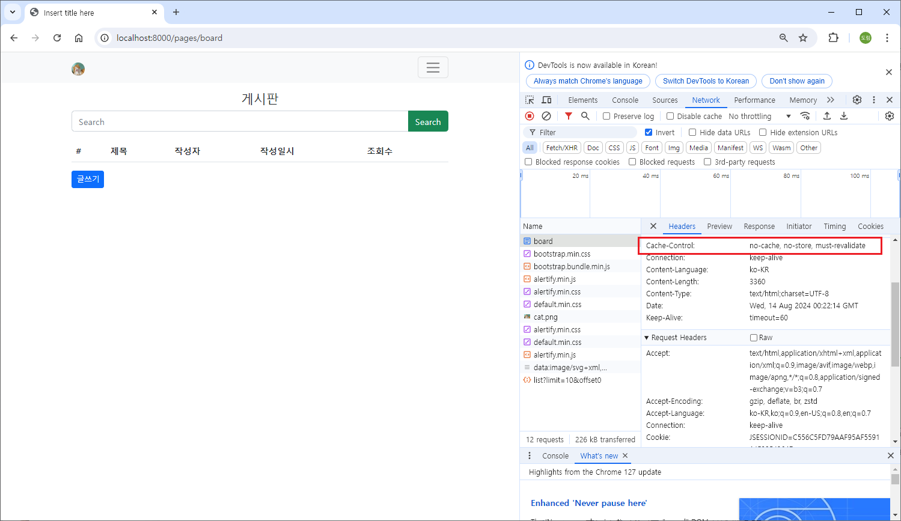

## 게시판 목록 보여주기

### src/main/resources/static/assets/js/util.js

```java
function makePaginationHtml(listRowCount, pageLinkCount, currentPageIndex, totalListItemCount, htmlTargetId){
    
    var targetUI = document.querySelector("#" + htmlTargetId);
    
    var pageCount = Math.ceil(totalListItemCount/listRowCount);
    var startPageIndex = 0;
    if( (currentPageIndex % pageLinkCount) == 0 ){ //10, 20...맨마지막
        startPageIndex = ((currentPageIndex / pageLinkCount)-1)*pageLinkCount + 1
    }else{
        startPageIndex = Math.floor(currentPageIndex / pageLinkCount)*pageLinkCount + 1
    }
    
    var endPageIndex = 0;
    if( (currentPageIndex % pageLinkCount) == 0 ){ //10, 20...맨마지막
        endPageIndex = ((currentPageIndex / pageLinkCount)-1)*pageLinkCount + pageLinkCount
    }else{
        endPageIndex = Math.floor(currentPageIndex / pageLinkCount)*pageLinkCount + pageLinkCount;
    }
    var prev;
    if( currentPageIndex <= pageLinkCount ){
        prev = false;
    }else{
        prev = true;
    }
    var next;
    if(endPageIndex > pageCount){
        endPageIndex = pageCount
        next = false;
    }else{
        next = true;
    }
    
    var paginationHtml =
        `<ul class="pagination pagination justify-content-center">`;
    if(prev){
        paginationHtml += 
            `<li class="page-item">
             <a class="page-link" href="javascript:movePage( ${(startPageIndex - 1)} )" aria-label="Previous">
             <span aria-hidden="true">&laquo;</span>
             </a>
             </li>`;
    }
    
    for(var i=startPageIndex; i<=endPageIndex; i++){
//      console.log('*** ' + i);
//      console.log(currentPageIndex);
        
        if( i == currentPageIndex ){
            paginationHtml += 
                `<li class="page-item active"><a class="page-link" href="javascript:movePage(${i})">${i}</a></li>`;           
        }else{
            paginationHtml += 
                `<li class="page-item"><a class="page-link" href="javascript:movePage(${i})">${i}</a></li>`;                  
        }
    }
    
    if(next){
        paginationHtml += 
            `<li class="page-item">
             <a class="page-link" href="javascript:movePage( ${(endPageIndex + 1)} )" aria-label="Next">
             <span aria-hidden="true">&raquo;</span>
             </a>
             </li>`;
    }
    paginationHtml += `</ul>`;
    
    targetUI.innerHTML = paginationHtml;
    
}

function makeDateStr(year, month, day, type) {
	return year + '.' + ((month < 10) ? '0' + month : month) + '.' + ((day < 10) ? '0' + day : day);
}

function makeTimeStr(hour, minute, second, type) {
	return hour + ':' + ((minute < 10) ? '0' + minute : minute) + ':' + ((second < 10) ? '0' + second : second);
}
```

### src/main/webapp/WEB-INF/jsp/board.jsp

```java
<%@ page language="java" contentType="text/html; charset=UTF-8" pageEncoding="UTF-8"%>
<%@ page import="com.mycom.myapp.user.dto.UserDto" %>
<%
	// Back Forward Cache (BFCache)
	response.setHeader("Cache-Control", "no-cache, no-store, must-revalidate");
%>
<%
	UserDto userDto = (UserDto) session.getAttribute("userDto");
	System.out.println(userDto);
%>
<!DOCTYPE html>
<html>
<head>
<meta charset="UTF-8">

<link href="https://cdn.jsdelivr.net/npm/bootstrap@5.2.3/dist/css/bootstrap.min.css" rel="stylesheet" integrity="sha384-rbsA2VBKQhggwzxH7pPCaAqO46MgnOM80zW1RWuH61DGLwZJEdK2Kadq2F9CUG65" crossorigin="anonymous">
<script src="https://cdn.jsdelivr.net/npm/bootstrap@5.2.3/dist/js/bootstrap.bundle.min.js" integrity="sha384-kenU1KFdBIe4zVF0s0G1M5b4hcpxyD9F7jL+jjXkk+Q2h455rYXK/7HAuoJl+0I4" crossorigin="anonymous"></script>

<script src="//cdn.jsdelivr.net/npm/alertifyjs@1.12.0/build/alertify.min.js"></script>
<link rel="stylesheet" href="//cdn.jsdelivr.net/npm/alertifyjs@1.12.0/build/css/alertify.min.css"/>
<link rel="stylesheet" href="//cdn.jsdelivr.net/npm/alertifyjs@1.12.0/build/css/themes/default.min.css"/>

<title>Insert title here</title>
</head>
<body>

	<nav class="navbar navbar-expand-lg bg-light">
  <div class="container">
    <a class="navbar-brand" href="#">" style="width:24px; height: 24px; border-radius: 50%;"></a>
    <button class="navbar-toggler" type="button" data-bs-toggle="collapse" data-bs-target="#navbarSupportedContent" aria-controls="navbarSupportedContent" aria-expanded="false" aria-label="Toggle navigation">
      <span class="navbar-toggler-icon"></span>
    </button>
    <div class="collapse navbar-collapse" id="navbarSupportedContent">
      <ul class="navbar-nav me-auto">
        <li class="nav-item">
          <a class="nav-link" href="/pages/board">게시판</a>
        </li>
        <li class="nav-item">
          <a class="nav-link" href="#">Link</a>
        </li>
      </ul>
      
      <ul class="navbar-nav">
        <li class="nav-item">
          <a class="nav-link" href="/auth/logout">Logout</a>
        </li>
      </ul>
      
    </div>
  </div>
</nav>

<div class="container mt-3">
  <h4 class="text-center">게시판</h4>       
  
    <div class="input-group mb-3">
      <input id="inputSearchWord" type="text" class="form-control" placeholder="Search">
      <button id="btnSearchWord" class="btn btn-success" type="button">Search</button>
    </div>
    <table class="table table-hover">
        <thead>
            <tr>
                <th>#</th>
                <th>제목</th>
                <th>작성자</th>
                <th>작성일시</th>
                <th>조회수</th>
            </tr>
        </thead>
        <tbody id="boardTbody">
        </tbody>
    </table>
   
    <div id="paginationWrapper"></div>
    <button class="btn btn-sm btn-primary" id="btnInsertPage">글쓰기</button>
</div>

<script src="/assets/js/util.js"></script>
<script>
    let LIST_ROW_COUNT = 10;
    let OFFSET = 0;
    
    window.onload = function(){
        
        listBoard();
        
    }
    async function listBoard() {
        let url = "/boards/list"
        let urlParams = "?limit=" + LIST_ROW_COUNT + "&offset" + OFFSET
        let response = await fetch(url + urlParams);
        let data = await response.json();
        
        if( data.result == "success" ){ // 게시판 페이지 이동
            //console.log(data);
            //console.log(data.list);
        	makeListHtml(data.list);
        }else if( data.result == "fail" ){
            alert("글 조회과정에서 오류가 발생했습니다.");
        }
    }
    
    function makeListHtml(list) {
    	
    	let listHTML = ``;
        
        list.forEach( el => {
            let boardId = el.boardId;
            let userName = el.userName;
            let title = el.title;
            let content = el.content;
            let regDt = el.regDt;
            // LocalDateTime 객체 -> json 처리 결과물이 gon, jackson 2가지가 다르다.
            console.log(regDt);
            let regDtStr = makeDateStr(regDt.date.year, regDt.date.month, regDt.date.day, '.'); 
            let readCount = el.readCount;
            
            listHTML += `<tr style="cursor:pointer" data-boardId=\${boardId}><td>\${boardId}</td><td>\${title}</td><td>\${userName}</td><td>\${regDtStr}</td><td>\${readCount}</td></tr>`;
        });
        
        document.querySelector("#boardTbody").innerHTML = listHTML;
        
        document.querySelectorAll("#boardTbody tr").forEach( el => {
        	el.onclick = function() {  // 이때 this는 el이다. // 애로우 function에서는 this를 사용할 수 없다. e를 매개변수로 받아 e.target.getAttribute으로 사용해야 한다.
        		let boardId = this.getAttribute("data-boardId");
        		alert(boardId);
        	}
        });
    	
    }
</script>

</body>
</html>
```

## 게시글 상세 보여주기

https://getbootstrap.com/docs/5.2/components/modal/

### src/main/java/com/mycom/myapp/board/dao/BoardDao.java

```java
package com.mycom.myapp.board.dao;

import java.util.List;

import org.apache.ibatis.annotations.Mapper;

import com.mycom.myapp.board.dto.BoardDto;
import com.mycom.myapp.board.dto.BoardParamDto;

@Mapper
public interface BoardDao {
	List<BoardDto> listBoard(BoardParamDto boardParamDto);  // limit, offset
	BoardDto detailBoard(BoardParamDto boardParamDto);
}
```

### src/main/resources/mapper/board-mapper.xml

```java
<?xml version="1.0" encoding="UTF-8" ?>
<!DOCTYPE mapper
    PUBLIC "-//mybatis.org//DTD Mapper 3.0//EN"
    "http://mybatis.org/dtd/mybatis-3-mapper.dtd">
<mapper namespace="com.mycom.myapp.board.dao.BoardDao">
	
	<!-- parameterType에 map 대신 com.mycom.myapp.board.dto.BoardParamDto를 사용해도 된다. -->
	<select id="listBoard" parameterType="map" resultType="com.mycom.myapp.board.dto.BoardDto">
		select b.board_id, u.user_name, b.title, b.content, b.reg_dt, b.read_count
		  from board b, users u
		 where b.user_seq = u.user_seq
		 order by b.board_id desc
		 limit #{limit} offset #{offset}
	</select>
	
	<select id="detailBoard" parameterType="int" resultType="com.mycom.myapp.board.dto.BoardDto">
		select b.board_id, u.user_seq, u.user_name, u.user_profile_image, b.title, b.content, b.reg_dt, b.read_count
		  from board b, users u
		 where b.board_id = #{boardId} 
		   and b.user_seq = u.user_seq
	</select>
	
</mapper>    
```

### src/main/java/com/mycom/myapp/board/service

### BoardService.java

```java
package com.mycom.myapp.board.service;

import com.mycom.myapp.board.dto.BoardParamDto;
import com.mycom.myapp.board.dto.BoardResultDto;

public interface BoardService {
	BoardResultDto listBoard(BoardParamDto boardParamDto);  // limit, offset
	BoardResultDto detailBoard(BoardParamDto boardParamDto);
}
```

### BoardServiceImpl.java

```java
package com.mycom.myapp.board.service;

import java.util.List;

import org.springframework.stereotype.Service;

import com.mycom.myapp.board.dao.BoardDao;
import com.mycom.myapp.board.dto.BoardDto;
import com.mycom.myapp.board.dto.BoardParamDto;
import com.mycom.myapp.board.dto.BoardResultDto;

// 서비스 layer는 복잡한 Business Logic을 처리하는 영역, 사용자 정의 오류
// 예외 처리?? 다양한 예외 처리 (사용자 정의 포함)를 통해서 보다 구체적인 처리가 가능
@Service
public class BoardServiceImpl implements BoardService {

	// BoardDao DI
	private final BoardDao boardDao;
	
	public BoardServiceImpl(BoardDao boardDao) {
		this.boardDao = boardDao;
	}
	
	@Override
	public BoardResultDto listBoard(BoardParamDto boardParamDto) {
		BoardResultDto boardResultDto = new BoardResultDto();
		try {
			List<BoardDto> list = boardDao.listBoard(boardParamDto);
			boardResultDto.setList(list);
			boardResultDto.setResult("success");
		} catch(Exception e) {
			e.printStackTrace();
			boardResultDto.setResult("fail");
		}
		return boardResultDto;
	}

	@Override
	public BoardResultDto detailBoard(BoardParamDto boardParamDto) {
		BoardResultDto boardResultDto = new BoardResultDto();
		try {
			BoardDto boardDto = boardDao.detailBoard(boardParamDto);
			// 글쓴이와 보는이가 같은지 여부
			if( boardDto.getUserSeq() == boardParamDto.getUserSeq()) {  // Controller에서 session으로부터 얻어서 보내준다.
				boardDto.setSameUser(true);
			} else {
				boardDto.setSameUser(false);
			}
			boardResultDto.setDto(boardDto);
			boardResultDto.setResult("success");
		} catch(Exception e) {
			e.printStackTrace();
			boardResultDto.setResult("fail");
		}
		return boardResultDto;
	}

}
```

### src/main/java/com/mycom/myapp/board/controller/BoardController.java

```java
package com.mycom.myapp.board.controller;

import org.springframework.stereotype.Controller;
import org.springframework.web.bind.annotation.GetMapping;
import org.springframework.web.bind.annotation.PathVariable;
import org.springframework.web.bind.annotation.RequestMapping;
import org.springframework.web.bind.annotation.ResponseBody;

import com.mycom.myapp.board.dto.BoardParamDto;
import com.mycom.myapp.board.dto.BoardResultDto;
import com.mycom.myapp.board.service.BoardService;
import com.mycom.myapp.user.dto.UserDto;

import jakarta.servlet.http.HttpSession;

@Controller
@RequestMapping("/boards")
public class BoardController {
	
	// BoardService DI
	private final BoardService boardService;
	
	public BoardController(BoardService boardService) {
		this.boardService = boardService;
	}
	
	@GetMapping("/list")  // limit, offset parameter를 포함하는 요청
	@ResponseBody
	private BoardResultDto listBoard(BoardParamDto boardParamDto) {
		return boardService.listBoard(boardParamDto);
	}
	
	@GetMapping("/detail/{boardId}")  // limit, offset parameter를 포함하는 요청
	@ResponseBody
	private BoardResultDto detailBoard(@PathVariable int boardId, HttpSession session) {
		BoardParamDto boardParamDto = new BoardParamDto();
		boardParamDto.setBoardId(boardId);
		int userSeq = ((UserDto) session.getAttribute("userDto")).getUserSeq();  // login할 때 session에 담은 객체
		boardParamDto.setUserSeq(userSeq);
		return boardService.detailBoard(boardParamDto);
	}

}
```

### src/main/webapp/WEB-INF/jsp/board.jsp

```java
<%@ page language="java" contentType="text/html; charset=UTF-8" pageEncoding="UTF-8"%>
<%@ page import="com.mycom.myapp.user.dto.UserDto" %>
<%
	// Back Forward Cache (BFCache)
	response.setHeader("Cache-Control", "no-cache, no-store, must-revalidate");
%>
<%
	UserDto userDto = (UserDto) session.getAttribute("userDto");
	System.out.println(userDto);
%>
<!DOCTYPE html>
<html>
<head>
<meta charset="UTF-8">

<link href="https://cdn.jsdelivr.net/npm/bootstrap@5.2.3/dist/css/bootstrap.min.css" rel="stylesheet" integrity="sha384-rbsA2VBKQhggwzxH7pPCaAqO46MgnOM80zW1RWuH61DGLwZJEdK2Kadq2F9CUG65" crossorigin="anonymous">
<script src="https://cdn.jsdelivr.net/npm/bootstrap@5.2.3/dist/js/bootstrap.bundle.min.js" integrity="sha384-kenU1KFdBIe4zVF0s0G1M5b4hcpxyD9F7jL+jjXkk+Q2h455rYXK/7HAuoJl+0I4" crossorigin="anonymous"></script>

<script src="//cdn.jsdelivr.net/npm/alertifyjs@1.12.0/build/alertify.min.js"></script>
<link rel="stylesheet" href="//cdn.jsdelivr.net/npm/alertifyjs@1.12.0/build/css/alertify.min.css"/>
<link rel="stylesheet" href="//cdn.jsdelivr.net/npm/alertifyjs@1.12.0/build/css/themes/default.min.css"/>

<title>Insert title here</title>
</head>
<body>

	<nav class="navbar navbar-expand-lg bg-light">
  <div class="container">
    <a class="navbar-brand" href="#">" style="width:24px; height: 24px; border-radius: 50%;"></a>
    <button class="navbar-toggler" type="button" data-bs-toggle="collapse" data-bs-target="#navbarSupportedContent" aria-controls="navbarSupportedContent" aria-expanded="false" aria-label="Toggle navigation">
      <span class="navbar-toggler-icon"></span>
    </button>
    <div class="collapse navbar-collapse" id="navbarSupportedContent">
      <ul class="navbar-nav me-auto">
        <li class="nav-item">
          <a class="nav-link" href="/pages/board">게시판</a>
        </li>
        <li class="nav-item">
          <a class="nav-link" href="#">Link</a>
        </li>
      </ul>
      
      <ul class="navbar-nav">
        <li class="nav-item">
          <a class="nav-link" href="/auth/logout">Logout</a>
        </li>
      </ul>
      
    </div>
  </div>
</nav>

<div class="container mt-3">
  <h4 class="text-center">게시판</h4>       
  
    <div class="input-group mb-3">
      <input id="inputSearchWord" type="text" class="form-control" placeholder="Search">
      <button id="btnSearchWord" class="btn btn-success" type="button">Search</button>
    </div>
    <table class="table table-hover">
        <thead>
            <tr>
                <th>#</th>
                <th>제목</th>
                <th>작성자</th>
                <th>작성일시</th>
                <th>조회수</th>
            </tr>
        </thead>
        <tbody id="boardTbody">
        </tbody>
    </table>
   
    <div id="paginationWrapper"></div>
    <button class="btn btn-sm btn-primary" id="btnInsertPage">글쓰기</button>
</div>

<script src="/assets/js/util.js"></script>
<script>
    let LIST_ROW_COUNT = 10;
    let OFFSET = 0;
    
    window.onload = function(){
        
        listBoard();
        
    }
    
    async function listBoard() {
        let url = "/boards/list"
        let urlParams = "?limit=" + LIST_ROW_COUNT + "&offset" + OFFSET
        let response = await fetch(url + urlParams);
        let data = await response.json();
        
        if( data.result == "success" ){ // 게시판 페이지 이동
            //console.log(data);
            //console.log(data.list);
        	makeListHtml(data.list);
        }else if( data.result == "fail" ){
            alert("글 조회과정에서 오류가 발생했습니다.");
        }
    }
    
    function makeListHtml(list) {
    	
    	let listHTML = ``;
        
        list.forEach( el => {
            let boardId = el.boardId;
            let userName = el.userName;
            let title = el.title;
            let content = el.content;
            let regDt = el.regDt;
            // LocalDateTime 객체 -> json 처리 결과물이 gon, jackson 2가지가 다르다.
            console.log(regDt);
            let regDtStr = makeDateStr(regDt.date.year, regDt.date.month, regDt.date.day, '.'); 
            let readCount = el.readCount;
            
            listHTML += `<tr style="cursor:pointer" data-boardId=\${boardId}><td>\${boardId}</td><td>\${title}</td><td>\${userName}</td><td>\${regDtStr}</td><td>\${readCount}</td></tr>`;
        });
        
        document.querySelector("#boardTbody").innerHTML = listHTML;
        
        document.querySelectorAll("#boardTbody tr").forEach( el => {
        	el.onclick = function() {  // 이때 this는 el이다. // 애로우 function에서는 this를 사용할 수 없다. e를 매개변수로 받아 e.target.getAttribute으로 사용해야 한다.
        		let boardId = this.getAttribute("data-boardId");
        		detailBoard(boardId);
        	}
        });
    	
    }
    
    async function detailBoard(boardId) {
        let url = "/boards/detail/" + boardId;
        
        let response = await fetch(url);
        let data = await response.json();
        
        if( data.result == "success" ){ // 게시판 페이지 이동
            //console.log(data);
            console.log(data.dto);
        	//makeListHtml(data.dto);
        }else if( data.result == "fail" ){
            alert("글 상세 조회과정에서 오류가 발생했습니다.");
        }
    }
    
</script>

</body>
</html>
```

### 실행 결과 - console 출력

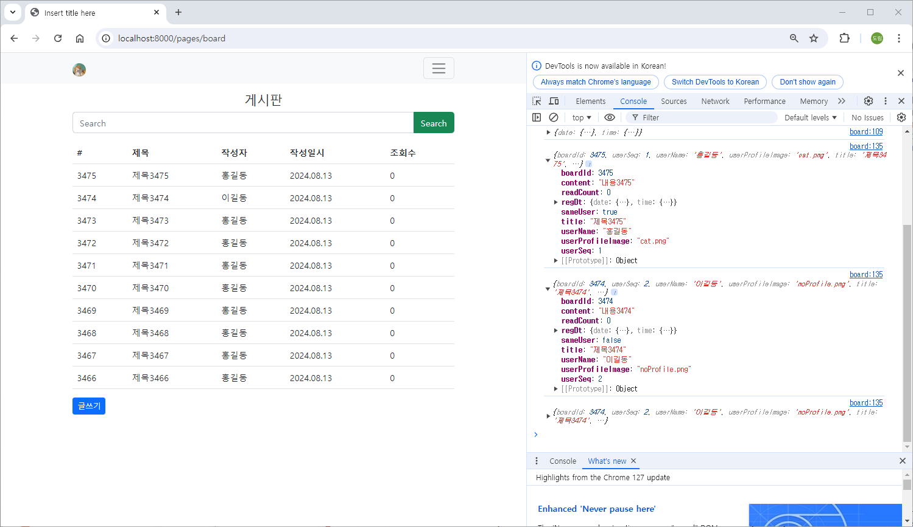

### src/main/webapp/WEB-INF/jsp/board.jsp

```java
<%@ page language="java" contentType="text/html; charset=UTF-8" pageEncoding="UTF-8"%>
<%@ page import="com.mycom.myapp.user.dto.UserDto" %>
<%
	// Back Forward Cache (BFCache)
	response.setHeader("Cache-Control", "no-cache, no-store, must-revalidate");
%>
<%
	UserDto userDto = (UserDto) session.getAttribute("userDto");
	System.out.println(userDto);
%>
<!DOCTYPE html>
<html>
<head>
<meta charset="UTF-8">

<link href="https://cdn.jsdelivr.net/npm/bootstrap@5.2.3/dist/css/bootstrap.min.css" rel="stylesheet" integrity="sha384-rbsA2VBKQhggwzxH7pPCaAqO46MgnOM80zW1RWuH61DGLwZJEdK2Kadq2F9CUG65" crossorigin="anonymous">
<script src="https://cdn.jsdelivr.net/npm/bootstrap@5.2.3/dist/js/bootstrap.bundle.min.js" integrity="sha384-kenU1KFdBIe4zVF0s0G1M5b4hcpxyD9F7jL+jjXkk+Q2h455rYXK/7HAuoJl+0I4" crossorigin="anonymous"></script>

<script src="//cdn.jsdelivr.net/npm/alertifyjs@1.12.0/build/alertify.min.js"></script>
<link rel="stylesheet" href="//cdn.jsdelivr.net/npm/alertifyjs@1.12.0/build/css/alertify.min.css"/>
<link rel="stylesheet" href="//cdn.jsdelivr.net/npm/alertifyjs@1.12.0/build/css/themes/default.min.css"/>

<title>Insert title here</title>
</head>
<body>

	<nav class="navbar navbar-expand-lg bg-light">
  <div class="container">
    <a class="navbar-brand" href="#">" style="width:24px; height: 24px; border-radius: 50%;"></a>
    <button class="navbar-toggler" type="button" data-bs-toggle="collapse" data-bs-target="#navbarSupportedContent" aria-controls="navbarSupportedContent" aria-expanded="false" aria-label="Toggle navigation">
      <span class="navbar-toggler-icon"></span>
    </button>
    <div class="collapse navbar-collapse" id="navbarSupportedContent">
      <ul class="navbar-nav me-auto">
        <li class="nav-item">
          <a class="nav-link" href="/pages/board">게시판</a>
        </li>
        <li class="nav-item">
          <a class="nav-link" href="#">Link</a>
        </li>
      </ul>
      
      <ul class="navbar-nav">
        <li class="nav-item">
          <a class="nav-link" href="/auth/logout">Logout</a>
        </li>
      </ul>
      
    </div>
  </div>
</nav>

<div class="container mt-3">
  <h4 class="text-center">게시판</h4>       
  
    <div class="input-group mb-3">
      <input id="inputSearchWord" type="text" class="form-control" placeholder="Search">
      <button id="btnSearchWord" class="btn btn-success" type="button">Search</button>
    </div>
    <table class="table table-hover">
        <thead>
            <tr>
                <th>#</th>
                <th>제목</th>
                <th>작성자</th>
                <th>작성일시</th>
                <th>조회수</th>
            </tr>
        </thead>
        <tbody id="boardTbody">
        </tbody>
    </table>
   
    <div id="paginationWrapper"></div>
    <button class="btn btn-sm btn-primary" id="btnInsertPage">글쓰기</button>
</div>

<div class="modal" tabindex="-1" id="detailBoardModal">
  <div class="modal-dialog modal-lg">
    <div class="modal-content">
      <div class="modal-header">
        <h4 class="modal-title">글 상세</h4>
        <button type="button" class="btn-close" data-bs-dismiss="modal" aria-label="Close"></button>
      </div>
      <div class="modal-body">
      
      <div class="example table-responsive">
      	<table class="table">
        	<tbody>
            	<tr><td>글번호</td><td id="boardIdDetail">#</td></tr>
                <tr><td>제목</td><td id="titleDetail">#</td></tr>
                <tr><td>내용</td><td id="contentDetail">#</td></tr>
                <tr><td>작성자</td><td id="userNameDetail">#</td></tr>
                <tr><td>작성일시</td><td id="regDtDetail">#</td></tr>
                <tr><td>조회수</td><td id="readCountDetail">#</td></tr>
            </tbody>
        </table>
      </div>
      
      <button id="btnBoardUpdateForm" class="btn btn-sm btn-primary btn-outline" data-bs-dismiss="modal" type="button">글 수정하기</button>
      <button id="btnBoardDeleteConfirm" class="btn btn-sm btn-warning btn-outline" data-bs-dismiss="modal" type="button">글 삭제하기</button>
      
      </div>
    </div>
  </div>
</div>

<script src="/assets/js/util.js"></script>
<script>
    let LIST_ROW_COUNT = 10;
    let OFFSET = 0;
    
    window.onload = function(){
        
        listBoard();
        
    }
    
    async function listBoard() {
        let url = "/boards/list"
        let urlParams = "?limit=" + LIST_ROW_COUNT + "&offset" + OFFSET
        let response = await fetch(url + urlParams);
        let data = await response.json();
        
        if( data.result == "success" ){ // 게시판 페이지 이동
            //console.log(data);
            //console.log(data.list);
        	makeListHtml(data.list);
        }else if( data.result == "fail" ){
            alert("글 조회 과정에서 오류가 발생했습니다.");
        }
    }
    
    function makeListHtml(list) {
    	
    	let listHTML = ``;
        
        list.forEach( el => {
            let boardId = el.boardId;
            let userName = el.userName;
            let title = el.title;
            let content = el.content;
            let regDt = el.regDt;
            // LocalDateTime 객체 -> json 처리 결과물이 gon, jackson 2가지가 다르다.
            console.log(regDt);
            let regDtStr = makeDateStr(regDt.date.year, regDt.date.month, regDt.date.day, '.'); 
            let readCount = el.readCount;
            
            listHTML += `<tr style="cursor:pointer" data-boardId=\${boardId}><td>\${boardId}</td><td>\${title}</td><td>\${userName}</td><td>\${regDtStr}</td><td>\${readCount}</td></tr>`;
        });
        
        document.querySelector("#boardTbody").innerHTML = listHTML;
        
        document.querySelectorAll("#boardTbody tr").forEach( el => {
        	el.onclick = function() {  // 이때 this는 el이다. // 애로우 function에서는 this를 사용할 수 없다. e를 매개변수로 받아 e.target.getAttribute으로 사용해야 한다.
        		let boardId = this.getAttribute("data-boardId");
        		detailBoard(boardId);
        	}
        });
    	
    }
    
    async function detailBoard(boardId) {
        let url = "/boards/detail/" + boardId;
        
        let response = await fetch(url);
        let data = await response.json();
        
        if( data.result == "success" ){ // 게시판 페이지 이동

        	makeDetailHTML(data.dto);
        	
        }else if( data.result == "fail" ){
            alert("글 상세 조회 과정에서 오류가 발생했습니다.");
        }
    }
    
    function makeDetailHTML(detail) {
    	let boardId = detail.boardId;
        let userSeq = detail.userSeq;
        let userName = detail.userName;
        let title = detail.title;
        let content = detail.content;
        let regDt = detail.regDt;
        let regDtStr = makeDateStr(regDt.date.year, regDt.date.month, regDt.date.day, '.') + ' ' + makeTimeStr(regDt.time.hour, regDt.time.minute, regDt.time.second, ':'); // for Gson Format Of LocalDateTime
        
        let readCount = detail.readCount;
        let sameUser = detail.sameUser;
        
        document.querySelector("#detailBoardModal").setAttribute("data-boardId", boardId);
        document.querySelector("#boardIdDetail").innerHTML = "#" + boardId;
        document.querySelector("#titleDetail").innerHTML = title;
        document.querySelector("#contentDetail").innerHTML = content;
        document.querySelector("#userNameDetail").innerHTML = userName;
        document.querySelector("#regDtDetail").innerHTML = regDtStr;
        document.querySelector("#readCountDetail").innerHTML = readCount;
        
        if( sameUser ){ // 작성자와 조회자가 같으면 버튼 보여주기
            document.querySelector("#btnBoardUpdateForm").style.display = "inline-block";
            document.querySelector("#btnBoardDeleteConfirm").style.display = "inline-block";
        }else{  // 작성자와 조회자가 다르면 버튼 숨기기
            document.querySelector("#btnBoardUpdateForm").style.display = "none";
            document.querySelector("#btnBoardDeleteConfirm").style.display = "none";
        }
        
        // bootstrap 5 modal show  
        let modal = new bootstrap.Modal(document.querySelector("#detailBoardModal"), { keyboard : false });
        modal.show();
    }
    
</script>

</body>
</html>
```

### 실행 결과

- 작성자와 조회자 동일한 경우
    
    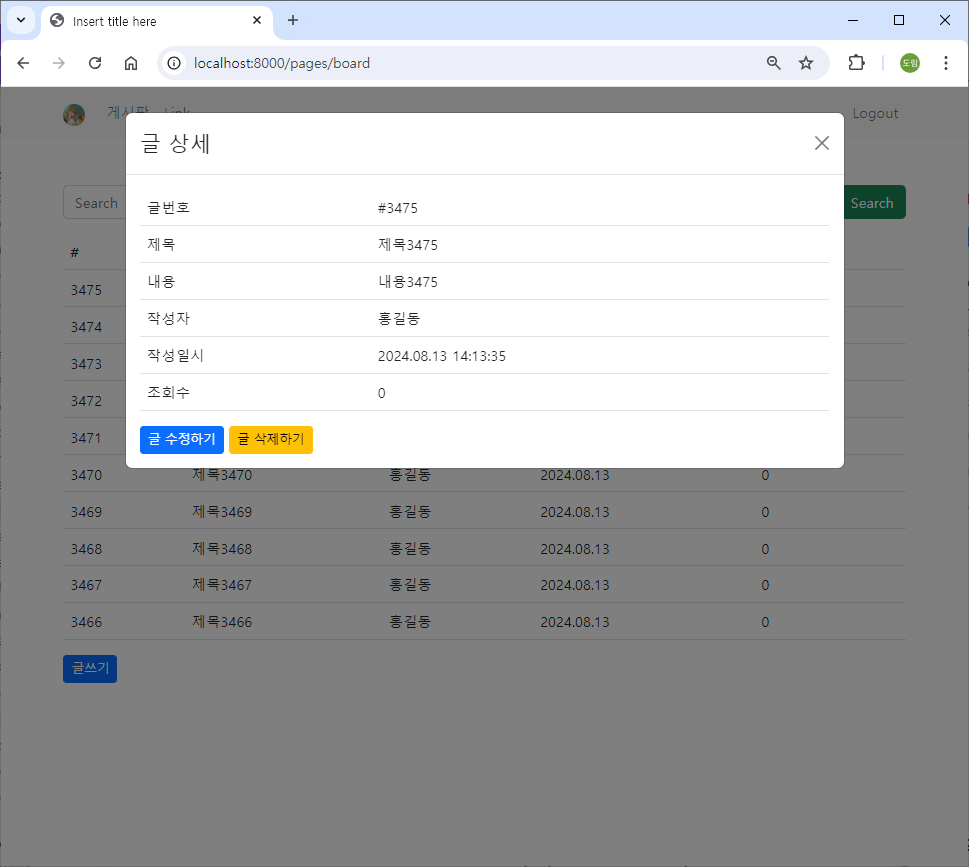
    
- 작성자와 조회자가 다른 경우
    
    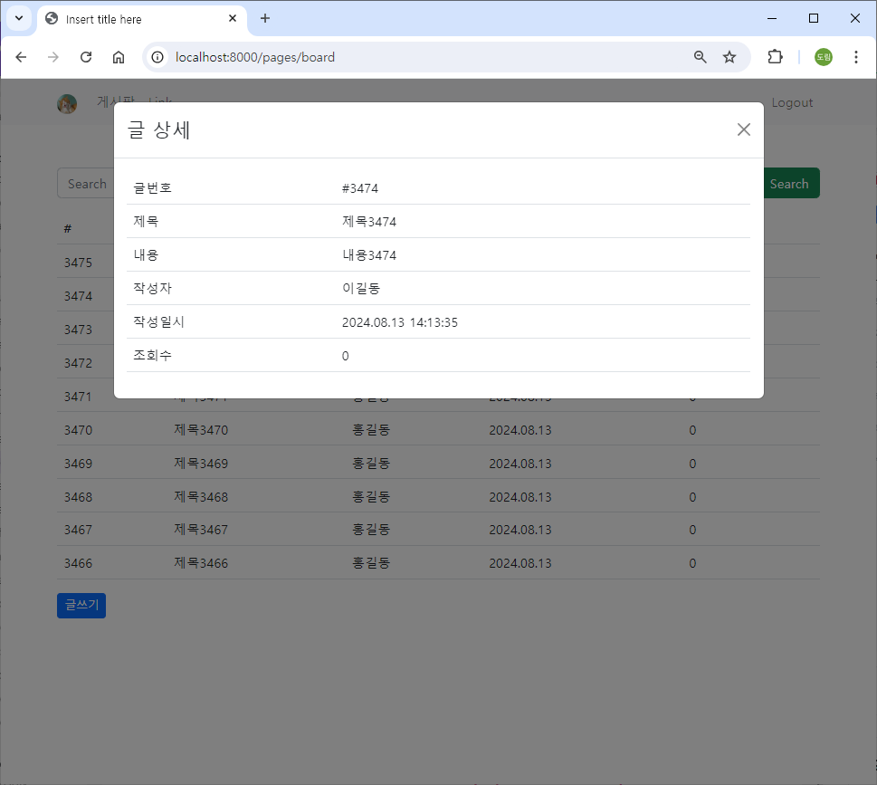
    

## 게시글 등록

https://getbootstrap.com/docs/5.2/forms/form-control/

### src/main/webapp/WEB-INF/jsp/board.jsp

```java
<%@ page language="java" contentType="text/html; charset=UTF-8" pageEncoding="UTF-8"%>
<%@ page import="com.mycom.myapp.user.dto.UserDto" %>
<%
	// Back Forward Cache (BFCache)
	response.setHeader("Cache-Control", "no-cache, no-store, must-revalidate");
%>
<%
	UserDto userDto = (UserDto) session.getAttribute("userDto");
	System.out.println(userDto);
%>
<!DOCTYPE html>
<html>
<head>
<meta charset="UTF-8">

<link href="https://cdn.jsdelivr.net/npm/bootstrap@5.2.3/dist/css/bootstrap.min.css" rel="stylesheet" integrity="sha384-rbsA2VBKQhggwzxH7pPCaAqO46MgnOM80zW1RWuH61DGLwZJEdK2Kadq2F9CUG65" crossorigin="anonymous">
<script src="https://cdn.jsdelivr.net/npm/bootstrap@5.2.3/dist/js/bootstrap.bundle.min.js" integrity="sha384-kenU1KFdBIe4zVF0s0G1M5b4hcpxyD9F7jL+jjXkk+Q2h455rYXK/7HAuoJl+0I4" crossorigin="anonymous"></script>

<script src="//cdn.jsdelivr.net/npm/alertifyjs@1.12.0/build/alertify.min.js"></script>
<link rel="stylesheet" href="//cdn.jsdelivr.net/npm/alertifyjs@1.12.0/build/css/alertify.min.css"/>
<link rel="stylesheet" href="//cdn.jsdelivr.net/npm/alertifyjs@1.12.0/build/css/themes/default.min.css"/>

<title>Insert title here</title>
</head>
<body>

	<nav class="navbar navbar-expand-lg bg-light">
  <div class="container">
    <a class="navbar-brand" href="#">" style="width:24px; height: 24px; border-radius: 50%;"></a>
    <button class="navbar-toggler" type="button" data-bs-toggle="collapse" data-bs-target="#navbarSupportedContent" aria-controls="navbarSupportedContent" aria-expanded="false" aria-label="Toggle navigation">
      <span class="navbar-toggler-icon"></span>
    </button>
    <div class="collapse navbar-collapse" id="navbarSupportedContent">
      <ul class="navbar-nav me-auto">
        <li class="nav-item">
          <a class="nav-link" href="/pages/board">게시판</a>
        </li>
        <li class="nav-item">
          <a class="nav-link" href="#">Link</a>
        </li>
      </ul>
      
      <ul class="navbar-nav">
        <li class="nav-item">
          <a class="nav-link" href="/auth/logout">Logout</a>
        </li>
      </ul>
      
    </div>
  </div>
</nav>

<div class="container mt-3">
  <h4 class="text-center">게시판</h4>       
  
    <div class="input-group mb-3">
      <input id="inputSearchWord" type="text" class="form-control" placeholder="Search">
      <button id="btnSearchWord" class="btn btn-success" type="button">Search</button>
    </div>
    <table class="table table-hover">
        <thead>
            <tr>
                <th>#</th>
                <th>제목</th>
                <th>작성자</th>
                <th>작성일시</th>
                <th>조회수</th>
            </tr>
        </thead>
        <tbody id="boardTbody">
        </tbody>
    </table>
   
    <div id="paginationWrapper"></div>
    <button class="btn btn-sm btn-primary" id="btnInsertPage">글쓰기</button>
</div>

<div class="modal" tabindex="-1" id="insertBoardModal">
  <div class="modal-dialog modal-lg">
    <div class="modal-content">
      <div class="modal-header">
        <h4 class="modal-title">글 쓰기</h4>
        <button type="button" class="btn-close" data-bs-dismiss="modal" aria-label="Close"></button>
      </div>
      <div class="modal-body">
      
      	<div class="mb-3">
  			<label for="titleInsert" class="form-label">제목</label>
  			<input type="text" class="form-control" id="titleInsert">
		</div>
		<div class="mb-3">
  			<label for="contentInsert" class="form-label">내용</label>
  			<textarea class="form-control" id="contentInsert" rows="10"></textarea>
		</div>
      
      <button id="btnBoardInsert" class="btn btn-sm btn-primary btn-outline" data-bs-dismiss="modal" type="button">등록</button>
      
      </div>
    </div>
  </div>
</div>

<div class="modal" tabindex="-1" id="detailBoardModal">
  <div class="modal-dialog modal-lg">
    <div class="modal-content">
      <div class="modal-header">
        <h4 class="modal-title">글 상세</h4>
        <button type="button" class="btn-close" data-bs-dismiss="modal" aria-label="Close"></button>
      </div>
      <div class="modal-body">
      
      <div class="example table-responsive">
      	<table class="table">
        	<tbody>
            	<tr><td>글번호</td><td id="boardIdDetail">#</td></tr>
                <tr><td>제목</td><td id="titleDetail">#</td></tr>
                <tr><td>내용</td><td id="contentDetail">#</td></tr>
                <tr><td>작성자</td><td id="userNameDetail">#</td></tr>
                <tr><td>작성일시</td><td id="regDtDetail">#</td></tr>
                <tr><td>조회수</td><td id="readCountDetail">#</td></tr>
            </tbody>
        </table>
      </div>
      
      <button id="btnBoardUpdateForm" class="btn btn-sm btn-primary btn-outline" data-bs-dismiss="modal" type="button">글 수정하기</button>
      <button id="btnBoardDeleteConfirm" class="btn btn-sm btn-warning btn-outline" data-bs-dismiss="modal" type="button">글 삭제하기</button>
      
      </div>
    </div>
  </div>
</div>

<script src="/assets/js/util.js"></script>
<script>
    let LIST_ROW_COUNT = 10;
    let OFFSET = 0;
    
    window.onload = function(){
        
        listBoard();
        
        // 글 등록 모달    
        document.querySelector("#btnInsertPage").onclick = function() {
	     	// bootstrap 5 modal show  
	        let modal = new bootstrap.Modal(document.querySelector("#insertBoardModal"), { keyboard : false });
	        modal.show();
        }
        
    }
    
    async function listBoard() {
        let url = "/boards/list"
        let urlParams = "?limit=" + LIST_ROW_COUNT + "&offset" + OFFSET
        let response = await fetch(url + urlParams);
        let data = await response.json();
        
        if( data.result == "success" ){ // 게시판 페이지 이동
            //console.log(data);
            //console.log(data.list);
        	makeListHtml(data.list);
        }else if( data.result == "fail" ){
            alert("글 조회 과정에서 오류가 발생했습니다.");
        }
    }
    
    function makeListHtml(list) {
    	
    	let listHTML = ``;
        
        list.forEach( el => {
            let boardId = el.boardId;
            let userName = el.userName;
            let title = el.title;
            let content = el.content;
            let regDt = el.regDt;
            // LocalDateTime 객체 -> json 처리 결과물이 gon, jackson 2가지가 다르다.
            console.log(regDt);
            let regDtStr = makeDateStr(regDt.date.year, regDt.date.month, regDt.date.day, '.'); 
            let readCount = el.readCount;
            
            listHTML += `<tr style="cursor:pointer" data-boardId=\${boardId}><td>\${boardId}</td><td>\${title}</td><td>\${userName}</td><td>\${regDtStr}</td><td>\${readCount}</td></tr>`;
        });
        
        document.querySelector("#boardTbody").innerHTML = listHTML;
        
        document.querySelectorAll("#boardTbody tr").forEach( el => {
        	el.onclick = function() {  // 이때 this는 el이다. // 애로우 function에서는 this를 사용할 수 없다. e를 매개변수로 받아 e.target.getAttribute으로 사용해야 한다.
        		let boardId = this.getAttribute("data-boardId");
        		detailBoard(boardId);
        	}
        });
    	
    }
    
    async function detailBoard(boardId) {
        let url = "/boards/detail/" + boardId;
        
        let response = await fetch(url);
        let data = await response.json();
        
        if( data.result == "success" ){ // 게시판 페이지 이동

        	makeDetailHTML(data.dto);
        	
        }else if( data.result == "fail" ){
            alert("글 상세 조회 과정에서 오류가 발생했습니다.");
        }
    }
    
    function makeDetailHTML(detail) {
    	let boardId = detail.boardId;
        let userSeq = detail.userSeq;
        let userName = detail.userName;
        let title = detail.title;
        let content = detail.content;
        let regDt = detail.regDt;
        let regDtStr = makeDateStr(regDt.date.year, regDt.date.month, regDt.date.day, '.') + ' ' + makeTimeStr(regDt.time.hour, regDt.time.minute, regDt.time.second, ':'); // for Gson Format Of LocalDateTime
        
        let readCount = detail.readCount;
        let sameUser = detail.sameUser;
        
        document.querySelector("#detailBoardModal").setAttribute("data-boardId", boardId);
        document.querySelector("#boardIdDetail").innerHTML = "#" + boardId;
        document.querySelector("#titleDetail").innerHTML = title;
        document.querySelector("#contentDetail").innerHTML = content;
        document.querySelector("#userNameDetail").innerHTML = userName;
        document.querySelector("#regDtDetail").innerHTML = regDtStr;
        document.querySelector("#readCountDetail").innerHTML = readCount;
        
        if( sameUser ){ // 작성자와 조회자가 같으면 버튼 보여주기
            document.querySelector("#btnBoardUpdateForm").style.display = "inline-block";
            document.querySelector("#btnBoardDeleteConfirm").style.display = "inline-block";
        }else{  // 작성자와 조회자가 다르면 버튼 숨기기
            document.querySelector("#btnBoardUpdateForm").style.display = "none";
            document.querySelector("#btnBoardDeleteConfirm").style.display = "none";
        }
        
        // bootstrap 5 modal show  
        let modal = new bootstrap.Modal(document.querySelector("#detailBoardModal"), { keyboard : false });
        modal.show();
    }
    
</script>

</body>
</html>
```

### src/main/java/com/mycom/myapp/board/dao/BoardDao.java

```java
package com.mycom.myapp.board.dao;

import java.util.List;

import org.apache.ibatis.annotations.Mapper;

import com.mycom.myapp.board.dto.BoardDto;
import com.mycom.myapp.board.dto.BoardParamDto;

@Mapper
public interface BoardDao {
	List<BoardDto> listBoard(BoardParamDto boardParamDto);  // limit, offset
	BoardDto detailBoard(BoardParamDto boardParamDto);
	
	int insertBoard(BoardDto boardDto);
}
```

### src/main/resources/mapper/board-mapper.xml

```java
<?xml version="1.0" encoding="UTF-8" ?>
<!DOCTYPE mapper
    PUBLIC "-//mybatis.org//DTD Mapper 3.0//EN"
    "http://mybatis.org/dtd/mybatis-3-mapper.dtd">
<mapper namespace="com.mycom.myapp.board.dao.BoardDao">
	
	<!-- parameterType에 map 대신 com.mycom.myapp.board.dto.BoardParamDto를 사용해도 된다. -->
	<select id="listBoard" parameterType="map" resultType="com.mycom.myapp.board.dto.BoardDto">
		select b.board_id, u.user_name, b.title, b.content, b.reg_dt, b.read_count
		  from board b, users u
		 where b.user_seq = u.user_seq
		 order by b.board_id desc
		 limit #{limit} offset #{offset}
	</select>
	
	<select id="detailBoard" parameterType="int" resultType="com.mycom.myapp.board.dto.BoardDto">
		select b.board_id, u.user_seq, u.user_name, u.user_profile_image, b.title, b.content, b.reg_dt, b.read_count
		  from board b, users u
		 where b.board_id = #{boardId} 
		   and b.user_seq = u.user_seq
	</select>
	
	<insert id="insertBoard" parameterType="com.mycom.myapp.board.dto.BoardDto">
		insert into board ( user_seq, title, content, reg_dt, read_count )
			values ( #{userSeq}, #{title}, #{content}, now(), 0 );
	</insert>
	
</mapper>    
```

### src/main/java/com/mycom/myapp/board/service

### BoardService.java

```java
package com.mycom.myapp.board.service;

import com.mycom.myapp.board.dto.BoardDto;
import com.mycom.myapp.board.dto.BoardParamDto;
import com.mycom.myapp.board.dto.BoardResultDto;

public interface BoardService {
	BoardResultDto listBoard(BoardParamDto boardParamDto);  // limit, offset
	BoardResultDto detailBoard(BoardParamDto boardParamDto);
	
	BoardResultDto insertBoard(BoardDto boardDto);
}
```

### BoardServiceImpl.java

```java
package com.mycom.myapp.board.service;

import java.util.List;

import org.springframework.stereotype.Service;

import com.mycom.myapp.board.dao.BoardDao;
import com.mycom.myapp.board.dto.BoardDto;
import com.mycom.myapp.board.dto.BoardParamDto;
import com.mycom.myapp.board.dto.BoardResultDto;

// 서비스 layer는 복잡한 Business Logic을 처리하는 영역, 사용자 정의 오류
// 예외 처리?? 다양한 예외 처리 (사용자 정의 포함)를 통해서 보다 구체적인 처리가 가능
@Service
public class BoardServiceImpl implements BoardService {

	// BoardDao DI
	private final BoardDao boardDao;
	
	public BoardServiceImpl(BoardDao boardDao) {
		this.boardDao = boardDao;
	}
	
	@Override
	public BoardResultDto listBoard(BoardParamDto boardParamDto) {
		BoardResultDto boardResultDto = new BoardResultDto();
		
		try {
			List<BoardDto> list = boardDao.listBoard(boardParamDto);
			boardResultDto.setList(list);
			boardResultDto.setResult("success");
		} catch(Exception e) {
			e.printStackTrace();
			boardResultDto.setResult("fail");
		}
		
		return boardResultDto;
	}

	@Override
	public BoardResultDto detailBoard(BoardParamDto boardParamDto) {
		BoardResultDto boardResultDto = new BoardResultDto();
		
		try {
			BoardDto boardDto = boardDao.detailBoard(boardParamDto);
			// 글쓴이와 보는이가 같은지 여부
			if( boardDto.getUserSeq() == boardParamDto.getUserSeq()) {  // Controller에서 session으로부터 얻어서 보내준다.
				boardDto.setSameUser(true);
			} else {
				boardDto.setSameUser(false);
			}
			boardResultDto.setDto(boardDto);
			boardResultDto.setResult("success");
		} catch(Exception e) {
			e.printStackTrace();
			boardResultDto.setResult("fail");
		}
		
		return boardResultDto;
	}

	@Override
	public BoardResultDto insertBoard(BoardDto boardDto) {
		BoardResultDto boardResultDto = new BoardResultDto();
		
		try {
			
			int ret = boardDao.insertBoard(boardDto);
			
			if( ret == 1 ) boardResultDto.setResult("success");
			else boardResultDto.setResult("fail");
			
		} catch(Exception e) {
			e.printStackTrace();
			boardResultDto.setResult("fail");
		}
		return boardResultDto;
	}

}
```

### src/main/java/com/mycom/myapp/board/controller/BoardController.java

```java
package com.mycom.myapp.board.controller;

import org.springframework.stereotype.Controller;
import org.springframework.web.bind.annotation.GetMapping;
import org.springframework.web.bind.annotation.PathVariable;
import org.springframework.web.bind.annotation.PostMapping;
import org.springframework.web.bind.annotation.RequestMapping;
import org.springframework.web.bind.annotation.ResponseBody;

import com.mycom.myapp.board.dto.BoardDto;
import com.mycom.myapp.board.dto.BoardParamDto;
import com.mycom.myapp.board.dto.BoardResultDto;
import com.mycom.myapp.board.service.BoardService;
import com.mycom.myapp.user.dto.UserDto;

import jakarta.servlet.http.HttpSession;

@Controller
@RequestMapping("/boards")
public class BoardController {
	
	// BoardService DI
	private final BoardService boardService;
	
	public BoardController(BoardService boardService) {
		this.boardService = boardService;
	}
	
	@GetMapping("/list")  // limit, offset parameter를 포함하는 요청
	@ResponseBody
	private BoardResultDto listBoard(BoardParamDto boardParamDto) {
		return boardService.listBoard(boardParamDto);
	}
	
	@GetMapping("/detail/{boardId}")  // limit, offset parameter를 포함하는 요청
	@ResponseBody
	private BoardResultDto detailBoard(@PathVariable int boardId, HttpSession session) {
		BoardParamDto boardParamDto = new BoardParamDto();
		boardParamDto.setBoardId(boardId);
		int userSeq = ((UserDto) session.getAttribute("userDto")).getUserSeq();  // login할 때 session에 담은 객체
		boardParamDto.setUserSeq(userSeq);
		return boardService.detailBoard(boardParamDto);
	}
	
	@PostMapping("/insert")
	@ResponseBody
	private BoardResultDto insertBoard(BoardDto boardDto, HttpSession session) {
		int userSeq = ((UserDto) session.getAttribute("userDto")).getUserSeq();  // login할 때 session에 담은 객체
		boardDto.setUserSeq(userSeq);
		return boardService.insertBoard(boardDto);
	}

}
```

### src/main/webapp/WEB-INF/jsp/board.jsp

```java
<%@ page language="java" contentType="text/html; charset=UTF-8" pageEncoding="UTF-8"%>
<%@ page import="com.mycom.myapp.user.dto.UserDto" %>
<%
	// Back Forward Cache (BFCache)
	response.setHeader("Cache-Control", "no-cache, no-store, must-revalidate");
%>
<%
	UserDto userDto = (UserDto) session.getAttribute("userDto");
	System.out.println(userDto);
%>
<!DOCTYPE html>
<html>
<head>
<meta charset="UTF-8">

<link href="https://cdn.jsdelivr.net/npm/bootstrap@5.2.3/dist/css/bootstrap.min.css" rel="stylesheet" integrity="sha384-rbsA2VBKQhggwzxH7pPCaAqO46MgnOM80zW1RWuH61DGLwZJEdK2Kadq2F9CUG65" crossorigin="anonymous">
<script src="https://cdn.jsdelivr.net/npm/bootstrap@5.2.3/dist/js/bootstrap.bundle.min.js" integrity="sha384-kenU1KFdBIe4zVF0s0G1M5b4hcpxyD9F7jL+jjXkk+Q2h455rYXK/7HAuoJl+0I4" crossorigin="anonymous"></script>

<script src="//cdn.jsdelivr.net/npm/alertifyjs@1.12.0/build/alertify.min.js"></script>
<link rel="stylesheet" href="//cdn.jsdelivr.net/npm/alertifyjs@1.12.0/build/css/alertify.min.css"/>
<link rel="stylesheet" href="//cdn.jsdelivr.net/npm/alertifyjs@1.12.0/build/css/themes/default.min.css"/>

<title>Insert title here</title>
</head>
<body>

	<nav class="navbar navbar-expand-lg bg-light">
  <div class="container">
    <a class="navbar-brand" href="#">" style="width:24px; height: 24px; border-radius: 50%;"></a>
    <button class="navbar-toggler" type="button" data-bs-toggle="collapse" data-bs-target="#navbarSupportedContent" aria-controls="navbarSupportedContent" aria-expanded="false" aria-label="Toggle navigation">
      <span class="navbar-toggler-icon"></span>
    </button>
    <div class="collapse navbar-collapse" id="navbarSupportedContent">
      <ul class="navbar-nav me-auto">
        <li class="nav-item">
          <a class="nav-link" href="/pages/board">게시판</a>
        </li>
        <li class="nav-item">
          <a class="nav-link" href="#">Link</a>
        </li>
      </ul>
      
      <ul class="navbar-nav">
        <li class="nav-item">
          <a class="nav-link" href="/auth/logout">Logout</a>
        </li>
      </ul>
      
    </div>
  </div>
</nav>

<div class="container mt-3">
  <h4 class="text-center">게시판</h4>       
  
    <div class="input-group mb-3">
      <input id="inputSearchWord" type="text" class="form-control" placeholder="Search">
      <button id="btnSearchWord" class="btn btn-success" type="button">Search</button>
    </div>
    <table class="table table-hover">
        <thead>
            <tr>
                <th>#</th>
                <th>제목</th>
                <th>작성자</th>
                <th>작성일시</th>
                <th>조회수</th>
            </tr>
        </thead>
        <tbody id="boardTbody">
        </tbody>
    </table>
   
    <div id="paginationWrapper"></div>
    <button class="btn btn-sm btn-primary" id="btnInsertPage">글쓰기</button>
</div>

<div class="modal" tabindex="-1" id="insertBoardModal">
  <div class="modal-dialog modal-lg">
    <div class="modal-content">
      <div class="modal-header">
        <h4 class="modal-title">글 쓰기</h4>
        <button type="button" class="btn-close" data-bs-dismiss="modal" aria-label="Close"></button>
      </div>
      <div class="modal-body">
      
      	<div class="mb-3">
  			<label for="titleInsert" class="form-label">제목</label>
  			<input type="text" class="form-control" id="titleInsert">
		</div>
		<div class="mb-3">
  			<label for="contentInsert" class="form-label">내용</label>
  			<textarea class="form-control" id="contentInsert" rows="10"></textarea>
		</div>
      
      <button id="btnBoardInsert" class="btn btn-sm btn-primary btn-outline" data-bs-dismiss="modal" type="button">등록</button>
      
      </div>
    </div>
  </div>
</div>

<div class="modal" tabindex="-1" id="detailBoardModal">
  <div class="modal-dialog modal-lg">
    <div class="modal-content">
      <div class="modal-header">
        <h4 class="modal-title">글 상세</h4>
        <button type="button" class="btn-close" data-bs-dismiss="modal" aria-label="Close"></button>
      </div>
      <div class="modal-body">
      
      <div class="example table-responsive">
      	<table class="table">
        	<tbody>
            	<tr><td>글번호</td><td id="boardIdDetail">#</td></tr>
                <tr><td>제목</td><td id="titleDetail">#</td></tr>
                <tr><td>내용</td><td id="contentDetail">#</td></tr>
                <tr><td>작성자</td><td id="userNameDetail">#</td></tr>
                <tr><td>작성일시</td><td id="regDtDetail">#</td></tr>
                <tr><td>조회수</td><td id="readCountDetail">#</td></tr>
            </tbody>
        </table>
      </div>
      
      <button id="btnBoardUpdateForm" class="btn btn-sm btn-primary btn-outline" data-bs-dismiss="modal" type="button">글 수정하기</button>
      <button id="btnBoardDeleteConfirm" class="btn btn-sm btn-warning btn-outline" data-bs-dismiss="modal" type="button">글 삭제하기</button>
      
      </div>
    </div>
  </div>
</div>

<script src="/assets/js/util.js"></script>
<script>
    let LIST_ROW_COUNT = 10;
    let OFFSET = 0;
    
    window.onload = function(){
        
        listBoard();
        
        // 글 등록 모달    
        document.querySelector("#btnInsertPage").onclick = function() {
	     	// bootstrap 5 modal show  
	        let modal = new bootstrap.Modal(document.querySelector("#insertBoardModal"), { keyboard : false });
	        modal.show();
        }
        
        // 글 등록
        document.querySelector("#btnBoardInsert").onclick = function() {
        	console.log( document.querySelector("#titleInsert").value );
        	console.log( document.querySelector("#contentInsert").value );
        }
    }
    
    async function listBoard() {
        let url = "/boards/list"
        let urlParams = "?limit=" + LIST_ROW_COUNT + "&offset" + OFFSET
        let response = await fetch(url + urlParams);
        let data = await response.json();
        
        if( data.result == "success" ){ // 게시판 페이지 이동
            //console.log(data);
            //console.log(data.list);
        	makeListHtml(data.list);
        }else if( data.result == "fail" ){
            alert("글 조회 과정에서 오류가 발생했습니다.");
        }
    }
    
    function makeListHtml(list) {
    	
    	let listHTML = ``;
        
        list.forEach( el => {
            let boardId = el.boardId;
            let userName = el.userName;
            let title = el.title;
            let content = el.content;
            let regDt = el.regDt;
            // LocalDateTime 객체 -> json 처리 결과물이 gon, jackson 2가지가 다르다.
            console.log(regDt);
            let regDtStr = makeDateStr(regDt.date.year, regDt.date.month, regDt.date.day, '.'); 
            let readCount = el.readCount;
            
            listHTML += `<tr style="cursor:pointer" data-boardId=\${boardId}><td>\${boardId}</td><td>\${title}</td><td>\${userName}</td><td>\${regDtStr}</td><td>\${readCount}</td></tr>`;
        });
        
        document.querySelector("#boardTbody").innerHTML = listHTML;
        
        document.querySelectorAll("#boardTbody tr").forEach( el => {
        	el.onclick = function() {  // 이때 this는 el이다. // 애로우 function에서는 this를 사용할 수 없다. e를 매개변수로 받아 e.target.getAttribute으로 사용해야 한다.
        		let boardId = this.getAttribute("data-boardId");
        		detailBoard(boardId);
        	}
        });
    	
    }
    
    async function detailBoard(boardId) {
        let url = "/boards/detail/" + boardId;
        
        let response = await fetch(url);
        let data = await response.json();
        
        if( data.result == "success" ){ // 게시판 페이지 이동

        	makeDetailHTML(data.dto);
        	
        }else if( data.result == "fail" ){
            alert("글 상세 조회 과정에서 오류가 발생했습니다.");
        }
    }
    
    function makeDetailHTML(detail) {
    	let boardId = detail.boardId;
        let userSeq = detail.userSeq;
        let userName = detail.userName;
        let title = detail.title;
        let content = detail.content;
        let regDt = detail.regDt;
        let regDtStr = makeDateStr(regDt.date.year, regDt.date.month, regDt.date.day, '.') + ' ' + makeTimeStr(regDt.time.hour, regDt.time.minute, regDt.time.second, ':'); // for Gson Format Of LocalDateTime
        
        let readCount = detail.readCount;
        let sameUser = detail.sameUser;
        
        document.querySelector("#detailBoardModal").setAttribute("data-boardId", boardId);
        document.querySelector("#boardIdDetail").innerHTML = "#" + boardId;
        document.querySelector("#titleDetail").innerHTML = title;
        document.querySelector("#contentDetail").innerHTML = content;
        document.querySelector("#userNameDetail").innerHTML = userName;
        document.querySelector("#regDtDetail").innerHTML = regDtStr;
        document.querySelector("#readCountDetail").innerHTML = readCount;
        
        if( sameUser ){ // 작성자와 조회자가 같으면 버튼 보여주기
            document.querySelector("#btnBoardUpdateForm").style.display = "inline-block";
            document.querySelector("#btnBoardDeleteConfirm").style.display = "inline-block";
        }else{  // 작성자와 조회자가 다르면 버튼 숨기기
            document.querySelector("#btnBoardUpdateForm").style.display = "none";
            document.querySelector("#btnBoardDeleteConfirm").style.display = "none";
        }
        
        // bootstrap 5 modal show  
        let modal = new bootstrap.Modal(document.querySelector("#detailBoardModal"), { keyboard : false });
        modal.show();
    }
    
</script>

</body>
</html>
```

### 실행 결과 - console 출력

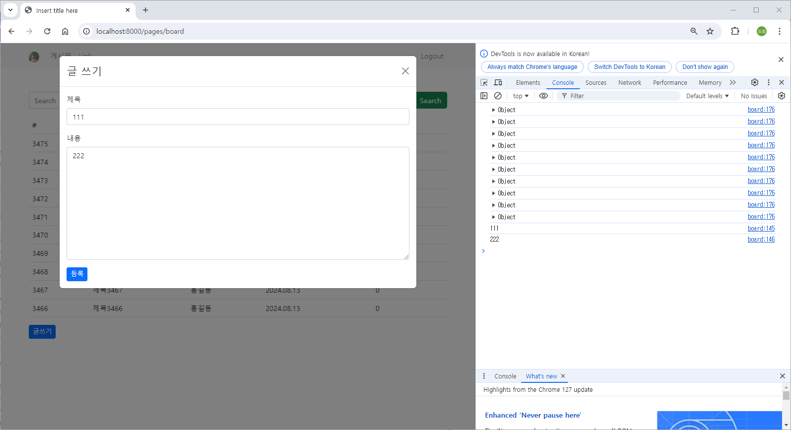

### src/main/webapp/WEB-INF/jsp/board.jsp

```java
<%@ page language="java" contentType="text/html; charset=UTF-8" pageEncoding="UTF-8"%>
<%@ page import="com.mycom.myapp.user.dto.UserDto" %>
<%
	// Back Forward Cache (BFCache)
	response.setHeader("Cache-Control", "no-cache, no-store, must-revalidate");
%>
<%
	UserDto userDto = (UserDto) session.getAttribute("userDto");
	System.out.println(userDto);
%>
<!DOCTYPE html>
<html>
<head>
<meta charset="UTF-8">

<link href="https://cdn.jsdelivr.net/npm/bootstrap@5.2.3/dist/css/bootstrap.min.css" rel="stylesheet" integrity="sha384-rbsA2VBKQhggwzxH7pPCaAqO46MgnOM80zW1RWuH61DGLwZJEdK2Kadq2F9CUG65" crossorigin="anonymous">
<script src="https://cdn.jsdelivr.net/npm/bootstrap@5.2.3/dist/js/bootstrap.bundle.min.js" integrity="sha384-kenU1KFdBIe4zVF0s0G1M5b4hcpxyD9F7jL+jjXkk+Q2h455rYXK/7HAuoJl+0I4" crossorigin="anonymous"></script>

<script src="//cdn.jsdelivr.net/npm/alertifyjs@1.12.0/build/alertify.min.js"></script>
<link rel="stylesheet" href="//cdn.jsdelivr.net/npm/alertifyjs@1.12.0/build/css/alertify.min.css"/>
<link rel="stylesheet" href="//cdn.jsdelivr.net/npm/alertifyjs@1.12.0/build/css/themes/default.min.css"/>

<title>Insert title here</title>
</head>
<body>

	<nav class="navbar navbar-expand-lg bg-light">
  <div class="container">
    <a class="navbar-brand" href="#">" style="width:24px; height: 24px; border-radius: 50%;"></a>
    <button class="navbar-toggler" type="button" data-bs-toggle="collapse" data-bs-target="#navbarSupportedContent" aria-controls="navbarSupportedContent" aria-expanded="false" aria-label="Toggle navigation">
      <span class="navbar-toggler-icon"></span>
    </button>
    <div class="collapse navbar-collapse" id="navbarSupportedContent">
      <ul class="navbar-nav me-auto">
        <li class="nav-item">
          <a class="nav-link" href="/pages/board">게시판</a>
        </li>
        <li class="nav-item">
          <a class="nav-link" href="#">Link</a>
        </li>
      </ul>
      
      <ul class="navbar-nav">
        <li class="nav-item">
          <a class="nav-link" href="/auth/logout">Logout</a>
        </li>
      </ul>
      
    </div>
  </div>
</nav>

<div class="container mt-3">
  <h4 class="text-center">게시판</h4>       
  
    <div class="input-group mb-3">
      <input id="inputSearchWord" type="text" class="form-control" placeholder="Search">
      <button id="btnSearchWord" class="btn btn-success" type="button">Search</button>
    </div>
    <table class="table table-hover">
        <thead>
            <tr>
                <th>#</th>
                <th>제목</th>
                <th>작성자</th>
                <th>작성일시</th>
                <th>조회수</th>
            </tr>
        </thead>
        <tbody id="boardTbody">
        </tbody>
    </table>
   
    <div id="paginationWrapper"></div>
    <button class="btn btn-sm btn-primary" id="btnInsertPage">글쓰기</button>
</div>

<div class="modal" tabindex="-1" id="insertBoardModal">
  <div class="modal-dialog modal-lg">
    <div class="modal-content">
      <div class="modal-header">
        <h4 class="modal-title">글 쓰기</h4>
        <button type="button" class="btn-close" data-bs-dismiss="modal" aria-label="Close"></button>
      </div>
      <div class="modal-body">
      
      	<div class="mb-3">
  			<label for="titleInsert" class="form-label">제목</label>
  			<input type="text" class="form-control" id="titleInsert">
		</div>
		<div class="mb-3">
  			<label for="contentInsert" class="form-label">내용</label>
  			<textarea class="form-control" id="contentInsert" rows="10"></textarea>
		</div>
      
      <button id="btnBoardInsert" class="btn btn-sm btn-primary btn-outline" data-bs-dismiss="modal" type="button">등록</button>
      
      </div>
    </div>
  </div>
</div>

<div class="modal" tabindex="-1" id="detailBoardModal">
  <div class="modal-dialog modal-lg">
    <div class="modal-content">
      <div class="modal-header">
        <h4 class="modal-title">글 상세</h4>
        <button type="button" class="btn-close" data-bs-dismiss="modal" aria-label="Close"></button>
      </div>
      <div class="modal-body">
      
      <div class="example table-responsive">
      	<table class="table">
        	<tbody>
            	<tr><td>글번호</td><td id="boardIdDetail">#</td></tr>
                <tr><td>제목</td><td id="titleDetail">#</td></tr>
                <tr><td>내용</td><td id="contentDetail">#</td></tr>
                <tr><td>작성자</td><td id="userNameDetail">#</td></tr>
                <tr><td>작성일시</td><td id="regDtDetail">#</td></tr>
                <tr><td>조회수</td><td id="readCountDetail">#</td></tr>
            </tbody>
        </table>
      </div>
      
      <button id="btnBoardUpdateForm" class="btn btn-sm btn-primary btn-outline" data-bs-dismiss="modal" type="button">글 수정하기</button>
      <button id="btnBoardDeleteConfirm" class="btn btn-sm btn-warning btn-outline" data-bs-dismiss="modal" type="button">글 삭제하기</button>
      
      </div>
    </div>
  </div>
</div>

<script src="/assets/js/util.js"></script>
<script>
    let LIST_ROW_COUNT = 10;
    let OFFSET = 0;
    
    window.onload = function(){
        
        listBoard();
        
        // 글 등록 모달    
        document.querySelector("#btnInsertPage").onclick = function() {
	     	// bootstrap 5 modal show  
	        let modal = new bootstrap.Modal(document.querySelector("#insertBoardModal"), { keyboard : false });
	        modal.show();
        }
        
        // 글 등록
        document.querySelector("#btnBoardInsert").onclick = function() {
        	if( document.querySelector("#titleInsert").value.length > 0 && document.querySelector("#contentInsert").value.length > 0 ) {
        		insertBoard();
        	}
        }
    }
    
    async function listBoard() {
        let url = "/boards/list"
        let urlParams = "?limit=" + LIST_ROW_COUNT + "&offset" + OFFSET
        let response = await fetch(url + urlParams);
        let data = await response.json();
        
        if( data.result == "success" ){ // 게시판 페이지 이동
            //console.log(data);
            //console.log(data.list);
        	makeListHtml(data.list);
        }else if( data.result == "fail" ){
            alert("글 조회 과정에서 오류가 발생했습니다.");
        }
    }
    
    function makeListHtml(list) {
    	
    	let listHTML = ``;
        
        list.forEach( el => {
            let boardId = el.boardId;
            let userName = el.userName;
            let title = el.title;
            let content = el.content;
            let regDt = el.regDt;
            // LocalDateTime 객체 -> json 처리 결과물이 gon, jackson 2가지가 다르다.
            console.log(regDt);
            let regDtStr = makeDateStr(regDt.date.year, regDt.date.month, regDt.date.day, '.'); 
            let readCount = el.readCount;
            
            listHTML += `<tr style="cursor:pointer" data-boardId=\${boardId}><td>\${boardId}</td><td>\${title}</td><td>\${userName}</td><td>\${regDtStr}</td><td>\${readCount}</td></tr>`;
        });
        
        document.querySelector("#boardTbody").innerHTML = listHTML;
        
        document.querySelectorAll("#boardTbody tr").forEach( el => {
        	el.onclick = function() {  // 이때 this는 el이다. // 애로우 function에서는 this를 사용할 수 없다. e를 매개변수로 받아 e.target.getAttribute으로 사용해야 한다.
        		let boardId = this.getAttribute("data-boardId");
        		detailBoard(boardId);
        	}
        });
    	
    }
    
    async function detailBoard(boardId) {
        let url = "/boards/detail/" + boardId;
        
        let response = await fetch(url);
        let data = await response.json();
        
        if( data.result == "success" ){ // 게시판 페이지 이동

        	makeDetailHTML(data.dto);
        	
        }else if( data.result == "fail" ){
            alert("글 상세 조회 과정에서 오류가 발생했습니다.");
        }
    }
    
    function makeDetailHTML(detail) {
    	let boardId = detail.boardId;
        let userSeq = detail.userSeq;
        let userName = detail.userName;
        let title = detail.title;
        let content = detail.content;
        let regDt = detail.regDt;
        let regDtStr = makeDateStr(regDt.date.year, regDt.date.month, regDt.date.day, '.') + ' ' + makeTimeStr(regDt.time.hour, regDt.time.minute, regDt.time.second, ':'); // for Gson Format Of LocalDateTime
        
        let readCount = detail.readCount;
        let sameUser = detail.sameUser;
        
        document.querySelector("#detailBoardModal").setAttribute("data-boardId", boardId);
        document.querySelector("#boardIdDetail").innerHTML = "#" + boardId;
        document.querySelector("#titleDetail").innerHTML = title;
        document.querySelector("#contentDetail").innerHTML = content;
        document.querySelector("#userNameDetail").innerHTML = userName;
        document.querySelector("#regDtDetail").innerHTML = regDtStr;
        document.querySelector("#readCountDetail").innerHTML = readCount;
        
        if( sameUser ){ // 작성자와 조회자가 같으면 버튼 보여주기
            document.querySelector("#btnBoardUpdateForm").style.display = "inline-block";
            document.querySelector("#btnBoardDeleteConfirm").style.display = "inline-block";
        }else{  // 작성자와 조회자가 다르면 버튼 숨기기
            document.querySelector("#btnBoardUpdateForm").style.display = "none";
            document.querySelector("#btnBoardDeleteConfirm").style.display = "none";
        }
        
        // bootstrap 5 modal show  
        let modal = new bootstrap.Modal(document.querySelector("#detailBoardModal"), { keyboard : false });
        modal.show();
    }
    
    async function insertBoard(boardId) {
    	let urlParams = new URLSearchParams({
    		title : document.querySelector("#titleInsert").value,
    		content : document.querySelector("#contentInsert").value
    	});
    	
        let url = "/boards/insert";
        
        let fetchOptions = {
        	method : 'POST',
        	body : urlParams
        }
        
        let response = await fetch(url, fetchOptions);
        let data = await response.json();
        
        if( data.result == "success" ){ // 게시판 페이지 이동

        	alertify.success('글이 등록되었습니다.');
        	listBoard();
        	
        }else if( data.result == "fail" ){
            alert("글 등록 과정에서 오류가 발생했습니다.");
        }
    }
    
</script>

</body>
</html>
```

### 실행 결과

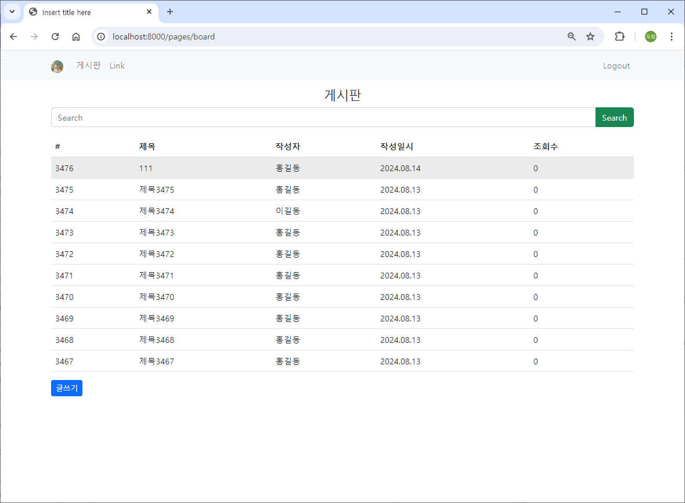

## 게시글 수정

### src/main/java/com/mycom/myapp/board/dao/BoardDao.java

```java
package com.mycom.myapp.board.dao;

import java.util.List;

import org.apache.ibatis.annotations.Mapper;

import com.mycom.myapp.board.dto.BoardDto;
import com.mycom.myapp.board.dto.BoardParamDto;

@Mapper
public interface BoardDao {
	List<BoardDto> listBoard(BoardParamDto boardParamDto);  // limit, offset
	BoardDto detailBoard(BoardParamDto boardParamDto);
	
	int insertBoard(BoardDto boardDto);
	int updateBoard(BoardDto boardDto);
}
```

### src/main/resources/mapper/board-mapper.xml

```java
<?xml version="1.0" encoding="UTF-8" ?>
<!DOCTYPE mapper
    PUBLIC "-//mybatis.org//DTD Mapper 3.0//EN"
    "http://mybatis.org/dtd/mybatis-3-mapper.dtd">
<mapper namespace="com.mycom.myapp.board.dao.BoardDao">
	
	<!-- parameterType에 map 대신 com.mycom.myapp.board.dto.BoardParamDto를 사용해도 된다. -->
	<select id="listBoard" parameterType="map" resultType="com.mycom.myapp.board.dto.BoardDto">
		select b.board_id, u.user_name, b.title, b.content, b.reg_dt, b.read_count
		  from board b, users u
		 where b.user_seq = u.user_seq
		 order by b.board_id desc
		 limit #{limit} offset #{offset}
	</select>
	
	<select id="detailBoard" parameterType="int" resultType="com.mycom.myapp.board.dto.BoardDto">
		select b.board_id, u.user_seq, u.user_name, u.user_profile_image, b.title, b.content, b.reg_dt, b.read_count
		  from board b, users u
		 where b.board_id = #{boardId} 
		   and b.user_seq = u.user_seq
	</select>
	
	<insert id="insertBoard" parameterType="com.mycom.myapp.board.dto.BoardDto">
		insert into board ( user_seq, title, content, reg_dt, read_count )
			values ( #{userSeq}, #{title}, #{content}, now(), 0 );
	</insert>
	
	<update id="updateBoard" parameterType="com.mycom.myapp.board.dto.BoardDto">
		update board 
		   set title = #{title}, 
		   	   content = #{content}
		 where board_id = #{boardId}
	</update>
	
</mapper>    
```

### src/main/java/com/mycom/myapp/board/service

### BoardService.java

```java
package com.mycom.myapp.board.service;

import com.mycom.myapp.board.dto.BoardDto;
import com.mycom.myapp.board.dto.BoardParamDto;
import com.mycom.myapp.board.dto.BoardResultDto;

public interface BoardService {
	BoardResultDto listBoard(BoardParamDto boardParamDto);  // limit, offset
	BoardResultDto detailBoard(BoardParamDto boardParamDto);
	
	BoardResultDto insertBoard(BoardDto boardDto);
	BoardResultDto updateBoard(BoardDto boardDto);
}
```

### BoardServiceImpl.java

```java
package com.mycom.myapp.board.service;

import java.util.List;

import org.springframework.stereotype.Service;

import com.mycom.myapp.board.dao.BoardDao;
import com.mycom.myapp.board.dto.BoardDto;
import com.mycom.myapp.board.dto.BoardParamDto;
import com.mycom.myapp.board.dto.BoardResultDto;

// 서비스 layer는 복잡한 Business Logic을 처리하는 영역, 사용자 정의 오류
// 예외 처리?? 다양한 예외 처리 (사용자 정의 포함)를 통해서 보다 구체적인 처리가 가능
@Service
public class BoardServiceImpl implements BoardService {

	// BoardDao DI
	private final BoardDao boardDao;
	
	public BoardServiceImpl(BoardDao boardDao) {
		this.boardDao = boardDao;
	}
	
	@Override
	public BoardResultDto listBoard(BoardParamDto boardParamDto) {
		BoardResultDto boardResultDto = new BoardResultDto();
		
		try {
			List<BoardDto> list = boardDao.listBoard(boardParamDto);
			boardResultDto.setList(list);
			boardResultDto.setResult("success");
		} catch(Exception e) {
			e.printStackTrace();
			boardResultDto.setResult("fail");
		}
		
		return boardResultDto;
	}

	@Override
	public BoardResultDto detailBoard(BoardParamDto boardParamDto) {
		BoardResultDto boardResultDto = new BoardResultDto();
		
		try {
			BoardDto boardDto = boardDao.detailBoard(boardParamDto);
			// 글쓴이와 보는이가 같은지 여부
			if( boardDto.getUserSeq() == boardParamDto.getUserSeq()) {  // Controller에서 session으로부터 얻어서 보내준다.
				boardDto.setSameUser(true);
			} else {
				boardDto.setSameUser(false);
			}
			boardResultDto.setDto(boardDto);
			boardResultDto.setResult("success");
		} catch(Exception e) {
			e.printStackTrace();
			boardResultDto.setResult("fail");
		}
		
		return boardResultDto;
	}

	@Override
	public BoardResultDto insertBoard(BoardDto boardDto) {
		BoardResultDto boardResultDto = new BoardResultDto();
		
		try {
			
			int ret = boardDao.insertBoard(boardDto);
			
			if( ret == 1 ) boardResultDto.setResult("success");
			else boardResultDto.setResult("fail");
			
		} catch(Exception e) {
			e.printStackTrace();
			boardResultDto.setResult("fail");
		}
		return boardResultDto;
	}

	@Override
	public BoardResultDto updateBoard(BoardDto boardDto) {
		BoardResultDto boardResultDto = new BoardResultDto();
		
		try {
			
			int ret = boardDao.updateBoard(boardDto);
			
			if( ret == 1 ) boardResultDto.setResult("success");
			else boardResultDto.setResult("fail");
			
		} catch(Exception e) {
			e.printStackTrace();
			boardResultDto.setResult("fail");
		}
		return boardResultDto;
	}

}
```

### src/main/java/com/mycom/myapp/board/controller/BoardController.java

```java
package com.mycom.myapp.board.controller;

import org.springframework.stereotype.Controller;
import org.springframework.web.bind.annotation.GetMapping;
import org.springframework.web.bind.annotation.PathVariable;
import org.springframework.web.bind.annotation.PostMapping;
import org.springframework.web.bind.annotation.RequestMapping;
import org.springframework.web.bind.annotation.ResponseBody;

import com.mycom.myapp.board.dto.BoardDto;
import com.mycom.myapp.board.dto.BoardParamDto;
import com.mycom.myapp.board.dto.BoardResultDto;
import com.mycom.myapp.board.service.BoardService;
import com.mycom.myapp.user.dto.UserDto;

import jakarta.servlet.http.HttpSession;

@Controller
@RequestMapping("/boards")
public class BoardController {
	
	// BoardService DI
	private final BoardService boardService;
	
	public BoardController(BoardService boardService) {
		this.boardService = boardService;
	}
	
	@GetMapping("/list")  // limit, offset parameter를 포함하는 요청
	@ResponseBody
	private BoardResultDto listBoard(BoardParamDto boardParamDto) {
		return boardService.listBoard(boardParamDto);
	}
	
	@GetMapping("/detail/{boardId}")  // limit, offset parameter를 포함하는 요청
	@ResponseBody
	private BoardResultDto detailBoard(@PathVariable int boardId, HttpSession session) {
		BoardParamDto boardParamDto = new BoardParamDto();
		boardParamDto.setBoardId(boardId);
		int userSeq = ((UserDto) session.getAttribute("userDto")).getUserSeq();  // login할 때 session에 담은 객체
		boardParamDto.setUserSeq(userSeq);
		return boardService.detailBoard(boardParamDto);
	}
	
	@PostMapping("/insert")
	@ResponseBody
	private BoardResultDto insertBoard(BoardDto boardDto, HttpSession session) {
		int userSeq = ((UserDto) session.getAttribute("userDto")).getUserSeq();  // login할 때 session에 담은 객체
		boardDto.setUserSeq(userSeq);
		return boardService.insertBoard(boardDto);
	}
	
	@PostMapping("/update")
	@ResponseBody
	private BoardResultDto updateBoard(BoardDto boardDto) {
		return boardService.updateBoard(boardDto);
	}

}
```

### src/main/webapp/WEB-INF/jsp/board.jsp

```java
<%@ page language="java" contentType="text/html; charset=UTF-8" pageEncoding="UTF-8"%>
<%@ page import="com.mycom.myapp.user.dto.UserDto" %>
<%
	// Back Forward Cache (BFCache)
	response.setHeader("Cache-Control", "no-cache, no-store, must-revalidate");
%>
<%
	UserDto userDto = (UserDto) session.getAttribute("userDto");
	System.out.println(userDto);
%>
<!DOCTYPE html>
<html>
<head>
<meta charset="UTF-8">

<link href="https://cdn.jsdelivr.net/npm/bootstrap@5.2.3/dist/css/bootstrap.min.css" rel="stylesheet" integrity="sha384-rbsA2VBKQhggwzxH7pPCaAqO46MgnOM80zW1RWuH61DGLwZJEdK2Kadq2F9CUG65" crossorigin="anonymous">
<script src="https://cdn.jsdelivr.net/npm/bootstrap@5.2.3/dist/js/bootstrap.bundle.min.js" integrity="sha384-kenU1KFdBIe4zVF0s0G1M5b4hcpxyD9F7jL+jjXkk+Q2h455rYXK/7HAuoJl+0I4" crossorigin="anonymous"></script>

<script src="//cdn.jsdelivr.net/npm/alertifyjs@1.12.0/build/alertify.min.js"></script>
<link rel="stylesheet" href="//cdn.jsdelivr.net/npm/alertifyjs@1.12.0/build/css/alertify.min.css"/>
<link rel="stylesheet" href="//cdn.jsdelivr.net/npm/alertifyjs@1.12.0/build/css/themes/default.min.css"/>

<title>Insert title here</title>
</head>
<body>

	<nav class="navbar navbar-expand-lg bg-light">
  <div class="container">
    <a class="navbar-brand" href="#">" style="width:24px; height: 24px; border-radius: 50%;"></a>
    <button class="navbar-toggler" type="button" data-bs-toggle="collapse" data-bs-target="#navbarSupportedContent" aria-controls="navbarSupportedContent" aria-expanded="false" aria-label="Toggle navigation">
      <span class="navbar-toggler-icon"></span>
    </button>
    <div class="collapse navbar-collapse" id="navbarSupportedContent">
      <ul class="navbar-nav me-auto">
        <li class="nav-item">
          <a class="nav-link" href="/pages/board">게시판</a>
        </li>
        <li class="nav-item">
          <a class="nav-link" href="#">Link</a>
        </li>
      </ul>
      
      <ul class="navbar-nav">
        <li class="nav-item">
          <a class="nav-link" href="/auth/logout">Logout</a>
        </li>
      </ul>
      
    </div>
  </div>
</nav>

<div class="container mt-3">
  <h4 class="text-center">게시판</h4>       
  
    <div class="input-group mb-3">
      <input id="inputSearchWord" type="text" class="form-control" placeholder="Search">
      <button id="btnSearchWord" class="btn btn-success" type="button">Search</button>
    </div>
    <table class="table table-hover">
        <thead>
            <tr>
                <th>#</th>
                <th>제목</th>
                <th>작성자</th>
                <th>작성일시</th>
                <th>조회수</th>
            </tr>
        </thead>
        <tbody id="boardTbody">
        </tbody>
    </table>
   
    <div id="paginationWrapper"></div>
    <button class="btn btn-sm btn-primary" id="btnInsertPage">글쓰기</button>
</div>

<!-- insert Modal -->
<div class="modal" tabindex="-1" id="insertBoardModal">
  <div class="modal-dialog modal-lg">
    <div class="modal-content">
      <div class="modal-header">
        <h4 class="modal-title">글 쓰기</h4>
        <button type="button" class="btn-close" data-bs-dismiss="modal" aria-label="Close"></button>
      </div>
      <div class="modal-body">
      
      	<div class="mb-3">
  			<label for="titleInsert" class="form-label">제목</label>
  			<input type="text" class="form-control" id="titleInsert">
		</div>
		<div class="mb-3">
  			<label for="contentInsert" class="form-label">내용</label>
  			<textarea class="form-control" id="contentInsert" rows="10"></textarea>
		</div>
      
      <button id="btnBoardInsert" class="btn btn-sm btn-primary btn-outline" data-bs-dismiss="modal" type="button">등록</button>
      
      </div>
    </div>
  </div>
</div>

<!-- update Modal -->
<div class="modal" tabindex="-1" id="updateBoardModal">
  <div class="modal-dialog modal-lg">
    <div class="modal-content">
      <div class="modal-header">
        <h4 class="modal-title">글 수정</h4>
        <button type="button" class="btn-close" data-bs-dismiss="modal" aria-label="Close"></button>
      </div>
      <div class="modal-body">
      
      	<div class="mb-3">
  			<label for="titleUpdate" class="form-label">제목</label>
  			<input type="text" class="form-control" id="titleUpdate">
		</div>
		<div class="mb-3">
  			<label for="contentUpdate" class="form-label">내용</label>
  			<textarea class="form-control" id="contentUpdate" rows="10"></textarea>
		</div>
      
      <button id="btnBoardUpdate" class="btn btn-sm btn-primary btn-outline" data-bs-dismiss="modal" type="button">수정</button>
      
      </div>
    </div>
  </div>
</div>

<!-- detail Modal -->
<div class="modal" tabindex="-1" id="detailBoardModal">
  <div class="modal-dialog modal-lg">
    <div class="modal-content">
      <div class="modal-header">
        <h4 class="modal-title">글 상세</h4>
        <button type="button" class="btn-close" data-bs-dismiss="modal" aria-label="Close"></button>
      </div>
      <div class="modal-body">
      
      <div class="example table-responsive">
      	<table class="table">
        	<tbody>
            	<tr><td>글번호</td><td id="boardIdDetail">#</td></tr>
                <tr><td>제목</td><td id="titleDetail">#</td></tr>
                <tr><td>내용</td><td id="contentDetail">#</td></tr>
                <tr><td>작성자</td><td id="userNameDetail">#</td></tr>
                <tr><td>작성일시</td><td id="regDtDetail">#</td></tr>
                <tr><td>조회수</td><td id="readCountDetail">#</td></tr>
            </tbody>
        </table>
      </div>
      
      <button id="btnBoardUpdateForm" class="btn btn-sm btn-primary btn-outline" data-bs-dismiss="modal" type="button">글 수정하기</button>
      <button id="btnBoardDeleteConfirm" class="btn btn-sm btn-warning btn-outline" data-bs-dismiss="modal" type="button">글 삭제하기</button>
      
      </div>
    </div>
  </div>
</div>

<script src="/assets/js/util.js"></script>
<script>
    let LIST_ROW_COUNT = 10;
    let OFFSET = 0;
    
    window.onload = function(){
        
        listBoard();
        
        // 글 등록 모달    
        document.querySelector("#btnInsertPage").onclick = function() {
	     	// bootstrap 5 modal show  
	        let modal = new bootstrap.Modal(document.querySelector("#insertBoardModal"), { keyboard : false });
	        modal.show();
        }
        
        // 글 등록
        document.querySelector("#btnBoardInsert").onclick = function() {
        	if( document.querySelector("#titleInsert").value.length > 0 && document.querySelector("#contentInsert").value.length > 0 ) {
        		insertBoard();
        	}
        }
        
        // 글 수정 모달  btnBoardUpdateForm
        document.querySelector("#btnBoardUpdateForm").onclick = function() {
        	// 수정 글 boardId  
        	let boardId = document.querySelector("#detailBoardModal").getAttribute("data-boardId");
        	document.querySelector("#updateBoardModal").setAttribute("data-boardId", boardId);
        	
        	// 글 제목, 내용은 detailModal로부터
        	document.querySelector("#titleUpdate").value = document.querySelector("#titleDetail").innerHTML;
        	document.querySelector("#contentUpdate").value = document.querySelector("#contentDetail").innerHTML;
        	
        	// bootstrap 5 modal show  
            let modal = new bootstrap.Modal(document.querySelector("#updateBoardModal"), { keyboard : false });
            modal.show();
        }
        
    	 // 글 수정
        document.querySelector("#btnBoardUpdate").onclick = function() {
        	if( document.querySelector("#titleUpdate").value.length > 0 && document.querySelector("#contentUpdate").value.length > 0 ) {
        		UpdateBoard();
        	}
        }
        
    }
    
    async function listBoard() {
        let url = "/boards/list"
        let urlParams = "?limit=" + LIST_ROW_COUNT + "&offset" + OFFSET
        let response = await fetch(url + urlParams);
        let data = await response.json();
        
        if( data.result == "success" ){ // 게시판 페이지 이동
            //console.log(data);
            //console.log(data.list);
        	makeListHtml(data.list);
        }else if( data.result == "fail" ){
            alert("글 조회 과정에서 오류가 발생했습니다.");
        }
    }
    
    function makeListHtml(list) {
    	
    	let listHTML = ``;
        
        list.forEach( el => {
            let boardId = el.boardId;
            let userName = el.userName;
            let title = el.title;
            let content = el.content;
            let regDt = el.regDt;
            // LocalDateTime 객체 -> json 처리 결과물이 gon, jackson 2가지가 다르다.
            console.log(regDt);
            let regDtStr = makeDateStr(regDt.date.year, regDt.date.month, regDt.date.day, '.'); 
            let readCount = el.readCount;
            
            listHTML += `<tr style="cursor:pointer" data-boardId=\${boardId}><td>\${boardId}</td><td>\${title}</td><td>\${userName}</td><td>\${regDtStr}</td><td>\${readCount}</td></tr>`;
        });
        
        document.querySelector("#boardTbody").innerHTML = listHTML;
        
        document.querySelectorAll("#boardTbody tr").forEach( el => {
        	el.onclick = function() {  // 이때 this는 el이다. // 애로우 function에서는 this를 사용할 수 없다. e를 매개변수로 받아 e.target.getAttribute으로 사용해야 한다.
        		let boardId = this.getAttribute("data-boardId");
        		detailBoard(boardId);
        	}
        });
    	
    }
    
    async function detailBoard(boardId) {
        let url = "/boards/detail/" + boardId;
        
        let response = await fetch(url);
        let data = await response.json();
        
        if( data.result == "success" ){ // 게시판 페이지 이동

        	makeDetailHTML(data.dto);
        	
        }else if( data.result == "fail" ){
            alert("글 상세 조회 과정에서 오류가 발생했습니다.");
        }
    }
    
    function makeDetailHTML(detail) {
    	let boardId = detail.boardId;
        let userSeq = detail.userSeq;
        let userName = detail.userName;
        let title = detail.title;
        let content = detail.content;
        let regDt = detail.regDt;
        let regDtStr = makeDateStr(regDt.date.year, regDt.date.month, regDt.date.day, '.') + ' ' + makeTimeStr(regDt.time.hour, regDt.time.minute, regDt.time.second, ':'); // for Gson Format Of LocalDateTime
        
        let readCount = detail.readCount;
        let sameUser = detail.sameUser;
        
        document.querySelector("#detailBoardModal").setAttribute("data-boardId", boardId);
        document.querySelector("#boardIdDetail").innerHTML = "#" + boardId;
        document.querySelector("#titleDetail").innerHTML = title;
        document.querySelector("#contentDetail").innerHTML = content;
        document.querySelector("#userNameDetail").innerHTML = userName;
        document.querySelector("#regDtDetail").innerHTML = regDtStr;
        document.querySelector("#readCountDetail").innerHTML = readCount;
        
        if( sameUser ){ // 작성자와 조회자가 같으면 버튼 보여주기
            document.querySelector("#btnBoardUpdateForm").style.display = "inline-block";
            document.querySelector("#btnBoardDeleteConfirm").style.display = "inline-block";
        }else{  // 작성자와 조회자가 다르면 버튼 숨기기
            document.querySelector("#btnBoardUpdateForm").style.display = "none";
            document.querySelector("#btnBoardDeleteConfirm").style.display = "none";
        }
        
        // bootstrap 5 modal show  
        let modal = new bootstrap.Modal(document.querySelector("#detailBoardModal"), { keyboard : false });
        modal.show();
    }
    
    async function insertBoard(boardId) {
    	let urlParams = new URLSearchParams({
    		title : document.querySelector("#titleInsert").value,
    		content : document.querySelector("#contentInsert").value
    	});
    	
        let url = "/boards/insert";
        
        let fetchOptions = {
        	method : 'POST',
        	body : urlParams
        }
        
        let response = await fetch(url, fetchOptions);
        let data = await response.json();
        
        if( data.result == "success" ){ // 게시판 페이지 이동

        	alertify.success('글이 등록되었습니다.');
        	listBoard();
        	
        }else if( data.result == "fail" ){
            alert("글 등록 과정에서 오류가 발생했습니다.");
        }
    }
    
    async function UpdateBoard() {
    	
    	let boardId = document.querySelector("#updateBoardModal").getAttribute("data-boardId");
    	
    	let urlParams = new URLSearchParams({
    		boardId : boardId,
    		title : document.querySelector("#titleUpdate").value,
    		content : document.querySelector("#contentUpdate").value
    	});
    	
        let url = "/boards/update";
        
        let fetchOptions = {
        	method : 'POST',
        	body : urlParams
        }
        
        let response = await fetch(url, fetchOptions);
        let data = await response.json();
        
        if( data.result == "success" ){ // 게시판 페이지 이동

        	alertify.success('글이 수정되었습니다.');
        	listBoard();
        	
        }else if( data.result == "fail" ){
            alert("글 수정 과정에서 오류가 발생했습니다.");
        }
    }
    
</script>

</body>
</html>
```

### 실행 결과

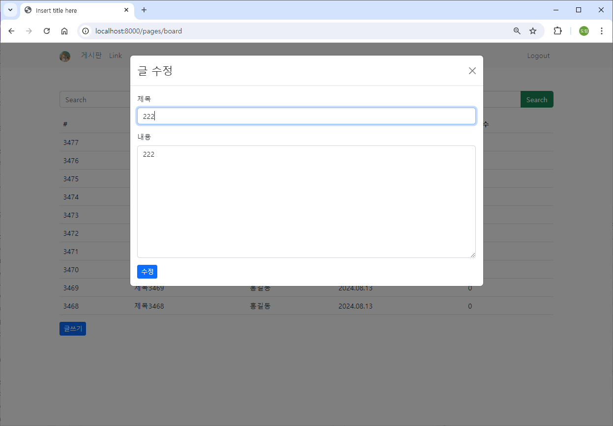

## 게시글 삭제

### src/main/java/com/mycom/myapp/board/dao/BoardDao.java

```java
package com.mycom.myapp.board.dao;

import java.util.List;

import org.apache.ibatis.annotations.Mapper;

import com.mycom.myapp.board.dto.BoardDto;
import com.mycom.myapp.board.dto.BoardParamDto;

@Mapper
public interface BoardDao {
	List<BoardDto> listBoard(BoardParamDto boardParamDto);  // limit, offset
	BoardDto detailBoard(BoardParamDto boardParamDto);
	
	int insertBoard(BoardDto boardDto);
	int updateBoard(BoardDto boardDto);
	int deleteBoard(int boardId);
}
```

### src/main/resources/mapper/board-mapper.xml

```java
<?xml version="1.0" encoding="UTF-8" ?>
<!DOCTYPE mapper
    PUBLIC "-//mybatis.org//DTD Mapper 3.0//EN"
    "http://mybatis.org/dtd/mybatis-3-mapper.dtd">
<mapper namespace="com.mycom.myapp.board.dao.BoardDao">
	
	<!-- parameterType에 map 대신 com.mycom.myapp.board.dto.BoardParamDto를 사용해도 된다. -->
	<select id="listBoard" parameterType="map" resultType="com.mycom.myapp.board.dto.BoardDto">
		select b.board_id, u.user_name, b.title, b.content, b.reg_dt, b.read_count
		  from board b, users u
		 where b.user_seq = u.user_seq
		 order by b.board_id desc
		 limit #{limit} offset #{offset}
	</select>
	
	<select id="detailBoard" parameterType="int" resultType="com.mycom.myapp.board.dto.BoardDto">
		select b.board_id, u.user_seq, u.user_name, u.user_profile_image, b.title, b.content, b.reg_dt, b.read_count
		  from board b, users u
		 where b.board_id = #{boardId} 
		   and b.user_seq = u.user_seq
	</select>
	
	<insert id="insertBoard" parameterType="com.mycom.myapp.board.dto.BoardDto">
		insert into board ( user_seq, title, content, reg_dt, read_count )
			values ( #{userSeq}, #{title}, #{content}, now(), 0 );
	</insert>
	
	<update id="updateBoard" parameterType="com.mycom.myapp.board.dto.BoardDto">
		update board 
		   set title = #{title}, 
		   	   content = #{content}
		 where board_id = #{boardId}
	</update>
	
	<delete id="deleteBoard" parameterType="int">
		delete from board where board_id = #{board}
	</delete>

</mapper>    
```

### src/main/java/com/mycom/myapp/board/service

### BoardService.java

```java
package com.mycom.myapp.board.service;

import com.mycom.myapp.board.dto.BoardDto;
import com.mycom.myapp.board.dto.BoardParamDto;
import com.mycom.myapp.board.dto.BoardResultDto;

public interface BoardService {
	BoardResultDto listBoard(BoardParamDto boardParamDto);  // limit, offset
	BoardResultDto detailBoard(BoardParamDto boardParamDto);
	
	BoardResultDto insertBoard(BoardDto boardDto);
	BoardResultDto updateBoard(BoardDto boardDto);
	BoardResultDto deleteBoard(int boardId);
}
```

### BoardServiceImpl.java

```java
package com.mycom.myapp.board.service;

import java.util.List;

import org.springframework.stereotype.Service;

import com.mycom.myapp.board.dao.BoardDao;
import com.mycom.myapp.board.dto.BoardDto;
import com.mycom.myapp.board.dto.BoardParamDto;
import com.mycom.myapp.board.dto.BoardResultDto;

// 서비스 layer는 복잡한 Business Logic을 처리하는 영역, 사용자 정의 오류
// 예외 처리?? 다양한 예외 처리 (사용자 정의 포함)를 통해서 보다 구체적인 처리가 가능
@Service
public class BoardServiceImpl implements BoardService {

	// BoardDao DI
	private final BoardDao boardDao;
	
	public BoardServiceImpl(BoardDao boardDao) {
		this.boardDao = boardDao;
	}
	
	@Override
	public BoardResultDto listBoard(BoardParamDto boardParamDto) {
		BoardResultDto boardResultDto = new BoardResultDto();
		
		try {
			List<BoardDto> list = boardDao.listBoard(boardParamDto);
			boardResultDto.setList(list);
			boardResultDto.setResult("success");
		} catch(Exception e) {
			e.printStackTrace();
			boardResultDto.setResult("fail");
		}
		
		return boardResultDto;
	}

	@Override
	public BoardResultDto detailBoard(BoardParamDto boardParamDto) {
		BoardResultDto boardResultDto = new BoardResultDto();
		
		try {
			BoardDto boardDto = boardDao.detailBoard(boardParamDto);
			// 글쓴이와 보는이가 같은지 여부
			if( boardDto.getUserSeq() == boardParamDto.getUserSeq()) {  // Controller에서 session으로부터 얻어서 보내준다.
				boardDto.setSameUser(true);
			} else {
				boardDto.setSameUser(false);
			}
			boardResultDto.setDto(boardDto);
			boardResultDto.setResult("success");
		} catch(Exception e) {
			e.printStackTrace();
			boardResultDto.setResult("fail");
		}
		
		return boardResultDto;
	}

	@Override
	public BoardResultDto insertBoard(BoardDto boardDto) {
		BoardResultDto boardResultDto = new BoardResultDto();
		
		try {
			
			int ret = boardDao.insertBoard(boardDto);
			
			if( ret == 1 ) boardResultDto.setResult("success");
			else boardResultDto.setResult("fail");
			
		} catch(Exception e) {
			e.printStackTrace();
			boardResultDto.setResult("fail");
		}
		return boardResultDto;
	}

	@Override
	public BoardResultDto updateBoard(BoardDto boardDto) {
		BoardResultDto boardResultDto = new BoardResultDto();
		
		try {
			
			int ret = boardDao.updateBoard(boardDto);
			
			if( ret == 1 ) boardResultDto.setResult("success");
			else boardResultDto.setResult("fail");
			
		} catch(Exception e) {
			e.printStackTrace();
			boardResultDto.setResult("fail");
		}
		return boardResultDto;
	}

	@Override
	public BoardResultDto deleteBoard(int boardId) {
		BoardResultDto boardResultDto = new BoardResultDto();
		
		try {
			
			int ret = boardDao.deleteBoard(boardId);
			
			if( ret == 1 ) boardResultDto.setResult("success");
			else boardResultDto.setResult("fail");
			
		} catch(Exception e) {
			e.printStackTrace();
			boardResultDto.setResult("fail");
		}
		return boardResultDto;
	}
	
}
```

### src/main/java/com/mycom/myapp/board/controller/BoardController.java

```java
package com.mycom.myapp.board.controller;

import org.springframework.stereotype.Controller;
import org.springframework.web.bind.annotation.GetMapping;
import org.springframework.web.bind.annotation.PathVariable;
import org.springframework.web.bind.annotation.PostMapping;
import org.springframework.web.bind.annotation.RequestMapping;
import org.springframework.web.bind.annotation.ResponseBody;

import com.mycom.myapp.board.dto.BoardDto;
import com.mycom.myapp.board.dto.BoardParamDto;
import com.mycom.myapp.board.dto.BoardResultDto;
import com.mycom.myapp.board.service.BoardService;
import com.mycom.myapp.user.dto.UserDto;

import jakarta.servlet.http.HttpSession;

@Controller
@RequestMapping("/boards")
public class BoardController {
	
	// BoardService DI
	private final BoardService boardService;
	
	public BoardController(BoardService boardService) {
		this.boardService = boardService;
	}
	
	@GetMapping("/list")  // limit, offset parameter를 포함하는 요청
	@ResponseBody
	private BoardResultDto listBoard(BoardParamDto boardParamDto) {
		return boardService.listBoard(boardParamDto);
	}
	
	@GetMapping("/detail/{boardId}")  // limit, offset parameter를 포함하는 요청
	@ResponseBody
	private BoardResultDto detailBoard(@PathVariable int boardId, HttpSession session) {
		BoardParamDto boardParamDto = new BoardParamDto();
		boardParamDto.setBoardId(boardId);
		int userSeq = ((UserDto) session.getAttribute("userDto")).getUserSeq();  // login할 때 session에 담은 객체
		boardParamDto.setUserSeq(userSeq);
		return boardService.detailBoard(boardParamDto);
	}
	
	@PostMapping("/insert")
	@ResponseBody
	private BoardResultDto insertBoard(BoardDto boardDto, HttpSession session) {
		int userSeq = ((UserDto) session.getAttribute("userDto")).getUserSeq();  // login할 때 session에 담은 객체
		boardDto.setUserSeq(userSeq);
		return boardService.insertBoard(boardDto);
	}
	
	@PostMapping("/update")
	@ResponseBody
	private BoardResultDto updateBoard(BoardDto boardDto) {
		return boardService.updateBoard(boardDto);
	}
	
	@GetMapping("/delete/{boardId}")  
	@ResponseBody
	private BoardResultDto deleteBoard(@PathVariable int boardId) {
		return boardService.deleteBoard(boardId);
	}

}
```

### src/main/webapp/WEB-INF/jsp/board.jsp

```java
<%@ page language="java" contentType="text/html; charset=UTF-8" pageEncoding="UTF-8"%>
<%@ page import="com.mycom.myapp.user.dto.UserDto" %>
<%
	// Back Forward Cache (BFCache)
	response.setHeader("Cache-Control", "no-cache, no-store, must-revalidate");
%>
<%
	UserDto userDto = (UserDto) session.getAttribute("userDto");
	System.out.println(userDto);
%>
<!DOCTYPE html>
<html>
<head>
<meta charset="UTF-8">

<link href="https://cdn.jsdelivr.net/npm/bootstrap@5.2.3/dist/css/bootstrap.min.css" rel="stylesheet" integrity="sha384-rbsA2VBKQhggwzxH7pPCaAqO46MgnOM80zW1RWuH61DGLwZJEdK2Kadq2F9CUG65" crossorigin="anonymous">
<script src="https://cdn.jsdelivr.net/npm/bootstrap@5.2.3/dist/js/bootstrap.bundle.min.js" integrity="sha384-kenU1KFdBIe4zVF0s0G1M5b4hcpxyD9F7jL+jjXkk+Q2h455rYXK/7HAuoJl+0I4" crossorigin="anonymous"></script>

<script src="//cdn.jsdelivr.net/npm/alertifyjs@1.12.0/build/alertify.min.js"></script>
<link rel="stylesheet" href="//cdn.jsdelivr.net/npm/alertifyjs@1.12.0/build/css/alertify.min.css"/>
<link rel="stylesheet" href="//cdn.jsdelivr.net/npm/alertifyjs@1.12.0/build/css/themes/default.min.css"/>

<title>Insert title here</title>
</head>
<body>

	<nav class="navbar navbar-expand-lg bg-light">
  <div class="container">
    <a class="navbar-brand" href="#">" style="width:24px; height: 24px; border-radius: 50%;"></a>
    <button class="navbar-toggler" type="button" data-bs-toggle="collapse" data-bs-target="#navbarSupportedContent" aria-controls="navbarSupportedContent" aria-expanded="false" aria-label="Toggle navigation">
      <span class="navbar-toggler-icon"></span>
    </button>
    <div class="collapse navbar-collapse" id="navbarSupportedContent">
      <ul class="navbar-nav me-auto">
        <li class="nav-item">
          <a class="nav-link" href="/pages/board">게시판</a>
        </li>
        <li class="nav-item">
          <a class="nav-link" href="#">Link</a>
        </li>
      </ul>
      
      <ul class="navbar-nav">
        <li class="nav-item">
          <a class="nav-link" href="/auth/logout">Logout</a>
        </li>
      </ul>
      
    </div>
  </div>
</nav>

<div class="container mt-3">
  <h4 class="text-center">게시판</h4>       
  
    <div class="input-group mb-3">
      <input id="inputSearchWord" type="text" class="form-control" placeholder="Search">
      <button id="btnSearchWord" class="btn btn-success" type="button">Search</button>
    </div>
    <table class="table table-hover">
        <thead>
            <tr>
                <th>#</th>
                <th>제목</th>
                <th>작성자</th>
                <th>작성일시</th>
                <th>조회수</th>
            </tr>
        </thead>
        <tbody id="boardTbody">
        </tbody>
    </table>
   
    <div id="paginationWrapper"></div>
    <button class="btn btn-sm btn-primary" id="btnInsertPage">글쓰기</button>
</div>

<!-- insert Modal -->
<div class="modal" tabindex="-1" id="insertBoardModal">
  <div class="modal-dialog modal-lg">
    <div class="modal-content">
      <div class="modal-header">
        <h4 class="modal-title">글 쓰기</h4>
        <button type="button" class="btn-close" data-bs-dismiss="modal" aria-label="Close"></button>
      </div>
      <div class="modal-body">
      
      	<div class="mb-3">
  			<label for="titleInsert" class="form-label">제목</label>
  			<input type="text" class="form-control" id="titleInsert">
		</div>
		<div class="mb-3">
  			<label for="contentInsert" class="form-label">내용</label>
  			<textarea class="form-control" id="contentInsert" rows="10"></textarea>
		</div>
      
      <button id="btnBoardInsert" class="btn btn-sm btn-primary btn-outline" data-bs-dismiss="modal" type="button">등록</button>
      
      </div>
    </div>
  </div>
</div>

<!-- update Modal -->
<div class="modal" tabindex="-1" id="updateBoardModal">
  <div class="modal-dialog modal-lg">
    <div class="modal-content">
      <div class="modal-header">
        <h4 class="modal-title">글 수정</h4>
        <button type="button" class="btn-close" data-bs-dismiss="modal" aria-label="Close"></button>
      </div>
      <div class="modal-body">
      
      	<div class="mb-3">
  			<label for="titleUpdate" class="form-label">제목</label>
  			<input type="text" class="form-control" id="titleUpdate">
		</div>
		<div class="mb-3">
  			<label for="contentUpdate" class="form-label">내용</label>
  			<textarea class="form-control" id="contentUpdate" rows="10"></textarea>
		</div>
      
      <button id="btnBoardUpdate" class="btn btn-sm btn-primary btn-outline" data-bs-dismiss="modal" type="button">수정</button>
      
      </div>
    </div>
  </div>
</div>

<!-- detail Modal -->
<div class="modal" tabindex="-1" id="detailBoardModal">
  <div class="modal-dialog modal-lg">
    <div class="modal-content">
      <div class="modal-header">
        <h4 class="modal-title">글 상세</h4>
        <button type="button" class="btn-close" data-bs-dismiss="modal" aria-label="Close"></button>
      </div>
      <div class="modal-body">
      
      <div class="example table-responsive">
      	<table class="table">
        	<tbody>
            	<tr><td>글번호</td><td id="boardIdDetail">#</td></tr>
                <tr><td>제목</td><td id="titleDetail">#</td></tr>
                <tr><td>내용</td><td id="contentDetail">#</td></tr>
                <tr><td>작성자</td><td id="userNameDetail">#</td></tr>
                <tr><td>작성일시</td><td id="regDtDetail">#</td></tr>
                <tr><td>조회수</td><td id="readCountDetail">#</td></tr>
            </tbody>
        </table>
      </div>
      
      <button id="btnBoardUpdateForm" class="btn btn-sm btn-primary btn-outline" data-bs-dismiss="modal" type="button">글 수정하기</button>
      <button id="btnBoardDeleteConfirm" class="btn btn-sm btn-warning btn-outline" data-bs-dismiss="modal" type="button">글 삭제하기</button>
      
      </div>
    </div>
  </div>
</div>

<script src="/assets/js/util.js"></script>
<script>
    let LIST_ROW_COUNT = 10;
    let OFFSET = 0;
    
    window.onload = function(){
        
        listBoard();
        
        // 글 등록 모달    
        document.querySelector("#btnInsertPage").onclick = function() {
        	document.querySelector("#titleInsert").value = '';
    		document.querySelector("#contentInsert").value = '';
	     	// bootstrap 5 modal show  
	        let modal = new bootstrap.Modal(document.querySelector("#insertBoardModal"), { keyboard : false });
	        modal.show();
        }
        
        // 글 등록
        document.querySelector("#btnBoardInsert").onclick = function() {
        	if( document.querySelector("#titleInsert").value.length > 0 && document.querySelector("#contentInsert").value.length > 0 ) {
        		insertBoard();
        	}
        }
        
        // 글 수정 모달  btnBoardUpdateForm
        document.querySelector("#btnBoardUpdateForm").onclick = function() {
        	// 수정 글 boardId  
        	let boardId = document.querySelector("#detailBoardModal").getAttribute("data-boardId");
        	document.querySelector("#updateBoardModal").setAttribute("data-boardId", boardId);
        	
        	// 글 제목, 내용은 detailModal로부터
        	document.querySelector("#titleUpdate").value = document.querySelector("#titleDetail").innerHTML;
        	document.querySelector("#contentUpdate").value = document.querySelector("#contentDetail").innerHTML;
        	
        	// bootstrap 5 modal show  
            let modal = new bootstrap.Modal(document.querySelector("#updateBoardModal"), { keyboard : false });
            modal.show();
        }
        
    	 // 글 수정
        document.querySelector("#btnBoardUpdate").onclick = function() {
        	if( document.querySelector("#titleUpdate").value.length > 0 && document.querySelector("#contentUpdate").value.length > 0 ) {
        		UpdateBoard();
        	}
        }
    	 
    	// 글 삭제  
        document.querySelector("#btnBoardDeleteConfirm").onclick = function() {
    		alertify.confirm('삭제 확인', '이 글을 삭제하시겠습니까?', 
    		function(){
    			deleteBoard();
    		}, function(){
    			console.log("삭제 취소");
    		});
    	}
        
    }
    
    async function listBoard() {
        let url = "/boards/list"
        let urlParams = "?limit=" + LIST_ROW_COUNT + "&offset=" + OFFSET
        let response = await fetch(url + urlParams);
        let data = await response.json();
        
        if( data.result == "success" ){ // 게시판 페이지 이동
            //console.log(data);
            //console.log(data.list);
        	makeListHtml(data.list);
        }else if( data.result == "fail" ){
            alert("글 조회 과정에서 오류가 발생했습니다.");
        }
    }
    
    function makeListHtml(list) {
    	
    	let listHTML = ``;
        
        list.forEach( el => {
            let boardId = el.boardId;
            let userName = el.userName;
            let title = el.title;
            let content = el.content;
            let regDt = el.regDt;
            // LocalDateTime 객체 -> json 처리 결과물이 gon, jackson 2가지가 다르다.
            // console.log(regDt);
            let regDtStr = makeDateStr(regDt.date.year, regDt.date.month, regDt.date.day, '.'); 
            let readCount = el.readCount;
            
            listHTML += `<tr style="cursor:pointer" data-boardId=\${boardId}><td>\${boardId}</td><td>\${title}</td><td>\${userName}</td><td>\${regDtStr}</td><td>\${readCount}</td></tr>`;
        });
        
        document.querySelector("#boardTbody").innerHTML = listHTML;
        
        document.querySelectorAll("#boardTbody tr").forEach( el => {
        	el.onclick = function() {  // 이때 this는 el이다. // 애로우 function에서는 this를 사용할 수 없다. e를 매개변수로 받아 e.target.getAttribute으로 사용해야 한다.
        		let boardId = this.getAttribute("data-boardId");
        		detailBoard(boardId);
        	}
        });
    	
    }
    
    async function detailBoard(boardId) {
        let url = "/boards/detail/" + boardId;
        
        let response = await fetch(url);
        let data = await response.json();
        
        if( data.result == "success" ){ // 게시판 페이지 이동

        	makeDetailHTML(data.dto);
        	
        }else if( data.result == "fail" ){
            alert("글 상세 조회 과정에서 오류가 발생했습니다.");
        }
    }
    
    function makeDetailHTML(detail) {
    	let boardId = detail.boardId;
        let userSeq = detail.userSeq;
        let userName = detail.userName;
        let title = detail.title;
        let content = detail.content;
        let regDt = detail.regDt;
        let regDtStr = makeDateStr(regDt.date.year, regDt.date.month, regDt.date.day, '.') + ' ' + makeTimeStr(regDt.time.hour, regDt.time.minute, regDt.time.second, ':'); // for Gson Format Of LocalDateTime
        
        let readCount = detail.readCount;
        let sameUser = detail.sameUser;
        
        document.querySelector("#detailBoardModal").setAttribute("data-boardId", boardId);
        document.querySelector("#boardIdDetail").innerHTML = "#" + boardId;
        document.querySelector("#titleDetail").innerHTML = title;
        document.querySelector("#contentDetail").innerHTML = content;
        document.querySelector("#userNameDetail").innerHTML = userName;
        document.querySelector("#regDtDetail").innerHTML = regDtStr;
        document.querySelector("#readCountDetail").innerHTML = readCount;
        
        if( sameUser ){ // 작성자와 조회자가 같으면 버튼 보여주기
            document.querySelector("#btnBoardUpdateForm").style.display = "inline-block";
            document.querySelector("#btnBoardDeleteConfirm").style.display = "inline-block";
        }else{  // 작성자와 조회자가 다르면 버튼 숨기기
            document.querySelector("#btnBoardUpdateForm").style.display = "none";
            document.querySelector("#btnBoardDeleteConfirm").style.display = "none";
        }
        
        // bootstrap 5 modal show  
        let modal = new bootstrap.Modal(document.querySelector("#detailBoardModal"), { keyboard : false });
        modal.show();
    }
    
    async function insertBoard(boardId) {
    	let urlParams = new URLSearchParams({
    		title : document.querySelector("#titleInsert").value,
    		content : document.querySelector("#contentInsert").value
    	});
    	
        let url = "/boards/insert";
        
        let fetchOptions = {
        	method : 'POST',
        	body : urlParams
        }
        
        let response = await fetch(url, fetchOptions);
        let data = await response.json();
        
        if( data.result == "success" ){ // 게시판 페이지 이동

        	alertify.success('글이 등록되었습니다.');
        	listBoard();
        	
        }else if( data.result == "fail" ){
            alert("글 등록 과정에서 오류가 발생했습니다.");
        }
    }
    
    async function UpdateBoard() {
    	
    	let boardId = document.querySelector("#updateBoardModal").getAttribute("data-boardId");
    	
    	let urlParams = new URLSearchParams({
    		boardId : boardId,
    		title : document.querySelector("#titleUpdate").value,
    		content : document.querySelector("#contentUpdate").value
    	});
    	
        let url = "/boards/update";
        
        let fetchOptions = {
        	method : 'POST',
        	body : urlParams
        }
        
        let response = await fetch(url, fetchOptions);
        let data = await response.json();
        
        if( data.result == "success" ){ // 게시판 페이지 이동

        	alertify.success('글이 수정되었습니다.');
        	listBoard();
        	
        }else if( data.result == "fail" ){
            alert("글 수정 과정에서 오류가 발생했습니다.");
        }
    }
    
	async function deleteBoard() {
    	
    	let boardId = document.querySelector("#detailBoardModal").getAttribute("data-boardId");
    	
        let url = "/boards/delete/" + boardId;
        
        let response = await fetch(url);
        let data = await response.json();
        
        if( data.result == "success" ){ // 게시판 페이지 이동

        	alertify.success('글이 삭제되었습니다.');
        	listBoard();
        	
        }else if( data.result == "fail" ){
            alert("글 삭제 과정에서 오류가 발생했습니다.");
        }
    }
    
</script>

</body>
</html>
```

### 실행 결과

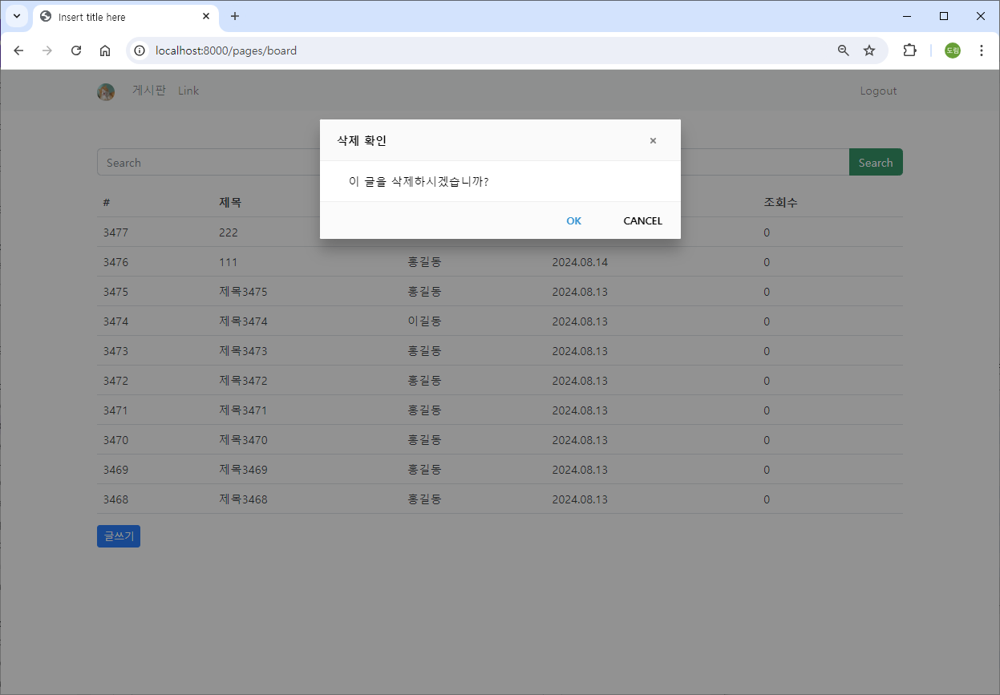

## 게시글 검색어 조회

### src/main/java/com/mycom/myapp/board/dao/BoardDao.java

```java
package com.mycom.myapp.board.dao;

import java.util.List;

import org.apache.ibatis.annotations.Mapper;

import com.mycom.myapp.board.dto.BoardDto;
import com.mycom.myapp.board.dto.BoardParamDto;

@Mapper
public interface BoardDao {
	List<BoardDto> listBoard(BoardParamDto boardParamDto);  // limit, offset
	List<BoardDto> listBoardSearchWord(BoardParamDto boardParamDto);  // limit, offset, searchWord
	BoardDto detailBoard(BoardParamDto boardParamDto);
	
	int insertBoard(BoardDto boardDto);
	int updateBoard(BoardDto boardDto);
	int deleteBoard(int boardId);
}
```

### src/main/resources/mapper/board-mapper.xml

```java
<?xml version="1.0" encoding="UTF-8" ?>
<!DOCTYPE mapper
    PUBLIC "-//mybatis.org//DTD Mapper 3.0//EN"
    "http://mybatis.org/dtd/mybatis-3-mapper.dtd">
<mapper namespace="com.mycom.myapp.board.dao.BoardDao">
	
	<!-- parameterType에 map 대신 com.mycom.myapp.board.dto.BoardParamDto를 사용해도 된다. -->
	<select id="listBoard" parameterType="map" resultType="com.mycom.myapp.board.dto.BoardDto">
		select b.board_id, u.user_name, b.title, b.content, b.reg_dt, b.read_count
		  from board b, users u
		 where b.user_seq = u.user_seq
		 order by b.board_id desc
		 limit #{limit} offset #{offset}
	</select>
	
	<select id="listBoardSearchWord" parameterType="map" resultType="com.mycom.myapp.board.dto.BoardDto">
		select b.board_id, u.user_name, b.title, b.content, b.reg_dt, b.read_count
		  from board b, users u
		 where b.user_seq = u.user_seq
		   and b.title like concat( '%', #{searchWord}, '%' )
		 order by b.board_id desc
		 limit #{limit} offset #{offset}
	</select>
	
	<select id="detailBoard" parameterType="int" resultType="com.mycom.myapp.board.dto.BoardDto">
		select b.board_id, u.user_seq, u.user_name, u.user_profile_image, b.title, b.content, b.reg_dt, b.read_count
		  from board b, users u
		 where b.board_id = #{boardId} 
		   and b.user_seq = u.user_seq
	</select>
	
	<insert id="insertBoard" parameterType="com.mycom.myapp.board.dto.BoardDto">
		insert into board ( user_seq, title, content, reg_dt, read_count )
			values ( #{userSeq}, #{title}, #{content}, now(), 0 );
	</insert>
	
	<update id="updateBoard" parameterType="com.mycom.myapp.board.dto.BoardDto">
		update board 
		   set title = #{title}, 
		   	   content = #{content}
		 where board_id = #{boardId}
	</update>
	
	<delete id="deleteBoard" parameterType="int">
		delete from board where board_id = #{board}
	</delete>

</mapper>    
```

### src/main/java/com/mycom/myapp/board/service

### BoardService.java

```java
package com.mycom.myapp.board.service;

import com.mycom.myapp.board.dto.BoardDto;
import com.mycom.myapp.board.dto.BoardParamDto;
import com.mycom.myapp.board.dto.BoardResultDto;

public interface BoardService {
	BoardResultDto listBoard(BoardParamDto boardParamDto);  // limit, offset
	BoardResultDto listBoardSearchWord(BoardParamDto boardParamDto);  // limit, offset
	BoardResultDto detailBoard(BoardParamDto boardParamDto);
	
	BoardResultDto insertBoard(BoardDto boardDto);
	BoardResultDto updateBoard(BoardDto boardDto);
	BoardResultDto deleteBoard(int boardId);
}
```

### BoardServiceImpl.java

```java
package com.mycom.myapp.board.service;

import java.util.List;

import org.springframework.stereotype.Service;

import com.mycom.myapp.board.dao.BoardDao;
import com.mycom.myapp.board.dto.BoardDto;
import com.mycom.myapp.board.dto.BoardParamDto;
import com.mycom.myapp.board.dto.BoardResultDto;

// 서비스 layer는 복잡한 Business Logic을 처리하는 영역, 사용자 정의 오류
// 예외 처리?? 다양한 예외 처리 (사용자 정의 포함)를 통해서 보다 구체적인 처리가 가능
@Service
public class BoardServiceImpl implements BoardService {

	// BoardDao DI
	private final BoardDao boardDao;
	
	public BoardServiceImpl(BoardDao boardDao) {
		this.boardDao = boardDao;
	}
	
	@Override
	public BoardResultDto listBoard(BoardParamDto boardParamDto) {
		BoardResultDto boardResultDto = new BoardResultDto();
		
		try {
			List<BoardDto> list = boardDao.listBoard(boardParamDto);
			boardResultDto.setList(list);
			boardResultDto.setResult("success");
		} catch(Exception e) {
			e.printStackTrace();
			boardResultDto.setResult("fail");
		}
		
		return boardResultDto;
	}

	@Override
	public BoardResultDto listBoardSearchWord(BoardParamDto boardParamDto) {
		BoardResultDto boardResultDto = new BoardResultDto();
		
		try {
			List<BoardDto> list = boardDao.listBoardSearchWord(boardParamDto);
			boardResultDto.setList(list);
			boardResultDto.setResult("success");
		} catch(Exception e) {
			e.printStackTrace();
			boardResultDto.setResult("fail");
		}
		
		return boardResultDto;
	}

	@Override
	public BoardResultDto detailBoard(BoardParamDto boardParamDto) {
		BoardResultDto boardResultDto = new BoardResultDto();
		
		try {
			BoardDto boardDto = boardDao.detailBoard(boardParamDto);
			// 글쓴이와 보는이가 같은지 여부
			if( boardDto.getUserSeq() == boardParamDto.getUserSeq()) {  // Controller에서 session으로부터 얻어서 보내준다.
				boardDto.setSameUser(true);
			} else {
				boardDto.setSameUser(false);
			}
			boardResultDto.setDto(boardDto);
			boardResultDto.setResult("success");
		} catch(Exception e) {
			e.printStackTrace();
			boardResultDto.setResult("fail");
		}
		
		return boardResultDto;
	}

	@Override
	public BoardResultDto insertBoard(BoardDto boardDto) {
		BoardResultDto boardResultDto = new BoardResultDto();
		
		try {
			
			int ret = boardDao.insertBoard(boardDto);
			
			if( ret == 1 ) boardResultDto.setResult("success");
			else boardResultDto.setResult("fail");
			
		} catch(Exception e) {
			e.printStackTrace();
			boardResultDto.setResult("fail");
		}
		return boardResultDto;
	}

	@Override
	public BoardResultDto updateBoard(BoardDto boardDto) {
		BoardResultDto boardResultDto = new BoardResultDto();
		
		try {
			
			int ret = boardDao.updateBoard(boardDto);
			
			if( ret == 1 ) boardResultDto.setResult("success");
			else boardResultDto.setResult("fail");
			
		} catch(Exception e) {
			e.printStackTrace();
			boardResultDto.setResult("fail");
		}
		return boardResultDto;
	}

	@Override
	public BoardResultDto deleteBoard(int boardId) {
		BoardResultDto boardResultDto = new BoardResultDto();
		
		try {
			
			int ret = boardDao.deleteBoard(boardId);
			
			if( ret == 1 ) boardResultDto.setResult("success");
			else boardResultDto.setResult("fail");
			
		} catch(Exception e) {
			e.printStackTrace();
			boardResultDto.setResult("fail");
		}
		return boardResultDto;
	}

}
```

### src/main/java/com/mycom/myapp/board/controller/BoardController.java

```java
package com.mycom.myapp.board.controller;

import org.apache.logging.log4j.util.Strings;
import org.springframework.stereotype.Controller;
import org.springframework.web.bind.annotation.GetMapping;
import org.springframework.web.bind.annotation.PathVariable;
import org.springframework.web.bind.annotation.PostMapping;
import org.springframework.web.bind.annotation.RequestMapping;
import org.springframework.web.bind.annotation.ResponseBody;

import com.mycom.myapp.board.dto.BoardDto;
import com.mycom.myapp.board.dto.BoardParamDto;
import com.mycom.myapp.board.dto.BoardResultDto;
import com.mycom.myapp.board.service.BoardService;
import com.mycom.myapp.user.dto.UserDto;

import jakarta.servlet.http.HttpSession;

@Controller
@RequestMapping("/boards")
public class BoardController {
	
	// BoardService DI
	private final BoardService boardService;
	
	public BoardController(BoardService boardService) {
		this.boardService = boardService;
	}
	
	@GetMapping("/list")  // limit, offset parameter를 포함하는 요청
	@ResponseBody
	private BoardResultDto listBoard(BoardParamDto boardParamDto) {
		// searchWord 포함여부에 따라서 분리
		BoardResultDto boardResultDto;
		
		if( Strings.isEmpty( boardParamDto.getSearchWord() ) ) {   // 검색어가 없는 경우
			boardResultDto = boardService.listBoard(boardParamDto);
		} else {
			boardResultDto = boardService.listBoardSearchWord(boardParamDto);
		}
		
		return boardResultDto;
	}
	
	@GetMapping("/detail/{boardId}")  // limit, offset parameter를 포함하는 요청
	@ResponseBody
	private BoardResultDto detailBoard(@PathVariable int boardId, HttpSession session) {
		BoardParamDto boardParamDto = new BoardParamDto();
		boardParamDto.setBoardId(boardId);
		int userSeq = ((UserDto) session.getAttribute("userDto")).getUserSeq();  // login할 때 session에 담은 객체
		boardParamDto.setUserSeq(userSeq);
		return boardService.detailBoard(boardParamDto);
	}
	
	@PostMapping("/insert")
	@ResponseBody
	private BoardResultDto insertBoard(BoardDto boardDto, HttpSession session) {
		int userSeq = ((UserDto) session.getAttribute("userDto")).getUserSeq();  // login할 때 session에 담은 객체
		boardDto.setUserSeq(userSeq);
		return boardService.insertBoard(boardDto);
	}
	
	@PostMapping("/update")
	@ResponseBody
	private BoardResultDto updateBoard(BoardDto boardDto) {
		return boardService.updateBoard(boardDto);
	}
	
	@GetMapping("/delete/{boardId}")  
	@ResponseBody
	private BoardResultDto deleteBoard(@PathVariable int boardId) {
		return boardService.deleteBoard(boardId);
	}

}
```

### src/main/webapp/WEB-INF/jsp/board.jsp

```java
<%@ page language="java" contentType="text/html; charset=UTF-8" pageEncoding="UTF-8"%>
<%@ page import="com.mycom.myapp.user.dto.UserDto" %>
<%
	// Back Forward Cache (BFCache)
	response.setHeader("Cache-Control", "no-cache, no-store, must-revalidate");
%>
<%
	UserDto userDto = (UserDto) session.getAttribute("userDto");
	System.out.println(userDto);
%>
<!DOCTYPE html>
<html>
<head>
<meta charset="UTF-8">

<link href="https://cdn.jsdelivr.net/npm/bootstrap@5.2.3/dist/css/bootstrap.min.css" rel="stylesheet" integrity="sha384-rbsA2VBKQhggwzxH7pPCaAqO46MgnOM80zW1RWuH61DGLwZJEdK2Kadq2F9CUG65" crossorigin="anonymous">
<script src="https://cdn.jsdelivr.net/npm/bootstrap@5.2.3/dist/js/bootstrap.bundle.min.js" integrity="sha384-kenU1KFdBIe4zVF0s0G1M5b4hcpxyD9F7jL+jjXkk+Q2h455rYXK/7HAuoJl+0I4" crossorigin="anonymous"></script>

<script src="//cdn.jsdelivr.net/npm/alertifyjs@1.12.0/build/alertify.min.js"></script>
<link rel="stylesheet" href="//cdn.jsdelivr.net/npm/alertifyjs@1.12.0/build/css/alertify.min.css"/>
<link rel="stylesheet" href="//cdn.jsdelivr.net/npm/alertifyjs@1.12.0/build/css/themes/default.min.css"/>

<title>Insert title here</title>
</head>
<body>

	<nav class="navbar navbar-expand-lg bg-light">
  <div class="container">
    <a class="navbar-brand" href="#">" style="width:24px; height: 24px; border-radius: 50%;"></a>
    <button class="navbar-toggler" type="button" data-bs-toggle="collapse" data-bs-target="#navbarSupportedContent" aria-controls="navbarSupportedContent" aria-expanded="false" aria-label="Toggle navigation">
      <span class="navbar-toggler-icon"></span>
    </button>
    <div class="collapse navbar-collapse" id="navbarSupportedContent">
      <ul class="navbar-nav me-auto">
        <li class="nav-item">
          <a class="nav-link" href="/pages/board">게시판</a>
        </li>
        <li class="nav-item">
          <a class="nav-link" href="#">Link</a>
        </li>
      </ul>
      
      <ul class="navbar-nav">
        <li class="nav-item">
          <a class="nav-link" href="/auth/logout">Logout</a>
        </li>
      </ul>
      
    </div>
  </div>
</nav>

<div class="container mt-3">
  <h4 class="text-center">게시판</h4>       
  
    <div class="input-group mb-3">
      <input id="inputSearchWord" type="text" class="form-control" placeholder="Search">
      <button id="btnSearchWord" class="btn btn-success" type="button">Search</button>
    </div>
    <table class="table table-hover">
        <thead>
            <tr>
                <th>#</th>
                <th>제목</th>
                <th>작성자</th>
                <th>작성일시</th>
                <th>조회수</th>
            </tr>
        </thead>
        <tbody id="boardTbody">
        </tbody>
    </table>
   
    <div id="paginationWrapper"></div>
    <button class="btn btn-sm btn-primary" id="btnInsertPage">글쓰기</button>
</div>

<!-- insert Modal -->
<div class="modal" tabindex="-1" id="insertBoardModal">
  <div class="modal-dialog modal-lg">
    <div class="modal-content">
      <div class="modal-header">
        <h4 class="modal-title">글 쓰기</h4>
        <button type="button" class="btn-close" data-bs-dismiss="modal" aria-label="Close"></button>
      </div>
      <div class="modal-body">
      
      	<div class="mb-3">
  			<label for="titleInsert" class="form-label">제목</label>
  			<input type="text" class="form-control" id="titleInsert">
		</div>
		<div class="mb-3">
  			<label for="contentInsert" class="form-label">내용</label>
  			<textarea class="form-control" id="contentInsert" rows="10"></textarea>
		</div>
      
      <button id="btnBoardInsert" class="btn btn-sm btn-primary btn-outline" data-bs-dismiss="modal" type="button">등록</button>
      
      </div>
    </div>
  </div>
</div>

<!-- update Modal -->
<div class="modal" tabindex="-1" id="updateBoardModal">
  <div class="modal-dialog modal-lg">
    <div class="modal-content">
      <div class="modal-header">
        <h4 class="modal-title">글 수정</h4>
        <button type="button" class="btn-close" data-bs-dismiss="modal" aria-label="Close"></button>
      </div>
      <div class="modal-body">
      
      	<div class="mb-3">
  			<label for="titleUpdate" class="form-label">제목</label>
  			<input type="text" class="form-control" id="titleUpdate">
		</div>
		<div class="mb-3">
  			<label for="contentUpdate" class="form-label">내용</label>
  			<textarea class="form-control" id="contentUpdate" rows="10"></textarea>
		</div>
      
      <button id="btnBoardUpdate" class="btn btn-sm btn-primary btn-outline" data-bs-dismiss="modal" type="button">수정</button>
      
      </div>
    </div>
  </div>
</div>

<!-- detail Modal -->
<div class="modal" tabindex="-1" id="detailBoardModal">
  <div class="modal-dialog modal-lg">
    <div class="modal-content">
      <div class="modal-header">
        <h4 class="modal-title">글 상세</h4>
        <button type="button" class="btn-close" data-bs-dismiss="modal" aria-label="Close"></button>
      </div>
      <div class="modal-body">
      
      <div class="example table-responsive">
      	<table class="table">
        	<tbody>
            	<tr><td>글번호</td><td id="boardIdDetail">#</td></tr>
                <tr><td>제목</td><td id="titleDetail">#</td></tr>
                <tr><td>내용</td><td id="contentDetail">#</td></tr>
                <tr><td>작성자</td><td id="userNameDetail">#</td></tr>
                <tr><td>작성일시</td><td id="regDtDetail">#</td></tr>
                <tr><td>조회수</td><td id="readCountDetail">#</td></tr>
            </tbody>
        </table>
      </div>
      
      <button id="btnBoardUpdateForm" class="btn btn-sm btn-primary btn-outline" data-bs-dismiss="modal" type="button">글 수정하기</button>
      <button id="btnBoardDeleteConfirm" class="btn btn-sm btn-warning btn-outline" data-bs-dismiss="modal" type="button">글 삭제하기</button>
      
      </div>
    </div>
  </div>
</div>

<script src="/assets/js/util.js"></script>
<script>
    let LIST_ROW_COUNT = 10;
    let OFFSET = 0;
    let SEARCH_WORD = '';
    
    window.onload = function(){
        
    	// 글 목록
        listBoard();
        
    	// 글 목록 검색어 포함
    	document.querySelector("#btnSearchWord").onclick = function() {
    		SEARCH_WORD = document.querySelector("#inputSearchWord").value;
    		
    		listBoard();
        }
    	
        // 글 등록 모달    
        document.querySelector("#btnInsertPage").onclick = function() {
        	document.querySelector("#titleInsert").value = '';
    		document.querySelector("#contentInsert").value = '';
	     	// bootstrap 5 modal show  
	        let modal = new bootstrap.Modal(document.querySelector("#insertBoardModal"), { keyboard : false });
	        modal.show();
        }
        
        // 글 등록
        document.querySelector("#btnBoardInsert").onclick = function() {
        	if( document.querySelector("#titleInsert").value.length > 0 && document.querySelector("#contentInsert").value.length > 0 ) {
        		insertBoard();
        	}
        }
        
        // 글 수정 모달  btnBoardUpdateForm
        document.querySelector("#btnBoardUpdateForm").onclick = function() {
        	// 수정 글 boardId  
        	let boardId = document.querySelector("#detailBoardModal").getAttribute("data-boardId");
        	document.querySelector("#updateBoardModal").setAttribute("data-boardId", boardId);
        	
        	// 글 제목, 내용은 detailModal로부터
        	document.querySelector("#titleUpdate").value = document.querySelector("#titleDetail").innerHTML;
        	document.querySelector("#contentUpdate").value = document.querySelector("#contentDetail").innerHTML;
        	
        	// bootstrap 5 modal show  
            let modal = new bootstrap.Modal(document.querySelector("#updateBoardModal"), { keyboard : false });
            modal.show();
        }
        
    	 // 글 수정
        document.querySelector("#btnBoardUpdate").onclick = function() {
        	if( document.querySelector("#titleUpdate").value.length > 0 && document.querySelector("#contentUpdate").value.length > 0 ) {
        		UpdateBoard();
        	}
        }
    	 
    	// 글 삭제  
        document.querySelector("#btnBoardDeleteConfirm").onclick = function() {
    		alertify.confirm('삭제 확인', '이 글을 삭제하시겠습니까?', 
    		function(){
    			deleteBoard();
    		}, function(){
    			console.log("삭제 취소");
    		});
    	}
        
    }
    
    async function listBoard() {
        let url = "/boards/list"
        let urlParams = "?limit=" + LIST_ROW_COUNT + "&offset=" + OFFSET + "&searchWord=" + SEARCH_WORD
        let response = await fetch(url + urlParams);
        let data = await response.json();
        
        if( data.result == "success" ){ // 게시판 페이지 이동
            //console.log(data);
            //console.log(data.list);
        	makeListHtml(data.list);
        }else if( data.result == "fail" ){
            alert("글 조회 과정에서 오류가 발생했습니다.");
        }
    }
    
    function makeListHtml(list) {
    	
    	let listHTML = ``;
        
        list.forEach( el => {
            let boardId = el.boardId;
            let userName = el.userName;
            let title = el.title;
            let content = el.content;
            let regDt = el.regDt;
            // LocalDateTime 객체 -> json 처리 결과물이 gon, jackson 2가지가 다르다.
            // console.log(regDt);
            let regDtStr = makeDateStr(regDt.date.year, regDt.date.month, regDt.date.day, '.'); 
            let readCount = el.readCount;
            
            listHTML += `<tr style="cursor:pointer" data-boardId=\${boardId}><td>\${boardId}</td><td>\${title}</td><td>\${userName}</td><td>\${regDtStr}</td><td>\${readCount}</td></tr>`;
        });
        
        document.querySelector("#boardTbody").innerHTML = listHTML;
        
        document.querySelectorAll("#boardTbody tr").forEach( el => {
        	el.onclick = function() {  // 이때 this는 el이다. // 애로우 function에서는 this를 사용할 수 없다. e를 매개변수로 받아 e.target.getAttribute으로 사용해야 한다.
        		let boardId = this.getAttribute("data-boardId");
        		detailBoard(boardId);
        	}
        });
    	
    }
    
    async function detailBoard(boardId) {
        let url = "/boards/detail/" + boardId;
        
        let response = await fetch(url);
        let data = await response.json();
        
        if( data.result == "success" ){ // 게시판 페이지 이동

        	makeDetailHTML(data.dto);
        	
        }else if( data.result == "fail" ){
            alert("글 상세 조회 과정에서 오류가 발생했습니다.");
        }
    }
    
    function makeDetailHTML(detail) {
    	let boardId = detail.boardId;
        let userSeq = detail.userSeq;
        let userName = detail.userName;
        let title = detail.title;
        let content = detail.content;
        let regDt = detail.regDt;
        let regDtStr = makeDateStr(regDt.date.year, regDt.date.month, regDt.date.day, '.') + ' ' + makeTimeStr(regDt.time.hour, regDt.time.minute, regDt.time.second, ':'); // for Gson Format Of LocalDateTime
        
        let readCount = detail.readCount;
        let sameUser = detail.sameUser;
        
        document.querySelector("#detailBoardModal").setAttribute("data-boardId", boardId);
        document.querySelector("#boardIdDetail").innerHTML = "#" + boardId;
        document.querySelector("#titleDetail").innerHTML = title;
        document.querySelector("#contentDetail").innerHTML = content;
        document.querySelector("#userNameDetail").innerHTML = userName;
        document.querySelector("#regDtDetail").innerHTML = regDtStr;
        document.querySelector("#readCountDetail").innerHTML = readCount;
        
        if( sameUser ){ // 작성자와 조회자가 같으면 버튼 보여주기
            document.querySelector("#btnBoardUpdateForm").style.display = "inline-block";
            document.querySelector("#btnBoardDeleteConfirm").style.display = "inline-block";
        }else{  // 작성자와 조회자가 다르면 버튼 숨기기
            document.querySelector("#btnBoardUpdateForm").style.display = "none";
            document.querySelector("#btnBoardDeleteConfirm").style.display = "none";
        }
        
        // bootstrap 5 modal show  
        let modal = new bootstrap.Modal(document.querySelector("#detailBoardModal"), { keyboard : false });
        modal.show();
    }
    
    async function insertBoard(boardId) {
    	let urlParams = new URLSearchParams({
    		title : document.querySelector("#titleInsert").value,
    		content : document.querySelector("#contentInsert").value
    	});
    	
        let url = "/boards/insert";
        
        let fetchOptions = {
        	method : 'POST',
        	body : urlParams
        }
        
        let response = await fetch(url, fetchOptions);
        let data = await response.json();
        
        if( data.result == "success" ){ // 게시판 페이지 이동

        	alertify.success('글이 등록되었습니다.');
        	listBoard();
        	
        }else if( data.result == "fail" ){
            alert("글 등록 과정에서 오류가 발생했습니다.");
        }
    }
    
    async function UpdateBoard() {
    	
    	let boardId = document.querySelector("#updateBoardModal").getAttribute("data-boardId");
    	
    	let urlParams = new URLSearchParams({
    		boardId : boardId,
    		title : document.querySelector("#titleUpdate").value,
    		content : document.querySelector("#contentUpdate").value
    	});
    	
        let url = "/boards/update";
        
        let fetchOptions = {
        	method : 'POST',
        	body : urlParams
        }
        
        let response = await fetch(url, fetchOptions);
        let data = await response.json();
        
        if( data.result == "success" ){ // 게시판 페이지 이동

        	alertify.success('글이 수정되었습니다.');
        	listBoard();
        	
        }else if( data.result == "fail" ){
            alert("글 수정 과정에서 오류가 발생했습니다.");
        }
    }
    
	async function deleteBoard() {
    	
    	let boardId = document.querySelector("#detailBoardModal").getAttribute("data-boardId");
    	
        let url = "/boards/delete/" + boardId;
        
        let response = await fetch(url);
        let data = await response.json();
        
        if( data.result == "success" ){ // 게시판 페이지 이동

        	alertify.success('글이 삭제되었습니다.');
        	listBoard();
        	
        }else if( data.result == "fail" ){
            alert("글 삭제 과정에서 오류가 발생했습니다.");
        }
    }
    
</script>

</body>
</html>
```

### 실행 결과

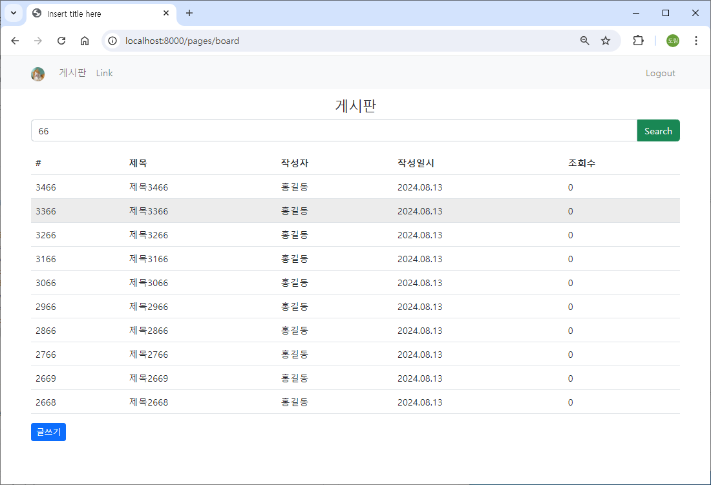

## 게시글 Pagination

https://getbootstrap.com/docs/5.2/components/pagination/

### Pagination

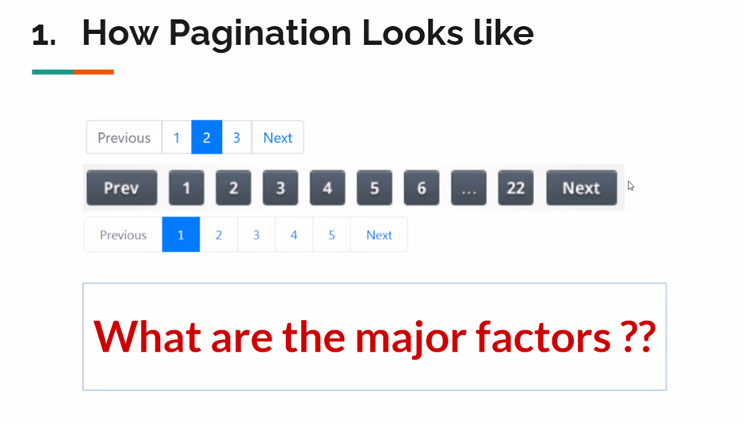

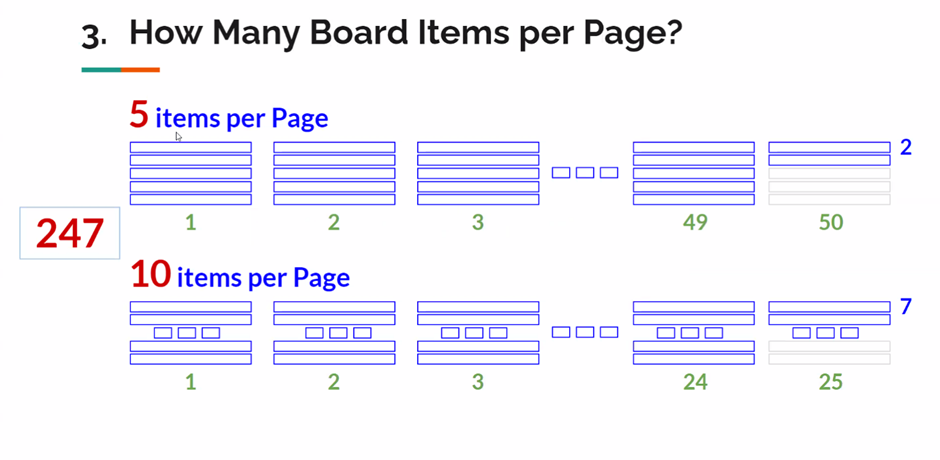

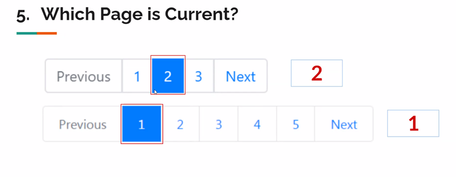

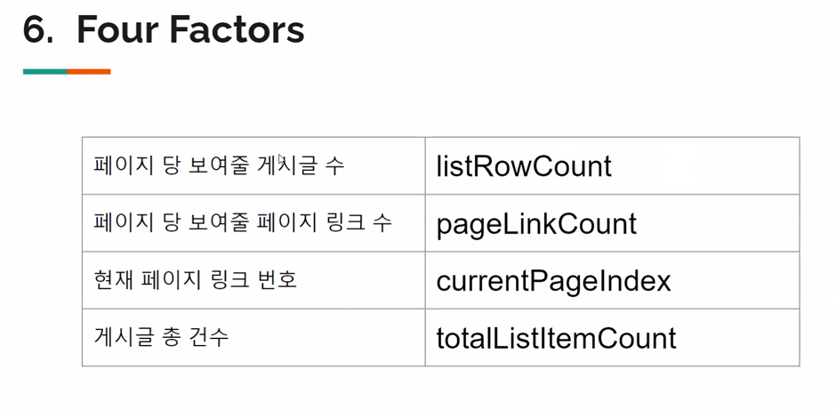

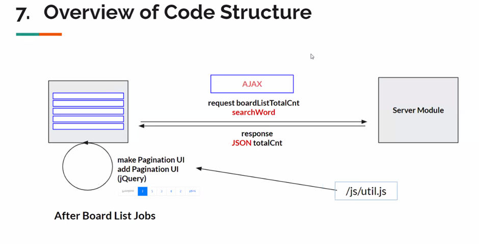

### src/main/resources/static/assets/js/util.js

- 기존 util.js에 Pagination 코드를 미리 작성해놨다.

```java
function makePaginationHtml(listRowCount, pageLinkCount, currentPageIndex, totalListItemCount, htmlTargetId){
    
    var targetUI = document.querySelector("#" + htmlTargetId);
    
    var pageCount = Math.ceil(totalListItemCount/listRowCount);
    var startPageIndex = 0;
    if( (currentPageIndex % pageLinkCount) == 0 ){ //10, 20...맨마지막
        startPageIndex = ((currentPageIndex / pageLinkCount)-1)*pageLinkCount + 1
    }else{
        startPageIndex = Math.floor(currentPageIndex / pageLinkCount)*pageLinkCount + 1
    }
    
    var endPageIndex = 0;
    if( (currentPageIndex % pageLinkCount) == 0 ){ //10, 20...맨마지막
        endPageIndex = ((currentPageIndex / pageLinkCount)-1)*pageLinkCount + pageLinkCount
    }else{
        endPageIndex = Math.floor(currentPageIndex / pageLinkCount)*pageLinkCount + pageLinkCount;
    }
    var prev;
    if( currentPageIndex <= pageLinkCount ){
        prev = false;
    }else{
        prev = true;
    }
    var next;
    if(endPageIndex > pageCount){
        endPageIndex = pageCount
        next = false;
    }else{
        next = true;
    }
    
    var paginationHtml =
        `<ul class="pagination pagination justify-content-center">`;
    if(prev){
        paginationHtml += 
            `<li class="page-item">
             <a class="page-link" href="javascript:movePage( ${(startPageIndex - 1)} )" aria-label="Previous">
             <span aria-hidden="true">&laquo;</span>
             </a>
             </li>`;
    }
    
    for(var i=startPageIndex; i<=endPageIndex; i++){
//      console.log('*** ' + i);
//      console.log(currentPageIndex);
        
        if( i == currentPageIndex ){
            paginationHtml += 
                `<li class="page-item active"><a class="page-link" href="javascript:movePage(${i})">${i}</a></li>`;           
        }else{
            paginationHtml += 
                `<li class="page-item"><a class="page-link" href="javascript:movePage(${i})">${i}</a></li>`;                  
        }
    }
    
    if(next){
        paginationHtml += 
            `<li class="page-item">
             <a class="page-link" href="javascript:movePage( ${(endPageIndex + 1)} )" aria-label="Next">
             <span aria-hidden="true">&raquo;</span>
             </a>
             </li>`;
    }
    paginationHtml += `</ul>`;
    
    targetUI.innerHTML = paginationHtml;
    
}

function makeDateStr(year, month, day, type) {
	return year + '.' + ((month < 10) ? '0' + month : month) + '.' + ((day < 10) ? '0' + day : day);
}

function makeTimeStr(hour, minute, second, type) {
	return hour + ':' + ((minute < 10) ? '0' + minute : minute) + ':' + ((second < 10) ? '0' + second : second);
}
```

### src/main/java/com/mycom/myapp/board/dao/BoardDao.java

```java
package com.mycom.myapp.board.dao;

import java.util.List;

import org.apache.ibatis.annotations.Mapper;

import com.mycom.myapp.board.dto.BoardDto;
import com.mycom.myapp.board.dto.BoardParamDto;

@Mapper
public interface BoardDao {
	List<BoardDto> listBoard(BoardParamDto boardParamDto);  // limit, offset
	int listBoardTotalCount();  // 전체 건수
	
	List<BoardDto> listBoardSearchWord(BoardParamDto boardParamDto);  // limit, offset, searchWord
	int listBoardSearchWordTotalCount(BoardParamDto boardParamDto);  // 검색어 대비 전체 건수
	
	BoardDto detailBoard(BoardParamDto boardParamDto);
	
	int insertBoard(BoardDto boardDto);
	int updateBoard(BoardDto boardDto);
	int deleteBoard(int boardId);
}
```

### src/main/resources/mapper/board-mapper.xml

```java
<?xml version="1.0" encoding="UTF-8" ?>
<!DOCTYPE mapper
    PUBLIC "-//mybatis.org//DTD Mapper 3.0//EN"
    "http://mybatis.org/dtd/mybatis-3-mapper.dtd">
<mapper namespace="com.mycom.myapp.board.dao.BoardDao">
	
	<!-- parameterType에 map 대신 com.mycom.myapp.board.dto.BoardParamDto를 사용해도 된다. -->
	<select id="listBoard" parameterType="map" resultType="com.mycom.myapp.board.dto.BoardDto">
		select b.board_id, u.user_name, b.title, b.content, b.reg_dt, b.read_count
		  from board b, users u
		 where b.user_seq = u.user_seq
		 order by b.board_id desc
		 limit #{limit} offset #{offset}
	</select>
	
	<select id="listBoardTotalCount" resultType="int">
		select count(*) from board;
	</select>
	
	<select id="listBoardSearchWord" parameterType="map" resultType="com.mycom.myapp.board.dto.BoardDto">
		select b.board_id, u.user_name, b.title, b.content, b.reg_dt, b.read_count
		  from board b, users u
		 where b.user_seq = u.user_seq
		   and b.title like concat( '%', #{searchWord}, '%' )
		 order by b.board_id desc
		 limit #{limit} offset #{offset}
	</select>
	
	<select id="listBoardSearchWordTotalCount" parameterType="String" resultType="int">
		select count(*) from board
		 where title like concat( '%', #{searchWord}, '%' )
	</select>
	
	<select id="detailBoard" parameterType="int" resultType="com.mycom.myapp.board.dto.BoardDto">
		select b.board_id, u.user_seq, u.user_name, u.user_profile_image, b.title, b.content, b.reg_dt, b.read_count
		  from board b, users u
		 where b.board_id = #{boardId} 
		   and b.user_seq = u.user_seq
	</select>
	
	<insert id="insertBoard" parameterType="com.mycom.myapp.board.dto.BoardDto">
		insert into board ( user_seq, title, content, reg_dt, read_count )
			values ( #{userSeq}, #{title}, #{content}, now(), 0 );
	</insert>
	
	<update id="updateBoard" parameterType="com.mycom.myapp.board.dto.BoardDto">
		update board 
		   set title = #{title}, 
		   	   content = #{content}
		 where board_id = #{boardId}
	</update>
	
	<delete id="deleteBoard" parameterType="int">
		delete from board where board_id = #{board}
	</delete>
	
</mapper>    
```

### src/main/java/com/mycom/myapp/board/service

### BoardService.java (변경 X)

```java
package com.mycom.myapp.board.service;

import com.mycom.myapp.board.dto.BoardDto;
import com.mycom.myapp.board.dto.BoardParamDto;
import com.mycom.myapp.board.dto.BoardResultDto;

public interface BoardService {
	BoardResultDto listBoard(BoardParamDto boardParamDto);  // limit, offset
	BoardResultDto listBoardSearchWord(BoardParamDto boardParamDto);  // limit, offset
	// service layer에서는 총 건 수 가져오는 부분 분리 X
	
	BoardResultDto detailBoard(BoardParamDto boardParamDto);
	
	BoardResultDto insertBoard(BoardDto boardDto);
	BoardResultDto updateBoard(BoardDto boardDto);
	BoardResultDto deleteBoard(int boardId);
}
```

### BoardServiceImpl.java

```java
package com.mycom.myapp.board.service;

import java.util.List;

import org.springframework.stereotype.Service;

import com.mycom.myapp.board.dao.BoardDao;
import com.mycom.myapp.board.dto.BoardDto;
import com.mycom.myapp.board.dto.BoardParamDto;
import com.mycom.myapp.board.dto.BoardResultDto;

// 서비스 layer는 복잡한 Business Logic을 처리하는 영역, 사용자 정의 오류
// 예외 처리?? 다양한 예외 처리 (사용자 정의 포함)를 통해서 보다 구체적인 처리가 가능
@Service
public class BoardServiceImpl implements BoardService {

	// BoardDao DI
	private final BoardDao boardDao;
	
	public BoardServiceImpl(BoardDao boardDao) {
		this.boardDao = boardDao;
	}
	
	@Override
	public BoardResultDto listBoard(BoardParamDto boardParamDto) {
		BoardResultDto boardResultDto = new BoardResultDto();
		
		try {
			List<BoardDto> list = boardDao.listBoard(boardParamDto);
			int count = boardDao.listBoardTotalCount();
			
			boardResultDto.setList(list);
			boardResultDto.setCount(count);
			boardResultDto.setResult("success");
		} catch(Exception e) {
			e.printStackTrace();
			boardResultDto.setResult("fail");
		}
		
		return boardResultDto;
	}

	@Override
	public BoardResultDto listBoardSearchWord(BoardParamDto boardParamDto) {
		BoardResultDto boardResultDto = new BoardResultDto();
		
		try {
			List<BoardDto> list = boardDao.listBoardSearchWord(boardParamDto);
			int count = boardDao.listBoardSearchWordTotalCount(boardParamDto);
			
			boardResultDto.setList(list);
			boardResultDto.setCount(count);
			boardResultDto.setResult("success");
		} catch(Exception e) {
			e.printStackTrace();
			boardResultDto.setResult("fail");
		}
		
		return boardResultDto;
	}

	@Override
	public BoardResultDto detailBoard(BoardParamDto boardParamDto) {
		BoardResultDto boardResultDto = new BoardResultDto();
		
		try {
			BoardDto boardDto = boardDao.detailBoard(boardParamDto);
			// 글쓴이와 보는이가 같은지 여부
			if( boardDto.getUserSeq() == boardParamDto.getUserSeq()) {  // Controller에서 session으로부터 얻어서 보내준다.
				boardDto.setSameUser(true);
			} else {
				boardDto.setSameUser(false);
			}
			boardResultDto.setDto(boardDto);
			boardResultDto.setResult("success");
		} catch(Exception e) {
			e.printStackTrace();
			boardResultDto.setResult("fail");
		}
		
		return boardResultDto;
	}

	@Override
	public BoardResultDto insertBoard(BoardDto boardDto) {
		BoardResultDto boardResultDto = new BoardResultDto();
		
		try {
			
			int ret = boardDao.insertBoard(boardDto);
			
			if( ret == 1 ) boardResultDto.setResult("success");
			else boardResultDto.setResult("fail");
			
		} catch(Exception e) {
			e.printStackTrace();
			boardResultDto.setResult("fail");
		}
		return boardResultDto;
	}

	@Override
	public BoardResultDto updateBoard(BoardDto boardDto) {
		BoardResultDto boardResultDto = new BoardResultDto();
		
		try {
			
			int ret = boardDao.updateBoard(boardDto);
			
			if( ret == 1 ) boardResultDto.setResult("success");
			else boardResultDto.setResult("fail");
			
		} catch(Exception e) {
			e.printStackTrace();
			boardResultDto.setResult("fail");
		}
		return boardResultDto;
	}

	@Override
	public BoardResultDto deleteBoard(int boardId) {
		BoardResultDto boardResultDto = new BoardResultDto();
		
		try {
			
			int ret = boardDao.deleteBoard(boardId);
			
			if( ret == 1 ) boardResultDto.setResult("success");
			else boardResultDto.setResult("fail");
			
		} catch(Exception e) {
			e.printStackTrace();
			boardResultDto.setResult("fail");
		}
		return boardResultDto;
	}

}
```

### src/main/webapp/WEB-INF/jsp/board.jsp

```java
<%@ page language="java" contentType="text/html; charset=UTF-8" pageEncoding="UTF-8"%>
<%@ page import="com.mycom.myapp.user.dto.UserDto" %>
<%
	// Back Forward Cache (BFCache)
	response.setHeader("Cache-Control", "no-cache, no-store, must-revalidate");
%>
<%
	UserDto userDto = (UserDto) session.getAttribute("userDto");
	System.out.println(userDto);
%>
<!DOCTYPE html>
<html>
<head>
<meta charset="UTF-8">

<link href="https://cdn.jsdelivr.net/npm/bootstrap@5.2.3/dist/css/bootstrap.min.css" rel="stylesheet" integrity="sha384-rbsA2VBKQhggwzxH7pPCaAqO46MgnOM80zW1RWuH61DGLwZJEdK2Kadq2F9CUG65" crossorigin="anonymous">
<script src="https://cdn.jsdelivr.net/npm/bootstrap@5.2.3/dist/js/bootstrap.bundle.min.js" integrity="sha384-kenU1KFdBIe4zVF0s0G1M5b4hcpxyD9F7jL+jjXkk+Q2h455rYXK/7HAuoJl+0I4" crossorigin="anonymous"></script>

<script src="//cdn.jsdelivr.net/npm/alertifyjs@1.12.0/build/alertify.min.js"></script>
<link rel="stylesheet" href="//cdn.jsdelivr.net/npm/alertifyjs@1.12.0/build/css/alertify.min.css"/>
<link rel="stylesheet" href="//cdn.jsdelivr.net/npm/alertifyjs@1.12.0/build/css/themes/default.min.css"/>

<title>Insert title here</title>
</head>
<body>

	<nav class="navbar navbar-expand-lg bg-light">
  <div class="container">
    <a class="navbar-brand" href="#">" style="width:24px; height: 24px; border-radius: 50%;"></a>
    <button class="navbar-toggler" type="button" data-bs-toggle="collapse" data-bs-target="#navbarSupportedContent" aria-controls="navbarSupportedContent" aria-expanded="false" aria-label="Toggle navigation">
      <span class="navbar-toggler-icon"></span>
    </button>
    <div class="collapse navbar-collapse" id="navbarSupportedContent">
      <ul class="navbar-nav me-auto">
        <li class="nav-item">
          <a class="nav-link" href="/pages/board">게시판</a>
        </li>
        <li class="nav-item">
          <a class="nav-link" href="#">Link</a>
        </li>
      </ul>
      
      <ul class="navbar-nav">
        <li class="nav-item">
          <a class="nav-link" href="/auth/logout">Logout</a>
        </li>
      </ul>
      
    </div>
  </div>
</nav>

<div class="container mt-3">
  <h4 class="text-center">게시판</h4>       
  
    <div class="input-group mb-3">
      <input id="inputSearchWord" type="text" class="form-control" placeholder="Search">
      <button id="btnSearchWord" class="btn btn-success" type="button">Search</button>
    </div>
    <table class="table table-hover">
        <thead>
            <tr>
                <th>#</th>
                <th>제목</th>
                <th>작성자</th>
                <th>작성일시</th>
                <th>조회수</th>
            </tr>
        </thead>
        <tbody id="boardTbody">
        </tbody>
    </table>
   
    <div id="paginationWrapper"></div>
    
    <button class="btn btn-sm btn-primary" id="btnInsertPage">글쓰기</button>
</div>

<!-- insert Modal -->
<div class="modal" tabindex="-1" id="insertBoardModal">
  <div class="modal-dialog modal-lg">
    <div class="modal-content">
      <div class="modal-header">
        <h4 class="modal-title">글 쓰기</h4>
        <button type="button" class="btn-close" data-bs-dismiss="modal" aria-label="Close"></button>
      </div>
      <div class="modal-body">
      
      	<div class="mb-3">
  			<label for="titleInsert" class="form-label">제목</label>
  			<input type="text" class="form-control" id="titleInsert">
		</div>
		<div class="mb-3">
  			<label for="contentInsert" class="form-label">내용</label>
  			<textarea class="form-control" id="contentInsert" rows="10"></textarea>
		</div>
      
      <button id="btnBoardInsert" class="btn btn-sm btn-primary btn-outline" data-bs-dismiss="modal" type="button">등록</button>
      
      </div>
    </div>
  </div>
</div>

<!-- update Modal -->
<div class="modal" tabindex="-1" id="updateBoardModal">
  <div class="modal-dialog modal-lg">
    <div class="modal-content">
      <div class="modal-header">
        <h4 class="modal-title">글 수정</h4>
        <button type="button" class="btn-close" data-bs-dismiss="modal" aria-label="Close"></button>
      </div>
      <div class="modal-body">
      
      	<div class="mb-3">
  			<label for="titleUpdate" class="form-label">제목</label>
  			<input type="text" class="form-control" id="titleUpdate">
		</div>
		<div class="mb-3">
  			<label for="contentUpdate" class="form-label">내용</label>
  			<textarea class="form-control" id="contentUpdate" rows="10"></textarea>
		</div>
      
      <button id="btnBoardUpdate" class="btn btn-sm btn-primary btn-outline" data-bs-dismiss="modal" type="button">수정</button>
      
      </div>
    </div>
  </div>
</div>

<!-- detail Modal -->
<div class="modal" tabindex="-1" id="detailBoardModal">
  <div class="modal-dialog modal-lg">
    <div class="modal-content">
      <div class="modal-header">
        <h4 class="modal-title">글 상세</h4>
        <button type="button" class="btn-close" data-bs-dismiss="modal" aria-label="Close"></button>
      </div>
      <div class="modal-body">
      
      <div class="example table-responsive">
      	<table class="table">
        	<tbody>
            	<tr><td>글번호</td><td id="boardIdDetail">#</td></tr>
                <tr><td>제목</td><td id="titleDetail">#</td></tr>
                <tr><td>내용</td><td id="contentDetail">#</td></tr>
                <tr><td>작성자</td><td id="userNameDetail">#</td></tr>
                <tr><td>작성일시</td><td id="regDtDetail">#</td></tr>
                <tr><td>조회수</td><td id="readCountDetail">#</td></tr>
            </tbody>
        </table>
      </div>
      
      <button id="btnBoardUpdateForm" class="btn btn-sm btn-primary btn-outline" data-bs-dismiss="modal" type="button">글 수정하기</button>
      <button id="btnBoardDeleteConfirm" class="btn btn-sm btn-warning btn-outline" data-bs-dismiss="modal" type="button">글 삭제하기</button>
      
      </div>
    </div>
  </div>
</div>

<script src="/assets/js/util.js"></script>
<script>
    let LIST_ROW_COUNT = 10;
    let OFFSET = 0;
    let SEARCH_WORD = '';
    
    window.onload = function(){
        
    	// 글 목록
        listBoard();
        
    	// 글 목록 검색어 포함
    	document.querySelector("#btnSearchWord").onclick = function() {
    		SEARCH_WORD = document.querySelector("#inputSearchWord").value;
    		
    		listBoard();
        }
    	
        // 글 등록 모달    
        document.querySelector("#btnInsertPage").onclick = function() {
        	document.querySelector("#titleInsert").value = '';
    		document.querySelector("#contentInsert").value = '';
	     	// bootstrap 5 modal show  
	        let modal = new bootstrap.Modal(document.querySelector("#insertBoardModal"), { keyboard : false });
	        modal.show();
        }
        
        // 글 등록
        document.querySelector("#btnBoardInsert").onclick = function() {
        	if( document.querySelector("#titleInsert").value.length > 0 && document.querySelector("#contentInsert").value.length > 0 ) {
        		insertBoard();
        	}
        }
        
        // 글 수정 모달  btnBoardUpdateForm
        document.querySelector("#btnBoardUpdateForm").onclick = function() {
        	// 수정 글 boardId  
        	let boardId = document.querySelector("#detailBoardModal").getAttribute("data-boardId");
        	document.querySelector("#updateBoardModal").setAttribute("data-boardId", boardId);
        	
        	// 글 제목, 내용은 detailModal로부터
        	document.querySelector("#titleUpdate").value = document.querySelector("#titleDetail").innerHTML;
        	document.querySelector("#contentUpdate").value = document.querySelector("#contentDetail").innerHTML;
        	
        	// bootstrap 5 modal show  
            let modal = new bootstrap.Modal(document.querySelector("#updateBoardModal"), { keyboard : false });
            modal.show();
        }
        
    	 // 글 수정
        document.querySelector("#btnBoardUpdate").onclick = function() {
        	if( document.querySelector("#titleUpdate").value.length > 0 && document.querySelector("#contentUpdate").value.length > 0 ) {
        		UpdateBoard();
        	}
        }
    	 
    	// 글 삭제  
        document.querySelector("#btnBoardDeleteConfirm").onclick = function() {
    		alertify.confirm('삭제 확인', '이 글을 삭제하시겠습니까?', 
    		function(){
    			deleteBoard();
    		}, function(){
    			console.log("삭제 취소");
    		});
    	}
        
    }
    
    async function listBoard() {
        let url = "/boards/list"
        let urlParams = "?limit=" + LIST_ROW_COUNT + "&offset=" + OFFSET + "&searchWord=" + SEARCH_WORD
        let response = await fetch(url + urlParams);
        let data = await response.json();
        
        if( data.result == "success" ){ // 게시판 페이지 이동
        	makeListHtml(data.list);
        
        	console.log(data.count);
        
        }else if( data.result == "fail" ){
            alert("글 조회 과정에서 오류가 발생했습니다.");
        }
    }
    
    function makeListHtml(list) {
    	
    	let listHTML = ``;
        
        list.forEach( el => {
            let boardId = el.boardId;
            let userName = el.userName;
            let title = el.title;
            let content = el.content;
            let regDt = el.regDt;
            // LocalDateTime 객체 -> json 처리 결과물이 gon, jackson 2가지가 다르다.
            // console.log(regDt);
            let regDtStr = makeDateStr(regDt.date.year, regDt.date.month, regDt.date.day, '.'); 
            let readCount = el.readCount;
            
            listHTML += `<tr style="cursor:pointer" data-boardId=\${boardId}><td>\${boardId}</td><td>\${title}</td><td>\${userName}</td><td>\${regDtStr}</td><td>\${readCount}</td></tr>`;
        });
        
        document.querySelector("#boardTbody").innerHTML = listHTML;
        
        document.querySelectorAll("#boardTbody tr").forEach( el => {
        	el.onclick = function() {  // 이때 this는 el이다. // 애로우 function에서는 this를 사용할 수 없다. e를 매개변수로 받아 e.target.getAttribute으로 사용해야 한다.
        		let boardId = this.getAttribute("data-boardId");
        		detailBoard(boardId);
        	}
        });
    	
    }
    
    async function detailBoard(boardId) {
        let url = "/boards/detail/" + boardId;
        
        let response = await fetch(url);
        let data = await response.json();
        
        if( data.result == "success" ){ // 게시판 페이지 이동

        	makeDetailHTML(data.dto);
        	
        }else if( data.result == "fail" ){
            alert("글 상세 조회 과정에서 오류가 발생했습니다.");
        }
    }
    
    function makeDetailHTML(detail) {
    	let boardId = detail.boardId;
        let userSeq = detail.userSeq;
        let userName = detail.userName;
        let title = detail.title;
        let content = detail.content;
        let regDt = detail.regDt;
        let regDtStr = makeDateStr(regDt.date.year, regDt.date.month, regDt.date.day, '.') + ' ' + makeTimeStr(regDt.time.hour, regDt.time.minute, regDt.time.second, ':'); // for Gson Format Of LocalDateTime
        
        let readCount = detail.readCount;
        let sameUser = detail.sameUser;
        
        document.querySelector("#detailBoardModal").setAttribute("data-boardId", boardId);
        document.querySelector("#boardIdDetail").innerHTML = "#" + boardId;
        document.querySelector("#titleDetail").innerHTML = title;
        document.querySelector("#contentDetail").innerHTML = content;
        document.querySelector("#userNameDetail").innerHTML = userName;
        document.querySelector("#regDtDetail").innerHTML = regDtStr;
        document.querySelector("#readCountDetail").innerHTML = readCount;
        
        if( sameUser ){ // 작성자와 조회자가 같으면 버튼 보여주기
            document.querySelector("#btnBoardUpdateForm").style.display = "inline-block";
            document.querySelector("#btnBoardDeleteConfirm").style.display = "inline-block";
        }else{  // 작성자와 조회자가 다르면 버튼 숨기기
            document.querySelector("#btnBoardUpdateForm").style.display = "none";
            document.querySelector("#btnBoardDeleteConfirm").style.display = "none";
        }
        
        // bootstrap 5 modal show  
        let modal = new bootstrap.Modal(document.querySelector("#detailBoardModal"), { keyboard : false });
        modal.show();
    }
    
    async function insertBoard(boardId) {
    	let urlParams = new URLSearchParams({
    		title : document.querySelector("#titleInsert").value,
    		content : document.querySelector("#contentInsert").value
    	});
    	
        let url = "/boards/insert";
        
        let fetchOptions = {
        	method : 'POST',
        	body : urlParams
        }
        
        let response = await fetch(url, fetchOptions);
        let data = await response.json();
        
        if( data.result == "success" ){ // 게시판 페이지 이동

        	alertify.success('글이 등록되었습니다.');
        	listBoard();
        	
        }else if( data.result == "fail" ){
            alert("글 등록 과정에서 오류가 발생했습니다.");
        }
    }
    
    async function UpdateBoard() {
    	
    	let boardId = document.querySelector("#updateBoardModal").getAttribute("data-boardId");
    	
    	let urlParams = new URLSearchParams({
    		boardId : boardId,
    		title : document.querySelector("#titleUpdate").value,
    		content : document.querySelector("#contentUpdate").value
    	});
    	
        let url = "/boards/update";
        
        let fetchOptions = {
        	method : 'POST',
        	body : urlParams
        }
        
        let response = await fetch(url, fetchOptions);
        let data = await response.json();
        
        if( data.result == "success" ){ // 게시판 페이지 이동

        	alertify.success('글이 수정되었습니다.');
        	listBoard();
        	
        }else if( data.result == "fail" ){
            alert("글 수정 과정에서 오류가 발생했습니다.");
        }
    }
    
	async function deleteBoard() {
    	
    	let boardId = document.querySelector("#detailBoardModal").getAttribute("data-boardId");
    	
        let url = "/boards/delete/" + boardId;
        
        let response = await fetch(url);
        let data = await response.json();
        
        if( data.result == "success" ){ // 게시판 페이지 이동

        	alertify.success('글이 삭제되었습니다.');
        	listBoard();
        	
        }else if( data.result == "fail" ){
            alert("글 삭제 과정에서 오류가 발생했습니다.");
        }
    }
    
</script>

</body>
</html>
```

### 실행 결과

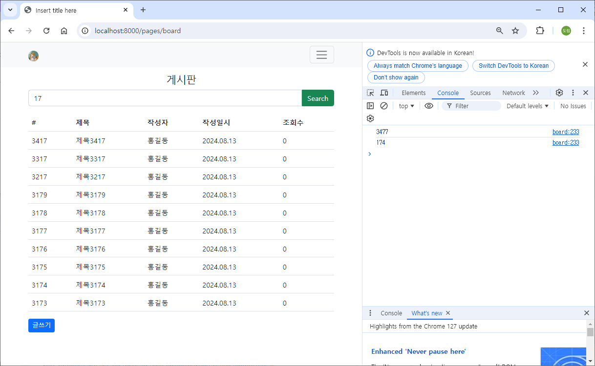