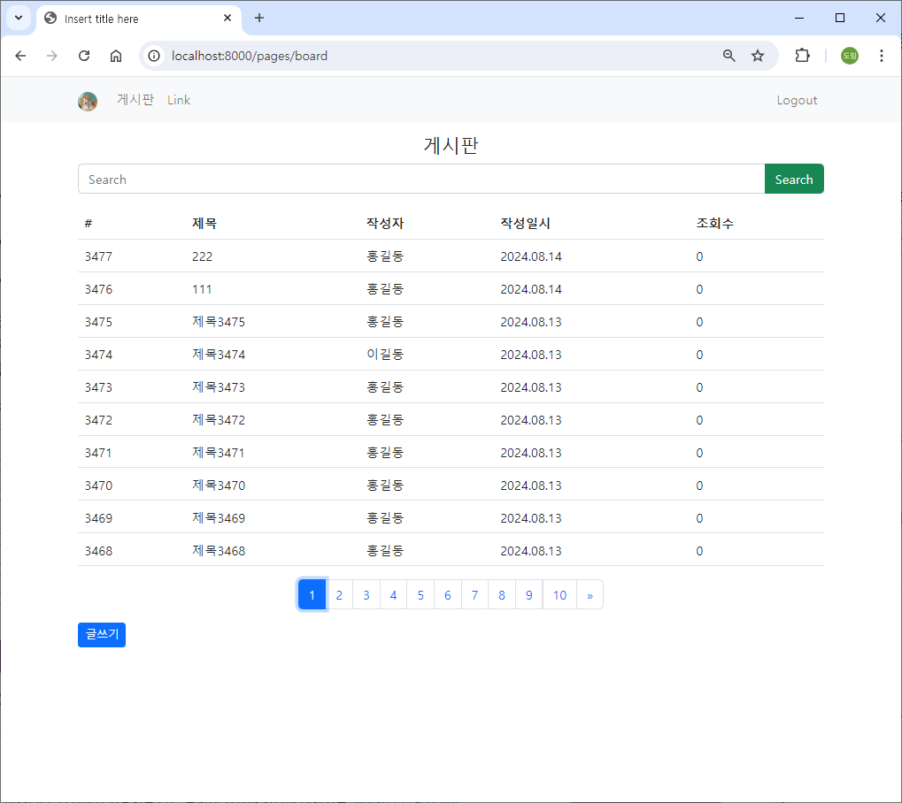
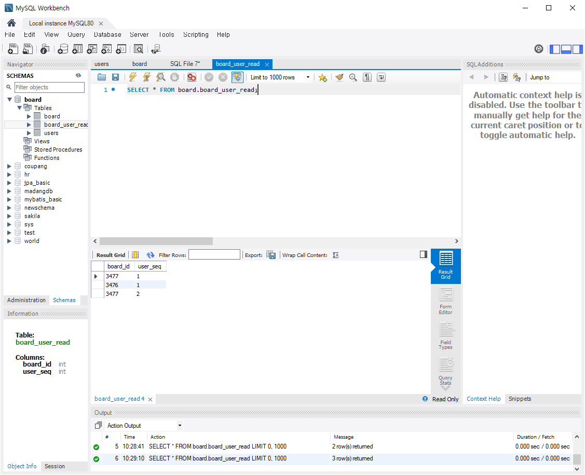
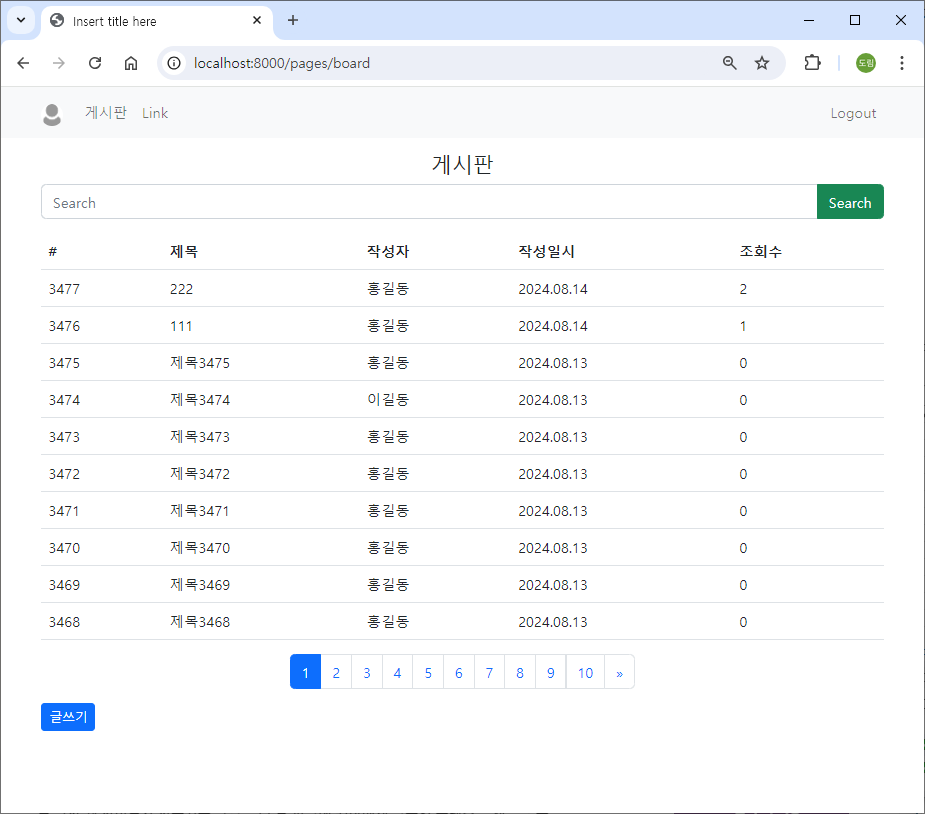
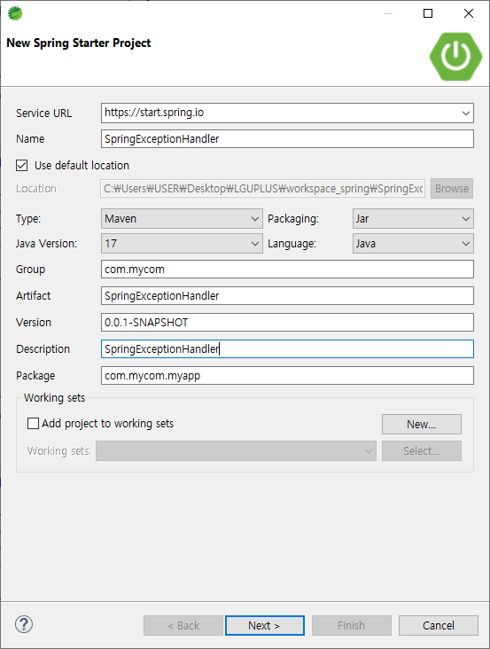
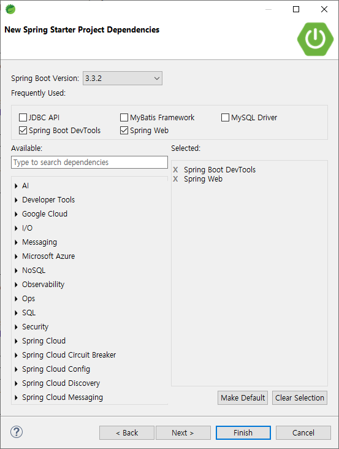
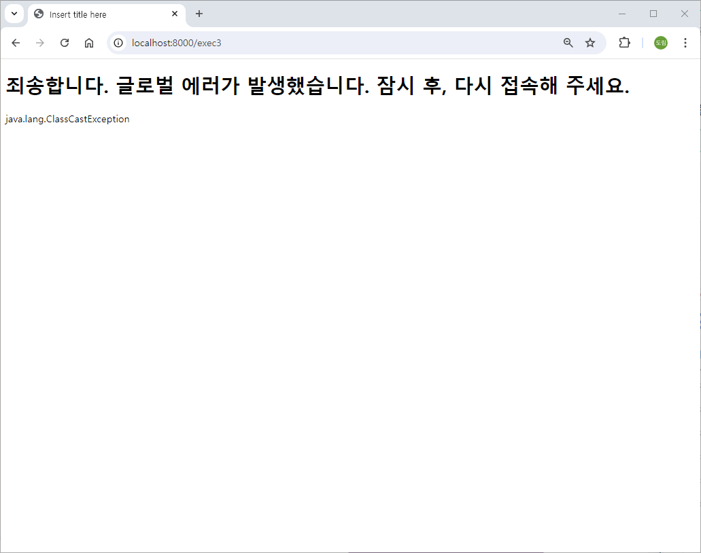
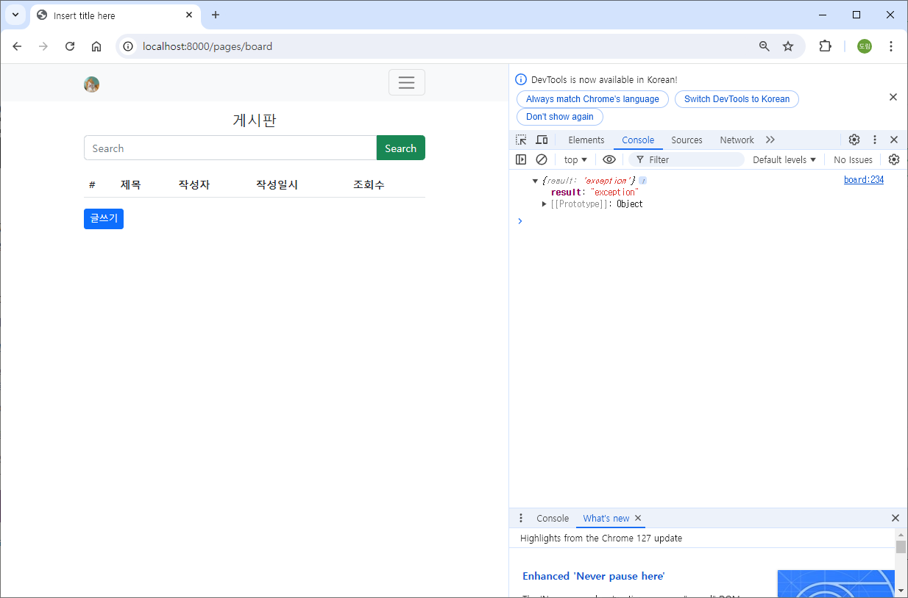

# [2024.08.16(금)] Pagination/조회수/SpringExceptionHandler/sessionTimeOut


# 게시판 프로젝트

## 게시판 Pagination

### src/main/webapp/WEB-INF/jsp/board.jsp

```java
<%@ page language="java" contentType="text/html; charset=UTF-8" pageEncoding="UTF-8"%>
<%@ page import="com.mycom.myapp.user.dto.UserDto" %>
<%
	// Back Forward Cache (BFCache)
	response.setHeader("Cache-Control", "no-cache, no-store, must-revalidate");
%>
<%
	UserDto userDto = (UserDto) session.getAttribute("userDto");
	System.out.println(userDto);
%>
<!DOCTYPE html>
<html>
<head>
<meta charset="UTF-8">

<link href="https://cdn.jsdelivr.net/npm/bootstrap@5.2.3/dist/css/bootstrap.min.css" rel="stylesheet" integrity="sha384-rbsA2VBKQhggwzxH7pPCaAqO46MgnOM80zW1RWuH61DGLwZJEdK2Kadq2F9CUG65" crossorigin="anonymous">
<script src="https://cdn.jsdelivr.net/npm/bootstrap@5.2.3/dist/js/bootstrap.bundle.min.js" integrity="sha384-kenU1KFdBIe4zVF0s0G1M5b4hcpxyD9F7jL+jjXkk+Q2h455rYXK/7HAuoJl+0I4" crossorigin="anonymous"></script>

<script src="//cdn.jsdelivr.net/npm/alertifyjs@1.12.0/build/alertify.min.js"></script>
<link rel="stylesheet" href="//cdn.jsdelivr.net/npm/alertifyjs@1.12.0/build/css/alertify.min.css"/>
<link rel="stylesheet" href="//cdn.jsdelivr.net/npm/alertifyjs@1.12.0/build/css/themes/default.min.css"/>

<title>Insert title here</title>
</head>
<body>

	<nav class="navbar navbar-expand-lg bg-light">
  <div class="container">
    <a class="navbar-brand" href="#">" style="width:24px; height: 24px; border-radius: 50%;"></a>
    <button class="navbar-toggler" type="button" data-bs-toggle="collapse" data-bs-target="#navbarSupportedContent" aria-controls="navbarSupportedContent" aria-expanded="false" aria-label="Toggle navigation">
      <span class="navbar-toggler-icon"></span>
    </button>
    <div class="collapse navbar-collapse" id="navbarSupportedContent">
      <ul class="navbar-nav me-auto">
        <li class="nav-item">
          <a class="nav-link" href="/pages/board">게시판</a>
        </li>
        <li class="nav-item">
          <a class="nav-link" href="#">Link</a>
        </li>
      </ul>
      
      <ul class="navbar-nav">
        <li class="nav-item">
          <a class="nav-link" href="/auth/logout">Logout</a>
        </li>
      </ul>
      
    </div>
  </div>
</nav>

<div class="container mt-3">
  <h4 class="text-center">게시판</h4>       
  
    <div class="input-group mb-3">
      <input id="inputSearchWord" type="text" class="form-control" placeholder="Search">
      <button id="btnSearchWord" class="btn btn-success" type="button">Search</button>
    </div>
    <table class="table table-hover">
        <thead>
            <tr>
                <th>#</th>
                <th>제목</th>
                <th>작성자</th>
                <th>작성일시</th>
                <th>조회수</th>
            </tr>
        </thead>
        <tbody id="boardTbody">
        </tbody>
    </table>
   
    <div id="paginationWrapper"></div>
    
    <button class="btn btn-sm btn-primary" id="btnInsertPage">글쓰기</button>
</div>

<!-- insert Modal -->
<div class="modal" tabindex="-1" id="insertBoardModal">
  <div class="modal-dialog modal-lg">
    <div class="modal-content">
      <div class="modal-header">
        <h4 class="modal-title">글 쓰기</h4>
        <button type="button" class="btn-close" data-bs-dismiss="modal" aria-label="Close"></button>
      </div>
      <div class="modal-body">
      
      	<div class="mb-3">
  			<label for="titleInsert" class="form-label">제목</label>
  			<input type="text" class="form-control" id="titleInsert">
		</div>
		<div class="mb-3">
  			<label for="contentInsert" class="form-label">내용</label>
  			<textarea class="form-control" id="contentInsert" rows="10"></textarea>
		</div>
      
      <button id="btnBoardInsert" class="btn btn-sm btn-primary btn-outline" data-bs-dismiss="modal" type="button">등록</button>
      
      </div>
    </div>
  </div>
</div>

<!-- update Modal -->
<div class="modal" tabindex="-1" id="updateBoardModal">
  <div class="modal-dialog modal-lg">
    <div class="modal-content">
      <div class="modal-header">
        <h4 class="modal-title">글 수정</h4>
        <button type="button" class="btn-close" data-bs-dismiss="modal" aria-label="Close"></button>
      </div>
      <div class="modal-body">
      
      	<div class="mb-3">
  			<label for="titleUpdate" class="form-label">제목</label>
  			<input type="text" class="form-control" id="titleUpdate">
		</div>
		<div class="mb-3">
  			<label for="contentUpdate" class="form-label">내용</label>
  			<textarea class="form-control" id="contentUpdate" rows="10"></textarea>
		</div>
      
      <button id="btnBoardUpdate" class="btn btn-sm btn-primary btn-outline" data-bs-dismiss="modal" type="button">수정</button>
      
      </div>
    </div>
  </div>
</div>

<!-- detail Modal -->
<div class="modal" tabindex="-1" id="detailBoardModal">
  <div class="modal-dialog modal-lg">
    <div class="modal-content">
      <div class="modal-header">
        <h4 class="modal-title">글 상세</h4>
        <button type="button" class="btn-close" data-bs-dismiss="modal" aria-label="Close"></button>
      </div>
      <div class="modal-body">
      
      <div class="example table-responsive">
      	<table class="table">
        	<tbody>
            	<tr><td>글번호</td><td id="boardIdDetail">#</td></tr>
                <tr><td>제목</td><td id="titleDetail">#</td></tr>
                <tr><td>내용</td><td id="contentDetail">#</td></tr>
                <tr><td>작성자</td><td id="userNameDetail">#</td></tr>
                <tr><td>작성일시</td><td id="regDtDetail">#</td></tr>
                <tr><td>조회수</td><td id="readCountDetail">#</td></tr>
            </tbody>
        </table>
      </div>
      
      <button id="btnBoardUpdateForm" class="btn btn-sm btn-primary btn-outline" data-bs-dismiss="modal" type="button">글 수정하기</button>
      <button id="btnBoardDeleteConfirm" class="btn btn-sm btn-warning btn-outline" data-bs-dismiss="modal" type="button">글 삭제하기</button>
      
      </div>
    </div>
  </div>
</div>

<script src="/assets/js/util.js"></script>
<script>
    let LIST_ROW_COUNT = 10;  //  한 페이지에 10개 row
    let OFFSET = 0;
    let SEARCH_WORD = '';
    
    let PAGE_LINK_COUNT = 10; // Pagination Button 수
    let TOTAL_LIST_ITEM_COUNT = 0;  // BackEnd에서 계산된 값을 받아서 저장 
    let CURRENT_PAGE_INDEX = 1;
    
    window.onload = function(){
        
    	// 글 목록
        listBoard();
        
    	// 글 목록 검색어 포함
    	document.querySelector("#btnSearchWord").onclick = function() {
    		SEARCH_WORD = document.querySelector("#inputSearchWord").value;
    		
    		listBoard();
        }
    	
        // 글 등록 모달    
        document.querySelector("#btnInsertPage").onclick = function() {
        	document.querySelector("#titleInsert").value = '';
    		document.querySelector("#contentInsert").value = '';
	     	// bootstrap 5 modal show  
	        let modal = new bootstrap.Modal(document.querySelector("#insertBoardModal"), { keyboard : false });
	        modal.show();
        }
        
        // 글 등록
        document.querySelector("#btnBoardInsert").onclick = function() {
        	if( document.querySelector("#titleInsert").value.length > 0 && document.querySelector("#contentInsert").value.length > 0 ) {
        		insertBoard();
        	}
        }
        
        // 글 수정 모달  btnBoardUpdateForm
        document.querySelector("#btnBoardUpdateForm").onclick = function() {
        	// 수정 글 boardId  
        	let boardId = document.querySelector("#detailBoardModal").getAttribute("data-boardId");
        	document.querySelector("#updateBoardModal").setAttribute("data-boardId", boardId);
        	
        	// 글 제목, 내용은 detailModal로부터
        	document.querySelector("#titleUpdate").value = document.querySelector("#titleDetail").innerHTML;
        	document.querySelector("#contentUpdate").value = document.querySelector("#contentDetail").innerHTML;
        	
        	// bootstrap 5 modal show  
            let modal = new bootstrap.Modal(document.querySelector("#updateBoardModal"), { keyboard : false });
            modal.show();
        }
        
    	 // 글 수정
        document.querySelector("#btnBoardUpdate").onclick = function() {
        	if( document.querySelector("#titleUpdate").value.length > 0 && document.querySelector("#contentUpdate").value.length > 0 ) {
        		UpdateBoard();
        	}
        }
    	 
    	// 글 삭제  
        document.querySelector("#btnBoardDeleteConfirm").onclick = function() {
    		alertify.confirm('삭제 확인', '이 글을 삭제하시겠습니까?', 
    		function(){
    			deleteBoard();
    		}, function(){
    			console.log("삭제 취소");
    		});
    	}
        
    }
    
    async function listBoard() {
        let url = "/boards/list"
        let urlParams = "?limit=" + LIST_ROW_COUNT + "&offset=" + OFFSET + "&searchWord=" + SEARCH_WORD
        let response = await fetch(url + urlParams);
        let data = await response.json();
        
        if( data.result == "success" ){ // 게시판 페이지 이동
        	makeListHtml(data.list);
        	TOTAL_LIST_ITEM_COUNT = data.count;
        	addPagination();
        
        }else if( data.result == "fail" ){
            alert("글 조회 과정에서 오류가 발생했습니다.");
        }
    }
    
    function makeListHtml(list) {
    	
    	let listHTML = ``;
        
        list.forEach( el => {
            let boardId = el.boardId;
            let userName = el.userName;
            let title = el.title;
            let content = el.content;
            let regDt = el.regDt;
            // LocalDateTime 객체 -> json 처리 결과물이 gon, jackson 2가지가 다르다.
            // console.log(regDt);
            let regDtStr = makeDateStr(regDt.date.year, regDt.date.month, regDt.date.day, '.'); 
            let readCount = el.readCount;
            
            listHTML += `<tr style="cursor:pointer" data-boardId=\${boardId}><td>\${boardId}</td><td>\${title}</td><td>\${userName}</td><td>\${regDtStr}</td><td>\${readCount}</td></tr>`;
        });
        
        document.querySelector("#boardTbody").innerHTML = listHTML;
        
        document.querySelectorAll("#boardTbody tr").forEach( el => {
        	el.onclick = function() {  // 이때 this는 el이다. // 애로우 function에서는 this를 사용할 수 없다. e를 매개변수로 받아 e.target.getAttribute으로 사용해야 한다.
        		let boardId = this.getAttribute("data-boardId");
        		detailBoard(boardId);
        	}
        });
    	
    }
    
    function addPagination() {
    	makePaginationHtml(LIST_ROW_COUNT, PAGE_LINK_COUNT , CURRENT_PAGE_INDEX , TOTAL_LIST_ITEM_COUNT , "paginationWrapper");
    }
    
    function movePage(pageIndex) {
    	OFFSET = (pageIndex - 1) * LIST_ROW_COUNT;
    	CURRENT_PAGE_INDEX = pageIndex;
    	listBoard();
    }
    
    async function detailBoard(boardId) {
        let url = "/boards/detail/" + boardId;
        
        let response = await fetch(url);
        let data = await response.json();
        
        if( data.result == "success" ){ // 게시판 페이지 이동

        	makeDetailHTML(data.dto);
        	
        }else if( data.result == "fail" ){
            alert("글 상세 조회 과정에서 오류가 발생했습니다.");
        }
    }
    
    function makeDetailHTML(detail) {
    	let boardId = detail.boardId;
        let userSeq = detail.userSeq;
        let userName = detail.userName;
        let title = detail.title;
        let content = detail.content;
        let regDt = detail.regDt;
        let regDtStr = makeDateStr(regDt.date.year, regDt.date.month, regDt.date.day, '.') + ' ' + makeTimeStr(regDt.time.hour, regDt.time.minute, regDt.time.second, ':'); // for Gson Format Of LocalDateTime
        
        let readCount = detail.readCount;
        let sameUser = detail.sameUser;
        
        document.querySelector("#detailBoardModal").setAttribute("data-boardId", boardId);
        document.querySelector("#boardIdDetail").innerHTML = "#" + boardId;
        document.querySelector("#titleDetail").innerHTML = title;
        document.querySelector("#contentDetail").innerHTML = content;
        document.querySelector("#userNameDetail").innerHTML = userName;
        document.querySelector("#regDtDetail").innerHTML = regDtStr;
        document.querySelector("#readCountDetail").innerHTML = readCount;
        
        if( sameUser ){ // 작성자와 조회자가 같으면 버튼 보여주기
            document.querySelector("#btnBoardUpdateForm").style.display = "inline-block";
            document.querySelector("#btnBoardDeleteConfirm").style.display = "inline-block";
        }else{  // 작성자와 조회자가 다르면 버튼 숨기기
            document.querySelector("#btnBoardUpdateForm").style.display = "none";
            document.querySelector("#btnBoardDeleteConfirm").style.display = "none";
        }
        
        // bootstrap 5 modal show  
        let modal = new bootstrap.Modal(document.querySelector("#detailBoardModal"), { keyboard : false });
        modal.show();
    }
    
    async function insertBoard(boardId) {
    	let urlParams = new URLSearchParams({
    		title : document.querySelector("#titleInsert").value,
    		content : document.querySelector("#contentInsert").value
    	});
    	
        let url = "/boards/insert";
        
        let fetchOptions = {
        	method : 'POST',
        	body : urlParams
        }
        
        let response = await fetch(url, fetchOptions);
        let data = await response.json();
        
        if( data.result == "success" ){ // 게시판 페이지 이동

        	alertify.success('글이 등록되었습니다.');
        	listBoard();
        	
        }else if( data.result == "fail" ){
            alert("글 등록 과정에서 오류가 발생했습니다.");
        }
    }
    
    async function UpdateBoard() {
    	
    	let boardId = document.querySelector("#updateBoardModal").getAttribute("data-boardId");
    	
    	let urlParams = new URLSearchParams({
    		boardId : boardId,
    		title : document.querySelector("#titleUpdate").value,
    		content : document.querySelector("#contentUpdate").value
    	});
    	
        let url = "/boards/update";
        
        let fetchOptions = {
        	method : 'POST',
        	body : urlParams
        }
        
        let response = await fetch(url, fetchOptions);
        let data = await response.json();
        
        if( data.result == "success" ){ // 게시판 페이지 이동

        	alertify.success('글이 수정되었습니다.');
        	listBoard();
        	
        }else if( data.result == "fail" ){
            alert("글 수정 과정에서 오류가 발생했습니다.");
        }
    }
    
	async function deleteBoard() {
    	
    	let boardId = document.querySelector("#detailBoardModal").getAttribute("data-boardId");
    	
        let url = "/boards/delete/" + boardId;
        
        let response = await fetch(url);
        let data = await response.json();
        
        if( data.result == "success" ){ // 게시판 페이지 이동

        	alertify.success('글이 삭제되었습니다.');
        	listBoard();
        	
        }else if( data.result == "fail" ){
            alert("글 삭제 과정에서 오류가 발생했습니다.");
        }
    }
    
</script>

</body>
</html>
```

### 실행 결과



## 게시글 조회수 - 사용자별 1회 카운팅

### board 스키마에 board_user_read  테이블 추가

```java
CREATE TABLE board_user_read (
      board_id int NOT NULL,
      user_seq int NOT NULL,
      KEY BOARD_USER_READ_FK_02_idx (user_seq),
      KEY BOARD_USER_READ_FK_01_idx (board_id),
      CONSTRAINT BOARD_USER_READ_FK_01 FOREIGN KEY (board_id) REFERENCES board (BOARD_ID),
      CONSTRAINT BOARD_USER_READ_FK_02 FOREIGN KEY (user_seq) REFERENCES users (USER_SEQ)
    ) ;
```

### board_user_read 테이블에서 이미 조회했는지 확인 후 안 읽었으면 insert

### src/main/java/com/mycom/myapp/board/dao/BoardDao.java

```java
package com.mycom.myapp.board.dao;

import java.util.List;

import org.apache.ibatis.annotations.Mapper;
import org.apache.ibatis.annotations.Param;

import com.mycom.myapp.board.dto.BoardDto;
import com.mycom.myapp.board.dto.BoardParamDto;

@Mapper
public interface BoardDao {
	List<BoardDto> listBoard(BoardParamDto boardParamDto);  // limit, offset
	int listBoardTotalCount();  // 전체 건수
	
	List<BoardDto> listBoardSearchWord(BoardParamDto boardParamDto);  // limit, offset, searchWord
	int listBoardSearchWordTotalCount(BoardParamDto boardParamDto);  // 검색어 대비 전체 건수
	
	BoardDto detailBoard(BoardParamDto boardParamDto);
	
	int insertBoard(BoardDto boardDto);
	int updateBoard(BoardDto boardDto);
	int deleteBoard(int boardId);
	
	// 조회수 처리
	int countBoardUserRead(BoardParamDto boardParamDto);
	int insertBoardUserRead(@Param("boardId") int boardId, @Param("userSeq") int userSeq);
}
```

### src/main/resources/mapper/board-mapper.xml

```java
<?xml version="1.0" encoding="UTF-8" ?>
<!DOCTYPE mapper
    PUBLIC "-//mybatis.org//DTD Mapper 3.0//EN"
    "http://mybatis.org/dtd/mybatis-3-mapper.dtd">
<mapper namespace="com.mycom.myapp.board.dao.BoardDao">
	
	<!-- parameterType에 map 대신 com.mycom.myapp.board.dto.BoardParamDto를 사용해도 된다. -->
	<select id="listBoard" parameterType="map" resultType="com.mycom.myapp.board.dto.BoardDto">
		select b.board_id, u.user_name, b.title, b.content, b.reg_dt, b.read_count
		  from board b, users u
		 where b.user_seq = u.user_seq
		 order by b.board_id desc
		 limit #{limit} offset #{offset}
	</select>
	
	<select id="listBoardTotalCount" resultType="int">
		select count(*) from board;
	</select>
	
	<select id="listBoardSearchWord" parameterType="map" resultType="com.mycom.myapp.board.dto.BoardDto">
		select b.board_id, u.user_name, b.title, b.content, b.reg_dt, b.read_count
		  from board b, users u
		 where b.user_seq = u.user_seq
		   and b.title like concat( '%', #{searchWord}, '%' )
		 order by b.board_id desc
		 limit #{limit} offset #{offset}
	</select>
	
	<select id="listBoardSearchWordTotalCount" parameterType="String" resultType="int">
		select count(*) from board
		 where title like concat( '%', #{searchWord}, '%' )
	</select>
	
	<select id="detailBoard" parameterType="int" resultType="com.mycom.myapp.board.dto.BoardDto">
		select b.board_id, u.user_seq, u.user_name, u.user_profile_image, b.title, b.content, b.reg_dt, b.read_count
		  from board b, users u
		 where b.board_id = #{boardId} 
		   and b.user_seq = u.user_seq
	</select>
	
	<insert id="insertBoard" parameterType="com.mycom.myapp.board.dto.BoardDto">
		insert into board ( user_seq, title, content, reg_dt, read_count )
			values ( #{userSeq}, #{title}, #{content}, now(), 0 );
	</insert>
	
	<update id="updateBoard" parameterType="com.mycom.myapp.board.dto.BoardDto">
		update board 
		   set title = #{title}, 
		   	   content = #{content}
		 where board_id = #{boardId}
	</update>
	
	<delete id="deleteBoard" parameterType="int">
		delete from board where board_id = #{board}
	</delete>
	
	<!-- 조회수 -->
	<select id="countBoardUserRead" parameterType="map">
		select count(*) from board_user_read where board_id = #{boardId} and user_seq = #{userSeq};
	</select>
	
	<insert id="insertBoardUserRead" parameterType="map">
		insert into board_user_read ( board_id, user_seq )
				values ( #{boardId}, #{userSeq} );
	</insert>
	
	
</mapper>    
```

### src/main/java/com/mycom/myapp/board/service

### BoardService.java (변경 X)

```java
package com.mycom.myapp.board.service;

import com.mycom.myapp.board.dto.BoardDto;
import com.mycom.myapp.board.dto.BoardParamDto;
import com.mycom.myapp.board.dto.BoardResultDto;

public interface BoardService {
	BoardResultDto listBoard(BoardParamDto boardParamDto);  // limit, offset
	BoardResultDto listBoardSearchWord(BoardParamDto boardParamDto);  // limit, offset
	// service layer에서는 총 건 수 가져오는 부분 분리 X
	
	BoardResultDto detailBoard(BoardParamDto boardParamDto);
	
	BoardResultDto insertBoard(BoardDto boardDto);
	BoardResultDto updateBoard(BoardDto boardDto);
	BoardResultDto deleteBoard(int boardId);
}
```

### BoardServiceImpl.java

```java
package com.mycom.myapp.board.service;

import java.util.List;

import org.springframework.stereotype.Service;

import com.mycom.myapp.board.dao.BoardDao;
import com.mycom.myapp.board.dto.BoardDto;
import com.mycom.myapp.board.dto.BoardParamDto;
import com.mycom.myapp.board.dto.BoardResultDto;

// 서비스 layer는 복잡한 Business Logic을 처리하는 영역, 사용자 정의 오류
// 예외 처리?? 다양한 예외 처리 (사용자 정의 포함)를 통해서 보다 구체적인 처리가 가능
@Service
public class BoardServiceImpl implements BoardService {

	// BoardDao DI
	private final BoardDao boardDao;
	
	public BoardServiceImpl(BoardDao boardDao) {
		this.boardDao = boardDao;
	}
	
	@Override
	public BoardResultDto listBoard(BoardParamDto boardParamDto) {
		BoardResultDto boardResultDto = new BoardResultDto();
		
		try {
			List<BoardDto> list = boardDao.listBoard(boardParamDto);
			int count = boardDao.listBoardTotalCount();
			
			boardResultDto.setList(list);
			boardResultDto.setCount(count);
			boardResultDto.setResult("success");
		} catch(Exception e) {
			e.printStackTrace();
			boardResultDto.setResult("fail");
		}
		
		return boardResultDto;
	}

	@Override
	public BoardResultDto listBoardSearchWord(BoardParamDto boardParamDto) {
		BoardResultDto boardResultDto = new BoardResultDto();
		
		try {
			List<BoardDto> list = boardDao.listBoardSearchWord(boardParamDto);
			int count = boardDao.listBoardSearchWordTotalCount(boardParamDto);
			
			boardResultDto.setList(list);
			boardResultDto.setCount(count);
			boardResultDto.setResult("success");
		} catch(Exception e) {
			e.printStackTrace();
			boardResultDto.setResult("fail");
		}
		
		return boardResultDto;
	}

	@Override
	public BoardResultDto detailBoard(BoardParamDto boardParamDto) {
		BoardResultDto boardResultDto = new BoardResultDto();
		
		try {
			// 조회수
			int userReadCnt = boardDao.countBoardUserRead(boardParamDto);
			System.out.println("boardId : " + boardParamDto.getBoardId());
			System.out.println("userSeq : " + boardParamDto.getUserSeq());
			System.out.println("userReadCnt : " + userReadCnt);
			
			if( userReadCnt == 0 ) {  // 현 사용자가 현 게시글을 처음 조회
				// board_user_read에 insert (현 게시글, 현 사용자)
				boardDao.insertBoardUserRead(boardParamDto.getBoardId(), boardParamDto.getUserSeq());
				// 현재 게시글의 조회수 + 1
			}
			
			BoardDto boardDto = boardDao.detailBoard(boardParamDto);
			// 글쓴이와 보는이가 같은지 여부
			if( boardDto.getUserSeq() == boardParamDto.getUserSeq()) {  // Controller에서 session으로부터 얻어서 보내준다.
				boardDto.setSameUser(true);
			} else {
				boardDto.setSameUser(false);
			}
			boardResultDto.setDto(boardDto);
			boardResultDto.setResult("success");
		} catch(Exception e) {
			e.printStackTrace();
			boardResultDto.setResult("fail");
		}
		
		return boardResultDto;
	}

	@Override
	public BoardResultDto insertBoard(BoardDto boardDto) {
		BoardResultDto boardResultDto = new BoardResultDto();
		
		try {
			
			int ret = boardDao.insertBoard(boardDto);
			
			if( ret == 1 ) boardResultDto.setResult("success");
			else boardResultDto.setResult("fail");
			
		} catch(Exception e) {
			e.printStackTrace();
			boardResultDto.setResult("fail");
		}
		return boardResultDto;
	}

	@Override
	public BoardResultDto updateBoard(BoardDto boardDto) {
		BoardResultDto boardResultDto = new BoardResultDto();
		
		try {
			
			int ret = boardDao.updateBoard(boardDto);
			
			if( ret == 1 ) boardResultDto.setResult("success");
			else boardResultDto.setResult("fail");
			
		} catch(Exception e) {
			e.printStackTrace();
			boardResultDto.setResult("fail");
		}
		return boardResultDto;
	}

	@Override
	public BoardResultDto deleteBoard(int boardId) {
		BoardResultDto boardResultDto = new BoardResultDto();
		
		try {
			
			int ret = boardDao.deleteBoard(boardId);
			
			if( ret == 1 ) boardResultDto.setResult("success");
			else boardResultDto.setResult("fail");
			
		} catch(Exception e) {
			e.printStackTrace();
			boardResultDto.setResult("fail");
		}
		return boardResultDto;
	}

}
```

### 실행 결과

- 로그인하여 게시글 조회 후 데이터베이스 select하여 확인
    
    
    

### board 테이블의 read_count 증가

### src/main/java/com/mycom/myapp/board/dao/BoardDao.java

```java
package com.mycom.myapp.board.dao;

import java.util.List;

import org.apache.ibatis.annotations.Mapper;
import org.apache.ibatis.annotations.Param;

import com.mycom.myapp.board.dto.BoardDto;
import com.mycom.myapp.board.dto.BoardParamDto;

@Mapper
public interface BoardDao {
	List<BoardDto> listBoard(BoardParamDto boardParamDto);  // limit, offset
	int listBoardTotalCount();  // 전체 건수
	
	List<BoardDto> listBoardSearchWord(BoardParamDto boardParamDto);  // limit, offset, searchWord
	int listBoardSearchWordTotalCount(BoardParamDto boardParamDto);  // 검색어 대비 전체 건수
	
	BoardDto detailBoard(BoardParamDto boardParamDto);
	
	int insertBoard(BoardDto boardDto);
	int updateBoard(BoardDto boardDto);
	int deleteBoard(int boardId);
	
	// 조회수 처리
	int countBoardUserRead(BoardParamDto boardParamDto);
	int insertBoardUserRead(@Param("boardId") int boardId, @Param("userSeq") int userSeq);
	int updateBoardReadCount(int boardId);
}
```

### src/main/resources/mapper/board-mapper.xml

```java
<?xml version="1.0" encoding="UTF-8" ?>
<!DOCTYPE mapper
    PUBLIC "-//mybatis.org//DTD Mapper 3.0//EN"
    "http://mybatis.org/dtd/mybatis-3-mapper.dtd">
<mapper namespace="com.mycom.myapp.board.dao.BoardDao">
	
	<!-- parameterType에 map 대신 com.mycom.myapp.board.dto.BoardParamDto를 사용해도 된다. -->
	<select id="listBoard" parameterType="map" resultType="com.mycom.myapp.board.dto.BoardDto">
		select b.board_id, u.user_name, b.title, b.content, b.reg_dt, b.read_count
		  from board b, users u
		 where b.user_seq = u.user_seq
		 order by b.board_id desc
		 limit #{limit} offset #{offset}
	</select>
	
	<select id="listBoardTotalCount" resultType="int">
		select count(*) from board;
	</select>
	
	<select id="listBoardSearchWord" parameterType="map" resultType="com.mycom.myapp.board.dto.BoardDto">
		select b.board_id, u.user_name, b.title, b.content, b.reg_dt, b.read_count
		  from board b, users u
		 where b.user_seq = u.user_seq
		   and b.title like concat( '%', #{searchWord}, '%' )
		 order by b.board_id desc
		 limit #{limit} offset #{offset}
	</select>
	
	<select id="listBoardSearchWordTotalCount" parameterType="String" resultType="int">
		select count(*) from board
		 where title like concat( '%', #{searchWord}, '%' )
	</select>
	
	<select id="detailBoard" parameterType="int" resultType="com.mycom.myapp.board.dto.BoardDto">
		select b.board_id, u.user_seq, u.user_name, u.user_profile_image, b.title, b.content, b.reg_dt, b.read_count
		  from board b, users u
		 where b.board_id = #{boardId} 
		   and b.user_seq = u.user_seq
	</select>
	
	<insert id="insertBoard" parameterType="com.mycom.myapp.board.dto.BoardDto">
		insert into board ( user_seq, title, content, reg_dt, read_count )
			values ( #{userSeq}, #{title}, #{content}, now(), 0 );
	</insert>
	
	<update id="updateBoard" parameterType="com.mycom.myapp.board.dto.BoardDto">
		update board 
		   set title = #{title}, 
		   	   content = #{content}
		 where board_id = #{boardId}
	</update>
	
	<delete id="deleteBoard" parameterType="int">
		delete from board where board_id = #{board}
	</delete>
	
	<!-- 조회수 -->
	<select id="countBoardUserRead" parameterType="map">
		select count(*) from board_user_read where board_id = #{boardId} and user_seq = #{userSeq};
	</select>
	
	<insert id="insertBoardUserRead" parameterType="map">
		insert into board_user_read ( board_id, user_seq )
				values ( #{boardId}, #{userSeq} );
	</insert>
	
	<update id="updateBoardReadCount" parameterType="int">
		update board 
		   set read_count = read_count + 1
		 where board_id = #{boardId};
	</update>
	
</mapper>    
```

### src/main/java/com/mycom/myapp/board/service

### BoardService.java (변경 X)

```java
package com.mycom.myapp.board.service;

import com.mycom.myapp.board.dto.BoardDto;
import com.mycom.myapp.board.dto.BoardParamDto;
import com.mycom.myapp.board.dto.BoardResultDto;

public interface BoardService {
	BoardResultDto listBoard(BoardParamDto boardParamDto);  // limit, offset
	BoardResultDto listBoardSearchWord(BoardParamDto boardParamDto);  // limit, offset
	// service layer에서는 총 건 수 가져오는 부분 분리 X
	
	BoardResultDto detailBoard(BoardParamDto boardParamDto);
	
	BoardResultDto insertBoard(BoardDto boardDto);
	BoardResultDto updateBoard(BoardDto boardDto);
	BoardResultDto deleteBoard(int boardId);
}
```

### BoardServiceImpl.java

```java
package com.mycom.myapp.board.service;

import java.util.List;

import org.springframework.stereotype.Service;

import com.mycom.myapp.board.dao.BoardDao;
import com.mycom.myapp.board.dto.BoardDto;
import com.mycom.myapp.board.dto.BoardParamDto;
import com.mycom.myapp.board.dto.BoardResultDto;

// 서비스 layer는 복잡한 Business Logic을 처리하는 영역, 사용자 정의 오류
// 예외 처리?? 다양한 예외 처리 (사용자 정의 포함)를 통해서 보다 구체적인 처리가 가능
@Service
public class BoardServiceImpl implements BoardService {

	// BoardDao DI
	private final BoardDao boardDao;
	
	public BoardServiceImpl(BoardDao boardDao) {
		this.boardDao = boardDao;
	}
	
	@Override
	public BoardResultDto listBoard(BoardParamDto boardParamDto) {
		BoardResultDto boardResultDto = new BoardResultDto();
		
		try {
			List<BoardDto> list = boardDao.listBoard(boardParamDto);
			int count = boardDao.listBoardTotalCount();
			
			boardResultDto.setList(list);
			boardResultDto.setCount(count);
			boardResultDto.setResult("success");
		} catch(Exception e) {
			e.printStackTrace();
			boardResultDto.setResult("fail");
		}
		
		return boardResultDto;
	}

	@Override
	public BoardResultDto listBoardSearchWord(BoardParamDto boardParamDto) {
		BoardResultDto boardResultDto = new BoardResultDto();
		
		try {
			List<BoardDto> list = boardDao.listBoardSearchWord(boardParamDto);
			int count = boardDao.listBoardSearchWordTotalCount(boardParamDto);
			
			boardResultDto.setList(list);
			boardResultDto.setCount(count);
			boardResultDto.setResult("success");
		} catch(Exception e) {
			e.printStackTrace();
			boardResultDto.setResult("fail");
		}
		
		return boardResultDto;
	}

	@Override
	public BoardResultDto detailBoard(BoardParamDto boardParamDto) {
		BoardResultDto boardResultDto = new BoardResultDto();
		
		try {
			// 조회수
			int userReadCnt = boardDao.countBoardUserRead(boardParamDto);
			System.out.println("boardId : " + boardParamDto.getBoardId());
			System.out.println("userSeq : " + boardParamDto.getUserSeq());
			System.out.println("userReadCnt : " + userReadCnt);
			
			if( userReadCnt == 0 ) {  // 현 사용자가 현 게시글을 처음 조회
				// board_user_read에 insert (현 게시글, 현 사용자)
				boardDao.insertBoardUserRead(boardParamDto.getBoardId(), boardParamDto.getUserSeq());
				// 현재 게시글의 조회수 + 1
				boardDao.updateBoardReadCount(boardParamDto.getBoardId());
			}
			
			BoardDto boardDto = boardDao.detailBoard(boardParamDto);
			// 글쓴이와 보는이가 같은지 여부
			if( boardDto.getUserSeq() == boardParamDto.getUserSeq()) {  // Controller에서 session으로부터 얻어서 보내준다.
				boardDto.setSameUser(true);
			} else {
				boardDto.setSameUser(false);
			}
			boardResultDto.setDto(boardDto);
			boardResultDto.setResult("success");
		} catch(Exception e) {
			e.printStackTrace();
			boardResultDto.setResult("fail");
		}
		
		return boardResultDto;
	}

	@Override
	public BoardResultDto insertBoard(BoardDto boardDto) {
		BoardResultDto boardResultDto = new BoardResultDto();
		
		try {
			
			int ret = boardDao.insertBoard(boardDto);
			
			if( ret == 1 ) boardResultDto.setResult("success");
			else boardResultDto.setResult("fail");
			
		} catch(Exception e) {
			e.printStackTrace();
			boardResultDto.setResult("fail");
		}
		return boardResultDto;
	}

	@Override
	public BoardResultDto updateBoard(BoardDto boardDto) {
		BoardResultDto boardResultDto = new BoardResultDto();
		
		try {
			
			int ret = boardDao.updateBoard(boardDto);
			
			if( ret == 1 ) boardResultDto.setResult("success");
			else boardResultDto.setResult("fail");
			
		} catch(Exception e) {
			e.printStackTrace();
			boardResultDto.setResult("fail");
		}
		return boardResultDto;
	}

	@Override
	public BoardResultDto deleteBoard(int boardId) {
		BoardResultDto boardResultDto = new BoardResultDto();
		
		try {
			
			int ret = boardDao.deleteBoard(boardId);
			
			if( ret == 1 ) boardResultDto.setResult("success");
			else boardResultDto.setResult("fail");
			
		} catch(Exception e) {
			e.printStackTrace();
			boardResultDto.setResult("fail");
		}
		return boardResultDto;
	}

}
```

### 실행 결과



### 조회수 카운팅 트랜잭션 처리

### rollback이 실행되지 않는 이유

- 메소드에 @Transactional을 사용하면 트랜잭션 처리가 된다.
    
    그러나 @Transactional이 붙은 메소드는 메소드 밖에서 프록시가 확인하고 있는데 try catch문으로 내부에서 오류 처리를 하게 되면 프록시가 오류가 발생한지 몰라서 rollback하지 않는다.
    

### src/main/java/com/mycom/myapp/board/service/BoardServiceImpl.java

```java
package com.mycom.myapp.board.service;

import java.util.List;
...

// 서비스 layer는 복잡한 Business Logic을 처리하는 영역, 사용자 정의 오류
// 예외 처리?? 다양한 예외 처리 (사용자 정의 포함)를 통해서 보다 구체적인 처리가 가능
@Service
public class BoardServiceImpl implements BoardService {

	... 	
 	
 	@Override
	@Transactional
	public BoardResultDto detailBoard(BoardParamDto boardParamDto) {
		BoardResultDto boardResultDto = new BoardResultDto();
		
		try {
			// 조회수
			int userReadCnt = boardDao.countBoardUserRead(boardParamDto);
			System.out.println("boardId : " + boardParamDto.getBoardId());
			System.out.println("userSeq : " + boardParamDto.getUserSeq());
			System.out.println("userReadCnt : " + userReadCnt);
			
			if( userReadCnt == 0 ) {  // 현 사용자가 현 게시글을 처음 조회
				// board_user_read에 insert (현 게시글, 현 사용자)
				boardDao.insertBoardUserRead(boardParamDto.getBoardId(), boardParamDto.getUserSeq());
				
				// transaction test
				String s = null;
				s.length();
				
				// 현재 게시글의 조회수 + 1
				boardDao.updateBoardReadCount(boardParamDto.getBoardId());
			}
			
			BoardDto boardDto = boardDao.detailBoard(boardParamDto);
			// 글쓴이와 보는이가 같은지 여부
			if( boardDto.getUserSeq() == boardParamDto.getUserSeq()) {  // Controller에서 session으로부터 얻어서 보내준다.
				boardDto.setSameUser(true);
			} else {
				boardDto.setSameUser(false);
			}
			boardResultDto.setDto(boardDto);
			boardResultDto.setResult("success");
		} catch(Exception e) {
			e.printStackTrace();
			boardResultDto.setResult("fail");
		}
		
		return boardResultDto;
	}
	
...

}
```

### 해결 방법

- @Transactional이 붙은 메소드 내에서 단순히 try catch로 메소드 내부에서 처리하면 Transactional이 동작하지 못하므로 메소드를 호출한 부분으로 오류를 전달해야 한다.
- 예시 - catch 오류를 자세하게 구분, catch에서 throw로 오류 전달

### 해결방법 코드 #1 RuntimeException 객체를 상위 호출자에게 전달

- 정상적인 process 흐름이 방해된다.

### src/main/java/com/mycom/myapp/board/service/BoardServiceImpl.java

```java
package com.mycom.myapp.board.service;

import java.util.List;

import org.springframework.stereotype.Service;
import org.springframework.transaction.annotation.Transactional;

import com.mycom.myapp.board.dao.BoardDao;
import com.mycom.myapp.board.dto.BoardDto;
import com.mycom.myapp.board.dto.BoardParamDto;
import com.mycom.myapp.board.dto.BoardResultDto;

// 서비스 layer는 복잡한 Business Logic을 처리하는 영역, 사용자 정의 오류
// 예외 처리?? 다양한 예외 처리 (사용자 정의 포함)를 통해서 보다 구체적인 처리가 가능
@Service
public class BoardServiceImpl implements BoardService {

	// BoardDao DI
	private final BoardDao boardDao;
	
	public BoardServiceImpl(BoardDao boardDao) {
		this.boardDao = boardDao;
	}
	
	@Override
	public BoardResultDto listBoard(BoardParamDto boardParamDto) {
		BoardResultDto boardResultDto = new BoardResultDto();
		
		try {
			List<BoardDto> list = boardDao.listBoard(boardParamDto);
			int count = boardDao.listBoardTotalCount();
			
			boardResultDto.setList(list);
			boardResultDto.setCount(count);
			boardResultDto.setResult("success");
		} catch(Exception e) {
			e.printStackTrace();
			boardResultDto.setResult("fail");
		}
		
		return boardResultDto;
	}

	@Override
	public BoardResultDto listBoardSearchWord(BoardParamDto boardParamDto) {
		BoardResultDto boardResultDto = new BoardResultDto();
		
		try {
			List<BoardDto> list = boardDao.listBoardSearchWord(boardParamDto);
			int count = boardDao.listBoardSearchWordTotalCount(boardParamDto);
			
			boardResultDto.setList(list);
			boardResultDto.setCount(count);
			boardResultDto.setResult("success");
		} catch(Exception e) {
			e.printStackTrace();
			boardResultDto.setResult("fail");
		}
		
		return boardResultDto;
	}

	@Override
	@Transactional
	public BoardResultDto detailBoard(BoardParamDto boardParamDto) {
		BoardResultDto boardResultDto = new BoardResultDto();
		
		try {
			// 조회수
			int userReadCnt = boardDao.countBoardUserRead(boardParamDto);
			System.out.println("boardId : " + boardParamDto.getBoardId());
			System.out.println("userSeq : " + boardParamDto.getUserSeq());
			System.out.println("userReadCnt : " + userReadCnt);
			
			if( userReadCnt == 0 ) {  // 현 사용자가 현 게시글을 처음 조회
				// board_user_read에 insert (현 게시글, 현 사용자)
				boardDao.insertBoardUserRead(boardParamDto.getBoardId(), boardParamDto.getUserSeq());
				
				// transaction test
				String s = null;
				s.length();
				
				// 현재 게시글의 조회수 + 1
				boardDao.updateBoardReadCount(boardParamDto.getBoardId());
			}
			
			BoardDto boardDto = boardDao.detailBoard(boardParamDto);
			// 글쓴이와 보는이가 같은지 여부
			if( boardDto.getUserSeq() == boardParamDto.getUserSeq()) {  // Controller에서 session으로부터 얻어서 보내준다.
				boardDto.setSameUser(true);
			} else {
				boardDto.setSameUser(false);
			}
			boardResultDto.setDto(boardDto);
			boardResultDto.setResult("success");
		} catch(Exception e) {
			e.printStackTrace();
			boardResultDto.setResult("fail");
			
			// #1 RuntimeException 객체를 상위 호출자에게 전달
			// 정상적인 process 흐름이 방해된다.
			throw new RuntimeException("detailBoard() error");
		}
		
		return boardResultDto;
	}

	@Override
	public BoardResultDto insertBoard(BoardDto boardDto) {
		BoardResultDto boardResultDto = new BoardResultDto();
		
		try {
			
			int ret = boardDao.insertBoard(boardDto);
			
			if( ret == 1 ) boardResultDto.setResult("success");
			else boardResultDto.setResult("fail");
			
		} catch(Exception e) {
			e.printStackTrace();
			boardResultDto.setResult("fail");
		}
		return boardResultDto;
	}

	@Override
	public BoardResultDto updateBoard(BoardDto boardDto) {
		BoardResultDto boardResultDto = new BoardResultDto();
		
		try {
			
			int ret = boardDao.updateBoard(boardDto);
			
			if( ret == 1 ) boardResultDto.setResult("success");
			else boardResultDto.setResult("fail");
			
		} catch(Exception e) {
			e.printStackTrace();
			boardResultDto.setResult("fail");
		}
		return boardResultDto;
	}

	@Override
	public BoardResultDto deleteBoard(int boardId) {
		BoardResultDto boardResultDto = new BoardResultDto();
		
		try {
			
			int ret = boardDao.deleteBoard(boardId);
			
			if( ret == 1 ) boardResultDto.setResult("success");
			else boardResultDto.setResult("fail");
			
		} catch(Exception e) {
			e.printStackTrace();
			boardResultDto.setResult("fail");
		}
		return boardResultDto;
	}

}
```

### 해결방법 코드 #2 TransactionAspectSupport (⭐)

- TransactionAspectSupport 코드
    
    ```java
    TransactionAspectSupport.currentTransactionStatus().setRollbackOnly();
    ```
    
- 정상적인 process 흐름이 진행된다.
- 예외가 발생하지 않아도 무조건 rollback되므로 catch 블록에서 사용한다.
    
    (try 블록에서 사용될 시 정상 완료 시에도 무조건 rollback된다.)
    

### src/main/java/com/mycom/myapp/board/service/BoardServiceImpl.java

```java
package com.mycom.myapp.board.service;

import java.util.List;

import org.springframework.stereotype.Service;
import org.springframework.transaction.annotation.Transactional;
import org.springframework.transaction.interceptor.TransactionAspectSupport;

import com.mycom.myapp.board.dao.BoardDao;
import com.mycom.myapp.board.dto.BoardDto;
import com.mycom.myapp.board.dto.BoardParamDto;
import com.mycom.myapp.board.dto.BoardResultDto;

// 서비스 layer는 복잡한 Business Logic을 처리하는 영역, 사용자 정의 오류
// 예외 처리?? 다양한 예외 처리 (사용자 정의 포함)를 통해서 보다 구체적인 처리가 가능
@Service
public class BoardServiceImpl implements BoardService {

	// BoardDao DI
	private final BoardDao boardDao;
	
	public BoardServiceImpl(BoardDao boardDao) {
		this.boardDao = boardDao;
	}
	
	@Override
	public BoardResultDto listBoard(BoardParamDto boardParamDto) {
		BoardResultDto boardResultDto = new BoardResultDto();
		
		try {
			List<BoardDto> list = boardDao.listBoard(boardParamDto);
			int count = boardDao.listBoardTotalCount();
			
			boardResultDto.setList(list);
			boardResultDto.setCount(count);
			boardResultDto.setResult("success");
		} catch(Exception e) {
			e.printStackTrace();
			boardResultDto.setResult("fail");
		}
		
		return boardResultDto;
	}

	@Override
	public BoardResultDto listBoardSearchWord(BoardParamDto boardParamDto) {
		BoardResultDto boardResultDto = new BoardResultDto();
		
		try {
			List<BoardDto> list = boardDao.listBoardSearchWord(boardParamDto);
			int count = boardDao.listBoardSearchWordTotalCount(boardParamDto);
			
			boardResultDto.setList(list);
			boardResultDto.setCount(count);
			boardResultDto.setResult("success");
		} catch(Exception e) {
			e.printStackTrace();
			boardResultDto.setResult("fail");
		}
		
		return boardResultDto;
	}

	@Override
	@Transactional
	public BoardResultDto detailBoard(BoardParamDto boardParamDto) {
		BoardResultDto boardResultDto = new BoardResultDto();
		
		try {
			// 조회수
			int userReadCnt = boardDao.countBoardUserRead(boardParamDto);
			System.out.println("boardId : " + boardParamDto.getBoardId());
			System.out.println("userSeq : " + boardParamDto.getUserSeq());
			System.out.println("userReadCnt : " + userReadCnt);
			
			if( userReadCnt == 0 ) {  // 현 사용자가 현 게시글을 처음 조회
				// board_user_read에 insert (현 게시글, 현 사용자)
				boardDao.insertBoardUserRead(boardParamDto.getBoardId(), boardParamDto.getUserSeq());
				
				// transaction test
//				String s = null;
//				s.length();
				
				// 현재 게시글의 조회수 + 1
				boardDao.updateBoardReadCount(boardParamDto.getBoardId());
			}
			
			// #3 예외 발생 없이 테스트
			// 아래의 코드는 예외가 발생하지 않아도 무조건 rollback
//			TransactionAspectSupport.currentTransactionStatus().setRollbackOnly();
			
			BoardDto boardDto = boardDao.detailBoard(boardParamDto);
			// 글쓴이와 보는이가 같은지 여부
			if( boardDto.getUserSeq() == boardParamDto.getUserSeq()) {  // Controller에서 session으로부터 얻어서 보내준다.
				boardDto.setSameUser(true);
			} else {
				boardDto.setSameUser(false);
			}
			boardResultDto.setDto(boardDto);
			boardResultDto.setResult("success");
		} catch(Exception e) {
			e.printStackTrace();
			boardResultDto.setResult("fail");
			
			// #1 RuntimeException 객체를 상위 호출자에게 전달
			// 정상적인 process 흐름이 방해된다.
//			throw new RuntimeException("detailBoard() error");
			
			// #2 TransactionAspectSupport
			// 정상적인 process 흐름이 진행된다.
			TransactionAspectSupport.currentTransactionStatus().setRollbackOnly();
		}
		
		return boardResultDto;
	}

	@Override
	public BoardResultDto insertBoard(BoardDto boardDto) {
		BoardResultDto boardResultDto = new BoardResultDto();
		
		try {
			
			int ret = boardDao.insertBoard(boardDto);
			
			if( ret == 1 ) boardResultDto.setResult("success");
			else boardResultDto.setResult("fail");
			
		} catch(Exception e) {
			e.printStackTrace();
			boardResultDto.setResult("fail");
		}
		return boardResultDto;
	}

	@Override
	public BoardResultDto updateBoard(BoardDto boardDto) {
		BoardResultDto boardResultDto = new BoardResultDto();
		
		try {
			
			int ret = boardDao.updateBoard(boardDto);
			
			if( ret == 1 ) boardResultDto.setResult("success");
			else boardResultDto.setResult("fail");
			
		} catch(Exception e) {
			e.printStackTrace();
			boardResultDto.setResult("fail");
		}
		return boardResultDto;
	}

	@Override
	public BoardResultDto deleteBoard(int boardId) {
		BoardResultDto boardResultDto = new BoardResultDto();
		
		try {
			
			int ret = boardDao.deleteBoard(boardId);
			
			if( ret == 1 ) boardResultDto.setResult("success");
			else boardResultDto.setResult("fail");
			
		} catch(Exception e) {
			e.printStackTrace();
			boardResultDto.setResult("fail");
		}
		return boardResultDto;
	}

}

```

# SpringExceptionHandler 프로젝트

## SpringExceptionHandler 프로젝트 생성 및 설정

### SpringExceptionHandler 프로젝트 생성





### SpringExceptionHandler 프로젝트 설정

### pom.xml

```java
<?xml version="1.0" encoding="UTF-8"?>
<project xmlns="http://maven.apache.org/POM/4.0.0" xmlns:xsi="http://www.w3.org/2001/XMLSchema-instance"
	xsi:schemaLocation="http://maven.apache.org/POM/4.0.0 https://maven.apache.org/xsd/maven-4.0.0.xsd">
	<modelVersion>4.0.0</modelVersion>
	<parent>
		<groupId>org.springframework.boot</groupId>
		<artifactId>spring-boot-starter-parent</artifactId>
		<version>3.3.2</version>
		<relativePath/> <!-- lookup parent from repository -->
	</parent>
	<groupId>com.mycom</groupId>
	<artifactId>SpringExceptionHandler</artifactId>
	<version>0.0.1-SNAPSHOT</version>
	<name>SpringExceptionHandler</name>
	<description>SpringExceptionHandler</description>
	<url/>
	<licenses>
		<license/>
	</licenses>
	<developers>
		<developer/>
	</developers>
	<scm>
		<connection/>
		<developerConnection/>
		<tag/>
		<url/>
	</scm>
	<properties>
		<java.version>17</java.version>
	</properties>
	<dependencies>
		<dependency>
			<groupId>org.springframework.boot</groupId>
			<artifactId>spring-boot-starter-web</artifactId>
		</dependency>

		<dependency>
			<groupId>org.springframework.boot</groupId>
			<artifactId>spring-boot-devtools</artifactId>
			<scope>runtime</scope>
			<optional>true</optional>
		</dependency>
		<dependency>
			<groupId>org.springframework.boot</groupId>
			<artifactId>spring-boot-starter-test</artifactId>
			<scope>test</scope>
		</dependency>
		
		<!-- https://mvnrepository.com/artifact/org.apache.tomcat.embed/tomcat-embed-jasper -->
<dependency>
    <groupId>org.apache.tomcat.embed</groupId>
    <artifactId>tomcat-embed-jasper</artifactId>
</dependency>

	</dependencies>

	<build>
		<plugins>
			<plugin>
				<groupId>org.springframework.boot</groupId>
				<artifactId>spring-boot-maven-plugin</artifactId>
			</plugin>
		</plugins>
	</build>

</project>
```

### src/main/resources/application.properties

```java
spring.application.name=SpringExceptionHandler
spring.mvc.view.prefix=/WEB-INF/jsp/
spring.mvc.view.suffix=.jsp
server.port=8000

server.servlet.session.persistent=false
```

- src/main 폴더 하위에 webapp/WEB-INF/jsp 폴더 생성

### src/main/java/com/mycom/myapp/controller/LocalTestController.java

```java
package com.mycom.myapp.controller;

import org.springframework.stereotype.Controller;

@Controller
public class LocalTestController {

}

// mvc는 view를 백엔드에서 제어, 에러가 발생하면 에러의 내용을 보여주는 error page(jsp) 개념
// 개별 Controller level 예외처리 -> error page
// 전체 Controller level 예외처리 -> error page

// sprig + jsp => 모든 요청에 대해서 대응하면 jsp가 존재
// 		- error 발생 X : 원래 요청 처리하는 jsp
// 		- error 발생 O : 에러 처리 jsp
// 		- 에러 페이지 개념 나름 일리가 있다.
// spring + jsp + ajax
// 		- error 발생 X :  원래 요청 처리하는 jsp, 또는 data(json) 처리
// 		- error 발생 O :  페이지 요청을 처리하다가 발생한 예외, data 요청을 처리하다가 발생한 예외 구분
// 		- data 요청에 대한 jsp(에러 페이지) 응답을 브라우저가 처리 X

// 브라우저 html 요청에 html 응답 (O)
// 브라우저 html 요청에 data(json) 응답 (O) <= 브라우저가 json을 문자열로 보여준다.
// 브라우저 data 요청에 data 응답 (O)
// 브라우저 data 요청에 html 응답(X) <= Javascript 오류

// spring + html (SPA) => 모든 요청이 data, 모든 응답이 data <= error page 개념 X, 에러가 발생하면 json으로 에러 발생 응답
```

## **Spring MVC + JSP 방식, Spring MVC + JSP + AJAX 방식, Spring + HTML (SPA) 방식** 오류 처리 비교

### 수업

// mvc는 view를 백엔드에서 제어, 에러가 발생하면 에러의 내용을 보여주는 error page(jsp) 개념
// 개별 Controller level 예외처리 -> error page
// 전체 Controller level 예외처리 -> error page

// **sprig + jsp** => 모든 요청에 대해서 대응하면 jsp가 존재
// 		- error 발생 X : 원래 요청 처리하는 jsp
// 		- error 발생 O : 에러 처리 jsp
// 		- 에러 페이지 개념 나름 일리가 있다.
// **spring + jsp + ajax**
// 		- error 발생 X :  원래 요청 처리하는 jsp, 또는 data(json) 처리
// 		- error 발생 O :  페이지 요청을 처리하다가 발생한 예외, data 요청을 처리하다가 발생한 예외 구분
// 		- data 요청에 대한 jsp(에러 페이지) 응답을 브라우저가 처리 X

// 브라우저 html 요청에 html 응답 (O)
// 브라우저 html 요청에 data(json) 응답 (O) <= 브라우저가 json을 문자열로 보여준다.
// 브라우저 data 요청에 data 응답 (O)
// 브라우저 data 요청에 html 응답(X) <= Javascript 오류

// **spring + html (SPA)** => 모든 요청이 data, 모든 응답이 data <= error page 개념 X, 에러가 발생하면 json으로 에러 발생 응답

### 조별 활동

### 1. **전통적인 Spring MVC + JSP 방식**

- **MVC 패턴**은 **Model-View-Controller**의 약자로, 애플리케이션을 세 가지 주요 구성 요소로 나눕니다:
    - **Model**: 애플리케이션의 데이터와 비즈니스 로직을 담당합니다.
    - **View**: 사용자가 볼 수 있는 프론트엔드 부분으로, 주로 HTML, JSP 같은 템플릿 파일이 됩니다.
    - **Controller**: 사용자의 요청을 받고, 해당 요청을 처리한 후, 어떤 View를 사용할지 결정합니다.
- **에러 처리 방식**:
    - 개별 컨트롤러 수준에서 예외가 발생하면, 해당 컨트롤러에 설정된 에러 페이지를 보여줍니다.
    - 전체 애플리케이션 수준에서 예외가 발생하면, 공통의 에러 페이지를 통해 오류를 처리합니다.
    
    예를 들어, 클라이언트가 `http://example.com/somePage`를 요청했을 때, 이 요청을 처리하는 도중에 예외가 발생하면 `errorPage.jsp`와 같은 파일을 반환합니다.
    
- **JSP를 통한 에러 처리**:
    - 에러가 발생하지 않으면 정상적으로 요청을 처리한 후, 그에 해당하는 JSP 파일을 보여줍니다.
    - 에러가 발생하면 `errorPage.jsp`와 같은 에러 처리를 위한 JSP 파일을 반환하여 클라이언트에게 에러 정보를 보여줍니다.

### 2. **Spring MVC + JSP + AJAX 방식**

- *AJAX(Asynchronous JavaScript and XML)**는 페이지 전체를 새로고침하지 않고, 서버와 비동기적으로 통신하여 필요한 데이터만을 갱신하는 기술입니다. 클라이언트가 데이터를 요청하면 서버는 JSON이나 XML 형태의 데이터를 반환하고, 클라이언트는 이를 이용해 페이지의 일부만 갱신합니다.
- **에러 처리 방식**:
    - 페이지를 요청했을 때 발생한 예외와 데이터 요청(AJAX)을 처리하다가 발생한 예외를 구분해야 합니다.
    - AJAX 요청에 대한 응답으로 JSP와 같은 HTML을 반환하면 안됩니다. 이는 클라이언트 측에서 예상하지 못한 응답 형태이기 때문에 오류가 발생할 수 있습니다.
    
    예를 들어, 클라이언트가 AJAX를 통해 `http://example.com/getData`를 요청했을 때, 서버가 JSON 데이터를 반환해야 하는데, 대신에 JSP 파일(HTML)을 반환하면 클라이언트의 JavaScript 코드에서 오류가 발생합니다.
    

### 3. **Spring + HTML (SPA) 방식**

- *SPA(Single Page Application)**는 하나의 HTML 페이지로 이루어진 애플리케이션입니다. 클라이언트 측에서 JavaScript를 사용하여 페이지를 동적으로 갱신합니다. 모든 데이터 요청은 서버에서 JSON과 같은 형태로 응답을 받으며, 이 응답을 이용해 뷰를 갱신합니다.
- **에러 처리 방식**:
    - 모든 요청은 데이터(JSON) 형태로 처리됩니다. 즉, 서버에서 반환하는 응답은 모두 JSON 형식으로 이루어집니다.
    - SPA는 페이지 전체를 다시 로드하지 않기 때문에 전통적인 의미의 "에러 페이지" 개념이 존재하지 않습니다. 대신, 오류가 발생하면 서버는 JSON으로 오류 정보를 반환하고, 클라이언트 측에서 이 정보를 처리하여 사용자에게 오류 메시지를 표시합니다.
    
    예를 들어, `http://example.com/getUserDetails` 요청에서 서버가 JSON으로 `{ "error": "User not found" }`와 같은 오류 메시지를 반환하면, 클라이언트 측에서 이 메시지를 확인하고 사용자에게 알맞은 오류 메시지를 보여줍니다.
    

### 4. **요약**

- **전통적인 Spring MVC + JSP 방식**에서는 에러 페이지가 JSP로 구성되어 있으며, 오류 발생 시 전체 페이지를 다시 렌더링하여 에러 메시지를 표시합니다.
- **Spring MVC + JSP + AJAX 방식**에서는 AJAX 요청에 대해 잘못된 형식의 응답을 반환하면 클라이언트 측에서 JavaScript 오류가 발생할 수 있으므로, 이 부분에 주의해야 합니다.
- **Spring + HTML (SPA) 방식**에서는 모든 요청이 데이터(JSON) 형식으로 처리되며, 오류도 JSON으로 처리됩니다. 전통적인 에러 페이지 대신, 클라이언트 측에서 오류 메시지를 처리하고 표시합니다.

### AJAX 요청에 대한 응답으로 JSP와 같은 HTML을 반환하면 안 되는 이유

AJAX 요청에 대한 응답으로 JSP와 같은 HTML을 반환하면 안 되는 이유는 **AJAX의 기본 원리와 목적**에 맞지 않기 때문입니다. AJAX 요청의 핵심은 **비동기적으로 서버와 통신하여 필요한 데이터만을 받아오는 것**입니다. 이 데이터는 주로 **JSON, XML, 또는 간단한 텍스트** 형식으로 전달되어 클라이언트 측에서 JavaScript로 처리됩니다.

### 이유를 자세히 설명하면:

1. **AJAX의 기대 응답 형식과 불일치**:
    - AJAX 요청은 일반적으로 데이터를 주고받기 위해 사용되며, 서버로부터 **JSON**이나 **XML** 같은 구조화된 데이터를 기대합니다.
    - 만약 서버가 AJAX 요청에 대해 JSP로 작성된 HTML을 반환하면, 클라이언트 측의 JavaScript 코드는 이를 적절하게 처리하지 못할 수 있습니다. 이 경우 예상치 못한 형식의 응답을 받아 JavaScript 오류가 발생할 수 있습니다.
2. **데이터 처리 목적**:
    - AJAX 요청의 목적은 **페이지 전체를 새로고침하지 않고** 필요한 부분만 갱신하는 것입니다. 클라이언트는 서버로부터 받은 데이터를 사용하여 특정 DOM 요소를 갱신하거나 추가 정보를 표시합니다.
    - JSP와 같은 HTML 응답은 페이지 전체의 레이아웃이나 스타일 등을 포함하므로, 이러한 데이터는 AJAX가 처리할 데이터의 목적과 맞지 않으며, 불필요한 정보가 많이 포함되어 있습니다.
3. **DOM 조작의 어려움**:
    - AJAX 요청의 응답으로 받은 HTML을 JavaScript로 파싱하여 특정 부분만을 추출하고 DOM을 조작하려면 복잡한 코드가 필요합니다.
    - 반면, JSON 같은 데이터 구조는 JavaScript에서 쉽게 파싱할 수 있으며, 특정 필드를 선택하여 DOM에 반영하기도 간단합니다. 예를 들어, `{ "name": "John", "age": 30 }` 같은 JSON 응답은 `response.name`으로 바로 접근할 수 있습니다.
4. **비동기성 및 페이지 무결성**:
    - AJAX의 장점 중 하나는 페이지의 다른 부분에 영향을 주지 않고 데이터를 갱신할 수 있다는 것입니다. 서버가 HTML을 반환할 경우, 전체 페이지 구조에 영향을 미치는 부분까지 포함될 수 있어, AJAX의 비동기적인 특성과 페이지 무결성 유지가 어렵습니다.
5. **브라우저와의 호환성**:
    - AJAX 요청에 대해 JSP와 같은 HTML을 반환하면 브라우저의 AJAX 처리 엔진이 이를 예상치 못한 응답으로 간주해 예외를 발생시킬 수 있습니다.
    - 특히, HTML은 브라우저에 의해 DOM으로 렌더링되도록 설계된 것이기 때문에, JSON 데이터와 같은 형식의 응답을 기대하는 AJAX에서는 의도치 않은 오류를 일으킬 수 있습니다.

### 요약

AJAX 요청에 대해 JSP와 같은 HTML을 반환하면 안 되는 이유는, **AJAX의 설계 목적**인 **경량 데이터 전송과 부분적 페이지 업데이트**와 충돌하기 때문입니다. AJAX는 주로 JSON 데이터를 다루기 위해 설계되었으며, 이를 통해 클라이언트 측에서 효율적으로 데이터를 처리하고 UI를 업데이트할 수 있습니다. HTML 응답은 이러한 목적과 맞지 않으며, 불필요한 복잡성과 오류를 초래할 수 있습니다.

## sprig + jsp에서 오류 처리

### 개별(로컬) 컨트롤러로 예외 처리 - @ExceptionHandler

### src/main/java/com/mycom/myapp/controller/LocalTestController.java

```java
package com.mycom.myapp.controller;

import java.io.FileNotFoundException;

import org.springframework.stereotype.Controller;
import org.springframework.web.bind.annotation.ExceptionHandler;
import org.springframework.web.bind.annotation.GetMapping;

@Controller
public class LocalTestController {
	
	@GetMapping("exec1")
	public String exec1() throws FileNotFoundException {
		throw new FileNotFoundException(); // checked exception
	}
	
	@GetMapping("exec2")
	public String exec2() {
		throw new NullPointerException(); // unchecked exception
	}

	// url mapping X, 현 Controller를 처리하면서 발생되는 예외에 mapping
//	@ExceptionHandler(FileNotFoundException.class)
//	public String handleException() {
//		return "localError";
//	}
	
	// url mapping X, 현 Controller를 처리하면서 발생되는 예외에 mapping
	// 예외 객체 접근/활용
//	@ExceptionHandler(FileNotFoundException.class)
//	public String handleException(FileNotFoundException e) {
////		e.printStackTrace();
//		System.out.println(1);
//		System.out.println(e.getClass().getName());
//		return "localError";
//	}
//	
//	@ExceptionHandler(NullPointerException.class)
//	public String handleException(NullPointerException e) {
////		e.printStackTrace();
//		System.out.println(2);
//		System.out.println(e.getClass().getName());
//		return "localError";
//	}
	
	// 여러 개의 예외를 한꺼번에 처리가 가능하나, 다른 Handler와 중복 처리하면 Ambiguous @ExceptionHandler method mapped for 발생
	@ExceptionHandler({FileNotFoundException.class, NullPointerException.class})
	public String handleException(Exception e) {
//		e.printStackTrace();
		System.out.println(3);
		System.out.println(e.getClass().getName());
		return "localError";
	}
	
}

// mvc는 view를 백엔드에서 제어, 에러가 발생하면 에러의 내용을 보여주는 error page(jsp) 개념
// 개별 Controller level 예외처리 -> error page
// 전체 Controller level 예외처리 -> error page

// sprig + jsp => 모든 요청에 대해서 대응하면 jsp가 존재
// 		- error 발생 X : 원래 요청 처리하는 jsp
// 		- error 발생 O : 에러 처리 jsp
// 		- 에러 페이지 개념 나름 일리가 있다.
// spring + jsp + ajax
// 		- error 발생 X :  원래 요청 처리하는 jsp, 또는 data(json) 처리
// 		- error 발생 O :  페이지 요청을 처리하다가 발생한 예외, data 요청을 처리하다가 발생한 예외 구분
// 		- data 요청에 대한 jsp(에러 페이지) 응답을 브라우저가 처리 X

// 브라우저 html 요청에 html 응답 (O)
// 브라우저 html 요청에 data(json) 응답 (O) <= 브라우저가 json을 문자열로 보여준다.
// 브라우저 data 요청에 data 응답 (O)
// 브라우저 data 요청에 html 응답(X) <= Javascript 오류

// spring + html (SPA) => 모든 요청이 data, 모든 응답이 data <= error page 개념 X, 에러가 발생하면 json으로 에러 발생 응답
```

### src/main/webapp/WEB-INF/jsp/localError.jsp

```java
<%@ page language="java" contentType="text/html; charset=UTF-8"
    pageEncoding="UTF-8"%>
<!DOCTYPE html>
<html>
<head>
<meta charset="UTF-8">
<title>Insert title here</title>
</head>
<body>
	<h1>localError.jsp</h1>
</body>
</html>
```

### 실행 결과

_컨트롤러로_예외_처리_실행결과.png)

### src/main/webapp/WEB-INF/jsp/localError.jsp

```java
<%@ page language="java" contentType="text/html; charset=UTF-8" pageEncoding="UTF-8" isErrorPage="true"%>
<!DOCTYPE html>
<html>
<head>
<meta charset="UTF-8">
<title>Insert title here</title>
</head>
<body>
	<h1>죄송합니다. 에러가 발생했습니다. 잠시 후, 다시 접속해 주세요.</h1>
	<p><%= exception %> <!-- isErrorPage attricute true 처리 해줘야 한다. -->
</body>
</html>
```

### 실행 결과

_컨트롤러로_예외_처리_exception_실행결과.png)

### 전체 컨트롤러로 예외 처리

### src/main/java/com/mycom/myapp/controller/LocalTestController.java

```java
package com.mycom.myapp.controller;

import java.io.FileNotFoundException;

import org.springframework.stereotype.Controller;
import org.springframework.web.bind.annotation.ExceptionHandler;
import org.springframework.web.bind.annotation.GetMapping;

@Controller
public class LocalTestController {
	
	@GetMapping("exec1")
	public String exec1() throws FileNotFoundException {
		throw new FileNotFoundException(); // checked exception
	}
	
	@GetMapping("exec2")
	public String exec2() {
		throw new NullPointerException(); // unchecked exception
	}
	
	@GetMapping("exec3")
	public String exec3() {
		throw new ClassCastException(); // unchecked exception
	}

	// url mapping X, 현 Controller를 처리하면서 발생되는 예외에 mapping
//	@ExceptionHandler(FileNotFoundException.class)
//	public String handleException() {
//		return "localError";
//	}
	
	// url mapping X, 현 Controller를 처리하면서 발생되는 예외에 mapping
	// 예외 객체 접근/활용
//	@ExceptionHandler(FileNotFoundException.class)
//	public String handleException(FileNotFoundException e) {
////		e.printStackTrace();
//		System.out.println(1);
//		System.out.println(e.getClass().getName());
//		return "localError";
//	}
//	
//	@ExceptionHandler(NullPointerException.class)
//	public String handleException(NullPointerException e) {
////		e.printStackTrace();
//		System.out.println(2);
//		System.out.println(e.getClass().getName());
//		return "localError";
//	}
	
	// 여러 개의 예외를 한꺼번에 처리가 가능하나, 다른 Handler와 중복 처리하면 Ambiguous @ExceptionHandler method mapped for 발생
	@ExceptionHandler({FileNotFoundException.class, NullPointerException.class})
	public String handleException(Exception e) {
//		e.printStackTrace();
		System.out.println(3);
		System.out.println(e.getClass().getName());
		return "localError";
	}
	
}

// mvc는 view를 백엔드에서 제어, 에러가 발생하면 에러의 내용을 보여주는 error page(jsp) 개념
// 개별 Controller level 예외처리 -> error page
// 전체 Controller level 예외처리 -> error page

// sprig + jsp => 모든 요청에 대해서 대응하면 jsp가 존재
// 		- error 발생 X : 원래 요청 처리하는 jsp
// 		- error 발생 O : 에러 처리 jsp
// 		- 에러 페이지 개념 나름 일리가 있다.
// spring + jsp + ajax
// 		- error 발생 X :  원래 요청 처리하는 jsp, 또는 data(json) 처리
// 		- error 발생 O :  페이지 요청을 처리하다가 발생한 예외, data 요청을 처리하다가 발생한 예외 구분
// 		- data 요청에 대한 jsp(에러 페이지) 응답을 브라우저가 처리 X

// 브라우저 html 요청에 html 응답 (O)
// 브라우저 html 요청에 data(json) 응답 (O) <= 브라우저가 json을 문자열로 보여준다.
// 브라우저 data 요청에 data 응답 (O)
// 브라우저 data 요청에 html 응답(X) <= Javascript 오류

// spring + html (SPA) => 모든 요청이 data, 모든 응답이 data <= error page 개념 X, 에러가 발생하면 json으로 에러 발생 응답
```

### src/main/java/com/mycom/myapp/config/GlobalExceptionHandler.java

```java
package com.mycom.myapp.config;

import org.springframework.web.bind.annotation.ControllerAdvice;
import org.springframework.web.bind.annotation.ExceptionHandler;

// 개별 Controller에서 처리하지 않는 예외를 일괄 처리
@ControllerAdvice
public class GlobalExceptionHandler {
	
	@ExceptionHandler(ClassCastException.class)
	public String handleException(ClassCastException e) {
		return "globalError";
	}
	
}

// Global Exception Handler : 일반화된 예외
// Local Exception Handler  : 구체화된 예외
```

### src/main/webapp/WEB-INF/jsp/globalError.jsp

```java
<%@ page language="java" contentType="text/html; charset=UTF-8" pageEncoding="UTF-8" isErrorPage="true"%>
<!DOCTYPE html>
<html>
<head>
<meta charset="UTF-8">
<title>Insert title here</title>
</head>
<body>
	<h1>죄송합니다. 글로벌 에러가 발생했습니다. 잠시 후, 다시 접속해 주세요.</h1>
	<p><%= exception %> <!-- isErrorPage attricute true 처리 해줘야 한다. -->
</body>
</html>
```

### 실행 결과



## **spring + jsp + ajax에서 오류 처리**

- SpringMVCDBAjaxMybatisBoard 프로젝트 사용

### src/main/java/com/mycom/myapp/config/GlobalExceptionHandler.java

- SpringExceptionHandler 프로젝트에서 복사하여 사용

```java
package com.mycom.myapp.config;

import java.util.HashMap;
import java.util.Map;

import org.springframework.web.bind.annotation.ControllerAdvice;
import org.springframework.web.bind.annotation.ExceptionHandler;
import org.springframework.web.bind.annotation.ResponseBody;
import org.springframework.web.bind.annotation.RestController;

// 개별 Controller에서 처리하지 않는 예외를 일괄 처리
// 에러 페이지 (jsp) 대신 예외가 발생했음을 json으로 내려준다.
// 응답은 다른 jsp <-> backend dto (board.jsp 일 경우 BoardResultDto)에 대응되도록 응답 구성 (result: success...)
// client와 상호 약속된 예외 코드 체계를 통해서 보다 다양한 예외 대응 처리가 가능하게 할 수 있다.
@ControllerAdvice
@ResponseBody  // json으로 응답하게 해준다.
public class GlobalExceptionHandler {
	
	@ExceptionHandler(Exception.class)
	public Map<String, String> handleException(Exception e) {
		Map<String, String> map = new HashMap<>();
		// e 객체를 이용해서 e의 타입, 종류에 따라 다른 메시지를 내려주고 jsp(html)에서는 그에 대응하는 화면 처리
		map.put("result", "exception");
		return map;
	}
	
}

// Global Exception Handler : 일반화된 예외
// Local Exception Handler  : 구체화된 예외
```

### src/main/webapp/WEB-INF/jsp/board.jsp

```java
<%@ page language="java" contentType="text/html; charset=UTF-8" pageEncoding="UTF-8"%>
<%@ page import="com.mycom.myapp.user.dto.UserDto" %>
<%
	// Back Forward Cache (BFCache)
	response.setHeader("Cache-Control", "no-cache, no-store, must-revalidate");
%>
<%
	UserDto userDto = (UserDto) session.getAttribute("userDto");
	System.out.println(userDto);
%>
<!DOCTYPE html>
<html>
<head>
<meta charset="UTF-8">

<link href="https://cdn.jsdelivr.net/npm/bootstrap@5.2.3/dist/css/bootstrap.min.css" rel="stylesheet" integrity="sha384-rbsA2VBKQhggwzxH7pPCaAqO46MgnOM80zW1RWuH61DGLwZJEdK2Kadq2F9CUG65" crossorigin="anonymous">
<script src="https://cdn.jsdelivr.net/npm/bootstrap@5.2.3/dist/js/bootstrap.bundle.min.js" integrity="sha384-kenU1KFdBIe4zVF0s0G1M5b4hcpxyD9F7jL+jjXkk+Q2h455rYXK/7HAuoJl+0I4" crossorigin="anonymous"></script>

<script src="//cdn.jsdelivr.net/npm/alertifyjs@1.12.0/build/alertify.min.js"></script>
<link rel="stylesheet" href="//cdn.jsdelivr.net/npm/alertifyjs@1.12.0/build/css/alertify.min.css"/>
<link rel="stylesheet" href="//cdn.jsdelivr.net/npm/alertifyjs@1.12.0/build/css/themes/default.min.css"/>

<title>Insert title here</title>
</head>
<body>

	<nav class="navbar navbar-expand-lg bg-light">
  <div class="container">
    <a class="navbar-brand" href="#">" style="width:24px; height: 24px; border-radius: 50%;"></a>
    <button class="navbar-toggler" type="button" data-bs-toggle="collapse" data-bs-target="#navbarSupportedContent" aria-controls="navbarSupportedContent" aria-expanded="false" aria-label="Toggle navigation">
      <span class="navbar-toggler-icon"></span>
    </button>
    <div class="collapse navbar-collapse" id="navbarSupportedContent">
      <ul class="navbar-nav me-auto">
        <li class="nav-item">
          <a class="nav-link" href="/pages/board">게시판</a>
        </li>
        <li class="nav-item">
          <a class="nav-link" href="#">Link</a>
        </li>
      </ul>
      
      <ul class="navbar-nav">
        <li class="nav-item">
          <a class="nav-link" href="/auth/logout">Logout</a>
        </li>
      </ul>
      
    </div>
  </div>
</nav>

<div class="container mt-3">
  <h4 class="text-center">게시판</h4>       
  
    <div class="input-group mb-3">
      <input id="inputSearchWord" type="text" class="form-control" placeholder="Search">
      <button id="btnSearchWord" class="btn btn-success" type="button">Search</button>
    </div>
    <table class="table table-hover">
        <thead>
            <tr>
                <th>#</th>
                <th>제목</th>
                <th>작성자</th>
                <th>작성일시</th>
                <th>조회수</th>
            </tr>
        </thead>
        <tbody id="boardTbody">
        </tbody>
    </table>
   
    <div id="paginationWrapper"></div>
    
    <button class="btn btn-sm btn-primary" id="btnInsertPage">글쓰기</button>
</div>

<!-- insert Modal -->
<div class="modal" tabindex="-1" id="insertBoardModal">
  <div class="modal-dialog modal-lg">
    <div class="modal-content">
      <div class="modal-header">
        <h4 class="modal-title">글 쓰기</h4>
        <button type="button" class="btn-close" data-bs-dismiss="modal" aria-label="Close"></button>
      </div>
      <div class="modal-body">
      
      	<div class="mb-3">
  			<label for="titleInsert" class="form-label">제목</label>
  			<input type="text" class="form-control" id="titleInsert">
		</div>
		<div class="mb-3">
  			<label for="contentInsert" class="form-label">내용</label>
  			<textarea class="form-control" id="contentInsert" rows="10"></textarea>
		</div>
      
      <button id="btnBoardInsert" class="btn btn-sm btn-primary btn-outline" data-bs-dismiss="modal" type="button">등록</button>
      
      </div>
    </div>
  </div>
</div>

<!-- update Modal -->
<div class="modal" tabindex="-1" id="updateBoardModal">
  <div class="modal-dialog modal-lg">
    <div class="modal-content">
      <div class="modal-header">
        <h4 class="modal-title">글 수정</h4>
        <button type="button" class="btn-close" data-bs-dismiss="modal" aria-label="Close"></button>
      </div>
      <div class="modal-body">
      
      	<div class="mb-3">
  			<label for="titleUpdate" class="form-label">제목</label>
  			<input type="text" class="form-control" id="titleUpdate">
		</div>
		<div class="mb-3">
  			<label for="contentUpdate" class="form-label">내용</label>
  			<textarea class="form-control" id="contentUpdate" rows="10"></textarea>
		</div>
      
      <button id="btnBoardUpdate" class="btn btn-sm btn-primary btn-outline" data-bs-dismiss="modal" type="button">수정</button>
      
      </div>
    </div>
  </div>
</div>

<!-- detail Modal -->
<div class="modal" tabindex="-1" id="detailBoardModal">
  <div class="modal-dialog modal-lg">
    <div class="modal-content">
      <div class="modal-header">
        <h4 class="modal-title">글 상세</h4>
        <button type="button" class="btn-close" data-bs-dismiss="modal" aria-label="Close"></button>
      </div>
      <div class="modal-body">
      
      <div class="example table-responsive">
      	<table class="table">
        	<tbody>
            	<tr><td>글번호</td><td id="boardIdDetail">#</td></tr>
                <tr><td>제목</td><td id="titleDetail">#</td></tr>
                <tr><td>내용</td><td id="contentDetail">#</td></tr>
                <tr><td>작성자</td><td id="userNameDetail">#</td></tr>
                <tr><td>작성일시</td><td id="regDtDetail">#</td></tr>
                <tr><td>조회수</td><td id="readCountDetail">#</td></tr>
            </tbody>
        </table>
      </div>
      
      <button id="btnBoardUpdateForm" class="btn btn-sm btn-primary btn-outline" data-bs-dismiss="modal" type="button">글 수정하기</button>
      <button id="btnBoardDeleteConfirm" class="btn btn-sm btn-warning btn-outline" data-bs-dismiss="modal" type="button">글 삭제하기</button>
      
      </div>
    </div>
  </div>
</div>

<script src="/assets/js/util.js"></script>
<script>
    let LIST_ROW_COUNT = 10;  //  한 페이지에 10개 row
    let OFFSET = 0;
    let SEARCH_WORD = '';
    
    let PAGE_LINK_COUNT = 10; // Pagination Button 수
    let TOTAL_LIST_ITEM_COUNT = 0;  // BackEnd에서 계산된 값을 받아서 저장 
    let CURRENT_PAGE_INDEX = 1;
    
    window.onload = function(){
        
    	// 글 목록
        listBoard();
        
    	// 글 목록 검색어 포함
    	document.querySelector("#btnSearchWord").onclick = function() {
    		SEARCH_WORD = document.querySelector("#inputSearchWord").value;
    		
    		listBoard();
        }
    	
        // 글 등록 모달    
        document.querySelector("#btnInsertPage").onclick = function() {
        	document.querySelector("#titleInsert").value = '';
    		document.querySelector("#contentInsert").value = '';
	     	// bootstrap 5 modal show  
	        let modal = new bootstrap.Modal(document.querySelector("#insertBoardModal"), { keyboard : false });
	        modal.show();
        }
        
        // 글 등록
        document.querySelector("#btnBoardInsert").onclick = function() {
        	if( document.querySelector("#titleInsert").value.length > 0 && document.querySelector("#contentInsert").value.length > 0 ) {
        		insertBoard();
        	}
        }
        
        // 글 수정 모달  btnBoardUpdateForm
        document.querySelector("#btnBoardUpdateForm").onclick = function() {
        	// 수정 글 boardId  
        	let boardId = document.querySelector("#detailBoardModal").getAttribute("data-boardId");
        	document.querySelector("#updateBoardModal").setAttribute("data-boardId", boardId);
        	
        	// 글 제목, 내용은 detailModal로부터
        	document.querySelector("#titleUpdate").value = document.querySelector("#titleDetail").innerHTML;
        	document.querySelector("#contentUpdate").value = document.querySelector("#contentDetail").innerHTML;
        	
        	// bootstrap 5 modal show  
            let modal = new bootstrap.Modal(document.querySelector("#updateBoardModal"), { keyboard : false });
            modal.show();
        }
        
    	 // 글 수정
        document.querySelector("#btnBoardUpdate").onclick = function() {
        	if( document.querySelector("#titleUpdate").value.length > 0 && document.querySelector("#contentUpdate").value.length > 0 ) {
        		UpdateBoard();
        	}
        }
    	 
    	// 글 삭제  
        document.querySelector("#btnBoardDeleteConfirm").onclick = function() {
    		alertify.confirm('삭제 확인', '이 글을 삭제하시겠습니까?', 
    		function(){
    			deleteBoard();
    		}, function(){
    			console.log("삭제 취소");
    		});
    	}
        
    }
    
    async function listBoard() {
        let url = "/boards/list"
        let urlParams = "?limit=" + LIST_ROW_COUNT + "&offset=" + OFFSET + "&searchWord=" + SEARCH_WORD
        let response = await fetch(url + urlParams);
        let data = await response.json();
        
        console.log(data);
        
        if( data.result == "success" ){ // 게시판 페이지 이동
        	makeListHtml(data.list);
        	TOTAL_LIST_ITEM_COUNT = data.count;
        	addPagination();
        
        }else if( data.result == "fail" ){
            alert("글 조회 과정에서 오류가 발생했습니다.");
        }else if( data.result == "exception") {  // 백엔드 GlobalExceptionHandler 대응 코드
        	alert("예외 발생");
        }
    }
    
    function makeListHtml(list) {
    	
    	let listHTML = ``;
        
        list.forEach( el => {
            let boardId = el.boardId;
            let userName = el.userName;
            let title = el.title;
            let content = el.content;
            let regDt = el.regDt;
            // LocalDateTime 객체 -> json 처리 결과물이 gon, jackson 2가지가 다르다.
            // console.log(regDt);
            let regDtStr = makeDateStr(regDt.date.year, regDt.date.month, regDt.date.day, '.'); 
            let readCount = el.readCount;
            
            listHTML += `<tr style="cursor:pointer" data-boardId=\${boardId}><td>\${boardId}</td><td>\${title}</td><td>\${userName}</td><td>\${regDtStr}</td><td>\${readCount}</td></tr>`;
        });
        
        document.querySelector("#boardTbody").innerHTML = listHTML;
        
        document.querySelectorAll("#boardTbody tr").forEach( el => {
        	el.onclick = function() {  // 이때 this는 el이다. // 애로우 function에서는 this를 사용할 수 없다. e를 매개변수로 받아 e.target.getAttribute으로 사용해야 한다.
        		let boardId = this.getAttribute("data-boardId");
        		detailBoard(boardId);
        	}
        });
    	
    }
    
    function addPagination() {
    	makePaginationHtml(LIST_ROW_COUNT, PAGE_LINK_COUNT , CURRENT_PAGE_INDEX , TOTAL_LIST_ITEM_COUNT , "paginationWrapper");
    }
    
    function movePage(pageIndex) {
    	OFFSET = (pageIndex - 1) * LIST_ROW_COUNT;
    	CURRENT_PAGE_INDEX = pageIndex;
    	listBoard();
    }
    
    async function detailBoard(boardId) {
        let url = "/boards/detail/" + boardId;
        
        let response = await fetch(url);
        let data = await response.json();
        
        if( data.result == "success" ){ // 게시판 페이지 이동

        	makeDetailHTML(data.dto);
        	
        }else if( data.result == "fail" ){
            alert("글 상세 조회 과정에서 오류가 발생했습니다.");
        }else if( data.result == "exception") {
        	alert("예외 발생");
        }
    }
    
    function makeDetailHTML(detail) {
    	let boardId = detail.boardId;
        let userSeq = detail.userSeq;
        let userName = detail.userName;
        let title = detail.title;
        let content = detail.content;
        let regDt = detail.regDt;
        let regDtStr = makeDateStr(regDt.date.year, regDt.date.month, regDt.date.day, '.') + ' ' + makeTimeStr(regDt.time.hour, regDt.time.minute, regDt.time.second, ':'); // for Gson Format Of LocalDateTime
        
        let readCount = detail.readCount;
        let sameUser = detail.sameUser;
        
        document.querySelector("#detailBoardModal").setAttribute("data-boardId", boardId);
        document.querySelector("#boardIdDetail").innerHTML = "#" + boardId;
        document.querySelector("#titleDetail").innerHTML = title;
        document.querySelector("#contentDetail").innerHTML = content;
        document.querySelector("#userNameDetail").innerHTML = userName;
        document.querySelector("#regDtDetail").innerHTML = regDtStr;
        document.querySelector("#readCountDetail").innerHTML = readCount;
        
        if( sameUser ){ // 작성자와 조회자가 같으면 버튼 보여주기
            document.querySelector("#btnBoardUpdateForm").style.display = "inline-block";
            document.querySelector("#btnBoardDeleteConfirm").style.display = "inline-block";
        }else{  // 작성자와 조회자가 다르면 버튼 숨기기
            document.querySelector("#btnBoardUpdateForm").style.display = "none";
            document.querySelector("#btnBoardDeleteConfirm").style.display = "none";
        }
        
        // bootstrap 5 modal show  
        let modal = new bootstrap.Modal(document.querySelector("#detailBoardModal"), { keyboard : false });
        modal.show();
    }
    
    async function insertBoard(boardId) {
    	let urlParams = new URLSearchParams({
    		title : document.querySelector("#titleInsert").value,
    		content : document.querySelector("#contentInsert").value
    	});
    	
        let url = "/boards/insert";
        
        let fetchOptions = {
        	method : 'POST',
        	body : urlParams
        }
        
        let response = await fetch(url, fetchOptions);
        let data = await response.json();
        
        if( data.result == "success" ){ // 게시판 페이지 이동

        	alertify.success('글이 등록되었습니다.');
        	listBoard();
        	
        }else if( data.result == "fail" ){
            alert("글 등록 과정에서 오류가 발생했습니다.");
        }else if( data.result == "exception") {
        	alert("예외 발생");
        }
    }
    
    async function UpdateBoard() {
    	
    	let boardId = document.querySelector("#updateBoardModal").getAttribute("data-boardId");
    	
    	let urlParams = new URLSearchParams({
    		boardId : boardId,
    		title : document.querySelector("#titleUpdate").value,
    		content : document.querySelector("#contentUpdate").value
    	});
    	
        let url = "/boards/update";
        
        let fetchOptions = {
        	method : 'POST',
        	body : urlParams
        }
        
        let response = await fetch(url, fetchOptions);
        let data = await response.json();
        
        if( data.result == "success" ){ // 게시판 페이지 이동

        	alertify.success('글이 수정되었습니다.');
        	listBoard();
        	
        }else if( data.result == "fail" ){
            alert("글 수정 과정에서 오류가 발생했습니다.");
        }else if( data.result == "exception") {
        	alert("예외 발생");
        }
    }
    
	async function deleteBoard() {
    	
    	let boardId = document.querySelector("#detailBoardModal").getAttribute("data-boardId");
    	
        let url = "/boards/delete/" + boardId;
        
        let response = await fetch(url);
        let data = await response.json();
        
        if( data.result == "success" ){ // 게시판 페이지 이동

        	alertify.success('글이 삭제되었습니다.');
        	listBoard();
        	
        }else if( data.result == "fail" ){
            alert("글 삭제 과정에서 오류가 발생했습니다.");
        }else if( data.result == "exception") {
        	alert("예외 발생");
        }
    }
    
</script>

</body>
</html>
```

### src/main/java/com/mycom/myapp/board/service/BoardServiceImpl.java

```java
package com.mycom.myapp.board.service;

import java.util.List;

import org.springframework.stereotype.Service;
import org.springframework.transaction.annotation.Transactional;
import org.springframework.transaction.interceptor.TransactionAspectSupport;

import com.mycom.myapp.board.dao.BoardDao;
import com.mycom.myapp.board.dto.BoardDto;
import com.mycom.myapp.board.dto.BoardParamDto;
import com.mycom.myapp.board.dto.BoardResultDto;

// 서비스 layer는 복잡한 Business Logic을 처리하는 영역, 사용자 정의 오류
// 예외 처리?? 다양한 예외 처리 (사용자 정의 포함)를 통해서 보다 구체적인 처리가 가능
@Service
public class BoardServiceImpl implements BoardService {

	// BoardDao DI
	private final BoardDao boardDao;
	
	public BoardServiceImpl(BoardDao boardDao) {
		this.boardDao = boardDao;
	}
	
	@Override
	public BoardResultDto listBoard(BoardParamDto boardParamDto) {
		BoardResultDto boardResultDto = new BoardResultDto();
		
		// GlobalException 예외 처리 오류 발생 코드
//		String s = null;
//		s.length();
		
		try {
			List<BoardDto> list = boardDao.listBoard(boardParamDto);
			int count = boardDao.listBoardTotalCount();
			
			boardResultDto.setList(list);
			boardResultDto.setCount(count);
			boardResultDto.setResult("success");
		} catch(Exception e) {
			e.printStackTrace();
			boardResultDto.setResult("fail");
		}
		
		return boardResultDto;
	}

	@Override
	public BoardResultDto listBoardSearchWord(BoardParamDto boardParamDto) {
		BoardResultDto boardResultDto = new BoardResultDto();
		
		try {
			List<BoardDto> list = boardDao.listBoardSearchWord(boardParamDto);
			int count = boardDao.listBoardSearchWordTotalCount(boardParamDto);
			
			boardResultDto.setList(list);
			boardResultDto.setCount(count);
			boardResultDto.setResult("success");
		} catch(Exception e) {
			e.printStackTrace();
			boardResultDto.setResult("fail");
		}
		
		return boardResultDto;
	}

	@Override
	@Transactional
	public BoardResultDto detailBoard(BoardParamDto boardParamDto) {
		BoardResultDto boardResultDto = new BoardResultDto();
		
		try {
			// 조회수
			int userReadCnt = boardDao.countBoardUserRead(boardParamDto);
			System.out.println("boardId : " + boardParamDto.getBoardId());
			System.out.println("userSeq : " + boardParamDto.getUserSeq());
			System.out.println("userReadCnt : " + userReadCnt);
			
			if( userReadCnt == 0 ) {  // 현 사용자가 현 게시글을 처음 조회
				// board_user_read에 insert (현 게시글, 현 사용자)
				boardDao.insertBoardUserRead(boardParamDto.getBoardId(), boardParamDto.getUserSeq());
				
				// transaction test
//				String s = null;
//				s.length();
				
				// 현재 게시글의 조회수 + 1
				boardDao.updateBoardReadCount(boardParamDto.getBoardId());
			}
			
			// #3 예외 발생 없이 테스트
			// 아래의 코드는 예외가 발생하지 않아도 무조건 rollback
//			TransactionAspectSupport.currentTransactionStatus().setRollbackOnly();
			
			BoardDto boardDto = boardDao.detailBoard(boardParamDto);
			// 글쓴이와 보는이가 같은지 여부
			if( boardDto.getUserSeq() == boardParamDto.getUserSeq()) {  // Controller에서 session으로부터 얻어서 보내준다.
				boardDto.setSameUser(true);
			} else {
				boardDto.setSameUser(false);
			}
			boardResultDto.setDto(boardDto);
			boardResultDto.setResult("success");
		} catch(Exception e) {
			e.printStackTrace();
			boardResultDto.setResult("fail");
			
			// #1 RuntimeException 객체를 상위 호출자에게 전달
			// 정상적인 process 흐름이 방해된다.
//			throw new RuntimeException("detailBoard() error");
			
			// #2 TransactionAspectSupport
			// 정상적인 process 흐름이 진행된다.
			TransactionAspectSupport.currentTransactionStatus().setRollbackOnly();
		}
		
		return boardResultDto;
	}

	@Override
	public BoardResultDto insertBoard(BoardDto boardDto) {
		BoardResultDto boardResultDto = new BoardResultDto();
		
		try {
			
			int ret = boardDao.insertBoard(boardDto);
			
			if( ret == 1 ) boardResultDto.setResult("success");
			else boardResultDto.setResult("fail");
			
		} catch(Exception e) {
			e.printStackTrace();
			boardResultDto.setResult("fail");
		}
		return boardResultDto;
	}

	@Override
	public BoardResultDto updateBoard(BoardDto boardDto) {
		BoardResultDto boardResultDto = new BoardResultDto();
		
		try {
			
			int ret = boardDao.updateBoard(boardDto);
			
			if( ret == 1 ) boardResultDto.setResult("success");
			else boardResultDto.setResult("fail");
			
		} catch(Exception e) {
			e.printStackTrace();
			boardResultDto.setResult("fail");
		}
		return boardResultDto;
	}

	@Override
	public BoardResultDto deleteBoard(int boardId) {
		BoardResultDto boardResultDto = new BoardResultDto();
		
		try {
			
			int ret = boardDao.deleteBoard(boardId);
			
			if( ret == 1 ) boardResultDto.setResult("success");
			else boardResultDto.setResult("fail");
			
		} catch(Exception e) {
			e.printStackTrace();
			boardResultDto.setResult("fail");
		}
		return boardResultDto;
	}

}

```

### 실행 결과



## session TimeOut

- server에서 session timeout인 상황에서 client가 페이지 요청 <= login 페이지로 이동하라는 정상적인 html response => login 페이지로 이동

### scr/main/java/com/mycom/myapp/common/LoginInterceptor.java

```java
package com.mycom.myapp.common;

import org.springframework.stereotype.Component;
import org.springframework.web.servlet.HandlerInterceptor;

import com.mycom.myapp.user.dto.UserDto;

import jakarta.servlet.http.HttpServletRequest;
import jakarta.servlet.http.HttpServletResponse;
import jakarta.servlet.http.HttpSession;

@Component  
public class LoginInterceptor implements HandlerInterceptor {
	
	private final String jsonStr = "{\"result\":\"login\"}";

	@Override
	public boolean preHandle(HttpServletRequest request, HttpServletResponse response, Object handler) throws Exception {
		System.out.println("LoginInterceptor >>> " + request.getRequestURI());
		
		HttpSession session = request.getSession();
		UserDto userDto = (UserDto) session.getAttribute("userDto");
		
		if( userDto == null ) { // not logged in
			
			if( "true".equals( request.getHeader("ajax")) ) {  // 비동기
				System.out.println("LoginInterceptor >>> ajax");
				response.getWriter().write(jsonStr);
			} else { // 페이지
				System.out.println("LoginInterceptor >>> page");
				response.sendRedirect("/pages/login");
			}
			
			return false;
		}
		
		return true;  // 이어서 계속 진행, false : 더이상 진행 X
	}
	
}

// server에서 session timeout인 상황에서 client가 페이지 요청 <= login 페이지로 이동하라는 정상적인 html response => login 페이지로 이동
// server에서 session timeout인 상황에서 client가 data(json) 요청 <= login 페이지로 이동하라는 정상적인 html response => javascript 오류
// 		=> client의 요청이 data 요청? 페이지 요청 구분
```

### scr/main/java/com/mycom/myapp/board/controller/BoardController.java

```java
package com.mycom.myapp.board.controller;

import org.apache.logging.log4j.util.Strings;
import org.springframework.stereotype.Controller;
import org.springframework.web.bind.annotation.GetMapping;
import org.springframework.web.bind.annotation.PathVariable;
import org.springframework.web.bind.annotation.PostMapping;
import org.springframework.web.bind.annotation.RequestMapping;
import org.springframework.web.bind.annotation.ResponseBody;

import com.mycom.myapp.board.dto.BoardDto;
import com.mycom.myapp.board.dto.BoardParamDto;
import com.mycom.myapp.board.dto.BoardResultDto;
import com.mycom.myapp.board.service.BoardService;
import com.mycom.myapp.user.dto.UserDto;

import jakarta.servlet.http.HttpSession;

@Controller
@RequestMapping("/boards")
public class BoardController {
	
	// BoardService DI
	private final BoardService boardService;
	
	public BoardController(BoardService boardService) {
		this.boardService = boardService;
	}
	
	@GetMapping("/list")  // limit, offset parameter를 포함하는 요청 또는 searchWoard를 추가로 포함하는 요청
	@ResponseBody
	private BoardResultDto listBoard(BoardParamDto boardParamDto) {
		// searchWord 포함여부에 따라서 분리
		BoardResultDto boardResultDto;
		
		if( Strings.isEmpty( boardParamDto.getSearchWord() ) ) {   // 검색어가 없는 경우
			boardResultDto = boardService.listBoard(boardParamDto);
		} else {
			boardResultDto = boardService.listBoardSearchWord(boardParamDto);
		}
		
		return boardResultDto;
	}
	
	@GetMapping("/detail/{boardId}")  // limit, offset parameter를 포함하는 요청
	@ResponseBody
	private BoardResultDto detailBoard(@PathVariable int boardId, HttpSession session) {
		BoardParamDto boardParamDto = new BoardParamDto();
		boardParamDto.setBoardId(boardId);
		int userSeq = ((UserDto) session.getAttribute("userDto")).getUserSeq();  // login할 때 session에 담은 객체
		boardParamDto.setUserSeq(userSeq);
		return boardService.detailBoard(boardParamDto);
	}
	
	@PostMapping("/insert")
	@ResponseBody
	private BoardResultDto insertBoard(BoardDto boardDto, HttpSession session) {
		int userSeq = ((UserDto) session.getAttribute("userDto")).getUserSeq();  // login할 때 session에 담은 객체
		boardDto.setUserSeq(userSeq);
		return boardService.insertBoard(boardDto);
	}
	
	@PostMapping("/update")
	@ResponseBody
	private BoardResultDto updateBoard(BoardDto boardDto) {
		return boardService.updateBoard(boardDto);
	}
	
	@GetMapping("/delete/{boardId}")  
	@ResponseBody
	private BoardResultDto deleteBoard(@PathVariable int boardId) {
		return boardService.deleteBoard(boardId);
	}

}
```

### scr/main/java/com/mycom/myapp/config/WebMvcConfig.java

```java
package com.mycom.myapp.config;

import org.springframework.beans.factory.annotation.Autowired;
import org.springframework.context.annotation.Configuration;
import org.springframework.web.servlet.config.annotation.InterceptorRegistry;
import org.springframework.web.servlet.config.annotation.WebMvcConfigurer;

import com.mycom.myapp.common.LoginInterceptor;

@Configuration
public class WebMvcConfig implements WebMvcConfigurer {
	
	@Autowired
	private LoginInterceptor loginInterceptor;

	@Override
	public void addInterceptors(InterceptorRegistry registry) {
		registry.addInterceptor(loginInterceptor)
        .addPathPatterns("/**")
        .excludePathPatterns(
            "/",
            "/index.html",
            "/favicon.ico",
            "/assets/**", 
            "/pages/login",   // login 페이지 이동은 제외 
            "/pages/user",   // user 페이지 이동은 제외 
            "/auth/**",
            "/users/**"
        );

//		registry.addInterceptor(loginInterceptor)
//				.addPathPatterns("/pages/board/**");

	}
	
}
```

### src/main/webapp/WEB-INF/jsp/board.jsp

```java
<%@ page language="java" contentType="text/html; charset=UTF-8" pageEncoding="UTF-8"%>
<%@ page import="com.mycom.myapp.user.dto.UserDto" %>
<%
	// Back Forward Cache (BFCache)
	response.setHeader("Cache-Control", "no-cache, no-store, must-revalidate");
%>
<%
	UserDto userDto = (UserDto) session.getAttribute("userDto");
	System.out.println(userDto);
%>
<!DOCTYPE html>
<html>
<head>
<meta charset="UTF-8">

<link href="https://cdn.jsdelivr.net/npm/bootstrap@5.2.3/dist/css/bootstrap.min.css" rel="stylesheet" integrity="sha384-rbsA2VBKQhggwzxH7pPCaAqO46MgnOM80zW1RWuH61DGLwZJEdK2Kadq2F9CUG65" crossorigin="anonymous">
<script src="https://cdn.jsdelivr.net/npm/bootstrap@5.2.3/dist/js/bootstrap.bundle.min.js" integrity="sha384-kenU1KFdBIe4zVF0s0G1M5b4hcpxyD9F7jL+jjXkk+Q2h455rYXK/7HAuoJl+0I4" crossorigin="anonymous"></script>

<script src="//cdn.jsdelivr.net/npm/alertifyjs@1.12.0/build/alertify.min.js"></script>
<link rel="stylesheet" href="//cdn.jsdelivr.net/npm/alertifyjs@1.12.0/build/css/alertify.min.css"/>
<link rel="stylesheet" href="//cdn.jsdelivr.net/npm/alertifyjs@1.12.0/build/css/themes/default.min.css"/>

<title>Insert title here</title>
</head>
<body>

	<nav class="navbar navbar-expand-lg bg-light">
  <div class="container">
    <a class="navbar-brand" href="#">" style="width:24px; height: 24px; border-radius: 50%;"></a>
    <button class="navbar-toggler" type="button" data-bs-toggle="collapse" data-bs-target="#navbarSupportedContent" aria-controls="navbarSupportedContent" aria-expanded="false" aria-label="Toggle navigation">
      <span class="navbar-toggler-icon"></span>
    </button>
    <div class="collapse navbar-collapse" id="navbarSupportedContent">
      <ul class="navbar-nav me-auto">
        <li class="nav-item">
          <a class="nav-link" href="/pages/board">게시판</a>
        </li>
        <li class="nav-item">
          <a class="nav-link" href="#">Link</a>
        </li>
      </ul>
      
      <ul class="navbar-nav">
        <li class="nav-item">
          <a class="nav-link" href="/auth/logout">Logout</a>
        </li>
      </ul>
      
    </div>
  </div>
</nav>

<div class="container mt-3">
  <h4 class="text-center">게시판</h4>       
  
    <div class="input-group mb-3">
      <input id="inputSearchWord" type="text" class="form-control" placeholder="Search">
      <button id="btnSearchWord" class="btn btn-success" type="button">Search</button>
    </div>
    <table class="table table-hover">
        <thead>
            <tr>
                <th>#</th>
                <th>제목</th>
                <th>작성자</th>
                <th>작성일시</th>
                <th>조회수</th>
            </tr>
        </thead>
        <tbody id="boardTbody">
        </tbody>
    </table>
   
    <div id="paginationWrapper"></div>
    
    <button class="btn btn-sm btn-primary" id="btnInsertPage">글쓰기</button>
</div>

<!-- insert Modal -->
<div class="modal" tabindex="-1" id="insertBoardModal">
  <div class="modal-dialog modal-lg">
    <div class="modal-content">
      <div class="modal-header">
        <h4 class="modal-title">글 쓰기</h4>
        <button type="button" class="btn-close" data-bs-dismiss="modal" aria-label="Close"></button>
      </div>
      <div class="modal-body">
      
      	<div class="mb-3">
  			<label for="titleInsert" class="form-label">제목</label>
  			<input type="text" class="form-control" id="titleInsert">
		</div>
		<div class="mb-3">
  			<label for="contentInsert" class="form-label">내용</label>
  			<textarea class="form-control" id="contentInsert" rows="10"></textarea>
		</div>
      
      <button id="btnBoardInsert" class="btn btn-sm btn-primary btn-outline" data-bs-dismiss="modal" type="button">등록</button>
      
      </div>
    </div>
  </div>
</div>

<!-- update Modal -->
<div class="modal" tabindex="-1" id="updateBoardModal">
  <div class="modal-dialog modal-lg">
    <div class="modal-content">
      <div class="modal-header">
        <h4 class="modal-title">글 수정</h4>
        <button type="button" class="btn-close" data-bs-dismiss="modal" aria-label="Close"></button>
      </div>
      <div class="modal-body">
      
      	<div class="mb-3">
  			<label for="titleUpdate" class="form-label">제목</label>
  			<input type="text" class="form-control" id="titleUpdate">
		</div>
		<div class="mb-3">
  			<label for="contentUpdate" class="form-label">내용</label>
  			<textarea class="form-control" id="contentUpdate" rows="10"></textarea>
		</div>
      
      <button id="btnBoardUpdate" class="btn btn-sm btn-primary btn-outline" data-bs-dismiss="modal" type="button">수정</button>
      
      </div>
    </div>
  </div>
</div>

<!-- detail Modal -->
<div class="modal" tabindex="-1" id="detailBoardModal">
  <div class="modal-dialog modal-lg">
    <div class="modal-content">
      <div class="modal-header">
        <h4 class="modal-title">글 상세</h4>
        <button type="button" class="btn-close" data-bs-dismiss="modal" aria-label="Close"></button>
      </div>
      <div class="modal-body">
      
      <div class="example table-responsive">
      	<table class="table">
        	<tbody>
            	<tr><td>글번호</td><td id="boardIdDetail">#</td></tr>
                <tr><td>제목</td><td id="titleDetail">#</td></tr>
                <tr><td>내용</td><td id="contentDetail">#</td></tr>
                <tr><td>작성자</td><td id="userNameDetail">#</td></tr>
                <tr><td>작성일시</td><td id="regDtDetail">#</td></tr>
                <tr><td>조회수</td><td id="readCountDetail">#</td></tr>
            </tbody>
        </table>
      </div>
      
      <button id="btnBoardUpdateForm" class="btn btn-sm btn-primary btn-outline" data-bs-dismiss="modal" type="button">글 수정하기</button>
      <button id="btnBoardDeleteConfirm" class="btn btn-sm btn-warning btn-outline" data-bs-dismiss="modal" type="button">글 삭제하기</button>
      
      </div>
    </div>
  </div>
</div>

<script src="/assets/js/util.js"></script>
<script>
    let LIST_ROW_COUNT = 10;  //  한 페이지에 10개 row
    let OFFSET = 0;
    let SEARCH_WORD = '';
    
    let PAGE_LINK_COUNT = 10; // Pagination Button 수
    let TOTAL_LIST_ITEM_COUNT = 0;  // BackEnd에서 계산된 값을 받아서 저장 
    let CURRENT_PAGE_INDEX = 1;
    
    window.onload = function(){
        
    	// 글 목록
        listBoard();
        
    	// 글 목록 검색어 포함
    	document.querySelector("#btnSearchWord").onclick = function() {
    		SEARCH_WORD = document.querySelector("#inputSearchWord").value;
    		
    		listBoard();
        }
    	
        // 글 등록 모달    
        document.querySelector("#btnInsertPage").onclick = function() {
        	document.querySelector("#titleInsert").value = '';
    		document.querySelector("#contentInsert").value = '';
	     	// bootstrap 5 modal show  
	        let modal = new bootstrap.Modal(document.querySelector("#insertBoardModal"), { keyboard : false });
	        modal.show();
        }
        
        // 글 등록
        document.querySelector("#btnBoardInsert").onclick = function() {
        	if( document.querySelector("#titleInsert").value.length > 0 && document.querySelector("#contentInsert").value.length > 0 ) {
        		insertBoard();
        	}
        }
        
        // 글 수정 모달  btnBoardUpdateForm
        document.querySelector("#btnBoardUpdateForm").onclick = function() {
        	// 수정 글 boardId  
        	let boardId = document.querySelector("#detailBoardModal").getAttribute("data-boardId");
        	document.querySelector("#updateBoardModal").setAttribute("data-boardId", boardId);
        	
        	// 글 제목, 내용은 detailModal로부터
        	document.querySelector("#titleUpdate").value = document.querySelector("#titleDetail").innerHTML;
        	document.querySelector("#contentUpdate").value = document.querySelector("#contentDetail").innerHTML;
        	
        	// bootstrap 5 modal show  
            let modal = new bootstrap.Modal(document.querySelector("#updateBoardModal"), { keyboard : false });
            modal.show();
        }
        
    	 // 글 수정
        document.querySelector("#btnBoardUpdate").onclick = function() {
        	if( document.querySelector("#titleUpdate").value.length > 0 && document.querySelector("#contentUpdate").value.length > 0 ) {
        		UpdateBoard();
        	}
        }
    	 
    	// 글 삭제  
        document.querySelector("#btnBoardDeleteConfirm").onclick = function() {
    		alertify.confirm('삭제 확인', '이 글을 삭제하시겠습니까?', 
    		function(){
    			deleteBoard();
    		}, function(){
    			console.log("삭제 취소");
    		});
    	}
        
    }
    
    async function listBoard() {
    	let fetchOptions = {
    			headers : {
    				'ajax' : 'true'
    			}
    	}
        let url = "/boards/list"
        let urlParams = "?limit=" + LIST_ROW_COUNT + "&offset=" + OFFSET + "&searchWord=" + SEARCH_WORD
        let response = await fetch(url + urlParams, fetchOptions);
        let data = await response.json();
        
        console.log(data);
        
        if( data.result == "success" ){ // 게시판 페이지 이동
        	makeListHtml(data.list);
        	TOTAL_LIST_ITEM_COUNT = data.count;
        	addPagination();
        
        }else if( data.result == "fail" ){
            alert("글 조회 과정에서 오류가 발생했습니다.");
        }else if( data.result == "exception") {  // 백엔드 GlobalExceptionHandler 대응 코드
        	alert("예외 발생");
        }else if( data.result == "login" ) {
        	window.location.href = "/pages/login";
        }
    }
    
    function makeListHtml(list) {
    	
    	let listHTML = ``;
        
        list.forEach( el => {
            let boardId = el.boardId;
            let userName = el.userName;
            let title = el.title;
            let content = el.content;
            let regDt = el.regDt;
            // LocalDateTime 객체 -> json 처리 결과물이 gon, jackson 2가지가 다르다.
            // console.log(regDt);
            let regDtStr = makeDateStr(regDt.date.year, regDt.date.month, regDt.date.day, '.'); 
            let readCount = el.readCount;
            
            listHTML += `<tr style="cursor:pointer" data-boardId=\${boardId}><td>\${boardId}</td><td>\${title}</td><td>\${userName}</td><td>\${regDtStr}</td><td>\${readCount}</td></tr>`;
        });
        
        document.querySelector("#boardTbody").innerHTML = listHTML;
        
        document.querySelectorAll("#boardTbody tr").forEach( el => {
        	el.onclick = function() {  // 이때 this는 el이다. // 애로우 function에서는 this를 사용할 수 없다. e를 매개변수로 받아 e.target.getAttribute으로 사용해야 한다.
        		let boardId = this.getAttribute("data-boardId");
        		detailBoard(boardId);
        	}
        });
    	
    }
    
    function addPagination() {
    	makePaginationHtml(LIST_ROW_COUNT, PAGE_LINK_COUNT , CURRENT_PAGE_INDEX , TOTAL_LIST_ITEM_COUNT , "paginationWrapper");
    }
    
    function movePage(pageIndex) {
    	OFFSET = (pageIndex - 1) * LIST_ROW_COUNT;
    	CURRENT_PAGE_INDEX = pageIndex;
    	listBoard();
    }
    
    async function detailBoard(boardId) {
    	let fetchOptions = {
    			headers : {
    				'ajax' : 'true'
    			}
    	}
        let url = "/boards/detail/" + boardId;
        
        let response = await fetch(url, fetchOptions);
        let data = await response.json();
        
        console.log(data);
        
        if( data.result == "success" ){ // 게시판 페이지 이동

        	makeDetailHTML(data.dto);
        	
        }else if( data.result == "fail" ){
            alert("글 상세 조회 과정에서 오류가 발생했습니다.");
        }else if( data.result == "exception") {
        	alert("예외 발생");
        }else if( data.result == "login" ) {
        	window.location.href = "/pages/login";
        }
    }
    
    function makeDetailHTML(detail) {
    	let boardId = detail.boardId;
        let userSeq = detail.userSeq;
        let userName = detail.userName;
        let title = detail.title;
        let content = detail.content;
        let regDt = detail.regDt;
        let regDtStr = makeDateStr(regDt.date.year, regDt.date.month, regDt.date.day, '.') + ' ' + makeTimeStr(regDt.time.hour, regDt.time.minute, regDt.time.second, ':'); // for Gson Format Of LocalDateTime
        
        let readCount = detail.readCount;
        let sameUser = detail.sameUser;
        
        document.querySelector("#detailBoardModal").setAttribute("data-boardId", boardId);
        document.querySelector("#boardIdDetail").innerHTML = "#" + boardId;
        document.querySelector("#titleDetail").innerHTML = title;
        document.querySelector("#contentDetail").innerHTML = content;
        document.querySelector("#userNameDetail").innerHTML = userName;
        document.querySelector("#regDtDetail").innerHTML = regDtStr;
        document.querySelector("#readCountDetail").innerHTML = readCount;
        
        if( sameUser ){ // 작성자와 조회자가 같으면 버튼 보여주기
            document.querySelector("#btnBoardUpdateForm").style.display = "inline-block";
            document.querySelector("#btnBoardDeleteConfirm").style.display = "inline-block";
        }else{  // 작성자와 조회자가 다르면 버튼 숨기기
            document.querySelector("#btnBoardUpdateForm").style.display = "none";
            document.querySelector("#btnBoardDeleteConfirm").style.display = "none";
        }
        
        // bootstrap 5 modal show  
        let modal = new bootstrap.Modal(document.querySelector("#detailBoardModal"), { keyboard : false });
        modal.show();
    }
    
    async function insertBoard(boardId) {
    	let urlParams = new URLSearchParams({
    		title : document.querySelector("#titleInsert").value,
    		content : document.querySelector("#contentInsert").value
    	});
    	
        let url = "/boards/insert";
        
        let fetchOptions = {
        	method : 'POST',
        	body : urlParams,
        	headers : {
				'ajax' : 'true'
			}
        }
        
        let response = await fetch(url, fetchOptions);
        let data = await response.json();
        
        if( data.result == "success" ){ // 게시판 페이지 이동

        	alertify.success('글이 등록되었습니다.');
        	listBoard();
        	
        }else if( data.result == "fail" ){
            alert("글 등록 과정에서 오류가 발생했습니다.");
        }else if( data.result == "exception") {
        	alert("예외 발생");
        }else if( data.result == "login" ) {
        	window.location.href = "/pages/login";
        }
    }
    
    async function UpdateBoard() {
    	
    	let boardId = document.querySelector("#updateBoardModal").getAttribute("data-boardId");
    	
    	let urlParams = new URLSearchParams({
    		boardId : boardId,
    		title : document.querySelector("#titleUpdate").value,
    		content : document.querySelector("#contentUpdate").value
    	});
    	
        let url = "/boards/update";
        
        let fetchOptions = {
        	method : 'POST',
        	body : urlParams,
        	headers : {
				'ajax' : 'true'
			}
        }
        
        let response = await fetch(url, fetchOptions);
        let data = await response.json();
        
        if( data.result == "success" ){ // 게시판 페이지 이동

        	alertify.success('글이 수정되었습니다.');
        	listBoard();
        	
        }else if( data.result == "fail" ){
            alert("글 수정 과정에서 오류가 발생했습니다.");
        }else if( data.result == "exception") {
        	alert("예외 발생");
        }else if( data.result == "login" ) {
        	window.location.href = "/pages/login";
        }
    }
    
	async function deleteBoard() {
		let fetchOptions = {
    			headers : {
    				'ajax' : 'true'
    			}
    	}
		
    	let boardId = document.querySelector("#detailBoardModal").getAttribute("data-boardId");
    	
        let url = "/boards/delete/" + boardId;
        
        let response = await fetch(url, fetchOptions);
        let data = await response.json();
        
        if( data.result == "success" ){ // 게시판 페이지 이동

        	alertify.success('글이 삭제되었습니다.');
        	listBoard();
        	
        }else if( data.result == "fail" ){
            alert("글 삭제 과정에서 오류가 발생했습니다.");
        }else if( data.result == "exception") {
        	alert("예외 발생");
        }else if( data.result == "login" ) {
        	window.location.href = "/pages/login";
        }
    }
    
</script>

</body>
</html>
```

### 실행 결과

- 로그인 후 게시글 목록 페이지에서 서버 내렸다가 올리기(세션 종료) 완료 후 게시글 조회 시 로그인 페이지로 이동 확인
- 로그인 후 게시글 목록 페이지에서 서버 내렸다가 올리기(세션 종료) 완료 후 navbar의 게시판 선택 시 로그인 페이지로 이동 확인