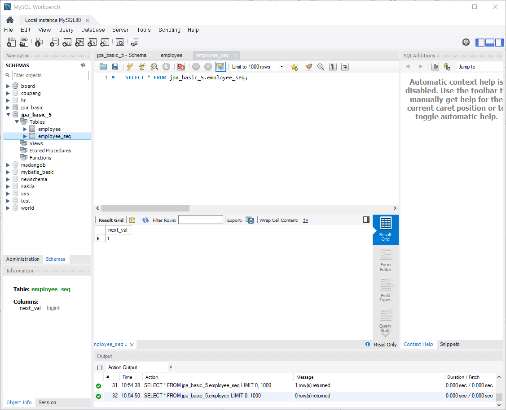

# [2024.08.19(월)] JPA/복합키/**Relationship**


# [2024.07.24(수)] JPA 복습

- 파일
    
    [JPABasic.zip](./img/20240819/JPABasic_1.zip)
    
- DB 스키마 생성 SQL
    
    ### product 테이블 생성
    
    ```sql
    CREATE TABLE `product` (
      `id` int NOT NULL,
      `name` varchar(45) DEFAULT NULL,
      PRIMARY KEY (`id`)
    );
    ```
    
    ### employee 테이블 생성
    
    ```java
    CREATE TABLE `employee` (
      `id` int NOT NULL,
      `name` varchar(45) DEFAULT NULL,
      `address` varchar(45) DEFAULT NULL,
      PRIMARY KEY (`id`)
    ) ENGINE=InnoDB DEFAULT CHARSET=utf8mb4 COLLATE=utf8mb4_0900_ai_ci;
    
    insert into employee values (1, '홍길동', '서울 어디');
    ```
    

# JPABasic_5 프로젝트 생성

- C:\Users\USER\Desktop\LGUPLUS\workspace에 생성했던 JPABasic_4 프로젝트 복사하여 JPABasic_5 프로젝트 생성
- jpa_basic_5 스키마 생성

## @GeneratedValue(strategy = GenerationType.AUTO)

### src/main/java/com/mycom/myapp

### config/MyPersistenceUnitInfo.java

```java
package com.mycom.myapp.config;

import java.net.URL;
import java.util.List;
import java.util.Properties;

import javax.sql.DataSource;

import com.zaxxer.hikari.HikariDataSource;

import jakarta.persistence.SharedCacheMode;
import jakarta.persistence.ValidationMode;
import jakarta.persistence.spi.ClassTransformer;
import jakarta.persistence.spi.PersistenceUnitInfo;
import jakarta.persistence.spi.PersistenceUnitTransactionType;

// META-INF/persistence.xml 대체
public class MyPersistenceUnitInfo implements PersistenceUnitInfo {

	@Override
	public String getPersistenceUnitName() {
		return "my-pu";
	}

	@Override
	public String getPersistenceProviderClassName() {
		return "org.hibernate.jpa.HibernatePersistenceProvider";
	}

	@Override
	public PersistenceUnitTransactionType getTransactionType() {
		return PersistenceUnitTransactionType.RESOURCE_LOCAL;
	}

	@Override
	public DataSource getJtaDataSource() {
		HikariDataSource dataSource = new HikariDataSource();
		dataSource.setJdbcUrl("jdbc:mysql://localhost:3306/jpa_basic_5");
		dataSource.setUsername("root");
		dataSource.setPassword("root");
		return dataSource;
	}

	@Override
	public DataSource getNonJtaDataSource() {
		// TODO Auto-generated method stub
		return null;
	}

	@Override
	public List<String> getMappingFileNames() {
		// TODO Auto-generated method stub
		return null;
	}

	@Override
	public List<URL> getJarFileUrls() {
		// TODO Auto-generated method stub
		return null;
	}

	@Override
	public URL getPersistenceUnitRootUrl() {
		// TODO Auto-generated method stub
		return null;
	}

	@Override
	public List<String> getManagedClassNames() {
		return List.of("com.mycom.myapp.entity.Employee");
	}

	@Override
	public boolean excludeUnlistedClasses() {
		// TODO Auto-generated method stub
		return false;
	}

	@Override
	public SharedCacheMode getSharedCacheMode() {
		// TODO Auto-generated method stub
		return null;
	}

	@Override
	public ValidationMode getValidationMode() {
		// TODO Auto-generated method stub
		return null;
	}

	@Override
	public Properties getProperties() {
		// TODO Auto-generated method stub
		return null;
	}

	@Override
	public String getPersistenceXMLSchemaVersion() {
		// TODO Auto-generated method stub
		return null;
	}

	@Override
	public ClassLoader getClassLoader() {
		// TODO Auto-generated method stub
		return null;
	}

	@Override
	public void addTransformer(ClassTransformer transformer) {
		// TODO Auto-generated method stub
		
	}

	@Override
	public ClassLoader getNewTempClassLoader() {
		// TODO Auto-generated method stub
		return null;
	}

}
```

### entity/Employee.java

```java
package com.mycom.myapp.entity;

import jakarta.persistence.Column;
import jakarta.persistence.Entity;
import jakarta.persistence.GeneratedValue;
import jakarta.persistence.GenerationType;
import jakarta.persistence.Id;
import jakarta.persistence.Table;

// entity class 에 대응하는 table명이 다르거나, field에 대응하는 column명이 다르면 
// @Table, @Column을 이용해서 적용핧 수 있다.

// Key 생성
// 운영 시는 DB에 테이블 설계에 따라 테이블 생성하고, 그 DBMS와 테이블에 맞는 Key 설정
@Entity
@Table(name = "employee") // 테이블명과 자바 Entity class 이름이 다를 경우 사용한다. 
public class Employee {
	
	@Id
	@Column(name="id")
	@GeneratedValue(strategy = GenerationType.AUTO) // jpa의 기본 전략에 의존
	private int id;
	private String name;
	private String  address;
	
	public int getId() {
		return id;
	}
	public void setId(int id) {
		this.id = id;
	}
	public String getName() {
		return name;
	}
	public void setName(String name) {
		this.name = name;
	}
	public String getAddress() {
		return address;
	}
	public void setAddress(String address) {
		this.address = address;
	}
	
	@Override
	public String toString() {
		return "Employee [id=" + id + ", name=" + name + ", address=" + address + "]";
	}
	
}
```

### Test.java

```java
package com.mycom.myapp;

import java.util.HashMap;
import java.util.Map;

import org.hibernate.jpa.HibernatePersistenceProvider;

import com.mycom.myapp.config.MyPersistenceUnitInfo;
import com.mycom.myapp.entity.Employee;

import jakarta.persistence.EntityManager;
import jakarta.persistence.EntityManagerFactory;

// Key 설정
public class Test {

	public static void main(String[] args) {

		Map<String, String> props = new HashMap<>();
		props.put("hibernate.show_sql", "true");	// sql 명령문을 확인할 수 있다.
		props.put("hibernate.hbm2ddl.auto", "create");	// 속성에 create, update 등이 올 수 있다.
		
		EntityManagerFactory emf = new HibernatePersistenceProvider().createContainerEntityManagerFactory(new MyPersistenceUnitInfo(), props);
		EntityManager em = emf.createEntityManager();
		
		try {
			em.getTransaction().begin();
			
			
			
			em.getTransaction().commit(); // update 수행
		} finally {
			em.close();
		}
		
	}

}
```

### 실행 결과

### console

```java
Hibernate: drop table if exists employee
Hibernate: drop table if exists employee_SEQ
Hibernate: create table employee (id integer not null, address varchar(255), name varchar(255), primary key (id)) engine=InnoDB
Hibernate: create table employee_SEQ (next_val bigint) engine=InnoDB
Hibernate: insert into employee_SEQ values ( 1 )
```

### MySQL



## 키 생성 옵션 - @GeneratedValue(strategy = ~ )

### src/main/java/com/mycom/myapp

### entity/Employee.java

```java
package com.mycom.myapp.entity;

import jakarta.persistence.Column;
import jakarta.persistence.Entity;
import jakarta.persistence.GeneratedValue;
import jakarta.persistence.GenerationType;
import jakarta.persistence.Id;
import jakarta.persistence.Table;

// entity class 에 대응하는 table명이 다르거나, field에 대응하는 column명이 다르면 
// @Table, @Column을 이용해서 적용핧 수 있다.

// Key 생성
// 운영 시는 DB에 테이블 설계에 따라 테이블 생성하고, 그 DBMS와 테이블에 맞는 Key 설정
@Entity
@Table(name = "employee") // 테이블명과 자바 Entity class 이름이 다를 경우 사용한다. 
public class Employee {
	
	@Id
	@Column(name="id")
	// jpa의 기본 전략에 의존, MySQL은 별도의 seq 테이블 생성, 관리 <= auto increment 지원 auto increment를 사용하는 것이 best
//	@GeneratedValue(strategy = GenerationType.AUTO)
	
	// DBMS의 auto increment 기능 사용, MySQL에 최적
//	@GeneratedValue(strategy = GenerationType.IDENTITY)
	
//	@GeneratedValue(strategy = GenerationType.SEQUENCE)
	
	// 마지막 옵션 (굳이 사용하지 않는다.)
//	@GeneratedValue(strategy = GenerationType.TABLE)
	
	@GeneratedValue(strategy = GenerationType.UUID)
	private String id;
	private String name;
	private String  address;
	
	public String getId() {
		return id;
	}
	public void setId(String id) {
		this.id = id;
	}
	public String getName() {
		return name;
	}
	public void setName(String name) {
		this.name = name;
	}
	public String getAddress() {
		return address;
	}
	public void setAddress(String address) {
		this.address = address;
	}
	
	@Override
	public String toString() {
		return "Employee [id=" + id + ", name=" + name + ", address=" + address + "]";
	}

}
```

### Test.java

```java
package com.mycom.myapp;

import java.util.HashMap;
import java.util.Map;

import org.hibernate.jpa.HibernatePersistenceProvider;

import com.mycom.myapp.config.MyPersistenceUnitInfo;
import com.mycom.myapp.entity.Employee;

import jakarta.persistence.EntityManager;
import jakarta.persistence.EntityManagerFactory;

// Key 설정
public class Test {

	public static void main(String[] args) {

		Map<String, String> props = new HashMap<>();
		props.put("hibernate.show_sql", "true");	// sql 명령문을 확인할 수 있다.
		props.put("hibernate.hbm2ddl.auto", "update");	// 속성에 create, update 등이 올 수 있다.
		
		EntityManagerFactory emf = new HibernatePersistenceProvider().createContainerEntityManagerFactory(new MyPersistenceUnitInfo(), props);
		EntityManager em = emf.createEntityManager();
		
		try {
			em.getTransaction().begin();
			
			{
				Employee emp = new Employee();
				emp.setName("홍길동");
				emp.setAddress("경기 어디");
				
				em.persist(emp);
			}
			
			em.getTransaction().commit(); // update 수행
		} finally {
			em.close();
		}
		
	}

}
```

### src/main/java/com/mycom/myapp

### entity/Employee.java

```java
package com.mycom.myapp.entity;

import jakarta.persistence.Column;
import jakarta.persistence.Entity;
import jakarta.persistence.GeneratedValue;
import jakarta.persistence.GenerationType;
import jakarta.persistence.Id;
import jakarta.persistence.Table;

// entity class 에 대응하는 table명이 다르거나, field에 대응하는 column명이 다르면 
// @Table, @Column을 이용해서 적용핧 수 있다.

// Key 생성
// 운영 시는 DB에 테이블 설계에 따라 테이블 생성하고, 그 DBMS와 테이블에 맞는 Key 설정
@Entity
@Table(name = "employee") // 테이블명과 자바 Entity class 이름이 다를 경우 사용한다. 
public class Employee {
	
	@Id
	@Column(name="id")
	// jpa의 기본 전략에 의존, MySQL은 별도의 seq 테이블 생성, 관리 <= auto increment 지원 auto increment를 사용하는 것이 best
	// setId() 사용이 불가능하다.
//	@GeneratedValue(strategy = GenerationType.AUTO)
	
	// DBMS의 auto increment 기능 사용, MySQL에 최적
	@GeneratedValue(strategy = GenerationType.IDENTITY)
	
//	@GeneratedValue(strategy = GenerationType.SEQUENCE)
	
	// 마지막 옵션 (굳이 사용하지 않는다.)
//	@GeneratedValue(strategy = GenerationType.TABLE)
	
//	@GeneratedValue(strategy = GenerationType.UUID)
//	private String id;
	private int id;
	private String name;
	private String  address;
	
	public int getId() {
		return id;
	}
	public void setId(int id) {
		this.id = id;
	}
	public String getName() {
		return name;
	}
	public void setName(String name) {
		this.name = name;
	}
	public String getAddress() {
		return address;
	}
	public void setAddress(String address) {
		this.address = address;
	}
	
	@Override
	public String toString() {
		return "Employee [id=" + id + ", name=" + name + ", address=" + address + "]";
	}
	
}
```

### Test.java

```java
package com.mycom.myapp;

import java.util.HashMap;
import java.util.Map;

import org.hibernate.jpa.HibernatePersistenceProvider;

import com.mycom.myapp.config.MyPersistenceUnitInfo;
import com.mycom.myapp.entity.Employee;

import jakarta.persistence.EntityManager;
import jakarta.persistence.EntityManagerFactory;

// Key 설정
public class Test {

	public static void main(String[] args) {

		Map<String, String> props = new HashMap<>();
		props.put("hibernate.show_sql", "true");	// sql 명령문을 확인할 수 있다.
		props.put("hibernate.hbm2ddl.auto", "create");	// 속성에 create, update 등이 올 수 있다.
		
		EntityManagerFactory emf = new HibernatePersistenceProvider().createContainerEntityManagerFactory(new MyPersistenceUnitInfo(), props);
		EntityManager em = emf.createEntityManager();
		
		try {
			em.getTransaction().begin();
			
			{
				Employee emp = new Employee();
				// AUTO, IDENTITY일 때, Key를 명시적으로 설정하면 오류 발생
				// org.hibernate.PersistentObjectException: detached entity passed to persist: com.mycom.myapp.entity.Employee
//				emp.setId(1);
				emp.setName("홍길동");
				emp.setAddress("경기 어디");
				
				em.persist(emp);
			}
			
			em.getTransaction().commit(); // update 수행
		} finally {
			em.close();
		}
		
	}

}
```

## 복합키 생성 방법1- @IdClass(~.**class**)

### src/main/java/com/mycom/myapp

### entity/Product.java

```java
package com.mycom.myapp.entity;

import com.mycom.myapp.entity.key.ProductKey;

import jakarta.persistence.Entity;
import jakarta.persistence.Id;
import jakarta.persistence.IdClass;

@Entity
@IdClass(ProductKey.class)
public class Product {
	
	@Id
	private String code; // 제품코드 (PK)
	@Id
	private long number; // 제품번호 (PK)
	
	private String color; // 제품색상

	public String getCode() {
		return code;
	}

	public void setCode(String code) {
		this.code = code;
	}

	public long getNumber() {
		return number;
	}

	public void setNumber(long number) {
		this.number = number;
	}

	public String getColor() {
		return color;
	}

	public void setColor(String color) {
		this.color = color;
	}

	@Override
	public String toString() {
		return "Product [code=" + code + ", number=" + number + ", color=" + color + "]";
	}
	
}
```

### entity/key/ProductKey.java

```java
package com.mycom.myapp.entity.key;

import java.io.Serializable;
import java.util.Objects;

import jakarta.persistence.Id;

// 복합키를 표현
// @IdClass 사용될 조건
// public class
// 기본 생성자
// equals() & hashCode() override
// Serializable
public class ProductKey implements Serializable {
	
	private String code; // 제품코드 (PK)
	private long number; // 제품번호 (PK)
	
	public String getCode() {
		return code;
	}
	public void setCode(String code) {
		this.code = code;
	}
	public long getNumber() {
		return number;
	}
	public void setNumber(long number) {
		this.number = number;
	}
	
	@Override
	public int hashCode() {
		return Objects.hash(code, number);
	}
	
	@Override
	public boolean equals(Object obj) {
		if (this == obj)
			return true;
		if (obj == null)
			return false;
		if (getClass() != obj.getClass())
			return false;
		ProductKey other = (ProductKey) obj;
		return Objects.equals(code, other.code) && number == other.number;
	}
	
}
```

### config/MyPersistenceUnitInfo.java

```java
package com.mycom.myapp.config;

import java.net.URL;
import java.util.List;
import java.util.Properties;

import javax.sql.DataSource;

import com.zaxxer.hikari.HikariDataSource;

import jakarta.persistence.SharedCacheMode;
import jakarta.persistence.ValidationMode;
import jakarta.persistence.spi.ClassTransformer;
import jakarta.persistence.spi.PersistenceUnitInfo;
import jakarta.persistence.spi.PersistenceUnitTransactionType;

// META-INF/persistence.xml 대체
public class MyPersistenceUnitInfo implements PersistenceUnitInfo {

	@Override
	public String getPersistenceUnitName() {
		return "my-pu";
	}

	@Override
	public String getPersistenceProviderClassName() {
		return "org.hibernate.jpa.HibernatePersistenceProvider";
	}

	@Override
	public PersistenceUnitTransactionType getTransactionType() {
		return PersistenceUnitTransactionType.RESOURCE_LOCAL;
	}

	@Override
	public DataSource getJtaDataSource() {
		HikariDataSource dataSource = new HikariDataSource();
		dataSource.setJdbcUrl("jdbc:mysql://localhost:3306/jpa_basic_5");
		dataSource.setUsername("root");
		dataSource.setPassword("root");
		return dataSource;
	}

	@Override
	public DataSource getNonJtaDataSource() {
		// TODO Auto-generated method stub
		return null;
	}

	@Override
	public List<String> getMappingFileNames() {
		// TODO Auto-generated method stub
		return null;
	}

	@Override
	public List<URL> getJarFileUrls() {
		// TODO Auto-generated method stub
		return null;
	}

	@Override
	public URL getPersistenceUnitRootUrl() {
		// TODO Auto-generated method stub
		return null;
	}

	@Override
	public List<String> getManagedClassNames() {
		return List.of("com.mycom.myapp.entity.Employee", "com.mycom.myapp.entity.Product");
	}

	@Override
	public boolean excludeUnlistedClasses() {
		// TODO Auto-generated method stub
		return false;
	}

	@Override
	public SharedCacheMode getSharedCacheMode() {
		// TODO Auto-generated method stub
		return null;
	}

	@Override
	public ValidationMode getValidationMode() {
		// TODO Auto-generated method stub
		return null;
	}

	@Override
	public Properties getProperties() {
		// TODO Auto-generated method stub
		return null;
	}

	@Override
	public String getPersistenceXMLSchemaVersion() {
		// TODO Auto-generated method stub
		return null;
	}

	@Override
	public ClassLoader getClassLoader() {
		// TODO Auto-generated method stub
		return null;
	}

	@Override
	public void addTransformer(ClassTransformer transformer) {
		// TODO Auto-generated method stub
		
	}

	@Override
	public ClassLoader getNewTempClassLoader() {
		// TODO Auto-generated method stub
		return null;
	}

}
```

### Test.java

```java
package com.mycom.myapp;

import java.util.HashMap;
import java.util.Map;

import org.hibernate.jpa.HibernatePersistenceProvider;

import com.mycom.myapp.config.MyPersistenceUnitInfo;
import com.mycom.myapp.entity.Employee;
import com.mycom.myapp.entity.Product;
import com.mycom.myapp.entity.key.ProductKey;

import jakarta.persistence.EntityManager;
import jakarta.persistence.EntityManagerFactory;

// Key 설정
public class Test {

	public static void main(String[] args) {

		Map<String, String> props = new HashMap<>();
		props.put("hibernate.show_sql", "true");	// sql 명령문을 확인할 수 있다.
		props.put("hibernate.hbm2ddl.auto", "create");	// 속성에 create, update 등이 올 수 있다.
		
		EntityManagerFactory emf = new HibernatePersistenceProvider().createContainerEntityManagerFactory(new MyPersistenceUnitInfo(), props);
		EntityManager em = emf.createEntityManager();
		
		try {
			em.getTransaction().begin();
			
			// Key 생성 옵션
			{
				Employee emp = new Employee();
				// AUTO, IDENTITY일 때, Key를 명시적으로 설정하면 오류 발생
				// org.hibernate.PersistentObjectException: detached entity passed to persist: com.mycom.myapp.entity.Employee
//				emp.setId(1);
				emp.setName("홍길동");
				emp.setAddress("경기 어디");
				
				em.persist(emp);
			}
			
			// 복합키 생성
			{
				// persist
				Product p =  new Product();
				p.setCode("uplus");
				p.setNumber(1L);
				p.setColor("blue");
				
				em.persist(p);
				
				// find
				ProductKey key = new ProductKey();
				key.setCode("uplus");
				key.setNumber(1L);
				
				Product p2 = em.find(Product.class, key); // key 연결
				System.out.println(p);
			}
			
			em.getTransaction().commit(); // update 수행
		} finally {
			em.close();
		}
				
	}

}
```

## 복합키 생성 방법2- @EmbeddedId

### src/main/java/com/mycom/myapp

### entity/Student.java

```java
package com.mycom.myapp.entity;

import com.mycom.myapp.entity.key.StudentKey;

import jakarta.persistence.EmbeddedId;
import jakarta.persistence.Entity;

@Entity
public class Student {

	@EmbeddedId
	private StudentKey id;
	
	private String name;

	public StudentKey getId() {
		return id;
	}

	public void setId(StudentKey id) {
		this.id = id;
	}

	public String getName() {
		return name;
	}

	public void setName(String name) {
		this.name = name;
	}

	@Override
	public String toString() {
		return "Student [id=" + id + ", name=" + name + "]";
	}
	
}
```

### entity/key/StudentKey.java

```java
package com.mycom.myapp.entity.key;

import java.io.Serializable;
import java.util.Objects;

import jakarta.persistence.Embeddable;

@Embeddable
public class StudentKey implements Serializable {

	private String code; 
	private long number; 
	
	public String getCode() {
		return code;
	}
	public void setCode(String code) {
		this.code = code;
	}
	public long getNumber() {
		return number;
	}
	public void setNumber(long number) {
		this.number = number;
	}
	
	@Override
	public int hashCode() {
		return Objects.hash(code, number);
	}
	@Override
	public boolean equals(Object obj) {
		if (this == obj)
			return true;
		if (obj == null)
			return false;
		if (getClass() != obj.getClass())
			return false;
		StudentKey other = (StudentKey) obj;
		return Objects.equals(code, other.code) && number == other.number;
	}
		
}
```

### config/MyPersistenceUnitInfo.java

```java
package com.mycom.myapp.config;

import java.net.URL;
import java.util.List;
import java.util.Properties;

import javax.sql.DataSource;

import com.zaxxer.hikari.HikariDataSource;

import jakarta.persistence.SharedCacheMode;
import jakarta.persistence.ValidationMode;
import jakarta.persistence.spi.ClassTransformer;
import jakarta.persistence.spi.PersistenceUnitInfo;
import jakarta.persistence.spi.PersistenceUnitTransactionType;

// META-INF/persistence.xml 대체
public class MyPersistenceUnitInfo implements PersistenceUnitInfo {

	@Override
	public String getPersistenceUnitName() {
		return "my-pu";
	}

	@Override
	public String getPersistenceProviderClassName() {
		return "org.hibernate.jpa.HibernatePersistenceProvider";
	}

	@Override
	public PersistenceUnitTransactionType getTransactionType() {
		return PersistenceUnitTransactionType.RESOURCE_LOCAL;
	}

	@Override
	public DataSource getJtaDataSource() {
		HikariDataSource dataSource = new HikariDataSource();
		dataSource.setJdbcUrl("jdbc:mysql://localhost:3306/jpa_basic_5");
		dataSource.setUsername("root");
		dataSource.setPassword("root");
		return dataSource;
	}

	@Override
	public DataSource getNonJtaDataSource() {
		// TODO Auto-generated method stub
		return null;
	}

	@Override
	public List<String> getMappingFileNames() {
		// TODO Auto-generated method stub
		return null;
	}

	@Override
	public List<URL> getJarFileUrls() {
		// TODO Auto-generated method stub
		return null;
	}

	@Override
	public URL getPersistenceUnitRootUrl() {
		// TODO Auto-generated method stub
		return null;
	}

	@Override
	public List<String> getManagedClassNames() {
		return List.of("com.mycom.myapp.entity.Employee", "com.mycom.myapp.entity.Product", "com.mycom.myapp.entity.Student");
	}

	@Override
	public boolean excludeUnlistedClasses() {
		// TODO Auto-generated method stub
		return false;
	}

	@Override
	public SharedCacheMode getSharedCacheMode() {
		// TODO Auto-generated method stub
		return null;
	}

	@Override
	public ValidationMode getValidationMode() {
		// TODO Auto-generated method stub
		return null;
	}

	@Override
	public Properties getProperties() {
		// TODO Auto-generated method stub
		return null;
	}

	@Override
	public String getPersistenceXMLSchemaVersion() {
		// TODO Auto-generated method stub
		return null;
	}

	@Override
	public ClassLoader getClassLoader() {
		// TODO Auto-generated method stub
		return null;
	}

	@Override
	public void addTransformer(ClassTransformer transformer) {
		// TODO Auto-generated method stub
		
	}

	@Override
	public ClassLoader getNewTempClassLoader() {
		// TODO Auto-generated method stub
		return null;
	}

}
```

### Test.java

```java
package com.mycom.myapp;

import java.util.HashMap;
import java.util.Map;

import org.hibernate.jpa.HibernatePersistenceProvider;

import com.mycom.myapp.config.MyPersistenceUnitInfo;
import com.mycom.myapp.entity.Employee;
import com.mycom.myapp.entity.Student;
import com.mycom.myapp.entity.key.StudentKey;

import jakarta.persistence.EntityManager;
import jakarta.persistence.EntityManagerFactory;

// Key 설정
public class Test {

	public static void main(String[] args) {

		Map<String, String> props = new HashMap<>();
		props.put("hibernate.show_sql", "true");	// sql 명령문을 확인할 수 있다.
		props.put("hibernate.hbm2ddl.auto", "update");	// 속성에 create, update 등이 올 수 있다.
		
		EntityManagerFactory emf = new HibernatePersistenceProvider().createContainerEntityManagerFactory(new MyPersistenceUnitInfo(), props);
		EntityManager em = emf.createEntityManager();
		
		try {
			em.getTransaction().begin();
			
			// Key 생성 옵션
			{
				Employee emp = new Employee();
				// AUTO, IDENTITY일 때, Key를 명시적으로 설정하면 오류 발생
				// org.hibernate.PersistentObjectException: detached entity passed to persist: com.mycom.myapp.entity.Employee
//				emp.setId(1);
				emp.setName("홍길동");
				emp.setAddress("경기 어디");
				
				em.persist(emp);
			}
			
			// 복합키 생성
//			{
//				// persist
////				Product p =  new Product();
////				p.setCode("uplus");
////				p.setNumber(1L);
////				p.setColor("blue");
////				
////				em.persist(p);
//				
//				// find
//				ProductKey key = new ProductKey();
////				key.setCode("uplus2");
//				key.setCode("uplus");
//				key.setNumber(1L);
//				
//				Product p2 = em.find(Product.class, key); // key 연결
//				System.out.println(p2);
//			}
			
			// @EmbeddedId
			{
				// persist
				// StudentKey를 먼저 생성한다.
//				StudentKey key = new StudentKey();
//				key.setCode("uplus");
//				key.setNumber(1);
//				
//				Student s = new Student();
//				s.setId(key);
//				s.setName("홍길동");
//				
//				em.persist(s);
				
				// persist
				// StudentKey를 먼저 생성한다.
				StudentKey key = new StudentKey();
				key.setCode("uplus");
				key.setNumber(1);
				
				Student s2 = em.find(Student.class, key);
				System.out.println(s2);
			}
			
			em.getTransaction().commit(); // update 수행
		} finally {
			em.close();
		}
		
		
	}

}
```

## 복합키 생성 연습 - Orders (@EmbeddedId 사용)

### src/main/java/com/mycom/myapp

### entity/Order.java

```java
package com.mycom.myapp.entity;

import com.mycom.myapp.entity.key.OrderKey;

import jakarta.persistence.EmbeddedId;
import jakarta.persistence.Entity;

// Oder 문제 연습
@Entity(name = "orders")
public class Order {
//	private int productId;  // 제품ID
//	private int customerId; // 고객ID
	
	@EmbeddedId
	private OrderKey id;
	
	private int orderCnt;   // 주문 수량

	public OrderKey getId() {
		return id;
	}

	public void setId(OrderKey id) {
		this.id = id;
	}

	public int getOrderCnt() {
		return orderCnt;
	}

	public void setOrderCnt(int orderCnt) {
		this.orderCnt = orderCnt;
	}

	@Override
	public String toString() {
		return "Order [id=" + id + ", orderCnt=" + orderCnt + "]";
	}

}

// productId, customerId 복합키 구성
// 테이블명 : orders
// key column
// 	product_id
//  customer_id

// 위 Order 클래스를 JPA Entity 만들고, 복합키를 이용한 persist, find 예제 작성
```

### entity/key/OrderKey.java

```java
package com.mycom.myapp.entity.key;

import java.io.Serializable;
import java.util.Objects;

import jakarta.persistence.Column;
import jakarta.persistence.Embeddable;

// Oder 문제 연습
@Embeddable
public class OrderKey implements Serializable {
	
	@Column(name = "product_id")
	private int productId;  // 제품ID
	
	@Column(name = "customer_id")
	private int customerId; // 고객ID

	public int getProductId() {
		return productId;
	}

	public void setProductId(int productId) {
		this.productId = productId;
	}

	public int getCustomerId() {
		return customerId;
	}

	public void setCustomerId(int customerId) {
		this.customerId = customerId;
	}

	@Override
	public int hashCode() {
		return Objects.hash(customerId, productId);
	}

	@Override
	public boolean equals(Object obj) {
		if (this == obj)
			return true;
		if (obj == null)
			return false;
		if (getClass() != obj.getClass())
			return false;
		OrderKey other = (OrderKey) obj;
		return customerId == other.customerId && productId == other.productId;
	}

}
```

### config/MyPersistenceUnitInfo.java

```java
package com.mycom.myapp.config;

import java.net.URL;
import java.util.List;
import java.util.Properties;

import javax.sql.DataSource;

import com.zaxxer.hikari.HikariDataSource;

import jakarta.persistence.SharedCacheMode;
import jakarta.persistence.ValidationMode;
import jakarta.persistence.spi.ClassTransformer;
import jakarta.persistence.spi.PersistenceUnitInfo;
import jakarta.persistence.spi.PersistenceUnitTransactionType;

// META-INF/persistence.xml 대체
public class MyPersistenceUnitInfo implements PersistenceUnitInfo {

	@Override
	public String getPersistenceUnitName() {
		return "my-pu";
	}

	@Override
	public String getPersistenceProviderClassName() {
		return "org.hibernate.jpa.HibernatePersistenceProvider";
	}

	@Override
	public PersistenceUnitTransactionType getTransactionType() {
		return PersistenceUnitTransactionType.RESOURCE_LOCAL;
	}

	@Override
	public DataSource getJtaDataSource() {
		HikariDataSource dataSource = new HikariDataSource();
		dataSource.setJdbcUrl("jdbc:mysql://localhost:3306/jpa_basic_5");
		dataSource.setUsername("root");
		dataSource.setPassword("root");
		return dataSource;
	}

	@Override
	public DataSource getNonJtaDataSource() {
		// TODO Auto-generated method stub
		return null;
	}

	@Override
	public List<String> getMappingFileNames() {
		// TODO Auto-generated method stub
		return null;
	}

	@Override
	public List<URL> getJarFileUrls() {
		// TODO Auto-generated method stub
		return null;
	}

	@Override
	public URL getPersistenceUnitRootUrl() {
		// TODO Auto-generated method stub
		return null;
	}

	@Override
	public List<String> getManagedClassNames() {
		return List.of("com.mycom.myapp.entity.Employee", "com.mycom.myapp.entity.Product", "com.mycom.myapp.entity.Student", "com.mycom.myapp.entity.Order");
	}

	@Override
	public boolean excludeUnlistedClasses() {
		// TODO Auto-generated method stub
		return false;
	}

	@Override
	public SharedCacheMode getSharedCacheMode() {
		// TODO Auto-generated method stub
		return null;
	}

	@Override
	public ValidationMode getValidationMode() {
		// TODO Auto-generated method stub
		return null;
	}

	@Override
	public Properties getProperties() {
		// TODO Auto-generated method stub
		return null;
	}

	@Override
	public String getPersistenceXMLSchemaVersion() {
		// TODO Auto-generated method stub
		return null;
	}

	@Override
	public ClassLoader getClassLoader() {
		// TODO Auto-generated method stub
		return null;
	}

	@Override
	public void addTransformer(ClassTransformer transformer) {
		// TODO Auto-generated method stub
		
	}

	@Override
	public ClassLoader getNewTempClassLoader() {
		// TODO Auto-generated method stub
		return null;
	}

}
```

### Test.java

```java
package com.mycom.myapp;

import java.util.HashMap;
import java.util.Map;

import org.hibernate.jpa.HibernatePersistenceProvider;

import com.mycom.myapp.config.MyPersistenceUnitInfo;
import com.mycom.myapp.entity.Employee;
import com.mycom.myapp.entity.Order;
import com.mycom.myapp.entity.Student;
import com.mycom.myapp.entity.key.OrderKey;
import com.mycom.myapp.entity.key.StudentKey;

import jakarta.persistence.EntityManager;
import jakarta.persistence.EntityManagerFactory;

// Key 설정
public class Test {

	public static void main(String[] args) {

		Map<String, String> props = new HashMap<>();
		props.put("hibernate.show_sql", "true");	// sql 명령문을 확인할 수 있다.
		props.put("hibernate.hbm2ddl.auto", "update");	// 속성에 create, update 등이 올 수 있다.
		
		EntityManagerFactory emf = new HibernatePersistenceProvider().createContainerEntityManagerFactory(new MyPersistenceUnitInfo(), props);
		EntityManager em = emf.createEntityManager();
		
		try {
			em.getTransaction().begin();
			
			// Key 생성 옵션
			{
//				Employee emp = new Employee();
				// AUTO, IDENTITY일 때, Key를 명시적으로 설정하면 오류 발생
				// org.hibernate.PersistentObjectException: detached entity passed to persist: com.mycom.myapp.entity.Employee
//				emp.setId(1);
//				emp.setName("홍길동");
//				emp.setAddress("경기 어디");
//				
//				em.persist(emp);
			}
			
			// 복합키 생성
//			{
//				// persist
////				Product p =  new Product();
////				p.setCode("uplus");
////				p.setNumber(1L);
////				p.setColor("blue");
////				
////				em.persist(p);
//				
//				// find
//				ProductKey key = new ProductKey();
////				key.setCode("uplus2");
//				key.setCode("uplus");
//				key.setNumber(1L);
//				
//				Product p2 = em.find(Product.class, key); // key 연결
//				System.out.println(p2);
//			}
			
			// @EmbeddedId
			{
				// persist
				// StudentKey를 먼저 생성한다.
//				StudentKey key = new StudentKey();
//				key.setCode("uplus");
//				key.setNumber(1);
//				
//				Student s = new Student();
//				s.setId(key);
//				s.setName("홍길동");
//				
//				em.persist(s);
				
				// find
//				StudentKey key = new StudentKey();
//				key.setCode("uplus");
//				key.setNumber(1);
//				
//				Student s2 = em.find(Student.class, key);
//				System.out.println(s2);
			}
			
			// order 복합키 작성 과제
			{
				// persist
//				OrderKey key = new OrderKey();
//				key.setProductId(1);
//				key.setCustomerId(1);
//				
//				Order o = new Order();
//				o.setId(key);
//				o.setOrderCnt(1);
//				
//				em.persist(o);
				
				// find
				OrderKey key = new OrderKey();
				key.setProductId(1);
				key.setCustomerId(1);
				
				Order o2 = em.find(Order.class, key);
				System.out.println(o2);
			}
			
			
			em.getTransaction().commit(); // update 수행
		} finally {
			em.close();
		}
		
	}

}
```

## 복합키 생성 답안 - Orders (@IdClass(OrderKey.class) 사용)

### src/main/java/com/mycom/myapp

### entity/Order.java

```java
package com.mycom.myapp.entity;
import com.mycom.myapp.entity.key.OrderKey;
import jakarta.persistence.Column;
import jakarta.persistence.Entity;
import jakarta.persistence.Id;
import jakarta.persistence.IdClass;
import jakarta.persistence.Table;
@Entity
@Table(name = "orders")
@IdClass(OrderKey.class)
public class Order {
    @Id
    @Column(name = "product_id")
    private int productId; // 제품 ID
    @Id
    @Column(name = "customer_id")
    private int customerId; // 고객 ID
    
    private int orderCnt;  // 주문 수량
    
    public int getProductId() {
        return productId;
    }
    public void setProductId(int productId) {
        this.productId = productId;
    }
    public int getCustomerId() {
        return customerId;
    }
    public void setCustomerId(int customerId) {
        this.customerId = customerId;
    }
    public int getOrderCnt() {
        return orderCnt;
    }
    public void setOrderCnt(int orderCnt) {
        this.orderCnt = orderCnt;
    }
    @Override
    public String toString() {
        return "Order [productId=" + productId + ", customerId=" + customerId + ", orderCnt=" + orderCnt + "]";
    }
}
// productId, customerId 복합키 구성
// 테이블명 : orders
// key column 
//    product_id
//    customer_id
//  위 Order 클래스를 JPA Entity 만들고, 복합키를 이용한 persist, find 예제 작성
```

### entity/key/OrderKey.java

```java
package com.mycom.myapp.entity.key;
import java.io.Serializable;
import java.util.Objects;
import jakarta.persistence.Embeddable;
public class OrderKey implements Serializable{
    private int productId;
    private int customerId;
    
    public int getProductId() {
        return productId;
    }
    public void setProductId(int productId) {
        this.productId = productId;
    }
    public int getCustomerId() {
        return customerId;
    }
    public void setCustomerId(int customerId) {
        this.customerId = customerId;
    }
    
    @Override
    public int hashCode() {
        return Objects.hash(customerId, productId);
    }
    @Override
    public boolean equals(Object obj) {
        if (this == obj)
            return true;
        if (obj == null)
            return false;
        if (getClass() != obj.getClass())
            return false;
        OrderKey other = (OrderKey) obj;
        return customerId == other.customerId && productId == other.productId;
    }
  
}
```

### config/MyPersistenceUnitInfo.java

```java
package com.mycom.myapp.config;

import java.net.URL;
import java.util.List;
import java.util.Properties;

import javax.sql.DataSource;

import com.zaxxer.hikari.HikariDataSource;

import jakarta.persistence.SharedCacheMode;
import jakarta.persistence.ValidationMode;
import jakarta.persistence.spi.ClassTransformer;
import jakarta.persistence.spi.PersistenceUnitInfo;
import jakarta.persistence.spi.PersistenceUnitTransactionType;

// META-INF/persistence.xml 대체
public class MyPersistenceUnitInfo implements PersistenceUnitInfo {

	@Override
	public String getPersistenceUnitName() {
		return "my-pu";
	}

	@Override
	public String getPersistenceProviderClassName() {
		return "org.hibernate.jpa.HibernatePersistenceProvider";
	}

	@Override
	public PersistenceUnitTransactionType getTransactionType() {
		return PersistenceUnitTransactionType.RESOURCE_LOCAL;
	}

	@Override
	public DataSource getJtaDataSource() {
		HikariDataSource dataSource = new HikariDataSource();
		dataSource.setJdbcUrl("jdbc:mysql://localhost:3306/jpa_basic_5");
		dataSource.setUsername("root");
		dataSource.setPassword("root");
		return dataSource;
	}

	@Override
	public DataSource getNonJtaDataSource() {
		// TODO Auto-generated method stub
		return null;
	}

	@Override
	public List<String> getMappingFileNames() {
		// TODO Auto-generated method stub
		return null;
	}

	@Override
	public List<URL> getJarFileUrls() {
		// TODO Auto-generated method stub
		return null;
	}

	@Override
	public URL getPersistenceUnitRootUrl() {
		// TODO Auto-generated method stub
		return null;
	}

	@Override
	public List<String> getManagedClassNames() {
		return List.of("com.mycom.myapp.entity.Employee", "com.mycom.myapp.entity.Product", "com.mycom.myapp.entity.Student", "com.mycom.myapp.entity.Order");
	}

	@Override
	public boolean excludeUnlistedClasses() {
		// TODO Auto-generated method stub
		return false;
	}

	@Override
	public SharedCacheMode getSharedCacheMode() {
		// TODO Auto-generated method stub
		return null;
	}

	@Override
	public ValidationMode getValidationMode() {
		// TODO Auto-generated method stub
		return null;
	}

	@Override
	public Properties getProperties() {
		// TODO Auto-generated method stub
		return null;
	}

	@Override
	public String getPersistenceXMLSchemaVersion() {
		// TODO Auto-generated method stub
		return null;
	}

	@Override
	public ClassLoader getClassLoader() {
		// TODO Auto-generated method stub
		return null;
	}

	@Override
	public void addTransformer(ClassTransformer transformer) {
		// TODO Auto-generated method stub
		
	}

	@Override
	public ClassLoader getNewTempClassLoader() {
		// TODO Auto-generated method stub
		return null;
	}

}
```

### Test.java

```java
package com.mycom.myapp;

import java.util.HashMap;
import java.util.Map;

import org.hibernate.jpa.HibernatePersistenceProvider;

import com.mycom.myapp.config.MyPersistenceUnitInfo;
import com.mycom.myapp.entity.Employee;
import com.mycom.myapp.entity.Order;
import com.mycom.myapp.entity.Student;
import com.mycom.myapp.entity.key.OrderKey;
import com.mycom.myapp.entity.key.StudentKey;

import jakarta.persistence.EntityManager;
import jakarta.persistence.EntityManagerFactory;

// Key 설정
public class Test {

	public static void main(String[] args) {

		Map<String, String> props = new HashMap<>();
		props.put("hibernate.show_sql", "true");	// sql 명령문을 확인할 수 있다.
		props.put("hibernate.hbm2ddl.auto", "update");	// 속성에 create, update 등이 올 수 있다.
		
		EntityManagerFactory emf = new HibernatePersistenceProvider().createContainerEntityManagerFactory(new MyPersistenceUnitInfo(), props);
		EntityManager em = emf.createEntityManager();
		
		try {
			em.getTransaction().begin();
			
			{
                // persist
//              Order o = new Order();
//              o.setProductId(1);
//              o.setCustomerId(1);
//              o.setOrderCnt(10);
//              
//              em.persist(o);
                
                // find
                OrderKey key = new OrderKey();
                key.setProductId(1);
                key.setCustomerId(1);
                
                Order o2 = em.find(Order.class, key);
                System.out.println(o2);
            }
			
			em.getTransaction().commit(); // update 수행
		} finally {
			em.close();
		}
		
	}

}
```

# **Relationship**

1. OneToOne
    - 사람(개인) - 신분증
    - 집 - 집 전화번호
    - 집(건물) - 주소
    - 자동차 - 수동키
    - 학생 - 학번
2. OneToMany, ManyToOne
3. ManyToMany

relationship

- 단방향 (A → B) (B →A 불가능) (Uni-Directional)
- 양방향(A ↔ B) (Bi-directional)
- ownership 관계의 주인 (FK를 가지고 있는 테이블이 ownership을 가지고 있다)

# JPABasic_6_OneToOne_UNI 프로젝트 생성

- JPABasic_5 프로젝트 복사하여 JPABasic_6_OneToOne_UNI 프로젝트 생성
- jpa_basic_6 스키마 생성
- entity 패키지에 생성한 클래스 모두 삭제

## 단방향 @OneToOne 실습

## @OneToOne 실습

### src/main/java/com/mycom/myapp

### entity/Person.java

```java
package com.mycom.myapp.entity;

import jakarta.persistence.Entity;
import jakarta.persistence.GeneratedValue;
import jakarta.persistence.GenerationType;
import jakarta.persistence.Id;
import jakarta.persistence.JoinColumn;
import jakarta.persistence.OneToOne;

// Person 1명당 Passport 1개를 가진다.
@Entity
public class Person {
	
	@Id
	@GeneratedValue(strategy = GenerationType.IDENTITY)
	private int id;
	
	private String name;
	
	@OneToOne
	// JoinColumn을 가진 Entity가 관계에서 Ownership을 가진다.
	@JoinColumn(name = "passport") // passport 컬럼명 명시적으로 지정
	private Passport passport;

	public int getId() {
		return id;
	}

	public void setId(int id) {
		this.id = id;
	}

	public String getName() {
		return name;
	}

	public void setName(String name) {
		this.name = name;
	}

	public Passport getPassport() {
		return passport;
	}

	public void setPassport(Passport passport) {
		this.passport = passport;
	}

	// toString에  passport를 사용하고 있다.
	@Override
	public String toString() {
		return "Person [id=" + id + ", name=" + name + ", passport=" + passport + "]";
	}
	
}
```

### entity/Passport.java

```java
package com.mycom.myapp.entity;

import jakarta.persistence.Entity;
import jakarta.persistence.GeneratedValue;
import jakarta.persistence.GenerationType;
import jakarta.persistence.Id;

@Entity
public class Passport {
	
	@Id
	@GeneratedValue(strategy = GenerationType.IDENTITY)
	private int id;
	
	private String number;

	public int getId() {
		return id;
	}

	public void setId(int id) {
		this.id = id;
	}

	public String getNumber() {
		return number;
	}

	public void setNumber(String number) {
		this.number = number;
	}

	@Override
	public String toString() {
		return "Passport [id=" + id + ", number=" + number + "]";
	}
	
}
```

### config/MyPersistenceUnitInfo.java

```java
package com.mycom.myapp.config;

import java.net.URL;
import java.util.List;
import java.util.Properties;

import javax.sql.DataSource;

import com.zaxxer.hikari.HikariDataSource;

import jakarta.persistence.SharedCacheMode;
import jakarta.persistence.ValidationMode;
import jakarta.persistence.spi.ClassTransformer;
import jakarta.persistence.spi.PersistenceUnitInfo;
import jakarta.persistence.spi.PersistenceUnitTransactionType;

// META-INF/persistence.xml 대체
public class MyPersistenceUnitInfo implements PersistenceUnitInfo {

	@Override
	public String getPersistenceUnitName() {
		return "my-pu";
	}

	@Override
	public String getPersistenceProviderClassName() {
		return "org.hibernate.jpa.HibernatePersistenceProvider";
	}

	@Override
	public PersistenceUnitTransactionType getTransactionType() {
		return PersistenceUnitTransactionType.RESOURCE_LOCAL;
	}

	@Override
	public DataSource getJtaDataSource() {
		HikariDataSource dataSource = new HikariDataSource();
		dataSource.setJdbcUrl("jdbc:mysql://localhost:3306/jpa_basic_6");
		dataSource.setUsername("root");
		dataSource.setPassword("root");
		return dataSource;
	}

	@Override
	public DataSource getNonJtaDataSource() {
		// TODO Auto-generated method stub
		return null;
	}

	@Override
	public List<String> getMappingFileNames() {
		// TODO Auto-generated method stub
		return null;
	}

	@Override
	public List<URL> getJarFileUrls() {
		// TODO Auto-generated method stub
		return null;
	}

	@Override
	public URL getPersistenceUnitRootUrl() {
		// TODO Auto-generated method stub
		return null;
	}

	@Override
	public List<String> getManagedClassNames() {
		return List.of("com.mycom.myapp.entity.Person", "com.mycom.myapp.entity.Passport");
	}

	@Override
	public boolean excludeUnlistedClasses() {
		// TODO Auto-generated method stub
		return false;
	}

	@Override
	public SharedCacheMode getSharedCacheMode() {
		// TODO Auto-generated method stub
		return null;
	}

	@Override
	public ValidationMode getValidationMode() {
		// TODO Auto-generated method stub
		return null;
	}

	@Override
	public Properties getProperties() {
		// TODO Auto-generated method stub
		return null;
	}

	@Override
	public String getPersistenceXMLSchemaVersion() {
		// TODO Auto-generated method stub
		return null;
	}

	@Override
	public ClassLoader getClassLoader() {
		// TODO Auto-generated method stub
		return null;
	}

	@Override
	public void addTransformer(ClassTransformer transformer) {
		// TODO Auto-generated method stub
		
	}

	@Override
	public ClassLoader getNewTempClassLoader() {
		// TODO Auto-generated method stub
		return null;
	}

}
```

### Test.java

```java
package com.mycom.myapp;

import java.util.HashMap;
import java.util.Map;

import org.hibernate.jpa.HibernatePersistenceProvider;

import com.mycom.myapp.config.MyPersistenceUnitInfo;
import com.mycom.myapp.entity.Passport;
import com.mycom.myapp.entity.Person;

import jakarta.persistence.CascadeType;
import jakarta.persistence.EntityManager;
import jakarta.persistence.EntityManagerFactory;
import jakarta.persistence.OneToOne;

// Key 설정
public class Test {

	public static void main(String[] args) {

		Map<String, String> props = new HashMap<>();
		props.put("hibernate.show_sql", "true");	// sql 명령문을 확인할 수 있다.
		props.put("hibernate.hbm2ddl.auto", "create");	// 속성에 create, update 등이 올 수 있다.
		
		EntityManagerFactory emf = new HibernatePersistenceProvider().createContainerEntityManagerFactory(new MyPersistenceUnitInfo(), props);
		EntityManager em = emf.createEntityManager();
		
		try {
			em.getTransaction().begin();
			
			// #1 OneToOne Owner Entity만 persist : Passport null인 상태로 insert
//			{
//				Person person = new Person();
//				person.setName("홍길동");
//				
//				Passport passport = new Passport();
//				passport.setNumber("Kor123");
//				
//				em.persist(person);
//			}
			
			// #2 OneToOne Person Owner Entity, Passport 모두 persist : Person의 Passport가 null인 상태로 insert, Passport insert
//			{
//				Person person = new Person();
//				person.setName("홍길동");
//
//				Passport passport = new Passport();
//				passport.setNumber("Kor123");
//
//				em.persist(person);
//				em.persist(passport);
//			}
			
			// #3-1 OneToOne 
			// Person, Passport 연결
			// Person Owner Entity, Passport 모두 persist : Person의 Passport가 null인 상태로 insert, Passport insert, Person의 passport update
//			{
//				Person person = new Person();
//				person.setName("홍길동");
//				
//				Passport passport = new Passport();
//				passport.setNumber("Kor123");
//				
//				person.setPassport(passport);
//				
//				// person 먼저 persist
//				em.persist(person);
//				em.persist(passport);
//				
//				/*
//				 Hibernate: insert into Person (name,passport) values (?,?) Hibernate: insert
//				 into Passport (number) values (?) Hibernate: update Person set
//				 name=?,passport=? where id=?
//				 */
//			}
			
			// #3-2 OneToOne 
			// Person, Passport 연결
			// Person Owner Entity, Passport 모두 persist : Person의 Passport 값을 가진 상태로 insert, Passport insert
//			{
//				Person person = new Person();
//				person.setName("홍길동");
//				
//				Passport passport = new Passport();
//				passport.setNumber("Kor123");
//				
//				person.setPassport(passport);
//				
//				// passport 먼저 persist
//				em.persist(passport);
//				em.persist(person);
//				
//				/*
//				 Hibernate: insert into Passport (number) values (?)
//				 Hibernate: insert into Person (name,passport) values (?,?)
//				 */
//			}
			
			// #4 OneToOne 
			// Person, Passport 연결
			// Person Owner Entity Person만 persist : 오류
//			{
//				Person person = new Person();
//				person.setName("홍길동");
//
//				Passport passport = new Passport();
//				passport.setNumber("Kor123");
//
//				person.setPassport(passport);
//
//				em.persist(person);
//
//				/*
//				 * transient : 아직 영속되지 않은 객체
//				 * flushing : 현재 DB에 반영 요청을 했으나 commit되지 않은 상태
//				 *  org.hibernate.TransientPropertyValueException: object references an unsaved transient instance - save the transient instance before flushing : com.mycom.myapp.entity.Person.passport -> com.mycom.myapp.entity.Passport
//				 */
//			}
			
			em.getTransaction().commit(); // update 수행
		} finally {
			em.close();
		}
		
		
	}

}
```

## @OneToOne(cascade = CascadeType.***PERSIST***) 실습

### src/main/java/com/mycom/myapp

### entity/Person.java

```java
package com.mycom.myapp.entity;

import jakarta.persistence.CascadeType;
import jakarta.persistence.Entity;
import jakarta.persistence.GeneratedValue;
import jakarta.persistence.GenerationType;
import jakarta.persistence.Id;
import jakarta.persistence.JoinColumn;
import jakarta.persistence.OneToOne;

// Person 1명당 Passport 1개를 가진다.
@Entity
public class Person {
	
	@Id
	@GeneratedValue(strategy = GenerationType.IDENTITY)
	private int id;
	
	private String name;
	
	// #1 ~ #4
//	@OneToOne
//	// JoinColumn을 가진 Entity가 관계에서 Ownership을 가진다.
//	@JoinColumn(name = "passport") // passport 컬럼명 명시적으로 지정
	
	// #5 ~
	@OneToOne(cascade = CascadeType.PERSIST) // Person을 persist할 때 passport도 같이 persist한다.
	@JoinColumn(name = "passport") // passport 컬럼명 명시적으로 지정
	private Passport passport;

	public int getId() {
		return id;
	}

	public void setId(int id) {
		this.id = id;
	}

	public String getName() {
		return name;
	}

	public void setName(String name) {
		this.name = name;
	}

	public Passport getPassport() {
		return passport;
	}

	public void setPassport(Passport passport) {
		this.passport = passport;
	}

	// toString에  passport를 사용하고 있다.
	@Override
	public String toString() {
		return "Person [id=" + id + ", name=" + name + ", passport=" + passport + "]";
	}
	
}
```

### Test.java

```java
package com.mycom.myapp;

import java.util.HashMap;
import java.util.Map;

import org.hibernate.jpa.HibernatePersistenceProvider;

import com.mycom.myapp.config.MyPersistenceUnitInfo;
import com.mycom.myapp.entity.Passport;
import com.mycom.myapp.entity.Person;

import jakarta.persistence.CascadeType;
import jakarta.persistence.EntityManager;
import jakarta.persistence.EntityManagerFactory;
import jakarta.persistence.OneToOne;

// Key 설정
public class Test {

	public static void main(String[] args) {

		Map<String, String> props = new HashMap<>();
		props.put("hibernate.show_sql", "true");	// sql 명령문을 확인할 수 있다.
		props.put("hibernate.hbm2ddl.auto", "create");	// 속성에 create, update 등이 올 수 있다.
		
		EntityManagerFactory emf = new HibernatePersistenceProvider().createContainerEntityManagerFactory(new MyPersistenceUnitInfo(), props);
		EntityManager em = emf.createEntityManager();
		
		try {
			em.getTransaction().begin();
			
			// #1 OneToOne Owner Entity만 persist : Passport null인 상태로 insert
//			{
//				Person person = new Person();
//				person.setName("홍길동");
//				
//				Passport passport = new Passport();
//				passport.setNumber("Kor123");
//				
//				em.persist(person);
//			}
			
			// #2 OneToOne Person Owner Entity, Passport 모두 persist : Person의 Passport가 null인 상태로 insert, Passport insert
//			{
//				Person person = new Person();
//				person.setName("홍길동");
//
//				Passport passport = new Passport();
//				passport.setNumber("Kor123");
//
//				em.persist(person);
//				em.persist(passport);
//			}
			
			// #3-1 OneToOne 
			// Person, Passport 연결
			// Person Owner Entity, Passport 모두 persist : Person의 Passport가 null인 상태로 insert, Passport insert, Person의 passport update
//			{
//				Person person = new Person();
//				person.setName("홍길동");
//				
//				Passport passport = new Passport();
//				passport.setNumber("Kor123");
//				
//				person.setPassport(passport);
//				
//				// person 먼저 persist
//				em.persist(person);
//				em.persist(passport);
//				
//				/*
//				 Hibernate: insert into Person (name,passport) values (?,?) Hibernate: insert
//				 into Passport (number) values (?) Hibernate: update Person set
//				 name=?,passport=? where id=?
//				 */
//			}
			
			// #3-2 OneToOne 
			// Person, Passport 연결
			// Person Owner Entity, Passport 모두 persist : Person의 Passport 값을 가진 상태로 insert, Passport insert
//			{
//				Person person = new Person();
//				person.setName("홍길동");
//				
//				Passport passport = new Passport();
//				passport.setNumber("Kor123");
//				
//				person.setPassport(passport);
//				
//				// passport 먼저 persist
//				em.persist(passport);
//				em.persist(person);
//				
//				/*
//				 Hibernate: insert into Passport (number) values (?)
//				 Hibernate: insert into Person (name,passport) values (?,?)
//				 */
//			}
			
			// #4 OneToOne 
			// Person, Passport 연결
			// Person Owner Entity Person만 persist : 오류
//			{
//				Person person = new Person();
//				person.setName("홍길동");
//
//				Passport passport = new Passport();
//				passport.setNumber("Kor123");
//
//				person.setPassport(passport);
//
//				em.persist(person);
//
//				/*
//				 * transient : 아직 영속되지 않은 객체
//				 * flushing : 현재 DB에 반영 요청을 했으나 commit되지 않은 상태
//				 *  org.hibernate.TransientPropertyValueException: object references an unsaved transient instance - save the transient instance before flushing : com.mycom.myapp.entity.Person.passport -> com.mycom.myapp.entity.Passport
//				 */
//			}
			
			// #5 OneToOne
			// Person, Passport 연결
			// Person에 cascade = CascadeType.PERSIST 추가
			// Person Owner Entity Person만 persist : Person의 Passport 값을 가진 상태로 insert, Passport insert
			{
				Person person = new Person();
				person.setName("홍길동");

				Passport passport = new Passport();
				passport.setNumber("Kor123");

				person.setPassport(passport);

				em.persist(person);

				// Hibernate: insert into Passport (number) values (?)
				// Hibernate: insert into Person (name,passport) values (?,?)
			}
			
			em.getTransaction().commit(); // update 수행
		} finally {
			em.close();
		}
		
		
	}

}
```

## find

### Test2.java

- [Test.java](http://Test.java) 복사하여 생성

```java
package com.mycom.myapp;

import java.util.HashMap;
import java.util.Map;

import org.hibernate.jpa.HibernatePersistenceProvider;

import com.mycom.myapp.config.MyPersistenceUnitInfo;
import com.mycom.myapp.entity.Passport;
import com.mycom.myapp.entity.Person;

import jakarta.persistence.CascadeType;
import jakarta.persistence.EntityManager;
import jakarta.persistence.EntityManagerFactory;
import jakarta.persistence.OneToOne;

// Key 설정
public class Test2 {

	public static void main(String[] args) {

		Map<String, String> props = new HashMap<>();
		props.put("hibernate.show_sql", "true");	// sql 명령문을 확인할 수 있다.
//		props.put("hibernate.hbm2ddl.auto", "create");	// 속성에 create, update 등이 올 수 있다.
		
		EntityManagerFactory emf = new HibernatePersistenceProvider().createContainerEntityManagerFactory(new MyPersistenceUnitInfo(), props);
		EntityManager em = emf.createEntityManager();
		
		try {
			em.getTransaction().begin();
			
			// #A Passport find()
//			{
//				Passport passport = em.find(Passport.class, 1);
//				System.out.println(passport);
//				
//				// 실행 결과
//				/*
//				 Hibernate: select p1_0.id,p1_0.number from Passport p1_0 where p1_0.id=?
//				 Passport [id=1, number=Kor123]
//				 */
//			}
			
			// #B Passport find()
			{
				Person person = em.find(Person.class, 1);
				System.out.println(person);
				
				// 실행 결과
				/*
				 Hibernate: select p1_0.id,p1_0.name,p2_0.id,p2_0.number from Person p1_0 left join Passport p2_0 on p2_0.id=p1_0.passport where p1_0.id=?
				 Person [id=1, name=홍길동, passport=Passport [id=1, number=Kor123]]
				 */
			}
			
			em.getTransaction().commit(); // update 수행
		} finally {
			em.close();
		}
		
		
	}

}
```

### @OneToOne(fetch = FetchType.***LAZY***) 실습

- 바로 가져 오지 않고 사용될 때 참조하여 값을 가져온다.

### src/main/java/com/mycom/myapp

### entity/Person.java

```java
package com.mycom.myapp.entity;

import jakarta.persistence.CascadeType;
import jakarta.persistence.Entity;
import jakarta.persistence.FetchType;
import jakarta.persistence.GeneratedValue;
import jakarta.persistence.GenerationType;
import jakarta.persistence.Id;
import jakarta.persistence.JoinColumn;
import jakarta.persistence.OneToOne;

// Person 1명당 Passport 1개를 가진다.
@Entity
public class Person {
	
	@Id
	@GeneratedValue(strategy = GenerationType.IDENTITY)
	private int id;
	
	private String name;
	
	// #1 ~ #4
//	@OneToOne
//	// JoinColumn을 가진 Entity가 관계에서 Ownership을 가진다.
//	@JoinColumn(name = "passport") // passport 컬럼명 명시적으로 지정
	
	// #5 ~
//	@OneToOne(cascade = CascadeType.PERSIST) // Person을 persist할 때 passport도 같이 persist한다.
//	@JoinColumn(name = "passport") // passport 컬럼명 명시적으로 지정
	
	// #C (Test2)
	@OneToOne(fetch = FetchType.LAZY)
	@JoinColumn(name = "passport")
	private Passport passport;

	public int getId() {
		return id;
	}

	public void setId(int id) {
		this.id = id;
	}

	public String getName() {
		return name;
	}

	public void setName(String name) {
		this.name = name;
	}

	public Passport getPassport() {
		return passport;
	}

	public void setPassport(Passport passport) {
		this.passport = passport;
	}

//	@Override
//	public String toString() {
//		return "Person [id=" + id + ", name=" + name + ", passport=" + passport + "]";
//	}
	
	// #C 테스트에서 아래의 코드 중 passport 제외
	// toString에  passport를 사용하고 있다.
	@Override
	public String toString() {
		return "Person [id=" + id + ", name=" + name + "]";
	}
	
}
```

### Test.java

```java
package com.mycom.myapp;

import java.util.HashMap;
import java.util.Map;

import org.hibernate.jpa.HibernatePersistenceProvider;

import com.mycom.myapp.config.MyPersistenceUnitInfo;
import com.mycom.myapp.entity.Passport;
import com.mycom.myapp.entity.Person;

import jakarta.persistence.CascadeType;
import jakarta.persistence.EntityManager;
import jakarta.persistence.EntityManagerFactory;
import jakarta.persistence.OneToOne;

// Key 설정
public class Test2 {

	public static void main(String[] args) {

		Map<String, String> props = new HashMap<>();
		props.put("hibernate.show_sql", "true");	// sql 명령문을 확인할 수 있다.
//		props.put("hibernate.hbm2ddl.auto", "create");	// 속성에 create, update 등이 올 수 있다.
		
		EntityManagerFactory emf = new HibernatePersistenceProvider().createContainerEntityManagerFactory(new MyPersistenceUnitInfo(), props);
		EntityManager em = emf.createEntityManager();
		
		try {
			em.getTransaction().begin();
			
			// #A Passport find()
//			{
//				Passport passport = em.find(Passport.class, 1);
//				System.out.println(passport);
//				
//				// 실행 결과
//				/*
//				 Hibernate: select p1_0.id,p1_0.number from Passport p1_0 where p1_0.id=?
//				 Passport [id=1, number=Kor123]
//				 */
//			}
			
			// #B Passport find()
//			{
//				Person person = em.find(Person.class, 1);
//				System.out.println(person);
//				
//				// 실행 결과
//				/*
//				 Hibernate: select p1_0.id,p1_0.name,p2_0.id,p2_0.number from Person p1_0 left join Passport p2_0 on p2_0.id=p1_0.passport where p1_0.id=?
//				 Person [id=1, name=홍길동, passport=Passport [id=1, number=Kor123]]
//				 */
//			}
			
			// #C Person find() & Person FetchType.LAZY
			{
				Person person = em.find(Person.class, 1);
				System.out.println(person);

				// 실행 결과 (try 제외)
				/*
				 Hibernate: select p1_0.id,p1_0.name,p1_0.passport from Person p1_0 where p1_0.id=?
				 Person [id=1, name=홍길동]
				 */
				
				try {
					Thread.sleep(1000);
				} catch(Exception e) {
					e.printStackTrace();
				}
				System.out.println(person.getPassport());

				// 실행 결과 (try 포함)
				/*
				Hibernate: select p1_0.id,p1_0.name,p1_0.passport from Person p1_0 where p1_0.id=?
 				Person [id=1, name=홍길동]
				Hibernate: select p1_0.id,p1_0.number from Passport p1_0 where p1_0.id=?
				Passport [id=1, number=Kor123]

				 */
			}
			
			em.getTransaction().commit(); // update 수행
		} finally {
			em.close();
		}
		
		
	}

}
```

# JPABasic_6_OneToOne_BI 프로젝트 생성

- JPABasic_6_OneToOne_UNI 프로젝트 복사하여 JPABasic_6_OneToOne_BI 프로젝트 생성

### src/main/java/com/mycom/myapp

### entity/Person.java

```java
package com.mycom.myapp.entity;

import jakarta.persistence.CascadeType;
import jakarta.persistence.Entity;
import jakarta.persistence.FetchType;
import jakarta.persistence.GeneratedValue;
import jakarta.persistence.GenerationType;
import jakarta.persistence.Id;
import jakarta.persistence.JoinColumn;
import jakarta.persistence.OneToOne;

// Person 1명당 Passport 1개를 가진다.
@Entity
public class Person {
	
	@Id
	@GeneratedValue(strategy = GenerationType.IDENTITY)
	private int id;
	
	private String name;
	
	// #1 #3
	@OneToOne
//	// JoinColumn을 가진 Entity가 관계에서 Ownership을 가진다.
	@JoinColumn(name = "passport") // passport 컬럼명 명시적으로 지정
	
	// #2
//	@OneToOne(cascade = CascadeType.PERSIST) // Person을 persist할 때 passport도 같이 persist한다.
//	@JoinColumn(name = "passport") // passport 컬럼명 명시적으로 지정
	
	// #C (Test2)
//	@OneToOne(fetch = FetchType.LAZY)
//	@JoinColumn(name = "passport")
	private Passport passport;

	public int getId() {
		return id;
	}

	public void setId(int id) {
		this.id = id;
	}

	public String getName() {
		return name;
	}

	public void setName(String name) {
		this.name = name;
	}

	public Passport getPassport() {
		return passport;
	}

	public void setPassport(Passport passport) {
		this.passport = passport;
	}

//	@Override
//	public String toString() {
//		return "Person [id=" + id + ", name=" + name + ", passport=" + passport + "]";
//	}
	
	// #C 테스트에서 아래의 코드 중 passport 제외
	// toString에  passport를 사용하고 있다.
	@Override
	public String toString() {
		return "Person [id=" + id + ", name=" + name + "]";
	}
	
}
```

### entity/Passport.java

```java
package com.mycom.myapp.entity;

import jakarta.persistence.CascadeType;
import jakarta.persistence.Entity;
import jakarta.persistence.GeneratedValue;
import jakarta.persistence.GenerationType;
import jakarta.persistence.Id;
import jakarta.persistence.OneToOne;

@Entity
public class Passport {
	
	@Id
	@GeneratedValue(strategy = GenerationType.IDENTITY)
	private int id;
	
	private String number;

	// #1, #2
//	@OneToOne(mappedBy = "passport") // OneToOne 관계의 Owner Entity Person에서 @JoinColumn field 이름
	
	// #3
	@OneToOne(mappedBy = "passport", cascade = CascadeType.PERSIST) // OneToOne 관계의 Owner Entity Person에서 @JoinColumn field 이름
	private Person person;
	
	public int getId() {
		return id;
	}

	public void setId(int id) {
		this.id = id;
	}

	public String getNumber() {
		return number;
	}

	public void setNumber(String number) {
		this.number = number;
	}
	
	public Person getPerson() {
		return person;
	}

	public void setPerson(Person person) {
		this.person = person;
	}

	@Override
	public String toString() {
		return "Passport [id=" + id + ", number=" + number + "]";
	}
	
}
```

### config/MyPersistenceUnitInfo.java

```java
package com.mycom.myapp.config;

import java.net.URL;
import java.util.List;
import java.util.Properties;

import javax.sql.DataSource;

import com.zaxxer.hikari.HikariDataSource;

import jakarta.persistence.SharedCacheMode;
import jakarta.persistence.ValidationMode;
import jakarta.persistence.spi.ClassTransformer;
import jakarta.persistence.spi.PersistenceUnitInfo;
import jakarta.persistence.spi.PersistenceUnitTransactionType;

// META-INF/persistence.xml 대체
public class MyPersistenceUnitInfo implements PersistenceUnitInfo {

	@Override
	public String getPersistenceUnitName() {
		return "my-pu";
	}

	@Override
	public String getPersistenceProviderClassName() {
		return "org.hibernate.jpa.HibernatePersistenceProvider";
	}

	@Override
	public PersistenceUnitTransactionType getTransactionType() {
		return PersistenceUnitTransactionType.RESOURCE_LOCAL;
	}

	@Override
	public DataSource getJtaDataSource() {
		HikariDataSource dataSource = new HikariDataSource();
		dataSource.setJdbcUrl("jdbc:mysql://localhost:3306/jpa_basic_6");
		dataSource.setUsername("root");
		dataSource.setPassword("root");
		return dataSource;
	}

	@Override
	public DataSource getNonJtaDataSource() {
		// TODO Auto-generated method stub
		return null;
	}

	@Override
	public List<String> getMappingFileNames() {
		// TODO Auto-generated method stub
		return null;
	}

	@Override
	public List<URL> getJarFileUrls() {
		// TODO Auto-generated method stub
		return null;
	}

	@Override
	public URL getPersistenceUnitRootUrl() {
		// TODO Auto-generated method stub
		return null;
	}

	@Override
	public List<String> getManagedClassNames() {
		return List.of("com.mycom.myapp.entity.Person", "com.mycom.myapp.entity.Passport");
	}

	@Override
	public boolean excludeUnlistedClasses() {
		// TODO Auto-generated method stub
		return false;
	}

	@Override
	public SharedCacheMode getSharedCacheMode() {
		// TODO Auto-generated method stub
		return null;
	}

	@Override
	public ValidationMode getValidationMode() {
		// TODO Auto-generated method stub
		return null;
	}

	@Override
	public Properties getProperties() {
		// TODO Auto-generated method stub
		return null;
	}

	@Override
	public String getPersistenceXMLSchemaVersion() {
		// TODO Auto-generated method stub
		return null;
	}

	@Override
	public ClassLoader getClassLoader() {
		// TODO Auto-generated method stub
		return null;
	}

	@Override
	public void addTransformer(ClassTransformer transformer) {
		// TODO Auto-generated method stub
		
	}

	@Override
	public ClassLoader getNewTempClassLoader() {
		// TODO Auto-generated method stub
		return null;
	}

}
```

### Test.java

```java
package com.mycom.myapp;

import java.util.HashMap;
import java.util.Map;

import org.hibernate.jpa.HibernatePersistenceProvider;

import com.mycom.myapp.config.MyPersistenceUnitInfo;
import com.mycom.myapp.entity.Passport;
import com.mycom.myapp.entity.Person;

import jakarta.persistence.CascadeType;
import jakarta.persistence.EntityManager;
import jakarta.persistence.EntityManagerFactory;
import jakarta.persistence.OneToOne;

// OneToOne Bi-directional 관계는 Owner Entity 한 쪽에 colum이 만들어진다.
public class Test {

	public static void main(String[] args) {

		Map<String, String> props = new HashMap<>();
		props.put("hibernate.show_sql", "true");	// sql 명령문을 확인할 수 있다.
		props.put("hibernate.hbm2ddl.auto", "create");	// 속성에 create, update 등이 올 수 있다.
		
		EntityManagerFactory emf = new HibernatePersistenceProvider().createContainerEntityManagerFactory(new MyPersistenceUnitInfo(), props);
		EntityManager em = emf.createEntityManager();
		
		try {
			em.getTransaction().begin();
			
			// #1
			// Owner Entity Person에 cascade 속성 X
			// 두 Entity 모두 insert
//			{
//				Person person = new Person();
//				person.setName("홍길동");
//				
//				Passport passport = new Passport();
//				passport.setNumber("kor123");
//				
//				person.setPassport(passport);
//				passport.setPerson(person);
//				
//				em.persist(passport);
//				em.persist(person);
//			}
			
			// #2
			// Owner Entity Person에 cascade 속성 O
//			{
//				Person person = new Person();
//				person.setName("홍길동");
//				
//				Passport passport = new Passport();
//				passport.setNumber("kor123");
//				
//				person.setPassport(passport);
////				passport.setPerson(person);
//				
////				em.persist(passport);
//				em.persist(person);
//			}
			
			// #3
			// Passport에 cascade 속성 O
			{
				Person person = new Person();
				person.setName("홍길동");

				Passport passport = new Passport();
				passport.setNumber("kor123");

//				person.setPassport(passport);
				passport.setPerson(person);

				em.persist(passport);
//				em.persist(person);
			}
			
			em.getTransaction().commit(); // update 수행
			
		} finally {
			em.close();
		}
			
	}

}
```