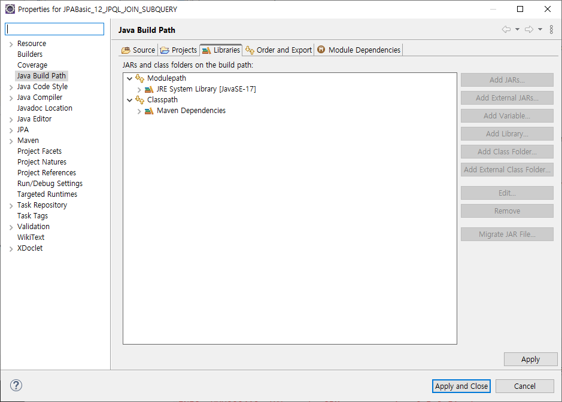
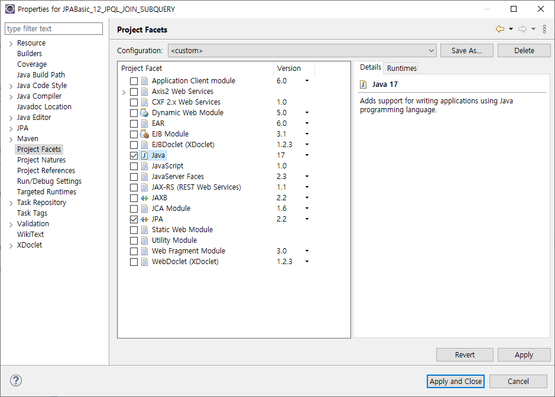

# [2024.08.22(목)] 연관관계 매핑(ManyToMany)/JPQL


# JPABasic_10_ManyToMany 프로젝트 생성

### 기존 Team에 새 User추가

### src/main/java/com/mycom/myapp

### entity/Team.java

```java
package com.mycom.myapp.entity;

import java.util.Set;

import jakarta.persistence.Entity;
import jakarta.persistence.GeneratedValue;
import jakarta.persistence.GenerationType;
import jakarta.persistence.Id;
import jakarta.persistence.JoinColumn;
import jakarta.persistence.JoinTable;
import jakarta.persistence.ManyToMany;
import jakarta.persistence.OrderBy;
import jakarta.persistence.Table;

// Owner Entity
@Entity
@Table(name = "teams")
public class Team {
	
	@Id
	@GeneratedValue(strategy = GenerationType.IDENTITY)
	private int id;
	
	private String name;
	
	// #1 ~ #8, #10
	// #A, #C
//	@ManyToMany
//	@JoinTable(
//			name = "teams_users",  // 다대다 두 entity를 연결해주는 중간 테이블 이름
//			joinColumns = @JoinColumn(name = "team_id"), // 중간 테이블에 생길 현재(Owner) entity를 가리키는 컬럼
//			inverseJoinColumns = @JoinColumn(name = "user_id") // 중간 테이블에 생길 상대(Non Owner) entity를 가리키는 컬럼
//	)
//	private List<User> users;
	
	// #나
//	@ManyToMany
//	@JoinTable(
//			name = "teams_users",  // 다대다 두 entity를 연결해주는 중간 테이블 이름
//			joinColumns = @JoinColumn(name = "team_id"), // 중간 테이블에 생길 현재(Owner) entity를 가리키는 컬럼
//			inverseJoinColumns = @JoinColumn(name = "user_id") // 중간 테이블에 생길 상대(Non Owner) entity를 가리키는 컬럼
//	)
//	private Set<User> users;
	
	// #라 
	@ManyToMany
	@JoinTable(name = "teams_users", // 다대다 두 entity를 연결해주는 중간 테이블 이름
			joinColumns = @JoinColumn(name = "team_id"), // 중간 테이블에 생길 현재(Owner) entity를 가리키는 컬럼
			inverseJoinColumns = @JoinColumn(name = "user_id") // 중간 테이블에 생길 상대(Non Owner) entity를 가리키는 컬럼
	)
//	@OrderBy("id desc")
	@OrderBy("id")
	private Set<User> users;
	
	// #9
//	@ManyToMany(cascade = CascadeType.PERSIST)
//	@JoinTable(
//			name = "teams_users",  // 다대다 두 entity를 연결해주는 중간 테이블 이름
//			joinColumns = @JoinColumn(name = "team_id"), // 중간 테이블에 생길 현재(Owner) entity를 가리키는 컬럼
//			inverseJoinColumns = @JoinColumn(name = "user_id") // 중간 테이블에 생길 상대(Non Owner) entity를 가리키는 컬럼
//	)
//	private List<User> users;
	
	// #B
//	@ManyToMany(fetch = FetchType.EAGER)
//	@JoinTable(
//			name = "teams_users",  // 다대다 두 entity를 연결해주는 중간 테이블 이름
//			joinColumns = @JoinColumn(name = "team_id"), // 중간 테이블에 생길 현재(Owner) entity를 가리키는 컬럼
//			inverseJoinColumns = @JoinColumn(name = "user_id") // 중간 테이블에 생길 상대(Non Owner) entity를 가리키는 컬럼
//	)
//	private List<User> users;

	public int getId() {
		return id;
	}

	public void setId(int id) {
		this.id = id;
	}

	public String getName() {
		return name;
	}

	public void setName(String name) {
		this.name = name;
	}

//	public List<User> getUsers() {
//		return users;
//	}
//
//	public void setUsers(List<User> users) {
//		this.users = users;
//	}
	
	// #나
	public Set<User> getUsers() {
		return users;
	}

	public void setUsers(Set<User> users) {
		this.users = users;
	}

	@Override
	public String toString() {
		return "Team [id=" + id + ", name=" + name + "]";
	}

}
```

### entity/User.java

```java
package com.mycom.myapp.entity;

import java.util.List;

import jakarta.persistence.CascadeType;
import jakarta.persistence.Entity;
import jakarta.persistence.FetchType;
import jakarta.persistence.GeneratedValue;
import jakarta.persistence.GenerationType;
import jakarta.persistence.Id;
import jakarta.persistence.ManyToMany;
import jakarta.persistence.Table;

// Non Owner Entity
@Entity
@Table(name = "users")
public class User {
	
	@Id
	@GeneratedValue(strategy = GenerationType.IDENTITY)
	private int id;
	
	private String name;
	
	// #1 ~ #9
	// #A, #B, #C
	@ManyToMany(mappedBy = "users")
	private List<Team> teams;
	
	// #10
//	@ManyToMany(mappedBy = "users", cascade = CascadeType.PERSIST)
//	private List<Team> teams;
	
	// #D
//	@ManyToMany(mappedBy = "users", fetch = FetchType.EAGER)
//	private List<Team> teams;

	public int getId() {
		return id;
	}

	public void setId(int id) {
		this.id = id;
	}

	public String getName() {
		return name;
	}

	public void setName(String name) {
		this.name = name;
	}

	public List<Team> getTeams() {
		return teams;
	}

	public void setTeams(List<Team> teams) {
		this.teams = teams;
	}

	@Override
	public String toString() {
		return "User [id=" + id + ", name=" + name + "]";
	}
	
}
```

### Test3.java

```java
package com.mycom.myapp;

import java.util.HashMap;
import java.util.Map;
import java.util.Set;

import org.hibernate.jpa.HibernatePersistenceProvider;

import com.mycom.myapp.config.MyPersistenceUnitInfo;
import com.mycom.myapp.entity.Team;
import com.mycom.myapp.entity.User;

import jakarta.persistence.EntityManager;
import jakarta.persistence.EntityManagerFactory;

public class Test3 {

	public static void main(String[] args) {

		Map<String, String> props = new HashMap<>();
		props.put("hibernate.show_sql", "true");	// sql 명령문을 확인할 수 있다.
//		props.put("hibernate.hbm2ddl.auto", "create");	// 속성에 create, update 등이 올 수 있다.
		
		EntityManagerFactory emf = new HibernatePersistenceProvider().createContainerEntityManagerFactory(new MyPersistenceUnitInfo(), props);
		EntityManager em = emf.createEntityManager();
		
		try {
			em.getTransaction().begin();
			
			// #가
			// Team 의 users : List<User>
//			{
//				Team t2 = em.find(Team.class, 2);
//				User u1 = em.find(User.class, 1);
//
//				t2.getUsers().add(u1);
//
//				em.persist(u1);
//
//				/*
//				 *Hibernate: select t1_0.id,t1_0.name from teams t1_0 where t1_0.id=?
//				Hibernate: select u1_0.id,u1_0.name from users u1_0 where u1_0.id=?
//				Hibernate: select u1_0.team_id,u1_1.id,u1_1.name from teams_users u1_0 join users u1_1 on u1_1.id=u1_0.user_id where u1_0.team_id=?
//				Hibernate: delete from teams_users where team_id=?
//				Hibernate: insert into teams_users (team_id,user_id) values (?,?)
//				Hibernate: insert into teams_users (team_id,user_id) values (?,?)
//				 */
//			}

			// #나
			// Team 의 users : Set<User> : 다른 Main 오류 발생 하나 무시
//			{
//				Team t2 = em.find(Team.class, 2);
//				User u1 = em.find(User.class, 1);
//
//				t2.getUsers().add(u1);
//
//				em.persist(u1);
//
//				/*
//				 * Hibernate: select t1_0.id,t1_0.name from teams t1_0 where t1_0.id=?
//					Hibernate: select u1_0.id,u1_0.name from users u1_0 where u1_0.id=?
//					Hibernate: select u1_0.team_id,u1_1.id,u1_1.name from teams_users u1_0 join users u1_1 on u1_1.id=u1_0.user_id where u1_0.team_id=?
//					Hibernate: insert into teams_users (team_id,user_id) values (?,?)
//				 */
//			}
			
			// #다
			// 추가 데이터 생성 ( 그냥 mysql 에서 처리하는 게 낫다. )
			// Team users : Set<User>
			// Set 은 select 순서대로 처리되지 X
//          {
//              Team t3 = new Team();
//              t3.setName("team 3");
//              
//              User u3 = new User();
//              u3.setName("User 3");
//              
//              User u4 = new User();
//              u4.setName("User 4");
//              
//              
//              User u5 = new User();
//              u5.setName("User 5");
//              
//              User u6 = new User();
//              u6.setName("User 6");
//              
//              t3.setUsers(Set.of(u3, u4, u5, u6));
//
//              em.persist(u3);
//              em.persist(u4);
//              em.persist(u5);
//              em.persist(u6);
//              em.persist(t3);
//              
//              
//				/*
//				Hibernate: insert into users (name) values (?)
//				Hibernate: insert into users (name) values (?)
//				Hibernate: insert into users (name) values (?)
//				Hibernate: insert into users (name) values (?)
//				Hibernate: insert into teams (name) values (?)
//				Hibernate: insert into teams_users (team_id,user_id) values (?,?)
//				Hibernate: insert into teams_users (team_id,user_id) values (?,?)
//				Hibernate: insert into teams_users (team_id,user_id) values (?,?)
//				Hibernate: insert into teams_users (team_id,user_id) values (?,?)         
//				 */
//          }

			// #라
			// Team users 를 List -> Set 으로 변경, 다른 파일 오류 잠시 무시
			// Set 은 select 순서대로 처리되지 X
			// Team 의 user 에 @OrderBy() 를 이용해서 정렬
			{
				Team t3 = em.find(Team.class, 3);
				System.out.println(t3.getUsers());

				/*
				 * 테이블의 select 순서와 다르다. 
				 * Hibernate: select t1_0.id,t1_0.name from teams t1_0 where t1_0.id=?
					Hibernate: select u1_0.team_id,u1_1.id,u1_1.name from teams_users u1_0 join users u1_1 on u1_1.id=u1_0.user_id where u1_0.team_id=?
					[User [id=4, name=User 4], User [id=5, name=User 5], User [id=6, name=User 6], User [id=3, name=User 3]]
				 */

				/*
				 * @OrderBy("id desc") 
				 * Hibernate: select t1_0.id,t1_0.name from teams t1_0 where t1_0.id=?
					Hibernate: select u1_0.team_id,u1_1.id,u1_1.name from teams_users u1_0 join users u1_1 on u1_1.id=u1_0.user_id where u1_0.team_id=? order by u1_0.user_id desc
					[User [id=6, name=User 6], User [id=5, name=User 5], User [id=4, name=User 4], User [id=3, name=User 3]]
				 * 
				 * @OrderBy("id") 
				 * Hibernate: select t1_0.id,t1_0.name from teams t1_0 where t1_0.id=?
					Hibernate: select u1_0.team_id,u1_1.id,u1_1.name from teams_users u1_0 join users u1_1 on u1_1.id=u1_0.user_id where u1_0.team_id=? order by u1_0.user_id
					[User [id=3, name=User 3], User [id=4, name=User 4], User [id=5, name=User 5], User [id=6, name=User 6]]
				 */
			}

			em.getTransaction().commit(); // update 수행
		} finally {
			em.close();
		}
		
	}

}
```

# 조별활동

## 조별 활동으로 JPQL 이 무엇인지, 왜 사용하는 지, 기존 SQL 은 사용할 수 없는지 등 간단하게 정리해 보세요.

### **1. JPQL (Java Persistence Query Language)** **이란?**

- **JPQL**은 **Java Persistence API (JPA)**에서 엔티티 객체를 대상으로 쿼리를 작성하는 언어입니다.
- SQL과 유사하지만, **데이터베이스 테이블이 아닌 JPA 엔티티**를 대상으로 쿼리를 수행합니다.

### **2. JPQL을 사용하는 이유**

- **객체 지향적인 데이터 접근**: JPQL은 엔티티 객체를 대상으로 쿼리를 작성하기 때문에, 객체 지향 프로그래밍과 자연스럽게 연계됩니다.
- **데이터베이스 독립성**: 특정 데이터베이스에 종속되지 않으므로, 다양한 데이터베이스에서 동일한 JPQL을 사용할 수 있습니다.
- **유지보수성 향상**: JPQL을 사용하면 데이터베이스 구조 변경에 덜 의존적이어서, 코드의 유지보수가 용이해집니다.

### **3. 기존 SQL은 사용할 수 없는가?**

- *기존 SQL (Native SQL)**은 여전히 사용 가능하며, JPA에서도 필요 시 `@Query` 애노테이션이나 `createNativeQuery` 메소드를 통해 SQL을 직접 사용할 수 있습니다.
- 그러나 JPQL은 **데이터베이스 독립적**이고 **엔티티 중심적**이기 때문에, JPA를 사용하는 경우 일반적으로 JPQL을 우선적으로 사용합니다.

### JPQL을 우선하는 이유

1. **객체 지향적인 접근**: JPQL은 JPA 엔티티를 대상으로 쿼리를 작성하기 때문에, 객체 지향적인 데이터 접근이 가능합니다. 이는 개발자가 엔티티를 중심으로 비즈니스 로직을 구현하는 데 도움이 됩니다.
2. **데이터베이스 독립성**: JPQL은 데이터베이스에 종속되지 않으므로, 다양한 DBMS에서 동일한 쿼리를 사용할 수 있습니다. 데이터베이스가 변경되어도 JPQL 쿼리를 수정할 필요가 적습니다.
3. **자동 관리**: JPQL은 JPA의 관리 하에 있으므로, 영속성 컨텍스트, 1차 캐시, 지연 로딩 등 JPA의 다양한 기능과 자연스럽게 통합됩니다.

### Native SQL 사용 사례

하지만, 기존 SQL도 필요에 따라 사용될 수 있습니다:

1. **복잡한 쿼리**: 특정 데이터베이스 기능이나 복잡한 SQL 문법이 필요할 때는 JPQL보다 Native SQL이 적합할 수 있습니다.
2. **성능 최적화**: 특정 데이터베이스에 특화된 쿼리를 통해 성능을 최적화할 때 Native SQL이 유용할 수 있습니다.
3. **JPQL로 표현할 수 없는 쿼리**: JPQL은 SQL의 모든 기능을 지원하지 않기 때문에, 특정 기능(예: DBMS의 특정 함수 등)이 필요하면 Native SQL을 사용해야 합니다.

### 결론

JPA를 사용하는 경우, 객체 지향성과 데이터베이스 독립성을 최대한 활용하기 위해 **JPQL을 우선적으로 사용하는 것이 좋지만**, 필요에 따라 **Native SQL을 병행하여** 사용할 수 있습니다. 프로젝트와 요구사항에 따라 적절히 선택하는 것이 중요합니다.

### 결론

 JPQL은 JPA에서 객체 지향적으로 데이터를 조회하고 조작하기 위해 사용하는 언어로, 데이터베이스에 의존하지 않으면서도 엔티티 객체를 쉽게 다룰 수 있는 장점이 있습니다. 기존 SQL도 사용할 수 있지만, JPQL이 제공하는 데이터베이스 독립성과 객체 지향성을 활용하는 것이 JPA의 핵심입니다.

## JPQL(Java Persistence Query Language)

JPQL(Java Persistence Query Language)은 JPA(Java Persistence API)에서 엔티티 객체를 조회할 때 사용하는 쿼리 언어입니다. JPQL은 SQL과 유사하지만, 데이터베이스 테이블이 아닌 엔티티 객체를 대상으로 쿼리를 작성하는 데 사용됩니다. 이를 통해 데이터베이스에 독립적인 방식으로 쿼리를 수행할 수 있습니다.

### JPQL의 특징

1. **객체 지향 쿼리 언어**: JPQL은 엔티티 객체와 그 속성들을 대상으로 쿼리를 작성합니다. 따라서 SQL처럼 테이블과 컬럼을 참조하지 않고, 엔티티와 필드를 참조합니다.
2. **데이터베이스 독립성**: JPQL은 데이터베이스에 종속되지 않으므로, 같은 JPQL 쿼리를 여러 데이터베이스에서 사용할 수 있습니다.
3. **자동 변환**: JPA는 JPQL을 SQL로 변환하여 데이터베이스에 전송합니다. 따라서 개발자는 데이터베이스에 의존하지 않고 객체 지향적으로 쿼리를 작성할 수 있습니다.

### JPQL 구문 예시

### 1. **SELECT 쿼리**

JPQL에서 가장 기본적인 쿼리는 `SELECT` 쿼리입니다.

```java
java코드 복사
String jpql = "SELECT s FROM Student s WHERE s.name = :name";
TypedQuery<Student> query = entityManager.createQuery(jpql, Student.class);
query.setParameter("name", "John Doe");
List<Student> students = query.getResultList();

```

- **`SELECT s FROM Student s`**: `Student` 엔티티를 조회합니다. `s`는 `Student` 엔티티를 참조하는 별칭(alias)입니다.
- **`WHERE s.name = :name`**: `Student` 엔티티의 `name` 필드가 특정 값과 일치하는 경우에만 결과를 반환합니다. `:name`은 명명된 파라미터입니다.

### 2. **JOIN 쿼리**

JPQL은 관계가 있는 엔티티들을 조인할 수 있습니다.

```java
java코드 복사
String jpql = "SELECT s FROM Student s JOIN s.school sch WHERE sch.name = :schoolName";
TypedQuery<Student> query = entityManager.createQuery(jpql, Student.class);
query.setParameter("schoolName", "ABC School");
List<Student> students = query.getResultList();

```

- **`JOIN s.school sch`**: `Student` 엔티티의 `school` 필드와 조인합니다.
- **`WHERE sch.name = :schoolName`**: 학교 이름이 `ABC School`인 경우에만 결과를 반환합니다.

### 3. **UPDATE 쿼리**

JPQL을 사용하여 데이터베이스의 데이터를 업데이트할 수도 있습니다.

```java
java코드 복사
String jpql = "UPDATE Student s SET s.name = :newName WHERE s.id = :id";
Query query = entityManager.createQuery(jpql);
query.setParameter("newName", "John Smith");
query.setParameter("id", 1L);
int updatedRows = query.executeUpdate();

```

- **`UPDATE Student s SET s.name = :newName WHERE s.id = :id`**: `Student` 엔티티에서 ID가 `1`인 학생의 이름을 `John Smith`로 업데이트합니다.

### 4. **DELETE 쿼리**

JPQL을 사용하여 데이터를 삭제할 수도 있습니다.

```java
java코드 복사
String jpql = "DELETE FROM Student s WHERE s.id = :id";
Query query = entityManager.createQuery(jpql);
query.setParameter("id", 1L);
int deletedRows = query.executeUpdate();

```

- **`DELETE FROM Student s WHERE s.id = :id`**: ID가 `1`인 학생 엔티티를 삭제합니다.

### JPQL의 주요 기능

1. **조건절(WHERE)**: SQL의 WHERE 절과 비슷하게, 특정 조건을 만족하는 데이터를 조회합니다.
2. **정렬(ORDER BY)**: 결과를 특정 필드 기준으로 정렬할 수 있습니다.
3. **그룹핑(GROUP BY)**: 특정 필드 기준으로 그룹핑하여 집계 함수(예: COUNT, SUM 등)와 함께 사용할 수 있습니다.
4. **집계 함수**: JPQL에서도 SQL의 집계 함수(COUNT, SUM, AVG, MAX, MIN 등)를 사용할 수 있습니다.
5. **네임드 쿼리(Named Query)**: 자주 사용하는 쿼리를 엔티티 클래스에 미리 정의해두고 사용할 수 있습니다.

### JPQL과 SQL의 차이점

- **대상**: JPQL은 엔티티 객체와 그 속성을 대상으로 쿼리를 작성하고, SQL은 데이터베이스 테이블과 컬럼을 대상으로 작성합니다.
- **결과**: JPQL 쿼리는 객체 또는 객체의 속성으로 결과를 반환하며, SQL은 데이터베이스의 레코드로 결과를 반환합니다.

### 결론

JPQL은 객체 지향적인 방식으로 데이터베이스 쿼리를 작성할 수 있게 해주어, 데이터베이스와의 독립성을 유지하며 비즈니스 로직을 구현하는 데 매우 유용합니다. 다양한 복잡한 쿼리도 객체 지향적으로 표현할 수 있어, 코드의 가독성과 유지보수성을 높여줍니다.

# JPABasic_12_JPQL_SELECT 프로젝트 생성

- JPABasic_12_JPQL_SELECT 프로젝트 복사하여 JPABasic_10_ManyToMany 프로젝트 생성
- jpa_basic_12 스키마 생성
- entity 패키지에 생성한 클래스 모두 삭제

### src/main/java/com/mycom/myapp

### config/MyPersistenceUnitInfo.java

```java
package com.mycom.myapp.config;

import java.net.URL;
import java.util.List;
import java.util.Properties;

import javax.sql.DataSource;

import com.zaxxer.hikari.HikariDataSource;

import jakarta.persistence.SharedCacheMode;
import jakarta.persistence.ValidationMode;
import jakarta.persistence.spi.ClassTransformer;
import jakarta.persistence.spi.PersistenceUnitInfo;
import jakarta.persistence.spi.PersistenceUnitTransactionType;

// META-INF/persistence.xml 대체
public class MyPersistenceUnitInfo implements PersistenceUnitInfo {

	@Override
	public String getPersistenceUnitName() {
		return "my-pu";
	}

	@Override
	public String getPersistenceProviderClassName() {
		return "org.hibernate.jpa.HibernatePersistenceProvider";
	}

	@Override
	public PersistenceUnitTransactionType getTransactionType() {
		return PersistenceUnitTransactionType.RESOURCE_LOCAL;
	}

	@Override
	public DataSource getJtaDataSource() {
		HikariDataSource dataSource = new HikariDataSource();
		dataSource.setJdbcUrl("jdbc:mysql://localhost:3306/jpa_basic_12");
		dataSource.setUsername("root");
		dataSource.setPassword("root");
		return dataSource;
	}

	@Override
	public DataSource getNonJtaDataSource() {
		// TODO Auto-generated method stub
		return null;
	}

	@Override
	public List<String> getMappingFileNames() {
		// TODO Auto-generated method stub
		return null;
	}

	@Override
	public List<URL> getJarFileUrls() {
		// TODO Auto-generated method stub
		return null;
	}

	@Override
	public URL getPersistenceUnitRootUrl() {
		// TODO Auto-generated method stub
		return null;
	}

	@Override
	public List<String> getManagedClassNames() {
		return List.of("com.mycom.myapp.entity.Product");
	}

	@Override
	public boolean excludeUnlistedClasses() {
		// TODO Auto-generated method stub
		return false;
	}

	@Override
	public SharedCacheMode getSharedCacheMode() {
		// TODO Auto-generated method stub
		return null;
	}

	@Override
	public ValidationMode getValidationMode() {
		// TODO Auto-generated method stub
		return null;
	}

	@Override
	public Properties getProperties() {
		// TODO Auto-generated method stub
		return null;
	}

	@Override
	public String getPersistenceXMLSchemaVersion() {
		// TODO Auto-generated method stub
		return null;
	}

	@Override
	public ClassLoader getClassLoader() {
		// TODO Auto-generated method stub
		return null;
	}

	@Override
	public void addTransformer(ClassTransformer transformer) {
		// TODO Auto-generated method stub
		
	}

	@Override
	public ClassLoader getNewTempClassLoader() {
		// TODO Auto-generated method stub
		return null;
	}

}
```

### entity/Product.java

```java
package com.mycom.myapp.entity;

import jakarta.persistence.Entity;
import jakarta.persistence.GeneratedValue;
import jakarta.persistence.GenerationType;
import jakarta.persistence.Id;

@Entity
public class Product {
	
	@Id
	@GeneratedValue(strategy = GenerationType.IDENTITY)
	private int id;
	private String name;
	private Long price;
	private int quantity;
	private String country;
	
	public int getId() {
		return id;
	}
	public void setId(int id) {
		this.id = id;
	}
	public String getName() {
		return name;
	}
	public void setName(String name) {
		this.name = name;
	}
	public Long getPrice() {
		return price;
	}
	public void setPrice(Long price) {
		this.price = price;
	}
	public int getQuantity() {
		return quantity;
	}
	public void setQuantity(int quantity) {
		this.quantity = quantity;
	}
	public String getCountry() {
		return country;
	}
	public void setCountry(String country) {
		this.country = country;
	}
	
	@Override
	public String toString() {
		return "Product [id=" + id + ", name=" + name + ", price=" + price + ", quantity=" + quantity + ", country="
				+ country + "]";
	}
	
}
```

### Test.java

```java
package com.mycom.myapp;

import java.util.HashMap;
import java.util.List;
import java.util.Map;

import org.hibernate.jpa.HibernatePersistenceProvider;

import com.mycom.myapp.config.MyPersistenceUnitInfo;
import com.mycom.myapp.entity.Product;

import jakarta.persistence.EntityManager;
import jakarta.persistence.EntityManagerFactory;
import jakarta.persistence.Query;
import jakarta.persistence.TypedQuery;

// JPQL
// insert (X), select, update, delete 가능
public class Test {

	public static void main(String[] args) {

		Map<String, String> props = new HashMap<>();
		props.put("hibernate.show_sql", "true"); // sql 명령문을 확인할 수 있다.
//		props.put("hibernate.hbm2ddl.auto", "create");	// 속성에 create, update 등이 올 수 있다.

		EntityManagerFactory emf = new HibernatePersistenceProvider()
				.createContainerEntityManagerFactory(new MyPersistenceUnitInfo(), props);
		EntityManager em = emf.createEntityManager();

		try {
			em.getTransaction().begin();

			// #1 테이블 생성, 테스트 용도 entity 데이터 등록
//			{
//				Product p1 = new Product();
//                p1.setName("galaxy");
//                p1.setPrice(1000L);
//                p1.setQuantity(15);
//                p1.setCountry("korea");
//                
//                Product p2 = new Product();
//                p2.setName("iphone");
//                p2.setPrice(3000L);
//                p2.setQuantity(10);
//                p2.setCountry("usa");
//                
//                Product p3 = new Product();
//                p3.setName("galaxy note");
//                p3.setPrice(5000L);
//                p3.setQuantity(20);
//                p3.setCountry("korea");
//                
//                em.persist(p1);
//                em.persist(p2);
//                em.persist(p3); 
//			}

			// #2 Query
			// SQL : select * from product : product table에서 전체 row를 가져온다. 이때 *은 모든 컬럼
			// JPQL : select p from Product p : 모든 Product Entity를 가져온다. p의 의미는 p Entity의 모든
			// 필드이다.
//			{
//				String jpql = "select p from Product p";
//				Query q = em.createQuery(jpql);	// 내부적으로 JDBC의 PreparedStatement 사용
//				List<?> productList = q.getResultList(); // grid 형태의 ResultSet 구조의 결과를 return
//				
//				for (Object object : productList) {
//					Product p = (Product) object;
//					System.out.println(p);
//				}
//				
//				/* 실행 결과
//				 * Hibernate: select p1_0.id,p1_0.country,p1_0.name,p1_0.price,p1_0.quantity from Product p1_0
//					Product [id=1, name=galaxy, price=1000, quantity=15, country=korea]
//					Product [id=2, name=iphone, price=3000, quantity=10, country=usa]
//					Product [id=3, name=galaxy note, price=5000, quantity=20, country=korea]
//				 */
//				
//			}

			// #3 TypedQuery
//			{
//				String jpql = "select p from Product p";
//				TypedQuery<Product> q = em.createQuery(jpql, Product.class); 
//				List<Product> productList = q.getResultList();
//
//				for (Product p : productList) {
//					System.out.println(p);
//				}
//
//				/*
//				 * 실행 결과 
//					Hibernate: select p1_0.id,p1_0.country,p1_0.name,p1_0.price,p1_0.quantity from Product p1_0
//					Product [id=1, name=galaxy, price=1000, quantity=15, country=korea]
//					Product [id=2, name=iphone, price=3000, quantity=10, country=usa]
//					Product [id=3, name=galaxy note, price=5000, quantity=20, country=korea]
//				 */
//
//			}

			// #4 TypedQuery + 개별 컬럼
			// Product를 Object[] 대신 직접 받으려면 오류 발생 (예시 - TypedQuery<Product> q =
			// em.createQuery(jpql, Product.class); )
			// org.hibernate.query.QueryTypeMismatchException: Result type is 'Product' but
			// the query returned a 'Integer'
//			{
//				String jpql = "select p.id, p.name, p.price from Product p";
//				TypedQuery<Object[]> q = em.createQuery(jpql, Object[].class);
//				List<Object[]> productList = q.getResultList();
//
//				for (Object[] objArray : productList) {
//					System.out.println(objArray[0] + " " + objArray[1] + " " + objArray[2] + " ");
//				}
//
//				/*
//				 * 실행 결과 
//					Hibernate: select p1_0.id,p1_0.name,p1_0.price from Product p1_0
//					1 galaxy 1000 
//					2 iphone 3000 
//					3 galaxy note 5000 
//				 */
//
//			}

			// #5 TypedQuery + where
//			{
//				String jpql = "select p from Product p where p.price > 2000";
//				TypedQuery<Product> q = em.createQuery(jpql, Product.class); 
//				List<Product> productList = q.getResultList();
//
//				for (Product p : productList) {
//					System.out.println(p);
//				}
//
//				/*
//				 * 실행 결과 
//					Hibernate: select p1_0.id,p1_0.country,p1_0.name,p1_0.price,p1_0.quantity from Product p1_0 where p1_0.price>2000
//					Product [id=2, name=iphone, price=3000, quantity=10, country=usa]
//					Product [id=3, name=galaxy note, price=5000, quantity=20, country=korea]
//				 */
//
//			}

			// #6 TypedQuery + where + and + param
//			{
//				String jpql = "select p from Product p where p.price > :price and p.quantity > :quantity";
//				TypedQuery<Product> q = em.createQuery(jpql, Product.class);
//				q.setParameter("price", 2000);
//				q.setParameter("quantity", 10);
//				List<Product> productList = q.getResultList();
//
//				for (Product p : productList) {
//					System.out.println(p);
//				}
//
//				/*
//				 * 실행 결과 
//					Hibernate: select p1_0.id,p1_0.country,p1_0.name,p1_0.price,p1_0.quantity from Product p1_0 where p1_0.price>? and p1_0.quantity>?
//					Product [id=3, name=galaxy note, price=5000, quantity=20, country=korea]
//				 */
//			}

			// #7 TypedQuery + where + and + param with index
//			{
//				String jpql = "select p from Product p where p.price > ?1 and p.quantity > ?2";
//				TypedQuery<Product> q = em.createQuery(jpql, Product.class);
//				q.setParameter(1, 2000);
//				q.setParameter(2, 10);
//				List<Product> productList = q.getResultList();
//
//				for (Product p : productList) {
//					System.out.println(p);
//				}
//
//				/*
//				 * 실행 결과 
//					Hibernate: select p1_0.id,p1_0.country,p1_0.name,p1_0.price,p1_0.quantity from Product p1_0 where p1_0.price>? and p1_0.quantity>?
//					Product [id=3, name=galaxy note, price=5000, quantity=20, country=korea]
//				 */
//			}

			// #8 TypedQuery + where + and + param + like
//			{
//				String jpql = "select p from Product p where p.name like : name";
//				TypedQuery<Product> q = em.createQuery(jpql, Product.class);
////				q.setParameter("name", "ga%");
////				q.setParameter("name", "%o%");
//				q.setParameter("name", "%note");
//				List<Product> productList = q.getResultList();
//
//				for (Product p : productList) {
//					System.out.println(p);
//				}
//
//				/*
//				 * 실행 결과 
//					Hibernate: select p1_0.id,p1_0.country,p1_0.name,p1_0.price,p1_0.quantity from Product p1_0 where p1_0.name like ? escape ''
//					Product [id=1, name=galaxy, price=1000, quantity=15, country=korea]
//					Product [id=3, name=galaxy note, price=5000, quantity=20, country=korea]
//				 */
//			}

			// #9 TypedQuery + aggregation function - count() + getSinggleResult()
			// Long return
//			{
//				String jpql = "select count(p) from Product p";
//				TypedQuery<Long> q = em.createQuery(jpql, Long.class);
//				Long cnt = q.getSingleResult();
//
//				System.out.println(cnt);
//
//				/*
//				 * 실행 결과 
//					Hibernate: select count(p1_0.id) from Product p1_0
//					3
//				 */
//			}
			
			// #10 TypedQuery + aggregation function - avg() + getSinggleResult()
			// Double return
//			{
//				String jpql = "select avg(p.price) from Product p";
//				TypedQuery<Double> q = em.createQuery(jpql, Double.class);
//				Double cnt = q.getSingleResult();
//
//				System.out.println(cnt);
//
//				/*
//				 * 실행 결과 
//					Hibernate: select avg(p1_0.price) from Product p1_0
//					3000.0
//				 */
//			}
			
			// #11 TypedQuery + aggregation function - sum(), min(), max() 동시 + getSinggleResult()
//			{
//				String jpql = "select sum(p.quantity), min(p.quantity), max(p.quantity) from Product p";
//				TypedQuery<Object[]> q = em.createQuery(jpql, Object[].class);
//				Object[] objArray = q.getSingleResult();
//
//				System.out.println(objArray[0] + ", " + objArray[1] + ", " + objArray[2]);
//
//				/*
//				 * 실행 결과 
//					Hibernate: select sum(p1_0.quantity),min(p1_0.quantity),max(p1_0.quantity) from Product p1_0
//					45, 10, 20
//				 */
//			}
			
			// #12 TypedQuery + aggregation function - sum(), min(), max() 동시 + group by
//			{
//				String jpql = "select p.country, sum(p.quantity), min(p.quantity), max(p.quantity) from Product p group by p.country";
//				TypedQuery<Object[]> q = em.createQuery(jpql, Object[].class);
//				List<Object[]> objArrayList = q.getResultList();
//
//				for (Object[] objArray : objArrayList) {
//					System.out.println(objArray[0] + ", " + objArray[1] + ", " + objArray[2] + ", " + objArray[3]);
//				}
//
//				/*
//				 * 실행 결과 
//					Hibernate: select p1_0.country,sum(p1_0.quantity),min(p1_0.quantity),max(p1_0.quantity) from Product p1_0 group by p1_0.country
//					korea, 35, 15, 20
//					usa, 10, 10, 10
//				 */
//			}
			
			// #13 Update, Delete
			// Query, executeUpdate()
			{
				// update
//				String jpql = "update Product p set p.name='kProduct' where p.country = 'korea'";
				// delete
				String jpql = "delete Product p where p.country = 'korea'";
				Query q = em.createQuery(jpql);
				int cnt = q.executeUpdate();
				System.out.println(cnt);

				/*
				 * 실행 결과 
				 	// update 
					Hibernate: update Product p1_0 set name='kProduct' where p1_0.country='korea'
					2
					// delete
					Hibernate: delete p1_0 from Product p1_0 where p1_0.country='korea'
					2
				 */
			}

			em.getTransaction().commit(); // update 수행

		} finally {
			em.close();
		}

	}

}
```

# JPABasic_12_JPQL_Nplus1 프로젝트 생성

- JPABasic_12_JPQL_SELECT 프로젝트 복사하여 JPABasic_12_JPQL_Nplus1 프로젝트 생성

### src/main/java/com/mycom/myapp

### config/MyPersistenceUnitInfo.java

```java
package com.mycom.myapp.config;

import java.net.URL;
import java.util.List;
import java.util.Properties;

import javax.sql.DataSource;

import com.zaxxer.hikari.HikariDataSource;

import jakarta.persistence.SharedCacheMode;
import jakarta.persistence.ValidationMode;
import jakarta.persistence.spi.ClassTransformer;
import jakarta.persistence.spi.PersistenceUnitInfo;
import jakarta.persistence.spi.PersistenceUnitTransactionType;

// META-INF/persistence.xml 대체
public class MyPersistenceUnitInfo implements PersistenceUnitInfo {

	@Override
	public String getPersistenceUnitName() {
		return "my-pu";
	}

	@Override
	public String getPersistenceProviderClassName() {
		return "org.hibernate.jpa.HibernatePersistenceProvider";
	}

	@Override
	public PersistenceUnitTransactionType getTransactionType() {
		return PersistenceUnitTransactionType.RESOURCE_LOCAL;
	}

	@Override
	public DataSource getJtaDataSource() {
		HikariDataSource dataSource = new HikariDataSource();
		dataSource.setJdbcUrl("jdbc:mysql://localhost:3306/jpa_basic_12");
		dataSource.setUsername("root");
		dataSource.setPassword("root");
		return dataSource;
	}

	@Override
	public DataSource getNonJtaDataSource() {
		// TODO Auto-generated method stub
		return null;
	}

	@Override
	public List<String> getMappingFileNames() {
		// TODO Auto-generated method stub
		return null;
	}

	@Override
	public List<URL> getJarFileUrls() {
		// TODO Auto-generated method stub
		return null;
	}

	@Override
	public URL getPersistenceUnitRootUrl() {
		// TODO Auto-generated method stub
		return null;
	}

	@Override
	public List<String> getManagedClassNames() {
		return List.of("com.mycom.myapp.entity.Product",
						"com.mycom.myapp.entity.Customer",
						"com.mycom.myapp.entity.Orders");
	}

	@Override
	public boolean excludeUnlistedClasses() {
		// TODO Auto-generated method stub
		return false;
	}

	@Override
	public SharedCacheMode getSharedCacheMode() {
		// TODO Auto-generated method stub
		return null;
	}

	@Override
	public ValidationMode getValidationMode() {
		// TODO Auto-generated method stub
		return null;
	}

	@Override
	public Properties getProperties() {
		// TODO Auto-generated method stub
		return null;
	}

	@Override
	public String getPersistenceXMLSchemaVersion() {
		// TODO Auto-generated method stub
		return null;
	}

	@Override
	public ClassLoader getClassLoader() {
		// TODO Auto-generated method stub
		return null;
	}

	@Override
	public void addTransformer(ClassTransformer transformer) {
		// TODO Auto-generated method stub
		
	}

	@Override
	public ClassLoader getNewTempClassLoader() {
		// TODO Auto-generated method stub
		return null;
	}

}
```

### entity/Product.java

```java
package com.mycom.myapp.entity;

import java.util.List;

import jakarta.persistence.Entity;
import jakarta.persistence.GeneratedValue;
import jakarta.persistence.GenerationType;
import jakarta.persistence.Id;
import jakarta.persistence.OneToMany;

@Entity
public class Product {
	
	@Id
	@GeneratedValue(strategy = GenerationType.IDENTITY)
	private int id;
	private String name;
	private Long price;
	private int quantity;
	private String country;
	
	@OneToMany(mappedBy = "product")
	private List<Orders> orders;
	
	public Product() {}
	public Product(String name, Long price, int quantity, String country) {
		super();
		this.name = name;
		this.price = price;
		this.quantity = quantity;
		this.country = country;
	}
	
	public int getId() {
		return id;
	}
	public void setId(int id) {
		this.id = id;
	}
	public String getName() {
		return name;
	}
	public void setName(String name) {
		this.name = name;
	}
	public Long getPrice() {
		return price;
	}
	public void setPrice(Long price) {
		this.price = price;
	}
	public int getQuantity() {
		return quantity;
	}
	public void setQuantity(int quantity) {
		this.quantity = quantity;
	}
	public String getCountry() {
		return country;
	}
	public void setCountry(String country) {
		this.country = country;
	}
	public List<Orders> getOrders() {
		return orders;
	}
	public void setOrders(List<Orders> orders) {
		this.orders = orders;
	}
	
	@Override
	public String toString() {
		return "Product [id=" + id + ", name=" + name + ", price=" + price + ", quantity=" + quantity + ", country="
				+ country + "]";
	}
	
}
```

### entity/Customer.java

```java
package com.mycom.myapp.entity;

import java.util.List;

import jakarta.persistence.Entity;
import jakarta.persistence.GeneratedValue;
import jakarta.persistence.GenerationType;
import jakarta.persistence.Id;
import jakarta.persistence.OneToMany;

// Non - Owing
@Entity
public class Customer {
	
	@Id
	@GeneratedValue(strategy = GenerationType.IDENTITY)
	private int id;
	private String name;
	private char gender;
	private String phone;
	
	@OneToMany(mappedBy = "customer")
	private List<Orders> orders;
	
	public Customer() {}
	public Customer(String name, char gender, String phone) {
		super();
		this.name = name;
		this.gender = gender;
		this.phone = phone;
	}
	public int getId() {
		return id;
	}
	public void setId(int id) {
		this.id = id;
	}
	public String getName() {
		return name;
	}
	public void setName(String name) {
		this.name = name;
	}
	public char getGender() {
		return gender;
	}
	public void setGender(char gender) {
		this.gender = gender;
	}
	public String getPhone() {
		return phone;
	}
	public void setPhone(String phone) {
		this.phone = phone;
	}
	public List<Orders> getOrders() {
		return orders;
	}
	public void setOrders(List<Orders> orders) {
		this.orders = orders;
	}
	
	@Override
	public String toString() {
		return "Customer [id=" + id + ", name=" + name + ", gender=" + gender + ", phone=" + phone + "]";
	}
	
}
```

### entity/Orders.java

```java
package com.mycom.myapp.entity;

import java.time.LocalDate;

import jakarta.persistence.CascadeType;
import jakarta.persistence.Column;
import jakarta.persistence.Entity;
import jakarta.persistence.FetchType;
import jakarta.persistence.GeneratedValue;
import jakarta.persistence.GenerationType;
import jakarta.persistence.Id;
import jakarta.persistence.ManyToOne;

// Ownership Entity
@Entity
public class Orders {
	
	@Id
	@GeneratedValue(strategy = GenerationType.IDENTITY)
	private int id;
	
	@Column(name = "order_quantity")
	private int orderQuantity;
	
	@Column(name = "order_date")
	private LocalDate orderDate;
	
	// #2 해결방법 1 : 아래 연관관계 삭제
	// #2 해결방법 3 : 아래 연관관계 유지, JOIN FETCH 사용
	@ManyToOne(cascade = CascadeType.PERSIST)
	private Customer customer;
	
	@ManyToOne(cascade = CascadeType.PERSIST)
	private Product product;

	// #2 해결방법2 : fetch -> LAZY
//	@ManyToOne(cascade = CascadeType.PERSIST, fetch = FetchType.LAZY)
//	private Customer customer;
//	
//	@ManyToOne(cascade = CascadeType.PERSIST, fetch = FetchType.LAZY)
//	private Product product;

	public int getId() {
		return id;
	}
	
	public Orders() {}
	public Orders(Customer customer, Product product, int orderQuantity, LocalDate orderDate) {
		super();
		this.orderQuantity = orderQuantity;
		this.orderDate = orderDate;
		this.customer = customer;
		this.product = product;
	}

	public void setId(int id) {
		this.id = id;
	}

	public int getOrderQuantity() {
		return orderQuantity;
	}

	public void setOrderQuantity(int orderQuantity) {
		this.orderQuantity = orderQuantity;
	}

	public LocalDate getOrderDate() {
		return orderDate;
	}

	public void setOrderDate(LocalDate orderDate) {
		this.orderDate = orderDate;
	}

	public Customer getCustomer() {
		return customer;
	}

	public void setCustomer(Customer customer) {
		this.customer = customer;
	}

	public Product getProduct() {
		return product;
	}

	public void setProduct(Product product) {
		this.product = product;
	}

	@Override
	public String toString() {
		return "Orders [id=" + id + ", orderQuantity=" + orderQuantity + ", orderDate=" + orderDate + "]";
	}
	
}
```

### Test.java

```java
package com.mycom.myapp;

import java.time.LocalDate;
import java.util.HashMap;
import java.util.List;
import java.util.Map;

import org.hibernate.jpa.HibernatePersistenceProvider;

import com.mycom.myapp.config.MyPersistenceUnitInfo;
import com.mycom.myapp.entity.Customer;
import com.mycom.myapp.entity.Orders;
import com.mycom.myapp.entity.Product;

import jakarta.persistence.EntityManager;
import jakarta.persistence.EntityManagerFactory;
import jakarta.persistence.TypedQuery;

// N+1
public class Test {

	public static void main(String[] args) {

		Map<String, String> props = new HashMap<>();
		props.put("hibernate.show_sql", "true"); // sql 명령문을 확인할 수 있다.
//		props.put("hibernate.hbm2ddl.auto", "create");	// 속성에 create, update 등이 올 수 있다.

		EntityManagerFactory emf = new HibernatePersistenceProvider()
				.createContainerEntityManagerFactory(new MyPersistenceUnitInfo(), props);
		EntityManager em = emf.createEntityManager();

		try {
			em.getTransaction().begin();

			// #1 테이블 생성, 테스트 용도 entity 데이터 등록
			// props.put("hibernate.hbm2ddl.auto", "create"); 사용하여 테이블 생성
//			{
//				Product p1 = new Product("제품1", 1000L, 15, "korea");
//                Product p2 = new Product("제품2", 3000L, 10, "usa");
//                Product p3 = new Product("제품3", 5000L, 20, "korea");
//                Customer c1 = new Customer("고객1", 'M', "010-1111-1111");
//                Customer c2 = new Customer("고객2", 'F', "010-2222-2222");
//                Customer c3 = new Customer("고객3", 'F', "010-3333-3333");
//                
//                Orders o1 = new Orders(c1, p1, 2, LocalDate.now());
//                Orders o2 = new Orders(c1, p2, 5, LocalDate.now());
//                Orders o3 = new Orders(c2, p2, 3, LocalDate.now());
//                Orders o4 = new Orders(c2, p3, 10, LocalDate.now());
//                Orders o5 = new Orders(c3, p3, 5, LocalDate.now());
//                
//                em.persist(o1);
//                em.persist(o2);
//                em.persist(o3);             
//                em.persist(o4);             
//                em.persist(o5);
//			}
			
			// #2
			// N + 1 이슈 발생
			// ManyToOne...fetchType : EAGER 이므로 select 1 건  + 연관관계를 가지는 Entity에 대해 추가로 N 번 select 수행
			// 해결책 : 같이 가져올 것인가 아닌가? 
			// 1. 같이 가져오지 않는다면 연관 관계를 없앤다.
			// 2. 연관관계를 유지하되, fetchType을 EAGER -> LAZY로 변경한다.
			// 		목록을 가져올 때, N + 1 문제는 해결, but 상세 1 건을 가져올 때도 함께 가져오지 않는다.
			// 3. JOIN FETCH (목록을 fetch할 때에도 EAGER로 가져온다. <= 1 개의 join query로 수행)
			{
//				String jpql = "select o from Orders o";
				// 해결방법3
				String jpql = "select o from Orders o JOIN FETCH o.customer JOIN FETCH o.product";
				
				TypedQuery<Orders> q = em.createQuery(jpql, Orders.class);
				List<Orders> orderList = q.getResultList();
				
				for (Orders orders : orderList) {
					System.out.println(orders);
					System.out.println(orders.getCustomer()); // sql 다시 수행
				}
			}
			

			em.getTransaction().commit(); // update 수행

		} finally {
			em.close();
		}

	}

}
```

# N+1 이슈와 해결 방법

**N+1 이슈란?**

- **N+1 이슈**는 JPA에서 연관관계를 맺은 엔티티들을 조회할 때 발생하는 성능 문제입니다.
- 예를 들어, 부모 엔티티를 1번 조회(N=1)하고, 각 부모 엔티티에 연관된 자식 엔티티를 개별적으로 다시 조회(N번)하는 방식으로 작동할 때 발생합니다. 이로 인해 쿼리가 비효율적으로 많이 실행됩니다.

예시:

1. `Post` 엔티티와 `Comment` 엔티티가 `@OneToMany` 관계로 맺어져 있다고 가정합니다.
2. 여러 `Post`를 조회할 때, 각 `Post`에 연관된 `Comment`를 조회하기 위해 추가 쿼리(N번)가 발생합니다.

즉, 만약 10개의 `Post`를 조회할 때, 1번의 쿼리로 `Post`를 조회한 후, 각각의 `Post`에 대해 10번의 추가 쿼리가 실행되어 총 11번의 쿼리가 발생합니다.

### 해결 방법 3가지

1. **연관 관계를 없앤다**
    - 연관된 엔티티를 함께 가져올 필요가 없으면, 연관 관계를 제거합니다.
    - 이 방법은 가장 극단적인 방법으로, 객체 간의 의존성을 완전히 제거해 불필요한 쿼리 생성을 피합니다.
    - 예를 들어, `Post`와 `Comment`의 연관 관계를 제거하고, 필요한 경우 `Comment`를 개별적으로 조회합니다.
2. **FetchType을 EAGER에서 LAZY로 변경**
    - *`@ManyToOne(fetch = FetchType.EAGER)`*와 같이 즉시 로딩(EAGER)이 설정되어 있으면, 관련 엔티티를 즉시 로드합니다. 이때 N+1 문제가 발생할 수 있습니다.
    - 이를 **지연 로딩(LAZY)**로 변경하면, 연관된 엔티티는 실제로 사용될 때 조회합니다.
    - 이 방법은 목록을 조회할 때 N+1 문제를 피할 수 있지만, 개별 엔티티를 조회할 때는 연관된 엔티티를 따로 가져와야 합니다.
    - 예시:
        
        ```java
        @ManyToOne(fetch = FetchType.LAZY)
        private Comment comment;
        ```
        
    - `Post`를 조회할 때 `Comment`는 필요할 때까지 로드되지 않으므로 쿼리가 지연되어 실행됩니다.
3. **JOIN FETCH를 사용**
    - N+1 문제를 해결하기 위한 또 다른 방법은 **`JOIN FETCH`*를 사용하여 필요한 연관 엔티티를 한 번에 가져오는 것입니다.
    - 이 방법은 EAGER 로딩을 쿼리에서 명시적으로 수행하는 것으로, 연관된 모든 엔티티를 한 번의 `JOIN` 쿼리로 가져옵니다.
    - 이렇게 하면 여러 개의 쿼리가 실행되는 대신, 하나의 쿼리로 모든 데이터를 한 번에 가져올 수 있어 성능이 개선됩니다.
    - 예시:
        
        ```java
        String jpql = "SELECT p FROM Post p JOIN FETCH p.comments";
        List<Post> posts = entityManager.createQuery(jpql, Post.class).getResultList();
        ```
        
    - 이 쿼리는 `Post`와 `Comment`를 한 번에 조회하므로 N+1 문제가 발생하지 않습니다.

### 요약

- **연관 관계 제거**: 가장 단순한 해결 방법으로, 연관 관계를 없애는 방법입니다.
- **LAZY 로딩 사용**: 지연 로딩을 통해 필요할 때만 연관 엔티티를 로드하여 N+1 문제를 피할 수 있습니다.
- **JOIN FETCH 사용**: 한 번의 쿼리로 연관된 엔티티를 모두 가져오는 방법으로, 성능 문제를 해결할 수 있습니다.

# JPABasic_12_JPQL_JOIN_SUBQUERY 프로젝트 생성

- JPABasic_12_JPQL_Nplus1 프로젝트 복사하여 JPABasic_12_JPQL_JOIN_SUBQUERY 프로젝트 생성

### src/main/java/com/mycom/myapp

### config/MyPersistenceUnitInfo.java

```java
package com.mycom.myapp.config;

import java.net.URL;
import java.util.List;
import java.util.Properties;

import javax.sql.DataSource;

import com.zaxxer.hikari.HikariDataSource;

import jakarta.persistence.SharedCacheMode;
import jakarta.persistence.ValidationMode;
import jakarta.persistence.spi.ClassTransformer;
import jakarta.persistence.spi.PersistenceUnitInfo;
import jakarta.persistence.spi.PersistenceUnitTransactionType;

// META-INF/persistence.xml 대체
public class MyPersistenceUnitInfo implements PersistenceUnitInfo {

	@Override
	public String getPersistenceUnitName() {
		return "my-pu";
	}

	@Override
	public String getPersistenceProviderClassName() {
		return "org.hibernate.jpa.HibernatePersistenceProvider";
	}

	@Override
	public PersistenceUnitTransactionType getTransactionType() {
		return PersistenceUnitTransactionType.RESOURCE_LOCAL;
	}

	@Override
	public DataSource getJtaDataSource() {
		HikariDataSource dataSource = new HikariDataSource();
		dataSource.setJdbcUrl("jdbc:mysql://localhost:3306/jpa_basic_12");
		dataSource.setUsername("root");
		dataSource.setPassword("root");
		return dataSource;
	}

	@Override
	public DataSource getNonJtaDataSource() {
		// TODO Auto-generated method stub
		return null;
	}

	@Override
	public List<String> getMappingFileNames() {
		// TODO Auto-generated method stub
		return null;
	}

	@Override
	public List<URL> getJarFileUrls() {
		// TODO Auto-generated method stub
		return null;
	}

	@Override
	public URL getPersistenceUnitRootUrl() {
		// TODO Auto-generated method stub
		return null;
	}

	@Override
	public List<String> getManagedClassNames() {
		return List.of("com.mycom.myapp.entity.Product",
						"com.mycom.myapp.entity.Customer",
						"com.mycom.myapp.entity.Orders");
	}

	@Override
	public boolean excludeUnlistedClasses() {
		// TODO Auto-generated method stub
		return false;
	}

	@Override
	public SharedCacheMode getSharedCacheMode() {
		// TODO Auto-generated method stub
		return null;
	}

	@Override
	public ValidationMode getValidationMode() {
		// TODO Auto-generated method stub
		return null;
	}

	@Override
	public Properties getProperties() {
		// TODO Auto-generated method stub
		return null;
	}

	@Override
	public String getPersistenceXMLSchemaVersion() {
		// TODO Auto-generated method stub
		return null;
	}

	@Override
	public ClassLoader getClassLoader() {
		// TODO Auto-generated method stub
		return null;
	}

	@Override
	public void addTransformer(ClassTransformer transformer) {
		// TODO Auto-generated method stub
		
	}

	@Override
	public ClassLoader getNewTempClassLoader() {
		// TODO Auto-generated method stub
		return null;
	}

}
```

### entity/Product.java

```java
package com.mycom.myapp.entity;

import java.util.List;

import jakarta.persistence.Entity;
import jakarta.persistence.GeneratedValue;
import jakarta.persistence.GenerationType;
import jakarta.persistence.Id;
import jakarta.persistence.OneToMany;

@Entity
public class Product {
	
	@Id
	@GeneratedValue(strategy = GenerationType.IDENTITY)
	private int id;
	private String name;
	private Long price;
	private int quantity;
	private String country;
	
	@OneToMany(mappedBy = "product")
	private List<Orders> orders;
	
	public Product() {}
	public Product(String name, Long price, int quantity, String country) {
		super();
		this.name = name;
		this.price = price;
		this.quantity = quantity;
		this.country = country;
	}
	
	public int getId() {
		return id;
	}
	public void setId(int id) {
		this.id = id;
	}
	public String getName() {
		return name;
	}
	public void setName(String name) {
		this.name = name;
	}
	public Long getPrice() {
		return price;
	}
	public void setPrice(Long price) {
		this.price = price;
	}
	public int getQuantity() {
		return quantity;
	}
	public void setQuantity(int quantity) {
		this.quantity = quantity;
	}
	public String getCountry() {
		return country;
	}
	public void setCountry(String country) {
		this.country = country;
	}
	public List<Orders> getOrders() {
		return orders;
	}
	public void setOrders(List<Orders> orders) {
		this.orders = orders;
	}
	
	@Override
	public String toString() {
		return "Product [id=" + id + ", name=" + name + ", price=" + price + ", quantity=" + quantity + ", country="
				+ country + "]";
	}
	
}
```

### entity/Customer.java

```java
package com.mycom.myapp.entity;

import java.util.List;

import jakarta.persistence.Entity;
import jakarta.persistence.GeneratedValue;
import jakarta.persistence.GenerationType;
import jakarta.persistence.Id;
import jakarta.persistence.OneToMany;

// Non - Owing
@Entity
public class Customer {
	
	@Id
	@GeneratedValue(strategy = GenerationType.IDENTITY)
	private int id;
	private String name;
	private char gender;
	private String phone;
	
	@OneToMany(mappedBy = "customer")
	private List<Orders> orders;
	
	public Customer() {}
	public Customer(String name, char gender, String phone) {
		super();
		this.name = name;
		this.gender = gender;
		this.phone = phone;
	}
	public int getId() {
		return id;
	}
	public void setId(int id) {
		this.id = id;
	}
	public String getName() {
		return name;
	}
	public void setName(String name) {
		this.name = name;
	}
	public char getGender() {
		return gender;
	}
	public void setGender(char gender) {
		this.gender = gender;
	}
	public String getPhone() {
		return phone;
	}
	public void setPhone(String phone) {
		this.phone = phone;
	}
	public List<Orders> getOrders() {
		return orders;
	}
	public void setOrders(List<Orders> orders) {
		this.orders = orders;
	}
	
	@Override
	public String toString() {
		return "Customer [id=" + id + ", name=" + name + ", gender=" + gender + ", phone=" + phone + "]";
	}
	
}
```

### entity/Orders.java

```java
package com.mycom.myapp.entity;

import java.time.LocalDate;

import jakarta.persistence.CascadeType;
import jakarta.persistence.Column;
import jakarta.persistence.Entity;
import jakarta.persistence.FetchType;
import jakarta.persistence.GeneratedValue;
import jakarta.persistence.GenerationType;
import jakarta.persistence.Id;
import jakarta.persistence.ManyToOne;

// Ownership Entity
@Entity
public class Orders {
	
	@Id
	@GeneratedValue(strategy = GenerationType.IDENTITY)
	private int id;
	
	@Column(name = "order_quantity")
	private int orderQuantity;
	
	@Column(name = "order_date")
	private LocalDate orderDate;
	
	// #2 해결방법 1 : 아래 연관관계 삭제
	// #2 해결방법 3 : 아래 연관관계 유지, JOIN FETCH 사용
//	@ManyToOne(cascade = CascadeType.PERSIST)
//	private Customer customer;
//	
//	@ManyToOne(cascade = CascadeType.PERSIST)
//	private Product product;

	// #2 해결방법2 : fetch -> LAZY
	@ManyToOne(cascade = CascadeType.PERSIST, fetch = FetchType.LAZY)
	private Customer customer;
	
	@ManyToOne(cascade = CascadeType.PERSIST, fetch = FetchType.LAZY)
	private Product product;

	public int getId() {
		return id;
	}
	
	public Orders() {}
	public Orders(Customer customer, Product product, int orderQuantity, LocalDate orderDate) {
		super();
		this.orderQuantity = orderQuantity;
		this.orderDate = orderDate;
		this.customer = customer;
		this.product = product;
	}

	public void setId(int id) {
		this.id = id;
	}

	public int getOrderQuantity() {
		return orderQuantity;
	}

	public void setOrderQuantity(int orderQuantity) {
		this.orderQuantity = orderQuantity;
	}

	public LocalDate getOrderDate() {
		return orderDate;
	}

	public void setOrderDate(LocalDate orderDate) {
		this.orderDate = orderDate;
	}

	public Customer getCustomer() {
		return customer;
	}

	public void setCustomer(Customer customer) {
		this.customer = customer;
	}

	public Product getProduct() {
		return product;
	}

	public void setProduct(Product product) {
		this.product = product;
	}

	@Override
	public String toString() {
		return "Orders [id=" + id + ", orderQuantity=" + orderQuantity + ", orderDate=" + orderDate + "]";
	}
	
}
```

### Test.java

```java
package com.mycom.myapp;

import java.time.LocalDate;
import java.util.HashMap;
import java.util.List;
import java.util.Map;

import org.hibernate.jpa.HibernatePersistenceProvider;

import com.mycom.myapp.config.MyPersistenceUnitInfo;
import com.mycom.myapp.entity.Customer;
import com.mycom.myapp.entity.Orders;
import com.mycom.myapp.entity.Product;

import jakarta.persistence.EntityManager;
import jakarta.persistence.EntityManagerFactory;
import jakarta.persistence.TypedQuery;

// JPQL
// insert (X), select, update, delete 가능
public class Test {

	public static void main(String[] args) {

		Map<String, String> props = new HashMap<>();
		props.put("hibernate.show_sql", "true"); // sql 명령문을 확인할 수 있다.
//		props.put("hibernate.hbm2ddl.auto", "create");	// 속성에 create, update 등이 올 수 있다.

		EntityManagerFactory emf = new HibernatePersistenceProvider()
				.createContainerEntityManagerFactory(new MyPersistenceUnitInfo(), props);
		EntityManager em = emf.createEntityManager();

		try {
			em.getTransaction().begin();

			// #1 테이블 생성, 테스트 용도 entity 데이터 등록
			// props.put("hibernate.hbm2ddl.auto", "create"); 사용하여 테이블 생성
//			{
//				Product p1 = new Product("제품1", 1000L, 15, "korea");
//                Product p2 = new Product("제품2", 3000L, 10, "usa");
//                Product p3 = new Product("제품3", 5000L, 20, "korea");
//                Customer c1 = new Customer("고객1", 'M', "010-1111-1111");
//                Customer c2 = new Customer("고객2", 'F', "010-2222-2222");
//                Customer c3 = new Customer("고객3", 'F', "010-3333-3333");
//                
//                Orders o1 = new Orders(c1, p1, 2, LocalDate.now());
//                Orders o2 = new Orders(c1, p2, 5, LocalDate.now());
//                Orders o3 = new Orders(c2, p2, 3, LocalDate.now());
//                Orders o4 = new Orders(c2, p3, 10, LocalDate.now());
//                Orders o5 = new Orders(c3, p3, 5, LocalDate.now());
//                
//                em.persist(o1);
//                em.persist(o2);
//                em.persist(o3);             
//                em.persist(o4);             
//                em.persist(o5);
//                
//                Product p4 = new Product("제품4", 7000L, 30, "korea");
//                Customer c4 = new Customer("고객4", 'M', "010-4444-4444");
//                
//                em.persist(p4);
//                em.persist(c4);
//			}
			
			// #2 Join
//			{
////				String jpql = "select p, o from Product p inner join p.orders o";
////				String jpql = "select p, o from Product p join p.orders o";	// inner 생략
////				String jpql = "select p, o from Product p, Orders o where p.id = o.product.id";	
////				String jpql = "select p, o from Product p, Orders o where p = o.product";	// PK 연결일 때 더 간결하게 사용 가능하다.
////				String jpql = "select o, p from Product p, Orders o where p = o.product";	// Orders 먼저
////				String jpql = "select o, p from Orders o, Product p where o.product = p";	// Orders 먼저 + from절도 Orders 먼저
//				// 3개 테이블 모두 join
//				String jpql = """
//						select o, p, c 
//						  from Orders o, Product p, Customer c 
//						 where o.product = p
//						   and o.customer = c
//						""";	
//				
//				TypedQuery<Object[]> q = em.createQuery(jpql, Object[].class);
//				List<Object[]> objArrayList = q.getResultList();
//				
//				for (Object[] objArray : objArrayList) {
////					System.out.println(objArray[0] + ", " + objArray[1]);
//					System.out.println(objArray[0] + ", " + objArray[1] + ", " + objArray[2]);
//				}
//				
//				/* 실행 결과
//				 * Hibernate: select o1_0.id,o1_0.customer_id,o1_0.order_date,o1_0.order_quantity,o1_0.product_id,p1_0.id,p1_0.country,p1_0.name,p1_0.price,p1_0.quantity,c1_0.id,c1_0.gender,c1_0.name,c1_0.phone from Orders o1_0,Product p1_0,Customer c1_0 where o1_0.product_id=p1_0.id and o1_0.customer_id=c1_0.id
//					Orders [id=1, orderQuantity=2, orderDate=2024-08-22], Product [id=1, name=제품1, price=1000, quantity=15, country=korea], Customer [id=1, name=고객1, gender=M, phone=010-1111-1111]
//					Orders [id=2, orderQuantity=5, orderDate=2024-08-22], Product [id=2, name=제품2, price=3000, quantity=10, country=usa], Customer [id=1, name=고객1, gender=M, phone=010-1111-1111]
//					Orders [id=3, orderQuantity=3, orderDate=2024-08-22], Product [id=2, name=제품2, price=3000, quantity=10, country=usa], Customer [id=2, name=고객2, gender=F, phone=010-2222-2222]
//					Orders [id=4, orderQuantity=10, orderDate=2024-08-22], Product [id=3, name=제품3, price=5000, quantity=20, country=korea], Customer [id=2, name=고객2, gender=F, phone=010-2222-2222]
//					Orders [id=5, orderQuantity=5, orderDate=2024-08-22], Product [id=3, name=제품3, price=5000, quantity=20, country=korea], Customer [id=3, name=고객3, gender=F, phone=010-3333-3333]
//				 */
//				
//			}
			
			// #3 Left Outer Join
//			{
//				// product 기준
////				String jpql = """
////						select p, o 
////						  from Product p left join p.orders o 
////						""";
//				// customer 기준
//				String jpql = """
//						select c, o 
//						  from Customer c left join c.orders o 
//						""";
//				
//				TypedQuery<Object[]> q = em.createQuery(jpql, Object[].class);
//				List<Object[]> objArrayList = q.getResultList();
//				
//				for (Object[] objArray : objArrayList) {
//					System.out.println(objArray[0] + ", " + objArray[1]);
//				}
//				
//				/* 실행 결과
//				 * Hibernate: select c1_0.id,c1_0.gender,c1_0.name,c1_0.phone,o1_0.id,o1_0.order_date,o1_0.order_quantity,o1_0.product_id from Customer c1_0 left join Orders o1_0 on c1_0.id=o1_0.customer_id
//					Customer [id=1, name=고객1, gender=M, phone=010-1111-1111], Orders [id=2, orderQuantity=5, orderDate=2024-08-22]
//					Customer [id=1, name=고객1, gender=M, phone=010-1111-1111], Orders [id=1, orderQuantity=2, orderDate=2024-08-22]
//					Customer [id=2, name=고객2, gender=F, phone=010-2222-2222], Orders [id=4, orderQuantity=10, orderDate=2024-08-22]
//					Customer [id=2, name=고객2, gender=F, phone=010-2222-2222], Orders [id=3, orderQuantity=3, orderDate=2024-08-22]
//					Customer [id=3, name=고객3, gender=F, phone=010-3333-3333], Orders [id=5, orderQuantity=5, orderDate=2024-08-22]
//					Customer [id=4, name=고객4, gender=M, phone=010-4444-4444], null
//				 */
//			}
			
			// #4 Left Outer Join + count + group by
			// 고객별 주문 건 수
//			{
//				// customer 기준
//				String jpql = """
//						select c, count(o)
//						   from Customer c left join c.orders o
//					  group by c
//						""";
//
//				TypedQuery<Object[]> q = em.createQuery(jpql, Object[].class);
//				List<Object[]> objArrayList = q.getResultList();
//
//				for (Object[] objArray : objArrayList) {
//					System.out.println(objArray[0] + ", " + objArray[1]);
//				}
//				
//				/* 실행 결과
//				 * Hibernate: select c1_0.id,c1_0.gender,c1_0.name,c1_0.phone,count(o1_0.id) from Customer c1_0 left join Orders o1_0 on c1_0.id=o1_0.customer_id group by c1_0.id
//					Customer [id=1, name=고객1, gender=M, phone=010-1111-1111], 2
//					Customer [id=2, name=고객2, gender=F, phone=010-2222-2222], 2
//					Customer [id=3, name=고객3, gender=F, phone=010-3333-3333], 1
//					Customer [id=4, name=고객4, gender=M, phone=010-4444-4444], 0
//				 */
//				
//			}
			
			// #5 Join + 조건
//			{
//				String jpql = """
//						select p, o
//						   from Product p join p.orders o
//						  where p.price > 1000
//						    and p.quantity > 10
//						  	and o.orderQuantity = 10
//						""";
//
//				TypedQuery<Object[]> q = em.createQuery(jpql, Object[].class);
//				List<Object[]> objArrayList = q.getResultList();
//
//				for (Object[] objArray : objArrayList) {
//					System.out.println(objArray[0] + ", " + objArray[1]);
//				}
//				
//				/* 실행 결과
//				 * Hibernate: select p1_0.id,p1_0.country,p1_0.name,p1_0.price,p1_0.quantity,o1_0.id,o1_0.customer_id,o1_0.order_date,o1_0.order_quantity from Product p1_0 join Orders o1_0 on p1_0.id=o1_0.product_id where p1_0.price>1000 and p1_0.quantity>10 and o1_0.order_quantity=10
//					Product [id=3, name=제품3, price=5000, quantity=20, country=korea], Orders [id=4, orderQuantity=10, orderDate=2024-08-22]
//				 */
//				
//			}
			
			// #6 Join + 조건 + 일부 필드
//			{
//				String jpql = """
//						select p.id, p.name, p.price, o.orderQuantity, o.orderDate
//						   from Product p join p.orders o
//						  where p.price > 1000
//						    and p.quantity > 10
//						  	and o.orderQuantity = 10
//						""";
//
//				TypedQuery<Object[]> q = em.createQuery(jpql, Object[].class);
//				List<Object[]> objArrayList = q.getResultList();
//
//				for (Object[] objArray : objArrayList) {
//					System.out.println(objArray[0] + ", " + objArray[1] + ", " + objArray[2] + ", " + objArray[3] + ", " + objArray[4]);
//				}
//				
//				/* 실행 결과
//				 * Hibernate: select p1_0.id,p1_0.name,p1_0.price,o1_0.order_quantity,o1_0.order_date from Product p1_0 join Orders o1_0 on p1_0.id=o1_0.product_id where p1_0.price>1000 and p1_0.quantity>10 and o1_0.order_quantity=10
//					3, 제품3, 5000, 10, 2024-08-22
//				 */
//				
//			}
			
			// #7 Subquery - where
//			{
//				String jpql = """
//						select o
//						   from Orders o
//						  where o.product in ( select p from Product p where p.price < 5000 )
//						""";
//
//				TypedQuery<Orders> q = em.createQuery(jpql, Orders.class);
//				List<Orders> orderList = q.getResultList();
//
//				for (Orders order : orderList) {
//					System.out.println(order);
//				}
//
//				/*
//				 * 실행 결과 
//					Hibernate: select o1_0.id,o1_0.customer_id,o1_0.order_date,o1_0.order_quantity,o1_0.product_id from Orders o1_0 where o1_0.product_id in (select p3_0.id from Product p3_0 where p3_0.price<5000)
//					Orders [id=1, orderQuantity=2, orderDate=2024-08-22]
//					Orders [id=2, orderQuantity=5, orderDate=2024-08-22]
//					Orders [id=3, orderQuantity=3, orderDate=2024-08-22]
//				 */
//
//			}
			
			// #8 Subquery - select
			{
				String jpql = """
						select o, ( select c.name from Customer c where o.customer = c ) as customerName
						   from Orders o
						""";

				TypedQuery<Object[]> q = em.createQuery(jpql, Object[].class);
				List<Object[]> objArrayList = q.getResultList();

				for (Object[] objArray : objArrayList) {
					System.out.println(objArray[0] + ", " + objArray[1]);
				}

				/*
				 * 실행 결과 
					Hibernate: select o1_0.id,o1_0.customer_id,o1_0.order_date,o1_0.order_quantity,o1_0.product_id,(select c2_0.name from Customer c2_0 where o1_0.customer_id=c2_0.id) from Orders o1_0
					Orders [id=1, orderQuantity=2, orderDate=2024-08-22], 고객1
					Orders [id=2, orderQuantity=5, orderDate=2024-08-22], 고객1
					Orders [id=3, orderQuantity=3, orderDate=2024-08-22], 고객2
					Orders [id=4, orderQuantity=10, orderDate=2024-08-22], 고객2
					Orders [id=5, orderQuantity=5, orderDate=2024-08-22], 고객3
				 */

			}

			em.getTransaction().commit(); // update 수행

		} finally {
			em.close();
		}

	}

}
```

### Test.java에서 자바 텍스트 블록(”””) 오류 해결방법

1. [프로젝트명] 우클릭 → [Build Path] → [Configure Build Path] → [JRE System Library] Edit → 17로 변경
    
    
    
2. [프로젝트명] 우클릭 → [properties] → [Project Facets] → Java version 17로 변경
    
    