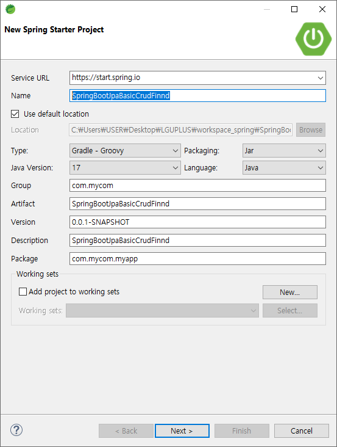
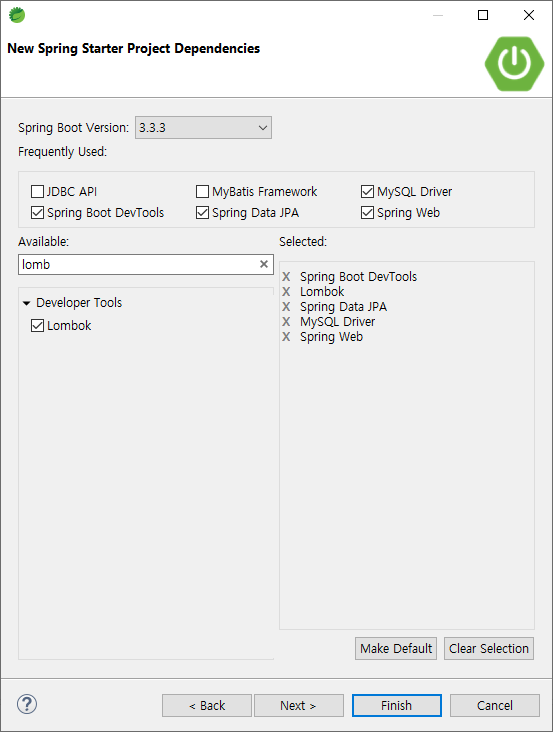
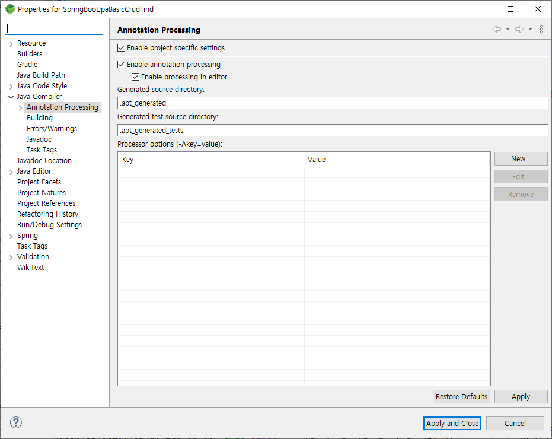
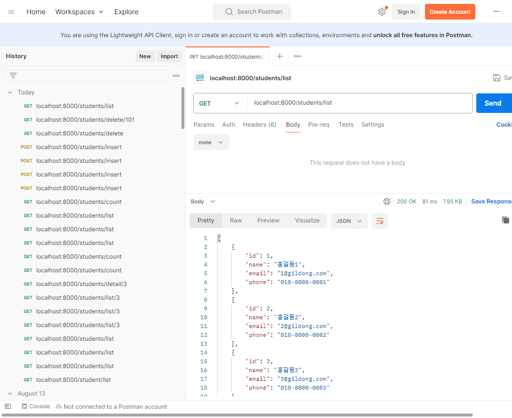

# Spring Data JPA

- spring Data JPA API URL : https://docs.spring.io/spring-data/jpa/docs/current/api/org/springframework/data/jpa/repository/package-summary.html

## SpringBootJpaBasicCrudFind 프로젝트

### SpringBootJpaBasicCrudFind 프로젝트 생성





### 프로젝트 설정

- Gradle에서는 build.gradle의 dependencies에 dependency를 추가한다.
- [프로젝트명] 우클릭 → Gradle → Refresh Gradle Project로 Gradle 업데이트한다.

### application.properties

```java
spring.application.name=SpringBootJpaBasicCrudFind
server.port=8000

spring.datasource.url=jdbc:mysql://localhost:3306/jpa_basic_crud_find
spring.datasource.username=root
spring.datasource.password=root
spring.datasource.driver-class-name=com.mysql.cj.jdbc.Driver

spring.jpa.show-sql=true
```

### MySQL

- jpa_basic_crud_find 스키마 생성
- jpa_basic_crud_find 스키마에 테이블 및 데이터 입력 코드
    
    ```java
    drop table if exists student ;
    create table student (
      id int not null auto_increment,
      email varchar(200) default null,
      phone varchar(13) default '010-0000-0000',
      name varchar(255) default null,
      primary key (id)
    );
    insert into student values (1,'1@gildong.com','010-0000-0001','홍길동1');
    insert into student values (2,'2@gildong.com','010-0000-0002','홍길동2');
    insert into student values (3,'3@gildong.com','010-0000-0003','홍길동3');
    insert into student values (4,'4@gildong.com','010-0000-0004','홍길동4');
    insert into student values (5,'5@gildong.com','010-0000-0005','홍길동5');
    insert into student values (6,'6@gildong.com','010-0000-0006','홍길동6');
    insert into student values (7,'7@gildong.com','010-0000-0007','홍길동7');
    insert into student values (8,'8@gildong.com','010-0000-0008','홍길동8');
    insert into student values (9,'9@gildong.com','010-0000-0009','홍길동9');
    insert into student values (10,'10@gildong.com','010-0000-0010','홍길동10');
    insert into student values (11,'11@gildong.com','010-0000-0011','홍길동11');
    insert into student values (12,'12@gildong.com','010-0000-0012','홍길동12');
    insert into student values (13,'13@gildong.com','010-0000-0013','홍길동13');
    insert into student values (14,'14@gildong.com','010-0000-0014','홍길동14');
    insert into student values (15,'15@gildong.com','010-0000-0015','홍길동15');
    insert into student values (16,'16@gildong.com','010-0000-0016','홍길동16');
    insert into student values (17,'17@gildong.com','010-0000-0017','홍길동17');
    insert into student values (18,'18@gildong.com','010-0000-0018','홍길동18');
    insert into student values (19,'19@gildong.com','010-0000-0019','홍길동19');
    insert into student values (20,'20@gildong.com','010-0000-0020','홍길동20');
    insert into student values (21,'21@gildong.com','010-0000-0021','홍길동21');
    insert into student values (22,'22@gildong.com','010-0000-0022','홍길동22');
    insert into student values (23,'23@gildong.com','010-0000-0023','홍길동23');
    insert into student values (24,'24@gildong.com','010-0000-0024','홍길동24');
    insert into student values (25,'25@gildong.com','010-0000-0025','홍길동25');
    insert into student values (26,'26@gildong.com','010-0000-0026','홍길동26');
    insert into student values (27,'27@gildong.com','010-0000-0027','홍길동27');
    insert into student values (28,'28@gildong.com','010-0000-0028','홍길동28');
    insert into student values (29,'29@gildong.com','010-0000-0029','홍길동29');
    insert into student values (30,'30@gildong.com','010-0000-0030','홍길동30');
    insert into student values (31,'31@gildong.com','010-0000-0031','홍길동31');
    insert into student values (32,'32@gildong.com','010-0000-0032','홍길동32');
    insert into student values (33,'33@gildong.com','010-0000-0033','홍길동33');
    insert into student values (34,'34@gildong.com','010-0000-0034','홍길동34');
    insert into student values (35,'35@gildong.com','010-0000-0035','홍길동35');
    insert into student values (36,'36@gildong.com','010-0000-0036','홍길동36');
    insert into student values (37,'37@gildong.com','010-0000-0037','홍길동37');
    insert into student values (38,'38@gildong.com','010-0000-0038','홍길동38');
    insert into student values (39,'39@gildong.com','010-0000-0039','홍길동39');
    insert into student values (40,'40@gildong.com','010-0000-0040','홍길동40');
    insert into student values (41,'41@gildong.com','010-0000-0041','홍길동41');
    insert into student values (42,'42@gildong.com','010-0000-0042','홍길동42');
    insert into student values (43,'43@gildong.com','010-0000-0043','홍길동43');
    insert into student values (44,'44@gildong.com','010-0000-0044','홍길동44');
    insert into student values (45,'45@gildong.com','010-0000-0045','홍길동45');
    insert into student values (46,'46@gildong.com','010-0000-0046','홍길동46');
    insert into student values (47,'47@gildong.com','010-0000-0047','홍길동47');
    insert into student values (48,'48@gildong.com','010-0000-0048','홍길동48');
    insert into student values (49,'49@gildong.com','010-0000-0049','홍길동49');
    insert into student values (50,'50@gildong.com','010-0000-0050','홍길동50');
    insert into student values (51,'51@gildong.com','010-0000-0051','홍길동51');
    insert into student values (52,'52@gildong.com','010-0000-0052','홍길동52');
    insert into student values (53,'53@gildong.com','010-0000-0053','홍길동53');
    insert into student values (54,'54@gildong.com','010-0000-0054','홍길동54');
    insert into student values (55,'55@gildong.com','010-0000-0055','홍길동55');
    insert into student values (56,'56@gildong.com','010-0000-0056','홍길동56');
    insert into student values (57,'57@gildong.com','010-0000-0057','홍길동57');
    insert into student values (58,'58@gildong.com','010-0000-0058','홍길동58');
    insert into student values (59,'59@gildong.com','010-0000-0059','홍길동59');
    insert into student values (60,'60@gildong.com','010-0000-0060','홍길동60');
    insert into student values (61,'61@gildong.com','010-0000-0061','홍길동61');
    insert into student values (62,'62@gildong.com','010-0000-0062','홍길동62');
    insert into student values (63,'63@gildong.com','010-0000-0063','홍길동63');
    insert into student values (64,'64@gildong.com','010-0000-0064','홍길동64');
    insert into student values (65,'65@gildong.com','010-0000-0065','홍길동65');
    insert into student values (66,'66@gildong.com','010-0000-0066','홍길동66');
    insert into student values (67,'67@gildong.com','010-0000-0067','홍길동67');
    insert into student values (68,'68@gildong.com','010-0000-0068','홍길동68');
    insert into student values (69,'69@gildong.com','010-0000-0069','홍길동69');
    insert into student values (70,'70@gildong.com','010-0000-0070','홍길동70');
    insert into student values (71,'71@gildong.com','010-0000-0071','홍길동71');
    insert into student values (72,'72@gildong.com','010-0000-0072','홍길동72');
    insert into student values (73,'73@gildong.com','010-0000-0073','홍길동73');
    insert into student values (74,'74@gildong.com','010-0000-0074','홍길동74');
    insert into student values (75,'75@gildong.com','010-0000-0075','홍길동75');
    insert into student values (76,'76@gildong.com','010-0000-0076','홍길동76');
    insert into student values (77,'77@gildong.com','010-0000-0077','홍길동77');
    insert into student values (78,'78@gildong.com','010-0000-0078','홍길동78');
    insert into student values (79,'79@gildong.com','010-0000-0079','홍길동79');
    insert into student values (80,'80@gildong.com','010-0000-0080','홍길동80');
    insert into student values (81,'81@gildong.com','010-0000-0081','홍길동81');
    insert into student values (82,'82@gildong.com','010-0000-0082','홍길동82');
    insert into student values (83,'83@gildong.com','010-0000-0083','홍길동83');
    insert into student values (84,'84@gildong.com','010-0000-0084','홍길동84');
    insert into student values (85,'85@gildong.com','010-0000-0085','홍길동85');
    insert into student values (86,'86@gildong.com','010-0000-0086','홍길동86');
    insert into student values (87,'87@gildong.com','010-0000-0087','홍길동87');
    insert into student values (88,'88@gildong.com','010-0000-0088','홍길동88');
    insert into student values (89,'89@gildong.com','010-0000-0089','홍길동89');
    insert into student values (90,'90@gildong.com','010-0000-0090','홍길동90');
    insert into student values (91,'91@gildong.com','010-0000-0091','홍길동91');
    insert into student values (92,'92@gildong.com','010-0000-0092','홍길동92');
    insert into student values (93,'93@gildong.com','010-0000-0093','홍길동93');
    insert into student values (94,'94@gildong.com','010-0000-0094','홍길동94');
    insert into student values (95,'95@gildong.com','010-0000-0095','홍길동95');
    insert into student values (96,'96@gildong.com','010-0000-0096','홍길동96');
    insert into student values (97,'97@gildong.com','010-0000-0097','홍길동97');
    insert into student values (98,'98@gildong.com','010-0000-0098','홍길동98');
    insert into student values (99,'99@gildong.com','010-0000-0099','홍길동99');
    insert into student values (100,'100@gildong.com','010-0000-0100','홍길동100');
    ```
    
- sts에 lombok 적용 설정 : https://m.blog.naver.com/daka1122/222837239050

### SpringBootJpaBasicCrudFind 프로젝트 코드

### src/main/resources/static/index.html

```java
<!DOCTYPE html>
<html>
<head>
<meta charset="UTF-8">
<title>Insert title here</title>
</head>
<body>
	<h1>index.html</h1>
</body>
</html>
```

### src/main/resources/static/mypage.html

```java
<!DOCTYPE html>
<html>
<head>
<meta charset="UTF-8">
<title>Insert title here</title>
</head>
<body>
	<h1>mypage.html</h1>
</body>
</html>
```

### src/main/java/com/mycom/myapp/PageController.java

```java
package com.mycom.myapp;

import org.springframework.stereotype.Controller;
import org.springframework.web.bind.annotation.GetMapping;

// spring boot + jpa
// html 여러 개 + ajax

@Controller
public class PageController {
	
	@GetMapping("/mypage")
	public String mypage() {
		System.out.println("/mypage");
		return "/mypage.html";
	}

}
```

### src/main/java/com/mycom/myapp

- controller, entity, repository, service 패키지 생성
- PageController를 controller 패키지로 이동

### default crud

### entity/Student.java

```java
package com.mycom.myapp.entity;

import jakarta.persistence.Entity;
import jakarta.persistence.GeneratedValue;
import jakarta.persistence.GenerationType;
import jakarta.persistence.Id;
import jakarta.persistence.Table;
import lombok.AllArgsConstructor;
import lombok.Data;
import lombok.Getter;
import lombok.NoArgsConstructor;
import lombok.Setter;
import lombok.ToString;

@Entity
@Table(name = "student")
//@Getter
//@Setter
//@ToString
//@NoArgsConstructor
//@AllArgsConstructor
@Data // = @Getter + @Setter + @ToString + @EqualsAndHashCode + @RequiredArgsConstructor ( private final ... )
// 연관 관계를 가지는 필드에 대해서는 toString()에서 제외되도록, 그리고 @EqualsAndHashCode에 의해 만들어지는 코드가 불필요한 관계의 sql을 수행하는 경우 발생
public class Student {

	@Id
	@GeneratedValue(strategy = GenerationType.IDENTITY)
	private int id;
	
	private String name;
	
	private String email;
	
	private String phone;
	
}
```

### repository/StudentRepository.java

```java
package com.mycom.myapp.repository;

import org.springframework.data.jpa.repository.JpaRepository;

import com.mycom.myapp.entity.Student;

public interface StudentRepository extends JpaRepository<Student, Integer>{
	
	// default로 제공되는 crud 등 method <- 자동으로 생성
	
	// find() : query method <- 직접 명시해 줘야 한다.

}
```

### service

### StudentServiceCrud.java

```java
package com.mycom.myapp.service;

import java.util.List;
import java.util.Optional;

import com.mycom.myapp.entity.Student;

public interface StudentServiceCrud {
	
	List<Student> listStudent();  // 목록
	long countStudent();  // 전체 건 수
	Optional<Student> detailStudent(int id);  // 상세 (table에서 찾지 못하는 경우 대응)
	List<Student> listStudent(int pageNumber, int pageSize);
	
	Student insertStudent(Student student);  // 등록
	Student updateStudent(Student student);  // 수정
	void deleteStudent(int id);  // 삭제

}
```

### StudentServiceCrudImpl.java

```java
package com.mycom.myapp.service;

import java.util.List;
import java.util.Optional;

import org.springframework.data.domain.Page;
import org.springframework.data.domain.PageRequest;
import org.springframework.data.domain.Pageable;
import org.springframework.stereotype.Service;

import com.mycom.myapp.entity.Student;
import com.mycom.myapp.repository.StudentRepository;

import lombok.RequiredArgsConstructor;

@Service
@RequiredArgsConstructor
public class StudentServiceCrudImpl implements StudentServiceCrud {

	// lombok의 @RequiredArgsConstructor 를 이용
	private final StudentRepository studentRepository;
	
//	public StudentServiceCrudImpl(StudentRepository studentRepository) {
//		this.studentRepository = studentRepository;
//	}
	
	@Override
	public List<Student> listStudent() {
		return studentRepository.findAll();
	}

	@Override
	public long countStudent() {
		return studentRepository.count();
	}

	@Override
	public Optional<Student> detailStudent(int id) {
		return studentRepository.findById(id);
	}

	@Override
	public Student insertStudent(Student student) {
		return studentRepository.save(student);
	}

	@Override
	public Student updateStudent(Student student) {
		return studentRepository.save(student);
	}

	@Override
	public void deleteStudent(int id) {
		studentRepository.deleteById(id);
	}

	@Override
	public List<Student> listStudent(int pageNumber, int pageSize) {
		Pageable pageable = PageRequest.of(pageNumber, pageSize);
		Page<Student> page = studentRepository.findAll(pageable);
		return page.toList();
	}

}
```

### controller/StudentControlllerCrud.java

```java
package com.mycom.myapp.controller;

import java.util.List;
import java.util.Optional;

import org.springframework.stereotype.Controller;
import org.springframework.web.bind.annotation.GetMapping;
import org.springframework.web.bind.annotation.PathVariable;
import org.springframework.web.bind.annotation.PostMapping;
import org.springframework.web.bind.annotation.RequestMapping;
import org.springframework.web.bind.annotation.RequestParam;
import org.springframework.web.bind.annotation.ResponseBody;

import com.mycom.myapp.entity.Student;
import com.mycom.myapp.service.StudentServiceCrud;

import lombok.RequiredArgsConstructor;

@Controller
@ResponseBody
@RequestMapping("/students")
@RequiredArgsConstructor
public class StudentControllerCrud {

	private final StudentServiceCrud studentServiceCrud;
	
	@GetMapping("/list")
	public List<Student> listStudent() {
		return studentServiceCrud.listStudent();
	}
	
	@GetMapping("/detail/{id}")
	public Optional<Student> detailStudent(@PathVariable("id") int id) {
		return studentServiceCrud.detailStudent(id);
	}
	
	@GetMapping("/count")
	public long countStudent() {
		return studentServiceCrud.countStudent();
	}
	
	@GetMapping("/page")
	public List<Student> listStudent(@RequestParam("pageNumber") int pageNumber, @RequestParam("pageSize") int pageSize) {
		return studentServiceCrud.listStudent(pageNumber, pageSize);
	}
	
	@PostMapping("/insert")
	public Student insertStudent(Student student) {  // www.urlencoded
		return studentServiceCrud.insertStudent(student);
	}
	
	@PostMapping("/update")
	public Student updateStudent(Student student) {  // www.urlencoded
		return studentServiceCrud.updateStudent(student);
	}
	
	@GetMapping("/delete/{id}")
	public void deleteStudent(@PathVariable("id") int id) {  // www.urlencoded
		studentServiceCrud.deleteStudent(id);
	}
	
}
```

### postman 결과가 비어있는 경우 해결방안 - lombok 오류

- postman 결과 : {}
- 해결 방법 : [프로젝트명] 우클릭 → [properties] → [Java Compiler] → [Annotation Processing] → Enable project specific settings 체크
    
    
    

### 실행 결과



Spring Data JPA API : https://docs.spring.io/spring-data/jpa/reference/jpa/query-methods.html

### find() - findByName

### repository/StudentRepository.java

```java
package com.mycom.myapp.repository;

import java.util.List;

import org.springframework.data.jpa.repository.JpaRepository;

import com.mycom.myapp.entity.Student;

public interface StudentRepository extends JpaRepository<Student, Integer>{
	
	// default로 제공되는 crud 등 method <- 자동으로 생성
	
	// find() : query method <- 직접 명시해 줘야 한다.
	
	List<Student> findByName(String name);

}
```

### service

### StudentServiceFind.java

```java
package com.mycom.myapp.service;

import java.util.List;

import com.mycom.myapp.entity.Student;

public interface StudentServiceFind {

	List<Student> findByName(String name);
	
}
```

### StudentServiceCrudImpl.java

```java
package com.mycom.myapp.service;

import java.util.List;

import org.springframework.stereotype.Service;

import com.mycom.myapp.entity.Student;
import com.mycom.myapp.repository.StudentRepository;

import lombok.RequiredArgsConstructor;

@Service
@RequiredArgsConstructor
public class StudentServiceFindImpl implements StudentServiceFind{
	
	private final StudentRepository studentRepository;

	@Override
	public List<Student> findByName(String name) {
		return studentRepository.findByName(name);
	}
	
}
```

### controller/StudentControlllerFind.java

```java
package com.mycom.myapp.controller;

import java.util.List;

import org.springframework.stereotype.Controller;
import org.springframework.web.bind.annotation.GetMapping;
import org.springframework.web.bind.annotation.RequestMapping;
import org.springframework.web.bind.annotation.RequestParam;
import org.springframework.web.bind.annotation.ResponseBody;

import com.mycom.myapp.entity.Student;
import com.mycom.myapp.service.StudentServiceFind;

import lombok.RequiredArgsConstructor;

@Controller
@ResponseBody
@RequestMapping("/students")
@RequiredArgsConstructor
public class StudentControllerFind {

	private final StudentServiceFind studentServiceFind;
	
	@GetMapping("/find/name")
	public List<Student> findByName(@RequestParam("name") String name) {
		return studentServiceFind.findByName(name);
	}
	
}
```

### 실행 결과

_findByName_실행결과.png)

### find() - findByEmailAndPhone/findByEmailOrPhone

### repository/StudentRepository.java

```java
package com.mycom.myapp.repository;

import java.util.List;

import org.springframework.data.jpa.repository.JpaRepository;

import com.mycom.myapp.entity.Student;

public interface StudentRepository extends JpaRepository<Student, Integer>{
	
	// default로 제공되는 crud 등 method <- 자동으로 생성
	
	// find() : query method <- 직접 명시해 줘야 한다.
	
	List<Student> findByName(String name);
	List<Student> findByEmailAndPhone(String email, String phone);
	List<Student> findByEmailOrPhone(String email, String phone);
	
}
```

### service

### StudentServiceFind.java

```java
package com.mycom.myapp.service;

import java.util.List;

import com.mycom.myapp.entity.Student;

public interface StudentServiceFind {

	List<Student> findByName(String name);
	List<Student> findByEmailAndPhone(String email, String phone);
	List<Student> findByEmailOrPhone(String email, String phone);
}
```

### StudentServiceCrudImpl.java

```java
package com.mycom.myapp.service;

import java.util.List;

import org.springframework.stereotype.Service;

import com.mycom.myapp.entity.Student;
import com.mycom.myapp.repository.StudentRepository;

import lombok.RequiredArgsConstructor;

@Service
@RequiredArgsConstructor
public class StudentServiceFindImpl implements StudentServiceFind{
	
	private final StudentRepository studentRepository;

	@Override
	public List<Student> findByName(String name) {
		return studentRepository.findByName(name);
	}

	@Override
	public List<Student> findByEmailAndPhone(String email, String phone) {
		return studentRepository.findByEmailAndPhone(email, phone);
	}
	
	@Override
	public List<Student> findByEmailOrPhone(String email, String phone) {
		return studentRepository.findByEmailOrPhone(email, phone);
	}
	
}
```

### controller/StudentControlllerFind.java

```java
package com.mycom.myapp.controller;

import java.util.List;

import org.springframework.stereotype.Controller;
import org.springframework.web.bind.annotation.GetMapping;
import org.springframework.web.bind.annotation.RequestMapping;
import org.springframework.web.bind.annotation.RequestParam;
import org.springframework.web.bind.annotation.ResponseBody;

import com.mycom.myapp.entity.Student;
import com.mycom.myapp.service.StudentServiceFind;

import lombok.RequiredArgsConstructor;

@Controller
@ResponseBody
@RequestMapping("/students")
@RequiredArgsConstructor
public class StudentControllerFind {

	private final StudentServiceFind studentServiceFind;
	
	@GetMapping("/find/name")
	public List<Student> findByName(@RequestParam("name") String name) {
		return studentServiceFind.findByName(name);
	}
	
	@GetMapping("/find/emailandphone")
	public List<Student> findByEmailAndPhone(@RequestParam("email") String email, @RequestParam("phone") String phone) {
		return studentServiceFind.findByEmailAndPhone(email, phone);
	}
	
	@GetMapping("/find/emailorphone")
	public List<Student> findByEmailOrPhone(@RequestParam("email") String email, @RequestParam("phone") String phone) {
		return studentServiceFind.findByEmailOrPhone(email, phone);
	}
	
}
```

### 실행 결과

_findByEmailAndPhone_findByEmailOrPhone_실행결과.png)

### find() - StartingWith/EndingWith/Containing/like

### repository/StudentRepository.java

```java
package com.mycom.myapp.repository;

import java.util.List;

import org.springframework.data.jpa.repository.JpaRepository;

import com.mycom.myapp.entity.Student;

public interface StudentRepository extends JpaRepository<Student, Integer>{
	
	// default로 제공되는 crud 등 method <- 자동으로 생성
	
	// find() : query method <- 직접 명시해 줘야 한다.
	
	List<Student> findByName(String name);
	List<Student> findByEmailAndPhone(String email, String phone);
	List<Student> findByEmailOrPhone(String email, String phone);
	
	// search
	List<Student> findByNameStartingWith(String name);
	List<Student> findByEmailEndingWith(String email);
	List<Student> findByPhoneContaining(String phone);
	List<Student> findByNameLike(String name);
}
```

### service

### StudentServiceFind.java

```java
package com.mycom.myapp.service;

import java.util.List;

import com.mycom.myapp.entity.Student;

public interface StudentServiceFind {

	List<Student> findByName(String name);
	List<Student> findByEmailAndPhone(String email, String phone);
	List<Student> findByEmailOrPhone(String email, String phone);
	
	List<Student> findByNameStartingWith(String name);
	List<Student> findByEmailEndingWith(String email);
	List<Student> findByPhoneContaining(String phone);
	List<Student> findByNameLike(String name);
}
```

### StudentServiceCrudImpl.java

```java
package com.mycom.myapp.service;

import java.util.List;

import org.springframework.stereotype.Service;

import com.mycom.myapp.entity.Student;
import com.mycom.myapp.repository.StudentRepository;

import lombok.RequiredArgsConstructor;

@Service
@RequiredArgsConstructor
public class StudentServiceFindImpl implements StudentServiceFind{
	
	private final StudentRepository studentRepository;

	@Override
	public List<Student> findByName(String name) {
		return studentRepository.findByName(name);
	}

	@Override
	public List<Student> findByEmailAndPhone(String email, String phone) {
		return studentRepository.findByEmailAndPhone(email, phone);
	}
	
	@Override
	public List<Student> findByEmailOrPhone(String email, String phone) {
		return studentRepository.findByEmailOrPhone(email, phone);
	}

	@Override
	public List<Student> findByNameStartingWith(String name) {
		return studentRepository.findByNameStartingWith(name);
	}

	@Override
	public List<Student> findByEmailEndingWith(String email) {
		return studentRepository.findByEmailEndingWith(email);
	}

	@Override
	public List<Student> findByPhoneContaining(String phone) {
		return studentRepository.findByPhoneContaining(phone);
	}

	@Override
	public List<Student> findByNameLike(String name) {
//		return studentRepository.findByNameLike("%" + name);  // ending with
//		return studentRepository.findByNameLike(name + "%");  // starting with
		return studentRepository.findByNameLike("%" + name + "%");  // containing
	}
	
}
```

### controller/StudentControlllerFind.java

```java
package com.mycom.myapp.controller;

import java.util.List;

import org.springframework.stereotype.Controller;
import org.springframework.web.bind.annotation.GetMapping;
import org.springframework.web.bind.annotation.RequestMapping;
import org.springframework.web.bind.annotation.RequestParam;
import org.springframework.web.bind.annotation.ResponseBody;

import com.mycom.myapp.entity.Student;
import com.mycom.myapp.service.StudentServiceFind;

import lombok.RequiredArgsConstructor;

@Controller
@ResponseBody
@RequestMapping("/students")
@RequiredArgsConstructor
public class StudentControllerFind {

	private final StudentServiceFind studentServiceFind;
	
	@GetMapping("/find/name")
	public List<Student> findByName(@RequestParam("name") String name) {
		return studentServiceFind.findByName(name);
	}
	
	@GetMapping("/find/emailandphone")
	public List<Student> findByEmailAndPhone(@RequestParam("email") String email, @RequestParam("phone") String phone) {
		return studentServiceFind.findByEmailAndPhone(email, phone);
	}
	
	@GetMapping("/find/emailorphone")
	public List<Student> findByEmailOrPhone(@RequestParam("email") String email, @RequestParam("phone") String phone) {
		return studentServiceFind.findByEmailOrPhone(email, phone);
	}
	
	@GetMapping("/find/namestartingwith")
	public List<Student> findByNameStartingWith(@RequestParam("name") String name) {
		return studentServiceFind.findByNameStartingWith(name);
	}
	
	@GetMapping("/find/emailendingwith")
	public List<Student> findByEmailEndingWith(@RequestParam("email") String email) {
		return studentServiceFind.findByEmailEndingWith(email);
	}
	
	@GetMapping("/find/phonecontaining")
	public List<Student> findByPhoneContaining(@RequestParam("phone") String phone) {
		return studentServiceFind.findByPhoneContaining(phone);
	}
	
	@GetMapping("/find/namelike")
	public List<Student> findByNameLike(@RequestParam("name") String name) {
		return studentServiceFind.findByNameLike(name);
	}
	
}
```

### 실행 결과

_StartingWith_EndingWith_Containing_like_실행결과.png)

### find() - findAllByOrderByNameDesc

### repository/StudentRepository.java

```java
package com.mycom.myapp.repository;

import java.util.List;

import org.springframework.data.jpa.repository.JpaRepository;

import com.mycom.myapp.entity.Student;

public interface StudentRepository extends JpaRepository<Student, Integer>{
	
	// default로 제공되는 crud 등 method <- 자동으로 생성
	
	// find() : query method <- 직접 명시해 줘야 한다.
	
	List<Student> findByName(String name);
	List<Student> findByEmailAndPhone(String email, String phone);
	List<Student> findByEmailOrPhone(String email, String phone);
	
	// search
	List<Student> findByNameStartingWith(String name);
	List<Student> findByEmailEndingWith(String email);
	List<Student> findByPhoneContaining(String phone);
	List<Student> findByNameLike(String name);
	
	// order by
	List<Student> findAllByOrderByNameDesc();
	
}
```

### service

### StudentServiceFind.java

```java
package com.mycom.myapp.service;

import java.util.List;

import com.mycom.myapp.entity.Student;

public interface StudentServiceFind {

	List<Student> findByName(String name);
	List<Student> findByEmailAndPhone(String email, String phone);
	List<Student> findByEmailOrPhone(String email, String phone);
	
	List<Student> findByNameStartingWith(String name);
	List<Student> findByEmailEndingWith(String email);
	List<Student> findByPhoneContaining(String phone);
	List<Student> findByNameLike(String name);
	
	List<Student> findAllByOrderByNameDesc();
	
}
```

### StudentServiceCrudImpl.java

```java
package com.mycom.myapp.service;

import java.util.List;

import org.springframework.stereotype.Service;

import com.mycom.myapp.entity.Student;
import com.mycom.myapp.repository.StudentRepository;

import lombok.RequiredArgsConstructor;

@Service
@RequiredArgsConstructor
public class StudentServiceFindImpl implements StudentServiceFind{
	
	private final StudentRepository studentRepository;

	@Override
	public List<Student> findByName(String name) {
		return studentRepository.findByName(name);
	}

	@Override
	public List<Student> findByEmailAndPhone(String email, String phone) {
		return studentRepository.findByEmailAndPhone(email, phone);
	}
	
	@Override
	public List<Student> findByEmailOrPhone(String email, String phone) {
		return studentRepository.findByEmailOrPhone(email, phone);
	}

	@Override
	public List<Student> findByNameStartingWith(String name) {
		return studentRepository.findByNameStartingWith(name);
	}

	@Override
	public List<Student> findByEmailEndingWith(String email) {
		return studentRepository.findByEmailEndingWith(email);
	}

	@Override
	public List<Student> findByPhoneContaining(String phone) {
		return studentRepository.findByPhoneContaining(phone);
	}

	@Override
	public List<Student> findByNameLike(String name) {
//		return studentRepository.findByNameLike("%" + name);  // ending with
//		return studentRepository.findByNameLike(name + "%");  // starting with
		return studentRepository.findByNameLike("%" + name + "%");  // containing
	}

	@Override
	public List<Student> findAllByOrderByNameDesc() {
		return studentRepository.findAllByOrderByNameDesc();
	}
	
}
```

### controller/StudentControlllerFind.java

```java
package com.mycom.myapp.controller;

import java.util.List;

import org.springframework.stereotype.Controller;
import org.springframework.web.bind.annotation.GetMapping;
import org.springframework.web.bind.annotation.RequestMapping;
import org.springframework.web.bind.annotation.RequestParam;
import org.springframework.web.bind.annotation.ResponseBody;

import com.mycom.myapp.entity.Student;
import com.mycom.myapp.service.StudentServiceFind;

import lombok.RequiredArgsConstructor;

@Controller
@ResponseBody
@RequestMapping("/students")
@RequiredArgsConstructor
public class StudentControllerFind {

	private final StudentServiceFind studentServiceFind;
	
	@GetMapping("/find/name")
	public List<Student> findByName(@RequestParam("name") String name) {
		return studentServiceFind.findByName(name);
	}
	
	@GetMapping("/find/emailandphone")
	public List<Student> findByEmailAndPhone(@RequestParam("email") String email, @RequestParam("phone") String phone) {
		return studentServiceFind.findByEmailAndPhone(email, phone);
	}
	
	@GetMapping("/find/emailorphone")
	public List<Student> findByEmailOrPhone(@RequestParam("email") String email, @RequestParam("phone") String phone) {
		return studentServiceFind.findByEmailOrPhone(email, phone);
	}
	
	@GetMapping("/find/namestartingwith")
	public List<Student> findByNameStartingWith(@RequestParam("name") String name) {
		return studentServiceFind.findByNameStartingWith(name);
	}
	
	@GetMapping("/find/emailendingwith")
	public List<Student> findByEmailEndingWith(@RequestParam("email") String email) {
		return studentServiceFind.findByEmailEndingWith(email);
	}
	
	@GetMapping("/find/phonecontaining")
	public List<Student> findByPhoneContaining(@RequestParam("phone") String phone) {
		return studentServiceFind.findByPhoneContaining(phone);
	}
	
	@GetMapping("/find/namelike")
	public List<Student> findByNameLike(@RequestParam("name") String name) {
		return studentServiceFind.findByNameLike(name);
	}
	
	@GetMapping("/find/orderbynamedesc")
	public List<Student> findAllByOrderByNameDesc() {  // findAll ~ 과 findBy ~ 동일한 결과
		return studentServiceFind.findAllByOrderByNameDesc();
	}
	
}
```

### 실행 결과

_findAllByOrderByNameDesc_실행결과.png)

### find() - findByIdBetween

### repository/StudentRepository.java

```java
package com.mycom.myapp.repository;

import java.util.List;

import org.springframework.data.jpa.repository.JpaRepository;

import com.mycom.myapp.entity.Student;

public interface StudentRepository extends JpaRepository<Student, Integer>{
	
	// default로 제공되는 crud 등 method <- 자동으로 생성
	
	// find() : query method <- 직접 명시해 줘야 한다.
	
	List<Student> findByName(String name);
	List<Student> findByEmailAndPhone(String email, String phone);
	List<Student> findByEmailOrPhone(String email, String phone);
	
	// search
	List<Student> findByNameStartingWith(String name);
	List<Student> findByEmailEndingWith(String email);
	List<Student> findByPhoneContaining(String phone);
	List<Student> findByNameLike(String name);
	
	// order by
	List<Student> findAllByOrderByNameDesc();
	
	// between
	List<Student> findByIdBetween(int from, int to);
}
```

### service

### StudentServiceFind.java

```java
package com.mycom.myapp.service;

import java.util.List;

import com.mycom.myapp.entity.Student;

public interface StudentServiceFind {

	List<Student> findByName(String name);
	List<Student> findByEmailAndPhone(String email, String phone);
	List<Student> findByEmailOrPhone(String email, String phone);
	
	List<Student> findByNameStartingWith(String name);
	List<Student> findByEmailEndingWith(String email);
	List<Student> findByPhoneContaining(String phone);
	List<Student> findByNameLike(String name);
	
	List<Student> findAllByOrderByNameDesc();
	List<Student> findByIdBetween(int from, int to);
	
}
```

### StudentServiceCrudImpl.java

```java
package com.mycom.myapp.service;

import java.util.List;

import org.springframework.stereotype.Service;

import com.mycom.myapp.entity.Student;
import com.mycom.myapp.repository.StudentRepository;

import lombok.RequiredArgsConstructor;

@Service
@RequiredArgsConstructor
public class StudentServiceFindImpl implements StudentServiceFind{
	
	private final StudentRepository studentRepository;

	@Override
	public List<Student> findByName(String name) {
		return studentRepository.findByName(name);
	}

	@Override
	public List<Student> findByEmailAndPhone(String email, String phone) {
		return studentRepository.findByEmailAndPhone(email, phone);
	}
	
	@Override
	public List<Student> findByEmailOrPhone(String email, String phone) {
		return studentRepository.findByEmailOrPhone(email, phone);
	}

	@Override
	public List<Student> findByNameStartingWith(String name) {
		return studentRepository.findByNameStartingWith(name);
	}

	@Override
	public List<Student> findByEmailEndingWith(String email) {
		return studentRepository.findByEmailEndingWith(email);
	}

	@Override
	public List<Student> findByPhoneContaining(String phone) {
		return studentRepository.findByPhoneContaining(phone);
	}

	@Override
	public List<Student> findByNameLike(String name) {
//		return studentRepository.findByNameLike("%" + name);  // ending with
//		return studentRepository.findByNameLike(name + "%");  // starting with
		return studentRepository.findByNameLike("%" + name + "%");  // containing
	}

	@Override
	public List<Student> findAllByOrderByNameDesc() {
		return studentRepository.findAllByOrderByNameDesc();
	}

	@Override
	public List<Student> findByIdBetween(int from, int to) {
		return studentRepository.findByIdBetween(from, to);
	}
	
}
```

### controller/StudentControlllerFind.java

```java
package com.mycom.myapp.controller;

import java.util.List;

import org.springframework.stereotype.Controller;
import org.springframework.web.bind.annotation.GetMapping;
import org.springframework.web.bind.annotation.RequestMapping;
import org.springframework.web.bind.annotation.RequestParam;
import org.springframework.web.bind.annotation.ResponseBody;

import com.mycom.myapp.entity.Student;
import com.mycom.myapp.service.StudentServiceFind;

import lombok.RequiredArgsConstructor;

@Controller
@ResponseBody
@RequestMapping("/students")
@RequiredArgsConstructor
public class StudentControllerFind {

	private final StudentServiceFind studentServiceFind;
	
	@GetMapping("/find/name")
	public List<Student> findByName(@RequestParam("name") String name) {
		return studentServiceFind.findByName(name);
	}
	
	@GetMapping("/find/emailandphone")
	public List<Student> findByEmailAndPhone(@RequestParam("email") String email, @RequestParam("phone") String phone) {
		return studentServiceFind.findByEmailAndPhone(email, phone);
	}
	
	@GetMapping("/find/emailorphone")
	public List<Student> findByEmailOrPhone(@RequestParam("email") String email, @RequestParam("phone") String phone) {
		return studentServiceFind.findByEmailOrPhone(email, phone);
	}
	
	@GetMapping("/find/namestartingwith")
	public List<Student> findByNameStartingWith(@RequestParam("name") String name) {
		return studentServiceFind.findByNameStartingWith(name);
	}
	
	@GetMapping("/find/emailendingwith")
	public List<Student> findByEmailEndingWith(@RequestParam("email") String email) {
		return studentServiceFind.findByEmailEndingWith(email);
	}
	
	@GetMapping("/find/phonecontaining")
	public List<Student> findByPhoneContaining(@RequestParam("phone") String phone) {
		return studentServiceFind.findByPhoneContaining(phone);
	}
	
	@GetMapping("/find/namelike")
	public List<Student> findByNameLike(@RequestParam("name") String name) {
		return studentServiceFind.findByNameLike(name);
	}
	
	@GetMapping("/find/orderbynamedesc")
	public List<Student> findAllByOrderByNameDesc() {  // findAll ~ 과 findBy ~ 동일한 결과
		return studentServiceFind.findAllByOrderByNameDesc();
	}
	
	@GetMapping("/find/idbetween")
	public List<Student> findByIdBetween(@RequestParam("from") int from, @RequestParam("to") int to) {  // findAll ~ 과 findBy ~ 동일한 결과
		return studentServiceFind.findByIdBetween(from, to);
	}
	
}
```

### 실행 결과

_findByIdBetween_실행결과.png)