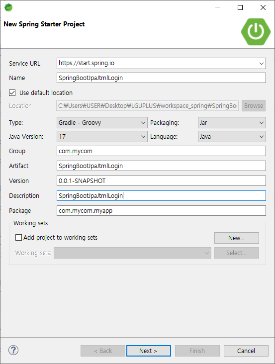
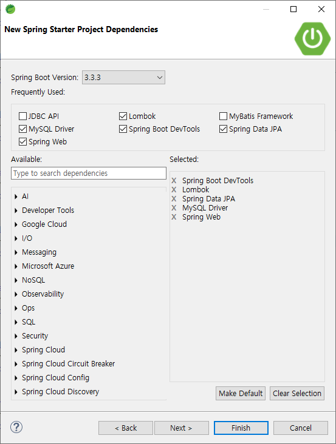
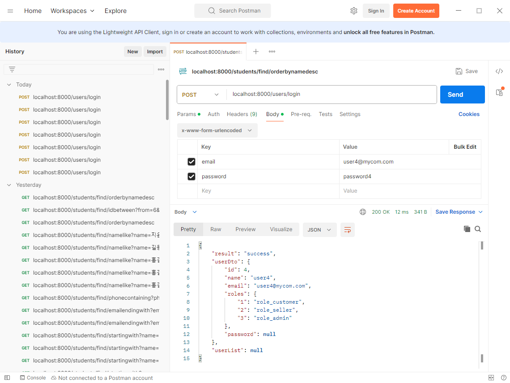
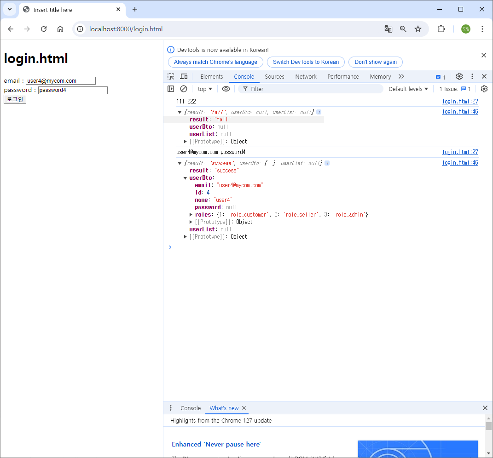
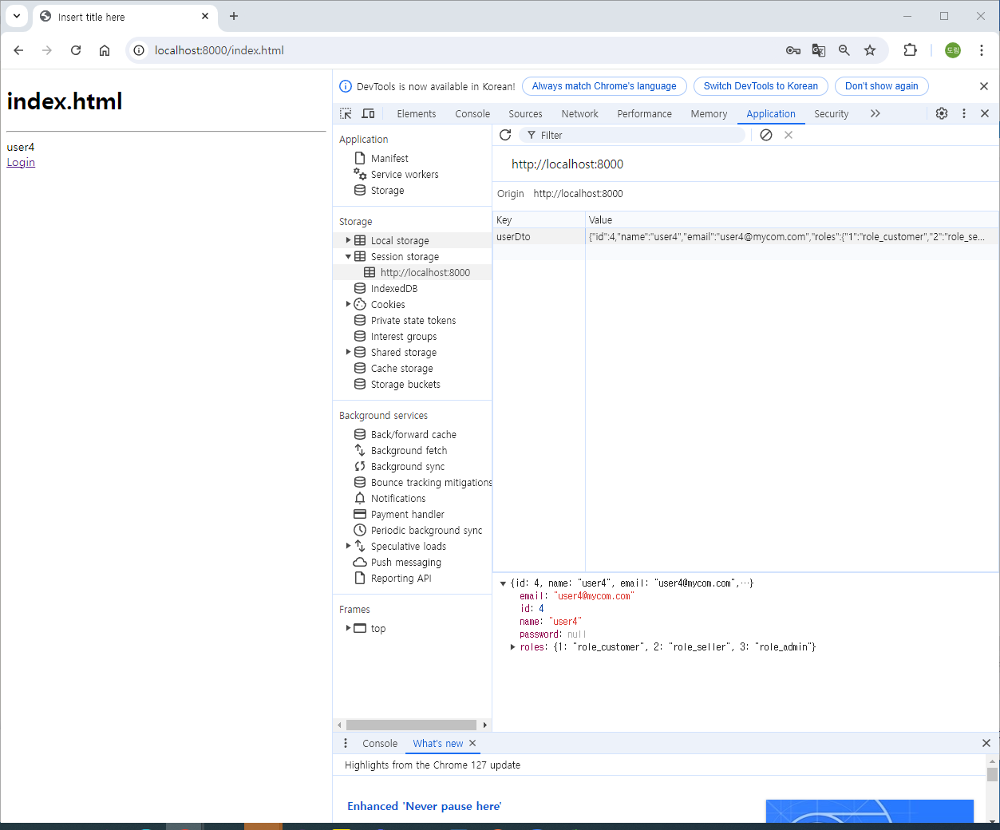
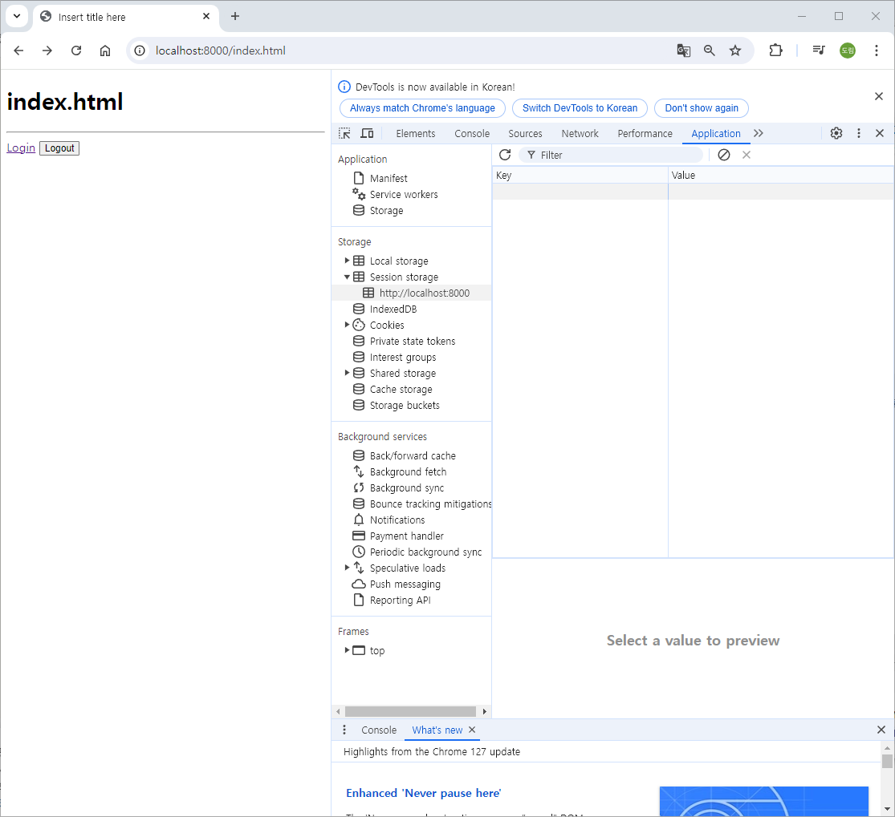

# [2024.08.27(화)] login/logout


# 조별 활동

## 1. Authentication vs Authorization 개념

- **Authentication (인증)**:
    - **정의**: 사용자가 누구인지 확인하는 과정입니다. 사용자가 시스템에 접근할 수 있는 유효한 사용자임을 확인하는 절차입니다. 일반적으로 사용자의 아이디와 비밀번호를 통해 수행됩니다.
    - **예시**: 웹사이트에 로그인할 때 사용자가 입력한 아이디와 비밀번호를 시스템이 확인하는 과정이 인증입니다.
    - **결과**: 인증이 성공하면, 시스템은 사용자가 누구인지 신뢰할 수 있습니다.
- **Authorization (권한 부여)**:
    - **정의**: 사용자가 어떤 자원에 접근할 수 있는지를 결정하는 과정입니다. 인증이 완료된 후에 특정 리소스나 기능에 대해 사용자가 가진 권한을 확인하여, 해당 리소스에 접근하거나 작업을 수행할 수 있는지 결정합니다.
    - **예시**: 인증된 사용자가 관리자 페이지에 접근하려 할 때, 시스템이 이 사용자가 관리자 권한을 가지고 있는지 확인하는 과정이 권한 부여입니다.
    - **결과**: 권한 부여가 성공하면, 사용자는 해당 리소스에 접근할 수 있습니다.

## 2. Backend 에서 어떻게 구현할 수 있을 까 검토 ( 테이블 , SpringBoot, client 등등 고려)

### 1) 데이터베이스 테이블 설계

- **User 테이블**:
    - `user_id`: 사용자 고유 ID (Primary Key)
    - `username`: 사용자의 로그인 아이디
    - `password`: 암호화된 비밀번호
    - `email`: 사용자의 이메일 주소
    - `roles`: 사용자의 역할 (예: ADMIN, USER 등). 여러 역할을 가질 수 있다면 별도의 `UserRole` 테이블을 사용하여 다대다 관계로 관리할 수 있습니다.
- **Role 테이블** (선택적):
    - `role_id`: 역할 고유 ID (Primary Key)
    - `role_name`: 역할 이름 (예: ADMIN, USER 등)
- **UserRole 테이블** (다대다 관계일 경우):
    - `user_id`: 사용자 ID (Foreign Key)
    - `role_id`: 역할 ID (Foreign Key)
- **Permission 테이블** (선택적, 권한 세분화를 원할 경우):
    - `permission_id`: 권한 고유 ID (Primary Key)
    - `permission_name`: 권한 이름 (예: READ_PRIVILEGE, WRITE_PRIVILEGE 등)
    - `role_id`: 해당 권한이 부여된 역할 ID (Foreign Key)

### 2) Spring Boot에서 구현

- **Spring Security 사용**:
    - Spring Boot에서는 `Spring Security` 라이브러리를 사용하여 인증 및 권한 부여를 관리할 수 있습니다.
    - **Authentication**:
        - `UserDetailsService`를 구현하여 사용자 정보를 로드합니다.
        - 비밀번호는 `PasswordEncoder`를 사용해 암호화하여 저장하고 비교합니다.
        - 로그인 요청 시 `UsernamePasswordAuthenticationFilter`가 요청을 가로채고, 사용자 자격 증명을 확인합니다.
    - **Authorization**:
        - `@PreAuthorize` 또는 `@Secured` 어노테이션을 사용해 메서드나 엔드포인트에 대한 접근 권한을 지정합니다.
        - `HttpSecurity` 설정에서 특정 URL 패턴에 대해 접근 권한을 설정할 수 있습니다. 예: `http.authorizeRequests().antMatchers("/admin/**").hasRole("ADMIN")`.

### 3) 클라이언트 측 구현

- **로그인 폼**:
    - 클라이언트에서 사용자가 로그인 정보를 입력하도록 로그인 폼을 제공합니다.
    - 입력된 자격 증명은 서버로 POST 요청을 통해 전송됩니다.
- **JWT (JSON Web Token) 사용**:
    - 인증에 성공하면 서버에서 JWT를 생성해 클라이언트에 전달합니다.
    - 클라이언트는 이후 요청 시 이 토큰을 포함해 서버에 전송하고, 서버는 이 토큰을 확인해 사용자를 인증 및 권한 부여합니다.
- **세션 관리**:
    - 서버 측에서 세션을 유지할 수 있으며, 세션 ID를 통해 사용자를 추적합니다.
    - Spring Security는 세션 기반 인증과 토큰 기반 인증 모두를 지원합니다.

### 4) 구현 예시

```java
java코드 복사
// UserDetailsService 구현 예시
@Service
public class CustomUserDetailsService implements UserDetailsService {

    @Autowired
    private UserRepository userRepository;

    @Override
    public UserDetails loadUserByUsername(String username) throws UsernameNotFoundException {
        User user = userRepository.findByUsername(username)
            .orElseThrow(() -> new UsernameNotFoundException("User not found"));

        return new org.springframework.security.core.userdetails.User(
            user.getUsername(),
            user.getPassword(),
            mapRolesToAuthorities(user.getRoles())
        );
    }

    private Collection<? extends GrantedAuthority> mapRolesToAuthorities(Collection<Role> roles) {
        return roles.stream()
                    .map(role -> new SimpleGrantedAuthority(role.getName()))
                    .collect(Collectors.toList());
    }
}

// Security Configuration 예시
@Configuration
@EnableWebSecurity
public class SecurityConfig extends WebSecurityConfigurerAdapter {

    @Autowired
    private CustomUserDetailsService userDetailsService;

    @Override
    protected void configure(AuthenticationManagerBuilder auth) throws Exception {
        auth.userDetailsService(userDetailsService).passwordEncoder(new BCryptPasswordEncoder());
    }

    @Override
    protected void configure(HttpSecurity http) throws Exception {
        http
            .csrf().disable()
            .authorizeRequests()
            .antMatchers("/admin/**").hasRole("ADMIN")
            .antMatchers("/user/**").hasAnyRole("USER", "ADMIN")
            .antMatchers("/login", "/register").permitAll()
            .anyRequest().authenticated()
            .and()
            .formLogin()
            .loginPage("/login")
            .permitAll()
            .and()
            .logout()
            .permitAll();
    }
}
```

# Role-Based Authorization

Role-Based Authorization (역할 기반 인가)는 소프트웨어 시스템에서 사용자에게 특정 역할(role)을 할당하고, 그 역할에 따라 시스템에서 접근할 수 있는 자원이나 기능을 제한하는 인가(Authorization) 메커니즘입니다. 이 접근 제어 방법은 사용자가 시스템 내에서 어떤 작업을 수행할 수 있는지를 결정합니다.

### Role-Based Authorization의 주요 개념

1. **Roles (역할)**:
    - 시스템 내에서 정의된 특정 직무나 기능을 수행할 수 있는 권한의 집합입니다. 예를 들어, "Admin", "User", "Manager", "Guest" 등이 역할로 정의될 수 있습니다.
    - 각 역할은 다양한 권한을 포함할 수 있습니다. 예를 들어, "Admin" 역할은 모든 시스템 기능에 대한 접근 권한을 가질 수 있지만, "User" 역할은 제한된 기능에만 접근할 수 있습니다.
2. **Permissions (권한)**:
    - 역할에 따라 특정 자원(리소스)나 기능에 대한 접근 권한을 정의합니다. 권한은 "읽기", "쓰기", "수정", "삭제"와 같은 구체적인 작업을 의미합니다.
    - 예를 들어, "Admin" 역할은 "사용자 관리" 기능에 대한 "쓰기", "수정", "삭제" 권한을 가질 수 있으며, "User" 역할은 "읽기" 권한만 가질 수 있습니다.
3. **Users (사용자)**:
    - 시스템을 사용하는 사람들입니다. 각 사용자에게 하나 이상의 역할이 할당됩니다.
    - 사용자가 특정 역할에 할당되면, 그 역할에 정의된 권한을 자동으로 갖게 됩니다.

### Role-Based Authorization의 동작 방식

1. **역할 할당**:
    - 각 사용자에게 시스템 내에서 수행할 작업에 따라 역할이 할당됩니다. 예를 들어, 관리자는 "Admin" 역할을, 일반 사용자는 "User" 역할을 가질 수 있습니다.
2. **접근 제어**:
    - 사용자가 시스템에서 특정 작업을 시도할 때, 시스템은 그 사용자의 역할을 확인하고, 해당 역할에 부여된 권한이 있는지를 검사합니다.
    - 사용자가 요청한 작업에 대한 권한이 있다면, 접근이 허용되고, 그렇지 않다면 접근이 거부됩니다.

### 예시

예를 들어, 웹 애플리케이션에서 다음과 같은 역할 기반 접근 제어를 구현할 수 있습니다:

- **Admin**: 모든 데이터에 대한 읽기, 쓰기, 수정, 삭제 권한이 있습니다.
- **Editor**: 데이터의 읽기, 쓰기, 수정 권한만 있으며, 삭제 권한은 없습니다.
- **Viewer**: 데이터에 대한 읽기 권한만 있습니다.

```
plaintext코드 복사
| 역할    | 읽기 | 쓰기 | 수정 | 삭제 |
|--------|------|------|------|------|
| Admin  | O    | O    | O    | O    |
| Editor | O    | O    | O    | X    |
| Viewer | O    | X    | X    | X    |

```

이러한 설정에 따라, 시스템은 각 사용자가 시도하는 작업에 대해 그 사용자의 역할과 역할에 정의된 권한을 검토하여 접근을 허용하거나 거부합니다.

### Backend에서의 구현

1. **데이터베이스 설계**:
    - `Users` 테이블: 사용자 정보를 저장합니다.
    - `Roles` 테이블: 시스템 내의 각 역할을 저장합니다.
    - `User_Roles` 테이블: 사용자와 역할 간의 관계를 저장합니다.
    - `Permissions` 테이블: 각 역할에 대한 권한을 저장합니다.
2. **Spring Boot에서 구현**:
    - Spring Security를 사용하여 역할 기반 인가를 설정할 수 있습니다. 예를 들어, 특정 URL에 대한 접근을 특정 역할만 허용하도록 설정할 수 있습니다.
    - 예시:
        
        ```java
        java코드 복사
        @Configuration
        public class SecurityConfig extends WebSecurityConfigurerAdapter {
        
            @Override
            protected void configure(HttpSecurity http) throws Exception {
                http
                    .authorizeRequests()
                    .antMatchers("/admin/**").hasRole("ADMIN")
                    .antMatchers("/editor/**").hasRole("EDITOR")
                    .antMatchers("/viewer/**").hasRole("VIEWER")
                    .anyRequest().authenticated()
                    .and()
                    .formLogin()
                    .and()
                    .logout();
            }
        }
        
        ```
        
3. **클라이언트 측**:
    - 클라이언트에서 사용자에게 표시되는 UI 요소를 그 사용자의 역할에 따라 다르게 표시할 수 있습니다. 예를 들어, "Admin" 역할의 사용자에게만 "삭제" 버튼을 보여주는 식입니다.

### 결론

Role-Based Authorization은 시스템 내에서 사용자에게 필요한 최소한의 권한만 부여하는 중요한 보안 메커니즘입니다. 이를 통해 시스템은 보안성을 유지하면서도 사용자가 자신에게 필요한 작업을 수행할 수 있도록 합니다. Spring Boot와 같은 프레임워크는 이러한 역할 기반 인가를 쉽게 구현할 수 있는 다양한 기능을 제공합니다.

# Swagger

**Swagger**는 RESTful 웹 서비스를 설계, 빌드, 문서화, 소비하는 데 사용되는 오픈 소스 도구 세트입니다. Swagger는 API의 구조와 작동 방식을 명확하게 정의하고 문서화하며, 이를 기반으로 개발자와 사용자 간의 원활한 소통을 가능하게 합니다.

### Swagger의 주요 기능

1. **API 문서화**:
    - Swagger는 API의 엔드포인트, 메서드, 요청 및 응답 매개변수, 데이터 모델 등을 자동으로 문서화합니다.
    - Swagger UI를 통해 자동 생성된 문서화된 API를 웹 브라우저에서 쉽게 확인할 수 있습니다.
    - Swagger UI는 API를 탐색하고, 요청을 테스트할 수 있는 인터페이스를 제공하여, API 개발 및 소비 과정에서 매우 유용합니다.
2. **API 설계**:
    - Swagger는 API의 구조를 명확하게 정의하는 YAML 또는 JSON 형식의 스펙 파일을 사용합니다. 이를 통해 개발자들은 API의 설계를 시각적으로 이해하고, 협업할 수 있습니다.
3. **API 테스트 및 시뮬레이션**:
    - Swagger UI를 사용하면 API를 직접 테스트할 수 있습니다. API 엔드포인트에 요청을 보내고 응답을 확인하여 API가 예상대로 동작하는지 검증할 수 있습니다.
    - Swagger는 API를 실제로 구현하기 전에 API 설계 초안을 테스트할 수 있는 환경을 제공합니다.
4. **API 코드 생성**:
    - Swagger는 다양한 프로그래밍 언어에서 API 클라이언트 또는 서버 코드를 자동으로 생성할 수 있습니다. 이를 통해 개발자는 API에 필요한 코드를 쉽게 작성하고 일관성을 유지할 수 있습니다.

### Swagger의 구성 요소

1. **Swagger Specification (OpenAPI Specification)**:
    - Swagger의 핵심은 OpenAPI Specification (OAS)입니다. API의 구조를 정의하는 표준 형식으로, YAML 또는 JSON 형식으로 작성됩니다.
    - 이 스펙 파일은 API의 엔드포인트, 메서드, 파라미터, 응답 형식 등을 기술하며, 이 정보를 바탕으로 Swagger의 다양한 기능이 작동합니다.
2. **Swagger UI**:
    - Swagger UI는 브라우저 기반의 도구로, 스펙 파일을 시각적으로 표현하여 API 문서를 자동으로 생성해줍니다.
    - 사용자 인터페이스에서 API를 직접 테스트할 수 있으며, API의 모든 세부 사항을 쉽게 확인할 수 있습니다.
3. **Swagger Editor**:
    - Swagger Editor는 웹 기반의 편집기 도구로, OpenAPI 스펙 파일을 작성하고 편집할 수 있습니다. 실시간으로 API 문서를 미리보기하면서 편집할 수 있습니다.
4. **Swagger Codegen**:
    - Swagger Codegen은 다양한 언어와 프레임워크에서 API 클라이언트 및 서버 코드를 자동으로 생성하는 도구입니다. 이를 통해 API 개발 속도를 높이고, 코드의 일관성을 유지할 수 있습니다.

### Swagger를 사용하는 이유

- **자동화된 문서화**: Swagger는 API 문서를 자동으로 생성하고 유지 관리할 수 있어, 수동으로 문서를 작성하는 수고를 덜어줍니다.
- **효율적인 커뮤니케이션**: API 설계와 문서화를 통해 개발자, QA, 비즈니스 팀 간의 소통을 원활하게 합니다.
- **코드 생성**: API 스펙을 바탕으로 클라이언트 및 서버 코드를 자동으로 생성할 수 있어, 개발 속도를 높이고 오류를 줄입니다.
- **테스트 용이성**: Swagger UI를 통해 API의 기능을 쉽게 테스트할 수 있어, 개발 초기 단계부터 API의 품질을 확보할 수 있습니다.


# 로그인

## SpringBootJpaHtmlLogin 프로젝트

### SpringBootJpaHtmlLogin 프로젝트 생성





### SpringBootJpaHtmlLogin 프로젝트 설정

### application.properties

```java
spring.application.name=SpringBootJpaJtmlLogin
server.port=8000

spring.datasource.url=jdbc:mysql://localhost:3306/jpa_html_login
spring.datasource.username=root
spring.datasource.password=root
spring.datasource.driver-class-name=com.mysql.cj.jdbc.Driver

spring.jpa.show-sql=true
```

### MySQL

- jpa_html_login 스키마 생성
- jpa_html_login 스키마에 테이블 및 데이터 입력 코드
    
    ```java
    set foreign_key_checks = 0;
    drop table if exists user ;
    drop table if exists user_role;
    drop table if exists user_user_role;
    set foreign_key_checks = 1;
    
    create table user (
      id bigint not null auto_increment,
      email varchar(255) default null,
      name varchar(255) default null,
      password varchar(255) default null,
      primary key (id)
    );
    
    create table user_role (
      id int not null auto_increment,
      name varchar(255) default null,
      primary key (id)
    );
    
    create table user_user_role (
      user_id bigint not null,
      role_id int not null,
      primary key (user_id,role_id),
      constraint fk_user_user_role_user_id foreign key (user_id) references user (id),
      constraint fk_user_user_role_user_role_id foreign key (role_id) references user_role (id)
    );
    
    insert into user (name, email, password) values ('user1',   'user1@mycom.com', 'password1');
    insert into user (name, email, password) values ('user2',   'user2@mycom.com', 'password2');
    insert into user (name, email, password) values ('user3',   'user3@mycom.com', 'password3');
    insert into user (name, email, password) values ('user4',   'user4@mycom.com', 'password4');
    insert into user_role (name) values ('role_customer');
    insert into user_role (name) values ('role_seller');
    insert into user_role (name) values ('role_admin');
    insert into user_user_role (user_id, role_id) values (1, 1);
    insert into user_user_role (user_id, role_id) values (2, 2);
    insert into user_user_role (user_id, role_id) values (3, 1);
    insert into user_user_role (user_id, role_id) values (3, 2);
    insert into user_user_role (user_id, role_id) values (4, 1);
    insert into user_user_role (user_id, role_id) values (4, 2);
    insert into user_user_role (user_id, role_id) values (4, 3);
    ```
    

### SpringBootJpaHtmlLogin 프로젝트 코드

- src/main/java/com/mycom/myapp에 controller, dto, entity, repository, service 패키지 생성

### 로그인 로직

### src/main/java/com/mycom/myapp

### entity

### User.java

```java
package com.mycom.myapp.entity;

import java.util.HashSet;
import java.util.Set;

import jakarta.persistence.Entity;
import jakarta.persistence.GeneratedValue;
import jakarta.persistence.GenerationType;
import jakarta.persistence.Id;
import jakarta.persistence.JoinColumn;
import jakarta.persistence.JoinTable;
import jakarta.persistence.ManyToMany;
import lombok.Getter;
import lombok.Setter;
import lombok.ToString;

@Entity
@Getter
@Setter
@ToString
public class User {
	
	@Id
	@GeneratedValue(strategy = GenerationType.IDENTITY)
	private Long id;
	
	private String name;
	
	private String email;
	
	private String Password;
	
	@ManyToMany
	@JoinTable(
			name = "user_user_role", 
			joinColumns = @JoinColumn(name = "user_id"),
			inverseJoinColumns = @JoinColumn(name = "role_id")
	)
	@ToString.Exclude
	private Set<UserRole> roles = new HashSet<>();
	
}
```

### UserRole.java

```java
package com.mycom.myapp.entity;

import java.util.HashSet;
import java.util.Set;

import jakarta.persistence.Entity;
import jakarta.persistence.GeneratedValue;
import jakarta.persistence.GenerationType;
import jakarta.persistence.Id;
import jakarta.persistence.ManyToMany;
import jakarta.persistence.Table;
import lombok.Getter;
import lombok.Setter;
import lombok.ToString;

@Entity
@Getter
@Setter
@ToString
@Table(name = "user_role")
public class UserRole {
	
	@Id
	@GeneratedValue(strategy = GenerationType.IDENTITY)
	private Integer id;
	
	private String name;
	
	// 관리자 기능으로 특정 role을 가진 사용자 목록이 필요할 때 아래 관계 사용
	// 로그인 과정에서는 필요X
	@ManyToMany(mappedBy = "roles")
	@ToString.Exclude
	private Set<User> users = new HashSet<>();

}
```

### dto

### UserDto.java

```java
package com.mycom.myapp.dto;

import java.util.HashMap;
import java.util.HashSet;
import java.util.Map;
import java.util.Set;

import com.mycom.myapp.entity.UserRole;

import lombok.Data;

@Data
public class UserDto {

	private Long id;
	private String name;
	private String email;
	private String Password;
	// Set을 Front-Ent에 json으로 전달하면 role을 꺼내는데 불편하기 때문에 Map<>으로 변경 처리
//	private Set<UserRole> roles = new HashSet<>();
	private Map<Integer, String> roles = new HashMap<>();
	
}
```

### UserResultDto.java

```java
package com.mycom.myapp.dto;

import java.util.List;

import lombok.Data;

@Data
public class UserResultDto {

	private String result;
	private UserDto userDto;
	private List<UserDto> userList;
	
}
```

### repository

### UserRepository.java

```java
package com.mycom.myapp.repository;

import org.springframework.data.jpa.repository.JpaRepository;

import com.mycom.myapp.entity.User;

public interface UserRepository extends JpaRepository<User, Long>{

	// login with email
	User findByEmail(String email);
	
}
```

### service

### UserService.java

```java
package com.mycom.myapp.service;

import com.mycom.myapp.dto.UserResultDto;

public interface UserService {

	UserResultDto login(String email, String password);
	
}
```

### UserServiceImpl.java

```java
package com.mycom.myapp.service;

import java.util.Map;

import org.springframework.stereotype.Service;

import com.mycom.myapp.dto.UserDto;
import com.mycom.myapp.dto.UserResultDto;
import com.mycom.myapp.entity.User;
import com.mycom.myapp.repository.UserRepository;

import lombok.RequiredArgsConstructor;

@Service
@RequiredArgsConstructor
public class UserServiceImpl implements UserService{
	
	private final UserRepository userRepository;

	@Override
	public UserResultDto login(String email, String password) {
		UserResultDto userResultDto = new UserResultDto();
		
		User user = userRepository.findByEmail(email);
		
		if(user != null && user.getPassword().equals(password)) {
			
			UserDto userDto = new UserDto();
			userDto.setId(user.getId());
			userDto.setName(user.getName());
			userDto.setEmail(user.getEmail());
			
			// userDto 객체의 roles 필드를 참조하는 Map 객체를 userRoles 변수에 저장
			// userRoles에 데이터를 추가하면 그 내용이 userDto의 roles 필드에 그대로 반영
			Map<Integer, String> userRoles = userDto.getRoles();
			user.getRoles().forEach( role -> userRoles.put(role.getId(), role.getName()));
			
			userResultDto.setUserDto(userDto);
			userResultDto.setResult("success");
		} else {
			userResultDto.setResult("fail");
		}
		
		return userResultDto;
	}

}
```

### controller

### UserController.java

```java
package com.mycom.myapp.controller;

import org.springframework.stereotype.Controller;
import org.springframework.web.bind.annotation.PostMapping;
import org.springframework.web.bind.annotation.RequestMapping;
import org.springframework.web.bind.annotation.RequestParam;
import org.springframework.web.bind.annotation.ResponseBody;

import com.mycom.myapp.dto.UserResultDto;
import com.mycom.myapp.service.UserService;

import jakarta.servlet.http.HttpSession;
import lombok.RequiredArgsConstructor;

@Controller
@ResponseBody
@RequestMapping("/users")
@RequiredArgsConstructor
public class UserController {

	private final UserService userService;
	
	@PostMapping("/login")
	public UserResultDto login(
			@RequestParam("email") String email, 
			@RequestParam("password") String password,
			HttpSession session
	) {
		UserResultDto userResultDto = userService.login(email, password);
		
		if( userResultDto.getResult().equals("success") ) {
			session.setAttribute("userDto", userResultDto.getUserDto());
		}
		
		return userResultDto;
	}
	
}
```

### 실행 결과



### Collection 객체을 사용할 때 @Data 어노테이션을 사용하면 쿼리가 많아지는 문제

- hashCode() 함수가 포함되어 있을 경우(hashCode()를 포함하는 어노테이션 사용 포함) 아래와 같이 실행된다.

### src/main/java/com/mycom/myapp/entity/UserRole.java

```java
package com.mycom.myapp.entity;

import java.util.HashSet;
import java.util.Objects;
import java.util.Set;

import jakarta.persistence.Entity;
import jakarta.persistence.GeneratedValue;
import jakarta.persistence.GenerationType;
import jakarta.persistence.Id;
import jakarta.persistence.ManyToMany;
import jakarta.persistence.Table;
import lombok.Data;
import lombok.EqualsAndHashCode;
import lombok.Getter;
import lombok.RequiredArgsConstructor;
import lombok.Setter;
import lombok.ToString;

@Entity
@Getter
@Setter
@ToString
//@Data
//@RequiredArgsConstructor
//@EqualsAndHashCode
@Table(name = "user_role")
public class UserRole {
	
	@Id
	@GeneratedValue(strategy = GenerationType.IDENTITY)
	private Integer id;
	
	private String name;
	
	// 관리자 기능으로 특정 role을 가진 사용자 목록이 필요할 때 아래 관계 사용
	// 로그인 과정에서는 필요X
	@ManyToMany(mappedBy = "roles")
	@ToString.Exclude
	private Set<User> users = new HashSet<>();

	@Override
	public int hashCode() {
		return Objects.hash(id, name, users);
	}

//	@Override
//	public boolean equals(Object obj) {
//		if (this == obj)
//			return true;
//		if (obj == null)
//			return false;
//		if (getClass() != obj.getClass())
//			return false;
//		UserRole other = (UserRole) obj;
//		return Objects.equals(id, other.id) && Objects.equals(name, other.name) && Objects.equals(users, other.users);
//	}
	
}
```

### 실행 결과

- 기존 실행 결과
    
    ```java
    Hibernate: select u1_0.id,u1_0.password,u1_0.email,u1_0.name from user u1_0 where u1_0.email=?
    Hibernate: select r1_0.user_id,r1_1.id,r1_1.name from user_user_role r1_0 join user_role r1_1 on r1_1.id=r1_0.role_id where r1_0.user_id=?
    ```
    
- hashCode() 함수가 포함되어 있을 경우 실행 결과
    
    ```java
    Hibernate: select u1_0.id,u1_0.password,u1_0.email,u1_0.name from user u1_0 where u1_0.email=?
    Hibernate: select r1_0.user_id,r1_1.id,r1_1.name from user_user_role r1_0 join user_role r1_1 on r1_1.id=r1_0.role_id where r1_0.user_id=?
    Hibernate: select u1_0.role_id,u1_1.id,u1_1.password,u1_1.email,u1_1.name from user_user_role u1_0 join user u1_1 on u1_1.id=u1_0.user_id where u1_0.role_id=?
    Hibernate: select u1_0.role_id,u1_1.id,u1_1.password,u1_1.email,u1_1.name from user_user_role u1_0 join user u1_1 on u1_1.id=u1_0.user_id where u1_0.role_id=?
    Hibernate: select u1_0.role_id,u1_1.id,u1_1.password,u1_1.email,u1_1.name from user_user_role u1_0 join user u1_1 on u1_1.id=u1_0.user_id where u1_0.role_id=?
    ```
    

### 로그인 html page

### src/main/resources/static

### index.html

```java
<!DOCTYPE html>
<html>
<head>
<meta charset="UTF-8">
<title>Insert title here</title>
</head>
<body>
	<h1>index.html</h1>
	<a href="/login.html">Login</a>
</body>
</html>
```

### login.html

```java
<!DOCTYPE html>
<html>
<head>
<meta charset="UTF-8">
<title>Insert title here</title>
</head>
<body>
	<h1>login.html</h1>
	<div>
		email : <input type="text" name="email" id="email">
	</div>
	<div>
		password : <input type="text" name="password" id="password">
	</div>
	<button id="btnLogin">로그인</button>
	
	<script>
		window.onload = function() {
			document.querySelector("#btnLogin").onclick = login;
		}
		
		async function login() {
			// parameter, value
			let email = document.querySelector("#email").value;
			let password = document.querySelector("#password").value;
			
			console.log(email, password);
			
			let urlParams = new URLSearchParams({
//				email : email,
//				password : password
				// shorthand property
				email, password
			});
			
			// url
			let url = "/users/login";
			
			// post, parameter
			let fetchOptions = {
				method : "POST",
				body : urlParams
			}
			
			let response = await fetch(url, fetchOptions);
			let data = await response.json()
			
			console.log(data);
			
		}
	</script>
</body>
</html>
```

### 실행 결과



### 로그인 후 사용자 정보 저장

### src/main/resources/static

- 이전에는 백엔드에서 jsp를 만들어 프론트로 전달했기 때문에 사용자 정보를 HttpSession으로 관리했다.
- Spring은 html에서 javascript로 데이터를 관리하므로 사용자 정보를 프론트에서 Session storage, Local storage로 관리해야 한다.

### index.html

```java
<!DOCTYPE html>
<html>
<head>
<meta charset="UTF-8">
<title>Insert title here</title>
</head>
<body>
	<h1>index.html</h1>
	<hr>
	<div id="name"></div>
	
	<a href="/login.html">Login</a>
	
	<script>
		window.onload = function() {
			
			// 저장된 로그인 성공한 사용자의 정보를 얻는 방법
			
			// #1 개별 항목을 sesisonStorage 관리
			/*
			let name = sessionStorage.getItem("name");
			if ( name ) {
				document.querySelector("#name").innerHTML = name;
			}
			*/
			
			// #2 저장된 userDto json 문자열을 userDto 객체로 변환
			let userDto = JSON.parse( sessionStorage.getItem("userDto") );
			console.log(userDto.name);
			if ( userDto.name != null ) {
				document.querySelector("#name").innerHTML = userDto.name;
			}
			
		}
	</script>
</body>
</html>
```

### login.html

```java
<!DOCTYPE html>
<html>
<head>
<meta charset="UTF-8">
<title>Insert title here</title>
</head>
<body>
	<h1>login.html</h1>
	<div>
		email : <input type="text" name="email" id="email">
	</div>
	<div>
		password : <input type="password" name="password" id="password">
	</div>
	<button id="btnLogin">로그인</button>
	
	<script>
		window.onload = function() {
			document.querySelector("#btnLogin").onclick = login;
		}
		
		async function login() {
			// parameter, value
			let email = document.querySelector("#email").value;
			let password = document.querySelector("#password").value;
			
			console.log(email, password);
			
			let urlParams = new URLSearchParams({
//				email : email,
//				password : password
				// shorthand property
				email, password
			});
			
			// url
			let url = "/users/login";
			
			// post, parameter
			let fetchOptions = {
				method : "POST",
				body : urlParams
			}
			
			let response = await fetch(url, fetchOptions);
			let data = await response.json()
			
			// console.log(data);
			
			if( data.result == "success" ) {
				// 로그인 성공일 경우
				console.log(data.userDto);
				
				// 로그인 성공한 사용자의 정보를 저장하는 방법
				// #1 개별 항목을 sessionStorage에 관리
				// sessionStorage.setItem("name", data.userDto.name);
				// sessionStorage.setItem("email", data.userDto.email);
				
				// #2 userDto 객체를 json 문자열로 변환해서 sessionStorage에 저장하고
				// 필요할 때 다시 객체로 변환해서 사용
				// javascript object -> json 문자열
				let userDtoJson = JSON.stringify(data.userDto);
				sessionStorage.setItem("userDto", userDtoJson);
				
				// index.html로 이동
				window.location.href = "/index.html";
				
			} else if ( data.result == "fail" ) {
				alert("아이디 또는 비밀번호가 올바르지 않습니다.");
			}
			
		}
	</script>
</body>
</html>
```

### another.html

```java
<!DOCTYPE html>
<html>
<head>
<meta charset="UTF-8">
<title>Insert title here</title>
</head>
<body>
	<h1>another.html</h1>
	<hr>
	<div id="name"></div>
	
	<script>
		window.onload = function() {
			let name = sessionStorage.getItem("name");
			if ( name ) {
				document.querySelector("#name").innerHTML = name;
			}
		}
	</script>
</body>
</html>
```

### 실행 결과



### 스프링 실행 Console에 banner 만들기

- ASCII 아트 변환 사이트 : https://wepplication.github.io/tools/asciiArtGen/

[고양이_img.jpg](./img/20240827/pexels-pixabay-104827.jpg)

### src/main/resources/banner.txt

```java

                                                    ;=====*!!*:                                     
                                                   ,*$=**!*!!!!                                     
                                                   !==**=;!!*!*.                                    
                                                  ,$$===**!!*!!-                                    
                                                  ;#==**!!**=!;~                                    
                                                 .=$==*;***==*;;                                    
                                                 :#$==***!*==!;:                                    
         .,----..                               .!#$$=*!***=*!;;                                    
         ,~*=!=;~,                              -#$$***!!***!!!;.                                   
         ,*=****=!:,                           .*$#$===*****!!;:.                                   
         ,*=**!***==:,                         -$#$===*==$=*!!;;,                                   
         ,*$*!*!*!**$=-                       ,~!##$$$=$*$=!*;:;~                                   
         .!$*!;!!!!=**=!,                   .-~:!$=$==$$$$=*!;::~                                   
          ~=*;;;;;!!**==*~.           .,,.,,--:;*==$=$$#$==*!;:--.                                  
          .*!!;;:;;;;!!$$*;,        ,,,-----~~;!*!=*=**=*=$=***~,.                                  
           :**;!!!;;;;;;*=*!-,,.. .,------~~:;*!*==!**!$**=$*=*:,.                                  
           ~!!*=!!;;::;;;!==:~--------~-~~~:!**=!$=*=*!!***=!*!:-                                   
           .!!!**!!;!::~;!==!:~~~~~~:~-~~~:;!==**$#$=;!!=!!*!!*:-                                   
            :;:;!*!!:;::!!*==*;;:!:~~~::~:::*!*!**$==*=*!!*;!*!:.                                   
            ,::::;!!!!:;;!*=!;***!;;::;;;:;;!!*!$*$*=***!*!;;!*;,                                   
             ~;;:::;*;!;!*!*===!$*!:;;;;*;!;!!!**;*!=*!=!*!!;*!~,.                                  
             .;;!!;::!;;=!!*=****=!:;*;;;;;!*:!!!:!;*=!*==;!!~~,,.                                  
              ~:;;!:::!*!!!*#==!*!*;!!;!!!**;:;*!*!!!*!*;;!;*:--,,.                                 
              .:;~;;;!!*!;***$$=*!;!!;*!!;=!;;*;*;::;!!;*!!!*;~-,,.                                 
               ;*;:;!!;*!!!$!**=:*!;!;*;;*;!;:!:;;::;;~~;!;;:::~-,,                                 
               -;;**;;::;*=;=!:*!:*:!!!!;;*;::;*:;:~!~~:;:!!;:~--,,                                 
               ,:;==!;::!!***!*:**!!;!*!:!!:;~*==;;::;;;!!;;;~~--,,.                                
                -~;*=;~;*!=!=;!;:;!;!!;;-~~;:!!=!:!:!*!!!$**;-~---,.                                
                 -~**!::!!*;!::;:!=!;:!-,,-;:!!=!**@@$*$*=;!:::~--,.                                
                  -;**;:;!;!;;:;:;*:;:;.  ,~*;!:!*#:=$!:*;::::~~~-,.                                
                   ~!;:;;*::::;*:;!*;:~.   -~-~;;*#$$#!---~~~~:~~~-.                                
                   ,-~;:;::~:;!;:;!=!~~.   .,-:!;*!@@@*,--~~::~:~~-.                                
                   ,-~:~:;:;:;!**!!;;:-.    .,--:;-!@#;.:-~~:~~~:~-,                                
                   ,-~~~::::;!=###$!~~-,     ,,-**.-;*,-:-~:~~~:~~-,                                
                   ,,-~:;:::!$=#.$*=:--,     ..,;;*,  $~-~~~:::~:~--                                
                   ,,-~~~;;!*:!@#@*,!--.      .,~::;::--~;~;::~~~~~-.                               
                   .,--~:::::--#@@!.~~-,      .,--~,,--:~::~:;~~:~~-.                               
                   .,--~~~:~-*.:##~.:;-,       .,,,,--~~!:;:;:::;~~-                                
                   .,,-~~~:~-:-.--.;~~-.        ..-,-:;::~:~~:;!:~-,                                
                    ,,--~~-;~-::~~;~-~-.         .,,~-~::~:~:;*;;~~,                                
                    .,----~~:~-----,,-,           .,.-:~::~:!!!;:~~,                                
                     ,--~-~-~;~-~:--,,.            ..,,-~~~;!!;;::~,.                               
                     ,-~~-~::::~:~-,.                .-~~-~:;;;;:~~,,.                              
                     .,--~--~;~~-~,,.                 .,~--,~:::-:-..,,.                            
                      ,-~-~~~:~:--,.                  ..----~:!;:-...,--,.                          
                      .-~-~~~~::-,,                    .-,,,--~~--....,-~-,.                        
                       ,---~~~~-~,.       -            .,...,.,-,,....,-~~~-.                       
                       .,-~:;;;:,..                     ,,....,........,-:~~-.                      
                        ,--~:!:;-.            ..        ,........... ...,-~~~-.                     
                         ,-~~~---.          ......  .  ..... ......    .,-~~~~-.                    
                          ,,-~~-,,          ......................      .,-~~:~-.                   
                           ,-:::.,.       ...,,,,................        .,-~~~~,.                  
                            ,,-,....     ................ .....           .,~:~~-,                  
                             ..... .. .........................           .,-::~~-.                 
                             ......  ..........................            ..-:~~~-.                
                             .....  ...........................            .,~~:~~-,                
                                      .........................             .,~::~~-.               
                                      .........................             .-~::~~~,               
                                       .......................              .,-~::~~-.              
                                        ......................               ,-~::~~-,              
                                         ....................                .,~::::~-.             
                                          ................                    .-~:::~~,             
                                           ..............                     ,-~::::~-             
                                             .........                       .,-~~:~:~-.            
                                                                              .-~::::~-,            
                                                                              .,~~:::~~,            
```

### 로그아웃

### src/main/java/com/mycom/myapp/controller/UserController.java

```java
package com.mycom.myapp.controller;

import org.springframework.stereotype.Controller;
import org.springframework.web.bind.annotation.GetMapping;
import org.springframework.web.bind.annotation.PostMapping;
import org.springframework.web.bind.annotation.RequestMapping;
import org.springframework.web.bind.annotation.RequestParam;
import org.springframework.web.bind.annotation.ResponseBody;

import com.mycom.myapp.dto.UserResultDto;
import com.mycom.myapp.service.UserService;

import jakarta.servlet.http.HttpSession;
import lombok.RequiredArgsConstructor;

@Controller
@ResponseBody
@RequestMapping("/users")
@RequiredArgsConstructor
public class UserController {

	private final UserService userService;
	
	@PostMapping("/login")
	public UserResultDto login(
			@RequestParam("email") String email, 
			@RequestParam("password") String password,
			HttpSession session
	) {
		UserResultDto userResultDto = userService.login(email, password);
		
		if( userResultDto.getResult().equals("success") ) {
			session.setAttribute("userDto", userResultDto.getUserDto());
		}
		
		return userResultDto;
	}
	
	@GetMapping("/logout")
	public UserResultDto login(HttpSession session) {
		UserResultDto userResultDto = new UserResultDto();
		
		try {
			session.invalidate();
			userResultDto.setResult("success");
		} catch (IllegalStateException e) {
			userResultDto.setResult("fail");
		}
		
		return userResultDto;
	}
	
}
```

### src/main/resources/static

### index.html

```java
<!DOCTYPE html>
<html>
<head>
<meta charset="UTF-8">
<title>Insert title here</title>
</head>
<body>
	<h1>index.html</h1>
	<hr>
	<div id="name"></div>
	
	<a href="/login.html">Login</a>
	
	<button id="btnLogout">Logout</button>
	
	<script>
		window.onload = function() {
			
			// 저장된 로그인 성공한 사용자의 정보를 얻는 방법
			
			// #1 개별 항목을 sesisonStorage 관리
			/*
			let name = sessionStorage.getItem("name");
			if ( name ) {
				document.querySelector("#name").innerHTML = name;
			}
			*/
			
			// #2 저장된 userDto json 문자열을 userDto 객체로 변환
			let userDto = JSON.parse( sessionStorage.getItem("userDto") );
			console.log(userDto.name);
			if ( userDto.name != null ) {
				document.querySelector("#name").innerHTML = userDto.name;
			}
			
			// 만약 NavBar가 잇다면 NavBar에 권한에 따라 링크(메뉴)를 보여주고 안보여주고 처리 필요
			
			document.querySelector("#btnLogout").onclick = logout;
			
		}
		
		async function logout() {
			let url = "/users/logout";
			
			let response = await fetch(url);
			let data = await response.json()
			
			if( data.result == "success" ) {
				// 로그아웃 성공일 경우
				sessionStorage.removeItem("userDto");
				document.querySelector("#name").innerHTML = "";
				alert("로그아웃 되었습니다.");
			} else if ( data.result == "fail" ) {
				alert("로그아웃 과정에서 오류가 발생하였습니다.");
			}
		}
	</script>
</body>
</html>
```

### login.html

```java
<!DOCTYPE html>
<html>
<head>
<meta charset="UTF-8">
<title>Insert title here</title>
</head>
<body>
	<h1>login.html</h1>
	<div>
		email : <input type="text" name="email" id="email">
	</div>
	<div>
		password : <input type="password" name="password" id="password">
	</div>
	<button id="btnLogin">로그인</button>
	
	<script>
		window.onload = function() {
			document.querySelector("#btnLogin").onclick = login;
		}
		
		async function login() {
			// parameter, value
			let email = document.querySelector("#email").value;
			let password = document.querySelector("#password").value;
			
			console.log(email, password);
			
			let urlParams = new URLSearchParams({
//				email : email,
//				password : password
				// shorthand property
				email, password
			});
			
			// url
			let url = "/users/login";
			
			// post, parameter
			let fetchOptions = {
				method : "POST",
				body : urlParams
			}
			
			let response = await fetch(url, fetchOptions);
			let data = await response.json()
			
			// console.log(data);
			
			if( data.result == "success" ) {
				// 로그인 성공일 경우
				console.log(data.userDto);
				
				// 로그인 성공한 사용자의 정보를 저장하는 방법
				// #1 개별 항목을 sessionStorage에 관리
				// sessionStorage.setItem("name", data.userDto.name);
				// sessionStorage.setItem("email", data.userDto.email);
				
				// #2 userDto 객체를 json 문자열로 변환해서 sessionStorage에 저장하고
				// 필요할 때 다시 객체로 변환해서 사용
				// javascript object -> json 문자열
				let userDtoJson = JSON.stringify(data.userDto);
				sessionStorage.setItem("userDto", userDtoJson);
				
				// index.html로 이동
				window.location.href = "/index.html";
				
			} else if ( data.result == "fail" ) {
				alert("아이디 또는 비밀번호가 올바르지 않습니다.");
			}
			
		}
	</script>
</body>
</html>
```

### 실행 결과

