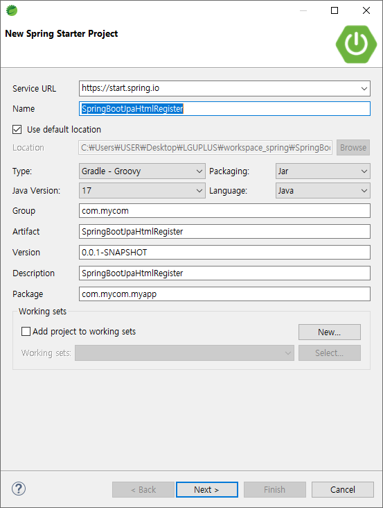
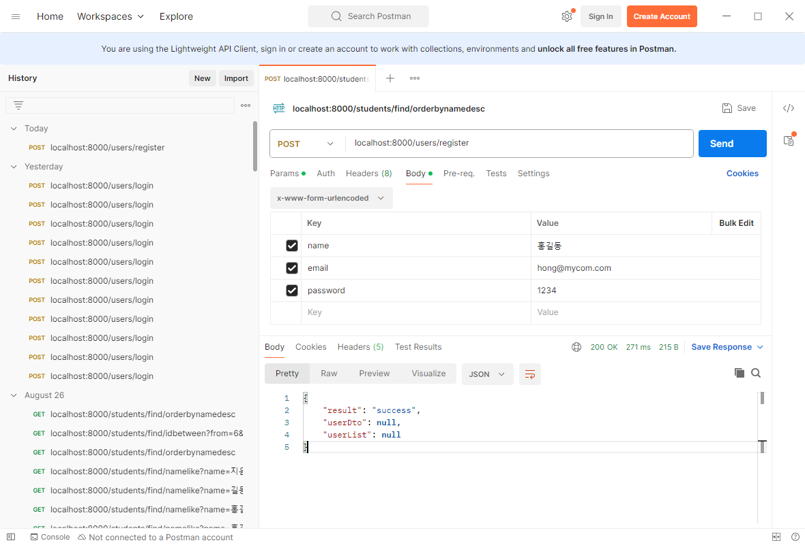
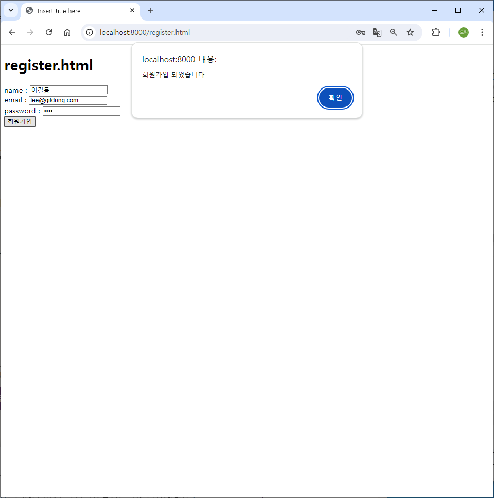
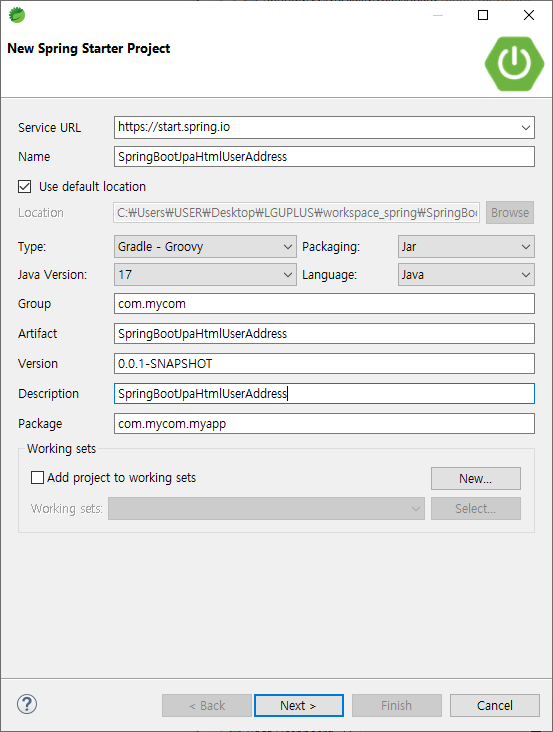
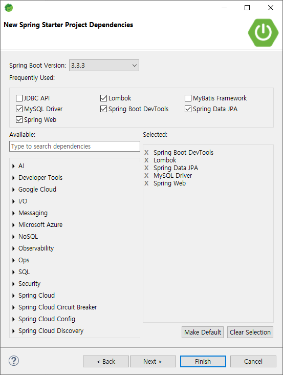
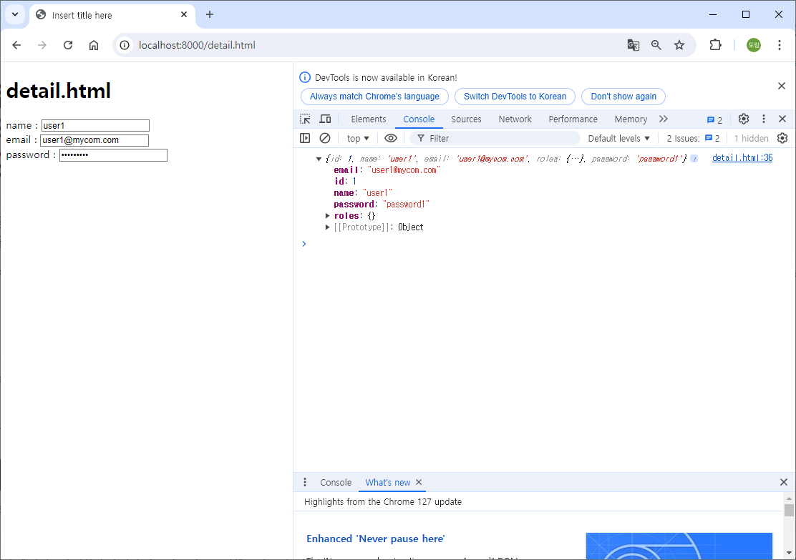
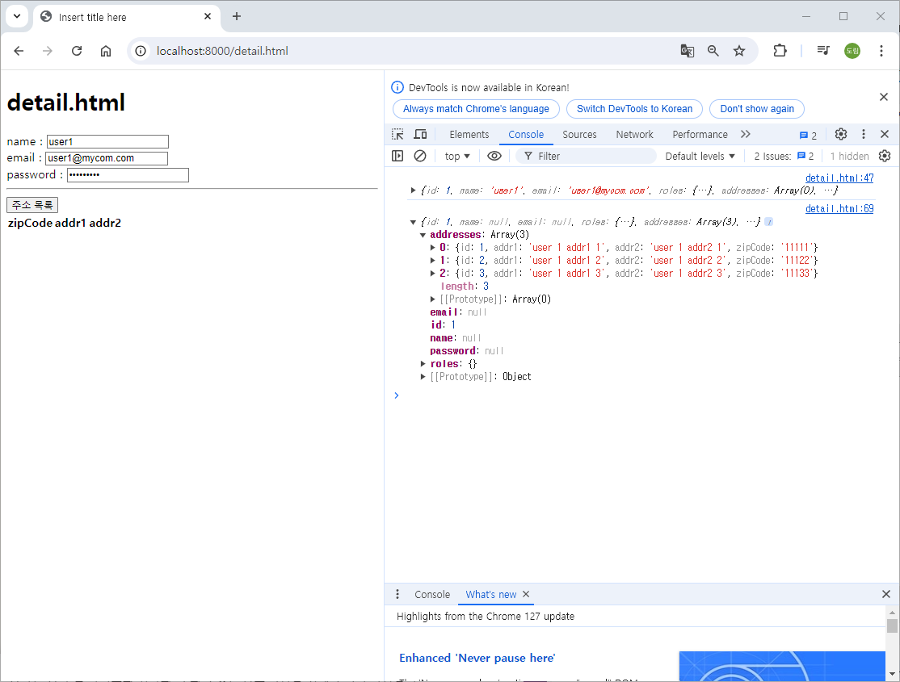
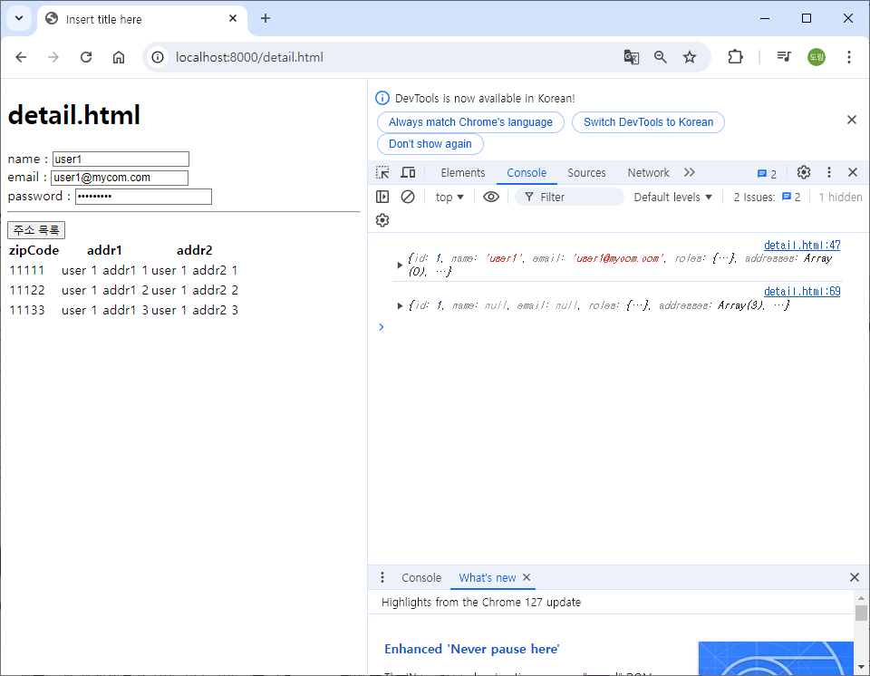

# [2024.08.28(수)] 회원가입/회원 주소 관리


# 회원가입

## SpringBootJpaHtmlRegister 프로젝트

### SpringBootJpaHtmlRegister 프로젝트 생성




### SpringBootJpaHtmlRegister 프로젝트 설정

### application.properties

```java
spring.application.name=SpringBootJpaHtmlRegister
server.port=8000

spring.datasource.url=jdbc:mysql://localhost:3306/jpa_html_register
spring.datasource.username=root
spring.datasource.password=root
spring.datasource.driver-class-name=com.mysql.cj.jdbc.Driver

spring.jpa.show-sql=true
```

### MySQL

- jpa_html_register 스키마 생성
- jpa_html_register 스키마에 테이블 및 데이터 입력 코드
    
    ```java
    set foreign_key_checks = 0;
    drop table if exists user ;
    drop table if exists user_role;
    drop table if exists user_user_role;
    set foreign_key_checks = 1;
    create table user (
      id bigint not null auto_increment,
      email varchar(255) default null,
      name varchar(255) default null,
      password varchar(255) default null,
      primary key (id)
    );
    create table user_role (
      id int not null auto_increment,
      name varchar(255) default null,
      primary key (id)
    );
    create table user_user_role (
      user_id bigint not null,
      role_id int not null,
      primary key (user_id,role_id),
      constraint fk_user_user_role_user_id foreign key (user_id) references user (id),
      constraint fk_user_user_role_user_role_id foreign key (role_id) references user_role (id)
    );
    insert into user (name, email, password) values ('user1',   'user1@mycom.com', 'password1');
    insert into user (name, email, password) values ('user2',   'user2@mycom.com', 'password2');
    insert into user (name, email, password) values ('user3',   'user3@mycom.com', 'password3');
    insert into user (name, email, password) values ('user4',   'user4@mycom.com', 'password4');
    insert into user_role (name) values ('role_customer');
    insert into user_role (name) values ('role_seller');
    insert into user_role (name) values ('role_admin');
    insert into user_user_role (user_id, role_id) values (1, 1);
    insert into user_user_role (user_id, role_id) values (2, 2);
    insert into user_user_role (user_id, role_id) values (3, 1);
    insert into user_user_role (user_id, role_id) values (3, 2);
    insert into user_user_role (user_id, role_id) values (4, 1);
    insert into user_user_role (user_id, role_id) values (4, 2);
    insert into user_user_role (user_id, role_id) values (4, 3);
    ```
    

### src/main/java/com/mycom/myapp

- SpringBootJpaHtmlLogin 프로젝트에서 user 패키지 복사하여 붙여넣기
    
    (파일탐색기에서 복사 + 붙여넣기 후 [프로젝트명] 우클릭 Refresh)
    

### src/main/resources/static

- SpringBootJpaHtmlLogin 프로젝트에서 index.html, login.html, another.html 복사하여 붙여넣기

### SpringBootJpaHtmlRegister 프로젝트 코드

### 회원가입 로직

### src/main/java/com/mycom/myapp/user

### repository/UserRoleRepository.java

```java
package com.mycom.myapp.user.repository;

import org.springframework.data.jpa.repository.JpaRepository;

import com.mycom.myapp.user.entity.UserRole;

public interface UserRoleRepository extends JpaRepository<UserRole, Integer>{
	
	// role name으로 검색
	UserRole findByName(String name);

}
```

### Entity/User.java

```java
package com.mycom.myapp.user.entity;

import java.util.HashSet;
import java.util.Set;

import jakarta.persistence.CascadeType;
import jakarta.persistence.Entity;
import jakarta.persistence.GeneratedValue;
import jakarta.persistence.GenerationType;
import jakarta.persistence.Id;
import jakarta.persistence.JoinColumn;
import jakarta.persistence.JoinTable;
import jakarta.persistence.ManyToMany;
import lombok.Getter;
import lombok.Setter;
import lombok.ToString;

@Entity
@Getter
@Setter
@ToString
public class User {
	
	@Id
	@GeneratedValue(strategy = GenerationType.IDENTITY)
	private Long id;
	
	private String name;
	
	private String email;
	
	private String Password;
	
	// User Entity가 등록되면 roles의 UserRole이 함께 등록
	@ManyToMany(cascade = CascadeType.PERSIST)
	@JoinTable(
			name = "user_user_role", 
			joinColumns = @JoinColumn(name = "user_id"),
			inverseJoinColumns = @JoinColumn(name = "role_id")
	)
	@ToString.Exclude
	private Set<UserRole> roles = new HashSet<>();
	
}
```

### service

### UserService.java

```java
package com.mycom.myapp.user.service;

import com.mycom.myapp.user.dto.UserResultDto;
import com.mycom.myapp.user.entity.User;

public interface UserService {

	// login
	UserResultDto login(String email, String password);
	
	// register
	// default user role 처리는 이 메소드를 구현하는 구현체 UserServiceImpl에서 처리
	UserResultDto insertUser(User user);
	
}
```

### UserServiceImpl.java

```java
package com.mycom.myapp.user.service;

import java.util.Map;

import org.springframework.stereotype.Service;

import com.mycom.myapp.user.dto.UserDto;
import com.mycom.myapp.user.dto.UserResultDto;
import com.mycom.myapp.user.entity.User;
import com.mycom.myapp.user.entity.UserRole;
import com.mycom.myapp.user.repository.UserRepository;
import com.mycom.myapp.user.repository.UserRoleRepository;

import lombok.RequiredArgsConstructor;

@Service
@RequiredArgsConstructor
public class UserServiceImpl implements UserService{
	
	private final UserRepository userRepository;
	private final UserRoleRepository userRoleRepository;
	
	@Override
	public UserResultDto login(String email, String password) {
		UserResultDto userResultDto = new UserResultDto();
		
		User user = userRepository.findByEmail(email);
		
		if(user != null && user.getPassword().equals(password)) {
			
			UserDto userDto = new UserDto();
			userDto.setId(user.getId());
			userDto.setName(user.getName());
			userDto.setEmail(user.getEmail());
			
			// userDto 객체의 roles 필드를 참조하는 Map 객체를 userRoles 변수에 저장
			// userRoles에 데이터를 추가하면 그 내용이 userDto의 roles 필드에 그대로 반영
			Map<Integer, String> userRoles = userDto.getRoles();
			user.getRoles().forEach( role -> userRoles.put(role.getId(), role.getName()));
			
			userResultDto.setUserDto(userDto);
			userResultDto.setResult("success");
		} else {
			userResultDto.setResult("fail");
		}
		
		return userResultDto;
	}

	@Override
	public UserResultDto insertUser(User user) {
		UserResultDto userResultDto = new UserResultDto();
		
		// "role_customer" 이름을 가진 Role Entity를 가져온다.
		// 전달되는 User Entity 연결
		// User Entity를 저장(save, persist)하면 연결된 UserRole도 함께 저장되도록 ( User의 @ManyToMany 연관관계의 CascadeType : PERSIST로 주어야 한다. )
		// User Entity를 저장
		try {
			UserRole userRole = userRoleRepository.findByName("role_customer"); // default role
			user.getRoles().add(userRole);
			userRepository.save(user);
			userResultDto.setResult("success");
		} catch (Exception e) {
			userResultDto.setResult("fail");
		}
		
		return userResultDto;
	}

}
```

### controller/UserController.java

```java
package com.mycom.myapp.user.controller;

import org.springframework.stereotype.Controller;
import org.springframework.web.bind.annotation.GetMapping;
import org.springframework.web.bind.annotation.PostMapping;
import org.springframework.web.bind.annotation.RequestMapping;
import org.springframework.web.bind.annotation.RequestParam;
import org.springframework.web.bind.annotation.ResponseBody;

import com.mycom.myapp.user.dto.UserResultDto;
import com.mycom.myapp.user.entity.User;
import com.mycom.myapp.user.service.UserService;

import jakarta.servlet.http.HttpSession;
import lombok.RequiredArgsConstructor;

@Controller
@ResponseBody
@RequestMapping("/users")
@RequiredArgsConstructor
public class UserController {

	private final UserService userService;
	
	@PostMapping("/login")
	public UserResultDto login(
			@RequestParam("email") String email, 
			@RequestParam("password") String password,
			HttpSession session
	) {
		UserResultDto userResultDto = userService.login(email, password);
		
		if( userResultDto.getResult().equals("success") ) {
			session.setAttribute("userDto", userResultDto.getUserDto());
		}
		
		return userResultDto;
	}
	
	@GetMapping("/logout")
	public UserResultDto login(HttpSession session) {
		UserResultDto userResultDto = new UserResultDto();
		
		try {
			session.invalidate();
			userResultDto.setResult("success");
		} catch (IllegalStateException e) {
			userResultDto.setResult("fail");
		}
		
		return userResultDto;
	}
	
	@PostMapping("/register")
	public UserResultDto insertUser(User user) {
		return userService.insertUser(user);
	}
	
}
```

### 실행 결과



### Entity/User.java에서 @GeneratedValue에 (strategy = GenerationType.IDENTITY)을 사용하지 않아도 동일하게 동작하는 이유

- UserServiceImple.java에서 findByName으로 이미 있는 Role을 찾아서 회원가입했기 때문이다. (이미 persist 되어 있는 UserRole을 사용)
- UserServiceImple.java에서 새로 만든 Role을 사용해서 user를 persist하면 오류가 발생한다. (새로 만든 Role은 user를 persist할 때 persist되어 있지 않아 오류 발생)
- 해결 방법
    
    1. user를 persist하기 전에 userRole을 먼저 persist한다.
    
    userRoleRepository.save(userRole); 
    
    2. USer.java에 @ManyToMany(cascade = CascadeType.PERSIST) 추가한다.
    

### Entity/User.java

```java
package com.mycom.myapp.user.entity;

import java.util.HashSet;
import java.util.Set;

import jakarta.persistence.CascadeType;
import jakarta.persistence.Entity;
import jakarta.persistence.GeneratedValue;
import jakarta.persistence.GenerationType;
import jakarta.persistence.Id;
import jakarta.persistence.JoinColumn;
import jakarta.persistence.JoinTable;
import jakarta.persistence.ManyToMany;
import lombok.Getter;
import lombok.Setter;
import lombok.ToString;

@Entity
@Getter
@Setter
@ToString
public class User {
	
	@Id
	@GeneratedValue(strategy = GenerationType.IDENTITY)
	private Long id;
	
	private String name;
	
	private String email;
	
	private String Password;
	
	// User Entity가 등록되면 roles의 UserRole이 함께 등록
	@ManyToMany(cascade = CascadeType.PERSIST)
	@JoinTable(
			name = "user_user_role", 
			joinColumns = @JoinColumn(name = "user_id"),
			inverseJoinColumns = @JoinColumn(name = "role_id")
	)
	@ToString.Exclude
	private Set<UserRole> roles = new HashSet<>();
	
}
```

### service/UserServiceImpl.java

```java
package com.mycom.myapp.user.service;

import java.util.Map;

import org.springframework.stereotype.Service;

import com.mycom.myapp.user.dto.UserDto;
import com.mycom.myapp.user.dto.UserResultDto;
import com.mycom.myapp.user.entity.User;
import com.mycom.myapp.user.entity.UserRole;
import com.mycom.myapp.user.repository.UserRepository;
import com.mycom.myapp.user.repository.UserRoleRepository;

import jakarta.persistence.CascadeType;
import jakarta.persistence.ManyToMany;
import lombok.RequiredArgsConstructor;

@Service
@RequiredArgsConstructor
public class UserServiceImpl implements UserService{
	
	private final UserRepository userRepository;
	private final UserRoleRepository userRoleRepository;
	
	@Override
	public UserResultDto login(String email, String password) {
		UserResultDto userResultDto = new UserResultDto();
		
		User user = userRepository.findByEmail(email);
		
		if(user != null && user.getPassword().equals(password)) {
			
			UserDto userDto = new UserDto();
			userDto.setId(user.getId());
			userDto.setName(user.getName());
			userDto.setEmail(user.getEmail());
			
			// userDto 객체의 roles 필드를 참조하는 Map 객체를 userRoles 변수에 저장
			// userRoles에 데이터를 추가하면 그 내용이 userDto의 roles 필드에 그대로 반영
			Map<Integer, String> userRoles = userDto.getRoles();
			user.getRoles().forEach( role -> userRoles.put(role.getId(), role.getName()));
			
			userResultDto.setUserDto(userDto);
			userResultDto.setResult("success");
		} else {
			userResultDto.setResult("fail");
		}
		
		return userResultDto;
	}

	@Override
	public UserResultDto insertUser(User user) {
		UserResultDto userResultDto = new UserResultDto();
		
		// "role_customer" 이름을 가진 Role Entity를 가져온다.
		// 전달되는 User Entity 연결
		// User Entity를 저장(save, persist)하면 연결된 UserRole도 함께 저장되도록 ( User의 @ManyToMany 연관관계의 CascadeType : PERSIST로 주어야 한다. )
		// User Entity를 저장
		try {
//			UserRole userRole = userRoleRepository.findByName("role_customer"); // default role
			
			UserRole userRole = new UserRole();
			userRole.setName("test_role");
//			userRoleRepository.save(userRole); // userRole을 먼저 persist하지 않으면 user를 persist하는 과정에서 오류가 발생한다.
			// 해결 방법 : 1. userRoleRepository.save(userRole); 2. USer.java @ManyToMany(cascade = CascadeType.PERSIST)
			
			user.getRoles().add(userRole);
			userRepository.save(user);  // userRole이 위에서 새로 만들어진 경우 userRole이 persist가 되어 있지 않으므로 오류 발생
			userResultDto.setResult("success");
		} catch (Exception e) {
			e.printStackTrace();
			userResultDto.setResult("fail");
		}
		
		return userResultDto;
	}

}
```

### 회원가입 page

### src/main/resources/static

### register.html

```java
<!DOCTYPE html>
<html>
<head>
<meta charset="UTF-8">
<title>Insert title here</title>
</head>
<body>
	<h1>register.html</h1>
	<div>
		name : <input type="text" name="name" id="name">
	</div>
	<div>
		email : <input type="text" name="email" id="email">
	</div>
	<div>
		password : <input type="password" name="password" id="password">
	</div>
	<button id="btnRegister">회원가입</button>
	
	<script>
		window.onload = function() {
			document.querySelector("#btnRegister").onclick = register;
		}
		
		async function register() {
			// parameter, value
			let name = document.querySelector("#name").value;
			let email = document.querySelector("#email").value;
			let password = document.querySelector("#password").value;
			
			console.log(email, password);
			
			let urlParams = new URLSearchParams({
				name, email, password
			});
			
			// url
			let url = "/users/register";
			
			// post, parameter
			let fetchOptions = {
				method : "POST",
				body : urlParams
			}
			
			let response = await fetch(url, fetchOptions);
			let data = await response.json();
			
			// console.log(data);
			
			if( data.result == "success" ) {
				// 회원가입 성공일 경우
				console.log(data.userDto);
				alert("회원가입 되었습니다.")
			} else if ( data.result == "fail" ) {
				alert("회원가입 과정에서 오류가 발생하였습니다.");
			}
			
		}
	</script>
</body>
</html>
```

### 실행 결과



# User info/User Address 관리

## SpringBootJpaHtmlUserAddress 프로젝트

### SpringBootJpaHtmlUserAddress 프로젝트 생성





### SpringBootJpaHtmlUserAddress 프로젝트 설정

### src/main/java/com/mycom/myapp

- SpringBootJpaHtmlRegister 프로젝트(C:\Users\USER\Desktop\LGUPLUS\workspace_spring\SpringBootJpaHtmlRegister\src\main\java\com\mycom\myapp)에서 user 패키지 복사하여 붙여넣기
    
    (파일탐색기에서 복사 + 붙여넣기 후 [프로젝트명] 우클릭 Refresh)
    

### application.properties

```java
spring.application.name=SpringBootJpaHtmlUserAddress
server.port=8000

spring.datasource.url=jdbc:mysql://localhost:3306/jpa_html_address
spring.datasource.username=root
spring.datasource.password=root
spring.datasource.driver-class-name=com.mysql.cj.jdbc.Driver

spring.jpa.show-sql=true
```

### MySQL

- jpa_html_address 스키마 생성
- jpa_html_address 스키마에 테이블 및 데이터 입력 코드
    
    ```java
    set foreign_key_checks = 0;
    drop table if exists user ;
    drop table if exists user_role;
    drop table if exists user_user_role;
    drop table if exists user_address;
    set foreign_key_checks = 1;
    create table user (
      id bigint not null auto_increment,
      email varchar(255) default null,
      name varchar(255) default null,
      password varchar(255) default null,
      primary key (id)
    );
    create table user_role (
      id int not null auto_increment,
      name varchar(255) default null,
      primary key (id)
    );
    create table user_user_role (
      user_id bigint not null,
      role_id int not null,
      primary key (user_id,role_id),
      constraint fk_user_user_role_user_id foreign key (user_id) references user (id),
      constraint fk_user_user_role_user_role_id foreign key (role_id) references user_role (id)
    );
    create table user_address (
      id bigint not null auto_increment,
      addr1 varchar(255) default null,
      addr2 varchar(255) default null,
      zip_code varchar(255) default null,
      user_id bigint default null,
      primary key (id),
      constraint fk_user_id foreign key (user_id) references user (id)
    );
    insert into user (name, email, password) values ('user1',   'user1@mycom.com', 'password1');
    insert into user (name, email, password) values ('user2',   'user2@mycom.com', 'password2');
    insert into user (name, email, password) values ('user3',   'user3@mycom.com', 'password3');
    insert into user (name, email, password) values ('user4',   'user4@mycom.com', 'password4');
    insert into user_role (name) values ('role_customer');
    insert into user_role (name) values ('role_seller');
    insert into user_role (name) values ('role_admin');
    insert into user_user_role (user_id, role_id) values (1, 1);
    insert into user_user_role (user_id, role_id) values (2, 2);
    insert into user_user_role (user_id, role_id) values (3, 1);
    insert into user_user_role (user_id, role_id) values (3, 2);
    insert into user_user_role (user_id, role_id) values (4, 1);
    insert into user_user_role (user_id, role_id) values (4, 2);
    insert into user_user_role (user_id, role_id) values (4, 3);
    insert into user_address (addr1, addr2, zip_code, user_id) values ('user 1 addr1 1', 'user 1 addr2 1', '11111', 1);
    insert into user_address (addr1, addr2, zip_code, user_id) values ('user 1 addr1 2', 'user 1 addr2 2', '11122', 1);
    insert into user_address (addr1, addr2, zip_code, user_id) values ('user 1 addr1 3', 'user 1 addr2 3', '11133', 1);
    ```
    

### src/main/resources/static

- SpringBootJpaHtmlRegister 프로젝트에서 index.html, login.html, another.html, register.html 복사하여 붙여넣기

### SpringBootJpaHtmlUserAddress 프로젝트 코드

### 회원 정보 조회

### src/main/java/com/mycom/myapp/user

### Entity/UserAddress.java

```java
package com.mycom.myapp.user.entity;

import jakarta.persistence.Column;
import jakarta.persistence.Entity;
import jakarta.persistence.GeneratedValue;
import jakarta.persistence.GenerationType;
import jakarta.persistence.Id;
import jakarta.persistence.JoinColumn;
import jakarta.persistence.ManyToOne;
import jakarta.persistence.Table;
import lombok.Getter;
import lombok.Setter;
import lombok.ToString;

@Entity
@Table(name = "user_address")
@Getter
@Setter
@ToString
public class UserAddress {

	@Id
	@GeneratedValue(strategy = GenerationType.IDENTITY)
	private Integer id;
	
	// 실제 주소 : 우편번호, 시도코드, 구군코드, 읍면동코드, 상세주소 ( 행안부 법정동코드... )
	@Column(name = "zip_code")
	private String zipCode;
	private String addr1;
	private String addr2;
	
	@ManyToOne
	@JoinColumn(name = "user_id")
	@ToString.Exclude
	private User user;
	
}
```

### repository/UserAddressRepository.java

```java
package com.mycom.myapp.user.repository;

import java.util.List;

import org.springframework.data.jpa.repository.JpaRepository;

import com.mycom.myapp.user.entity.UserAddress;

public interface UserAddressRepository extends JpaRepository<UserAddress, Integer> {

	// user_id(회원)의 Address 목록
	List<UserAddress> findByUserId(Long UserId);
	
}
```

### service

### UserService.java

```java
package com.mycom.myapp.user.service;

import com.mycom.myapp.user.dto.UserResultDto;
import com.mycom.myapp.user.entity.User;

public interface UserService {

	// login
	UserResultDto login(String email, String password);
	
	// register
	// default user role 처리는 이 메소드를 구현하는 구현체 UserServiceImpl에서 처리
	UserResultDto insertUser(User user);
	
	// 회원 상세
	UserResultDto dtailUser(Long id);
	
}
```

### UserServiceImpl.java

```java
package com.mycom.myapp.user.service;

import java.util.Map;
import java.util.Optional;

import org.springframework.stereotype.Service;

import com.mycom.myapp.user.dto.UserDto;
import com.mycom.myapp.user.dto.UserResultDto;
import com.mycom.myapp.user.entity.User;
import com.mycom.myapp.user.entity.UserRole;
import com.mycom.myapp.user.repository.UserRepository;
import com.mycom.myapp.user.repository.UserRoleRepository;

import jakarta.persistence.CascadeType;
import jakarta.persistence.ManyToMany;
import lombok.RequiredArgsConstructor;

@Service
@RequiredArgsConstructor
public class UserServiceImpl implements UserService{
	
	private final UserRepository userRepository;
	private final UserRoleRepository userRoleRepository;
	
	@Override
	public UserResultDto login(String email, String password) {
		UserResultDto userResultDto = new UserResultDto();
		
		User user = userRepository.findByEmail(email);
		
		if(user != null && user.getPassword().equals(password)) {
			
			UserDto userDto = new UserDto();
			userDto.setId(user.getId());
			userDto.setName(user.getName());
			userDto.setEmail(user.getEmail());
			
			// userDto 객체의 roles 필드를 참조하는 Map 객체를 userRoles 변수에 저장
			// userRoles에 데이터를 추가하면 그 내용이 userDto의 roles 필드에 그대로 반영
			Map<Integer, String> userRoles = userDto.getRoles();
			user.getRoles().forEach( role -> userRoles.put(role.getId(), role.getName()));
			
			userResultDto.setUserDto(userDto);
			userResultDto.setResult("success");
		} else {
			userResultDto.setResult("fail");
		}
		
		return userResultDto;
	}

	@Override
	public UserResultDto insertUser(User user) {
		UserResultDto userResultDto = new UserResultDto();
		
		// "role_customer" 이름을 가진 Role Entity를 가져온다.
		// 전달되는 User Entity 연결
		// User Entity를 저장(save, persist)하면 연결된 UserRole도 함께 저장되도록 ( User의 @ManyToMany 연관관계의 CascadeType : PERSIST로 주어야 한다. )
		// User Entity를 저장
		try {
			UserRole userRole = userRoleRepository.findByName("role_customer"); // default role
			
//			UserRole userRole = new UserRole();
//			userRole.setName("test_role");
//			userRoleRepository.save(userRole); // userRole을 먼저 persist하지 않으면 user를 persist하는 과정에서 오류가 발생한다.
			// 해결 방법 : 1. userRoleRepository.save(userRole); 2. USer.java @ManyToMany(cascade = CascadeType.PERSIST)
			
			user.getRoles().add(userRole);
			userRepository.save(user);  // userRole이 위에서 새로 만들어진 경우 userRole이 persist가 되어 있지 않으므로 오류 발생
			userResultDto.setResult("success");
		} catch (Exception e) {
			e.printStackTrace();
			userResultDto.setResult("fail");
		}
		
		return userResultDto;
	}

	// 사용자가 자신의 정보를 확인하는 과정이므로 UserRole은 가져오지 않는다.
	// 비밀번호는 가져온다.
	@Override
	public UserResultDto dtailUser(Long id) {
		UserResultDto userResultDto = new UserResultDto();
		Optional<User> optionalUser = userRepository.findById(id); // id에 따라 null이 될 수도 있다.
		
		optionalUser.ifPresentOrElse(
				user -> { // 첫 번째 람다 : User Entity가 있을 경우
					UserDto userDto = new UserDto();
					userDto.setId(user.getId());
					userDto.setName(user.getName());
					userDto.setEmail(user.getEmail());
					userDto.setPassword(user.getPassword());
					
					userResultDto.setUserDto(userDto);
					userResultDto.setResult("success");
				}, 
				() -> {  // 두 번째 람다 : User Entity가 없을 경우
					userResultDto.setResult("fail");
				}  
		);  
		
		return userResultDto;
	}

}
```

### controller/UserController.java

```java
package com.mycom.myapp.user.controller;

import org.springframework.stereotype.Controller;
import org.springframework.web.bind.annotation.GetMapping;
import org.springframework.web.bind.annotation.PostMapping;
import org.springframework.web.bind.annotation.RequestMapping;
import org.springframework.web.bind.annotation.RequestParam;
import org.springframework.web.bind.annotation.ResponseBody;

import com.mycom.myapp.user.dto.UserDto;
import com.mycom.myapp.user.dto.UserResultDto;
import com.mycom.myapp.user.entity.User;
import com.mycom.myapp.user.service.UserService;

import jakarta.servlet.http.HttpSession;
import lombok.RequiredArgsConstructor;

@Controller
@ResponseBody
@RequestMapping("/users")
@RequiredArgsConstructor
public class UserController {

	private final UserService userService;
	
	@PostMapping("/login")
	public UserResultDto login(
			@RequestParam("email") String email, 
			@RequestParam("password") String password,
			HttpSession session
	) {
		UserResultDto userResultDto = userService.login(email, password);
		
		if( userResultDto.getResult().equals("success") ) {
			session.setAttribute("userDto", userResultDto.getUserDto());
		}
		
		return userResultDto;
	}
	
	@GetMapping("/logout")
	public UserResultDto login(HttpSession session) {
		UserResultDto userResultDto = new UserResultDto();
		
		try {
			session.invalidate();
			userResultDto.setResult("success");
		} catch (IllegalStateException e) {
			userResultDto.setResult("fail");
		}
		
		return userResultDto;
	}
	
	@PostMapping("/register")
	public UserResultDto insertUser(User user) {
		return userService.insertUser(user);
	}
	
	// login 되어 있다는 전제 Session으로부터 회원 id를 가져온다.
	// login 되어 있지 않은 상태에서의 요청은 LoginInterceptor로부터 걸러지도록 처리
	@GetMapping("/detail")
	public UserResultDto detailUser(HttpSession session) {
		Long id = ( (UserDto)session.getAttribute("userDto") ).getId();
		return userService.dtailUser(id);
	}
	
}
```

### src/main/resources/static

### detail.html

```java
<!DOCTYPE html>
<html>
<head>
<meta charset="UTF-8">
<title>Insert title here</title>
</head>
<body>
	<h1>detail.html</h1>
	<div>
		name : <input type="text" name="name" id="name">
	</div>
	<div>
		email : <input type="text" name="email" id="email">
	</div>
	<div>
		password : <input type="password" name="password" id="password">
	</div>
	
	<script>
		window.onload = function() {
			detail();
			// document.querySelector("#btnRegister").onclick = register;
		}
		
		async function detail() {
			// url
			let url = "/users/detail";
			
			let response = await fetch(url);
			let data = await response.json();
			
			// console.log(data);
			
			if( data.result == "success" ) {
				// 회원가입 성공일 경우
				console.log(data.userDto);
				let { userDto } = data;  // destruction (구조분해 할당)
				document.querySelector("#name").value = userDto.name;
				document.querySelector("#email").value = userDto.email;
				document.querySelector("#password").value = userDto.password;
			} else if ( data.result == "fail" ) {
				alert("상세 조회 과정에서 오류가 발생하였습니다.");
			}
			
		}
	</script>
</body>
</html>
```

### 실행 결과



### 회원 주소 목록 조회

### src/main/java/com/mycom/myapp/user

### Entity

### UserAddress.java

```java
package com.mycom.myapp.user.entity;

import jakarta.persistence.Column;
import jakarta.persistence.Entity;
import jakarta.persistence.GeneratedValue;
import jakarta.persistence.GenerationType;
import jakarta.persistence.Id;
import jakarta.persistence.JoinColumn;
import jakarta.persistence.ManyToOne;
import jakarta.persistence.Table;
import lombok.Getter;
import lombok.Setter;
import lombok.ToString;

@Entity
@Table(name = "user_address")
@Getter
@Setter
@ToString
public class UserAddress {

	@Id
	@GeneratedValue(strategy = GenerationType.IDENTITY)
	private Integer id;
	
	// 실제 주소 : 우편번호, 시도코드, 구군코드, 읍면동코드, 상세주소 ( 행안부 법정동코드... )
	@Column(name = "zip_code")
	private String zipCode;
	private String addr1;
	private String addr2;
	
	@ManyToOne
	@JoinColumn(name = "user_id")
	@ToString.Exclude
	private User user;
	
}
```

### User.java

```java
package com.mycom.myapp.user.entity;

import java.util.ArrayList;
import java.util.HashSet;
import java.util.List;
import java.util.Set;

import jakarta.persistence.CascadeType;
import jakarta.persistence.Entity;
import jakarta.persistence.GeneratedValue;
import jakarta.persistence.GenerationType;
import jakarta.persistence.Id;
import jakarta.persistence.JoinColumn;
import jakarta.persistence.JoinTable;
import jakarta.persistence.ManyToMany;
import jakarta.persistence.OneToMany;
import lombok.Getter;
import lombok.Setter;
import lombok.ToString;

@Entity
@Getter
@Setter
@ToString
public class User {
	
	@Id
	@GeneratedValue(strategy = GenerationType.IDENTITY)
	private Long id;
	
	private String name;
	
	private String email;
	
	private String Password;
	
	// User Entity가 등록되면 roles의 UserRole이 함께 등록
	@ManyToMany(cascade = CascadeType.PERSIST)
	@JoinTable(
			name = "user_user_role", 
			joinColumns = @JoinColumn(name = "user_id"),
			inverseJoinColumns = @JoinColumn(name = "role_id")
	)
	@ToString.Exclude
	private Set<UserRole> roles = new HashSet<>();
	
	@OneToMany(mappedBy = "user")
	@ToString.Exclude
	private List<UserAddress> addresses = new ArrayList<>();
	
}
```

### repository/UserAddressRepository.java

```java
package com.mycom.myapp.user.repository;

import java.util.List;

import org.springframework.data.jpa.repository.JpaRepository;

import com.mycom.myapp.user.entity.UserAddress;

public interface UserAddressRepository extends JpaRepository<UserAddress, Integer> {

	// user_id(회원)의 Address 목록
	List<UserAddress> findByUserId(Long UserId);
	
}
```

### Dto

### UserAddressDto.java

```java
package com.mycom.myapp.user.dto;

import lombok.Data;

@Data
public class UserAddressDto {
	
	private int id;
	private String addr1;
	private String addr2;
	private String zipCode;
	
}
```

### UserDto.java

```java
package com.mycom.myapp.user.dto;

import java.util.ArrayList;
import java.util.HashMap;
import java.util.List;
import java.util.Map;

import lombok.Data;

@Data
public class UserDto {

	private Long id;
	private String name;
	private String email;
	private String Password;
	// Set을 Front-Ent에 json으로 전달하면 role을 꺼내는데 불편하기 때문에 Map<>으로 변경 처리
//	private Set<UserRole> roles = new HashSet<>();
	private Map<Integer, String> roles = new HashMap<>();
	
	private List<UserAddressDto> addresses = new ArrayList<>();
	
}
```

### service

### UserService.java

```java
package com.mycom.myapp.user.service;

import com.mycom.myapp.user.dto.UserResultDto;
import com.mycom.myapp.user.entity.User;

public interface UserService {

	// login
	UserResultDto login(String email, String password);
	
	// register
	// default user role 처리는 이 메소드를 구현하는 구현체 UserServiceImpl에서 처리
	UserResultDto insertUser(User user);
	
	// 회원 상세
	UserResultDto dtailUser(Long id);
	
	// 회원 주소 목록
	UserResultDto listUserAddress(Long id);
	
}
```

### UserServiceImpl.java

```java
package com.mycom.myapp.user.service;

import java.util.ArrayList;
import java.util.List;
import java.util.Map;
import java.util.Optional;

import org.springframework.stereotype.Service;

import com.mycom.myapp.user.dto.UserAddressDto;
import com.mycom.myapp.user.dto.UserDto;
import com.mycom.myapp.user.dto.UserResultDto;
import com.mycom.myapp.user.entity.User;
import com.mycom.myapp.user.entity.UserAddress;
import com.mycom.myapp.user.entity.UserRole;
import com.mycom.myapp.user.repository.UserAddressRepository;
import com.mycom.myapp.user.repository.UserRepository;
import com.mycom.myapp.user.repository.UserRoleRepository;

import lombok.RequiredArgsConstructor;

@Service
@RequiredArgsConstructor
public class UserServiceImpl implements UserService{
	
	private final UserRepository userRepository;
	private final UserRoleRepository userRoleRepository;
	private final UserAddressRepository userAddressRepository;
	
	@Override
	public UserResultDto login(String email, String password) {
		UserResultDto userResultDto = new UserResultDto();
		
		User user = userRepository.findByEmail(email);
		
		if(user != null && user.getPassword().equals(password)) {
			
			UserDto userDto = new UserDto();
			userDto.setId(user.getId());
			userDto.setName(user.getName());
			userDto.setEmail(user.getEmail());
			
			// userDto 객체의 roles 필드를 참조하는 Map 객체를 userRoles 변수에 저장
			// userRoles에 데이터를 추가하면 그 내용이 userDto의 roles 필드에 그대로 반영
			Map<Integer, String> userRoles = userDto.getRoles();
			user.getRoles().forEach( role -> userRoles.put(role.getId(), role.getName()));
			
			userResultDto.setUserDto(userDto);
			userResultDto.setResult("success");
		} else {
			userResultDto.setResult("fail");
		}
		
		return userResultDto;
	}

	@Override
	public UserResultDto insertUser(User user) {
		UserResultDto userResultDto = new UserResultDto();
		
		// "role_customer" 이름을 가진 Role Entity를 가져온다.
		// 전달되는 User Entity 연결
		// User Entity를 저장(save, persist)하면 연결된 UserRole도 함께 저장되도록 ( User의 @ManyToMany 연관관계의 CascadeType : PERSIST로 주어야 한다. )
		// User Entity를 저장
		try {
			UserRole userRole = userRoleRepository.findByName("role_customer"); // default role
			
//			UserRole userRole = new UserRole();
//			userRole.setName("test_role");
//			userRoleRepository.save(userRole); // userRole을 먼저 persist하지 않으면 user를 persist하는 과정에서 오류가 발생한다.
			// 해결 방법 : 1. userRoleRepository.save(userRole); 2. USer.java @ManyToMany(cascade = CascadeType.PERSIST)
			
			user.getRoles().add(userRole);
			userRepository.save(user);  // userRole이 위에서 새로 만들어진 경우 userRole이 persist가 되어 있지 않으므로 오류 발생
			userResultDto.setResult("success");
		} catch (Exception e) {
			e.printStackTrace();
			userResultDto.setResult("fail");
		}
		
		return userResultDto;
	}

	// 사용자가 자신의 정보를 확인하는 과정이므로 UserRole은 가져오지 않는다.
	// 비밀번호는 가져온다.
	@Override
	public UserResultDto dtailUser(Long id) {
		UserResultDto userResultDto = new UserResultDto();
		Optional<User> optionalUser = userRepository.findById(id); // id에 따라 null이 될 수도 있다.
		
		optionalUser.ifPresentOrElse(
				user -> { // 첫 번째 람다 : User Entity가 있을 경우
					UserDto userDto = new UserDto();
					userDto.setId(user.getId());
					userDto.setName(user.getName());
					userDto.setEmail(user.getEmail());
					userDto.setPassword(user.getPassword());
					
					userResultDto.setUserDto(userDto);
					userResultDto.setResult("success");
				}, 
				() -> {  // 두 번째 람다 : User Entity가 없을 경우
					userResultDto.setResult("fail");
				}  
		);  
		
		return userResultDto;
	}

	@Override
	public UserResultDto listUserAddress(Long id) {
		UserResultDto userResultDto = new UserResultDto();
		
		List<UserAddress> userAddressesList = userAddressRepository.findByUserId(id);
		
		List<UserAddressDto> addresses = new ArrayList<>();
		
		userAddressesList.forEach( userAddresses -> {
			
			UserAddressDto userAddressDto = new UserAddressDto();
			userAddressDto.setId(userAddresses.getId());
			userAddressDto.setAddr1(userAddresses.getAddr1());
			userAddressDto.setAddr2(userAddresses.getAddr2());
			userAddressDto.setZipCode(userAddresses.getZipCode());
			
			addresses.add(userAddressDto);
			
		});
		
		// UserDto는 일종의 Dummy
		// Long id로 함께 값을 가져오려면 new UserDto() 대신 userRepository.findById()
		UserDto userDto = new UserDto();
		userDto.setId(id);  // 단순 테스트 용도
		userDto.setAddresses(addresses);
		userResultDto.setUserDto(userDto);
		userResultDto.setResult("success");
		
		return userResultDto;
	}

}
```

### controller/UserController.java

```java
package com.mycom.myapp.user.controller;

import org.springframework.stereotype.Controller;
import org.springframework.web.bind.annotation.GetMapping;
import org.springframework.web.bind.annotation.PostMapping;
import org.springframework.web.bind.annotation.RequestMapping;
import org.springframework.web.bind.annotation.RequestParam;
import org.springframework.web.bind.annotation.ResponseBody;

import com.mycom.myapp.user.dto.UserDto;
import com.mycom.myapp.user.dto.UserResultDto;
import com.mycom.myapp.user.entity.User;
import com.mycom.myapp.user.service.UserService;

import jakarta.servlet.http.HttpSession;
import lombok.RequiredArgsConstructor;

@Controller
@ResponseBody
@RequestMapping("/users")
@RequiredArgsConstructor
public class UserController {

	private final UserService userService;
	
	@PostMapping("/login")
	public UserResultDto login(
			@RequestParam("email") String email, 
			@RequestParam("password") String password,
			HttpSession session
	) {
		UserResultDto userResultDto = userService.login(email, password);
		
		if( userResultDto.getResult().equals("success") ) {
			session.setAttribute("userDto", userResultDto.getUserDto());
		}
		
		return userResultDto;
	}
	
	@GetMapping("/logout")
	public UserResultDto login(HttpSession session) {
		UserResultDto userResultDto = new UserResultDto();
		
		try {
			session.invalidate();
			userResultDto.setResult("success");
		} catch (IllegalStateException e) {
			userResultDto.setResult("fail");
		}
		
		return userResultDto;
	}
	
	@PostMapping("/register")
	public UserResultDto insertUser(User user) {
		return userService.insertUser(user);
	}
	
	// login 되어 있다는 전제 Session으로부터 회원 id를 가져온다.
	// login 되어 있지 않은 상태에서의 요청은 LoginInterceptor로부터 걸러지도록 처리
	@GetMapping("/detail")
	public UserResultDto detailUser(HttpSession session) {
		Long id = ( (UserDto)session.getAttribute("userDto") ).getId();
		return userService.dtailUser(id);
	}
	
	// login 되어 있다는 전제 Session으로부터 회원 id를 가져온다.
	// login 되어 있지 않은 상태에서의 요청은 LoginInterceptor로부터 걸러지도록 처리
	@GetMapping("/listUserAddress")
	public UserResultDto listUserAddress(HttpSession session) {
		Long id = ( (UserDto)session.getAttribute("userDto") ).getId();
		return userService.listUserAddress(id);
	}
	
}
```

### src/main/resources/static

### detail.html

```java
<!DOCTYPE html>
<html>
<head>
<meta charset="UTF-8">
<title>Insert title here</title>
</head>
<body>
	<h1>detail.html</h1>
	<div>
		name : <input type="text" name="name" id="name">
	</div>
	<div>
		email : <input type="text" name="email" id="email">
	</div>
	<div>
		password : <input type="password" name="password" id="password">
	</div>
	
	<hr>
	<button id="btnListAddress">주소 목록</button>
	<table>
		<thead>
			<tr><th>zipCode</th><th>addr1</th><th>addr2</th></tr>
		</thead>
		<tbody id="addressTbody">
		
		</tbody>
	</table>
	
	<script>
		window.onload = function() {
			detail();
			document.querySelector("#btnListAddress").onclick = listAddress;
		}
		
		async function detail() {
			// url
			let url = "/users/detail";
			
			let response = await fetch(url);
			let data = await response.json();
			
			// console.log(data);
			
			if( data.result == "success" ) {
				// 회원가입 성공일 경우
				console.log(data.userDto);
				let { userDto } = data;  // destruction (구조분해 할당)
				document.querySelector("#name").value = userDto.name;
				document.querySelector("#email").value = userDto.email;
				document.querySelector("#password").value = userDto.password;
			} else if ( data.result == "fail" ) {
				alert("상세 조회 과정에서 오류가 발생하였습니다.");
			}
			
		}
		
		async function listAddress() {
			// url
			let url = "/users/listUserAddress";
			
			let response = await fetch(url);
			let data = await response.json();
			
			// console.log(data);
			
			if( data.result == "success" ) {
				// 회원가입 성공일 경우
				console.log(data.userDto);
				let { userDto } = data;  // destruction (구조분해 할당)
			} else if ( data.result == "fail" ) {
				alert("주소목록 조회 과정에서 오류가 발생하였습니다.");
			}
			
		}
	</script>
</body>
</html>
```

### 실행결과



### Address 조회 시 N+1문제 해결방법

- user_address 테이블 데이터
    
    
    | id | addr1 | addr2 | zip_code | user_id |
    | --- | --- | --- | --- | --- |
    | 1 | user 1 addr1 1 | user 1 addr2 1 | 11111 | 1 |
    | 2 | user 1 addr1 2 | user 1 addr2 2 | 11122 | 2 |
    | 3 | user 1 addr1 3 | user 1 addr2 3 | 11133 | 3 |

### src/main/java/com/mycom/myapp/user

### Entity/UserAddress.java

```java
package com.mycom.myapp.user.entity;

import jakarta.persistence.Column;
import jakarta.persistence.Entity;
import jakarta.persistence.FetchType;
import jakarta.persistence.GeneratedValue;
import jakarta.persistence.GenerationType;
import jakarta.persistence.Id;
import jakarta.persistence.JoinColumn;
import jakarta.persistence.ManyToOne;
import jakarta.persistence.Table;
import lombok.Getter;
import lombok.Setter;
import lombok.ToString;

@Entity
@Table(name = "user_address")
@Getter
@Setter
@ToString
public class UserAddress {

	@Id
	@GeneratedValue(strategy = GenerationType.IDENTITY)
	private Integer id;
	
	// 실제 주소 : 우편번호, 시도코드, 구군코드, 읍면동코드, 상세주소 ( 행안부 법정동코드... )
	@Column(name = "zip_code")
	private String zipCode;
	private String addr1;
	private String addr2;
	
	// Address가 조회될 때 N+1문제 해결을 위해 LAZY 사용
	@ManyToOne // (fetch = FetchType.LAZY)
	@JoinColumn(name = "user_id")
	@ToString.Exclude
	private User user;
	
}
```

### service/UserServiceImpl.java

```java
package com.mycom.myapp.user.service;

import java.util.ArrayList;
import java.util.List;
import java.util.Map;
import java.util.Optional;

import org.springframework.stereotype.Service;

import com.mycom.myapp.user.dto.UserAddressDto;
import com.mycom.myapp.user.dto.UserDto;
import com.mycom.myapp.user.dto.UserResultDto;
import com.mycom.myapp.user.entity.User;
import com.mycom.myapp.user.entity.UserAddress;
import com.mycom.myapp.user.entity.UserRole;
import com.mycom.myapp.user.repository.UserAddressRepository;
import com.mycom.myapp.user.repository.UserRepository;
import com.mycom.myapp.user.repository.UserRoleRepository;

import lombok.RequiredArgsConstructor;

@Service
@RequiredArgsConstructor
public class UserServiceImpl implements UserService{
	
	private final UserRepository userRepository;
	private final UserRoleRepository userRoleRepository;
	private final UserAddressRepository userAddressRepository;
	
	@Override
	public UserResultDto login(String email, String password) {
		UserResultDto userResultDto = new UserResultDto();
		
		User user = userRepository.findByEmail(email);
		
		if(user != null && user.getPassword().equals(password)) {
			
			UserDto userDto = new UserDto();
			userDto.setId(user.getId());
			userDto.setName(user.getName());
			userDto.setEmail(user.getEmail());
			
			// userDto 객체의 roles 필드를 참조하는 Map 객체를 userRoles 변수에 저장
			// userRoles에 데이터를 추가하면 그 내용이 userDto의 roles 필드에 그대로 반영
			Map<Integer, String> userRoles = userDto.getRoles();
			user.getRoles().forEach( role -> userRoles.put(role.getId(), role.getName()));
			
			userResultDto.setUserDto(userDto);
			userResultDto.setResult("success");
		} else {
			userResultDto.setResult("fail");
		}
		
		return userResultDto;
	}

	@Override
	public UserResultDto insertUser(User user) {
		UserResultDto userResultDto = new UserResultDto();
		
		// "role_customer" 이름을 가진 Role Entity를 가져온다.
		// 전달되는 User Entity 연결
		// User Entity를 저장(save, persist)하면 연결된 UserRole도 함께 저장되도록 ( User의 @ManyToMany 연관관계의 CascadeType : PERSIST로 주어야 한다. )
		// User Entity를 저장
		try {
			UserRole userRole = userRoleRepository.findByName("role_customer"); // default role
			
//			UserRole userRole = new UserRole();
//			userRole.setName("test_role");
//			userRoleRepository.save(userRole); // userRole을 먼저 persist하지 않으면 user를 persist하는 과정에서 오류가 발생한다.
			// 해결 방법 : 1. userRoleRepository.save(userRole); 2. USer.java @ManyToMany(cascade = CascadeType.PERSIST)
			
			user.getRoles().add(userRole);
			userRepository.save(user);  // userRole이 위에서 새로 만들어진 경우 userRole이 persist가 되어 있지 않으므로 오류 발생
			userResultDto.setResult("success");
		} catch (Exception e) {
			e.printStackTrace();
			userResultDto.setResult("fail");
		}
		
		return userResultDto;
	}

	// 사용자가 자신의 정보를 확인하는 과정이므로 UserRole은 가져오지 않는다.
	// 비밀번호는 가져온다.
	@Override
	public UserResultDto dtailUser(Long id) {
		UserResultDto userResultDto = new UserResultDto();
		Optional<User> optionalUser = userRepository.findById(id); // id에 따라 null이 될 수도 있다.
		
		optionalUser.ifPresentOrElse(
				user -> { // 첫 번째 람다 : User Entity가 있을 경우
					UserDto userDto = new UserDto();
					userDto.setId(user.getId());
					userDto.setName(user.getName());
					userDto.setEmail(user.getEmail());
					userDto.setPassword(user.getPassword());
					
					userResultDto.setUserDto(userDto);
					userResultDto.setResult("success");
				}, 
				() -> {  // 두 번째 람다 : User Entity가 없을 경우
					userResultDto.setResult("fail");
				}  
		);  
		
		return userResultDto;
	}

	@Override
	public UserResultDto listUserAddress(Long id) {
		UserResultDto userResultDto = new UserResultDto();
		
		System.out.println("_________________________________________");
//		List<UserAddress> userAddressesList = userAddressRepository.findByUserId(id);
		List<UserAddress> userAddressesList = userAddressRepository.findAll();
		System.out.println("_________________________________________");
		
		UserDto userDto = new UserDto();
		List<UserAddressDto> addresses = userDto.getAddresses();
		
		userAddressesList.forEach( userAddresses -> {
			
			UserAddressDto userAddressDto = new UserAddressDto();
			userAddressDto.setId(userAddresses.getId());
			userAddressDto.setAddr1(userAddresses.getAddr1());
			userAddressDto.setAddr2(userAddresses.getAddr2());
			userAddressDto.setZipCode(userAddresses.getZipCode());
			
			addresses.add(userAddressDto);
			
		});
		
		// UserDto는 일종의 Dummy
		// Long id로 함께 값을 가져오려면 new UserDto() 대신 userRepository.findById()
		userDto.setId(id);  // 단순 테스트 용도
		userResultDto.setUserDto(userDto);
		userResultDto.setResult("success");
		
		return userResultDto;
	}

}
```

### 실행 결과

- N+1 문제 발생 시 실행 결과
    
    ```java
    Hibernate: select ua1_0.id,ua1_0.addr1,ua1_0.addr2,ua1_0.user_id,ua1_0.zip_code from user_address ua1_0
    Hibernate: select u1_0.id,u1_0.password,u1_0.email,u1_0.name from user u1_0 where u1_0.id=?
    Hibernate: select u1_0.id,u1_0.password,u1_0.email,u1_0.name from user u1_0 where u1_0.id=?
    Hibernate: select u1_0.id,u1_0.password,u1_0.email,u1_0.name from user u1_0 where u1_0.id=?
    ```
    
- N+1 문제 해결 시 실행 결과
    
    ```java
    Hibernate: select ua1_0.id,ua1_0.addr1,ua1_0.addr2,ua1_0.user_id,ua1_0.zip_code from user_address ua1_0
    ```
    

### 원인

- UserServiceImpl.java의 listUserAddress()에서 List<UserAddress> userAddressesList = userAddressRepository.findAll();로 userAddress를 조회해올 때 UserAddress.java의 @ManyToOne의 default fetch가 EAGER이므로 user_address 뿐만 아니라 user 정보도 같이 조회한다.

### 해결방안

- UserAddress.javadml user필드의 FetchType을 LAZY로 수정한다.
    
    ```java
    // Address가 조회될 때 N+1문제 해결을 위해 LAZY 사용
    	@ManyToOne (fetch = FetchType.LAZY)
    	@JoinColumn(name = "user_id")
    	@ToString.Exclude
    	private User user;
    ```
    

### src/main/java/com/mycom/myapp/user

### Entity/UserAddress.java

```java
package com.mycom.myapp.user.entity;

import jakarta.persistence.Column;
import jakarta.persistence.Entity;
import jakarta.persistence.FetchType;
import jakarta.persistence.GeneratedValue;
import jakarta.persistence.GenerationType;
import jakarta.persistence.Id;
import jakarta.persistence.JoinColumn;
import jakarta.persistence.ManyToOne;
import jakarta.persistence.Table;
import lombok.Getter;
import lombok.Setter;
import lombok.ToString;

@Entity
@Table(name = "user_address")
@Getter
@Setter
@ToString
public class UserAddress {

	@Id
	@GeneratedValue(strategy = GenerationType.IDENTITY)
	private Integer id;
	
	// 실제 주소 : 우편번호, 시도코드, 구군코드, 읍면동코드, 상세주소 ( 행안부 법정동코드... )
	@Column(name = "zip_code")
	private String zipCode;
	private String addr1;
	private String addr2;
	
	// Address가 조회될 때 N+1문제 해결을 위해 LAZY 사용
	@ManyToOne(fetch = FetchType.LAZY)
	@JoinColumn(name = "user_id")
	@ToString.Exclude
	private User user;
	
}
```

### service/UserServiceImpl.java

```java
package com.mycom.myapp.user.service;

import java.util.ArrayList;
import java.util.List;
import java.util.Map;
import java.util.Optional;

import org.springframework.stereotype.Service;

import com.mycom.myapp.user.dto.UserAddressDto;
import com.mycom.myapp.user.dto.UserDto;
import com.mycom.myapp.user.dto.UserResultDto;
import com.mycom.myapp.user.entity.User;
import com.mycom.myapp.user.entity.UserAddress;
import com.mycom.myapp.user.entity.UserRole;
import com.mycom.myapp.user.repository.UserAddressRepository;
import com.mycom.myapp.user.repository.UserRepository;
import com.mycom.myapp.user.repository.UserRoleRepository;

import lombok.RequiredArgsConstructor;

@Service
@RequiredArgsConstructor
public class UserServiceImpl implements UserService{
	
	private final UserRepository userRepository;
	private final UserRoleRepository userRoleRepository;
	private final UserAddressRepository userAddressRepository;
	
	@Override
	public UserResultDto login(String email, String password) {
		UserResultDto userResultDto = new UserResultDto();
		
		User user = userRepository.findByEmail(email);
		
		if(user != null && user.getPassword().equals(password)) {
			
			UserDto userDto = new UserDto();
			userDto.setId(user.getId());
			userDto.setName(user.getName());
			userDto.setEmail(user.getEmail());
			
			// userDto 객체의 roles 필드를 참조하는 Map 객체를 userRoles 변수에 저장
			// userRoles에 데이터를 추가하면 그 내용이 userDto의 roles 필드에 그대로 반영
			Map<Integer, String> userRoles = userDto.getRoles();
			user.getRoles().forEach( role -> userRoles.put(role.getId(), role.getName()));
			
			userResultDto.setUserDto(userDto);
			userResultDto.setResult("success");
		} else {
			userResultDto.setResult("fail");
		}
		
		return userResultDto;
	}

	@Override
	public UserResultDto insertUser(User user) {
		UserResultDto userResultDto = new UserResultDto();
		
		// "role_customer" 이름을 가진 Role Entity를 가져온다.
		// 전달되는 User Entity 연결
		// User Entity를 저장(save, persist)하면 연결된 UserRole도 함께 저장되도록 ( User의 @ManyToMany 연관관계의 CascadeType : PERSIST로 주어야 한다. )
		// User Entity를 저장
		try {
			UserRole userRole = userRoleRepository.findByName("role_customer"); // default role
			
//			UserRole userRole = new UserRole();
//			userRole.setName("test_role");
//			userRoleRepository.save(userRole); // userRole을 먼저 persist하지 않으면 user를 persist하는 과정에서 오류가 발생한다.
			// 해결 방법 : 1. userRoleRepository.save(userRole); 2. USer.java @ManyToMany(cascade = CascadeType.PERSIST)
			
			user.getRoles().add(userRole);
			userRepository.save(user);  // userRole이 위에서 새로 만들어진 경우 userRole이 persist가 되어 있지 않으므로 오류 발생
			userResultDto.setResult("success");
		} catch (Exception e) {
			e.printStackTrace();
			userResultDto.setResult("fail");
		}
		
		return userResultDto;
	}

	// 사용자가 자신의 정보를 확인하는 과정이므로 UserRole은 가져오지 않는다.
	// 비밀번호는 가져온다.
	@Override
	public UserResultDto dtailUser(Long id) {
		UserResultDto userResultDto = new UserResultDto();
		Optional<User> optionalUser = userRepository.findById(id); // id에 따라 null이 될 수도 있다.
		
		optionalUser.ifPresentOrElse(
				user -> { // 첫 번째 람다 : User Entity가 있을 경우
					UserDto userDto = new UserDto();
					userDto.setId(user.getId());
					userDto.setName(user.getName());
					userDto.setEmail(user.getEmail());
					userDto.setPassword(user.getPassword());
					
					userResultDto.setUserDto(userDto);
					userResultDto.setResult("success");
				}, 
				() -> {  // 두 번째 람다 : User Entity가 없을 경우
					userResultDto.setResult("fail");
				}  
		);  
		
		return userResultDto;
	}

	@Override
	public UserResultDto listUserAddress(Long id) {
		UserResultDto userResultDto = new UserResultDto();
		
		System.out.println("_________________________________________");
		List<UserAddress> userAddressesList = userAddressRepository.findByUserId(id);
//		List<UserAddress> userAddressesList = userAddressRepository.findAll();
		System.out.println("_________________________________________");
		
		UserDto userDto = new UserDto();
		List<UserAddressDto> addresses = userDto.getAddresses();
		
		userAddressesList.forEach( userAddresses -> {
			
			UserAddressDto userAddressDto = new UserAddressDto();
			userAddressDto.setId(userAddresses.getId());
			userAddressDto.setAddr1(userAddresses.getAddr1());
			userAddressDto.setAddr2(userAddresses.getAddr2());
			userAddressDto.setZipCode(userAddresses.getZipCode());
			
			addresses.add(userAddressDto);
			
		});
		
		// UserDto는 일종의 Dummy
		// Long id로 함께 값을 가져오려면 new UserDto() 대신 userRepository.findById()
		userDto.setId(id);  // 단순 테스트 용도
		userResultDto.setUserDto(userDto);
		userResultDto.setResult("success");
		
		return userResultDto;
	}

}
```

### src/main/resources/static

### login.html

```java
<!DOCTYPE html>
<html>
<head>
<meta charset="UTF-8">
<title>Insert title here</title>
</head>
<body>
	<h1>login.html</h1>
	<div>
		email : <input type="text" name="email" id="email" value="user1@mycom.com">
	</div>
	<div>
		password : <input type="password" name="password" id="password" value="password1">
	</div>
	<button id="btnLogin">로그인</button>
	
	<script>
		window.onload = function() {
			document.querySelector("#btnLogin").onclick = login;
		}
		
		async function login() {
			// parameter, value
			let email = document.querySelector("#email").value;
			let password = document.querySelector("#password").value;
			
			console.log(email, password);
			
			let urlParams = new URLSearchParams({
//				email : email,
//				password : password
				// shorthand property
				email, password
			});
			
			// url
			let url = "/users/login";
			
			// post, parameter
			let fetchOptions = {
				method : "POST",
				body : urlParams
			}
			
			let response = await fetch(url, fetchOptions);
			let data = await response.json()
			
			// console.log(data);
			
			if( data.result == "success" ) {
				// 로그인 성공일 경우
				console.log(data.userDto);
				
				// 로그인 성공한 사용자의 정보를 저장하는 방법
				// #1 개별 항목을 sessionStorage에 관리
				// sessionStorage.setItem("name", data.userDto.name);
				// sessionStorage.setItem("email", data.userDto.email);
				
				// #2 userDto 객체를 json 문자열로 변환해서 sessionStorage에 저장하고
				// 필요할 때 다시 객체로 변환해서 사용
				// javascript object -> json 문자열
				let userDtoJson = JSON.stringify(data.userDto);
				sessionStorage.setItem("userDto", userDtoJson);
				
				// index.html로 이동
				window.location.href = "/index.html";
				
			} else if ( data.result == "fail" ) {
				alert("아이디 또는 비밀번호가 올바르지 않습니다.");
			}
			
		}
	</script>
</body>
</html>
```

### detail.html

```java
<!DOCTYPE html>
<html>
<head>
<meta charset="UTF-8">
<title>Insert title here</title>
</head>
<body>
	<h1>detail.html</h1>
	<div>
		name : <input type="text" name="name" id="name">
	</div>
	<div>
		email : <input type="text" name="email" id="email">
	</div>
	<div>
		password : <input type="password" name="password" id="password">
	</div>
	
	<hr>
	<button id="btnListAddress">주소 목록</button>
	<table>
		<thead>
			<tr><th>zipCode</th><th>addr1</th><th>addr2</th></tr>
		</thead>
		<tbody id="addressTbody">
		
		</tbody>
	</table>
	
	<script>
		window.onload = function() {
			detail();
			document.querySelector("#btnListAddress").onclick = listAddress;
		}
		
		async function detail() {
			// url
			let url = "/users/detail";
			
			let response = await fetch(url);
			let data = await response.json();
			
			// console.log(data);
			
			if( data.result == "success" ) {
				// 회원가입 성공일 경우
				console.log(data.userDto);
				let { userDto } = data;  // destruction (구조분해 할당)
				document.querySelector("#name").value = userDto.name;
				document.querySelector("#email").value = userDto.email;
				document.querySelector("#password").value = userDto.password;
			} else if ( data.result == "fail" ) {
				alert("상세 조회 과정에서 오류가 발생하였습니다.");
			}
			
		}
		
		async function listAddress() {
			// url
			let url = "/users/listUserAddress";
			
			let response = await fetch(url);
			let data = await response.json();
			
			// console.log(data);
			
			if( data.result == "success" ) {
				// 회원가입 성공일 경우
				console.log(data.userDto);
				let { userDto } = data;  // destruction (구조분해 할당)
				
				let addressHtml = ``;
				userDto.addresses.forEach(address => {
					addressHtml += `<tr><td>${address.zipCode}</td><td>${address.addr1}</td><td>${address.addr2}</td></tr>`
				});
				
				document.querySelector("#addressTbody").innerHTML = addressHtml;
				
			} else if ( data.result == "fail" ) {
				alert("주소목록 조회 과정에서 오류가 발생하였습니다.");
			}
			
		}
	</script>
</body>
</html>
```

### 실행 결과

