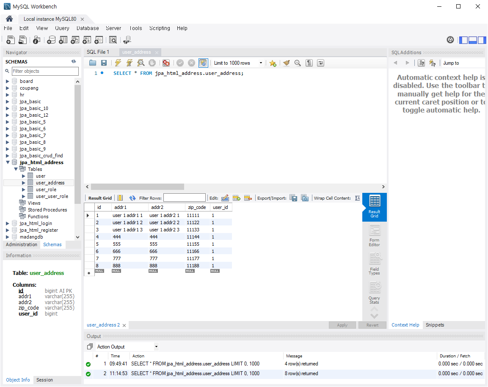

# [2024.08.29(목)] User Address 추가/JPQL+Dto


# User Address 추가

## SpringBootJpaHtmlUserAddress 프로젝트

### 회원 주소 추가

- 주소 입력 시
    1. 주소만 입력되는 경우 (주소 목록 조회 X)
    2. addAddress()로 주소입력되고 listAddress()로 주소목록 보여주는 경우
    3. addAddress()로 주소입력되면 추가 메소드 실행 없이 주소 목록 보여주는 경우

### 2. 주소 입력 1회, 주소 목록 조회 1회 총 request 2회로 주소 입력 시 목록 보여주는 경우

### src/main/java/com/mycom/myapp/user

### service

### UserService.java

```java
package com.mycom.myapp.user.service;

import com.mycom.myapp.user.dto.UserResultDto;
import com.mycom.myapp.user.entity.User;
import com.mycom.myapp.user.entity.UserAddress;

public interface UserService {

	// login
	UserResultDto login(String email, String password);
	
	// register
	// default user role 처리는 이 메소드를 구현하는 구현체 UserServiceImpl에서 처리
	UserResultDto insertUser(User user);
	
	// 회원 상세
	UserResultDto dtailUser(Long id);
	
	// 회원 주소 목록
	UserResultDto listUserAddress(Long id);
	
	// 회원 주소 등록
	UserResultDto insertUserAddress(UserAddress userAddress, Long id); // 사용자 ID
}
```

### UserServiceImpl.java

```java
package com.mycom.myapp.user.service;

import java.util.ArrayList;
import java.util.List;
import java.util.Map;
import java.util.Optional;

import org.springframework.stereotype.Service;

import com.mycom.myapp.user.dto.UserAddressDto;
import com.mycom.myapp.user.dto.UserDto;
import com.mycom.myapp.user.dto.UserResultDto;
import com.mycom.myapp.user.entity.User;
import com.mycom.myapp.user.entity.UserAddress;
import com.mycom.myapp.user.entity.UserRole;
import com.mycom.myapp.user.repository.UserAddressRepository;
import com.mycom.myapp.user.repository.UserRepository;
import com.mycom.myapp.user.repository.UserRoleRepository;

import lombok.RequiredArgsConstructor;

@Service
@RequiredArgsConstructor
public class UserServiceImpl implements UserService{
	
	private final UserRepository userRepository;
	private final UserRoleRepository userRoleRepository;
	private final UserAddressRepository userAddressRepository;
	
	@Override
	public UserResultDto login(String email, String password) {
		UserResultDto userResultDto = new UserResultDto();
		
		User user = userRepository.findByEmail(email);
		
		if(user != null && user.getPassword().equals(password)) {
			
			UserDto userDto = new UserDto();
			userDto.setId(user.getId());
			userDto.setName(user.getName());
			userDto.setEmail(user.getEmail());
			
			// userDto 객체의 roles 필드를 참조하는 Map 객체를 userRoles 변수에 저장
			// userRoles에 데이터를 추가하면 그 내용이 userDto의 roles 필드에 그대로 반영
			Map<Integer, String> userRoles = userDto.getRoles();
			user.getRoles().forEach( role -> userRoles.put(role.getId(), role.getName()));
			
			userResultDto.setUserDto(userDto);
			userResultDto.setResult("success");
		} else {
			userResultDto.setResult("fail");
		}
		
		return userResultDto;
	}

	@Override
	public UserResultDto insertUser(User user) {
		UserResultDto userResultDto = new UserResultDto();
		
		// "role_customer" 이름을 가진 Role Entity를 가져온다.
		// 전달되는 User Entity 연결
		// User Entity를 저장(save, persist)하면 연결된 UserRole도 함께 저장되도록 ( User의 @ManyToMany 연관관계의 CascadeType : PERSIST로 주어야 한다. )
		// User Entity를 저장
		try {
			UserRole userRole = userRoleRepository.findByName("role_customer"); // default role
			
//			UserRole userRole = new UserRole();
//			userRole.setName("test_role");
//			userRoleRepository.save(userRole); // userRole을 먼저 persist하지 않으면 user를 persist하는 과정에서 오류가 발생한다.
			// 해결 방법 : 1. userRoleRepository.save(userRole); 2. USer.java @ManyToMany(cascade = CascadeType.PERSIST)
			
			user.getRoles().add(userRole);
			userRepository.save(user);  // userRole이 위에서 새로 만들어진 경우 userRole이 persist가 되어 있지 않으므로 오류 발생
			userResultDto.setResult("success");
		} catch (Exception e) {
			e.printStackTrace();
			userResultDto.setResult("fail");
		}
		
		return userResultDto;
	}

	// 사용자가 자신의 정보를 확인하는 과정이므로 UserRole은 가져오지 않는다.
	// 비밀번호는 가져온다.
	@Override
	public UserResultDto dtailUser(Long id) {
		UserResultDto userResultDto = new UserResultDto();
		Optional<User> optionalUser = userRepository.findById(id); // id에 따라 null이 될 수도 있다.
		
		optionalUser.ifPresentOrElse(
				user -> { // 첫 번째 람다 : User Entity가 있을 경우
					UserDto userDto = new UserDto();
					userDto.setId(user.getId());
					userDto.setName(user.getName());
					userDto.setEmail(user.getEmail());
					userDto.setPassword(user.getPassword());
					
					userResultDto.setUserDto(userDto);
					userResultDto.setResult("success");
				}, 
				() -> {  // 두 번째 람다 : User Entity가 없을 경우
					userResultDto.setResult("fail");
				}  
		);  
		
		return userResultDto;
	}

	@Override
	public UserResultDto listUserAddress(Long id) {
		UserResultDto userResultDto = new UserResultDto();
		
		System.out.println("_________________________________________");
		List<UserAddress> userAddressesList = userAddressRepository.findByUserId(id);
//		List<UserAddress> userAddressesList = userAddressRepository.findAll();
		System.out.println("_________________________________________");
		
		UserDto userDto = new UserDto();
		List<UserAddressDto> addresses = userDto.getAddresses();
		
		userAddressesList.forEach( userAddresses -> {
			
			UserAddressDto userAddressDto = new UserAddressDto();
			userAddressDto.setId(userAddresses.getId());
			userAddressDto.setAddr1(userAddresses.getAddr1());
			userAddressDto.setAddr2(userAddresses.getAddr2());
			userAddressDto.setZipCode(userAddresses.getZipCode());
			
			addresses.add(userAddressDto);
			
		});
		
		// UserDto는 일종의 Dummy
		// Long id로 함께 값을 가져오려면 new UserDto() 대신 userRepository.findById()
		userDto.setId(id);  // 단순 테스트 용도
		userResultDto.setUserDto(userDto);
		userResultDto.setResult("success");
		
		return userResultDto;
	}

	// UserAddress를 등록할 때 JPA의 연관관계를 이용해서 등록한다.
	// 만약 User와 연관관계가 없다면 UserAddress Entity 단독 등록 처리한다.
	@Override
	public UserResultDto insertUserAddress(UserAddress userAddress, Long id) {
		UserResultDto userResultDto = new UserResultDto();
		
		// id를 이용해서 User Entity를 가져온다.
		Optional<User> optionalUser = userRepository.findById(id);
		
		optionalUser.ifPresentOrElse(
			user -> {
				userAddress.setUser(user);  // UserAddress Entity에 User Entity 연결
				userAddressRepository.save(userAddress);
				userResultDto.setResult("success");	
			}, 
			() -> {
				userResultDto.setResult("fail");	
			}
		);
		
		return userResultDto;
	}

}
```

### Entity/UserAddress.java

```java
package com.mycom.myapp.user.entity;

import jakarta.persistence.Column;
import jakarta.persistence.Entity;
import jakarta.persistence.FetchType;
import jakarta.persistence.GeneratedValue;
import jakarta.persistence.GenerationType;
import jakarta.persistence.Id;
import jakarta.persistence.JoinColumn;
import jakarta.persistence.ManyToOne;
import jakarta.persistence.Table;
import lombok.Getter;
import lombok.Setter;
import lombok.ToString;

@Entity
@Table(name = "user_address")
@Getter
@Setter
@ToString
public class UserAddress {

	@Id
	@GeneratedValue(strategy = GenerationType.IDENTITY)
	private Integer id;
	
	// 실제 주소 : 우편번호, 시도코드, 구군코드, 읍면동코드, 상세주소 ( 행안부 법정동코드... )
	@Column(name = "zip_code")
	private String zipCode;
	private String addr1;
	private String addr2;
	
	// Address가 조회될 때 N+1문제 해결을 위해 LAZY 사용
	@ManyToOne (fetch = FetchType.LAZY)
	@JoinColumn(name = "user_id")
	@ToString.Exclude
	private User user;
	
	// User와 연관관꼐가 없을 때
//	@Column(name = "user_id")
//	private Long userId;
	
}
```

### controller/UserController.java

```java
package com.mycom.myapp.user.controller;

import org.springframework.stereotype.Controller;
import org.springframework.web.bind.annotation.GetMapping;
import org.springframework.web.bind.annotation.PostMapping;
import org.springframework.web.bind.annotation.RequestMapping;
import org.springframework.web.bind.annotation.RequestParam;
import org.springframework.web.bind.annotation.ResponseBody;

import com.mycom.myapp.user.dto.UserDto;
import com.mycom.myapp.user.dto.UserResultDto;
import com.mycom.myapp.user.entity.User;
import com.mycom.myapp.user.entity.UserAddress;
import com.mycom.myapp.user.service.UserService;

import jakarta.servlet.http.HttpSession;
import lombok.RequiredArgsConstructor;

@Controller
@ResponseBody
@RequestMapping("/users")
@RequiredArgsConstructor
public class UserController {

	private final UserService userService;
	
	@PostMapping("/login")
	public UserResultDto login(
			@RequestParam("email") String email, 
			@RequestParam("password") String password,
			HttpSession session
	) {
		UserResultDto userResultDto = userService.login(email, password);
		
		if( userResultDto.getResult().equals("success") ) {
			session.setAttribute("userDto", userResultDto.getUserDto());
		}
		
		return userResultDto;
	}
	
	@GetMapping("/logout")
	public UserResultDto login(HttpSession session) {
		UserResultDto userResultDto = new UserResultDto();
		
		try {
			session.invalidate();
			userResultDto.setResult("success");
		} catch (IllegalStateException e) {
			userResultDto.setResult("fail");
		}
		
		return userResultDto;
	}
	
	@PostMapping("/register")
	public UserResultDto insertUser(User user) {
		return userService.insertUser(user);
	}
	
	// login 되어 있다는 전제 Session으로부터 회원 id를 가져온다.
	// login 되어 있지 않은 상태에서의 요청은 LoginInterceptor로부터 걸러지도록 처리
	@GetMapping("/detail")
	public UserResultDto detailUser(HttpSession session) {
		Long id = ( (UserDto)session.getAttribute("userDto") ).getId();
		return userService.dtailUser(id);
	}
	
	// login 되어 있다는 전제 Session으로부터 회원 id를 가져온다.
	// login 되어 있지 않은 상태에서의 요청은 LoginInterceptor로부터 걸러지도록 처리
	@GetMapping("/listUserAddress")
	public UserResultDto listUserAddress(HttpSession session) {
		Long id = ( (UserDto)session.getAttribute("userDto") ).getId();
		return userService.listUserAddress(id);
	}
	
	// login 되어 있다는 전제 Session으로부터 회원 id를 가져온다.
	// login 되어 있지 않은 상태에서의 요청은 LoginInterceptor로부터 걸러지도록 처리
	@PostMapping("/addAddress")
	public UserResultDto insertUserAddress(UserAddress userAddress, HttpSession session) {
		Long id = ( (UserDto)session.getAttribute("userDto") ).getId();
		return userService.insertUserAddress(userAddress, id);
	}
	
}
```

### src/main/resources/static

### detail.html

```java
<!DOCTYPE html>
<html>
<head>
<meta charset="UTF-8">
<title>Insert title here</title>
</head>
<body>
	<h1>detail.html</h1>
	<div>
		name : <input type="text" name="name" id="name">
	</div>
	<div>
		email : <input type="text" name="email" id="email">
	</div>
	<div>
		password : <input type="password" name="password" id="password">
	</div>
	
	<hr>
	<button id="btnListAddress">주소 목록</button>
	<table>
		<thead>
			<tr><th>zipCode</th><th>addr1</th><th>addr2</th></tr>
		</thead>
		<tbody id="addressTbody">
		
		</tbody>
	</table>
	
	<hr>
	<button id="btnAddAddress">주소 추가</button>
	<div>
		zipCode : <input type="text" name="zipCode" id="zipCode">
	</div>
	<div>
		addr1 : <input type="text" name="addr1" id="addr1">
	</div>
	<div>
		addr2 : <input type="text" name="addr2" id="addr2">
	</div>
	
	<script>
		window.onload = function() {
			detail();
			document.querySelector("#btnListAddress").onclick = listAddress;
			document.querySelector("#btnAddAddress").onclick = addAddress;
		}
		
		async function detail() {
			// url
			let url = "/users/detail";
			
			let response = await fetch(url);
			let data = await response.json();
			
			// console.log(data);
			
			if( data.result == "success" ) {
				// 회원가입 성공일 경우
				console.log(data.userDto);
				let { userDto } = data;  // destruction (구조분해 할당)
				document.querySelector("#name").value = userDto.name;
				document.querySelector("#email").value = userDto.email;
				document.querySelector("#password").value = userDto.password;
			} else if ( data.result == "fail" ) {
				alert("상세 조회 과정에서 오류가 발생하였습니다.");
			}
			
		}
		
		async function listAddress() {
			// url
			let url = "/users/listUserAddress";
			
			let response = await fetch(url);
			let data = await response.json();
			
			// console.log(data);
			
			if( data.result == "success" ) {
				// 회원가입 성공일 경우
				console.log(data.userDto);
				let { userDto } = data;  // destruction (구조분해 할당)
				
				let addressHtml = ``;
				userDto.addresses.forEach(address => {
					addressHtml += `<tr><td>${address.zipCode}</td><td>${address.addr1}</td><td>${address.addr2}</td></tr>`
				});
				
				document.querySelector("#addressTbody").innerHTML = addressHtml;
				
			} else if ( data.result == "fail" ) {
				alert("주소목록 조회 과정에서 오류가 발생하였습니다.");
			}
			
		}
		
		async function addAddress() {
			// parameter, value
			let zipCode = document.querySelector("#zipCode").value;
			let addr1 = document.querySelector("#addr1").value;
			let addr2 = document.querySelector("#addr2").value;
			
			let urlParams = new URLSearchParams({
				zipCode, addr1, addr2
			});
			
			// url
			let url = "/users/addAddress";
			
			// post, parameter
			let fetchOptions = {
				method : "POST",
				body : urlParams
			}
			
			let response = await fetch(url, fetchOptions);
			let data = await response.json();
			
			console.log(data);
			
			if( data.result == "success" ) {
				// 성공일 경우
				// #2 request 2회
				listAddress();
			} else if ( data.result == "fail" ) {
				alert("주소목록 등록 과정에서 오류가 발생하였습니다.");
			}
			
		}
	</script>
</body>
</html>
```

### 실행 결과

- 주소 추가 시 자동으로 주소 목록 조회 된다.


### 3. 주소 입력 request 1회로 추가 메소드 실행 없이 주소 목록 보여주는 경우

### src/main/java/com/mycom/myapp/user

### service/UserServiceImpl.java

```java
package com.mycom.myapp.user.service;

import java.util.ArrayList;
import java.util.List;
import java.util.Map;
import java.util.Optional;

import org.springframework.stereotype.Service;

import com.mycom.myapp.user.dto.UserAddressDto;
import com.mycom.myapp.user.dto.UserDto;
import com.mycom.myapp.user.dto.UserResultDto;
import com.mycom.myapp.user.entity.User;
import com.mycom.myapp.user.entity.UserAddress;
import com.mycom.myapp.user.entity.UserRole;
import com.mycom.myapp.user.repository.UserAddressRepository;
import com.mycom.myapp.user.repository.UserRepository;
import com.mycom.myapp.user.repository.UserRoleRepository;

import lombok.RequiredArgsConstructor;

@Service
@RequiredArgsConstructor
public class UserServiceImpl implements UserService{
	
	private final UserRepository userRepository;
	private final UserRoleRepository userRoleRepository;
	private final UserAddressRepository userAddressRepository;
	
	@Override
	public UserResultDto login(String email, String password) {
		UserResultDto userResultDto = new UserResultDto();
		
		User user = userRepository.findByEmail(email);
		
		if(user != null && user.getPassword().equals(password)) {
			
			UserDto userDto = new UserDto();
			userDto.setId(user.getId());
			userDto.setName(user.getName());
			userDto.setEmail(user.getEmail());
			
			// userDto 객체의 roles 필드를 참조하는 Map 객체를 userRoles 변수에 저장
			// userRoles에 데이터를 추가하면 그 내용이 userDto의 roles 필드에 그대로 반영
			Map<Integer, String> userRoles = userDto.getRoles();
			user.getRoles().forEach( role -> userRoles.put(role.getId(), role.getName()));
			
			userResultDto.setUserDto(userDto);
			userResultDto.setResult("success");
		} else {
			userResultDto.setResult("fail");
		}
		
		return userResultDto;
	}

	@Override
	public UserResultDto insertUser(User user) {
		UserResultDto userResultDto = new UserResultDto();
		
		// "role_customer" 이름을 가진 Role Entity를 가져온다.
		// 전달되는 User Entity 연결
		// User Entity를 저장(save, persist)하면 연결된 UserRole도 함께 저장되도록 ( User의 @ManyToMany 연관관계의 CascadeType : PERSIST로 주어야 한다. )
		// User Entity를 저장
		try {
			UserRole userRole = userRoleRepository.findByName("role_customer"); // default role
			
//			UserRole userRole = new UserRole();
//			userRole.setName("test_role");
//			userRoleRepository.save(userRole); // userRole을 먼저 persist하지 않으면 user를 persist하는 과정에서 오류가 발생한다.
			// 해결 방법 : 1. userRoleRepository.save(userRole); 2. USer.java @ManyToMany(cascade = CascadeType.PERSIST)
			
			user.getRoles().add(userRole);
			userRepository.save(user);  // userRole이 위에서 새로 만들어진 경우 userRole이 persist가 되어 있지 않으므로 오류 발생
			userResultDto.setResult("success");
		} catch (Exception e) {
			e.printStackTrace();
			userResultDto.setResult("fail");
		}
		
		return userResultDto;
	}

	// 사용자가 자신의 정보를 확인하는 과정이므로 UserRole은 가져오지 않는다.
	// 비밀번호는 가져온다.
	@Override
	public UserResultDto dtailUser(Long id) {
		UserResultDto userResultDto = new UserResultDto();
		Optional<User> optionalUser = userRepository.findById(id); // id에 따라 null이 될 수도 있다.
		
		optionalUser.ifPresentOrElse(
				user -> { // 첫 번째 람다 : User Entity가 있을 경우
					UserDto userDto = new UserDto();
					userDto.setId(user.getId());
					userDto.setName(user.getName());
					userDto.setEmail(user.getEmail());
					userDto.setPassword(user.getPassword());
					
					userResultDto.setUserDto(userDto);
					userResultDto.setResult("success");
				}, 
				() -> {  // 두 번째 람다 : User Entity가 없을 경우
					userResultDto.setResult("fail");
				}  
		);  
		
		return userResultDto;
	}

	@Override
	public UserResultDto listUserAddress(Long id) {
		UserResultDto userResultDto = new UserResultDto();
		
		System.out.println("_________________________________________");
		List<UserAddress> userAddressesList = userAddressRepository.findByUserId(id);
//		List<UserAddress> userAddressesList = userAddressRepository.findAll();
		System.out.println("_________________________________________");
		
		UserDto userDto = new UserDto();
		List<UserAddressDto> addresses = userDto.getAddresses();
		
		userAddressesList.forEach( userAddresses -> {
			
			UserAddressDto userAddressDto = new UserAddressDto();
			userAddressDto.setId(userAddresses.getId());
			userAddressDto.setAddr1(userAddresses.getAddr1());
			userAddressDto.setAddr2(userAddresses.getAddr2());
			userAddressDto.setZipCode(userAddresses.getZipCode());
			
			addresses.add(userAddressDto);
			
		});
		
		// UserDto는 일종의 Dummy
		// Long id로 함께 값을 가져오려면 new UserDto() 대신 userRepository.findById()
		userDto.setId(id);  // 단순 테스트 용도
		userResultDto.setUserDto(userDto);
		userResultDto.setResult("success");
		
		return userResultDto;
	}

	// UserAddress를 등록할 때 JPA의 연관관계를 이용해서 등록한다.
	// 만약 User와 연관관계가 없다면 UserAddress Entity 단독 등록 처리한다.
	@Override
	public UserResultDto insertUserAddress(UserAddress userAddress, Long id) {
		UserResultDto userResultDto = new UserResultDto();
		
		// id를 이용해서 User Entity를 가져온다.
		Optional<User> optionalUser = userRepository.findById(id);
		
		// #2 저장만
//		optionalUser.ifPresentOrElse(
//			user -> {
//				userAddress.setUser(user);  // UserAddress Entity에 User Entity 연결
//				userAddressRepository.save(userAddress);
//				userResultDto.setResult("success");	
//			}, 
//			() -> {
//				userResultDto.setResult("fail");	
//			}
//		);
		
		// #3 저장 + 목록 구성 리턴
		optionalUser.ifPresentOrElse(
				user -> {
					userAddress.setUser(user);  // UserAddress Entity에 User Entity 연결
					try {
						userAddressRepository.save(userAddress);
						
						// 회원의 주소를 가져온다.
						List<UserAddress> userAddressesList = userAddressRepository.findByUserId(id);
						
						UserDto userDto = new UserDto();
						List<UserAddressDto> addresses = userDto.getAddresses();
						
						userAddressesList.forEach( userAddresses -> {
							
							UserAddressDto userAddressDto = new UserAddressDto();
							userAddressDto.setId(userAddresses.getId());
							userAddressDto.setAddr1(userAddresses.getAddr1());
							userAddressDto.setAddr2(userAddresses.getAddr2());
							userAddressDto.setZipCode(userAddresses.getZipCode());
							
							addresses.add(userAddressDto);
							
						});
						
						userDto.setId(id);  // 단순 테스트 용도
						userResultDto.setUserDto(userDto);
						userResultDto.setResult("success");
						
					} catch(Exception e) {
						e.printStackTrace();
						userResultDto.setResult("fail");	
					}
				}, 
				() -> {
					userResultDto.setResult("fail");	
				}
			);
		
		return userResultDto;
	}

}
```

### src/main/resources/static

### detail.html

```java
<!DOCTYPE html>
<html>
<head>
<meta charset="UTF-8">
<title>Insert title here</title>
</head>
<body>
	<h1>detail.html</h1>
	<div>
		name : <input type="text" name="name" id="name">
	</div>
	<div>
		email : <input type="text" name="email" id="email">
	</div>
	<div>
		password : <input type="password" name="password" id="password">
	</div>
	
	<hr>
	<button id="btnListAddress">주소 목록</button>
	<table>
		<thead>
			<tr><th>zipCode</th><th>addr1</th><th>addr2</th></tr>
		</thead>
		<tbody id="addressTbody">
		
		</tbody>
	</table>
	
	<hr>
	<button id="btnAddAddress">주소 추가</button>
	<div>
		zipCode : <input type="text" name="zipCode" id="zipCode">
	</div>
	<div>
		addr1 : <input type="text" name="addr1" id="addr1">
	</div>
	<div>
		addr2 : <input type="text" name="addr2" id="addr2">
	</div>
	
	<script>
		window.onload = function() {
			detail();
			document.querySelector("#btnListAddress").onclick = listAddress;
			document.querySelector("#btnAddAddress").onclick = addAddress;
		}
		
		async function detail() {
			// url
			let url = "/users/detail";
			
			let response = await fetch(url);
			let data = await response.json();
			
			// console.log(data);
			
			if( data.result == "success" ) {
				// 회원가입 성공일 경우
				console.log(data.userDto);
				let { userDto } = data;  // destruction (구조분해 할당)
				document.querySelector("#name").value = userDto.name;
				document.querySelector("#email").value = userDto.email;
				document.querySelector("#password").value = userDto.password;
			} else if ( data.result == "fail" ) {
				alert("상세 조회 과정에서 오류가 발생하였습니다.");
			}
			
		}
		
		async function listAddress() {
			// url
			let url = "/users/listUserAddress";
			
			let response = await fetch(url);
			let data = await response.json();
			
			// console.log(data);
			
			if( data.result == "success" ) {
				// 회원가입 성공일 경우
				console.log(data.userDto);
				let { userDto } = data;  // destruction (구조분해 할당)
				
				let addressHtml = ``;
				userDto.addresses.forEach(address => {
					addressHtml += `<tr><td>${address.zipCode}</td><td>${address.addr1}</td><td>${address.addr2}</td></tr>`
				});
				
				document.querySelector("#addressTbody").innerHTML = addressHtml;
				
			} else if ( data.result == "fail" ) {
				alert("주소목록 조회 과정에서 오류가 발생하였습니다.");
			}
			
		}
		
		async function addAddress() {
			// parameter, value
			let zipCode = document.querySelector("#zipCode").value;
			let addr1 = document.querySelector("#addr1").value;
			let addr2 = document.querySelector("#addr2").value;
			
			let urlParams = new URLSearchParams({
				zipCode, addr1, addr2
			});
			
			// url
			let url = "/users/addAddress";
			
			// post, parameter
			let fetchOptions = {
				method : "POST",
				body : urlParams
			}
			
			let response = await fetch(url, fetchOptions);
			let data = await response.json();
			
			console.log(data);
			
			if( data.result == "success" ) {
				// 성공일 경우
				// #2 request 2회
				// listAddress();
				
				// #3 request 1회
				let { userDto } = data;  // destruction (구조분해 할당)
				
				let addressHtml = ``;
				userDto.addresses.forEach(address => {
					addressHtml += `<tr><td>${address.zipCode}</td><td>${address.addr1}</td><td>${address.addr2}</td></tr>`
				});
				
				document.querySelector("#addressTbody").innerHTML = addressHtml;
			} else if ( data.result == "fail" ) {
				alert("주소 등록 과정에서 오류가 발생하였습니다.");
			}
			
		}
	</script>
</body>
</html>
```

### 실행 결과

- 주소 추가 시 자동으로 주소 목록 조회 된다.


### UserAddress에서 연관관계를 사용하지 않는 경우

### src/main/java/com/mycom/myapp/user

### Entity

### UserAddress.java

```java
package com.mycom.myapp.user.entity;

import jakarta.persistence.Column;
import jakarta.persistence.Entity;
import jakarta.persistence.FetchType;
import jakarta.persistence.GeneratedValue;
import jakarta.persistence.GenerationType;
import jakarta.persistence.Id;
import jakarta.persistence.JoinColumn;
import jakarta.persistence.ManyToOne;
import jakarta.persistence.Table;
import lombok.Getter;
import lombok.Setter;
import lombok.ToString;

@Entity
@Table(name = "user_address")
@Getter
@Setter
@ToString
public class UserAddress {

	@Id
	@GeneratedValue(strategy = GenerationType.IDENTITY)
	private Integer id;
	
	// 실제 주소 : 우편번호, 시도코드, 구군코드, 읍면동코드, 상세주소 ( 행안부 법정동코드... )
	@Column(name = "zip_code")
	private String zipCode;
	private String addr1;
	private String addr2;
	
	// Address가 조회될 때 N+1문제 해결을 위해 LAZY 사용
//	@ManyToOne (fetch = FetchType.LAZY)
//	@JoinColumn(name = "user_id")
//	@ToString.Exclude
//	private User user;
	
	// User와 연관관꼐가 없을 때
	@Column(name = "user_id")
	private Long userId;
	
}
```

### User.java

```java
package com.mycom.myapp.user.entity;

import java.util.ArrayList;
import java.util.HashSet;
import java.util.List;
import java.util.Set;

import jakarta.persistence.CascadeType;
import jakarta.persistence.Entity;
import jakarta.persistence.GeneratedValue;
import jakarta.persistence.GenerationType;
import jakarta.persistence.Id;
import jakarta.persistence.JoinColumn;
import jakarta.persistence.JoinTable;
import jakarta.persistence.ManyToMany;
import jakarta.persistence.OneToMany;
import lombok.Getter;
import lombok.Setter;
import lombok.ToString;

@Entity
@Getter
@Setter
@ToString
public class User {
	
	@Id
	@GeneratedValue(strategy = GenerationType.IDENTITY)
	private Long id;
	
	private String name;
	
	private String email;
	
	private String Password;
	
	// User Entity가 등록되면 roles의 UserRole이 함께 등록
	@ManyToMany(cascade = CascadeType.PERSIST)
	@JoinTable(
			name = "user_user_role", 
			joinColumns = @JoinColumn(name = "user_id"),
			inverseJoinColumns = @JoinColumn(name = "role_id")
	)
	@ToString.Exclude
	private Set<UserRole> roles = new HashSet<>();
	
//	@OneToMany(mappedBy = "user")
//	@ToString.Exclude
//	private List<UserAddress> addresses = new ArrayList<>();
	
	@OneToMany
	@ToString.Exclude
	private List<UserAddress> addresses = new ArrayList<>();
	
}
```

### service/UserServiceImpl.java

```java
package com.mycom.myapp.user.service;

import java.util.ArrayList;
import java.util.List;
import java.util.Map;
import java.util.Optional;

import org.springframework.stereotype.Service;

import com.mycom.myapp.user.dto.UserAddressDto;
import com.mycom.myapp.user.dto.UserDto;
import com.mycom.myapp.user.dto.UserResultDto;
import com.mycom.myapp.user.entity.User;
import com.mycom.myapp.user.entity.UserAddress;
import com.mycom.myapp.user.entity.UserRole;
import com.mycom.myapp.user.repository.UserAddressRepository;
import com.mycom.myapp.user.repository.UserRepository;
import com.mycom.myapp.user.repository.UserRoleRepository;

import lombok.RequiredArgsConstructor;

@Service
@RequiredArgsConstructor
public class UserServiceImpl implements UserService{
	
	private final UserRepository userRepository;
	private final UserRoleRepository userRoleRepository;
	private final UserAddressRepository userAddressRepository;
	
	@Override
	public UserResultDto login(String email, String password) {
		UserResultDto userResultDto = new UserResultDto();
		
		User user = userRepository.findByEmail(email);
		
		if(user != null && user.getPassword().equals(password)) {
			
			UserDto userDto = new UserDto();
			userDto.setId(user.getId());
			userDto.setName(user.getName());
			userDto.setEmail(user.getEmail());
			
			// userDto 객체의 roles 필드를 참조하는 Map 객체를 userRoles 변수에 저장
			// userRoles에 데이터를 추가하면 그 내용이 userDto의 roles 필드에 그대로 반영
			Map<Integer, String> userRoles = userDto.getRoles();
			user.getRoles().forEach( role -> userRoles.put(role.getId(), role.getName()));
			
			userResultDto.setUserDto(userDto);
			userResultDto.setResult("success");
		} else {
			userResultDto.setResult("fail");
		}
		
		return userResultDto;
	}

	@Override
	public UserResultDto insertUser(User user) {
		UserResultDto userResultDto = new UserResultDto();
		
		// "role_customer" 이름을 가진 Role Entity를 가져온다.
		// 전달되는 User Entity 연결
		// User Entity를 저장(save, persist)하면 연결된 UserRole도 함께 저장되도록 ( User의 @ManyToMany 연관관계의 CascadeType : PERSIST로 주어야 한다. )
		// User Entity를 저장
		try {
			UserRole userRole = userRoleRepository.findByName("role_customer"); // default role
			
//			UserRole userRole = new UserRole();
//			userRole.setName("test_role");
//			userRoleRepository.save(userRole); // userRole을 먼저 persist하지 않으면 user를 persist하는 과정에서 오류가 발생한다.
			// 해결 방법 : 1. userRoleRepository.save(userRole); 2. USer.java @ManyToMany(cascade = CascadeType.PERSIST)
			
			user.getRoles().add(userRole);
			userRepository.save(user);  // userRole이 위에서 새로 만들어진 경우 userRole이 persist가 되어 있지 않으므로 오류 발생
			userResultDto.setResult("success");
		} catch (Exception e) {
			e.printStackTrace();
			userResultDto.setResult("fail");
		}
		
		return userResultDto;
	}

	// 사용자가 자신의 정보를 확인하는 과정이므로 UserRole은 가져오지 않는다.
	// 비밀번호는 가져온다.
	@Override
	public UserResultDto dtailUser(Long id) {
		UserResultDto userResultDto = new UserResultDto();
		Optional<User> optionalUser = userRepository.findById(id); // id에 따라 null이 될 수도 있다.
		
		optionalUser.ifPresentOrElse(
				user -> { // 첫 번째 람다 : User Entity가 있을 경우
					UserDto userDto = new UserDto();
					userDto.setId(user.getId());
					userDto.setName(user.getName());
					userDto.setEmail(user.getEmail());
					userDto.setPassword(user.getPassword());
					
					userResultDto.setUserDto(userDto);
					userResultDto.setResult("success");
				}, 
				() -> {  // 두 번째 람다 : User Entity가 없을 경우
					userResultDto.setResult("fail");
				}  
		);  
		
		return userResultDto;
	}

	@Override
	public UserResultDto listUserAddress(Long id) {
		UserResultDto userResultDto = new UserResultDto();
		
		System.out.println("_________________________________________");
		List<UserAddress> userAddressesList = userAddressRepository.findByUserId(id);
//		List<UserAddress> userAddressesList = userAddressRepository.findAll();
		System.out.println("_________________________________________");
		
		UserDto userDto = new UserDto();
		List<UserAddressDto> addresses = userDto.getAddresses();
		
		userAddressesList.forEach( userAddresses -> {
			
			UserAddressDto userAddressDto = new UserAddressDto();
			userAddressDto.setId(userAddresses.getId());
			userAddressDto.setAddr1(userAddresses.getAddr1());
			userAddressDto.setAddr2(userAddresses.getAddr2());
			userAddressDto.setZipCode(userAddresses.getZipCode());
			
			addresses.add(userAddressDto);
			
		});
		
		// UserDto는 일종의 Dummy
		// Long id로 함께 값을 가져오려면 new UserDto() 대신 userRepository.findById()
		userDto.setId(id);  // 단순 테스트 용도
		userResultDto.setUserDto(userDto);
		userResultDto.setResult("success");
		
		return userResultDto;
	}

	// UserAddress를 등록할 때 JPA의 연관관계를 이용해서 등록한다.
	// 만약 User와 연관관계가 없다면 UserAddress Entity 단독 등록 처리한다.
	@Override
	public UserResultDto insertUserAddress(UserAddress userAddress, Long id) {
		UserResultDto userResultDto = new UserResultDto();
		
		// UserAddress에서 연관관계를 사용하지 않는 경우
		userAddress.setUserId(id);
		userAddressRepository.save(userAddress);
		userResultDto.setResult("success");
		
		// id를 이용해서 User Entity를 가져온다.
//		Optional<User> optionalUser = userRepository.findById(id);
		
		// #2 저장만
//		optionalUser.ifPresentOrElse(
//			user -> {
//				userAddress.setUser(user);  // UserAddress Entity에 User Entity 연결
//				userAddressRepository.save(userAddress);
//				userResultDto.setResult("success");	
//			}, 
//			() -> {
//				userResultDto.setResult("fail");	
//			}
//		);
		
		// #3 저장 + 목록 구성 리턴
//		optionalUser.ifPresentOrElse(
//				user -> {
//					userAddress.setUser(user);  // UserAddress Entity에 User Entity 연결
//					try {
//						userAddressRepository.save(userAddress);  // 정상적으로 수행되면 이후 라인 수행
//						
//						// 회원의 주소를 가져온다.
//						List<UserAddress> userAddressesList = userAddressRepository.findByUserId(id);
//						
//						UserDto userDto = new UserDto();
//						List<UserAddressDto> addresses = userDto.getAddresses();
//						
//						userAddressesList.forEach( userAddresses -> {
//							
//							UserAddressDto userAddressDto = new UserAddressDto();
//							userAddressDto.setId(userAddresses.getId());
//							userAddressDto.setAddr1(userAddresses.getAddr1());
//							userAddressDto.setAddr2(userAddresses.getAddr2());
//							userAddressDto.setZipCode(userAddresses.getZipCode());
//							
//							addresses.add(userAddressDto);
//							
//						});
//						
//						userDto.setId(id);  // 단순 테스트 용도
//						userResultDto.setUserDto(userDto);
//						userResultDto.setResult("success");
//						
//					} catch(Exception e) {
//						e.printStackTrace();
//						userResultDto.setResult("fail");	
//					}
//				}, 
//				() -> {
//					userResultDto.setResult("fail");	
//				}
//			);
		
		return userResultDto;
	}

}
```

### 실행 결과

- 주소 추가 후 MySQL에 주소 추가됐는지 확인
    
    
    
    
    

# JPQL

## SpringBootJpaBasicJpqlDto 프로젝트

### SpringBootJpaBasicJpqlDto 프로젝트 생성


### SpringBootJpaBasicJpqlDto 프로젝트 설정

### application.properties

```java
spring.application.name=SpringBootJpaBasicJpqlDto
server.port=8000

spring.datasource.url=jdbc:mysql://localhost:3306/jpa_basic_jpql_dto
spring.datasource.username=root
spring.datasource.password=root
spring.datasource.driver-class-name=com.mysql.cj.jdbc.Driver

spring.jpa.show-sql=true
```

### MySQL

- jpa_basic_jpql_dto 스키마 생성
- jpa_basic_jpql_dto 스키마에 테이블 및 데이터 입력 코드
    
    ```java
    DROP TABLE IF EXISTS customer;
    DROP TABLE IF EXISTS orders;
    DROP TABLE IF EXISTS product;
    CREATE TABLE customer (
      gender char(1) NOT NULL,
      id int NOT NULL AUTO_INCREMENT,
      name varchar(255) DEFAULT NULL,
      phone varchar(255) DEFAULT NULL,
      PRIMARY KEY (id)
    );
    CREATE TABLE orders (
      customer_id int DEFAULT NULL,
      id int NOT NULL AUTO_INCREMENT,
      order_date date DEFAULT NULL,
      order_quantity int DEFAULT NULL,
      product_id int DEFAULT NULL,
      PRIMARY KEY (id)
    );
    CREATE TABLE product (
      id int NOT NULL AUTO_INCREMENT,
      quantity int NOT NULL,
      price bigint DEFAULT NULL,
      country varchar(255) DEFAULT NULL,
      name varchar(255) DEFAULT NULL,
      PRIMARY KEY (id)
    );
    INSERT INTO customer VALUES ('M',1,'고객1','010-1111-1111'),('F',2,'고객2','010-2222-2222'),('F',3,'고객3','010-3333-3333');
    INSERT INTO orders VALUES (1,1,'2024-03-10',2,1),(1,2,'2024-03-11',5,2),(2,3,'2024-03-11',3,2),(2,4,'2024-03-10',10,3),(3,5,'2024-03-10',3,3),(1,6,'2024-03-10',2,1),(1,7,'2024-03-12',6,3),(2,8,'2024-03-12',3,3),(2,9,'2024-03-12',4,1),(3,10,'2024-03-13',5,1);
    INSERT INTO product VALUES (1,15,1000,'korea','제품1'),(2,10,3000,'usa','제품2'),(3,20,5000,'korea','제품3');
    ```
    

### src/main/java/com/mycom/myapp

- controller, dto, entity, repository, service 패키지 생성

### SpringBootJpaBasicJpqlDto 프로젝트 코드

### 1. Orders 조회하는 데 연관된 Customer,Product 필요 X

### 문제 상황

- 연관관계를 가진 Entity에 대해서는 JSON으로 응답 처리를 하면 N+1 문제 + 예외 발생 (JSON 순환 참조) 문제 발생

### src/main/java/com/mycom/myapp

### Entity

### Customer.java

```java
package com.mycom.myapp.entity;

import java.util.List;

import jakarta.persistence.Entity;
import jakarta.persistence.GeneratedValue;
import jakarta.persistence.GenerationType;
import jakarta.persistence.Id;
import jakarta.persistence.OneToMany;
import lombok.AllArgsConstructor;
import lombok.Getter;
import lombok.NoArgsConstructor;
import lombok.Setter;
import lombok.ToString;

@Entity
@Getter
@Setter
@ToString
@NoArgsConstructor
@AllArgsConstructor
public class Customer {

	@Id
	@GeneratedValue(strategy = GenerationType.IDENTITY)
	private int id;
	private String name;
	private char gender;
	private String phone;
	
	@OneToMany(mappedBy = "customer")
	@ToString.Exclude
	private List<Orders> orders;
	
}
```

### Product.java

```java
package com.mycom.myapp.entity;

import java.util.List;

import jakarta.persistence.Entity;
import jakarta.persistence.GeneratedValue;
import jakarta.persistence.GenerationType;
import jakarta.persistence.Id;
import jakarta.persistence.OneToMany;
import lombok.AllArgsConstructor;
import lombok.Getter;
import lombok.NoArgsConstructor;
import lombok.Setter;
import lombok.ToString;

@Entity
@Getter
@Setter
@ToString
@NoArgsConstructor
@AllArgsConstructor
public class Product {
	
	@Id
	@GeneratedValue(strategy = GenerationType.IDENTITY)
	private int id;
	private String name;
	private int price;
	private int quantity;
	private String country;

	@OneToMany(mappedBy = "product")
	@ToString.Exclude
	private List<Orders> orders;
	
}
```

### Orders.java

```java
package com.mycom.myapp.entity;

import java.time.LocalDate;

import jakarta.persistence.Column;
import jakarta.persistence.Entity;
import jakarta.persistence.FetchType;
import jakarta.persistence.GeneratedValue;
import jakarta.persistence.GenerationType;
import jakarta.persistence.Id;
import jakarta.persistence.ManyToOne;
import lombok.AllArgsConstructor;
import lombok.Getter;
import lombok.NoArgsConstructor;
import lombok.Setter;
import lombok.ToString;

@Entity
@Getter
@Setter
@ToString
@NoArgsConstructor
@AllArgsConstructor
public class Orders {

	@Id
	@GeneratedValue(strategy = GenerationType.IDENTITY)
	private int id;
	
	@ManyToOne(fetch = FetchType.LAZY)
	@ToString.Exclude
	private Customer customer;
	
	@ManyToOne(fetch = FetchType.LAZY)
	@ToString.Exclude
	private Product product;
	
	@Column(name = "order_quantity")
	private int orderQuantity;
	
	@Column(name = "order_date")
	private LocalDate orderDate;
	
}
```

### repository/OrdersRepository.java

```java
package com.mycom.myapp.repository;

import java.util.List;

import org.springframework.data.jpa.repository.JpaRepository;
import org.springframework.data.jpa.repository.Query;
import org.springframework.data.repository.query.Param;

import com.mycom.myapp.entity.Orders;

public interface OrdersRepository extends JpaRepository<Orders, Integer>{

	// #1 여성고객이 주문한 주문(Orders) 전체
	@Query("select o from Orders o inner join o.customer c where c.gender = :gender")
	List<Orders> listOrders1(@Param("gender") char gender);
	
	// #2 여성고객이 주문한 주문(Orders) 전체
	@Query("select o from Orders o inner join o.customer c where c.gender = :gender")
	List<Orders> listOrders2(@Param("gender") char gender);
	
}
```

### service

### OrdersService.java

```java
package com.mycom.myapp.service;

import java.util.List;

import com.mycom.myapp.entity.Orders;

public interface OrdersService {

	// #1
	List<Orders> listOrders1(char gender);

	// #2
	List<Orders> listOrders2(char gender);
	
}
```

### OrdersServiceImpl.java

```java
package com.mycom.myapp.service;

import java.util.List;

import org.springframework.stereotype.Service;

import com.mycom.myapp.entity.Orders;
import com.mycom.myapp.repository.OrdersRepository;

import lombok.RequiredArgsConstructor;

@Service
@RequiredArgsConstructor
public class OrdersServiceImpl implements OrdersService {

	private final OrdersRepository ordersRepository;

	// #1
	@Override
	public List<Orders> listOrders1(char gender) {
		return ordersRepository.listOrders1(gender);
	}

	// #2
	@Override
	public List<Orders> listOrders2(char gender) {
		return ordersRepository.listOrders2(gender);
	}
	
}
```

### controller/UserController.java

```java
package com.mycom.myapp.controller;

import java.util.List;

import org.springframework.stereotype.Controller;
import org.springframework.web.bind.annotation.GetMapping;
import org.springframework.web.bind.annotation.RequestMapping;
import org.springframework.web.bind.annotation.RequestParam;
import org.springframework.web.bind.annotation.ResponseBody;

import com.mycom.myapp.entity.Orders;
import com.mycom.myapp.service.OrdersService;

import lombok.RequiredArgsConstructor;

@Controller
@ResponseBody
@RequestMapping("/orders")
@RequiredArgsConstructor
public class OrdersController {
	
	// ___________________________________________
	// Orders 조회하는 데 연관된 Customer,Product 필요 X
	// ___________________________________________
	

	private final OrdersService ordersService;
	
	// #1
	@GetMapping("/listorders1")
	public List<Orders> listOrders1(@RequestParam("gender") char gender) {
		System.out.println("listOrders1______________________________");
		List<Orders> ordersList = ordersService.listOrders1(gender);
		System.out.println("listOrders1______________________________");
		return ordersList;
	}
	// 결과 : N+1 문제 + 예외 발생 (JSON 순환 참조)
	/*
	 * listOrders1______________________________
		Hibernate: select o1_0.id,o1_0.customer_id,o1_0.order_date,o1_0.order_quantity,o1_0.product_id from orders o1_0 join customer c1_0 on c1_0.id=o1_0.customer_id where c1_0.gender=?
		Hibernate: select c1_0.id,c1_0.gender,c1_0.name,c1_0.phone from customer c1_0 where c1_0.id=?
		Hibernate: select p1_0.id,p1_0.country,p1_0.name,p1_0.price,p1_0.quantity from product p1_0 where p1_0.id=?
		Hibernate: select p1_0.id,p1_0.country,p1_0.name,p1_0.price,p1_0.quantity from product p1_0 where p1_0.id=?
		Hibernate: select c1_0.id,c1_0.gender,c1_0.name,c1_0.phone from customer c1_0 where c1_0.id=?
		Hibernate: select p1_0.id,p1_0.country,p1_0.name,p1_0.price,p1_0.quantity from product p1_0 where p1_0.id=?
		listOrders1______________________________
		Hibernate: select o1_0.customer_id,o1_0.id,o1_0.order_date,o1_0.order_quantity,p1_0.id,p1_0.country,p1_0.name,p1_0.price,p1_0.quantity from orders o1_0 left join product p1_0 on p1_0.id=o1_0.product_id where o1_0.customer_id=?
		Ignoring exception, response committed already: org.springframework.http.converter.HttpMessageNotWritableException: Could not write JSON: Document nesting depth (1001) exceeds the maximum allowed (1000, from `StreamWriteConstraints.getMaxNestingDepth()`)
		Could not write JSON: Document nesting depth (1001) exceeds the maximum allowed (1000, from `StreamWriteConstraints.getMaxNestingDepth()`)]
	 */
	
	// #2
	// Orders의 Customer, Product FetchType : LAZY
	@GetMapping("/listorders2")
	public List<Orders> listOrders2(@RequestParam("gender") char gender) {
		System.out.println("listOrders2______________________________");
		List<Orders> ordersList = ordersService.listOrders2(gender);
		System.out.println("listOrders2______________________________");
		return ordersList;
	}
	// 결과 : N+1 문제(해결) + 예외 발생 (JSON 순환 참조)
	/*
	 * listOrders2______________________________
		Hibernate: select o1_0.id,o1_0.customer_id,o1_0.order_date,o1_0.order_quantity,o1_0.product_id from orders o1_0 join customer c1_0 on c1_0.id=o1_0.customer_id where c1_0.gender=?
		listOrders2______________________________
		Hibernate: select c1_0.id,c1_0.gender,c1_0.name,c1_0.phone from customer c1_0 where c1_0.id=?
		Hibernate: select o1_0.customer_id,o1_0.id,o1_0.order_date,o1_0.order_quantity,o1_0.product_id from orders o1_0 where o1_0.customer_id=?
		Ignoring exception, response committed already: org.springframework.http.converter.HttpMessageNotWritableException: Could not write JSON: Document nesting depth (1001) exceeds the maximum allowed (1000, from `StreamWriteConstraints.getMaxNestingDepth()`)
		Could not write JSON: Document nesting depth (1001) exceeds the maximum allowed (1000, from `StreamWriteConstraints.getMaxNestingDepth()`)]
	 */
	
}
```

### 실행 결과


### 해결 방법

- 연관관계를 가진 Entity에 대해서는 JSON으로 응답 처리를 하지 않고 대신 Dto를 활용한다.

### src/main/java/com/mycom/myapp

### dto

### CustomerDto.java

```java
package com.mycom.myapp.dto;

import java.util.List;

import com.mycom.myapp.entity.Orders;

import lombok.Data;
import lombok.NoArgsConstructor;

@Data
@NoArgsConstructor
public class CustomerDto {

	private int id;
	private String name;
	private char gender;
	private String phone;
	private List<Orders> orders;
	
}
```

### ProductDto.java

```java
package com.mycom.myapp.dto;

import java.util.List;

import com.mycom.myapp.entity.Orders;

import lombok.Data;
import lombok.NoArgsConstructor;

@Data
@NoArgsConstructor
public class ProductDto {

	private int id;
	private String name;
	private int price;
	private int quantity;
	private String country;
	private List<Orders> orders;
	
}
```

### OrdersDto.java

```java
package com.mycom.myapp.dto;

import java.time.LocalDate;

import lombok.Data;
import lombok.NoArgsConstructor;

@Data
@NoArgsConstructor
public class OrdersDto {

	private int id;
	private CustomerDto customerDto;
	private ProductDto productDto;
	private int orderQuantity;
	private LocalDate orderDate;
	
}
```

### repository/OrdersRepository.java

```java
package com.mycom.myapp.repository;

import java.util.List;

import org.springframework.data.jpa.repository.JpaRepository;
import org.springframework.data.jpa.repository.Query;
import org.springframework.data.repository.query.Param;

import com.mycom.myapp.entity.Orders;

public interface OrdersRepository extends JpaRepository<Orders, Integer>{

	// #1 여성고객이 주문한 주문(Orders) 전체
	@Query("select o from Orders o inner join o.customer c where c.gender = :gender")
	List<Orders> listOrders1(@Param("gender") char gender);
	
	// #2 여성고객이 주문한 주문(Orders) 전체
	@Query("select o from Orders o inner join o.customer c where c.gender = :gender")
	List<Orders> listOrders2(@Param("gender") char gender);
	
	// #3 여성고객이 주문한 주문(Orders) 전체
	@Query("select o from Orders o inner join o.customer c where c.gender = :gender")
	List<Orders> listOrders3(@Param("gender") char gender);
	
}
```

### service

### OrdersService.java

```java
package com.mycom.myapp.service;

import java.util.List;

import com.mycom.myapp.dto.OrdersDto;
import com.mycom.myapp.entity.Orders;

public interface OrdersService {

	// #1
	List<Orders> listOrders1(char gender);

	// #2
	List<Orders> listOrders2(char gender);
	
	// #3
	List<OrdersDto> listOrders3(char gender);
	
}
```

### OrdersServiceImpl.java

```java
package com.mycom.myapp.service;

import java.util.ArrayList;
import java.util.List;

import org.springframework.stereotype.Service;

import com.mycom.myapp.dto.OrdersDto;
import com.mycom.myapp.entity.Orders;
import com.mycom.myapp.repository.OrdersRepository;

import lombok.RequiredArgsConstructor;

@Service
@RequiredArgsConstructor
public class OrdersServiceImpl implements OrdersService {

	private final OrdersRepository ordersRepository;

	// #1
	@Override
	public List<Orders> listOrders1(char gender) {
		return ordersRepository.listOrders1(gender);
	}

	// #2
	@Override
	public List<Orders> listOrders2(char gender) {
		return ordersRepository.listOrders2(gender);
	}
	
	// #3
	@Override
	public List<OrdersDto> listOrders3(char gender) {
		List<Orders> ordersList = ordersRepository.listOrders3(gender);
		List<OrdersDto> ordersDtoList = new ArrayList<>();
		
		ordersList.forEach( orders -> {
			OrdersDto ordersDto = new OrdersDto();
			ordersDto.setId(orders.getId());
			ordersDto.setOrderQuantity(orders.getOrderQuantity());
			ordersDto.setOrderDate(orders.getOrderDate());
			// customer, product 제외
			
			ordersDtoList.add(ordersDto);
		});
		
		return ordersDtoList;
		
	}
	
}
```

### controller/UserController.java

```java
package com.mycom.myapp.controller;

import java.util.List;

import org.springframework.stereotype.Controller;
import org.springframework.web.bind.annotation.GetMapping;
import org.springframework.web.bind.annotation.RequestMapping;
import org.springframework.web.bind.annotation.RequestParam;
import org.springframework.web.bind.annotation.ResponseBody;

import com.mycom.myapp.dto.OrdersDto;
import com.mycom.myapp.entity.Orders;
import com.mycom.myapp.service.OrdersService;

import lombok.RequiredArgsConstructor;

@Controller
@ResponseBody
@RequestMapping("/orders")
@RequiredArgsConstructor
public class OrdersController {
	
	// ___________________________________________
	// Orders 조회하는 데 연관된 Customer,Product 필요 X
	// ___________________________________________
	

	private final OrdersService ordersService;
	
	// #1
	@GetMapping("/listorders1")
	public List<Orders> listOrders1(@RequestParam("gender") char gender) {
		System.out.println("listOrders1______________________________");
		List<Orders> ordersList = ordersService.listOrders1(gender);
		System.out.println("listOrders1______________________________");
		return ordersList;
	}
	// 결과 : N+1 문제 + 예외 발생 (JSON 순환 참조)
	/*
	 * listOrders1______________________________
		Hibernate: select o1_0.id,o1_0.customer_id,o1_0.order_date,o1_0.order_quantity,o1_0.product_id from orders o1_0 join customer c1_0 on c1_0.id=o1_0.customer_id where c1_0.gender=?
		Hibernate: select c1_0.id,c1_0.gender,c1_0.name,c1_0.phone from customer c1_0 where c1_0.id=?
		Hibernate: select p1_0.id,p1_0.country,p1_0.name,p1_0.price,p1_0.quantity from product p1_0 where p1_0.id=?
		Hibernate: select p1_0.id,p1_0.country,p1_0.name,p1_0.price,p1_0.quantity from product p1_0 where p1_0.id=?
		Hibernate: select c1_0.id,c1_0.gender,c1_0.name,c1_0.phone from customer c1_0 where c1_0.id=?
		Hibernate: select p1_0.id,p1_0.country,p1_0.name,p1_0.price,p1_0.quantity from product p1_0 where p1_0.id=?
		listOrders1______________________________
		Hibernate: select o1_0.customer_id,o1_0.id,o1_0.order_date,o1_0.order_quantity,p1_0.id,p1_0.country,p1_0.name,p1_0.price,p1_0.quantity from orders o1_0 left join product p1_0 on p1_0.id=o1_0.product_id where o1_0.customer_id=?
		Ignoring exception, response committed already: org.springframework.http.converter.HttpMessageNotWritableException: Could not write JSON: Document nesting depth (1001) exceeds the maximum allowed (1000, from `StreamWriteConstraints.getMaxNestingDepth()`)
		Could not write JSON: Document nesting depth (1001) exceeds the maximum allowed (1000, from `StreamWriteConstraints.getMaxNestingDepth()`)]
	 */
	
	// #2
	// Orders의 Customer, Product FetchType : LAZY
	@GetMapping("/listorders2")
	public List<Orders> listOrders2(@RequestParam("gender") char gender) {
		System.out.println("listOrders2______________________________");
		List<Orders> ordersList = ordersService.listOrders2(gender);
		System.out.println("listOrders2______________________________");
		return ordersList;
	}
	// 결과 : N+1 문제(해결) + 예외 발생 (JSON 순환 참조)
	/*
	 * listOrders2______________________________
		Hibernate: select o1_0.id,o1_0.customer_id,o1_0.order_date,o1_0.order_quantity,o1_0.product_id from orders o1_0 join customer c1_0 on c1_0.id=o1_0.customer_id where c1_0.gender=?
		listOrders2______________________________
		Hibernate: select c1_0.id,c1_0.gender,c1_0.name,c1_0.phone from customer c1_0 where c1_0.id=?
		Hibernate: select o1_0.customer_id,o1_0.id,o1_0.order_date,o1_0.order_quantity,o1_0.product_id from orders o1_0 where o1_0.customer_id=?
		Ignoring exception, response committed already: org.springframework.http.converter.HttpMessageNotWritableException: Could not write JSON: Document nesting depth (1001) exceeds the maximum allowed (1000, from `StreamWriteConstraints.getMaxNestingDepth()`)
		Could not write JSON: Document nesting depth (1001) exceeds the maximum allowed (1000, from `StreamWriteConstraints.getMaxNestingDepth()`)]
	 */
	
	// 연관관계를 가진 Entity에 대해서는 JSON으로 응답 처리를 하지 않고 대신 Dto를 활용하라.
	
	// #3
	// Orders의 Customer, Product FetchType : LAZY
	@GetMapping("/listorders3")
	public List<OrdersDto> listOrders3(@RequestParam("gender") char gender) {
		System.out.println("listOrders3______________________________");
		List<OrdersDto> ordersDtoList = ordersService.listOrders3(gender);
		System.out.println("listOrders3______________________________");
		return ordersDtoList;
	}
	// 결과 : N+1 문제(해결) + 예외 발생 (JSON 순환 참조)(해결)
	/*
	 * listOrders3______________________________
		Hibernate: select o1_0.id,o1_0.customer_id,o1_0.order_date,o1_0.order_quantity,o1_0.product_id from orders o1_0 join customer c1_0 on c1_0.id=o1_0.customer_id where c1_0.gender=?
		listOrders3______________________________
	 */
	
}
```

### 실행 결과


### 2. Orders 조회하는 데 연관된 Customer도 함께 필요

### 문제 상황

- inner join + LAZY 사용 시 orders select (1 건) + customer select (2 건)로 총 3 건 조회
    
    ⇒ N+1 문제 발생
    

### src/main/java/com/mycom/myapp

### repository/OrdersRepository.java

```java
package com.mycom.myapp.repository;

import java.util.List;

import org.springframework.data.jpa.repository.JpaRepository;
import org.springframework.data.jpa.repository.Query;
import org.springframework.data.repository.query.Param;

import com.mycom.myapp.entity.Orders;

public interface OrdersRepository extends JpaRepository<Orders, Integer>{

	// #1 여성고객이 주문한 주문(Orders) 전체
	@Query("select o from Orders o inner join o.customer c where c.gender = :gender")
	List<Orders> listOrders1(@Param("gender") char gender);
	
	// #2 여성고객이 주문한 주문(Orders) 전체
	@Query("select o from Orders o inner join o.customer c where c.gender = :gender")
	List<Orders> listOrders2(@Param("gender") char gender);
	
	// #3 여성고객이 주문한 주문(Orders) 전체
	@Query("select o from Orders o inner join o.customer c where c.gender = :gender")
	List<Orders> listOrders3(@Param("gender") char gender);
	
	//_________________________________________________________________
	
	// #4 여성고객이 주문한 주문(Orders) 전체 + Customer도 사용
	// inner join + LAZY : orders select (1 건) + customer select (2 건)
	@Query("select o from Orders o inner join o.customer c where c.gender = :gender")
	List<Orders> listOrders4(@Param("gender") char gender);
	
}
```

### service

### OrdersService.java

```java
package com.mycom.myapp.service;

import java.util.List;

import com.mycom.myapp.dto.OrdersDto;
import com.mycom.myapp.entity.Orders;

public interface OrdersService {

	// #1
	List<Orders> listOrders1(char gender);

	// #2
	List<Orders> listOrders2(char gender);

	// #3
	List<OrdersDto> listOrders3(char gender);

	//______________________________________________
	
	// #4
	List<OrdersDto> listOrders4(char gender);

}
```

### OrdersServiceImpl.java

```java
package com.mycom.myapp.service;

import java.util.ArrayList;
import java.util.List;

import org.springframework.stereotype.Service;

import com.mycom.myapp.dto.CustomerDto;
import com.mycom.myapp.dto.OrdersDto;
import com.mycom.myapp.entity.Customer;
import com.mycom.myapp.entity.Orders;
import com.mycom.myapp.repository.OrdersRepository;

import lombok.RequiredArgsConstructor;

@Service
@RequiredArgsConstructor
public class OrdersServiceImpl implements OrdersService {

	private final OrdersRepository ordersRepository;

	// #1
	@Override
	public List<Orders> listOrders1(char gender) {
		return ordersRepository.listOrders1(gender);
	}

	// #2
	@Override
	public List<Orders> listOrders2(char gender) {
		return ordersRepository.listOrders2(gender);
	}
	
	// #3
	@Override
	public List<OrdersDto> listOrders3(char gender) {
		List<Orders> ordersList = ordersRepository.listOrders3(gender);
		List<OrdersDto> ordersDtoList = new ArrayList<>();
		
		ordersList.forEach( orders -> {
			OrdersDto ordersDto = new OrdersDto();
			ordersDto.setId(orders.getId());
			ordersDto.setOrderQuantity(orders.getOrderQuantity());
			ordersDto.setOrderDate(orders.getOrderDate());
			// customer, product 제외
			
			ordersDtoList.add(ordersDto);
		});
		
		return ordersDtoList;
		
	}
	
	//____________________________________________________________________
	
	// #4
	@Override
	public List<OrdersDto> listOrders4(char gender) {
		List<Orders> ordersList = ordersRepository.listOrders4(gender);
		List<OrdersDto> ordersDtoList = new ArrayList<>();

		ordersList.forEach(orders -> {
			OrdersDto ordersDto = new OrdersDto();
			ordersDto.setId(orders.getId());
			ordersDto.setOrderQuantity(orders.getOrderQuantity());
			ordersDto.setOrderDate(orders.getOrderDate());
			// customer 포함
			Customer customer = orders.getCustomer();
			CustomerDto customerDto = new CustomerDto();
			customerDto.setId(customer.getId());
			customerDto.setName(customer.getName());
			customerDto.setGender(customer.getGender());
			customerDto.setPhone(customer.getPhone());
			// customer 내 orders X
			ordersDto.setCustomerDto(customerDto);

			ordersDtoList.add(ordersDto);
		});

		return ordersDtoList;

	}
	
}
```

### controller/UserController.java

```java
package com.mycom.myapp.controller;

import java.util.List;

import org.springframework.stereotype.Controller;
import org.springframework.web.bind.annotation.GetMapping;
import org.springframework.web.bind.annotation.RequestMapping;
import org.springframework.web.bind.annotation.RequestParam;
import org.springframework.web.bind.annotation.ResponseBody;

import com.mycom.myapp.dto.OrdersDto;
import com.mycom.myapp.entity.Orders;
import com.mycom.myapp.service.OrdersService;

import lombok.RequiredArgsConstructor;

@Controller
@ResponseBody
@RequestMapping("/orders")
@RequiredArgsConstructor
public class OrdersController {
	
	// ___________________________________________
	// Orders 조회하는 데 연관된 Customer,Product 필요 X
	// ___________________________________________
	

	private final OrdersService ordersService;
	
	// #1
	@GetMapping("/listorders1")
	public List<Orders> listOrders1(@RequestParam("gender") char gender) {
		System.out.println("listOrders1______________________________");
		List<Orders> ordersList = ordersService.listOrders1(gender);
		System.out.println("listOrders1______________________________");
		return ordersList;
	}
	// 결과 : N+1 문제 + 예외 발생 (JSON 순환 참조)
	/*
	 * listOrders1______________________________
		Hibernate: select o1_0.id,o1_0.customer_id,o1_0.order_date,o1_0.order_quantity,o1_0.product_id from orders o1_0 join customer c1_0 on c1_0.id=o1_0.customer_id where c1_0.gender=?
		Hibernate: select c1_0.id,c1_0.gender,c1_0.name,c1_0.phone from customer c1_0 where c1_0.id=?
		Hibernate: select p1_0.id,p1_0.country,p1_0.name,p1_0.price,p1_0.quantity from product p1_0 where p1_0.id=?
		Hibernate: select p1_0.id,p1_0.country,p1_0.name,p1_0.price,p1_0.quantity from product p1_0 where p1_0.id=?
		Hibernate: select c1_0.id,c1_0.gender,c1_0.name,c1_0.phone from customer c1_0 where c1_0.id=?
		Hibernate: select p1_0.id,p1_0.country,p1_0.name,p1_0.price,p1_0.quantity from product p1_0 where p1_0.id=?
		listOrders1______________________________
		Hibernate: select o1_0.customer_id,o1_0.id,o1_0.order_date,o1_0.order_quantity,p1_0.id,p1_0.country,p1_0.name,p1_0.price,p1_0.quantity from orders o1_0 left join product p1_0 on p1_0.id=o1_0.product_id where o1_0.customer_id=?
		Ignoring exception, response committed already: org.springframework.http.converter.HttpMessageNotWritableException: Could not write JSON: Document nesting depth (1001) exceeds the maximum allowed (1000, from `StreamWriteConstraints.getMaxNestingDepth()`)
		Could not write JSON: Document nesting depth (1001) exceeds the maximum allowed (1000, from `StreamWriteConstraints.getMaxNestingDepth()`)]
	 */
	
	// #2
	// Orders의 Customer, Product FetchType : LAZY
	@GetMapping("/listorders2")
	public List<Orders> listOrders2(@RequestParam("gender") char gender) {
		System.out.println("listOrders2______________________________");
		List<Orders> ordersList = ordersService.listOrders2(gender);
		System.out.println("listOrders2______________________________");
		return ordersList;
	}
	// 결과 : N+1 문제(해결) + 예외 발생 (JSON 순환 참조)
	/*
	 * listOrders2______________________________
		Hibernate: select o1_0.id,o1_0.customer_id,o1_0.order_date,o1_0.order_quantity,o1_0.product_id from orders o1_0 join customer c1_0 on c1_0.id=o1_0.customer_id where c1_0.gender=?
		listOrders2______________________________
		Hibernate: select c1_0.id,c1_0.gender,c1_0.name,c1_0.phone from customer c1_0 where c1_0.id=?
		Hibernate: select o1_0.customer_id,o1_0.id,o1_0.order_date,o1_0.order_quantity,o1_0.product_id from orders o1_0 where o1_0.customer_id=?
		Ignoring exception, response committed already: org.springframework.http.converter.HttpMessageNotWritableException: Could not write JSON: Document nesting depth (1001) exceeds the maximum allowed (1000, from `StreamWriteConstraints.getMaxNestingDepth()`)
		Could not write JSON: Document nesting depth (1001) exceeds the maximum allowed (1000, from `StreamWriteConstraints.getMaxNestingDepth()`)]
	 */
	
	// 연관관계를 가진 Entity에 대해서는 JSON으로 응답 처리를 하지 않고 대신 Dto를 활용하라.
	
	// #3
	// Orders의 Customer, Product FetchType : LAZY
	@GetMapping("/listorders3")
	public List<OrdersDto> listOrders3(@RequestParam("gender") char gender) {
		System.out.println("listOrders3______________________________");
		List<OrdersDto> ordersDtoList = ordersService.listOrders3(gender);
		System.out.println("listOrders3______________________________");
		return ordersDtoList;
	}
	// 결과 : N+1 문제(해결) + 예외 발생 (JSON 순환 참조)(해결)
	/*
	 * listOrders3______________________________
		Hibernate: select o1_0.id,o1_0.customer_id,o1_0.order_date,o1_0.order_quantity,o1_0.product_id from orders o1_0 join customer c1_0 on c1_0.id=o1_0.customer_id where c1_0.gender=?
		listOrders3______________________________
	 */
	
	// ___________________________________________
	// Orders 조회하는 데 연관된 Customer도 함께 필요
	// ___________________________________________
	
	// #4
	// Orders의 Customer, Product FetchType : LAZY
	@GetMapping("/listorders4")
	public List<OrdersDto> listOrders4(@RequestParam("gender") char gender) {
		System.out.println("listOrders4______________________________");
		List<OrdersDto> ordersDtoList = ordersService.listOrders4(gender);
		System.out.println("listOrders4______________________________");
		return ordersDtoList;
	}
	/*
	 * inner join + LAZY : orders select (1 건) + customer select (2 건)
	 * listOrders4______________________________
		Hibernate: select o1_0.id,o1_0.customer_id,o1_0.order_date,o1_0.order_quantity,o1_0.product_id from orders o1_0 join customer c1_0 on c1_0.id=o1_0.customer_id where c1_0.gender=?
		Hibernate: select c1_0.id,c1_0.gender,c1_0.name,c1_0.phone from customer c1_0 where c1_0.id=?
		Hibernate: select c1_0.id,c1_0.gender,c1_0.name,c1_0.phone from customer c1_0 where c1_0.id=?
		listOrders4______________________________
		
		inner join fetch + LAZY : orders select (1 건)
		listOrders4______________________________
		Hibernate: select o1_0.id,c1_0.id,c1_0.gender,c1_0.name,c1_0.phone,o1_0.order_date,o1_0.order_quantity,o1_0.product_id from orders o1_0 join customer c1_0 on c1_0.id=o1_0.customer_id where c1_0.gender=?
		listOrders4______________________________
	 */
	
}
```

### 실행 결과

```java
// inner join + LAZY : orders select (1 건) + customer select (2 건)
	 listOrders4______________________________
		Hibernate: select o1_0.id,o1_0.customer_id,o1_0.order_date,o1_0.order_quantity,o1_0.product_id from orders o1_0 join customer c1_0 on c1_0.id=o1_0.customer_id where c1_0.gender=?
		Hibernate: select c1_0.id,c1_0.gender,c1_0.name,c1_0.phone from customer c1_0 where c1_0.id=?
		Hibernate: select c1_0.id,c1_0.gender,c1_0.name,c1_0.phone from customer c1_0 where c1_0.id=?
		listOrders4______________________________
```

### 해결 방법

- inner join fetch + LAZY 사용

### src/main/java/com/mycom/myapp

### repository/OrdersRepository.java

```java
package com.mycom.myapp.repository;

import java.util.List;

import org.springframework.data.jpa.repository.JpaRepository;
import org.springframework.data.jpa.repository.Query;
import org.springframework.data.repository.query.Param;

import com.mycom.myapp.entity.Orders;

public interface OrdersRepository extends JpaRepository<Orders, Integer>{

	// #1 여성고객이 주문한 주문(Orders) 전체
	@Query("select o from Orders o inner join o.customer c where c.gender = :gender")
	List<Orders> listOrders1(@Param("gender") char gender);
	
	// #2 여성고객이 주문한 주문(Orders) 전체
	@Query("select o from Orders o inner join o.customer c where c.gender = :gender")
	List<Orders> listOrders2(@Param("gender") char gender);
	
	// #3 여성고객이 주문한 주문(Orders) 전체
	@Query("select o from Orders o inner join o.customer c where c.gender = :gender")
	List<Orders> listOrders3(@Param("gender") char gender);
	
	//_________________________________________________________________
	
	// #4 여성고객이 주문한 주문(Orders) 전체 + Customer도 사용
	// inner join + LAZY : orders select (1 건) + customer select (2 건)
//	@Query("select o from Orders o inner join o.customer c where c.gender = :gender")
	// inner join fetch + LAZY : orders select (1 건)
	@Query("select o from Orders o inner join fetch o.customer c where c.gender = :gender")
	List<Orders> listOrders4(@Param("gender") char gender);
	
}
```

### 실행 결과

```java
// inner join fetch + LAZY : orders select (1 건)
		listOrders4______________________________
		Hibernate: select o1_0.id,c1_0.id,c1_0.gender,c1_0.name,c1_0.phone,o1_0.order_date,o1_0.order_quantity,o1_0.product_id from orders o1_0 join customer c1_0 on c1_0.id=o1_0.customer_id where c1_0.gender=?
		listOrders4______________________________
```

### 3. #5 ~ #7 서로 다른 엔티티의 일부 속성 반환

- #5 Orders의 일부, Customer의 일부 반환
- #6 Orders의 일부 반환
- #7 Orders의 일부, Customer의 일부, Product의 일부 반환
- 해결 방법 : dto를 생성하여 dto로 전달한다.

### src/main/java/com/mycom/myapp

### repository/OrdersRepository.java

```java
package com.mycom.myapp.repository;

import java.util.List;

import org.springframework.data.jpa.repository.JpaRepository;
import org.springframework.data.jpa.repository.Query;
import org.springframework.data.repository.query.Param;

import com.mycom.myapp.dto.OrdersCustomerDto;
import com.mycom.myapp.dto.OrdersCustomerProductDto;
import com.mycom.myapp.dto.OrdersDto;
import com.mycom.myapp.entity.Orders;

public interface OrdersRepository extends JpaRepository<Orders, Integer> {

	// #1 여성고객이 주문한 주문(Orders) 전체
	@Query("select o from Orders o inner join o.customer c where c.gender = :gender")
	List<Orders> listOrders1(@Param("gender") char gender);

	// #2 여성고객이 주문한 주문(Orders) 전체
	@Query("select o from Orders o inner join o.customer c where c.gender = :gender")
	List<Orders> listOrders2(@Param("gender") char gender);

	// #3 여성고객이 주문한 주문(Orders) 전체
	@Query("select o from Orders o inner join o.customer c where c.gender = :gender")
	List<Orders> listOrders3(@Param("gender") char gender);

	// _________________________________________________________________

	// #4 여성고객이 주문한 주문(Orders) 전체 + Customer도 사용
	// inner join + LAZY : orders select (1 건) + customer select (2 건)
//	@Query("select o from Orders o inner join o.customer c where c.gender = :gender")
	// inner join fetch + LAZY : orders select (1 건)
	@Query("select o from Orders o inner join fetch o.customer c where c.gender = :gender")
	List<Orders> listOrders4(@Param("gender") char gender);

	// #5 여성고객이 주문한 주문(Orders) 전체 + Customer도 사용
	// Orders의 일부분, Customer 또는 Product 일부
	// fetch join은 Entity 전체를 사용해야 한다.
//	@Query("""
//			select o.id as ordersId, c.name as customerName, c.phone as customerPhone, o.orderDate 
//			from Orders o inner join fetch o.customer c 
//			""")
	@Query("""
			select new com.mycom.myapp.dto.OrdersCustomerDto(
				o.id as ordersId, c.name as customerName, c.phone as customerPhone, o.orderDate
			)
			from Orders o inner join o.customer c
			""")
	List<OrdersCustomerDto> listOrdersCustomer1();

	// #6 #1의 dto version
	// OrdersDto에 맞는 생성자 추가
	@Query("""
			select new com.mycom.myapp.dto.OrdersDto( o.id, o.orderQuantity, o.orderDate )
			from Orders o inner join o.customer c where c.gender = :gender
			""")
	List<OrdersDto> listOrders1Dto(@Param("gender") char gender);
	
	// #7
	@Query("""
            select new com.mycom.myapp.dto.OrdersCustomerProductDto( 
                    o.id as orderId, 
                    c.name as customerName, c.phone customerPhone, 
                    p.name as productName, p.price as productPrice, p.country as productCountry, 
                    o.orderDate 
            )  
              from Orders o inner join o.customer c
                                  join o.product p
             where c.gender = :gender
               and p.price >= :price
    """) 
    List<OrdersCustomerProductDto> listOrdersCustomerProduct(@Param("gender") char gender, @Param("price") int price);   

}
```

### dto

### OrderCustomerDto.java

```java
package com.mycom.myapp.dto;

import java.time.LocalDate;

import lombok.AllArgsConstructor;
import lombok.Data;
import lombok.NoArgsConstructor;

@Data
@AllArgsConstructor
@NoArgsConstructor
public class OrdersCustomerDto {

	// ordersId, c.name as customerName, c.phone as customerPhone, o.orderDate
	private int ordersId;
	private String customerName;
	private String customerPhone;
	private LocalDate orderDate;
	
}
```

### OrdersDto.java

```java
package com.mycom.myapp.dto;

import java.time.LocalDate;

import lombok.Data;
import lombok.NoArgsConstructor;

@Data
@NoArgsConstructor
public class OrdersDto {

	private int id;
	private CustomerDto customerDto;
	private ProductDto productDto;
	private int orderQuantity;
	private LocalDate orderDate;
	
	public OrdersDto(int id, int orderQuantity, LocalDate orderDate) {
		this.id = id;
		this.orderQuantity = orderQuantity;
		this.orderDate = orderDate;
	}
	
}
```

### OrdersCustomerProductDto.java

```java
package com.mycom.myapp.dto;

import java.time.LocalDate;

import lombok.AllArgsConstructor;
import lombok.Data;
import lombok.NoArgsConstructor;

@Data
@AllArgsConstructor
@NoArgsConstructor
public class OrdersCustomerProductDto {
	
    private int orderId;
    private String customerName;
    private String customerPhone;
    private String productName;
    private int productPrice;
    private String productCountry;  
    private LocalDate orderDate;
    
}
```

### service

### OrdersService.java

```java
package com.mycom.myapp.service;

import java.util.List;

import org.springframework.data.repository.query.Param;

import com.mycom.myapp.dto.OrdersCustomerDto;
import com.mycom.myapp.dto.OrdersCustomerProductDto;
import com.mycom.myapp.dto.OrdersDto;
import com.mycom.myapp.entity.Orders;

public interface OrdersService {

	// #1
	List<Orders> listOrders1(char gender);

	// #2
	List<Orders> listOrders2(char gender);

	// #3
	List<OrdersDto> listOrders3(char gender);

	//______________________________________________
	
	// #4
	List<OrdersDto> listOrders4(char gender);

	// #5
	List<OrdersCustomerDto> listOrdersCustomer1();
	
	// #6
	List<OrdersDto> listOrders1Dto(char gender);
	
	// #7
	List<OrdersCustomerProductDto> listOrdersCustomerProduct(char gender, int price);
	
}
```

### OrdersServiceImpl.java

```java
package com.mycom.myapp.service;

import java.util.ArrayList;
import java.util.List;

import org.springframework.stereotype.Service;

import com.mycom.myapp.dto.CustomerDto;
import com.mycom.myapp.dto.OrdersCustomerDto;
import com.mycom.myapp.dto.OrdersCustomerProductDto;
import com.mycom.myapp.dto.OrdersDto;
import com.mycom.myapp.entity.Customer;
import com.mycom.myapp.entity.Orders;
import com.mycom.myapp.repository.OrdersRepository;

import lombok.RequiredArgsConstructor;

@Service
@RequiredArgsConstructor
public class OrdersServiceImpl implements OrdersService {

	private final OrdersRepository ordersRepository;

	// #1
	@Override
	public List<Orders> listOrders1(char gender) {
		return ordersRepository.listOrders1(gender);
	}

	// #2
	@Override
	public List<Orders> listOrders2(char gender) {
		return ordersRepository.listOrders2(gender);
	}
	
	// #3
	@Override
	public List<OrdersDto> listOrders3(char gender) {
		List<Orders> ordersList = ordersRepository.listOrders3(gender);
		List<OrdersDto> ordersDtoList = new ArrayList<>();
		
		ordersList.forEach( orders -> {
			OrdersDto ordersDto = new OrdersDto();
			ordersDto.setId(orders.getId());
			ordersDto.setOrderQuantity(orders.getOrderQuantity());
			ordersDto.setOrderDate(orders.getOrderDate());
			// customer, product 제외
			
			ordersDtoList.add(ordersDto);
		});
		
		return ordersDtoList;
		
	}
	
	//____________________________________________________________________
	
	// #4
	@Override
	public List<OrdersDto> listOrders4(char gender) {
		List<Orders> ordersList = ordersRepository.listOrders4(gender);
		List<OrdersDto> ordersDtoList = new ArrayList<>();

		ordersList.forEach(orders -> {
			OrdersDto ordersDto = new OrdersDto();
			ordersDto.setId(orders.getId());
			ordersDto.setOrderQuantity(orders.getOrderQuantity());
			ordersDto.setOrderDate(orders.getOrderDate());
			// customer 포함
			Customer customer = orders.getCustomer();
			CustomerDto customerDto = new CustomerDto();
			customerDto.setId(customer.getId());
			customerDto.setName(customer.getName());
			customerDto.setGender(customer.getGender());
			customerDto.setPhone(customer.getPhone());
			// customer 내 orders X
			ordersDto.setCustomerDto(customerDto);

			ordersDtoList.add(ordersDto);
		});

		return ordersDtoList;

	}

	// #5
	@Override
	public List<OrdersCustomerDto> listOrdersCustomer1() {
		return ordersRepository.listOrdersCustomer1();
	}

	// #6
	@Override
	public List<OrdersDto> listOrders1Dto(char gender) {
		return ordersRepository.listOrders1Dto(gender);
	}

	//#7
	@Override
	public List<OrdersCustomerProductDto> listOrdersCustomerProduct(char gender, int price) {
		return ordersRepository.listOrdersCustomerProduct(gender, price);
	}
	
}
```

### controller/UserController.java

```java
package com.mycom.myapp.controller;

import java.util.List;

import org.springframework.stereotype.Controller;
import org.springframework.web.bind.annotation.GetMapping;
import org.springframework.web.bind.annotation.RequestMapping;
import org.springframework.web.bind.annotation.RequestParam;
import org.springframework.web.bind.annotation.ResponseBody;

import com.mycom.myapp.dto.OrdersCustomerDto;
import com.mycom.myapp.dto.OrdersCustomerProductDto;
import com.mycom.myapp.dto.OrdersDto;
import com.mycom.myapp.entity.Orders;
import com.mycom.myapp.service.OrdersService;

import lombok.RequiredArgsConstructor;

@Controller
@ResponseBody
@RequestMapping("/orders")
@RequiredArgsConstructor
public class OrdersController {
	
	// ___________________________________________
	// Orders 조회하는 데 연관된 Customer,Product 필요 X
	// ___________________________________________
	

	private final OrdersService ordersService;
	
	// #1
	@GetMapping("/listorders1")
	public List<Orders> listOrders1(@RequestParam("gender") char gender) {
		System.out.println("listOrders1______________________________");
		List<Orders> ordersList = ordersService.listOrders1(gender);
		System.out.println("listOrders1______________________________");
		return ordersList;
	}
	// 결과 : N+1 문제 + 예외 발생 (JSON 순환 참조)
	/*
	 * listOrders1______________________________
		Hibernate: select o1_0.id,o1_0.customer_id,o1_0.order_date,o1_0.order_quantity,o1_0.product_id from orders o1_0 join customer c1_0 on c1_0.id=o1_0.customer_id where c1_0.gender=?
		Hibernate: select c1_0.id,c1_0.gender,c1_0.name,c1_0.phone from customer c1_0 where c1_0.id=?
		Hibernate: select p1_0.id,p1_0.country,p1_0.name,p1_0.price,p1_0.quantity from product p1_0 where p1_0.id=?
		Hibernate: select p1_0.id,p1_0.country,p1_0.name,p1_0.price,p1_0.quantity from product p1_0 where p1_0.id=?
		Hibernate: select c1_0.id,c1_0.gender,c1_0.name,c1_0.phone from customer c1_0 where c1_0.id=?
		Hibernate: select p1_0.id,p1_0.country,p1_0.name,p1_0.price,p1_0.quantity from product p1_0 where p1_0.id=?
		listOrders1______________________________
		Hibernate: select o1_0.customer_id,o1_0.id,o1_0.order_date,o1_0.order_quantity,p1_0.id,p1_0.country,p1_0.name,p1_0.price,p1_0.quantity from orders o1_0 left join product p1_0 on p1_0.id=o1_0.product_id where o1_0.customer_id=?
		Ignoring exception, response committed already: org.springframework.http.converter.HttpMessageNotWritableException: Could not write JSON: Document nesting depth (1001) exceeds the maximum allowed (1000, from `StreamWriteConstraints.getMaxNestingDepth()`)
		Could not write JSON: Document nesting depth (1001) exceeds the maximum allowed (1000, from `StreamWriteConstraints.getMaxNestingDepth()`)]
	 */
	
	// #2
	// Orders의 Customer, Product FetchType : LAZY
	@GetMapping("/listorders2")
	public List<Orders> listOrders2(@RequestParam("gender") char gender) {
		System.out.println("listOrders2______________________________");
		List<Orders> ordersList = ordersService.listOrders2(gender);
		System.out.println("listOrders2______________________________");
		return ordersList;
	}
	// 결과 : N+1 문제(해결) + 예외 발생 (JSON 순환 참조)
	/*
	 * listOrders2______________________________
		Hibernate: select o1_0.id,o1_0.customer_id,o1_0.order_date,o1_0.order_quantity,o1_0.product_id from orders o1_0 join customer c1_0 on c1_0.id=o1_0.customer_id where c1_0.gender=?
		listOrders2______________________________
		Hibernate: select c1_0.id,c1_0.gender,c1_0.name,c1_0.phone from customer c1_0 where c1_0.id=?
		Hibernate: select o1_0.customer_id,o1_0.id,o1_0.order_date,o1_0.order_quantity,o1_0.product_id from orders o1_0 where o1_0.customer_id=?
		Ignoring exception, response committed already: org.springframework.http.converter.HttpMessageNotWritableException: Could not write JSON: Document nesting depth (1001) exceeds the maximum allowed (1000, from `StreamWriteConstraints.getMaxNestingDepth()`)
		Could not write JSON: Document nesting depth (1001) exceeds the maximum allowed (1000, from `StreamWriteConstraints.getMaxNestingDepth()`)]
	 */
	
	// 연관관계를 가진 Entity에 대해서는 JSON으로 응답 처리를 하지 않고 대신 Dto를 활용하라.
	
	// #3
	// Orders의 Customer, Product FetchType : LAZY
	@GetMapping("/listorders3")
	public List<OrdersDto> listOrders3(@RequestParam("gender") char gender) {
		System.out.println("listOrders3______________________________");
		List<OrdersDto> ordersDtoList = ordersService.listOrders3(gender);
		System.out.println("listOrders3______________________________");
		return ordersDtoList;
	}
	// 결과 : N+1 문제(해결) + 예외 발생 (JSON 순환 참조)(해결)
	/*
	 * listOrders3______________________________
		Hibernate: select o1_0.id,o1_0.customer_id,o1_0.order_date,o1_0.order_quantity,o1_0.product_id from orders o1_0 join customer c1_0 on c1_0.id=o1_0.customer_id where c1_0.gender=?
		listOrders3______________________________
	 */
	
	// ___________________________________________
	// Orders 조회하는 데 연관된 Customer도 함께 필요
	// ___________________________________________
	
	// #4
	// Orders의 Customer, Product FetchType : LAZY
	@GetMapping("/listorders4")
	public List<OrdersDto> listOrders4(@RequestParam("gender") char gender) {
		System.out.println("listOrders4______________________________");
		List<OrdersDto> ordersDtoList = ordersService.listOrders4(gender);
		System.out.println("listOrders4______________________________");
		return ordersDtoList;
	}
	/*
	 * inner join + LAZY : orders select (1 건) + customer select (2 건)
	 * listOrders4______________________________
		Hibernate: select o1_0.id,o1_0.customer_id,o1_0.order_date,o1_0.order_quantity,o1_0.product_id from orders o1_0 join customer c1_0 on c1_0.id=o1_0.customer_id where c1_0.gender=?
		Hibernate: select c1_0.id,c1_0.gender,c1_0.name,c1_0.phone from customer c1_0 where c1_0.id=?
		Hibernate: select c1_0.id,c1_0.gender,c1_0.name,c1_0.phone from customer c1_0 where c1_0.id=?
		listOrders4______________________________
		
		inner join fetch + LAZY : orders select (1 건)
		listOrders4______________________________
		Hibernate: select o1_0.id,c1_0.id,c1_0.gender,c1_0.name,c1_0.phone,o1_0.order_date,o1_0.order_quantity,o1_0.product_id from orders o1_0 join customer c1_0 on c1_0.id=o1_0.customer_id where c1_0.gender=?
		listOrders4______________________________
	 */
	
	// ___________________________________________
	// Orders 조회하는 데 연관된 Customer도 또는 Product도 함께 필요
	// Orders의 일부, Customer 일부 또는 Product의 일부
	// ___________________________________________
	
	// #5
	// Orders의 Customer, Product FetchType : LAZY
	@GetMapping("/listorderscustomer1")
	public List<OrdersCustomerDto> listOrdersCustomer1() {
		System.out.println("listOrdersCustomer1______________________________");
		List<OrdersCustomerDto> ordersCustomerDtoList = ordersService.listOrdersCustomer1();
		System.out.println("listOrdersCustomer1______________________________");
		return ordersCustomerDtoList;
	}
	/*
	 * listOrdersCustomer1______________________________
		Hibernate: select o1_0.id,c1_0.name,c1_0.phone,o1_0.order_date from orders o1_0 join customer c1_0 on c1_0.id=o1_0.customer_id
		listOrdersCustomer1______________________________
	 */
	
	// #6
	// Orders의 Customer, Product FetchType : LAZY
	@GetMapping("/listorders1dto")
	public List<OrdersDto> listOrders1Dto(@RequestParam("gender") char gender) {
		System.out.println("listOrdersCustomer1______________________________");
		List<OrdersDto> ordersDtoList = ordersService.listOrders1Dto(gender);
		System.out.println("listOrdersCustomer1______________________________");
		return ordersDtoList;
	}
	/*
	 * listOrdersCustomer1______________________________
		Hibernate: select o1_0.id,o1_0.order_quantity,o1_0.order_date from orders o1_0 join customer c1_0 on c1_0.id=o1_0.customer_id where c1_0.gender=?
		listOrdersCustomer1______________________________
	 */
	
	// #7
	@GetMapping("/listorderscustomerproduct")
    public List<OrdersCustomerProductDto> listOrdersCustomerProduct(@RequestParam("gender") char gender, @RequestParam("price") int price) {
        System.out.println("ordersService.listOrdersCustomerProduct() 호출 ____________________________________________");
        List<OrdersCustomerProductDto> ordersCustomerProductDtoList = ordersService.listOrdersCustomerProduct(gender, price);
        System.out.println("orderService.listOrdersCustomerProduct() 호출 ____________________________________________");
        return ordersCustomerProductDtoList;
    }
	/*
	 * ordersService.listOrdersCustomerProduct() 호출 ____________________________________________
		Hibernate: select o1_0.id,c1_0.name,c1_0.phone,p1_0.name,p1_0.price,p1_0.country,o1_0.order_date from orders o1_0 join customer c1_0 on c1_0.id=o1_0.customer_id join product p1_0 on p1_0.id=o1_0.product_id where c1_0.gender=? and p1_0.price>=?
		orderService.listOrdersCustomerProduct() 호출 ____________________________________________
	 */
	
}
```

### 실행 결과

