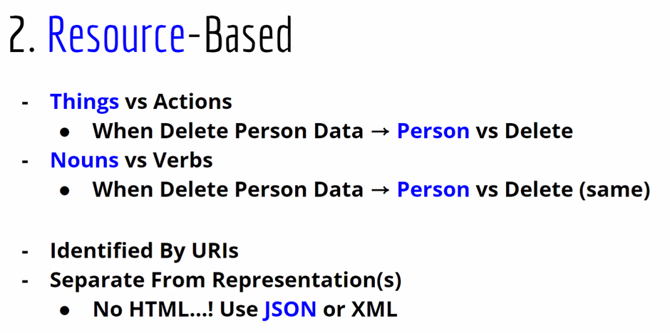
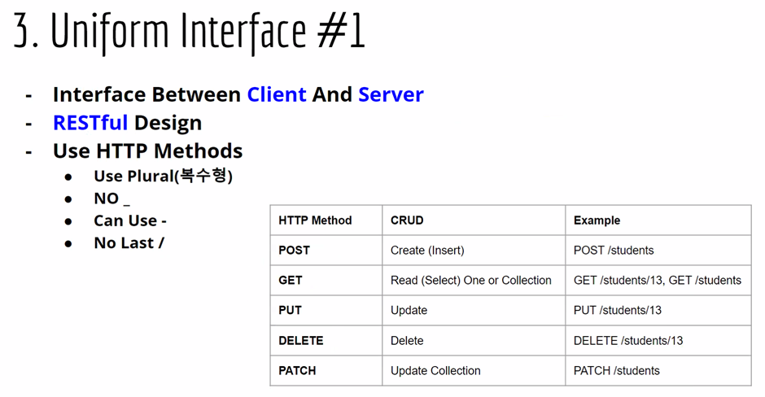
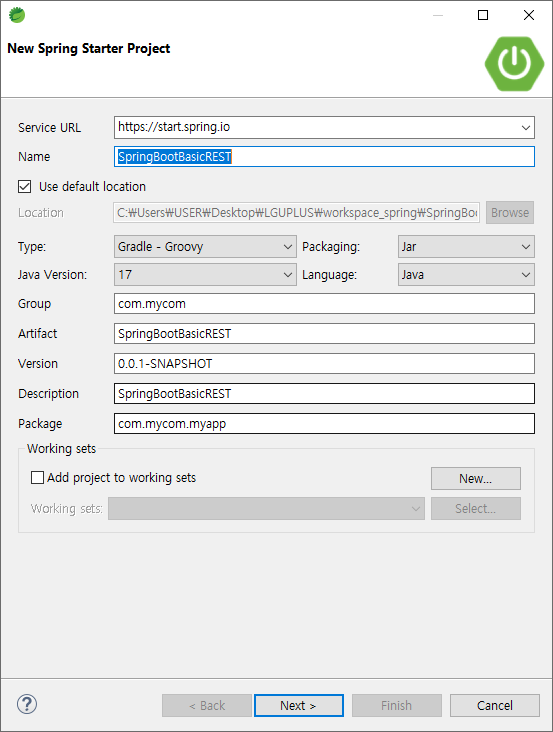
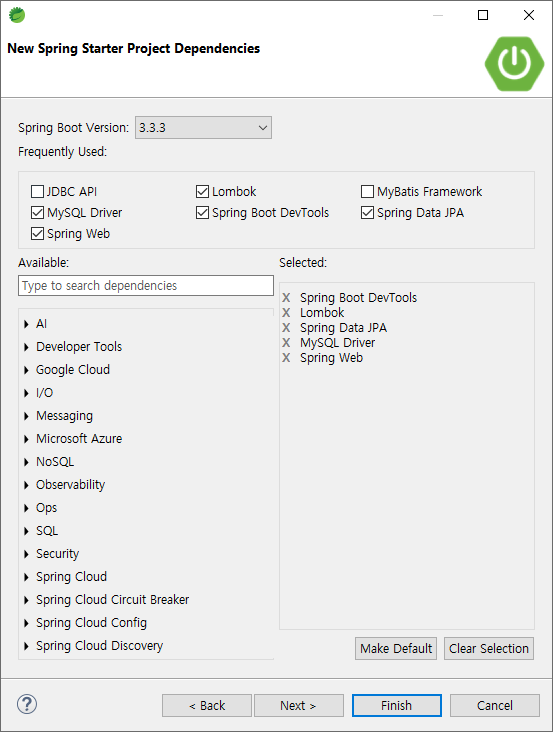
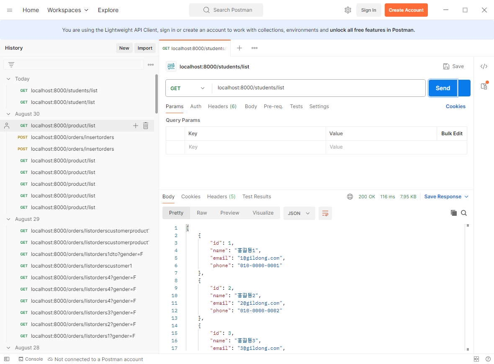
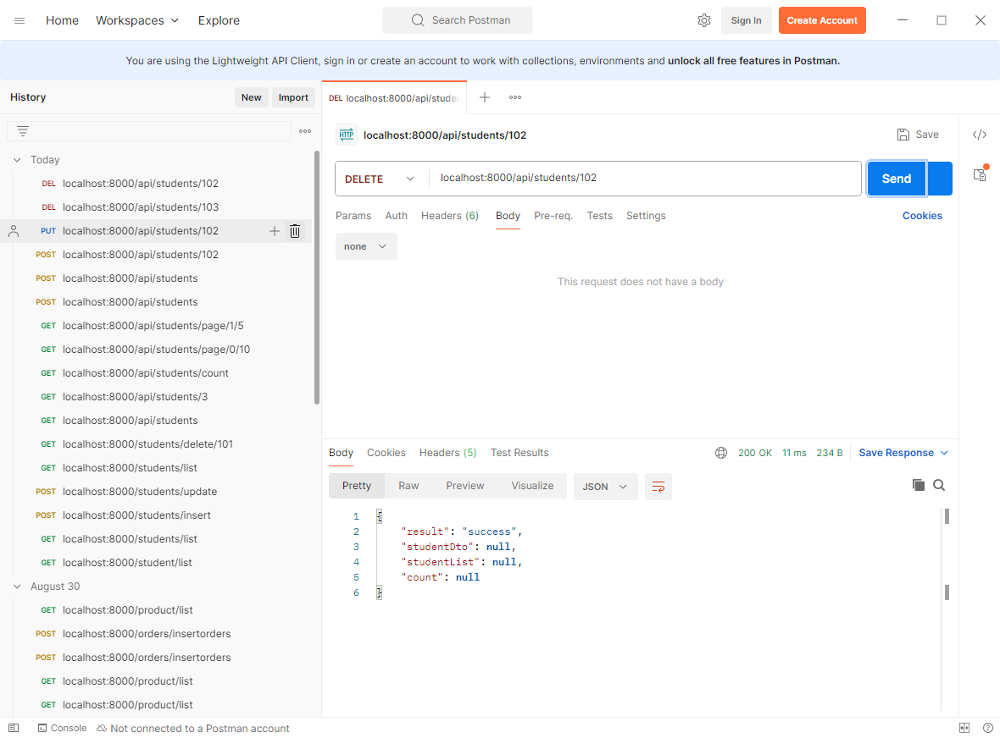
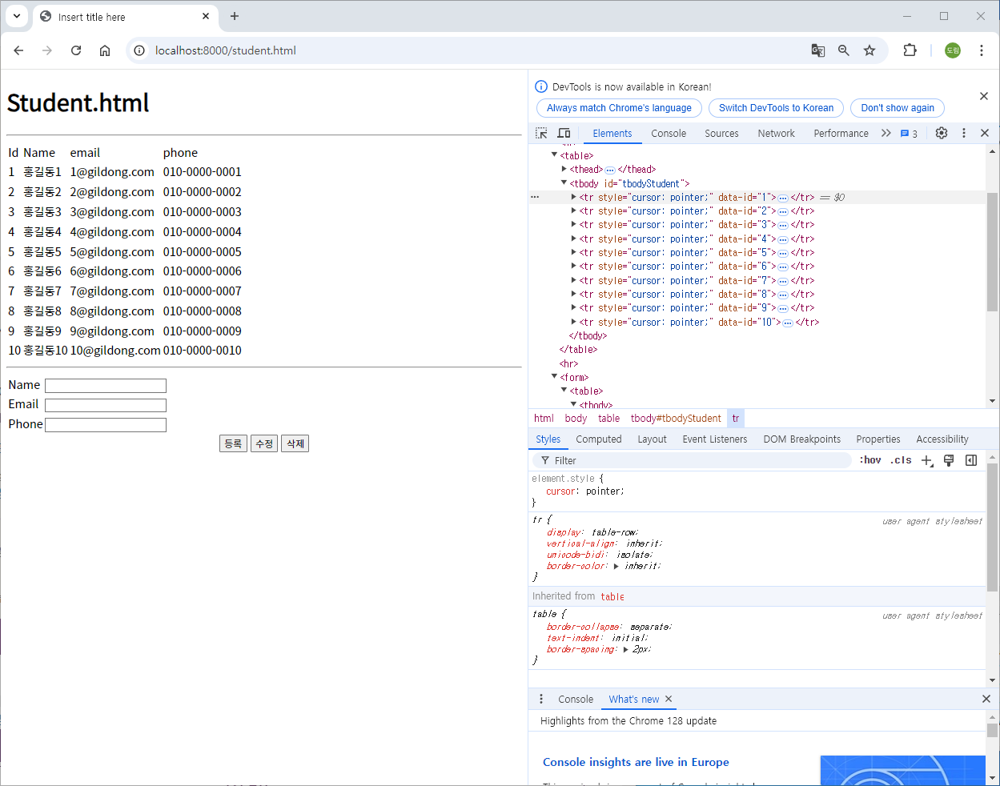
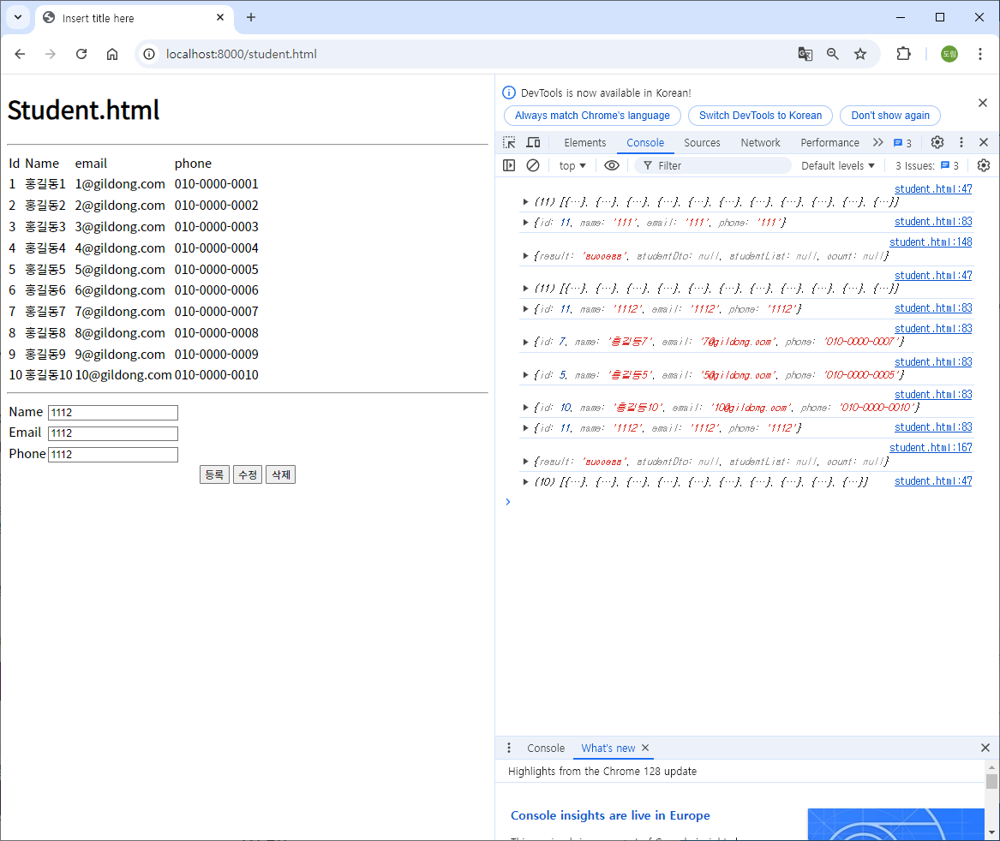
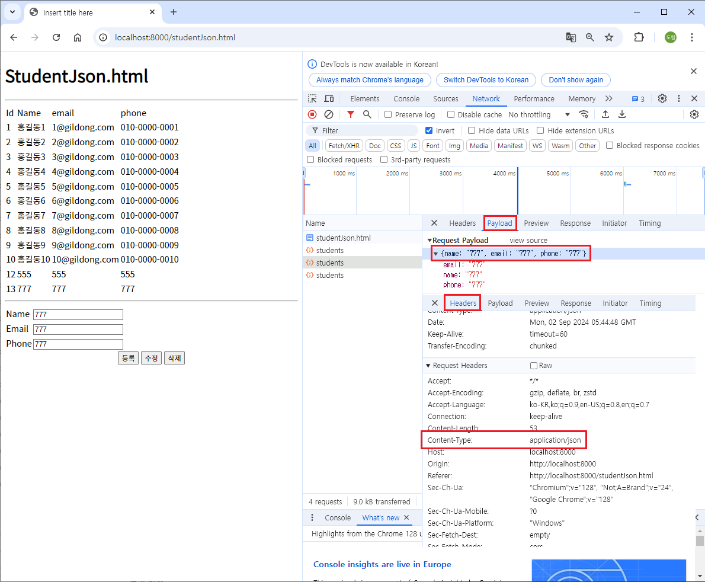

# [2024.09.02(월)] Rest API


# Rest API

## Rest API 이론





## Rest API 이론 실습

1. url-mapping
    
    
    | book | REST |
    | --- | --- |
    | get - listBook | get - /books |
    | get - dtailBook | get - /books/10 |
    | post - insertBook | post - /books |
    | post - updateBook | put - /books/10 |
    | get - deleteBook | delete - /books/10 |

2. request/response 모두 json
    - request/response 암호화

3. response를 단순 data 대신 http response를 제어
    - 응답코드 (status : 200, 404, 500...)
    - 응답 header custom value

## SpringBootBasicREST 프로젝트

### SpringBootBasicREST 프로젝트 생성





### SpringBootJpaBasicJpqlDto 프로젝트 설정

### application.properties

```java
spring.application.name=SpringBootBasicREST
server.port=8000

spring.datasource.url=jdbc:mysql://localhost:3306/basic_rest
spring.datasource.username=root
spring.datasource.password=root
spring.datasource.driver-class-name=com.mysql.cj.jdbc.Driver

spring.jpa.show-sql=true
```

### MySQL

- basic_rest 스키마 생성
- basic_rest 스키마에 테이블 및 데이터 입력 코드
    
    ```java
    drop table if exists student ;
    create table student (
      id int not null auto_increment,
      email varchar(200) default null,
      phone varchar(13) default '010-0000-0000',
      name varchar(255) default null,
      primary key (id)
    );
    insert into student values (1,'1@gildong.com','010-0000-0001','홍길동1');
    insert into student values (2,'2@gildong.com','010-0000-0002','홍길동2');
    insert into student values (3,'3@gildong.com','010-0000-0003','홍길동3');
    insert into student values (4,'4@gildong.com','010-0000-0004','홍길동4');
    insert into student values (5,'5@gildong.com','010-0000-0005','홍길동5');
    insert into student values (6,'6@gildong.com','010-0000-0006','홍길동6');
    insert into student values (7,'7@gildong.com','010-0000-0007','홍길동7');
    insert into student values (8,'8@gildong.com','010-0000-0008','홍길동8');
    insert into student values (9,'9@gildong.com','010-0000-0009','홍길동9');
    insert into student values (10,'10@gildong.com','010-0000-0010','홍길동10');
    insert into student values (11,'11@gildong.com','010-0000-0011','홍길동11');
    insert into student values (12,'12@gildong.com','010-0000-0012','홍길동12');
    insert into student values (13,'13@gildong.com','010-0000-0013','홍길동13');
    insert into student values (14,'14@gildong.com','010-0000-0014','홍길동14');
    insert into student values (15,'15@gildong.com','010-0000-0015','홍길동15');
    insert into student values (16,'16@gildong.com','010-0000-0016','홍길동16');
    insert into student values (17,'17@gildong.com','010-0000-0017','홍길동17');
    insert into student values (18,'18@gildong.com','010-0000-0018','홍길동18');
    insert into student values (19,'19@gildong.com','010-0000-0019','홍길동19');
    insert into student values (20,'20@gildong.com','010-0000-0020','홍길동20');
    insert into student values (21,'21@gildong.com','010-0000-0021','홍길동21');
    insert into student values (22,'22@gildong.com','010-0000-0022','홍길동22');
    insert into student values (23,'23@gildong.com','010-0000-0023','홍길동23');
    insert into student values (24,'24@gildong.com','010-0000-0024','홍길동24');
    insert into student values (25,'25@gildong.com','010-0000-0025','홍길동25');
    insert into student values (26,'26@gildong.com','010-0000-0026','홍길동26');
    insert into student values (27,'27@gildong.com','010-0000-0027','홍길동27');
    insert into student values (28,'28@gildong.com','010-0000-0028','홍길동28');
    insert into student values (29,'29@gildong.com','010-0000-0029','홍길동29');
    insert into student values (30,'30@gildong.com','010-0000-0030','홍길동30');
    insert into student values (31,'31@gildong.com','010-0000-0031','홍길동31');
    insert into student values (32,'32@gildong.com','010-0000-0032','홍길동32');
    insert into student values (33,'33@gildong.com','010-0000-0033','홍길동33');
    insert into student values (34,'34@gildong.com','010-0000-0034','홍길동34');
    insert into student values (35,'35@gildong.com','010-0000-0035','홍길동35');
    insert into student values (36,'36@gildong.com','010-0000-0036','홍길동36');
    insert into student values (37,'37@gildong.com','010-0000-0037','홍길동37');
    insert into student values (38,'38@gildong.com','010-0000-0038','홍길동38');
    insert into student values (39,'39@gildong.com','010-0000-0039','홍길동39');
    insert into student values (40,'40@gildong.com','010-0000-0040','홍길동40');
    insert into student values (41,'41@gildong.com','010-0000-0041','홍길동41');
    insert into student values (42,'42@gildong.com','010-0000-0042','홍길동42');
    insert into student values (43,'43@gildong.com','010-0000-0043','홍길동43');
    insert into student values (44,'44@gildong.com','010-0000-0044','홍길동44');
    insert into student values (45,'45@gildong.com','010-0000-0045','홍길동45');
    insert into student values (46,'46@gildong.com','010-0000-0046','홍길동46');
    insert into student values (47,'47@gildong.com','010-0000-0047','홍길동47');
    insert into student values (48,'48@gildong.com','010-0000-0048','홍길동48');
    insert into student values (49,'49@gildong.com','010-0000-0049','홍길동49');
    insert into student values (50,'50@gildong.com','010-0000-0050','홍길동50');
    insert into student values (51,'51@gildong.com','010-0000-0051','홍길동51');
    insert into student values (52,'52@gildong.com','010-0000-0052','홍길동52');
    insert into student values (53,'53@gildong.com','010-0000-0053','홍길동53');
    insert into student values (54,'54@gildong.com','010-0000-0054','홍길동54');
    insert into student values (55,'55@gildong.com','010-0000-0055','홍길동55');
    insert into student values (56,'56@gildong.com','010-0000-0056','홍길동56');
    insert into student values (57,'57@gildong.com','010-0000-0057','홍길동57');
    insert into student values (58,'58@gildong.com','010-0000-0058','홍길동58');
    insert into student values (59,'59@gildong.com','010-0000-0059','홍길동59');
    insert into student values (60,'60@gildong.com','010-0000-0060','홍길동60');
    insert into student values (61,'61@gildong.com','010-0000-0061','홍길동61');
    insert into student values (62,'62@gildong.com','010-0000-0062','홍길동62');
    insert into student values (63,'63@gildong.com','010-0000-0063','홍길동63');
    insert into student values (64,'64@gildong.com','010-0000-0064','홍길동64');
    insert into student values (65,'65@gildong.com','010-0000-0065','홍길동65');
    insert into student values (66,'66@gildong.com','010-0000-0066','홍길동66');
    insert into student values (67,'67@gildong.com','010-0000-0067','홍길동67');
    insert into student values (68,'68@gildong.com','010-0000-0068','홍길동68');
    insert into student values (69,'69@gildong.com','010-0000-0069','홍길동69');
    insert into student values (70,'70@gildong.com','010-0000-0070','홍길동70');
    insert into student values (71,'71@gildong.com','010-0000-0071','홍길동71');
    insert into student values (72,'72@gildong.com','010-0000-0072','홍길동72');
    insert into student values (73,'73@gildong.com','010-0000-0073','홍길동73');
    insert into student values (74,'74@gildong.com','010-0000-0074','홍길동74');
    insert into student values (75,'75@gildong.com','010-0000-0075','홍길동75');
    insert into student values (76,'76@gildong.com','010-0000-0076','홍길동76');
    insert into student values (77,'77@gildong.com','010-0000-0077','홍길동77');
    insert into student values (78,'78@gildong.com','010-0000-0078','홍길동78');
    insert into student values (79,'79@gildong.com','010-0000-0079','홍길동79');
    insert into student values (80,'80@gildong.com','010-0000-0080','홍길동80');
    insert into student values (81,'81@gildong.com','010-0000-0081','홍길동81');
    insert into student values (82,'82@gildong.com','010-0000-0082','홍길동82');
    insert into student values (83,'83@gildong.com','010-0000-0083','홍길동83');
    insert into student values (84,'84@gildong.com','010-0000-0084','홍길동84');
    insert into student values (85,'85@gildong.com','010-0000-0085','홍길동85');
    insert into student values (86,'86@gildong.com','010-0000-0086','홍길동86');
    insert into student values (87,'87@gildong.com','010-0000-0087','홍길동87');
    insert into student values (88,'88@gildong.com','010-0000-0088','홍길동88');
    insert into student values (89,'89@gildong.com','010-0000-0089','홍길동89');
    insert into student values (90,'90@gildong.com','010-0000-0090','홍길동90');
    insert into student values (91,'91@gildong.com','010-0000-0091','홍길동91');
    insert into student values (92,'92@gildong.com','010-0000-0092','홍길동92');
    insert into student values (93,'93@gildong.com','010-0000-0093','홍길동93');
    insert into student values (94,'94@gildong.com','010-0000-0094','홍길동94');
    insert into student values (95,'95@gildong.com','010-0000-0095','홍길동95');
    insert into student values (96,'96@gildong.com','010-0000-0096','홍길동96');
    insert into student values (97,'97@gildong.com','010-0000-0097','홍길동97');
    insert into student values (98,'98@gildong.com','010-0000-0098','홍길동98');
    insert into student values (99,'99@gildong.com','010-0000-0099','홍길동99');
    insert into student values (100,'100@gildong.com','010-0000-0100','홍길동100');
    ```
    

### src/main/java/com/mycom/myapp

- SpringBootJpaBasicCrudFind 프로젝트에서 controller, entity, repository, service 패키지 복사하여 붙여넣기

### 프로젝트 설정 실행 테스트




### restful API 사이트 : https://restfulapi.net/


### 로그인, 로그아웃을 REST API 로 작성한다면 method 와 url 을 어떻게 만드는 게 좋은 지 논의

`login`과 `logout` 요청은 REST API에서 각각 인증과 세션 관리를 담당하는 중요한 부분입니다. 이들 요청은 일반적으로 다음과 같은 HTTP 메서드를 사용하여 구현됩니다:

### 1. **Login 요청 (로그인)**

- **HTTP 메서드:** `POST`
- **URL 예시:** `/api/login` 또는 `/auth/login`
- **설명:**
    - 로그인 요청은 사용자 인증을 처리하는 과정입니다.
    - 클라이언트가 서버에 사용자 자격 증명(예: 이메일, 비밀번호 등)을 전송하고, 서버는 이를 확인한 후 인증 토큰(JWT 등)을 반환합니다.
    - `POST` 메서드를 사용하는 이유는 자격 증명 데이터를 안전하게 서버로 전송하고, 서버에서 상태 변경(세션 생성, 토큰 발행 등)이 일어나기 때문입니다.

### 2. **Logout 요청 (로그아웃)**

- **HTTP 메서드:** `POST` (주로 사용됨) 또는 `DELETE`
- **URL 예시:** `/api/logout` 또는 `/auth/logout`
- **설명:**
    - 로그아웃 요청은 서버 측에서 세션을 무효화하거나 클라이언트에서 인증 토큰을 삭제하는 과정을 처리합니다.
    - **`POST` 메서드 사용:**
        - 세션을 종료하는 액션을 서버에 요청하는 경우에 사용됩니다.
        - 예를 들어 서버에서 로그아웃 시 서버의 상태가 변경될 때 `POST`를 사용합니다.
    - **`DELETE` 메서드 사용:**
        - 클라이언트가 서버에 세션 삭제를 요청하는 의미로 사용될 수 있지만, 보안적인 이유로 `POST`가 더 일반적입니다.

### 요약

- **Login:** `POST /api/login` - 사용자 인증 및 세션/토큰 생성.
- **Logout:** `POST /api/logout` 또는 `DELETE /api/logout` - 세션 무효화 및 토큰 삭제 요청.

### SpringBootJpaBasicJpqlDto 프로젝트 코드

### CRUD Rest API로 변경

### src/main/java

### dto

### StudentDto.java

```java
package com.mycom.myapp.dto;

import lombok.Data;

@Data
public class StudentDto {
	
	private int id;
	private String name;
	private String email;
	private String phone;

}
```

### StudentResultDto.java

```java
package com.mycom.myapp.dto;

import java.util.List;

import lombok.Data;

@Data
public class StudentResultDto {
	private String result;
	private StudentDto studentDto;
	private List<StudentDto> studentList;
	private Long count;
}
```

### service

### StudentServiceCrud.java

```java
package com.mycom.myapp.service;

import com.mycom.myapp.dto.StudentResultDto;
import com.mycom.myapp.entity.Student;

public interface StudentServiceCrud {
	
	StudentResultDto listStudent();  // 목록
	StudentResultDto countStudent();  // 전체 건 수
	StudentResultDto detailStudent(int id);  // 상세 (table에서 찾지 못하는 경우 대응)
	StudentResultDto listStudent(int pageNumber, int pageSize);
	
	StudentResultDto insertStudent(Student student);  // 등록
	StudentResultDto updateStudent(Student student);  // 수정
	StudentResultDto deleteStudent(int id);  // 삭제

}
```

### StudentServiceCrudImpl.java

```java
package com.mycom.myapp.service;

import java.util.ArrayList;
import java.util.List;
import java.util.Optional;

import org.springframework.data.domain.Page;
import org.springframework.data.domain.PageRequest;
import org.springframework.data.domain.Pageable;
import org.springframework.stereotype.Service;

import com.mycom.myapp.dto.StudentDto;
import com.mycom.myapp.dto.StudentResultDto;
import com.mycom.myapp.entity.Student;
import com.mycom.myapp.repository.StudentRepository;

import lombok.RequiredArgsConstructor;

@Service
@RequiredArgsConstructor
public class StudentServiceCrudImpl implements StudentServiceCrud {

	private final StudentRepository studentRepository;
	
	@Override
	public StudentResultDto listStudent() {
		StudentResultDto studentResultDto = new StudentResultDto();
		List<Student> studentList = studentRepository.findAll();
		
		List<StudentDto> studentDtoList = new ArrayList<>();
		studentList.forEach( student -> {
			StudentDto studentDto = new StudentDto();
			studentDto.setId(student.getId());
			studentDto.setName(student.getName());
			studentDto.setEmail(student.getEmail());
			studentDto.setPhone(student.getPhone());
			studentDtoList.add(studentDto);
		});
		
		studentResultDto.setStudentList(studentDtoList);
		studentResultDto.setResult("success");
		return studentResultDto;
	}

	@Override
	public StudentResultDto countStudent() {
		StudentResultDto studentResultDto = new StudentResultDto();
		Long count = studentRepository.count();
		
		studentResultDto.setCount(count);
		studentResultDto.setResult("success");
		return studentResultDto;
	}

	@Override
	public StudentResultDto detailStudent(int id) {
		StudentResultDto studentResultDto = new StudentResultDto();
		Optional<Student> optionalStudent = studentRepository.findById(id);
		
		optionalStudent.ifPresentOrElse( 
				student -> {
					StudentDto studentDto = new StudentDto();
					studentDto.setId(student.getId());
					studentDto.setName(student.getName());
					studentDto.setEmail(student.getEmail());
					studentDto.setPhone(student.getPhone());
					
					studentResultDto.setStudentDto(studentDto);
					studentResultDto.setResult("success");
				}, 
				() -> {
					studentResultDto.setResult("fail");
				} );
		
		return studentResultDto;
	}

	@Override
	public StudentResultDto insertStudent(Student student) {
		StudentResultDto studentResultDto = new StudentResultDto();
		try {
			studentRepository.save(student);
			studentResultDto.setResult("success");
		} catch (Exception e) {
			e.printStackTrace();
			studentResultDto.setResult("fail");
		}
		
		return studentResultDto;
	}

	@Override
	public StudentResultDto updateStudent(Student student) {
		StudentResultDto studentResultDto = new StudentResultDto();
		try {
			studentRepository.save(student);
			studentResultDto.setResult("success");
		} catch (Exception e) {
			e.printStackTrace();
			studentResultDto.setResult("fail");
		}
		
		return studentResultDto;
	}

	@Override
	public StudentResultDto deleteStudent(int id) {
		StudentResultDto studentResultDto = new StudentResultDto();
		try {
			studentRepository.deleteById(id);
			studentResultDto.setResult("success");
		} catch (Exception e) {
			e.printStackTrace();
			studentResultDto.setResult("fail");
		}
		
		return studentResultDto;
	}

	@Override
	public StudentResultDto listStudent(int pageNumber, int pageSize) {
		StudentResultDto studentResultDto = new StudentResultDto();
		Pageable pageable = PageRequest.of(pageNumber, pageSize);
		Page<Student> page = studentRepository.findAll(pageable);
		
		List<Student> studentList = page.toList();
		
		List<StudentDto> studentDtoList = new ArrayList<>();
		studentList.forEach( student -> {
			StudentDto studentDto = new StudentDto();
			studentDto.setId(student.getId());
			studentDto.setName(student.getName());
			studentDto.setEmail(student.getEmail());
			studentDto.setPhone(student.getPhone());
			studentDtoList.add(studentDto);
		});
		
		studentResultDto.setStudentList(studentDtoList);
		studentResultDto.setResult("success");
		return studentResultDto;
	}

}
```

### controller/StudentControllerCrud.java

```java
package com.mycom.myapp.controller;

import org.springframework.stereotype.Controller;
import org.springframework.web.bind.annotation.DeleteMapping;
import org.springframework.web.bind.annotation.GetMapping;
import org.springframework.web.bind.annotation.PathVariable;
import org.springframework.web.bind.annotation.PostMapping;
import org.springframework.web.bind.annotation.PutMapping;
import org.springframework.web.bind.annotation.RequestMapping;
import org.springframework.web.bind.annotation.RequestParam;
import org.springframework.web.bind.annotation.ResponseBody;
import org.springframework.web.bind.annotation.RestController;

import com.mycom.myapp.dto.StudentDto;
import com.mycom.myapp.dto.StudentResultDto;
import com.mycom.myapp.entity.Student;
import com.mycom.myapp.service.StudentServiceCrud;

import lombok.RequiredArgsConstructor;

// 1. request, response 에 StudentDto, StudentResultDto 사용

@RestController  // @Controller + @ResponseBody
@RequestMapping("/api")
@RequiredArgsConstructor
public class StudentControllerCrud {

	private final StudentServiceCrud studentServiceCrud;
	
	@GetMapping("/students")
	public StudentResultDto listStudent() {
		return studentServiceCrud.listStudent();
	}
	
	@GetMapping("/students/{id}")
	public StudentResultDto detailStudent(@PathVariable("id") int id) {
		return studentServiceCrud.detailStudent(id);
	}
	
	@GetMapping("/students/count")
	public StudentResultDto countStudent() {
		return studentServiceCrud.countStudent();
	}
	
	@GetMapping("/students/page/{pageNumber}/{pageSize}")
	public StudentResultDto listStudent(@PathVariable("pageNumber") int pageNumber, @PathVariable("pageSize") int pageSize) {
		return studentServiceCrud.listStudent(pageNumber, pageSize);
	}
	
	@PostMapping("/students")
	public StudentResultDto insertStudent(StudentDto studentDto) {  
		Student student = new Student();
		student.setName(studentDto.getName());
		student.setEmail(studentDto.getEmail());
		student.setPhone(studentDto.getPhone());
		return studentServiceCrud.insertStudent(student);
	}
	
	@PutMapping("/students/{id}")
	public StudentResultDto updateStudent(@PathVariable("id") int id, StudentDto studentDto) {  
		Student student = new Student();
//		student.setId(studentDto.getId()); // id가 없으면 insert 처리된다.
		student.setId(id);
		student.setName(studentDto.getName());
		student.setEmail(studentDto.getEmail());
		student.setPhone(studentDto.getPhone());
		return studentServiceCrud.updateStudent(student);
	}
	
	@DeleteMapping("/delete/{id}")
	public StudentResultDto deleteStudent(@PathVariable("id") int id) {  
		return studentServiceCrud.deleteStudent(id);
	}
	
}
```

### 실행 결과



### 멀티파트는 putmapping을 사용하기 어려운 이유

`PUT` 메서드는 RESTful API에서 자원의 전체 업데이트를 의미하며, 멱등성을 보장해야 합니다. 멀티파트 요청을 `PUT`과 함께 사용하기 어려운 이유는 주로 HTTP 프로토콜의 특성과 `PUT` 메서드의 의미에 기인합니다. 다음은 그 이유에 대한 자세한 설명입니다.

### 1. **PUT의 멱등성 요구사항**

- *멱등성(Idempotency)**은 같은 요청을 여러 번 수행해도 결과가 변하지 않는 것을 의미합니다.
- `PUT`은 자원의 전체를 교체(replace)하는 작업을 수행하는데, 파일 업로드와 같은 멀티파트 요청에서는 이러한 멱등성을 보장하기 어렵습니다. 파일 업로드는 요청을 다시 보낼 때마다 새로운 파일이 생성되거나 변경될 수 있어, 멱등성을 유지할 수 없습니다.

### 2. **PUT의 사용 의도와 멀티파트**

- `PUT` 메서드는 자원을 완전히 교체(replace)하는 데 사용되며, 이때 자원은 URI가 지정한 대상을 가리킵니다.
- 멀티파트 요청은 일반적으로 파일이나 폼 데이터를 업로드하는 데 사용되며, 데이터가 여러 부분으로 나뉘어 전달됩니다.
- `PUT`은 자원의 전체를 교체하는 데 집중하고 있으므로, 멀티파트 데이터의 부분적 또는 특정 부분만 수정하는 것과는 개념적으로 잘 맞지 않습니다.

### 3. **HTTP 스펙과 멀티파트 데이터의 호환성 문제**

- 멀티파트 요청은 `POST` 메서드와 더 잘 어울립니다. `POST`는 자원을 생성하거나 서버에 데이터를 보낼 때 사용되며, 데이터의 형태나 전송 방식에 제한이 적습니다.
- `PUT`은 HTTP 스펙에서 명확한 컨텐츠 구조를 요구하는데, 멀티파트는 복잡한 구조의 데이터 전송을 위해 설계되어 있어 `PUT`과 함께 사용할 때 이 구조적 요구사항과 충돌할 수 있습니다.

### 4. **RESTful 설계 원칙과의 부조화**

- `PUT`은 기존 자원을 전부 교체하는데, 멀티파트를 사용하면 자원의 특정 부분(예: 파일만)을 교체하려는 경우가 많습니다.
- RESTful 설계에서는 이러한 부분적인 데이터 수정을 위해 `PATCH` 메서드를 사용하는 것이 권장됩니다. `PATCH`는 자원의 일부를 수정하는 데 더 적합하며, 멀티파트 요청과 함께 사용할 때도 의미상 적절합니다.

### **정리**

- `PUT` 메서드는 멱등성을 보장해야 하지만, 멀티파트 요청은 파일 업로드 등의 비멱등적 작업을 포함할 수 있어 충돌이 발생합니다.
- `POST`나 `PATCH` 메서드가 멀티파트 요청과 더 적합하며, RESTful 설계 원칙에도 잘 맞습니다. `PATCH`는 부분 업데이트에, `POST`는 새로운 자원 생성이나 데이터 전송에 사용되는 것이 일반적입니다.

### student.html 생성하여 student 목록 출력

### src/main/resources/static/student.html

```java
<!DOCTYPE html>
<html>
<head>
<meta charset="UTF-8">
<title>Insert title here</title>
</head>
<body>
	<h1>Student.html</h1>
    <hr>
    <table>
        <thead>
            <tr><td>Id</td><td>Name</td><td>email</td><td>phone</td></tr>
        </thead>
        <tbody id="tbodyStudent"></tbody>
    </table>
    <hr>
    <form>
        <table>
            <tbody>
                <tr><td>Name</td><td><input type="text" name="name" id="inputName"></td></tr>
                <tr><td>Email</td><td><input type="text" name="email" id="inputEmail"></td></tr>
                <tr><td>Phone</td><td><input type="text" name="phone" id="inputPhone"></td></tr>
            </tbody>
        </table>
    </form>
    <div style="border: 1px; margin: auto; text-align: center">
        <button id="btnInsert">등록</button>
        <button id="btnUpdate">수정</button>
        <button id="btnDelete">삭제</button>
    </div>
    
    <script>
    	window.onload = function() {
    		listStudent();
    		
//     		document.quertySelector("#btnInsert").onclick = insertStudent;
//     		document.quertySelector("#btnUpdate").onclick = updateStudent;
//     		document.quertySelector("#btnDelete").onclick = deleteStudent;
    	}
    	
    	async function listStudent() {
    		let url = "/api/students";
    		
    		try {
    			let response = await fetch(url);
				let {studentList} = await response.json();
				console.log(studentList);
				makeListHtml(studentList);
    		} catch(error) {
    			alert("학생 조회 과정 중 오류가 발생하였습니다.");
    			console.log(error);
    		}
    	}
    	
    	function makeListHtml(list){
            let listHtml = ``;
            list.forEach( el => {
                let id = el.id;
                let name = el.name;
                let email = el.email;
                let phone = el.phone;
                
                listHtml += `<tr style="cursor: pointer;" data-id=${id}><td>${id}</td><td>${name}</td><td>${email}</td><td>${phone}</td></tr>`;
            });
            
            document.querySelector("#tbodyStudent").innerHTML = listHtml;
            
            document.querySelectorAll("#tbodyStudent tr").forEach( el => {
                el.onclick = function(){
                    let id = this.getAttribute("data-id");
                    detailStudent(id);
                }
            });
        }
    	
    </script>
    
</body>
</html>
```

### 실행 결과



### student.html - insert, update, delete 기능

### src/main/resources/static/student.html

```java
<!DOCTYPE html>
<html>
<head>
<meta charset="UTF-8">
<title>Insert title here</title>
</head>
<body>
	<h1>Student.html</h1>
    <hr>
    <table>
        <thead>
            <tr><td>Id</td><td>Name</td><td>email</td><td>phone</td></tr>
        </thead>
        <tbody id="tbodyStudent"></tbody>
    </table>
    <hr>
    <form>
        <table>
            <tbody>
                <tr><td>Name</td><td><input type="text" name="name" id="inputName"></td></tr>
                <tr><td>Email</td><td><input type="text" name="email" id="inputEmail"></td></tr>
                <tr><td>Phone</td><td><input type="text" name="phone" id="inputPhone"></td></tr>
            </tbody>
        </table>
    </form>
    <div style="border: 1px; margin: auto; text-align: center">
        <button id="btnInsert">등록</button>
        <button id="btnUpdate">수정</button>
        <button id="btnDelete">삭제</button>
    </div>
    
    <script>
    	window.onload = function() {
    		listStudent();
    		
    		document.querySelector("#btnInsert").onclick = insertStudent;
    		document.querySelector("#btnUpdate").onclick = updateStudent;
    		document.querySelector("#btnDelete").onclick = deleteStudent;
    	}
    	
    	async function listStudent() {
    		let url = "/api/students";
    		
    		try {
    			let response = await fetch(url);
				let {studentList} = await response.json();
				console.log(studentList);
				makeListHtml(studentList);
    		} catch(error) {
    			alert("학생 조회 과정 중 오류가 발생하였습니다.");
    			console.log(error);
    		}
    	}
    	
    	function makeListHtml(list){
            let listHtml = ``;
            list.forEach( el => {
                let id = el.id;
                let name = el.name;
                let email = el.email;
                let phone = el.phone;
                
                listHtml += `<tr style="cursor: pointer;" data-id=${id}><td>${id}</td><td>${name}</td><td>${email}</td><td>${phone}</td></tr>`;
            });
            
            document.querySelector("#tbodyStudent").innerHTML = listHtml;
            
            document.querySelectorAll("#tbodyStudent tr").forEach( el => {
                el.onclick = function(){
                    let id = this.getAttribute("data-id");
                    detailStudent(id);
                }
            });
        }
    	
    	async function detailStudent(id) {
    		let url = "/api/students/" + id;
//     		let url = `/api/students/${id}`;
    		
    		try {
    			let response = await fetch(url);
				let {studentDto} = await response.json();
				console.log(studentDto);
				makeDetailHtml(studentDto);
    		} catch(error) {
    			alert("학생 상세 조회 과정 중 오류가 발생하였습니다.");
    			console.log(error);
    		}
    	}
    	
    	let CURRENT_ID;
    	
    	function makeDetailHtml(student) {
    		CURRENT_ID = student.id;
    		document.querySelector("#inputName").value = student.name;
    		document.querySelector("#inputEmail").value = student.email;
    		document.querySelector("#inputPhone").value = student.phone;
    	}
    	
    	async function insertStudent(){
            let url = "/api/students";
            
            let name = document.querySelector("#inputName").value;
            let email = document.querySelector("#inputEmail").value;
            let phone = document.querySelector("#inputPhone").value;
            
            let urlParams = new URLSearchParams({
                name, email, phone
            });
            
            let fetchOptions = {
                method: "POST",
                body: urlParams
            }
            
            try{
                let response = await fetch(url, fetchOptions);
                let data = await response.json();
                console.log(data);
                
                listStudent();
            }catch(error){
                alert("학생 등록 과정 중 오류가 발생했습니다.");
                console.log(error)
            }
        }
    	
    	async function updateStudent(){
            let url = "/api/students/" + CURRENT_ID;
            
            let id = CURRENT_ID;
            let name = document.querySelector("#inputName").value;
            let email = document.querySelector("#inputEmail").value;
            let phone = document.querySelector("#inputPhone").value;
            
            let urlParams = new URLSearchParams({
                id, name, email, phone
            });
            
            let fetchOptions = {
                method: "PUT",
                body: urlParams
            }
            
            try{
                let response = await fetch(url, fetchOptions);
                let data = await response.json();
                console.log(data);
                
                listStudent();
            }catch(error){
                alert("학생 수정 과정 중 오류가 발생했습니다.");
                console.log(error)
            }
        }
    	
    	async function deleteStudent(){
            let url = "/api/students/" + CURRENT_ID;
            
            let fetchOptions = {
                method: "DELETE",
            }
            
            try{
                let response = await fetch(url, fetchOptions);
                let data = await response.json();
                console.log(data);
                
                listStudent();
            }catch(error){
                alert("학생 삭제 과정 중 오류가 발생했습니다.");
                console.log(error)
            }
        }
    	
    </script>
    
</body>
</html>
```

### 실행 결과



### request도 JSON으로 받기

### src/main/java/controller/StudentControllerCrudJsonRequest.java

- 파라미터에 @RequestBody를 사용하면 json 데이터가 넘어오는 것을 명시

```java
package com.mycom.myapp.controller;

import org.springframework.stereotype.Controller;
import org.springframework.web.bind.annotation.DeleteMapping;
import org.springframework.web.bind.annotation.GetMapping;
import org.springframework.web.bind.annotation.PathVariable;
import org.springframework.web.bind.annotation.PostMapping;
import org.springframework.web.bind.annotation.PutMapping;
import org.springframework.web.bind.annotation.RequestBody;
import org.springframework.web.bind.annotation.RequestMapping;
import org.springframework.web.bind.annotation.RequestParam;
import org.springframework.web.bind.annotation.ResponseBody;
import org.springframework.web.bind.annotation.RestController;

import com.mycom.myapp.dto.StudentDto;
import com.mycom.myapp.dto.StudentResultDto;
import com.mycom.myapp.entity.Student;
import com.mycom.myapp.service.StudentServiceCrud;

import lombok.RequiredArgsConstructor;

// 1. controller request mapping /api/json으로 변경
// 2. StudentDto 가 json 으로 전송되므로 그것을 처리하기 위한 annotation @RequestBody 적용

@RestController  // @Controller + @ResponseBody
@RequestMapping("/api/json")
@RequiredArgsConstructor
public class StudentControllerCrudJsonRequest {

	private final StudentServiceCrud studentServiceCrud;
	
	@GetMapping("/students")
	public StudentResultDto listStudent() {
		return studentServiceCrud.listStudent();
	}
	
	@GetMapping("/students/{id}")
	public StudentResultDto detailStudent(@PathVariable("id") int id) {
		return studentServiceCrud.detailStudent(id);
	}
	
	@GetMapping("/students/count")
	public StudentResultDto countStudent() {
		return studentServiceCrud.countStudent();
	}
	
	@GetMapping("/students/page/{pageNumber}/{pageSize}")
	public StudentResultDto listStudent(@PathVariable("pageNumber") int pageNumber, @PathVariable("pageSize") int pageSize) {
		return studentServiceCrud.listStudent(pageNumber, pageSize);
	}
	
	@PostMapping("/students")
	public StudentResultDto insertStudent(@RequestBody StudentDto studentDto) {  // @RequestBody를 사용하면 json 데이터가 넘어오는 것을 명시
		Student student = new Student();
		student.setName(studentDto.getName());
		student.setEmail(studentDto.getEmail());
		student.setPhone(studentDto.getPhone());
		return studentServiceCrud.insertStudent(student);
	}
	
	@PutMapping("/students/{id}")
	public StudentResultDto updateStudent(@PathVariable("id") int id, @RequestBody StudentDto studentDto) {  
		Student student = new Student();
//		student.setId(studentDto.getId()); // id가 없으면 insert 처리된다.
		student.setId(id);
		student.setName(studentDto.getName());
		student.setEmail(studentDto.getEmail());
		student.setPhone(studentDto.getPhone());
		return studentServiceCrud.updateStudent(student);
	}
	
	@DeleteMapping("/students/{id}")
	public StudentResultDto deleteStudent(@PathVariable("id") int id) {  
		return studentServiceCrud.deleteStudent(id);
	}
	
}
```

### src/main/resources/static/studentJson.html

```java
<!DOCTYPE html>
<html>
<head>
<meta charset="UTF-8">
<title>Insert title here</title>
</head>
<body>
	<h1>StudentJson.html</h1>
    <hr>
    <table>
        <thead>
            <tr><td>Id</td><td>Name</td><td>email</td><td>phone</td></tr>
        </thead>
        <tbody id="tbodyStudent"></tbody>
    </table>
    <hr>
    <form>
        <table>
            <tbody>
                <tr><td>Name</td><td><input type="text" name="name" id="inputName"></td></tr>
                <tr><td>Email</td><td><input type="text" name="email" id="inputEmail"></td></tr>
                <tr><td>Phone</td><td><input type="text" name="phone" id="inputPhone"></td></tr>
            </tbody>
        </table>
    </form>
    <div style="border: 1px; margin: auto; text-align: center">
        <button id="btnInsert">등록</button>
        <button id="btnUpdate">수정</button>
        <button id="btnDelete">삭제</button>
    </div>
    
    <script>
    	window.onload = function() {
    		listStudent();
    		
    		document.querySelector("#btnInsert").onclick = insertStudent;
    		document.querySelector("#btnUpdate").onclick = updateStudent;
    		document.querySelector("#btnDelete").onclick = deleteStudent;
    	}
    	
    	async function listStudent() {
    		let url = "/api/json/students";
    		
    		try {
    			let response = await fetch(url);
				let {studentList} = await response.json();
				console.log(studentList);
				makeListHtml(studentList);
    		} catch(error) {
    			alert("학생 조회 과정 중 오류가 발생하였습니다.");
    			console.log(error);
    		}
    	}
    	
    	function makeListHtml(list){
            let listHtml = ``;
            list.forEach( el => {
                let id = el.id;
                let name = el.name;
                let email = el.email;
                let phone = el.phone;
                
                listHtml += `<tr style="cursor: pointer;" data-id=${id}><td>${id}</td><td>${name}</td><td>${email}</td><td>${phone}</td></tr>`;
            });
            
            document.querySelector("#tbodyStudent").innerHTML = listHtml;
            
            document.querySelectorAll("#tbodyStudent tr").forEach( el => {
                el.onclick = function(){
                    let id = this.getAttribute("data-id");
                    detailStudent(id);
                }
            });
        }
    	
    	async function detailStudent(id) {
    		let url = "/api/json/students/" + id;
//     		let url = `/api/json/students/${id}`;
    		
    		try {
    			let response = await fetch(url);
				let {studentDto} = await response.json();
				console.log(studentDto);
				makeDetailHtml(studentDto);
    		} catch(error) {
    			alert("학생 상세 조회 과정 중 오류가 발생하였습니다.");
    			console.log(error);
    		}
    	}
    	
    	let CURRENT_ID;
    	
    	function makeDetailHtml(student) {
    		CURRENT_ID = student.id;
    		document.querySelector("#inputName").value = student.name;
    		document.querySelector("#inputEmail").value = student.email;
    		document.querySelector("#inputPhone").value = student.phone;
    	}
    	
    	async function insertStudent(){
            let url = "/api/json/students";
            
            let name = document.querySelector("#inputName").value;
            let email = document.querySelector("#inputEmail").value;
            let phone = document.querySelector("#inputPhone").value;
            
            // www.url-encoded 표준 방식의 파라미터 처리
//             let urlParams = new URLSearchParams({
//                 name, email, phone
//             });
            
            let jsonParams = JSON.stringify( { name, email, phone } );  // json 문자열
            
            // json으로 보낸다고 헤더 정보 명시
            let fetchOptions = {
                method: "POST",
                headers : {
                	"Content-Type" : "application/json"
                },
                body: jsonParams
            }
            
            try{
                let response = await fetch(url, fetchOptions);
                let data = await response.json();
                console.log(data);
                
                listStudent();
            }catch(error){
                alert("학생 등록 과정 중 오류가 발생했습니다.");
                console.log(error)
            }
        }
    	
    	async function updateStudent(){
            let url = "/api/json/students/" + CURRENT_ID;
            
            let id = CURRENT_ID;
            let name = document.querySelector("#inputName").value;
            let email = document.querySelector("#inputEmail").value;
            let phone = document.querySelector("#inputPhone").value;
            
            let jsonParams = JSON.stringify( { id, name, email, phone } );
            
            let fetchOptions = {
                method: "PUT",
                headers : {
                    "Content-Type" : "application/json"
                },
                body: jsonParams
            }
            
            try{
                let response = await fetch(url, fetchOptions);
                let data = await response.json();
                console.log(data);
                
                listStudent();
            }catch(error){
                alert("학생 수정 과정 중 오류가 발생했습니다.");
                console.log(error)
            }
        }
    	
    	async function deleteStudent(){
            let url = "/api/json/students/" + CURRENT_ID;
            
            let fetchOptions = {
                method: "DELETE",
            }
            
            try{
                let response = await fetch(url, fetchOptions);
                let data = await response.json();
                console.log(data);
                
                listStudent();
            }catch(error){
                alert("학생 삭제 과정 중 오류가 발생했습니다.");
                console.log(error)
            }
        }
    	
    </script>
    
</body>
</html>
```

### 실행 결과



### ResponseEntity로 http response를 제어

### HttpStatus Code를 변경하여 전달하는 방법 - status code에 따라 html에서 비관적 대응 코드 작성(listStudent)

### src/main/java/controller/StudentControllerCrudJsonRequestResponseEntity.java

```java
package com.mycom.myapp.controller;

import org.springframework.http.HttpStatus;
import org.springframework.http.ResponseEntity;
import org.springframework.web.bind.annotation.DeleteMapping;
import org.springframework.web.bind.annotation.GetMapping;
import org.springframework.web.bind.annotation.PathVariable;
import org.springframework.web.bind.annotation.PostMapping;
import org.springframework.web.bind.annotation.PutMapping;
import org.springframework.web.bind.annotation.RequestBody;
import org.springframework.web.bind.annotation.RequestMapping;
import org.springframework.web.bind.annotation.RestController;

import com.mycom.myapp.dto.StudentDto;
import com.mycom.myapp.dto.StudentResultDto;
import com.mycom.myapp.entity.Student;
import com.mycom.myapp.service.StudentServiceCrud;

import lombok.RequiredArgsConstructor;

// 1. controller request mapping /api/json으로 변경
// 2. StudentDto 가 json 으로 전송되므로 그것을 처리하기 위한 annotation @RequestBody 적용

@RestController  // @Controller + @ResponseBody
@RequestMapping("/api/json/re")
@RequiredArgsConstructor
public class StudentControllerCrudJsonRequestResponseEntity {

	private final StudentServiceCrud studentServiceCrud;
	
	@GetMapping("/students")
	public ResponseEntity<StudentResultDto> listStudent() {
		StudentResultDto studentResultDto = studentServiceCrud.listStudent();
		
		// ResponseEntity 객체를 이용해서 client에 요청처리 결과를 전송할 경우, 비정상적인 상황은 body에 정상적인 데이터를 채우면 안된다.
//		return new ResponseEntity<StudentResultDto>(studentResultDto, HttpStatus.OK);  // 200
		return new ResponseEntity<StudentResultDto>(studentResultDto, HttpStatus.NOT_FOUND);  // 404
//		return new ResponseEntity<>(null, HttpStatus.NOT_FOUND);  // 404
//		return new ResponseEntity<StudentResultDto>(studentResultDto, HttpStatus.INTERNAL_SERVER_ERROR);  // 500
	}
	
	@GetMapping("/students/{id}")
	public StudentResultDto detailStudent(@PathVariable("id") int id) {
		return studentServiceCrud.detailStudent(id);
	}
	
	@GetMapping("/students/count")
	public StudentResultDto countStudent() {
		return studentServiceCrud.countStudent();
	}
	
	@GetMapping("/students/page/{pageNumber}/{pageSize}")
	public StudentResultDto listStudent(@PathVariable("pageNumber") int pageNumber, @PathVariable("pageSize") int pageSize) {
		return studentServiceCrud.listStudent(pageNumber, pageSize);
	}
	
	@PostMapping("/students")
	public StudentResultDto insertStudent(@RequestBody StudentDto studentDto) {  // @RequestBody를 사용하면 json 데이터가 넘어오는 것을 명시
		Student student = new Student();
		student.setName(studentDto.getName());
		student.setEmail(studentDto.getEmail());
		student.setPhone(studentDto.getPhone());
		return studentServiceCrud.insertStudent(student);
	}
	
	@PutMapping("/students/{id}")
	public StudentResultDto updateStudent(@PathVariable("id") int id, @RequestBody StudentDto studentDto) {  
		Student student = new Student();
//		student.setId(studentDto.getId()); // id가 없으면 insert 처리된다.
		student.setId(id);
		student.setName(studentDto.getName());
		student.setEmail(studentDto.getEmail());
		student.setPhone(studentDto.getPhone());
		return studentServiceCrud.updateStudent(student);
	}
	
	@DeleteMapping("/students/{id}")
	public StudentResultDto deleteStudent(@PathVariable("id") int id) {  
		return studentServiceCrud.deleteStudent(id);
	}
	
}

```

### src/main/resources/static/studentJsonRe.html

```java
<!DOCTYPE html>
<html>
<head>
<meta charset="UTF-8">
<title>Insert title here</title>
</head>
<body>
	<h1>StudentJson.html</h1>
    <hr>
    <table>
        <thead>
            <tr><td>Id</td><td>Name</td><td>email</td><td>phone</td></tr>
        </thead>
        <tbody id="tbodyStudent"></tbody>
    </table>
    <hr>
    <form>
        <table>
            <tbody>
                <tr><td>Name</td><td><input type="text" name="name" id="inputName"></td></tr>
                <tr><td>Email</td><td><input type="text" name="email" id="inputEmail"></td></tr>
                <tr><td>Phone</td><td><input type="text" name="phone" id="inputPhone"></td></tr>
            </tbody>
        </table>
    </form>
    <div style="border: 1px; margin: auto; text-align: center">
        <button id="btnInsert">등록</button>
        <button id="btnUpdate">수정</button>
        <button id="btnDelete">삭제</button>
    </div>
    
    <script>
    	window.onload = function() {
    		listStudent();
    		
    		document.querySelector("#btnInsert").onclick = insertStudent;
    		document.querySelector("#btnUpdate").onclick = updateStudent;
    		document.querySelector("#btnDelete").onclick = deleteStudent;
    	}
    	
    	async function listStudent() {
    		let url = "/api/json/re/students";
    		
    		// 낙관적 대응
    		// back-end가 비정상적인 응답에 대해서 body 처리 잘 할 것이다.
//     		try {
//     			let response = await fetch(url);
// 				let {studentList} = await response.json();
// 				console.log(studentList);
// 				makeListHtml(studentList);
//     		} catch(error) {
//     			alert("학생 조회 과정 중 오류가 발생하였습니다.");
//     			console.log(error);
//     		}
    		
    		// 비관적 대응
    		// back-end가 비정상적인 응답에 대해서 body 처리 잘 안할 수도 있다.
    		try {
    			let response = await fetch(url);
    			
    			if( response.ok ) {
					let {studentList} = await response.json();
					console.log(studentList);
					makeListHtml(studentList);
    			} else {
    				// 세분화
    				switch(response.status) {
    				case 404: alert("학생 데이터를 찾을 수 없습니다."); break;
    				case 500: alert("학생 조회 과정 중 서버 오류가 발생했습니다."); break;
    				}
    			}
    			
    		} catch(error) {
    			alert("학생 조회 과정 중 오류가 발생하였습니다.");
    			console.log(error);
    		}
    		
    	}
    	
    	function makeListHtml(list){
            let listHtml = ``;
            list.forEach( el => {
                let id = el.id;
                let name = el.name;
                let email = el.email;
                let phone = el.phone;
                
                listHtml += `<tr style="cursor: pointer;" data-id=${id}><td>${id}</td><td>${name}</td><td>${email}</td><td>${phone}</td></tr>`;
            });
            
            document.querySelector("#tbodyStudent").innerHTML = listHtml;
            
            document.querySelectorAll("#tbodyStudent tr").forEach( el => {
                el.onclick = function(){
                    let id = this.getAttribute("data-id");
                    detailStudent(id);
                }
            });
        }
    	
    	async function detailStudent(id) {
    		let url = "/api/json/re/students/" + id;
//     		let url = `/api/json/re/students/${id}`;
    		
    		try {
    			let response = await fetch(url);
				let {studentDto} = await response.json();
				console.log(studentDto);
				makeDetailHtml(studentDto);
    		} catch(error) {
    			alert("학생 상세 조회 과정 중 오류가 발생하였습니다.");
    			console.log(error);
    		}
    	}
    	
    	let CURRENT_ID;
    	
    	function makeDetailHtml(student) {
    		CURRENT_ID = student.id;
    		document.querySelector("#inputName").value = student.name;
    		document.querySelector("#inputEmail").value = student.email;
    		document.querySelector("#inputPhone").value = student.phone;
    	}
    	
    	async function insertStudent(){
            let url = "/api/json/re/students";
            
            let name = document.querySelector("#inputName").value;
            let email = document.querySelector("#inputEmail").value;
            let phone = document.querySelector("#inputPhone").value;
            
            // www.url-encoded 표준 방식의 파라미터 처리
//             let urlParams = new URLSearchParams({
//                 name, email, phone
//             });
            
            let jsonParams = JSON.stringify( { name, email, phone } );  // json 문자열
            
            // json으로 보낸다고 헤더 정보 명시
            let fetchOptions = {
                method: "POST",
                headers : {
                	"Content-Type" : "application/json"
                },
                body: jsonParams
            }
            
            try{
                let response = await fetch(url, fetchOptions);
                let data = await response.json();
                console.log(data);
                
                listStudent();
            }catch(error){
                alert("학생 등록 과정 중 오류가 발생했습니다.");
                console.log(error)
            }
        }
    	
    	async function updateStudent(){
            let url = "/api/json/re/students/" + CURRENT_ID;
            
            let id = CURRENT_ID;
            let name = document.querySelector("#inputName").value;
            let email = document.querySelector("#inputEmail").value;
            let phone = document.querySelector("#inputPhone").value;
            
            let jsonParams = JSON.stringify( { id, name, email, phone } );
            
            let fetchOptions = {
                method: "PUT",
                headers : {
                    "Content-Type" : "application/json"
                },
                body: jsonParams
            }
            
            try{
                let response = await fetch(url, fetchOptions);
                let data = await response.json();
                console.log(data);
                
                listStudent();
            }catch(error){
                alert("학생 수정 과정 중 오류가 발생했습니다.");
                console.log(error)
            }
        }
    	
    	async function deleteStudent(){
            let url = "/api/json/re/students/" + CURRENT_ID;
            
            let fetchOptions = {
                method: "DELETE",
            }
            
            try{
                let response = await fetch(url, fetchOptions);
                let data = await response.json();
                console.log(data);
                
                listStudent();
            }catch(error){
                alert("학생 삭제 과정 중 오류가 발생했습니다.");
                console.log(error)
            }
        }
    	
    </script>
    
</body>
</html>
```

### HttpStatus Code를 변경하여 전달하는 방법

### src/main/java/controller/StudentControllerCrudJsonRequestResponseEntity.java

- return ResponseEntity.ok().body(studentResultDto); 표현을 주소 사용한다.
    
    ⇒ html에서 낙관적 대응을 해도 오류 표시가 나온다.
    

```java
package com.mycom.myapp.controller;

import org.springframework.http.HttpStatus;
import org.springframework.http.ResponseEntity;
import org.springframework.web.bind.annotation.DeleteMapping;
import org.springframework.web.bind.annotation.GetMapping;
import org.springframework.web.bind.annotation.PathVariable;
import org.springframework.web.bind.annotation.PostMapping;
import org.springframework.web.bind.annotation.PutMapping;
import org.springframework.web.bind.annotation.RequestBody;
import org.springframework.web.bind.annotation.RequestMapping;
import org.springframework.web.bind.annotation.RestController;

import com.mycom.myapp.dto.StudentDto;
import com.mycom.myapp.dto.StudentResultDto;
import com.mycom.myapp.entity.Student;
import com.mycom.myapp.service.StudentServiceCrud;

import lombok.RequiredArgsConstructor;

// 1. controller request mapping /api/json으로 변경
// 2. StudentDto 가 json 으로 전송되므로 그것을 처리하기 위한 annotation @RequestBody 적용

@RestController  // @Controller + @ResponseBody
@RequestMapping("/api/json/re")
@RequiredArgsConstructor
public class StudentControllerCrudJsonRequestResponseEntity {

	private final StudentServiceCrud studentServiceCrud;
	
	@GetMapping("/students")
	public ResponseEntity<StudentResultDto> listStudent() {
		StudentResultDto studentResultDto = studentServiceCrud.listStudent();
		
		// ResponseEntity 객체를 이용해서 client에 요청처리 결과를 전송할 경우, 비정상적인 상황은 body에 정상적인 데이터를 채우면 안된다.
//		return new ResponseEntity<StudentResultDto>(studentResultDto, HttpStatus.OK);  // 200
//		return new ResponseEntity<StudentResultDto>(studentResultDto, HttpStatus.NOT_FOUND);  // 404
//		return new ResponseEntity<>(null, HttpStatus.NOT_FOUND);  // 404
//		return new ResponseEntity<StudentResultDto>(studentResultDto, HttpStatus.INTERNAL_SERVER_ERROR);  // 500
		
		// 다른 표현
//		return ResponseEntity.ok().body(studentResultDto);  // 200
//		return ResponseEntity.notFound().build(); // 404
//		return ResponseEntity.internalServerError().build(); // 500
		
		// StudentResultDto 의 result에 대응
		if( "success".equals(studentResultDto.getResult())) {
			return ResponseEntity.ok().body(studentResultDto);
		} else if ("fail".equals(studentResultDto.getResult())) {
			return ResponseEntity.notFound().build();
		} else {
			return ResponseEntity.internalServerError().build();
		}
		
	}
	
	@GetMapping("/students/{id}")
	public ResponseEntity<StudentResultDto> detailStudent(@PathVariable("id") int id) {
		StudentResultDto studentResultDto = studentServiceCrud.detailStudent(id);
		
		// StudentResultDto 의 result에 대응
		if ("success".equals(studentResultDto.getResult())) {
			return ResponseEntity.ok().body(studentResultDto);
		} else if ("fail".equals(studentResultDto.getResult())) {
			return ResponseEntity.notFound().build();
		} else {
			return ResponseEntity.internalServerError().build();
		}
	}
	
	@GetMapping("/students/count")
	public ResponseEntity<StudentResultDto> countStudent() {
		StudentResultDto studentResultDto = studentServiceCrud.countStudent();
		
		// StudentResultDto 의 result에 대응
		if ("success".equals(studentResultDto.getResult())) {
			return ResponseEntity.ok().body(studentResultDto);
		} else if ("fail".equals(studentResultDto.getResult())) {
			return ResponseEntity.notFound().build();
		} else {
			return ResponseEntity.internalServerError().build();
		}
	}
	
	@GetMapping("/students/page/{pageNumber}/{pageSize}")
	public ResponseEntity<StudentResultDto> listStudent(@PathVariable("pageNumber") int pageNumber, @PathVariable("pageSize") int pageSize) {
		StudentResultDto studentResultDto = studentServiceCrud.listStudent(pageNumber, pageSize);
		
		// StudentResultDto 의 result에 대응
		if ("success".equals(studentResultDto.getResult())) {
			return ResponseEntity.ok().body(studentResultDto);
		} else if ("fail".equals(studentResultDto.getResult())) {
			return ResponseEntity.notFound().build();
		} else {
			return ResponseEntity.internalServerError().build();
		}
	}
	
	@PostMapping("/students")
	public ResponseEntity<StudentResultDto> insertStudent(@RequestBody StudentDto studentDto) {  // @RequestBody를 사용하면 json 데이터가 넘어오는 것을 명시
		Student student = new Student();
		student.setName(studentDto.getName());
		student.setEmail(studentDto.getEmail());
		student.setPhone(studentDto.getPhone());
		StudentResultDto studentResultDto = studentServiceCrud.insertStudent(student);
		
		// StudentResultDto 의 result에 대응
		if ("success".equals(studentResultDto.getResult())) {
			return ResponseEntity.ok().body(studentResultDto);
		} else if ("fail".equals(studentResultDto.getResult())) {
			return ResponseEntity.notFound().build();
		} else {
			return ResponseEntity.internalServerError().build();
		}
	}
	
	@PutMapping("/students/{id}")
	public ResponseEntity<StudentResultDto> updateStudent(@PathVariable("id") int id, @RequestBody StudentDto studentDto) {  
		Student student = new Student();
//		student.setId(studentDto.getId()); // id가 없으면 insert 처리된다.
		student.setId(id);
		student.setName(studentDto.getName());
		student.setEmail(studentDto.getEmail());
		student.setPhone(studentDto.getPhone());
		StudentResultDto studentResultDto = studentServiceCrud.updateStudent(student);
		
		// StudentResultDto 의 result에 대응
		if ("success".equals(studentResultDto.getResult())) {
			return ResponseEntity.ok().body(studentResultDto);
		} else if ("fail".equals(studentResultDto.getResult())) {
			return ResponseEntity.notFound().build();
		} else {
			return ResponseEntity.internalServerError().build();
		}
	}
	
	@DeleteMapping("/students/{id}")
	public ResponseEntity<StudentResultDto> deleteStudent(@PathVariable("id") int id) {  
		StudentResultDto studentResultDto = studentServiceCrud.deleteStudent(id);
		
		// StudentResultDto 의 result에 대응
		if ("success".equals(studentResultDto.getResult())) {
			return ResponseEntity.ok().body(studentResultDto);
		} else if ("fail".equals(studentResultDto.getResult())) {
			return ResponseEntity.notFound().build();
		} else {
			return ResponseEntity.internalServerError().build();
		}
	}
	
}
```

### src/main/resources/static/studentJsonRe.html

```java
<!DOCTYPE html>
<html>
<head>
<meta charset="UTF-8">
<title>Insert title here</title>
</head>
<body>
	<h1>StudentJson.html</h1>
    <hr>
    <table>
        <thead>
            <tr><td>Id</td><td>Name</td><td>email</td><td>phone</td></tr>
        </thead>
        <tbody id="tbodyStudent"></tbody>
    </table>
    <hr>
    <form>
        <table>
            <tbody>
                <tr><td>Name</td><td><input type="text" name="name" id="inputName"></td></tr>
                <tr><td>Email</td><td><input type="text" name="email" id="inputEmail"></td></tr>
                <tr><td>Phone</td><td><input type="text" name="phone" id="inputPhone"></td></tr>
            </tbody>
        </table>
    </form>
    <div style="border: 1px; margin: auto; text-align: center">
        <button id="btnInsert">등록</button>
        <button id="btnUpdate">수정</button>
        <button id="btnDelete">삭제</button>
    </div>
    
    <script>
    	window.onload = function() {
    		listStudent();
    		
    		document.querySelector("#btnInsert").onclick = insertStudent;
    		document.querySelector("#btnUpdate").onclick = updateStudent;
    		document.querySelector("#btnDelete").onclick = deleteStudent;
    	}
    	
    	async function listStudent() {
    		let url = "/api/json/re/students";
    		
    		// 낙관적 대응
    		// back-end가 비정상적인 응답에 대해서 body 처리 잘 할 것이다.
    		try {
    			let response = await fetch(url);
				let {studentList} = await response.json();
				console.log(studentList);
				makeListHtml(studentList);
    		} catch(error) {
    			alert("학생 조회 과정 중 오류가 발생하였습니다.");
    			console.log(error);
    		}
    		
    		// 비관적 대응
    		// back-end가 비정상적인 응답에 대해서 body 처리 잘 안할 수도 있다.
//     		try {
//     			let response = await fetch(url);
    			
//     			if( response.ok ) {
// 					let {studentList} = await response.json();
// 					console.log(studentList);
// 					makeListHtml(studentList);
//     			} else {
//     				// 세분화
//     				switch(response.status) {
//     				case 404: alert("학생 데이터를 찾을 수 없습니다."); break;
//     				case 500: alert("학생 조회 과정 중 서버 오류가 발생했습니다."); break;
//     				}
//     			}
    			
//     		} catch(error) {
//     			alert("학생 조회 과정 중 오류가 발생하였습니다.");
//     			console.log(error);
//     		}
    		
    	}
    	
    	function makeListHtml(list){
            let listHtml = ``;
            list.forEach( el => {
                let id = el.id;
                let name = el.name;
                let email = el.email;
                let phone = el.phone;
                
                listHtml += `<tr style="cursor: pointer;" data-id=${id}><td>${id}</td><td>${name}</td><td>${email}</td><td>${phone}</td></tr>`;
            });
            
            document.querySelector("#tbodyStudent").innerHTML = listHtml;
            
            document.querySelectorAll("#tbodyStudent tr").forEach( el => {
                el.onclick = function(){
                    let id = this.getAttribute("data-id");
                    detailStudent(id);
                }
            });
        }
    	
    	async function detailStudent(id) {
    		let url = "/api/json/re/students/" + id;
//     		let url = `/api/json/re/students/${id}`;
    		
    		try {
    			let response = await fetch(url);
				let {studentDto} = await response.json();
				console.log(studentDto);
				makeDetailHtml(studentDto);
    		} catch(error) {
    			alert("학생 상세 조회 과정 중 오류가 발생하였습니다.");
    			console.log(error);
    		}
    	}
    	
    	let CURRENT_ID;
    	
    	function makeDetailHtml(student) {
    		CURRENT_ID = student.id;
    		document.querySelector("#inputName").value = student.name;
    		document.querySelector("#inputEmail").value = student.email;
    		document.querySelector("#inputPhone").value = student.phone;
    	}
    	
    	async function insertStudent(){
            let url = "/api/json/re/students";
            
            let name = document.querySelector("#inputName").value;
            let email = document.querySelector("#inputEmail").value;
            let phone = document.querySelector("#inputPhone").value;
            
            // www.url-encoded 표준 방식의 파라미터 처리
//             let urlParams = new URLSearchParams({
//                 name, email, phone
//             });
            
            let jsonParams = JSON.stringify( { name, email, phone } );  // json 문자열
            
            // json으로 보낸다고 헤더 정보 명시
            let fetchOptions = {
                method: "POST",
                headers : {
                	"Content-Type" : "application/json"
                },
                body: jsonParams
            }
            
            try{
                let response = await fetch(url, fetchOptions);
                let data = await response.json();
                console.log(data);
                
                listStudent();
            }catch(error){
                alert("학생 등록 과정 중 오류가 발생했습니다.");
                console.log(error)
            }
        }
    	
    	async function updateStudent(){
            let url = "/api/json/re/students/" + CURRENT_ID;
            
            let id = CURRENT_ID;
            let name = document.querySelector("#inputName").value;
            let email = document.querySelector("#inputEmail").value;
            let phone = document.querySelector("#inputPhone").value;
            
            let jsonParams = JSON.stringify( { id, name, email, phone } );
            
            let fetchOptions = {
                method: "PUT",
                headers : {
                    "Content-Type" : "application/json"
                },
                body: jsonParams
            }
            
            try{
                let response = await fetch(url, fetchOptions);
                let data = await response.json();
                console.log(data);
                
                listStudent();
            }catch(error){
                alert("학생 수정 과정 중 오류가 발생했습니다.");
                console.log(error)
            }
        }
    	
    	async function deleteStudent(){
            let url = "/api/json/re/students/" + CURRENT_ID;
            
            let fetchOptions = {
                method: "DELETE",
            }
            
            try{
                let response = await fetch(url, fetchOptions);
                let data = await response.json();
                console.log(data);
                
                listStudent();
            }catch(error){
                alert("학생 삭제 과정 중 오류가 발생했습니다.");
                console.log(error)
            }
        }
    	
    </script>
    
</body>
</html>
```