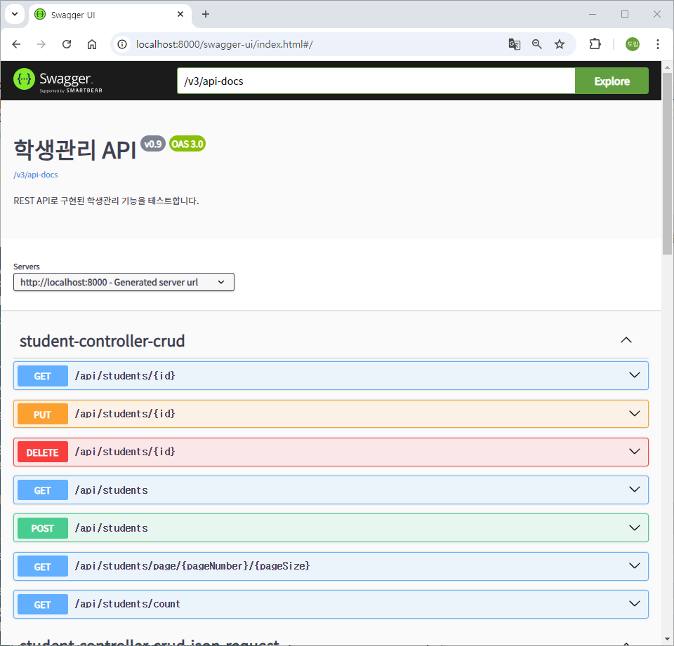

# [2024.09.03(화)] Swagger/Logback


# Swagger

- Swagger API URL : https://swagger.io/

## SpringBootBasicREST 프로젝트

### 프로젝트에 Swagger 추가하는 방법

1. build.gradle에 dependencies에 Swagger 추가 
    - **SpringDoc OpenAPI Starter WebMVC UI** : https://mvnrepository.com/artifact/org.springdoc/springdoc-openapi-starter-webmvc-ui/2.6.0
    
    ### build.gradle
    
    ```java
    plugins {
    	id 'java'
    	id 'org.springframework.boot' version '3.3.3'
    	id 'io.spring.dependency-management' version '1.1.6'
    }
    
    group = 'com.mycom'
    version = '0.0.1-SNAPSHOT'
    
    java {
    	toolchain {
    		languageVersion = JavaLanguageVersion.of(17)
    	}
    }
    
    configurations {
    	compileOnly {
    		extendsFrom annotationProcessor
    	}
    }
    
    repositories {
    	mavenCentral()
    }
    
    dependencies {
    	implementation 'org.springframework.boot:spring-boot-starter-data-jpa'
    	implementation 'org.springframework.boot:spring-boot-starter-web'
    	compileOnly 'org.projectlombok:lombok'
    	developmentOnly 'org.springframework.boot:spring-boot-devtools'
    	runtimeOnly 'com.mysql:mysql-connector-j'
    	annotationProcessor 'org.projectlombok:lombok'
    	testImplementation 'org.springframework.boot:spring-boot-starter-test'
    	testRuntimeOnly 'org.junit.platform:junit-platform-launcher'
    	
    	// https://mvnrepository.com/artifact/org.springdoc/springdoc-openapi-starter-webmvc-ui
    	implementation group: 'org.springdoc', name: 'springdoc-openapi-starter-webmvc-ui', version: '2.6.0'
    	
    }
    
    tasks.named('test') {
    	useJUnitPlatform()
    }
    ```
    
2. [프로젝트명] 우클릭 → Gradle → Refresh Gradle Project → 프로젝트 실행 
3. http://localhost:8000/swagger-ui/index.html or http://localhost:8000/swagger-ui.html 접속
    
    ### 실행 결과
    
    
    
    
    
    ### **Curl**
    
    - curl URL : https://curl.se/
    
    `cURL`(Client URL)은 명령줄 또는 스크립트에서 다양한 프로토콜을 사용하여 데이터를 전송하는 데 사용되는 오픈 소스 커맨드라인 도구입니다. 주로 HTTP, HTTPS, FTP, SFTP, SMTP, IMAP 등 다양한 인터넷 프로토콜을 지원하며, 특히 REST API 테스트, 파일 다운로드 및 업로드, 서버와의 통신 등을 자동화하는 데 널리 사용됩니다.
    
    ### 주요 특징
    
    1. **다양한 프로토콜 지원**: HTTP, HTTPS, FTP, SFTP, SCP, SMTP, POP3, IMAP 등 다양한 프로토콜을 지원합니다.
    2. **플랫폼 독립성**: Linux, Windows, macOS 등 거의 모든 운영 체제에서 사용할 수 있습니다.
    3. **REST API 테스트**: HTTP 요청 메서드(GET, POST, PUT, DELETE 등)를 쉽게 전송할 수 있어 RESTful API를 테스트하는 데 유용합니다.
    4. **파일 전송 및 다운로드**: FTP, SFTP 등 파일 전송 프로토콜을 통해 파일을 업로드하거나 다운로드할 수 있습니다.
    5. **헤더 및 쿠키 설정**: 요청 시 헤더, 쿠키, 인증 정보 등을 설정하여 요청을 커스터마이징할 수 있습니다.
    6. **SSL 인증서 지원**: HTTPS 요청 시 SSL 인증서를 사용하여 안전한 통신을 지원합니다.
    
    ### 기본 사용법
    
    - **기본 GET 요청**:
        
        ```bash
        curl http://example.com
        ```
        
    - **POST 요청**: 데이터를 서버로 전송하는 POST 요청을 보낼 수 있습니다.
        
        ```bash
        curl -X POST -d "param1=value1&param2=value2" http://example.com/api
        ```
        
    - **파일 다운로드**:
        
        ```bash
        curl -O http://example.com/file.zip
        ```
        
    - **JSON 데이터 전송**: 헤더를 설정하여 JSON 데이터를 전송할 수 있습니다.
        
        ```bash
        curl -X POST -H "Content-Type: application/json" -d '{"key":"value"}' http://exampl
        ```
        
    - **헤더 확인**: 서버 응답 헤더를 확인합니다.
        
        ```bash
        curl -I http://example.com
        ```
        
    - **인증 정보 전달**: 기본 인증을 사용하여 요청을 보낼 수 있습니다.
        
        ```bash
        curl -u username:password http://example.com/protected
        ```
        
    
    ### cURL의 활용 예
    
    1. **API 테스트**: cURL을 사용하여 API 요청을 직접 보내고 응답을 확인함으로써 서버와의 통신을 테스트할 수 있습니다.
    2. **스크립트 자동화**: 쉘 스크립트 등에서 cURL을 사용하여 자동으로 데이터 전송 작업을 수행할 수 있습니다.
    3. **파일 전송 및 다운로드**: FTP나 SFTP 서버에 파일을 업로드하거나, URL에서 파일을 다운로드할 때 사용합니다.
    4. **웹 페이지 확인**: 특정 웹 페이지의 상태를 체크하거나, 웹 크롤링의 기초 작업으로 사용할 수 있습니다.
    
    ### 정리
    
    - `cURL`은 서버와 클라이언트 간의 다양한 요청을 전송하고 응답을 처리할 수 있는 강력한 도구입니다.
    - 다양한 옵션과 플래그를 제공하여 HTTP 요청뿐만 아니라 다양한 프로토콜을 사용하는 모든 네트워크 통신 작업을 효율적으로 수행할 수 있습니다.
- 참고 : Swagger에서 json 입력을 처리하지 않는 요청(/api/students)에 json으로 요청을 보내면 처리 가능한 요청으로 변경하여 요청한다.

### Swagger 페이지 자동 생성 여부 설정

- Swagger API URL : https://springdoc.org/properties.html

### application.properties

- springdoc.api-docs.enabled=true로 html 페이지 생성 여부 설정 가능

```java
spring.application.name=SpringBootBasicREST
server.port=8000

spring.datasource.url=jdbc:mysql://localhost:3306/basic_rest
spring.datasource.username=root
spring.datasource.password=root
spring.datasource.driver-class-name=com.mysql.cj.jdbc.Driver

spring.jpa.show-sql=true

springdoc.api-docs.enabled=true
```

### Swagger 페이지 제목 변경

### src/main/java/com/mycom/myapp/config/SwaggerConfig.java

```java
package com.mycom.myapp.config;

import org.springframework.context.annotation.Bean;
import org.springframework.context.annotation.Configuration;

import io.swagger.v3.oas.models.Components;
import io.swagger.v3.oas.models.OpenAPI;
import io.swagger.v3.oas.models.info.Info;

@Configuration
public class SwaggerConfig {
	
	// DI
	@Bean
	OpenAPI openAPI() {
		return new OpenAPI()
				.components(new Components())
				.info(apiInfo());
	}

	private Info apiInfo() { // 페이지 위쪽 Title 변경
		return new Info()
				.title("학생관리 API")
				.description("REST API로 구현된 학생관리 기능을 테스트합니다.")
				.version("v0.9");
	}
	
}
```

### 실행 결과



### Swagger 페이지에 get메소드만 보이도록 변경

### src/main/java/com/mycom/myapp/config/SwaggerConfig.java

```java
package com.mycom.myapp.config;

import org.springdoc.core.customizers.OpenApiCustomizer;
import org.springframework.context.annotation.Bean;
import org.springframework.context.annotation.Configuration;

import io.swagger.v3.oas.models.Components;
import io.swagger.v3.oas.models.OpenAPI;
import io.swagger.v3.oas.models.PathItem;
import io.swagger.v3.oas.models.Paths;
import io.swagger.v3.oas.models.info.Info;

@Configuration
public class SwaggerConfig {
	
	// DI
	@Bean
	OpenAPI openAPI() {
		return new OpenAPI()
				.components(new Components())
				.info(apiInfo());
	}

	private Info apiInfo() { // 페이지 위쪽 Title 변경
		return new Info()
				.title("학생관리 API")
				.description("REST API로 구현된 학생관리 기능을 테스트합니다.")
				.version("v0.9");
	}
	
	@Bean
	OpenApiCustomizer getEndopintsCustomizer() {
		return openApi -> {
			Paths paths = new Paths();
			
			// 원래 기본적으로 openApi가 가지고 있는 path(PathItem)들 중 우리가 원하는 path(PathItem)만 paths에 담는다.
			openApi.getPaths().forEach( (path, pathItem) -> {
				PathItem newPathItem = new PathItem();
				
				// get에 해당하는 PathItem 확인
				if( pathItem.getGet() != null ) { // get을 가지고 있는 경우
					newPathItem.setGet(pathItem.getGet());
					paths.addPathItem(path, newPathItem);
				}
			});
			
			openApi.setPaths(paths);
		};
	}
	
}
```

### 실행 결과


# Logback

## log (**Log4j, Logback, Log4j2)**

- logback이 springBoot default

`log4j`, `logback`, 그리고 `log4j2`는 Java 애플리케이션에서 로그를 기록하고 관리하기 위해 널리 사용되는 로깅 라이브러리입니다. 각각의 라이브러리는 특정 장점과 기능을 제공하여 애플리케이션의 디버깅과 모니터링을 효율적으로 수행할 수 있게 합니다.

### 1. **Log4j (Log for Java)**

**Log4j**는 Apache Software Foundation에서 개발한 Java 로깅 라이브러리로, 초기부터 많은 Java 프로젝트에서 사용되어 왔습니다.

- **특징**:
    - **단순성**: 설정이 간단하며, XML, JSON, 그리고 `.properties` 파일 등을 통해 설정할 수 있습니다.
    - **다양한 로그 레벨**: TRACE, DEBUG, INFO, WARN, ERROR, FATAL 등 다양한 로그 레벨을 지원합니다.
    - **플러그인 아키텍처**: 여러 로그 출력 대상(Appender)와 다양한 형식(Layout)을 지원하여 로그를 콘솔, 파일, 데이터베이스, 이메일 등으로 전송할 수 있습니다.
- **단점**:
    - 성능상의 문제와 일부 기능의 한계 때문에 더 이상 최신 애플리케이션에서 자주 사용되지 않습니다.
    - 유지보수 부족: 보안 문제와 버그가 종종 발견되었고, 그로 인해 더 나은 대안으로 대체되었습니다.

### 2. **Logback**

**Logback**은 Log4j의 후속 라이브러리로, Log4j의 창시자인 Ceki Gülcü에 의해 개발되었습니다. Logback은 Spring Boot와 같은 프레임워크에서 기본 로깅 라이브러리로 사용될 만큼 성능과 기능면에서 뛰어납니다.

- **특징**:
    - **높은 성능**: Log4j보다 빠르고 메모리 소비가 적은 구조로 설계되었습니다.
    - **구성 유연성**: XML 기반의 직관적인 설정 파일을 사용하여 쉽게 설정할 수 있습니다.
    - **Rolling File Appender**: 로그 파일의 크기와 수를 제한하여 관리하는 기능이 개선되었습니다.
    - **SLF4J (Simple Logging Facade for Java)**: Logback은 SLF4J와 긴밀하게 통합되어 있어 애플리케이션에서 로깅 구현을 쉽게 변경할 수 있습니다.
- **단점**:
    - Logback이 Log4j2보다 성능이 뛰어난 부분도 있지만, 최신 기능에서는 Log4j2에 비해 부족할 수 있습니다.

### 3. **Log4j2**

**Log4j2**는 Log4j의 차세대 버전으로, Log4j의 단점을 보완하고 Logback의 장점을 흡수하여 성능과 안정성을 크게 향상시켰습니다.

- **특징**:
    - **높은 성능**: Logback보다 빠르고 비동기 로깅이 기본으로 제공되어 매우 높은 처리량을 지원합니다.
    - **플러그인 아키텍처**: 다양한 플러그인을 쉽게 추가할 수 있으며, 로그 필터링, 구성을 동적으로 수정하는 기능을 제공합니다.
    - **다양한 설정 파일 형식**: XML, JSON, YAML 등의 형식으로 설정할 수 있습니다.
    - **동적 로깅 레벨 변경**: 애플리케이션 재시작 없이 로그 레벨을 실시간으로 변경할 수 있어 운영 중에 매우 유용합니다.
    - **기본 보안 기능**: 보안 취약점을 방지하기 위한 여러 기능이 포함되어 있습니다.
- **단점**:
    - 설정이 복잡할 수 있으며, 새로운 버전으로 전환 시 기존 설정의 호환성을 유지하는 데 어려움이 있을 수 있습니다.

### **비교 및 선택**

- **Log4j**는 오래되었고 성능과 보안 문제로 인해 거의 사용되지 않습니다.
- **Logback**은 성능과 유연성이 뛰어나며, 특히 Spring Boot와 잘 통합되어 있습니다.
- **Log4j2**는 최신 로깅 라이브러리로서 뛰어난 성능과 다양한 기능을 제공하며, 대규모 애플리케이션에서 많이 사용됩니다.

**Log4j2**와 **Logback** 중 하나를 선택하는 것이 좋으며, 성능이 중요하다면 Log4j2가 우수한 선택이 될 수 있습니다.

### Log4j 보안 이슈: Log4Shell (CVE-2021-44228)

Log4j 보안 이슈는 2021년 말에 발견된 **Log4Shell**(CVE-2021-44228) 취약점으로, 인터넷 전반에 걸쳐 수많은 시스템에 심각한 보안 위협을 초래했습니다. 이 취약점은 Log4j 2의 특정 기능에서 발생하며, 원격 코드 실행(RCE, Remote Code Execution)을 가능하게 하여 공격자가 시스템을 완전히 장악할 수 있게 합니다.

### **Log4j 보안 이슈: Log4Shell (CVE-2021-44228)**

### **1. 취약점 개요**

- **취약점 발생 버전**: Log4j 2.x 버전(2.0-beta9부터 2.14.1까지).
- **취약점의 핵심**: Log4j의 JNDI(Java Naming and Directory Interface) 조회 기능을 악용하여 악의적인 코드를 원격에서 실행할 수 있게 하는 취약점입니다.
- **공격 방식**: 공격자는 로그 메시지에 특정 형식의 JNDI 조회 요청(`$${jndi:ldap://...}`)을 삽입하여 Log4j가 이 요청을 처리하면서 원격 서버에서 악성 코드를 로드하고 실행하게 할 수 있습니다.

### **2. 공격 원리**

- Log4j는 로그 메시지 안에서 `${}` 형식을 사용해 변수를 참조하거나 동적으로 값을 설정할 수 있습니다.
- 문제는 `${jndi:...}`와 같은 형식을 사용하면 Log4j가 JNDI를 통해 외부 서버로부터 객체를 조회하려 시도한다는 점입니다.
- 이 조회 과정에서 공격자가 제어하는 서버로 연결되어 악성 Java 객체를 로드하여 실행할 수 있게 됩니다.

### **3. 영향 및 피해**

- **대상 시스템**: 이 취약점은 Log4j 2.x를 사용하는 모든 Java 애플리케이션에 영향을 미쳤습니다. 웹 서버, 게임 서버, 클라우드 서비스 등 다양한 애플리케이션이 취약했습니다.
- **피해**: 공격자는 시스템에 대한 완전한 제어권을 가질 수 있어 데이터를 유출하거나 악성 소프트웨어를 설치하고 시스템을 중단시킬 수 있었습니다.
- **전파 속도**: Log4j가 널리 사용된 만큼, 이 취약점은 빠르게 전 세계로 확산되었고, 수많은 기업과 서비스에 보안 위협을 초래했습니다.

### **4. 해결 방법**

- **버전 업데이트**: 가장 효과적인 해결 방법은 Log4j를 안전한 최신 버전(2.16.0 이상)으로 업데이트하는 것입니다. 이 버전에서는 JNDI 조회 기능이 기본적으로 비활성화되거나, 보안 패치가 적용되었습니다.
- **JNDI 조회 비활성화**: 긴급 대응으로, Log4j 설정에서 JNDI 조회 기능을 비활성화하거나 특정 시스템 프로퍼티를 설정하여 취약점을 완화할 수 있습니다.
- **방화벽 및 모니터링**: 외부에서의 악성 JNDI 접근을 차단하기 위해 네트워크 방화벽 설정을 강화하고, 로깅에서 비정상적인 패턴을 모니터링합니다.

### **5. 교훈 및 대응 전략**

- **오픈소스 보안 관리**: 오픈소스 라이브러리를 사용할 때는 항상 최신 보안 패치를 적용하고, 취약점 정보에 주의를 기울여야 합니다.
- **보안 점검 및 테스트**: 정기적으로 애플리케이션 보안 점검과 침투 테스트를 수행하여 알려지지 않은 취약점도 사전에 발견하고 대응하는 것이 중요합니다.

### **결론**

Log4j 보안 이슈는 오픈소스 소프트웨어의 보안 관리 중요성을 부각시킨 사건으로, 기업과 개발자들에게 보안 취약점에 대한 빠른 대응과 예방적 보안 조치의 필요성을 강조하게 했습니다.

## SpringBootBasicLogging 프로젝트

### SpringBootBasicLogging 프로젝트 생성


### SpringBootBasicLogging 프로젝트 설정

### application.properties

```java
spring.application.name=SpringBootBasicLogging
server.port=8000

spring.datasource.url=jdbc:mysql://localhost:3306/basic_logging
spring.datasource.username=root
spring.datasource.password=root
spring.datasource.driver-class-name=com.mysql.cj.jdbc.Driver

spring.jpa.show-sql=true
```

### MySQL

- basic_logging 스키마 생성
- basic_logging 스키마에 테이블 및 데이터 입력 코드
    
    ```java
    set foreign_key_checks = 0;
    drop table if exists user ;
    drop table if exists user_role;
    drop table if exists user_user_role;
    drop table if exists user_address;
    set foreign_key_checks = 1;
    create table user (
      id bigint not null auto_increment,
      email varchar(255) default null,
      name varchar(255) default null,
      password varchar(255) default null,
      primary key (id)
    );
    create table user_role (
      id int not null auto_increment,
      name varchar(255) default null,
      primary key (id)
    );
    create table user_user_role (
      user_id bigint not null,
      role_id int not null,
      primary key (user_id,role_id),
      constraint fk_user_user_role_user_id foreign key (user_id) references user (id),
      constraint fk_user_user_role_user_role_id foreign key (role_id) references user_role (id)
    );
    create table user_address (
      id bigint not null auto_increment,
      addr1 varchar(255) default null,
      addr2 varchar(255) default null,
      zip_code varchar(255) default null,
      user_id bigint default null,
      primary key (id),
      constraint fk_user_id foreign key (user_id) references user (id)
    );
    insert into user (name, email, password) values ('user1',   'user1@mycom.com', 'password1');
    insert into user (name, email, password) values ('user2',   'user2@mycom.com', 'password2');
    insert into user (name, email, password) values ('user3',   'user3@mycom.com', 'password3');
    insert into user (name, email, password) values ('user4',   'user4@mycom.com', 'password4');
    insert into user_role (name) values ('role_customer');
    insert into user_role (name) values ('role_seller');
    insert into user_role (name) values ('role_admin');
    insert into user_user_role (user_id, role_id) values (1, 1);
    insert into user_user_role (user_id, role_id) values (2, 2);
    insert into user_user_role (user_id, role_id) values (3, 1);
    insert into user_user_role (user_id, role_id) values (3, 2);
    insert into user_user_role (user_id, role_id) values (4, 1);
    insert into user_user_role (user_id, role_id) values (4, 2);
    insert into user_user_role (user_id, role_id) values (4, 3);
    insert into user_address (addr1, addr2, zip_code, user_id) values ('user 1 addr1 1', 'user 1 addr2 1', '11111', 1);
    insert into user_address (addr1, addr2, zip_code, user_id) values ('user 1 addr1 2', 'user 1 addr2 2', '11122', 1);
    insert into user_address (addr1, addr2, zip_code, user_id) values ('user 1 addr1 3', 'user 1 addr2 3', '11133', 1);
    ```
    

### src/main/java/com/mycom/myapp

- SpringBootJpaHtmlUserAddress 프로젝트에서 user 패키지 복사하여 붙여넣기
- SpringBootJpaHtmlUserAddress 프로젝트 static에 detail.html, index.html, login.html, register.html 복사하여 붙여넣기

- Spring boot 3 Logback : https://docs.spring.io/spring-boot/how-to/logging.html#howto.logging.logback

### Logback의 appender와 level 설명

- ‘org/springframework/boot/logging/logback/defaults.xml’, ‘org/springframework/boot/logging/logback/console-appender.xml’
    
    브라우저에서 검색해보기
    
    https://github.com/spring-projects/spring-boot/blob/main/spring-boot-project/spring-boot/src/main/resources/org/springframework/boot/logging/logback/defaults.xml
    
    https://github.com/spring-projects/spring-boot/blob/main/spring-boot-project/spring-boot/src/main/resources/org/springframework/boot/logging/logback/console-appender.xml
    
- appender : console, file(일자별, 월별, ... rolling), db, cloud
- level 설정 : trace debug info warn error 중 1 개
    
    level 우선순위 : trace > debug > info > warn > error
    
    (log를 남길 때(쓸 때) 해당 level로 쓴다 X 보여준다 O)
    
    예시
    
    A logger.warn(””), logger.info(” “), logger.debug(”…”)
    
    B logger.warn(””), logger.info(” “)
    
    C                           logger.info(” “), logger.debug(”…”)
    

### Logback의 appender와 level 설명 (ChatGPT)

Logback은 Java 애플리케이션에서 로그 메시지를 기록하고 관리하는 데 널리 사용되는 로깅 프레임워크입니다. Logback은 유연성과 성능이 뛰어나며, 특히 Log4j의 후속으로 많이 사용됩니다. Logback의 중요한 구성 요소로 **Appender**와 **Level**이 있으며, 각각의 역할과 설정이 로그 메시지의 관리 방식에 큰 영향을 미칩니다.

### **1. Logback의 Appender**

**Appender**는 Logback에서 로그 메시지를 출력하는 대상과 방식을 정의하는 구성 요소입니다. 로그가 기록될 위치(콘솔, 파일, 데이터베이스 등)를 설정하는 역할을 합니다.

### **주요 Appender 종류**

1. **ConsoleAppender**: 로그를 콘솔(표준 출력)로 출력합니다.
    - 개발 단계에서 자주 사용되며, 빠르게 로그를 확인할 수 있습니다.
2. **FileAppender**: 로그를 파일로 저장합니다.
    - 로그 파일의 위치와 이름을 설정할 수 있으며, 운영 환경에서 가장 일반적으로 사용됩니다.
3. **RollingFileAppender**: 일정한 크기나 시간 간격으로 로그 파일을 교체합니다.
    - 로그 파일이 너무 커지거나 오래되면 새 파일로 로그를 기록하여 디스크 공간 관리에 유리합니다.
4. **SocketAppender**: 로그를 소켓을 통해 원격 서버로 전송합니다.
    - 분산된 시스템에서 로그를 중앙 서버로 모아 관리할 때 유용합니다.
5. **AsyncAppender**: 로그 메시지를 비동기적으로 처리합니다.
    - 성능을 향상시키며, 로그 출력이 애플리케이션의 성능에 영향을 주지 않도록 합니다.
6. **SMTPAppender**: 로그를 이메일로 전송합니다.
    - 오류나 경고가 발생했을 때 즉시 알림을 보내는 데 유용합니다.

### **Appender의 사용 예시 (logback.xml)**

```xml
xml코드 복사
<appender name="CONSOLE" class="ch.qos.logback.core.ConsoleAppender">
    <encoder>
        <pattern>%d{yyyy-MM-dd HH:mm:ss} [%thread] %-5level %logger{36} - %msg%n</pattern>
    </encoder>
</appender>

<appender name="FILE" class="ch.qos.logback.core.FileAppender">
    <file>logs/application.log</file>
    <encoder>
        <pattern>%d{yyyy-MM-dd HH:mm:ss} [%thread] %-5level %logger{36} - %msg%n</pattern>
    </encoder>
</appender>

```

### **2. Logback의 Level**

**Level**은 로그 메시지의 중요도나 심각도를 나타내는 속성입니다. 로그 레벨을 설정하여 특정 레벨 이상의 로그만 기록하거나 출력하도록 제어할 수 있습니다. 이는 로그 양을 조절하고, 중요한 정보만 선택적으로 모니터링하는 데 유용합니다.

### **주요 Level 종류**

1. **TRACE**: 가장 낮은 레벨로, 매우 상세한 디버깅 정보를 나타냅니다.
2. **DEBUG**: 디버깅 목적으로 사용되는 레벨로, 애플리케이션의 흐름을 자세히 파악할 수 있습니다.
3. **INFO**: 일반적인 정보 메시지를 기록합니다. 시스템의 정상 동작을 나타내는 데 사용됩니다.
4. **WARN**: 경고 메시지를 기록합니다. 잠재적인 문제나 비정상적인 상황을 나타냅니다.
5. **ERROR**: 오류 메시지를 기록합니다. 애플리케이션의 심각한 문제를 나타내며, 로그 분석 시 우선적으로 처리해야 할 내용입니다.
6. **OFF**: 로깅을 완전히 비활성화합니다.

### **Level의 사용 예시 (logback.xml)**

```xml
xml코드 복사
<logger name="com.myapp" level="DEBUG"/>
<root level="ERROR">
    <appender-ref ref="CONSOLE"/>
    <appender-ref ref="FILE"/>
</root>

```

### **Appender와 Level의 결합 사용**

- Appender와 Level을 결합하여, 특정 레벨 이상의 로그를 특정 Appender에만 출력하도록 설정할 수 있습니다.
- 예를 들어, DEBUG 레벨의 로그는 콘솔에만 출력하고, ERROR 레벨 이상의 로그는 파일에도 저장할 수 있습니다.

### **결론**

- **Appender**는 로그 메시지를 기록할 대상과 방법을 정의하고, **Level**은 기록할 로그의 중요도를 설정합니다.
- 이 두 구성 요소를 조합하여 로그 메시지를 효과적으로 관리하고, 애플리케이션의 동작 상태를 파악하는 데 활용할 수 있습니다.

### Logback Root Level 설정에 따른 로그 표시 방식

1. **`root level="TRACE"`**:
    - 가장 낮은 레벨인 TRACE부터 시작하여 모든 로그 레벨 (TRACE, DEBUG, INFO, WARN, ERROR) 메시지가 표시됩니다.
    - 설정 예시:
        
        ```xml
        xml코드 복사
        <root level="TRACE">
            <appender-ref ref="CONSOLE"/>
        </root>
        
        ```
        
    - 표시되는 로그 레벨: **TRACE, DEBUG, INFO, WARN, ERROR**
2. **`root level="INFO"`**:
    - INFO 레벨과 그보다 높은 레벨 (INFO, WARN, ERROR)만 표시됩니다.
    - TRACE와 DEBUG는 무시됩니다.
    - 설정 예시:
        
        ```xml
        xml코드 복사
        <root level="INFO">
            <appender-ref ref="CONSOLE"/>
        </root>
        
        ```
        
    - 표시되는 로그 레벨: **INFO, WARN, ERROR**
3. **`root level="ERROR"`**:
    - 가장 높은 심각도인 ERROR 레벨의 로그만 표시됩니다.
    - INFO, DEBUG, TRACE, WARN 등의 메시지는 모두 무시됩니다.
    - 설정 예시:
        
        ```xml
        xml코드 복사
        <root level="ERROR">
            <appender-ref ref="CONSOLE"/>
        </root>
        
        ```
        
    - 표시되는 로그 레벨: **ERROR**

### **정리**

- **레벨의 우선순위 (낮은 것에서 높은 것 순):** TRACE < DEBUG < INFO < WARN < ERROR.
- 설정된 `root` 레벨보다 낮은 우선순위의 로그는 출력되지 않습니다.
- 따라서 `root level`이 **TRACE**일 때 모든 로그가 보이고, **INFO**일 때는 INFO 이상, **ERROR**일 때는 ERROR만 보이게 됩니다.

### Logback의 level 실습

### src/main/resources/logback-spring.xml

- 위의 Spring boot 3 Logback에서 복사하여 붙여넣기

```java
<?xml version="1.0" encoding="UTF-8"?>
<configuration>
	<include resource="org/springframework/boot/logging/logback/defaults.xml"/>
	<include resource="org/springframework/boot/logging/logback/console-appender.xml" />
	<root level="INFO">
		<appender-ref ref="CONSOLE" />
	</root>
	<logger name="org.springframework.web" level="DEBUG"/>
</configuration>
```

### src/main/java/com/mycom/myapp/user/controller/UserController.java

```java
package com.mycom.myapp.user.controller;

import org.slf4j.Logger;
import org.slf4j.LoggerFactory;
import org.springframework.stereotype.Controller;
import org.springframework.web.bind.annotation.GetMapping;
import org.springframework.web.bind.annotation.PostMapping;
import org.springframework.web.bind.annotation.RequestMapping;
import org.springframework.web.bind.annotation.RequestParam;
import org.springframework.web.bind.annotation.ResponseBody;

import com.mycom.myapp.user.dto.UserDto;
import com.mycom.myapp.user.dto.UserResultDto;
import com.mycom.myapp.user.entity.User;
import com.mycom.myapp.user.entity.UserAddress;
import com.mycom.myapp.user.service.UserService;

import jakarta.servlet.http.HttpSession;
import lombok.RequiredArgsConstructor;

@Controller
@ResponseBody
@RequestMapping("/users")
@RequiredArgsConstructor
public class UserController {

	private final UserService userService;
	
	// logger
	private final Logger logger = LoggerFactory.getLogger(UserController.class);
	
	@PostMapping("/login")
	public UserResultDto login(
			@RequestParam("email") String email, 
			@RequestParam("password") String password,
			HttpSession session
	) {
		logger.info("login() 시작");
		logger.debug("email : {}, password : {}", email, password);
		UserResultDto userResultDto = userService.login(email, password);
		
		if( userResultDto.getResult().equals("success") ) {
			session.setAttribute("userDto", userResultDto.getUserDto());
		} else {
			logger.warn("login 실패!!");
		}
		
		logger.info("login() 종료 및 응답");
		return userResultDto;
	}
	
	@GetMapping("/logout")
	public UserResultDto login(HttpSession session) {
		UserResultDto userResultDto = new UserResultDto();
		
		try {
			session.invalidate();
			userResultDto.setResult("success");
		} catch (IllegalStateException e) {
			userResultDto.setResult("fail");
		}
		
		return userResultDto;
	}
	
	@PostMapping("/register")
	public UserResultDto insertUser(User user) {
		return userService.insertUser(user);
	}
	
	// login 되어 있다는 전제 Session으로부터 회원 id를 가져온다.
	// login 되어 있지 않은 상태에서의 요청은 LoginInterceptor로부터 걸러지도록 처리
	@GetMapping("/detail")
	public UserResultDto detailUser(HttpSession session) {
		Long id = ( (UserDto)session.getAttribute("userDto") ).getId();
		return userService.dtailUser(id);
	}
	
	// login 되어 있다는 전제 Session으로부터 회원 id를 가져온다.
	// login 되어 있지 않은 상태에서의 요청은 LoginInterceptor로부터 걸러지도록 처리
	@GetMapping("/listUserAddress")
	public UserResultDto listUserAddress(HttpSession session) {
		Long id = ( (UserDto)session.getAttribute("userDto") ).getId();
		return userService.listUserAddress(id);
	}
	
	// login 되어 있다는 전제 Session으로부터 회원 id를 가져온다.
	// login 되어 있지 않은 상태에서의 요청은 LoginInterceptor로부터 걸러지도록 처리
	@PostMapping("/addAddress")
	public UserResultDto insertUserAddress(UserAddress userAddress, HttpSession session) {
		Long id = ( (UserDto)session.getAttribute("userDto") ).getId();
		return userService.insertUserAddress(userAddress, id);
	}
	
}
```

### src/main/resources/logback-spring.xml

- root level, logger name 수정해보면서 실습

```java
<?xml version="1.0" encoding="UTF-8"?>
<configuration>
	<include resource="org/springframework/boot/logging/logback/defaults.xml"/>
	<include resource="org/springframework/boot/logging/logback/console-appender.xml" />
	<root level="WARN">
		<appender-ref ref="CONSOLE" />
	</root>
	<logger name="com.mycom.myapp.user" level="WARN"/>
</configuration>
```

### <root>와 <logger> 차이

`<root>`와 `<logger>`는 Logback의 로그 설정에서 로그의 출력 수준과 범위를 지정하는 데 중요한 역할을 합니다. 이 둘의 차이와 설정에 따른 동작 방식은 다음과 같습니다:

### **1. `<root level="WARN">`**

- **정의**: `<root>`는 모든 로그의 기본 설정을 관리하는 가장 최상위 로거입니다. 로깅 시스템의 기본 레벨을 지정하며, 특정한 로거 설정이 없는 경우 이 레벨이 적용됩니다.
- **적용 범위**: 애플리케이션 전반에 걸쳐 모든 로그에 영향을 미칩니다. 특정 패키지나 클래스에 대한 예외 설정이 없는 한, 모든 로그 메시지는 `<root>` 레벨에 따라 필터링됩니다.
- **설정 예시**:
    
    ```xml
    xml코드 복사
    <root level="WARN">
        <appender-ref ref="CONSOLE" />
    </root>
    
    ```
    
- **설명**: 이 설정은 WARN 이상 (WARN, ERROR) 수준의 로그만 표시되도록 전체 시스템에 적용합니다. TRACE, DEBUG, INFO 수준의 로그는 표시되지 않습니다.

### **2. `<logger name="com.mycom.myapp.user" level="WARN"/>`**

- **정의**: `<logger>`는 특정 패키지나 클래스의 로그를 별도로 설정할 수 있도록 해줍니다. `<logger>`를 사용하면 특정한 패키지나 클래스의 로그 레벨을 독립적으로 설정할 수 있습니다.
- **적용 범위**: 설정된 `name` 속성에 해당하는 패키지 (`com.mycom.myapp.user`) 내에서만 적용됩니다. 이 로거는 패키지에 있는 모든 클래스의 로그 레벨을 개별적으로 제어할 수 있습니다.
- **설정 예시**:
    
    ```xml
    xml코드 복사
    <logger name="com.mycom.myapp.user" level="WARN"/>
    
    ```
    
- **설명**: 이 설정은 `com.mycom.myapp.user` 패키지에서 발생하는 로그에만 적용되며, WARN 이상 (WARN, ERROR) 수준의 로그만 출력됩니다.

### **차이점 및 동작 방식**

- `<root level="WARN">`는 전체 애플리케이션의 기본 로그 레벨을 설정하며, `<logger>`는 특정 패키지나 클래스에 대한 개별 로그 레벨을 설정합니다.
- **우선순위**:
    - `<logger>` 설정이 `<root>`보다 우선합니다. 즉, 특정 패키지나 클래스에 대해 `<logger>`로 설정된 로그 레벨이 있으면 해당 설정이 적용되고, 그렇지 않으면 `<root>` 레벨이 적용됩니다.
    - 예를 들어, `<root>` 레벨이 `WARN`이라도, 특정 패키지의 `<logger>`가 `INFO`로 설정되어 있으면 해당 패키지에서는 INFO 이상 수준의 로그가 출력됩니다.

### **정리**

- `<root>`는 기본 설정으로 전체 애플리케이션의 로그 레벨을 관리하고,
- `<logger>`는 특정 영역에 대한 세부적인 제어를 가능하게 하여 더 정교한 로그 관리를 도와줍니다.

### Logback의 appender

Logback에서 **`appender`**는 로그 메시지를 실제 출력하는 장치 또는 대상(output target)을 의미하며, 로그 메시지를 콘솔, 파일, 원격 서버 등 다양한 위치에 기록할 수 있게 해주는 역할을 합니다. 로그 이벤트가 생성되면, `appender`는 이 로그 메시지를 받아서 설정된 출력 형태에 맞게 처리하고 출력합니다.

### **Appender의 역할**

1. **로그 출력의 목적지 지정**: 로그 메시지를 출력할 위치를 설정합니다. 예를 들어, 콘솔, 파일, 데이터베이스, 원격 서버, 이메일 등 다양한 위치에 로그를 기록할 수 있습니다.
2. **로그 형식 지정**: 로그 메시지의 형식을 설정할 수 있습니다. 이를 위해 `layout`을 사용하여 로그 메시지를 어떤 형식으로 출력할지 지정할 수 있습니다. 일반적으로 패턴 레이아웃을 사용하여 날짜, 로그 레벨, 메시지 등의 출력을 커스터마이즈합니다.
3. **로그 필터링 및 관리**: 특정 조건에 맞는 로그 메시지만을 출력하도록 필터를 추가할 수 있습니다. 예를 들어, 특정 수준 이상의 로그만 출력하거나, 특정 메시지 패턴을 포함하는 로그만 출력하는 등의 제어가 가능합니다.

### **대표적인 Appender 종류**

1. **ConsoleAppender**: 로그를 콘솔(표준 출력)로 출력합니다. 개발 중에 가장 흔히 사용하는 `appender`입니다.
    
    ```xml
    xml코드 복사
    <appender name="CONSOLE" class="ch.qos.logback.core.ConsoleAppender">
        <encoder>
            <pattern>%d{yyyy-MM-dd HH:mm:ss} %-5level %logger{36} - %msg%n</pattern>
        </encoder>
    </appender>
    
    ```
    
2. **FileAppender**: 로그를 파일에 기록합니다. 로그 파일의 이름, 경로, 최대 크기 등을 설정할 수 있습니다.
    
    ```xml
    xml코드 복사
    <appender name="FILE" class="ch.qos.logback.core.FileAppender">
        <file>logs/application.log</file>
        <append>true</append>
        <encoder>
            <pattern>%d{yyyy-MM-dd HH:mm:ss} %-5level %logger{36} - %msg%n</pattern>
        </encoder>
    </appender>
    
    ```
    
3. **RollingFileAppender**: 로그를 파일에 기록하되, 파일이 일정 크기에 도달하거나 특정 시간이 지나면 파일을 롤링(새로운 파일 생성)하여 이전 로그를 보관합니다.
    
    ```xml
    xml코드 복사
    <appender name="ROLLING" class="ch.qos.logback.core.rolling.RollingFileAppender">
        <file>logs/app.log</file>
        <rollingPolicy class="ch.qos.logback.core.rolling.TimeBasedRollingPolicy">
            <fileNamePattern>logs/app-%d{yyyy-MM-dd}.log</fileNamePattern>
            <maxHistory>30</maxHistory>
        </rollingPolicy>
        <encoder>
            <pattern>%d{yyyy-MM-dd HH:mm:ss} %-5level %logger{36} - %msg%n</pattern>
        </encoder>
    </appender>
    
    ```
    
4. **SocketAppender**: 로그 메시지를 네트워크를 통해 원격 서버로 전송합니다. 주로 중앙 집중식 로깅을 위해 사용됩니다.
5. **SMTPAppender**: 로그 메시지를 이메일로 전송합니다. 주로 심각한 오류가 발생했을 때 알림을 위해 사용합니다.

### **Appender의 활용**

- `Appender`를 사용하면 로그를 다양한 방식으로 출력 및 관리할 수 있어, 시스템 상태를 효과적으로 모니터링하고 문제를 신속하게 파악할 수 있습니다.
- 로그가 저장되는 위치와 형식을 다르게 설정하여, 개발, 테스트, 운영 환경에서 각각의 요구에 맞게 로그를 관리할 수 있습니다.

이처럼 `Appender`는 로그 출력의 최종 목적지를 지정하고, 그 형식과 조건을 관리하는 핵심적인 역할을 담당합니다.

### Logback의 appender &  clr() 실습

### src/main/resources/logback-spring.xml

- clr() : 로그 색상 변경 (부분 변경도 가능)

```java
<?xml version="1.0" encoding="UTF-8"?>
<configuration>
	<include resource="org/springframework/boot/logging/logback/defaults.xml"/>
	<include resource="org/springframework/boot/logging/logback/console-appender.xml" />
	
	<appender name="MY_CONSOLE" class="ch.qos.logback.core.ConsoleAppender">
		<encoder>
			<pattern>%clr(%d{yyyy-MM-dd HH:mm:ss} %-5level %logger{20} - %msg%n){blue}</pattern>
		</encoder>
	</appender>
	
	<root level="WARN">
		<appender-ref ref="CONSOLE" />
	</root>
	<logger name="com.mycom.myapp.user" level="DEBUG">
		<appender-ref ref="MY_CONSOLE"/>
	</logger>
</configuration>
```

### 실행 결과

_실습_실행결과.png)

### File로 log 남기는 방법

### src/main/resources/logback-spring.xml

```java
<?xml version="1.0" encoding="UTF-8"?>
<configuration>
	<include resource="org/springframework/boot/logging/logback/defaults.xml"/>
	<include resource="org/springframework/boot/logging/logback/console-appender.xml" />
	
	<appender name="MY_CONSOLE" class="ch.qos.logback.core.ConsoleAppender">
		<encoder>
			<pattern>%clr(%d{yyyy-MM-dd HH:mm:ss} %-5level %logger{20} - %msg%n){blue}</pattern>
		</encoder>
	</appender>
	
	<appender name="ROLLING_FILE" class="ch.qos.logback.core.rolling.RollingFileAppender">
		<file>logs/myapp.log</file>
		<rollingPolicy class="ch.qos.logback.core.rolling.TimeBasedRollingPolicy">
            <fileNamePattern>logs/myapp.%d{yyyy-MM-dd}.log</fileNamePattern>
        </rollingPolicy>
		<encoder>
			<pattern>%d{yyyy-MM-dd HH:mm:ss} %-5level %logger{20} - %msg%n</pattern>
		</encoder>
	</appender>
	
	<root level="INFO">
		<appender-ref ref="CONSOLE" />
		<appender-ref ref="ROLLING_FILE" />
	</root>
	<logger name="com.mycom.myapp.user" level="DEBUG">
		<appender-ref ref="MY_CONSOLE"/>
	</logger>
</configuration>
```

### 실행 결과

- 프로젝트 내부 지정한 logs/myapp.log 생성된다.


### 누가 어떤 메소드를 호출하는지 log남기는 방법

### src/main/java/com/mycom/myapp/config/LoggingAspect.java

```java
package com.mycom.myapp.config;

import org.aspectj.lang.JoinPoint;
import org.aspectj.lang.annotation.Aspect;
import org.aspectj.lang.annotation.Before;
import org.aspectj.lang.annotation.Pointcut;
import org.slf4j.Logger;
import org.slf4j.LoggerFactory;
import org.springframework.stereotype.Component;

import com.mycom.myapp.user.dto.UserDto;

import jakarta.servlet.http.HttpSession;
import lombok.RequiredArgsConstructor;

@Aspect
@Component
@RequiredArgsConstructor
public class LoggingAspect {
	
	// logger
	private final Logger logger = LoggerFactory.getLogger(LoggingAspect.class);
	
	// session (호출 사용자 정보)
	private final HttpSession session;
	
	// pointcut
	@Pointcut(value = "execution( * com.mycom.myapp..*(..) )") 
	private void logPointcut() {}
	
	// advise
	@Before("logPointcut()")
	public void logMethodCall(JoinPoint joinPoint) {
		// 누가 언제 무슨 메소드를 호출하는지
		UserDto userDto = (UserDto) session.getAttribute("userDto");
		if( userDto == null ) return;
		
		String methodName = joinPoint.getSignature().getName();
		
		logger.info("{}가 {}를 호출했습니다.", userDto.getEmail(), methodName);
		
	}
	
}
```

### 실행 결과

