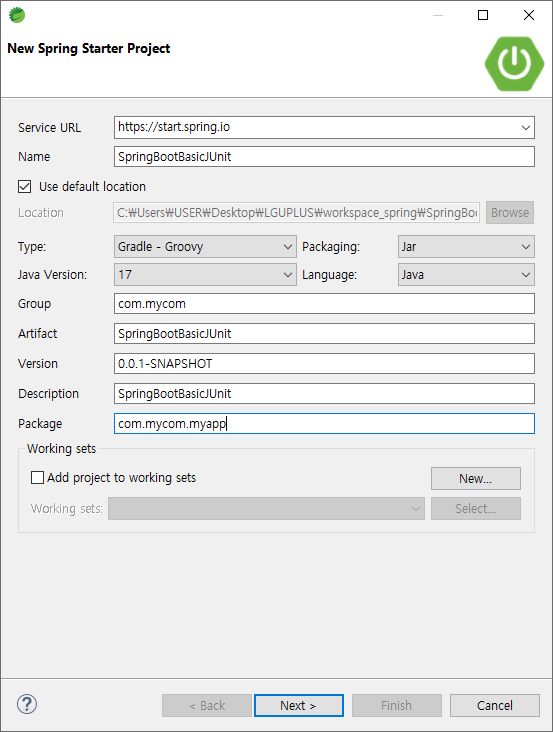
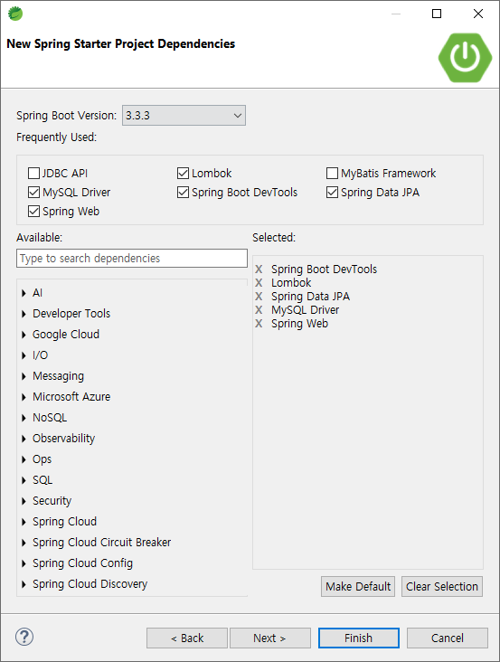

# [2024.09.04(수)] JUnit


# JUnit

## TDD(Test-Driven Development)

TDD(Test-Driven Development)는 **테스트 주도 개발**이라는 뜻으로, 소프트웨어 개발 방식 중 하나로 **테스트 코드를 먼저 작성하고 이를 통과하도록 실제 코드를 작성하는 방식**입니다. TDD는 코드 작성 전에 테스트를 먼저 작성함으로써, 개발 과정에서의 오류를 줄이고 더 나은 설계를 유도합니다.

### **TDD의 기본 절차**

TDD는 보통 아래 3단계를 반복하는 사이클로 이루어집니다. 이를 **"Red-Green-Refactor"** 사이클이라고 합니다.

1. **Red (실패하는 테스트 작성)**:
    - 먼저, 기능에 대한 테스트 코드를 작성합니다.
    - 이때 작성한 테스트는 아직 구현된 기능이 없기 때문에 실패하게 됩니다. 이 단계는 요구사항이 제대로 반영되었는지를 확인하는 과정입니다.
2. **Green (테스트 통과를 위한 최소한의 코드 작성)**:
    - 테스트가 실패하지 않도록 최소한의 기능을 가진 코드를 작성하여 테스트를 통과시킵니다.
    - 이 단계에서는 코드의 품질보다는 테스트를 통과시키는 것이 우선입니다.
3. **Refactor (코드 리팩토링)**:
    - 테스트를 통과한 코드를 리팩토링하여 중복을 제거하고 코드의 구조를 개선합니다.
    - 이 과정에서도 테스트는 항상 통과해야 하며, 리팩토링을 통해 코드의 가독성, 유지보수성 등을 높입니다.

이 3단계의 사이클을 반복하면서 기능을 하나씩 추가하고 개선해 나갑니다.

### **TDD의 장점**

1. **버그 감소**: 테스트를 먼저 작성하기 때문에 코드 작성 시 발생할 수 있는 버그를 사전에 방지할 수 있습니다.
2. **코드 품질 향상**: 테스트를 통과하도록 최소한의 코드를 작성하고, 리팩토링을 통해 코드의 품질을 지속적으로 개선합니다.
3. **명확한 요구사항 반영**: 테스트가 곧 요구사항을 명확히 표현하기 때문에, 개발자가 요구사항을 잘못 이해할 가능성을 줄여줍니다.
4. **유지보수 용이성**: 작성된 테스트가 리팩토링이나 추가 기능 구현 시에도 코드가 의도대로 동작하는지를 보장해 주므로, 시스템의 유지보수가 용이해집니다.
5. **빠른 피드백**: 코드를 작성하고 즉시 테스트를 실행할 수 있어 코드의 문제가 즉시 드러납니다.

### **TDD와 기존 개발 방식의 차이점**

- **기존 개발 방식**에서는 먼저 코드를 작성한 후에 테스트를 작성하거나 생략하는 경우가 많습니다. 이 경우 테스트가 미흡해질 수 있고, 코드의 품질이 떨어질 가능성이 큽니다.
- **TDD**는 테스트가 개발의 중심에 있기 때문에 코드가 명확한 요구사항을 만족하는지를 지속적으로 검증할 수 있습니다.

### **TDD를 효과적으로 사용하기 위한 조건**

- **자동화된 테스트 도구**가 필요합니다. 예를 들어, Java에서는 JUnit, Python에서는 pytest, JavaScript에서는 Jest 같은 도구들이 사용됩니다.
- **짧은 사이클의 반복**을 유지해야 합니다. 지나치게 큰 기능을 한 번에 개발하려 하지 않고, 작은 단위로 나누어 반복적으로 테스트하고 개선합니다.

TDD는 초기에는 시간과 노력이 많이 들어가는 것처럼 보일 수 있지만, 장기적으로는 코드 품질을 높이고 유지보수 비용을 줄이는 데 큰 도움이 되는 개발 방법론입니다.

## JUnit의 세부 모듈

JUnit은 Java에서 가장 널리 사용되는 테스트 프레임워크로, JUnit 5부터는 **모듈화된 아키텍처**를 도입하여 다양한 테스트 요구사항에 대응할 수 있게 되었습니다. JUnit 5는 크게 **JUnit Platform**, **JUnit Jupiter**, **JUnit Vintage**라는 세부 모듈로 구성되어 있으며, 각 모듈은 특정한 역할을 수행합니다.

### **JUnit의 세부 모듈 설명**

1. **JUnit Platform**
    - **역할**: JUnit Platform은 테스트를 실행할 수 있는 **기반 환경**을 제공합니다. 이는 JUnit뿐만 아니라 다른 테스트 프레임워크들도 실행할 수 있는 범용 실행 환경을 제공하며, IDE나 빌드 도구(Maven, Gradle 등)와 통합됩니다.
    - **특징**:
        - 테스트 엔진을 탐색하고 실행할 수 있는 API 제공.
        - 테스트 보고서와 결과를 표준화된 방식으로 출력.
        - IDE와 CI/CD 도구와의 통합을 지원하여 테스트 자동화 환경 구축.
2. **JUnit Jupiter**
    - **역할**: JUnit Jupiter는 JUnit 5의 **주요 테스트 엔진**으로, JUnit 5의 모든 새로운 기능과 확장된 기능을 제공합니다. 주로 JUnit 5 스타일의 테스트를 작성하고 실행하는 데 사용됩니다.
    - **특징**:
        - 새로운 어노테이션(@Test, @BeforeEach, @AfterEach 등)과 확장 모델을 제공.
        - 람다 표현식과 같은 Java 8 이상의 기능을 활용한 새로운 API 지원.
        - **확장 모델**을 통해 사용자 정의 확장을 구현할 수 있는 구조 제공.
        - **테스트 반복, 조건부 실행, 태깅** 등 다양한 새로운 기능을 지원.
3. **JUnit Vintage**
    - **역할**: JUnit Vintage는 **JUnit 3과 JUnit 4로 작성된 기존 테스트 코드를 JUnit 5 환경에서 실행**할 수 있도록 지원하는 테스트 엔진입니다. 즉, 기존의 JUnit 4 기반의 테스트를 JUnit 5로 마이그레이션하지 않고도 실행할 수 있게 합니다.
    - **특징**:
        - 레거시 테스트를 보호하면서 새로운 JUnit 5 환경을 도입할 수 있도록 돕는 브리지 역할.
        - JUnit 3과 JUnit 4의 어노테이션과 기능을 그대로 사용할 수 있도록 지원.
        - JUnit 4의 @RunWith, @Rule 등과 같은 기존의 테스트 구조와의 호환성 유지.

### **JUnit 모듈들의 역할 및 상호작용**

- **JUnit Platform**이 테스트 실행의 기반을 제공하고, 이 위에서 **JUnit Jupiter**와 **JUnit Vintage**가 각각 JUnit 5 및 이전 버전의 테스트 코드를 실행합니다.
- 개발자는 새로운 테스트를 작성할 때 주로 **JUnit Jupiter**를 사용하지만, 기존의 JUnit 4 테스트를 유지해야 할 경우 **JUnit Vintage** 모듈을 추가하여 두 가지를 혼용할 수 있습니다.
- 이 구조는 테스트 코드의 **유연성**과 **이전 테스트 자산의 재사용성**을 극대화하며, JUnit 5로의 전환을 점진적으로 수행할 수 있는 장점을 제공합니다.

### **JUnit 5로의 전환 시 장점**

- 모듈화된 구조로 인해 특정 요구에 맞게 필요한 모듈만 선택적으로 사용 가능.
- JUnit Jupiter의 확장된 기능을 통해 테스트 코드를 보다 직관적이고 유연하게 작성할 수 있음.
- JUnit Vintage를 통해 기존 테스트 자산을 유지하면서 새로운 테스트 환경을 도입할 수 있음.

이러한 모듈 구성 덕분에 JUnit 5는 테스트 실행의 유연성과 확장성을 크게 높였으며, 현대적인 Java 개발 환경에 적합한 테스트 프레임워크로 자리잡았습니다.

## SpringBootBasicJUnit 프로젝트

### SpringBootBasicJUnit 프로젝트 생성





### SpringBootBasicJUnit 프로젝트 설정

### application.properties

```java
spring.application.name=SpringBootBasicJUnit
server.port=8000

spring.datasource.url=jdbc:mysql://localhost:3306/basic_junit
spring.datasource.username=root
spring.datasource.password=root
spring.datasource.driver-class-name=com.mysql.cj.jdbc.Driver

spring.jpa.show-sql=true
```

### MySQL

- basic_junit 스키마 생성
- basic_junit 스키마에 테이블 및 데이터 입력 코드
    
    ```java
    set foreign_key_checks = 0;
    drop table if exists user ;
    drop table if exists user_role;
    drop table if exists user_user_role;
    drop table if exists user_address;
    set foreign_key_checks = 1;
    create table user (
      id bigint not null auto_increment,
      email varchar(255) default null,
      name varchar(255) default null,
      password varchar(255) default null,
      primary key (id)
    );
    create table user_role (
      id int not null auto_increment,
      name varchar(255) default null,
      primary key (id)
    );
    create table user_user_role (
      user_id bigint not null,
      role_id int not null,
      primary key (user_id,role_id),
      constraint fk_user_user_role_user_id foreign key (user_id) references user (id),
      constraint fk_user_user_role_user_role_id foreign key (role_id) references user_role (id)
    );
    create table user_address (
      id bigint not null auto_increment,
      addr1 varchar(255) default null,
      addr2 varchar(255) default null,
      zip_code varchar(255) default null,
      user_id bigint default null,
      primary key (id),
      constraint fk_user_id foreign key (user_id) references user (id)
    );
    insert into user (name, email, password) values ('user1',   'user1@mycom.com', 'password1');
    insert into user (name, email, password) values ('user2',   'user2@mycom.com', 'password2');
    insert into user (name, email, password) values ('user3',   'user3@mycom.com', 'password3');
    insert into user (name, email, password) values ('user4',   'user4@mycom.com', 'password4');
    insert into user_role (name) values ('role_customer');
    insert into user_role (name) values ('role_seller');
    insert into user_role (name) values ('role_admin');
    insert into user_user_role (user_id, role_id) values (1, 1);
    insert into user_user_role (user_id, role_id) values (2, 2);
    insert into user_user_role (user_id, role_id) values (3, 1);
    insert into user_user_role (user_id, role_id) values (3, 2);
    insert into user_user_role (user_id, role_id) values (4, 1);
    insert into user_user_role (user_id, role_id) values (4, 2);
    insert into user_user_role (user_id, role_id) values (4, 3);
    insert into user_address (addr1, addr2, zip_code, user_id) values ('user 1 addr1 1', 'user 1 addr2 1', '11111', 1);
    insert into user_address (addr1, addr2, zip_code, user_id) values ('user 1 addr1 2', 'user 1 addr2 2', '11122', 1);
    insert into user_address (addr1, addr2, zip_code, user_id) values ('user 1 addr1 3', 'user 1 addr2 3', '11133', 1);
    ```
    

### src/main/java/com/mycom/myapp

- SpringBootJpaHtmlUserAddress프로젝트에서 user 패키지 복사하여 붙여넣기

### 테스트코드 작성 방법 - Given-When-Then 패턴

### **Given-When-Then 패턴 설명:**

1. **Given (준비 단계)**:
    - 테스트할 객체를 생성하거나 테스트할 환경을 설정하는 단계입니다.
    - 테스트의 초기 상태를 정의하고, 필요한 데이터나 의존성을 설정합니다.
    - 이 단계에서는 Mocking을 통해 필요한 객체를 모의할 수도 있습니다.
    - **예시**: 필요한 데이터를 준비하거나, 특정 조건을 설정합니다.
2. **When (실행 단계)**:
    - 실제로 테스트할 동작을 수행하는 단계입니다.
    - 주로 하나의 행동을 테스트하는 것이 이상적입니다.
    - 테스트 대상 메서드를 호출하거나 특정 액션을 수행합니다.
    - **예시**: 실제로 테스트할 메서드를 호출합니다.
3. **Then (검증 단계)**:
    - 테스트 결과를 검증하는 단계입니다.
    - 예상되는 결과와 실제 결과를 비교하여 테스트가 성공했는지 확인합니다.
    - 이 단계에서 Assertions를 사용하여 기대한 값이 반환되었는지, 상태가 올바른지 검증합니다.
    - **예시**: 결과를 확인하고 예상대로 동작했는지 검증합니다.

### **Given-When-Then 패턴 예제:**

아래는 간단한 계산기 서비스의 `add` 메서드를 테스트하는 예제입니다.

```java
import static org.junit.jupiter.api.Assertions.assertEquals;

import org.junit.jupiter.api.Test;

class CalculatorTest {

    @Test
    void testAdd() {
        // Given: 준비 단계
        Calculator calculator = new Calculator();
        int a = 5;
        int b = 10;

        // When: 실행 단계
        int result = calculator.add(a, b);

        // Then: 검증 단계
        assertEquals(15, result, "The add method should return the sum of two numbers");
    }
}
```

### **세부 설명:**

1. **Given:**
    - `Calculator calculator = new Calculator();`로 테스트에 필요한 객체를 준비합니다.
    - `int a = 5;`와 `int b = 10;`으로 테스트할 데이터를 설정합니다.
2. **When:**
    - `calculator.add(a, b);`로 실제 테스트하고자 하는 메서드를 실행합니다.
3. **Then:**
    - `assertEquals(15, result, ...);`로 실행 결과가 기대한 값과 일치하는지 검증합니다.

### **Given-When-Then 패턴의 장점:**

- **가독성**: 테스트가 어떤 준비를 하고, 무엇을 실행하며, 어떤 결과를 기대하는지 명확하게 드러납니다.
- **유지보수성**: 테스트의 각 단계가 분리되어 있어 수정하기 쉽습니다.
- **일관성**: 테스트 코드를 작성할 때 일관된 구조를 유지할 수 있어 팀 간 협업에 유리합니다.

Given-When-Then 패턴은 테스트가 준비, 실행, 검증 단계로 나뉘어 명확한 구조를 가지도록 도와줍니다. 이를 통해 테스트 코드를 보다 읽기 쉽고 이해하기 쉽게 만듭니다.

### JUnit 생명주기

### **JUnit 생명주기 메서드:**

1. **@BeforeAll**:
    - 클래스의 모든 테스트가 실행되기 전에 딱 한 번 실행되는 메서드입니다.
    - 주로 테스트 환경을 전체적으로 초기화하는 작업을 수행합니다. 예를 들어, 데이터베이스 연결이나 공유 자원을 설정할 때 사용합니다.
    - 메서드는 `static`이어야 합니다.
2. **@BeforeEach**:
    - 각 테스트 메서드가 실행되기 전에 매번 실행되는 메서드입니다.
    - 테스트 환경을 초기화하거나 테스트 메서드 실행 전 설정이 필요할 때 사용합니다.
    - 매 테스트마다 실행되기 때문에 독립적인 테스트 환경을 보장합니다.
3. **@Test**:
    - 실제 테스트를 실행하는 메서드를 나타냅니다.
    - `@Test`로 표시된 메서드는 단위 테스트를 수행하며, 내부에서 Assertions를 사용해 결과를 검증합니다.
4. **@AfterEach**:
    - 각 테스트 메서드가 실행된 후 매번 실행되는 메서드입니다.
    - 테스트 후의 정리 작업을 수행할 때 사용합니다. 예를 들어, 생성된 데이터를 초기화하거나 설정된 자원을 해제하는 데 사용됩니다.
5. **@AfterAll**:
    - 클래스의 모든 테스트가 실행된 후에 딱 한 번 실행되는 메서드입니다.
    - 전체 테스트 완료 후의 정리 작업을 수행합니다. 예를 들어, 데이터베이스 연결을 닫거나 공유 자원을 해제할 때 사용됩니다.
    - 메서드는 `static`이어야 합니다.

### **JUnit 생명주기 실행 순서:**

1. **@BeforeAll**: 클래스 내 모든 테스트 전 한 번 실행
2. **@BeforeEach**: 각 테스트 메서드 전마다 실행
3. **@Test**: 실제 테스트 메서드 실행
4. **@AfterEach**: 각 테스트 메서드 후마다 실행
5. **@AfterAll**: 클래스 내 모든 테스트 후 한 번 실행

### **JUnit 생명주기 예제:**

아래는 생명주기 메서드를 사용하는 예제입니다:

```java
import org.junit.jupiter.api.*;

class LifecycleTest {

    @BeforeAll
    static void setupAll() {
        System.out.println("BeforeAll - Executes once before all test methods in this class");
    }

    @BeforeEach
    void setup() {
        System.out.println("BeforeEach - Executes before each test method");
    }

    @Test
    void testOne() {
        System.out.println("Test - testOne is executed");
    }

    @Test
    void testTwo() {
        System.out.println("Test - testTwo is executed");
    }

    @AfterEach
    void tearDown() {
        System.out.println("AfterEach - Executes after each test method");
    }

    @AfterAll
    static void tearDownAll() {
        System.out.println("AfterAll - Executes once after all test methods in this class");
    }
}
```

### **예제 실행 결과:**

```sql
BeforeAll - Executes once before all test methods in this class
BeforeEach - Executes before each test method
Test - testOne is executed
AfterEach - Executes after each test method
BeforeEach - Executes before each test method
Test - testTwo is executed
AfterEach - Executes after each test method
AfterAll - Executes once after all test methods in this class
```

### **핵심 정리:**

- **@BeforeAll**과 **@AfterAll**은 클래스 수준에서 딱 한 번 실행됩니다.
- **@BeforeEach**와 **@AfterEach**는 각 테스트 메서드 전후로 실행되며, 각 테스트의 독립성을 보장합니다.
- **JUnit 생명주기**는 테스트 실행 전후에 필요한 설정 및 정리 작업을 체계적으로 수행하여 테스트가 서로 영향을 주지 않고 독립적으로 실행될 수 있도록 도와줍니다.

이 생명주기를 잘 활용하면 테스트의 효율성을 높이고 코드 중복을 줄일 수 있습니다.

### JUnit 생명주기 실습

### src/test/java/com/mycom/myapp/basic/Test_1_Basic.java

```java
package com.mycom.myapp.basic;

import org.junit.jupiter.api.AfterAll;
import org.junit.jupiter.api.AfterEach;
import org.junit.jupiter.api.BeforeAll;
import org.junit.jupiter.api.BeforeEach;
import org.junit.jupiter.api.DisplayName;
import org.junit.jupiter.api.MethodOrderer;
import org.junit.jupiter.api.Order;
import org.junit.jupiter.api.Test;
import org.junit.jupiter.api.TestMethodOrder;

// 테스트 과정
// 준비 -> 실행 -> 결과 확인
@TestMethodOrder(MethodOrderer.OrderAnnotation.class)
public class Test_1_Basic {
	
	@Test
	@Order(2)
	void test1() {
		System.out.println("test1()");
	}
	
	@Test
	@Order(1)
	void test2() {
		System.out.println("test2()");
	}
	
	@Test
	@Order(4)
	@DisplayName("3 번 테스트 파라미터")
	void test3(int num) {
		System.out.println("test3()");
	}
	
	@Test
	@Order(3)
	@DisplayName("4 번 테스트 Null 발생")
	void test4(int num) {
		System.out.println("test4()");
		String s = null;
		s.length();
	}
	
	@BeforeAll
	static void beforeAll() {
		System.out.println("beforeAll()");
		// table 생성
	}
	
	@AfterAll
	static void afterAll() {
		System.out.println("afterAll()");
		// table 삭제
	}
	
	@BeforeEach
	void beforeEach() {
		System.out.println("beforeEach()");
		// 테스트 data 등록
	}
	
	@AfterEach
	void afterEach() {
		System.out.println("afterEach()");
		// 테스트 data 삭제
	}

}
```

### assert 실습

### src/test/java/com/mycom/myapp/basic/Test_2_Assert_1.java

```java
package com.mycom.myapp.basic;

import static org.junit.jupiter.api.Assertions.assertEquals;
import static org.junit.jupiter.api.Assertions.assertFalse;
import static org.junit.jupiter.api.Assertions.assertNotEquals;
import static org.junit.jupiter.api.Assertions.assertNotNull;
import static org.junit.jupiter.api.Assertions.assertNull;
import static org.junit.jupiter.api.Assertions.assertTrue;

import org.junit.jupiter.api.MethodOrderer;
import org.junit.jupiter.api.Order;
import org.junit.jupiter.api.Test;
import org.junit.jupiter.api.TestMethodOrder;

import lombok.EqualsAndHashCode;

//테스트 과정
//준비 -> 실행 -> 결과 확인 (assertXXX)
@TestMethodOrder(MethodOrderer.OrderAnnotation.class)
public class Test_2_Assert_1 {
	
	int getA() { return 5; }
	int getB() { return 4; }
	
	@Test
	@Order(1)
	void testAssertEquals() {
		int a = getA(); // legacy
		int b = getB(); // new
		
		assertEquals(a, b, "a == b"); 
	}
	
	@Test
	@Order(2)
	void testAssertNotEquals() {
		int a = getA(); // legacy
		int b = getB(); // new
		
		assertNotEquals(a, b, "a != b"); 
	}
	
	@Test
	@Order(3)
	void testAssertEqualsObject() {
		@EqualsAndHashCode
		class MyClass{
			int n = 10;
		}
		
		MyClass a = new MyClass();
		MyClass b = new MyClass();
		
		assertEquals(a, b, "a == b"); 
	}
	
	boolean getResult() {return false; }
	
	@Test
	@Order(4)
	void testAssertTrue() {
		assertTrue(getResult(), "결과가 true");
	}
	
	@Test
	@Order(5)
	void testAssertFalse() {
		assertFalse(getResult(), "결과가 false");
	}
	
	String getString() {return null; }
	
	@Test
	@Order(6)
	void testAssertNull() {
		assertNull(getString(), "결과가 null");
	}
	
	@Test
	@Order(7)
	void testAssertNotNull() {
		assertNotNull(getString(), "결과가 not null");
	}

}
```

### src/test/java/com/mycom/myapp/basic/Test_3_Assert_2.java

```java
package com.mycom.myapp.basic;

import static org.junit.jupiter.api.Assertions.assertAll;
import static org.junit.jupiter.api.Assertions.assertEquals;
import static org.junit.jupiter.api.Assertions.assertNotNull;
import static org.junit.jupiter.api.Assertions.assertNotSame;
import static org.junit.jupiter.api.Assertions.assertSame;
import static org.junit.jupiter.api.Assertions.assertThrows;
import static org.junit.jupiter.api.Assertions.assertTimeout;
import static org.junit.jupiter.api.Assertions.assertTrue;

import java.time.Duration;

import org.junit.jupiter.api.MethodOrderer;
import org.junit.jupiter.api.Order;
import org.junit.jupiter.api.Test;
import org.junit.jupiter.api.TestMethodOrder;

//테스트 과정
//준비 -> 실행 -> 결과 확인 (assertXXX)
@TestMethodOrder(MethodOrderer.OrderAnnotation.class)
public class Test_3_Assert_2 {
	
	int getStringLength(String str) { return str.length(); }
	
	@Test
	@Order(1)
	void testAssertThrows() {
		String str = null;

		assertThrows(Exception.class, () -> getStringLength(str), "NullPointerException" );
	}
	
	@Test
	@Order(2)
	void testAssertAll() {
		assertAll("묶음 테스트", 
				() -> assertEquals(4,  4), 
				() -> assertTrue(false),
				() -> assertNotNull(new String(""))
				);
	}

	@Test
	@Order(3)
	void testAssertSame() { // assertEquals()와 구분
		String str1 = new String("JUnit");
		String str2 = new String("JUnit");
		
//		assertEquals(str1, str2); // 통과
		assertSame(str1, str2);   // 통과 (new 사용 X) // 실패 (new 사용)
	}
	
	@Test
	@Order(4)
	void testAssertNotSame() { // assertEquals()와 구분
		String str1 = new String("JUnit");
		String str2 = new String("JUnit");
		assertNotSame(str1, str2);   // 통과 (new 사용 X) // 통과 (new 사용)
	}
	
	@Test
	@Order(5)
	void testAssertTimeout() {
		assertTimeout(Duration.ofSeconds(1), () -> {
			Thread.sleep(2000);
		});
	}
	
}
```

### DI 실습

### src/test/java/com/mycom/myapp/webapp/di/Test_DI_1.java

```java
package com.mycom.myapp.webapp.di;

import static org.junit.jupiter.api.Assertions.assertAll;
import static org.junit.jupiter.api.Assertions.assertEquals;
import static org.junit.jupiter.api.Assertions.assertNotNull;
import static org.junit.jupiter.api.Assertions.assertTrue;

import org.junit.jupiter.api.MethodOrderer;
import org.junit.jupiter.api.Order;
import org.junit.jupiter.api.Test;
import org.junit.jupiter.api.TestMethodOrder;
import org.springframework.beans.factory.annotation.Autowired;
import org.springframework.boot.test.context.SpringBootTest;

import com.mycom.myapp.user.controller.UserController;
import com.mycom.myapp.user.entity.User;
import com.mycom.myapp.user.repository.UserRepository;
import com.mycom.myapp.user.service.UserService;

import jakarta.persistence.EntityManager;
import jakarta.servlet.http.HttpSession;
import lombok.extern.slf4j.Slf4j;

@SpringBootTest
@TestMethodOrder(MethodOrderer.OrderAnnotation.class)
@Slf4j  // logger를 자동 생성 log 변수 사용
public class Test_DI_1 {
	
	@Autowired
	UserController userController;
	
	@Autowired
	UserService userService;
	
	@Autowired
	UserRepository userRepository;
	
	@Test
	@Order(0)
	void testAssertAll() {
		assertAll("묶음 DI 테스트", 
				() -> assertNotNull(userController), 
				() -> assertNotNull(userService),
				() -> assertNotNull(userRepository)
		);
	}
	
	@Autowired
	HttpSession session;
	
	@Test
	@Order(1)
	void testSession() {
		log.debug("session test start");
		
		assertNotNull(session);
		
		log.debug("session test end");
	}
	
	@Autowired
	EntityManager entityManager;
	
	@Test
	@Order(2)
	void test_JPA_DI() {
		log.debug("jpa est start");
		
		assertNotNull(entityManager);
		
		User user = entityManager.find(User.class, 1);
		
		assertNotNull(user);
		
		log.debug("jpa test end");
	}

}
```

### src/test/java/com/mycom/myapp/webapp/di/Test_DI_2.java

```java
package com.mycom.myapp.webapp.di;

import static org.junit.jupiter.api.Assertions.assertAll;
import static org.junit.jupiter.api.Assertions.assertEquals;
import static org.junit.jupiter.api.Assertions.assertNotNull;
import static org.junit.jupiter.api.Assertions.assertTrue;

import org.junit.jupiter.api.MethodOrderer;
import org.junit.jupiter.api.Order;
import org.junit.jupiter.api.Test;
import org.junit.jupiter.api.TestMethodOrder;
import org.springframework.beans.factory.annotation.Autowired;
import org.springframework.boot.test.autoconfigure.web.servlet.WebMvcTest;
import org.springframework.boot.test.context.SpringBootTest;
import org.springframework.boot.test.mock.mockito.MockBean;
import org.springframework.test.web.servlet.MockMvc;

import com.mycom.myapp.user.controller.UserController;
import com.mycom.myapp.user.entity.User;
import com.mycom.myapp.user.repository.UserRepository;
import com.mycom.myapp.user.service.UserService;

import jakarta.persistence.EntityManager;
import jakarta.servlet.http.HttpSession;
import lombok.extern.slf4j.Slf4j;

// @WebMvcTest는 MockMvc와 함께 Http 처리를 하는 Controller 위주의 테스트에 최적화, @SpringBootTest에 비해 가볍다.
@WebMvcTest
@TestMethodOrder(MethodOrderer.OrderAnnotation.class)
@Slf4j  // logger를 자동 생성 log 변수 사용
public class Test_DI_2 {
	
	@Autowired
	MockMvc mockMvc;
	
	@MockBean
	UserController userController;
	
	@MockBean
	UserService userService;
	
	@MockBean
	UserRepository userRepository;
	
	@Test
	@Order(0)
	void testAssertAll() {
		assertAll("묶음 DI 테스트", 
				() -> assertNotNull(userController), 
				() -> assertNotNull(userService),
				() -> assertNotNull(userRepository)
		);
	}
	
	@MockBean
	HttpSession session;
	
	@Test
	@Order(1)
	void testSession() {
		log.debug("session test start");
		
		assertNotNull(session);
		
		log.debug("session test end");
	}
	
	@MockBean
	EntityManager entityManager;
	
	@Test
	@Order(2)
	void test_JPA_DI() {
		log.debug("jpa est start");
		
		assertNotNull(entityManager);
		
		User user = entityManager.find(User.class, 1);
		
		assertNotNull(user);
		
		log.debug("jpa test end");
	}

}

```

### @SpringBootTest vs @WebMvcTest

`@SpringBootTest`와 `@WebMvcTest`는 Spring Boot에서 통합 테스트와 웹 계층 테스트를 위한 주요 애노테이션입니다. 이 두 애노테이션은 각각의 역할, 장단점, 차이점이 있으며, 이를 이해하면 테스트 목적에 맞는 애노테이션을 선택해 효율적으로 테스트를 수행할 수 있습니다.

### 1. **@SpringBootTest**

### **역할**

- `@SpringBootTest`는 애플리케이션의 전체 컨텍스트를 로드하여 Spring Boot 애플리케이션의 통합 테스트를 수행합니다.
- 모든 빈(bean), 데이터베이스, 보안 설정 등을 포함하여 애플리케이션 전체를 테스트합니다.
- 실제 애플리케이션과 유사한 환경에서 테스트가 실행되기 때문에 통합 테스트, E2E(End-to-End) 테스트 등에 적합합니다.

### **장점**

- **전체 애플리케이션 테스트 가능**: 애플리케이션 전체를 로드하여 테스트하기 때문에 통합 테스트와 같은 광범위한 테스트가 가능합니다.
- **실제 환경과 유사**: 실제 구동되는 환경과 거의 동일하게 테스트할 수 있어, 실제 운영 환경에서 발생할 수 있는 문제를 미리 검출할 수 있습니다.
- **다양한 레이어 테스트**: 웹 계층, 서비스 계층, 데이터베이스 계층 등을 한 번에 테스트할 수 있습니다.

### **단점**

- **느린 속도**: 애플리케이션의 전체 컨텍스트를 로드하기 때문에 메모리 사용량이 크고, 테스트 실행 시간이 길어질 수 있습니다.
- **복잡성 증가**: 모든 빈이 로드되므로, 특정한 부분만 테스트하고 싶을 때도 불필요한 코드가 로드될 수 있습니다.
- **의존성 문제**: 의존성 간의 복잡한 관계로 인해 디버깅이 어려워질 수 있습니다.

### 2. **@WebMvcTest**

### **역할**

- `@WebMvcTest`는 Spring MVC 웹 계층의 테스트를 위한 애노테이션으로, 주로 `@Controller`, `@RestController`, `@ControllerAdvice`와 같은 웹 관련 빈만 로드합니다.
- 서비스, 리포지토리 등 웹 계층이 아닌 다른 빈들은 로드되지 않으며, 웹 요청과 응답의 동작을 테스트하는 데 사용됩니다.
- 실제 비즈니스 로직 대신 Mock 객체를 사용하여 컨트롤러의 동작을 검증합니다.

### **장점**

- **빠른 속도**: 웹 계층만 로드하여 테스트하기 때문에 빠른 속도로 테스트를 실행할 수 있습니다.
- **간편한 설정**: 웹 계층만 테스트하기 때문에 설정이 간단하며, 컨트롤러의 로직을 빠르게 검증할 수 있습니다.
- **독립적 테스트 가능**: 서비스나 리포지토리에 의존하지 않으므로, 웹 계층의 동작을 독립적으로 테스트할 수 있습니다.

### **단점**

- **제한된 테스트 범위**: 웹 계층만 테스트하므로 서비스 계층, 데이터 계층과의 통합 테스트는 불가능합니다.
- **Mock 객체의 한계**: 실제 빈을 사용하지 않고 Mock 객체를 사용하기 때문에 실제 동작과 다를 수 있습니다.
- **세밀한 설정 필요**: Mock을 적절히 설정하지 않으면 컨트롤러가 의존하는 서비스, 리포지토리 계층의 로직을 제대로 검증할 수 없습니다.

### **차이점 비교**

| 특징 | @SpringBootTest | @WebMvcTest |
| --- | --- | --- |
| **테스트 범위** | 애플리케이션 전체 | 웹 계층 (Controller, Advice 등) |
| **로드되는 빈** | 전체 빈 (서비스, 리포지토리, 데이터베이스 등) | 웹 관련 빈만 (컨트롤러, Advice) |
| **속도** | 느림 | 빠름 |
| **사용 목적** | 통합 테스트, End-to-End 테스트 | 웹 계층 테스트, 컨트롤러 테스트 |
| **테스트 환경 유사도** | 실제 운영 환경과 유사 | 실제 웹 계층의 로직 검증 |
| **Mock 사용** | 필요에 따라 사용 | 서비스 및 리포지토리 계층은 Mock 처리 |

### **사용 예시**

- **@SpringBootTest**:
    
    ```java
    @SpringBootTest
    public class ApplicationIntegrationTest {
        @Autowired
        private UserService userService;
    
        @Test
        void testUserCreation() {
            // Test that involves the entire application context
        }
    }
    ```
    
- **@WebMvcTest**:
    
    ```java
    @WebMvcTest(UserController.class)
    public class UserControllerTest {
    
        @Autowired
        private MockMvc mockMvc;
    
        @MockBean
        private UserService userService;
    
        @Test
        void testGetUser() throws Exception {
            // Test that focuses on controller behavior
        }
    }
    ```
    

### **정리**

- `@SpringBootTest`는 전체 애플리케이션을 대상으로 통합적인 테스트를 수행하고자 할 때 적합하며, 운영 환경과 유사한 환경을 만들어 줍니다.
- `@WebMvcTest`는 웹 계층의 테스트에 특화되어 있어 빠르고 효율적인 컨트롤러 단위 테스트가 가능합니다.
- 목적에 맞는 애노테이션을 선택하여 테스트를 수행하는 것이 중요합니다.

### @WebMvcTest 실습

### src/main/java/com/mycom/myapp/user

### controller/TestController.java

```java
package com.mycom.myapp.user.controller;

import org.springframework.web.bind.annotation.GetMapping;
import org.springframework.web.bind.annotation.PostMapping;
import org.springframework.web.bind.annotation.RequestParam;
import org.springframework.web.bind.annotation.RestController;

import com.mycom.myapp.user.dto.TestDto;
import com.mycom.myapp.user.dto.TestResultDto;

import lombok.extern.slf4j.Slf4j;

@RestController
@Slf4j
public class TestController {
	
	// #1
	@GetMapping("/hello")
	public void hello() {
		log.info("hello");
	}
	
	// #2
    @PostMapping("/param1")
    public void param1(@RequestParam("id") int id, @RequestParam("name") String name) {
        log.info("param1");
        log.info("id: {} name : {}", id, name);
    }
	
	// #3
	@PostMapping("/param2")
	public void param1(TestDto testDto) {
		log.info("param2");
		log.info("id : {}, name : {}", testDto.getId(), testDto.getName());
	}
	
	// #4
	@PostMapping("/response1")
	public String response1(TestDto testDto) {
		log.info("response1");
		log.info("id : {}, name : {}", testDto.getId(), testDto.getName());
		return "success";
	}

	// #5
	@PostMapping("/response2")
	public TestResultDto response2(TestDto testDto) {
		log.info("response2");
		log.info("id : {}, name : {}", testDto.getId(), testDto.getName());
		
		TestResultDto testResultDto = new TestResultDto();
		testResultDto.setResult("success");
		testResultDto.setCount(100L);
		testResultDto.setTestDto(testDto);
		
		return testResultDto;
	}

}
```

### dto

### TestDto.java

```java
package com.mycom.myapp.user.dto;

import lombok.Data;

@Data
public class TestDto {
	private int id;
	private String name;
}
```

### TestResultDto.java

```java
package com.mycom.myapp.user.dto;

import lombok.Data;

@Data
public class TestResultDto {
	private String result;
	private Long count;
	private TestDto testDto;

}
```

### src/test/java/com/mycom/myapp/webapp/webmvctest/TestControllerTest.java

```java
package com.mycom.myapp.webapp.webmvctest;

import static org.springframework.test.web.servlet.request.MockMvcRequestBuilders.get;
import static org.springframework.test.web.servlet.request.MockMvcRequestBuilders.post;
import static org.springframework.test.web.servlet.result.MockMvcResultHandlers.print;
import static org.springframework.test.web.servlet.result.MockMvcResultMatchers.content;
import static org.springframework.test.web.servlet.result.MockMvcResultMatchers.jsonPath;
import static org.springframework.test.web.servlet.result.MockMvcResultMatchers.status;

import org.junit.jupiter.api.MethodOrderer;
import org.junit.jupiter.api.Test;
import org.junit.jupiter.api.TestMethodOrder;
import org.springframework.beans.factory.annotation.Autowired;
import org.springframework.boot.test.autoconfigure.web.servlet.WebMvcTest;
import org.springframework.http.MediaType;
import org.springframework.test.web.servlet.MockMvc;

import com.mycom.myapp.user.controller.TestController;

import lombok.extern.slf4j.Slf4j;

// controller 테스트
@WebMvcTest(TestController.class)
@TestMethodOrder(MethodOrderer.OrderAnnotation.class)
@Slf4j  // logger를 자동 생성 log 변수 사용
public class TestControllerTest {
	
	@Autowired
	MockMvc mockMvc;
	
	// #1
	@Test
	public void testHello() throws Exception {
		this.mockMvc.perform( get("/hello") )
			.andExpect( status().isOk() );
	}
	
	// #2
	@Test
	public void testParam1() throws Exception {
		this.mockMvc.perform( 
					post("/param1")
					.param("id", "1")
					.param("name", "홍길동")
							)
					.andExpect( status().isOk() );
	}
	
	// #3
	@Test
	public void testParam2() throws Exception {
		this.mockMvc.perform( 
				post("/param2")
				.param("id", "1")
				.param("name", "홍길동")
				)
		.andExpect( status().isOk() );
	}
	
	// #4
	@Test
	public void testResponse1() throws Exception {
		this.mockMvc.perform( 
				post("/response1")
				.param("id", "1")
				.param("name", "홍길동")
				)
		.andExpect( status().isOk() )
		.andExpect( content().string("success") );
	}

	// #5
	@Test
	public void testResponse2() throws Exception {
		this.mockMvc.perform( 
				post("/response2")
				.param("id", "1")
				.param("name", "홍길동")
				)
		.andExpect( status().isOk() )
		.andDo(print())
		.andExpect( content().contentType(MediaType.APPLICATION_JSON) ) // 넘어오는 값이 json 형태인지 확인
		.andExpect(jsonPath("$.result").value("success"))
		.andExpect(jsonPath("$.count").value(100))
		.andExpect(jsonPath("$.testDto.id").value("1"))
		.andExpect(jsonPath("$.testDto.name").value("홍길동"));
	}

}
```

### @StringBootTest 실습

### src/test/java/com/mycom/myapp/webapp/springboottest/LoginTest.java

```java
package com.mycom.myapp.webapp.springboottest;

import static org.junit.jupiter.api.Assertions.assertEquals;
import static org.junit.jupiter.api.Assertions.assertNotNull;

import org.junit.jupiter.api.Test;
import org.springframework.beans.factory.annotation.Autowired;
import org.springframework.boot.test.context.SpringBootTest;

import com.mycom.myapp.user.controller.UserController;
import com.mycom.myapp.user.dto.UserResultDto;
import com.mycom.myapp.user.entity.User;
import com.mycom.myapp.user.repository.UserRepository;
import com.mycom.myapp.user.service.UserService;

import jakarta.servlet.http.HttpSession;
import jakarta.transaction.Transactional;

@SpringBootTest
public class LoginTest {
	
	@Autowired 
	private UserController userController;
	
	@Autowired
	private UserService userService;
	
	@Autowired
	private UserRepository userRepository;
	
	@Autowired
	private HttpSession session;
	
	@Test
	@Transactional
	public void testLogin() throws Exception {
		assertNotNull(session);
		UserResultDto userResultDto = userController.login("user1@mycom.com", "password1", session);
		assertEquals("success", userResultDto.getResult());
	}
	
	@Test
	@Transactional
	public void testLogin2() throws Exception {
		assertNotNull(session);
		UserResultDto userResultDto = userService.login("user1@mycom.com", "password1");
		assertEquals("success", userResultDto.getResult());
	}
	
	@Test
//	@Transactional
	public void testLogin3() throws Exception {
		assertNotNull(session);
		User user = userRepository.findByEmail("user1@mycom.com");
		assertNotNull(user);
	}

}
```

### 테스트 시 ServiceImpl에 `@Transactional` 어노테이션을 붙이지 않으면 오류가 발생하는 이유

테스트 시 ServiceImpl에 `@Transactional` 어노테이션을 붙이지 않으면 오류가 발생하는 이유는 주로 **트랜잭션의 관리와 데이터 일관성**에 관련이 있습니다. 아래에서 이 문제의 원인과 `@Transactional` 어노테이션의 역할을 자세히 설명하겠습니다.

### **`@Transactional` 어노테이션의 역할**

1. **트랜잭션 관리**: `@Transactional` 어노테이션은 메서드나 클래스에서 트랜잭션을 관리하도록 설정합니다. 트랜잭션은 데이터베이스와의 작업(예: 저장, 수정, 삭제 등)을 하나의 작업 단위로 묶어주는 역할을 하며, 작업 도중 오류가 발생하면 전체 작업을 롤백하여 데이터 일관성을 유지합니다.
2. **트랜잭션 범위 설정**: 이 어노테이션이 붙어 있는 메서드가 호출될 때, Spring은 트랜잭션을 시작하고 메서드가 정상적으로 종료되면 트랜잭션을 커밋합니다. 오류가 발생하면 트랜잭션을 롤백하여 데이터베이스 상태를 이전 상태로 복구합니다.
3. **데이터 일관성 유지**: 테스트 중에는 가짜 데이터 삽입, 업데이트, 삭제 등이 발생할 수 있는데, `@Transactional`이 설정되어 있으면 테스트가 끝나면 자동으로 롤백되므로 데이터베이스 상태가 깨끗하게 유지됩니다.

### **테스트에서 발생하는 오류의 원인**

테스트 코드에서 `@Transactional` 어노테이션을 붙이지 않으면 아래와 같은 문제가 발생할 수 있습니다:

1. **데이터베이스 상태가 예상과 다름**: 트랜잭션이 관리되지 않으면 테스트 중 데이터베이스에 변경 사항이 저장된 채 남을 수 있습니다. 예를 들어, 첫 번째 테스트에서 데이터가 저장된 상태로 다음 테스트가 실행되면 의도치 않은 영향을 받을 수 있습니다.
2. **지연 로딩(Lazy Loading) 문제**: `@Transactional` 어노테이션이 없으면 엔티티의 지연 로딩 관련 데이터에 접근할 때 세션이 종료되어 오류가 발생할 수 있습니다. Spring은 트랜잭션이 끝나면 영속성 컨텍스트를 닫는데, 지연 로딩이 필요한 경우 세션이 열려 있어야 합니다.
3. **데이터 커밋 및 롤백의 부재**: `@Transactional`이 없으면 Spring이 트랜잭션을 시작하거나 종료하지 않기 때문에 메서드 실행 중 예외가 발생하더라도 롤백이 이루어지지 않습니다. 이렇게 되면 데이터베이스에 의도치 않은 상태 변경이 발생할 수 있습니다.
4. **테스트에서 데이터 일관성 문제**: 여러 테스트가 서로의 데이터에 영향을 미치지 않고 독립적으로 실행되려면 각 테스트가 끝날 때 트랜잭션이 롤백되어야 합니다. `@Transactional`이 없으면 이러한 롤백이 이루어지지 않아 데이터베이스에 불필요한 데이터가 남을 수 있습니다.

### **해결 방법 및 권장 사항**

- **`@Transactional` 추가**: ServiceImpl에 `@Transactional`을 추가하여 메서드가 트랜잭션 내에서 실행되도록 합니다. 이 설정은 테스트뿐만 아니라 실제 애플리케이션 환경에서도 일관된 데이터베이스 상태를 유지하는 데 도움을 줍니다.
- **테스트 메서드에서 `@Transactional` 사용**: 각 테스트 메서드에 `@Transactional`을 붙여 테스트 종료 시 데이터베이스 변경 사항이 롤백되도록 합니다. 이를 통해 테스트 간 데이터 간섭을 방지할 수 있습니다.
- **서비스 메서드에 트랜잭션 어노테이션 추가**: 비즈니스 로직이 포함된 서비스 계층 메서드에 `@Transactional`을 추가하여 데이터 일관성과 안정성을 확보합니다.
- **`@Transactional(readOnly = true)`**: 데이터 조회만 하는 메서드에서는 `@Transactional(readOnly = true)`로 설정하여 트랜잭션 오버헤드를 줄이고 성능을 최적화할 수 있습니다.

### **예시 코드 수정**

ServiceImpl에 `@Transactional`을 추가하는 예시:

```java
@Service
@RequiredArgsConstructor
@Transactional // 트랜잭션 관리 설정
public class UserServiceImpl implements UserService {

    private final UserRepository userRepository;
    private final UserRoleRepository userRoleRepository;
    private final UserAddressRepository userAddressRepository;

    @Override
    public UserResultDto login(String email, String password) {
        // 로그인 로직 구현
    }
}
```

이렇게 하면 트랜잭션 관리가 자동으로 이루어지며, 테스트 시 데이터 일관성 문제를 방지할 수 있습니다.

https://chordplaylist.tistory.com/233