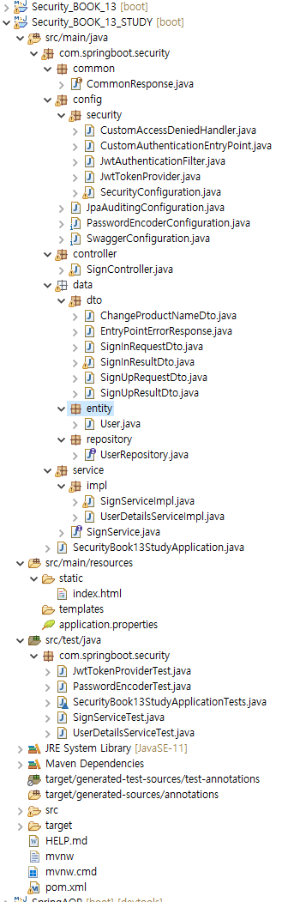
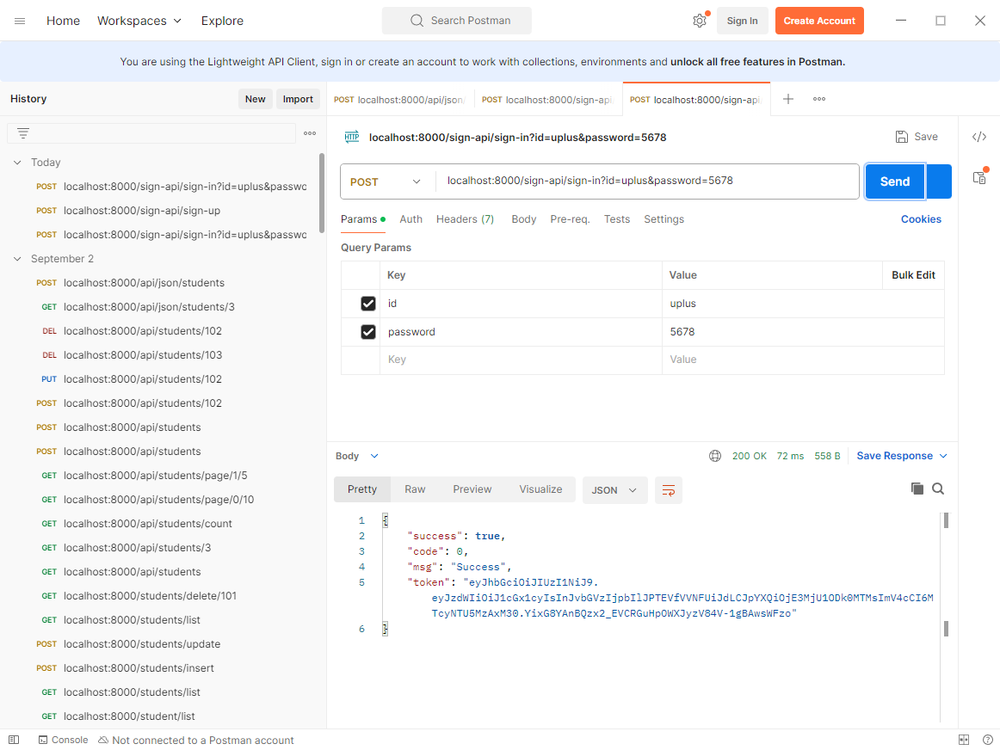
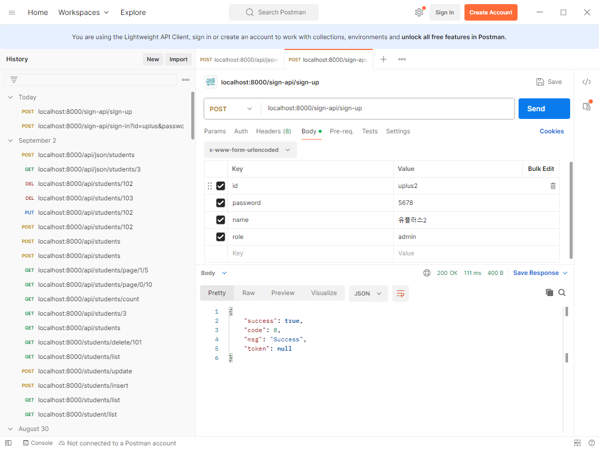
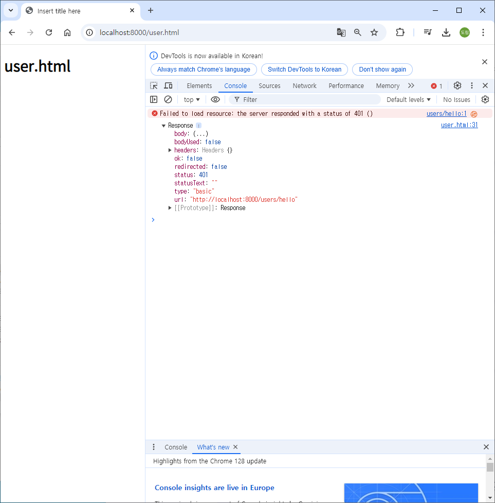
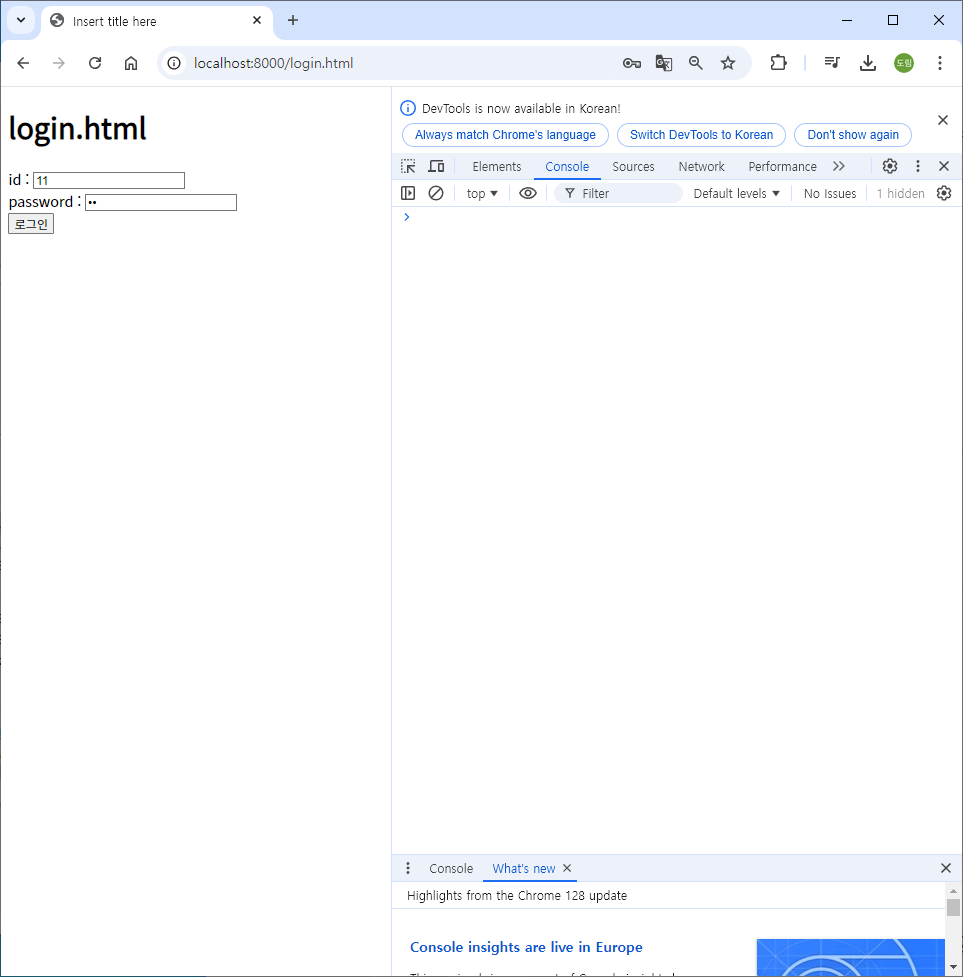
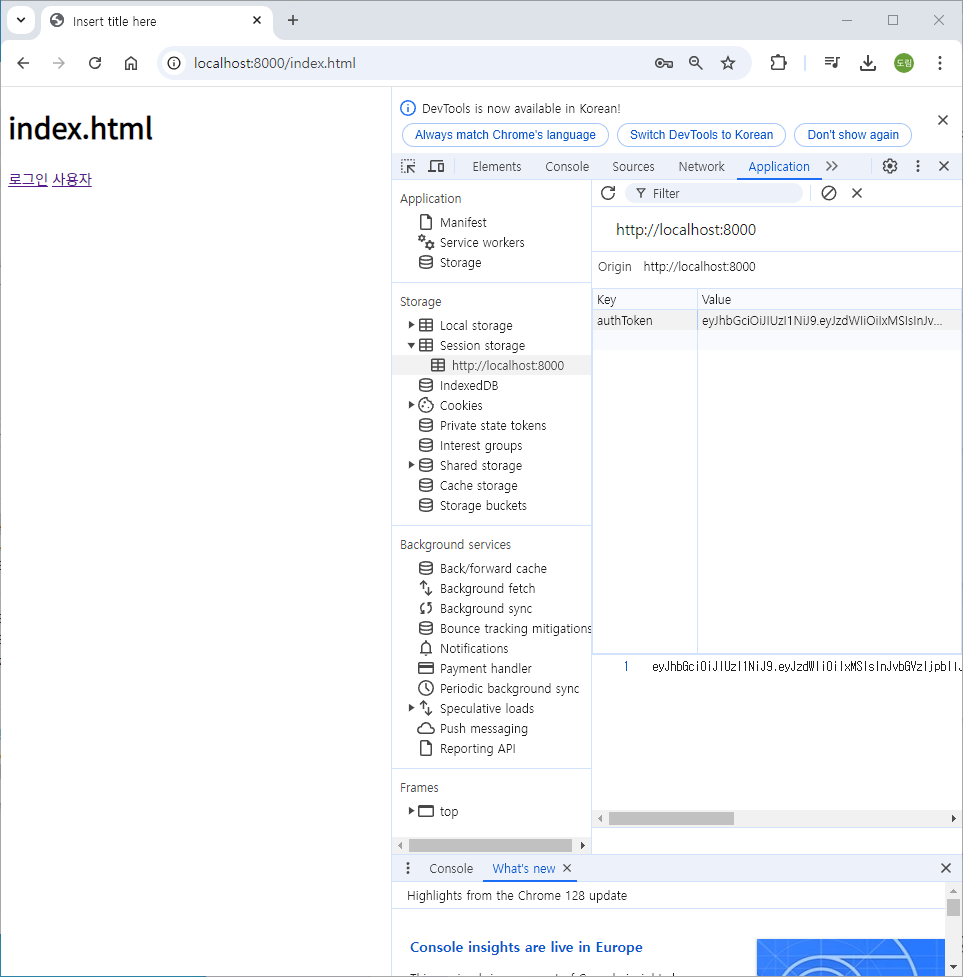
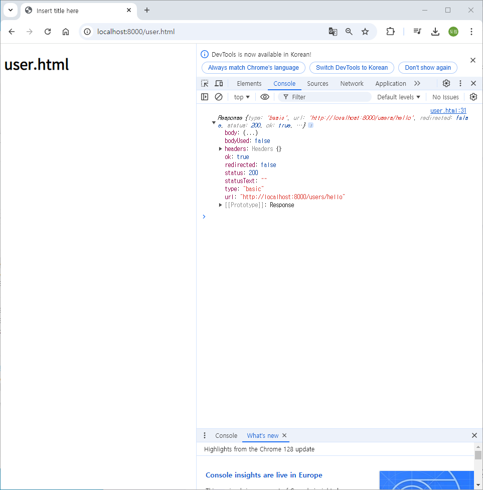

# [2024.09.06(금)] Spring Security


# Spring Security

## Security_BOOK_13_STUDY 프로젝트

### Security_BOOK_13_STUDY 프로젝트 설정

### src/main/java/com/springboot/security

- Security_BOOK_13 프로젝트에서 복사하여 붙여넣기
- product 제외 모두 가져오기
    
    
    

### userDetails/signUp/signIn Test 실습

### src/test/java/com/springboot/security

### UserDetailsServiceTest.java

```java
package com.springboot.security;

import static org.junit.jupiter.api.Assertions.assertNotNull;
import static org.junit.jupiter.api.Assertions.assertTrue;

import javax.transaction.Transactional;

import org.junit.jupiter.api.Test;
import org.springframework.beans.factory.annotation.Autowired;
import org.springframework.boot.test.context.SpringBootTest;
import org.springframework.security.core.userdetails.UserDetails;
import org.springframework.security.core.userdetails.UserDetailsService;
import org.springframework.security.crypto.password.PasswordEncoder;

import lombok.extern.slf4j.Slf4j;

@SpringBootTest
@Slf4j
@Transactional
public class UserDetailsServiceTest {

	@Autowired
    UserDetailsService userDetailsService;
    
    @Autowired
    PasswordEncoder passwordEncoder;
    
    @Test
    void testDI() {
        assertNotNull(userDetailsService);
    }
    
    @Test
    void testLoadUserByUsername() {
        String uId = "11";
        String password = "11";
        
        UserDetails userDetails = userDetailsService.loadUserByUsername(uId);
//      String encodedPassword = passwordEncoder.encode(password);

        log.info("userDetails username : {}", userDetails.getUsername());
        log.info("userDetails password : {}", userDetails.getPassword());
        log.info("userDetails roles : {}", userDetails.getAuthorities());
        
        assertTrue(passwordEncoder.matches(password, userDetails.getPassword()));
    }
    
	
}
```

### SignServiceTest.java

```java
package com.springboot.security;

import static org.junit.jupiter.api.Assertions.assertNotNull;

import org.junit.jupiter.api.Test;
import org.springframework.beans.factory.annotation.Autowired;
import org.springframework.boot.test.context.SpringBootTest;

import com.springboot.security.data.dto.SignInResultDto;
import com.springboot.security.data.dto.SignUpResultDto;
import com.springboot.security.service.SignService;

import lombok.extern.slf4j.Slf4j;

@SpringBootTest
@Slf4j
public class SignServiceTest {
	
	@Autowired
	SignService signService;
	
	@Test
	void testDI() {
		assertNotNull(signService);
	}

	@Test
	void signUp() {
		String id = "uplus1";
		String password = "5678";
		String name = "유플러스1";
		String role = "ROLE_UPLUS";
		
		SignUpResultDto signUpResultDto = signService.signUp(id, password, name, role);
		log.info("signResultDto : {}", signUpResultDto);
	}
	
	@Test
	void signIn() {
		String id = "uplus1";
		String password = "5678";
		
		SignInResultDto signInResultDto = signService.signIn(id, password);
		log.info("signResultDto : {}", signInResultDto.getToken());
	}
	
}
```

### 로그인

### API Test

- 로그인
    
    
    
- 회원가입
    
    
    

### html Test

### src/main/resources/static

### index.html

```java
<!DOCTYPE html>
<html>
<head>
<meta charset="UTF-8">
<link rel="icon" href="data:;base64,=">
<title>Insert title here</title>
</head>
<body>
	<h1>index.html</h1>
	<a href="/login.html">로그인</a> <a href="/user.html">사용자</a>
</body>
</html>
```

### login.html

```java
<!DOCTYPE html>
<html>
<head>
<meta charset="UTF-8">
<link rel="icon" href="data:;base64,=">
<title>Insert title here</title>
</head>
<body>
	<h1>login.html</h1>
	<div>
		id : <input type="text" name="id" id="id">
	</div>
	<div>
		password : <input type="password" name="password" id="password">
	</div>
	<button id="btnLogin">로그인</button>
	
	<script>
		window.onload = function() {
			document.querySelector("#btnLogin").onclick = login;
		}
		
		async function login() {
			// parameter, value
			let id = document.querySelector("#id").value;
			let password = document.querySelector("#password").value;
			
			console.log(id, password);
			
			let urlParams = new URLSearchParams({
//				id : id,
//				password : password
				// shorthand property
				id, password
			});
			
			// url
			let url = "/sign-api/sign-in";
			
			// post, parameter
			let fetchOptions = {
				method : "POST",
				body : urlParams
			}
			
			let response = await fetch(url, fetchOptions);
			let data = await response.json()
			
			console.log(data);
			
			if( data.success ) {
				sessionStorage.setItem("authToken", data.token);
				window.location.href = "/index.html";
			} else {
				alert("로그인 실패");
			}
			
		}
	</script>
</body>
</html>
```

### user.html

```java
<!DOCTYPE html>
<html>
<head>
<meta charset="UTF-8">
<link rel="icon" href="data:;base64,=">
<title>Insert title here</title>
</head>
<body>
	<h1>user.html</h1>
	
	<script>
		window.onload = getUser;
		
		async function getUser() {
			let authToken = sessionStorage.getItem("authToken");
			// authToken이 없을 경우 validation이 필요할 수 있다.
			
			// url
			let url = "/users/hello";
			
			// post, parameter
			let fetchOptions = {
				method : "GET",
				headers : {
					"X-AUTH-TOKEN" : authToken
				}
			}
			
			let response = await fetch(url, fetchOptions);
			
			console.log(response);
			
		}
	</script>
</body>
</html>
```

### src/main/java/com/springboot/security/config/security/SecurityConfiguration.java

```java
package com.springboot.security.config.security;

import org.springframework.beans.factory.annotation.Autowired;
import org.springframework.context.annotation.Configuration;
import org.springframework.http.HttpMethod;
import org.springframework.security.config.annotation.web.builders.HttpSecurity;
import org.springframework.security.config.annotation.web.builders.WebSecurity;
import org.springframework.security.config.annotation.web.configuration.WebSecurityConfigurerAdapter;
import org.springframework.security.config.http.SessionCreationPolicy;
import org.springframework.security.web.authentication.UsernamePasswordAuthenticationFilter;

/**
 * 어플리케이션의 보안 설정
 * 예제 13.19
 *
 * @author Flature
 * @version 1.0.0
 */
@Configuration
//@EnableWebSecurity // Spring Security에 대한 디버깅 모드를 사용하기 위한 어노테이션 (default : false)
public class SecurityConfiguration extends WebSecurityConfigurerAdapter {

    private final JwtTokenProvider jwtTokenProvider;

    @Autowired
    public SecurityConfiguration(JwtTokenProvider jwtTokenProvider) {
        this.jwtTokenProvider = jwtTokenProvider;
    }

    @Override
    protected void configure(HttpSecurity httpSecurity) throws Exception {
        httpSecurity.httpBasic().disable() // REST API는 UI를 사용하지 않으므로 기본설정을 비활성화

            .csrf().disable() // REST API는 csrf 보안이 필요 없으므로 비활성화

            .sessionManagement()
            .sessionCreationPolicy(
                SessionCreationPolicy.STATELESS) // JWT Token 인증방식으로 세션은 필요 없으므로 비활성화

            .and()
            .authorizeRequests() // 리퀘스트에 대한 사용권한 체크
            .antMatchers(
            		"/index.html",
            		"/login.html",
            		"/user.html",
            		"/sign-api/sign-in", 
            		"/sign-api/sign-up",
            		"/sign-api/exception").permitAll() // 가입 및 로그인 주소는 허용
            .antMatchers(HttpMethod.GET, "/product/**").permitAll() // product로 시작하는 Get 요청은 허용

            .antMatchers("**exception**").permitAll()

            .anyRequest().hasRole("USER") // 나머지 요청은 인증된 USER만 접근 가능  // ROLE_ prefix 자동 처리

            .and()
            .exceptionHandling().accessDeniedHandler(new CustomAccessDeniedHandler())
            .and()
            .exceptionHandling().authenticationEntryPoint(new CustomAuthenticationEntryPoint())

            .and()
            .addFilterBefore(new JwtAuthenticationFilter(jwtTokenProvider),
                UsernamePasswordAuthenticationFilter.class); // JWT Token 필터를 id/password 인증 필터 이전에 추가
    }

    /**
     * Swagger 페이지 접근에 대한 예외 처리
     *
     * @param webSecurity
     */
    @Override
    public void configure(WebSecurity webSecurity) {
        webSecurity.ignoring().antMatchers("/v2/api-docs", "/swagger-resources/**",
            "/swagger-ui.html", "/webjars/**", "/swagger/**", "/sign-api/exception");
    }
}
```

### src/main/java/com/springboot/security/controller/UserController.java

```java
package com.springboot.security.controller;

import org.springframework.web.bind.annotation.GetMapping;
import org.springframework.web.bind.annotation.RequestMapping;
import org.springframework.web.bind.annotation.RestController;

@RestController
@RequestMapping("/users")
public class UserController {
	
	@GetMapping("/hello")
	public String helloUser() {
		return "Hello, User!";
	}
	
}
```

### 실행 결과

- 로그인 안 한 경우 권한 없음 문제 (index.html에서 바로 user.html로 이동)
    
    
    
- 로그인한 경우 authToken 생성됨
    
    
    
    
    
    