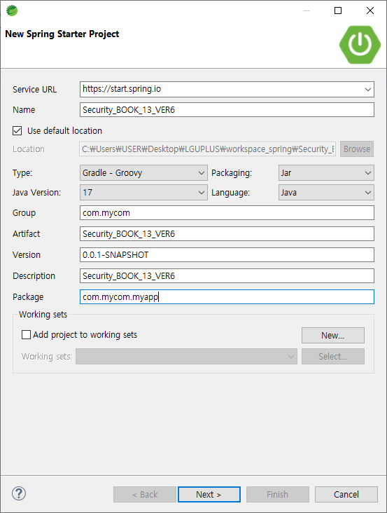
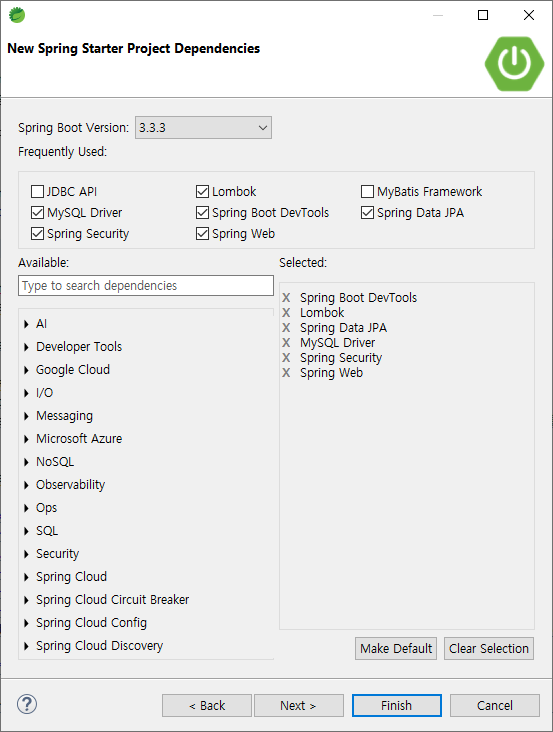
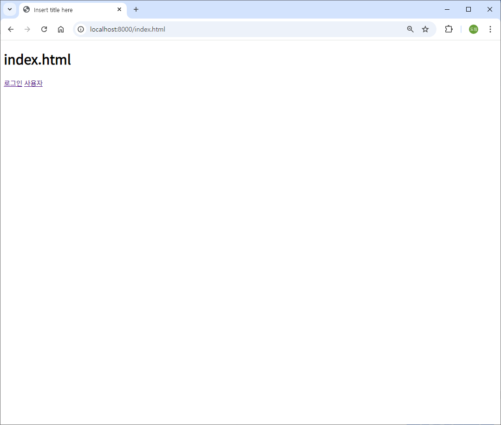
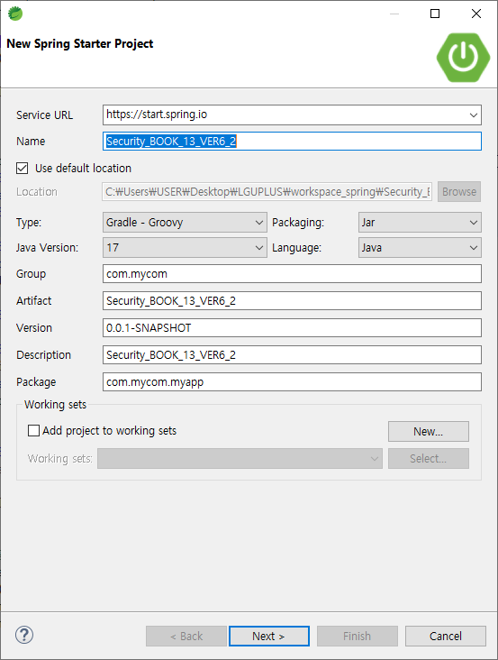
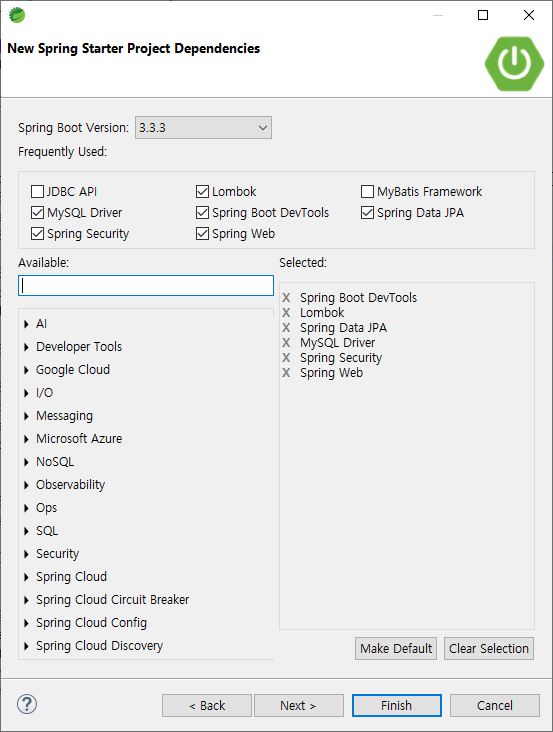

# [2024.09.10(화)] Spring Security version6


# Spring Security version6

## Security_BOOK_13_VER6 프로젝트

### Security_BOOK_13_VER6 프로젝트 생성





### Security_BOOK_13_VER6 프로젝트 설정

### application.properties

```java
spring.application.name=Security_BOOK_13_VER6
spring.datasource.driver-class-name=com.mysql.cj.jdbc.Driver
spring.datasource.url=jdbc:mysql://localhost:3306/basic_security
spring.datasource.username=root
spring.datasource.password=root

spring.jpa.show-sql=true
#spring.jpa.properties.hibernate.format_sql=true

## Security 관련 (예제 13.11)
springboot.jwt.secret=dskim_keydskim_keydskim_keydskim_keydskim_keydskim_keydskim_key

server.port=8000

logging.level.org.springframework.security=DEBUG
```

### build.gradle

```java
plugins {
	id 'java'
	id 'org.springframework.boot' version '3.3.3'
	id 'io.spring.dependency-management' version '1.1.6'
}

group = 'com.mycom'
version = '0.0.1-SNAPSHOT'

java {
	toolchain {
		languageVersion = JavaLanguageVersion.of(17)
	}
}

configurations {
	compileOnly {
		extendsFrom annotationProcessor
	}
}

repositories {
	mavenCentral()
}

dependencies {
	implementation 'org.springframework.boot:spring-boot-starter-data-jpa'
	implementation 'org.springframework.boot:spring-boot-starter-security'
	implementation 'org.springframework.boot:spring-boot-starter-web'
	compileOnly 'org.projectlombok:lombok'
	developmentOnly 'org.springframework.boot:spring-boot-devtools'
	runtimeOnly 'com.mysql:mysql-connector-j'
	annotationProcessor 'org.projectlombok:lombok'
	testImplementation 'org.springframework.boot:spring-boot-starter-test'
	testImplementation 'org.springframework.security:spring-security-test'
	testRuntimeOnly 'org.junit.platform:junit-platform-launcher'
	
	implementation 'io.jsonwebtoken:jjwt-api:0.12.3'
    implementation 'io.jsonwebtoken:jjwt-impl:0.12.3'
    implementation 'io.jsonwebtoken:jjwt-jackson:0.12.3'
// https://mvnrepository.com/artifact/org.springdoc/springdoc-openapi-starter-webmvc-ui
implementation group: 'org.springdoc', name: 'springdoc-openapi-starter-webmvc-ui', version: '2.6.0'
	
}

tasks.named('test') {
	useJUnitPlatform()
}
```

### src/main/java/com/mycom/myapp

- Security_BOOK_13_STUDY 프로젝트에서 common, config, controller, data, service 패키지 복사하여 붙여넣기
- SwaggerControllerConfiguration.java 삭제
- 모든 클래스 최상단 패키지 com.mycom.myapp으로 수정
- Security_BOOK_13_STUDY 프로젝트에서 src/main/resources/static 폴더에 있는 index.html, login.html, user.html 복사하여 붙여넣기

### 실행 테스트

- 프로젝트 서비스 실행 및 http://localhost:8000/index.html 접속 확인
    
    
    

### src/main/java/config/security

### JwtTokenProvider.java

```java
/*
 * JwtTokenProvider
 *
 * Version 1.0.0
 *
 * Date 21.10.24
 */

package com.mycom.myapp.config.security;

import java.nio.charset.StandardCharsets;
import java.util.Date;
import java.util.List;

import javax.crypto.SecretKey;
import javax.crypto.spec.SecretKeySpec;

import org.slf4j.Logger;
import org.slf4j.LoggerFactory;
import org.springframework.beans.factory.annotation.Value;
import org.springframework.security.authentication.UsernamePasswordAuthenticationToken;
import org.springframework.security.core.Authentication;
import org.springframework.security.core.userdetails.UserDetails;
import org.springframework.security.core.userdetails.UserDetailsService;
import org.springframework.stereotype.Component;

import io.jsonwebtoken.Claims;
import io.jsonwebtoken.Jws;
import io.jsonwebtoken.Jwts;
import io.jsonwebtoken.SignatureAlgorithm;
import jakarta.annotation.PostConstruct;
import jakarta.servlet.http.HttpServletRequest;
import lombok.RequiredArgsConstructor;

/**
 * JWT 토큰을 생성하고 유효성을 검증하는 컴포넌트 클래스 JWT 는 여러 암호화 알고리즘을 제공하고 알고리즘과 비밀키를 가지고 토큰을 생성
 * <p>
 * claim 정보에는 토큰에 부가적으로 정보를 추가할 수 있음 claim 정보에 회원을 구분할 수 있는 값을 세팅하였다가 토큰이 들어오면 해당 값으로 회원을 구분하여 리소스
 * 제공
 * <p>
 * JWT 토큰에 expire time을 설정할 수 있음
 */

// secretKey : String 대신 SecretKey type으로 변경
@Component
@RequiredArgsConstructor
public class JwtTokenProvider {

    private final Logger LOGGER = LoggerFactory.getLogger(JwtTokenProvider.class);
    private final UserDetailsService userDetailsService; // Spring Security 에서 제공하는 서비스 레이어

    @Value("${springboot.jwt.secret}")
    private String secretKeyStr = "secretKey";
    private final long tokenValidMillisecond = 1000L * 60 * 60; // 1시간 토큰 유효

    /**
     * SecretKey 에 대해 인코딩 수행
     * 예제 13.11
     */
    
    private SecretKey secretKey;
    
    @PostConstruct
    protected void init() {
        LOGGER.info("[init] JwtTokenProvider 내 secretKey 초기화 시작");
        System.out.println(secretKeyStr);
//        secretKey = Base64.getEncoder().encodeToString(secretKey.getBytes(StandardCharsets.UTF_8));
        secretKey = new SecretKeySpec(secretKeyStr.getBytes(StandardCharsets.UTF_8), Jwts.SIG.HS256.key().build().getAlgorithm());
        System.out.println(secretKey);
        LOGGER.info("[init] JwtTokenProvider 내 secretKey 초기화 완료");
    }

    // 예제 13.12
    // JWT 토큰 생성
    public String createToken(String userUid, List<String> roles) {
        LOGGER.info("[createToken] 토큰 생성 시작");
//        Claims claims = Jwts.claims().setSubject(userUid);
//        claims.put("roles", roles);
//
//        Date now = new Date();
//        String token = Jwts.builder()
//            .setClaims(claims)
//            .setIssuedAt(now)
//            .setExpiration(new Date(now.getTime() + tokenValidMillisecond))
//            .signWith(SignatureAlgorithm.HS256, secretKey) // 암호화 알고리즘, secret 값 세팅
//            .compact();
        
        Date now = new Date();
        String token = Jwts.builder()
                .subject(userUid)
                .claim("roles", roles)
                .issuedAt(now)
                .expiration(new Date(now.getTime() + tokenValidMillisecond))
                .signWith(secretKey, Jwts.SIG.HS256)
                .compact();  

        LOGGER.info("[createToken] 토큰 생성 완료");
        return token;
    }

    // 예제 13.13
    // JWT 토큰으로 인증 정보 조회
    public Authentication getAuthentication(String token) {
        LOGGER.info("[getAuthentication] 토큰 인증 정보 조회 시작");
        UserDetails userDetails = userDetailsService.loadUserByUsername(this.getUsername(token));
        LOGGER.info("[getAuthentication] 토큰 인증 정보 조회 완료, UserDetails UserName : {}",
            userDetails.getUsername());
        return new UsernamePasswordAuthenticationToken(userDetails, "",
            userDetails.getAuthorities());
    }

    // 예제 13.14
    // JWT 토큰에서 회원 구별 정보 추출
    public String getUsername(String token) {
        LOGGER.info("[getUsername] 토큰 기반 회원 구별 정보 추출");
//        String info = Jwts.parser().verifyWith(secretKey).parseClaimsJws(token).getBody()
//            .getSubject();
        
        String info = Jwts.parser()
                .verifyWith(secretKey)
                .build()
                .parseSignedClaims(token).getPayload()
                .getSubject();  
        
        LOGGER.info("[getUsername] 토큰 기반 회원 구별 정보 추출 완료, info : {}", info);
        return info;
    }

    // 예제 13.15
    /**
     * HTTP Request Header 에 설정된 토큰 값을 가져옴
     *
     * @param request Http Request Header
     * @return String type Token 값
     */
    public String resolveToken(HttpServletRequest request) {
        LOGGER.info("[resolveToken] HTTP 헤더에서 Token 값 추출");
        return request.getHeader("X-AUTH-TOKEN");
    }

    // 예제 13.16
    // JWT 토큰의 유효성 + 만료일 체크
    public boolean validateToken(String token) {
        LOGGER.info("[validateToken] 토큰 유효 체크 시작");
        try {
//            Jws<Claims> claims = Jwts.parser().setSigningKey(secretKey).parseClaimsJws(token);
//            LOGGER.info("[validateToken] 토큰 유효 체크 완료");
//            return !claims.getBody().getExpiration().before(new Date());
        	
        	return ! Jwts.parser()
                    .verifyWith(secretKey)
                    .build()
                    .parseSignedClaims(token).getPayload()
                    .getExpiration().before(new Date()); 
        	
        } catch (Exception e) {
            LOGGER.info("[validateToken] 토큰 유효 체크 예외 발생");
            return false;
        }
    }
}
```

### SecurityConfiguration.java

```java
package com.mycom.myapp.config.security;

import org.springframework.context.annotation.Bean;
import org.springframework.context.annotation.Configuration;
import org.springframework.security.config.annotation.web.builders.HttpSecurity;
import org.springframework.security.config.annotation.web.builders.WebSecurity;
import org.springframework.security.config.http.SessionCreationPolicy;
import org.springframework.security.web.SecurityFilterChain;
import org.springframework.security.web.authentication.UsernamePasswordAuthenticationFilter;

/**
 * 어플리케이션의 보안 설정
 * 예제 13.19
 *
 * @author Flature
 * @version 1.0.0
 */
@Configuration
//@EnableWebSecurity // Spring Security에 대한 디버깅 모드를 사용하기 위한 어노테이션 (default : false)
public class SecurityConfiguration {

    private final JwtTokenProvider jwtTokenProvider;

    public SecurityConfiguration(JwtTokenProvider jwtTokenProvider) {
        this.jwtTokenProvider = jwtTokenProvider;
    }

    @Bean
    SecurityFilterChain securityFilterChain(HttpSecurity http) throws Exception {
        http
            // Disable basic HTTP and CSRF
            .httpBasic(httpBasic -> httpBasic.disable())
            .formLogin(formLogin -> formLogin.disable())
            .csrf(csrf -> csrf.disable())
            .sessionManagement(session -> session.sessionCreationPolicy(SessionCreationPolicy.STATELESS))
            // Authorization requests
            .authorizeHttpRequests(authorize -> authorize
                // Permit access to specific URLs
                .requestMatchers(
                        "/sign-api/sign-in", // login 요청 허락
                        "/sign-api/sign-up", 
                        "/sign-api/exception",
                        "/v3/api-docs/**", 
                        "/swagger-resources/**",
                        "/swagger-ui.html", 
                        "/swagger-ui/**",
                        "/webjars/**", 
                        "/swagger/**", 
                        "/sign-api/exception",
                        "**exception**",
                        "/index.html",
                        "/favicon.ico", // 넣어도 계속 에러 <link rel="icon" href="data:;base64,="> 를 붙이자 일단.
                        "/login.html",
                        "/user.html", // 페이지는 허락, data 는 허락 X
                        "/register.html"
                ).permitAll()
                // Restrict other requests to ADMIN role
                // java.lang.IllegalArgumentException: ROLE_USER should not start with ROLE_ 
                // since ROLE_ is automatically prepended when using hasAnyRole
                .anyRequest().hasRole("USER")
            )
            // Custom exception handling
            .exceptionHandling(exception -> exception
                .accessDeniedHandler(new CustomAccessDeniedHandler())
                .authenticationEntryPoint(new CustomAuthenticationEntryPoint())
            )
            // Add JWT filter before UsernamePasswordAuthenticationFilter
            .addFilterBefore(new JwtAuthenticationFilter(jwtTokenProvider), UsernamePasswordAuthenticationFilter.class);
        return http.build();
    }
    
}
```

### src/main/java/controller/SignController.java

```java
package com.mycom.myapp.controller;

import java.util.HashMap;
import java.util.Map;

import org.slf4j.Logger;
import org.slf4j.LoggerFactory;
import org.springframework.beans.factory.annotation.Autowired;
import org.springframework.http.HttpHeaders;
import org.springframework.http.HttpStatus;
import org.springframework.http.ResponseEntity;
import org.springframework.web.bind.annotation.ExceptionHandler;
import org.springframework.web.bind.annotation.GetMapping;
import org.springframework.web.bind.annotation.PostMapping;
import org.springframework.web.bind.annotation.RequestMapping;
import org.springframework.web.bind.annotation.RequestParam;
import org.springframework.web.bind.annotation.RestController;

import com.mycom.myapp.data.dto.SignInResultDto;
import com.mycom.myapp.data.dto.SignUpResultDto;
import com.mycom.myapp.service.SignService;

// 예제 13.28
@RestController
@RequestMapping("/sign-api")
public class SignController {

    private final Logger LOGGER = LoggerFactory.getLogger(SignController.class);
    private final SignService signService;

    @Autowired
    public SignController(SignService signService) {
        this.signService = signService;
    }

    @PostMapping(value = "/sign-in")
    public SignInResultDto signIn(
        @RequestParam("id") String id,
        @RequestParam("password") String password)
        throws RuntimeException {
        LOGGER.info("[signIn] 로그인을 시도하고 있습니다. id : {}, pw : ****", id);
        SignInResultDto signInResultDto = signService.signIn(id, password);

        if (signInResultDto.getCode() == 0) {
            LOGGER.info("[signIn] 정상적으로 로그인되었습니다. id : {}, token : {}", id,
                signInResultDto.getToken());
        }
        return signInResultDto;
    }

    @PostMapping(value = "/sign-up")
    public SignUpResultDto signUp(
        @RequestParam("id") String id,
        @RequestParam("password") String password,
        @RequestParam("name") String name,
        @RequestParam("role") String role) {
        LOGGER.info("[signUp] 회원가입을 수행합니다. id : {}, password : ****, name : {}, role : {}", id,
            name, role);
        SignUpResultDto signUpResultDto = signService.signUp(id, password, name, role);

        LOGGER.info("[signUp] 회원가입을 완료했습니다. id : {}", id);
        return signUpResultDto;
    }

    @GetMapping(value = "/exception")
    public void exceptionTest() throws RuntimeException {
        throw new RuntimeException("접근이 금지되었습니다.");
    }

    @ExceptionHandler(value = RuntimeException.class)
    public ResponseEntity<Map<String, String>> ExceptionHandler(RuntimeException e) {
        HttpHeaders responseHeaders = new HttpHeaders();
        //responseHeaders.add(HttpHeaders.CONTENT_TYPE, "application/json");
        HttpStatus httpStatus = HttpStatus.BAD_REQUEST;

        LOGGER.error("ExceptionHandler 호출, {}, {}", e.getCause(), e.getMessage());

        Map<String, String> map = new HashMap<>();
        map.put("error type", httpStatus.getReasonPhrase());
        map.put("code", "400");
        map.put("message", "에러 발생");

        return new ResponseEntity<>(map, responseHeaders, httpStatus);
    }

}
```

## Security_BOOK_13_VER6_2 프로젝트

### Security_BOOK_13_VER6_2 프로젝트 생성





### Security_BOOK_13_VER6_2  프로젝트 설정

### application.properties

```java
spring.application.name=Security_BOOK_13_VER6_2
spring.datasource.driver-class-name=com.mysql.cj.jdbc.Driver
spring.datasource.url=jdbc:mysql://localhost:3306/basic_security
spring.datasource.username=root
spring.datasource.password=root

spring.jpa.show-sql=true
#spring.jpa.properties.hibernate.format_sql=true

## Security 관련 (예제 13.11)
springboot.jwt.secret=dskim_keydskim_keydskim_keydskim_keydskim_keydskim_keydskim_key

server.port=8000

logging.level.org.springframework.security=DEBUG
```

### build.gradle

```java
plugins {
	id 'java'
	id 'org.springframework.boot' version '3.3.3'
	id 'io.spring.dependency-management' version '1.1.6'
}

group = 'com.mycom'
version = '0.0.1-SNAPSHOT'

java {
	toolchain {
		languageVersion = JavaLanguageVersion.of(17)
	}
}

configurations {
	compileOnly {
		extendsFrom annotationProcessor
	}
}

repositories {
	mavenCentral()
}

dependencies {
	implementation 'org.springframework.boot:spring-boot-starter-data-jpa'
	implementation 'org.springframework.boot:spring-boot-starter-security'
	implementation 'org.springframework.boot:spring-boot-starter-web'
	compileOnly 'org.projectlombok:lombok'
	developmentOnly 'org.springframework.boot:spring-boot-devtools'
	runtimeOnly 'com.mysql:mysql-connector-j'
	annotationProcessor 'org.projectlombok:lombok'
	testImplementation 'org.springframework.boot:spring-boot-starter-test'
	testImplementation 'org.springframework.security:spring-security-test'
	testRuntimeOnly 'org.junit.platform:junit-platform-launcher'
	
	implementation 'io.jsonwebtoken:jjwt-api:0.12.3'
    implementation 'io.jsonwebtoken:jjwt-impl:0.12.3'
    implementation 'io.jsonwebtoken:jjwt-jackson:0.12.3'
// https://mvnrepository.com/artifact/org.springdoc/springdoc-openapi-starter-webmvc-ui
implementation group: 'org.springdoc', name: 'springdoc-openapi-starter-webmvc-ui', version: '2.6.0'
	
}

tasks.named('test') {
	useJUnitPlatform()
}
```

### src/main/java/com/mycom/myapp

- Security_BOOK_13_VER6 프로젝트에서 common, config, controller, data, service 패키지 복사하여 붙여넣기
- Security_BOOK_13_VER6 프로젝트에서 src/main/resources/static 폴더에 있는 index.html, login.html, user.html 복사하여 붙여넣기

### 실행 테스트

- 프로젝트 서비스 실행 및 http://localhost:8000/index.html 접속 확인
    
    
    

### src/main/java/controller/SignController.java

```java
package com.mycom.myapp.controller;

import java.util.HashMap;
import java.util.Map;

import org.slf4j.Logger;
import org.slf4j.LoggerFactory;
import org.springframework.beans.factory.annotation.Autowired;
import org.springframework.http.HttpHeaders;
import org.springframework.http.HttpStatus;
import org.springframework.http.ResponseEntity;
import org.springframework.web.bind.annotation.ExceptionHandler;
import org.springframework.web.bind.annotation.GetMapping;
import org.springframework.web.bind.annotation.PostMapping;
import org.springframework.web.bind.annotation.RequestMapping;
import org.springframework.web.bind.annotation.RequestParam;
import org.springframework.web.bind.annotation.RestController;

import com.mycom.myapp.data.dto.SignInResultDto;
import com.mycom.myapp.data.dto.SignUpResultDto;
import com.mycom.myapp.service.SignService;

// 예제 13.28
@RestController
@RequestMapping("/sign-api")
public class SignController {

    private final Logger LOGGER = LoggerFactory.getLogger(SignController.class);
    private final SignService signService;

    @Autowired
    public SignController(SignService signService) {
        this.signService = signService;
    }

    @PostMapping(value = "/sign-in")
    public SignInResultDto signIn(
        @RequestParam("id") String id,
        @RequestParam("password") String password)
        throws RuntimeException {
        LOGGER.info("[signIn] 로그인을 시도하고 있습니다. id : {}, pw : ****", id);
        SignInResultDto signInResultDto = signService.signIn(id, password);

        if (signInResultDto.getCode() == 0) {
            LOGGER.info("[signIn] 정상적으로 로그인되었습니다. id : {}, token : {}", id,
                signInResultDto.getToken());
        }
        return signInResultDto;
    }

    @PostMapping(value = "/sign-up")
    public SignUpResultDto signUp(
        @RequestParam("id") String id,
        @RequestParam("password") String password,
        @RequestParam("name") String name,
        @RequestParam("role") String role) {
        LOGGER.info("[signUp] 회원가입을 수행합니다. id : {}, password : ****, name : {}, role : {}", id,
            name, role);
        SignUpResultDto signUpResultDto = signService.signUp(id, password, name, role);

        LOGGER.info("[signUp] 회원가입을 완료했습니다. id : {}", id);
        return signUpResultDto;
    }

    @GetMapping(value = "/exception")
    public void exceptionTest() throws RuntimeException {
        throw new RuntimeException("접근이 금지되었습니다.");
    }

    @ExceptionHandler(value = RuntimeException.class)
    public ResponseEntity<Map<String, String>> ExceptionHandler(RuntimeException e) {
        HttpHeaders responseHeaders = new HttpHeaders();
        //responseHeaders.add(HttpHeaders.CONTENT_TYPE, "application/json");
        HttpStatus httpStatus = HttpStatus.BAD_REQUEST;

        LOGGER.error("ExceptionHandler 호출, {}, {}", e.getCause(), e.getMessage());

        Map<String, String> map = new HashMap<>();
        map.put("error type", httpStatus.getReasonPhrase());
        map.put("code", "400");
        map.put("message", "에러 발생");

        return new ResponseEntity<>(map, responseHeaders, httpStatus);
    }

}
```

### JwtAuthenticationFilter.java에서 유효성 확인 시마다 DB접근하지 않아도 가능하도록 수정

### src/main/java/config/security

### JwtAuthenticationFilter.java

```java
package com.mycom.myapp.config.security;

import java.io.IOException;
import java.util.List;
import java.util.stream.Collectors;

import javax.crypto.SecretKey;

import org.slf4j.Logger;
import org.slf4j.LoggerFactory;
import org.springframework.security.authentication.UsernamePasswordAuthenticationToken;
import org.springframework.security.core.authority.SimpleGrantedAuthority;
import org.springframework.security.core.context.SecurityContextHolder;
import org.springframework.security.web.authentication.WebAuthenticationDetailsSource;
import org.springframework.web.filter.OncePerRequestFilter;

import io.jsonwebtoken.Jwts;
import jakarta.servlet.FilterChain;
import jakarta.servlet.ServletException;
import jakarta.servlet.http.HttpServletRequest;
import jakarta.servlet.http.HttpServletResponse;

// 예제 13.17
public class JwtAuthenticationFilter extends OncePerRequestFilter {

    private final Logger LOGGER = LoggerFactory.getLogger(JwtAuthenticationFilter.class);
    private final JwtTokenProvider jwtTokenProvider;

    public JwtAuthenticationFilter(JwtTokenProvider jwtTokenProvider) {
        this.jwtTokenProvider = jwtTokenProvider;
    }

    @Override
    protected void doFilterInternal(HttpServletRequest servletRequest,
        HttpServletResponse servletResponse,
        FilterChain filterChain) throws ServletException, IOException {
        String token = jwtTokenProvider.resolveToken(servletRequest);
        LOGGER.info("[doFilterInternal] token 값 추출 완료. token : {}", token);

        LOGGER.info("[doFilterInternal] token 값 유효성 체크 시작");
        if (token != null && jwtTokenProvider.validateToken(token)) {
//            Authentication authentication = jwtTokenProvider.getAuthentication(token);
//            SecurityContextHolder.getContext().setAuthentication(authentication);
//            LOGGER.info("[doFilterInternal] token 값 유효성 체크 완료");
        	
        	//DB를 이용해서 Authentication 객체를 획득
        	// => 비효율적
        	// => UsernamePasswordAuthenticationToken

        	SecretKey secretKey = jwtTokenProvider.getSecretKey();
            
            String username = Jwts.parser()
                    .verifyWith(secretKey)
                    .build()
                    .parseSignedClaims(token).getPayload()
                    .getSubject(); // token 생성시 subject 에 userId 저장
            
            List<?> roles = (List<?>) Jwts.parser() // String
                    .verifyWith(secretKey)
                    .build()
                    .parseSignedClaims(token).getPayload().get("roles");
            
            List<SimpleGrantedAuthority> authorities = roles.stream()
                    .map(authority -> new SimpleGrantedAuthority((String)authority)) // String
                    .collect(Collectors.toList());
            
            // UserDetails 를 구현한 
            UsernamePasswordAuthenticationToken authenticationToken = new UsernamePasswordAuthenticationToken(
                    username, null, authorities);
            // to associate additional information about the request with the Authentication object
            authenticationToken.setDetails(new WebAuthenticationDetailsSource().buildDetails(servletRequest));
            SecurityContextHolder.getContext().setAuthentication(authenticationToken); 
        	
        }

        filterChain.doFilter(servletRequest, servletResponse);
    }
}
```

### JwtTokenProvider.java

```java
/*
 * JwtTokenProvider
 *
 * Version 1.0.0
 *
 * Date 21.10.24
 */

package com.mycom.myapp.config.security;

import java.nio.charset.StandardCharsets;
import java.util.Date;
import java.util.List;

import javax.crypto.SecretKey;
import javax.crypto.spec.SecretKeySpec;

import org.slf4j.Logger;
import org.slf4j.LoggerFactory;
import org.springframework.beans.factory.annotation.Value;
import org.springframework.security.authentication.UsernamePasswordAuthenticationToken;
import org.springframework.security.core.Authentication;
import org.springframework.security.core.userdetails.UserDetails;
import org.springframework.security.core.userdetails.UserDetailsService;
import org.springframework.stereotype.Component;

import io.jsonwebtoken.Claims;
import io.jsonwebtoken.Jws;
import io.jsonwebtoken.Jwts;
import io.jsonwebtoken.SignatureAlgorithm;
import jakarta.annotation.PostConstruct;
import jakarta.servlet.http.HttpServletRequest;
import lombok.Getter;
import lombok.RequiredArgsConstructor;

/**
 * JWT 토큰을 생성하고 유효성을 검증하는 컴포넌트 클래스 JWT 는 여러 암호화 알고리즘을 제공하고 알고리즘과 비밀키를 가지고 토큰을 생성
 * <p>
 * claim 정보에는 토큰에 부가적으로 정보를 추가할 수 있음 claim 정보에 회원을 구분할 수 있는 값을 세팅하였다가 토큰이 들어오면 해당 값으로 회원을 구분하여 리소스
 * 제공
 * <p>
 * JWT 토큰에 expire time을 설정할 수 있음
 */

// secretKey : String 대신 SecretKey type으로 변경
@Component
@RequiredArgsConstructor
@Getter
public class JwtTokenProvider {

    private final Logger LOGGER = LoggerFactory.getLogger(JwtTokenProvider.class);
    private final UserDetailsService userDetailsService; // Spring Security 에서 제공하는 서비스 레이어

    @Value("${springboot.jwt.secret}")
    private String secretKeyStr = "secretKey";
    private final long tokenValidMillisecond = 1000L * 60 * 60; // 1시간 토큰 유효

    /**
     * SecretKey 에 대해 인코딩 수행
     * 예제 13.11
     */
    
    private SecretKey secretKey;
    
    @PostConstruct
    protected void init() {
        LOGGER.info("[init] JwtTokenProvider 내 secretKey 초기화 시작");
        System.out.println(secretKeyStr);
//        secretKey = Base64.getEncoder().encodeToString(secretKey.getBytes(StandardCharsets.UTF_8));
        secretKey = new SecretKeySpec(secretKeyStr.getBytes(StandardCharsets.UTF_8), Jwts.SIG.HS256.key().build().getAlgorithm());
        System.out.println(secretKey);
        LOGGER.info("[init] JwtTokenProvider 내 secretKey 초기화 완료");
    }

    // 예제 13.12
    // JWT 토큰 생성
    public String createToken(String userUid, List<String> roles) {
        LOGGER.info("[createToken] 토큰 생성 시작");
//        Claims claims = Jwts.claims().setSubject(userUid);
//        claims.put("roles", roles);
//
//        Date now = new Date();
//        String token = Jwts.builder()
//            .setClaims(claims)
//            .setIssuedAt(now)
//            .setExpiration(new Date(now.getTime() + tokenValidMillisecond))
//            .signWith(SignatureAlgorithm.HS256, secretKey) // 암호화 알고리즘, secret 값 세팅
//            .compact();
        
        Date now = new Date();
        String token = Jwts.builder()
                .subject(userUid)
                .claim("roles", roles)
                .issuedAt(now)
                .expiration(new Date(now.getTime() + tokenValidMillisecond))
                .signWith(secretKey, Jwts.SIG.HS256)
                .compact();  

        LOGGER.info("[createToken] 토큰 생성 완료");
        return token;
    }

    // 예제 13.13
    // JWT 토큰으로 인증 정보 조회
    public Authentication getAuthentication(String token) {
        LOGGER.info("[getAuthentication] 토큰 인증 정보 조회 시작");
        UserDetails userDetails = userDetailsService.loadUserByUsername(this.getUsername(token));
        LOGGER.info("[getAuthentication] 토큰 인증 정보 조회 완료, UserDetails UserName : {}",
            userDetails.getUsername());
        return new UsernamePasswordAuthenticationToken(userDetails, "",
            userDetails.getAuthorities());
    }

    // 예제 13.14
    // JWT 토큰에서 회원 구별 정보 추출
    public String getUsername(String token) {
        LOGGER.info("[getUsername] 토큰 기반 회원 구별 정보 추출");
//        String info = Jwts.parser().verifyWith(secretKey).parseClaimsJws(token).getBody()
//            .getSubject();
        
        String info = Jwts.parser()
                .verifyWith(secretKey)
                .build()
                .parseSignedClaims(token).getPayload()
                .getSubject();  
        
        LOGGER.info("[getUsername] 토큰 기반 회원 구별 정보 추출 완료, info : {}", info);
        return info;
    }

    // 예제 13.15
    /**
     * HTTP Request Header 에 설정된 토큰 값을 가져옴
     *
     * @param request Http Request Header
     * @return String type Token 값
     */
    public String resolveToken(HttpServletRequest request) {
        LOGGER.info("[resolveToken] HTTP 헤더에서 Token 값 추출");
        return request.getHeader("X-AUTH-TOKEN");
    }

    // 예제 13.16
    // JWT 토큰의 유효성 + 만료일 체크
    public boolean validateToken(String token) {
        LOGGER.info("[validateToken] 토큰 유효 체크 시작");
        try {
//            Jws<Claims> claims = Jwts.parser().setSigningKey(secretKey).parseClaimsJws(token);
//            LOGGER.info("[validateToken] 토큰 유효 체크 완료");
//            return !claims.getBody().getExpiration().before(new Date());
        	
        	return ! Jwts.parser()
                    .verifyWith(secretKey)
                    .build()
                    .parseSignedClaims(token).getPayload()
                    .getExpiration().before(new Date()); 
        	
        } catch (Exception e) {
            LOGGER.info("[validateToken] 토큰 유효 체크 예외 발생");
            return false;
        }
    }
}
```

### SignServiceImple.java에서 AuthenticationManager를 사용한다.

### src/main/java

### config/security/SecurityConfiguration.java

```java
package com.mycom.myapp.config.security;

import org.springframework.context.annotation.Bean;
import org.springframework.context.annotation.Configuration;
import org.springframework.security.authentication.AuthenticationManager;
import org.springframework.security.config.annotation.authentication.configuration.AuthenticationConfiguration;
import org.springframework.security.config.annotation.web.builders.HttpSecurity;
import org.springframework.security.config.http.SessionCreationPolicy;
import org.springframework.security.web.SecurityFilterChain;
import org.springframework.security.web.authentication.UsernamePasswordAuthenticationFilter;

/**
 * 어플리케이션의 보안 설정
 * 예제 13.19
 *
 * @author Flature
 * @version 1.0.0
 */
@Configuration
//@EnableWebSecurity // Spring Security에 대한 디버깅 모드를 사용하기 위한 어노테이션 (default : false)
public class SecurityConfiguration {

    private final JwtTokenProvider jwtTokenProvider;

    public SecurityConfiguration(JwtTokenProvider jwtTokenProvider) {
        this.jwtTokenProvider = jwtTokenProvider;
    }

    @Bean
    SecurityFilterChain securityFilterChain(HttpSecurity http) throws Exception {
        http
            // Disable basic HTTP and CSRF
            .httpBasic(httpBasic -> httpBasic.disable())
            .formLogin(formLogin -> formLogin.disable())
            .csrf(csrf -> csrf.disable())
            .sessionManagement(session -> session.sessionCreationPolicy(SessionCreationPolicy.STATELESS))
            // Authorization requests
            .authorizeHttpRequests(authorize -> authorize
                // Permit access to specific URLs
                .requestMatchers(
                        "/sign-api/sign-in", // login 요청 허락
                        "/sign-api/sign-up", 
                        "/sign-api/exception",
                        "/v3/api-docs/**", 
                        "/swagger-resources/**",
                        "/swagger-ui.html", 
                        "/swagger-ui/**",
                        "/webjars/**", 
                        "/swagger/**", 
                        "/sign-api/exception",
                        "**exception**",
                        "/index.html",
                        "/favicon.ico", // 넣어도 계속 에러 <link rel="icon" href="data:;base64,="> 를 붙이자 일단.
                        "/login.html",
                        "/user.html", // 페이지는 허락, data 는 허락 X
                        "/register.html"
                ).permitAll()
                // Restrict other requests to ADMIN role
                // java.lang.IllegalArgumentException: ROLE_USER should not start with ROLE_ 
                // since ROLE_ is automatically prepended when using hasAnyRole
                .anyRequest().hasRole("USER")
            )
            // Custom exception handling
            .exceptionHandling(exception -> exception
                .accessDeniedHandler(new CustomAccessDeniedHandler())
                .authenticationEntryPoint(new CustomAuthenticationEntryPoint())
            )
            // Add JWT filter before UsernamePasswordAuthenticationFilter
            .addFilterBefore(new JwtAuthenticationFilter(jwtTokenProvider), UsernamePasswordAuthenticationFilter.class);
        return http.build();
    }
    
    @Bean
    AuthenticationManager authenticationManager(AuthenticationConfiguration authenticationConfiguration) throws Exception {
        return authenticationConfiguration.getAuthenticationManager();
    }
    
}
```

### service/impl/SignServiceImpl.java

```java
package com.mycom.myapp.service.impl;

import java.util.Collections;
import java.util.List;

import org.slf4j.Logger;
import org.slf4j.LoggerFactory;
import org.springframework.beans.factory.annotation.Autowired;
import org.springframework.security.authentication.AuthenticationManager;
import org.springframework.security.authentication.UsernamePasswordAuthenticationToken;
import org.springframework.security.core.Authentication;
import org.springframework.security.core.GrantedAuthority;
import org.springframework.security.crypto.password.PasswordEncoder;
import org.springframework.stereotype.Service;

import com.mycom.myapp.common.CommonResponse;
import com.mycom.myapp.config.security.JwtTokenProvider;
import com.mycom.myapp.data.dto.SignInResultDto;
import com.mycom.myapp.data.dto.SignUpResultDto;
import com.mycom.myapp.data.entity.User;
import com.mycom.myapp.data.repository.UserRepository;
import com.mycom.myapp.service.SignService;

// 예제 13.25
@Service
public class SignServiceImpl implements SignService {

    private final Logger LOGGER = LoggerFactory.getLogger(SignServiceImpl.class);

    public UserRepository userRepository;
    public JwtTokenProvider jwtTokenProvider;
    public PasswordEncoder passwordEncoder;

    @Autowired
    public SignServiceImpl(UserRepository userRepository, JwtTokenProvider jwtTokenProvider,
        PasswordEncoder passwordEncoder) {
        this.userRepository = userRepository;
        this.jwtTokenProvider = jwtTokenProvider;
        this.passwordEncoder = passwordEncoder;
    }

    @Override
    public SignUpResultDto signUp(String id, String password, String name, String role) {
        LOGGER.info("[getSignUpResult] 회원 가입 정보 전달");
        User user;
        if (role.equalsIgnoreCase("admin")) {
            user = User.builder()
                .uid(id)
                .name(name)
                .password(passwordEncoder.encode(password))
                .roles(Collections.singletonList("ROLE_ADMIN"))
                .build();
        } else {
            user = User.builder()
                .uid(id)
                .name(name)
                .password(passwordEncoder.encode(password))
                .roles(Collections.singletonList("ROLE_USER"))
                .build();
        }

        User savedUser = userRepository.save(user);
        SignUpResultDto signUpResultDto = new SignInResultDto();

        LOGGER.info("[getSignUpResult] userEntity 값이 들어왔는지 확인 후 결과값 주입");
        if (!savedUser.getName().isEmpty()) {
            LOGGER.info("[getSignUpResult] 정상 처리 완료");
            setSuccessResult(signUpResultDto);
        } else {
            LOGGER.info("[getSignUpResult] 실패 처리 완료");
            setFailResult(signUpResultDto);
        }
        return signUpResultDto;
    }
    
    @Autowired
    private AuthenticationManager authenticationManager;

    @Override
    public SignInResultDto signIn(String id, String password) throws RuntimeException {
//        User user = userRepository.getByUid(id);
//
//        if (!passwordEncoder.matches(password, user.getPassword())) {
//            throw new RuntimeException();
//        }
    	
    	SignInResultDto signInResultDto;
    	try {
    		Authentication authentication = authenticationManager.authenticate(
    				new UsernamePasswordAuthenticationToken(id, password)
    		);
    		
    		String username = authentication.getName();
            List<String> roles = authentication.getAuthorities().stream()
                    .map(GrantedAuthority::getAuthority).toList();
            
            signInResultDto = SignInResultDto.builder()
                      .token(jwtTokenProvider.createToken(
                              String.valueOf(username),
                              roles
                              )
                        )
                      .build();  
            setSuccessResult(signInResultDto); 
    		
    	} catch (Exception e) {
    		throw new RuntimeException();
    	}

//        SignInResultDto signInResultDto = SignInResultDto.builder()
//            .token(jwtTokenProvider.createToken(String.valueOf(user.getUid()),
//                user.getRoles()))
//            .build();

//        setSuccessResult(signInResultDto);

        return signInResultDto;
    }

    // 결과 모델에 api 요청 성공 데이터를 세팅해주는 메소드
    private void setSuccessResult(SignUpResultDto result) {
        result.setSuccess(true);
        result.setCode(CommonResponse.SUCCESS.getCode());
        result.setMsg(CommonResponse.SUCCESS.getMsg());
    }

    // 결과 모델에 api 요청 실패 데이터를 세팅해주는 메소드
    private void setFailResult(SignUpResultDto result) {
        result.setSuccess(false);
        result.setCode(CommonResponse.FAIL.getCode());
        result.setMsg(CommonResponse.FAIL.getMsg());
    }
}
```

### Spring Security 버전 5와 6의 차이점

### 1. Spring Security 버전 5와 6의 차이점

- **변경된 API**: Spring Security 6에서는 일부 API가 변경되었으며, Deprecated된 메서드들이 삭제되었습니다. 특히 HTTP 보안 설정과 관련된 방법이 `HttpSecurity` 빌더의 변화로 더 현대화되었습니다.
- **보안 정책 강화**: Spring Security 6에서는 보안이 강화된 설정들이 기본으로 적용되어 있어 더 안전한 디폴트 설정을 사용하게 됩니다.
- **필터 체인 설정**: `SecurityFilterChain`과 같은 새로운 설정 방식이 기본으로 사용되며, `WebSecurityConfigurerAdapter`는 더 이상 사용되지 않습니다.
- **JDK 버전 요구사항**: Spring Security 6은 JDK 17 이상에서 동작하며, 하위 JDK를 지원하지 않습니다.

### 2. `JwtAuthenticationFilter.java`에서 DB 접근 최소화

- 기존에는 `validateToken()` 메서드에서 토큰이 유효할 때마다 `Authentication` 객체를 생성하기 위해 `DB`를 조회했습니다.
- 수정된 방식에서는 `JWT` 토큰에서 필요한 정보(예: `username`, `roles`)를 파싱하여 직접 `UsernamePasswordAuthenticationToken` 객체를 생성합니다.
- `JWT`에 담긴 정보를 활용해 DB 접근을 줄이는 방식은 효율적이며, 성능 향상에 도움이 됩니다.

### 3. `JwtAuthenticationFilter.java` 파일 설명

- `JwtAuthenticationFilter`는 매 요청마다 JWT 토큰을 확인하여 인증된 사용자인지 확인합니다.
- `doFilterInternal` 메서드에서는 JWT 토큰의 유효성을 검사하고, 유효한 경우 토큰에서 `username`과 `roles`를 추출하여 `UsernamePasswordAuthenticationToken` 객체를 생성합니다.
- `SecurityContextHolder.getContext().setAuthentication(authenticationToken);`을 통해 인증된 상태로 설정합니다.
- 이 방식은 데이터베이스를 불필요하게 접근하지 않도록 하여 성능을 최적화합니다.

### 4. `JwtTokenProvider.java` 파일 설명

- `JwtTokenProvider`는 JWT 토큰을 생성하고, 유효성을 검사하며, JWT 토큰에서 필요한 정보를 추출하는 역할을 합니다.
- `createToken()` 메서드는 사용자 정보를 바탕으로 JWT 토큰을 생성합니다.
- `getAuthentication()` 메서드는 JWT 토큰에서 추출한 사용자 정보를 기반으로 인증 객체를 생성합니다.
- `validateToken()` 메서드는 토큰의 유효성을 검사하여 만료 여부를 확인합니다.

### 5. `SecurityConfiguration.java` 파일 설명

- `SecurityConfiguration` 클래스는 Spring Security의 전반적인 보안 설정을 담당합니다.
- `securityFilterChain` 메서드는 HTTP 보안 설정을 정의하며, JWT 인증 필터를 `UsernamePasswordAuthenticationFilter` 전에 추가합니다.
- 세션 관리는 `STATELESS`로 설정하여, 서버가 세션을 관리하지 않고 JWT를 통한 인증만 수행합니다.

### 6. `SignServiceImpl.java` 파일 설명

- `SignServiceImpl` 클래스는 로그인과 회원가입 로직을 구현합니다.
- `signIn()` 메서드는 `AuthenticationManager`를 사용하여 사용자의 인증을 처리하며, 인증 성공 시 `JwtTokenProvider`를 이용해 JWT 토큰을 생성합니다.
- 이 방식은 `UsernamePasswordAuthenticationToken`을 사용해 사용자의 인증 정보를 담고, 인증이 성공하면 JWT 토큰을 반환하여 클라이언트가 이후 요청 시 사용할 수 있도록 합니다.